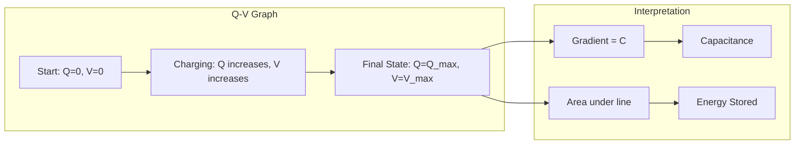

---
# 1. Overview / 概述

**English:**
This sub-topic focuses on the graphical method for determining the energy stored in a capacitor. Instead of relying solely on algebraic formulas, we can calculate the energy by finding the area under the graph of Charge ($Q$) against Potential Difference ($V$). This approach provides a powerful visual and conceptual link between the electrical properties of a capacitor and the work done to charge it. Understanding this area is crucial for grasping why the energy stored is $\frac{1}{2}QV$ and not $QV$, and it forms a key part of the broader topic [[Energy Stored in a Capacitor]].

**中文:**
本子知识点专注于通过图形方法确定电容器中储存的能量。我们不是仅仅依赖代数公式，而是通过计算电荷 ($Q$) 与电势差 ($V$) 关系曲线下的面积来求能量。这种方法在电容器的电学特性与充电所做的功之间建立了强大的视觉和概念联系。理解这个面积对于掌握为什么储存的能量是 $\frac{1}{2}QV$ 而不是 $QV$ 至关重要，并且它是更广泛的 [[Energy Stored in a Capacitor]] 主题的关键部分。

---

# 2. Syllabus Learning Objectives / 考纲学习目标

| CAIE 9702 | Edexcel IAL |
|-----------|-------------|
| 19.2 (a) Recall and use $E = \frac{1}{2}QV$ and $E = \frac{1}{2}CV^2$ | 4.6 Use the equation $W = \frac{1}{2}QV$ |
| 19.2 (b) Derive the formula for energy stored from the area under a Q-V graph | 4.7 Derive the formula for energy stored from the area under a Q-V graph |
| 19.2 (c) Use the area under a Q-V graph to determine the energy stored | 4.8 Use the area under a Q-V graph to determine the energy stored |

**Examiner Expectations / 考官期望:**
- **English:** You must be able to explain *why* the area under a Q-V graph represents energy. You should be able to calculate this area (usually a triangle or trapezium) and use it to derive the energy equations. You must also be able to interpret a Q-V graph for a capacitor being charged.
- **中文:** 你必须能够解释*为什么* Q-V 图下的面积代表能量。你应该能够计算这个面积（通常是一个三角形或梯形）并用它来推导能量方程。你还必须能够解释电容器充电时的 Q-V 图。

---

# 3. Core Definitions / 核心定义

| Term (EN/CN) | Definition (EN) | Definition (CN) | Common Mistakes / 常见错误 |
|--------------|-----------------|-----------------|---------------------------|
| **Work Done** / 做功 | The energy transferred when a charge is moved through a potential difference. For a capacitor, it's the total energy supplied by the battery to charge it. | 电荷在电势差作用下移动时转移的能量。对于电容器，它是电池为充电提供的总能量。 | Confusing work done with power. |
| **Area Under Graph** / 图线下面积 | The integral of the function represented by the graph. For a Q-V graph, the area represents the total work done (energy stored). | 图线所表示函数的积分。对于 Q-V 图，面积代表所做的总功（储存的能量）。 | Forgetting that the area is a triangle, not a rectangle. |
| **Energy Stored ($E$ or $W$)** / 储存的能量 | The electrical potential energy held in the electric field between the capacitor plates. | 储存在电容器极板间电场中的电势能。 | Thinking the energy is $QV$ instead of $\frac{1}{2}QV$. |
| **Linear Relationship** / 线性关系 | The direct proportionality between charge ($Q$) and potential difference ($V$) for a capacitor with constant capacitance ($C$), i.e., $Q = CV$. | 对于具有恒定电容 ($C$) 的电容器，电荷 ($Q$) 与电势差 ($V$) 之间的正比关系，即 $Q = CV$。 | Assuming the graph is a curve for a simple charging process. |

---

# 4. Key Concepts Explained / 关键概念详解

## 4.1 Work Done to Charge a Capacitor / 给电容器充电所做的功

### Explanation / 解释
**English:**
Charging a capacitor is not an instantaneous process. To add a small amount of charge $\Delta Q$ to the plates, work must be done against the repulsive force of the charges already present. The work done $\Delta W$ to add this charge is given by $\Delta W = V \times \Delta Q$, where $V$ is the instantaneous potential difference across the capacitor. As more charge is added, $V$ increases linearly (since $V = Q/C$). Therefore, the total work done is the sum of all these small $\Delta W$ values, which is exactly the area under the $Q$-$V$ graph. This area is a triangle (for a linear capacitor), leading to the formula $W = \frac{1}{2} QV$.

**中文:**
给电容器充电不是一个瞬时过程。要将少量电荷 $\Delta Q$ 添加到极板上，必须克服已经存在的电荷的排斥力做功。添加这些电荷所做的功 $\Delta W$ 由 $\Delta W = V \times \Delta Q$ 给出，其中 $V$ 是电容器两端的瞬时电势差。随着更多电荷的添加，$V$ 线性增加（因为 $V = Q/C$）。因此，所做的总功是所有小的 $\Delta W$ 值的总和，这正好是 $Q$-$V$ 图下的面积。这个面积是一个三角形（对于线性电容器），从而推导出公式 $W = \frac{1}{2} QV$。

### Physical Meaning / 物理意义
**English:**
The area under the Q-V graph physically represents the total energy transferred from the power supply to the capacitor's electric field. It is the work done by the battery to separate the charges and establish the electric field.

**中文:**
Q-V 图下的面积在物理上代表了从电源转移到电容器电场中的总能量。这是电池为分离电荷并建立电场所做的功。

### Common Misconceptions / 常见误区
- **Misconception:** The energy stored is $QV$ (the area of the rectangle).
  - **Correction:** The energy is $\frac{1}{2}QV$ because the voltage is not constant during charging; it starts at 0 and rises to the final value. The average voltage is $V/2$.
- **Misconception:** The area under a V-Q graph is different.
  - **Correction:** It is the same graph; the axes are just swapped. The area under a V-Q graph also represents energy, but it's a different shape. The Q-V graph is standard.

### Exam Tips / 考试提示
- **English:** Always state that the area under the Q-V graph represents the work done/energy stored. When deriving the formula, explicitly mention that the graph is a straight line through the origin, so the area is a triangle.
- **中文:** 始终说明 Q-V 图下的面积代表所做的功/储存的能量。在推导公式时，明确提到该图是一条通过原点的直线，因此面积是一个三角形。

> 📷 **IMAGE PROMPT — DIAGRAM-01: Work Done to Charge a Capacitor**
> A diagram showing a capacitor being charged by a battery. A small charge $\Delta Q$ is being added to the top plate. The instantaneous voltage across the capacitor is $V$. An arrow indicates the work done $\Delta W = V \Delta Q$ to add this charge. The graph beside it shows a Q-V graph with a small rectangular strip of height $V$ and width $\Delta Q$ shaded to represent $\Delta W$.

---

# 5. Essential Equations / 核心公式

## Equation 1: Work Done for a Small Charge / 添加小量电荷所做的功

$$ \Delta W = V \Delta Q $$

| Symbol (符号) | Meaning (EN) | Meaning (CN) | Unit (单位) |
|--------------|-------------|-------------|------------|
| $\Delta W$ | Work done to add a small charge | 添加小量电荷所做的功 | J (Joule) |
| $V$ | Instantaneous p.d. across capacitor | 电容器两端的瞬时电势差 | V (Volt) |
| $\Delta Q$ | Small amount of charge added | 添加的小量电荷 | C (Coulomb) |

**Derivation / 推导:** This comes from the definition of potential difference: work done per unit charge ($V = W/Q$).
**Conditions / 适用条件:** This is a general equation for moving charge through a potential difference.
**Limitations / 局限性:** It assumes $V$ is constant during the addition of $\Delta Q$, which is a good approximation for very small $\Delta Q$.

## Equation 2: Total Energy Stored (from area) / 总储存能量（从面积推导）

$$ W = \frac{1}{2} QV $$

| Symbol (符号) | Meaning (EN) | Meaning (CN) | Unit (单位) |
|--------------|-------------|-------------|------------|
| $W$ | Total energy stored in the capacitor | 电容器中储存的总能量 | J (Joule) |
| $Q$ | Final charge on the capacitor | 电容器上的最终电荷 | C (Coulomb) |
| $V$ | Final potential difference across the capacitor | 电容器两端的最终电势差 | V (Volt) |

**Derivation / 推导:**
1.  The total work done $W$ is the sum of all $\Delta W$ values.
2.  This sum is the area under the $Q$-$V$ graph.
3.  For a capacitor, $Q \propto V$, so the graph is a straight line through the origin.
4.  The area under this line is a triangle: $W = \frac{1}{2} \times \text{base} \times \text{height} = \frac{1}{2} \times Q \times V$.
**Conditions / 适用条件:** This formula is valid for any capacitor where the capacitance $C$ is constant (linear capacitor).
**Limitations / 局限性:** It does not apply to non-linear capacitors where the Q-V graph is not a straight line.

> 📷 **IMAGE PROMPT — DIAGRAM-02: Derivation of Energy from Q-V Graph**
> A clear Q-V graph for a capacitor. The axes are labelled "Charge, Q / C" and "p.d., V / V". The graph is a straight line from the origin to a point (Q, V). The triangular area under the line is shaded. The formula $W = \frac{1}{2} QV$ is written next to the triangle.

---

# 6. Graphs and Relationships / 图表与关系

## 6.1 The Q-V Graph for a Capacitor / 电容器的 Q-V 图

### Axes / 坐标轴 (EN+CN)
- **X-axis:** Potential Difference, $V$ / V (Volts) / 电势差, $V$ / V (伏特)
- **Y-axis:** Charge, $Q$ / C (Coulombs) / 电荷, $Q$ / C (库仑)

### Shape / 形状 (EN+CN)
- **English:** A straight line passing through the origin. The gradient of this line is the capacitance, $C = Q/V$.
- **中文:** 一条通过原点的直线。该直线的斜率是电容，$C = Q/V$。

### Gradient Meaning / 斜率含义 (EN+CN)
- **English:** The gradient of the Q-V graph is the **capacitance** ($C$) of the capacitor. A steeper line means a larger capacitance.
- **中文:** Q-V 图的斜率是电容器的**电容** ($C$)。线越陡，电容越大。

### Area Meaning / 面积含义 (EN+CN)
- **English:** The area under the Q-V graph represents the **energy stored** ($W$) in the capacitor.
- **中文:** Q-V 图下的面积代表电容器中**储存的能量** ($W$)。

### Exam Interpretation / 考试解读 (EN+CN)
- **English:** You may be asked to calculate the energy stored from a graph. You will need to find the area of the triangle. If the graph is not a perfect triangle (e.g., for a discharging capacitor), you may need to count squares or use a trapezium rule.
- **中文:** 你可能会被要求从图表中计算储存的能量。你需要找到三角形的面积。如果图表不是一个完美的三角形（例如，对于放电的电容器），你可能需要数方格或使用梯形法则。



---

# 7. Required Diagrams / 必备图表

## 7.1 The Q-V Graph for a Charging Capacitor / 充电电容器的 Q-V 图

### Description / 描述 (EN+CN)
- **English:** A graph with Charge ($Q$) on the y-axis and Potential Difference ($V$) on the x-axis. It shows a straight line from the origin (0,0) to a point ($Q_f, V_f$). The triangular area under the line is shaded and labelled "Energy Stored = $\frac{1}{2} Q_f V_f$".
- **中文:** 一个以电荷 ($Q$) 为 y 轴、电势差 ($V$) 为 x 轴的图表。它显示一条从原点 (0,0) 到点 ($Q_f, V_f$) 的直线。线下的三角形区域被阴影覆盖，并标注为“储存的能量 = $\frac{1}{2} Q_f V_f$”。

### Image Prompt / 图片生成提示
> 📷 **IMAGE PROMPT — DIAGRAM-03: Q-V Graph for a Capacitor**
> A physics textbook-style diagram. A graph with "Charge, Q / C" on the y-axis and "Potential Difference, V / V" on the x-axis. A straight line with a positive slope starts at the origin (0,0) and ends at a point labelled (V_f, Q_f). The triangular area under the line is shaded in light blue. The text "Energy Stored = 1/2 Q_f V_f" is written inside the triangle. The gradient of the line is labelled "C = Q/V".

### Labels Required / 需要标注 (EN+CN)
- **Axes:** Charge, Q / C (电荷, Q / C); Potential Difference, V / V (电势差, V / V)
- **Point:** (V_f, Q_f) (最终电势差, 最终电荷)
- **Area:** Energy Stored = $\frac{1}{2} Q_f V_f$ (储存的能量)
- **Gradient:** Capacitance, C = Q/V (电容, C = Q/V)

### Exam Importance / 考试重要性 (EN+CN)
- **English:** This is the most important diagram for this sub-topic. You must be able to draw, label, and interpret it. It is the foundation for deriving the energy storage formula.
- **中文:** 这是本子知识点最重要的图表。你必须能够绘制、标注和解释它。它是推导能量存储公式的基础。

---

# 8. Worked Examples / 典型例题

## Example 1: Calculating Energy from a Q-V Graph / 从 Q-V 图计算能量

### Question / 题目
**English:**
A capacitor is charged to a potential difference of 12 V. The charge stored is 60 mC. Calculate the energy stored in the capacitor.
**中文:**
一个电容器被充电到 12 V 的电势差。储存的电荷是 60 mC。计算电容器中储存的能量。

### Solution / 解答
**Step 1:** Identify the known values.
$V = 12 \text{ V}$
$Q = 60 \text{ mC} = 60 \times 10^{-3} \text{ C} = 0.060 \text{ C}$

**Step 2:** Recall that the energy stored is the area under the Q-V graph. For a capacitor, this is a triangle.
$W = \frac{1}{2} QV$

**Step 3:** Substitute the values.
$W = \frac{1}{2} \times (0.060) \times (12)$

**Step 4:** Calculate the answer.
$W = \frac{1}{2} \times 0.72$
$W = 0.36 \text{ J}$

### Final Answer / 最终答案
**Answer:** 0.36 J | **答案：** 0.36 J

### Quick Tip / 提示
(EN+CN)
- **English:** Always convert charge to Coulombs (C) before using the formula. Remember that 1 mC = $10^{-3}$ C.
- **中文:** 在使用公式前，务必将电荷单位转换为库仑 (C)。记住 1 mC = $10^{-3}$ C。

---

# 9. Past Paper Question Types / 历年真题题型

| Question Type / 题型 | Frequency / 频率 | Difficulty / 难度 | Past Paper References / 真题索引 |
|----------------------|------------------|------------------|-------------------------------|
| Derivation of $W = \frac{1}{2} QV$ from Q-V graph | High | Easy | 📝 *待填入* |
| Calculation of energy stored using $W = \frac{1}{2} QV$ | High | Easy | 📝 *待填入* |
| Interpretation of a Q-V graph (finding C or W) | Medium | Medium | 📝 *待填入* |
| Comparing energy stored for different capacitors | Low | Medium | 📝 *待填入* |

**Common Command Words / 常见指令词:**
- **Derive / 推导:** Show the steps to obtain a formula from a graph.
- **Calculate / 计算:** Use a formula to find a numerical value.
- **Determine / 确定:** Find a value, often from a graph.
- **State / 陈述:** Write down a fact or formula without explanation.

---

# 10. Practical Skills Connections / 实验技能链接

**English:**
In the practical exam, you might be asked to:
1.  **Plot a Q-V graph:** You would charge a capacitor to different voltages, measure the charge using a coulombmeter, and plot the results.
2.  **Determine Capacitance:** Calculate the gradient of the Q-V graph to find the capacitance.
3.  **Determine Energy Stored:** Calculate the area under the Q-V graph to find the energy stored for a specific voltage.
4.  **Analyse Uncertainties:** The uncertainty in the energy stored would come from the uncertainties in the charge and voltage measurements. You might need to draw error bars and worst-fit lines.

**中文:**
在实验考试中，你可能会被要求：
1.  **绘制 Q-V 图：** 将电容器充电到不同电压，使用库仑计测量电荷，并绘制结果。
2.  **确定电容：** 计算 Q-V 图的斜率以找到电容。
3.  **确定储存的能量：** 计算 Q-V 图下的面积，以找到特定电压下储存的能量。
4.  **分析不确定度：** 储存能量的不确定度来自电荷和电压测量的不确定度。你可能需要绘制误差棒和最拟合线。

---

# 11. Concept Map / 概念图谱

```mermaid
graph TD
    subgraph "Core Concept: Area Under Q-V Graph"
        A[Q-V Graph] --> B[Straight Line through Origin];
        B --> C[Gradient = Capacitance (C)];
        B --> D[Area Under Graph = Energy Stored (W)];
    end

    subgraph "Derivation"
        D --> E[Area of Triangle = 1/2 * base * height];
        E --> F[W = 1/2 * Q * V];
        F --> G[Substitute Q = CV];
        G --> H[W = 1/2 * C * V^2];
        F --> I[Substitute V = Q/C];
        I --> J[W = 1/2 * Q^2 / C];
    end

    subgraph "Related Concepts"
        K[[Capacitance and Capacitors]] --> A;
        L[[Energy Stored in a Capacitor]] --> D;
        M[[Charging and Discharging Capacitors]] --> A;
        N[[Energy Density in Electric Fields]] --> H;
    end

    subgraph "Practical Skills"
        O[Plotting Q-V Graph] --> A;
        P[Calculating Area] --> D;
    end
```

---

# 12. Quick Revision Sheet / 速查表

| Category / 类别 | Key Points / 要点 |
|----------------|------------------|
| **Definition / 定义** | The area under a Q-V graph represents the **work done** to charge the capacitor, which is equal to the **energy stored** in its electric field. / Q-V 图下的面积代表给电容器充电所做的**功**，等于其电场中**储存的能量**。 |
| **Key Formula / 核心公式** | $W = \frac{1}{2} QV$ (from area of triangle) / $W = \frac{1}{2} QV$ (来自三角形面积) |
| **Key Graph / 核心图表** | A straight line through the origin. Gradient = Capacitance ($C$). Area = Energy ($W$). / 一条通过原点的直线。斜率 = 电容 ($C$)。面积 = 能量 ($W$)。 |
| **Exam Tip / 考试提示** | Always state that the graph is a straight line, so the area is a triangle. Convert all units to SI (Coulombs, Volts) before calculating. / 始终说明该图是一条直线，因此面积是一个三角形。在计算前将所有单位转换为 SI 单位（库仑、伏特）。 |