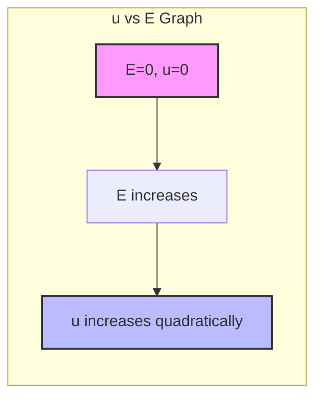
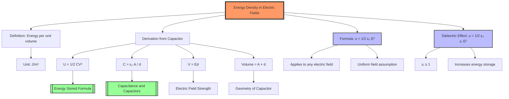

---
# Energy Density in Electric Fields / 电场中的能量密度

---

# 1. Overview / 概述

**English:**
This sub-topic explores the concept of **energy density** — the amount of energy stored per unit volume within an electric field. Building on the idea that a [[Capacitance and Capacitors|capacitor]] stores energy, we now ask: *Where is that energy actually located?* The answer lies in the electric field itself. This leads to the derivation of the energy density formula $u = \frac{1}{2} \varepsilon_0 E^2$ for a vacuum (or $u = \frac{1}{2} \varepsilon_0 \varepsilon_r E^2$ for a dielectric), which is a powerful and general result applicable to any electric field, not just those in capacitors. This concept is a crucial link between [[Energy Stored in a Capacitor]] and broader field theory, and it is essential for understanding the energy associated with [[Charging and Discharging Capacitors|charging and discharging processes]].

**中文:**
本子知识点探讨**能量密度**的概念——即电场中单位体积内储存的能量。基于[[Capacitance and Capacitors|电容器]]储存能量的概念，我们进一步追问：*能量究竟储存在哪里？* 答案在于电场本身。由此推导出真空中的能量密度公式 $u = \frac{1}{2} \varepsilon_0 E^2$（或含电介质时 $u = \frac{1}{2} \varepsilon_0 \varepsilon_r E^2$），这是一个强大且通用的结论，适用于任何电场，而不仅限于电容器内部。这个概念是连接[[Energy Stored in a Capacitor]]与更广泛场论的关键桥梁，对于理解[[Charging and Discharging Capacitors|充放电过程]]相关的能量至关重要。

---

# 2. Syllabus Learning Objectives / 考纲学习目标

| CAIE 9702 | Edexcel IAL |
|-----------|-------------|
| 19.2 (a) Derive and use the formula for energy stored in a capacitor. | 4.6 Understand the concept of energy density in an electric field. |
| 19.2 (b) Derive and use the formula for energy density in an electric field. | 4.7 Derive and use the formula $u = \frac{1}{2} \varepsilon_0 E^2$ for the energy density in a vacuum. |
| 19.2 (c) Apply the concept of energy density to a parallel-plate capacitor. | 4.8 Apply the concept of energy density to a parallel-plate capacitor with a dielectric. |

**Examiner Expectations / 考官期望:**
- **CAIE:** Students must be able to derive the energy density formula from the energy stored in a parallel-plate capacitor and the volume of the field. They should also be able to use it in calculations.
- **Edexcel:** Students must understand the physical meaning of energy density, derive the formula, and apply it to both vacuum and dielectric-filled capacitors. They should be able to relate it to the [[Energy Stored Formula]].

---

# 3. Core Definitions / 核心定义

| Term (EN/CN) | Definition (EN) | Definition (CN) | Common Mistakes / 常见错误 |
|--------------|-----------------|-----------------|---------------------------|
| **Energy Density** / 能量密度 | The amount of energy stored per unit volume in an electric field. | 电场中单位体积内储存的能量。 | Confusing energy density ($J/m^3$) with total energy ($J$) or electric field strength ($N/C$). |
| **Electric Field Strength (E)** / 电场强度 | The force per unit positive charge experienced by a test charge at a point in the field. | 在电场中某点，单位正电荷所受的力。 | Forgetting that $E$ is a vector; in energy density calculations, we use the magnitude $E$. |
| **Permittivity of Free Space ($\varepsilon_0$)** / 真空介电常数 | A fundamental physical constant that describes how an electric field affects and is affected by a vacuum. | 描述电场在真空中如何被影响和影响的基本物理常数。 | Using the wrong value ($8.85 \times 10^{-12} \, F/m$). |
| **Relative Permittivity ($\varepsilon_r$)** / 相对介电常数 | The ratio of the permittivity of a material to the permittivity of free space. | 材料介电常数与真空介电常数之比。 | Forgetting that $\varepsilon_r$ is dimensionless and $\ge 1$. |
| **Dielectric** / 电介质 | An insulating material placed between the plates of a capacitor to increase capacitance and energy storage. | 放置在电容器极板之间的绝缘材料，用于增加电容和能量储存。 | Thinking a dielectric *creates* energy; it allows more energy to be stored for the same voltage. |

---

# 4. Key Concepts Explained / 关键概念详解

## 4.1 Derivation of Energy Density / 能量密度的推导

### Explanation / 解释
**English:**
The energy stored in a [[Capacitance and Capacitors|parallel-plate capacitor]] is given by $U = \frac{1}{2} CV^2$. For a parallel-plate capacitor, $C = \frac{\varepsilon_0 A}{d}$ and $V = Ed$. Substituting these into the energy formula:

$$ U = \frac{1}{2} \left( \frac{\varepsilon_0 A}{d} \right) (Ed)^2 = \frac{1}{2} \varepsilon_0 E^2 (A d) $$

The volume of the electric field between the plates is $V_{ol} = A d$. Therefore, the energy density $u$ (energy per unit volume) is:

$$ u = \frac{U}{V_{ol}} = \frac{\frac{1}{2} \varepsilon_0 E^2 (A d)}{A d} = \frac{1}{2} \varepsilon_0 E^2 $$

This derivation shows that the energy is stored in the electric field itself, not on the plates. For a dielectric-filled capacitor, replace $\varepsilon_0$ with $\varepsilon_0 \varepsilon_r$:

$$ u = \frac{1}{2} \varepsilon_0 \varepsilon_r E^2 $$

**中文:**
[[Capacitance and Capacitors|平行板电容器]]储存的能量由 $U = \frac{1}{2} CV^2$ 给出。对于平行板电容器，$C = \frac{\varepsilon_0 A}{d}$ 且 $V = Ed$。将这些代入能量公式：

$$ U = \frac{1}{2} \left( \frac{\varepsilon_0 A}{d} \right) (Ed)^2 = \frac{1}{2} \varepsilon_0 E^2 (A d) $$

两极板间电场的体积为 $V_{ol} = A d$。因此，能量密度 $u$（单位体积的能量）为：

$$ u = \frac{U}{V_{ol}} = \frac{\frac{1}{2} \varepsilon_0 E^2 (A d)}{A d} = \frac{1}{2} \varepsilon_0 E^2 $$

这个推导表明，能量储存在电场本身，而不是在极板上。对于填充电介质的电容器，将 $\varepsilon_0$ 替换为 $\varepsilon_0 \varepsilon_r$：

$$ u = \frac{1}{2} \varepsilon_0 \varepsilon_r E^2 $$

### Physical Meaning / 物理意义
**English:**
The energy density formula tells us that the energy stored in an electric field is proportional to the square of the field strength. This means that a stronger field stores more energy per unit volume. It also shows that the permittivity of the medium affects how much energy can be stored — a higher permittivity (like a dielectric) allows more energy to be stored for the same electric field strength.

**中文:**
能量密度公式告诉我们，电场中储存的能量与场强的平方成正比。这意味着更强的场在单位体积内储存更多能量。它还表明介质的介电常数影响可储存的能量——对于相同的电场强度，更高的介电常数（如电介质）允许储存更多能量。

### Common Misconceptions / 常见误区
- **Misconception:** Energy is stored on the capacitor plates.
  **Correction:** Energy is stored in the electric field *between* the plates.
- **Misconception:** Energy density is only for capacitors.
  **Correction:** The formula $u = \frac{1}{2} \varepsilon_0 E^2$ applies to *any* electric field in a vacuum.
- **Misconception:** A dielectric creates energy.
  **Correction:** A dielectric increases the capacitance, allowing more energy to be stored for the same voltage, but it does not create energy.

### Exam Tips / 考试提示
- **English:** Always check if the capacitor is in a vacuum or has a dielectric. Use $\varepsilon_0$ for vacuum, $\varepsilon_0 \varepsilon_r$ for a dielectric. Remember that $u$ is in $J/m^3$.
- **中文:** 始终检查电容器是在真空中还是有电介质。真空用 $\varepsilon_0$，电介质用 $\varepsilon_0 \varepsilon_r$。记住 $u$ 的单位是 $J/m^3$。

> 📷 **IMAGE PROMPT — DERIVATION: Parallel-Plate Capacitor with Field Lines**
> A 3D cutaway diagram of a parallel-plate capacitor showing the uniform electric field lines between the plates. The plates are labeled with area A and separation d. The volume between the plates is highlighted, with an annotation showing the volume = A × d. The energy density formula u = 1/2 ε₀ E² is displayed next to the volume.

---

# 5. Essential Equations / 核心公式

## Equation 1: Energy Density in a Vacuum / 真空中的能量密度

$$ u = \frac{1}{2} \varepsilon_0 E^2 $$

| Symbol (符号) | Meaning (EN) | Meaning (CN) | Unit (单位) |
|--------------|-------------|-------------|------------|
| $u$ | Energy density | 能量密度 | $J/m^3$ |
| $\varepsilon_0$ | Permittivity of free space | 真空介电常数 | $F/m$ (or $C^2/N \cdot m^2$) |
| $E$ | Electric field strength | 电场强度 | $N/C$ (or $V/m$) |

**Derivation / 推导:**
From $U = \frac{1}{2} CV^2$, with $C = \frac{\varepsilon_0 A}{d}$ and $V = Ed$, we get $U = \frac{1}{2} \varepsilon_0 E^2 (Ad)$. Since volume $V_{ol} = Ad$, $u = U/V_{ol} = \frac{1}{2} \varepsilon_0 E^2$.

**Conditions / 适用条件:**
- **English:** The electric field must be uniform (or the formula gives the average energy density). The formula is for a vacuum.
- **中文:** 电场必须是均匀的（或者公式给出平均能量密度）。该公式适用于真空。

**Limitations / 局限性:**
- **English:** Does not account for non-uniform fields directly (requires integration). Does not include the effect of dielectrics.
- **中文:** 不直接适用于非均匀场（需要积分）。不包括电介质的影响。

## Equation 2: Energy Density in a Dielectric / 电介质中的能量密度

$$ u = \frac{1}{2} \varepsilon_0 \varepsilon_r E^2 $$

| Symbol (符号) | Meaning (EN) | Meaning (CN) | Unit (单位) |
|--------------|-------------|-------------|------------|
| $\varepsilon_r$ | Relative permittivity (dielectric constant) | 相对介电常数 | Dimensionless (无量纲) |

**Derivation / 推导:**
Replace $\varepsilon_0$ with $\varepsilon_0 \varepsilon_r$ in the vacuum formula, since $C = \frac{\varepsilon_0 \varepsilon_r A}{d}$.

**Conditions / 适用条件:**
- **English:** The dielectric is linear and isotropic. The field is uniform.
- **中文:** 电介质是线性和各向同性的。电场是均匀的。

**Limitations / 局限性:**
- **English:** Does not apply to non-linear dielectrics or very high frequencies.
- **中文:** 不适用于非线性电介质或极高频率。

> 📷 **IMAGE PROMPT — FORMULA: Energy Density Comparison**
> A side-by-side comparison of two parallel-plate capacitors: one with vacuum between plates and one with a dielectric. The vacuum capacitor shows the formula u = 1/2 ε₀ E², while the dielectric capacitor shows u = 1/2 ε₀ εᵣ E². The dielectric is represented by a grid of molecules.

---

# 6. Graphs and Relationships / 图表与关系

## 6.1 Energy Density vs. Electric Field Strength / 能量密度与电场强度关系图

### Axes / 坐标轴
- **X-axis:** Electric field strength $E$ (V/m) / 电场强度 $E$ (V/m)
- **Y-axis:** Energy density $u$ (J/m³) / 能量密度 $u$ (J/m³)

### Shape / 形状
**English:** A parabola opening upwards, since $u \propto E^2$. The curve passes through the origin (zero field means zero energy density).

**中文:** 一条开口向上的抛物线，因为 $u \propto E^2$。曲线通过原点（零场意味着零能量密度）。

### Gradient Meaning / 斜率含义
**English:** The gradient of the $u$ vs. $E$ graph is $du/dE = \varepsilon_0 E$. This is not constant; it increases linearly with $E$. The gradient represents the rate of change of energy density with respect to field strength.

**中文:** $u$ 对 $E$ 图的斜率为 $du/dE = \varepsilon_0 E$。这不是常数；它随 $E$ 线性增加。斜率表示能量密度随场强的变化率。

### Area Meaning / 面积含义
**English:** The area under the $u$ vs. $E$ graph has no direct physical meaning in this context. However, the area under the $U$ vs. $V$ graph (for a capacitor) gives the total energy stored.

**中文:** $u$ 对 $E$ 图下的面积在此上下文中没有直接的物理意义。然而，$U$ 对 $V$ 图下的面积（对于电容器）给出了储存的总能量。

### Exam Interpretation / 考试解读
- **English:** If asked to sketch this graph, remember it's a parabola. A steeper parabola indicates a higher permittivity (e.g., with a dielectric).
- **中文:** 如果要求画出此图，记住它是抛物线。更陡的抛物线表示更高的介电常数（例如，有电介质时）。

---

# 7. Required Diagrams / 必备图表

## 7.1 Parallel-Plate Capacitor with Field Volume / 平行板电容器与场体积

### Description / 描述
**English:** A diagram of a parallel-plate capacitor showing the plates, the uniform electric field between them, and the volume of the field (area A × separation d). The energy density formula is annotated.

**中文:** 平行板电容器的示意图，显示极板、极板间的均匀电场以及场的体积（面积 A × 间距 d）。标注了能量密度公式。

### Image Prompt / 图片生成提示
> 📷 **IMAGE PROMPT — DIAGRAM: Parallel-Plate Capacitor Energy Density**
> A clean, educational 2D diagram of a parallel-plate capacitor. Two parallel horizontal plates are shown, one positive (red) and one negative (blue). Between them, a grid of dashed lines represents the uniform electric field. The area A is labeled on the top plate, and the separation d is shown with a double-headed arrow. A rectangular box is drawn between the plates, labeled "Volume = A × d". Next to it, the formula u = 1/2 ε₀ E² is displayed. The diagram should be suitable for an A-Level physics textbook.

### Labels Required / 需要标注
- **English:** Plate area $A$, plate separation $d$, electric field $E$, volume $V_{ol} = A \times d$, energy density $u = \frac{1}{2} \varepsilon_0 E^2$.
- **中文:** 极板面积 $A$，极板间距 $d$，电场 $E$，体积 $V_{ol} = A \times d$，能量密度 $u = \frac{1}{2} \varepsilon_0 E^2$。

### Exam Importance / 考试重要性
- **English:** High. This diagram is essential for deriving the energy density formula and understanding where the energy is stored.
- **中文:** 高。此图对于推导能量密度公式和理解能量储存位置至关重要。

---

# 8. Worked Examples / 典型例题

## Example 1: Calculating Energy Density / 计算能量密度

### Question / 题目
**English:**
A parallel-plate capacitor has a plate area of $0.05 \, m^2$ and a plate separation of $2.0 \, mm$. It is connected to a $12 \, V$ battery. Calculate:
(a) The electric field strength between the plates.
(b) The energy density in the electric field.
(c) The total energy stored in the capacitor.

**中文:**
一个平行板电容器，极板面积为 $0.05 \, m^2$，极板间距为 $2.0 \, mm$。它连接到 $12 \, V$ 的电池上。计算：
(a) 极板间的电场强度。
(b) 电场中的能量密度。
(c) 电容器中储存的总能量。

### Solution / 解答

**Step 1: Calculate electric field strength.**
$$ E = \frac{V}{d} = \frac{12}{2.0 \times 10^{-3}} = 6000 \, V/m $$

**Step 2: Calculate energy density.**
$$ u = \frac{1}{2} \varepsilon_0 E^2 = \frac{1}{2} \times (8.85 \times 10^{-12}) \times (6000)^2 $$
$$ u = \frac{1}{2} \times 8.85 \times 10^{-12} \times 3.6 \times 10^7 $$
$$ u = 1.593 \times 10^{-4} \, J/m^3 $$

**Step 3: Calculate total energy stored.**
Method 1 (using energy density):
$$ V_{ol} = A \times d = 0.05 \times 2.0 \times 10^{-3} = 1.0 \times 10^{-4} \, m^3 $$
$$ U = u \times V_{ol} = (1.593 \times 10^{-4}) \times (1.0 \times 10^{-4}) = 1.593 \times 10^{-8} \, J $$

Method 2 (using capacitor formula):
$$ C = \frac{\varepsilon_0 A}{d} = \frac{8.85 \times 10^{-12} \times 0.05}{2.0 \times 10^{-3}} = 2.2125 \times 10^{-10} \, F $$
$$ U = \frac{1}{2} CV^2 = \frac{1}{2} \times (2.2125 \times 10^{-10}) \times (12)^2 = 1.593 \times 10^{-8} \, J $$

### Final Answer / 最终答案
**Answer:**
(a) $E = 6000 \, V/m$ | **答案：** $E = 6000 \, V/m$
(b) $u = 1.59 \times 10^{-4} \, J/m^3$ | **答案：** $u = 1.59 \times 10^{-4} \, J/m^3$
(c) $U = 1.59 \times 10^{-8} \, J$ | **答案：** $U = 1.59 \times 10^{-8} \, J$

### Quick Tip / 提示
- **English:** Always check units! Convert mm to m, cm² to m². The two methods for total energy should give the same answer — use this as a check.
- **中文:** 始终检查单位！将 mm 转换为 m，cm² 转换为 m²。两种计算总能量的方法应得到相同答案——可用此作为检查。

---

## Example 2: Dielectric Effect on Energy Density / 电介质对能量密度的影响

### Question / 题目
**English:**
A capacitor with a plate area of $0.02 \, m^2$ and separation $1.0 \, mm$ is charged to $100 \, V$. A dielectric with $\varepsilon_r = 4.0$ is then inserted while the capacitor remains connected to the battery. Calculate:
(a) The energy density before inserting the dielectric.
(b) The energy density after inserting the dielectric.
(c) The total energy stored after inserting the dielectric.

**中文:**
一个极板面积为 $0.02 \, m^2$、间距为 $1.0 \, mm$ 的电容器被充电至 $100 \, V$。然后，在电容器保持与电池连接的情况下，插入一个 $\varepsilon_r = 4.0$ 的电介质。计算：
(a) 插入电介质前的能量密度。
(b) 插入电介质后的能量密度。
(c) 插入电介质后储存的总能量。

### Solution / 解答

**Step 1: Calculate electric field strength (constant, since V and d are constant).**
$$ E = \frac{V}{d} = \frac{100}{1.0 \times 10^{-3}} = 1.0 \times 10^5 \, V/m $$

**Step 2: Energy density before dielectric.**
$$ u_{vac} = \frac{1}{2} \varepsilon_0 E^2 = \frac{1}{2} \times (8.85 \times 10^{-12}) \times (1.0 \times 10^5)^2 $$
$$ u_{vac} = 4.425 \times 10^{-2} \, J/m^3 $$

**Step 3: Energy density after dielectric.**
$$ u_{die} = \frac{1}{2} \varepsilon_0 \varepsilon_r E^2 = \frac{1}{2} \times (8.85 \times 10^{-12}) \times 4.0 \times (1.0 \times 10^5)^2 $$
$$ u_{die} = 1.77 \times 10^{-1} \, J/m^3 $$

**Step 4: Total energy after dielectric.**
$$ V_{ol} = A \times d = 0.02 \times 1.0 \times 10^{-3} = 2.0 \times 10^{-5} \, m^3 $$
$$ U = u_{die} \times V_{ol} = (1.77 \times 10^{-1}) \times (2.0 \times 10^{-5}) = 3.54 \times 10^{-6} \, J $$

### Final Answer / 最终答案
**Answer:**
(a) $u_{vac} = 4.43 \times 10^{-2} \, J/m^3$ | **答案：** $u_{vac} = 4.43 \times 10^{-2} \, J/m^3$
(b) $u_{die} = 1.77 \times 10^{-1} \, J/m^3$ | **答案：** $u_{die} = 1.77 \times 10^{-1} \, J/m^3$
(c) $U = 3.54 \times 10^{-6} \, J$ | **答案：** $U = 3.54 \times 10^{-6} \, J$

### Quick Tip / 提示
- **English:** When the capacitor remains connected to the battery, V is constant, so E is constant. The dielectric increases the capacitance, so more charge flows from the battery, increasing the energy stored.
- **中文:** 当电容器保持与电池连接时，V 恒定，因此 E 恒定。电介质增加了电容，因此更多电荷从电池流入，增加了储存的能量。

---

# 9. Past Paper Question Types / 历年真题题型

| Question Type / 题型 | Frequency / 频率 | Difficulty / 难度 | Past Paper References / 真题索引 |
|----------------------|------------------|------------------|-------------------------------|
| Derivation of energy density formula | Medium | Medium | 📝 *待填入* |
| Calculation of energy density from given parameters | High | Easy-Medium | 📝 *待填入* |
| Comparison of energy density with and without dielectric | Medium | Medium | 📝 *待填入* |
| Energy density in non-uniform fields (conceptual) | Low | Hard | 📝 *待填入* |
| Linking energy density to total energy stored | High | Medium | 📝 *待填入* |

**Common Command Words / 常见指令词:**
- **Derive / 推导:** Show the steps to obtain the energy density formula from the energy stored formula.
- **Calculate / 计算:** Use the formula to find numerical values.
- **Explain / 解释:** Describe the physical meaning of energy density.
- **Compare / 比较:** Contrast energy density in vacuum vs. dielectric.
- **Sketch / 画出:** Draw the $u$ vs. $E$ graph.

---

# 10. Practical Skills Connections / 实验技能链接

**English:**
While energy density is a theoretical concept, it connects to practical work in several ways:
1. **Measurements:** To calculate energy density, you need to measure $C$, $V$, $A$, and $d$ of a capacitor. This involves using a capacitance meter, voltmeter, ruler, and micrometer.
2. **Uncertainties:** The uncertainty in $u$ depends on the uncertainties in $C$, $V$, $A$, and $d$. For example, if $d$ has a 5% uncertainty, the uncertainty in $u$ (which depends on $d^2$) is 10%.
3. **Graph Plotting:** Plotting $U$ vs. $V^2$ for a capacitor gives a straight line with gradient $\frac{1}{2}C$. From this, you can calculate $u$ if you know the volume.
4. **Experimental Design:** You could design an experiment to verify the energy density formula by measuring the force between capacitor plates (related to energy change with separation).

**中文:**
虽然能量密度是一个理论概念，但它与实验工作有几种联系：
1. **测量：** 要计算能量密度，需要测量电容器的 $C$、$V$、$A$ 和 $d$。这涉及使用电容表、电压表、直尺和千分尺。
2. **不确定度：** $u$ 的不确定度取决于 $C$、$V$、$A$ 和 $d$ 的不确定度。例如，如果 $d$ 有 5% 的不确定度，则 $u$（依赖于 $d^2$）的不确定度为 10%。
3. **图表绘制：** 绘制电容器的 $U$ 对 $V^2$ 图得到一条直线，斜率为 $\frac{1}{2}C$。如果知道体积，就可以计算出 $u$。
4. **实验设计：** 可以设计实验来验证能量密度公式，通过测量电容器极板之间的力（与能量随间距的变化有关）。

---

# 11. Concept Map / 概念图谱

---

# 12. Quick Revision Sheet / 速查表

| Category / 类别 | Key Points / 要点 |
|----------------|------------------|
| **Definition / 定义** | Energy density is the energy stored per unit volume in an electric field. / 能量密度是电场中单位体积储存的能量。 |
| **Key Formula / 核心公式** | $u = \frac{1}{2} \varepsilon_0 E^2$ (vacuum) / $u = \frac{1}{2} \varepsilon_0 \varepsilon_r E^2$ (dielectric) |
| **Key Graph / 核心图表** | $u$ vs $E$: Parabola ($u \propto E^2$). Steeper with dielectric. / $u$ 对 $E$ 图：抛物线 ($u \propto E^2$)。有电介质时更陡。 |
| **Exam Tip / 考试提示** | Always check if dielectric is present. Use $\varepsilon_0$ for vacuum, $\varepsilon_0 \varepsilon_r$ for dielectric. Remember $u$ is in $J/m^3$. / 始终检查是否有电介质。真空用 $\varepsilon_0$，电介质用 $\varepsilon_0 \varepsilon_r$。记住 $u$ 的单位是 $J/m^3$。 |
| **Common Mistake / 常见错误** | Confusing energy density with total energy. / 混淆能量密度与总能量。 |
| **Key Derivation / 关键推导** | $U = \frac{1}{2} CV^2$, $C = \frac{\varepsilon_0 A}{d}$, $V = Ed$, $V_{ol} = Ad \Rightarrow u = \frac{U}{V_{ol}} = \frac{1}{2} \varepsilon_0 E^2$ |
| **Syllabus / 考纲** | CAIE 9702: 19.2 (a-c) / Edexcel IAL: WPH14 U4: 4.6-4.8 |
| **Parent Topic / 父主题** | [[Energy Stored in a Capacitor]] |
| **Sibling Topics / 同级主题** | [[Energy Stored Formula]], [[Area Under Q-V Graph]] |
| **Prerequisites / 先修知识** | [[Capacitance and Capacitors]] |
| **Related Topics / 相关主题** | [[Charging and Discharging Capacitors]] |