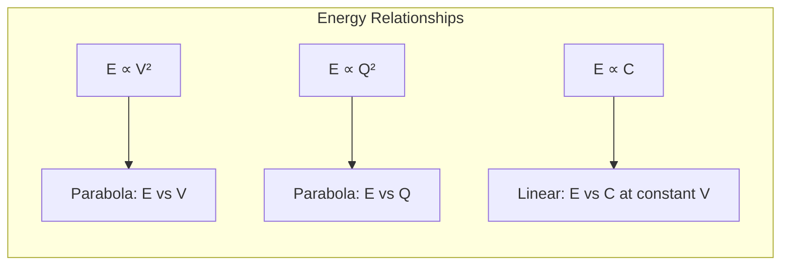

# 1. Overview / 概述

**English:**
This sub-topic focuses on the derivation and application of the **energy stored in a capacitor** formula. When a capacitor is charged, work is done by the power supply to separate charges, and this energy is stored in the electric field between the plates. The key formula $E = \frac{1}{2}QV = \frac{1}{2}CV^2 = \frac{Q^2}{2C}$ is derived from the area under a [[Charge-Voltage (Q-V) Graph]] and is essential for understanding energy transfer in circuits. This concept connects directly to [[Energy Density in Electric Fields]] and is crucial for analyzing [[Charging and Discharging Capacitors]] circuits.

**中文:**
本子知识点聚焦于**电容器储存能量**公式的推导与应用。当电容器充电时，电源做功分离电荷，能量储存在极板间的电场中。核心公式 $E = \frac{1}{2}QV = \frac{1}{2}CV^2 = \frac{Q^2}{2C}$ 由[[电荷-电压 (Q-V) 图]]下的面积推导得出，对于理解电路中的能量转换至关重要。该概念直接联系到[[电场中的能量密度]]，并且对于分析[[电容器的充放电]]电路至关重要。

---

# 2. Syllabus Learning Objectives / 考纲学习目标

| CAIE 9702 | Edexcel IAL |
|-----------|-------------|
| 19.2(a): Derive and use the formula for energy stored in a capacitor: $E = \frac{1}{2}QV$ | 4.6: Derive the expression for energy stored in a capacitor from the area under a Q-V graph |
| 19.2(b): Use the alternative forms $E = \frac{1}{2}CV^2$ and $E = \frac{Q^2}{2C}$ | 4.7: Use the formula $E = \frac{1}{2}CV^2$ to solve problems |
| 19.2(c): Solve problems involving energy stored in capacitors | 4.8: Explain that the energy is stored in the electric field between the plates |

**Examiner Expectations / 考官期望:**
- **English:** You must be able to derive the formula from first principles using the Q-V graph. You should be able to switch between the three forms of the equation. You must understand that the energy is stored in the electric field, not on the plates themselves.
- **中文:** 你必须能够从Q-V图的基本原理推导出公式。你应该能够在三种形式的方程之间切换。你必须理解能量储存在电场中，而不是在极板本身。

---

# 3. Core Definitions / 核心定义

| Term (EN/CN) | Definition (EN) | Definition (CN) | Common Mistakes / 常见错误 |
|--------------|-----------------|-----------------|---------------------------|
| **Energy Stored** / 储存能量 | The work done to charge the capacitor, stored as electric potential energy in the electric field between the plates | 对电容器充电所做的功，以电势能形式储存在极板间的电场中 | Confusing with power (energy per unit time) |
| **Work Done** / 做功 | The product of average voltage and charge transferred during charging | 充电过程中平均电压与转移电荷的乘积 | Using final voltage instead of average voltage |
| **Electric Field Energy** / 电场能量 | The energy per unit volume stored in the electric field between capacitor plates | 电容器极板间电场中每单位体积储存的能量 | Thinking energy is stored on the plates |
| **Q-V Graph Area** / Q-V图面积 | The area under the charge-voltage graph represents the energy stored | 电荷-电压图下的面积代表储存的能量 | Forgetting the $\frac{1}{2}$ factor from triangular area |
| **Dielectric** / 电介质 | An insulating material between plates that increases capacitance and affects energy storage | 极板间的绝缘材料，增加电容并影响能量储存 | Confusing with conductor |

---

# 4. Key Concepts Explained / 关键概念详解

## 4.1 Derivation from Work Done / 从做功推导

### Explanation / 解释
**English:**
When charging a capacitor, the voltage $V$ across it increases linearly with charge $Q$ (since $Q = CV$). To add a small amount of charge $\Delta Q$, the work done is $\Delta W = V \Delta Q$. Since $V$ is not constant, we must use the **average voltage** during charging. The total work done (energy stored) is the sum of all these small work increments, which equals the area under the [[Q-V Graph]].

The Q-V graph is a straight line through the origin with gradient $1/C$. The area under this line is a triangle: $\text{Area} = \frac{1}{2} \times \text{base} \times \text{height} = \frac{1}{2} QV$.

**中文:**
当给电容器充电时，其两端的电压 $V$ 随电荷 $Q$ 线性增加（因为 $Q = CV$）。要增加少量电荷 $\Delta Q$，所做的功为 $\Delta W = V \Delta Q$。由于 $V$ 不是常数，我们必须使用充电过程中的**平均电压**。所做的总功（储存的能量）是所有这些小功增量的总和，等于[[Q-V图]]下的面积。

Q-V图是一条通过原点的直线，斜率为 $1/C$。这条线下的面积是一个三角形：$\text{面积} = \frac{1}{2} \times \text{底} \times \text{高} = \frac{1}{2} QV$。

### Physical Meaning / 物理意义
**English:**
The $\frac{1}{2}$ factor arises because the voltage increases from 0 to $V$ during charging. If the voltage were constant (like a battery), the energy would be $QV$. But since the voltage builds up gradually, the average voltage is $V/2$, giving $E = \frac{1}{2}QV$. This energy is stored in the electric field between the plates, not on the plates themselves.

**中文:**
$\frac{1}{2}$ 因子出现是因为充电过程中电压从0增加到 $V$。如果电压是恒定的（像电池一样），能量将是 $QV$。但由于电压是逐渐建立的，平均电压为 $V/2$，因此得到 $E = \frac{1}{2}QV$。这部分能量储存在极板间的电场中，而不是在极板本身。

### Common Misconceptions / 常见误区
- ❌ **"Energy stored is $QV$"** — This is wrong because voltage is not constant during charging. The correct formula has $\frac{1}{2}$.
- ❌ **"Energy is stored on the plates"** — Energy is stored in the electric field between the plates.
- ❌ **"All three formulas give different answers"** — They are equivalent; use the one with known quantities.
- ❌ **"The $\frac{1}{2}$ is from the capacitor being half charged"** — No, it's from the average voltage.

### Exam Tips / 考试提示
- ✅ Always check which quantities are given before choosing the formula.
- ✅ For energy changes during charging/discharging, use the difference in stored energy.
- ✅ Remember: $E = \frac{1}{2}CV^2$ is most useful when voltage is known.
- ✅ $E = \frac{Q^2}{2C}$ is useful when charge is known (e.g., isolated capacitor).

> 📷 **IMAGE PROMPT — DIAGRAM-01: Q-V Graph for Capacitor Charging**
> A graph with charge Q on the y-axis and voltage V on the x-axis. A straight line passes through the origin with slope = C. The triangular area under the line from 0 to V is shaded, labeled "Energy stored = ½QV". The axes are labeled with units (C and V). The graph should look clean and professional, suitable for an A-Level textbook.

---

# 5. Essential Equations / 核心公式

## Equation 1: Primary Form / 主要形式

$$ E = \frac{1}{2} QV $$

| Symbol (符号) | Meaning (EN) | Meaning (CN) | Unit (单位) |
|--------------|-------------|-------------|------------|
| $E$ | Energy stored | 储存的能量 | J (Joules) |
| $Q$ | Charge stored | 储存的电荷 | C (Coulombs) |
| $V$ | Potential difference | 电势差 | V (Volts) |

**Derivation / 推导:**
From the [[Q-V Graph]], area under the line = $\frac{1}{2} \times \text{base} \times \text{height} = \frac{1}{2} QV$.

**Conditions / 适用条件:**
- **English:** Valid for any capacitor where $Q \propto V$ (linear dielectric). Assumes charging from zero initial charge.
- **中文:** 适用于任何 $Q \propto V$（线性电介质）的电容器。假设从零初始电荷开始充电。

**Limitations / 局限性:**
- **English:** Does not account for energy losses in the circuit (e.g., resistive heating during charging).
- **中文:** 不考虑电路中的能量损失（例如充电过程中的电阻发热）。

---

## Equation 2: Voltage Form / 电压形式

$$ E = \frac{1}{2} CV^2 $$

| Symbol (符号) | Meaning (EN) | Meaning (CN) | Unit (单位) |
|--------------|-------------|-------------|------------|
| $E$ | Energy stored | 储存的能量 | J |
| $C$ | Capacitance | 电容 | F (Farads) |
| $V$ | Potential difference | 电势差 | V |

**Derivation / 推导:**
Substitute $Q = CV$ into $E = \frac{1}{2} QV$:
$$ E = \frac{1}{2} (CV)V = \frac{1}{2} CV^2 $$

**Conditions / 适用条件:**
- **English:** Most commonly used form. Useful when voltage and capacitance are known.
- **中文:** 最常用的形式。当已知电压和电容时很有用。

**Limitations / 局限性:**
- **English:** Assumes constant capacitance (independent of voltage).
- **中文:** 假设电容恒定（与电压无关）。

---

## Equation 3: Charge Form / 电荷形式

$$ E = \frac{Q^2}{2C} $$

| Symbol (符号) | Meaning (EN) | Meaning (CN) | Unit (单位) |
|--------------|-------------|-------------|------------|
| $E$ | Energy stored | 储存的能量 | J |
| $Q$ | Charge stored | 储存的电荷 | C |
| $C$ | Capacitance | 电容 | F |

**Derivation / 推导:**
Substitute $V = Q/C$ into $E = \frac{1}{2} QV$:
$$ E = \frac{1}{2} Q \left(\frac{Q}{C}\right) = \frac{Q^2}{2C} $$

**Conditions / 适用条件:**
- **English:** Useful when charge is known, e.g., for an isolated capacitor that has been disconnected from the power supply.
- **中文:** 当已知电荷时很有用，例如对于已断开电源的孤立电容器。

**Limitations / 局限性:**
- **English:** Same as above; assumes linear dielectric.
- **中文:** 同上；假设线性电介质。

> 📷 **IMAGE PROMPT — DIAGRAM-02: Three Forms of Energy Formula**
> A visual diagram showing three boxes connected by arrows. Box 1: "E = ½QV" with Q and V labeled. Box 2: "E = ½CV²" with C and V labeled. Box 3: "E = Q²/2C" with Q and C labeled. Arrows show transformations: Q=CV connects Box 1 to Box 2, V=Q/C connects Box 1 to Box 3. Clean, educational style.

---

# 6. Graphs and Relationships / 图表与关系

## 6.1 Energy vs Voltage Graph / 能量-电压图

### Axes / 坐标轴
- **X-axis:** Voltage $V$ / 电压 $V$ (V)
- **Y-axis:** Energy stored $E$ / 储存能量 $E$ (J)

### Shape / 形状
- **English:** A parabola (quadratic curve) passing through the origin. $E \propto V^2$.
- **中文:** 一条通过原点的抛物线（二次曲线）。$E \propto V^2$。

### Gradient Meaning / 斜率含义
- **English:** The gradient $\frac{dE}{dV} = CV = Q$. At any point, the gradient equals the charge stored at that voltage.
- **中文:** 斜率 $\frac{dE}{dV} = CV = Q$。在任何一点，斜率等于该电压下储存的电荷。

### Area Meaning / 面积含义
- **English:** Not directly meaningful for this graph.
- **中文:** 该图的面积没有直接意义。

### Exam Interpretation / 考试解读
- **English:** If you double the voltage, the energy stored quadruples (since $E \propto V^2$).
- **中文:** 如果电压加倍，储存的能量变为四倍（因为 $E \propto V^2$）。

---

## 6.2 Energy vs Charge Graph / 能量-电荷图

### Axes / 坐标轴
- **X-axis:** Charge $Q$ / 电荷 $Q$ (C)
- **Y-axis:** Energy stored $E$ / 储存能量 $E$ (J)

### Shape / 形状
- **English:** A parabola (quadratic curve) passing through the origin. $E \propto Q^2$.
- **中文:** 一条通过原点的抛物线（二次曲线）。$E \propto Q^2$。

### Gradient Meaning / 斜率含义
- **English:** The gradient $\frac{dE}{dQ} = \frac{Q}{C} = V$. At any point, the gradient equals the voltage across the capacitor.
- **中文:** 斜率 $\frac{dE}{dQ} = \frac{Q}{C} = V$。在任何一点，斜率等于电容器两端的电压。

### Area Meaning / 面积含义
- **English:** Not directly meaningful for this graph.
- **中文:** 该图的面积没有直接意义。

### Exam Interpretation / 考试解读
- **English:** If you double the charge, the energy stored quadruples (since $E \propto Q^2$).
- **中文:** 如果电荷加倍，储存的能量变为四倍（因为 $E \propto Q^2$）。

---

# 7. Required Diagrams / 必备图表

## 7.1 Q-V Graph with Energy Area / 带能量面积的Q-V图

### Description / 描述
**English:**
A graph showing charge $Q$ on the y-axis against voltage $V$ on the x-axis for a capacitor. The graph is a straight line through the origin with slope $C$. The triangular area under the line is shaded and labeled as "Energy stored = ½QV". This is the fundamental diagram for deriving the energy formula.

**中文:**
一个显示电容器电荷 $Q$（y轴）对电压 $V$（x轴）的图表。该图是一条通过原点的直线，斜率为 $C$。线下方的三角形区域被阴影覆盖，并标注为"储存能量 = ½QV"。这是推导能量公式的基本图表。

### Image Prompt / 图片生成提示
> 📷 **IMAGE PROMPT — DIAGRAM-03: Q-V Graph for Energy Derivation**
> A clean, professional physics graph with Q (Coulombs) on the y-axis and V (Volts) on the x-axis. A straight line with positive slope passes through the origin. The triangular area under the line from (0,0) to (V_max, Q_max) is shaded in light blue. Labels: "Area = ½QV = Energy stored". Grid lines are light gray. Suitable for an A-Level physics textbook.

### Labels Required / 需要标注
- **English:** Axes: Q (C), V (V); Line: Q = CV; Shaded area: Energy = ½QV
- **中文:** 坐标轴：Q (库仑), V (伏特)；直线：Q = CV；阴影区域：能量 = ½QV

### Exam Importance / 考试重要性
- **English:** HIGH — This is the most common diagram for deriving the energy formula. You may be asked to draw it or interpret it in exams.
- **中文:** 高 — 这是推导能量公式最常见的图表。考试中可能会要求你画出或解释它。

---

## 7.2 Energy Transfer Diagram / 能量转换图

### Description / 描述
**English:**
A diagram showing a capacitor being charged by a battery through a resistor. The diagram should show the energy flow: battery provides energy → some energy lost as heat in resistor → remaining energy stored in capacitor's electric field.

**中文:**
一个显示电容器通过电阻被电池充电的图表。该图应显示能量流动：电池提供能量 → 部分能量在电阻中以热量形式损失 → 剩余能量储存在电容器的电场中。

### Image Prompt / 图片生成提示
> 📷 **IMAGE PROMPT — DIAGRAM-04: Energy Flow in Capacitor Charging**
> A circuit diagram with a battery (labeled "E"), a resistor (labeled "R"), and a capacitor (labeled "C") in series. Arrows show energy flow: from battery, some energy goes to resistor as heat (red arrow labeled "Heat loss"), and the rest goes to capacitor (blue arrow labeled "Energy stored = ½CV²"). The capacitor has "+" and "-" labels on its plates. Clean, educational style.

### Labels Required / 需要标注
- **English:** Battery (energy source), Resistor (energy loss), Capacitor (energy storage), Heat loss, Stored energy
- **中文:** 电池（能源）、电阻（能量损失）、电容器（能量储存）、热量损失、储存能量

### Exam Importance / 考试重要性
- **English:** MEDIUM — Useful for understanding that not all energy from the battery is stored; half is lost as heat in the resistor during charging.
- **中文:** 中 — 有助于理解并非所有来自电池的能量都被储存；充电过程中一半能量在电阻中以热量形式损失。

---

# 8. Worked Examples / 典型例题

## Example 1: Basic Energy Calculation / 基本能量计算

### Question / 题目
**English:**
A 470 μF capacitor is charged to a potential difference of 12 V. Calculate the energy stored in the capacitor.

**中文:**
一个470 μF的电容器被充电到12 V的电势差。计算电容器中储存的能量。

### Solution / 解答

**Step 1:** Identify known quantities.
- $C = 470\ \mu\text{F} = 470 \times 10^{-6}\ \text{F} = 4.70 \times 10^{-4}\ \text{F}$
- $V = 12\ \text{V}$

**Step 2:** Choose the appropriate formula. Since we know $C$ and $V$, use $E = \frac{1}{2}CV^2$.

**Step 3:** Substitute values.
$$ E = \frac{1}{2} \times (4.70 \times 10^{-4}) \times (12)^2 $$

**Step 4:** Calculate.
$$ E = \frac{1}{2} \times 4.70 \times 10^{-4} \times 144 $$
$$ E = \frac{1}{2} \times 6.768 \times 10^{-2} $$
$$ E = 3.384 \times 10^{-2}\ \text{J} $$

### Final Answer / 最终答案
**Answer:** $E = 3.38 \times 10^{-2}\ \text{J}$ (or 33.8 mJ) | **答案：** $E = 3.38 \times 10^{-2}\ \text{J}$（或33.8 mJ）

### Quick Tip / 提示
**English:** Always convert μF to F before calculating. Watch out for units — energy is in Joules, not microjoules unless specified.
**中文:** 计算前务必将μF转换为F。注意单位——能量单位是焦耳，除非特别说明，否则不是微焦耳。

---

## Example 2: Energy Change During Discharge / 放电过程中的能量变化

### Question / 题目
**English:**
A 100 μF capacitor is charged to 50 V. It is then partially discharged so that its voltage drops to 30 V. Calculate the energy released during this discharge.

**中文:**
一个100 μF的电容器被充电到50 V。然后它被部分放电，使其电压降至30 V。计算放电过程中释放的能量。

### Solution / 解答

**Step 1:** Calculate initial energy.
$$ E_i = \frac{1}{2}CV_i^2 = \frac{1}{2} \times (100 \times 10^{-6}) \times (50)^2 $$
$$ E_i = \frac{1}{2} \times 10^{-4} \times 2500 = 0.125\ \text{J} $$

**Step 2:** Calculate final energy.
$$ E_f = \frac{1}{2}CV_f^2 = \frac{1}{2} \times (100 \times 10^{-6}) \times (30)^2 $$
$$ E_f = \frac{1}{2} \times 10^{-4} \times 900 = 0.045\ \text{J} $$

**Step 3:** Energy released = initial energy - final energy.
$$ \Delta E = E_i - E_f = 0.125 - 0.045 = 0.080\ \text{J} $$

### Final Answer / 最终答案
**Answer:** $\Delta E = 0.080\ \text{J}$ (or 80 mJ) | **答案：** $\Delta E = 0.080\ \text{J}$（或80 mJ）

### Quick Tip / 提示
**English:** For energy changes, always calculate the difference in stored energy. Do NOT use $\frac{1}{2}C(V_i - V_f)^2$ — this is incorrect because energy is proportional to $V^2$, not $V$.
**中文:** 对于能量变化，始终计算储存能量的差值。不要使用 $\frac{1}{2}C(V_i - V_f)^2$ — 这是错误的，因为能量与 $V^2$ 成正比，而不是 $V$。

---

# 9. Past Paper Question Types / 历年真题题型

| Question Type / 题型 | Frequency / 频率 | Difficulty / 难度 | Past Paper References / 真题索引 |
|----------------------|------------------|------------------|-------------------------------|
| Direct energy calculation using $E = \frac{1}{2}CV^2$ | Very High | Easy | 📝 *待填入* |
| Derivation from Q-V graph area | High | Medium | 📝 *待填入* |
| Energy change during charging/discharging | High | Medium | 📝 *待填入* |
| Comparing energy stored in different capacitors | Medium | Medium | 📝 *待填入* |
| Energy density in electric fields | Low | Hard | 📝 *待填入* |
| Combined with RC circuit time constants | Medium | Hard | 📝 *待填入* |

**Common Command Words / 常见指令词:**
- **English:** Calculate, Derive, Show that, Determine, Sketch, Explain
- **中文:** 计算、推导、证明、确定、画出、解释

---

# 10. Practical Skills Connections / 实验技能链接

**English:**
This sub-topic connects to practical work in several ways:

1. **Measuring Energy Stored:** Use a capacitor, power supply, voltmeter, and stopwatch. Charge the capacitor to a known voltage, then discharge it through a resistor. Measure the voltage decay and integrate $V^2$ over time to find energy.

2. **Q-V Graph Plotting:** Charge a capacitor in steps, measuring charge (using a coulombmeter or by integrating current) and voltage at each step. Plot Q vs V and find the area under the graph.

3. **Uncertainties:** When calculating energy, propagate uncertainties from capacitance and voltage measurements. For $E = \frac{1}{2}CV^2$, the percentage uncertainty in $E$ is $\% \Delta C + 2 \times \% \Delta V$.

4. **Experimental Design:** Design an experiment to verify that $E \propto V^2$ by charging a capacitor to different voltages and measuring the energy released (e.g., by heating water or driving a small motor).

**中文:**
本子知识点在多个方面与实验工作相关：

1. **测量储存能量：** 使用电容器、电源、电压表和秒表。将电容器充电到已知电压，然后通过电阻放电。测量电压衰减并对 $V^2$ 随时间积分以找到能量。

2. **绘制Q-V图：** 逐步给电容器充电，每一步测量电荷（使用库仑计或通过对电流积分）和电压。绘制Q对V的图并找到图下的面积。

3. **不确定度：** 计算能量时，传播来自电容和电压测量的不确定度。对于 $E = \frac{1}{2}CV^2$，$E$ 的百分比不确定度为 $\% \Delta C + 2 \times \% \Delta V$。

4. **实验设计：** 设计一个实验来验证 $E \propto V^2$，通过将电容器充电到不同电压并测量释放的能量（例如，通过加热水或驱动小型电机）。

---

# 11. Concept Map / 概念图谱

```mermaid
graph TD
    %% Energy Stored Formula - Leaf Node Concept Map
    A[Energy Stored in Capacitor] --> B[Derivation from Q-V Graph]
    A --> C[Three Formula Forms]
    A --> D[Physical Interpretation]
    
    B --> B1[Area = ½ × base × height]
    B --> B2[Area = ½QV]
    
    C --> C1[E = ½QV]
    C --> C2[E = ½CV²]
    C --> C3[E = Q²/2C]
    
    C1 --> C1a[Use when Q and V known]
    C2 --> C2a[Use when C and V known]
    C3 --> C3a[Use when Q and C known]
    
    D --> D1[Energy in electric field]
    D --> D2[Not on plates]
    D --> D3[½ factor from average V]
    
    A --> E[Applications]
    E --> E1[Charging circuits]
    E --> E2[Discharging circuits]
    E --> E3[Energy density]
    
    A --> F[Prerequisites]
    F --> F1[[Capacitance and Capacitors]]
    F --> F2[[Charge-Voltage Relationship]]
    
    A --> G[Related Topics]
    G --> G1[[Area Under Q-V Graph]]
    G --> G2[[Energy Density in Electric Fields]]
    G --> G3[[Charging and Discharging Capacitors]]
```

---

# 12. Quick Revision Sheet / 速查表

| Category / 类别 | Key Points / 要点 |
|----------------|------------------|
| **Definition / 定义** | Energy stored = work done to charge capacitor; stored in electric field between plates / 储存能量 = 对电容器充电所做的功；储存在极板间的电场中 |
| **Key Formula / 核心公式** | $E = \frac{1}{2}QV = \frac{1}{2}CV^2 = \frac{Q^2}{2C}$ |
| **Derivation / 推导** | Area under Q-V graph = $\frac{1}{2}QV$ (triangular area) / Q-V图下面积 = $\frac{1}{2}QV$（三角形面积） |
| **Key Graph / 核心图表** | Q-V graph: straight line through origin, slope = C, area = energy / Q-V图：通过原点的直线，斜率 = C，面积 = 能量 |
| **Important Fact / 重要事实** | Only half the energy from the battery is stored; the other half is lost as heat in the resistor during charging / 只有一半来自电池的能量被储存；另一半在充电过程中以热量形式在电阻中损失 |
| **Common Mistake / 常见错误** | Using $E = QV$ instead of $E = \frac{1}{2}QV$; forgetting to convert units (μF → F) / 使用 $E = QV$ 而不是 $E = \frac{1}{2}QV$；忘记转换单位（μF → F） |
| **Exam Tip / 考试提示** | Choose the formula with the known quantities; for energy changes, calculate difference in stored energy / 选择包含已知量的公式；对于能量变化，计算储存能量的差值 |
| **Units / 单位** | Energy: J (Joules); Capacitance: F (Farads); Voltage: V (Volts); Charge: C (Coulombs) / 能量：J（焦耳）；电容：F（法拉）；电压：V（伏特）；电荷：C（库仑） |