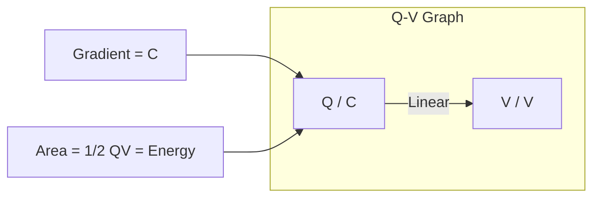

# 1. Overview / 概述

**English:**
This topic explores the energy stored within a [[Capacitance and Capacitors|capacitor]] when it is charged. A capacitor stores electrical potential energy in the electric field between its plates. The amount of energy stored depends on the capacitance and the voltage applied. This concept is fundamental to understanding how capacitors function as temporary energy storage devices in electronic circuits, such as in camera flashes, power supply smoothing, and backup power systems. In both Cambridge 9702 and Edexcel IAL examinations, this topic is assessed through calculations using the energy formulas, interpretation of charge-voltage (Q-V) graphs, and understanding of energy density in electric fields. It bridges the gap between electrostatics and circuit analysis, forming a critical part of the A2 Electricity module.

**中文：**
本主题探讨电容器充电时储存的能量。电容器在其极板间的电场中储存电势能。储存的能量大小取决于电容和所施加的电压。这一概念是理解电容器如何在电子电路中作为临时储能元件工作的基础，例如在相机闪光灯、电源平滑和备用电源系统中。在剑桥 9702 和爱德思 IAL 考试中，该主题通过使用能量公式进行计算、解释电荷-电压（Q-V）图以及理解电场中的能量密度来评估。它连接了静电学和电路分析，是 A2 电学模块的关键组成部分。

---

# 2. Syllabus Learning Objectives / 考纲学习目标

| CAIE 9702 | Edexcel IAL |
|-----------|-------------|
| 19.2(a) Recall and use $E = \frac{1}{2}QV$ and $E = \frac{1}{2}CV^2$ | 4.6 Know that a charged capacitor stores energy in the electric field between its plates |
| 19.2(b) Derive $E = \frac{1}{2}QV$ from the area under a Q-V graph | 4.7 Use $E = \frac{1}{2}QV$ and $E = \frac{1}{2}CV^2$ |
| 19.2(c) Show an understanding of the energy stored in a capacitor being equal to the area under a Q-V graph | 4.8 Derive and use $E = \frac{1}{2}QV$ from the area under a Q-V graph |

**Examiner Expectations / 考官期望：**

**English:**
- Candidates must be able to recall and apply the energy formulas in calculations.
- Derivation of $E = \frac{1}{2}QV$ from the area under a Q-V graph is required for both boards.
- Understanding that the energy is stored in the electric field, not on the plates, is a key conceptual point.
- Candidates should be able to calculate energy density in uniform electric fields (Edexcel extension).
- Common errors include using $E = QV$ instead of $E = \frac{1}{2}QV$, and confusing energy stored with power dissipated.

**中文：**
- 考生必须能够回忆并在计算中应用能量公式。
- 两个考试局都要求从 Q-V 图下的面积推导出 $E = \frac{1}{2}QV$。
- 理解能量储存在电场中，而不是极板上，是一个关键概念点。
- 考生应能够计算均匀电场中的能量密度（爱德思扩展内容）。
- 常见错误包括使用 $E = QV$ 而不是 $E = \frac{1}{2}QV$，以及混淆储存的能量与耗散的功率。

> 📋 **CIE Only:** Emphasis on graphical derivation and area interpretation. Questions often involve calculating energy from Q-V graphs or from circuit parameters.
>
> 📋 **Edexcel Only:** Includes energy density in electric fields ($u = \frac{1}{2}\epsilon_0 E^2$ for vacuum). Questions may involve parallel plate capacitors with dielectrics.

---

# 3. Core Definitions / 核心定义

| Term (EN/CN) | Definition (EN) | Definition (CN) | Common Mistakes / 常见错误 |
|--------------|-----------------|-----------------|---------------------------|
| **Energy Stored in a Capacitor** / 电容器储存的能量 | The electrical potential energy stored in the electric field between the plates of a charged capacitor. | 带电电容器极板间电场中储存的电势能。 | Confusing with power; energy is in joules (J), not watts (W). |
| **Q-V Graph** / Q-V 图 | A graph showing the relationship between charge stored (Q) on the y-axis and potential difference (V) on the x-axis for a capacitor. | 显示电容器储存电荷（Q）与电势差（V）之间关系的图表。 | Thinking the graph is linear for all capacitors; it is linear only for constant capacitance. |
| **Energy Density** / 能量密度 | The energy stored per unit volume in an electric field. | 电场中单位体积储存的能量。 | Confusing with energy per unit charge (potential). |
| **Capacitance** / 电容 | The charge stored per unit potential difference across a capacitor. | 电容器储存的电荷与两端电势差之比。 | Using $C = Q/V$ but forgetting units (farads, F). |
| **Electric Field** / 电场 | A region where a charge experiences an electric force. | 电荷受到电场力的区域。 | Thinking energy is stored on the plates, not in the field. |

---

# 4. Key Concepts Explained / 关键概念详解

## 4.1 Energy Storage Mechanism / 储能机制

### Explanation / 解释
**English:**
When a [[Capacitance and Capacitors|capacitor]] is charged, work is done by the power supply to move charge from one plate to the other. This work is stored as electrical potential energy in the [[Electric Fields|electric field]] between the plates. The energy is not stored on the plates themselves but in the field. As charge accumulates, the potential difference across the capacitor increases, requiring more work to add additional charge. This is why the energy is $\frac{1}{2}QV$, not $QV$.

**中文：**
当电容器充电时，电源做功将电荷从一个极板移动到另一个极板。这个功以电势能的形式储存在极板间的电场中。能量不是储存在极板本身，而是储存在电场中。随着电荷的积累，电容器两端的电势差增加，需要更多的功来添加额外的电荷。这就是为什么能量是 $\frac{1}{2}QV$，而不是 $QV$。

### Physical Meaning / 物理意义
**English:**
Think of charging a capacitor like filling a water tank. The first drops of water (charge) require little work because the water level (voltage) is low. As the tank fills, each additional drop requires more work against the increasing pressure. The total work is the average force times distance, analogous to $\frac{1}{2}QV$.

**中文：**
将电容器充电想象成给水箱注水。最初的水滴（电荷）需要很少的功，因为水位（电压）很低。随着水箱注满，每一滴额外的水都需要更多的功来对抗增加的压力。总功是平均力乘以距离，类似于 $\frac{1}{2}QV$。

### Common Misconceptions / 常见误区
- **Misconception 1:** Energy stored is $E = QV$. *Correction:* This would be true only if voltage remained constant during charging, but voltage increases linearly with charge.
- **Misconception 2:** Energy is stored on the plates. *Correction:* Energy is stored in the electric field between the plates.
- **Misconception 3:** A capacitor stores charge. *Correction:* A capacitor stores energy; charge is separated, not stored.

### Exam Tips / 考试提示
**English:**
- Always check which formula to use: $E = \frac{1}{2}QV$, $E = \frac{1}{2}CV^2$, or $E = \frac{Q^2}{2C}$.
- In circuit problems, identify whether Q, V, or C is constant.
- For energy density questions (Edexcel), use $u = \frac{1}{2}\epsilon_0 E^2$ for vacuum.

**中文：**
- 始终检查使用哪个公式：$E = \frac{1}{2}QV$、$E = \frac{1}{2}CV^2$ 或 $E = \frac{Q^2}{2C}$。
- 在电路问题中，确定 Q、V 或 C 哪个是常数。
- 对于能量密度问题（爱德思），真空情况下使用 $u = \frac{1}{2}\epsilon_0 E^2$。

---

## 4.2 Derivation from Q-V Graph / 从 Q-V 图推导

### Explanation / 解释
**English:**
The energy stored can be derived from the area under a [[Charging and Discharging Capacitors|charge-voltage (Q-V) graph]]. For a capacitor with constant capacitance, the relationship $Q = CV$ is linear. The work done to charge the capacitor from 0 to final charge $Q$ is the sum of small increments of work $\Delta W = V \Delta Q$. This is the area under the Q-V curve, which is a triangle of base $V$ and height $Q$. Hence, $E = \frac{1}{2}QV$.

**中文：**
储存的能量可以从电荷-电压（Q-V）图下的面积推导出来。对于电容恒定的电容器，关系 $Q = CV$ 是线性的。将电容器从 0 充电到最终电荷 $Q$ 所做的功是微小增量功 $\Delta W = V \Delta Q$ 的总和。这就是 Q-V 曲线下的面积，是一个底为 $V$、高为 $Q$ 的三角形。因此，$E = \frac{1}{2}QV$。

### Physical Meaning / 物理意义
**English:**
The area under any force-displacement graph gives work done. Similarly, the area under a Q-V graph gives the work done (energy stored) in charging the capacitor. This graphical method is a powerful tool for understanding energy storage.

**中文：**
任何力-位移图下的面积都表示所做的功。类似地，Q-V 图下的面积表示给电容器充电所做的功（储存的能量）。这种图形方法是理解能量储存的强大工具。

### Common Misconceptions / 常见误区
- **Misconception 1:** The area is $QV$ (rectangle). *Correction:* The area is a triangle because voltage increases from 0 to V as charge increases.
- **Misconception 2:** The Q-V graph is curved. *Correction:* For a constant capacitance, it is a straight line through the origin.

### Exam Tips / 考试提示
**English:**
- Be prepared to sketch the Q-V graph and shade the area representing energy stored.
- For non-linear capacitors (rare at A-level), the area under the curve still gives energy, but integration is required.
- Edexcel may ask for derivation steps explicitly.

**中文：**
- 准备好绘制 Q-V 图并标出代表储存能量的面积。
- 对于非线性电容器（A-level 少见），曲线下的面积仍然给出能量，但需要积分。
- 爱德思可能明确要求推导步骤。

---

## 4.3 Energy Density in Electric Fields / 电场中的能量密度

### Explanation / 解释
**English:**
Energy density ($u$) is the energy stored per unit volume in an electric field. For a parallel plate capacitor, the energy stored is $E = \frac{1}{2}CV^2$. Using $C = \frac{\epsilon_0 A}{d}$ and $V = Ed$, we get $E = \frac{1}{2}\epsilon_0 E^2 Ad$. The volume between plates is $Ad$, so energy density $u = \frac{E}{Ad} = \frac{1}{2}\epsilon_0 E^2$. This shows that energy is stored in the field itself.

**中文：**
能量密度（$u$）是电场中单位体积储存的能量。对于平行板电容器，储存的能量为 $E = \frac{1}{2}CV^2$。使用 $C = \frac{\epsilon_0 A}{d}$ 和 $V = Ed$，我们得到 $E = \frac{1}{2}\epsilon_0 E^2 Ad$。极板间的体积为 $Ad$，所以能量密度 $u = \frac{E}{Ad} = \frac{1}{2}\epsilon_0 E^2$。这表明能量储存在场本身中。

### Physical Meaning / 物理意义
**English:**
This concept unifies electrostatics: wherever there is an electric field, there is energy. The stronger the field, the more energy per unit volume. This is analogous to energy density in gravitational fields.

**中文：**
这个概念统一了静电学：只要有电场，就有能量。场越强，单位体积的能量越多。这类似于引力场中的能量密度。

### Common Misconceptions / 常见误区
- **Misconception 1:** Energy density depends on plate area. *Correction:* It depends only on electric field strength and permittivity.
- **Misconception 2:** Energy density is only for capacitors. *Correction:* It applies to any electric field, including those in space.

### Exam Tips / 考试提示
**English:**
- Edexcel-specific: Derivation of $u = \frac{1}{2}\epsilon_0 E^2$ is examinable.
- For dielectrics, use $u = \frac{1}{2}\epsilon_r \epsilon_0 E^2$.
- Questions may ask for comparison of energy densities in different capacitors.

**中文：**
- 爱德思特有：$u = \frac{1}{2}\epsilon_0 E^2$ 的推导是可考的。
- 对于电介质，使用 $u = \frac{1}{2}\epsilon_r \epsilon_0 E^2$。
- 问题可能要求比较不同电容器中的能量密度。

> 📋 **Edexcel Only:** Energy density in electric fields is explicitly required in the specification.

---

# 5. Essential Equations / 核心公式

## 5.1 Energy Stored Formula 1 / 储能公式 1

**Equation / 公式:**
$$ E = \frac{1}{2} QV $$

**Variables / 变量:**
| Symbol (符号) | Meaning (EN) | Meaning (CN) | Unit (单位) |
|--------------|-------------|-------------|------------|
| $E$ | Energy stored | 储存的能量 | J (joules) |
| $Q$ | Charge stored | 储存的电荷 | C (coulombs) |
| $V$ | Potential difference | 电势差 | V (volts) |

**Derivation / 推导:**
**English:**
From the Q-V graph, the area under the straight line $Q = CV$ from 0 to $V$ is a triangle. Area = $\frac{1}{2} \times \text{base} \times \text{height} = \frac{1}{2} \times V \times Q = \frac{1}{2}QV$.

**中文：**
从 Q-V 图来看，从 0 到 $V$ 的直线 $Q = CV$ 下的面积是一个三角形。面积 = $\frac{1}{2} \times \text{底} \times \text{高} = \frac{1}{2} \times V \times Q = \frac{1}{2}QV$。

**Conditions / 适用条件:**
**English:** Applicable to any capacitor where Q and V are known. Assumes linear Q-V relationship (constant capacitance).
**中文：** 适用于已知 Q 和 V 的任何电容器。假设 Q-V 关系为线性（电容恒定）。

**Limitations / 局限性:**
**English:** Does not directly give energy if only C is known; requires Q or V.
**中文：** 如果只知道 C，不能直接给出能量；需要 Q 或 V。

**Rearrangements / 变形:**
$$ Q = \frac{2E}{V}, \quad V = \frac{2E}{Q} $$

---

## 5.2 Energy Stored Formula 2 / 储能公式 2

**Equation / 公式:**
$$ E = \frac{1}{2} CV^2 $$

**Variables / 变量:**
| Symbol (符号) | Meaning (EN) | Meaning (CN) | Unit (单位) |
|--------------|-------------|-------------|------------|
| $E$ | Energy stored | 储存的能量 | J |
| $C$ | Capacitance | 电容 | F (farads) |
| $V$ | Potential difference | 电势差 | V |

**Derivation / 推导:**
**English:**
Substitute $Q = CV$ into $E = \frac{1}{2}QV$: $E = \frac{1}{2}(CV)V = \frac{1}{2}CV^2$.

**中文：**
将 $Q = CV$ 代入 $E = \frac{1}{2}QV$：$E = \frac{1}{2}(CV)V = \frac{1}{2}CV^2$。

**Conditions / 适用条件:**
**English:** Most useful when voltage and capacitance are known. Assumes constant capacitance.
**中文：** 当已知电压和电容时最有用。假设电容恒定。

**Limitations / 局限性:**
**English:** Cannot be used if capacitance changes during charging (e.g., variable capacitor).
**中文：** 如果充电过程中电容发生变化（例如可变电容器），则不能使用。

**Rearrangements / 变形:**
$$ C = \frac{2E}{V^2}, \quad V = \sqrt{\frac{2E}{C}} $$

---

## 5.3 Energy Stored Formula 3 / 储能公式 3

**Equation / 公式:**
$$ E = \frac{Q^2}{2C} $$

**Variables / 变量:**
| Symbol (符号) | Meaning (EN) | Meaning (CN) | Unit (单位) |
|--------------|-------------|-------------|------------|
| $E$ | Energy stored | 储存的能量 | J |
| $Q$ | Charge stored | 储存的电荷 | C |
| $C$ | Capacitance | 电容 | F |

**Derivation / 推导:**
**English:**
Substitute $V = Q/C$ into $E = \frac{1}{2}QV$: $E = \frac{1}{2}Q\left(\frac{Q}{C}\right) = \frac{Q^2}{2C}$.

**中文：**
将 $V = Q/C$ 代入 $E = \frac{1}{2}QV$：$E = \frac{1}{2}Q\left(\frac{Q}{C}\right) = \frac{Q^2}{2C}$。

**Conditions / 适用条件:**
**English:** Useful when charge and capacitance are known. Assumes constant capacitance.
**中文：** 当已知电荷和电容时有用。假设电容恒定。

**Limitations / 局限性:**
**English:** Not useful if voltage is the only known quantity.
**中文：** 如果电压是唯一已知量，则不适用。

**Rearrangements / 变形:**
$$ Q = \sqrt{2EC}, \quad C = \frac{Q^2}{2E} $$

---

## 5.4 Energy Density Formula / 能量密度公式

**Equation / 公式:**
$$ u = \frac{1}{2} \epsilon_0 E^2 $$

**Variables / 变量:**
| Symbol (符号) | Meaning (EN) | Meaning (CN) | Unit (单位) |
|--------------|-------------|-------------|------------|
| $u$ | Energy density | 能量密度 | J m$^{-3}$ |
| $\epsilon_0$ | Permittivity of free space | 真空介电常数 | F m$^{-1}$ |
| $E$ | Electric field strength | 电场强度 | V m$^{-1}$ or N C$^{-1}$ |

**Derivation / 推导:**
**English:**
Start with $E = \frac{1}{2}CV^2$. For a parallel plate capacitor: $C = \frac{\epsilon_0 A}{d}$ and $V = Ed$. Substitute: $E = \frac{1}{2}\left(\frac{\epsilon_0 A}{d}\right)(Ed)^2 = \frac{1}{2}\epsilon_0 E^2 Ad$. Volume = $Ad$, so $u = \frac{E}{Ad} = \frac{1}{2}\epsilon_0 E^2$.

**中文：**
从 $E = \frac{1}{2}CV^2$ 开始。对于平行板电容器：$C = \frac{\epsilon_0 A}{d}$ 和 $V = Ed$。代入：$E = \frac{1}{2}\left(\frac{\epsilon_0 A}{d}\right)(Ed)^2 = \frac{1}{2}\epsilon_0 E^2 Ad$。体积 = $Ad$，所以 $u = \frac{E}{Ad} = \frac{1}{2}\epsilon_0 E^2$。

**Conditions / 适用条件:**
**English:** Valid for uniform electric fields in vacuum. For dielectrics, use $u = \frac{1}{2}\epsilon_r \epsilon_0 E^2$.
**中文：** 适用于真空中的均匀电场。对于电介质，使用 $u = \frac{1}{2}\epsilon_r \epsilon_0 E^2$。

**Limitations / 局限性:**
**English:** Assumes uniform field; not directly applicable to non-uniform fields without integration.
**中文：** 假设均匀场；不直接适用于非均匀场（需要积分）。

**Rearrangements / 变形:**
$$ E = \sqrt{\frac{2u}{\epsilon_0}}, \quad \epsilon_0 = \frac{2u}{E^2} $$

> 📋 **Edexcel Only:** Energy density formula is explicitly required.

---

# 6. Graphs and Relationships / 图表与关系

## 6.1 Q-V Graph for a Capacitor / 电容器的 Q-V 图

### Axes / 坐标轴
**English:** x-axis: Potential difference $V$ (V); y-axis: Charge stored $Q$ (C)
**中文：** x 轴：电势差 $V$（V）；y 轴：储存的电荷 $Q$（C）

### Shape / 形状
**English:** A straight line through the origin with gradient = capacitance $C$.
**中文：** 一条通过原点的直线，斜率 = 电容 $C$。

### Gradient Meaning / 斜率含义
**English:** The gradient of the Q-V graph is the capacitance $C = Q/V$.
**中文：** Q-V 图的斜率是电容 $C = Q/V$。

### Area Meaning / 面积含义
**English:** The area under the Q-V graph represents the energy stored in the capacitor. For a linear graph, area = $\frac{1}{2}QV$.
**中文：** Q-V 图下的面积表示电容器中储存的能量。对于线性图，面积 = $\frac{1}{2}QV$。

### Exam Interpretation / 考试解读
**English:**
- A steeper line means larger capacitance.
- The area under the line up to a given V gives energy stored.
- If two capacitors are compared, the one with larger area under the curve stores more energy at the same voltage.

**中文：**
- 更陡的线意味着更大的电容。
- 到给定 V 的线下面积给出储存的能量。
- 如果比较两个电容器，在相同电压下曲线下面积更大的电容器储存更多能量。

### Common Questions / 常见问题
**English:**
- "Sketch the Q-V graph for a capacitor and shade the area representing energy stored."
- "Calculate the energy stored from the graph."
- "Compare the energy stored in two capacitors using their Q-V graphs."

**中文：**
- "绘制电容器的 Q-V 图并标出代表储存能量的面积。"
- "从图中计算储存的能量。"
- "使用 Q-V 图比较两个电容器中储存的能量。"

> 📷 **IMAGE PROMPT — QV01: Q-V Graph for a Capacitor**
>
> A Cartesian graph with "Potential Difference V / V" on the x-axis and "Charge Q / C" on the y-axis. A straight line passes through the origin with positive slope. The triangular area under the line from the origin to a point (V, Q) is shaded and labeled "Energy stored = 1/2 QV". The gradient is labeled "Capacitance C". Clean, educational style with grid lines. Suitable for A-level physics textbook.

---

## 6.2 Energy vs Voltage Graph / 能量-电压图

### Axes / 坐标轴
**English:** x-axis: Potential difference $V$ (V); y-axis: Energy stored $E$ (J)
**中文：** x 轴：电势差 $V$（V）；y 轴：储存的能量 $E$（J）

### Shape / 形状
**English:** A parabola: $E = \frac{1}{2}CV^2$. Energy increases quadratically with voltage.
**中文：** 抛物线：$E = \frac{1}{2}CV^2$。能量随电压二次方增加。

### Gradient Meaning / 斜率含义
**English:** The gradient at any point is $\frac{dE}{dV} = CV = Q$, the charge stored at that voltage.
**中文：** 任意点的斜率为 $\frac{dE}{dV} = CV = Q$，即该电压下储存的电荷。

### Area Meaning / 面积含义
**English:** Not typically interpreted; the graph itself shows energy directly.
**中文：** 通常不解释面积；图表本身直接显示能量。

### Exam Interpretation / 考试解读
**English:**
- A steeper parabola indicates larger capacitance.
- Doubling voltage quadruples energy stored.
- Used to compare energy storage capabilities of different capacitors.

**中文：**
- 更陡的抛物线表示更大的电容。
- 电压加倍会使储存的能量变为四倍。
- 用于比较不同电容器的储能能力。

### Common Questions / 常见问题
**English:**
- "Sketch the graph of energy stored against voltage for a capacitor."
- "Explain why the graph is a parabola."
- "Determine the capacitance from the graph."

**中文：**
- "绘制电容器储存能量与电压的关系图。"
- "解释为什么该图是抛物线。"
- "从图中确定电容。"

---

# 7. Required Diagrams / 必备图表

## 7.1 Q-V Graph with Shaded Energy Area / 带阴影能量面积的 Q-V 图

### Description / 描述
**English:**
A Cartesian graph with potential difference (V) on the x-axis and charge (Q) on the y-axis. A straight line through the origin represents $Q = CV$. The triangular area under the line from the origin to a point (V, Q) is shaded to represent the energy stored. Labels include: axes, gradient (C), and area (E = 1/2 QV).

**中文：**
一个笛卡尔坐标系图，x 轴为电势差（V），y 轴为电荷（Q）。一条通过原点的直线代表 $Q = CV$。从原点到点 (V, Q) 的线下三角形区域被阴影覆盖，代表储存的能量。标签包括：坐标轴、斜率（C）和面积（E = 1/2 QV）。

### Image Prompt / 图片生成提示
> 📷 **IMAGE PROMPT — QV02: Q-V Graph with Shaded Energy Area**
>
> A clean, educational Cartesian graph. X-axis labeled "Potential Difference V / V", y-axis labeled "Charge Q / C". A straight line from origin to top right, labeled "Q = CV". The triangular area under the line is shaded in light blue. Labels: "Gradient = C" near the line, "Energy = 1/2 QV" inside the shaded triangle. Grid lines in light gray. Minimalist, textbook-style, suitable for A-level physics. No 3D effects.

### Labels Required / 需要标注
- x-axis: Potential Difference V / V (电势差 V / V)
- y-axis: Charge Q / C (电荷 Q / C)
- Line: Q = CV (Q = CV)
- Gradient: C (电容 C)
- Shaded area: Energy = 1/2 QV (能量 = 1/2 QV)

### Exam Importance / 考试重要性
**English:** This diagram is essential for understanding the derivation of $E = \frac{1}{2}QV$. Both CIE and Edexcel require candidates to sketch and interpret this graph. It is a common starting point for energy-related questions.

**中文：** 该图对于理解 $E = \frac{1}{2}QV$ 的推导至关重要。CIE 和 Edexcel 都要求考生绘制和解释该图。它是能量相关问题的常见起点。

---

## 7.2 Parallel Plate Capacitor with Electric Field / 带电场的平行板电容器

### Description / 描述
**English:**
A diagram showing two parallel conducting plates separated by a distance d. The plates are connected to a battery. The electric field lines are shown as parallel arrows from the positive plate to the negative plate. Labels include: plate area A, plate separation d, electric field E, voltage V, and charge +Q and -Q on plates.

**中文：**
一个显示两块平行导电极板的图，极板间距为 d。极板连接到电池。电场线显示为从正极板到负极板的平行箭头。标签包括：极板面积 A、极板间距 d、电场 E、电压 V 以及极板上的电荷 +Q 和 -Q。

### Image Prompt / 图片生成提示
> 📷 **IMAGE PROMPT — PC01: Parallel Plate Capacitor with Electric Field**
>
> A 2D cross-section diagram of a parallel plate capacitor. Two horizontal parallel plates, separated by distance d. Top plate labeled "+Q", bottom plate labeled "-Q". A battery symbol on the left connected to both plates. Uniform electric field lines (parallel arrows pointing downward) between the plates. Labels: "Area A" on top plate, "d" between plates, "E" next to field lines, "V" across plates. Clean, schematic style, white background, suitable for physics textbook.

### Labels Required / 需要标注
- Plate area: A (面积 A)
- Plate separation: d (极板间距 d)
- Electric field: E (电场 E)
- Voltage: V (电压 V)
- Charge: +Q, -Q (电荷 +Q, -Q)
- Battery: V (电池 V)

### Exam Importance / 考试重要性
**English:** This diagram is used to derive the energy density formula $u = \frac{1}{2}\epsilon_0 E^2$. It helps visualize that energy is stored in the electric field between the plates. Essential for Edexcel energy density questions.

**中文：** 该图用于推导能量密度公式 $u = \frac{1}{2}\epsilon_0 E^2$。它有助于可视化能量储存在极板间的电场中。对于爱德思的能量密度问题至关重要。

---

## 7.3 Charging Circuit for a Capacitor / 电容器充电电路

### Description / 描述
**English:**
A circuit diagram showing a battery, a switch, a resistor, and a capacitor connected in series. Arrows indicate the direction of current flow when the switch is closed. Labels include: battery (emf), resistor (R), capacitor (C), and switch.

**中文：**
一个电路图，显示电池、开关、电阻和电容器串联连接。箭头指示开关闭合时电流的方向。标签包括：电池（电动势）、电阻（R）、电容器（C）和开关。

### Image Prompt / 图片生成提示
> 📷 **IMAGE PROMPT — CC01: Charging Circuit for a Capacitor**
>
> A simple series circuit diagram. Battery on left (long and short lines), switch (open position), resistor (zigzag symbol), and capacitor (two parallel lines) connected in a loop. Arrows showing conventional current direction from battery positive terminal through resistor to capacitor. Labels: "V" next to battery, "R" next to resistor, "C" next to capacitor. Clean schematic style, black on white, suitable for A-level physics.

### Labels Required / 需要标注
- Battery: V or emf (电池 V 或电动势)
- Resistor: R (电阻 R)
- Capacitor: C (电容器 C)
- Switch: S (开关 S)
- Current direction: I (电流方向 I)

### Exam Importance / 考试重要性
**English:** This circuit is the basis for understanding how a capacitor charges and how energy is transferred from the battery to the capacitor. Questions often involve calculating energy stored after charging or energy dissipated in the resistor.

**中文：** 该电路是理解电容器如何充电以及能量如何从电池转移到电容器的基础。问题通常涉及计算充电后储存的能量或电阻中耗散的能量。

---

# 8. Worked Examples / 典型例题

## Example 1: Energy Stored Calculation / 例题 1：储能计算

### Question / 题目
**English:**
A 470 μF capacitor is charged to a potential difference of 12 V. Calculate:
(a) The charge stored on the capacitor.
(b) The energy stored in the capacitor.

**中文：**
一个 470 μF 的电容器被充电到 12 V 的电势差。计算：
(a) 电容器上储存的电荷。
(b) 电容器中储存的能量。

### Solution / 解答

**Step 1: Identify known quantities / 步骤 1：确定已知量**
$$ C = 470 \times 10^{-6} \text{ F} = 4.70 \times 10^{-4} \text{ F} $$
$$ V = 12 \text{ V} $$

**Step 2: Calculate charge / 步骤 2：计算电荷**
$$ Q = CV = (4.70 \times 10^{-4})(12) = 5.64 \times 10^{-3} \text{ C} = 5.64 \text{ mC} $$

**Step 3: Calculate energy / 步骤 3：计算能量**
Using $E = \frac{1}{2}CV^2$:
$$ E = \frac{1}{2}(4.70 \times 10^{-4})(12)^2 = \frac{1}{2}(4.70 \times 10^{-4})(144) $$
$$ E = \frac{1}{2}(0.06768) = 0.03384 \text{ J} \approx 3.38 \times 10^{-2} \text{ J} $$

Alternatively, using $E = \frac{1}{2}QV$:
$$ E = \frac{1}{2}(5.64 \times 10^{-3})(12) = \frac{1}{2}(0.06768) = 0.03384 \text{ J} $$

### Final Answer / 最终答案
**Answer:** (a) $Q = 5.64 \text{ mC}$ | **答案：** (a) $Q = 5.64 \text{ mC}$
**Answer:** (b) $E = 3.38 \times 10^{-2} \text{ J}$ | **答案：** (b) $E = 3.38 \times 10^{-2} \text{ J}$

### Examiner Notes / 考官点评
**English:**
- Always convert μF to F: $1 \mu\text{F} = 10^{-6} \text{ F}$.
- Use $E = \frac{1}{2}CV^2$ when C and V are known; it's more direct.
- Check units: energy in joules, charge in coulombs.
- Common error: using $E = CV^2$ (missing the 1/2 factor).

**中文：**
- 始终将 μF 转换为 F：$1 \mu\text{F} = 10^{-6} \text{ F}$。
- 当已知 C 和 V 时，使用 $E = \frac{1}{2}CV^2$；更直接。
- 检查单位：能量单位为焦耳，电荷单位为库仑。
- 常见错误：使用 $E = CV^2$（缺少 1/2 因子）。

### Alternative Method / 替代方法
**English:** Calculate Q first, then use $E = \frac{1}{2}QV$. This is useful if the question asks for both Q and E.
**中文：** 先计算 Q，然后使用 $E = \frac{1}{2}QV$。如果问题同时要求 Q 和 E，这很有用。

---

## Example 2: Energy from Q-V Graph / 例题 2：从 Q-V 图求能量

### Question / 题目
**English:**
A capacitor is charged to a potential difference of 20 V. The charge stored is 80 μC.
(a) Sketch the Q-V graph for this capacitor.
(b) Calculate the energy stored using the graph.
(c) Determine the capacitance of the capacitor.

**中文：**
一个电容器被充电到 20 V 的电势差。储存的电荷为 80 μC。
(a) 绘制该电容器的 Q-V 图。
(b) 使用该图计算储存的能量。
(c) 确定电容器的电容。

### Image Prompt / 图片提示
> 📷 **IMAGE PROMPT — EX02: Q-V Graph for Example 2**
>
> A Cartesian graph with "V / V" on x-axis (0 to 25) and "Q / μC" on y-axis (0 to 100). A straight line from (0,0) to (20, 80). The triangular area under the line is shaded. Labels: "(20, 80)", "C = gradient", "Energy = 1/2 QV". Clean, educational style.

### Solution / 解答

**Step 1: Sketch the graph / 步骤 1：绘制图表**
The graph is a straight line from (0,0) to (20 V, 80 μC).

**Step 2: Calculate energy from area / 步骤 2：从面积计算能量**
Area of triangle = $\frac{1}{2} \times \text{base} \times \text{height}$
$$ E = \frac{1}{2} \times V \times Q = \frac{1}{2} \times 20 \times (80 \times 10^{-6}) $$
$$ E = \frac{1}{2} \times 20 \times 8.0 \times 10^{-5} = \frac{1}{2} \times 1.6 \times 10^{-3} $$
$$ E = 8.0 \times 10^{-4} \text{ J} = 0.80 \text{ mJ} $$

**Step 3: Calculate capacitance / 步骤 3：计算电容**
$$ C = \frac{Q}{V} = \frac{80 \times 10^{-6}}{20} = 4.0 \times 10^{-6} \text{ F} = 4.0 \text{ μF} $$

### Final Answer / 最终答案
**Answer:** (b) $E = 8.0 \times 10^{-4} \text{ J}$ | **答案：** (b) $E = 8.0 \times 10^{-4} \text{ J}$
**Answer:** (c) $C = 4.0 \text{ μF}$ | **答案：** (c) $C = 4.0 \text{ μF}$

### Examiner Notes / 考官点评
**English:**
- The graphical method confirms the formula $E = \frac{1}{2}QV$.
- Always check units: Q in coulombs, V in volts.
- The capacitance can be found from the gradient of the Q-V graph.
- Common error: forgetting to convert μC to C (multiply by $10^{-6}$).

**中文：**
- 图形方法确认了公式 $E = \frac{1}{2}QV$。
- 始终检查单位：Q 以库仑为单位，V 以伏特为单位。
- 电容可以从 Q-V 图的斜率求出。
- 常见错误：忘记将 μC 转换为 C（乘以 $10^{-6}$）。

---

## Example 3: Energy Density Calculation (Edexcel) / 例题 3：能量密度计算（爱德思）

### Question / 题目
**English:**
A parallel plate capacitor has plates of area 0.050 m² separated by 1.0 mm in vacuum. The capacitor is charged to a potential difference of 500 V.
(a) Calculate the electric field strength between the plates.
(b) Calculate the energy density in the electric field.
(c) Calculate the total energy stored in the capacitor.

**中文：**
一个平行板电容器在真空中具有面积为 0.050 m²、间距为 1.0 mm 的极板。电容器被充电到 500 V 的电势差。
(a) 计算极板间的电场强度。
(b) 计算电场中的能量密度。
(c) 计算电容器中储存的总能量。

### Solution / 解答

**Step 1: Calculate electric field strength / 步骤 1：计算电场强度**
$$ E = \frac{V}{d} = \frac{500}{1.0 \times 10^{-3}} = 5.0 \times 10^5 \text{ V m}^{-1} $$

**Step 2: Calculate energy density / 步骤 2：计算能量密度**
$$ u = \frac{1}{2}\epsilon_0 E^2 = \frac{1}{2}(8.85 \times 10^{-12})(5.0 \times 10^5)^2 $$
$$ u = \frac{1}{2}(8.85 \times 10^{-12})(2.5 \times 10^{11}) $$
$$ u = \frac{1}{2}(2.2125) = 1.106 \text{ J m}^{-3} \approx 1.11 \text{ J m}^{-3} $$

**Step 3: Calculate total energy / 步骤 3：计算总能量**
Method 1: Using $E = \frac{1}{2}CV^2$
$$ C = \frac{\epsilon_0 A}{d} = \frac{(8.85 \times 10^{-12})(0.050)}{1.0 \times 10^{-3}} = 4.425 \times 10^{-10} \text{ F} $$
$$ E_{\text{total}} = \frac{1}{2}(4.425 \times 10^{-10})(500)^2 = \frac{1}{2}(4.425 \times 10^{-10})(2.5 \times 10^5) $$
$$ E_{\text{total}} = \frac{1}{2}(1.106 \times 10^{-4}) = 5.53 \times 10^{-5} \text{ J} $$

Method 2: Using energy density × volume
Volume = $A \times d = 0.050 \times 1.0 \times 10^{-3} = 5.0 \times 10^{-5} \text{ m}^3$
$$ E_{\text{total}} = u \times \text{Volume} = 1.106 \times 5.0 \times 10^{-5} = 5.53 \times 10^{-5} \text{ J} $$

### Final Answer / 最终答案
**Answer:** (a) $E = 5.0 \times 10^5 \text{ V m}^{-1}$ | **答案：** (a) $E = 5.0 \times 10^5 \text{ V m}^{-1}$
**Answer:** (b) $u = 1.11 \text{ J m}^{-3}$ | **答案：** (b) $u = 1.11 \text{ J m}^{-3}$
**Answer:** (c) $E_{\text{total}} = 5.53 \times 10^{-5} \text{ J}$ | **答案：** (c) $E_{\text{total}} = 5.53 \times 10^{-5} \text{ J}$

### Examiner Notes / 考官点评
**English:**
- This is a typical Edexcel-style question linking energy density to total energy.
- Note that both methods for total energy give the same result, confirming consistency.
- Common error: using $E = V/d$ but forgetting to convert mm to m.
- Remember $\epsilon_0 = 8.85 \times 10^{-12} \text{ F m}^{-1}$.

**中文：**
- 这是一个典型的爱德思风格问题，将能量密度与总能量联系起来。
- 注意，两种计算总能量的方法得到相同的结果，确认了一致性。
- 常见错误：使用 $E = V/d$ 但忘记将 mm 转换为 m。
- 记住 $\epsilon_0 = 8.85 \times 10^{-12} \text{ F m}^{-1}$。

> 📋 **Edexcel Only:** Energy density calculations are specific to the Edexcel specification.

---

# 9. Past Paper Question Types / 历年真题题型

| Question Type / 题型 | Frequency / 频率 | Difficulty / 难度 | Past Paper References / 真题索引 |
|----------------------|------------------|------------------|-------------------------------|
| Calculation / 计算 | High | Medium | 📝 *待填入* |
| Explanation / 解释 | Medium | Medium | 📝 *待填入* |
| Graph Analysis / 图表分析 | Medium | High | 📝 *待填入* |
| Practical / 实验 | Low | Medium | 📝 *待填入* |
| Derivation / 推导 | Medium | High | 📝 *待填入* |

> 📝 **题库整理中 / Question Bank Under Construction:** 具体试卷编号（如 9702/23/M/J/24 Q3）将在后续整理真题后填入上表。

**Common Command Words / 常见指令词：**

| Command Word (EN) | Command Word (CN) | Typical Usage / 典型用法 |
|-------------------|-------------------|------------------------|
| State | 陈述 | State the formula for energy stored in a capacitor. |
| Define | 定义 | Define energy density in an electric field. |
| Explain | 解释 | Explain why the energy stored is $\frac{1}{2}QV$ and not $QV$. |
| Describe | 描述 | Describe how the energy stored changes when the voltage is doubled. |
| Calculate | 计算 | Calculate the energy stored in a 100 μF capacitor charged to 12 V. |
| Determine | 确定 | Determine the capacitance from the Q-V graph. |
| Suggest | 建议 | Suggest why a capacitor might be used instead of a battery in a camera flash. |
| Derive | 推导 | Derive $E = \frac{1}{2}CV^2$ from the Q-V graph. |
| Sketch | 绘制 | Sketch a graph of energy stored against voltage for a capacitor. |

---

# 10. Practical Skills Connections / 实验技能链接

**English:**
This topic connects to practical work in several ways:

1. **Measuring Energy Stored (CAIE Paper 3/5, Edexcel Unit 3/6):**
   - Use a capacitor, resistor, battery, and datalogger to measure charging/discharging curves.
   - Calculate energy stored from the area under the Q-V graph (using current-time data integrated).
   - Determine capacitance from the time constant $\tau = RC$.

2. **Uncertainties:**
   - When measuring voltage and charge, consider uncertainties in voltmeter and ammeter readings.
   - For energy calculations, propagate uncertainties: $\frac{\Delta E}{E} = \frac{\Delta Q}{Q} + \frac{\Delta V}{V}$.

3. **Graph Plotting:**
   - Plot Q against V to obtain a straight line; gradient gives capacitance.
   - Plot energy against $V^2$ to obtain a straight line; gradient gives $\frac{1}{2}C$.

4. **Experimental Design:**
   - Design an experiment to verify $E = \frac{1}{2}CV^2$ using a capacitor, power supply, voltmeter, and coulombmeter.
   - Investigate energy loss in charging circuits (energy dissipated in resistor).

**中文：**
本主题在多个方面与实验工作相关：

1. **测量储存的能量（CAIE Paper 3/5, Edexcel Unit 3/6）：**
   - 使用电容器、电阻、电池和数据记录器测量充放电曲线。
   - 从 Q-V 图下的面积计算储存的能量（使用电流-时间数据的积分）。
   - 从时间常数 $\tau = RC$ 确定电容。

2. **不确定度：**
   - 测量电压和电荷时，考虑电压表和电流表读数的不确定度。
   - 对于能量计算，传播不确定度：$\frac{\Delta E}{E} = \frac{\Delta Q}{Q} + \frac{\Delta V}{V}$。

3. **图表绘制：**
   - 绘制 Q 与 V 的关系图得到一条直线；斜率给出电容。
   - 绘制能量与 $V^2$ 的关系图得到一条直线；斜率给出 $\frac{1}{2}C$。

4. **实验设计：**
   - 设计一个实验来验证 $E = \frac{1}{2}CV^2$，使用电容器、电源、电压表和库仑计。
   - 研究充电电路中的能量损失（电阻中耗散的能量）。

> 📋 **CIE Only:** Paper 3 (AS) may involve simple capacitor charging experiments. Paper 5 (A2) may require design of experiments involving energy storage.
>
> 📋 **Edexcel Only:** Unit 3 (AS) and Unit 6 (A2) practicals may include capacitor discharge and energy calculations.

---

# 11. Concept Map / 概念图谱

```mermaid
graph TD
    %% Main Topic
    ENERGY["Energy Stored in a Capacitor"] --> FORMULA1["E = 1/2 QV"]
    ENERGY --> FORMULA2["E = 1/2 CV²"]
    ENERGY --> FORMULA3["E = Q²/2C"]
    ENERGY --> DENSITY["Energy Density u = 1/2 ε₀E²"]
    
    %% Prerequisites
    ENERGY -->|"Prerequisite"| CAP["Capacitance and Capacitors"]
    CAP --> DEF["C = Q/V"]
    CAP --> PARALLEL["Parallel Plate Capacitor"]
    PARALLEL --> C_FORMULA["C = ε₀A/d"]
    
    %% Related Topics
    ENERGY -->|"Related"| CHARGING["Charging and Discharging Capacitors"]
    CHARGING --> RC["RC Circuits"]
    CHARGING --> TIMECONST["Time Constant τ = RC"]
    
    %% Sub-topics
    ENERGY -->|"Sub-topic"| QVGRAPH["Area Under Q-V Graph"]
    QVGRAPH --> DERIVATION["Derivation of E = 1/2 QV"]
    QVGRAPH --> GRADIENT["Gradient = Capacitance"]
    
    ENERGY -->|"Sub-topic"| ENERGYFORMULA["Energy Stored Formula"]
    ENERGYFORMULA --> APPLICATIONS["Applications: Camera Flash, Power Supply"]
    
    ENERGY -->|"Sub-topic"| ENERGYDENSITY["Energy Density in Electric Fields"]
    ENERGYDENSITY --> UNIFORM["Uniform Fields"]
    ENERGYDENSITY --> DIELECTRIC["Dielectric Materials"]
    
    %% Connections
    FORMULA1 --> FORMULA2
    FORMULA2 --> FORMULA3
    DENSITY --> PARALLEL
    DENSITY --> UNIFORM
    
    %% Practical Skills
    ENERGY --> PRACTICAL["Practical Skills"]
    PRACTICAL --> MEASUREMENT["Measurement of Q and V"]
    PRACTICAL --> GRAPHING["Graph Plotting"]
    PRACTICAL --> UNCERTAINTY["Uncertainty Analysis"]
    
    %% Exam Connections
    ENERGY --> CIE["CAIE 9702: 19.2(a-c)"]
    ENERGY --> EDEXCEL["Edexcel IAL: WPH14 U4: 4.6-4.8"]
```

---

# 12. Quick Revision Sheet / 速查表

| Category / 类别 | Key Points / 要点 |
|----------------|------------------|
| **Definitions / 定义** | • Energy stored: Electrical potential energy in the electric field between plates / 极板间电场中的电势能 • Energy density: Energy per unit volume in an electric field / 电场中单位体积的能量 |
| **Equations / 公式** | • $E = \frac{1}{2}QV$ (from Q-V graph area) • $E = \frac{1}{2}CV^2$ (when C and V known) • $E = \frac{Q^2}{2C}$ (when Q and C known) • $u = \frac{1}{2}\epsilon_0 E^2$ (energy density, Edexcel) |
| **Graphs / 图表** | • Q-V graph: Straight line through origin, gradient = C, area = energy • E-V graph: Parabola $E \propto V^2$ • E-$V^2$ graph: Straight line, gradient = $\frac{1}{2}C$ |
| **Key Facts / 关键事实** | • Energy is stored in the electric field, not on the plates / 能量储存在电场中，不在极板上 • Doubling voltage quadruples energy / 电压加倍，能量变为四倍 • Energy is always $\frac{1}{2}QV$, not $QV$ / 能量总是 $\frac{1}{2}QV$，不是 $QV$ • For a given capacitor, $E \propto Q^2$ and $E \propto V^2$ |
| **Exam Reminders / 考试提醒** | • Always convert units: μF → F, μC → C, mm → m • Use correct formula based on known quantities • For derivation questions, start from Q-V graph area • Energy density formula is Edexcel-specific • Common mistake: forgetting the $\frac{1}{2}$ factor • Check: $E = \frac{1}{2}QV$ gives energy in joules |