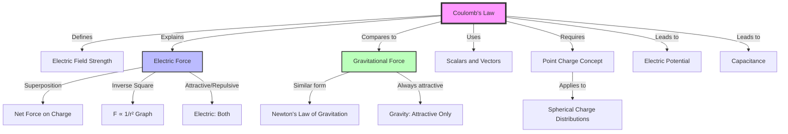

---
# 1. Overview / 概述

**English:**
Coulomb's Law is the foundational quantitative law for electrostatics. It describes the **electrostatic force** between two stationary point charges. This sub-topic explains how to calculate the magnitude and direction of this force, and how it compares to the gravitational force. Understanding Coulomb's Law is essential for analyzing [[Electric Field Strength]] and the behavior of charges in [[Uniform vs Radial Electric Fields]]. It is a direct prerequisite for understanding [[Electric Potential]] and the energy stored in [[Capacitance and Capacitors]].

**中文:**
库仑定律是静电学的基础定量定律。它描述了两个静止点电荷之间的**静电力**。本子知识点解释了如何计算该力的大小和方向，以及它与引力的比较。理解库仑定律对于分析[[Electric Field Strength]]以及电荷在[[Uniform vs Radial Electric Fields]]中的行为至关重要。它也是理解[[Electric Potential]]和[[Capacitance and Capacitors]]中储存能量的直接先决条件。

---

# 2. Syllabus Learning Objectives / 考纲学习目标

| CAIE 9702 (18.1) | Edexcel IAL (WPH14 U4: 2.1-2.5) |
|-----------|-------------|
| (a) State and apply Coulomb's law. | 2.1 Use Coulomb's law to calculate the force between point charges. |
| (b) Calculate the electric force between two point charges. | 2.2 Understand the vector nature of the force (attraction/repulsion). |
| (c) Understand the concept of a point charge. | 2.3 Apply the principle of superposition to forces between multiple charges. |
| (d) Apply the principle of superposition to electric forces. | 2.4 Compare and contrast electric and gravitational forces. |
| (e) Compare and contrast electric and gravitational forces. | 2.5 Understand the concept of a point charge and the inverse square law. |

**Examiner Expectations / 考官期望:**
- **EN:** Students must be able to apply the inverse square law correctly, handle vector addition of forces (superposition), and use the correct units (N, C, m). A common trick is to ask for the force on a charge in a system of three or more charges.
- **CN:** 学生必须能够正确应用平方反比定律，处理力的矢量加法（叠加原理），并使用正确的单位（N, C, m）。一个常见的陷阱是要求计算在三个或更多电荷系统中某个电荷所受的力。

---

# 3. Core Definitions / 核心定义

| Term (EN/CN) | Definition (EN) | Definition (CN) | Common Mistakes / 常见错误 |
|--------------|-----------------|-----------------|---------------------------|
| **Coulomb's Law** / 库仑定律 | The electrostatic force between two point charges is directly proportional to the product of the charges and inversely proportional to the square of the distance between them. | 两个点电荷之间的静电力与它们电荷量的乘积成正比，与它们之间距离的平方成反比。 | Forgetting the $1/r^2$ relationship; using $1/r$ instead. / 忘记 $1/r^2$ 关系；误用 $1/r$。 |
| **Point Charge** / 点电荷 | An idealized charge concentrated at a single point in space. | 理想化的、集中在空间某一点的电荷。 | Applying the law to extended objects without assuming charge is concentrated at the center. / 在未假设电荷集中在中心的情况下，将定律应用于扩展物体。 |
| **Permittivity of Free Space ($\varepsilon_0$)** / 真空介电常数 | A physical constant representing the ability of a vacuum to permit electric field lines. Value: $8.85 \times 10^{-12} \, \text{F m}^{-1}$. | 一个物理常数，代表真空允许电场线通过的能力。数值：$8.85 \times 10^{-12} \, \text{F m}^{-1}$。 | Confusing with relative permittivity ($\varepsilon_r$). / 与相对介电常数 ($\varepsilon_r$) 混淆。 |
| **Principle of Superposition** / 叠加原理 | The net force on a charge is the vector sum of all individual forces acting on it from other charges. | 一个电荷所受的净力是其他电荷作用在它身上的所有单个力的矢量和。 | Adding forces as scalars instead of vectors. / 将力作为标量而不是矢量相加。 |
| **Inverse Square Law** / 平方反比定律 | A physical law where a quantity is inversely proportional to the square of the distance from the source. | 一个物理定律，其中某个物理量与距源的距离的平方成反比。 | Applying it to forces that don't follow this law (e.g., strong nuclear force). / 将其应用于不遵循此定律的力（例如，强核力）。 |

---

# 4. Key Concepts Explained / 关键概念详解

## 4.1 The Nature of the Coulomb Force / 库仑力的性质

### Explanation / 解释
**English:**
Coulomb's Law is mathematically expressed as:
$$ F = \frac{1}{4\pi\varepsilon_0} \frac{Q_1 Q_2}{r^2} $$
Where $F$ is the magnitude of the force, $Q_1$ and $Q_2$ are the magnitudes of the two charges, $r$ is the distance between their centers, and $\varepsilon_0$ is the permittivity of free space ($8.85 \times 10^{-12} \, \text{F m}^{-1}$). The constant $k = \frac{1}{4\pi\varepsilon_0} \approx 8.99 \times 10^9 \, \text{N m}^2 \text{C}^{-2}$.

The force is **attractive** for opposite charges and **repulsive** for like charges. This is a **non-contact** force that acts through a vacuum. It is a **central force**, meaning it acts along the line joining the two charges.

**中文:**
库仑定律的数学表达式为：
$$ F = \frac{1}{4\pi\varepsilon_0} \frac{Q_1 Q_2}{r^2} $$
其中 $F$ 是力的大小，$Q_1$ 和 $Q_2$ 是两个电荷的电荷量大小，$r$ 是它们中心之间的距离，$\varepsilon_0$ 是真空介电常数 ($8.85 \times 10^{-12} \, \text{F m}^{-1}$)。常数 $k = \frac{1}{4\pi\varepsilon_0} \approx 8.99 \times 10^9 \, \text{N m}^2 \text{C}^{-2}$。

该力对于**异种电荷是吸引力**，对于**同种电荷是排斥力**。这是一种**非接触力**，可以在真空中作用。它是一种**有心力**，意味着它沿着连接两个电荷的直线作用。

### Physical Meaning / 物理意义
**English:**
The $1/r^2$ relationship means that if you double the distance between two charges, the force between them becomes one-quarter of its original value. This is the same mathematical form as [[Gravitational Force and Field]] (Newton's Law of Gravitation), but with a key difference: gravity is always attractive, while the electric force can be attractive or repulsive.

**中文:**
$1/r^2$ 关系意味着，如果你将两个电荷之间的距离加倍，它们之间的力将变为原来值的四分之一。这与[[Gravitational Force and Field]]（牛顿万有引力定律）具有相同的数学形式，但有一个关键区别：引力总是吸引的，而电力可以是吸引的或排斥的。

### Common Misconceptions / 常见误区
- **EN:** Thinking the force on $Q_1$ is different from the force on $Q_2$. (They are equal in magnitude and opposite in direction — Newton's 3rd Law).
- **CN:** 认为作用在 $Q_1$ 上的力与作用在 $Q_2$ 上的力不同。（它们大小相等，方向相反——牛顿第三定律）。
- **EN:** Forgetting to square the distance $r$.
- **CN:** 忘记对距离 $r$ 进行平方。
- **EN:** Using the sign of the charge in the magnitude calculation. (Use absolute values for magnitude, then determine direction separately).
- **CN:** 在大小计算中使用电荷的符号。（使用绝对值计算大小，然后单独确定方向）。

### Exam Tips / 考试提示
- **EN:** Always draw a free-body force diagram for the charge in question. This helps with vector addition.
- **CN:** 始终为所讨论的电荷画一个受力分析图。这有助于进行矢量加法。
- **EN:** Remember the constant $k = 8.99 \times 10^9$ is given in the formula booklet for both CIE and Edexcel.
- **CN:** 记住常数 $k = 8.99 \times 10^9$ 在 CIE 和 Edexcel 的公式册中都有提供。

> 📷 **IMAGE PROMPT — COULOMB-01: Attraction and Repulsion**
> A clear diagram showing two positive charges with arrows pointing away from each other (repulsion), and a positive and negative charge with arrows pointing towards each other (attraction). Label the force vectors as $F$ and $-F$ to show Newton's 3rd Law.

---

# 5. Essential Equations / 核心公式

## Equation 1: Coulomb's Law (Magnitude)

$$ F = \frac{1}{4\pi\varepsilon_0} \frac{Q_1 Q_2}{r^2} $$

| Symbol (符号) | Meaning (EN) | Meaning (CN) | Unit (单位) |
|--------------|-------------|-------------|------------|
| $F$ | Electrostatic force | 静电力 | N (Newtons) |
| $Q_1, Q_2$ | Magnitudes of point charges | 点电荷的电荷量大小 | C (Coulombs) |
| $r$ | Distance between charge centers | 电荷中心之间的距离 | m (metres) |
| $\varepsilon_0$ | Permittivity of free space | 真空介电常数 | $\text{F m}^{-1}$ |
| $\frac{1}{4\pi\varepsilon_0}$ | Coulomb's constant ($k$) | 库仑常数 ($k$) | $\text{N m}^2 \text{C}^{-2}$ |

**Derivation / 推导:** This is an empirical law, not derived from first principles. It is the electrostatic equivalent of Newton's Law of Gravitation.

**Conditions / 适用条件:**
- **EN:** Only applies to **point charges** (or spherically symmetric charge distributions where the distance is measured from the center). Charges must be **stationary** (or moving slowly relative to each other).
- **CN:** 仅适用于**点电荷**（或球对称电荷分布，距离从中心测量）。电荷必须是**静止的**（或相对彼此缓慢运动）。

**Limitations / 局限性:**
- **EN:** Does not apply to moving charges at high speeds (requires relativistic electrodynamics). Does not account for quantum effects at very small distances.
- **CN:** 不适用于高速运动的电荷（需要相对论电动力学）。在非常小的距离上不考虑量子效应。

---

## Equation 2: Force in a Medium (Relative Permittivity)

$$ F = \frac{1}{4\pi\varepsilon_0 \varepsilon_r} \frac{Q_1 Q_2}{r^2} $$

| Symbol (符号) | Meaning (EN) | Meaning (CN) | Unit (单位) |
|--------------|-------------|-------------|------------|
| $\varepsilon_r$ | Relative permittivity (dielectric constant) | 相对介电常数 | No unit (dimensionless) |

**Conditions / 适用条件:**
- **EN:** Use this when the charges are in an insulating medium (e.g., oil, water, plastic). The force is reduced by a factor of $\varepsilon_r$.
- **CN:** 当电荷处于绝缘介质（例如油、水、塑料）中时使用此公式。力会减小 $\varepsilon_r$ 倍。

> 📋 **Edexcel Only:** Edexcel often asks students to calculate the force in a medium, especially in the context of Millikan's oil drop experiment where the oil provides the medium.

---

# 6. Graphs and Relationships / 图表与关系

## 6.1 Force vs Distance / 力与距离的关系

### Axes / 坐标轴
- **X-axis:** Distance $r$ / 距离 $r$ (m)
- **Y-axis:** Force $F$ / 力 $F$ (N)

### Shape / 形状
- **EN:** A curve showing a steep drop-off. As $r$ increases, $F$ decreases rapidly. The graph is a hyperbola ($F \propto 1/r^2$).
- **CN:** 一条显示急剧下降的曲线。随着 $r$ 增加，$F$ 迅速减小。该图是一条双曲线 ($F \propto 1/r^2$)。

### Gradient Meaning / 斜率含义
- **EN:** The gradient is not constant and has no direct physical meaning in this context.
- **CN:** 斜率不是常数，在此上下文中没有直接的物理意义。

### Area Meaning / 面积含义
- **EN:** The area under the $F$ vs $r$ graph represents the work done to move the charges apart, which relates to [[Electric Potential]] energy.
- **CN:** $F$ 与 $r$ 关系图下的面积表示将电荷分开所做的功，这与[[Electric Potential]]能量有关。

### Exam Interpretation / 考试解读
- **EN:** Be able to sketch this graph. Compare it to the $F$ vs $r$ graph for gravity (same shape, different scale).
- **CN:** 能够画出此图的草图。将其与引力的 $F$ 与 $r$ 关系图进行比较（形状相同，比例不同）。

> 📷 **IMAGE PROMPT — COULOMB-02: Force vs Distance Graph**
> A graph with $F$ on the y-axis and $r$ on the x-axis. The curve starts high near the y-axis and drops steeply, approaching zero as $r$ increases. Label two points: $F$ at $r$ and $F/4$ at $2r$ to illustrate the inverse square law.

---

# 7. Required Diagrams / 必备图表

## 7.1 Force Diagram for Three Charges in a Line / 三个电荷在一条直线上的力图

### Description / 描述
**English:** A diagram showing three point charges ($Q_1$, $Q_2$, $Q_3$) placed along a straight line. Arrows indicate the forces acting on the middle charge ($Q_2$) due to $Q_1$ and $Q_3$. This illustrates the principle of superposition.

**中文:** 一个显示三个点电荷 ($Q_1$, $Q_2$, $Q_3$) 沿直线放置的图。箭头表示由于 $Q_1$ 和 $Q_3$ 作用在中间电荷 ($Q_2$) 上的力。这说明了叠加原理。

### Image Prompt / 图片生成提示
> 📷 **IMAGE PROMPT — COULOMB-03: Superposition of Forces**
> Three charges on a horizontal line: $Q_1 = +2\mu C$ on the left, $Q_2 = -1\mu C$ in the middle, $Q_3 = +3\mu C$ on the right. Draw force vectors on $Q_2$: $F_{12}$ pointing left (attraction), $F_{32}$ pointing right (attraction). Show the resultant force $F_{net}$ as a vector sum.

### Labels Required / 需要标注
- **EN:** $Q_1$, $Q_2$, $Q_3$, $F_{12}$, $F_{32}$, $F_{net}$, distances $r_{12}$ and $r_{23}$.
- **CN:** $Q_1$, $Q_2$, $Q_3$, $F_{12}$, $F_{32}$, $F_{net}$, 距离 $r_{12}$ 和 $r_{23}$。

### Exam Importance / 考试重要性
- **EN:** High. Superposition questions are very common in both CIE and Edexcel exams.
- **CN:** 高。叠加问题在 CIE 和 Edexcel 考试中都非常常见。

---

# 8. Worked Examples / 典型例题

## Example 1: Force Between Two Charges / 两个电荷之间的力

### Question / 题目
**English:**
Two point charges, $Q_1 = +4.0 \, \mu C$ and $Q_2 = -6.0 \, \mu C$, are placed 0.30 m apart in a vacuum. Calculate the magnitude of the electrostatic force between them. State whether the force is attractive or repulsive.

**中文:**
两个点电荷，$Q_1 = +4.0 \, \mu C$ 和 $Q_2 = -6.0 \, \mu C$，在真空中相距 0.30 m。计算它们之间静电力的大小。说明该力是吸引力还是排斥力。

### Solution / 解答
**Step 1:** Write down the formula.
$$ F = \frac{1}{4\pi\varepsilon_0} \frac{Q_1 Q_2}{r^2} $$

**Step 2:** Substitute values. Remember $1 \, \mu C = 1 \times 10^{-6} \, C$.
$$ F = (8.99 \times 10^9) \times \frac{(4.0 \times 10^{-6}) \times (6.0 \times 10^{-6})}{(0.30)^2} $$

**Step 3:** Calculate.
$$ F = (8.99 \times 10^9) \times \frac{24 \times 10^{-12}}{0.09} $$
$$ F = (8.99 \times 10^9) \times (2.67 \times 10^{-10}) $$
$$ F = 2.4 \, \text{N} $$

**Step 4:** Determine direction. Opposite charges attract.
**Direction:** Attractive / 吸引力

### Final Answer / 最终答案
**Answer:** $F = 2.4 \, \text{N}$, Attractive | **答案：** $F = 2.4 \, \text{N}$，吸引力

### Quick Tip / 提示
- **EN:** Always convert $\mu C$ to $C$ before calculation. Use absolute values for magnitude.
- **CN:** 计算前务必将 $\mu C$ 转换为 $C$。使用绝对值计算大小。

---

## Example 2: Superposition of Forces / 力的叠加

### Question / 题目
**English:**
Three charges are placed on a straight line: $Q_1 = +2 \, \mu C$ at $x = 0 \, \text{m}$, $Q_2 = -1 \, \mu C$ at $x = 0.2 \, \text{m}$, and $Q_3 = +3 \, \mu C$ at $x = 0.5 \, \text{m}$. Calculate the net force on $Q_2$.

**中文:**
三个电荷放置在一条直线上：$Q_1 = +2 \, \mu C$ 在 $x = 0 \, \text{m}$ 处，$Q_2 = -1 \, \mu C$ 在 $x = 0.2 \, \text{m}$ 处，$Q_3 = +3 \, \mu C$ 在 $x = 0.5 \, \text{m}$ 处。计算作用在 $Q_2$ 上的净力。

### Solution / 解答
**Step 1:** Calculate force from $Q_1$ on $Q_2$ ($F_{12}$).
$r_{12} = 0.2 \, \text{m}$. Opposite charges → Attractive → $F_{12}$ points left (towards $Q_1$).
$$ F_{12} = (8.99 \times 10^9) \times \frac{(2 \times 10^{-6})(1 \times 10^{-6})}{(0.2)^2} = 0.45 \, \text{N} $$

**Step 2:** Calculate force from $Q_3$ on $Q_2$ ($F_{32}$).
$r_{23} = 0.5 - 0.2 = 0.3 \, \text{m}$. Opposite charges → Attractive → $F_{32}$ points right (towards $Q_3$).
$$ F_{32} = (8.99 \times 10^9) \times \frac{(3 \times 10^{-6})(1 \times 10^{-6})}{(0.3)^2} = 0.30 \, \text{N} $$

**Step 3:** Vector addition. Take left as negative, right as positive.
$$ F_{net} = -F_{12} + F_{32} = -0.45 + 0.30 = -0.15 \, \text{N} $$

**Step 4:** Interpret the sign.
The net force is $0.15 \, \text{N}$ to the left.

### Final Answer / 最终答案
**Answer:** $F_{net} = 0.15 \, \text{N}$ to the left | **答案：** $F_{net} = 0.15 \, \text{N}$，方向向左

### Quick Tip / 提示
- **EN:** Always define a positive direction before adding forces. Draw the diagram first!
- **CN:** 在相加力之前，务必定义一个正方向。先画图！

---

# 9. Past Paper Question Types / 历年真题题型

| Question Type / 题型 | Frequency / 频率 | Difficulty / 难度 | Past Paper References / 真题索引 |
|----------------------|------------------|------------------|-------------------------------|
| Calculate force between two point charges | Very High | Easy | 📝 *待填入* |
| Superposition of forces (3 charges in a line) | High | Medium | 📝 *待填入* |
| Superposition of forces (2D, vector addition) | Medium | Hard | 📝 *待填入* |
| Compare electric and gravitational forces | Medium | Medium | 📝 *待填入* |
| Force in a medium (relative permittivity) | Low (Edexcel) | Medium | 📝 *待填入* |

**Common Command Words / 常见指令词:**
- **EN:** "Calculate", "Determine", "State", "Explain", "Compare and contrast", "Sketch".
- **CN:** "计算"，"确定"，"说明"，"解释"，"比较和对比"，"画出草图"。

---

# 10. Practical Skills Connections / 实验技能链接

**English:**
Coulomb's Law is difficult to verify directly in a school lab due to the small forces involved and the difficulty of isolating charges. However, the concept is crucial for understanding:

1. **Millikan's Oil Drop Experiment:** The electric force ($F = QE$) is balanced against the gravitational force ($F = mg$). The charge on the oil drop is calculated using principles derived from Coulomb's Law.
2. **Charging by Friction/Induction:** Understanding how charges interact helps predict the behavior of electroscopes and gold-leaf experiments.
3. **Uncertainties:** When calculating force, uncertainties in distance measurement ($\Delta r$) have a squared effect on the uncertainty in force ($\Delta F/F = 2 \Delta r/r$).

**中文:**
由于涉及的力很小且难以隔离电荷，库仑定律很难在学校实验室中直接验证。然而，这个概念对于理解以下内容至关重要：

1. **密立根油滴实验：** 电力 ($F = QE$) 与重力 ($F = mg$) 平衡。油滴上的电荷是使用源自库仑定律的原理计算的。
2. **摩擦/感应起电：** 理解电荷如何相互作用有助于预测验电器和金箔实验的行为。
3. **不确定度：** 计算力时，距离测量 ($\Delta r$) 的不确定度对方的不确定度有平方效应 ($\Delta F/F = 2 \Delta r/r$)。

---

# 11. Concept Map / 概念图谱

---

# 12. Quick Revision Sheet / 速查表

| Category / 类别 | Key Points / 要点 |
|----------------|------------------|
| **Definition / 定义** | Force between two point charges: $F \propto Q_1 Q_2 / r^2$ |
| **Key Formula / 核心公式** | $F = \frac{1}{4\pi\varepsilon_0} \frac{Q_1 Q_2}{r^2}$ where $k = 8.99 \times 10^9 \, \text{N m}^2 \text{C}^{-2}$ |
| **Key Graph / 核心图表** | $F$ vs $r$: Hyperbola ($F \propto 1/r^2$). Doubling $r$ → $F$ becomes $F/4$. |
| **Superposition / 叠加原理** | Net force = vector sum of all individual forces. Always draw a diagram! |
| **Comparison to Gravity / 与引力比较** | Same $1/r^2$ form. Gravity: always attractive, much weaker. Electric: attractive or repulsive, much stronger. |
| **Exam Tip / 考试提示** | Convert $\mu C$ to $C$ ($1 \mu C = 10^{-6} C$). Use absolute values for magnitude. Define a positive direction for vector addition. |