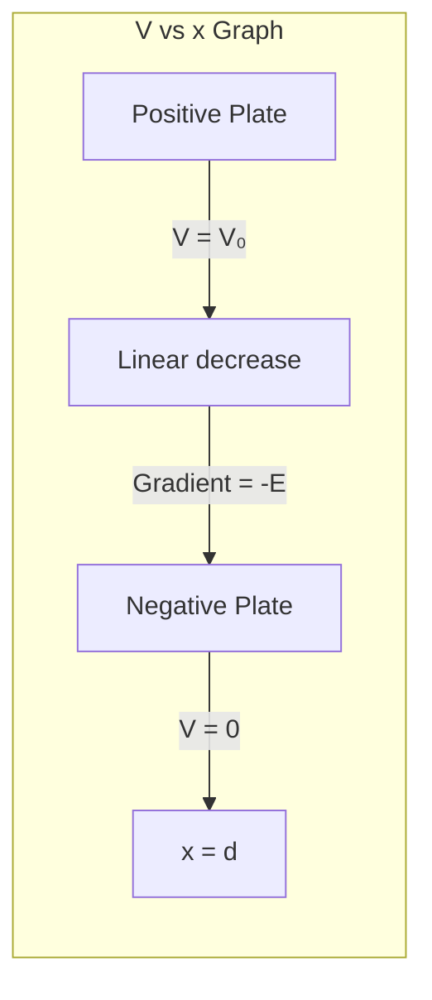

# 1. Overview / 概述

**English:**
The electric field between two parallel conducting plates is one of the most important and practical configurations in electrostatics. This sub-topic explores the **uniform electric field** created when a potential difference is applied across two parallel, equally-sized plates. Unlike the radial field around a point charge, the field between parallel plates is **constant in magnitude and direction** (except near the edges). This uniform field is the foundation for understanding [[Capacitance and Capacitors]], particle accelerators, cathode ray tubes (CRTs), and Millikan's oil drop experiment. You will learn how to calculate the field strength from the plate separation and voltage, analyze the motion of charged particles within this field, and understand the concept of edge effects. This sub-topic directly builds on [[Electric Field Concept and Field Lines]] and [[Electric Field Strength]], and is a prerequisite for [[Electric Potential]].

**中文:**
两块平行导电板之间的电场是静电学中最重要且最实用的配置之一。本子知识点探讨当在两块平行、等大的板之间施加电势差时产生的**匀强电场**。与点电荷周围的径向场不同，平行板之间的电场**大小和方向都恒定**（边缘附近除外）。这种匀强场是理解[[Capacitance and Capacitors]]、粒子加速器、阴极射线管（CRT）以及密立根油滴实验的基础。你将学习如何根据板间距和电压计算场强，分析带电粒子在该场中的运动，并理解边缘效应的概念。本子知识点直接建立在[[Electric Field Concept and Field Lines]]和[[Electric Field Strength]]之上，也是学习[[Electric Potential]]的先决条件。

---

# 2. Syllabus Learning Objectives / 考纲学习目标

| CAIE 9702 (18.1) | Edexcel IAL (WPH14 U4: 2.1-2.5) |
|-----------|-------------|
| (a) Describe and represent a uniform electric field between two parallel plates | 2.1 Understand that an electric field is a region where a charge experiences a force |
| (b) Recall and use $E = V/d$ for a uniform electric field | 2.2 Use $E = V/d$ for a uniform electric field |
| (c) Describe the effect of a uniform electric field on the motion of charged particles | 2.3 Analyse the motion of charged particles in uniform electric fields |
| (d) Understand the concept of edge effects | 2.4 Understand the concept of edge effects (fringing fields) |
| (e) Calculate the force on a charge in a uniform field: $F = EQ = \frac{VQ}{d}$ | 2.5 Use $F = EQ$ to solve problems |

**Examiner Expectations / 考官期望:**
- **CAIE:** You must be able to draw the uniform field pattern (equally spaced, parallel lines from + to -) and explain why it is uniform. You must apply $E = V/d$ to problems involving charged particles (e.g., oil drops, electrons). Edge effects are qualitative only.
- **Edexcel:** You must be able to derive $E = V/d$ from $E = F/Q$ and $W = QV$. You must analyze projectile motion of charged particles entering a uniform field perpendicularly. Edge effects are considered qualitatively but may appear in multiple-choice questions.

---

# 3. Core Definitions / 核心定义

| Term (EN/CN) | Definition (EN) | Definition (CN) | Common Mistakes / 常见错误 |
|--------------|-----------------|-----------------|---------------------------|
| **Uniform Electric Field** / 匀强电场 | An electric field where the electric field strength $E$ is constant in both magnitude and direction at every point. | 电场强度 $E$ 在每个点的大小和方向都恒定的电场。 | ❌ Thinking the field is uniform everywhere, including outside the plates. |
| **Parallel Plates** / 平行板 | Two flat, conducting surfaces placed parallel to each other, separated by a distance $d$, with a potential difference $V$ applied across them. | 两块平坦的导电表面，彼此平行放置，间距为 $d$，两端施加电势差 $V$。 | ❌ Forgetting that the plates must be conducting and connected to a power supply. |
| **Edge Effects (Fringing)** / 边缘效应（边缘场） | The non-uniform distortion of the electric field near the edges of parallel plates, where field lines bulge outward. | 平行板边缘附近电场的不均匀扭曲，电场线向外凸出。 | ❌ Assuming the field is perfectly uniform right up to the edge. |
| **Electric Field Strength (between plates)** / 板间电场强度 | The force per unit positive charge experienced by a test charge placed between the plates, given by $E = V/d$. | 放置在板间的测试电荷所受到的每单位正电荷的力，由 $E = V/d$ 给出。 | ❌ Confusing $E$ (field strength) with $V$ (potential difference). |
| **Charged Particle Motion** / 带电粒子运动 | The trajectory of a charged particle (e.g., electron, proton) when it enters or is placed in a uniform electric field, experiencing a constant force $F = QE$. | 带电粒子（如电子、质子）进入或放置在匀强电场中时，受到恒力 $F = QE$ 作用而产生的轨迹。 | ❌ Forgetting that the acceleration is constant (like projectile motion under gravity). |

---

# 4. Key Concepts Explained / 关键概念详解

## 4.1 The Uniform Field Between Parallel Plates / 平行板间的匀强电场

### Explanation / 解释
**English:**
When a potential difference $V$ is applied across two parallel conducting plates separated by a distance $d$, an electric field is established between them. Inside the region between the plates (away from the edges), the field lines are **straight, parallel, and equally spaced**. This indicates that the electric field strength $E$ is **constant** at all points. The field direction is from the positive plate to the negative plate. This is fundamentally different from the [[Radial Fields]] around a point charge, where $E \propto 1/r^2$. The uniformity arises because the plates are large compared to their separation, so the charge distribution on the plates is approximately uniform.

**中文:**
当在两块相距 $d$ 的平行导电板之间施加电势差 $V$ 时，它们之间会建立起电场。在板之间的区域（远离边缘），电场线是**笔直、平行且等间距**的。这表明电场强度 $E$ 在所有点都是**恒定**的。场的方向从正极板指向负极板。这与点电荷周围的[[Radial Fields|径向场]]（其中 $E \propto 1/r^2$）有根本不同。均匀性源于板的尺寸远大于其间距，因此板上的电荷分布近似均匀。

### Physical Meaning / 物理意义
**English:**
A uniform field means that a test charge placed anywhere between the plates experiences the **same force** (both magnitude and direction). This is analogous to the uniform gravitational field near the Earth's surface ($g$ is constant). This constancy allows us to use simple kinematic equations to predict the motion of charged particles.

**中文:**
匀强场意味着放置在板间任何位置的测试电荷都受到**相同的力**（大小和方向都相同）。这类似于地球表面附近的匀强引力场（$g$ 恒定）。这种恒定性使我们能够使用简单的运动学方程来预测带电粒子的运动。

### Common Misconceptions / 常见误区
- ❌ **"The field is uniform everywhere."** — No, only between the plates and away from the edges. Outside the plates, the field is negligible (for large plates).
- ❌ **"The field lines start and end at the same plate."** — No, they go from the positive plate to the negative plate.
- ❌ **"The field strength depends on the charge on the test particle."** — No, $E$ is a property of the field itself, independent of the test charge.

### Exam Tips / 考试提示
- **Drawing field lines:** Always draw arrows from + to -, equally spaced, parallel, and perpendicular to the plates.
- **Calculating $E$:** Use $E = V/d$ only for uniform fields. For radial fields, use $E = \frac{Q}{4\pi\epsilon_0 r^2}$.
- **Units:** $E$ is in V m⁻¹ or N C⁻¹ (they are equivalent).

> 📷 **IMAGE PROMPT — DIAGRAM-01: Uniform Electric Field Between Parallel Plates**
> A clear, labeled diagram showing two parallel horizontal plates. The top plate is labeled "+" (positive) and the bottom plate is labeled "-" (negative). Between them, draw 5-7 equally spaced, parallel, vertical arrows pointing downward from the positive plate to the negative plate. Label the plate separation as "d" and the potential difference as "V". Add a dashed box in the center to indicate the "uniform region" and curved lines at the edges to show "edge effects (fringing)". Use a clean, textbook-style vector graphic.

---

## 4.2 Derivation of $E = V/d$ / $E = V/d$ 的推导

### Explanation / 解释
**English:**
Consider a small positive test charge $+q$ moved from the negative plate to the positive plate. The work done $W$ by the electric field is:
$$W = F \times d = qE \times d$$
This work done equals the change in electric potential energy, which is $qV$ (where $V$ is the potential difference between the plates). Therefore:
$$qEd = qV$$
Cancelling $q$ gives:
$$E = \frac{V}{d}$$
This derivation assumes the field is uniform (constant $E$).

**中文:**
考虑一个小的正测试电荷 $+q$ 从负极板移动到正极板。电场做的功 $W$ 为：
$$W = F \times d = qE \times d$$
这个功等于电势能的变化，即 $qV$（其中 $V$ 是板间的电势差）。因此：
$$qEd = qV$$
消去 $q$ 得到：
$$E = \frac{V}{d}$$
这个推导假设电场是均匀的（$E$ 恒定）。

### Physical Meaning / 物理意义
**English:**
The equation $E = V/d$ tells us that the electric field strength is directly proportional to the voltage applied and inversely proportional to the plate separation. For a fixed voltage, bringing the plates closer together increases the field strength.

**中文:**
方程 $E = V/d$ 告诉我们，电场强度与施加的电压成正比，与板间距成反比。对于固定电压，将板靠近会增加场强。

### Common Misconceptions / 常见误区
- ❌ **"$E = V/d$ applies to all electric fields."** — No, only uniform fields.
- ❌ **"$V$ is the voltage at a point."** — No, $V$ here is the potential *difference* between the plates.

### Exam Tips / 考试提示
- You may be asked to derive $E = V/d$ in a "show that" question.
- Remember: $1 \text{ V m}^{-1} = 1 \text{ N C}^{-1}$.

---

## 4.3 Motion of Charged Particles in a Uniform Field / 带电粒子在匀强电场中的运动

### Explanation / 解释
**English:**
When a charged particle (e.g., electron, proton, alpha particle) enters a uniform electric field, it experiences a **constant force** $F = QE$. This produces a **constant acceleration** $a = F/m = QE/m$. The motion is analogous to **projectile motion under gravity**:
- **Parallel to the field:** Constant acceleration (linear motion or parabolic).
- **Perpendicular to the field:** Constant velocity (no force).

**Case 1: Particle released from rest between plates**
- It accelerates straight toward the opposite plate.
- Final speed: $v = \sqrt{2a d} = \sqrt{\frac{2QV}{m}}$ (using energy: $QV = \frac{1}{2}mv^2$).

**Case 2: Particle enters perpendicular to the field (like a horizontal projectile)**
- Horizontal motion: constant velocity $v_x$.
- Vertical motion: constant acceleration $a_y = QE/m$.
- The trajectory is **parabolic**.

**中文:**
当带电粒子（如电子、质子、α粒子）进入匀强电场时，它受到**恒力** $F = QE$ 的作用。这产生**恒定加速度** $a = F/m = QE/m$。其运动类似于**重力作用下的抛体运动**：
- **平行于电场方向：** 恒定加速度（直线运动或抛物线运动）。
- **垂直于电场方向：** 匀速运动（无作用力）。

**情况1：粒子从板间静止释放**
- 它径直向对面极板加速运动。
- 最终速度：$v = \sqrt{2a d} = \sqrt{\frac{2QV}{m}}$（利用能量：$QV = \frac{1}{2}mv^2$）。

**情况2：粒子垂直于电场进入（如水平抛体）**
- 水平运动：匀速 $v_x$。
- 竖直运动：匀加速 $a_y = QE/m$。
- 轨迹为**抛物线**。

### Physical Meaning / 物理意义
**English:**
The constant force means the particle's velocity component parallel to the field changes linearly with time. This is used in devices like **cathode ray tubes (CRTs)** and **oscilloscopes** to deflect electron beams.

**中文:**
恒力意味着粒子平行于电场方向的速度分量随时间线性变化。这用于**阴极射线管（CRT）**和**示波器**等设备中来偏转电子束。

### Common Misconceptions / 常见误区
- ❌ **"The particle moves in a straight line."** — Only if it enters parallel to the field or is released from rest. If it enters at an angle, the path is parabolic.
- ❌ **"The acceleration depends on the particle's speed."** — No, acceleration is constant because $F = QE$ is constant.

### Exam Tips / 考试提示
- **Energy approach:** Often easier than kinematics: $QV = \frac{1}{2}mv^2$ for a particle accelerated from rest through a potential difference $V$.
- **Deflection problems:** Use $s = ut + \frac{1}{2}at^2$ separately for horizontal and vertical components.
- **Sign convention:** For an electron ($Q = -e$), the force is opposite to the field direction.

> 📷 **IMAGE PROMPT — DIAGRAM-02: Charged Particle Deflection in a Uniform Field**
> A diagram showing two parallel plates (top positive, bottom negative). An electron beam enters horizontally from the left between the plates. The beam curves downward in a parabolic path. Label the horizontal velocity as "v_x (constant)" and the vertical acceleration as "a_y = QE/m". Show the deflection angle θ at the exit. Use dashed lines to indicate the parabolic trajectory. Include labels: "Plate separation d", "Potential difference V", "Deflection y".

---

## 4.4 Edge Effects (Fringing Fields) / 边缘效应（边缘场）

### Explanation / 解释
**English:**
Near the edges of the parallel plates, the electric field is **not uniform**. The field lines "bulge" outward, curving from the edge of one plate to the edge of the other. This is called **edge effects** or **fringing**. The field strength near the edges is lower than in the center, and the direction is no longer perpendicular to the plates. For most A-Level calculations, we **ignore edge effects** and assume the field is perfectly uniform. However, you must be aware that they exist and can affect the accuracy of experiments (e.g., Millikan's oil drop experiment).

**中文:**
在平行板的边缘附近，电场是**不均匀的**。电场线向外"凸出"，从一块板的边缘弯曲到另一块板的边缘。这称为**边缘效应**或**边缘场**。边缘附近的场强低于中心区域，方向也不再垂直于板面。对于大多数A-Level计算，我们**忽略边缘效应**并假设场是完全均匀的。但是，你必须意识到它们的存在，并且它们会影响实验的准确性（例如密立根油滴实验）。

### Physical Meaning / 物理意义
**English:**
Edge effects are a consequence of the finite size of the plates. If the plates were infinitely large, the field would be perfectly uniform everywhere. In practice, to minimize edge effects, the plate separation $d$ should be much smaller than the plate dimensions.

**中文:**
边缘效应是板尺寸有限的结果。如果板是无限大的，那么场在任何地方都是完全均匀的。在实践中，为了最小化边缘效应，板间距 $d$ 应远小于板的尺寸。

### Common Misconceptions / 常见误区
- ❌ **"Edge effects increase the field strength."** — No, they decrease it (field lines spread out).
- ❌ **"Edge effects are always negligible."** — Not always; in precise experiments, they must be accounted for.

### Exam Tips / 考试提示
- **Qualitative only:** Both CAIE and Edexcel only require a qualitative understanding of edge effects.
- **Drawing:** When drawing field lines, show them bulging outward at the edges.
- **Application:** Edge effects are why the formula $C = \frac{\epsilon_0 A}{d}$ for [[Capacitance and Capacitors]] is an approximation.

---

# 5. Essential Equations / 核心公式

## Equation 1: Electric Field Strength Between Parallel Plates / 平行板间电场强度

$$ E = \frac{V}{d} $$

| Symbol (符号) | Meaning (EN) | Meaning (CN) | Unit (单位) |
|--------------|-------------|-------------|------------|
| $E$ | Electric field strength | 电场强度 | V m⁻¹ or N C⁻¹ |
| $V$ | Potential difference between plates | 板间电势差 | V (volts) |
| $d$ | Separation between plates | 板间距 | m (metres) |

**Derivation / 推导:** $W = Fd = qEd$ and $W = qV$, so $qEd = qV \Rightarrow E = V/d$.
**Conditions / 适用条件:** Uniform field between parallel plates (ignore edge effects).
**Limitations / 局限性:** Only valid for uniform fields; not applicable to radial fields.

---

## Equation 2: Force on a Charge in a Uniform Field / 匀强电场中电荷所受的力

$$ F = QE = \frac{QV}{d} $$

| Symbol (符号) | Meaning (EN) | Meaning (CN) | Unit (单位) |
|--------------|-------------|-------------|------------|
| $F$ | Force on the charge | 电荷所受的力 | N (newtons) |
| $Q$ | Charge of the particle | 粒子的电荷 | C (coulombs) |
| $E$ | Electric field strength | 电场强度 | V m⁻¹ |

**Derivation / 推导:** From $E = F/Q$, rearranged.
**Conditions / 适用条件:** Any charge in any electric field (but $E$ must be known).
**Limitations / 局限性:** The force is constant only if $E$ is constant (uniform field).

---

## Equation 3: Acceleration of a Charged Particle / 带电粒子的加速度

$$ a = \frac{F}{m} = \frac{QE}{m} = \frac{QV}{md} $$

| Symbol (符号) | Meaning (EN) | Meaning (CN) | Unit (单位) |
|--------------|-------------|-------------|------------|
| $a$ | Acceleration of the particle | 粒子的加速度 | m s⁻² |
| $m$ | Mass of the particle | 粒子的质量 | kg |

**Derivation / 推导:** Newton's second law: $F = ma$, combined with $F = QE$.
**Conditions / 适用条件:** Non-relativistic speeds; constant $E$.
**Limitations / 局限性:** At very high speeds (near light speed), relativistic effects become important.

---

## Equation 4: Kinetic Energy Gained (from rest) / 获得的动能（从静止开始）

$$ \frac{1}{2}mv^2 = QV $$

| Symbol (符号) | Meaning (EN) | Meaning (CN) | Unit (单位) |
|--------------|-------------|-------------|------------|
| $v$ | Final speed of the particle | 粒子的最终速度 | m s⁻¹ |
| $Q$ | Charge of the particle | 粒子的电荷 | C |
| $V$ | Potential difference through which it accelerates | 加速所经过的电势差 | V |

**Derivation / 推导:** Work-energy theorem: work done by field = gain in KE.
**Conditions / 适用条件:** Particle starts from rest; no other forces (e.g., gravity neglected).
**Limitations / 局限性:** Neglects relativistic effects; assumes 100% energy conversion.

---

# 6. Graphs and Relationships / 图表与关系

## 6.1 Electric Field Strength vs. Distance Between Plates / 电场强度 vs. 板间距

### Axes / 坐标轴
- **X-axis:** Plate separation $d$ (m) / 板间距 $d$ (m)
- **Y-axis:** Electric field strength $E$ (V m⁻¹) / 电场强度 $E$ (V m⁻¹)

### Shape / 形状
**English:** For a fixed voltage $V$, $E \propto 1/d$. The graph is a **hyperbola** (inverse relationship). As $d$ increases, $E$ decreases rapidly.

**中文:** 对于固定电压 $V$，$E \propto 1/d$。图形是**双曲线**（反比关系）。随着 $d$ 增加，$E$ 迅速减小。

### Gradient Meaning / 斜率含义
**English:** The gradient is not constant. The gradient at any point is $dE/dd = -V/d^2$, which is negative and decreases in magnitude as $d$ increases.

**中文:** 斜率不恒定。任意点的斜率为 $dE/dd = -V/d^2$，为负值，且随着 $d$ 增加而减小。

### Area Meaning / 面积含义
**English:** The area under the $E$ vs. $d$ graph has no direct physical meaning in this context.

**中文:** 在此上下文中，$E$ vs. $d$ 图下的面积没有直接的物理意义。

### Exam Interpretation / 考试解读
**English:** You may be asked to sketch this graph or to explain why $E$ decreases when $d$ increases (for constant $V$). Remember: $E = V/d$.

**中文:** 你可能会被要求画出此图或解释为什么当 $d$ 增加时 $E$ 减小（对于恒定 $V$）。记住：$E = V/d$。

---

## 6.2 Potential vs. Distance Between Plates / 电势 vs. 板间距离

### Axes / 坐标轴
- **X-axis:** Distance from the negative plate $x$ (m) / 距负极板的距离 $x$ (m)
- **Y-axis:** Electric potential $V$ (V) / 电势 $V$ (V)

### Shape / 形状
**English:** For a uniform field, the potential decreases **linearly** from the positive plate to the negative plate. The graph is a straight line with a negative gradient.

**中文:** 对于匀强电场，电势从正极板到负极板**线性**减小。图形是一条具有负斜率的直线。

### Gradient Meaning / 斜率含义
**English:** The gradient of the $V$ vs. $x$ graph is $-E$ (the negative of the electric field strength). This is because $E = -dV/dx$.

**中文:** $V$ vs. $x$ 图的斜率为 $-E$（电场强度的负值）。这是因为 $E = -dV/dx$。

### Area Meaning / 面积含义
**English:** The area under the $V$ vs. $x$ graph has no direct physical meaning.

**中文:** $V$ vs. $x$ 图下的面积没有直接的物理意义。

### Exam Interpretation / 考试解读
**English:** This graph is very important. The constant gradient confirms the field is uniform. You may be asked to calculate $E$ from the gradient.

**中文:** 此图非常重要。恒定的斜率证实了场是均匀的。你可能会被要求从斜率计算 $E$。

---

# 7. Required Diagrams / 必备图表

## 7.1 Uniform Field Between Parallel Plates / 平行板间的匀强电场

### Description / 描述
**English:** A diagram showing two parallel conducting plates connected to a DC power supply. The positive plate is at the top, the negative plate at the bottom. Between them, draw equally spaced, parallel, straight field lines with arrows pointing from the positive to the negative plate. Near the edges, show the field lines curving outward (fringing). Label the plate separation $d$, the potential difference $V$, and the uniform field region.

**中文:** 一个显示两块平行导电板连接到直流电源的示意图。正极板在上方，负极板在下方。它们之间，画出等间距、平行、笔直的电场线，箭头从正极板指向负极板。在边缘附近，显示电场线向外弯曲（边缘场）。标注板间距 $d$、电势差 $V$ 和匀强场区域。

### Image Prompt / 图片生成提示
> 📷 **IMAGE PROMPT — DIAGRAM-03: Parallel Plate Field with Edge Effects**
> A clean, textbook-style vector diagram. Two horizontal parallel plates: top plate labeled "+" (red), bottom plate labeled "-" (blue). A battery symbol is connected to the plates with wires. Between the plates, 7 equally spaced vertical arrows pointing downward from top to bottom. At the left and right edges, 3 curved arrows showing fringing fields bulging outward. Labels: "d" (vertical distance between plates), "V" (next to battery), "Uniform region" (dashed rectangle in center), "Edge effects (fringing)" (curved brackets at edges). White background, high contrast.

### Labels Required / 需要标注
| Label (EN) | Label (CN) | Description |
|------------|------------|-------------|
| + | 正极 | Positive plate |
| - | 负极 | Negative plate |
| d | 板间距 | Plate separation |
| V | 电势差 | Potential difference |
| Uniform region | 匀强区域 | Region where field is uniform |
| Edge effects / Fringing | 边缘效应 / 边缘场 | Non-uniform field at edges |

### Exam Importance / 考试重要性
**English:** This is the **most important diagram** for this sub-topic. You must be able to draw it from memory and explain why the field is uniform in the center and non-uniform at the edges.

**中文:** 这是本子知识点**最重要的图表**。你必须能够凭记忆画出它，并解释为什么场在中心是均匀的，在边缘是不均匀的。

---

## 7.2 Charged Particle Deflection / 带电粒子偏转

### Description / 描述
**English:** A diagram showing a charged particle (e.g., an electron) entering a uniform electric field perpendicular to the field direction. The particle follows a parabolic path. Show the horizontal velocity component (constant) and the vertical acceleration (constant). Label the deflection $y$ and the angle of deflection $\theta$.

**中文:** 一个显示带电粒子（如电子）垂直于电场方向进入匀强电场的示意图。粒子沿抛物线路径运动。显示水平速度分量（恒定）和竖直加速度（恒定）。标注偏转量 $y$ 和偏转角 $\theta$。

### Image Prompt / 图片生成提示
> 📷 **IMAGE PROMPT — DIAGRAM-04: Electron Deflection in Parallel Plates**
> A diagram showing two horizontal parallel plates (top positive, bottom negative). An electron (labeled "e⁻") enters horizontally from the left at speed v₀. Inside the plates, the path curves downward in a smooth parabolic arc. At the exit, the path continues in a straight line at an angle θ below the horizontal. Labels: "v_x (constant)" along the horizontal, "a_y = eE/m" along the vertical, "Deflection y" as a vertical arrow from the original path to the exit point, "θ" as the deflection angle. Dashed lines show the original straight path.

### Labels Required / 需要标注
| Label (EN) | Label (CN) | Description |
|------------|------------|-------------|
| v₀ | 初速度 | Initial horizontal velocity |
| v_x | 水平速度 | Horizontal velocity (constant) |
| a_y | 竖直加速度 | Vertical acceleration (constant) |
| y | 偏转量 | Vertical deflection |
| θ | 偏转角 | Deflection angle |
| e⁻ | 电子 | Electron (negative charge) |

### Exam Importance / 考试重要性
**English:** This diagram is essential for understanding the motion of charged particles in uniform fields. It is frequently tested in exam questions about deflection.

**中文:** 此图对于理解带电粒子在匀强电场中的运动至关重要。在关于偏转的考试题目中经常被考查。

---

# 8. Worked Examples / 典型例题

## Example 1: Calculating Field Strength / 例1：计算电场强度

### Question / 题目
**English:**
Two parallel plates are separated by a distance of 5.0 cm. A potential difference of 200 V is applied across them. Calculate:
(a) The electric field strength between the plates.
(b) The force on an electron placed between the plates.
(Charge of electron $e = 1.60 \times 10^{-19}$ C)

**中文:**
两块平行板相距 5.0 cm。它们之间施加 200 V 的电势差。计算：
(a) 板间的电场强度。
(b) 放置在板间的电子所受的力。
（电子电荷 $e = 1.60 \times 10^{-19}$ C）

### Solution / 解答

**Part (a):**
$$E = \frac{V}{d} = \frac{200}{0.050} = 4000 \text{ V m}^{-1}$$

**Part (b):**
$$F = QE = (1.60 \times 10^{-19})(4000) = 6.4 \times 10^{-16} \text{ N}$$

**Direction:** The force on the electron is upward (toward the positive plate) because the electron is negative and the field direction is from positive to negative.

**中文:**
**部分 (a):**
$$E = \frac{V}{d} = \frac{200}{0.050} = 4000 \text{ V m}^{-1}$$

**部分 (b):**
$$F = QE = (1.60 \times 10^{-19})(4000) = 6.4 \times 10^{-16} \text{ N}$$

**方向：** 电子所受的力向上（朝向正极板），因为电子带负电，而电场方向从正极指向负极。

### Final Answer / 最终答案
**Answer:** (a) $E = 4000$ V m⁻¹ | (b) $F = 6.4 \times 10^{-16}$ N upward | **答案：** (a) $E = 4000$ V m⁻¹ | (b) $F = 6.4 \times 10^{-16}$ N 向上

### Quick Tip / 提示
**English:** Always convert cm to m before using $E = V/d$. Remember the direction of force for negative charges is opposite to the field direction.

**中文:** 在使用 $E = V/d$ 之前，务必将 cm 转换为 m。记住负电荷所受力的方向与电场方向相反。

---

## Example 2: Electron Accelerated Between Plates / 例2：电子在板间加速

### Question / 题目
**English:**
An electron is released from rest at the negative plate of a parallel plate arrangement. The plates are 2.0 cm apart and the potential difference is 500 V. Calculate:
(a) The speed of the electron when it reaches the positive plate.
(b) The time taken for the electron to travel between the plates.
(Mass of electron $m_e = 9.11 \times 10^{-31}$ kg, $e = 1.60 \times 10^{-19}$ C)

**中文:**
一个电子从平行板装置的负极板由静止释放。板间距为 2.0 cm，电势差为 500 V。计算：
(a) 电子到达正极板时的速度。
(b) 电子在板间运动所需的时间。
（电子质量 $m_e = 9.11 \times 10^{-31}$ kg，$e = 1.60 \times 10^{-19}$ C）

### Solution / 解答

**Part (a): Using energy conservation**
The work done by the electric field equals the gain in kinetic energy:
$$eV = \frac{1}{2}mv^2$$
$$v = \sqrt{\frac{2eV}{m}} = \sqrt{\frac{2(1.60 \times 10^{-19})(500)}{9.11 \times 10^{-31}}}$$
$$v = \sqrt{\frac{1.60 \times 10^{-16}}{9.11 \times 10^{-31}}} = \sqrt{1.756 \times 10^{14}}$$
$$v = 1.33 \times 10^7 \text{ m s}^{-1}$$

**Part (b): Using kinematics**
First, find the acceleration:
$$a = \frac{F}{m} = \frac{eE}{m} = \frac{e(V/d)}{m} = \frac{(1.60 \times 10^{-19})(500/0.020)}{9.11 \times 10^{-31}}$$
$$a = \frac{(1.60 \times 10^{-19})(25000)}{9.11 \times 10^{-31}} = \frac{4.0 \times 10^{-15}}{9.11 \times 10^{-31}} = 4.39 \times 10^{15} \text{ m s}^{-2}$$

Using $s = ut + \frac{1}{2}at^2$ with $u = 0$:
$$0.020 = 0 + \frac{1}{2}(4.39 \times 10^{15})t^2$$
$$t^2 = \frac{0.040}{4.39 \times 10^{15}} = 9.11 \times 10^{-18}$$
$$t = 3.02 \times 10^{-9} \text{ s} = 3.02 \text{ ns}$$

**中文:**
**部分 (a): 使用能量守恒**
电场做的功等于动能的增加：
$$eV = \frac{1}{2}mv^2$$
$$v = \sqrt{\frac{2eV}{m}} = \sqrt{\frac{2(1.60 \times 10^{-19})(500)}{9.11 \times 10^{-31}}}$$
$$v = \sqrt{\frac{1.60 \times 10^{-16}}{9.11 \times 10^{-31}}} = \sqrt{1.756 \times 10^{14}}$$
$$v = 1.33 \times 10^7 \text{ m s}^{-1}$$

**部分 (b): 使用运动学**
首先，求加速度：
$$a = \frac{F}{m} = \frac{eE}{m} = \frac{e(V/d)}{m} = \frac{(1.60 \times 10^{-19})(500/0.020)}{9.11 \times 10^{-31}}$$
$$a = \frac{(1.60 \times 10^{-19})(25000)}{9.11 \times 10^{-31}} = \frac{4.0 \times 10^{-15}}{9.11 \times 10^{-31}} = 4.39 \times 10^{15} \text{ m s}^{-2}$$

使用 $s = ut + \frac{1}{2}at^2$，其中 $u = 0$：
$$0.020 = 0 + \frac{1}{2}(4.39 \times 10^{15})t^2$$
$$t^2 = \frac{0.040}{4.39 \times 10^{15}} = 9.11 \times 10^{-18}$$
$$t = 3.02 \times 10^{-9} \text{ s} = 3.02 \text{ ns}$$

### Final Answer / 最终答案
**Answer:** (a) $v = 1.33 \times 10^7$ m s⁻¹ | (b) $t = 3.02$ ns | **答案：** (a) $v = 1.33 \times 10^7$ m s⁻¹ | (b) $t = 3.02$ ns

### Quick Tip / 提示
**English:** The energy method ($eV = \frac{1}{2}mv^2$) is often faster than kinematics for finding final speed. Use kinematics when you need time or displacement.

**中文:** 能量法 ($eV = \frac{1}{2}mv^2$) 通常比运动学方法更快地求出最终速度。当你需要时间或位移时，使用运动学方法。

---

# 9. Past Paper Question Types / 历年真题题型

| Question Type / 题型 | Frequency / 频率 | Difficulty / 难度 | Past Paper References / 真题索引 |
|----------------------|------------------|------------------|-------------------------------|
| Calculate $E$ from $V$ and $d$ | ⭐⭐⭐⭐⭐ Very High | ⭐ Easy | 📝 *待填入* |
| Force on a charge in uniform field | ⭐⭐⭐⭐ High | ⭐⭐ Medium | 📝 *待填入* |
| Electron accelerated between plates (energy) | ⭐⭐⭐⭐⭐ Very High | ⭐⭐ Medium | 📝 *待填入* |
| Deflection of charged particle (projectile) | ⭐⭐⭐⭐ High | ⭐⭐⭐ Hard | 📝 *待填入* |
| Draw field lines between plates | ⭐⭐⭐ Medium | ⭐ Easy | 📝 *待填入* |
| Explain edge effects | ⭐⭐ Low | ⭐⭐ Medium | 📝 *待填入* |
| Derive $E = V/d$ | ⭐⭐ Low | ⭐⭐ Medium | 📝 *待填入* |

**Common Command Words / 常见指令词:**
- **Calculate / 计算:** Use $E = V/d$ or $F = QE$ with given values.
- **Derive / 推导:** Show the steps from $W = Fd$ and $W = QV$ to $E = V/d$.
- **Sketch / 画出:** Draw the field lines between parallel plates (including edge effects).
- **Explain / 解释:** Why the field is uniform / why edge effects occur.
- **Determine / 确定:** Find the speed, deflection, or time of flight of a charged particle.
- **Compare / 比较:** Uniform field vs. radial field.

---

# 10. Practical Skills Connections / 实验技能链接

**English:**
This sub-topic connects to practical work in several ways:

1. **Millikan's Oil Drop Experiment:** This classic experiment uses a uniform electric field between parallel plates to balance the gravitational force on charged oil droplets. By adjusting the voltage until the droplet is stationary, the charge on the droplet can be determined. This demonstrates the quantization of charge.

2. **Measuring $E$ experimentally:** You can set up parallel plates with a known separation $d$ and apply a variable voltage $V$. Using a small charged pith ball or a probe, you can investigate the uniformity of the field.

3. **Uncertainties:** When calculating $E = V/d$, the uncertainty in $E$ comes from uncertainties in $V$ (from the voltmeter) and $d$ (from the ruler). Use $\Delta E/E = \Delta V/V + \Delta d/d$.

4. **Graph plotting:** Plotting $V$ vs. $d$ (or $E$ vs. $1/d$) can help verify the relationship.

5. **Edge effects in experiments:** When designing experiments, ensure the plate dimensions are much larger than $d$ to minimize edge effects.

**中文:**
本子知识点通过以下几种方式与实验工作相关联：

1. **密立根油滴实验：** 这个经典实验利用平行板之间的匀强电场来平衡带电油滴上的重力。通过调节电压直到油滴静止，可以确定油滴上的电荷。这证明了电荷的量子化。

2. **实验测量 $E$：** 你可以设置已知间距 $d$ 的平行板，并施加可变电压 $V$。使用小的带电木髓球或探头，你可以研究电场的均匀性。

3. **不确定度：** 当计算 $E = V/d$ 时，$E$ 的不确定度来自 $V$（来自电压表）和 $d$（来自尺子）的不确定度。使用 $\Delta E/E = \Delta V/V + \Delta d/d$。

4. **图表绘制：** 绘制 $V$ vs. $d$（或 $E$ vs. $1/d$）图可以帮助验证关系。

5. **实验中的边缘效应：** 在设计实验时，确保板的尺寸远大于 $d$，以最小化边缘效应。

---

# 11. Concept Map / 概念图谱

```mermaid
graph TD
    %% Main node
    PP[Electric Field Between Parallel Plates] --> UNIFORM[Uniform Field]
    PP --> EDGE[Edge Effects / Fringing]
    PP --> MOTION[Charged Particle Motion]
    
    %% Connections to parent and siblings
    PP --> PARENT[[Electric Fields and Coulomb's Law]]
    PP --> SIB1[[Electric Field Concept and Field Lines]]
    PP --> SIB2[[Electric Field Strength]]
    PP --> SIB3[[Uniform vs Radial Electric Fields]]
    
    %% Prerequisites
    PP --> PRE1[[Scalars and Vectors]]
    PP --> PRE2[[Gravitational Force and Field]]
    
    %% Related topics
    PP --> REL1[[Electric Potential]]
    PP --> REL2[[Capacitance and Capacitors]]
    
    %% Key equations
    UNIFORM --> EQ1["E = V/d"]
    UNIFORM --> EQ2["F = QE = QV/d"]
    MOTION --> EQ3["a = QE/m"]
    MOTION --> EQ4["½mv² = QV"]
    
    %% Key concepts
    UNIFORM --> CONST[Constant E]
    UNIFORM --> LINEAR[Linear potential gradient]
    MOTION --> PARA[Parabolic trajectory]
    MOTION --> PROJ[Analogy to projectile motion]
    EDGE --> NONUNIF[Non-uniform near edges]
    EDGE --> MINIMIZE[Minimize by d << plate size]
    
    %% Styling
    classDef main fill:#4a90d9,color:#fff,stroke:#2c5f8a
    classDef eq fill:#f9a825,color:#000,stroke:#f57f17
    classDef concept fill:#81c784,color:#000,stroke:#388e3c
    classDef link fill:#e0e0e0,color:#000,stroke:#9e9e9e
    
    class PP main
    class EQ1,EQ2,EQ3,EQ4 eq
    class UNIFORM,EDGE,MOTION,CONST,LINEAR,PARA,PROJ,NONUNIF,MINIMIZE concept
    class PARENT,SIB1,SIB2,SIB3,PRE1,PRE2,REL1,REL2 link
```

---

# 12. Quick Revision Sheet / 速查表

| Category / 类别 | Key Points / 要点 |
|----------------|------------------|
| **Definition / 定义** | A uniform electric field has constant $E$ in magnitude and direction. Between parallel plates, field lines are straight, parallel, and equally spaced. / 匀强电场的大小和方向都恒定。平行板之间，电场线是笔直、平行且等间距的。 |
| **Key Formula / 核心公式** | $E = V/d$ (uniform field only) / $F = QE = QV/d$ / $a = QE/m$ / $\frac{1}{2}mv^2 = QV$ |
| **Key Graph / 核心图表** | $V$ vs. $x$: Linear decrease, gradient $= -E$. / $E$ vs. $d$: Hyperbola ($E \propto 1/d$). / 电势 vs. 距离：线性下降，斜率 $= -E$。 / 场强 vs. 板间距：双曲线 ($E \propto 1/d$)。 |
| **Key Diagram / 核心图示** | Parallel plates with uniform field lines (center) and fringing (edges). Charged particle deflection (parabolic path). / 平行板，中心为匀强电场线，边缘为边缘场。带电粒子偏转（抛物线路径）。 |
| **Common Mistake / 常见错误** | ❌ Using $E = V/d$ for radial fields. / ❌ Forgetting to convert cm to m. / ❌ Ignoring direction of force for negative charges. / ❌ 对径向场使用 $E = V/d$。 / ❌ 忘记将 cm 转换为 m。 / ❌ 忽略负电荷受力的方向。 |
| **Exam Tip / 考试提示** | Use energy method ($QV = \frac{1}{2}mv^2$) for speed. Use kinematics for time/displacement. Always draw field arrows from + to -. / 使用能量法 ($QV = \frac{1}{2}mv^2$) 求速度。使用运动学求时间/位移。始终画出从 + 到 - 的场箭头。 |
| **Practical Link / 实验链接** | Millikan's oil drop experiment uses uniform field to balance gravity. / 密立根油滴实验使用匀强电场来平衡重力。 |
| **Edge Effects / 边缘效应** | Field lines bulge outward at edges; field is non-uniform there. Minimize by making $d \ll$ plate size. / 电场线在边缘向外凸出；那里的场是不均匀的。通过使 $d \ll$ 板尺寸来最小化。 |