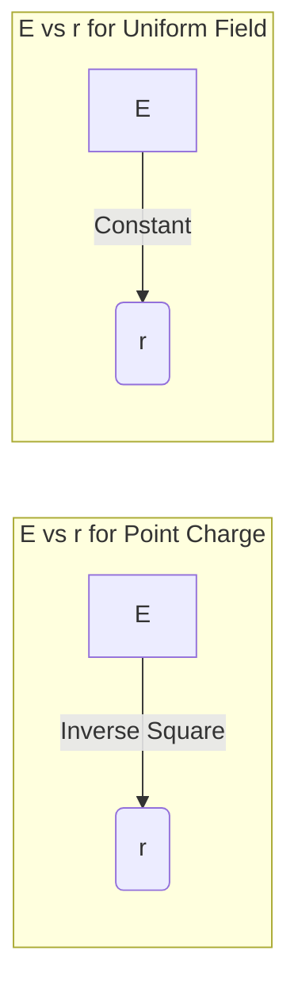
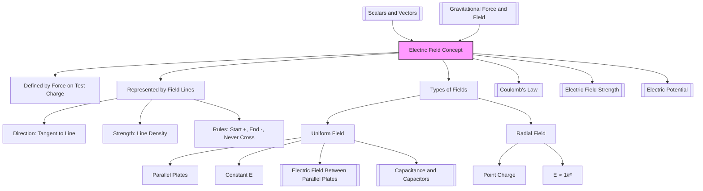

# Electric Field Concept and Field Lines / 电场概念与电场线

---

# 1. Overview / 概述

**English:**
This sub-topic introduces the fundamental concept of an **electric field** as a region of space where a stationary electric charge experiences a force. We will explore how electric fields are represented visually using **field lines** (also called lines of force), and how the direction and density of these lines convey information about the field's strength and direction. This concept is the foundation for understanding [[Coulomb's Law]], [[Electric Field Strength]], and the behaviour of charges in [[Uniform vs Radial Electric Fields]]. It is a direct analogue to the [[Gravitational Force and Field]] concept, but with the crucial difference that electric forces can be both attractive and repulsive.

**中文:**
本子知识点介绍**电场**的基本概念——即静止电荷在其周围空间产生的一种特殊物质，其他电荷在该区域会受到力的作用。我们将探讨如何使用**电场线**（也称为力线）来形象地表示电场，以及电场线的方向和疏密如何传递关于电场强度和方向的信息。这个概念是理解[[库仑定律]]、[[电场强度]]以及电荷在[[匀强电场与径向电场]]中行为的基础。它与[[引力与引力场]]概念直接类似，但关键区别在于电力可以是吸引力也可以是排斥力。

---

# 2. Syllabus Learning Objectives / 考纲学习目标

| CAIE 9702 (18.1 a-e) | Edexcel IAL (WPH14 U4: 2.1-2.5) |
|-----------|-------------|
| Understand that an electric field is a region where a charge experiences a force. | Understand the concept of an electric field as a region where a charge experiences a force. |
| Draw electric field patterns for isolated charges, pairs of charges, and uniform fields. | Draw and interpret electric field lines for point charges and uniform fields. |
| Understand that electric field lines show the direction of the force on a positive test charge. | Understand that field lines show the direction of the force on a positive test charge. |
| Understand the concept of a uniform electric field. | Understand the concept of a uniform electric field between parallel plates. |
| (Related to field strength, covered in [[Electric Field Strength]]) | (Related to field strength, covered in [[Electric Field Strength]]) |

**Examiner Expectations / 考官期望:**
- **CAIE:** Students must be able to sketch field patterns for single charges, two like charges, two opposite charges, and between parallel plates. They must understand that field lines never cross.
- **Edexcel:** Students must be able to interpret field line diagrams and relate the spacing of lines to field strength. They must understand the difference between radial and uniform fields.

---

# 3. Core Definitions / 核心定义

| Term (EN/CN) | Definition (EN) | Definition (CN) | Common Mistakes / 常见错误 |
|--------------|-----------------|-----------------|---------------------------|
| **Electric Field** / 电场 | A region of space in which a stationary electric charge experiences a force. | 静止电荷在其周围空间产生的一种特殊物质，其他电荷在该区域内会受到力的作用。 | Confusing it with an electric current or a magnetic field. |
| **Electric Field Line** / 电场线 | An imaginary line drawn in an electric field such that the tangent to the line at any point gives the direction of the electric field at that point. | 在电场中画出的一系列假想曲线，曲线上每一点的切线方向表示该点电场强度的方向。 | Thinking field lines are real physical objects. |
| **Test Charge** / 试探电荷 | A small, positive point charge used to map the direction of an electric field without significantly disturbing the field. | 一个体积小、带正电的点电荷，用于探测电场的方向，且其本身对原电场的影响可以忽略不计。 | Forgetting it must be *positive* by convention. |
| **Uniform Electric Field** / 匀强电场 | An electric field where the electric field strength is constant in both magnitude and direction at every point. | 电场强度的大小和方向处处相同的电场。 | Thinking it only exists between parallel plates (it's the most common example). |
| **Radial Electric Field** / 径向电场 | An electric field that radiates outwards from (or inwards towards) a point charge, with field strength decreasing with distance. | 从一个点电荷向外辐射（或向内汇聚）的电场，其电场强度随距离增加而减小。 | Confusing it with a uniform field. |

---

# 4. Key Concepts Explained / 关键概念详解

## 4.1 The Concept of an Electric Field / 电场概念

### Explanation / 解释
**English:**
The electric field is a model used to explain the "action at a distance" between charges. Instead of saying "charge A repels charge B directly," we say "charge A creates an electric field in the space around it. Charge B then experiences a force due to this field." This field is a **vector field** — it has both magnitude and direction at every point in space. The direction is defined as the direction of the force on a **positive test charge**. This is a crucial convention. The concept is analogous to the [[Gravitational Force and Field]], but while gravity is always attractive, electric fields can be attractive or repulsive depending on the sign of the source charge.

**中文:**
电场是一个用于解释电荷间“超距作用”的模型。我们不直接说“电荷A排斥电荷B”，而是说“电荷A在其周围空间产生了一个电场。电荷B随后因这个电场而受到力的作用。” 电场是一个**矢量场**——它在空间每一点都有大小和方向。其方向被定义为**正试探电荷**所受力的方向。这是一个至关重要的约定。这个概念类似于[[引力与引力场]]，但引力总是吸引力，而电场可以是吸引力或排斥力，取决于源电荷的符号。

### Physical Meaning / 物理意义
**English:**
The electric field is the "agent" that transmits the electric force. It is a property of the space itself, created by the presence of charge. A charge doesn't "feel" another charge directly; it feels the local electric field at its own position.

**中文:**
电场是传递电力的“媒介”。它是空间本身的一种属性，由电荷的存在而产生。一个电荷并不直接“感受”另一个电荷；它感受到的是其自身位置处的局部电场。

### Common Misconceptions / 常见误区
- **Field lines are real:** They are a visualisation tool, not physical objects.
- **Field lines show the path of a charge:** A charge will accelerate along a field line only if it starts from rest and the field is uniform. In a non-uniform field, the path is curved.
- **Field lines can cross:** If they crossed, a test charge at the intersection would have two different force directions, which is impossible.
- **电场线是真实存在的:** 它们只是一种可视化工具，不是物理实体。
- **电场线是电荷的运动轨迹:** 只有当电荷从静止开始运动且电场为匀强电场时，电荷才会沿电场线加速。在非匀强电场中，轨迹是弯曲的。
- **电场线可以相交:** 如果相交，交点处的试探电荷将有两个不同的受力方向，这是不可能的。

### Exam Tips / 考试提示
- **Always** draw arrows on field lines pointing away from positive charges and towards negative charges.
- **Always** draw field lines perpendicular to the surface of a conductor.
- **Always** draw field lines starting and ending on charges (or extending to infinity).
- **务必**在电场线上画出箭头，方向从正电荷指向负电荷。
- **务必**使电场线与导体表面垂直。
- **务必**使电场线起始和终止于电荷（或延伸至无穷远）。

> 📷 **IMAGE PROMPT — ECFL-01: Electric Field of a Single Positive Charge**
> A 2D diagram showing a single positive point charge (+) at the center. Red, evenly spaced radial lines with arrows pointing outwards. The lines should be straight and radiate in all directions. The density of lines should be higher near the charge and decrease with distance. Clean white background, suitable for a physics textbook.

---

## 4.2 Electric Field Lines / 电场线

### Explanation / 解释
**English:**
Electric field lines (or lines of force) are a visual tool. The key rules are:
1.  The **tangent** to a field line at any point gives the **direction** of the electric field at that point.
2.  The **density** (spacing) of field lines indicates the **magnitude** of the field. Closer lines = stronger field.
3.  Lines start on **positive** charges and end on **negative** charges.
4.  Lines never cross.
5.  Lines are always perpendicular to the surface of a conductor.

**中文:**
电场线（或力线）是一种可视化工具。关键规则如下：
1.  电场线上任意一点的**切线**方向表示该点**电场强度**的**方向**。
2.  电场线的**疏密**表示电场强度的**大小**。线越密 = 场越强。
3.  电场线起始于**正**电荷，终止于**负**电荷。
4.  电场线永不相交。
5.  电场线始终与导体表面垂直。

### Common Field Patterns / 常见电场图样
- **Isolated Positive Charge:** Radial lines pointing outwards.
- **Isolated Negative Charge:** Radial lines pointing inwards.
- **Two Opposite Charges (Dipole):** Lines start at the positive charge and curve to end at the negative charge. The field is strongest between them.
- **Two Like Charges:** Lines curve away from each other. There is a neutral point (zero field) between them.
- **Parallel Plates (Uniform Field):** Straight, parallel, equally spaced lines from the positive plate to the negative plate. Fringing effects at the edges.

### Exam Tips / 考试提示
- For a dipole, remember the field lines are **curved**, not straight.
- For like charges, the field lines **repel** each other.
- **Fringing fields** at the edges of parallel plates are a common exam point.
- 对于电偶极子，记住电场线是**弯曲的**，不是直的。
- 对于同种电荷，电场线**相互排斥**。
- 平行板边缘的**边缘效应**是常见的考点。

> 📷 **IMAGE PROMPT — ECFL-02: Electric Field Patterns for Charge Configurations**
> A 2D diagram showing four panels: (a) Single positive charge with radial outward lines. (b) Single negative charge with radial inward lines. (c) Two opposite charges (+ and -) with curved field lines connecting them. (d) Two like charges (+ and +) with field lines curving away from each other. All lines have arrows. Clean, textbook-style illustration.

---

# 5. Essential Equations / 核心公式

The concept of the electric field is defined by the equation for [[Electric Field Strength]]:

$$ \vec{E} = \frac{\vec{F}}{q} $$

| Symbol (符号) | Meaning (EN) | Meaning (CN) | Unit (单位) |
|--------------|-------------|-------------|------------|
| $\vec{E}$ | Electric field strength / 电场强度 | 电场强度 | N C$^{-1}$ or V m$^{-1}$ |
| $\vec{F}$ | Electric force on a test charge / 试探电荷所受的电场力 | 试探电荷所受的电场力 | N |
| $q$ | Magnitude of the test charge / 试探电荷的电荷量 | 试探电荷的电荷量 | C |

**Derivation / 推导:**
This is a **definition**, not a derivation. It defines the electric field at a point based on the force experienced by a small positive test charge placed at that point.

**Conditions / 适用条件:**
- The test charge $q$ must be small enough not to disturb the field being measured.
- The test charge must be positive (by convention).

**Limitations / 局限性:**
- This equation gives the *average* field if the test charge is not infinitesimally small.
- It does not describe how the field is *created* by a source charge (that is [[Coulomb's Law]]).

---

# 6. Graphs and Relationships / 图表与关系

## 6.1 Field Strength vs. Distance for a Point Charge / 点电荷的场强-距离关系

### Axes / 坐标轴
- **X-axis:** Distance from charge, $r$ / 距电荷的距离 $r$
- **Y-axis:** Electric field strength, $E$ / 电场强度 $E$

### Shape / 形状
- **Inverse square law:** $E \propto \frac{1}{r^2}$. The graph is a steep curve that approaches zero as $r \to \infty$ and approaches infinity as $r \to 0$.

### Gradient Meaning / 斜率含义
- The gradient $\frac{dE}{dr}$ is negative and represents the rate of change of field strength with distance. It is not a directly tested quantity.

### Area Meaning / 面积含义
- The area under an $E$ vs $r$ graph is related to the change in [[Electric Potential]] ($\Delta V = -\int E \, dr$).

### Exam Interpretation / 考试解读
- You must be able to sketch this graph and explain why the field is stronger closer to the charge.
- Compare this to the uniform field graph (a horizontal line).

> 📷 **IMAGE PROMPT — ECFL-03: E vs r Graph for Point Charge**
> A graph with x-axis labeled "r / m" and y-axis labeled "E / N C^-1". A steep curve starting high on the y-axis and rapidly decreasing, approaching zero as r increases. The curve should be smooth and clearly show the inverse square relationship. No data points, just the curve.

---

# 7. Required Diagrams / 必备图表

## 7.1 Electric Field Between Parallel Plates / 平行板间的电场

### Description / 描述
**English:** A diagram showing two parallel, oppositely charged plates. The field lines are straight, parallel, and equally spaced between the plates, indicating a uniform field. At the edges, the lines curve outwards, showing the fringing field.

**中文:** 一个显示两块平行且带相反电荷的极板的图。极板之间的电场线是直的、平行的且间距相等，表示匀强电场。在边缘处，电场线向外弯曲，显示出边缘效应。

### Image Prompt / 图片生成提示
> 📷 **IMAGE PROMPT — ECFL-04: Uniform Electric Field Between Parallel Plates**
> A 2D diagram showing two horizontal parallel plates. The top plate is labeled "+" and the bottom plate is labeled "-". Between the plates, draw 5-7 straight, vertical, equally spaced lines with arrows pointing downwards from the positive plate to the negative plate. At the left and right edges, show 2-3 curved lines bowing outwards. Label the central region "Uniform Field" and the edge region "Fringing Field". Clean, textbook-style.

### Labels Required / 需要标注
- **Positive Plate (+)** / 正极板 (+)
- **Negative Plate (-)** / 负极板 (-)
- **Uniform Field Region** / 匀强电场区域
- **Fringing Field** / 边缘效应
- **Direction of Field (arrows)** / 电场方向（箭头）

### Exam Importance / 考试重要性
- **High.** This is the most common example of a uniform field.
- Used in [[Electric Field Between Parallel Plates]] for calculating force on charges, and in [[Capacitance and Capacitors]].

---

## 7.2 Electric Field of a Dipole / 电偶极子的电场

### Description / 描述
**English:** A diagram showing a positive charge and a negative charge separated by a small distance. Field lines start at the positive charge and curve smoothly to end at the negative charge. The lines are densest between the charges.

**中文:** 一个显示正电荷和负电荷相距一小段距离的图。电场线起始于正电荷，平滑弯曲并终止于负电荷。电荷之间的电场线最密集。

### Image Prompt / 图片生成提示
> 📷 **IMAGE PROMPT — ECFL-05: Electric Field of an Electric Dipole**
> A 2D diagram with a red "+" on the left and a blue "-" on the right, separated by about 2 cm. Draw 6-8 curved field lines starting from the + charge and ending at the - charge. The lines should be smooth and symmetrical. The lines between the charges should be almost straight and very close together. The lines on the outside should curve widely. All lines have arrows pointing from + to -. Clean, textbook-style.

### Labels Required / 需要标注
- **Positive Charge (+)** / 正电荷 (+)
- **Negative Charge (-)** / 负电荷 (-)
- **Direction of Field (arrows)** / 电场方向（箭头）

### Exam Importance / 考试重要性
- **Medium.** You must be able to sketch this pattern and explain why the field is strongest between the charges.

---

# 8. Worked Examples / 典型例题

## Example 1: Sketching Field Lines / 例题1：绘制电场线

### Question / 题目
**English:**
Sketch the electric field pattern for two identical positive point charges placed a short distance apart. Label the neutral point (where the electric field is zero).

**中文:**
画出两个相同的正点电荷相距一小段距离时的电场图样。标出中性点（电场强度为零的点）。

### Solution / 解答
1.  Draw two "+" symbols a few cm apart.
2.  Draw field lines radiating outwards from each charge.
3.  Where the lines from the two charges meet, they should curve away from each other, showing repulsion.
4.  The neutral point is located exactly halfway between the two charges. At this point, the fields from each charge are equal in magnitude but opposite in direction, so they cancel.
5.  No field lines should pass through the neutral point.

### Final Answer / 最终答案
**Answer:** A diagram showing two positive charges with field lines curving away from each other, and a dot labeled "N" at the midpoint. | **答案：** 一个显示两个正电荷的图，电场线相互排斥弯曲，中点处有一个标有“N”的点。

### Quick Tip / 提示
- The neutral point for two like charges is always **between** them. For two opposite charges, the neutral point is **outside** them, closer to the smaller charge.
- 对于两个同种电荷，中性点总是在它们**之间**。对于两个异种电荷，中性点在它们**外部**，靠近电荷量较小的那个。

---

## Example 2: Interpreting Field Lines / 例题2：解读电场线

### Question / 题目
**English:**
The diagram shows the electric field lines near two point charges, X and Y. The field lines are closer together near X than near Y. Which charge is larger? Explain your answer.

**中文:**
下图显示了两个点电荷X和Y附近的电场线。X附近的电场线比Y附近的更密集。哪个电荷的电荷量更大？解释你的答案。

### Solution / 解答
1.  The density of field lines indicates the strength of the electric field.
2.  Closer lines mean a stronger field.
3.  A stronger field near X means X has a larger charge (assuming the distances are comparable).
4.  **Answer:** Charge X is larger.

### Final Answer / 最终答案
**Answer:** Charge X is larger because the field lines are denser near it, indicating a stronger electric field. | **答案：** 电荷X的电荷量更大，因为它附近的电场线更密集，表明电场更强。

### Quick Tip / 提示
- Field line density is a qualitative measure. You cannot calculate the exact charge from a diagram, but you can compare relative magnitudes.
- 电场线密度是一种定性测量。你不能从图中计算出确切的电荷量，但可以比较相对大小。

---

# 9. Past Paper Question Types / 历年真题题型

| Question Type / 题型 | Frequency / 频率 | Difficulty / 难度 | Past Paper References / 真题索引 |
|----------------------|------------------|------------------|-------------------------------|
| Sketching field patterns for given charge configurations | High | Easy | 📝 *待填入* |
| Interpreting field line diagrams (direction, strength) | High | Easy-Medium | 📝 *待填入* |
| Identifying neutral points | Medium | Medium | 📝 *待填入* |
| Explaining the concept of a test charge | Low | Easy | 📝 *待填入* |
| Comparing uniform and radial fields | Medium | Medium | 📝 *待填入* |

**Common Command Words / 常见指令词:**
- **Sketch / 画出:** Draw a diagram showing the main features (field lines, arrows).
- **Explain / 解释:** Give a reason for a phenomenon (e.g., why field lines don't cross).
- **Compare / 比较:** Describe similarities and differences (e.g., between uniform and radial fields).
- **State / 写出:** Give a concise definition or fact.

---

# 10. Practical Skills Connections / 实验技能链接

**English:**
While the electric field itself is not directly "seen" in a practical, its effects are. This sub-topic connects to practical work in the following ways:
- **Mapping Electric Fields:** Using a **search electrode** (a small probe connected to a voltmeter) to map equipotential lines in a field. From these lines, you can infer the direction of the field lines (they are perpendicular to equipotentials).
- **Demonstrating Field Patterns:** Using **grass seeds** suspended in oil. When a high voltage is applied to electrodes, the seeds align along the electric field lines, making the pattern visible.
- **Measuring Field Strength:** Using a **charged ball** and a balance to measure the force in a uniform field, then calculating $E = F/q$.
- **Uncertainties:** When measuring force or charge, you must consider uncertainties in the balance, voltmeter, and distance measurements.

**中文:**
虽然电场本身在实验中无法直接“看到”，但其效应可以被观察到。本子知识点与实验考试的联系如下：
- **描绘电场:** 使用**探针**（连接电压表的小型探头）来描绘电场中的等势线。根据等势线，可以推断出电场线的方向（电场线与等势线垂直）。
- **展示电场图样:** 使用悬浮在油中的**草籽**。当对电极施加高压时，草籽会沿电场线方向排列，从而使电场图样可见。
- **测量场强:** 使用**带电小球**和天平来测量匀强电场中的力，然后计算 $E = F/q$。
- **不确定度:** 在测量力或电荷时，必须考虑天平、电压表和距离测量的不确定度。

---

# 11. Concept Map / 概念图谱

---

# 12. Quick Revision Sheet / 速查表

| Category / 类别 | Key Points / 要点 |
|----------------|------------------|
| **Definition / 定义** | An electric field is a region where a charge experiences a force. / 电场是电荷受到力的区域。 |
| **Key Formula / 核心公式** | $\vec{E} = \frac{\vec{F}}{q}$ (Definition of field strength) |
| **Key Graph / 核心图表** | **E vs r for point charge:** Inverse square curve. **E vs r for uniform field:** Horizontal line. / **点电荷的E-r图:** 平方反比曲线。**匀强电场的E-r图:** 水平线。 |
| **Key Diagram / 核心图表** | **Parallel Plates:** Straight, parallel, equally spaced lines. **Dipole:** Curved lines from + to -. / **平行板:** 直的、平行的、等距的线。**电偶极子:** 从+到-的曲线。 |
| **Exam Tip / 考试提示** | Always draw arrows on field lines. Lines never cross. Density = strength. / 务必在电场线上画箭头。电场线永不相交。密度表示强度。 |
| **Common Mistake / 常见错误** | Thinking field lines are real or show the path of a charge. / 认为电场线是真实的或显示电荷的运动路径。 |