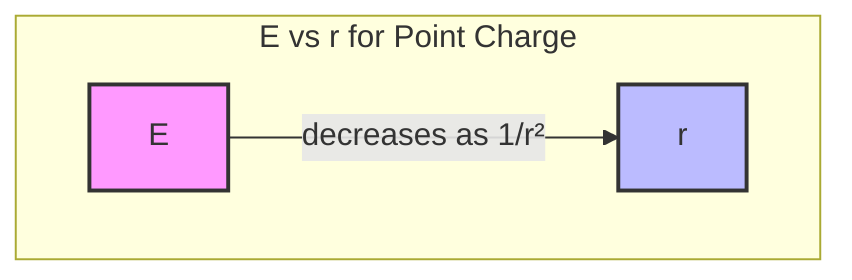

# 1. Overview / 概述

**English:**
Electric field strength ($E$) is a fundamental concept in electromagnetism that quantifies the force experienced by a unit positive charge at any point in an electric field. This sub-topic defines electric field strength both as a vector quantity and explores its mathematical relationships for both uniform fields (between parallel plates) and radial fields (around point charges). Understanding $E$ is essential for analyzing electric forces, predicting charge motion, and connecting to [[Electric Potential]] and [[Capacitance and Capacitors]]. This leaf node builds directly on [[Coulomb's Law]] and the [[Electric Field Concept and Field Lines]], and requires prerequisite knowledge of [[Scalars and Vectors]] and [[Gravitational Force and Field]].

**中文:**
电场强度 ($E$) 是电磁学中的一个基本概念，它量化了单位正电荷在电场中任意一点所受到的力。本子知识点将电场强度定义为一个矢量量，并探讨其在匀强电场（平行板之间）和径向电场（点电荷周围）中的数学关系。理解 $E$ 对于分析电场力、预测电荷运动以及联系到 [[Electric Potential]] 和 [[Capacitance and Capacitors]] 至关重要。本叶节点直接建立在 [[Coulomb's Law]] 和 [[Electric Field Concept and Field Lines]] 的基础上，并需要 [[Scalars and Vectors]] 和 [[Gravitational Force and Field]] 的先备知识。

---

# 2. Syllabus Learning Objectives / 考纲学习目标

| CAIE 9702 | Edexcel IAL |
|-----------|-------------|
| 18.1(a): Define electric field strength as force per unit positive charge | 2.1: Understand the concept of electric field strength as force per unit charge |
| 18.1(b): Use $E = F/Q$ | 2.2: Use $E = F/Q$ for uniform and radial fields |
| 18.1(c): Derive and use $E = V/d$ for uniform fields | 2.3: Derive and use $E = V/d$ for parallel plates |
| 18.1(d): Use $E = \frac{Q}{4\pi\epsilon_0 r^2}$ for radial fields | 2.4: Use $E = \frac{Q}{4\pi\epsilon_0 r^2}$ for point charges |
| 18.1(e): Describe the direction of electric field strength | 2.5: Understand vector nature of electric field strength |

**Examiner Expectations / 考官期望:**
- **English:** Students must distinguish between uniform and radial field equations, correctly apply vector direction, and use SI units (N C⁻¹ or V m⁻¹). Derivation of $E = V/d$ from work done is often tested.
- **中文:** 学生必须区分匀强电场和径向电场的公式，正确应用矢量方向，并使用SI单位（N C⁻¹ 或 V m⁻¹）。从做功推导 $E = V/d$ 经常被考查。

---

# 3. Core Definitions / 核心定义

| Term (EN/CN) | Definition (EN) | Definition (CN) | Common Mistakes / 常见错误 |
|--------------|-----------------|-----------------|---------------------------|
| **Electric Field Strength** / 电场强度 | The force per unit positive charge experienced by a small test charge placed at a point in an electric field. | 电场中某点处单位正电荷所受的力。 | Confusing $E$ with force $F$; forgetting it's a vector. |
| **Test Charge** / 试探电荷 | A small positive charge used to probe an electric field without significantly disturbing it. | 用于探测电场而不显著干扰电场的小正电荷。 | Using a large charge that alters the field. |
| **Uniform Electric Field** / 匀强电场 | An electric field where the field strength is constant in magnitude and direction at all points. | 电场强度大小和方向处处相同的电场。 | Assuming all fields are uniform. |
| **Radial Electric Field** / 径向电场 | An electric field that radiates outward (or inward) from a point charge, with strength decreasing with distance. | 从点电荷向外（或向内）辐射的电场，强度随距离减小。 | Forgetting the $1/r^2$ dependence. |
| **Permittivity of Free Space** / 真空介电常数 | A physical constant ($\epsilon_0 = 8.85 \times 10^{-12} \, \text{F m}^{-1}$) that characterizes how electric fields propagate in a vacuum. | 描述电场在真空中传播的物理常数 ($\epsilon_0 = 8.85 \times 10^{-12} \, \text{F m}^{-1}$)。 | Using wrong value or units. |

---

# 4. Key Concepts Explained / 关键概念详解

## 4.1 Definition of Electric Field Strength / 电场强度的定义

### Explanation / 解释
**English:**
Electric field strength $E$ at a point is defined as the electric force $F$ experienced by a small positive test charge $q$ placed at that point, divided by the magnitude of that charge:

$$ E = \frac{F}{q} $$

This is a **vector** quantity. The direction of $E$ is the same as the direction of the force on a positive test charge. For a positive source charge, $E$ points radially outward; for a negative source charge, $E$ points radially inward. This definition applies to all electric fields, whether uniform or non-uniform. The test charge must be small enough not to disturb the original field.

**中文:**
电场中某点的电场强度 $E$ 定义为放置在该点的小正试探电荷 $q$ 所受的电场力 $F$ 除以该电荷的大小：

$$ E = \frac{F}{q} $$

这是一个**矢量**量。$E$ 的方向与正试探电荷所受力的方向相同。对于正源电荷，$E$ 径向向外；对于负源电荷，$E$ 径向向内。该定义适用于所有电场，无论是匀强还是非匀强。试探电荷必须足够小，以免干扰原电场。

### Physical Meaning / 物理意义
**English:**
$E$ tells us how "strong" or "intense" the electric field is at a given point. A larger $E$ means a greater force would be exerted on a charge placed there. It is analogous to gravitational field strength $g$ in [[Gravitational Force and Field]], where $g = F/m$.

**中文:**
$E$ 告诉我们电场在给定点的"强弱"程度。$E$ 越大，意味着放置在该点的电荷所受的力越大。它类似于 [[Gravitational Force and Field]] 中的引力场强度 $g$，其中 $g = F/m$。

### Common Misconceptions / 常见误区
- **English:** Thinking $E$ depends on the test charge. $E$ is a property of the field itself, independent of the test charge.
- **中文:** 认为 $E$ 取决于试探电荷。$E$ 是电场本身的属性，与试探电荷无关。
- **English:** Confusing $E$ with force $F$. $E$ is force per unit charge, not force itself.
- **中文:** 混淆 $E$ 和力 $F$。$E$ 是单位电荷所受的力，不是力本身。
- **English:** Forgetting that $E$ is a vector; direction must be specified.
- **中文:** 忘记 $E$ 是矢量；必须指明方向。

### Exam Tips / 考试提示
- **English:** Always state the direction of $E$ in vector problems. Use $E = F/q$ when given force and charge; use $E = V/d$ for parallel plates.
- **中文:** 在矢量问题中始终说明 $E$ 的方向。已知力和电荷时使用 $E = F/q$；平行板问题使用 $E = V/d$。

> 📷 **IMAGE PROMPT — E01: Electric Field Strength Definition Diagram**
> A diagram showing a positive test charge +q placed at a point in an electric field between two parallel plates. Arrows indicate the force F on the test charge and the electric field strength E vector. Label: "E = F/q". Show that E is independent of q.

## 4.2 Electric Field Strength for a Point Charge / 点电荷的电场强度

### Explanation / 解释
**English:**
Using [[Coulomb's Law]], the force between a source charge $Q$ and a test charge $q$ separated by distance $r$ is:

$$ F = \frac{1}{4\pi\epsilon_0} \frac{Qq}{r^2} $$

Substituting into $E = F/q$ gives the electric field strength due to a point charge:

$$ E = \frac{1}{4\pi\epsilon_0} \frac{Q}{r^2} $$

This is a **radial field**: $E$ decreases with the square of the distance. The direction is radially outward from $Q$ if $Q > 0$, and radially inward toward $Q$ if $Q < 0$.

**中文:**
利用 [[Coulomb's Law]]，源电荷 $Q$ 与试探电荷 $q$ 相距 $r$ 时的力为：

$$ F = \frac{1}{4\pi\epsilon_0} \frac{Qq}{r^2} $$

代入 $E = F/q$ 得到点电荷的电场强度：

$$ E = \frac{1}{4\pi\epsilon_0} \frac{Q}{r^2} $$

这是一个**径向电场**：$E$ 随距离的平方减小。若 $Q > 0$，方向从 $Q$ 径向向外；若 $Q < 0$，方向径向指向 $Q$。

### Physical Meaning / 物理意义
**English:**
The $1/r^2$ dependence means that doubling the distance from the charge reduces $E$ to one-quarter of its original value. This is analogous to the inverse-square law in [[Gravitational Force and Field]].

**中文:**
$1/r^2$ 依赖关系意味着距离加倍时，$E$ 减小到原来的四分之一。这与 [[Gravitational Force and Field]] 中的平方反比定律类似。

### Common Misconceptions / 常见误区
- **English:** Thinking $E$ is constant for a point charge. It varies with $r$.
- **中文:** 认为点电荷的 $E$ 是恒定的。它随 $r$ 变化。
- **English:** Forgetting the $4\pi\epsilon_0$ factor in calculations.
- **中文:** 在计算中忘记 $4\pi\epsilon_0$ 因子。

### Exam Tips / 考试提示
- **English:** Use this formula only for point charges or spherical charge distributions (outside the sphere). For parallel plates, use $E = V/d$.
- **中文:** 此公式仅适用于点电荷或球形电荷分布（球外）。平行板使用 $E = V/d$。

> 📷 **IMAGE PROMPT — E02: Radial Electric Field from Point Charge**
> A diagram showing a positive point charge Q at the center. Arrows radiate outward in all directions, getting shorter (weaker) as distance increases. Label: "E ∝ 1/r²". Show two distances r and 2r with corresponding E values.

## 4.3 Electric Field Strength Between Parallel Plates / 平行板间的电场强度

### Explanation / 解释
**English:**
For two parallel conducting plates with potential difference $V$ and separation $d$, the electric field is **uniform** (except at edges). The field strength is:

$$ E = \frac{V}{d} $$

This is derived from work done: $W = Fd = qEd$, and $W = qV$, so $qEd = qV$, giving $E = V/d$. The direction is from the positive plate to the negative plate.

**中文:**
对于电势差为 $V$、间距为 $d$ 的两块平行导体板，电场是**匀强**的（边缘除外）。电场强度为：

$$ E = \frac{V}{d} $$

这是从做功推导的：$W = Fd = qEd$，且 $W = qV$，所以 $qEd = qV$，得到 $E = V/d$。方向从正极板指向负极板。

### Physical Meaning / 物理意义
**English:**
$E$ is constant between the plates, meaning a charge experiences the same force anywhere in the gap. This is useful for accelerating charged particles (e.g., in [[Capacitance and Capacitors]] or cathode ray tubes).

**中文:**
$E$ 在板间是恒定的，意味着电荷在间隙中任何位置都受到相同的力。这对于加速带电粒子非常有用（例如在 [[Capacitance and Capacitors]] 或阴极射线管中）。

### Common Misconceptions / 常见误区
- **English:** Thinking $E$ depends on plate area. $E = V/d$ is independent of area (for large plates).
- **中文:** 认为 $E$ 取决于极板面积。$E = V/d$ 与面积无关（对于大极板）。
- **English:** Forgetting that $d$ is the plate separation, not the distance from one plate.
- **中文:** 忘记 $d$ 是极板间距，而不是到某一极板的距离。

### Exam Tips / 考试提示
- **English:** This formula is only valid for uniform fields between parallel plates. Do not use it for point charges.
- **中文:** 此公式仅适用于平行板间的匀强电场。不要用于点电荷。

> 📷 **IMAGE PROMPT — E03: Uniform Electric Field Between Parallel Plates**
> A diagram showing two parallel plates connected to a battery (V). Positive plate on left, negative on right. Uniformly spaced parallel arrows from left to right between the plates. Label: "E = V/d". Show plate separation d.

---

# 5. Essential Equations / 核心公式

## 5.1 Definition Equation / 定义公式

$$ E = \frac{F}{q} $$

| Symbol (符号) | Meaning (EN) | Meaning (CN) | Unit (单位) |
|--------------|-------------|-------------|------------|
| $E$ | Electric field strength | 电场强度 | N C⁻¹ or V m⁻¹ |
| $F$ | Electric force on test charge | 试探电荷所受电场力 | N |
| $q$ | Test charge | 试探电荷 | C |

**Derivation / 推导:** Definition; no derivation needed.
**Conditions / 适用条件:** All electric fields (uniform and non-uniform).
**Limitations / 局限性:** Test charge must be small enough not to disturb the field.

## 5.2 Point Charge (Radial Field) / 点电荷（径向电场）

$$ E = \frac{1}{4\pi\epsilon_0} \frac{Q}{r^2} $$

| Symbol (符号) | Meaning (EN) | Meaning (CN) | Unit (单位) |
|--------------|-------------|-------------|------------|
| $E$ | Electric field strength | 电场强度 | N C⁻¹ |
| $Q$ | Source charge | 源电荷 | C |
| $r$ | Distance from source charge | 距源电荷的距离 | m |
| $\epsilon_0$ | Permittivity of free space ($8.85 \times 10^{-12}$) | 真空介电常数 | F m⁻¹ |

**Derivation / 推导:** From [[Coulomb's Law]]: $F = \frac{1}{4\pi\epsilon_0} \frac{Qq}{r^2}$, then $E = F/q$.
**Conditions / 适用条件:** Point charges or spherical charge distributions (outside sphere).
**Limitations / 局限性:** Does not apply inside a charged conductor or between parallel plates.

## 5.3 Uniform Field (Parallel Plates) / 匀强电场（平行板）

$$ E = \frac{V}{d} $$

| Symbol (符号) | Meaning (EN) | Meaning (CN) | Unit (单位) |
|--------------|-------------|-------------|------------|
| $E$ | Electric field strength | 电场强度 | V m⁻¹ |
| $V$ | Potential difference between plates | 极板间电势差 | V |
| $d$ | Plate separation | 极板间距 | m |

**Derivation / 推导:** Work done: $W = Fd = qEd$ and $W = qV$, so $qEd = qV \Rightarrow E = V/d$.
**Conditions / 适用条件:** Uniform field between large parallel plates (ignore edge effects).
**Limitations / 局限性:** Not valid for point charges or non-uniform fields.

> 📷 **IMAGE PROMPT — E04: Formula Comparison Diagram**
> A split diagram: Left side shows a point charge with radial arrows and formula E = Q/(4πε₀r²). Right side shows parallel plates with uniform arrows and formula E = V/d. Highlight the difference in field patterns.

---

# 6. Graphs and Relationships / 图表与关系

## 6.1 E vs r for a Point Charge / 点电荷的 E-r 图

### Axes / 坐标轴
- **x-axis:** Distance from point charge, $r$ (m) / 距点电荷的距离 $r$ (m)
- **y-axis:** Electric field strength, $E$ (N C⁻¹) / 电场强度 $E$ (N C⁻¹)

### Shape / 形状
**English:** A decreasing curve following $E \propto 1/r^2$. As $r \to 0$, $E \to \infty$ (theoretical). As $r \to \infty$, $E \to 0$.
**中文:** 遵循 $E \propto 1/r^2$ 的递减曲线。当 $r \to 0$ 时，$E \to \infty$（理论上）。当 $r \to \infty$ 时，$E \to 0$。

### Gradient Meaning / 斜率含义
**English:** The gradient $dE/dr = -\frac{2Q}{4\pi\epsilon_0 r^3}$, which is negative and decreases in magnitude with $r$. It represents the rate of change of field strength with distance.
**中文:** 梯度 $dE/dr = -\frac{2Q}{4\pi\epsilon_0 r^3}$，为负值且大小随 $r$ 减小。它表示场强随距离的变化率。

### Area Meaning / 面积含义
**English:** The area under the $E$ vs $r$ graph has no direct physical meaning in this context. However, the integral $\int E \, dr$ relates to [[Electric Potential]].
**中文:** $E$-$r$ 图下的面积在此没有直接的物理意义。但积分 $\int E \, dr$ 与 [[Electric Potential]] 有关。

### Exam Interpretation / 考试解读
**English:** Be able to sketch this graph and explain why $E$ decreases with $r$. Compare with gravitational field strength $g$ vs $r$ for a point mass.
**中文:** 能够画出此图并解释为什么 $E$ 随 $r$ 减小。与点质量的引力场强度 $g$-$r$ 图进行比较。



## 6.2 E vs d for Parallel Plates / 平行板的 E-d 图

### Axes / 坐标轴
- **x-axis:** Plate separation, $d$ (m) / 极板间距 $d$ (m)
- **y-axis:** Electric field strength, $E$ (V m⁻¹) / 电场强度 $E$ (V m⁻¹)

### Shape / 形状
**English:** A decreasing hyperbola: $E = V/d$. For constant $V$, as $d$ increases, $E$ decreases.
**中文:** 递减的双曲线：$E = V/d$。对于恒定 $V$，$d$ 增大时 $E$ 减小。

### Gradient Meaning / 斜率含义
**English:** $dE/dd = -V/d^2$, negative and decreasing in magnitude.
**中文:** $dE/dd = -V/d^2$，为负值且大小递减。

### Area Meaning / 面积含义
**English:** No direct physical meaning.
**中文:** 没有直接的物理意义。

### Exam Interpretation / 考试解读
**English:** Understand that for a fixed battery voltage, increasing plate separation reduces field strength. This affects the force on charges between the plates.
**中文:** 理解对于固定电池电压，增大极板间距会减小场强。这会影响板间电荷所受的力。

---

# 7. Required Diagrams / 必备图表

## 7.1 Electric Field Strength Vectors / 电场强度矢量图

### Description / 描述
**English:** A diagram showing electric field strength vectors at various points around a positive point charge and between parallel plates. For the point charge, arrows radiate outward, getting shorter with distance. For parallel plates, arrows are parallel and equally spaced.
**中文:** 显示正点电荷周围和平行板间各点电场强度矢量的图。对于点电荷，箭头向外辐射，随距离变短。对于平行板，箭头平行且等间距。

### Image Prompt / 图片生成提示
> 📷 **IMAGE PROMPT — E05: Electric Field Strength Vectors**
> A split diagram. Left: A positive point charge (+) at center with 8 arrows radiating outward in different directions. Arrows are long near the charge and shorter further away. Label: "E ∝ 1/r²". Right: Two parallel plates (positive left, negative right) with 6 equally spaced parallel arrows pointing from left to right. All arrows same length. Label: "E = V/d (constant)". Use blue arrows for field vectors.

### Labels Required / 需要标注
- **English:** Source charge Q, test charge q, field vectors E, plate separation d, potential difference V
- **中文:** 源电荷 Q，试探电荷 q，场矢量 E，极板间距 d，电势差 V

### Exam Importance / 考试重要性
**English:** High. Students must be able to draw and interpret field patterns for both uniform and radial fields.
**中文:** 高。学生必须能够画出并解释匀强电场和径向电场的场图。

## 7.2 E vs r Graph for Point Charge / 点电荷的 E-r 图

### Description / 描述
**English:** A graph showing electric field strength E on the y-axis vs distance r on the x-axis for a positive point charge. The curve starts high near r=0 and decreases rapidly, approaching zero as r increases.
**中文:** 显示正点电荷的电场强度 E（y轴）与距离 r（x轴）关系的图。曲线在 r=0 附近很高，然后迅速减小，随 r 增大趋近于零。

### Image Prompt / 图片生成提示
> 📷 **IMAGE PROMPT — E06: E vs r Graph for Point Charge**
> A graph with labeled axes: "E (N C⁻¹)" on y-axis and "r (m)" on x-axis. A smooth decreasing curve from top-left to bottom-right, following E ∝ 1/r². Mark two points: (r, E) and (2r, E/4) to show inverse-square relationship. Use a dashed line to show the theoretical infinite value at r=0.

### Labels Required / 需要标注
- **English:** E-axis, r-axis, curve E ∝ 1/r², point (r, E), point (2r, E/4)
- **中文:** E轴，r轴，曲线 E ∝ 1/r²，点 (r, E)，点 (2r, E/4)

### Exam Importance / 考试重要性
**English:** Medium. Often used in multiple-choice questions to test understanding of inverse-square law.
**中文:** 中等。常用于选择题中考查对平方反比定律的理解。

---

# 8. Worked Examples / 典型例题

## Example 1: Electric Field Strength from a Point Charge / 点电荷的电场强度

### Question / 题目
**English:**
A point charge $Q = +4.0 \times 10^{-6} \, \text{C}$ is placed in a vacuum. Calculate the electric field strength at a point $0.20 \, \text{m}$ from the charge. ($\epsilon_0 = 8.85 \times 10^{-12} \, \text{F m}^{-1}$)

**中文:**
一点电荷 $Q = +4.0 \times 10^{-6} \, \text{C}$ 置于真空中。计算距该电荷 $0.20 \, \text{m}$ 处的电场强度。（$\epsilon_0 = 8.85 \times 10^{-12} \, \text{F m}^{-1}$）

### Solution / 解答
**Step 1:** Write the formula for electric field strength due to a point charge.
**步骤1：** 写出点电荷电场强度公式。

$$ E = \frac{1}{4\pi\epsilon_0} \frac{Q}{r^2} $$

**Step 2:** Substitute values.
**步骤2：** 代入数值。

$$ E = \frac{1}{4\pi (8.85 \times 10^{-12})} \times \frac{4.0 \times 10^{-6}}{(0.20)^2} $$

**Step 3:** Calculate the constant factor.
**步骤3：** 计算常数因子。

$$ \frac{1}{4\pi\epsilon_0} = \frac{1}{4\pi (8.85 \times 10^{-12})} = 8.99 \times 10^9 \, \text{N m}^2 \text{C}^{-2} $$

**Step 4:** Complete the calculation.
**步骤4：** 完成计算。

$$ E = (8.99 \times 10^9) \times \frac{4.0 \times 10^{-6}}{0.04} = (8.99 \times 10^9) \times (1.0 \times 10^{-4}) = 8.99 \times 10^5 \, \text{N C}^{-1} $$

**Step 5:** State the direction.
**步骤5：** 说明方向。

$$ \text{Direction: radially outward from } Q \text{ (since } Q > 0\text{)} $$

### Final Answer / 最终答案
**Answer:** $E = 9.0 \times 10^5 \, \text{N C}^{-1}$ radially outward | **答案：** $E = 9.0 \times 10^5 \, \text{N C}^{-1}$，径向向外

### Quick Tip / 提示
**English:** Remember that $1/(4\pi\epsilon_0) \approx 9.0 \times 10^9 \, \text{N m}^2 \text{C}^{-2}$. Use this approximation for quick calculations.
**中文：** 记住 $1/(4\pi\epsilon_0) \approx 9.0 \times 10^9 \, \text{N m}^2 \text{C}^{-2}$。在快速计算中使用这个近似值。

## Example 2: Electric Field Strength Between Parallel Plates / 平行板间的电场强度

### Question / 题目
**English:**
Two parallel plates are separated by $5.0 \, \text{mm}$ and connected to a $200 \, \text{V}$ battery. (a) Calculate the electric field strength between the plates. (b) Calculate the force on an electron ($e = 1.6 \times 10^{-19} \, \text{C}$) placed between the plates.

**中文:**
两块平行板相距 $5.0 \, \text{mm}$，连接到 $200 \, \text{V}$ 的电池上。(a) 计算板间的电场强度。(b) 计算放置在板间的电子（$e = 1.6 \times 10^{-19} \, \text{C}$）所受的力。

### Solution / 解答
**Part (a):**
**Step 1:** Write the formula for uniform field.
**步骤1：** 写出匀强电场公式。

$$ E = \frac{V}{d} $$

**Step 2:** Convert units and substitute.
**步骤2：** 转换单位并代入。

$$ d = 5.0 \, \text{mm} = 5.0 \times 10^{-3} \, \text{m} $$

$$ E = \frac{200}{5.0 \times 10^{-3}} = 4.0 \times 10^4 \, \text{V m}^{-1} $$

**Part (b):**
**Step 3:** Use $F = qE$.
**步骤3：** 使用 $F = qE$。

$$ F = eE = (1.6 \times 10^{-19})(4.0 \times 10^4) = 6.4 \times 10^{-15} \, \text{N} $$

**Step 4:** State direction.
**步骤4：** 说明方向。

$$ \text{Direction: from negative plate to positive plate (electron is negative)} $$

### Final Answer / 最终答案
**Answer:** (a) $E = 4.0 \times 10^4 \, \text{V m}^{-1}$; (b) $F = 6.4 \times 10^{-15} \, \text{N}$ toward positive plate | **答案：** (a) $E = 4.0 \times 10^4 \, \text{V m}^{-1}$；(b) $F = 6.4 \times 10^{-15} \, \text{N}$，指向正极板

### Quick Tip / 提示
**English:** Always convert mm to m before using $E = V/d$. For force direction on a negative charge, it is opposite to the field direction.
**中文：** 使用 $E = V/d$ 前务必把毫米转换为米。负电荷所受力的方向与电场方向相反。

---

# 9. Past Paper Question Types / 历年真题题型

| Question Type / 题型 | Frequency / 频率 | Difficulty / 难度 | Past Paper References / 真题索引 |
|----------------------|------------------|------------------|-------------------------------|
| Calculate E from point charge using $E = Q/(4\pi\epsilon_0 r^2)$ | High | Medium | 📝 *待填入* |
| Calculate E between parallel plates using $E = V/d$ | High | Easy | 📝 *待填入* |
| Compare uniform vs radial field patterns | Medium | Medium | 📝 *待填入* |
| Derive $E = V/d$ from work done | Low | Hard | 📝 *待填入* |
| Vector addition of E from multiple charges | Medium | Hard | 📝 *待填入* |

**Common Command Words / 常见指令词:**
- **English:** Define, Calculate, Derive, Sketch, Compare, Explain
- **中文：** 定义，计算，推导，画出，比较，解释

---

# 10. Practical Skills Connections / 实验技能链接

**English:**
Electric field strength is primarily a theoretical concept in A-Level practical work, but it connects to several practical skills:

1. **Measurements:** Measuring plate separation $d$ with a micrometer or ruler, and potential difference $V$ with a voltmeter.
2. **Uncertainties:** Propagating uncertainties in $d$ and $V$ to find uncertainty in $E = V/d$.
3. **Graph Plotting:** Plotting $E$ vs $1/r^2$ for a point charge to verify the inverse-square law (using data from simulations).
4. **Experimental Design:** Designing an experiment to investigate the relationship between $E$ and $d$ for parallel plates using a uniform field apparatus.
5. **Simulations:** Using PhET or other simulations to explore field patterns and measure $E$ at different points.

**中文:**
在A-Level实验考试中，电场强度主要是一个理论概念，但它与以下实验技能相关：

1. **测量：** 用千分尺或尺子测量极板间距 $d$，用电压表测量电势差 $V$。
2. **不确定度：** 传播 $d$ 和 $V$ 的不确定度，以求出 $E = V/d$ 的不确定度。
3. **作图：** 绘制点电荷的 $E$ 与 $1/r^2$ 关系图，以验证平方反比定律（使用模拟数据）。
4. **实验设计：** 设计实验，使用匀强电场装置研究平行板的 $E$ 与 $d$ 的关系。
5. **模拟：** 使用PhET或其他模拟软件探索电场图样并测量不同点的 $E$。

> 📋 **Edexcel Only:** Edexcel IAL Paper 3 (Practical Skills) may ask students to design an experiment to measure electric field strength using a uniform field apparatus and a charged oil drop (Millikan-type experiment).

> 📋 **CIE Only:** CIE Paper 5 (Planning, Analysis and Evaluation) may include questions on determining $E$ from experimental data, including error analysis.

---

# 11. Concept Map / 概念图谱

```mermaid
graph TD
    %% Electric Field Strength Leaf Node
    EFS[Electric Field Strength<br/>电场强度] --> DEF[Definition: E = F/q<br/>定义：E = F/q]
    EFS --> TYPES[Types of Fields<br/>电场类型]
    EFS --> VECTOR[Vector Nature<br/>矢量性质]
    
    TYPES --> UNIFORM[Uniform Field<br/>匀强电场]
    TYPES --> RADIAL[Radial Field<br/>径向电场]
    
    UNIFORM --> PP[Parallel Plates<br/>平行板]
    PP --> EQ1[E = V/d<br/>公式]
    PP --> DIR1[Direction: + to -<br/>方向：正到负]
    
    RADIAL --> PC[Point Charge<br/>点电荷]
    PC --> EQ2[E = Q/(4πε₀r²)<br/>公式]
    PC --> DIR2[Outward if Q>0<br/>Inward if Q<0<br/>Q>0向外，Q<0向内]
    
    VECTOR --> ADD[Vector Addition<br/>矢量叠加]
    VECTOR --> DIR[Direction Matters<br/>方向重要]
    
    EFS --> PREREQ[Prerequisites<br/>先备知识]
    PREREQ --> COULOMB[[Coulomb's Law<br/>库仑定律]]
    PREREQ --> VECTORS[[Scalars and Vectors<br/>标量与矢量]]
    PREREQ --> GRAV[[Gravitational Force and Field<br/>引力与引力场]]
    
    EFS --> RELATED[Related Topics<br/>相关主题]
    RELATED --> POTENTIAL[[Electric Potential<br/>电势]]
    RELATED --> CAP[[Capacitance and Capacitors<br/>电容与电容器]]
    
    style EFS fill:#f96,stroke:#333,stroke-width:4px
    style DEF fill:#bbf,stroke:#333,stroke-width:2px
    style TYPES fill:#bbf,stroke:#333,stroke-width:2px
    style VECTOR fill:#bbf,stroke:#333,stroke-width:2px
    style UNIFORM fill:#9cf,stroke:#333,stroke-width:2px
    style RADIAL fill:#9cf,stroke:#333,stroke-width:2px
    style PP fill:#cfc,stroke:#333,stroke-width:2px
    style PC fill:#cfc,stroke:#333,stroke-width:2px
    style PREREQ fill:#fcf,stroke:#333,stroke-width:2px
    style RELATED fill:#fcf,stroke:#333,stroke-width:2px
```

---

# 12. Quick Revision Sheet / 速查表

| Category / 类别 | Key Points / 要点 |
|----------------|------------------|
| **Definition / 定义** | $E = F/q$: Force per unit positive charge. Vector. Unit: N C⁻¹ or V m⁻¹. / 单位正电荷所受的力。矢量。单位：N C⁻¹ 或 V m⁻¹。 |
| **Key Formula 1 / 核心公式1** | $E = \frac{1}{4\pi\epsilon_0} \frac{Q}{r^2}$ (Point charge / 点电荷) — Radial field, $E \propto 1/r^2$ |
| **Key Formula 2 / 核心公式2** | $E = V/d$ (Parallel plates / 平行板) — Uniform field, $E$ constant |
| **Key Graph / 核心图表** | $E$ vs $r$ for point charge: decreasing curve $E \propto 1/r^2$. $E$ vs $d$ for plates: $E \propto 1/d$. / 点电荷的 $E$-$r$ 图：递减曲线 $E \propto 1/r^2$。平行板的 $E$-$d$ 图：$E \propto 1/d$。 |
| **Direction / 方向** | Positive charge: outward. Negative charge: inward. Field lines: + to -. / 正电荷：向外。负电荷：向内。电场线：+ 到 -。 |
| **Common Mistake / 常见错误** | Confusing $E$ with $F$; forgetting $1/r^2$; using $E = V/d$ for point charges. / 混淆 $E$ 和 $F$；忘记 $1/r^2$；对点电荷使用 $E = V/d$。 |
| **Exam Tip / 考试提示** | Always state direction. Convert units (mm → m). Use $1/(4\pi\epsilon_0) \approx 9.0 \times 10^9$. / 始终说明方向。转换单位（mm → m）。使用 $1/(4\pi\epsilon_0) \approx 9.0 \times 10^9$。 |
| **Prerequisites / 先备知识** | [[Coulomb's Law]], [[Scalars and Vectors]], [[Gravitational Force and Field]] |
| **Related Topics / 相关主题** | [[Electric Potential]], [[Capacitance and Capacitors]] |
| **Sibling Topics / 同级主题** | [[Electric Field Concept and Field Lines]], [[Uniform vs Radial Electric Fields]], [[Electric Field Between Parallel Plates]] |