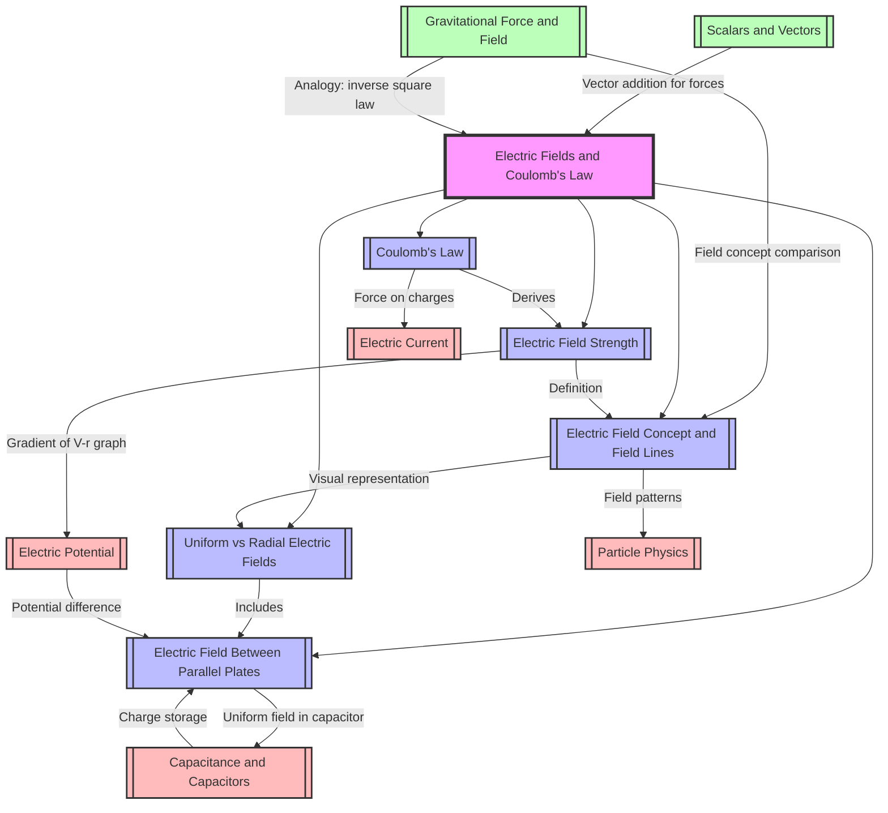

# 1. Overview / 概述

**English:**
This topic introduces the fundamental concept of electric fields and the quantitative law governing the electrostatic force between charged particles. Electric fields are regions of space where a stationary electric charge experiences a force. Coulomb's Law provides the mathematical relationship for the force between two point charges. This topic forms the foundation for understanding [[Electric Potential]], [[Capacitance and Capacitors]], and more advanced electromagnetism. In both Cambridge 9702 and Edexcel IAL A-Level Physics, this is a core A2 topic that appears frequently in multiple-choice, structured questions, and practical contexts. Real-world applications include electrostatic precipitators, inkjet printers, photocopiers, and the operation of [[Capacitance and Capacitors]].

**中文：**
本主题介绍电场的基本概念以及控制带电粒子之间静电力的定量定律。电场是空间中静止电荷受到力的区域。库仑定律提供了两点电荷之间力的数学关系。本主题构成了理解[[Electric Potential]]、[[Capacitance and Capacitors]]和更高级电磁学的基础。在剑桥9702和爱德思IAL A-Level物理中，这是一个核心的A2主题，经常出现在选择题、结构化问题和实验背景中。实际应用包括静电除尘器、喷墨打印机、复印机和[[Capacitance and Capacitors]]的操作。

---

# 2. Syllabus Learning Objectives / 考纲学习目标

| CAIE 9702 (18.1) | Edexcel IAL (WPH14 U4: 2.1-2.5) |
|------------------|----------------------------------|
| 18.1(a) Understand that an electric field is a region where a charge experiences a force | 2.1 Understand the concept of an electric field as a region where a charge experiences a force |
| 18.1(b) Represent an electric field by means of field lines | 2.2 Draw and interpret electric field patterns for point charges and parallel plates |
| 18.1(c) Recall and use Coulomb's Law: $F = \frac{Q_1 Q_2}{4 \pi \epsilon_0 r^2}$ | 2.3 Use Coulomb's Law: $F = \frac{Q_1 Q_2}{4 \pi \epsilon_0 r^2}$ |
| 18.1(d) Define electric field strength: $E = \frac{F}{Q}$ | 2.4 Define electric field strength: $E = \frac{F}{Q}$ |
| 18.1(e) Use $E = \frac{Q}{4 \pi \epsilon_0 r^2}$ for a point charge | 2.5 Use $E = \frac{Q}{4 \pi \epsilon_0 r^2}$ for a point charge and $E = \frac{V}{d}$ for uniform fields |

**Examiner Expectations / 考官期望：**

**English:**
- Students must be able to define electric field strength as force per unit positive charge.
- Students must recall and apply Coulomb's Law in vector form (direction matters).
- Students must distinguish between uniform and radial fields.
- Students must be able to draw and interpret field line patterns.
- Students must understand the role of permittivity of free space ($\epsilon_0$).

**中文：**
- 学生必须能够将电场强度定义为每单位正电荷所受的力。
- 学生必须记住并以矢量形式应用库仑定律（方向很重要）。
- 学生必须区分均匀电场和径向电场。
- 学生必须能够绘制和解释电场线图案。
- 学生必须理解真空介电常数（$\epsilon_0$）的作用。

> 📋 **CIE Only:** CIE 9702 specifically requires understanding of electric field as a region where a charge experiences a force (18.1a) and representation by field lines (18.1b). The derivation of $E = \frac{Q}{4 \pi \epsilon_0 r^2}$ from Coulomb's Law is expected.

> 📋 **Edexcel Only:** Edexcel IAL specifically requires the use of $E = \frac{V}{d}$ for uniform fields between parallel plates (2.5). This is not explicitly in CIE 9702 18.1 but appears in other sections.

---

# 3. Core Definitions / 核心定义

| Term (EN/CN) | Definition (EN) | Definition (CN) | Common Mistakes / 常见错误 |
|--------------|-----------------|-----------------|---------------------------|
| [[Electric Field]] / 电场 | A region of space where a stationary electric charge experiences a force. | 空间中静止电荷受到力的区域。 | Confusing with magnetic field; forgetting it's for stationary charges only. |
| [[Coulomb's Law]] / 库仑定律 | The electrostatic force between two point charges is directly proportional to the product of their charges and inversely proportional to the square of the distance between them. | 两点电荷之间的静电力与它们电荷量的乘积成正比，与它们之间距离的平方成反比。 | Forgetting the inverse square relationship; applying to non-point charges without modification. |
| [[Electric Field Strength]] / 电场强度 | The force per unit positive charge experienced by a small test charge placed in the field. | 放置在电场中的小测试电荷所受到的每单位正电荷的力。 | Confusing with force; forgetting it's a vector quantity. |
| [[Permittivity of Free Space]] ($\epsilon_0$) / 真空介电常数 | A physical constant that describes how an electric field affects and is affected by a vacuum. Value: $8.85 \times 10^{-12} \, \text{F m}^{-1}$. | 描述电场如何影响真空并被真空影响的物理常数。数值：$8.85 \times 10^{-12} \, \text{F m}^{-1}$。 | Forgetting units; confusing with relative permittivity. |
| [[Point Charge]] / 点电荷 | An idealized charge concentrated at a single point in space. | 理想化的电荷集中在空间中的一个点上。 | Applying Coulomb's Law to extended objects without integration. |
| [[Test Charge]] / 测试电荷 | A small positive charge used to probe an electric field without disturbing it. | 用于探测电场而不干扰电场的小正电荷。 | Using a charge that is too large, which would alter the field. |
| [[Uniform Electric Field]] / 均匀电场 | An electric field where the field strength is constant in magnitude and direction at all points. | 电场强度在所有点的大小和方向都恒定的电场。 | Assuming all fields are uniform; confusing with radial fields. |
| [[Radial Electric Field]] / 径向电场 | An electric field that radiates outward from or inward toward a point charge, with field strength decreasing with distance. | 从点电荷向外辐射或向内汇聚的电场，场强随距离减小。 | Forgetting the $1/r^2$ dependence. |

---

# 4. Key Concepts Explained / 关键概念详解

## 4.1 Electric Field Concept / 电场概念

### Explanation / 解释
**English:**
An [[Electric Field]] is a region of space where a stationary electric charge experiences a force. This is analogous to a [[Gravitational Force and Field]] where a mass experiences a force. The electric field is a vector field — it has both magnitude and direction at every point. The direction of the electric field at any point is defined as the direction of the force on a positive [[Test Charge]]. This is a fundamental concept that links [[Coulomb's Law]] to the field model.

**中文：**
[[Electric Field]]是空间中静止电荷受到力的区域。这类似于[[Gravitational Force and Field]]中质量受到力的区域。电场是一个矢量场——它在每个点都有大小和方向。任何点电场的方向定义为正[[Test Charge]]所受力的方向。这是一个将[[Coulomb's Law]]与场模型联系起来的基本概念。

### Physical Meaning / 物理意义
**English:**
In real life, electric fields are responsible for the attraction of dust to screens, the operation of lightning rods, and the function of capacitors. When you touch a metal doorknob after walking on carpet, the spark you feel is due to an electric field breaking down the air.

**中文：**
在现实生活中，电场负责灰尘被屏幕吸引、避雷针的操作以及电容器的工作。当你在地毯上行走后触摸金属门把手时，你感觉到的火花是由于电场击穿空气造成的。

### Common Misconceptions / 常见误区
1. **English:** Thinking electric field is the same as electric force. Field is force per unit charge, not force itself.
   **中文：** 认为电场与电力相同。场是每单位电荷的力，而不是力本身。
2. **English:** Believing field lines are real physical entities. They are conceptual tools.
   **中文：** 相信电场线是真实的物理实体。它们是概念工具。
3. **English:** Confusing electric field direction with the direction of force on a negative charge.
   **中文：** 混淆电场方向与负电荷所受力的方向。

### Exam Tips / 考试提示
**English:**
Cambridge and Edexcel often ask students to define electric field strength. Use the exact wording: "force per unit positive charge." For field line diagrams, ensure arrows point away from positive charges and toward negative charges. Remember that field lines never cross.

**中文：**
剑桥和爱德思经常要求学生定义电场强度。使用准确的措辞："每单位正电荷所受的力。"对于电场线图，确保箭头指向远离正电荷和朝向负电荷。记住电场线从不交叉。

---

## 4.2 Coulomb's Law / 库仑定律

### Explanation / 解释
**English:**
[[Coulomb's Law]] quantifies the electrostatic force between two [[Point Charge]]s. The force is:
- Directly proportional to the product of the charges: $F \propto Q_1 Q_2$
- Inversely proportional to the square of the distance: $F \propto \frac{1}{r^2}$
- Along the line joining the two charges
- Attractive for opposite charges, repulsive for like charges

The constant of proportionality is $\frac{1}{4 \pi \epsilon_0}$, where $\epsilon_0 = 8.85 \times 10^{-12} \, \text{F m}^{-1}$ is the [[Permittivity of Free Space]].

**中文：**
[[Coulomb's Law]]量化了两个[[Point Charge]]之间的静电力。该力：
- 与电荷量的乘积成正比：$F \propto Q_1 Q_2$
- 与距离的平方成反比：$F \propto \frac{1}{r^2}$
- 沿着连接两个电荷的直线
- 异种电荷相吸，同种电荷相斥

比例常数为$\frac{1}{4 \pi \epsilon_0}$，其中$\epsilon_0 = 8.85 \times 10^{-12} \, \text{F m}^{-1}$是[[Permittivity of Free Space]]。

### Physical Meaning / 物理意义
**English:**
Coulomb's Law explains why you can feel a static shock after walking on a carpet. The charges build up on your body, and when you approach a conductor, the force becomes strong enough to cause a spark. It also explains why like charges repel — this is the principle behind electrostatic paint spraying.

**中文：**
库仑定律解释了为什么在走过地毯后你会感觉到静电冲击。电荷在你的身体上积累，当你接近导体时，力变得足够强以引起火花。它也解释了为什么同种电荷相斥——这是静电喷涂背后的原理。

### Common Misconceptions / 常见误区
1. **English:** Applying Coulomb's Law to charges in a medium without using the relative permittivity.
   **中文：** 在不使用相对介电常数的情况下将库仑定律应用于介质中的电荷。
2. **English:** Forgetting that force is a vector and needs direction.
   **中文：** 忘记力是矢量，需要方向。
3. **English:** Using the formula when charges are not point charges.
   **中文：** 在电荷不是点电荷时使用该公式。

### Exam Tips / 考试提示
**English:**
When solving problems with multiple charges, use vector addition. Draw a free-body diagram for each charge. Remember that $F_{12} = -F_{21}$ (Newton's Third Law). For Edexcel, be prepared to use Coulomb's Law in the context of Millikan's oil drop experiment.

**中文：**
在解决多个电荷的问题时，使用矢量加法。为每个电荷画一个自由体图。记住$F_{12} = -F_{21}$（牛顿第三定律）。对于爱德思，准备在密立根油滴实验的背景下使用库仑定律。

---

## 4.3 Electric Field Strength / 电场强度

### Explanation / 解释
**English:**
[[Electric Field Strength]] $E$ at a point is defined as the force $F$ per unit positive charge $Q$ placed at that point:
$$E = \frac{F}{Q}$$

For a [[Point Charge]] $Q$, the field strength at distance $r$ is:
$$E = \frac{Q}{4 \pi \epsilon_0 r^2}$$

This shows that the field strength follows an inverse square law with distance, similar to [[Gravitational Force and Field]].

**中文：**
某点的[[Electric Field Strength]] $E$定义为放置在该点的每单位正电荷$Q$所受的力$F$：
$$E = \frac{F}{Q}$$

对于[[Point Charge]] $Q$，距离$r$处的场强为：
$$E = \frac{Q}{4 \pi \epsilon_0 r^2}$$

这表明场强随距离遵循平方反比定律，类似于[[Gravitational Force and Field]]。

### Physical Meaning / 物理意义
**English:**
Electric field strength tells you how "intense" the electric field is at a point. A higher field strength means a charge will experience a larger force. This is why lightning rods have sharp points — the field strength is higher there, causing air to ionize and discharge.

**中文：**
电场强度告诉你电场在某点的"强度"。更高的场强意味着电荷将受到更大的力。这就是为什么避雷针有尖点——那里的场强更高，导致空气电离和放电。

### Common Misconceptions / 常见误区
1. **English:** Confusing $E = \frac{F}{Q}$ (definition) with $E = \frac{Q}{4 \pi \epsilon_0 r^2}$ (for point charges only).
   **中文：** 混淆$E = \frac{F}{Q}$（定义）与$E = \frac{Q}{4 \pi \epsilon_0 r^2}$（仅适用于点电荷）。
2. **English:** Thinking field strength is constant for a point charge.
   **中文：** 认为点电荷的场强是恒定的。
3. **English:** Forgetting that $E$ is a vector — direction matters.
   **中文：** 忘记$E$是矢量——方向很重要。

### Exam Tips / 考试提示
**English:**
For CIE, you may be asked to derive $E = \frac{Q}{4 \pi \epsilon_0 r^2}$ from Coulomb's Law. For Edexcel, you must also know $E = \frac{V}{d}$ for uniform fields. Always state the direction of $E$ in your answers.

**中文：**
对于CIE，你可能会被要求从库仑定律推导出$E = \frac{Q}{4 \pi \epsilon_0 r^2}$。对于爱德思，你还必须知道均匀电场的$E = \frac{V}{d}$。在你的答案中始终说明$E$的方向。

---

## 4.4 Uniform vs Radial Electric Fields / 均匀电场与径向电场

### Explanation / 解释
**English:**
There are two main types of electric fields:
- **[[Uniform Electric Field]]:** Field strength is constant in magnitude and direction. Created between two parallel plates with a potential difference. Field lines are parallel and equally spaced.
- **[[Radial Electric Field]]:** Field strength varies with distance from a point charge. Field lines radiate outward (positive charge) or inward (negative charge). Field strength follows $E \propto \frac{1}{r^2}$.

**中文：**
有两种主要类型的电场：
- **[[Uniform Electric Field]]：** 场强的大小和方向恒定。由两个具有电势差的平行板产生。电场线平行且等距。
- **[[Radial Electric Field]]：** 场强随距点电荷的距离变化。电场线向外辐射（正电荷）或向内汇聚（负电荷）。场强遵循$E \propto \frac{1}{r^2}$。

### Physical Meaning / 物理意义
**English:**
Uniform fields are used in capacitors and cathode ray tubes. Radial fields are found around isolated charges, like electrons or protons. The difference is important for understanding how charges move in different configurations.

**中文：**
均匀电场用于电容器和阴极射线管。径向电场存在于孤立电荷周围，如电子或质子。这种差异对于理解电荷在不同配置中的运动很重要。

### Common Misconceptions / 常见误区
1. **English:** Thinking all electric fields are uniform.
   **中文：** 认为所有电场都是均匀的。
2. **English:** Confusing the field pattern of a single charge with that of a dipole.
   **中文：** 混淆单个电荷的电场图案与偶极子的电场图案。

### Exam Tips / 考试提示
**English:**
CIE and Edexcel both require you to draw and interpret field line patterns. For parallel plates, ensure lines are straight, parallel, and equally spaced (except at edges). For point charges, lines should radiate symmetrically.

**中文：**
CIE和爱德思都要求你绘制和解释电场线图案。对于平行板，确保线是直的、平行的且等距的（边缘除外）。对于点电荷，线应对称辐射。

---

## 4.5 Electric Field Between Parallel Plates / 平行板之间的电场

### Explanation / 解释
**English:**
When two parallel conducting plates are connected to a power supply, a [[Uniform Electric Field]] is created between them. The field strength is given by:
$$E = \frac{V}{d}$$
where $V$ is the potential difference between the plates and $d$ is the separation. This is a key result linking [[Electric Potential]] to [[Electric Field Strength]].

**中文：**
当两个平行导体板连接到电源时，它们之间会产生[[Uniform Electric Field]]。场强由下式给出：
$$E = \frac{V}{d}$$
其中$V$是板之间的电势差，$d$是间距。这是将[[Electric Potential]]与[[Electric Field Strength]]联系起来的关键结果。

### Physical Meaning / 物理意义
**English:**
This is the principle behind parallel plate capacitors. The uniform field allows for predictable motion of charged particles, used in oscilloscopes and particle accelerators.

**中文：**
这是平行板电容器背后的原理。均匀电场允许带电粒子的可预测运动，用于示波器和粒子加速器。

### Common Misconceptions / 常见误区
1. **English:** Forgetting that $E = \frac{V}{d}$ only applies to uniform fields.
   **中文：** 忘记$E = \frac{V}{d}$仅适用于均匀电场。
2. **English:** Confusing $d$ (plate separation) with distance from a plate.
   **中文：** 混淆$d$（板间距）与距板的距离。

### Exam Tips / 考试提示
**English:**
> 📋 **Edexcel Only:** Edexcel specifically requires $E = \frac{V}{d}$ for uniform fields. CIE covers this in other sections but not explicitly in 18.1. Be prepared to combine this with equations of motion for charged particles.

**中文：**
> 📋 **Edexcel Only:** 爱德思特别要求均匀电场的$E = \frac{V}{d}$。CIE在其他部分涵盖了这个内容，但在18.1中没有明确要求。准备将这与带电粒子的运动方程结合。

---

# 5. Essential Equations / 核心公式

## 5.1 Coulomb's Law / 库仑定律

**Equation / 公式:**
$$F = \frac{Q_1 Q_2}{4 \pi \epsilon_0 r^2}$$

**Variables / 变量:**
| Symbol (符号) | Meaning (EN) | Meaning (CN) | Unit (单位) |
|--------------|-------------|-------------|------------|
| $F$ | Electrostatic force | 静电力 | N (newton) |
| $Q_1, Q_2$ | Magnitudes of point charges | 点电荷的大小 | C (coulomb) |
| $r$ | Separation between charges | 电荷之间的距离 | m (metre) |
| $\epsilon_0$ | Permittivity of free space | 真空介电常数 | $\text{F m}^{-1}$ (farad per metre) |

**Derivation / 推导:**
**English:**
Coulomb's Law is an experimental law, not derived from first principles. It is analogous to Newton's Law of Gravitation: $F = \frac{G m_1 m_2}{r^2}$. The constant $\frac{1}{4 \pi \epsilon_0}$ arises from the definition of the coulomb in SI units.

**中文：**
库仑定律是一个实验定律，不是从基本原理推导出来的。它类似于牛顿万有引力定律：$F = \frac{G m_1 m_2}{r^2}$。常数$\frac{1}{4 \pi \epsilon_0}$源于SI单位制中库仑的定义。

**Conditions / 适用条件:**
**English:**
- Charges must be point charges (size << separation)
- Charges must be stationary
- Valid in vacuum (or air approximately)
- For charges in a medium, use $F = \frac{Q_1 Q_2}{4 \pi \epsilon_0 \epsilon_r r^2}$

**中文：**
- 电荷必须是点电荷（尺寸 << 间距）
- 电荷必须是静止的
- 在真空中有效（空气中近似）
- 对于介质中的电荷，使用$F = \frac{Q_1 Q_2}{4 \pi \epsilon_0 \epsilon_r r^2}$

**Limitations / 局限性:**
**English:**
- Does not apply to moving charges (magnetic effects become significant)
- Does not apply to extended charge distributions without integration
- Assumes charges are in vacuum or homogeneous medium

**中文：**
- 不适用于运动电荷（磁效应变得显著）
- 不适用于扩展电荷分布（需要积分）
- 假设电荷在真空或均匀介质中

**Rearrangements / 变形:**
**English:**
- $Q_1 = \frac{4 \pi \epsilon_0 r^2 F}{Q_2}$
- $r = \sqrt{\frac{Q_1 Q_2}{4 \pi \epsilon_0 F}}$
- $\epsilon_0 = \frac{Q_1 Q_2}{4 \pi r^2 F}$

**中文：**
- $Q_1 = \frac{4 \pi \epsilon_0 r^2 F}{Q_2}$
- $r = \sqrt{\frac{Q_1 Q_2}{4 \pi \epsilon_0 F}}$
- $\epsilon_0 = \frac{Q_1 Q_2}{4 \pi r^2 F}$

---

## 5.2 Electric Field Strength (Definition) / 电场强度（定义）

**Equation / 公式:**
$$E = \frac{F}{Q}$$

**Variables / 变量:**
| Symbol (符号) | Meaning (EN) | Meaning (CN) | Unit (单位) |
|--------------|-------------|-------------|------------|
| $E$ | Electric field strength | 电场强度 | $\text{N C}^{-1}$ or $\text{V m}^{-1}$ |
| $F$ | Force on test charge | 测试电荷所受的力 | N |
| $Q$ | Test charge | 测试电荷 | C |

**Derivation / 推导:**
**English:**
This is the definition of electric field strength. It is analogous to gravitational field strength $g = \frac{F}{m}$. The direction of $E$ is the direction of the force on a positive test charge.

**中文：**
这是电场强度的定义。它类似于引力场强度$g = \frac{F}{m}$。$E$的方向是正测试电荷所受力的方向。

**Conditions / 适用条件:**
**English:**
- The test charge must be small enough not to disturb the field
- Valid for any electric field (uniform or radial)

**中文：**
- 测试电荷必须足够小，以免干扰电场
- 适用于任何电场（均匀或径向）

**Limitations / 局限性:**
**English:**
- If the test charge is too large, it will alter the field being measured
- The definition gives the field at a point, not over a region

**中文：**
- 如果测试电荷太大，它会改变被测量的电场
- 定义给出的是某点的场强，而不是一个区域

**Rearrangements / 变形:**
**English:**
- $F = EQ$
- $Q = \frac{F}{E}$

**中文：**
- $F = EQ$
- $Q = \frac{F}{E}$

---

## 5.3 Electric Field Strength (Point Charge) / 电场强度（点电荷）

**Equation / 公式:**
$$E = \frac{Q}{4 \pi \epsilon_0 r^2}$$

**Variables / 变量:**
| Symbol (符号) | Meaning (EN) | Meaning (CN) | Unit (单位) |
|--------------|-------------|-------------|------------|
| $E$ | Electric field strength at distance $r$ | 距离$r$处的电场强度 | $\text{N C}^{-1}$ |
| $Q$ | Source charge | 源电荷 | C |
| $r$ | Distance from charge | 距电荷的距离 | m |
| $\epsilon_0$ | Permittivity of free space | 真空介电常数 | $\text{F m}^{-1}$ |

**Derivation / 推导:**
**English:**
From Coulomb's Law, the force on a test charge $Q_2$ at distance $r$ from source charge $Q_1$ is:
$$F = \frac{Q_1 Q_2}{4 \pi \epsilon_0 r^2}$$

By definition, $E = \frac{F}{Q_2}$, so:
$$E = \frac{Q_1}{4 \pi \epsilon_0 r^2}$$

Replacing $Q_1$ with $Q$ gives $E = \frac{Q}{4 \pi \epsilon_0 r^2}$.

**中文：**
从库仑定律，距离源电荷$Q_1$为$r$处的测试电荷$Q_2$所受的力为：
$$F = \frac{Q_1 Q_2}{4 \pi \epsilon_0 r^2}$$

根据定义，$E = \frac{F}{Q_2}$，所以：
$$E = \frac{Q_1}{4 \pi \epsilon_0 r^2}$$

将$Q_1$替换为$Q$得到$E = \frac{Q}{4 \pi \epsilon_0 r^2}$。

**Conditions / 适用条件:**
**English:**
- Only valid for a point charge
- Valid in vacuum (or air approximately)
- $r$ is measured from the center of the charge

**中文：**
- 仅适用于点电荷
- 在真空中有效（空气中近似）
- $r$从电荷中心测量

**Limitations / 局限性:**
**English:**
- Does not apply to extended charge distributions
- Does not apply inside a charged conductor (field is zero there)

**中文：**
- 不适用于扩展电荷分布
- 不适用于带电导体内部（那里的场为零）

**Rearrangements / 变形:**
**English:**
- $Q = 4 \pi \epsilon_0 r^2 E$
- $r = \sqrt{\frac{Q}{4 \pi \epsilon_0 E}}$

**中文：**
- $Q = 4 \pi \epsilon_0 r^2 E$
- $r = \sqrt{\frac{Q}{4 \pi \epsilon_0 E}}$

---

## 5.4 Electric Field Strength (Parallel Plates) / 电场强度（平行板）

**Equation / 公式:**
$$E = \frac{V}{d}$$

**Variables / 变量:**
| Symbol (符号) | Meaning (EN) | Meaning (CN) | Unit (单位) |
|--------------|-------------|-------------|------------|
| $E$ | Electric field strength | 电场强度 | $\text{V m}^{-1}$ |
| $V$ | Potential difference between plates | 板之间的电势差 | V (volt) |
| $d$ | Separation between plates | 板间距 | m |

**Derivation / 推导:**
**English:**
For a uniform field, the work done to move a charge $Q$ through a distance $d$ is:
$$W = Fd = QEd$$

But work done is also $W = QV$ (from definition of potential difference). Equating:
$$QEd = QV$$
$$E = \frac{V}{d}$$

**中文：**
对于均匀电场，将电荷$Q$移动距离$d$所做的功为：
$$W = Fd = QEd$$

但所做的功也是$W = QV$（根据电势差的定义）。相等：
$$QEd = QV$$
$$E = \frac{V}{d}$$

**Conditions / 适用条件:**
**English:**
- Only valid for uniform electric fields
- Plates must be parallel and large compared to separation
- Valid in vacuum or air

**中文：**
- 仅适用于均匀电场
- 板必须平行且尺寸远大于间距
- 在真空或空气中有效

**Limitations / 局限性:**
**English:**
- Does not apply near the edges of plates (fringing effects)
- Does not apply for radial fields

**中文：**
- 不适用于板边缘附近（边缘效应）
- 不适用于径向电场

**Rearrangements / 变形:**
**English:**
- $V = Ed$
- $d = \frac{V}{E}$

**中文：**
- $V = Ed$
- $d = \frac{V}{E}$

---

# 6. Graphs and Relationships / 图表与关系

## 6.1 Force vs Distance (Coulomb's Law) / 力与距离关系（库仑定律）

### Axes / 坐标轴
**English:** x-axis: Separation $r$ (m); y-axis: Force $F$ (N)
**中文：** x轴：间距$r$ (m)；y轴：力$F$ (N)

### Shape / 形状
**English:** Inverse square curve: $F \propto \frac{1}{r^2}$. The curve is steep near small $r$ and flattens as $r$ increases.
**中文：** 平方反比曲线：$F \propto \frac{1}{r^2}$。曲线在$r$小时陡峭，随着$r$增加而变平。

### Gradient Meaning / 斜率含义
**English:** The gradient $\frac{dF}{dr} = -\frac{2Q_1 Q_2}{4 \pi \epsilon_0 r^3}$. The negative gradient shows force decreases with distance.
**中文：** 梯度$\frac{dF}{dr} = -\frac{2Q_1 Q_2}{4 \pi \epsilon_0 r^3}$。负梯度表示力随距离减小。

### Area Meaning / 面积含义
**English:** The area under $F$ vs $r$ graph gives work done (energy) to move charges from one separation to another.
**中文：** $F$ vs $r$ 图下的面积表示将电荷从一个间距移动到另一个间距所做的功（能量）。

### Exam Interpretation / 考试解读
**English:**
- A straight line on a log-log plot confirms the inverse square relationship
- The graph can be used to determine $\epsilon_0$ experimentally
- Compare with gravitational force graph (same shape, different scale)

**中文：**
- 对数-对数图上的直线确认了平方反比关系
- 该图可用于实验确定$\epsilon_0$
- 与引力图比较（相同形状，不同尺度）

### Common Questions / 常见问题
**English:**
- "Sketch the graph of $F$ against $r$ for two like charges"
- "How does the graph change if the charges are doubled?"
- "Determine $\epsilon_0$ from the gradient of a suitable graph"

**中文：**
- "画出两个同种电荷的$F$与$r$关系图"
- "如果电荷加倍，图形如何变化？"
- "从合适图形的斜率确定$\epsilon_0$"

---

## 6.2 Field Strength vs Distance (Point Charge) / 场强与距离关系（点电荷）

### Axes / 坐标轴
**English:** x-axis: Distance $r$ (m); y-axis: Electric field strength $E$ ($\text{N C}^{-1}$)
**中文：** x轴：距离$r$ (m)；y轴：电场强度$E$ ($\text{N C}^{-1}$)

### Shape / 形状
**English:** Inverse square curve: $E \propto \frac{1}{r^2}$. Same shape as $F$ vs $r$ but scaled by $1/Q$.
**中文：** 平方反比曲线：$E \propto \frac{1}{r^2}$。与$F$ vs $r$形状相同，但按$1/Q$缩放。

### Gradient Meaning / 斜率含义
**English:** The gradient $\frac{dE}{dr} = -\frac{2Q}{4 \pi \epsilon_0 r^3}$ relates to how quickly field strength changes with distance.
**中文：** 梯度$\frac{dE}{dr} = -\frac{2Q}{4 \pi \epsilon_0 r^3}$与场强随距离变化的速率有关。

### Area Meaning / 面积含义
**English:** The area under $E$ vs $r$ graph gives the potential difference between two points (related to [[Electric Potential]]).
**中文：** $E$ vs $r$ 图下的面积给出两点之间的电势差（与[[Electric Potential]]相关）。

### Exam Interpretation / 考试解读
**English:**
- A $E$ vs $1/r^2$ graph should be a straight line through origin
- Gradient gives $\frac{Q}{4 \pi \epsilon_0}$
- Used to determine unknown charge $Q$

**中文：**
- $E$ vs $1/r^2$ 图应是通过原点的直线
- 斜率给出$\frac{Q}{4 \pi \epsilon_0}$
- 用于确定未知电荷$Q$

### Common Questions / 常见问题
**English:**
- "Plot $E$ against $1/r^2$ and determine the charge"
- "Explain why the field strength is zero inside a charged conductor"
- "Compare the field strength at two different distances"

**中文：**
- "绘制$E$与$1/r^2$的关系图并确定电荷"
- "解释为什么带电导体内部的场强为零"
- "比较两个不同距离处的场强"

---

## 6.3 Field Strength vs Distance (Parallel Plates) / 场强与距离关系（平行板）

### Axes / 坐标轴
**English:** x-axis: Distance from one plate $x$ (m); y-axis: Electric field strength $E$ ($\text{V m}^{-1}$)
**中文：** x轴：距一个板的距离$x$ (m)；y轴：电场强度$E$ ($\text{V m}^{-1}$)

### Shape / 形状
**English:** Horizontal straight line (constant $E$) between the plates, dropping to zero outside.
**中文：** 板之间的水平直线（恒定$E$），外部降为零。

### Gradient Meaning / 斜率含义
**English:** Gradient is zero between plates (uniform field). Gradient is undefined at edges (fringing).
**中文：** 板之间梯度为零（均匀电场）。边缘处梯度未定义（边缘效应）。

### Area Meaning / 面积含义
**English:** Area under $E$ vs $x$ graph between two points gives potential difference $V = Ed$.
**中文：** $E$ vs $x$ 图上两点之间的面积给出电势差$V = Ed$。

### Exam Interpretation / 考试解读
**English:**
- The constant $E$ confirms uniform field
- The graph can be used to find $V$ if $E$ and $d$ are known
- Fringing effects at edges are often ignored in exam questions

**中文：**
- 恒定的$E$确认了均匀电场
- 如果已知$E$和$d$，该图可用于求$V$
- 考试问题中通常忽略边缘的边缘效应

### Common Questions / 常见问题
**English:**
- "Sketch the variation of $E$ with distance from the negative plate"
- "Explain why $E$ is constant between parallel plates"
- "How does the graph change if the plate separation is increased?"

**中文：**
- "画出$E$随距负极板距离的变化"
- "解释为什么平行板之间的$E$是恒定的"
- "如果板间距增加，图形如何变化？"

---

# 7. Required Diagrams / 必备图表

## 7.1 Electric Field Lines for a Positive Point Charge / 正点电荷的电场线

### Description / 描述
**English:**
A diagram showing a positive point charge at the center, with electric field lines radiating outward in all directions. Lines are straight, evenly spaced radially, and arrows point away from the charge. The density of lines decreases with distance, indicating decreasing field strength.

**中文：**
显示中心有一个正点电荷的图，电场线向所有方向向外辐射。线是直的，径向均匀分布，箭头指向远离电荷的方向。线的密度随距离减小，表示场强减小。

### Image Prompt / 图片生成提示
> 📷 **IMAGE PROMPT — [DIAG-EF-01]: Electric Field Lines for a Positive Point Charge**
>
> A clean, educational 2D diagram on a white background. A single red circle labeled "+Q" at the center. Black straight lines radiating outward symmetrically in 8-12 directions. Small arrowheads on each line pointing away from the center. Lines are evenly spaced near the charge but spread out further away. Minimalist style, clear labels, suitable for A-Level physics textbook. No grid. High contrast, vector-like appearance.

### Labels Required / 需要标注
**English:** "+Q" (positive charge), arrows showing direction of field, "E" (field strength notation)
**中文：** "+Q"（正电荷），箭头显示场的方向，"E"（场强标注）

### Exam Importance / 考试重要性
**English:**
This is the most basic field diagram. Cambridge and Edexcel both require students to draw and interpret field lines for point charges. It forms the basis for understanding more complex field patterns.

**中文：**
这是最基本的场图。剑桥和爱德思都要求学生绘制和解释点电荷的电场线。它构成了理解更复杂场图案的基础。

---

## 7.2 Electric Field Lines for a Negative Point Charge / 负点电荷的电场线

### Description / 描述
**English:**
A diagram showing a negative point charge at the center, with electric field lines radiating inward from all directions. Lines are straight, evenly spaced radially, and arrows point toward the charge.

**中文：**
显示中心有一个负点电荷的图，电场线从所有方向向内辐射。线是直的，径向均匀分布，箭头指向电荷。

### Image Prompt / 图片生成提示
> 📷 **IMAGE PROMPT — [DIAG-EF-02]: Electric Field Lines for a Negative Point Charge**
>
> A clean, educational 2D diagram on a white background. A single blue circle labeled "-Q" at the center. Black straight lines converging inward symmetrically from 8-12 directions. Small arrowheads on each line pointing toward the center. Lines are evenly spaced near the charge but spread out further away. Minimalist style, clear labels, suitable for A-Level physics textbook. No grid. High contrast, vector-like appearance.

### Labels Required / 需要标注
**English:** "-Q" (negative charge), arrows showing direction of field
**中文：** "-Q"（负电荷），箭头显示场的方向

### Exam Importance / 考试重要性
**English:**
Students must understand that field lines point toward negative charges. This is often tested in comparison with positive charge diagrams.

**中文：**
学生必须理解电场线指向负电荷。这通常在与正电荷图的比较中测试。

---

## 7.3 Electric Field Between Two Parallel Plates / 平行板之间的电场

### Description / 描述
**English:**
A diagram showing two parallel conducting plates connected to a power supply. The positive plate is at the top, negative at the bottom. Electric field lines are straight, parallel, and equally spaced between the plates, with arrows pointing from positive to negative. At the edges, lines curve outward slightly (fringing effect).

**中文：**
显示两个连接到电源的平行导体板的图。正板在顶部，负板在底部。电场线在板之间是直的、平行的且等距的，箭头从正指向负。在边缘处，线略微向外弯曲（边缘效应）。

### Image Prompt / 图片生成提示
> 📷 **IMAGE PROMPT — [DIAG-EF-03]: Electric Field Between Parallel Plates**
>
> A clean, educational 2D diagram on a white background. Two horizontal parallel plates: top plate labeled "+" in red, bottom plate labeled "-" in blue. A battery symbol connected to both plates with wires. Between the plates: 5-7 straight vertical black lines with arrowheads pointing downward (from + to -). Lines are equally spaced. At the edges, lines curve outward slightly (fringing). Labels: "V" (potential difference), "d" (plate separation). Minimalist style, suitable for A-Level physics textbook.

### Labels Required / 需要标注
**English:** "+" (positive plate), "-" (negative plate), "V" (potential difference), "d" (plate separation), arrows showing field direction
**中文：** "+"（正板），"-"（负板），"V"（电势差），"d"（板间距），箭头显示场的方向

### Exam Importance / 考试重要性
**English:**
This diagram is essential for understanding uniform fields, capacitors, and charged particle motion. Both CIE and Edexcel frequently use this in exam questions.

**中文：**
这个图对于理解均匀电场、电容器和带电粒子运动至关重要。CIE和爱德思都经常在考试问题中使用这个图。

---

## 7.4 Electric Field Lines for Two Like Charges / 两个同种电荷的电场线

### Description / 描述
**English:**
A diagram showing two positive point charges separated by some distance. Field lines radiate outward from each charge. In the region between the charges, the lines curve away from each other, showing repulsion. There is a neutral point where the field is zero.

**中文：**
显示两个正点电荷相隔一定距离的图。电场线从每个电荷向外辐射。在电荷之间的区域，线相互弯曲远离，显示排斥。存在一个场为零的中性点。

### Image Prompt / 图片生成提示
> 📷 **IMAGE PROMPT — [DIAG-EF-04]: Electric Field Lines for Two Like Charges**
>
> A clean, educational 2D diagram on a white background. Two red circles labeled "+Q" and "+Q" placed horizontally with space between them. Field lines radiate from each charge. Between the charges, lines curve away from each other, creating a gap. A small "X" marks the neutral point where field is zero. Lines are smooth curves. Minimalist style, clear labels, suitable for A-Level physics textbook.

### Labels Required / 需要标注
**English:** "+Q" (each charge), neutral point "E=0", arrows showing field direction
**中文：** "+Q"（每个电荷），中性点"E=0"，箭头显示场的方向

### Exam Importance / 考试重要性
**English:**
This diagram tests understanding of field superposition and the concept of neutral points. Common in CIE structured questions.

**中文：**
这个图测试对场叠加和中性点概念的理解。常见于CIE结构化问题。

---

## 7.5 Electric Field Lines for Two Opposite Charges (Dipole) / 两个异种电荷的电场线（偶极子）

### Description / 描述
**English:**
A diagram showing a positive and negative point charge separated by some distance. Field lines start at the positive charge and end at the negative charge. Lines are curved, especially in the region between the charges where they are most dense.

**中文：**
显示一个正点电荷和一个负点电荷相隔一定距离的图。电场线从正电荷开始，到负电荷结束。线是弯曲的，特别是在电荷之间的区域，那里最密集。

### Image Prompt / 图片生成提示
> 📷 **IMAGE PROMPT — [DIAG-EF-05]: Electric Field Lines for an Electric Dipole**
>
> A clean, educational 2D diagram on a white background. A red circle labeled "+Q" on the left, a blue circle labeled "-Q" on the right, with space between them. Curved field lines connecting from +Q to -Q. Lines are most dense between the charges. Arrows point from + to -. Some lines go around the outside. Minimalist style, clear labels, suitable for A-Level physics textbook.

### Labels Required / 需要标注
**English:** "+Q" (positive charge), "-Q" (negative charge), arrows showing field direction
**中文：** "+Q"（正电荷），"-Q"（负电荷），箭头显示场的方向

### Exam Importance / 考试重要性
**English:**
This diagram is important for understanding electric dipoles, which appear in contexts like polar molecules and dielectric materials.

**中文：**
这个图对于理解电偶极子很重要，电偶极子出现在极性分子和介电材料等背景中。

---

# 8. Worked Examples / 典型例题

## Example 1: Force Between Two Point Charges / 两点电荷之间的力

### Question / 题目
**English:**
Two point charges, $Q_1 = +3.0 \, \mu\text{C}$ and $Q_2 = -5.0 \, \mu\text{C}$, are placed $0.20 \, \text{m}$ apart in a vacuum.
(a) Calculate the magnitude of the electrostatic force between them.
(b) State whether the force is attractive or repulsive.
(c) Calculate the electric field strength at the position of $Q_2$ due to $Q_1$ alone.
Given: $\epsilon_0 = 8.85 \times 10^{-12} \, \text{F m}^{-1}$

**中文：**
两个点电荷，$Q_1 = +3.0 \, \mu\text{C}$ 和 $Q_2 = -5.0 \, \mu\text{C}$，在真空中相距 $0.20 \, \text{m}$。
(a) 计算它们之间的静电力大小。
(b) 说明该力是吸引力还是排斥力。
(c) 计算仅由 $Q_1$ 在 $Q_2$ 位置处产生的电场强度。
已知：$\epsilon_0 = 8.85 \times 10^{-12} \, \text{F m}^{-1}$

### Solution / 解答

**Step 1: Identify known quantities / 步骤1：确定已知量**
$$Q_1 = +3.0 \times 10^{-6} \, \text{C}$$
$$Q_2 = -5.0 \times 10^{-6} \, \text{C}$$
$$r = 0.20 \, \text{m}$$
$$\epsilon_0 = 8.85 \times 10^{-12} \, \text{F m}^{-1}$$

**Step 2: Apply Coulomb's Law / 步骤2：应用库仑定律**
$$F = \frac{Q_1 Q_2}{4 \pi \epsilon_0 r^2}$$

$$F = \frac{(3.0 \times 10^{-6})(5.0 \times 10^{-6})}{4 \pi (8.85 \times 10^{-12})(0.20)^2}$$

Note: We use the magnitudes of the charges for the force magnitude.

$$F = \frac{1.5 \times 10^{-11}}{4 \pi (8.85 \times 10^{-12})(0.04)}$$

$$F = \frac{1.5 \times 10^{-11}}{4 \pi \times 3.54 \times 10^{-13}}$$

$$F = \frac{1.5 \times 10^{-11}}{4.45 \times 10^{-12}}$$

$$F = 3.37 \, \text{N}$$

**Step 3: Determine nature of force / 步骤3：确定力的性质**
Since $Q_1$ is positive and $Q_2$ is negative, the force is attractive.

**Step 4: Calculate electric field strength / 步骤4：计算电场强度**
$$E = \frac{Q_1}{4 \pi \epsilon_0 r^2}$$

$$E = \frac{3.0 \times 10^{-6}}{4 \pi (8.85 \times 10^{-12})(0.20)^2}$$

$$E = \frac{3.0 \times 10^{-6}}{4.45 \times 10^{-12}}$$

$$E = 6.74 \times 10^5 \, \text{N C}^{-1}$$

The direction of $E$ at $Q_2$ is away from $Q_1$ (since $Q_1$ is positive).

### Final Answer / 最终答案
**Answer:**
(a) $F = 3.37 \, \text{N}$
(b) Attractive / 吸引力
(c) $E = 6.74 \times 10^5 \, \text{N C}^{-1}$ directed away from $Q_1$

**答案：**
(a) $F = 3.37 \, \text{N}$
(b) 吸引力
(c) $E = 6.74 \times 10^5 \, \text{N C}^{-1}$，方向远离$Q_1$

### Examiner Notes / 考官点评
**English:**
- Always convert $\mu\text{C}$ to C ($\times 10^{-6}$)
- Use magnitudes for force calculation, then determine direction separately
- Remember that $E$ is a vector — state direction
- Common mistake: forgetting the $4\pi$ in the denominator

**中文：**
- 始终将$\mu\text{C}$转换为C（$\times 10^{-6}$）
- 用力的大小进行计算，然后分别确定方向
- 记住$E$是矢量——说明方向
- 常见错误：忘记分母中的$4\pi$

---

## Example 2: Charged Particle in a Uniform Field / 均匀电场中的带电粒子

### Question / 题目
**English:**
An electron is placed between two parallel plates separated by $5.0 \, \text{cm}$. The potential difference between the plates is $200 \, \text{V}$.
(a) Calculate the electric field strength between the plates.
(b) Calculate the force on the electron.
(c) Calculate the acceleration of the electron.
Given: electron charge $e = 1.60 \times 10^{-19} \, \text{C}$, electron mass $m_e = 9.11 \times 10^{-31} \, \text{kg}$

**中文：**
一个电子被放置在两个相距 $5.0 \, \text{cm}$ 的平行板之间。板之间的电势差为 $200 \, \text{V}$。
(a) 计算板之间的电场强度。
(b) 计算电子所受的力。
(c) 计算电子的加速度。
已知：电子电荷 $e = 1.60 \times 10^{-19} \, \text{C}$，电子质量 $m_e = 9.11 \times 10^{-31} \, \text{kg}$

### Image Prompt / 图片提示
> 📷 **IMAGE PROMPT — [DIAG-EF-06]: Electron Between Parallel Plates**
>
> A clean, educational 2D diagram on a white background. Two horizontal parallel plates: top plate labeled "+" in red, bottom plate labeled "-" in blue. A small blue circle labeled "e⁻" (electron) between the plates. Vertical field lines with arrows pointing downward (from + to -). An arrow labeled "F" pointing upward on the electron (since electron is negative, force is opposite to field). Labels: "V = 200 V", "d = 5.0 cm". Minimalist style, suitable for A-Level physics textbook.

### Solution / 解答

**Step 1: Calculate electric field strength / 步骤1：计算电场强度**
$$E = \frac{V}{d}$$

Convert $d$ to metres: $d = 5.0 \, \text{cm} = 0.050 \, \text{m}$

$$E = \frac{200}{0.050} = 4000 \, \text{V m}^{-1}$$

**Step 2: Calculate force on electron / 步骤2：计算电子所受的力**
$$F = EQ = Ee$$

$$F = (4000)(1.60 \times 10^{-19})$$

$$F = 6.40 \times 10^{-16} \, \text{N}$$

Direction: The field points from positive to negative (downward). Since the electron is negative, the force is opposite to the field direction, so the force is upward.

**Step 3: Calculate acceleration / 步骤3：计算加速度**
Using Newton's Second Law: $F = ma$

$$a = \frac{F}{m} = \frac{6.40 \times 10^{-16}}{9.11 \times 10^{-31}}$$

$$a = 7.03 \times 10^{14} \, \text{m s}^{-2}$$

### Final Answer / 最终答案
**Answer:**
(a) $E = 4000 \, \text{V m}^{-1}$
(b) $F = 6.40 \times 10^{-16} \, \text{N}$ (upward / 向上)
(c) $a = 7.03 \times 10^{14} \, \text{m s}^{-2}$ (upward / 向上)

**答案：**
(a) $E = 4000 \, \text{V m}^{-1}$
(b) $F = 6.40 \times 10^{-16} \, \text{N}$（向上）
(c) $a = 7.03 \times 10^{14} \, \text{m s}^{-2}$（向上）

### Examiner Notes / 考官点评
**English:**
- Remember to convert cm to m
- The direction of force on a negative charge is opposite to the field direction
- The acceleration is enormous because the electron has very small mass
- This type of problem often leads to projectile motion questions

**中文：**
- 记住将cm转换为m
- 负电荷所受力的方向与场方向相反
- 加速度巨大，因为电子质量非常小
- 这类问题通常导致抛体运动问题

### Alternative Method / 替代方法
**English:**
You could also calculate the force using $F = \frac{eV}{d}$ directly, combining the two steps:
$$F = \frac{(1.60 \times 10^{-19})(200)}{0.050} = 6.40 \times 10^{-16} \, \text{N}$$

**中文：**
你也可以直接使用$F = \frac{eV}{d}$计算力，将两步合并：
$$F = \frac{(1.60 \times 10^{-19})(200)}{0.050} = 6.40 \times 10^{-16} \, \text{N}$$

---

# 9. Past Paper Question Types / 历年真题题型

| Question Type / 题型 | Frequency / 频率 | Difficulty / 难度 | Past Paper References / 真题索引 |
|----------------------|------------------|------------------|-------------------------------|
| Calculation / 计算 | High | Medium | 📝 *待填入* |
| Explanation / 解释 | High | Medium | 📝 *待填入* |
| Graph Analysis / 图表分析 | Medium | High | 📝 *待填入* |
| Practical / 实验 | Low | High | 📝 *待填入* |
| Derivation / 推导 | Medium | Medium | 📝 *待填入* |

> 📝 **题库整理中 / Question Bank Under Construction:** 具体试卷编号（如 9702/23/M/J/24 Q3）将在后续整理真题后填入上表。

**Common Command Words / 常见指令词：**

| Command Word (EN) | Command Word (CN) | What is Expected / 期望 |
|-------------------|-------------------|------------------------|
| State / 陈述 | 陈述 | A brief statement without explanation |
| Define / 定义 | 定义 | A precise, formal definition |
| Explain / 解释 | 解释 | Give reasons or causes |
| Describe / 描述 | 描述 | Give a detailed account |
| Calculate / 计算 | 计算 | Use mathematics to find a numerical answer |
| Determine / 确定 | 确定 | Find a value using given data or graph |
| Suggest / 建议 | 建议 | Apply knowledge to a new situation |
| Sketch / 画出 | 画出 | Draw a graph or diagram (shape matters, not exact values) |
| Derive / 推导 | 推导 | Show the mathematical steps to obtain an equation |

---

# 10. Practical Skills Connections / 实验技能链接

**English:**
This topic connects to practical work in several ways:

1. **CAIE Paper 3 (AS) / Paper 5 (A2):**
   - Investigating the inverse square law for electric fields using a charged sphere and a proof plane
   - Measuring electric field strength between parallel plates using a search electrode
   - Determining the permittivity of free space experimentally
   - Plotting $E$ vs $1/r^2$ graphs to verify Coulomb's Law

2. **Edexcel Unit 3 (AS) / Unit 6 (A2):**
   - Millikan's oil drop experiment (determining electron charge)
   - Investigating the relationship between force and distance for charged spheres
   - Using a coulomb meter to measure charge
   - Investigating the uniform field between parallel plates

**Key Practical Skills / 关键实验技能：**

- **Measurements / 测量:** Using a ruler to measure distances accurately (mm precision), using a voltmeter to measure potential difference
- **Uncertainties / 不确定度:** Estimating uncertainty in distance measurements ($\pm 0.5 \, \text{mm}$), calculating percentage uncertainty in $E$ and $F$
- **Graph Plotting / 图表绘制:** Plotting $F$ vs $1/r^2$ to obtain a straight line, calculating gradient to find $\epsilon_0$
- **Experimental Design / 实验设计:** Controlling variables (keeping charges constant), minimizing charge leakage, using screening to avoid external fields

**Common Practical Challenges / 常见实验挑战：**
- Charge leakage through air (humidity affects results)
- Ensuring charges are point charges (using small spheres)
- Avoiding induction effects from nearby objects
- Measuring small forces accurately (using torsion balance)

**中文：**
本主题以多种方式与实验工作联系：

1. **CAIE Paper 3 (AS) / Paper 5 (A2)：**
   - 使用带电球体和验电极研究电场的平方反比定律
   - 使用搜索电极测量平行板之间的电场强度
   - 通过实验确定真空介电常数
   - 绘制$E$ vs $1/r^2$图以验证库仑定律

2. **Edexcel Unit 3 (AS) / Unit 6 (A2)：**
   - 密立根油滴实验（确定电子电荷）
   - 研究带电球体之间的力与距离关系
   - 使用库仑计测量电荷
   - 研究平行板之间的均匀电场

**关键实验技能：**

- **测量：** 使用尺子精确测量距离（mm精度），使用电压表测量电势差
- **不确定度：** 估计距离测量的不确定度（$\pm 0.5 \, \text{mm}$），计算$E$和$F$的百分比不确定度
- **图表绘制：** 绘制$F$ vs $1/r^2$以获得直线，计算斜率以找到$\epsilon_0$
- **实验设计：** 控制变量（保持电荷恒定），最小化电荷泄漏，使用屏蔽以避免外部电场

**常见实验挑战：**
- 通过空气的电荷泄漏（湿度影响结果）
- 确保电荷是点电荷（使用小球体）
- 避免附近物体的感应效应
- 精确测量小力（使用扭秤）

> 📋 **CIE Only:** CIE Paper 5 may ask students to design an experiment to verify Coulomb's Law, including apparatus, procedure, and error analysis.

> 📋 **Edexcel Only:** Edexcel Unit 6 may include questions on Millikan's oil drop experiment, including the derivation of the charge on an oil drop.

---

# 11. Concept Map / 概念图谱

---

# 12. Quick Revision Sheet / 速查表

| Category / 类别 | Key Points / 要点 |
|----------------|------------------|
| **Definitions / 定义** | • [[Electric Field]]: Region where a stationary charge experiences a force / 静止电荷受到力的区域 • [[Electric Field Strength]]: Force per unit positive charge / 每单位正电荷所受的力 • [[Point Charge]]: Charge concentrated at a single point / 集中在单点的电荷 • [[Test Charge]]: Small positive charge used to probe field / 用于探测电场的小正电荷 |
| **Equations / 公式** | • Coulomb's Law: $F = \frac{Q_1 Q_2}{4 \pi \epsilon_0 r^2}$ • Field Strength (definition): $E = \frac{F}{Q}$ • Field Strength (point charge): $E = \frac{Q}{4 \pi \epsilon_0 r^2}$ • Field Strength (parallel plates): $E = \frac{V}{d}$ • Constant: $\epsilon_0 = 8.85 \times 10^{-12} \, \text{F m}^{-1}$ |
| **Graphs / 图表** | • $F$ vs $r$: Inverse square curve ($F \propto 1/r^2$) • $E$ vs $r$: Inverse square curve ($E \propto 1/r^2$) • $F$ vs $1/r^2$: Straight line through origin • $E$ vs $x$ (parallel plates): Horizontal line (constant) • Log-log plot of $F$ vs $r$: Straight line with gradient -2 |
| **Key Facts / 关键事实** | • Like charges repel, opposite charges attract / 同种电荷相斥，异种电荷相吸 • Field lines point from + to - / 电场线从+指向- • Field lines never cross / 电场线从不交叉 • Field inside conductor is zero / 导体内部场为零 • Field strength is a vector / 场强是矢量 • Coulomb's Law is an inverse square law / 库仑定律是平方反比定律 |
| **Exam Reminders / 考试提醒** | • Always convert units: $\mu\text{C} \to \text{C}$, cm $\to$ m • State direction for vector quantities / 说明矢量量的方向 • Use magnitudes in Coulomb's Law, determine attraction/repulsion separately • For multiple charges, use vector addition / 多个电荷时使用矢量加法 • Remember $4\pi$ in denominator / 记住分母中的$4\pi$ • $E = V/d$ only for uniform fields / 仅适用于均匀电场 • Test charge must be small / 测试电荷必须小 • Draw free-body diagrams for force problems / 为力问题画自由体图 |