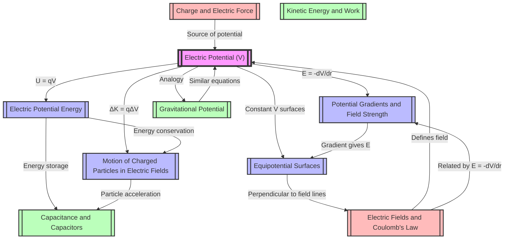

# 1. Overview / 概述

**English:**
Electric Potential is a scalar quantity that describes the electric potential energy per unit charge at a point in an electric field. It is a fundamental concept in electrostatics that bridges the gap between [[Electric Fields and Coulomb's Law]] and the energy considerations of charged particles. Unlike electric field strength (a vector), electric potential is a scalar, making it easier to work with in many calculations, particularly when dealing with multiple charges or complex field configurations.

This topic is crucial because it provides the energy perspective of electric fields. It explains why charges move from high to low potential (for positive charges) and how work is done by or against electric fields. Real-world applications include the operation of cathode ray tubes (CRTs), particle accelerators, electrostatic precipitators, and the fundamental understanding of how batteries create potential differences to drive current in circuits.

In both Cambridge 9702 and Edexcel IAL A-Level Physics examinations, electric potential is a high-difficulty, frequently tested topic. It appears in multiple-choice questions, structured calculations, and extended explanations. Students must understand the relationship between [[Electric Potential (V)]], [[Electric Potential Energy]], [[Potential Gradients and Field Strength]], and [[Equipotential Surfaces]]. The concept is also essential for understanding [[Capacitance and Capacitors]] and has a direct analogy with [[Gravitational Potential]].

**中文：**
电势是一个标量，描述电场中某点单位电荷所具有的电势能。它是静电学中的一个基本概念，连接了[[电场与库仑定律]]和带电粒子能量考虑之间的桥梁。与电场强度（矢量）不同，电势是标量，在许多计算中更容易处理，特别是在处理多个电荷或复杂场构型时。

这个主题至关重要，因为它提供了电场的能量视角。它解释了为什么正电荷从高电势移动到低电势，以及电场如何做功或克服电场做功。实际应用包括阴极射线管（CRT）、粒子加速器、静电除尘器的工作原理，以及理解电池如何产生电势差以驱动电路中的电流。

在剑桥 9702 和爱德思 IAL A-Level 物理考试中，电势是一个高难度、常考的主题。它出现在选择题、结构化计算题和扩展解释题中。学生必须理解[[电势 (V)]]、[[电势能]]、[[电势梯度与场强]]和[[等势面]]之间的关系。这个概念对于理解[[电容与电容器]]也至关重要，并且与[[引力势]]有直接的类比关系。

---

# 2. Syllabus Learning Objectives / 考纲学习目标

**English:**
The following table maps the specific learning objectives from both Cambridge 9702 and Edexcel IAL syllabuses for this topic.

**中文：**
下表列出了剑桥 9702 和爱德思 IAL 教学大纲中关于本主题的具体学习目标。

| CAIE 9702 (18.2 a-f) | Edexcel IAL (WPH14 U4: 2.6-2.10) |
|----------------------|-----------------------------------|
| (a) Define electric potential at a point as the work done per unit positive charge in bringing a small test charge from infinity to that point. | 2.6 Understand the concept of electric potential and electric potential difference (p.d.) |
| (b) State that electric potential at a point is the sum of the potentials from all charges. | 2.7 Use the equation $V = \frac{Q}{4\pi\epsilon_0 r}$ for the electric potential due to a point charge. |
| (c) Recall and use $V = \frac{Q}{4\pi\epsilon_0 r}$ for the electric potential due to a point charge. | 2.8 Understand the relationship between electric field strength and potential gradient: $E = -\frac{\Delta V}{\Delta r}$ |
| (d) Recall and use $E = -\frac{\Delta V}{\Delta r}$ for the potential gradient. | 2.9 Understand the concept of equipotential surfaces and their relationship to electric field lines. |
| (e) Describe the concept of equipotential surfaces. | 2.10 Understand and use the equation $\Delta W = Q\Delta V$ for the work done moving a charge through a potential difference. |
| (f) Recall and use $\Delta W = Q\Delta V$ for the work done moving a charge through a potential difference. | |

> 📋 **CIE Only:** The syllabus explicitly requires defining electric potential as work done per unit positive charge from infinity. Students must be able to state that potential is the sum of potentials from all charges (superposition principle for scalar potentials).

> 📋 **Edexcel Only:** The syllabus explicitly requires understanding the relationship $E = -\frac{\Delta V}{\Delta r}$ and using it to determine field strength from potential gradient. The negative sign is emphasized.

**Examiner Expectations / 考官期望:**
- **English:** Candidates must use precise language when defining electric potential. Common errors include confusing potential with potential energy or field strength. For calculations, ensure correct use of units (J C⁻¹ = V) and the constant $\frac{1}{4\pi\epsilon_0} = 8.99 \times 10^9 \, \text{N m}^2 \text{C}^{-2}$. For graphs, be able to interpret $V$ vs $r$ graphs and calculate gradients.
- **中文：** 考生在定义电势时必须使用精确的语言。常见错误包括混淆电势与电势能或场强。在计算中，确保正确使用单位（J C⁻¹ = V）和常数 $\frac{1}{4\pi\epsilon_0} = 8.99 \times 10^9 \, \text{N m}^2 \text{C}^{-2}$。对于图表，能够解释 $V$ 与 $r$ 的关系图并计算梯度。

---

# 3. Core Definitions / 核心定义

**English:**
The following table provides the essential definitions for this topic, with common mistakes highlighted.

**中文：**
下表提供了本主题的基本定义，并强调了常见错误。

| Term (EN/CN) | Definition (EN) | Definition (CN) | Common Mistakes / 常见错误 |
|--------------|-----------------|-----------------|---------------------------|
| **[[Electric Potential (V)]] / 电势** | The work done per unit positive charge in bringing a small test charge from infinity to a point in an electric field. | 将单位正电荷从无穷远处移动到电场中某点所做的功。 | ❌ Confusing with potential energy. Potential is energy per unit charge (J C⁻¹ = V), not energy (J). |
| **[[Electric Potential Energy]] / 电势能** | The energy stored in a system of charges due to their positions in an electric field. | 由于电荷在电场中的位置而存储在电荷系统中的能量。 | ❌ Confusing with potential. Potential energy depends on the charge magnitude; potential does not. |
| **[[Potential Gradients and Field Strength]] / 电势梯度与场强** | The rate of change of electric potential with distance in a given direction; related to electric field strength by $E = -\frac{dV}{dr}$. | 电势在给定方向上随距离的变化率；通过 $E = -\frac{dV}{dr}$ 与电场强度相关。 | ❌ Forgetting the negative sign. Field points from high to low potential. |
| **[[Equipotential Surfaces]] / 等势面** | Surfaces on which the electric potential is constant. No work is done moving a charge along an equipotential surface. | 电势恒定的表面。沿等势面移动电荷不做功。 | ❌ Thinking field lines are perpendicular to equipotentials (they are). ❌ Thinking equipotentials can cross (they cannot). |
| **Work Done / 做功** | The energy transferred when a charge moves through a potential difference: $\Delta W = Q\Delta V$. | 电荷通过电势差时转移的能量：$\Delta W = Q\Delta V$。 | ❌ Using $W = QV$ without the delta sign. Work depends on the potential *difference*, not absolute potential. |
| **Infinity / 无穷远** | A reference point where the electric potential is defined as zero. | 电势被定义为零的参考点。 | ❌ Thinking infinity is a physical location. It is a mathematical construct for isolated charges. |
| **Test Charge / 测试电荷** | A small positive charge used to probe an electric field without significantly disturbing it. | 用于探测电场而不显著干扰电场的小正电荷。 | ❌ Forgetting the test charge must be small enough not to alter the field. |

---

# 4. Key Concepts Explained / 关键概念详解

## 4.1 Electric Potential (V) / 电势

### Explanation / 解释
**English:**
Electric potential at a point is defined as the work done per unit positive charge in bringing a small test charge from infinity to that point. Mathematically:

$$ V = \frac{W}{q} $$

where $W$ is the work done (in joules) and $q$ is the magnitude of the test charge (in coulombs). The unit of electric potential is the volt (V), where $1 \, \text{V} = 1 \, \text{J C}^{-1}$.

For a point charge $Q$, the electric potential at a distance $r$ is:

$$ V = \frac{Q}{4\pi\epsilon_0 r} $$

This is a scalar quantity, meaning potentials from multiple charges simply add algebraically (superposition principle). The sign of $V$ depends on the sign of $Q$: positive for positive charges, negative for negative charges.

**中文：**
电场中某点的电势定义为将单位正电荷从无穷远处移动到该点所做的功。数学上：

$$ V = \frac{W}{q} $$

其中 $W$ 是所做的功（焦耳），$q$ 是测试电荷的大小（库仑）。电势的单位是伏特（V），其中 $1 \, \text{V} = 1 \, \text{J C}^{-1}$。

对于点电荷 $Q$，距离 $r$ 处的电势为：

$$ V = \frac{Q}{4\pi\epsilon_0 r} $$

这是一个标量，意味着多个电荷的电势可以简单地代数相加（叠加原理）。$V$ 的符号取决于 $Q$ 的符号：正电荷为正，负电荷为负。

### Physical Meaning / 物理意义
**English:**
Electric potential tells us how much energy a unit charge would have at a given point. A positive potential means a positive test charge would have positive potential energy (repulsion from a positive source). A negative potential means a positive test charge would have negative potential energy (attraction to a negative source). Charges naturally move from high to low potential (for positive charges) or from low to high potential (for negative charges).

**中文：**
电势告诉我们单位电荷在给定点会有多少能量。正电势意味着正测试电荷具有正电势能（受到正源电荷的排斥）。负电势意味着正测试电荷具有负电势能（受到负源电荷的吸引）。正电荷自然地从高电势移动到低电势，而负电荷则从低电势移动到高电势。

### Common Misconceptions / 常见误区
1. **Potential vs. Potential Energy:** Students often confuse $V$ (potential) with $U$ (potential energy). Remember: $U = qV$. Potential is independent of the test charge; potential energy depends on it.
2. **Sign of Potential:** A common error is thinking potential is always positive. For a negative charge, $V$ is negative at all finite distances.
3. **Potential at Infinity:** Students sometimes think potential at infinity is undefined. It is defined as zero by convention.
4. **Superposition:** Forgetting that potential is a scalar and simply adds, unlike field strength which is a vector.

### Exam Tips / 考试提示
**English:**
- Cambridge 9702 often asks for the definition of electric potential. Use the exact wording: "work done per unit positive charge in bringing a small test charge from infinity to that point."
- Edexcel IAL frequently tests the calculation of potential due to multiple point charges. Remember to include the sign of each charge.
- When calculating total potential from multiple charges, add the potentials algebraically (scalar addition).
- Be prepared to sketch $V$ vs $r$ graphs for point charges and uniform fields.

**中文：**
- 剑桥 9702 经常要求定义电势。使用准确的措辞："将单位正电荷从无穷远处移动到该点所做的功。"
- 爱德思 IAL 经常测试计算多个点电荷产生的电势。记住包括每个电荷的符号。
- 计算多个电荷的总电势时，代数相加（标量加法）。
- 准备好绘制点电荷和均匀场的 $V$ 与 $r$ 关系图。

---

## 4.2 Electric Potential Energy / 电势能

### Explanation / 解释
**English:**
Electric potential energy is the energy stored in a system of charges due to their positions in an electric field. For a charge $q$ placed at a point where the electric potential is $V$, the potential energy is:

$$ U = qV $$

For two point charges $Q_1$ and $Q_2$ separated by distance $r$, the electric potential energy of the system is:

$$ U = \frac{Q_1 Q_2}{4\pi\epsilon_0 r} $$

This represents the work done to bring the charges from infinity to their positions. If the charges have the same sign, $U$ is positive (work must be done to bring them together). If opposite signs, $U$ is negative (work is done by the field as they attract).

**中文：**
电势能是由于电荷在电场中的位置而存储在电荷系统中的能量。对于放置在电势为 $V$ 的点上的电荷 $q$，电势能为：

$$ U = qV $$

对于相距 $r$ 的两个点电荷 $Q_1$ 和 $Q_2$，系统的电势能为：

$$ U = \frac{Q_1 Q_2}{4\pi\epsilon_0 r} $$

这表示将电荷从无穷远处带到它们位置所做的功。如果电荷同号，$U$ 为正（必须做功将它们拉近）。如果异号，$U$ 为负（当它们吸引时，电场做功）。

### Physical Meaning / 物理意义
**English:**
Potential energy represents the capacity to do work. A system of like charges has positive potential energy, meaning energy is stored and can be released if the charges are allowed to move apart. A system of opposite charges has negative potential energy, meaning energy must be supplied to separate them (like a stretched spring).

**中文：**
电势能代表做功的能力。同号电荷系统具有正电势能，意味着存储了能量，如果允许电荷分开，能量可以释放。异号电荷系统具有负电势能，意味着必须提供能量才能将它们分开（像拉伸的弹簧）。

### Common Misconceptions / 常见误区
1. **Sign of $U$:** Students often think potential energy is always positive. For opposite charges, $U$ is negative.
2. **$U$ vs $V$:** Confusing potential energy ($U$) with potential ($V$). $U = qV$, so $U$ depends on both $q$ and $V$.
3. **Zero Point:** Forgetting that $U = 0$ at infinity is a convention.

### Exam Tips / 考试提示
**English:**
- Cambridge 9702 may ask you to calculate the work done to assemble a system of charges. This is the change in potential energy.
- Edexcel IAL often links potential energy to conservation of energy problems involving charged particles moving in electric fields.
- Remember: $\Delta U = q\Delta V$ is the work done by or against the electric field.

**中文：**
- 剑桥 9702 可能要求计算组装电荷系统所做的功。这是电势能的变化。
- 爱德思 IAL 经常将电势能与涉及带电粒子在电场中运动的能量守恒问题联系起来。
- 记住：$\Delta U = q\Delta V$ 是电场做功或克服电场做功。

---

## 4.3 Potential Gradients and Field Strength / 电势梯度与场强

### Explanation / 解释
**English:**
The electric field strength $E$ is related to the rate of change of potential with distance. In one dimension:

$$ E = -\frac{dV}{dr} $$

or for a finite change:

$$ E = -\frac{\Delta V}{\Delta r} $$

The negative sign indicates that the electric field points in the direction of decreasing potential (from high to low potential). The magnitude of $E$ is the gradient of the potential-distance graph.

For a uniform field (e.g., between parallel plates):

$$ E = \frac{V}{d} $$

where $V$ is the potential difference between the plates and $d$ is the separation.

**中文：**
电场强度 $E$ 与电势随距离的变化率有关。在一维情况下：

$$ E = -\frac{dV}{dr} $$

或对于有限变化：

$$ E = -\frac{\Delta V}{\Delta r} $$

负号表示电场指向电势降低的方向（从高电势到低电势）。$E$ 的大小是电势-距离图的梯度。

对于均匀场（例如平行板之间）：

$$ E = \frac{V}{d} $$

其中 $V$ 是板之间的电势差，$d$ 是间距。

### Physical Meaning / 物理意义
**English:**
The potential gradient tells us how quickly the potential changes as we move through space. A steep gradient means a strong electric field. The negative sign means that if you move in the direction of the field, the potential decreases. This is analogous to gravitational potential gradient: moving uphill increases gravitational potential, while moving downhill decreases it.

**中文：**
电势梯度告诉我们当我们在空间中移动时电势变化的速度。陡峭的梯度意味着强电场。负号意味着如果你沿电场方向移动，电势降低。这类似于引力势梯度：上坡增加引力势，下坡降低引力势。

### Common Misconceptions / 常见误区
1. **Forgetting the Negative Sign:** The most common error. $E = -\frac{dV}{dr}$, not $E = \frac{dV}{dr}$.
2. **Direction:** Students often think $E$ points from low to high potential. It points from high to low potential.
3. **Uniform vs. Non-uniform:** For a uniform field, $E$ is constant and $V$ changes linearly. For a point charge, $E$ varies with $r$ and $V$ follows a $1/r$ relationship.

### Exam Tips / 考试提示
**English:**
- Cambridge 9702 often asks you to calculate $E$ from a $V$ vs $r$ graph by finding the gradient.
- Edexcel IAL frequently tests the relationship $E = -\frac{\Delta V}{\Delta r}$ in the context of uniform fields between parallel plates.
- Be careful with units: $E$ is in V m⁻¹ or N C⁻¹. These are equivalent.

**中文：**
- 剑桥 9702 经常要求通过求 $V$ 与 $r$ 关系图的梯度来计算 $E$。
- 爱德思 IAL 经常在平行板之间均匀场的背景下测试关系 $E = -\frac{\Delta V}{\Delta r}$。
- 注意单位：$E$ 的单位是 V m⁻¹ 或 N C⁻¹。它们是等价的。

---

## 4.4 Equipotential Surfaces / 等势面

### Explanation / 解释
**English:**
Equipotential surfaces are surfaces on which the electric potential is constant. Key properties:

1. **No work is done** moving a charge along an equipotential surface because $\Delta V = 0$, so $\Delta W = q\Delta V = 0$.
2. **Electric field lines are perpendicular** to equipotential surfaces. This is because the field does no work moving along the surface, so the field must be perpendicular to the surface.
3. **Equipotential surfaces never cross.** If they did, a point would have two different potentials, which is impossible.
4. **Closer spacing** of equipotentials indicates a stronger electric field (steeper potential gradient).

For a point charge, equipotentials are concentric spheres centered on the charge. For a uniform field, equipotentials are parallel planes perpendicular to the field lines.

**中文：**
等势面是电势恒定的表面。关键性质：

1. **不做功**：沿等势面移动电荷不做功，因为 $\Delta V = 0$，所以 $\Delta W = q\Delta V = 0$。
2. **电场线垂直于**等势面。这是因为沿表面移动时电场不做功，所以电场必须垂直于表面。
3. **等势面永不相交。** 如果相交，一个点将有两个不同的电势，这是不可能的。
4. **等势面间距越近**表示电场越强（电势梯度越陡）。

对于点电荷，等势面是以电荷为中心的同心球面。对于均匀场，等势面是垂直于电场线的平行平面。

### Physical Meaning / 物理意义
**English:**
Equipotential surfaces are like contour lines on a map. Just as contour lines connect points of equal height (gravitational potential), equipotentials connect points of equal electric potential. Moving along a contour line requires no work against gravity; similarly, moving along an equipotential requires no work against the electric field.

**中文：**
等势面就像地图上的等高线。正如等高线连接等高点（引力势），等势面连接等电势点。沿等高线移动不需要克服重力做功；同样，沿等势面移动不需要克服电场做功。

### Common Misconceptions / 常见误区
1. **Field Lines vs. Equipotentials:** Students often think they are the same. Field lines show direction of force; equipotentials show constant potential. They are perpendicular.
2. **Spacing:** Closer equipotentials mean stronger field, not weaker.
3. **Crossing:** Equipotentials cannot cross, but field lines can (at a point charge).

### Exam Tips / 考试提示
**English:**
- Cambridge 9702 often asks you to sketch equipotentials for given charge configurations.
- Edexcel IAL may ask you to explain why no work is done moving along an equipotential.
- Be able to identify equipotentials from field line diagrams and vice versa.

**中文：**
- 剑桥 9702 经常要求为给定的电荷配置绘制等势面。
- 爱德思 IAL 可能要求解释为什么沿等势面移动不做功。
- 能够从电场线图中识别等势面，反之亦然。

---

## 4.5 Motion of Charged Particles in Electric Fields / 带电粒子在电场中的运动

### Explanation / 解释
**English:**
When a charged particle moves in an electric field, its kinetic energy changes due to work done by the field. Using conservation of energy:

$$ \Delta K = -\Delta U = -q\Delta V $$

where $\Delta K$ is the change in kinetic energy and $\Delta U$ is the change in potential energy. If a particle moves from a point at potential $V_1$ to $V_2$:

$$ \frac{1}{2}mv_2^2 - \frac{1}{2}mv_1^2 = -q(V_2 - V_1) = q(V_1 - V_2) $$

For a particle accelerated from rest through a potential difference $V$:

$$ \frac{1}{2}mv^2 = qV $$

This is the basis for electron guns, particle accelerators, and cathode ray tubes.

**中文：**
当带电粒子在电场中运动时，其动能因电场做功而改变。利用能量守恒：

$$ \Delta K = -\Delta U = -q\Delta V $$

其中 $\Delta K$ 是动能的变化，$\Delta U$ 是电势能的变化。如果粒子从电势 $V_1$ 的点移动到 $V_2$：

$$ \frac{1}{2}mv_2^2 - \frac{1}{2}mv_1^2 = -q(V_2 - V_1) = q(V_1 - V_2) $$

对于从静止通过电势差 $V$ 加速的粒子：

$$ \frac{1}{2}mv^2 = qV $$

这是电子枪、粒子加速器和阴极射线管的基础。

### Physical Meaning / 物理意义
**English:**
This concept explains how electrical energy is converted to kinetic energy. In a TV tube, electrons are accelerated by a high voltage, gaining enough kinetic energy to produce light when they hit the screen. In particle accelerators, charged particles are repeatedly accelerated through potential differences to reach very high speeds.

**中文：**
这个概念解释了电能如何转化为动能。在电视显像管中，电子被高电压加速，获得足够的动能，在撞击屏幕时产生光。在粒子加速器中，带电粒子反复通过电势差加速，达到非常高的速度。

### Common Misconceptions / 常见误区
1. **Sign of $q$:** For electrons ($q = -e$), the energy equation becomes $\frac{1}{2}mv^2 = eV$ (positive because $q$ is negative and $V$ is positive).
2. **Direction:** Positive charges accelerate toward lower potential; negative charges accelerate toward higher potential.
3. **Non-uniform Fields:** In non-uniform fields, the acceleration is not constant, making motion more complex.

### Exam Tips / 考试提示
**English:**
- Cambridge 9702 often combines this with projectile motion for particles entering uniform fields at an angle.
- Edexcel IAL frequently tests the electron-volt (eV) as a unit of energy: $1 \, \text{eV} = 1.6 \times 10^{-19} \, \text{J}$.
- Be able to calculate the speed of a particle accelerated through a given potential difference.

**中文：**
- 剑桥 9702 经常将此与以一定角度进入均匀场的粒子的抛体运动结合。
- 爱德思 IAL 经常测试电子伏特（eV）作为能量单位：$1 \, \text{eV} = 1.6 \times 10^{-19} \, \text{J}$。
- 能够计算通过给定电势差加速的粒子的速度。

---

# 5. Essential Equations / 核心公式

## 5.1 Electric Potential due to a Point Charge / 点电荷产生的电势

**Equation / 公式:**
$$ V = \frac{Q}{4\pi\epsilon_0 r} $$

**Variables / 变量:**
| Symbol (符号) | Meaning (EN) | Meaning (CN) | Unit (单位) |
|--------------|-------------|-------------|------------|
| $V$ | Electric potential at distance $r$ | 距离 $r$ 处的电势 | V (volt) |
| $Q$ | Source charge | 源电荷 | C (coulomb) |
| $r$ | Distance from charge | 距电荷的距离 | m (metre) |
| $\epsilon_0$ | Permittivity of free space | 真空介电常数 | F m⁻¹ (farad per metre) |
| $\frac{1}{4\pi\epsilon_0}$ | Coulomb constant ($k$) | 库仑常数 ($k$) | $8.99 \times 10^9 \, \text{N m}^2 \text{C}^{-2}$ |

**Derivation / 推导:**
**English:**
The electric potential is the work done per unit charge to bring a test charge from infinity to distance $r$. The force on a test charge $q$ at distance $x$ from $Q$ is:

$$ F = \frac{Qq}{4\pi\epsilon_0 x^2} $$

The work done to move the test charge from $x$ to $x + dx$ is:

$$ dW = F\,dx = \frac{Qq}{4\pi\epsilon_0 x^2}\,dx $$

Total work from infinity ($\infty$) to $r$:

$$ W = \int_{\infty}^{r} \frac{Qq}{4\pi\epsilon_0 x^2}\,dx = \frac{Qq}{4\pi\epsilon_0} \left[-\frac{1}{x}\right]_{\infty}^{r} = \frac{Qq}{4\pi\epsilon_0 r} $$

Potential is work per unit charge:

$$ V = \frac{W}{q} = \frac{Q}{4\pi\epsilon_0 r} $$

**中文：**
电势是将测试电荷从无穷远处移动到距离 $r$ 处所做的单位电荷功。距离 $Q$ 为 $x$ 处对测试电荷 $q$ 的力为：

$$ F = \frac{Qq}{4\pi\epsilon_0 x^2} $$

将测试电荷从 $x$ 移动到 $x + dx$ 所做的功为：

$$ dW = F\,dx = \frac{Qq}{4\pi\epsilon_0 x^2}\,dx $$

从无穷远 ($\infty$) 到 $r$ 的总功：

$$ W = \int_{\infty}^{r} \frac{Qq}{4\pi\epsilon_0 x^2}\,dx = \frac{Qq}{4\pi\epsilon_0} \left[-\frac{1}{x}\right]_{\infty}^{r} = \frac{Qq}{4\pi\epsilon_0 r} $$

电势是单位电荷的功：

$$ V = \frac{W}{q} = \frac{Q}{4\pi\epsilon_0 r} $$

**Conditions / 适用条件:**
**English:** For a point charge or a spherically symmetric charge distribution. Valid only in a vacuum or air (using $\epsilon_0$). For other media, use $\epsilon = \epsilon_r \epsilon_0$.
**中文：** 适用于点电荷或球对称电荷分布。仅在真空或空气中有效（使用 $\epsilon_0$）。对于其他介质，使用 $\epsilon = \epsilon_r \epsilon_0$。

**Limitations / 局限性:**
**English:** Does not apply for extended charge distributions that are not spherically symmetric. For such cases, integration over the charge distribution is required.
**中文：** 不适用于非球对称的扩展电荷分布。对于这种情况，需要对电荷分布进行积分。

**Rearrangements / 变形:**
**English:**
- $Q = 4\pi\epsilon_0 r V$
- $r = \frac{Q}{4\pi\epsilon_0 V}$
- $V \propto \frac{1}{r}$ (inverse relationship)

**中文：**
- $Q = 4\pi\epsilon_0 r V$
- $r = \frac{Q}{4\pi\epsilon_0 V}$
- $V \propto \frac{1}{r}$（反比关系）

---

## 5.2 Work Done Moving a Charge / 移动电荷所做的功

**Equation / 公式:**
$$ \Delta W = Q\Delta V $$

**Variables / 变量:**
| Symbol (符号) | Meaning (EN) | Meaning (CN) | Unit (单位) |
|--------------|-------------|-------------|------------|
| $\Delta W$ | Work done (energy transferred) | 所做的功（转移的能量） | J (joule) |
| $Q$ | Charge moved | 移动的电荷 | C (coulomb) |
| $\Delta V$ | Potential difference | 电势差 | V (volt) |

**Derivation / 推导:**
**English:**
By definition, potential difference is work done per unit charge:

$$ \Delta V = \frac{\Delta W}{Q} $$

Rearranging gives:

$$ \Delta W = Q\Delta V $$

**中文：**
根据定义，电势差是单位电荷所做的功：

$$ \Delta V = \frac{\Delta W}{Q} $$

重新排列得到：

$$ \Delta W = Q\Delta V $$

**Conditions / 适用条件:**
**English:** Valid for any electric field, uniform or non-uniform. The work done is path-independent because the electric force is conservative.
**中文：** 适用于任何电场，均匀或非均匀。所做的功与路径无关，因为电场力是保守力。

**Limitations / 局限性:**
**English:** $\Delta W$ represents the work done by the field if the charge moves naturally (positive to negative potential for positive charges). If an external agent moves the charge against the field, the work done by the external agent is $+\Delta W$.
**中文：** 如果电荷自然移动（正电荷从正电势到负电势），$\Delta W$ 表示电场所做的功。如果外部作用力逆着电场移动电荷，外部作用力所做的功为 $+\Delta W$。

**Rearrangements / 变形:**
**English:**
- $Q = \frac{\Delta W}{\Delta V}$
- $\Delta V = \frac{\Delta W}{Q}$
- For an electron accelerated through $V$: $\frac{1}{2}mv^2 = eV$

**中文：**
- $Q = \frac{\Delta W}{\Delta V}$
- $\Delta V = \frac{\Delta W}{Q}$
- 对于通过 $V$ 加速的电子：$\frac{1}{2}mv^2 = eV$

---

## 5.3 Potential Gradient and Field Strength / 电势梯度与场强

**Equation / 公式:**
$$ E = -\frac{dV}{dr} $$

**Variables / 变量:**
| Symbol (符号) | Meaning (EN) | Meaning (CN) | Unit (单位) |
|--------------|-------------|-------------|------------|
| $E$ | Electric field strength | 电场强度 | V m⁻¹ or N C⁻¹ |
| $V$ | Electric potential | 电势 | V |
| $r$ | Distance | 距离 | m |

**Derivation / 推导:**
**English:**
The work done by the field to move a charge $q$ a small distance $\Delta r$ is:

$$ \Delta W = F\Delta r = qE\Delta r $$

But also:

$$ \Delta W = -q\Delta V $$

(The negative sign because moving in the direction of the field decreases potential.)

Equating:

$$ qE\Delta r = -q\Delta V $$

$$ E = -\frac{\Delta V}{\Delta r} $$

In the limit $\Delta r \to 0$:

$$ E = -\frac{dV}{dr} $$

**中文：**
电场将电荷 $q$ 移动小距离 $\Delta r$ 所做的功为：

$$ \Delta W = F\Delta r = qE\Delta r $$

但也有：

$$ \Delta W = -q\Delta V $$

（负号是因为沿电场方向移动会降低电势。）

相等：

$$ qE\Delta r = -q\Delta V $$

$$ E = -\frac{\Delta V}{\Delta r} $$

在极限 $\Delta r \to 0$ 时：

$$ E = -\frac{dV}{dr} $$

**Conditions / 适用条件:**
**English:** Valid for any electric field. For a uniform field, $E = \frac{V}{d}$ (without the negative sign if considering magnitude only).
**中文：** 适用于任何电场。对于均匀场，$E = \frac{V}{d}$（如果只考虑大小，则没有负号）。

**Limitations / 局限性:**
**English:** The equation gives the component of $E$ in the direction of $r$. For the full vector, consider all three dimensions: $\vec{E} = -\nabla V$.
**中文：** 该方程给出 $E$ 在 $r$ 方向的分量。对于完整矢量，考虑所有三个维度：$\vec{E} = -\nabla V$。

**Rearrangements / 变形:**
**English:**
- $\Delta V = -E\Delta r$ (for small $\Delta r$)
- $V = -\int E\,dr$ (for non-uniform fields)
- For uniform field: $V = Ed$ (magnitude only)

**中文：**
- $\Delta V = -E\Delta r$（对于小 $\Delta r$）
- $V = -\int E\,dr$（对于非均匀场）
- 对于均匀场：$V = Ed$（仅大小）

---

## 5.4 Electric Potential Energy of Two Point Charges / 两个点电荷的电势能

**Equation / 公式:**
$$ U = \frac{Q_1 Q_2}{4\pi\epsilon_0 r} $$

**Variables / 变量:**
| Symbol (符号) | Meaning (EN) | Meaning (CN) | Unit (单位) |
|--------------|-------------|-------------|------------|
| $U$ | Electric potential energy | 电势能 | J (joule) |
| $Q_1, Q_2$ | Two point charges | 两个点电荷 | C (coulomb) |
| $r$ | Separation between charges | 电荷间距 | m (metre) |
| $\epsilon_0$ | Permittivity of free space | 真空介电常数 | F m⁻¹ |

**Derivation / 推导:**
**English:**
The potential energy is the work done to bring the charges from infinity to their separation $r$. Consider bringing $Q_2$ from infinity to distance $r$ from $Q_1$. The potential at distance $r$ due to $Q_1$ is:

$$ V = \frac{Q_1}{4\pi\epsilon_0 r} $$

The work done to bring $Q_2$ to this point is:

$$ W = Q_2 V = \frac{Q_1 Q_2}{4\pi\epsilon_0 r} $$

This work is stored as potential energy:

$$ U = \frac{Q_1 Q_2}{4\pi\epsilon_0 r} $$

**中文：**
电势能是将电荷从无穷远处带到间距 $r$ 所做的功。考虑将 $Q_2$ 从无穷远处带到距离 $Q_1$ 为 $r$ 的位置。$Q_1$ 在距离 $r$ 处产生的电势为：

$$ V = \frac{Q_1}{4\pi\epsilon_0 r} $$

将 $Q_2$ 带到该点所做的功为：

$$ W = Q_2 V = \frac{Q_1 Q_2}{4\pi\epsilon_0 r} $$

这个功作为电势能存储：

$$ U = \frac{Q_1 Q_2}{4\pi\epsilon_0 r} $$

**Conditions / 适用条件:**
**English:** For two point charges only. For systems of more charges, sum over all pairs.
**中文：** 仅适用于两个点电荷。对于多个电荷的系统，对所有对求和。

**Limitations / 局限性:**
**English:** Assumes charges are in a vacuum. For other media, use $\epsilon = \epsilon_r \epsilon_0$.
**中文：** 假设电荷在真空中。对于其他介质，使用 $\epsilon = \epsilon_r \epsilon_0$。

**Rearrangements / 变形:**
**English:**
- $U = Q_2 V_1$ where $V_1$ is potential due to $Q_1$ at $Q_2$'s position
- $U = Q_1 V_2$ where $V_2$ is potential due to $Q_2$ at $Q_1$'s position
- $U \propto \frac{1}{r}$

**中文：**
- $U = Q_2 V_1$，其中 $V_1$ 是 $Q_1$ 在 $Q_2$ 位置产生的电势
- $U = Q_1 V_2$，其中 $V_2$ 是 $Q_2$ 在 $Q_1$ 位置产生的电势
- $U \propto \frac{1}{r}$

---

# 6. Graphs and Relationships / 图表与关系

## 6.1 Electric Potential vs Distance for a Point Charge / 点电荷的电势与距离关系图

### Axes / 坐标轴
**English:** x-axis: Distance from charge $r$ (m); y-axis: Electric potential $V$ (V)
**中文：** x轴：距电荷的距离 $r$ (m)；y轴：电势 $V$ (V)

### Shape / 形状
**English:** For a positive charge: a hyperbola decreasing from $+\infty$ at $r=0$ to $0$ as $r \to \infty$. For a negative charge: a hyperbola increasing from $-\infty$ at $r=0$ to $0$ as $r \to \infty$.
**中文：** 对于正电荷：双曲线，从 $r=0$ 处的 $+\infty$ 下降到 $r \to \infty$ 时的 $0$。对于负电荷：双曲线，从 $r=0$ 处的 $-\infty$ 上升到 $r \to \infty$ 时的 $0$。

### Gradient Meaning / 斜率含义
**English:** The gradient $\frac{dV}{dr}$ gives the negative of the electric field strength: $E = -\frac{dV}{dr}$. The gradient is steepest near the charge (strong field) and approaches zero far away.
**中文：** 梯度 $\frac{dV}{dr}$ 给出电场强度的负值：$E = -\frac{dV}{dr}$。梯度在电荷附近最陡（强场），在远处趋近于零。

### Area Meaning / 面积含义
**English:** The area under the $V$ vs $r$ graph does not have a direct physical meaning. However, the area under the $E$ vs $r$ graph gives the potential difference.
**中文：** $V$ 与 $r$ 关系图下的面积没有直接的物理意义。然而，$E$ 与 $r$ 关系图下的面积给出电势差。

### Exam Interpretation / 考试解读
**English:**
- Cambridge 9702: Be able to sketch $V$ vs $r$ for positive and negative charges. Identify that $V$ is positive for $Q>0$ and negative for $Q<0$.
- Edexcel IAL: Calculate the gradient at a point to find $E$. Compare gradients for different charges.

**中文：**
- 剑桥 9702：能够绘制正负电荷的 $V$ 与 $r$ 关系图。识别 $Q>0$ 时 $V$ 为正，$Q<0$ 时 $V$ 为负。
- 爱德思 IAL：计算某点的梯度以求出 $E$。比较不同电荷的梯度。

### Common Questions / 常见问题
**English:**
- "Sketch the variation of electric potential with distance from a point charge."
- "Use the graph to determine the electric field strength at a given distance."
- "Explain why the potential approaches zero as $r \to \infty$."

**中文：**
- "绘制电势随距点电荷距离变化的草图。"
- "利用图表确定给定距离处的电场强度。"
- "解释为什么当 $r \to \infty$ 时电势趋近于零。"

---

## 6.2 Electric Field Strength vs Distance for a Point Charge / 点电荷的电场强度与距离关系图

### Axes / 坐标轴
**English:** x-axis: Distance from charge $r$ (m); y-axis: Electric field strength $E$ (N C⁻¹ or V m⁻¹)
**中文：** x轴：距电荷的距离 $r$ (m)；y轴：电场强度 $E$ (N C⁻¹ 或 V m⁻¹)

### Shape / 形状
**English:** An inverse square curve: $E \propto \frac{1}{r^2}$. For a positive charge, $E$ is positive (radially outward); for a negative charge, $E$ is negative (radially inward).
**中文：** 反平方曲线：$E \propto \frac{1}{r^2}$。对于正电荷，$E$ 为正（径向向外）；对于负电荷，$E$ 为负（径向向内）。

### Gradient Meaning / 斜率含义
**English:** The gradient $\frac{dE}{dr}$ gives the rate of change of field strength. It is negative and steep near the charge.
**中文：** 梯度 $\frac{dE}{dr}$ 给出场强的变化率。在电荷附近为负且陡峭。

### Area Meaning / 面积含义
**English:** The area under the $E$ vs $r$ graph gives the potential difference: $\Delta V = -\int E\,dr$. The negative sign means the area is negative when moving in the direction of the field.
**中文：** $E$ 与 $r$ 关系图下的面积给出电势差：$\Delta V = -\int E\,dr$。负号意味着沿电场方向移动时面积为负。

### Exam Interpretation / 考试解读
**English:**
- Compare the shapes of $V$ vs $r$ and $E$ vs $r$ graphs.
- Use the area under $E$ vs $r$ to find $\Delta V$ between two points.

**中文：**
- 比较 $V$ 与 $r$ 和 $E$ 与 $r$ 关系图的形状。
- 利用 $E$ 与 $r$ 关系图下的面积求两点之间的 $\Delta V$。

### Common Questions / 常见问题
**English:**
- "Sketch the variation of electric field strength with distance from a point charge."
- "Calculate the potential difference between two points using the $E$ vs $r$ graph."

**中文：**
- "绘制电场强度随距点电荷距离变化的草图。"
- "利用 $E$ 与 $r$ 关系图计算两点之间的电势差。"

---

## 6.3 Potential vs Distance for a Uniform Field / 均匀场的电势与距离关系图

### Axes / 坐标轴
**English:** x-axis: Distance from positive plate $x$ (m); y-axis: Electric potential $V$ (V)
**中文：** x轴：距正极板的距离 $x$ (m)；y轴：电势 $V$ (V)

### Shape / 形状
**English:** A straight line with negative gradient. $V$ decreases linearly from $V_0$ at the positive plate to $0$ at the negative plate (or vice versa, depending on reference).
**中文：** 一条具有负斜率的直线。$V$ 从正极板处的 $V_0$ 线性下降到负极板处的 $0$（或反之，取决于参考点）。

### Gradient Meaning / 斜率含义
**English:** The gradient is constant and equal to $-E$. The magnitude of the gradient gives the uniform field strength: $E = \frac{V}{d}$.
**中文：** 梯度恒定且等于 $-E$。梯度的大小给出均匀场强：$E = \frac{V}{d}$。

### Area Meaning / 面积含义
**English:** Not applicable for this linear graph.
**中文：** 不适用于此线性图。

### Exam Interpretation / 考试解读
**English:**
- The linear relationship confirms the field is uniform.
- The gradient gives $E$ directly.
- The intercepts give the potentials at the plates.

**中文：**
- 线性关系确认场是均匀的。
- 梯度直接给出 $E$。
- 截距给出极板处的电势。

### Common Questions / 常见问题
**English:**
- "Sketch the variation of potential with distance between two parallel plates."
- "Determine the electric field strength from the gradient."

**中文：**
- "绘制两个平行板之间电势随距离变化的草图。"
- "从梯度确定电场强度。"

---

## 6.4 Equipotential Surfaces Diagram / 等势面图

### Axes / 坐标轴
**English:** No axes; spatial diagram showing equipotential lines (in 2D) or surfaces (in 3D).
**中文：** 无坐标轴；显示等势线（2D）或等势面（3D）的空间图。

### Shape / 形状
**English:** For a point charge: concentric circles (2D) or spheres (3D). For a uniform field: parallel straight lines (2D) or planes (3D) perpendicular to field lines.
**中文：** 对于点电荷：同心圆（2D）或球面（3D）。对于均匀场：垂直于电场线的平行直线（2D）或平面（3D）。

### Gradient Meaning / 斜率含义
**English:** The spacing between equipotentials indicates field strength. Closer spacing = stronger field.
**中文：** 等势面间距表示场强。间距越近 = 场越强。

### Area Meaning / 面积含义
**English:** Not applicable.
**中文：** 不适用。

### Exam Interpretation / 考试解读
**English:**
- Equipotentials are always perpendicular to field lines.
- No work is done moving along an equipotential.
- The potential difference between adjacent equipotentials is constant.

**中文：**
- 等势面始终垂直于电场线。
- 沿等势面移动不做功。
- 相邻等势面之间的电势差恒定。

### Common Questions / 常见问题
**English:**
- "Draw the equipotential surfaces for a point charge."
- "Explain why equipotential surfaces are perpendicular to field lines."
- "Compare the spacing of equipotentials near a charge and far away."

**中文：**
- "绘制点电荷的等势面。"
- "解释为什么等势面垂直于电场线。"
- "比较电荷附近和远处的等势面间距。"

---

# 7. Required Diagrams / 必备图表

## 7.1 Electric Potential vs Distance for a Point Charge / 点电荷的电势与距离关系图

### Description / 描述
**English:** A graph showing the variation of electric potential $V$ with distance $r$ from a point charge. Two curves should be shown: one for a positive charge ($V > 0$) and one for a negative charge ($V < 0$). Both curves approach zero as $r \to \infty$ and approach $\pm\infty$ as $r \to 0$.
**中文：** 显示电势 $V$ 随距点电荷距离 $r$ 变化的图表。应显示两条曲线：一条用于正电荷（$V > 0$），一条用于负电荷（$V < 0$）。两条曲线在 $r \to \infty$ 时趋近于零，在 $r \to 0$ 时趋近于 $\pm\infty$。

### Image Prompt / 图片生成提示
> 📷 **IMAGE PROMPT — V01: Electric Potential vs Distance for Point Charges**
>
> A clean, educational physics graph with two curves on the same axes. x-axis labeled "Distance r / m" with arrow pointing right. y-axis labeled "Electric Potential V / V" with arrow pointing up. The first curve (solid red) shows V = 1/r for positive charge: starts at +∞ near r=0, decreases rapidly, then slowly approaches 0 as r→∞. The second curve (dashed blue) shows V = -1/r for negative charge: starts at -∞ near r=0, increases rapidly, then slowly approaches 0 as r→∞. Both curves are asymptotic to both axes. Grid lines shown. Clear labels: "Positive charge Q > 0" and "Negative charge Q < 0". Professional scientific graph style, white background, high contrast.

### Labels Required / 需要标注
**English:**
- x-axis: "Distance from charge, r / m"
- y-axis: "Electric potential, V / V"
- Curve 1: "Positive charge (Q > 0)"
- Curve 2: "Negative charge (Q < 0)"
- Asymptote at V = 0: "V → 0 as r → ∞"
- Near r = 0: "V → ±∞ as r → 0"

**中文：**
- x轴："距电荷的距离，r / m"
- y轴："电势，V / V"
- 曲线1："正电荷 (Q > 0)"
- 曲线2："负电荷 (Q < 0)"
- V = 0 处的渐近线："当 r → ∞ 时 V → 0"
- r = 0 附近："当 r → 0 时 V → ±∞"

### Exam Importance / 考试重要性
**English:**
- Cambridge 9702: Frequently asked to sketch this graph and explain its shape.
- Edexcel IAL: Used to calculate field strength from gradient and to compare potentials from different charges.

**中文：**
- 剑桥 9702：经常要求绘制此图并解释其形状。
- 爱德思 IAL：用于从梯度计算场强并比较不同电荷的电势。

---

## 7.2 Equipotential Surfaces for a Point Charge / 点电荷的等势面

### Description / 描述
**English:** A 2D diagram showing a central point charge with concentric circular equipotential lines around it. Electric field lines should be shown as radial lines from the charge, perpendicular to the equipotentials. The spacing between equipotentials should increase with distance from the charge, indicating decreasing field strength.
**中文：** 一个二维图，显示中心点电荷及其周围的同心圆形等势线。电场线应显示为从电荷发出的径向线，垂直于等势面。等势面之间的间距应随距电荷的距离增加而增加，表示场强减小。

### Image Prompt / 图片生成提示
> 📷 **IMAGE PROMPT — V02: Equipotential Surfaces for a Point Charge**
>
> A 2D cross-section diagram of a positive point charge. Center: a small red circle labeled "+Q". Around it: 5-6 concentric dashed circles (equipotential surfaces) in blue, with increasing radii. Labels on equipotentials: "V1", "V2", "V3", etc., with V1 highest (closest) and decreasing outward. From the charge: 8 radial solid red lines with arrows pointing outward (electric field lines). Field lines are perpendicular to equipotential circles at all intersection points. Note that equipotentials are closer together near the charge and farther apart far away. Clean white background, educational diagram style, clear labels in English.

### Labels Required / 需要标注
**English:**
- Center: "+Q" (positive point charge)
- Equipotential lines: "V₁", "V₂", "V₃", ... (with V₁ > V₂ > V₃)
- Electric field lines: "E" with arrows pointing radially outward
- Note: "Field lines ⊥ equipotentials"
- Note: "Closer spacing near charge = stronger field"

**中文：**
- 中心："+Q"（正点电荷）
- 等势线："V₁", "V₂", "V₃", ...（V₁ > V₂ > V₃）
- 电场线："E"，箭头径向向外
- 注释："电场线 ⊥ 等势面"
- 注释："电荷附近间距更近 = 场更强"

### Exam Importance / 考试重要性
**English:**
- Cambridge 9702: Required to draw equipotentials for point charges and uniform fields.
- Edexcel IAL: Used to explain why no work is done moving along an equipotential and to relate spacing to field strength.

**中文：**
- 剑桥 9702：需要绘制点电荷和均匀场的等势面。
- 爱德思 IAL：用于解释为什么沿等势面移动不做功，以及将间距与场强联系起来。

---

## 7.3 Potential vs Distance for a Uniform Field / 均匀场的电势与距离关系图

### Description / 描述
**English:** A graph showing the linear variation of electric potential with distance between two parallel plates. The positive plate is at $x=0$ with potential $V_0$, and the negative plate is at $x=d$ with potential $0$. The line has a constant negative gradient.
**中文：** 显示两个平行板之间电势随距离线性变化的图表。正极板在 $x=0$ 处，电势为 $V_0$；负极板在 $x=d$ 处，电势为 $0$。直线具有恒定的负斜率。

### Image Prompt / 图片生成提示
> 📷 **IMAGE PROMPT — V03: Potential vs Distance in a Uniform Electric Field**
>
> A physics graph with x-axis labeled "Distance from positive plate, x / m" and y-axis labeled "Electric potential, V / V". A straight line with negative slope from point (0, V₀) to point (d, 0). The line is solid and red. Grid lines shown. At x=0, label "Positive plate (V = V₀)". At x=d, label "Negative plate (V = 0)". The gradient is constant: show a right triangle on the graph with Δx and ΔV labeled, and note "Gradient = -E = -V₀/d". Clean white background, professional educational style.

### Labels Required / 需要标注
**English:**
- x-axis: "Distance from positive plate, x / m"
- y-axis: "Electric potential, V / V"
- Point (0, V₀): "Positive plate"
- Point (d, 0): "Negative plate"
- Gradient triangle: "Δx", "ΔV"
- Note: "Gradient = -E = -V₀/d"

**中文：**
- x轴："距正极板的距离，x / m"
- y轴："电势，V / V"
- 点 (0, V₀)："正极板"
- 点 (d, 0)："负极板"
- 梯度三角形："Δx", "ΔV"
- 注释："梯度 = -E = -V₀/d"

### Exam Importance / 考试重要性
**English:**
- Cambridge 9702: Used to demonstrate that a uniform field has constant potential gradient.
- Edexcel IAL: Used to calculate field strength from $E = V/d$ and to find potential at any point between plates.

**中文：**
- 剑桥 9702：用于证明均匀场具有恒定的电势梯度。
- 爱德思 IAL：用于从 $E = V/d$ 计算场强，并求极板间任意点的电势。

---

## 7.4 Motion of a Charged Particle in a Uniform Field / 带电粒子在均匀场中的运动

### Description / 描述
**English:** A diagram showing a charged particle (e.g., an electron) entering a uniform electric field between two parallel plates. The particle's trajectory should show parabolic motion (like projectile motion) as it is deflected by the field. The plates, field direction, and particle path should be clearly labeled.
**中文：** 显示带电粒子（例如电子）进入两个平行板之间均匀电场的图。粒子的轨迹应显示抛物线运动（类似抛体运动），因为它被电场偏转。应清晰标注极板、场方向和粒子路径。

### Image Prompt / 图片生成提示
> 📷 **IMAGE PROMPT — V04: Charged Particle in a Uniform Electric Field**
>
> A 2D diagram showing two horizontal parallel plates. Top plate: positive (+), bottom plate: negative (-). Between plates: vertical downward arrows labeled "E" (electric field direction). From the left side, a small blue circle labeled "e⁻" (electron) enters horizontally with initial velocity v₀. The path curves downward in a parabolic arc as it moves through the field. The path is a dashed line. Labels: "Initial velocity v₀", "Deflection", "Parabolic path". The electron exits the field on the right side, continuing in a straight line (now with a vertical component). Clean educational diagram, white background.

### Labels Required / 需要标注
**English:**
- Top plate: "+" (positive)
- Bottom plate: "−" (negative)
- Field arrows: "E" (downward)
- Particle: "e⁻" (electron)
- Initial velocity: "v₀" (horizontal)
- Path: "Parabolic trajectory"
- Exit: "Straight line after exit"

**中文：**
- 上极板："+"（正极）
- 下极板："−"（负极）
- 场箭头："E"（向下）
- 粒子："e⁻"（电子）
- 初速度："v₀"（水平）
- 路径："抛物线轨迹"
- 出口："出口后直线运动"

### Exam Importance / 考试重要性
**English:**
- Cambridge 9702: Combined with projectile motion equations to calculate deflection.
- Edexcel IAL: Used to calculate the speed and kinetic energy of particles accelerated through potential differences.

**中文：**
- 剑桥 9702：与抛体运动方程结合计算偏转。
- 爱德思 IAL：用于计算通过电势差加速的粒子的速度和动能。

---

# 8. Worked Examples / 典型例题

## Example 1: Potential Due to Two Point Charges / 两个点电荷产生的电势

### Question / 题目
**English:**
Two point charges, $Q_1 = +4.0 \, \mu\text{C}$ and $Q_2 = -2.0 \, \mu\text{C}$, are placed 0.30 m apart in a vacuum. Calculate the electric potential at the midpoint of the line joining the two charges.

($\frac{1}{4\pi\epsilon_0} = 8.99 \times 10^9 \, \text{N m}^2 \text{C}^{-2}$)

**中文：**
两个点电荷 $Q_1 = +4.0 \, \mu\text{C}$ 和 $Q_2 = -2.0 \, \mu\text{C}$ 在真空中相距 0.30 m。计算连接两电荷的线段中点处的电势。

（$\frac{1}{4\pi\epsilon_0} = 8.99 \times 10^9 \, \text{N m}^2 \text{C}^{-2}$）

### Image Prompt / 图片提示
> 📷 **IMAGE PROMPT — V05: Two Point Charges with Midpoint**
>
> A simple diagram showing two point charges on a horizontal line. Left: a red circle labeled "+4.0 μC". Right: a blue circle labeled "-2.0 μC". Distance between them: 0.30 m. A point M is marked exactly halfway between them, labeled "Midpoint". A dashed vertical line through M. Clean, simple educational diagram.

### Solution / 解答

**Step 1: Identify the distance from each charge to the midpoint.**
**English:**
The midpoint is 0.15 m from each charge.

$r_1 = r_2 = \frac{0.30}{2} = 0.15 \, \text{m}$

**中文：**
中点到每个电荷的距离为 0.15 m。

$r_1 = r_2 = \frac{0.30}{2} = 0.15 \, \text{m}$

**Step 2: Calculate the potential due to $Q_1$ at the midpoint.**
**English:**
Using $V = \frac{Q}{4\pi\epsilon_0 r}$:

$V_1 = \frac{(8.99 \times 10^9)(4.0 \times 10^{-6})}{0.15}$

$V_1 = \frac{3.596 \times 10^4}{0.15} = 2.40 \times 10^5 \, \text{V}$

**中文：**
使用 $V = \frac{Q}{4\pi\epsilon_0 r}$：

$V_1 = \frac{(8.99 \times 10^9)(4.0 \times 10^{-6})}{0.15}$

$V_1 = \frac{3.596 \times 10^4}{0.15} = 2.40 \times 10^5 \, \text{V}$

**Step 3: Calculate the potential due to $Q_2$ at the midpoint.**
**English:**
$V_2 = \frac{(8.99 \times 10^9)(-2.0 \times 10^{-6})}{0.15}$

$V_2 = \frac{-1.798 \times 10^4}{0.15} = -1.20 \times 10^5 \, \text{V}$

**中文：**
$V_2 = \frac{(8.99 \times 10^9)(-2.0 \times 10^{-6})}{0.15}$

$V_2 = \frac{-1.798 \times 10^4}{0.15} = -1.20 \times 10^5 \, \text{V}$

**Step 4: Add the potentials (scalar addition).**
**English:**
$V_{\text{total}} = V_1 + V_2 = 2.40 \times 10^5 + (-1.20 \times 10^5)$

$V_{\text{total}} = 1.20 \times 10^5 \, \text{V}$

**中文：**
$V_{\text{total}} = V_1 + V_2 = 2.40 \times 10^5 + (-1.20 \times 10^5)$

$V_{\text{total}} = 1.20 \times 10^5 \, \text{V}$

### Final Answer / 最终答案
**Answer:** $1.20 \times 10^5 \, \text{V}$ (or 120 kV) | **答案：** $1.20 \times 10^5 \, \text{V}$（或 120 kV）

### Examiner Notes / 考官点评
**English:**
- ✓ Correct use of scalar addition (potentials add algebraically).
- ✓ Correct handling of signs (positive for $Q_1$, negative for $Q_2$).
- ✓ Correct unit conversion ($\mu\text{C}$ to C).
- Common mistake: Treating potential as a vector and adding vectorially. Potential is a scalar.
- Common mistake: Forgetting to convert $\mu\text{C}$ to C.

**中文：**
- ✓ 正确使用标量加法（电势代数相加）。
- ✓ 正确处理符号（$Q_1$ 为正，$Q_2$ 为负）。
- ✓ 正确进行单位换算（$\mu\text{C}$ 转换为 C）。
- 常见错误：将电势视为矢量并进行矢量加法。电势是标量。
- 常见错误：忘记将 $\mu\text{C}$ 转换为 C。

### Alternative Method / 替代方法
**English:**
Calculate the total potential using the formula directly:

$V_{\text{total}} = \frac{1}{4\pi\epsilon_0} \left( \frac{Q_1}{r_1} + \frac{Q_2}{r_2} \right)$

$V_{\text{total}} = 8.99 \times 10^9 \left( \frac{4.0 \times 10^{-6}}{0.15} + \frac{-2.0 \times 10^{-6}}{0.15} \right)$

$V_{\text{total}} = 8.99 \times 10^9 \times \frac{2.0 \times 10^{-6}}{0.15} = 1.20 \times 10^5 \, \text{V}$

**中文：**
直接使用公式计算总电势：

$V_{\text{total}} = \frac{1}{4\pi\epsilon_0} \left( \frac{Q_1}{r_1} + \frac{Q_2}{r_2} \right)$

$V_{\text{total}} = 8.99 \times 10^9 \left( \frac{4.0 \times 10^{-6}}{0.15} + \frac{-2.0 \times 10^{-6}}{0.15} \right)$

$V_{\text{total}} = 8.99 \times 10^9 \times \frac{2.0 \times 10^{-6}}{0.15} = 1.20 \times 10^5 \, \text{V}$

---

## Example 2: Electron Accelerated Through a Potential Difference / 通过电势差加速的电子

### Question / 题目
**English:**
An electron is accelerated from rest through a potential difference of 5000 V in a vacuum.

(a) Calculate the kinetic energy gained by the electron in joules and in electron-volts.
(b) Calculate the speed of the electron after acceleration.

(Charge of electron $e = 1.60 \times 10^{-19} \, \text{C}$, mass of electron $m_e = 9.11 \times 10^{-31} \, \text{kg}$)

**中文：**
一个电子在真空中从静止通过 5000 V 的电势差加速。

(a) 计算电子获得的动能，单位为焦耳和电子伏特。
(b) 计算加速后电子的速度。

（电子电荷 $e = 1.60 \times 10^{-19} \, \text{C}$，电子质量 $m_e = 9.11 \times 10^{-31} \, \text{kg}$）

### Solution / 解答

**Part (a): Kinetic energy gained**

**Step 1: Use the work-energy theorem.**
**English:**
The work done by the electric field equals the gain in kinetic energy:

$\Delta K = q\Delta V$

For an electron, $q = -e$, and it moves from low to high potential (opposite to the field direction). The magnitude of energy gained is:

$K = eV = (1.60 \times 10^{-19})(5000)$

**中文：**
电场做的功等于动能的增加：

$\Delta K = q\Delta V$

对于电子，$q = -e$，它从低电势移动到高电势（与电场方向相反）。获得的能量大小为：

$K = eV = (1.60 \times 10^{-19})(5000)$

**Step 2: Calculate in joules.**
**English:**
$K = 8.00 \times 10^{-16} \, \text{J}$

**中文：**
$K = 8.00 \times 10^{-16} \, \text{J}$

**Step 3: Convert to electron-volts.**
**English:**
By definition, $1 \, \text{eV} = 1.60 \times 10^{-19} \, \text{J}$. Since the electron is accelerated through 5000 V:

$K = 5000 \, \text{eV}$

**中文：**
根据定义，$1 \, \text{eV} = 1.60 \times 10^{-19} \, \text{J}$。由于电子通过 5000 V 加速：

$K = 5000 \, \text{eV}$

**Part (b): Speed of the electron**

**Step 4: Use kinetic energy formula.**
**English:**
$K = \frac{1}{2}mv^2$

$8.00 \times 10^{-16} = \frac{1}{2}(9.11 \times 10^{-31})v^2$

**中文：**
$K = \frac{1}{2}mv^2$

$8.00 \times 10^{-16} = \frac{1}{2}(9.11 \times 10^{-31})v^2$

**Step 5: Solve for $v$.**
**English:**
$v^2 = \frac{2 \times 8.00 \times 10^{-16}}{9.11 \times 10^{-31}}$

$v^2 = \frac{1.60 \times 10^{-15}}{9.11 \times 10^{-31}} = 1.756 \times 10^{15}$

$v = \sqrt{1.756 \times 10^{15}} = 4.19 \times 10^7 \, \text{m s}^{-1}$

**中文：**
$v^2 = \frac{2 \times 8.00 \times 10^{-16}}{9.11 \times 10^{-31}}$

$v^2 = \frac{1.60 \times 10^{-15}}{9.11 \times 10^{-31}} = 1.756 \times 10^{15}$

$v = \sqrt{1.756 \times 10^{15}} = 4.19 \times 10^7 \, \text{m s}^{-1}$

### Final Answer / 最终答案
**Answer:**
(a) $K = 8.00 \times 10^{-16} \, \text{J} = 5000 \, \text{eV}$
(b) $v = 4.19 \times 10^7 \, \text{m s}^{-1}$

**答案：**
(a) $K = 8.00 \times 10^{-16} \, \text{J} = 5000 \, \text{eV}$
(b) $v = 4.19 \times 10^7 \, \text{m s}^{-1}$

### Examiner Notes / 考官点评
**English:**
- ✓ Correct use of $K = eV$ for electron acceleration.
- ✓ Correct conversion between eV and J.
- ✓ Correct application of kinetic energy formula.
- Common mistake: Using $K = qV$ without considering the sign of $q$. For electrons, the magnitude is $eV$.
- Common mistake: Forgetting that the speed is much less than the speed of light ($c = 3.0 \times 10^8 \, \text{m s}^{-1}$), so relativistic effects are negligible at 5000 V.

**中文：**
- ✓ 正确使用 $K = eV$ 计算电子加速。
- ✓ 正确进行 eV 和 J 之间的转换。
- ✓ 正确应用动能公式。
- 常见错误：使用 $K = qV$ 时未考虑 $q$ 的符号。对于电子，大小为 $eV$。
- 常见错误：忘记速度远小于光速（$c = 3.0 \times 10^8 \, \text{m s}^{-1}$），因此在 5000 V 时相对论效应可忽略。

### Alternative Method / 替代方法
**English:**
For part (b), you can also use the formula derived from conservation of energy:

$v = \sqrt{\frac{2eV}{m}}$

$v = \sqrt{\frac{2(1.60 \times 10^{-19})(5000)}{9.11 \times 10^{-31}}}$

$v = \sqrt{\frac{1.60 \times 10^{-15}}{9.11 \times 10^{-31}}} = 4.19 \times 10^7 \, \text{m s}^{-1}$

**中文：**
对于 (b) 部分，也可以使用从能量守恒推导出的公式：

$v = \sqrt{\frac{2eV}{m}}$

$v = \sqrt{\frac{2(1.60 \times 10^{-19})(5000)}{9.11 \times 10^{-31}}}$

$v = \sqrt{\frac{1.60 \times 10^{-15}}{9.11 \times 10^{-31}}} = 4.19 \times 10^7 \, \text{m s}^{-1}$

---

# 9. Past Paper Question Types / 历年真题题型

**English:**
The following table summarizes the types of questions that appear in Cambridge 9702 and Edexcel IAL examinations for this topic.

**中文：**
下表总结了剑桥 9702 和爱德思 IAL 考试中关于本主题的题目类型。

| Question Type / 题型 | Frequency / 频率 | Difficulty / 难度 | Past Paper References / 真题索引 |
|----------------------|------------------|------------------|-------------------------------|
| Calculation of potential due to point charges / 点电荷电势计算 | High | Medium | 📝 *待填入* |
| Work done moving a charge / 移动电荷做功 | High | Medium | 📝 *待填入* |
| Potential gradient and field strength / 电势梯度与场强 | High | High | 📝 *待填入* |
| Equipotential surfaces explanation / 等势面解释 | Medium | Medium | 📝 *待填入* |
| Motion of charged particles / 带电粒子运动 | High | High | 📝 *待填入* |
| Graph interpretation (V vs r) / 图表解读 (V vs r) | Medium | High | 📝 *待填入* |
| Definition of electric potential / 电势定义 | Medium | Low | 📝 *待填入* |
| Derivation of potential formula / 电势公式推导 | Low | High | 📝 *待填入* |

> 📝 **题库整理中 / Question Bank Under Construction:** 具体试卷编号（如 9702/23/M/J/24 Q3）将在后续整理真题后填入上表。

**Common Command Words / 常见指令词:**

| English | 中文 | Typical Usage |
|---------|------|---------------|
| State | 陈述 | State the definition of electric potential. |
| Define | 定义 | Define electric potential at a point. |
| Explain | 解释 | Explain why no work is done moving along an equipotential. |
| Describe | 描述 | Describe the variation of potential with distance from a point charge. |
| Calculate | 计算 | Calculate the electric potential at point P. |
| Determine | 确定 | Determine the electric field strength from the potential gradient. |
| Sketch | 绘制 | Sketch the equipotential surfaces for a point charge. |
| Suggest | 建议 | Suggest why the potential is zero at infinity. |

---

# 10. Practical Skills Connections / 实验技能链接

**English:**
This topic connects to practical skills in both CAIE and Edexcel specifications.

**中文：**
本主题与 CAIE 和 Edexcel 大纲中的实验技能相关联。

### Measurements / 测量
**English:**
- **Potential difference:** Using a voltmeter to measure potential difference between points in an electric field. In practical setups, this can be done using a high-impedance voltmeter or an oscilloscope.
- **Distance:** Measuring distances between electrodes or from a point charge using a ruler or micrometer.
- **Charge:** In some experiments, charge can be measured using a coulomb meter or calculated from current and time ($Q = It$).

**中文：**
- **电势差：** 使用电压表测量电场中两点之间的电势差。在实际设置中，可以使用高阻抗电压表或示波器进行测量。
- **距离：** 使用尺子或千分尺测量电极之间或距点电荷的距离。
- **电荷：** 在某些实验中，可以使用库仑计测量电荷，或从电流和时间计算（$Q = It$）。

### Uncertainties / 不确定度
**English:**
- **Voltmeter uncertainty:** Typically ±0.5% of reading or ±1 digit.
- **Distance measurement uncertainty:** ±0.5 mm for a ruler, ±0.01 mm for a micrometer.
- **Propagation of uncertainty:** When calculating $E = V/d$, the percentage uncertainty in $E$ is the sum of percentage uncertainties in $V$ and $d$.
- **Graphical methods:** Using error bars on $V$ vs $r$ graphs to determine the uncertainty in the gradient (and hence in $E$).

**中文：**
- **电压表不确定度：** 通常为读数的 ±0.5% 或 ±1 个数字。
- **距离测量不确定度：** 尺子为 ±0.5 mm，千分尺为 ±0.01 mm。
- **不确定度传播：** 计算 $E = V/d$ 时，$E$ 的百分比不确定度是 $V$ 和 $d$ 的百分比不确定度之和。
- **图形方法：** 在 $V$ 与 $r$ 关系图上使用误差线来确定梯度的不确定度（从而确定 $E$ 的不确定度）。

### Graph Plotting / 图表绘制
**English:**
- **$V$ vs $r$ graphs:** Plotting experimental data of potential against distance from a charge. The graph should be a curve (hyperbola for point charge).
- **Linearization:** Plotting $V$ against $1/r$ should give a straight line through the origin for a point charge, with gradient $\frac{Q}{4\pi\epsilon_0}$.
- **Gradient calculation:** Drawing a tangent to the $V$ vs $r$ curve to find the potential gradient and hence $E$.

**中文：**
- **$V$ 与 $r$ 关系图：** 绘制电势随距电荷距离变化的实验数据图。图表应为曲线（点电荷为双曲线）。
- **线性化：** 绘制 $V$ 与 $1/r$ 的关系图应得到一条通过原点的直线，斜率为 $\frac{Q}{4\pi\epsilon_0}$。
- **梯度计算：** 绘制 $V$ 与 $r$ 曲线的切线以找到电势梯度，从而得到 $E$。

### Experimental Design / 实验设计
**English:**
- **CAIE Paper 3/5:** Designing an experiment to investigate how electric potential varies with distance from a charged sphere. This could involve using a conducting sphere connected to a high-voltage supply and a probe connected to a voltmeter.
- **Edexcel Unit 3/6:** Investigating the relationship between potential difference and plate separation for parallel plates. Measuring $V$ for different $d$ values and plotting $V$ vs $d$ to verify $E = V/d$.

**中文：**
- **CAIE Paper 3/5：** 设计实验研究电势如何随距带电球体的距离变化。这可能涉及使用连接到高压电源的导电球体和连接到电压表的探针。
- **Edexcel Unit 3/6：** 研究平行板的电势差与板间距之间的关系。测量不同 $d$ 值下的 $V$，并绘制 $V$ 与 $d$ 的关系图以验证 $E = V/d$。

> 📋 **CIE Only:** Paper 5 may require designing an experiment to determine the charge on a sphere by measuring potential at various distances. Include details about safety (high voltage), measurement technique (using a probe), and data analysis (plotting $V$ vs $1/r$).

> 📋 **Edexcel Only:** Unit 6 may require investigating the uniformity of an electric field by measuring potential at different points between parallel plates. Include error analysis and evaluation of the experimental method.

---

# 11. Concept Map / 概念图谱

**English:**
The following concept map shows the relationships between Electric Potential and related topics in the A-Level Physics curriculum.

**中文：**
以下概念图显示了电势与 A-Level 物理课程中相关主题之间的关系。

**English:**
The concept map illustrates that Electric Potential is the central concept connecting [[Electric Fields and Coulomb's Law]] to energy considerations. It branches into four key sub-topics: [[Electric Potential Energy]], [[Potential Gradients and Field Strength]], [[Equipotential Surfaces]], and [[Motion of Charged Particles in Electric Fields]]. The topic has strong analogies with [[Gravitational Potential]] and is essential for understanding [[Capacitance and Capacitors]].

**中文：**
概念图显示电势是连接[[电场与库仑定律]]与能量考虑的中心概念。它分支为四个关键子主题：[[电势能]]、[[电势梯度与场强]]、[[等势面]]和[[带电粒子在电场中的运动]]。该主题与[[引力势]]有很强的类比关系，并且对于理解[[电容与电容器]]至关重要。

---

# 12. Quick Revision Sheet / 速查表

**English:**
This one-page summary provides all essential information for quick revision before examinations.

**中文：**
此一页摘要提供了考试前快速复习所需的所有基本信息。

| Category / 类别 | Key Points / 要点 |
|----------------|------------------|
| **Definitions / 定义** | • **Electric Potential (V):** Work done per unit positive charge from infinity. Unit: V (J C⁻¹). • **Potential Difference (ΔV):** Work done per unit charge between two points. • **Equipotential Surface:** Surface of constant potential. No work done moving along it. • **Potential Gradient:** Rate of change of potential with distance. |
| **Equations / 公式** | • $V = \frac{Q}{4\pi\epsilon_0 r}$ (point charge) • $V = \frac{1}{4\pi\epsilon_0} \sum \frac{Q_i}{r_i}$ (multiple charges) • $\Delta W = Q\Delta V$ (work done) • $E = -\frac{dV}{dr}$ (potential gradient) • $E = \frac{V}{d}$ (uniform field) • $U = \frac{Q_1 Q_2}{4\pi\epsilon_0 r}$ (potential energy of two charges) • $\frac{1}{2}mv^2 = qV$ (accelerated particle) |
| **Graphs / 图表** | • **V vs r (point charge):** Hyperbola. $V \propto 1/r$. Positive for $Q>0$, negative for $Q<0$. • **V vs r (uniform field):** Straight line with negative gradient. • **E vs r (point charge):** Inverse square. $E \propto 1/r^2$. • **Equipotentials:** Concentric circles (point charge) or parallel lines (uniform field). Perpendicular to field lines. |
| **Key Facts / 关键事实** | • Potential is a **scalar** (add algebraically). • Field is a **vector** (add vectorially). • $V = 0$ at infinity (convention). • $E$ points from high to low potential. • Closer equipotentials = stronger field. • $1 \, \text{eV} = 1.60 \times 10^{-19} \, \text{J}$. • $\frac{1}{4\pi\epsilon_0} = 8.99 \times 10^9 \, \text{N m}^2 \text{C}^{-2}$. • $\epsilon_0 = 8.85 \times 10^{-12} \, \text{F m}^{-1}$. |
| **Exam Reminders / 考试提醒** | • **Always include units** in final answers. • **Convert units:** $\mu\text{C} \to \text{C}$, cm $\to$ m. • **Sign matters:** Include sign of charge in potential calculations. • **Scalar addition:** Add potentials, not fields. • **Negative sign:** $E = -\frac{dV}{dr}$ (field points to decreasing potential). • **Electrons:** $K = eV$ (magnitude only). • **Graph gradients:** Use tangent for curves, direct slope for lines. • **Definitions:** Use exact wording from syllabus. |

---

**End of Note / 笔记结束**

*This note is part of the Physics Knowledge Graph. For related topics, see [[Electric Fields and Coulomb's Law]], [[Capacitance and Capacitors]], and [[Gravitational Potential]].*