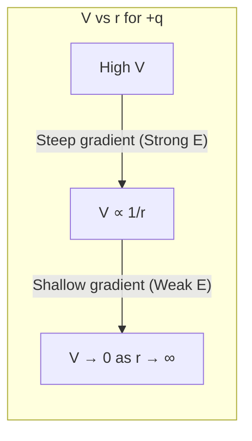

---
# Equipotential Surfaces / 等势面

---

# 1. Overview / 概述

**English:**
Equipotential surfaces are surfaces in an electric field where every point has the same electric potential ($V$). They provide a powerful visual and analytical tool for understanding the geometry of electric fields and the work done on charges. This sub-topic explores the relationship between equipotential surfaces and [[Electric Field Lines]], how to draw them for different charge configurations, and their crucial link to [[Potential Gradients and Field Strength]]. Understanding equipotentials is essential for analyzing the [[Motion of Charged Particles in Electric Fields]], as charges moving along an equipotential surface experience no change in [[Electric Potential Energy]]. This concept also forms a direct analogy with [[Gravitational Potential]] and gravitational equipotential surfaces.

**中文:**
等势面是电场中所有点具有相同电势 ($V$) 的表面。它们提供了一个强大的可视化和分析工具，用于理解电场的几何形状以及对电荷所做的功。本子知识点探讨等势面与[[电场线]]之间的关系，如何为不同的电荷配置绘制等势面，以及它们与[[电势梯度与场强]]的关键联系。理解等势面对于分析[[带电粒子在电场中的运动]]至关重要，因为电荷沿着等势面移动时，其[[电势能]]不会发生变化。这个概念也与[[引力势]]和引力等势面形成直接类比。

---

# 2. Syllabus Learning Objectives / 考纲学习目标

| CAIE 9702 (18.2 a-f) | Edexcel IAL (WPH14 U4: 2.6-2.10) |
|-----------|-------------|
| Define equipotential surface. | Understand the concept of equipotential surfaces. |
| State the relationship between electric field lines and equipotential surfaces. | Explain the relationship between electric field lines and equipotential surfaces. |
| Draw equipotential surfaces for uniform and radial electric fields. | Draw and interpret equipotential surfaces for uniform and point charge fields. |
| Explain that no work is done moving a charge along an equipotential surface. | Explain why no work is done moving a charge along an equipotential surface. |
| Relate the spacing of equipotential surfaces to the electric field strength. | Use the spacing of equipotential surfaces to determine the electric field strength. |
| Apply the concept to solve problems involving work done and potential difference. | Solve problems involving the motion of charges between equipotential surfaces. |

**Examiner Expectations / 考官期望:**
- **EN:** You must be able to define an equipotential surface precisely. You should be able to sketch equipotential lines for simple charge distributions (point charge, uniform field, parallel plates). The most critical skill is explaining why the field lines are always perpendicular to equipotential surfaces and why no work is done moving a charge along one. You must also be able to use the spacing between equipotential surfaces to deduce the relative strength of the electric field.
- **CN:** 你必须能够精确定义等势面。你应该能够为简单的电荷分布（点电荷、匀强电场、平行板）画出等势线。最关键的能力是解释为什么电场线总是垂直于等势面，以及为什么电荷沿等势面移动时不做功。你还必须能够利用等势面之间的间距来推断电场的相对强弱。

---

# 3. Core Definitions / 核心定义

| Term (EN/CN) | Definition (EN) | Definition (CN) | Common Mistakes / 常见错误 |
|--------------|-----------------|-----------------|---------------------------|
| **Equipotential Surface** / 等势面 | A surface on which all points are at the same electric potential. | 所有点都具有相同电势的曲面。 | Confusing it with a surface of constant electric field strength. The field strength can vary along an equipotential surface (e.g., near a point charge). |
| **Equipotential Line** / 等势线 | The two-dimensional representation of an equipotential surface on a diagram. | 等势面在二维图表上的表示。 | Thinking these are the same as field lines. They are perpendicular to field lines. |
| **Electric Field Line** / 电场线 | A line whose direction at any point is the direction of the electric field at that point. | 其上任一点的方向都与该点电场方向一致的线。 | Drawing field lines that cross equipotential lines at an angle other than 90°. |
| **Work Done (on a charge)** / 对电荷做的功 | The energy transferred to or from a charge when it moves through a potential difference. | 电荷在电势差中移动时转移的能量。 | Forgetting that $W = q\Delta V$. If $\Delta V = 0$ (moving along an equipotential), then $W = 0$. |
| **Potential Gradient** / 电势梯度 | The rate of change of potential with distance, $E = -\frac{dV}{dr}$. | 电势随距离的变化率，$E = -\frac{dV}{dr}$。 | Forgetting the negative sign, which indicates the field points from high to low potential. |

---

# 4. Key Concepts Explained / 关键概念详解

## 4.1 Relationship Between Field Lines and Equipotentials / 电场线与等势面的关系

### Explanation / 解释
**English:** The most fundamental rule is that **electric field lines are always perpendicular to equipotential surfaces**. This is because if a charge moves along an equipotential surface, its potential energy ($E_p = qV$) does not change, meaning no work is done by the electric field. If the field had a component parallel to the surface, it would do work on the charge, changing its potential energy and contradicting the definition of an equipotential. Therefore, the electric field must be entirely normal (perpendicular) to the surface. Field lines point from regions of high potential to low potential, so they cross equipotential surfaces at right angles, moving from the higher potential surface to the lower one.

**中文:** 最基本的法则是**电场线始终垂直于等势面**。这是因为如果一个电荷沿着等势面移动，其电势能 ($E_p = qV$) 不会改变，这意味着电场不做功。如果电场有一个平行于表面的分量，它就会对电荷做功，改变其电势能，这与等势面的定义相矛盾。因此，电场必须完全垂直于等势面。电场线从高电势指向低电势，所以它们以直角穿过等势面，从高电势面指向低电势面。

### Physical Meaning / 物理意义
**English:** The perpendicular relationship shows that the electric field is a "conservative" field. The work done to move a charge between two points depends only on the potential difference, not the path taken. Equipotential surfaces are like contour lines on a map; the field lines are the steepest paths down the potential "hill".

**中文:** 这种垂直关系表明电场是一个“保守”场。将电荷从一个点移动到另一个点所做的功仅取决于电势差，而与路径无关。等势面就像地图上的等高线；电场线则是沿着电势“山丘”最陡峭的下坡路径。

### Common Misconceptions / 常见误区
- **EN:** Students often think field lines and equipotential lines are the same thing. They are perpendicular.
- **CN:** 学生常认为电场线和等势线是同一回事。它们是垂直的。
- **EN:** Students think that a charge moving along an equipotential surface experiences no force. It does experience a force (perpendicular to the surface), but no work is done by that force.
- **CN:** 学生认为电荷沿等势面移动时不受力。它确实受力（垂直于表面），但该力不做功。

### Exam Tips / 考试提示
- **EN:** When drawing equipotentials, always ensure they cross field lines at 90°. For a uniform field, equipotentials are parallel straight lines. For a point charge, they are concentric circles (spheres in 3D).
- **CN:** 画等势线时，务必确保它们与电场线成90°角交叉。对于匀强电场，等势线是平行的直线。对于点电荷，它们是同心圆（三维中是球面）。

> 📷 **IMAGE PROMPT — EQ-01: Field Lines and Equipotentials**
> A clear diagram showing a set of parallel, equally spaced electric field lines (arrows pointing downwards) crossed by a set of parallel, equally spaced dashed lines (equipotentials) at perfect right angles. The equipotentials should be labeled V1, V2, V3, with V1 > V2 > V3. A second panel shows a positive point charge with radial field lines (arrows pointing outwards) and concentric circular dashed equipotential lines around the charge.

## 4.2 Work Done on Equipotential Surfaces / 等势面上的功

### Explanation / 解释
**English:** The work done ($W$) by the electric field when moving a charge $q$ from point A to point B is given by $W = q(V_A - V_B) = q\Delta V$. If points A and B lie on the same equipotential surface, then $V_A = V_B$, so $\Delta V = 0$ and therefore $W = 0$. This means no energy is required to move a charge along an equipotential surface, and the electric field does no work on the charge. This is a direct consequence of the field being perpendicular to the surface.

**中文:** 电场将电荷 $q$ 从A点移动到B点所做的功 ($W$) 由 $W = q(V_A - V_B) = q\Delta V$ 给出。如果A点和B点位于同一个等势面上，那么 $V_A = V_B$，所以 $\Delta V = 0$，因此 $W = 0$。这意味着沿着等势面移动电荷不需要能量，电场也不对电荷做功。这是电场垂直于表面的直接结果。

### Physical Meaning / 物理意义
**English:** This concept is crucial for understanding the motion of charges. A charge placed on an equipotential surface will not spontaneously move along that surface. It will only move if there is a component of the electric field parallel to its motion, which requires moving to a different equipotential surface.

**中文:** 这个概念对于理解电荷的运动至关重要。放置在等势面上的电荷不会自发地沿着该表面移动。只有当存在平行于其运动方向的电场分量时，它才会移动，这需要移动到不同的等势面。

### Common Misconceptions / 常见误区
- **EN:** Thinking that "no work is done" means "no force acts". The force is perpendicular to the displacement, so the work done by that force is zero.
- **CN:** 认为“不做功”意味着“不受力”。力垂直于位移，所以该力做的功为零。

### Exam Tips / 考试提示
- **EN:** This is a common explanation question. Be prepared to state: "Since the charge moves along an equipotential surface, $\Delta V = 0$. Therefore, work done $W = q\Delta V = 0$."
- **CN:** 这是一个常见的解释题。准备好陈述：“由于电荷沿等势面移动，$\Delta V = 0$。因此，做功 $W = q\Delta V = 0$。”

## 4.3 Spacing of Equipotential Surfaces and Field Strength / 等势面间距与场强

### Explanation / 解释
**English:** The spacing between equipotential surfaces is directly related to the [[Potential Gradients and Field Strength|electric field strength]]. The electric field strength $E$ is equal to the potential gradient, $E = -\frac{\Delta V}{\Delta r}$ (for a uniform field). If the potential difference between adjacent equipotential surfaces is constant, then a smaller spacing ($\Delta r$) indicates a larger potential gradient and therefore a stronger electric field. Conversely, a larger spacing indicates a weaker field. For a point charge, equipotential surfaces are closer together near the charge (where the field is strong) and further apart far from the charge (where the field is weak).

**中文:** 等势面之间的间距与[[电势梯度与场强|电场强度]]直接相关。电场强度 $E$ 等于电势梯度，$E = -\frac{\Delta V}{\Delta r}$（对于匀强电场）。如果相邻等势面之间的电势差是恒定的，那么较小的间距 ($\Delta r$) 表示较大的电势梯度，因此电场更强。相反，较大的间距表示较弱的电场。对于点电荷，等势面在电荷附近（场强处）更密集，在远离电荷处（场弱处）更稀疏。

### Physical Meaning / 物理意义
**English:** The density of equipotential lines on a diagram is a visual indicator of the field strength. Closely packed lines mean a strong field; widely spaced lines mean a weak field.

**中文:** 图表上等势线的密度是场强的视觉指示器。线密集意味着强场；线稀疏意味着弱场。

### Common Misconceptions / 常见误区
- **EN:** Assuming that the spacing between equipotentials is always constant. This is only true for a uniform field.
- **CN:** 假设等势面之间的间距总是恒定的。这只对匀强电场成立。

### Exam Tips / 考试提示
- **EN:** You may be asked to compare the field strength in two regions based on the spacing of equipotential lines. Remember: closer lines = stronger field.
- **CN:** 你可能会被要求根据等势线的间距比较两个区域的场强。记住：线越密，场越强。

> 📷 **IMAGE PROMPT — EQ-02: Equipotential Spacing and Field Strength**
> A diagram showing a positive point charge. Around it are several concentric dashed circles representing equipotential surfaces. The spacing between the circles is clearly smaller near the charge and larger further away. The diagram should have labels indicating "Strong Field (Close Spacing)" near the charge and "Weak Field (Wide Spacing)" far from the charge.

---

# 5. Essential Equations / 核心公式

## Equation 1: Work Done and Potential Difference / 做功与电势差

$$ W = q\Delta V $$

| Symbol (符号) | Meaning (EN) | Meaning (CN) | Unit (单位) |
|--------------|-------------|-------------|------------|
| $W$ | Work done by the electric field | 电场做的功 | J (Joules) |
| $q$ | Electric charge | 电荷量 | C (Coulombs) |
| $\Delta V$ | Potential difference between two points | 两点之间的电势差 | V (Volts) |

**Derivation / 推导:** From the definition of potential difference: $\Delta V = \frac{W}{q}$.
**Conditions / 适用条件:** General. Valid for any electric field.
**Limitations / 局限性:** None, as long as $q$ is a point charge.

## Equation 2: Electric Field Strength from Potential Gradient / 从电势梯度求电场强度

$$ E = -\frac{\Delta V}{\Delta r} $$

| Symbol (符号) | Meaning (EN) | Meaning (CN) | Unit (单位) |
|--------------|-------------|-------------|------------|
| $E$ | Electric field strength | 电场强度 | N C$^{-1}$ or V m$^{-1}$ |
| $\Delta V$ | Potential difference between two equipotential surfaces | 两个等势面之间的电势差 | V (Volts) |
| $\Delta r$ | Perpendicular distance between the two equipotential surfaces | 两个等势面之间的垂直距离 | m (metres) |

**Derivation / 推导:** For a uniform field, $W = Fd = qEd$. Also, $W = q\Delta V$. Equating: $qEd = q\Delta V \implies E = \frac{\Delta V}{d}$.
**Conditions / 适用条件:** Strictly for a uniform field. For non-uniform fields, it gives the average field strength over the distance $\Delta r$, or the instantaneous field strength if $\Delta r \to 0$ (i.e., $E = -\frac{dV}{dr}$).
**Limitations / 局限性:** The negative sign indicates the field points in the direction of decreasing potential.

> 📷 **IMAGE PROMPT — EQ-03: Potential Gradient Diagram**
> A diagram showing two parallel equipotential lines (V and V+ΔV) separated by a perpendicular distance Δr. An arrow representing the electric field E is drawn perpendicular to the lines, pointing from the higher potential (V+ΔV) to the lower potential (V). The formula E = -ΔV/Δr is displayed next to the diagram.

---

# 6. Graphs and Relationships / 图表与关系

## 6.1 Potential vs. Distance for a Point Charge / 点电荷的电势与距离关系图

### Axes / 坐标轴
- **X-axis:** Distance from charge, $r$ (m) / 距电荷的距离 $r$ (米)
- **Y-axis:** Electric Potential, $V$ (V) / 电势 $V$ (伏特)

### Shape / 形状
- **EN:** For a positive point charge, the graph is a hyperbola ($V \propto 1/r$). The potential is highest near the charge and approaches zero as $r \to \infty$.
- **CN:** 对于正点电荷，图形是一条双曲线 ($V \propto 1/r$)。电势在电荷附近最高，并随着 $r \to \infty$ 趋近于零。

### Gradient Meaning / 斜率含义
- **EN:** The gradient of this graph at any point is $-\frac{dV}{dr}$, which is equal to the electric field strength $E$ at that point. A steeper (more negative) gradient means a stronger field.
- **CN:** 该图在任意一点的斜率为 $-\frac{dV}{dr}$，等于该点的电场强度 $E$。斜率越陡（负值越大），场强越大。

### Area Meaning / 面积含义
- **EN:** The area under a $V$ vs. $r$ graph has no direct physical meaning.
- **CN:** $V$ vs. $r$ 图下的面积没有直接的物理意义。

### Exam Interpretation / 考试解读
- **EN:** You may be asked to sketch this graph and use it to explain why equipotential surfaces are closer together near a point charge. The graph is steepest near the charge, meaning a large change in $V$ over a small change in $r$, hence closely spaced equipotentials.
- **CN:** 你可能会被要求画出此图，并用它来解释为什么点电荷附近的等势面更密集。该图在电荷附近最陡，意味着在很小的 $r$ 变化内 $V$ 变化很大，因此等势面间距很小。



---

# 7. Required Diagrams / 必备图表

## 7.1 Equipotentials for a Uniform Field / 匀强电场的等势面

### Description / 描述
**English:** A diagram showing two parallel, oppositely charged plates. The electric field lines are parallel, equally spaced, and point from the positive plate to the negative plate. The equipotential surfaces are planes parallel to the plates, represented by dashed lines perpendicular to the field lines. They are equally spaced, indicating a constant field strength.

**中文:** 一个显示两个平行、带相反电荷的极板的图表。电场线平行、等距，从正极板指向负极板。等势面是平行于极板的平面，用垂直于电场线的虚线表示。它们等距分布，表示场强恒定。

### Image Prompt / 图片生成提示
> 📷 **IMAGE PROMPT — DIAG-01: Uniform Field Equipotentials**
> A clean, educational diagram of two parallel metal plates. The top plate is labeled "+" and the bottom plate is labeled "-". Several vertical, equally spaced arrows point from the top plate to the bottom plate, representing the uniform electric field. Several horizontal, dashed lines are drawn between the plates, perpendicular to the field arrows. These dashed lines are labeled V1, V2, V3, V4, with V1 being the highest potential (closest to the + plate) and V4 the lowest (closest to the - plate). The spacing between the dashed lines is equal.

### Labels Required / 需要标注
- **EN:** + plate, - plate, Electric field lines (E), Equipotential lines (V1, V2, V3, V4), Perpendicular angle (90°).
- **CN:** 正极板 (+), 负极板 (-), 电场线 (E), 等势线 (V1, V2, V3, V4), 垂直角 (90°).

### Exam Importance / 考试重要性
- **EN:** Very high. This is the most common configuration for drawing and interpreting equipotentials.
- **CN:** 非常高。这是绘制和解释等势面最常见的配置。

## 7.2 Equipotentials for a Point Charge / 点电荷的等势面

### Description / 描述
**English:** A diagram showing a single positive point charge. The electric field lines radiate outwards from the charge. The equipotential surfaces are concentric spheres (circles in 2D) centered on the charge. The spacing between the circles increases as the distance from the charge increases, indicating a decreasing field strength.

**中文:** 一个显示单个正点电荷的图表。电场线从电荷向外辐射。等势面是以电荷为中心的同心球面（二维中是圆）。圆之间的间距随着与电荷距离的增加而增大，表示场强减弱。

### Image Prompt / 图片生成提示
> 📷 **IMAGE PROMPT — DIAG-02: Point Charge Equipotentials**
> A diagram with a small red circle labeled "+q" in the center. Several straight arrows radiate outwards from the charge in all directions, representing the electric field. Around the charge are several concentric dashed circles. The circles are very close together near the charge and become progressively further apart as they get farther from the charge. The circles are labeled V1 (closest, highest potential), V2, V3, V4 (farthest, lowest potential). A right angle symbol is shown where a field line meets a circle.

### Labels Required / 需要标注
- **EN:** +q (point charge), Electric field lines (E), Equipotential lines (V1, V2, V3, V4), Decreasing spacing.
- **CN:** +q (点电荷), 电场线 (E), 等势线 (V1, V2, V3, V4), 间距递减.

### Exam Importance / 考试重要性
- **EN:** High. This is the standard model for a radial field.
- **CN:** 高。这是径向场的标准模型。

---

# 8. Worked Examples / 典型例题

## Example 1: Work Done Moving a Charge / 移动电荷所做的功

### Question / 题目
**English:** A charge of $+2.0 \times 10^{-9} \text{ C}$ is moved from point A to point B. Point A is on an equipotential surface of $+50 \text{ V}$, and point B is on an equipotential surface of $+20 \text{ V}$.
(a) Calculate the work done by the electric field.
(b) If the charge is moved from point A to point C, which is on the same equipotential surface as A, what is the work done? Explain your answer.

**中文:** 一个 $+2.0 \times 10^{-9} \text{ C}$ 的电荷从A点移动到B点。A点位于 $+50 \text{ V}$ 的等势面上，B点位于 $+20 \text{ V}$ 的等势面上。
(a) 计算电场做的功。
(b) 如果电荷从A点移动到C点，C点与A点位于同一个等势面上，做功是多少？解释你的答案。

### Solution / 解答
**Part (a):**
1.  **Identify knowns:** $q = +2.0 \times 10^{-9} \text{ C}$, $V_A = +50 \text{ V}$, $V_B = +20 \text{ V}$.
2.  **Calculate potential difference:** $\Delta V = V_A - V_B = 50 - 20 = 30 \text{ V}$.
3.  **Apply formula:** $W = q\Delta V = (2.0 \times 10^{-9}) \times (30) = 6.0 \times 10^{-8} \text{ J}$.
4.  **State answer:** The work done by the electric field is $6.0 \times 10^{-8} \text{ J}$.

**Part (b):**
1.  **Reasoning:** Since point C is on the same equipotential surface as point A, $V_C = V_A$.
2.  **Calculate potential difference:** $\Delta V = V_A - V_C = 0 \text{ V}$.
3.  **Apply formula:** $W = q\Delta V = q \times 0 = 0 \text{ J}$.
4.  **Explanation:** No work is done because there is no potential difference between the two points. The electric field is perpendicular to the equipotential surface, so the force on the charge is perpendicular to the displacement along the surface.

**中文:**
**(a) 部分:**
1.  **确定已知量:** $q = +2.0 \times 10^{-9} \text{ C}$, $V_A = +50 \text{ V}$, $V_B = +20 \text{ V}$。
2.  **计算电势差:** $\Delta V = V_A - V_B = 50 - 20 = 30 \text{ V}$。
3.  **应用公式:** $W = q\Delta V = (2.0 \times 10^{-9}) \times (30) = 6.0 \times 10^{-8} \text{ J}$。
4.  **给出答案:** 电场做的功为 $6.0 \times 10^{-8} \text{ J}$。

**(b) 部分:**
1.  **推理:** 由于C点与A点位于同一个等势面上，$V_C = V_A$。
2.  **计算电势差:** $\Delta V = V_A - V_C = 0 \text{ V}$。
3.  **应用公式:** $W = q\Delta V = q \times 0 = 0 \text{ J}$。
4.  **解释:** 不做功，因为两点之间没有电势差。电场垂直于等势面，因此电荷所受的力垂直于沿表面的位移。

### Final Answer / 最终答案
**Answer:** (a) $6.0 \times 10^{-8} \text{ J}$ | **答案：** (a) $6.0 \times 10^{-8} \text{ J}$
**Answer:** (b) $0 \text{ J}$ | **答案：** (b) $0 \text{ J}$

### Quick Tip / 提示
- **EN:** Always check if the two points are on the same equipotential. If so, the work done is always zero, regardless of the path taken.
- **CN:** 始终检查两点是否在同一个等势面上。如果是，则所做的功始终为零，与路径无关。

## Example 2: Determining Field Strength from Equipotentials / 从等势面确定场强

### Question / 题目
**English:** The diagram shows a uniform electric field. Equipotential lines are drawn at potentials of $0 \text{ V}$, $20 \text{ V}$, $40 \text{ V}$, and $60 \text{ V}$. The distance between the $0 \text{ V}$ and $60 \text{ V}$ lines is $3.0 \text{ cm}$. Calculate the magnitude of the electric field strength.

**中文:** 图示为一个匀强电场。等势线在 $0 \text{ V}$、$20 \text{ V}$、$40 \text{ V}$ 和 $60 \text{ V}$ 的电势处画出。$0 \text{ V}$ 和 $60 \text{ V}$ 线之间的距离是 $3.0 \text{ cm}$。计算电场强度的大小。

### Solution / 解答
1.  **Identify knowns:** $\Delta V = 60 - 0 = 60 \text{ V}$, $\Delta r = 3.0 \text{ cm} = 0.030 \text{ m}$.
2.  **Apply formula:** $E = \frac{\Delta V}{\Delta r} = \frac{60}{0.030} = 2000 \text{ V m}^{-1}$.
3.  **State answer:** The magnitude of the electric field strength is $2000 \text{ V m}^{-1}$.

**中文:**
1.  **确定已知量:** $\Delta V = 60 - 0 = 60 \text{ V}$, $\Delta r = 3.0 \text{ cm} = 0.030 \text{ m}$。
2.  **应用公式:** $E = \frac{\Delta V}{\Delta r} = \frac{60}{0.030} = 2000 \text{ V m}^{-1}$。
3.  **给出答案:** 电场强度的大小为 $2000 \text{ V m}^{-1}$。

### Final Answer / 最终答案
**Answer:** $2000 \text{ V m}^{-1}$ | **答案：** $2000 \text{ V m}^{-1}$

### Quick Tip / 提示
- **EN:** Ensure the distance $\Delta r$ is measured perpendicular to the equipotential lines. This is the shortest distance between them.
- **CN:** 确保距离 $\Delta r$ 是垂直于等势线测量的。这是它们之间的最短距离。

---

# 9. Past Paper Question Types / 历年真题题型

| Question Type / 题型 | Frequency / 频率 | Difficulty / 难度 | Past Paper References / 真题索引 |
|----------------------|------------------|------------------|-------------------------------|
| Definition of equipotential surface | Medium | Easy | 📝 *待填入* |
| Drawing equipotentials for given field lines | High | Medium | 📝 *待填入* |
| Explaining why field lines are perpendicular to equipotentials | High | Medium | 📝 *待填入* |
| Calculating work done moving a charge between equipotentials | High | Medium | 📝 *待填入* |
| Determining field strength from equipotential spacing | Medium | Medium | 📝 *待填入* |
| Comparing field strengths using equipotential diagrams | Low | Hard | 📝 *待填入* |

**Common Command Words / 常见指令词:**
- **EN:** Define, State, Draw, Explain, Calculate, Determine, Show that.
- **CN:** 定义、陈述、画出、解释、计算、确定、证明。

---

# 10. Practical Skills Connections / 实验技能链接

**English:**
While equipotential surfaces are a theoretical concept, they can be investigated practically. A common experiment involves mapping equipotential lines on a conducting paper or in a shallow electrolytic tank.
- **Measurements:** A voltmeter is used to measure the potential difference between a reference point and a probe. Points with the same reading are marked and connected to form an equipotential line.
- **Uncertainties:** The main uncertainty is in locating the exact position of the probe where the voltmeter reading matches the target value. This is a judgment call.
- **Graph Plotting:** The plotted equipotential lines can then be used to draw the electric field lines (perpendicular to the equipotentials). The spacing of the equipotentials can be used to estimate the field strength.
- **Experimental Design:** This experiment demonstrates the relationship between field lines and equipotentials and allows for the calculation of field strength from potential gradient.

**中文:**
虽然等势面是一个理论概念，但可以通过实验进行研究。一个常见的实验涉及在导电纸或浅电解槽中绘制等势线。
- **测量:** 使用电压表测量参考点与探针之间的电势差。标记读数相同的点，并连接起来形成等势线。
- **不确定度:** 主要不确定度在于确定探针的精确位置，使得电压表读数与目标值匹配。这是一个判断问题。
- **图表绘制:** 绘制的等势线随后可用于绘制电场线（垂直于等势线）。等势线的间距可用于估算场强。
- **实验设计:** 该实验展示了电场线和等势面之间的关系，并允许从电势梯度计算场强。

---

# 11. Concept Map / 概念图谱

```mermaid
graph TD
    subgraph "Equipotential Surfaces"
        A[Equipotential Surface] --> B[Constant Potential V]
        A --> C[Perpendicular to Field Lines]
        A --> D[No Work Done Along Surface]
        A --> E[Spacing Indicates Field Strength]
    end

    subgraph "Related Concepts"
        F[Electric Field Lines] --> C
        G[Potential Gradient E = -dV/dr] --> E
        H[Work Done W = qΔV] --> D
        I[Electric Potential Energy] --> D
    end

    subgraph "Field Types"
        J[Uniform Field] --> A
        K[Radial Field (Point Charge)] --> A
    end

    subgraph "Applications"
        L[Motion of Charged Particles] --> D
        M[Capacitors] --> J
    end

    C -- "Always at 90°" --> F
    D -- "If ΔV=0, W=0" --> H
    E -- "Close spacing = Strong E" --> G
```

---

# 12. Quick Revision Sheet / 速查表

| Category / 类别 | Key Points / 要点 |
|----------------|------------------|
| **Definition / 定义** | A surface where all points have the same electric potential. / 所有点都具有相同电势的表面。 |
| **Key Rule / 核心法则** | Field lines are always perpendicular to equipotential surfaces. / 电场线始终垂直于等势面。 |
| **Work Done / 做功** | $W = q\Delta V$. If $\Delta V = 0$ (same surface), $W = 0$. / $W = q\Delta V$。如果 $\Delta V = 0$（同一表面），则 $W = 0$。 |
| **Field Strength / 场强** | $E = \frac{\Delta V}{\Delta r}$ (uniform field). Closer equipotentials = stronger field. / $E = \frac{\Delta V}{\Delta r}$（匀强电场）。等势面越密，场越强。 |
| **Uniform Field / 匀强电场** | Equipotentials are parallel, equally spaced lines. / 等势面是平行、等距的直线。 |
| **Point Charge / 点电荷** | Equipotentials are concentric circles (spheres). Spacing increases with distance. / 等势面是同心圆（球面）。间距随距离增大。 |
| **Exam Tip / 考试提示** | Always draw field lines and equipotentials at 90°. Use spacing to compare field strengths. / 画电场线和等势线时务必成90°角。利用间距比较场强。 |