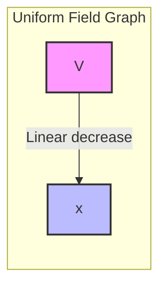
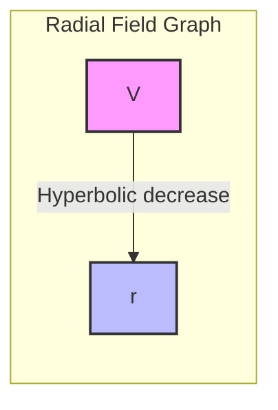
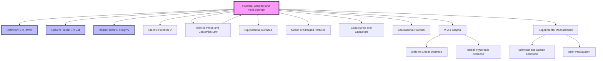

---
# Potential Gradients and Field Strength / 电势梯度与电场强度

---

# 1. Overview / 概述

**English:**
This sub-topic explores the fundamental relationship between electric field strength ($E$) and electric potential ($V$). The key concept is that the electric field strength is the negative gradient of the electric potential. This means that a change in potential over a distance creates an electric field. Understanding this relationship is crucial for analyzing how charges move in electric fields, designing electronic components, and linking the concepts of [[Electric Potential]] and [[Electric Fields and Coulomb's Law]]. This leaf node focuses specifically on the mathematical and graphical connection between $E$ and $V$, particularly in uniform fields and radial fields.

**中文:**
本子知识点探讨电场强度 ($E$) 与电势 ($V$) 之间的基本关系。核心概念是：电场强度是电势的负梯度。这意味着电势随距离的变化会产生电场。理解这一关系对于分析电荷在电场中的运动、设计电子元件以及连接[[Electric Potential]]和[[Electric Fields and Coulomb's Law]]的概念至关重要。本节点专门聚焦于 $E$ 和 $V$ 之间，特别是在匀强电场和径向电场中的数学和图形联系。

---

# 2. Syllabus Learning Objectives / 考纲学习目标

| CAIE 9702 (18.2) | Edexcel IAL (WPH14 U4: 2.6-2.10) |
|-----------|-------------|
| (a) Define potential gradient. | 2.6 Understand the relationship between electric field strength and potential gradient. |
| (b) Recall and use $E = - \frac{\Delta V}{\Delta r}$ for radial fields. | 2.7 Use $E = -\frac{dV}{dr}$ for radial fields. |
| (c) Recall and use $E = \frac{V}{d}$ for uniform fields. | 2.8 Use $E = \frac{V}{d}$ for uniform fields. |
| (d) Sketch and interpret graphs of $V$ against $r$ for radial fields. | 2.9 Interpret graphs of potential against distance. |
| (e) Explain the concept of equipotential surfaces. | 2.10 Understand the relationship between equipotential surfaces and field lines. |
| (f) Relate field strength to the spacing of equipotential surfaces. | (Implicit in 2.10) |

**Examiner Expectations / 考官期望:**
- **CAIE:** Students must be able to derive $E = V/d$ from the definition of potential difference and work done. They must be able to calculate $E$ from the gradient of a $V$-$r$ graph.
- **Edexcel:** Students must be able to apply the calculus form $E = -dV/dr$ to radial fields and understand that the negative sign indicates the direction of the field (from high to low potential).

---

# 3. Core Definitions / 核心定义

| Term (EN/CN) | Definition (EN) | Definition (CN) | Common Mistakes / 常见错误 |
|--------------|-----------------|-----------------|---------------------------|
| **Potential Gradient** / 电势梯度 | The rate of change of electric potential with respect to distance in a given direction. | 电势随距离的变化率。 | Confusing it with field strength; forgetting the negative sign. |
| **Electric Field Strength ($E$)** / 电场强度 | The negative of the potential gradient. $E = -\frac{dV}{dr}$. | 电势梯度的负值。$E = -\frac{dV}{dr}$。 | Forgetting the negative sign, which indicates direction. |
| **Uniform Field** / 匀强电场 | A field where the electric field strength is constant in magnitude and direction. | 电场强度大小和方向都恒定的电场。 | Assuming all fields are uniform. |
| **Radial Field** / 径向电场 | A field where the field lines radiate from a point charge. | 电场线从点电荷向外辐射的电场。 | Confusing with uniform fields; thinking $E$ is constant. |
| **Equipotential Surface** / 等势面 | A surface on which the electric potential is constant. | 电势处处相等的面。 | Thinking field lines are perpendicular to equipotentials. |

---

# 4. Key Concepts Explained / 关键概念详解

## 4.1 Relationship Between $E$ and $V$ / $E$ 与 $V$ 的关系

### Explanation / 解释
**English:**
The electric field strength ($E$) is defined as the force per unit positive charge. The electric potential ($V$) is the work done per unit positive charge to bring a test charge from infinity to a point. The fundamental link is that the field strength is the **negative spatial derivative** (gradient) of the potential.

$$ E = -\frac{dV}{dr} $$

For a **uniform field** (e.g., between two parallel plates), the potential changes linearly with distance. Therefore, the gradient is constant:
$$ E = \frac{V}{d} $$
where $V$ is the potential difference between the plates and $d$ is the separation.

For a **radial field** (e.g., around a point charge $Q$), the potential is $V = \frac{kQ}{r}$. Differentiating this gives:
$$ E = -\frac{dV}{dr} = -\frac{d}{dr}\left(\frac{kQ}{r}\right) = \frac{kQ}{r^2} $$
This matches [[Coulomb's Law]] for the field strength of a point charge.

**中文:**
电场强度 ($E$) 定义为每单位正电荷所受的力。电势 ($V$) 是将单位正电荷从无穷远移动到某点所做的功。两者之间的基本联系是：电场强度是电势的**负空间导数**（梯度）。

$$ E = -\frac{dV}{dr} $$

对于**匀强电场**（例如平行板之间），电势随距离线性变化。因此，梯度是常数：
$$ E = \frac{V}{d} $$
其中 $V$ 是两极板间的电势差，$d$ 是极板间距。

对于**径向电场**（例如点电荷 $Q$ 周围），电势为 $V = \frac{kQ}{r}$。对其求导得：
$$ E = -\frac{dV}{dr} = -\frac{d}{dr}\left(\frac{kQ}{r}\right) = \frac{kQ}{r^2} $$
这与[[Coulomb's Law]]中点电荷的场强公式一致。

### Physical Meaning / 物理意义
**English:**
The negative sign means that the electric field points in the direction of **decreasing potential**. A positive charge will naturally move from a region of high potential to low potential, which is the direction of the electric field. The steeper the potential gradient (i.e., the faster the potential changes with distance), the stronger the electric field.

**中文:**
负号表示电场指向**电势降低**的方向。正电荷会自然地从高电势区域移动到低电势区域，这正是电场的方向。电势梯度越陡（即电势随距离变化越快），电场强度就越大。

### Common Misconceptions / 常见误区
- **Forgetting the negative sign:** The field strength is the *negative* gradient, not just the gradient.
- **Confusing $V$ and $\Delta V$:** In $E = V/d$, $V$ is the *potential difference*, not the absolute potential.
- **Applying $E = V/d$ to radial fields:** This formula is only valid for uniform fields. For radial fields, use $E = -dV/dr$ or $E = kQ/r^2$.
- **Thinking $E$ is constant in radial fields:** $E$ varies as $1/r^2$ in radial fields.

### Exam Tips / 考试提示
- **CAIE:** Be prepared to calculate the gradient of a $V$-$r$ graph to find $E$.
- **Edexcel:** You may need to use calculus to derive $E$ from $V$ for non-uniform fields.
- **Always check units:** $E$ is in V m$^{-1}$ or N C$^{-1}$.

> 📷 **IMAGE PROMPT — E-V-RELATION: Relationship Between Electric Field and Potential**
> A diagram showing a uniform electric field between two parallel plates. The left plate is at high potential (+V) and the right plate is at low potential (0 V). Arrows show the direction of the electric field from high to low potential. A graph below shows potential $V$ plotted against distance $x$, showing a linear decrease. The gradient of the line is labeled as $-E$.

---

# 5. Essential Equations / 核心公式

## Equation 1: General Relationship / 一般关系

$$ E = -\frac{dV}{dr} $$

| Symbol (符号) | Meaning (EN) | Meaning (CN) | Unit (单位) |
|--------------|-------------|-------------|------------|
| $E$ | Electric field strength | 电场强度 | V m$^{-1}$ or N C$^{-1}$ |
| $V$ | Electric potential | 电势 | V |
| $r$ | Distance from reference point | 距离参考点的距离 | m |

**Derivation / 推导:**
From the definition of work: $W = Fd = qEd$. Also, $W = q\Delta V$. Equating: $qEd = q\Delta V \Rightarrow E = \frac{\Delta V}{d}$. In the limit as $d \to 0$, $E = \frac{dV}{dr}$. The negative sign is added to indicate direction.

**Conditions / 适用条件:**
- **General:** Valid for any electric field.
- **Uniform field:** $E = \frac{V}{d}$ (constant gradient).
- **Radial field:** $E = -\frac{dV}{dr}$ (variable gradient).

**Limitations / 局限性:**
- The formula $E = V/d$ only applies to uniform fields.
- The calculus form requires knowledge of the function $V(r)$.

## Equation 2: Uniform Field / 匀强电场

$$ E = \frac{V}{d} $$

| Symbol (符号) | Meaning (EN) | Meaning (CN) | Unit (单位) |
|--------------|-------------|-------------|------------|
| $E$ | Electric field strength | 电场强度 | V m$^{-1}$ |
| $V$ | Potential difference between plates | 两极板间的电势差 | V |
| $d$ | Separation between plates | 极板间距 | m |

**Derivation / 推导:**
From $E = -\frac{dV}{dr}$, for a constant gradient: $E = -\frac{\Delta V}{\Delta r} = \frac{V}{d}$ (taking magnitude).

**Conditions / 适用条件:**
- Only for uniform electric fields (e.g., between parallel plates).
- $d$ must be much smaller than the plate dimensions to ignore edge effects.

**Limitations / 局限性:**
- Does not apply to radial or non-uniform fields.

> 📷 **IMAGE PROMPT — UNIFORM-FIELD-EQ: Uniform Electric Field Formula**
> A diagram of two parallel plates connected to a battery. The positive plate is at +V and the negative plate is at 0 V. The distance between plates is labeled $d$. An arrow shows the electric field $E$ pointing from positive to negative. The formula $E = V/d$ is displayed.

---

# 6. Graphs and Relationships / 图表与关系

## 6.1 Potential vs. Distance for a Uniform Field / 匀强电场的电势-距离图

### Axes / 坐标轴
- **x-axis:** Distance from positive plate ($x$) / 距正极板的距离 ($x$)
- **y-axis:** Electric potential ($V$) / 电势 ($V$)

### Shape / 形状
- **Linear decreasing** straight line. / 线性递减的直线。

### Gradient Meaning / 斜率含义
- **Gradient = $\frac{\Delta V}{\Delta x} = -E$** (negative of the electric field strength). / 斜率 = $\frac{\Delta V}{\Delta x} = -E$（电场强度的负值）。

### Area Meaning / 面积含义
- **Area under the graph:** Not physically meaningful in this context. / 图线下的面积在此语境下无物理意义。

### Exam Interpretation / 考试解读
- A steeper gradient means a stronger electric field.
- The gradient is constant, confirming the field is uniform.

## 6.2 Potential vs. Distance for a Radial Field / 径向电场的电势-距离图

### Axes / 坐标轴
- **x-axis:** Distance from point charge ($r$) / 距点电荷的距离 ($r$)
- **y-axis:** Electric potential ($V$) / 电势 ($V$)

### Shape / 形状
- **Hyperbolic decrease:** $V \propto 1/r$. / 双曲线递减：$V \propto 1/r$。

### Gradient Meaning / 斜率含义
- **Gradient = $\frac{dV}{dr} = -E$** (negative of the electric field strength). The gradient becomes steeper as $r$ decreases, indicating a stronger field near the charge. / 斜率 = $\frac{dV}{dr} = -E$（电场强度的负值）。随着 $r$ 减小，斜率变陡，表明靠近电荷处场强更大。

### Area Meaning / 面积含义
- **Area under the graph:** Not physically meaningful. / 图线下的面积无物理意义。

### Exam Interpretation / 考试解读
- The gradient is not constant; it increases as $r$ decreases.
- To find $E$ at a specific point, draw a tangent to the curve and calculate its gradient.

> 📷 **IMAGE PROMPT — V-R-GRAPHS: Potential vs Distance Graphs**
> Two graphs side-by-side. Left: A straight line with negative slope labeled "Uniform Field: $V = -Ex + V_0$". Right: A hyperbolic curve decreasing from a high value near the y-axis, labeled "Radial Field: $V = kQ/r$". Both have axes labeled "Potential (V)" and "Distance (m)".

---

# 7. Required Diagrams / 必备图表

## 7.1 Equipotential Surfaces and Field Lines / 等势面与电场线

### Description / 描述
**English:**
A diagram showing equipotential surfaces (dashed lines) and electric field lines (solid arrows). For a uniform field, equipotentials are parallel planes perpendicular to the field lines. For a radial field, equipotentials are concentric spheres centered on the charge. The spacing of equipotentials indicates the field strength: closer spacing means a stronger field.

**中文:**
显示等势面（虚线）和电场线（实线箭头）的示意图。对于匀强电场，等势面是垂直于电场线的平行平面。对于径向电场，等势面是以电荷为中心的同心球面。等势面的间距表示场强大小：间距越小，场强越大。

### Image Prompt / 图片生成提示
> 📷 **IMAGE PROMPT — EQUIPOTENTIAL-DIAGRAM: Equipotential Surfaces and Field Lines**
> A diagram with two parts. Left: Uniform field between two parallel plates. Equipotential surfaces are shown as equally spaced dashed lines parallel to the plates. Field lines are solid arrows perpendicular to the plates and equipotentials. Right: Radial field around a positive point charge. Equipotential surfaces are concentric dashed circles. Field lines are solid arrows radiating outward. Labels indicate "Equipotential Surface" and "Field Line".

### Labels Required / 需要标注
- **Equipotential surface / 等势面**
- **Field line / 电场线**
- **High potential / 高电势**
- **Low potential / 低电势**
- **Direction of field / 电场方向**

### Exam Importance / 考试重要性
- **High:** This diagram is frequently tested in both CAIE and Edexcel exams. Students must be able to sketch and interpret it.

---

# 8. Worked Examples / 典型例题

## Example 1: Uniform Field Calculation / 匀强电场计算

### Question / 题目
**English:**
Two parallel plates are separated by 5.0 cm. The potential difference between them is 200 V. Calculate the electric field strength between the plates.

**中文:**
两块平行板相距 5.0 cm，两极板间的电势差为 200 V。计算两极板间的电场强度。

### Solution / 解答
1. **Identify the formula:** For a uniform field, $E = \frac{V}{d}$.
2. **Convert units:** $d = 5.0 \text{ cm} = 0.050 \text{ m}$.
3. **Substitute values:** $E = \frac{200 \text{ V}}{0.050 \text{ m}} = 4000 \text{ V m}^{-1}$.

### Final Answer / 最终答案
**Answer:** $E = 4000 \text{ V m}^{-1}$ | **答案：** $E = 4000 \text{ V m}^{-1}$

### Quick Tip / 提示
**English:** Always convert cm to m before calculating. The unit V m$^{-1}$ is equivalent to N C$^{-1}$.
**中文:** 计算前务必将厘米转换为米。单位 V m$^{-1}$ 与 N C$^{-1}$ 等价。

## Example 2: Radial Field Gradient / 径向场梯度

### Question / 题目
**English:**
The electric potential due to a point charge is given by $V = \frac{9.0 \times 10^9}{r}$ (in SI units). Calculate the electric field strength at a distance of 0.30 m from the charge.

**中文:**
点电荷的电势由 $V = \frac{9.0 \times 10^9}{r}$（SI 单位）给出。计算距该电荷 0.30 m 处的电场强度。

### Solution / 解答
1. **Identify the relationship:** $E = -\frac{dV}{dr}$.
2. **Differentiate:** $V = 9.0 \times 10^9 \cdot r^{-1} \Rightarrow \frac{dV}{dr} = -9.0 \times 10^9 \cdot r^{-2} = -\frac{9.0 \times 10^9}{r^2}$.
3. **Apply the formula:** $E = -\frac{dV}{dr} = -\left(-\frac{9.0 \times 10^9}{r^2}\right) = \frac{9.0 \times 10^9}{r^2}$.
4. **Substitute $r = 0.30$ m:** $E = \frac{9.0 \times 10^9}{(0.30)^2} = \frac{9.0 \times 10^9}{0.09} = 1.0 \times 10^{11} \text{ V m}^{-1}$.

### Final Answer / 最终答案
**Answer:** $E = 1.0 \times 10^{11} \text{ V m}^{-1}$ | **答案：** $E = 1.0 \times 10^{11} \text{ V m}^{-1}$

### Quick Tip / 提示
**English:** The negative sign in $E = -dV/dr$ ensures that $E$ is positive (pointing away from a positive charge). Don't forget to include it in the derivation.
**中文:** $E = -dV/dr$ 中的负号确保 $E$ 为正值（指向远离正电荷的方向）。在推导中不要忘记它。

---

# 9. Past Paper Question Types / 历年真题题型

| Question Type / 题型 | Frequency / 频率 | Difficulty / 难度 | Past Paper References / 真题索引 |
|----------------------|------------------|------------------|-------------------------------|
| Calculate $E$ from $V$ and $d$ in uniform fields | High | Easy | 📝 *待填入* |
| Calculate $E$ from gradient of $V$-$r$ graph | Medium | Medium | 📝 *待填入* |
| Sketch $V$-$r$ graphs for uniform and radial fields | Medium | Medium | 📝 *待填入* |
| Explain relationship between equipotentials and field strength | Low | Hard | 📝 *待填入* |
| Derive $E$ from $V$ using calculus (Edexcel) | Low | Hard | 📝 *待填入* |

**Common Command Words / 常见指令词:**
- **Calculate / 计算:** Use the formula $E = V/d$ or $E = -dV/dr$.
- **Sketch / 绘制:** Draw the shape of the $V$-$r$ graph, labeling axes.
- **Explain / 解释:** Describe the relationship between $E$ and the gradient of $V$.
- **Derive / 推导:** Show the mathematical steps from $V$ to $E$.

---

# 10. Practical Skills Connections / 实验技能链接

**English:**
This sub-topic connects to practical work in measuring electric fields. For example:
- **Uniform fields:** Use a voltmeter to measure the potential difference between two parallel plates at varying distances. Plot $V$ vs. $d$ to find $E$ from the gradient.
- **Radial fields:** Use a search electrode to measure potential at various distances from a charged sphere. Plot $V$ vs. $r$ and find $E$ from the gradient of the tangent.
- **Uncertainties:** The uncertainty in $E$ depends on the uncertainties in $V$ and $d$ (or the gradient). Use error propagation: $\frac{\Delta E}{E} = \frac{\Delta V}{V} + \frac{\Delta d}{d}$.
- **Graph plotting:** Ensure the $V$-$r$ graph is a smooth curve. Draw tangents carefully to find the gradient.

**中文:**
本子知识点与测量电场的实验工作相关。例如：
- **匀强电场：** 使用电压表测量不同距离下两块平行板之间的电势差。绘制 $V$ 与 $d$ 的关系图，从斜率求出 $E$。
- **径向电场：** 使用探测电极测量距带电球体不同距离处的电势。绘制 $V$ 与 $r$ 的关系图，从切线斜率求出 $E$。
- **不确定度：** $E$ 的不确定度取决于 $V$ 和 $d$（或斜率）的不确定度。使用误差传递：$\frac{\Delta E}{E} = \frac{\Delta V}{V} + \frac{\Delta d}{d}$。
- **绘图：** 确保 $V$-$r$ 图是平滑曲线。仔细绘制切线以求出斜率。

---

# 11. Concept Map / 概念图谱

---

# 12. Quick Revision Sheet / 速查表

| Category / 类别 | Key Points / 要点 |
|----------------|------------------|
| **Definition / 定义** | Electric field strength is the negative potential gradient: $E = -\frac{dV}{dr}$. |
| **Key Formula / 核心公式** | Uniform field: $E = \frac{V}{d}$. Radial field: $E = \frac{kQ}{r^2}$. |
| **Key Graph / 核心图表** | $V$ vs $r$: Uniform → linear decrease; Radial → hyperbolic decrease. Gradient = $-E$. |
| **Equipotential Surfaces / 等势面** | Perpendicular to field lines. Closer spacing = stronger field. |
| **Exam Tip / 考试提示** | Always include the negative sign in $E = -dV/dr$. Convert cm to m for $d$. |
| **Common Mistake / 常见错误** | Applying $E = V/d$ to radial fields. Forgetting that $V$ in $E = V/d$ is potential difference. |
| **Practical Skill / 实验技能** | Measure $V$ at different $d$ or $r$. Plot graph, find gradient to get $E$. |