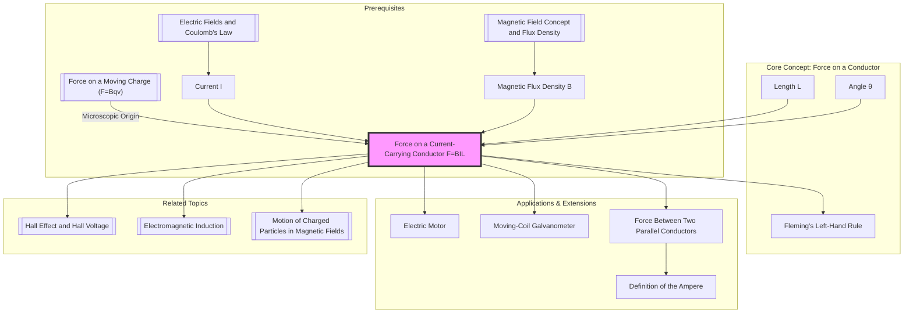

---
# Force on a Current-Carrying Conductor (F=BIL)
# 载流导体在磁场中的受力 (F=BIL)

---

# 1. Overview / 概述

**English:**
This sub-topic explores the magnetic force experienced by a straight, current-carrying conductor placed in a uniform magnetic field. This phenomenon is the fundamental principle behind electric motors, loudspeakers, and moving-coil galvanometers. The core equation, $F = BIL \sin \theta$, quantifies this force, linking the magnetic flux density ($B$), the current ($I$), the length of conductor in the field ($L$), and the angle ($\theta$) between the conductor and the field lines. Understanding this force is crucial for linking the concepts of [[Magnetic Field Concept and Flux Density]] to practical applications and forms a direct prerequisite for studying [[Electromagnetic Induction]].

**中文:**
本子知识点探讨了置于匀强磁场中的直载流导体所受到的磁力。这一现象是电动机、扬声器和动圈式电流计背后的基本原理。核心公式 $F = BIL \sin \theta$ 量化了这种力，将磁通密度 ($B$)、电流 ($I$)、磁场中导体的长度 ($L$) 以及导体与磁感线之间的夹角 ($\theta$) 联系起来。理解这种力对于将[[Magnetic Field Concept and Flux Density|磁场概念和磁通密度]]与实际应用联系起来至关重要，并且是学习[[Electromagnetic Induction|电磁感应]]的直接先决条件。

---

# 2. Syllabus Learning Objectives / 考纲学习目标

| CAIE 9702 (20.1) | Edexcel IAL (WPH14 U4: 3.1-3.5) |
|-----------|-------------|
| (a) Describe the force on a current-carrying conductor in a magnetic field. | 3.1 Know that a magnetic force acts on a current-carrying conductor in a magnetic field. |
| (b) Derive and use the equation $F = BIL \sin \theta$. | 3.2 Use the equation $F = BIL \sin \theta$ to calculate the magnitude of the force. |
| (c) Determine the direction of the force using Fleming's left-hand rule. | 3.3 Determine the direction of the force using Fleming's left-hand rule. |
| (d) Define the ampere in terms of the force between two parallel conductors. | 3.4 Understand the definition of the ampere. |
| (e) Describe and explain the forces between two parallel current-carrying conductors. | 3.5 Describe and explain the forces between two parallel current-carrying conductors. |

**Examiner Expectations / 考官期望:**
- **EN:** Students must be able to apply $F=BIL$ to any orientation of conductor and field, using $\sin \theta$ correctly. They must be able to draw diagrams showing the direction of force, field, and current in 3D. The derivation of the ampere is a key conceptual point.
- **CN:** 学生必须能够将 $F=BIL$ 应用于导体和磁场的任何方向，并正确使用 $\sin \theta$。他们必须能够绘制显示力、磁场和电流在三维空间中方向的示意图。安培的定义是一个关键的概念点。

---

# 3. Core Definitions / 核心定义

| Term (EN/CN) | Definition (EN) | Definition (CN) | Common Mistakes / 常见错误 |
|--------------|-----------------|-----------------|---------------------------|
| **Magnetic Flux Density** / 磁通密度 | The force per unit current per unit length on a current-carrying conductor placed perpendicular to a magnetic field. | 垂直于磁场放置的载流导体上，单位电流、单位长度所受的力。 | Confusing $B$ with magnetic flux ($\Phi$). $B$ is a vector field; $\Phi$ is a scalar quantity. |
| **Fleming's Left-Hand Rule** / 弗莱明左手定则 | A mnemonic used to determine the direction of force on a current-carrying conductor in a magnetic field. Thumb = Force (Motion), First finger = Field, Second finger = Current. | 用于确定磁场中载流导体受力方向的记忆法则。拇指 = 力（运动），食指 = 磁场，中指 = 电流。 | Using the right hand instead of the left. Confusing the assignment of fingers for field and current. |
| **Ampere (A)** / 安培 | The constant current which, if maintained in two straight parallel conductors of infinite length and negligible cross-section placed 1 meter apart in a vacuum, would produce a force of $2 \times 10^{-7}$ N per meter of length between them. | 在真空中，截面积可忽略、相距1米的两根无限长平行直导线内通以恒定电流时，若导线间每米长度产生的力为 $2 \times 10^{-7}$ 牛顿，则此恒定电流的大小为1安培。 | Forgetting the conditions (infinite length, vacuum, 1m apart). |
| **Current Element ($IL$)** / 电流元 | The product of the current ($I$) and the length of conductor ($L$) in the magnetic field, considered as a vector in the direction of the current. | 电流 ($I$) 与磁场中导体长度 ($L$) 的乘积，被视为沿电流方向的矢量。 | Forgetting that $L$ is only the length *inside* the field. |

---

# 4. Key Concepts Explained / 关键概念详解

## 4.1 The Origin of the Force / 力的起源

### Explanation / 解释
**English:** A current-carrying conductor has moving charges (electrons). When placed in a magnetic field, each moving charge experiences a force given by $F = Bqv$ (see [[Force on a Moving Charge (F=Bqv)]]). These microscopic forces on the individual charges are transmitted to the lattice of the conductor via collisions, resulting in a net macroscopic force on the wire itself. The total force is the sum of the forces on all the moving charges within the conductor segment of length $L$.

**中文:** 载流导体中有移动的电荷（电子）。当置于磁场中时，每个移动的电荷都会受到一个力，由 $F = Bqv$ 给出（参见[[Force on a Moving Charge (F=Bqv)|运动电荷的受力 (F=Bqv)]]）。这些作用在单个电荷上的微观力通过碰撞传递给导体的晶格，从而在导线上产生一个净宏观力。总力是长度为 $L$ 的导体段内所有移动电荷所受力的总和。

### Physical Meaning / 物理意义
**English:** The force is a consequence of the interaction between the magnetic field and the moving charges that constitute the electric current. It is the mechanism by which electrical energy can be converted into mechanical work (e.g., in a motor).

**中文:** 这种力是磁场与构成电流的移动电荷之间相互作用的结果。它是电能转化为机械功（例如在电动机中）的机制。

### Common Misconceptions / 常见误区
- **EN:** Thinking the force is on the current itself, not the conductor. The force acts on the physical wire.
- **CN:** 认为力作用在电流本身，而不是导体上。力作用在物理导线上。
- **EN:** Believing the force is maximum when the wire is parallel to the field ($\theta = 0$). The force is zero in this case.
- **CN:** 认为当导线平行于磁场时 ($\theta = 0$) 力最大。在这种情况下力为零。

### Exam Tips / 考试提示
- **EN:** Always draw a 3D diagram (e.g., using a rectangular box) to show the orientation of $B$, $I$, and $F$.
- **CN:** 始终绘制三维示意图（例如，使用一个长方体）来显示 $B$、$I$ 和 $F$ 的方向。
- **EN:** When using $F=BIL$, ensure $L$ is the length of conductor *inside* the uniform magnetic field.
- **CN:** 使用 $F=BIL$ 时，确保 $L$ 是*在*匀强磁场*内*的导体长度。

> 📷 **IMAGE PROMPT — F-BIL-01: Origin of Force on a Current-Carrying Conductor**
> A detailed cross-section diagram of a wire. Show the wire's atomic lattice as a grid of positive ions. Show free electrons moving to the right (current to the left). A uniform magnetic field points into the page (represented by crosses). Show the magnetic force ($F = Bqv$) acting on each electron, pushing them downwards. Arrows should indicate that this force is transferred to the lattice, resulting in a net downward force on the wire.

## 4.2 The Equation $F = BIL \sin \theta$ / 公式 $F = BIL \sin \theta$

### Explanation / 解释
**English:** The force $F$ on a conductor is directly proportional to the magnetic flux density $B$, the current $I$, and the length $L$ of the conductor in the field. The $\sin \theta$ factor accounts for the orientation. $\theta$ is the angle between the direction of the current (the conductor) and the direction of the magnetic field. When $\theta = 90^\circ$ (conductor perpendicular to field), $\sin \theta = 1$, and the force is maximum: $F_{max} = BIL$. When $\theta = 0^\circ$ (conductor parallel to field), $\sin \theta = 0$, and the force is zero.

**中文:** 作用在导体上的力 $F$ 与磁通密度 $B$、电流 $I$ 和磁场中导体长度 $L$ 成正比。$\sin \theta$ 因子考虑了方向的影响。$\theta$ 是电流方向（导体）与磁场方向之间的夹角。当 $\theta = 90^\circ$（导体垂直于磁场）时，$\sin \theta = 1$，力最大：$F_{max} = BIL$。当 $\theta = 0^\circ$（导体平行于磁场）时，$\sin \theta = 0$，力为零。

### Common Misconceptions / 常见误区
- **EN:** Using the angle between the force and the field. $\theta$ is specifically between the current direction and the field direction.
- **CN:** 使用力与磁场之间的夹角。$\theta$ 特指电流方向与磁场方向之间的夹角。
- **EN:** Forgetting that if the conductor is not straight, $L$ is the straight-line distance between the two points where the current enters and leaves the field.
- **CN:** 如果导体不直，忘记 $L$ 是电流进入和离开磁场的两点之间的直线距离。

### Exam Tips / 考试提示
- **EN:** If a problem gives the angle between the conductor and the field, that is $\theta$. If it gives the angle between the conductor and the *normal* to the field, use $\cos$ instead.
- **CN:** 如果题目给出了导体与磁场之间的夹角，那就是 $\theta$。如果给出了导体与磁场*法线*之间的夹角，则使用 $\cos$。

> 📷 **IMAGE PROMPT — F-BIL-02: Angle Theta in F=BIL**
> A diagram showing a straight conductor (wire) placed at an angle $\theta$ to a uniform magnetic field (represented by parallel arrows). The conductor is labeled with current $I$. The component of the conductor's length perpendicular to the field is shown as a dashed line, labeled $L_\perp = L \sin \theta$. The force $F$ is shown acting perpendicularly out of the page.

---

# 5. Essential Equations / 核心公式

## Equation 1: Force on a Conductor / 导体受力公式

$$ F = BIL \sin \theta $$

| Symbol (符号) | Meaning (EN) | Meaning (CN) | Unit (单位) |
|--------------|-------------|-------------|------------|
| $F$ | Magnetic force on the conductor | 作用在导体上的磁力 | N (Newton) |
| $B$ | Magnetic flux density | 磁通密度 | T (Tesla) |
| $I$ | Electric current | 电流 | A (Ampere) |
| $L$ | Length of conductor in the magnetic field | 磁场中导体的长度 | m (metre) |
| $\theta$ | Angle between current direction and field direction | 电流方向与磁场方向的夹角 | ° or rad |

**Derivation / 推导:**
- **EN:** From $F = Bqv$ for a single charge. If there are $n$ charges per unit volume, cross-sectional area $A$, and drift velocity $v$, the total number of charges in length $L$ is $nAL$. The total force is $F = (nAL)(Bqv) = B (nAqv) L$. Since $I = nAqv$, we get $F = BIL$ for $\theta=90^\circ$. The $\sin \theta$ factor comes from taking the component of $v$ (or $L$) perpendicular to $B$.
- **CN:** 从单个电荷的 $F = Bqv$ 推导。如果单位体积内有 $n$ 个电荷，横截面积为 $A$，漂移速度为 $v$，则长度 $L$ 内的总电荷数为 $nAL$。总力为 $F = (nAL)(Bqv) = B (nAqv) L$。由于 $I = nAqv$，我们得到 $\theta=90^\circ$ 时的 $F = BIL$。$\sin \theta$ 因子来自于取 $v$（或 $L$）垂直于 $B$ 的分量。

**Conditions / 适用条件:**
- **EN:** Uniform magnetic field. Straight conductor (or $L$ is the effective length).
- **CN:** 匀强磁场。直导体（或 $L$ 为有效长度）。

**Limitations / 局限性:**
- **EN:** Does not apply if the conductor is not carrying a current ($I=0$). Does not directly describe the force on a single moving charge.
- **CN:** 不适用于导体没有载流 ($I=0$) 的情况。不直接描述单个运动电荷上的力。

## Equation 2: Force Between Two Parallel Conductors / 平行导体间的作用力

$$ \frac{F}{L} = \frac{\mu_0 I_1 I_2}{2\pi r} $$

| Symbol (符号) | Meaning (EN) | Meaning (CN) | Unit (单位) |
|--------------|-------------|-------------|------------|
| $F/L$ | Force per unit length | 单位长度的力 | N m$^{-1}$ |
| $\mu_0$ | Permeability of free space ($4\pi \times 10^{-7}$ H m$^{-1}$) | 真空磁导率 | H m$^{-1}$ |
| $I_1, I_2$ | Currents in the two conductors | 两根导体中的电流 | A |
| $r$ | Distance between the conductors | 导体间的距离 | m |

**Derivation / 推导:**
- **EN:** Conductor 1 creates a magnetic field $B_1 = \frac{\mu_0 I_1}{2\pi r}$ at the location of conductor 2. Conductor 2, carrying current $I_2$, experiences a force $F = B_1 I_2 L$. Substituting $B_1$ gives $F/L = \frac{\mu_0 I_1 I_2}{2\pi r}$.
- **CN:** 导体1在导体2的位置产生磁场 $B_1 = \frac{\mu_0 I_1}{2\pi r}$。载有电流 $I_2$ 的导体2受到力 $F = B_1 I_2 L$。代入 $B_1$ 得到 $F/L = \frac{\mu_0 I_1 I_2}{2\pi r}$。

**Conditions / 适用条件:**
- **EN:** Long, straight, parallel conductors in a vacuum (or air, as $\mu \approx \mu_0$).
- **CN:** 真空（或空气，因为 $\mu \approx \mu_0$）中的长直平行导体。

**Limitations / 局限性:**
- **EN:** Only valid for the force *between* two conductors. Does not include forces from other external fields.
- **CN:** 仅适用于两根导体*之间*的力。不包括来自其他外部场的力。

> 📋 **CIE Only:** The derivation of the ampere from this equation is a specific syllabus point.
> 📋 **Edexcel Only:** The equation for force between two conductors is given in the formula booklet.

---

# 6. Graphs and Relationships / 图表与关系

## 6.1 Force vs. Current (F-I) / 力与电流关系图

### Axes / 坐标轴
- **x-axis:** Current, $I$ / A (电流, $I$ / A)
- **y-axis:** Force, $F$ / N (力, $F$ / N)

### Shape / 形状
- **EN:** A straight line passing through the origin.
- **CN:** 一条通过原点的直线。

### Gradient Meaning / 斜率含义
- **EN:** Gradient $= BL \sin \theta$. If the conductor is perpendicular to the field ($\theta=90^\circ$), gradient $= BL$.
- **CN:** 斜率 $= BL \sin \theta$。如果导体垂直于磁场 ($\theta=90^\circ$)，斜率 $= BL$。

### Area Meaning / 面积含义
- **EN:** No physical meaning.
- **CN:** 没有物理意义。

### Exam Interpretation / 考试解读
- **EN:** A linear relationship confirms that $F \propto I$ when $B$ and $L$ are constant. The gradient can be used to find an unknown $B$ or $L$.
- **CN:** 线性关系证实了当 $B$ 和 $L$ 恒定时 $F \propto I$。斜率可用于求未知的 $B$ 或 $L$。

## 6.2 Force vs. Length (F-L) / 力与长度关系图

### Axes / 坐标轴
- **x-axis:** Length of conductor in field, $L$ / m (磁场中导体长度, $L$ / m)
- **y-axis:** Force, $F$ / N (力, $F$ / N)

### Shape / 形状
- **EN:** A straight line passing through the origin.
- **CN:** 一条通过原点的直线。

### Gradient Meaning / 斜率含义
- **EN:** Gradient $= BI \sin \theta$.
- **CN:** 斜率 $= BI \sin \theta$。

### Area Meaning / 面积含义
- **EN:** No physical meaning.
- **CN:** 没有物理意义。

### Exam Interpretation / 考试解读
- **EN:** Confirms $F \propto L$. The intercept should be zero, confirming no force on a conductor of zero length in the field.
- **CN:** 证实 $F \propto L$。截距应为零，证实了磁场中长度为零的导体不受力。

---

# 7. Required Diagrams / 必备图表

## 7.1 Fleming's Left-Hand Rule / 弗莱明左手定则

### Description / 描述
- **EN:** A diagram of a left hand showing the thumb, first finger, and second finger held mutually perpendicular to each other. The thumb points in the direction of the Force (Motion), the First finger points in the direction of the Field (N to S), and the seCond finger points in the direction of the Current (+ to -).
- **CN:** 一只左手的示意图，显示拇指、食指和中指相互垂直。拇指指向力（运动）的方向，食指指向磁场（N到S）的方向，中指指向电流（+到-）的方向。

### Image Prompt / 图片生成提示
> 📷 **IMAGE PROMPT — F-BIL-03: Fleming's Left-Hand Rule Diagram**
> A clear, labeled diagram of a left hand. The thumb points upwards, labeled "Force (Motion) / F". The first finger points forward, labeled "Field / B". The second finger points to the right, labeled "Current / I". The three fingers are mutually perpendicular. The background is clean white. Use simple, clear lines.

### Labels Required / 需要标注
- **EN:** Thumb: Force (F), First Finger: Field (B), Second Finger: Current (I)
- **CN:** 拇指：力 (F)，食指：磁场 (B)，中指：电流 (I)

### Exam Importance / 考试重要性
- **EN:** Essential for determining the direction of any of the three quantities ($F$, $B$, $I$) if the other two are known. A very common exam question.
- **CN:** 对于在已知其他两个量的情况下确定三个量 ($F$, $B$, $I$) 中任何一个的方向至关重要。一个非常常见的考试题目。

## 7.2 Force Between Two Parallel Conductors / 平行导体间的作用力

### Description / 描述
- **EN:** Two parallel conductors carrying currents. Show the magnetic field lines around each conductor (using right-hand grip rule). Show the resulting attractive or repulsive force.
- **CN:** 两根载流平行导体。显示每根导体周围的磁感线（使用右手螺旋定则）。显示产生的吸引力或排斥力。

### Image Prompt / 图片生成提示
> 📷 **IMAGE PROMPT — F-BIL-04: Force Between Parallel Conductors**
> Two diagrams side-by-side. Left diagram: Two parallel wires with currents flowing in the SAME direction (both upwards). Show circular magnetic field lines around each wire. In the region between the wires, the fields are in opposite directions, resulting in a net field that is weaker. The wires are shown with arrows pointing towards each other, labeled "Attraction". Right diagram: Two parallel wires with currents flowing in OPPOSITE directions (one up, one down). In the region between the wires, the fields are in the same direction, resulting in a stronger net field. The wires are shown with arrows pointing away from each other, labeled "Repulsion".

### Labels Required / 需要标注
- **EN:** Current directions ($I_1$, $I_2$), Magnetic field lines ($B$), Force ($F$), Attraction/Repulsion.
- **CN:** 电流方向 ($I_1$, $I_2$)，磁感线 ($B$)，力 ($F$)，吸引/排斥。

### Exam Importance / 考试重要性
- **EN:** Used to define the ampere. Understanding the direction of force is a common exam question.
- **CN:** 用于定义安培。理解力的方向是一个常见的考试题目。

---

# 8. Worked Examples / 典型例题

## Example 1: Calculating Force / 计算力

### Question / 题目
**English:**
A straight wire of length 5.0 cm is placed in a uniform magnetic field of flux density 0.20 T. The wire carries a current of 3.0 A. The wire is at an angle of 30° to the magnetic field. Calculate the magnitude of the magnetic force on the wire.

**中文:**
一根长度为 5.0 cm 的直导线置于磁通密度为 0.20 T 的匀强磁场中。导线载有 3.0 A 的电流。导线与磁场成 30° 角。计算导线所受磁力的大小。

### Solution / 解答
**Step 1: Identify knowns and unknowns.**
$L = 5.0 \text{ cm} = 0.050 \text{ m}$
$B = 0.20 \text{ T}$
$I = 3.0 \text{ A}$
$\theta = 30^\circ$
$F = ?$

**Step 2: Choose the correct equation.**
$$ F = BIL \sin \theta $$

**Step 3: Substitute values and calculate.**
$$ F = (0.20)(3.0)(0.050) \times \sin(30^\circ) $$
$$ F = 0.030 \times 0.5 $$
$$ F = 0.015 \text{ N} $$

### Final Answer / 最终答案
**Answer:** $1.5 \times 10^{-2}$ N | **答案：** $1.5 \times 10^{-2}$ N

### Quick Tip / 提示
- **EN:** Always convert cm to m. Remember $\sin(30^\circ) = 0.5$.
- **CN:** 始终将厘米转换为米。记住 $\sin(30^\circ) = 0.5$。

## Example 2: Determining Direction / 确定方向

### Question / 题目
**English:**
A horizontal wire runs from west to east and carries a current. A uniform magnetic field is directed vertically downwards. Using Fleming's left-hand rule, determine the direction of the magnetic force on the wire.

**中文:**
一根水平导线从西向东方向载有电流。一个匀强磁场方向竖直向下。使用弗莱明左手定则，确定导线所受磁力的方向。

### Solution / 解答
**Step 1: Identify the directions.**
- Current ($I$): West to East (→)
- Field ($B$): Vertically downwards (↓)

**Step 2: Apply Fleming's Left-Hand Rule.**
Point your Second finger (Current) to the right (East).
Point your First finger (Field) downwards.
Your Thumb (Force) will point South.

### Final Answer / 最终答案
**Answer:** South | **答案：** 向南

### Quick Tip / 提示
- **EN:** Practice with a real left hand. If you get confused, draw a 3D diagram.
- **CN:** 用真实的左手练习。如果感到困惑，画一个三维示意图。

---

# 9. Past Paper Question Types / 历年真题题型

| Question Type / 题型 | Frequency / 频率 | Difficulty / 难度 | Past Paper References / 真题索引 |
|----------------------|------------------|------------------|-------------------------------|
| Calculate force using $F=BIL\sin\theta$ | High | Easy | 📝 *待填入* |
| Determine direction using Fleming's LHR | High | Easy | 📝 *待填入* |
| Explain force between two parallel conductors | Medium | Medium | 📝 *待填入* |
| Derive the definition of the ampere | Low | Medium | 📝 *待填入* |
| Combined questions with current balance | Low | Hard | 📝 *待填入* |

**Common Command Words / 常见指令词:**
- **Calculate / 计算:** Use $F=BIL\sin\theta$.
- **Determine / 确定:** Find the direction using Fleming's LHR.
- **Explain / 解释:** Describe the origin of the force or the interaction between conductors.
- **Derive / 推导:** Show the steps from $F=Bqv$ to $F=BIL$.

---

# 10. Practical Skills Connections / 实验技能链接

**English:**
This sub-topic is directly tested in the practical context of a **current balance** experiment. In this experiment, a wire is placed in a magnetic field, and the force on it is measured using a balance. Key practical skills include:
- **Measurements:** Measuring the length of the wire in the field ($L$) with a ruler, measuring current ($I$) with an ammeter, and measuring force ($F$) with a digital balance.
- **Uncertainties:** Calculating the uncertainty in $B$ from the uncertainties in $F$, $I$, and $L$.
- **Graph Plotting:** Plotting a graph of $F$ against $I$ to determine $B$ from the gradient.
- **Experimental Design:** Varying the current or the length of the wire to investigate the relationship. Controlling the angle $\theta$ (usually keeping it at 90°).

**中文:**
本子知识点在**电流天平**实验的实践背景中直接测试。在这个实验中，一根导线被置于磁场中，使用天平测量其上的力。关键的实验技能包括：
- **测量：** 使用尺子测量磁场中导线的长度 ($L$)，使用电流表测量电流 ($I$)，使用数字天平测量力 ($F$)。
- **不确定度：** 根据 $F$、$I$ 和 $L$ 的不确定度计算 $B$ 的不确定度。
- **图表绘制：** 绘制 $F$ 对 $I$ 的图表，从斜率确定 $B$。
- **实验设计：** 改变电流或导线长度以研究关系。控制角度 $\theta$（通常保持为 90°）。

---

# 11. Concept Map / 概念图谱

---

# 12. Quick Revision Sheet / 速查表

| Category / 类别 | Key Points / 要点 |
|----------------|------------------|
| **Definition / 定义** | Force on a current-carrying conductor in a magnetic field. / 磁场中载流导体所受的力。 |
| **Key Formula / 核心公式** | $F = BIL \sin \theta$ |
| **Direction Rule / 方向法则** | Fleming's Left-Hand Rule: Thumb = Force, First finger = Field, Second finger = Current. / 弗莱明左手定则：拇指 = 力，食指 = 磁场，中指 = 电流。 |
| **Max Force Condition / 最大力条件** | Conductor perpendicular to field ($\theta = 90^\circ$). / 导体垂直于磁场 ($\theta = 90^\circ$)。 |
| **Zero Force Condition / 零力条件** | Conductor parallel to field ($\theta = 0^\circ$). / 导体平行于磁场 ($\theta = 0^\circ$)。 |
| **Key Graph / 核心图表** | $F$ vs $I$: Straight line through origin. Gradient $= BL \sin \theta$. / $F$ 对 $I$：通过原点的直线。斜率 $= BL \sin \theta$。 |
| **Key Application / 关键应用** | Force between two parallel conductors defines the Ampere. / 两平行导体间的力定义了安培。 |
| **Exam Tip / 考试提示** | Always convert cm to m. Draw a 3D diagram. / 始终将厘米转换为米。画三维示意图。 |