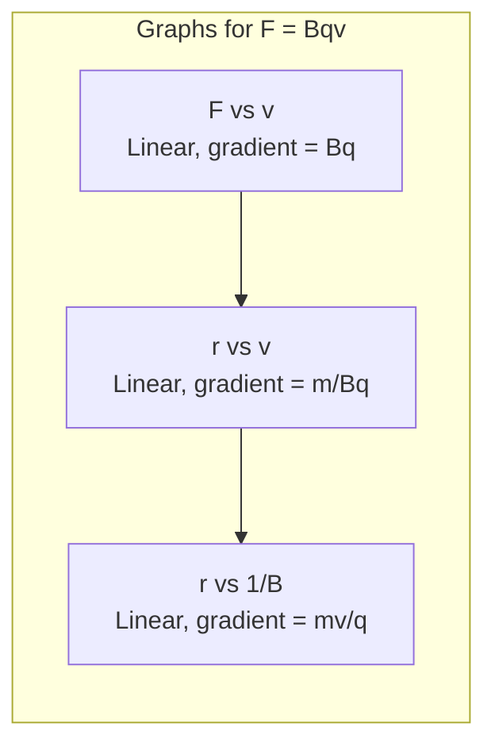
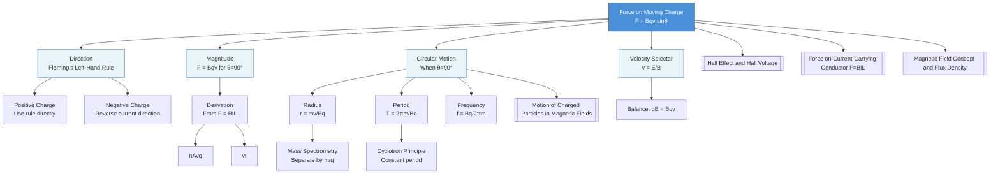

# 1. Overview / 概述

**English:**
This sub-topic explores the magnetic force experienced by a single charged particle moving through a magnetic field. The fundamental equation $F = Bqv$ (or $F = Bqv\sin\theta$) describes how a magnetic field exerts a force on a moving charge, which is the microscopic origin of the macroscopic force on a current-carrying conductor ($F = BIL$). This concept is crucial for understanding particle accelerators, mass spectrometers, cathode ray tubes, and the [[Hall Effect and Hall Voltage]]. It bridges [[Electric Fields and Coulomb's Law]] with magnetism, forming the foundation of [[Electromagnetic Induction]] and modern particle physics. The direction of this force is always perpendicular to both the velocity and magnetic field, governed by Fleming's Left-Hand Rule.

**中文:**
本子知识点探讨单个带电粒子在磁场中运动时所受到的磁力。基本方程 $F = Bqv$（或 $F = Bqv\sin\theta$）描述了磁场如何对运动电荷施加力，这是载流导体所受宏观力（$F = BIL$）的微观起源。这一概念对于理解粒子加速器、质谱仪、阴极射线管以及[[霍尔效应与霍尔电压]]至关重要。它连接了[[电场与库仑定律]]与磁学，构成了[[电磁感应]]和现代粒子物理学的基础。该力的方向始终垂直于速度和磁场方向，由弗莱明左手定则决定。

---

# 2. Syllabus Learning Objectives / 考纲学习目标

| CAIE 9702 (20.1 a-e) | Edexcel IAL (WPH14 U4: 3.1-3.5) |
|----------------------|----------------------------------|
| Define magnetic flux density and the tesla | Understand that a magnetic field exerts a force on a moving charged particle |
| Describe the force on a charged particle moving in a magnetic field | Derive and apply $F = Bqv\sin\theta$ |
| Derive and use $F = Bqv$ for perpendicular motion | Determine the direction of force using Fleming's Left-Hand Rule |
| Apply Fleming's Left-Hand Rule to determine force direction | Describe the circular motion of charged particles in a uniform magnetic field |
| Explain the circular path of a charged particle in a uniform magnetic field | Solve problems involving charged particles in magnetic fields |

**Examiner Expectations / 考官期望:**
- **English:** Students must be able to derive $F = Bqv$ from $F = BIL$ using $I = nAvq$ and $v = \frac{L}{t}$. They must apply Fleming's Left-Hand Rule correctly for positive and negative charges. Understanding that the magnetic force does no work (always perpendicular to velocity) is essential.
- **中文:** 学生必须能够通过 $I = nAvq$ 和 $v = \frac{L}{t}$ 从 $F = BIL$ 推导出 $F = Bqv$。必须正确应用弗莱明左手定则处理正负电荷。理解磁力不做功（始终垂直于速度）至关重要。

---

# 3. Core Definitions / 核心定义

| Term (EN/CN) | Definition (EN) | Definition (CN) | Common Mistakes / 常见错误 |
|--------------|-----------------|-----------------|---------------------------|
| **Magnetic Force** / 磁力 | The force exerted by a magnetic field on a moving charged particle, given by $F = Bqv\sin\theta$ | 磁场对运动带电粒子施加的力，由 $F = Bqv\sin\theta$ 给出 | Confusing with electric force (which can be parallel to motion) / 与电场力混淆（电场力可与运动方向平行） |
| **Magnetic Flux Density** / 磁通量密度 | The force per unit current per unit length on a current-carrying conductor perpendicular to the field; also the force per unit charge per unit velocity | 单位电流单位长度载流导体在垂直于磁场方向所受的力；也是单位电荷单位速度所受的力 | Forgetting it's a vector quantity / 忘记它是矢量 |
| **Fleming's Left-Hand Rule** / 弗莱明左手定则 | A mnemonic where thumb = Force (motion), index finger = Field (N→S), middle finger = Current (positive charge flow) | 记忆法则：拇指=力（运动方向），食指=磁场（N→S），中指=电流（正电荷流动方向） | Using right hand instead of left; applying to negative charges incorrectly / 用右手代替左手；对负电荷应用错误 |
| **Tesla (T)** / 特斯拉 | 1 T = 1 N A⁻¹ m⁻¹; the magnetic flux density when a force of 1 N acts on a 1 m conductor carrying 1 A perpendicular to the field | 1 T = 1 N A⁻¹ m⁻¹；当1 A电流通过1 m导体且垂直于磁场时受到1 N力时的磁通量密度 | Confusing with Weber (Wb) / 与韦伯(Wb)混淆 |
| **Centripetal Force** / 向心力 | The net force causing circular motion; for a charged particle in a magnetic field, $F = \frac{mv^2}{r} = Bqv$ | 引起圆周运动的合力；对于磁场中的带电粒子，$F = \frac{mv^2}{r} = Bqv$ | Forgetting that magnetic force provides the centripetal force / 忘记磁力提供向心力 |

---

# 4. Key Concepts Explained / 关键概念详解

## 4.1 Derivation of $F = Bqv$ from $F = BIL$ / 从 $F = BIL$ 推导 $F = Bqv$

### Explanation / 解释
**English:**
Consider a conductor of length $L$ carrying current $I$ perpendicular to a uniform magnetic field $B$. The force on the conductor is $F = BIL$. Now, current $I = \frac{Q}{t}$, where $Q$ is the total charge passing through in time $t$. If each charge carrier has charge $q$ and there are $n$ carriers per unit volume, with cross-sectional area $A$ and drift velocity $v$, then:
- Total charge: $Q = nALq$
- Time for charge to travel length $L$: $t = \frac{L}{v}$
- Current: $I = \frac{Q}{t} = \frac{nALq}{L/v} = nAvq$

Substituting into $F = BIL$:
$$F = B(nAvq)L = B(nAL)qv$$

The term $nAL$ is the total number of charge carriers in the conductor. The force on a single charge carrier is therefore:
$$F = Bqv$$

For a charge moving at angle $\theta$ to the field:
$$F = Bqv\sin\theta$$

**中文:**
考虑长度为 $L$ 的导体在垂直于均匀磁场 $B$ 的方向上承载电流 $I$。导体所受的力为 $F = BIL$。电流 $I = \frac{Q}{t}$，其中 $Q$ 是在时间 $t$ 内通过的总电荷。如果每个载流子带电荷 $q$，单位体积内有 $n$ 个载流子，横截面积为 $A$，漂移速度为 $v$，则：
- 总电荷：$Q = nALq$
- 电荷通过长度 $L$ 的时间：$t = \frac{L}{v}$
- 电流：$I = \frac{Q}{t} = \frac{nALq}{L/v} = nAvq$

代入 $F = BIL$：
$$F = B(nAvq)L = B(nAL)qv$$

$nAL$ 是导体中载流子的总数。因此单个载流子所受的力为：
$$F = Bqv$$

对于与磁场成 $\theta$ 角运动的电荷：
$$F = Bqv\sin\theta$$

### Physical Meaning / 物理意义
**English:** The magnetic force is proportional to: (1) the magnetic flux density $B$ (stronger field → stronger force), (2) the charge $q$ (more charge → stronger force), and (3) the velocity $v$ (faster motion → stronger force). The $\sin\theta$ factor means only the velocity component perpendicular to the field experiences the force; motion parallel to the field experiences no magnetic force.

**中文:** 磁力与以下因素成正比：(1) 磁通量密度 $B$（磁场越强，力越大），(2) 电荷量 $q$（电荷越多，力越大），(3) 速度 $v$（运动越快，力越大）。$\sin\theta$ 因子意味着只有垂直于磁场的速度分量受到力的作用；平行于磁场的运动不受磁力。

### Common Misconceptions / 常见误区
- **English:** 
  - Thinking magnetic force can do work (it cannot — it's always perpendicular to displacement)
  - Applying $F = Bqv$ when $v$ is parallel to $B$ (force is zero)
  - Confusing $F = Bqv$ with $F = qE$ (electric force)
  - Forgetting that negative charges experience force in opposite direction
- **中文:**
  - 认为磁力可以做功（不能——它始终垂直于位移）
  - 当 $v$ 平行于 $B$ 时应用 $F = Bqv$（力为零）
  - 混淆 $F = Bqv$ 与 $F = qE$（电场力）
  - 忘记负电荷所受力的方向相反

### Exam Tips / 考试提示
- **English:** Always check the charge sign before applying Fleming's Left-Hand Rule. For electrons (negative), the current direction is opposite to the velocity. Derivation questions often ask you to show $F = Bqv$ from $F = BIL$ — memorize the steps.
- **中文:** 在应用弗莱明左手定则前务必检查电荷符号。对于电子（负电荷），电流方向与速度方向相反。推导题常要求从 $F = BIL$ 推导 $F = Bqv$ — 记住步骤。

> 📷 **IMAGE PROMPT — F-Bqv-01: Derivation of F=Bqv from F=BIL**
> A clear diagram showing a rectangular conductor of length L and cross-sectional area A in a uniform magnetic field B (crosses indicating field into page). Show positive charge carriers moving with drift velocity v to the right. Label: current I, magnetic force F upward (using Fleming's Left-Hand Rule). Include callout boxes showing: I = nAvq, F = BIL = B(nAvq)L = B(nAL)qv, and finally F = Bqv for a single charge. Use blue arrows for velocity, red for force, green for field.

---

## 4.2 Direction of Force: Fleming's Left-Hand Rule / 力的方向：弗莱明左手定则

### Explanation / 解释
**English:**
Fleming's Left-Hand Rule determines the direction of the magnetic force on a positive charge:
- **Thumb** → Force (motion of positive charge)
- **Index finger** → Field (from North to South)
- **Middle finger** → Current (direction of positive charge flow)

For a **negative charge** (e.g., electron), the current direction is **opposite** to the velocity. Therefore, point your middle finger opposite to the electron's motion.

**中文:**
弗莱明左手定则确定正电荷所受磁力的方向：
- **拇指** → 力（正电荷运动方向）
- **食指** → 磁场（从N到S）
- **中指** → 电流（正电荷流动方向）

对于**负电荷**（如电子），电流方向与速度方向**相反**。因此，中指指向电子运动的相反方向。

### Physical Meaning / 物理意义
**English:** The force is always perpendicular to both velocity and magnetic field. This perpendicular nature means the force changes only the direction of velocity, not its magnitude — hence no work is done.

**中文:** 力始终垂直于速度和磁场。这种垂直性质意味着力只改变速度的方向，不改变大小——因此不做功。

### Common Misconceptions / 常见误区
- **English:** Using the right hand instead of the left; forgetting to reverse direction for negative charges; thinking the force is along the field direction.
- **中文:** 用右手代替左手；忘记对负电荷反转方向；认为力沿磁场方向。

### Exam Tips / 考试提示
- **English:** Draw the three fingers clearly in diagrams. For electrons, explicitly state "current is opposite to electron motion" before applying the rule.
- **中文:** 在图中清晰画出三根手指。对于电子，在应用规则前明确说明"电流与电子运动方向相反"。

> 📷 **IMAGE PROMPT — F-Bqv-02: Fleming's Left-Hand Rule for Positive and Negative Charges**
> Split diagram: Left side shows a positive charge (red +) moving right with velocity v in a magnetic field pointing into the page (crosses). Use Fleming's Left-Hand Rule: thumb up (force), index finger into page (field), middle finger right (current). Right side shows an electron (blue -) moving right with velocity v in the same field. Show middle finger pointing LEFT (opposite to velocity), thumb still up (force). Include hand diagram with labeled fingers.

---

## 4.3 Circular Motion of Charged Particles / 带电粒子的圆周运动

### Explanation / 解释
**English:**
When a charged particle enters a uniform magnetic field perpendicular to its velocity ($\theta = 90^\circ$), the magnetic force $F = Bqv$ acts as a centripetal force:
$$Bqv = \frac{mv^2}{r}$$

Rearranging for the radius of the circular path:
$$r = \frac{mv}{Bq}$$

Key observations:
- Radius is proportional to momentum ($mv$): faster/heavier particles → larger radius
- Radius is inversely proportional to $B$ and $q$: stronger field/more charge → tighter path
- Angular velocity (cyclotron frequency): $\omega = \frac{v}{r} = \frac{Bq}{m}$
- Period: $T = \frac{2\pi}{\omega} = \frac{2\pi m}{Bq}$ (independent of velocity!)

**中文:**
当带电粒子垂直于磁场方向进入均匀磁场时（$\theta = 90^\circ$），磁力 $F = Bqv$ 充当向心力：
$$Bqv = \frac{mv^2}{r}$$

整理得到圆周运动的半径：
$$r = \frac{mv}{Bq}$$

关键观察：
- 半径与动量（$mv$）成正比：更快/更重的粒子 → 更大的半径
- 半径与 $B$ 和 $q$ 成反比：更强的磁场/更多的电荷 → 更紧的路径
- 角速度（回旋频率）：$\omega = \frac{v}{r} = \frac{Bq}{m}$
- 周期：$T = \frac{2\pi}{\omega} = \frac{2\pi m}{Bq}$（与速度无关！）

### Physical Meaning / 物理意义
**English:** The magnetic force provides the centripetal force needed for circular motion. Since the force is always perpendicular to velocity, the speed remains constant, but direction changes continuously. The independence of period from velocity is the principle behind cyclotron particle accelerators.

**中文:** 磁力提供圆周运动所需的向心力。由于力始终垂直于速度，速率保持不变，但方向持续变化。周期与速度无关是回旋加速器的工作原理。

### Common Misconceptions / 常见误区
- **English:** Thinking the particle spirals inward (it doesn't — radius is constant for constant speed); forgetting that $r = \frac{mv}{Bq}$ requires perpendicular entry; confusing cyclotron frequency with angular frequency.
- **中文:** 认为粒子向内螺旋运动（不会——恒定速度下半径恒定）；忘记 $r = \frac{mv}{Bq}$ 需要垂直进入；混淆回旋频率与角频率。

### Exam Tips / 考试提示
- **English:** When asked for radius, always start with $Bqv = \frac{mv^2}{r}$. For period, remember it's independent of $v$ and $r$ — only depends on $m$, $B$, and $q$.
- **中文:** 当要求半径时，始终从 $Bqv = \frac{mv^2}{r}$ 开始。对于周期，记住它与 $v$ 和 $r$ 无关——只取决于 $m$、$B$ 和 $q$。

> 📷 **IMAGE PROMPT — F-Bqv-03: Circular Motion of Charged Particle in Magnetic Field**
> A uniform magnetic field represented by crosses (into page). A positive charge enters from the left with velocity v perpendicular to the field. Show the circular path (clockwise for positive charge in field into page). Label: radius r, magnetic force F (always toward center), velocity v (tangent to circle). Include derivation: Bqv = mv²/r → r = mv/Bq. Show that force is always perpendicular to velocity.

---

# 5. Essential Equations / 核心公式

## Equation 1: Force on a Moving Charge / 运动电荷所受的力

$$F = Bqv\sin\theta$$

| Symbol (符号) | Meaning (EN) | Meaning (CN) | Unit (单位) |
|--------------|-------------|-------------|------------|
| $F$ | Magnetic force | 磁力 | N (牛顿) |
| $B$ | Magnetic flux density | 磁通量密度 | T (特斯拉) |
| $q$ | Charge of particle | 粒子电荷量 | C (库仑) |
| $v$ | Velocity of particle | 粒子速度 | m s⁻¹ (米/秒) |
| $\theta$ | Angle between v and B | v与B之间的夹角 | ° or rad (度或弧度) |

**Derivation / 推导:** From $F = BIL$, using $I = nAvq$ and $L = vt$, giving $F = B(nAvq)(vt) = B(nAL)qv$, then dividing by number of charges $nAL$.

**Conditions / 适用条件:**
- **English:** Uniform magnetic field; particle moving in vacuum (no other forces); relativistic effects ignored (v << c).
- **中文:** 均匀磁场；粒子在真空中运动（无其他力）；忽略相对论效应（v << c）。

**Limitations / 局限性:**
- **English:** Does not account for electric forces if present; assumes point charge; breaks down at very high velocities (relativistic).
- **中文:** 不考虑存在的电场力；假设点电荷；在极高速度下失效（相对论效应）。

## Equation 2: Radius of Circular Path / 圆周运动半径

$$r = \frac{mv}{Bq}$$

| Symbol (符号) | Meaning (EN) | Meaning (CN) | Unit (单位) |
|--------------|-------------|-------------|------------|
| $r$ | Radius of circular path | 圆周运动半径 | m (米) |
| $m$ | Mass of particle | 粒子质量 | kg (千克) |
| $v$ | Velocity (perpendicular to B) | 速度（垂直于B） | m s⁻¹ |
| $B$ | Magnetic flux density | 磁通量密度 | T |
| $q$ | Charge of particle | 粒子电荷量 | C |

**Derivation / 推导:** Set magnetic force equal to centripetal force: $Bqv = \frac{mv^2}{r}$, then solve for $r$.

**Conditions / 适用条件:**
- **English:** Particle enters perpendicular to uniform magnetic field; no other forces acting.
- **中文:** 粒子垂直于均匀磁场进入；无其他力作用。

**Limitations / 局限性:**
- **English:** Only valid for $\theta = 90^\circ$; if $\theta \neq 90^\circ$, path becomes helical.
- **中文:** 仅适用于 $\theta = 90^\circ$；如果 $\theta \neq 90^\circ$，路径变为螺旋线。

## Equation 3: Period of Circular Motion / 圆周运动周期

$$T = \frac{2\pi m}{Bq}$$

| Symbol (符号) | Meaning (EN) | Meaning (CN) | Unit (单位) |
|--------------|-------------|-------------|------------|
| $T$ | Period of circular motion | 圆周运动周期 | s (秒) |
| $m$ | Mass of particle | 粒子质量 | kg |
| $B$ | Magnetic flux density | 磁通量密度 | T |
| $q$ | Charge of particle | 粒子电荷量 | C |

**Derivation / 推导:** $T = \frac{2\pi r}{v} = \frac{2\pi}{v} \cdot \frac{mv}{Bq} = \frac{2\pi m}{Bq}$

**Conditions / 适用条件:**
- **English:** Same as for radius; uniform B field, perpendicular entry.
- **中文:** 与半径相同；均匀磁场，垂直进入。

**Limitations / 局限性:**
- **English:** Period is independent of velocity and radius — this is the key principle of cyclotrons.
- **中文:** 周期与速度和半径无关——这是回旋加速器的关键原理。

> 📷 **IMAGE PROMPT — F-Bqv-04: Key Equations Summary Card**
> A visual equation card showing three equations: F = Bqv sinθ (with diagram showing angle θ between v and B), r = mv/Bq (with circular path diagram showing radius r), and T = 2πm/Bq (with clock icon showing constant period). Use color coding: blue for magnetic quantities, red for particle properties, green for motion parameters.

---

# 6. Graphs and Relationships / 图表与关系

## 6.1 Force vs. Velocity / 力与速度关系

### Axes / 坐标轴
- **X-axis:** Velocity $v$ / 速度 $v$ (m s⁻¹)
- **Y-axis:** Magnetic force $F$ / 磁力 $F$ (N)

### Shape / 形状
**English:** Linear relationship through origin: $F = Bq \cdot v$ (for constant $B$, $q$, and $\theta = 90^\circ$). Gradient = $Bq$.

**中文:** 通过原点的线性关系：$F = Bq \cdot v$（当 $B$、$q$ 恒定且 $\theta = 90^\circ$）。斜率 = $Bq$。

### Gradient Meaning / 斜率含义
**English:** Gradient = $Bq$ (product of magnetic flux density and charge). If $q$ is known, $B$ can be determined.

**中文:** 斜率 = $Bq$（磁通量密度与电荷量的乘积）。如果已知 $q$，可求出 $B$。

### Area Meaning / 面积含义
**English:** No meaningful physical area under this graph.

**中文:** 该图线下无有意义的物理面积。

### Exam Interpretation / 考试解读
**English:** A steeper line means either stronger magnetic field or larger charge. If the line curves, it may indicate relativistic effects (mass increase at high v).

**中文:** 更陡的线意味着更强的磁场或更大的电荷。如果线弯曲，可能表示相对论效应（高速时质量增加）。

## 6.2 Radius vs. Velocity / 半径与速度关系

### Axes / 坐标轴
- **X-axis:** Velocity $v$ / 速度 $v$ (m s⁻¹)
- **Y-axis:** Radius $r$ / 半径 $r$ (m)

### Shape / 形状
**English:** Linear relationship through origin: $r = \frac{m}{Bq} \cdot v$. Gradient = $\frac{m}{Bq}$.

**中文:** 通过原点的线性关系：$r = \frac{m}{Bq} \cdot v$。斜率 = $\frac{m}{Bq}$。

### Gradient Meaning / 斜率含义
**English:** Gradient = $\frac{m}{Bq}$. If $B$ and $q$ are known, the mass $m$ of the particle can be determined (used in mass spectrometry).

**中文:** 斜率 = $\frac{m}{Bq}$。如果已知 $B$ 和 $q$，可求出粒子的质量 $m$（用于质谱分析）。

### Area Meaning / 面积含义
**English:** No meaningful physical area.

**中文:** 无有意义的物理面积。

### Exam Interpretation / 考试解读
**English:** Different particles (different $m/q$ ratios) will have different gradients. This is the basis of mass spectrometry — separating particles by their mass-to-charge ratio.

**中文:** 不同粒子（不同的 $m/q$ 比）会有不同的斜率。这是质谱分析的基础——按质荷比分离粒子。

## 6.3 Radius vs. 1/B / 半径与1/B关系

### Axes / 坐标轴
- **X-axis:** $1/B$ (T⁻¹)
- **Y-axis:** Radius $r$ (m)

### Shape / 形状
**English:** Linear through origin: $r = \frac{mv}{q} \cdot \frac{1}{B}$. Gradient = $\frac{mv}{q}$.

**中文:** 通过原点的线性关系：$r = \frac{mv}{q} \cdot \frac{1}{B}$。斜率 = $\frac{mv}{q}$。

### Gradient Meaning / 斜率含义
**English:** Gradient = $\frac{mv}{q}$ (momentum per unit charge). Used to determine particle momentum.

**中文:** 斜率 = $\frac{mv}{q}$（单位电荷的动量）。用于确定粒子动量。

### Area Meaning / 面积含义
**English:** No meaningful physical area.

**中文:** 无有意义的物理面积。

### Exam Interpretation / 考试解读
**English:** This graph shows that increasing magnetic field (decreasing $1/B$) reduces the radius — particles are bent more sharply.

**中文:** 该图显示增加磁场（减小 $1/B$）会减小半径——粒子被更急剧地偏转。

---

# 7. Required Diagrams / 必备图表

## 7.1 Force on a Moving Charge — Direction / 运动电荷所受力的方向

### Description / 描述
**English:** A diagram showing a positive charge moving in a magnetic field, with the three vectors (velocity, magnetic field, force) mutually perpendicular. Fleming's Left-Hand Rule is illustrated.

**中文:** 显示正电荷在磁场中运动的图，三个矢量（速度、磁场、力）相互垂直。展示了弗莱明左手定则。

### Image Prompt / 图片生成提示
> 📷 **IMAGE PROMPT — F-Bqv-05: Force Direction on Moving Positive Charge**
> A 3D-style diagram showing a uniform magnetic field B directed vertically upward (green arrows). A positive charge (red sphere with +) moves horizontally to the right (blue velocity vector v). Using Fleming's Left-Hand Rule, the magnetic force F (red arrow) points out of the page toward the viewer. Include a small hand diagram in the corner showing thumb (force out of page), index finger (field up), middle finger (current right). Label all vectors with their names and symbols. Use isometric perspective for clarity.

### Labels Required / 需要标注
- **English:** Velocity $v$ (blue arrow), Magnetic field $B$ (green arrow), Magnetic force $F$ (red arrow), Positive charge $q+$ (red + symbol), Angle $\theta = 90^\circ$
- **中文:** 速度 $v$（蓝色箭头），磁场 $B$（绿色箭头），磁力 $F$（红色箭头），正电荷 $q+$（红色 + 符号），角度 $\theta = 90^\circ$

### Exam Importance / 考试重要性
- **English:** High — direction questions appear in nearly every exam. Students must be able to draw and interpret this diagram.
- **中文:** 高——方向问题几乎出现在每次考试中。学生必须能够绘制和解读此图。

## 7.2 Circular Path of a Charged Particle / 带电粒子的圆周路径

### Description / 描述
**English:** A diagram showing a charged particle entering a uniform magnetic field perpendicularly and following a circular path. The magnetic force acts as centripetal force toward the center.

**中文:** 显示带电粒子垂直进入均匀磁场并沿圆周路径运动的图。磁力作为向心力指向圆心。

### Image Prompt / 图片生成提示
> 📷 **IMAGE PROMPT — F-Bqv-06: Circular Motion of Charged Particle in Uniform B Field**
> A uniform magnetic field region (shaded gray area with crosses × indicating field into page). A positive charge (red dot with +) enters from the left with velocity v (blue arrow). The particle follows a clockwise circular path (for field into page). At four positions around the circle (top, right, bottom, left), draw velocity vectors (blue tangents) and force vectors (red arrows pointing toward center). Label radius r from center to particle. Include equation: Bqv = mv²/r. Show that force is always perpendicular to velocity.

### Labels Required / 需要标注
- **English:** Magnetic field $B$ (crosses × into page), Velocity $v$ (tangent arrows), Force $F$ (radial arrows toward center), Radius $r$, Center of circle $C$, Entry point, Path of particle
- **中文:** 磁场 $B$（叉号 × 表示进入页面），速度 $v$（切线箭头），力 $F$（指向圆心的径向箭头），半径 $r$，圆心 $C$，进入点，粒子路径

### Exam Importance / 考试重要性
- **English:** Very high — this diagram is essential for understanding cyclotrons, mass spectrometers, and aurora borealis. Students must be able to determine the direction of curvature based on charge sign.
- **中文:** 非常高——此图对于理解回旋加速器、质谱仪和极光至关重要。学生必须能够根据电荷符号确定弯曲方向。

---

# 8. Worked Examples / 典型例题

## Example 1: Force on an Electron in a Magnetic Field / 电子在磁场中受力

### Question / 题目
**English:**
An electron ($q = -1.6 \times 10^{-19}$ C, $m = 9.11 \times 10^{-31}$ kg) moves with velocity $v = 2.0 \times 10^6$ m s⁻¹ perpendicular to a uniform magnetic field of flux density $B = 0.50$ T.
(a) Calculate the magnitude of the magnetic force on the electron.
(b) Determine the radius of the circular path.
(c) Calculate the period of the motion.

**中文:**
一个电子（$q = -1.6 \times 10^{-19}$ C，$m = 9.11 \times 10^{-31}$ kg）以速度 $v = 2.0 \times 10^6$ m s⁻¹ 垂直于磁通量密度 $B = 0.50$ T 的均匀磁场运动。
(a) 计算电子所受磁力的大小。
(b) 确定圆周运动的半径。
(c) 计算运动的周期。

### Solution / 解答

**(a) Magnetic Force / 磁力**

Since $\theta = 90^\circ$, $\sin\theta = 1$:
$$F = Bqv = (0.50)(1.6 \times 10^{-19})(2.0 \times 10^6)$$
$$F = 1.6 \times 10^{-13} \text{ N}$$

**中文:** 由于 $\theta = 90^\circ$，$\sin\theta = 1$：
$$F = Bqv = (0.50)(1.6 \times 10^{-19})(2.0 \times 10^6)$$
$$F = 1.6 \times 10^{-13} \text{ N}$$

**(b) Radius of Circular Path / 圆周半径**

Set magnetic force equal to centripetal force:
$$Bqv = \frac{mv^2}{r}$$
$$r = \frac{mv}{Bq} = \frac{(9.11 \times 10^{-31})(2.0 \times 10^6)}{(0.50)(1.6 \times 10^{-19})}$$
$$r = \frac{1.822 \times 10^{-24}}{8.0 \times 10^{-20}} = 2.28 \times 10^{-5} \text{ m} = 22.8 \text{ μm}$$

**中文:** 磁力等于向心力：
$$Bqv = \frac{mv^2}{r}$$
$$r = \frac{mv}{Bq} = \frac{(9.11 \times 10^{-31})(2.0 \times 10^6)}{(0.50)(1.6 \times 10^{-19})}$$
$$r = \frac{1.822 \times 10^{-24}}{8.0 \times 10^{-20}} = 2.28 \times 10^{-5} \text{ m} = 22.8 \text{ μm}$$

**(c) Period of Motion / 运动周期**

$$T = \frac{2\pi m}{Bq} = \frac{2\pi (9.11 \times 10^{-31})}{(0.50)(1.6 \times 10^{-19})}$$
$$T = \frac{5.72 \times 10^{-30}}{8.0 \times 10^{-20}} = 7.15 \times 10^{-11} \text{ s}$$

**中文:**
$$T = \frac{2\pi m}{Bq} = \frac{2\pi (9.11 \times 10^{-31})}{(0.50)(1.6 \times 10^{-19})}$$
$$T = \frac{5.72 \times 10^{-30}}{8.0 \times 10^{-20}} = 7.15 \times 10^{-11} \text{ s}$$

### Final Answer / 最终答案
**Answer:**
(a) $F = 1.6 \times 10^{-13}$ N
(b) $r = 2.28 \times 10^{-5}$ m (22.8 μm)
(c) $T = 7.15 \times 10^{-11}$ s

**答案：**
(a) $F = 1.6 \times 10^{-13}$ N
(b) $r = 2.28 \times 10^{-5}$ m (22.8 μm)
(c) $T = 7.15 \times 10^{-11}$ s

### Quick Tip / 提示
- **English:** Notice that the period is independent of velocity — if the electron moved faster, the radius would increase but the period would remain the same.
- **中文:** 注意周期与速度无关——如果电子运动更快，半径会增加，但周期保持不变。

---

## Example 2: Velocity Selector / 速度选择器

### Question / 题目
**English:**
A velocity selector consists of crossed electric and magnetic fields. A beam of protons ($q = +1.6 \times 10^{-19}$ C) enters a region with uniform electric field $E = 3.0 \times 10^4$ N C⁻¹ downward and uniform magnetic field $B = 0.20$ T into the page.
(a) Determine the velocity at which protons pass through undeflected.
(b) If the magnetic field is removed, describe the path of the protons.

**中文:**
速度选择器由交叉的电场和磁场组成。一束质子（$q = +1.6 \times 10^{-19}$ C）进入一个区域，其中均匀电场 $E = 3.0 \times 10^4$ N C⁻¹ 向下，均匀磁场 $B = 0.20$ T 进入页面。
(a) 确定质子无偏转通过的速度。
(b) 如果移除磁场，描述质子的路径。

### Solution / 解答

**(a) Undeflected Velocity / 无偏转速度**

For undeflected motion, electric force must balance magnetic force:
$$F_E = F_M$$
$$qE = Bqv$$
$$v = \frac{E}{B} = \frac{3.0 \times 10^4}{0.20}$$
$$v = 1.5 \times 10^5 \text{ m s}^{-1}$$

**Direction check / 方向检查:**
- Electric force on proton: $F_E = qE$ downward (positive charge in downward E-field)
- Magnetic force: Using Fleming's Left-Hand Rule: thumb (force) must be upward to balance, index finger (field) into page, so middle finger (current) points right → velocity is to the right

**中文:**
对于无偏转运动，电场力必须平衡磁力：
$$F_E = F_M$$
$$qE = Bqv$$
$$v = \frac{E}{B} = \frac{3.0 \times 10^4}{0.20}$$
$$v = 1.5 \times 10^5 \text{ m s}^{-1}$$

**方向检查：**
- 质子所受电场力：$F_E = qE$ 向下（正电荷在向下电场中）
- 磁力：使用弗莱明左手定则：拇指（力）必须向上以平衡，食指（磁场）进入页面，所以中指（电流）指向右 → 速度向右

**(b) Path Without Magnetic Field / 无磁场时的路径**

Without magnetic field, only the electric force acts downward. The proton experiences constant acceleration downward:
$$a = \frac{F_E}{m} = \frac{qE}{m} = \frac{(1.6 \times 10^{-19})(3.0 \times 10^4)}{1.67 \times 10^{-27}}$$
$$a = 2.87 \times 10^{12} \text{ m s}^{-2} \text{ downward}$$

The path is **parabolic** (similar to projectile motion under gravity), curving downward.

**中文:**
没有磁场时，只有电场力向下作用。质子受到向下的恒定加速度：
$$a = \frac{F_E}{m} = \frac{qE}{m} = \frac{(1.6 \times 10^{-19})(3.0 \times 10^4)}{1.67 \times 10^{-27}}$$
$$a = 2.87 \times 10^{12} \text{ m s}^{-2} \text{ 向下}$$

路径为**抛物线**（类似于重力下的抛体运动），向下弯曲。

### Final Answer / 最终答案
**Answer:**
(a) $v = 1.5 \times 10^5$ m s⁻¹ to the right
(b) Parabolic path curving downward

**答案：**
(a) $v = 1.5 \times 10^5$ m s⁻¹ 向右
(b) 向下弯曲的抛物线路径

### Quick Tip / 提示
- **English:** In velocity selectors, $v = E/B$ is independent of charge and mass — all particles with this velocity pass through undeflected. This is used to select particles of a specific speed before they enter a mass spectrometer.
- **中文:** 在速度选择器中，$v = E/B$ 与电荷和质量无关——所有具有此速度的粒子都无偏转通过。这用于在粒子进入质谱仪前选择特定速度的粒子。

---

# 9. Past Paper Question Types / 历年真题题型

| Question Type / 题型 | Frequency / 频率 | Difficulty / 难度 | Past Paper References / 真题索引 |
|----------------------|------------------|------------------|-------------------------------|
| Calculate force on moving charge | ★★★★★ (Very High) | ★★ (Easy) | 📝 *待填入* |
| Determine direction using Fleming's Left-Hand Rule | ★★★★★ (Very High) | ★★ (Easy) | 📝 *待填入* |
| Derive $F = Bqv$ from $F = BIL$ | ★★★★ (High) | ★★★ (Medium) | 📝 *待填入* |
| Calculate radius of circular path | ★★★★★ (Very High) | ★★★ (Medium) | 📝 *待填入* |
| Calculate period/frequency of circular motion | ★★★★ (High) | ★★★ (Medium) | 📝 *待填入* |
| Velocity selector problems | ★★★ (Medium) | ★★★★ (Hard) | 📝 *待填入* |
| Comparison of different particles (mass/charge) | ★★★ (Medium) | ★★★★ (Hard) | 📝 *待填入* |
| Helical path (non-perpendicular entry) | ★★ (Low) | ★★★★★ (Very Hard) | 📝 *待填入* |

**Common Command Words / 常见指令词:**
- **English:** Calculate, Determine, Derive, Show that, Explain, Describe, Sketch, Compare
- **中文:** 计算，确定，推导，证明，解释，描述，画出，比较

---

# 10. Practical Skills Connections / 实验技能链接

**English:**
This sub-topic connects to practical work in several ways:

1. **Measurement of $e/m$ ratio (Thomson's experiment):** Using crossed electric and magnetic fields to determine the charge-to-mass ratio of an electron. Students should understand how to set up the apparatus and interpret the results.

2. **Determination of magnetic flux density:** Using a Hall probe (see [[Hall Effect and Hall Voltage]]) to measure $B$ and then calculating force on moving charges.

3. **Graph plotting:** Plotting $r$ vs $v$ or $r$ vs $1/B$ to determine particle mass or momentum. Students should be able to calculate gradients and interpret them physically.

4. **Uncertainty analysis:** When calculating $F = Bqv$, uncertainties in $B$, $q$, and $v$ propagate. Students should be able to estimate percentage uncertainties.

5. **Experimental design:** Designing an experiment to demonstrate the circular path of electrons in a magnetic field (e.g., using a cathode ray tube with Helmholtz coils).

**中文:**
本子知识点通过以下方式与实验工作联系：

1. **测量 $e/m$ 比（汤姆孙实验）：** 使用交叉电场和磁场确定电子的荷质比。学生应理解如何设置装置并解释结果。

2. **测定磁通量密度：** 使用霍尔探头（见[[霍尔效应与霍尔电压]]）测量 $B$，然后计算运动电荷所受的力。

3. **绘制图表：** 绘制 $r$ 与 $v$ 或 $r$ 与 $1/B$ 的关系图以确定粒子质量或动量。学生应能计算斜率并从物理角度解释。

4. **不确定度分析：** 计算 $F = Bqv$ 时，$B$、$q$ 和 $v$ 的不确定度会传播。学生应能估算百分比不确定度。

5. **实验设计：** 设计实验以演示电子在磁场中的圆周路径（例如，使用带亥姆霍兹线圈的阴极射线管）。

---

# 11. Concept Map / 概念图谱

---

# 12. Quick Revision Sheet / 速查表

| Category / 类别 | Key Points / 要点 |
|----------------|------------------|
| **Definition / 定义** | Magnetic force on moving charge: $F = Bqv\sin\theta$ where $\theta$ is angle between $v$ and $B$ / 运动电荷所受磁力：$F = Bqv\sin\theta$，$\theta$ 为 $v$ 与 $B$ 的夹角 |
| **Key Formula / 核心公式** | $F = Bqv$ (perpendicular), $r = \frac{mv}{Bq}$, $T = \frac{2\pi m}{Bq}$, $f = \frac{Bq}{2\pi m}$ |
| **Direction / 方向** | Fleming's Left-Hand Rule: Thumb = Force, Index = Field, Middle = Current (positive charge flow). For electrons, reverse current / 弗莱明左手定则：拇指=力，食指=磁场，中指=电流（正电荷流动）。电子需反转电流方向 |
| **Key Graph / 核心图表** | $F$ vs $v$: linear, gradient $= Bq$; $r$ vs $v$: linear, gradient $= m/Bq$; $r$ vs $1/B$: linear, gradient $= mv/q$ |
| **Circular Motion / 圆周运动** | Magnetic force provides centripetal force: $Bqv = mv^2/r$. Radius proportional to momentum, inversely proportional to $B$ and $q$. Period independent of velocity / 磁力提供向心力：$Bqv = mv^2/r$。半径与动量成正比，与 $B$ 和 $q$ 成反比。周期与速度无关 |
| **Velocity Selector / 速度选择器** | $v = E/B$ when electric and magnetic forces balance. Independent of charge and mass / 当电场力和磁力平衡时 $v = E/B$。与电荷和质量无关 |
| **Common Mistake / 常见错误** | Using right hand instead of left; forgetting $\sin\theta$; thinking magnetic force does work; applying $F = Bqv$ when $v \parallel B$ / 用右手代替左手；忘记 $\sin\theta$；认为磁力做功；当 $v \parallel B$ 时应用 $F = Bqv$ |
| **Exam Tip / 考试提示** | Always start derivation from $F = BIL$; for radius, write $Bqv = mv^2/r$ first; period is independent of $v$ — memorize this! / 推导始终从 $F = BIL$ 开始；求半径先写 $Bqv = mv^2/r$；周期与 $v$ 无关——记住这一点！ |
| **Units / 单位** | $B$: T (Tesla), $q$: C (Coulomb), $v$: m s⁻¹, $F$: N (Newton), $r$: m, $T$: s / $B$：T（特斯拉），$q$：C（库仑），$v$：m s⁻¹，$F$：N（牛顿），$r$：m，$T$：s |
| **Prerequisites / 前置知识** | [[Electric Fields and Coulomb's Law]] (electric force $F = qE$), [[Force on a Current-Carrying Conductor (F=BIL)]] (derivation basis) |
| **Related Topics / 相关主题** | [[Hall Effect and Hall Voltage]], [[Motion of Charged Particles in Magnetic Fields]], [[Electromagnetic Induction]] |