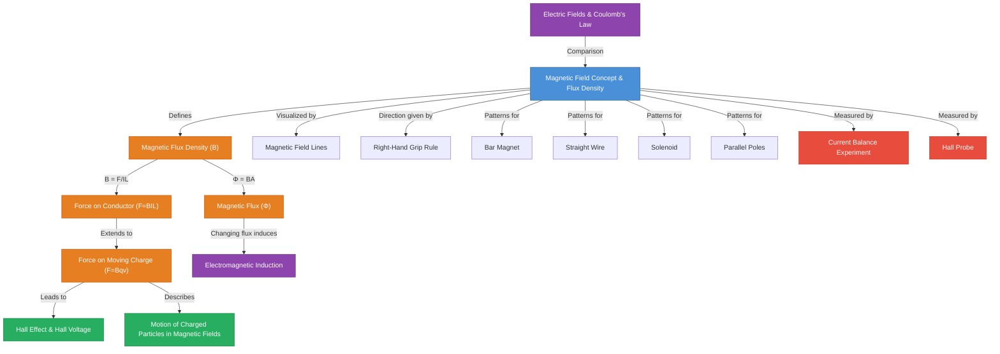

# 1. Overview / 概述

**English:**
This sub-topic introduces the fundamental concept of magnetic fields and the key quantity that defines their strength: magnetic flux density (B). A magnetic field is a region of space where a magnetic force is experienced by moving charges, current-carrying conductors, or magnetic materials. The concept of flux density quantifies how strong a magnetic field is at a given point. This foundational understanding is essential for all subsequent topics in magnetism, including [[Force on a Current-Carrying Conductor (F=BIL)]], [[Force on a Moving Charge (F=Bqv)]], the [[Hall Effect and Hall Voltage]], and [[Electromagnetic Induction]]. Unlike [[Electric Fields and Coulomb's Law]], which deal with stationary charges, magnetic fields arise from moving charges and exert forces only on moving charges. This sub-topic establishes the language, definitions, and mathematical framework for describing magnetic fields, making it the cornerstone of the [[Magnetic Fields and Forces]] chapter.

**中文:**
本子知识点介绍磁场的基本概念以及定义磁场强度的关键物理量：磁通量密度 (B)。磁场是空间中存在的一种区域，在该区域内，运动电荷、载流导体或磁性材料会受到磁力的作用。磁通量密度的概念量化了磁场在给定点的强弱。这一基础理解对于磁学中所有后续主题至关重要，包括[[载流导体所受的力 (F=BIL)]]、[[运动电荷所受的力 (F=Bqv)]]、[[霍尔效应与霍尔电压]]以及[[电磁感应]]。与处理静止电荷的[[电场与库仑定律]]不同，磁场由运动电荷产生，并且只对运动电荷施加力。本子知识点建立了描述磁场的语言、定义和数学框架，是[[磁场与力]]章节的基石。

---

# 2. Syllabus Learning Objectives / 考纲学习目标

| CAIE 9702 | Edexcel IAL |
|-----------|-------------|
| 20.1(a) Understand that a magnetic field is a field of force caused by moving charges or permanent magnets | 3.1 Understand the concept of magnetic field as a region of space where magnetic forces are experienced |
| 20.1(b) Define magnetic flux density B as F/IL, where F is the force on a straight conductor of length L carrying a current I at right angles to the field | 3.2 Define magnetic flux density B as the force per unit length per unit current on a current-carrying conductor placed perpendicular to the field |
| 20.1(c) Recall and use F = BIL for a current-carrying conductor perpendicular to a magnetic field | 3.3 Use F = BIL for a conductor perpendicular to a magnetic field |
| 20.1(d) Understand the direction of a magnetic field and use the right-hand grip rule | 3.4 Understand and apply the right-hand grip rule for the magnetic field around a current-carrying wire |
| 20.1(e) Sketch magnetic field patterns for bar magnets, straight wires, solenoids, and between two parallel poles | 3.5 Sketch and interpret magnetic field patterns for bar magnets, straight wires, solenoids, and between two parallel poles |

**Examiner Expectations / 考官期望:**
- **English:** Students must be able to define magnetic flux density in terms of force on a current-carrying conductor, not just memorize the formula. They must understand that B is a vector quantity with both magnitude and direction. Field line diagrams must show correct direction (N to S outside the magnet), spacing indicating field strength, and the correct shape for each configuration. The right-hand grip rule must be applied correctly for both straight wires and solenoids.
- **中文:** 学生必须能够根据载流导体所受的力来定义磁通量密度，而不仅仅是记忆公式。他们必须理解 B 是一个既有大小又有方向的矢量。磁力线图必须显示正确的方向（磁体外部从 N 到 S），间距表示磁场强度，以及每种配置的正确形状。右手螺旋定则必须正确应用于直导线和螺线管。

---

# 3. Core Definitions / 核心定义

| Term (EN/CN) | Definition (EN) | Definition (CN) | Common Mistakes / 常见错误 |
|--------------|-----------------|-----------------|---------------------------|
| **Magnetic Field** / 磁场 | A region of space where a magnetic force is experienced by moving charges, current-carrying conductors, or magnetic materials. | 空间中存在的一种区域，在该区域内，运动电荷、载流导体或磁性材料会受到磁力的作用。 | Confusing magnetic fields with electric fields; thinking magnetic fields can exert forces on stationary charges. |
| **Magnetic Flux Density (B)** / 磁通量密度 (B) | The force per unit length per unit current on a straight conductor placed perpendicular to a magnetic field. Defined as B = F/IL. | 垂直于磁场放置的直导体上单位长度、单位电流所受的力。定义为 B = F/IL。 | Forgetting the perpendicular condition; treating B as a scalar instead of a vector. |
| **Tesla (T)** / 特斯拉 (T) | The SI unit of magnetic flux density. 1 T = 1 N A⁻¹ m⁻¹. A field of 1 T exerts a force of 1 N on a 1 m conductor carrying 1 A perpendicular to the field. | 磁通量密度的国际单位。1 T = 1 N A⁻¹ m⁻¹。1 T 的磁场对垂直于磁场放置的、长度为 1 m、载有 1 A 电流的导体施加 1 N 的力。 | Writing units incorrectly as N/Am or Nm/A. |
| **Magnetic Field Lines** / 磁力线 | Imaginary lines used to represent the direction and strength of a magnetic field. Direction is from N to S outside a magnet. Closer lines indicate stronger field. | 用于表示磁场方向和强度的假想线。磁体外部方向从 N 到 S。线越密表示磁场越强。 | Thinking field lines start at N and end at S (they form continuous loops); confusing with electric field lines. |
| **Right-Hand Grip Rule** / 右手螺旋定则 | A rule to determine the direction of the magnetic field around a current-carrying conductor: grip the wire with the right hand, thumb pointing in the direction of conventional current; fingers curl in the direction of the magnetic field. | 用于确定载流导体周围磁场方向的定则：用右手握住导线，拇指指向常规电流方向；手指弯曲的方向即为磁场方向。 | Using the left hand; pointing thumb in the direction of electron flow instead of conventional current. |
| **Solenoid** / 螺线管 | A coil of wire wound in a helical shape that produces a uniform magnetic field inside when current flows through it. | 绕成螺旋形状的线圈，当电流通过时，其内部产生均匀磁场。 | Thinking the field outside a solenoid is zero (it is weak but not zero, similar to a bar magnet). |

---

# 4. Key Concepts Explained / 关键概念详解

## 4.1 Magnetic Field as a Field of Force / 磁场作为力场

### Explanation / 解释
**English:** A magnetic field is fundamentally a region of space where magnetic forces are experienced. Unlike gravitational fields (which act on mass) and electric fields (which act on charge), magnetic fields only exert forces on **moving** charges. This is a critical distinction. A stationary charge placed in a magnetic field experiences no force. The magnetic field is created by moving charges (currents) or by permanent magnets (which have aligned electron spins creating microscopic currents). The field is a vector field, meaning at every point in space, it has both a magnitude (strength) and a direction. The direction at any point is defined as the direction in which the north pole of a small compass needle would point. This connects to the [[Electric Fields and Coulomb's Law]] concept of field lines, but with different rules for sources and interactions.

**中文:** 磁场本质上是空间中存在磁力的区域。与引力场（作用于质量）和电场（作用于电荷）不同，磁场只对**运动**的电荷施加力。这是一个关键区别。放置在磁场中的静止电荷不会受到任何力。磁场由运动电荷（电流）或永磁体（具有排列整齐的电子自旋，产生微观电流）产生。磁场是一个矢量场，意味着在空间中的每一点，它都有大小（强度）和方向。任意一点的方向被定义为小指南针的北极所指的方向。这与[[电场与库仑定律]]中力线的概念相联系，但源和相互作用的规则不同。

### Physical Meaning / 物理意义
**English:** The magnetic field is a way of describing the "influence" that a magnet or current has on the space around it. It's a non-contact force field. The strength of the field (B) tells us how much force would be experienced by a moving charge or current placed at that point. The direction of the field tells us the direction of that force (perpendicular to both the field and the motion). This is fundamentally different from electric fields where the force is along the field direction.

**中文:** 磁场是描述磁体或电流对其周围空间产生的"影响"的一种方式。它是一个非接触力场。磁场的强度 (B) 告诉我们放置在该点的运动电荷或电流会受到多大的力。磁场的方向告诉我们该力的方向（垂直于磁场和运动方向）。这与电场根本不同，在电场中，力是沿着电场方向的。

### Common Misconceptions / 常见误区
- **English:** 
  - Thinking magnetic fields can do work on stationary charges (they cannot).
  - Believing magnetic field lines are real physical entities (they are a model).
  - Confusing magnetic field direction with the direction of force on a current.
- **中文:**
  - 认为磁场可以对静止电荷做功（不能）。
  - 相信磁力线是真实的物理实体（它们是一种模型）。
  - 混淆磁场方向与电流所受力的方向。

### Exam Tips / 考试提示
- **English:** Always state the perpendicular condition when using B = F/IL. If the conductor is at an angle θ, use F = BIL sin θ. Remember that B is defined from the force on a current-carrying conductor, not from the force on a moving charge (that's a consequence).
- **中文:** 使用 B = F/IL 时，务必说明垂直条件。如果导体与磁场成 θ 角，则使用 F = BIL sin θ。记住 B 是根据载流导体所受的力来定义的，而不是根据运动电荷所受的力（那是推论）。

## 4.2 Magnetic Flux Density (B) / 磁通量密度 (B)

### Explanation / 解释
**English:** Magnetic flux density B is the quantitative measure of magnetic field strength. It is defined by the equation B = F/IL, where F is the force on a straight conductor of length L carrying current I, placed perpendicular to the field. This definition gives B units of N A⁻¹ m⁻¹, which is the Tesla (T). A field of 1 T is very strong (the Earth's magnetic field is about 5 × 10⁻⁵ T). B is a vector quantity; its direction is the direction of the magnetic field at that point. The term "flux density" comes from the concept of magnetic flux Φ = BA, where A is area perpendicular to the field. B is therefore the flux per unit area. This connects directly to [[Electromagnetic Induction]] where changing flux induces EMF.

**中文:** 磁通量密度 B 是磁场强度的定量度量。它由方程 B = F/IL 定义，其中 F 是垂直于磁场放置的、长度为 L、载有电流 I 的直导体所受的力。这个定义给出了 B 的单位为 N A⁻¹ m⁻¹，即特斯拉 (T)。1 T 的磁场非常强（地球磁场约为 5 × 10⁻⁵ T）。B 是一个矢量；其方向是该点磁场的方向。术语"通量密度"源于磁通量 Φ = BA 的概念，其中 A 是垂直于磁场的面积。因此，B 是单位面积的通量。这直接联系到[[电磁感应]]，其中变化的通量会感应出电动势。

### Physical Meaning / 物理意义
**English:** B tells us how "dense" the magnetic field lines are. A higher B means more field lines per unit area, meaning a stronger field and a larger force on a current or moving charge. The definition B = F/IL gives an operational way to measure B: measure the force on a known current-carrying conductor in the field.

**中文:** B 告诉我们磁力线的"密集"程度。更高的 B 意味着单位面积内有更多的磁力线，意味着更强的磁场以及对电流或运动电荷更大的力。定义 B = F/IL 提供了一种测量 B 的操作方法：测量磁场中已知载流导体所受的力。

### Common Misconceptions / 常见误区
- **English:**
  - Thinking B is the same as magnetic field strength H (H is used for magnetizing fields, B is the total field including material response).
  - Forgetting that B is defined for a conductor perpendicular to the field.
  - Confusing B with flux Φ (Φ = BA, so B = Φ/A).
- **中文:**
  - 认为 B 与磁场强度 H 相同（H 用于磁化场，B 是包括材料响应的总场）。
  - 忘记 B 是针对垂直于磁场的导体定义的。
  - 混淆 B 与磁通量 Φ（Φ = BA，所以 B = Φ/A）。

### Exam Tips / 考试提示
- **English:** When asked to define B, always write: "The force per unit length per unit current on a straight conductor placed perpendicular to the magnetic field." Include the perpendicular condition. For calculations, ensure all quantities are in SI units (N, A, m).
- **中文:** 当被要求定义 B 时，务必写出："垂直于磁场放置的直导体上单位长度、单位电流所受的力。" 包括垂直条件。计算时，确保所有量都使用国际单位制（N, A, m）。

## 4.3 Magnetic Field Patterns / 磁场图样

### Explanation / 解释
**English:** Magnetic field patterns are visual representations of the magnetic field using field lines. Key rules for drawing field lines:
1. Direction: Outside a magnet, lines go from N to S. Inside, they go from S to N, forming continuous loops.
2. Strength: Closer lines indicate stronger field. Lines never cross.
3. For a bar magnet: Lines emerge from N, curve around, and enter S. Field is strongest at the poles.
4. For a straight current-carrying wire: Field lines are concentric circles around the wire. Direction given by right-hand grip rule.
5. For a solenoid: Field inside is nearly uniform and parallel to the axis. Outside, it resembles a bar magnet.
6. Between two parallel poles (N-S): Field is nearly uniform, with parallel, equally spaced straight lines from N to S.

**中文:** 磁场图样是使用磁力线对磁场的视觉表示。绘制磁力线的关键规则：
1. 方向：磁体外部，线从 N 到 S。内部，从 S 到 N，形成连续回路。
2. 强度：线越密表示磁场越强。线永不相交。
3. 条形磁体：线从 N 发出，弯曲，进入 S。磁场在磁极处最强。
4. 载流直导线：磁力线是围绕导线的同心圆。方向由右手螺旋定则给出。
5. 螺线管：内部磁场几乎均匀且平行于轴线。外部，类似于条形磁体。
6. 两个平行磁极之间（N-S）：磁场几乎均匀，有从 N 到 S 的平行、等距直线。

### Physical Meaning / 物理意义
**English:** Field patterns help visualize the vector nature of the magnetic field. The tangent to a field line at any point gives the direction of B at that point. The density of lines (number per unit area perpendicular to the field) represents the magnitude of B. Uniform fields (like inside a solenoid or between parallel poles) have constant B in both magnitude and direction.

**中文:** 磁场图样有助于可视化磁场的矢量性质。任意一点处磁力线的切线给出了该点 B 的方向。线的密度（垂直于磁场的单位面积内的数量）表示 B 的大小。均匀场（如螺线管内部或平行磁极之间）的 B 在大小和方向上都是恒定的。

### Common Misconceptions / 常见误区
- **English:**
  - Drawing field lines starting at N and ending at S (they are continuous loops).
  - Drawing field lines crossing each other (impossible, as B would have two directions at one point).
  - Forgetting the field inside a bar magnet (from S to N).
  - Drawing the field around a wire as radial lines (they are concentric circles).
- **中文:**
  - 绘制从 N 开始到 S 结束的磁力线（它们是连续回路）。
  - 绘制相互交叉的磁力线（不可能，因为 B 在一点会有两个方向）。
  - 忘记条形磁体内部的磁场（从 S 到 N）。
  - 将导线周围的磁场绘制成径向线（它们是同心圆）。

### Exam Tips / 考试提示
- **English:** In exams, you may be asked to sketch field patterns. Use arrows to show direction. Show at least 4-5 lines for simple patterns. For a solenoid, show the uniform field inside with parallel lines. For a wire, show at least 3 concentric circles with arrows. Remember: field lines are 3D, but we draw 2D cross-sections.
- **中文:** 考试中，可能会要求你绘制磁场图样。使用箭头表示方向。对于简单图样，至少画 4-5 条线。对于螺线管，用平行线显示内部的均匀磁场。对于导线，至少画 3 个带箭头的同心圆。记住：磁力线是三维的，但我们画的是二维截面。

---

# 5. Essential Equations / 核心公式

## 5.1 Definition of Magnetic Flux Density / 磁通量密度的定义

$$ B = \frac{F}{IL} $$

| Symbol (符号) | Meaning (EN) | Meaning (CN) | Unit (单位) |
|--------------|-------------|-------------|------------|
| B | Magnetic flux density | 磁通量密度 | T (Tesla / 特斯拉) |
| F | Force on the conductor | 导体所受的力 | N (Newton / 牛顿) |
| I | Current in the conductor | 导体中的电流 | A (Ampere / 安培) |
| L | Length of conductor in the field | 磁场中导体的长度 | m (metre / 米) |

**Conditions / 适用条件:**
- **English:** The conductor must be placed perpendicular to the magnetic field. If the conductor is at an angle θ to the field, use F = BIL sin θ.
- **中文:** 导体必须垂直于磁场放置。如果导体与磁场成 θ 角，则使用 F = BIL sin θ。

**Limitations / 局限性:**
- **English:** This definition assumes a uniform magnetic field over the length of the conductor. For non-uniform fields, B varies with position, and the equation gives the average B over the conductor length.
- **中文:** 该定义假设导体长度上的磁场是均匀的。对于非均匀场，B 随位置变化，该方程给出导体长度上的平均 B。

## 5.2 Force on a Conductor at an Angle / 成角度的导体所受的力

$$ F = BIL \sin \theta $$

| Symbol (符号) | Meaning (EN) | Meaning (CN) | Unit (单位) |
|--------------|-------------|-------------|------------|
| θ | Angle between conductor and magnetic field | 导体与磁场之间的夹角 | degrees or radians (度或弧度) |

**Derivation / 推导:**
- **English:** When the conductor is at angle θ to the field, only the component of the conductor perpendicular to the field (L sin θ) experiences the full magnetic force. Hence F = B × I × (L sin θ) = BIL sin θ.
- **中文:** 当导体与磁场成 θ 角时，只有导体垂直于磁场的分量 (L sin θ) 受到完整的磁力。因此 F = B × I × (L sin θ) = BIL sin θ。

**Conditions / 适用条件:**
- **English:** θ is measured between the direction of the current and the direction of the magnetic field. When θ = 90°, sin θ = 1, giving F = BIL. When θ = 0° (conductor parallel to field), F = 0.
- **中文:** θ 是在电流方向与磁场方向之间测量的。当 θ = 90° 时，sin θ = 1，得到 F = BIL。当 θ = 0°（导体平行于磁场）时，F = 0。

## 5.3 Magnetic Flux / 磁通量

$$ \Phi = BA $$

| Symbol (符号) | Meaning (EN) | Meaning (CN) | Unit (单位) |
|--------------|-------------|-------------|------------|
| Φ | Magnetic flux | 磁通量 | Wb (Weber / 韦伯) |
| B | Magnetic flux density | 磁通量密度 | T |
| A | Area perpendicular to the field | 垂直于磁场的面积 | m² |

**Conditions / 适用条件:**
- **English:** The area A must be perpendicular to the magnetic field. If the area is at an angle θ to the perpendicular, use Φ = BA cos θ.
- **中文:** 面积 A 必须垂直于磁场。如果面积与垂直方向成 θ 角，则使用 Φ = BA cos θ。

**Limitations / 局限性:**
- **English:** This assumes a uniform B over the area. For non-uniform fields, integration is needed.
- **中文:** 这假设面积上的 B 是均匀的。对于非均匀场，需要积分。

> 📷 **IMAGE PROMPT — EQN-01: Magnetic Flux Density Definition Diagram**
> A clear diagram showing a straight conductor of length L carrying current I placed perpendicular to a uniform magnetic field B (shown as parallel arrows from left to right). The force F on the conductor is shown as an arrow perpendicular to both the conductor and the field (using Fleming's left-hand rule). Labels: B (magnetic field), I (current), L (length), F (force). Include a small note: "B = F/IL". Style: clean physics textbook diagram, white background, black lines with color-coded arrows (blue for B, red for I, green for F).

---

# 6. Graphs and Relationships / 图表与关系

## 6.1 Force vs Current (F vs I) for a Conductor in a Magnetic Field / 磁场中导体的力与电流关系图

### Axes / 坐标轴
- **X-axis:** Current I / A (电流 I / A)
- **Y-axis:** Force F / N (力 F / N)

### Shape / 形状
- **English:** A straight line passing through the origin. F ∝ I when B and L are constant.
- **中文:** 一条通过原点的直线。当 B 和 L 恒定时，F ∝ I。

### Gradient Meaning / 斜率含义
- **English:** Gradient = F/I = BL. If L is known, B can be calculated from the gradient.
- **中文:** 斜率 = F/I = BL。如果 L 已知，可以从斜率计算出 B。

### Area Meaning / 面积含义
- **English:** No physical meaning for area under this graph.
- **中文:** 该图下的面积没有物理意义。

### Exam Interpretation / 考试解读
- **English:** A common experiment is to measure F for different I values using a current balance. The straight line through origin confirms F ∝ I. The gradient gives BL, and if L is known, B can be found. Any deviation from linearity at high currents may indicate heating effects changing the resistance.
- **中文:** 一个常见实验是使用电流天平测量不同 I 值下的 F。通过原点的直线证实了 F ∝ I。斜率给出 BL，如果 L 已知，可以求出 B。高电流下任何偏离线性的情况可能表明加热效应改变了电阻。

## 6.2 Force vs Length (F vs L) for a Conductor in a Magnetic Field / 磁场中导体的力与长度关系图

### Axes / 坐标轴
- **X-axis:** Length L / m (长度 L / m)
- **Y-axis:** Force F / N (力 F / N)

### Shape / 形状
- **English:** A straight line passing through the origin. F ∝ L when B and I are constant.
- **中文:** 一条通过原点的直线。当 B 和 I 恒定时，F ∝ L。

### Gradient Meaning / 斜率含义
- **English:** Gradient = F/L = BI. If I is known, B can be calculated.
- **中文:** 斜率 = F/L = BI。如果 I 已知，可以计算出 B。

### Area Meaning / 面积含义
- **English:** No physical meaning.
- **中文:** 没有物理意义。

### Exam Interpretation / 考试解读
- **English:** This confirms F ∝ L. The experiment uses conductors of different lengths in the same magnetic field with the same current. The straight line through origin confirms the relationship.
- **中文:** 这证实了 F ∝ L。实验使用相同磁场中、相同电流下不同长度的导体。通过原点的直线证实了该关系。

---

# 7. Required Diagrams / 必备图表

## 7.1 Magnetic Field Pattern of a Bar Magnet / 条形磁体的磁场图样

### Description / 描述
- **English:** A bar magnet with its north (N) and south (S) poles labeled. Magnetic field lines emerge from the N pole, curve through space, and enter the S pole. Inside the magnet, lines go from S to N, completing the loop. Lines are closest together at the poles, indicating strongest field. Arrows on lines show direction from N to S outside the magnet.
- **中文:** 一个标有北极 (N) 和南极 (S) 的条形磁体。磁力线从 N 极发出，在空间中弯曲，进入 S 极。磁体内部，线从 S 到 N，形成回路。线在磁极处最密，表示磁场最强。线上的箭头表示磁体外部从 N 到 S 的方向。

### Image Prompt / 图片生成提示
> 📷 **IMAGE PROMPT — DIAG-01: Bar Magnet Field Pattern**
> A bar magnet with N (red) and S (blue) poles clearly labeled. Magnetic field lines shown as smooth curves emerging from N, curving through the surrounding space, and entering S. At least 8 field lines shown, with arrows indicating direction from N to S outside the magnet. Inside the magnet, dashed lines show field from S to N. Lines are denser at the poles. Style: clean physics textbook diagram, white background, black field lines with directional arrows, red N label, blue S label. Include a compass needle near the field showing alignment with field direction.

### Labels Required / 需要标注
- **English:** N (north pole), S (south pole), field lines with arrows, region of strongest field (at poles), direction of field (N → S outside, S → N inside).
- **中文:** N（北极），S（南极），带箭头的磁力线，最强磁场区域（磁极处），磁场方向（外部 N → S，内部 S → N）。

### Exam Importance / 考试重要性
- **English:** High. Students are frequently asked to sketch or interpret bar magnet field patterns. Understanding the continuous loop nature of field lines is essential for [[Electromagnetic Induction]].
- **中文:** 高。学生经常被要求绘制或解释条形磁体的磁场图样。理解磁力线的连续回路性质对于[[电磁感应]]至关重要。

## 7.2 Magnetic Field Pattern of a Current-Carrying Straight Wire / 载流直导线的磁场图样

### Description / 描述
- **English:** A straight wire carrying current I (shown as a dot ⊙ for current coming out of the page, or cross ⊗ for current going into the page). Concentric circles around the wire represent magnetic field lines. Arrows on circles show direction given by the right-hand grip rule. Spacing between circles increases with distance from wire, indicating field strength decreases with distance.
- **中文:** 一根载有电流 I 的直导线（用点 ⊙ 表示电流流出页面，或用叉 ⊗ 表示电流流入页面）。围绕导线的同心圆代表磁力线。圆上的箭头表示由右手螺旋定则给出的方向。圆之间的间距随距导线的距离增加而增大，表示磁场强度随距离减小。

### Image Prompt / 图片生成提示
> 📷 **IMAGE PROMPT — DIAG-02: Magnetic Field Around a Straight Wire**
> A cross-section view of a straight wire carrying current. The wire is shown as a circle with a dot (⊙) in the center, indicating current coming out of the page. Three concentric circles around the wire represent magnetic field lines. Arrows on the circles show counterclockwise direction (right-hand grip rule: thumb out of page, fingers curl counterclockwise). Labels: I (current out of page), B (magnetic field lines). Include a small hand diagram showing the right-hand grip rule. Style: clean physics diagram, white background, black wire, blue field lines with arrows.

### Labels Required / 需要标注
- **English:** Wire with current direction (⊙ or ⊗), magnetic field lines (concentric circles), arrows showing field direction, distance from wire (r).
- **中文:** 带电流方向的导线（⊙ 或 ⊗），磁力线（同心圆），显示磁场方向的箭头，距导线的距离 (r)。

### Exam Importance / 考试重要性
- **English:** High. This pattern is the basis for understanding the force between parallel currents and the operation of solenoids.
- **中文:** 高。这个图样是理解平行电流之间的力和螺线管工作原理的基础。

## 7.3 Magnetic Field Pattern of a Solenoid / 螺线管的磁场图样

### Description / 描述
- **English:** A solenoid shown as a helical coil of wire with current flowing through it. Inside the solenoid, magnetic field lines are parallel and equally spaced, indicating a uniform field. Direction inside is along the axis from the south pole to the north pole of the solenoid. Outside, the field resembles that of a bar magnet, with lines emerging from the north pole and entering the south pole. The north pole is determined by the right-hand grip rule: grip the solenoid with right hand, fingers in direction of current, thumb points to north pole.
- **中文:** 一个显示为螺旋线圈的螺线管，电流流过其中。螺线管内部，磁力线平行且等距，表示均匀磁场。内部方向沿轴线从螺线管的南极到北极。外部，磁场类似于条形磁体，线从北极发出，进入南极。北极由右手螺旋定则确定：用右手握住螺线管，手指指向电流方向，拇指指向北极。

### Image Prompt / 图片生成提示
> 📷 **IMAGE PROMPT — DIAG-03: Solenoid Magnetic Field Pattern**
> A solenoid shown as a helical coil with current flowing through it (arrows on wire showing current direction). Inside the solenoid, parallel equally-spaced straight field lines with arrows pointing from left to right (from south to north pole). Outside, field lines curve from the north pole (right end) around to the south pole (left end), resembling a bar magnet. Labels: N (north pole), S (south pole), uniform field inside, current direction arrows on coil. Include a small diagram showing the right-hand grip rule for a solenoid. Style: clean physics textbook diagram, white background, copper-colored coil, blue field lines with arrows.

### Labels Required / 需要标注
- **English:** Solenoid coil, current direction (arrows on wire), N (north pole), S (south pole), uniform field inside, field lines outside, right-hand grip rule illustration.
- **中文:** 螺线管线圈，电流方向（导线上的箭头），N（北极），S（南极），内部均匀磁场，外部磁力线，右手螺旋定则图示。

### Exam Importance / 考试重要性
- **English:** Very high. Solenoids are used in many applications (relays, valves, MRI machines). Understanding the uniform field inside is crucial for [[Electromagnetic Induction]] and [[Motion of Charged Particles in Magnetic Fields]].
- **中文:** 非常高。螺线管用于许多应用（继电器、阀门、MRI 机器）。理解内部的均匀场对于[[电磁感应]]和[[磁场中带电粒子的运动]]至关重要。

---

# 8. Worked Examples / 典型例题

## Example 1: Calculating Magnetic Flux Density / 例 1：计算磁通量密度

### Question / 题目
**English:** A straight conductor of length 0.15 m carries a current of 3.0 A. When placed perpendicular to a uniform magnetic field, it experiences a force of 0.045 N. Calculate the magnetic flux density of the field.

**中文:** 一根长度为 0.15 m 的直导体载有 3.0 A 的电流。当垂直于均匀磁场放置时，它受到 0.045 N 的力。计算该磁场的磁通量密度。

### Solution / 解答

**Step 1: Identify known quantities / 步骤 1：确定已知量**
- L = 0.15 m
- I = 3.0 A
- F = 0.045 N
- Conductor is perpendicular to field (θ = 90°)

**Step 2: Select the equation / 步骤 2：选择方程**
$$ B = \frac{F}{IL} $$

**Step 3: Substitute values / 步骤 3：代入数值**
$$ B = \frac{0.045}{3.0 \times 0.15} $$

**Step 4: Calculate / 步骤 4：计算**
$$ B = \frac{0.045}{0.45} = 0.10 \text{ T} $$

### Final Answer / 最终答案
**Answer:** B = 0.10 T | **答案：** B = 0.10 T

### Quick Tip / 提示
- **English:** Always check units: F in N, I in A, L in m → B in T. If the conductor is not perpendicular, use F = BIL sin θ.
- **中文:** 始终检查单位：F 用 N，I 用 A，L 用 m → B 用 T。如果导体不垂直，使用 F = BIL sin θ。

## Example 2: Force on a Conductor at an Angle / 例 2：成角度的导体所受的力

### Question / 题目
**English:** A wire of length 0.20 m carries a current of 2.5 A in a uniform magnetic field of flux density 0.080 T. The wire makes an angle of 30° with the direction of the magnetic field. Calculate the magnitude of the magnetic force on the wire.

**中文:** 一根长度为 0.20 m 的导线载有 2.5 A 的电流，处于磁通量密度为 0.080 T 的均匀磁场中。导线与磁场方向成 30° 角。计算导线所受磁力的大小。

### Solution / 解答

**Step 1: Identify known quantities / 步骤 1：确定已知量**
- L = 0.20 m
- I = 2.5 A
- B = 0.080 T
- θ = 30° (angle between wire and field)

**Step 2: Select the equation / 步骤 2：选择方程**
$$ F = BIL \sin \theta $$

**Step 3: Substitute values / 步骤 3：代入数值**
$$ F = 0.080 \times 2.5 \times 0.20 \times \sin 30^\circ $$

**Step 4: Calculate / 步骤 4：计算**
$$ F = 0.080 \times 2.5 \times 0.20 \times 0.50 $$
$$ F = 0.020 \text{ N} $$

### Final Answer / 最终答案
**Answer:** F = 0.020 N | **答案：** F = 0.020 N

### Quick Tip / 提示
- **English:** When θ = 0° (wire parallel to field), F = 0. When θ = 90° (wire perpendicular), F = BIL (maximum). Use sin θ, not cos θ.
- **中文:** 当 θ = 0°（导线平行于磁场）时，F = 0。当 θ = 90°（导线垂直）时，F = BIL（最大）。使用 sin θ，而不是 cos θ。

---

# 9. Past Paper Question Types / 历年真题题型

| Question Type / 题型 | Frequency / 频率 | Difficulty / 难度 | Past Paper References / 真题索引 |
|----------------------|------------------|------------------|-------------------------------|
| Definition of magnetic flux density B | High | Easy | 📝 *待填入* |
| Calculation using B = F/IL | High | Easy-Medium | 📝 *待填入* |
| Sketching magnetic field patterns | High | Medium | 📝 *待填入* |
| Right-hand grip rule application | Medium | Easy | 📝 *待填入* |
| Force on conductor at an angle (F = BIL sin θ) | Medium | Medium | 📝 *待填入* |
| Comparing magnetic and electric fields | Low | Medium | 📝 *待填入* |
| Experimental determination of B | Medium | Medium-Hard | 📝 *待填入* |

**Common Command Words / 常见指令词:**
- **English:** Define, State, Calculate, Sketch, Draw, Explain, Determine, Show that
- **中文:** 定义，陈述，计算，绘制，画出，解释，确定，证明

---

# 10. Practical Skills Connections / 实验技能链接

**English:**
This sub-topic connects to practical work in several ways:

1. **Current Balance Experiment:** This is the classic experiment to determine magnetic flux density. A current-carrying conductor is placed in a magnetic field, and the force is measured using a digital balance. By varying I and measuring F, a graph of F vs I gives a straight line with gradient BL. If L is known, B can be calculated. Key skills: setting up circuits, measuring force with a balance, plotting graphs, calculating gradient, error analysis.

2. **Measuring B using a Hall Probe:** A Hall probe (connected to [[Hall Effect and Hall Voltage]]) can directly measure B. The probe must be calibrated in a known field. Skills: using a Hall probe, calibration, avoiding errors from probe orientation.

3. **Mapping Magnetic Fields:** Using a compass or plotting compass to trace field lines around magnets and current-carrying wires. Skills: careful plotting, drawing smooth field lines, showing direction correctly.

4. **Uncertainties:** When measuring B using the current balance, uncertainties in F (balance resolution), I (ammeter), and L (ruler) propagate. Typical uncertainty in B is 5-10%. Skills: calculating percentage uncertainties, combining uncertainties.

5. **Graph Plotting:** F vs I graph should show a straight line through origin. Any systematic error (e.g., zero error on balance) would cause the line not to pass through origin. Skills: plotting, drawing line of best fit, calculating gradient, identifying systematic errors.

**中文:**
本子知识点通过多种方式与实验工作联系：

1. **电流天平实验：** 这是确定磁通量密度的经典实验。将载流导体置于磁场中，使用数字天平测量力。通过改变 I 并测量 F，F 与 I 的关系图得到一条斜率为 BL 的直线。如果 L 已知，可以计算出 B。关键技能：搭建电路，用天平测量力，绘制图表，计算斜率，误差分析。

2. **使用霍尔探头测量 B：** 霍尔探头（与[[霍尔效应与霍尔电压]]相关）可以直接测量 B。探头必须在已知磁场中校准。技能：使用霍尔探头，校准，避免探头方向引起的误差。

3. **绘制磁场图：** 使用指南针或描迹罗盘追踪磁体和载流导线周围的磁力线。技能：仔细描点，绘制平滑的磁力线，正确显示方向。

4. **不确定度：** 使用电流天平测量 B 时，F（天平分辨率）、I（电流表）和 L（尺子）的不确定度会传播。B 的典型不确定度为 5-10%。技能：计算百分比不确定度，合成不确定度。

5. **图表绘制：** F 与 I 的关系图应显示一条通过原点的直线。任何系统误差（例如，天平的零点误差）都会导致直线不通过原点。技能：绘图，绘制最佳拟合线，计算斜率，识别系统误差。

---

# 11. Concept Map / 概念图谱

---

# 12. Quick Revision Sheet / 速查表

| Category / 类别 | Key Points / 要点 |
|----------------|------------------|
| **Definition / 定义** | **Magnetic field:** Region where moving charges experience magnetic force. **Magnetic flux density B:** Force per unit length per unit current on a conductor perpendicular to the field. B = F/IL. Unit: Tesla (T) = N A⁻¹ m⁻¹. / **磁场：** 运动电荷受到磁力的区域。**磁通量密度 B：** 垂直于磁场的导体上单位长度、单位电流所受的力。B = F/IL。单位：特斯拉 (T) = N A⁻¹ m⁻¹。 |
| **Key Formula / 核心公式** | B = F/IL (conductor perpendicular to field) / (导体垂直于磁场) F = BIL sin θ (conductor at angle θ) / (导体与磁场成 θ 角) Φ = BA (flux through area perpendicular to field) / (通过垂直于磁场的面积的磁通量) |
| **Key Graph / 核心图表** | F vs I: Straight line through origin, gradient = BL. F vs L: Straight line through origin, gradient = BI. / F 与 I：通过原点的直线，斜率 = BL。F 与 L：通过原点的直线，斜率 = BI。 |
| **Field Patterns / 磁场图样** | **Bar magnet:** Lines N→S outside, S→N inside. **Wire:** Concentric circles, direction by right-hand grip rule. **Solenoid:** Uniform parallel field inside, bar magnet-like outside. **Parallel poles:** Uniform parallel lines N→S. / **条形磁体：** 外部 N→S，内部 S→N。**导线：** 同心圆，方向由右手螺旋定则确定。**螺线管：** 内部均匀平行场，外部类似条形磁体。**平行磁极：** 均匀平行线 N→S。 |
| **Right-Hand Grip Rule / 右手螺旋定则** | **Straight wire:** Thumb = current direction, fingers = field direction. **Solenoid:** Fingers = current direction, thumb = north pole. / **直导线：** 拇指 = 电流方向，手指 = 磁场方向。**螺线管：** 手指 = 电流方向，拇指 = 北极。 |
| **Exam Tip / 考试提示** | Always state perpendicular condition for B definition. Use sin θ for angled conductors. Field lines are continuous loops, never cross. B is a vector. 1 T is very strong (Earth ~ 5×10⁻⁵ T). / 定义 B 时始终说明垂直条件。成角度的导体使用 sin θ。磁力线是连续回路，永不相交。B 是矢量。1 T 非常强（地球 ~ 5×10⁻⁵ T）。 |
| **Common Mistakes / 常见错误** | Forgetting perpendicular condition; using left hand for right-hand rule; drawing field lines starting/ending at poles; confusing B with Φ; thinking stationary charges experience magnetic force. / 忘记垂直条件；用左手做右手定则；绘制从磁极开始/结束的磁力线；混淆 B 与 Φ；认为静止电荷受到磁力。 |
| **Practical Connection / 实验联系** | Current balance: measure F for different I, plot F vs I, gradient = BL. Hall probe: direct measurement of B. Compass: map field lines. / 电流天平：测量不同 I 下的 F，绘制 F 与 I 关系图，斜率 = BL。霍尔探头：直接测量 B。指南针：绘制磁力线。 |