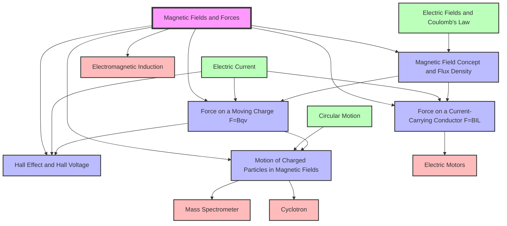

# Magnetic Fields and Forces / 磁场与磁力

---

# 1. Overview / 概述

**English:**
This topic explores the fundamental concept of magnetic fields — regions of space where magnetic forces act on moving charges or current-carrying conductors. It begins by defining magnetic flux density $B$ as a measure of field strength, then examines the forces experienced by current-carrying wires ($F = BIL \sin\theta$) and individual charged particles ($F = Bqv \sin\theta$). The [[Hall Effect]] is introduced as a practical method for measuring magnetic fields, and the motion of charged particles in uniform magnetic fields — leading to circular paths — is analysed in detail.

Magnetic fields are central to modern technology: they enable electric motors, loudspeakers, particle accelerators (cyclotrons), mass spectrometers, and magnetic resonance imaging (MRI). In the Cambridge 9702 and Edexcel IAL syllabuses, this topic builds directly on [[Electric Fields and Coulomb's Law]] and serves as the foundation for [[Electromagnetic Induction]]. It is assessed through calculations, graph analysis, and practical skills (e.g., Hall probe measurements).

**中文：**
本专题探讨磁场的基本概念——即空间中磁力作用于运动电荷或载流导体的区域。首先定义磁通密度 $B$ 作为磁场强度的量度，然后研究载流导线（$F = BIL \sin\theta$）和单个带电粒子（$F = Bqv \sin\theta$）所受的力。引入[[霍尔效应]]作为测量磁场的实用方法，并详细分析带电粒子在均匀磁场中的运动——导致圆形轨迹。

磁场是现代技术的核心：它们使电动机、扬声器、粒子加速器（回旋加速器）、质谱仪和磁共振成像（MRI）成为可能。在剑桥 9702 和爱德思 IAL 考纲中，本专题直接建立在[[电场与库仑定律]]之上，并为[[电磁感应]]奠定基础。通过计算、图表分析和实验技能（如霍尔探头测量）进行评估。

---

# 2. Syllabus Learning Objectives / 考纲学习目标

| CAIE 9702 (20.1 a-e) | Edexcel IAL (WPH14 U4: 3.1-3.5) |
|----------------------|----------------------------------|
| 20.1(a) Define magnetic flux density $B$ and the tesla (T). | 3.1 Understand that a magnetic field is a region where a force acts on a moving charge or a current-carrying conductor. |
| 20.1(b) Use $F = BIL \sin\theta$ for a current-carrying conductor in a uniform magnetic field. | 3.2 Use $F = BIL \sin\theta$ and $F = Bqv \sin\theta$ to calculate forces. |
| 20.1(c) Use $F = Bqv \sin\theta$ for a moving charge in a uniform magnetic field. | 3.3 Derive and apply $r = \frac{mv}{Bq}$ for circular motion of charged particles. |
| 20.1(d) Describe and explain the Hall effect; derive and use $V_H = \frac{BI}{nqt}$. | 3.4 Describe the Hall effect and use $V_H = \frac{BI}{nqt}$. |
| 20.1(e) Analyse the motion of charged particles in magnetic fields (circular paths). | 3.5 Explain the operation of a velocity selector and mass spectrometer. |

**Examiner Expectations / 考官期望:**

**English:**
- Candidates must define $B$ as force per unit current per unit length on a conductor perpendicular to the field.
- The tesla (T) definition: 1 T = 1 N A⁻¹ m⁻¹.
- For $F = BIL \sin\theta$, $\theta$ is the angle between the conductor and the magnetic field.
- For $F = Bqv \sin\theta$, $\theta$ is the angle between the velocity vector and the magnetic field.
- The Hall voltage derivation requires understanding of equilibrium between magnetic and electric forces.
- Circular motion analysis must include centripetal force equation $Bqv = \frac{mv^2}{r}$.

**中文：**
- 考生必须将 $B$ 定义为垂直于磁场的导体上每单位电流每单位长度所受的力。
- 特斯拉 (T) 定义：1 T = 1 N A⁻¹ m⁻¹。
- 对于 $F = BIL \sin\theta$，$\theta$ 是导体与磁场之间的夹角。
- 对于 $F = Bqv \sin\theta$，$\theta$ 是速度矢量与磁场之间的夹角。
- 霍尔电压推导需要理解磁力与电力之间的平衡。
- 圆周运动分析必须包括向心力方程 $Bqv = \frac{mv^2}{r}$。

> 📋 **CIE Only:** CAIE requires explicit definition of the tesla and derivation of Hall voltage from first principles.
> 📋 **Edexcel Only:** Edexcel requires explanation of velocity selector and mass spectrometer operation.

---

# 3. Core Definitions / 核心定义

| Term (EN/CN) | Definition (EN) | Definition (CN) | Common Mistakes / 常见错误 |
|--------------|-----------------|-----------------|---------------------------|
| [[Magnetic Field Concept and Flux Density\|Magnetic Flux Density]] $B$ / 磁通密度 $B$ | The force per unit current per unit length on a current-carrying conductor placed perpendicular to the magnetic field. | 垂直于磁场放置的载流导体上每单位电流每单位长度所受的力。 | Confusing $B$ with magnetic flux $\Phi$; forgetting the perpendicular condition. |
| Tesla (T) / 特斯拉 (T) | 1 T = 1 N A⁻¹ m⁻¹; the magnetic flux density when a force of 1 N acts on a 1 m conductor carrying 1 A perpendicular to the field. | 1 T = 1 N A⁻¹ m⁻¹；当 1 N 的力作用在垂直于磁场的 1 m 长载有 1 A 电流的导体上时的磁通密度。 | Writing T = N/A·m instead of N A⁻¹ m⁻¹. |
| [[Force on a Current-Carrying Conductor (F=BIL)\|Magnetic Force on a Conductor]] / 导体所受磁力 | $F = BIL \sin\theta$, where $\theta$ is the angle between the conductor and the magnetic field. | $F = BIL \sin\theta$，其中 $\theta$ 是导体与磁场之间的夹角。 | Using $\theta$ as angle between current and field incorrectly; forgetting $\sin\theta$ when not perpendicular. |
| [[Force on a Moving Charge (F=Bqv)\|Magnetic Force on a Moving Charge]] / 运动电荷所受磁力 | $F = Bqv \sin\theta$, where $\theta$ is the angle between the velocity and the magnetic field. | $F = Bqv \sin\theta$，其中 $\theta$ 是速度与磁场之间的夹角。 | Confusing $q$ with charge magnitude; forgetting sign of charge affects direction. |
| [[Hall Effect and Hall Voltage\|Hall Effect]] / 霍尔效应 | The production of a potential difference (Hall voltage) across a conductor when a magnetic field is applied perpendicular to the current direction. | 当磁场垂直于电流方向施加时，在导体两端产生电势差（霍尔电压）的现象。 | Thinking Hall voltage is due to magnetic force alone; forgetting equilibrium with electric force. |
| [[Hall Effect and Hall Voltage\|Hall Voltage]] $V_H$ / 霍尔电压 $V_H$ | $V_H = \frac{BI}{nqt}$, where $n$ is charge carrier density, $q$ is charge per carrier, $t$ is thickness. | $V_H = \frac{BI}{nqt}$，其中 $n$ 是载流子密度，$q$ 是每个载流子的电荷，$t$ 是厚度。 | Using width instead of thickness; forgetting $n$ is number density. |
| [[Motion of Charged Particles in Magnetic Fields\|Cyclotron Radius]] $r$ / 回旋半径 $r$ | $r = \frac{mv}{Bq}$, the radius of circular path of a charged particle in a uniform magnetic field. | $r = \frac{mv}{Bq}$，带电粒子在均匀磁场中做圆周运动的半径。 | Forgetting that $r \propto v$ and $r \propto 1/B$; mixing up $m$ and $q$. |

---

# 4. Key Concepts Explained / 关键概念详解

## 4.1 Magnetic Field Concept and Flux Density / 磁场概念与磁通密度

### Explanation / 解释

**English:**
A [[Magnetic Field Concept and Flux Density|magnetic field]] is a region of space where a magnetic force can be detected. It is represented by magnetic field lines that run from north to south outside a magnet. The strength of the field is quantified by the [[Magnetic Field Concept and Flux Density|magnetic flux density]] $B$, measured in tesla (T). The direction of $B$ at any point is the direction of the force on a north pole placed at that point.

The definition of $B$ comes from the force on a current-carrying conductor: $F = BIL \sin\theta$. When the conductor is perpendicular to the field ($\theta = 90^\circ$), $F = BIL$. Rearranging: $B = \frac{F}{IL}$. Thus, 1 T = 1 N A⁻¹ m⁻¹.

**中文：**
[[磁场概念与磁通密度|磁场]]是空间中可检测到磁力的区域。它由磁感线表示，在磁体外部从北极指向南极。场强由[[磁场概念与磁通密度|磁通密度]] $B$ 量化，单位为特斯拉 (T)。任意点的 $B$ 方向是该点处北极所受力的方向。

$B$ 的定义来自载流导体所受的力：$F = BIL \sin\theta$。当导体垂直于磁场时（$\theta = 90^\circ$），$F = BIL$。整理得：$B = \frac{F}{IL}$。因此，1 T = 1 N A⁻¹ m⁻¹。

### Physical Meaning / 物理意义

**English:**
A larger $B$ means a stronger magnetic field. For example, Earth's magnetic field is about $5 \times 10^{-5}$ T, a typical bar magnet is about 0.01 T, and an MRI scanner uses 1.5–3 T. The tesla is a large unit; most everyday fields are in millitesla (mT) or microtesla (µT).

**中文：**
较大的 $B$ 表示较强的磁场。例如，地球磁场约为 $5 \times 10^{-5}$ T，典型条形磁铁约为 0.01 T，MRI 扫描仪使用 1.5–3 T。特斯拉是一个较大的单位；大多数日常磁场以毫特斯拉 (mT) 或微特斯拉 (µT) 为单位。

### Common Misconceptions / 常见误区

1. **Magnetic field lines are real** — They are a model; they don't physically exist.
2. **$B$ is the same as magnetic flux $\Phi$** — $B$ is flux density; $\Phi = BA \cos\theta$ is total flux through an area.
3. **$B$ depends on current** — $B$ is a property of the field; the force depends on $B$, $I$, and $L$.

### Exam Tips / 考试提示

**English:**
- Always state the perpendicular condition when defining $B$.
- In calculations, check if the conductor is perpendicular to $B$; if not, use $\sin\theta$.
- CIE often asks for the definition of the tesla in Paper 4.

**中文：**
- 定义 $B$ 时始终说明垂直条件。
- 计算时检查导体是否垂直于 $B$；如果不是，使用 $\sin\theta$。
- CIE 常在 Paper 4 中要求定义特斯拉。

> 📷 **IMAGE PROMPT — MF01: Magnetic Field Lines Around a Bar Magnet**
>
> A bar magnet with labeled N and S poles. Red field lines curve from N to S outside the magnet, with arrows indicating direction. Inside the magnet, lines go from S to N. The field is denser near the poles. Clean white background, educational diagram style, 2D side view.

---

## 4.2 Force on a Current-Carrying Conductor / 载流导体所受的力

### Explanation / 解释

**English:**
When a current-carrying conductor is placed in a [[Magnetic Field Concept and Flux Density|magnetic field]], the moving charges (electrons) experience a magnetic force. This force is transmitted to the conductor as a whole. The magnitude is given by:

$$F = BIL \sin\theta$$

where:
- $B$ = magnetic flux density (T)
- $I$ = current (A)
- $L$ = length of conductor in the field (m)
- $\theta$ = angle between the conductor and the magnetic field

The direction is given by [[Fleming's Left-Hand Rule]]: thumb = force (motion), first finger = field (N to S), second finger = current (positive to negative).

**中文：**
当载流导体置于[[磁场概念与磁通密度|磁场]]中时，运动的电荷（电子）会受到磁力。这个力传递到整个导体上。大小由下式给出：

$$F = BIL \sin\theta$$

其中：
- $B$ = 磁通密度 (T)
- $I$ = 电流 (A)
- $L$ = 导体在磁场中的长度 (m)
- $\theta$ = 导体与磁场之间的夹角

方向由[[弗莱明左手定则]]给出：拇指 = 力（运动），食指 = 磁场（N 到 S），中指 = 电流（正到负）。

### Physical Meaning / 物理意义

**English:**
This is the principle behind electric motors. A current-carrying coil in a magnetic field experiences a torque, causing rotation. The force is maximum when the conductor is perpendicular to the field ($\theta = 90^\circ$) and zero when parallel ($\theta = 0^\circ$).

**中文：**
这是电动机的原理。磁场中的载流线圈受到扭矩作用，导致旋转。当导体垂直于磁场时（$\theta = 90^\circ$）力最大，平行时（$\theta = 0^\circ$）力为零。

### Common Misconceptions / 常见误区

1. **$L$ is the total length of the wire** — Only the length inside the magnetic field matters.
2. **Force is always $BIL$** — Only when $\theta = 90^\circ$; otherwise use $\sin\theta$.
3. **Current direction doesn't affect force direction** — Reversing current reverses force direction.

### Exam Tips / 考试提示

**English:**
- Draw a diagram showing the conductor, field, and current directions.
- Use Fleming's Left-Hand Rule carefully — many students get the finger assignments wrong.
- Edexcel often asks for the derivation of $F = BIL$ from $F = Bqv$.

**中文：**
- 画出显示导体、磁场和电流方向的示意图。
- 小心使用弗莱明左手定则——许多学生弄错手指分配。
- 爱德思常要求从 $F = Bqv$ 推导 $F = BIL$。

> 📷 **IMAGE PROMPT — MF02: Fleming's Left-Hand Rule Diagram**
>
> A left hand with thumb, first finger, and second finger mutually perpendicular. Thumb points up (Force), first finger points forward (Field), second finger points right (Current). Each finger labeled. Clean educational diagram, 3D isometric view, white background.

---

## 4.3 Force on a Moving Charge / 运动电荷所受的力

### Explanation / 解释

**English:**
A single charged particle moving in a [[Magnetic Field Concept and Flux Density|magnetic field]] experiences a force given by:

$$F = Bqv \sin\theta$$

where:
- $B$ = magnetic flux density (T)
- $q$ = charge of the particle (C)
- $v$ = velocity of the particle (m s⁻¹)
- $\theta$ = angle between velocity and magnetic field

The direction is given by [[Fleming's Left-Hand Rule]] for positive charges. For negative charges (electrons), the force direction is opposite.

**中文：**
在[[磁场概念与磁通密度|磁场]]中运动的单个带电粒子受到的力由下式给出：

$$F = Bqv \sin\theta$$

其中：
- $B$ = 磁通密度 (T)
- $q$ = 粒子的电荷 (C)
- $v$ = 粒子的速度 (m s⁻¹)
- $\theta$ = 速度与磁场之间的夹角

正电荷的方向由[[弗莱明左手定则]]给出。对于负电荷（电子），力的方向相反。

### Physical Meaning / 物理意义

**English:**
This force is always perpendicular to both the velocity and the magnetic field. Therefore, it does no work on the particle — it changes only the direction of motion, not the speed. This is why charged particles move in circular paths in uniform magnetic fields.

**中文：**
这个力始终垂直于速度和磁场。因此，它不对粒子做功——只改变运动方向，不改变速度大小。这就是带电粒子在均匀磁场中做圆周运动的原因。

### Common Misconceptions / 常见误区

1. **$F = Bqv$ always** — Only when $v \perp B$; otherwise use $\sin\theta$.
2. **Force does work** — No, because $F \perp v$, so power $P = Fv \cos 90^\circ = 0$.
3. **Direction same for all charges** — Negative charges experience opposite force.

### Exam Tips / 考试提示

**English:**
- For electrons, remember $q = -1.6 \times 10^{-19}$ C; the negative sign affects direction.
- CIE often combines this with circular motion equations.
- Edexcel may ask for the derivation of $F = BIL$ from $F = Bqv$ using $I = nAqv$.

**中文：**
- 对于电子，记住 $q = -1.6 \times 10^{-19}$ C；负号影响方向。
- CIE 常将此与圆周运动方程结合。
- 爱德思可能要求使用 $I = nAqv$ 从 $F = Bqv$ 推导 $F = BIL$。

---

## 4.4 Hall Effect and Hall Voltage / 霍尔效应与霍尔电压

### Explanation / 解释

**English:**
The [[Hall Effect and Hall Voltage|Hall effect]] occurs when a current-carrying conductor is placed in a perpendicular magnetic field. The magnetic force deflects charge carriers to one side, creating a transverse electric field. Equilibrium is reached when the electric force balances the magnetic force:

$$Bqv = qE$$

where $E = \frac{V_H}{w}$ (width of conductor). For a conductor with thickness $t$ and charge carrier density $n$, the current is $I = nAqv = n(wt)qv$. Substituting gives:

$$V_H = \frac{BI}{nqt}$$

**中文：**
[[霍尔效应与霍尔电压|霍尔效应]]发生在载流导体置于垂直磁场中时。磁力将载流子偏转到一侧，产生横向电场。当电力平衡磁力时达到平衡：

$$Bqv = qE$$

其中 $E = \frac{V_H}{w}$（导体宽度）。对于厚度为 $t$、载流子密度为 $n$ 的导体，电流为 $I = nAqv = n(wt)qv$。代入得：

$$V_H = \frac{BI}{nqt}$$

### Physical Meaning / 物理意义

**English:**
The Hall voltage is proportional to $B$ and $I$, and inversely proportional to $n$ and $t$. This allows:
- Measurement of magnetic fields (Hall probe)
- Determination of charge carrier type (sign of $V_H$)
- Determination of charge carrier density $n$

**中文：**
霍尔电压与 $B$ 和 $I$ 成正比，与 $n$ 和 $t$ 成反比。这使得：
- 测量磁场（霍尔探头）
- 确定载流子类型（$V_H$ 的符号）
- 确定载流子密度 $n$

### Common Misconceptions / 常见误区

1. **$V_H$ depends on width $w$** — No, $w$ cancels in the derivation.
2. **Hall voltage is due to magnetic force alone** — It's due to equilibrium of magnetic and electric forces.
3. **$n$ is the number of charge carriers** — It's the number density (per unit volume).

### Exam Tips / 考试提示

**English:**
- Derive $V_H$ step by step — CIE expects this.
- Know that $V_H$ is small (microvolts to millivolts).
- Edexcel may ask about using Hall probe to measure $B$.

**中文：**
- 逐步推导 $V_H$——CIE 期望这样做。
- 知道 $V_H$ 很小（微伏到毫伏）。
- 爱德思可能问及使用霍尔探头测量 $B$。

> 📷 **IMAGE PROMPT — MF03: Hall Effect Diagram**
>
> Rectangular conductor with current I flowing left to right. Magnetic field B pointing into page (crosses). Positive charges accumulate on top edge, negative on bottom edge. Hall voltage V_H shown across top and bottom. Labels: I, B, V_H, width w, thickness t. 3D perspective, educational style.

---

## 4.5 Motion of Charged Particles in Magnetic Fields / 带电粒子在磁场中的运动

### Explanation / 解释

**English:**
When a charged particle enters a uniform [[Magnetic Field Concept and Flux Density|magnetic field]] perpendicular to its velocity, the magnetic force provides the centripetal force:

$$Bqv = \frac{mv^2}{r}$$

Rearranging gives the [[Motion of Charged Particles in Magnetic Fields|cyclotron radius]]:

$$r = \frac{mv}{Bq}$$

The period of circular motion is:

$$T = \frac{2\pi r}{v} = \frac{2\pi m}{Bq}$$

Note that $T$ is independent of velocity — this is the principle of the cyclotron.

If the velocity has a component parallel to $B$, the particle moves in a helix.

**中文：**
当带电粒子垂直于速度方向进入均匀[[磁场概念与磁通密度|磁场]]时，磁力提供向心力：

$$Bqv = \frac{mv^2}{r}$$

整理得[[带电粒子在磁场中的运动|回旋半径]]：

$$r = \frac{mv}{Bq}$$

圆周运动的周期为：

$$T = \frac{2\pi r}{v} = \frac{2\pi m}{Bq}$$

注意 $T$ 与速度无关——这是回旋加速器的原理。

如果速度有平行于 $B$ 的分量，粒子做螺旋运动。

### Physical Meaning / 物理意义

**English:**
- Larger mass → larger radius (heavier particles curve less)
- Larger charge → smaller radius (more force)
- Larger speed → larger radius (harder to turn)
- Larger $B$ → smaller radius (stronger field turns more sharply)

Applications: cyclotrons (particle accelerators), mass spectrometers (separating isotopes), bubble chambers (detecting particles).

**中文：**
- 质量越大 → 半径越大（重粒子弯曲较小）
- 电荷越大 → 半径越小（力更大）
- 速度越大 → 半径越大（更难转弯）
- $B$ 越大 → 半径越小（强场转弯更急）

应用：回旋加速器（粒子加速器）、质谱仪（分离同位素）、气泡室（探测粒子）。

### Common Misconceptions / 常见误区

1. **$T$ depends on $v$** — No, $T = 2\pi m / Bq$ is independent of $v$.
2. **Particle speeds up in magnetic field** — No, magnetic force does no work.
3. **Path is always circular** — Only if $v \perp B$; otherwise helical.

### Exam Tips / 考试提示

**English:**
- Derive $r = mv/Bq$ from $Bqv = mv^2/r$.
- Know that $T$ is independent of $v$ — this is a common exam question.
- CIE may ask to sketch the path of a particle in a magnetic field.
- Edexcel may ask about velocity selector ($E = vB$ for undeflected particles).

**中文：**
- 从 $Bqv = mv^2/r$ 推导 $r = mv/Bq$。
- 知道 $T$ 与 $v$ 无关——这是一个常见的考试问题。
- CIE 可能要求画出粒子在磁场中的路径草图。
- 爱德思可能问及速度选择器（不偏转粒子的 $E = vB$）。

> 📷 **IMAGE PROMPT — MF04: Circular Path of Charged Particle in Magnetic Field**
>
> A positive charge (red dot with +) moving in a circular path in a uniform magnetic field pointing into page (blue crosses). Velocity vector tangent to circle, force vector pointing toward center. Radius r labeled. Clean diagram, 2D top view, educational style.

---

# 5. Essential Equations / 核心公式

## 5.1 Force on a Current-Carrying Conductor / 载流导体所受的力

**Equation / 公式:**
$$F = BIL \sin\theta$$

**Variables / 变量:**
| Symbol (符号) | Meaning (EN) | Meaning (CN) | Unit (单位) |
|--------------|-------------|-------------|------------|
| $F$ | Magnetic force | 磁力 | N |
| $B$ | Magnetic flux density | 磁通密度 | T |
| $I$ | Current | 电流 | A |
| $L$ | Length of conductor in field | 导体在磁场中的长度 | m |
| $\theta$ | Angle between conductor and field | 导体与磁场的夹角 | ° or rad |

**Derivation / 推导:**

**English:**
From $F = Bqv$ for a single charge. For $N$ charges in a conductor of length $L$, $N = nAL$ where $n$ is number density and $A$ is cross-sectional area. Current $I = nAqv$. Total force $F = N \cdot Bqv = (nAL)(Bqv) = B(nAqv)L = BIL$. The $\sin\theta$ factor accounts for non-perpendicular orientation.

**中文：**
从单个电荷的 $F = Bqv$ 出发。对于长度为 $L$ 的导体中的 $N$ 个电荷，$N = nAL$，其中 $n$ 是数密度，$A$ 是横截面积。电流 $I = nAqv$。总力 $F = N \cdot Bqv = (nAL)(Bqv) = B(nAqv)L = BIL$。$\sin\theta$ 因子考虑了非垂直方向。

**Conditions / 适用条件:**

**English:**
- Uniform magnetic field
- Straight conductor
- $\theta$ measured between conductor direction and field direction

**中文：**
- 均匀磁场
- 直导体
- $\theta$ 在导体方向与磁场方向之间测量

**Limitations / 局限性:**

**English:**
- Not valid for non-uniform fields (use integration)
- Not valid for curved conductors (use $dF = B I dL \sin\theta$)

**中文：**
- 不适用于非均匀场（使用积分）
- 不适用于弯曲导体（使用 $dF = B I dL \sin\theta$）

**Rearrangements / 变形:**

$$B = \frac{F}{IL \sin\theta}, \quad I = \frac{F}{BL \sin\theta}, \quad L = \frac{F}{BI \sin\theta}$$

---

## 5.2 Force on a Moving Charge / 运动电荷所受的力

**Equation / 公式:**
$$F = Bqv \sin\theta$$

**Variables / 变量:**
| Symbol (符号) | Meaning (EN) | Meaning (CN) | Unit (单位) |
|--------------|-------------|-------------|------------|
| $F$ | Magnetic force | 磁力 | N |
| $B$ | Magnetic flux density | 磁通密度 | T |
| $q$ | Charge of particle | 粒子电荷 | C |
| $v$ | Velocity of particle | 粒子速度 | m s⁻¹ |
| $\theta$ | Angle between velocity and field | 速度与磁场的夹角 | ° or rad |

**Derivation / 推导:**

**English:**
This is the fundamental equation from which $F = BIL$ is derived. It comes from the Lorentz force law: $\vec{F} = q(\vec{v} \times \vec{B})$. The magnitude is $F = qvB \sin\theta$.

**中文：**
这是推导 $F = BIL$ 的基本方程。它来自洛伦兹力定律：$\vec{F} = q(\vec{v} \times \vec{B})$。大小为 $F = qvB \sin\theta$。

**Conditions / 适用条件:**

**English:**
- Uniform magnetic field
- Point charge
- Non-relativistic speeds ($v \ll c$)

**中文：**
- 均匀磁场
- 点电荷
- 非相对论速度（$v \ll c$）

**Limitations / 局限性:**

**English:**
- At relativistic speeds, use $F = \gamma Bqv \sin\theta$ where $\gamma = 1/\sqrt{1-v^2/c^2}$
- Does not include electric force (full Lorentz force: $\vec{F} = q(\vec{E} + \vec{v} \times \vec{B})$)

**中文：**
- 在相对论速度下，使用 $F = \gamma Bqv \sin\theta$，其中 $\gamma = 1/\sqrt{1-v^2/c^2}$
- 不包括电力（完整洛伦兹力：$\vec{F} = q(\vec{E} + \vec{v} \times \vec{B})$）

**Rearrangements / 变形:**

$$B = \frac{F}{qv \sin\theta}, \quad q = \frac{F}{Bv \sin\theta}, \quad v = \frac{F}{Bq \sin\theta}$$

---

## 5.3 Hall Voltage / 霍尔电压

**Equation / 公式:**
$$V_H = \frac{BI}{nqt}$$

**Variables / 变量:**
| Symbol (符号) | Meaning (EN) | Meaning (CN) | Unit (单位) |
|--------------|-------------|-------------|------------|
| $V_H$ | Hall voltage | 霍尔电压 | V |
| $B$ | Magnetic flux density | 磁通密度 | T |
| $I$ | Current | 电流 | A |
| $n$ | Charge carrier number density | 载流子数密度 | m⁻³ |
| $q$ | Charge per carrier | 每个载流子的电荷 | C |
| $t$ | Thickness of conductor | 导体厚度 | m |

**Derivation / 推导:**

**English:**
1. Magnetic force on charge carriers: $F_m = Bqv$
2. Electric force due to Hall field: $F_e = qE = q\frac{V_H}{w}$
3. Equilibrium: $F_m = F_e \Rightarrow Bqv = q\frac{V_H}{w} \Rightarrow V_H = Bvw$
4. Current: $I = nAqv = n(wt)qv \Rightarrow v = \frac{I}{nwtq}$
5. Substitute: $V_H = B \cdot \frac{I}{nwtq} \cdot w = \frac{BI}{nqt}$

**中文：**
1. 载流子所受磁力：$F_m = Bqv$
2. 霍尔电场产生的电力：$F_e = qE = q\frac{V_H}{w}$
3. 平衡：$F_m = F_e \Rightarrow Bqv = q\frac{V_H}{w} \Rightarrow V_H = Bvw$
4. 电流：$I = nAqv = n(wt)qv \Rightarrow v = \frac{I}{nwtq}$
5. 代入：$V_H = B \cdot \frac{I}{nwtq} \cdot w = \frac{BI}{nqt}$

**Conditions / 适用条件:**

**English:**
- Uniform magnetic field perpendicular to current
- Uniform conductor with rectangular cross-section
- Single type of charge carrier

**中文：**
- 均匀磁场垂直于电流
- 矩形横截面的均匀导体
- 单一类型的载流子

**Limitations / 局限性:**

**English:**
- Does not account for multiple charge carrier types (e.g., semiconductors with both electrons and holes)
- Assumes all carriers have same drift velocity

**中文：**
- 不考虑多种载流子类型（例如同时有电子和空穴的半导体）
- 假设所有载流子具有相同的漂移速度

**Rearrangements / 变形:**

$$B = \frac{V_H n q t}{I}, \quad n = \frac{BI}{V_H q t}, \quad t = \frac{BI}{V_H n q}$$

---

## 5.4 Cyclotron Radius / 回旋半径

**Equation / 公式:**
$$r = \frac{mv}{Bq}$$

**Variables / 变量:**
| Symbol (符号) | Meaning (EN) | Meaning (CN) | Unit (单位) |
|--------------|-------------|-------------|------------|
| $r$ | Radius of circular path | 圆周运动半径 | m |
| $m$ | Mass of particle | 粒子质量 | kg |
| $v$ | Speed of particle | 粒子速度 | m s⁻¹ |
| $B$ | Magnetic flux density | 磁通密度 | T |
| $q$ | Charge of particle | 粒子电荷 | C |

**Derivation / 推导:**

**English:**
Centripetal force is provided by magnetic force:
$$Bqv = \frac{mv^2}{r}$$
Rearranging:
$$r = \frac{mv}{Bq}$$

**中文：**
向心力由磁力提供：
$$Bqv = \frac{mv^2}{r}$$
整理得：
$$r = \frac{mv}{Bq}$$

**Conditions / 适用条件:**

**English:**
- Uniform magnetic field
- Velocity perpendicular to field ($\theta = 90^\circ$)
- Non-relativistic speeds

**中文：**
- 均匀磁场
- 速度垂直于磁场（$\theta = 90^\circ$）
- 非相对论速度

**Limitations / 局限性:**

**English:**
- If $v$ has a component parallel to $B$, path is helical, not circular
- At relativistic speeds, $m$ increases (use relativistic mass)

**中文：**
- 如果 $v$ 有平行于 $B$ 的分量，路径为螺旋形，非圆形
- 在相对论速度下，$m$ 增加（使用相对论质量）

**Rearrangements / 变形:**

$$m = \frac{Bqr}{v}, \quad v = \frac{Bqr}{m}, \quad B = \frac{mv}{qr}, \quad q = \frac{mv}{Br}$$

---

## 5.5 Cyclotron Period / 回旋周期

**Equation / 公式:**
$$T = \frac{2\pi m}{Bq}$$

**Variables / 变量:**
| Symbol (符号) | Meaning (EN) | Meaning (CN) | Unit (单位) |
|--------------|-------------|-------------|------------|
| $T$ | Period of circular motion | 圆周运动周期 | s |
| $m$ | Mass of particle | 粒子质量 | kg |
| $B$ | Magnetic flux density | 磁通密度 | T |
| $q$ | Charge of particle | 粒子电荷 | C |

**Derivation / 推导:**

**English:**
$$T = \frac{2\pi r}{v} = \frac{2\pi}{v} \cdot \frac{mv}{Bq} = \frac{2\pi m}{Bq}$$

**中文：**
$$T = \frac{2\pi r}{v} = \frac{2\pi}{v} \cdot \frac{mv}{Bq} = \frac{2\pi m}{Bq}$$

**Conditions / 适用条件:**

**English:**
- Same as cyclotron radius
- Note: $T$ is independent of $v$ and $r$

**中文：**
- 与回旋半径相同
- 注意：$T$ 与 $v$ 和 $r$ 无关

**Limitations / 局限性:**

**English:**
- At relativistic speeds, $m$ increases, so $T$ increases
- Only valid for $\theta = 90^\circ$

**中文：**
- 在相对论速度下，$m$ 增加，因此 $T$ 增加
- 仅适用于 $\theta = 90^\circ$

**Rearrangements / 变形:**

$$m = \frac{BTq}{2\pi}, \quad B = \frac{2\pi m}{Tq}, \quad q = \frac{2\pi m}{TB}$$

---

# 6. Graphs and Relationships / 图表与关系

## 6.1 Force vs Current for a Conductor in a Magnetic Field / 磁场中导体的力与电流关系

### Axes / 坐标轴
- x-axis: Current $I$ (A)
- y-axis: Force $F$ (N)

### Shape / 形状
**English:** Straight line through origin (if $B$, $L$, and $\theta$ are constant).
**中文：** 通过原点的直线（如果 $B$、$L$ 和 $\theta$ 恒定）。

### Gradient Meaning / 斜率含义
**English:** Gradient = $BL \sin\theta$. From this, $B$ can be determined if $L$ and $\theta$ are known.
**中文：** 斜率 = $BL \sin\theta$。如果已知 $L$ 和 $\theta$，可以由此确定 $B$。

### Area Meaning / 面积含义
**English:** No physical meaning.
**中文：** 无物理意义。

### Exam Interpretation / 考试解读
**English:** CIE may ask to calculate $B$ from the gradient. Edexcel may ask to explain why the line goes through origin (when $I = 0$, $F = 0$).
**中文：** CIE 可能要求从斜率计算 $B$。爱德思可能要求解释为什么直线通过原点（当 $I = 0$ 时，$F = 0$）。

### Common Questions / 常见问题
**English:** "A graph of $F$ against $I$ is plotted. Determine the magnetic flux density."
**中文：** "绘制 $F$ 对 $I$ 的图表。确定磁通密度。"

---

## 6.2 Force vs Length of Conductor / 力与导体长度的关系

### Axes / 坐标轴
- x-axis: Length $L$ (m)
- y-axis: Force $F$ (N)

### Shape / 形状
**English:** Straight line through origin (if $B$, $I$, and $\theta$ are constant).
**中文：** 通过原点的直线（如果 $B$、$I$ 和 $\theta$ 恒定）。

### Gradient Meaning / 斜率含义
**English:** Gradient = $BI \sin\theta$.
**中文：** 斜率 = $BI \sin\theta$。

### Area Meaning / 面积含义
**English:** No physical meaning.
**中文：** 无物理意义。

### Exam Interpretation / 考试解读
**English:** Used to verify $F \propto L$ relationship.
**中文：** 用于验证 $F \propto L$ 关系。

### Common Questions / 常见问题
**English:** "Explain why the graph passes through the origin."
**中文：** "解释为什么图表通过原点。"

---

## 6.3 Hall Voltage vs Magnetic Flux Density / 霍尔电压与磁通密度的关系

### Axes / 坐标轴
- x-axis: Magnetic flux density $B$ (T)
- y-axis: Hall voltage $V_H$ (V)

### Shape / 形状
**English:** Straight line through origin (if $I$, $n$, $q$, $t$ are constant).
**中文：** 通过原点的直线（如果 $I$、$n$、$q$、$t$ 恒定）。

### Gradient Meaning / 斜率含义
**English:** Gradient = $\frac{I}{nqt}$. From this, $n$ can be determined.
**中文：** 斜率 = $\frac{I}{nqt}$。可以由此确定 $n$。

### Area Meaning / 面积含义
**English:** No physical meaning.
**中文：** 无物理意义。

### Exam Interpretation / 考试解读
**English:** This is the calibration graph for a Hall probe. CIE may ask how to use this to measure unknown $B$.
**中文：** 这是霍尔探头的校准图。CIE 可能问如何使用它测量未知的 $B$。

### Common Questions / 常见问题
**English:** "A Hall probe is calibrated using a known magnetic field. Describe how the probe can then be used to measure an unknown field."
**中文：** "使用已知磁场校准霍尔探头。描述如何用该探头测量未知磁场。"

---

## 6.4 Cyclotron Radius vs Speed / 回旋半径与速度的关系

### Axes / 坐标轴
- x-axis: Speed $v$ (m s⁻¹)
- y-axis: Radius $r$ (m)

### Shape / 形状
**English:** Straight line through origin (if $m$, $B$, $q$ are constant).
**中文：** 通过原点的直线（如果 $m$、$B$、$q$ 恒定）。

### Gradient Meaning / 斜率含义
**English:** Gradient = $\frac{m}{Bq}$.
**中文：** 斜率 = $\frac{m}{Bq}$。

### Area Meaning / 面积含义
**English:** No physical meaning.
**中文：** 无物理意义。

### Exam Interpretation / 考试解读
**English:** Used to determine charge-to-mass ratio $q/m$ from gradient.
**中文：** 用于从斜率确定荷质比 $q/m$。

### Common Questions / 常见问题
**English:** "The graph shows $r$ against $v$ for a particle in a magnetic field. Determine the charge-to-mass ratio of the particle."
**中文：** "图表显示粒子在磁场中的 $r$ 对 $v$ 关系。确定粒子的荷质比。"

---

# 7. Required Diagrams / 必备图表

## 7.1 Magnetic Field Lines Around a Bar Magnet / 条形磁铁周围的磁感线

### Description / 描述

**English:**
A bar magnet with labeled N (north) and S (south) poles. Magnetic field lines emerge from N, curve through space, and enter S. Lines are continuous loops — inside the magnet, they go from S to N. The density of lines indicates field strength (denser near poles). Arrows show direction.

**中文：**
带有标记 N（北极）和 S（南极）极的条形磁铁。磁感线从 N 发出，在空间中弯曲，进入 S。线是连续的回路——在磁铁内部，从 S 到 N。线的密度表示场强（极附近更密）。箭头表示方向。

### Image Prompt / 图片生成提示

> 📷 **IMAGE PROMPT — MF01: Magnetic Field Lines Around a Bar Magnet**
>
> A bar magnet with labeled N and S poles. Red field lines curve from N to S outside the magnet, with arrows indicating direction. Inside the magnet, lines go from S to N. The field is denser near the poles. Clean white background, educational diagram style, 2D side view.

### Labels Required / 需要标注
- N (北极)
- S (南极)
- Field lines / 磁感线
- Arrows showing direction / 表示方向的箭头
- Region of strong field / 强场区域
- Region of weak field / 弱场区域

### Exam Importance / 考试重要性

**English:**
Foundation for understanding magnetic fields. CIE and Edexcel both expect students to sketch field patterns for bar magnets, solenoids, and between poles.

**中文：**
理解磁场的基础。CIE 和爱德思都期望学生画出条形磁铁、螺线管和磁极间的场图。

---

## 7.2 Fleming's Left-Hand Rule / 弗莱明左手定则

### Description / 描述

**English:**
A left hand with thumb, first finger, and second finger mutually perpendicular. Thumb points in direction of force (motion), first finger points in direction of magnetic field (N to S), second finger points in direction of current (positive to negative). Each finger is labeled.

**中文：**
左手，拇指、食指和中指相互垂直。拇指指向力（运动）方向，食指指向磁场方向（N 到 S），中指指向电流方向（正到负）。每个手指都有标注。

### Image Prompt / 图片生成提示

> 📷 **IMAGE PROMPT — MF02: Fleming's Left-Hand Rule Diagram**
>
> A left hand with thumb, first finger, and second finger mutually perpendicular. Thumb points up (Force), first finger points forward (Field), second finger points right (Current). Each finger labeled. Clean educational diagram, 3D isometric view, white background.

### Labels Required / 需要标注
- Thumb / 拇指: Force (F) / 力 (F)
- First finger / 食指: Field (B) / 磁场 (B)
- Second finger / 中指: Current (I) / 电流 (I)

### Exam Importance / 考试重要性

**English:**
Essential for determining direction of magnetic force. Frequently tested in both CIE and Edexcel exams.

**中文：**
确定磁力方向所必需。在 CIE 和爱德思考试中经常测试。

---

## 7.3 Hall Effect Diagram / 霍尔效应示意图

### Description / 描述

**English:**
A rectangular conductor with current $I$ flowing from left to right. A magnetic field $B$ points into the page (represented by crosses). Positive charge carriers accumulate on the top edge, creating a Hall voltage $V_H$ measured across the top and bottom. The width $w$ and thickness $t$ are labeled.

**中文：**
矩形导体，电流 $I$ 从左向右流动。磁场 $B$ 指向纸内（用叉号表示）。正载流子积聚在上边缘，产生霍尔电压 $V_H$，在上下两端测量。标注宽度 $w$ 和厚度 $t$。

### Image Prompt / 图片生成提示

> 📷 **IMAGE PROMPT — MF03: Hall Effect Diagram**
>
> Rectangular conductor with current I flowing left to right. Magnetic field B pointing into page (crosses). Positive charges accumulate on top edge, negative on bottom edge. Hall voltage V_H shown across top and bottom. Labels: I, B, V_H, width w, thickness t. 3D perspective, educational style.

### Labels Required / 需要标注
- Current $I$ / 电流 $I$
- Magnetic field $B$ (into page) / 磁场 $B$（指向纸内）
- Hall voltage $V_H$ / 霍尔电压 $V_H$
- Width $w$ / 宽度 $w$
- Thickness $t$ / 厚度 $t$
- Positive charges (+) / 正电荷 (+)
- Negative charges (−) / 负电荷 (−)

### Exam Importance / 考试重要性

**English:**
Required for deriving $V_H = BI/nqt$. CIE expects students to draw and label this diagram. Edexcel may ask about using Hall probe.

**中文：**
推导 $V_H = BI/nqt$ 所需。CIE 期望学生画出并标注此图。爱德思可能问及使用霍尔探头。

---

## 7.4 Circular Path of a Charged Particle in a Magnetic Field / 带电粒子在磁场中的圆周运动

### Description / 描述

**English:**
A positive charge (red dot with +) moving in a circular path in a uniform magnetic field pointing into the page (blue crosses). The velocity vector $\vec{v}$ is tangent to the circle, and the force vector $\vec{F}$ points toward the center. The radius $r$ is labeled.

**中文：**
正电荷（红点带 +）在指向纸内的均匀磁场（蓝色叉号）中做圆周运动。速度矢量 $\vec{v}$ 与圆相切，力矢量 $\vec{F}$ 指向圆心。标注半径 $r$。

### Image Prompt / 图片生成提示

> 📷 **IMAGE PROMPT — MF04: Circular Path of Charged Particle in Magnetic Field**
>
> A positive charge (red dot with +) moving in a circular path in a uniform magnetic field pointing into page (blue crosses). Velocity vector tangent to circle, force vector pointing toward center. Radius r labeled. Clean diagram, 2D top view, educational style.

### Labels Required / 需要标注
- Charge $q$ / 电荷 $q$
- Velocity $\vec{v}$ / 速度 $\vec{v}$
- Force $\vec{F}$ / 力 $\vec{F}$
- Radius $r$ / 半径 $r$
- Magnetic field $B$ (into page) / 磁场 $B$（指向纸内）

### Exam Importance / 考试重要性

**English:**
Essential for understanding $r = mv/Bq$. CIE and Edexcel both test this with calculations and explanations.

**中文：**
理解 $r = mv/Bq$ 所必需。CIE 和爱德思都通过计算和解释来测试这一点。

---

# 8. Worked Examples / 典型例题

## Example 1: Force on a Current-Carrying Conductor / 载流导体所受的力

### Question / 题目

**English:**
A straight wire of length 0.15 m carries a current of 3.2 A. It is placed in a uniform magnetic field of flux density 0.48 T. The wire makes an angle of 35° with the direction of the magnetic field.

(a) Calculate the magnitude of the magnetic force acting on the wire.
(b) State the direction of this force relative to the wire and the field.
(c) The angle is changed to 0°. What is the new force? Explain your answer.

**中文：**
一根长度为 0.15 m 的直导线载有 3.2 A 的电流。它被置于磁通密度为 0.48 T 的均匀磁场中。导线与磁场方向成 35° 角。

(a) 计算作用在导线上的磁力大小。
(b) 说明该力相对于导线和磁场的方向。
(c) 角度变为 0°。新的力是多少？解释你的答案。

### Solution / 解答

**English:**

(a) Use $F = BIL \sin\theta$:
$$F = (0.48)(3.2)(0.15) \sin 35^\circ$$
$$F = 0.48 \times 3.2 \times 0.15 \times 0.574$$
$$F = 0.132 \, \text{N}$$

(b) Using Fleming's Left-Hand Rule, the force is perpendicular to both the wire and the magnetic field. The exact direction depends on the orientation of the field and current.

(c) When $\theta = 0^\circ$, $\sin 0^\circ = 0$, so $F = 0$ N. The wire is parallel to the field, so no magnetic force acts on it.

**中文：**

(a) 使用 $F = BIL \sin\theta$：
$$F = (0.48)(3.2)(0.15) \sin 35^\circ$$
$$F = 0.48 \times 3.2 \times 0.15 \times 0.574$$
$$F = 0.132 \, \text{N}$$

(b) 使用弗莱明左手定则，力垂直于导线和磁场。具体方向取决于磁场和电流的方向。

(c) 当 $\theta = 0^\circ$ 时，$\sin 0^\circ = 0$，所以 $F = 0$ N。导线平行于磁场，因此没有磁力作用在它上面。

### Final Answer / 最终答案

**Answer:** (a) 0.132 N, (b) Perpendicular to both wire and field, (c) 0 N
**答案：** (a) 0.132 N，(b) 垂直于导线和磁场，(c) 0 N

### Examiner Notes / 考官点评

**English:**
- Common mistake: forgetting to use $\sin\theta$ when the wire is not perpendicular.
- Always show the substitution step clearly.
- For part (c), explain using $\sin 0^\circ = 0$, not just state the answer.

**中文：**
- 常见错误：当导线不垂直时忘记使用 $\sin\theta$。
- 始终清晰地展示代入步骤。
- 对于 (c) 部分，使用 $\sin 0^\circ = 0$ 解释，而不仅仅是陈述答案。

---

## Example 2: Motion of a Charged Particle in a Magnetic Field / 带电粒子在磁场中的运动

### Question / 题目

**English:**
An electron ($m = 9.11 \times 10^{-31}$ kg, $q = -1.60 \times 10^{-19}$ C) enters a uniform magnetic field of flux density 0.025 T at a speed of $4.5 \times 10^6$ m s⁻¹. The electron's velocity is perpendicular to the magnetic field.

(a) Calculate the radius of the electron's circular path.
(b) Calculate the period of the electron's motion.
(c) Explain why the electron's speed remains constant.
(d) The magnetic field is doubled. What happens to the radius? Justify your answer.

**中文：**
一个电子（$m = 9.11 \times 10^{-31}$ kg，$q = -1.60 \times 10^{-19}$ C）以 $4.5 \times 10^6$ m s⁻¹ 的速度进入磁通密度为 0.025 T 的均匀磁场。电子的速度垂直于磁场。

(a) 计算电子圆周运动的半径。
(b) 计算电子运动的周期。
(c) 解释为什么电子的速度保持不变。
(d) 磁场加倍。半径会发生什么变化？证明你的答案。

### Solution / 解答

**English:**

(a) Use $r = \frac{mv}{Bq}$:
$$r = \frac{(9.11 \times 10^{-31})(4.5 \times 10^6)}{(0.025)(1.60 \times 10^{-19})}$$
$$r = \frac{4.10 \times 10^{-24}}{4.00 \times 10^{-21}}$$
$$r = 1.03 \times 10^{-3} \, \text{m} = 1.03 \, \text{mm}$$

(b) Use $T = \frac{2\pi m}{Bq}$:
$$T = \frac{2\pi (9.11 \times 10^{-31})}{(0.025)(1.60 \times 10^{-19})}$$
$$T = \frac{5.72 \times 10^{-30}}{4.00 \times 10^{-21}}$$
$$T = 1.43 \times 10^{-9} \, \text{s} = 1.43 \, \text{ns}$$

(c) The magnetic force is always perpendicular to the velocity. Since $P = Fv \cos 90^\circ = 0$, no work is done on the electron. Therefore, its kinetic energy and speed remain constant.

(d) From $r = \frac{mv}{Bq}$, $r \propto \frac{1}{B}$. If $B$ doubles, $r$ halves. New radius = 0.515 mm.

**中文：**

(a) 使用 $r = \frac{mv}{Bq}$：
$$r = \frac{(9.11 \times 10^{-31})(4.5 \times 10^6)}{(0.025)(1.60 \times 10^{-19})}$$
$$r = \frac{4.10 \times 10^{-24}}{4.00 \times 10^{-21}}$$
$$r = 1.03 \times 10^{-3} \, \text{m} = 1.03 \, \text{mm}$$

(b) 使用 $T = \frac{2\pi m}{Bq}$：
$$T = \frac{2\pi (9.11 \times 10^{-31})}{(0.025)(1.60 \times 10^{-19})}$$
$$T = \frac{5.72 \times 10^{-30}}{4.00 \times 10^{-21}}$$
$$T = 1.43 \times 10^{-9} \, \text{s} = 1.43 \, \text{ns}$$

(c) 磁力始终垂直于速度。由于 $P = Fv \cos 90^\circ = 0$，对电子不做功。因此，其动能和速度保持不变。

(d) 从 $r = \frac{mv}{Bq}$，$r \propto \frac{1}{B}$。如果 $B$ 加倍，$r$ 减半。新半径 = 0.515 mm。

### Final Answer / 最终答案

**Answer:** (a) 1.03 mm, (b) 1.43 ns, (c) Force perpendicular to velocity → no work done, (d) Radius halves to 0.515 mm
**答案：** (a) 1.03 mm，(b) 1.43 ns，(c) 力垂直于速度 → 不做功，(d) 半径减半至 0.515 mm

### Examiner Notes / 考官点评

**English:**
- Use the absolute value of charge for magnitude calculations.
- For part (c), explicitly mention $P = Fv \cos\theta$ and $\theta = 90^\circ$.
- For part (d), show proportional reasoning: $r \propto 1/B$.

**中文：**
- 在大小计算中使用电荷的绝对值。
- 对于 (c) 部分，明确提到 $P = Fv \cos\theta$ 和 $\theta = 90^\circ$。
- 对于 (d) 部分，展示比例推理：$r \propto 1/B$。

---

## Example 3: Hall Effect / 霍尔效应

### Question / 题目

**English:**
A rectangular copper strip has thickness 0.50 mm and width 5.0 mm. It carries a current of 2.0 A in a magnetic field of 0.80 T perpendicular to the strip. The Hall voltage measured across the width is 2.4 µV.

(a) Calculate the number density of charge carriers in copper.
(b) The magnetic field is increased to 1.2 T. What is the new Hall voltage?
(c) Explain how the Hall effect can be used to determine whether charge carriers are positive or negative.

**中文：**
一个矩形铜条厚度为 0.50 mm，宽度为 5.0 mm。它载有 2.0 A 的电流，磁场为 0.80 T，垂直于铜条。在宽度两端测得的霍尔电压为 2.4 µV。

(a) 计算铜中载流子的数密度。
(b) 磁场增加到 1.2 T。新的霍尔电压是多少？
(c) 解释如何使用霍尔效应确定载流子是正还是负。

### Solution / 解答

**English:**

(a) Use $V_H = \frac{BI}{nqt}$:
$$n = \frac{BI}{V_H q t}$$
$$n = \frac{(0.80)(2.0)}{(2.4 \times 10^{-6})(1.60 \times 10^{-19})(0.50 \times 10^{-3})}$$
$$n = \frac{1.60}{(2.4 \times 10^{-6})(1.60 \times 10^{-19})(5.0 \times 10^{-4})}$$
$$n = \frac{1.60}{1.92 \times 10^{-28}}$$
$$n = 8.33 \times 10^{27} \, \text{m}^{-3}$$

(b) From $V_H = \frac{BI}{nqt}$, $V_H \propto B$ (if $I$, $n$, $q$, $t$ constant).
$$\frac{V_{H2}}{V_{H1}} = \frac{B_2}{B_1} = \frac{1.2}{0.8} = 1.5$$
$$V_{H2} = 1.5 \times 2.4 = 3.6 \, \mu\text{V}$$

(c) The sign of the Hall voltage indicates the sign of charge carriers. If $V_H$ is positive on the side where positive charges accumulate, carriers are positive (holes). If $V_H$ is negative on that side, carriers are negative (electrons). This is because the direction of the magnetic force depends on the sign of $q$.

**中文：**

(a) 使用 $V_H = \frac{BI}{nqt}$：
$$n = \frac{BI}{V_H q t}$$
$$n = \frac{(0.80)(2.0)}{(2.4 \times 10^{-6})(1.60 \times 10^{-19})(0.50 \times 10^{-3})}$$
$$n = \frac{1.60}{(2.4 \times 10^{-6})(1.60 \times 10^{-19})(5.0 \times 10^{-4})}$$
$$n = \frac{1.60}{1.92 \times 10^{-28}}$$
$$n = 8.33 \times 10^{27} \, \text{m}^{-3}$$

(b) 从 $V_H = \frac{BI}{nqt}$，$V_H \propto B$（如果 $I$、$n$、$q$、$t$ 恒定）。
$$\frac{V_{H2}}{V_{H1}} = \frac{B_2}{B_1} = \frac{1.2}{0.8} = 1.5$$
$$V_{H2} = 1.5 \times 2.4 = 3.6 \, \mu\text{V}$$

(c) 霍尔电压的符号表示载流子的符号。如果正电荷积聚的一侧 $V_H$ 为正，则载流子为正（空穴）。如果该侧 $V_H$ 为负，则载流子为负（电子）。这是因为磁力的方向取决于 $q$ 的符号。

### Final Answer / 最终答案

**Answer:** (a) $8.33 \times 10^{27}$ m⁻³, (b) 3.6 µV, (c) Sign of $V_H$ indicates carrier type
**答案：** (a) $8.33 \times 10^{27}$ m⁻³，(b) 3.6 µV，(c) $V_H$ 的符号表示载流子类型

### Examiner Notes / 考官点评

**English:**
- Ensure units are consistent: convert mm to m, µV to V.
- For part (b), proportional reasoning is faster than recalculating.
- For part (c), mention Fleming's Left-Hand Rule and sign of $q$.

**中文：**
- 确保单位一致：将 mm 转换为 m，µV 转换为 V。
- 对于 (b) 部分，比例推理比重算更快。
- 对于 (c) 部分，提到弗莱明左手定则和 $q$ 的符号。

---

# 9. Past Paper Question Types / 历年真题题型

| Question Type / 题型 | Frequency / 频率 | Difficulty / 难度 | Past Paper References / 真题索引 |
|----------------------|------------------|------------------|-------------------------------|
| Calculation of force on conductor / 导体受力计算 | High | Medium | 📝 *待填入* |
| Calculation of force on moving charge / 运动电荷受力计算 | High | Medium | 📝 *待填入* |
| Circular motion of charged particles / 带电粒子圆周运动 | High | High | 📝 *待填入* |
| Hall effect derivation and calculation / 霍尔效应推导与计算 | Medium | High | 📝 *待填入* |
| Fleming's Left-Hand Rule direction / 弗莱明左手定则方向 | High | Low | 📝 *待填入* |
| Graph analysis (F vs I, F vs L) / 图表分析 (F vs I, F vs L) | Medium | Medium | 📝 *待填入* |
| Practical: Hall probe calibration / 实验：霍尔探头校准 | Low | Medium | 📝 *待填入* |
| Derivation of $r = mv/Bq$ / 推导 $r = mv/Bq$ | Medium | Medium | 📝 *待填入* |
| Explanation of constant speed in magnetic field / 解释磁场中速度恒定 | Medium | Low | 📝 *待填入* |
| Velocity selector / 速度选择器 | Low (Edexcel) | Medium | 📝 *待填入* |

> 📝 **题库整理中 / Question Bank Under Construction:** 具体试卷编号（如 9702/42/M/J/24 Q5）将在后续整理真题后填入上表。

**Common Command Words / 常见指令词:**

| Command Word (EN) | 指令词 (CN) | Typical Usage / 典型用法 |
|-------------------|-------------|------------------------|
| State | 陈述 | State the definition of magnetic flux density. |
| Define | 定义 | Define the tesla. |
| Calculate | 计算 | Calculate the radius of the path. |
| Determine | 确定 | Determine the Hall voltage. |
| Explain | 解释 | Explain why the speed remains constant. |
| Describe | 描述 | Describe how the Hall effect can be used to measure $B$. |
| Derive | 推导 | Derive the expression $r = mv/Bq$. |
| Sketch | 画出 | Sketch the path of the particle in the magnetic field. |
| Suggest | 建议 | Suggest how the experiment could be improved. |

---

# 10. Practical Skills Connections / 实验技能链接

**English:**

This topic has strong practical connections in both CAIE and Edexcel specifications.

**CAIE Paper 3 (AS) / Paper 5 (A2):**
- **Paper 3:** Measuring the force on a current-carrying conductor using a digital balance. Students vary current $I$ and measure force $F$, then plot $F$ vs $I$ to determine $B$.
- **Paper 5:** Designing an experiment to measure magnetic flux density using a Hall probe. Includes calibration, uncertainty analysis, and error reduction.

**Edexcel Unit 3 (AS) / Unit 6 (A2):**
- **Unit 3:** Investigating the relationship between force, current, and length for a wire in a magnetic field.
- **Unit 6:** Using a Hall probe to map magnetic fields; determining charge carrier density from Hall voltage measurements.

**Key Practical Skills / 关键实验技能:**

1. **Measurements / 测量:**
   - Using a digital balance to measure force (resolution ±0.01 g)
   - Using a Hall probe with a voltmeter (microvolt sensitivity)
   - Measuring length of conductor in field (ruler or vernier calipers)

2. **Uncertainties / 不确定度:**
   - Percentage uncertainty in $B$ from $F$, $I$, $L$ measurements
   - Error bars on $F$ vs $I$ graphs
   - Systematic errors: Earth's magnetic field, non-uniform fields

3. **Graph Plotting / 图表绘制:**
   - $F$ vs $I$: straight line through origin, gradient = $BL$
   - $F$ vs $L$: straight line through origin, gradient = $BI$
   - $V_H$ vs $B$: straight line through origin, gradient = $I/nqt$

4. **Experimental Design / 实验设计:**
   - Controlling variables: keep $B$ uniform, ensure wire is perpendicular
   - Calibration of Hall probe using known magnetic field
   - Reversing current to check for systematic errors

**中文：**

本专题在 CAIE 和 Edexcel 规范中都有很强的实验联系。

**CAIE Paper 3 (AS) / Paper 5 (A2)：**
- **Paper 3：** 使用数字天平测量载流导体所受的力。学生改变电流 $I$ 并测量力 $F$，然后绘制 $F$ 对 $I$ 的图表以确定 $B$。
- **Paper 5：** 设计使用霍尔探头测量磁通密度的实验。包括校准、不确定度分析和误差减少。

**Edexcel Unit 3 (AS) / Unit 6 (A2)：**
- **Unit 3：** 研究磁场中导线的力与电流和长度的关系。
- **Unit 6：** 使用霍尔探头绘制磁场图；从霍尔电压测量确定载流子密度。

**关键实验技能：**

1. **测量：**
   - 使用数字天平测量力（分辨率 ±0.01 g）
   - 使用带电压表的霍尔探头（微伏灵敏度）
   - 测量磁场中导体的长度（直尺或游标卡尺）

2. **不确定度：**
   - 来自 $F$、$I$、$L$ 测量的 $B$ 的百分比不确定度
   - $F$ 对 $I$ 图表上的误差棒
   - 系统误差：地球磁场、非均匀场

3. **图表绘制：**
   - $F$ 对 $I$：通过原点的直线，斜率 = $BL$
   - $F$ 对 $L$：通过原点的直线，斜率 = $BI$
   - $V_H$ 对 $B$：通过原点的直线，斜率 = $I/nqt$

4. **实验设计：**
   - 控制变量：保持 $B$ 均匀，确保导线垂直
   - 使用已知磁场校准霍尔探头
   - 反转电流以检查系统误差

> 📋 **CIE Only:** Paper 5 may ask for a full experimental plan including circuit diagram, procedure, data table, and error analysis.
> 📋 **Edexcel Only:** Unit 6 may include a practical question on Hall probe calibration and use.

---

# 11. Concept Map / 概念图谱

**English:**
The concept map shows that [[Magnetic Fields and Forces]] is the central hub. It connects to five sub-topics: [[Magnetic Field Concept and Flux Density]], [[Force on a Current-Carrying Conductor (F=BIL)]], [[Force on a Moving Charge (F=Bqv)]], [[Hall Effect and Hall Voltage]], and [[Motion of Charged Particles in Magnetic Fields]]. Prerequisites include [[Electric Fields and Coulomb's Law]], [[Circular Motion]], and [[Electric Current]]. Related applications include [[Electromagnetic Induction]], [[Electric Motors]], [[Mass Spectrometer]], and [[Cyclotron]].

**中文：**
概念图显示[[磁场与磁力]]是中心枢纽。它连接到五个子主题：[[磁场概念与磁通密度]]、[[载流导体所受的力 (F=BIL)]]、[[运动电荷所受的力 (F=Bqv)]]、[[霍尔效应与霍尔电压]]和[[带电粒子在磁场中的运动]]。先决条件包括[[电场与库仑定律]]、[[圆周运动]]和[[电流]]。相关应用包括[[电磁感应]]、[[电动机]]、[[质谱仪]]和[[回旋加速器]]。

---

# 12. Quick Revision Sheet / 速查表

| Category / 类别 | Key Points / 要点 |
|----------------|------------------|
| **Definitions / 定义** | **Magnetic flux density $B$:** Force per unit current per unit length on a conductor perpendicular to field. Unit: tesla (T) = N A⁻¹ m⁻¹. |
| | **Tesla:** 1 T = 1 N A⁻¹ m⁻¹. |
| | **Hall effect:** Production of potential difference across a conductor when $B \perp I$. |
| **Equations / 公式** | $F = BIL \sin\theta$ (force on conductor) |
| | $F = Bqv \sin\theta$ (force on moving charge) |
| | $V_H = \frac{BI}{nqt}$ (Hall voltage) |
| | $r = \frac{mv}{Bq}$ (cyclotron radius) |
| | $T = \frac{2\pi m}{Bq}$ (cyclotron period) |
| **Graphs / 图表** | $F$ vs $I$: straight line through origin, gradient = $BL \sin\theta$ |
| | $F$ vs $L$: straight line through origin, gradient = $BI \sin\theta$ |
| | $V_H$ vs $B$: straight line through origin, gradient = $I/nqt$ |
| | $r$ vs $v$: straight line through origin, gradient = $m/Bq$ |
| **Key Facts / 关键事实** | Magnetic force does NO work ($F \perp v$) → speed constant |
| | $T$ is independent of $v$ → cyclotron principle |
| | Hall voltage sign indicates charge carrier type |
| | Fleming's Left-Hand Rule: Thumb = Force, First finger = Field, Second finger = Current |
| | For negative charges (electrons), force direction is opposite |
| **Exam Reminders / 考试提醒** | Always check $\theta$: is conductor/velocity perpendicular to $B$? |
| | Use $\sin\theta$ when not perpendicular |
| | Convert units: mm → m, µV → V, g → kg |
| | For Hall effect: $t$ is thickness (not width) |
| | For circular motion: $Bqv = mv^2/r$ |
| | Show derivations step by step (CIE expects this) |
| | Draw diagrams with labels (field, current, force directions) |
| | State assumptions: uniform field, non-relativistic speeds |

---

> 📝 **Note:** This is the HUB file for [[Magnetic Fields and Forces]]. It links to five leaf nodes: [[Magnetic Field Concept and Flux Density]], [[Force on a Current-Carrying Conductor (F=BIL)]], [[Force on a Moving Charge (F=Bqv)]], [[Hall Effect and Hall Voltage]], and [[Motion of Charged Particles in Magnetic Fields]]. Each leaf node contains detailed explanations, derivations, and exam-specific content.