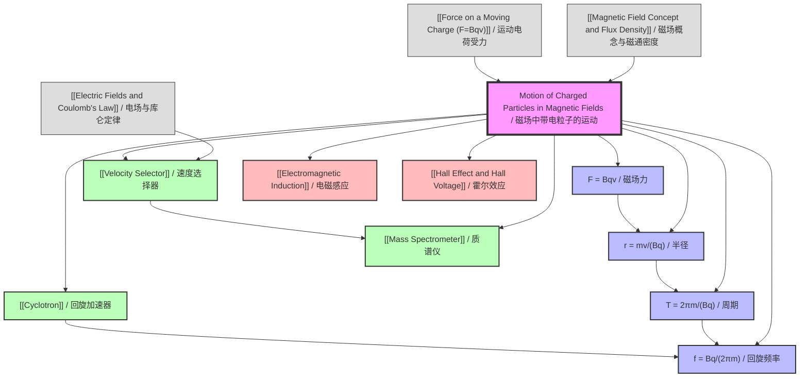

# 1. Overview / 概述

**English:**
This sub-topic explores the motion of charged particles when they enter a uniform magnetic field. When a charged particle moves perpendicular to magnetic field lines, it experiences a magnetic force that acts as a centripetal force, causing the particle to follow a circular path. This principle is fundamental to understanding particle accelerators, mass spectrometers, cyclotrons, and the aurora borealis. The key relationship $F = Bqv$ (where $F$ is the magnetic force, $B$ is magnetic flux density, $q$ is charge, and $v$ is velocity) governs the motion, leading to the derivation of the radius of curvature $r = \frac{mv}{Bq}$. This sub-topic builds on [[Magnetic Field Concept and Flux Density]] and [[Force on a Moving Charge (F=Bqv)]], and is essential for [[Electromagnetic Induction]].

**中文:**
本子知识点探讨带电粒子进入均匀磁场时的运动规律。当带电粒子垂直于磁感线运动时，会受到一个充当向心力的磁场力，使粒子沿圆形路径运动。这一原理对于理解粒子加速器、质谱仪、回旋加速器和极光等现象至关重要。关键关系式 $F = Bqv$（其中 $F$ 为磁场力，$B$ 为磁通密度，$q$ 为电荷量，$v$ 为速度）控制着运动，由此推导出曲率半径公式 $r = \frac{mv}{Bq}$。本子知识点建立在[[Magnetic Field Concept and Flux Density]]和[[Force on a Moving Charge (F=Bqv)]]的基础上，并对[[Electromagnetic Induction]]至关重要。

---

# 2. Syllabus Learning Objectives / 考纲学习目标

| CAIE 9702 | Edexcel IAL |
|-----------|-------------|
| 20.1(a): Describe the motion of a charged particle in a uniform magnetic field | WPH14 U4: 3.1: Explain the motion of charged particles in magnetic fields |
| 20.1(b): Derive and use the equation $r = \frac{mv}{Bq}$ for the radius of the circular path | WPH14 U4: 3.2: Derive and apply $r = \frac{mv}{Bq}$ |
| 20.1(c): Explain the operation of a velocity selector | WPH14 U4: 3.3: Describe the velocity selector |
| 20.1(d): Explain the operation of a mass spectrometer | WPH14 U4: 3.4: Describe the mass spectrometer |
| 20.1(e): Explain the operation of a cyclotron | WPH14 U4: 3.5: Describe the cyclotron |

**Examiner Expectations / 考官期望:**
- **English:** Students must be able to derive the radius equation from $F = Bqv = \frac{mv^2}{r}$, explain why the path is circular (force always perpendicular to velocity), and apply the equation to practical devices. For velocity selectors, students must understand the balance between electric and magnetic forces. For mass spectrometers, the key is that different masses have different radii. For cyclotrons, the concept of constant period $T = \frac{2\pi m}{Bq}$ is critical.
- **中文:** 学生必须能够从 $F = Bqv = \frac{mv^2}{r}$ 推导出半径公式，解释为什么路径是圆形的（力始终垂直于速度），并将该公式应用于实际设备。对于速度选择器，学生必须理解电场力和磁场力之间的平衡。对于质谱仪，关键在于不同质量具有不同半径。对于回旋加速器，恒定周期 $T = \frac{2\pi m}{Bq}$ 的概念至关重要。

---

# 3. Core Definitions / 核心定义

| Term (EN/CN) | Definition (EN) | Definition (CN) | Common Mistakes / 常见错误 |
|--------------|-----------------|-----------------|---------------------------|
| **Magnetic Force** / 磁场力 | The force experienced by a moving charged particle in a magnetic field, given by $F = Bqv\sin\theta$ where $\theta$ is the angle between velocity and magnetic field | 运动带电粒子在磁场中受到的力，由 $F = Bqv\sin\theta$ 给出，其中 $\theta$ 是速度与磁场之间的夹角 | Confusing with electric force; forgetting the $\sin\theta$ factor |
| **Centripetal Force** / 向心力 | The net force directed toward the center of a circular path, required for circular motion, given by $F = \frac{mv^2}{r}$ | 指向圆形路径中心的合力，是圆周运动所必需的，由 $F = \frac{mv^2}{r}$ 给出 | Thinking it's a separate force rather than the resultant of other forces |
| **Cyclotron Frequency** / 回旋频率 | The frequency of revolution of a charged particle in a uniform magnetic field, given by $f = \frac{Bq}{2\pi m}$, independent of speed | 带电粒子在均匀磁场中的旋转频率，由 $f = \frac{Bq}{2\pi m}$ 给出，与速度无关 | Confusing with angular frequency $\omega = \frac{Bq}{m}$ |
| **Velocity Selector** / 速度选择器 | A device using crossed electric and magnetic fields to select particles of a specific velocity, where $v = \frac{E}{B}$ | 使用交叉电场和磁场来选择特定速度粒子的装置，其中 $v = \frac{E}{B}$ | Forgetting that fields must be perpendicular |
| **Mass Spectrometer** / 质谱仪 | A device that separates ions by their mass-to-charge ratio using magnetic fields, where $r \propto \sqrt{m}$ for constant velocity | 使用磁场按质荷比分离离子的装置，其中对于恒定速度，$r \propto \sqrt{m}$ | Confusing with velocity selector function |

---

# 4. Key Concepts Explained / 关键概念详解

## 4.1 Circular Motion of Charged Particles / 带电粒子的圆周运动

### Explanation / 解释
**English:** When a charged particle enters a uniform magnetic field perpendicular to the field lines ($\theta = 90^\circ$), the magnetic force $F = Bqv$ acts perpendicular to both the velocity and the magnetic field (Fleming's left-hand rule). Since this force is always perpendicular to the velocity, it does no work (speed remains constant) but changes the direction of motion. This force acts as a centripetal force, causing the particle to move in a circular path. The radius of this path is found by equating the magnetic force to the centripetal force: $Bqv = \frac{mv^2}{r}$, giving $r = \frac{mv}{Bq}$. The period of revolution $T = \frac{2\pi r}{v} = \frac{2\pi m}{Bq}$ is independent of speed, which is the key principle behind the [[cyclotron]].

**中文:** 当带电粒子垂直于磁感线（$\theta = 90^\circ$）进入均匀磁场时，磁场力 $F = Bqv$ 垂直于速度和磁场（弗莱明左手定则）。由于该力始终垂直于速度，因此不做功（速度保持不变），但会改变运动方向。该力充当向心力，使粒子沿圆形路径运动。该路径的半径通过将磁场力等于向心力求得：$Bqv = \frac{mv^2}{r}$，得到 $r = \frac{mv}{Bq}$。旋转周期 $T = \frac{2\pi r}{v} = \frac{2\pi m}{Bq}$ 与速度无关，这是[[回旋加速器]]背后的关键原理。

### Physical Meaning / 物理意义
**English:** The magnetic force provides the centripetal acceleration needed for circular motion. A stronger magnetic field ($B$ larger) or larger charge ($q$ larger) means a tighter curve (smaller $r$). A larger mass ($m$ larger) or higher speed ($v$ larger) means a wider curve (larger $r$). The independence of period from speed means that faster particles take the same time to complete one revolution as slower ones, but travel in larger circles.

**中文:** 磁场力提供圆周运动所需的向心加速度。更强的磁场（$B$ 更大）或更大的电荷（$q$ 更大）意味着更紧密的曲线（$r$ 更小）。更大的质量（$m$ 更大）或更高的速度（$v$ 更大）意味着更宽的曲线（$r$ 更大）。周期与速度无关意味着较快的粒子与较慢的粒子完成一次旋转所需的时间相同，但会在更大的圆中运动。

### Common Misconceptions / 常见误区
- **English:** 
  - Thinking the magnetic force does work (it doesn't — it's always perpendicular to displacement)
  - Confusing the direction of force for positive vs. negative charges (use Fleming's left-hand rule for positive, reverse for negative)
  - Believing the period depends on speed (it doesn't — $T = \frac{2\pi m}{Bq}$)
  - Forgetting that if velocity is not perpendicular to the field, the path becomes helical
- **中文:**
  - 认为磁场力做功（它不做功——始终垂直于位移）
  - 混淆正电荷和负电荷的受力方向（正电荷使用弗莱明左手定则，负电荷反向）
  - 认为周期取决于速度（不取决于——$T = \frac{2\pi m}{Bq}$）
  - 忘记如果速度不垂直于磁场，路径会变成螺旋形

### Exam Tips / 考试提示
- **English:** Always draw the circular path and indicate the center of the circle. Show the magnetic force vector pointing toward the center. For velocity selectors, remember that electric and magnetic forces must be equal and opposite. For mass spectrometers, the radius is proportional to $\sqrt{m}$ if all particles have the same kinetic energy.
- **中文:** 始终画出圆形路径并标出圆心。显示指向圆心的磁场力矢量。对于速度选择器，记住电场力和磁场力必须大小相等、方向相反。对于质谱仪，如果所有粒子具有相同的动能，则半径与 $\sqrt{m}$ 成正比。

> 📷 **IMAGE PROMPT — DIAGRAM-01: Charged Particle Circular Motion in Magnetic Field**
> A clear physics diagram showing a positive charge (red circle with +) moving in a circular path within a uniform magnetic field (blue dots representing field lines coming out of the page). Show the velocity vector (v) tangent to the circle, the magnetic force vector (F) pointing toward the center, and label the radius (r). Include Fleming's left-hand rule illustration in the corner. Clean, educational style with arrows and labels.

---

## 4.2 Velocity Selector / 速度选择器

### Explanation / 解释
**English:** A velocity selector uses crossed (perpendicular) electric and magnetic fields to allow only particles with a specific velocity to pass through undeflected. The electric field exerts a force $F_E = qE$ in one direction, while the magnetic field exerts a force $F_B = Bqv$ in the opposite direction. When these forces balance: $qE = Bqv$, giving $v = \frac{E}{B}$. Only particles with this velocity pass straight through; others are deflected and hit the walls. This device is used in [[mass spectrometers]] and other particle analysis equipment.

**中文:** 速度选择器使用交叉（垂直）的电场和磁场，只允许具有特定速度的粒子无偏转地通过。电场施加一个方向的力 $F_E = qE$，而磁场施加相反方向的力 $F_B = Bqv$。当这些力平衡时：$qE = Bqv$，得到 $v = \frac{E}{B}$。只有具有该速度的粒子直线通过；其他粒子会被偏转并撞击器壁。该装置用于[[质谱仪]]和其他粒子分析设备。

### Physical Meaning / 物理意义
**English:** The velocity selector acts as a velocity filter. By adjusting the electric field strength $E$ or magnetic field strength $B$, different velocities can be selected. The selected velocity is independent of the particle's mass and charge — only the ratio $E/B$ matters. This is because both forces are proportional to charge $q$, so $q$ cancels out.

**中文:** 速度选择器充当速度过滤器。通过调整电场强度 $E$ 或磁场强度 $B$，可以选择不同的速度。所选速度与粒子的质量和电荷无关——只有比值 $E/B$ 重要。这是因为两个力都与电荷 $q$ 成正比，所以 $q$ 被抵消了。

### Common Misconceptions / 常见误区
- **English:**
  - Thinking the velocity depends on particle mass (it doesn't — $v = E/B$ is mass-independent)
  - Forgetting that the electric and magnetic fields must be perpendicular
  - Confusing the direction of electric force (always along the field) with magnetic force (perpendicular to both velocity and field)
- **中文:**
  - 认为速度取决于粒子质量（不取决于——$v = E/B$ 与质量无关）
  - 忘记电场和磁场必须垂直
  - 混淆电场力方向（始终沿电场方向）和磁场力方向（垂直于速度和磁场）

### Exam Tips / 考试提示
- **English:** Draw a diagram showing the electric field plates (parallel plates) and magnetic field (into or out of page). Show the forces on a positive charge. Remember that for a negative charge, both forces reverse direction, so the condition $v = E/B$ still holds.
- **中文:** 画出显示电场板（平行板）和磁场（进入或穿出页面）的示意图。显示正电荷上的力。记住对于负电荷，两个力都反向，所以条件 $v = E/B$ 仍然成立。

> 📷 **IMAGE PROMPT — DIAGRAM-02: Velocity Selector**
> A physics diagram of a velocity selector with two parallel plates (top positive, bottom negative) creating a downward electric field E. Magnetic field B is shown as dots (coming out of page). A positive charge enters from the left with velocity v. Show electric force FE downward and magnetic force FB upward. Label the undeflected path for v = E/B and deflected paths for other velocities. Clean educational style.

---

## 4.3 Mass Spectrometer / 质谱仪

### Explanation / 解释
**English:** A mass spectrometer separates ions based on their mass-to-charge ratio ($m/q$). Ions are first accelerated through a known potential difference $V$, gaining kinetic energy $qV = \frac{1}{2}mv^2$. They then enter a velocity selector (or are accelerated to a known velocity) before entering a uniform magnetic field region where they follow circular paths. The radius $r = \frac{mv}{Bq}$ is measured. Since $v$ is known (from acceleration or velocity selector), $m/q$ can be determined. For ions with the same charge, heavier ions have larger radii. This technique is used in chemistry to identify isotopes and in medicine for [[MRI]] and [[PET scans]].

**中文:** 质谱仪根据离子的质荷比（$m/q$）分离离子。离子首先通过已知电势差 $V$ 加速，获得动能 $qV = \frac{1}{2}mv^2$。然后它们进入速度选择器（或被加速到已知速度），然后进入均匀磁场区域，在那里沿圆形路径运动。测量半径 $r = \frac{mv}{Bq}$。由于 $v$ 已知（来自加速或速度选择器），可以确定 $m/q$。对于具有相同电荷的离子，较重的离子具有较大的半径。该技术用于化学中识别同位素，以及医学中的[[MRI]]和[[PET扫描]]。

### Physical Meaning / 物理意义
**English:** The mass spectrometer exploits the fact that different masses have different radii of curvature in a magnetic field. By measuring the radius, the mass can be calculated. The resolution of the instrument depends on how precisely the radius can be measured and how uniform the magnetic field is.

**中文:** 质谱仪利用了不同质量在磁场中具有不同曲率半径这一事实。通过测量半径，可以计算质量。仪器的分辨率取决于半径测量的精确度以及磁场的均匀性。

### Common Misconceptions / 常见误区
- **English:**
  - Thinking the velocity selector is part of all mass spectrometers (some use time-of-flight instead)
  - Confusing the order: acceleration → velocity selection → magnetic deflection
  - Forgetting that the radius depends on $\sqrt{m}$ when ions are accelerated through the same potential difference
- **中文:**
  - 认为速度选择器是所有质谱仪的一部分（有些使用飞行时间法代替）
  - 混淆顺序：加速 → 速度选择 → 磁场偏转
  - 忘记当离子通过相同电势差加速时，半径取决于 $\sqrt{m}$

### Exam Tips / 考试提示
- **English:** For CAIE, be able to derive $r = \frac{1}{B}\sqrt{\frac{2mV}{q}}$ by combining $qV = \frac{1}{2}mv^2$ and $r = \frac{mv}{Bq}$. For Edexcel, focus on the velocity selector and the circular motion in the magnetic field.
- **中文:** 对于CAIE，能够通过结合 $qV = \frac{1}{2}mv^2$ 和 $r = \frac{mv}{Bq}$ 推导出 $r = \frac{1}{B}\sqrt{\frac{2mV}{q}}$。对于Edexcel，重点关注速度选择器和磁场中的圆周运动。

> 📷 **IMAGE PROMPT — DIAGRAM-03: Mass Spectrometer**
> A schematic diagram of a mass spectrometer showing: ion source (with sample inlet), acceleration plates with voltage V, velocity selector (crossed E and B fields), then a magnetic deflection chamber with curved paths of different radii for different masses. Label the detector at the end. Show three paths: light ions (small r), medium ions (medium r), heavy ions (large r). Clean educational style.

---

## 4.4 Cyclotron / 回旋加速器

### Explanation / 解释
**English:** A cyclotron is a particle accelerator that uses a combination of a uniform magnetic field and an alternating electric field to accelerate charged particles to high speeds. Two hollow D-shaped electrodes (called "dees") are placed in a uniform magnetic field. An alternating voltage is applied between the dees. As particles spiral outward, they cross the gap between dees each half-cycle, gaining energy from the electric field. The key principle is that the cyclotron frequency $f = \frac{Bq}{2\pi m}$ is constant, so the alternating voltage can be tuned to this frequency. As particles gain speed, their radius increases ($r = \frac{mv}{Bq}$), but their period remains constant. This allows continuous acceleration until the particles reach the desired energy and are extracted.

**中文:** 回旋加速器是一种粒子加速器，它使用均匀磁场和交变电场的组合将带电粒子加速到高速。两个中空的D形电极（称为"D形盒"）放置在均匀磁场中。在D形盒之间施加交变电压。当粒子向外螺旋运动时，它们每半个周期穿过D形盒之间的间隙，从电场中获得能量。关键原理是回旋频率 $f = \frac{Bq}{2\pi m}$ 是恒定的，因此交变电压可以调谐到该频率。随着粒子速度增加，它们的半径增加（$r = \frac{mv}{Bq}$），但周期保持不变。这使得可以连续加速，直到粒子达到所需能量并被提取出来。

### Physical Meaning / 物理意义
**English:** The cyclotron exploits the fact that the period of revolution in a magnetic field is independent of speed. This means that even as particles accelerate, they always arrive at the gap at the right time to be accelerated further. The maximum energy is limited by the radius of the dees and the magnetic field strength: $E_{max} = \frac{B^2 q^2 r_{max}^2}{2m}$.

**中文:** 回旋加速器利用了在磁场中旋转周期与速度无关这一事实。这意味着即使粒子加速，它们总是在正确的时间到达间隙以进一步加速。最大能量受D形盒半径和磁场强度的限制：$E_{max} = \frac{B^2 q^2 r_{max}^2}{2m}$。

### Common Misconceptions / 常见误区
- **English:**
  - Thinking the electric field accelerates the particles continuously (it only accelerates when crossing the gap)
  - Believing the magnetic field accelerates the particles (it only changes direction, not speed)
  - Forgetting that the alternating voltage must be at the cyclotron frequency
  - Confusing the role of the dees (magnetic shielding) with the acceleration gap
- **中文:**
  - 认为电场连续加速粒子（只在穿过间隙时加速）
  - 认为磁场加速粒子（它只改变方向，不改变速度）
  - 忘记交变电压必须在回旋频率下
  - 混淆D形盒的作用（磁屏蔽）和加速间隙

### Exam Tips / 考试提示
- **English:** Be able to derive the cyclotron frequency from $T = \frac{2\pi m}{Bq}$. Understand why relativistic effects limit cyclotrons (mass increases at high speeds, changing the frequency). Know that synchrotrons are used for very high energies.
- **中文:** 能够从 $T = \frac{2\pi m}{Bq}$ 推导出回旋频率。理解为什么相对论效应限制了回旋加速器（高速时质量增加，改变频率）。知道同步加速器用于非常高的能量。

> 📷 **IMAGE PROMPT — DIAGRAM-04: Cyclotron**
> A top-view diagram of a cyclotron showing two D-shaped dees (labeled D1 and D2) with a gap between them. Show the uniform magnetic field B coming out of the page (dots). Draw a spiral path of a positively charged particle starting from the center, crossing the gap multiple times. Indicate the alternating voltage source connected to the dees. Label the radius increasing as the particle spirals outward. Clean educational style.

---

# 5. Essential Equations / 核心公式

## 5.1 Magnetic Force on Moving Charge / 运动电荷所受磁场力

$$ F = Bqv \sin \theta $$

| Symbol (符号) | Meaning (EN) | Meaning (CN) | Unit (单位) |
|--------------|-------------|-------------|------------|
| $F$ | Magnetic force | 磁场力 | N |
| $B$ | Magnetic flux density | 磁通密度 | T |
| $q$ | Charge of particle | 粒子电荷量 | C |
| $v$ | Speed of particle | 粒子速度 | m s$^{-1}$ |
| $\theta$ | Angle between v and B | v与B之间的夹角 | degrees or rad |

**Conditions / 适用条件:** Particle must be moving; force is maximum when $\theta = 90^\circ$, zero when $\theta = 0^\circ$ or $180^\circ$.
**Limitations / 局限性:** Only valid for non-relativistic speeds; at high speeds, relativistic mass increase must be considered.

## 5.2 Radius of Circular Path / 圆形路径半径

$$ r = \frac{mv}{Bq} $$

| Symbol (符号) | Meaning (EN) | Meaning (CN) | Unit (单位) |
|--------------|-------------|-------------|------------|
| $r$ | Radius of circular path | 圆形路径半径 | m |
| $m$ | Mass of particle | 粒子质量 | kg |
| $v$ | Speed of particle | 粒子速度 | m s$^{-1}$ |
| $B$ | Magnetic flux density | 磁通密度 | T |
| $q$ | Charge of particle | 粒子电荷量 | C |

**Derivation / 推导:** Equate magnetic force to centripetal force: $Bqv = \frac{mv^2}{r}$, rearrange for $r$.
**Conditions / 适用条件:** Velocity must be perpendicular to magnetic field ($\theta = 90^\circ$).
**Limitations / 局限性:** Assumes uniform magnetic field; assumes no other forces acting.

## 5.3 Period of Revolution / 旋转周期

$$ T = \frac{2\pi m}{Bq} $$

| Symbol (符号) | Meaning (EN) | Meaning (CN) | Unit (单位) |
|--------------|-------------|-------------|------------|
| $T$ | Period of revolution | 旋转周期 | s |
| $m$ | Mass of particle | 粒子质量 | kg |
| $B$ | Magnetic flux density | 磁通密度 | T |
| $q$ | Charge of particle | 粒子电荷量 | C |

**Derivation / 推导:** $T = \frac{2\pi r}{v} = \frac{2\pi}{v} \cdot \frac{mv}{Bq} = \frac{2\pi m}{Bq}$.
**Conditions / 适用条件:** Uniform magnetic field; velocity perpendicular to field.
**Limitations / 局限性:** Period is independent of speed and radius; this is the key principle for cyclotrons.

## 5.4 Cyclotron Frequency / 回旋频率

$$ f = \frac{1}{T} = \frac{Bq}{2\pi m} $$

| Symbol (符号) | Meaning (EN) | Meaning (CN) | Unit (单位) |
|--------------|-------------|-------------|------------|
| $f$ | Cyclotron frequency | 回旋频率 | Hz |
| $B$ | Magnetic flux density | 磁通密度 | T |
| $q$ | Charge of particle | 粒子电荷量 | C |
| $m$ | Mass of particle | 粒子质量 | kg |

**Conditions / 适用条件:** The alternating voltage must be applied at this frequency for continuous acceleration.
**Limitations / 局限性:** At relativistic speeds, mass increases, so frequency changes — synchrotrons compensate for this.

## 5.5 Velocity Selector Condition / 速度选择器条件

$$ v = \frac{E}{B} $$

| Symbol (符号) | Meaning (EN) | Meaning (CN) | Unit (单位) |
|--------------|-------------|-------------|------------|
| $v$ | Selected velocity | 选择的速度 | m s$^{-1}$ |
| $E$ | Electric field strength | 电场强度 | N C$^{-1}$ or V m$^{-1}$ |
| $B$ | Magnetic flux density | 磁通密度 | T |

**Derivation / 推导:** Balance electric and magnetic forces: $qE = Bqv$, cancel $q$.
**Conditions / 适用条件:** Electric and magnetic fields must be perpendicular; forces must be opposite.
**Limitations / 局限性:** Only selects one velocity; particles with other velocities are deflected.

## 5.6 Mass Spectrometer Radius (with acceleration) / 质谱仪半径（含加速）

$$ r = \frac{1}{B}\sqrt{\frac{2mV}{q}} $$

| Symbol (符号) | Meaning (EN) | Meaning (CN) | Unit (单位) |
|--------------|-------------|-------------|------------|
| $r$ | Radius of path | 路径半径 | m |
| $B$ | Magnetic flux density | 磁通密度 | T |
| $m$ | Mass of ion | 离子质量 | kg |
| $V$ | Accelerating potential difference | 加速电势差 | V |
| $q$ | Charge of ion | 离子电荷量 | C |

**Derivation / 推导:** Combine $qV = \frac{1}{2}mv^2$ and $r = \frac{mv}{Bq}$.
**Conditions / 适用条件:** Ions start from rest; all kinetic energy comes from electric potential energy.
**Limitations / 局限性:** Assumes non-relativistic speeds; assumes uniform magnetic field.

> 📋 **CAIE Only:** Students must be able to derive $r = \frac{1}{B}\sqrt{\frac{2mV}{q}}$ and use it in mass spectrometer calculations.

> 📋 **Edexcel Only:** Focus on the velocity selector condition $v = E/B$ and the circular motion equations.

---

# 6. Graphs and Relationships / 图表与关系

## 6.1 Radius vs. Speed / 半径与速度关系

### Axes / 坐标轴
- **X-axis:** Speed $v$ (m s$^{-1}$) / 速度 $v$ (m s$^{-1}$)
- **Y-axis:** Radius $r$ (m) / 半径 $r$ (m)

### Shape / 形状
**English:** A straight line through the origin with gradient $\frac{m}{Bq}$. This shows that radius is directly proportional to speed for a given particle in a given magnetic field.
**中文:** 一条通过原点的直线，斜率为 $\frac{m}{Bq}$。这表明对于给定磁场中的给定粒子，半径与速度成正比。

### Gradient Meaning / 斜率含义
**English:** The gradient $\frac{m}{Bq}$ represents the mass-to-charge ratio divided by the magnetic field strength. A steeper gradient means larger mass or smaller charge or weaker field.
**中文:** 斜率 $\frac{m}{Bq}$ 表示质荷比除以磁场强度。更陡的斜率意味着更大的质量、更小的电荷或更弱的磁场。

### Area Meaning / 面积含义
**English:** No meaningful area under this graph.
**中文:** 该图没有有意义的面积。

### Exam Interpretation / 考试解读
**English:** If asked to sketch this graph, remember it's linear through origin. If asked to compare two particles, the one with larger $m/q$ has a steeper line.
**中文:** 如果要求画出该图，记住它是通过原点的直线。如果要求比较两个粒子，$m/q$ 较大的粒子具有更陡的线。

## 6.2 Radius vs. 1/B / 半径与1/B关系

### Axes / 坐标轴
- **X-axis:** $1/B$ (T$^{-1}$) / $1/B$ (T$^{-1}$)
- **Y-axis:** Radius $r$ (m) / 半径 $r$ (m)

### Shape / 形状
**English:** A straight line through the origin with gradient $\frac{mv}{q}$. This shows that radius is inversely proportional to magnetic flux density.
**中文:** 一条通过原点的直线，斜率为 $\frac{mv}{q}$。这表明半径与磁通密度成反比。

### Gradient Meaning / 斜率含义
**English:** The gradient $\frac{mv}{q}$ represents momentum divided by charge. A steeper gradient means larger momentum or smaller charge.
**中文:** 斜率 $\frac{mv}{q}$ 表示动量除以电荷。更陡的斜率意味着更大的动量或更小的电荷。

### Area Meaning / 面积含义
**English:** No meaningful area under this graph.
**中文:** 该图没有有意义的面积。

### Exam Interpretation / 考试解读
**English:** This graph is useful for determining the momentum of a particle if charge is known, or vice versa.
**中文:** 该图对于在已知电荷的情况下确定粒子的动量，或反之，非常有用。

## 6.3 Period vs. Speed / 周期与速度关系

### Axes / 坐标轴
- **X-axis:** Speed $v$ (m s$^{-1}$) / 速度 $v$ (m s$^{-1}$)
- **Y-axis:** Period $T$ (s) / 周期 $T$ (s)

### Shape / 形状
**English:** A horizontal line (constant). This shows that period is independent of speed for a given particle in a uniform magnetic field.
**中文:** 一条水平线（常数）。这表明对于均匀磁场中的给定粒子，周期与速度无关。

### Gradient Meaning / 斜率含义
**English:** Zero gradient — period does not change with speed.
**中文:** 零斜率——周期不随速度变化。

### Area Meaning / 面积含义
**English:** No meaningful area under this graph.
**中文:** 该图没有有意义的面积。

### Exam Interpretation / 考试解读
**English:** This is the key principle of the cyclotron. Even as particles accelerate, their period remains constant, so the alternating voltage can be tuned to a fixed frequency.
**中文:** 这是回旋加速器的关键原理。即使粒子加速，它们的周期保持不变，因此交变电压可以调谐到固定频率。

---

# 7. Required Diagrams / 必备图表

## 7.1 Circular Path of a Charged Particle in a Magnetic Field / 磁场中带电粒子的圆形路径

### Description / 描述
**English:** A diagram showing a positively charged particle moving in a circular path within a uniform magnetic field directed into or out of the page. The velocity vector is tangent to the circle, and the magnetic force vector points toward the center. The radius $r$ is labeled.
**中文:** 一个显示正电荷在指向页面内或外的均匀磁场中沿圆形路径运动的示意图。速度矢量与圆相切，磁场力矢量指向圆心。标出半径 $r$。

### Image Prompt / 图片生成提示
> 📷 **IMAGE PROMPT — DIAGRAM-01: Charged Particle Circular Motion**
> A clear physics diagram showing a positive charge (red circle with +) moving in a circular path within a uniform magnetic field (blue dots representing field lines coming out of the page). Show the velocity vector (v) tangent to the circle, the magnetic force vector (F) pointing toward the center, and label the radius (r). Include Fleming's left-hand rule illustration in the corner. Clean, educational style with arrows and labels.

### Labels Required / 需要标注
- **English:** $+q$ (charge), $v$ (velocity vector), $F$ (magnetic force vector), $r$ (radius), $B$ (magnetic field direction), center of circle
- **中文:** $+q$（电荷），$v$（速度矢量），$F$（磁场力矢量），$r$（半径），$B$（磁场方向），圆心

### Exam Importance / 考试重要性
**English:** Essential for explaining why the path is circular. Students must be able to draw this and explain that the force is always perpendicular to velocity.
**中文:** 对于解释为什么路径是圆形至关重要。学生必须能够画出这个图并解释力始终垂直于速度。

## 7.2 Velocity Selector / 速度选择器

### Description / 描述
**English:** A diagram showing two parallel plates creating a uniform electric field, with a uniform magnetic field perpendicular to both the electric field and the particle velocity. A particle with velocity $v = E/B$ passes straight through; others are deflected.
**中文:** 一个显示两个平行板产生均匀电场，均匀磁场垂直于电场和粒子速度的示意图。速度为 $v = E/B$ 的粒子直线通过；其他粒子被偏转。

### Image Prompt / 图片生成提示
> 📷 **IMAGE PROMPT — DIAGRAM-02: Velocity Selector**
> A physics diagram of a velocity selector with two parallel plates (top positive, bottom negative) creating a downward electric field E. Magnetic field B is shown as dots (coming out of page). A positive charge enters from the left with velocity v. Show electric force FE downward and magnetic force FB upward. Label the undeflected path for v = E/B and deflected paths for other velocities. Clean educational style.

### Labels Required / 需要标注
- **English:** $+$ and $-$ plates, $E$ (electric field), $B$ (magnetic field), $F_E$ (electric force), $F_B$ (magnetic force), $v$ (velocity), undeflected path, deflected paths
- **中文:** $+$ 和 $-$ 板，$E$（电场），$B$（磁场），$F_E$（电场力），$F_B$（磁场力），$v$（速度），无偏转路径，偏转路径

### Exam Importance / 考试重要性
**English:** Frequently tested in both CAIE and Edexcel. Students must be able to explain the force balance and derive $v = E/B$.
**中文:** 在CAIE和Edexcel中经常考到。学生必须能够解释力的平衡并推导出 $v = E/B$。

## 7.3 Mass Spectrometer / 质谱仪

### Description / 描述
**English:** A schematic showing the ion source, acceleration region, velocity selector (optional), magnetic deflection chamber, and detector. Different masses follow paths of different radii.
**中文:** 一个示意图，显示离子源、加速区域、速度选择器（可选）、磁场偏转室和检测器。不同质量沿不同半径的路径运动。

### Image Prompt / 图片生成提示
> 📷 **IMAGE PROMPT — DIAGRAM-03: Mass Spectrometer**
> A schematic diagram of a mass spectrometer showing: ion source (with sample inlet), acceleration plates with voltage V, velocity selector (crossed E and B fields), then a magnetic deflection chamber with curved paths of different radii for different masses. Label the detector at the end. Show three paths: light ions (small r), medium ions (medium r), heavy ions (large r). Clean educational style.

### Labels Required / 需要标注
- **English:** Ion source, accelerator ($V$), velocity selector ($E$, $B_1$), deflection chamber ($B_2$), detector, paths for $m_1$, $m_2$, $m_3$
- **中文:** 离子源，加速器（$V$），速度选择器（$E$，$B_1$），偏转室（$B_2$），检测器，$m_1$、$m_2$、$m_3$ 的路径

### Exam Importance / 考试重要性
**English:** CAIE and Edexcel both test mass spectrometers. Students must understand the sequence and the physics at each stage.
**中文:** CAIE和Edexcel都考质谱仪。学生必须理解每个阶段的顺序和物理原理。

## 7.4 Cyclotron / 回旋加速器

### Description / 描述
**English:** A top-view diagram showing two D-shaped dees with a gap between them, a uniform magnetic field perpendicular to the plane, and an alternating voltage source connected to the dees. A spiral path shows the particle's trajectory.
**中文:** 一个俯视图，显示两个D形盒，它们之间有间隙，均匀磁场垂直于平面，交变电压源连接到D形盒。螺旋路径显示粒子的轨迹。

### Image Prompt / 图片生成提示
> 📷 **IMAGE PROMPT — DIAGRAM-04: Cyclotron**
> A top-view diagram of a cyclotron showing two D-shaped dees (labeled D1 and D2) with a gap between them. Show the uniform magnetic field B coming out of the page (dots). Draw a spiral path of a positively charged particle starting from the center, crossing the gap multiple times. Indicate the alternating voltage source connected to the dees. Label the radius increasing as the particle spirals outward. Clean educational style.

### Labels Required / 需要标注
- **English:** Dees (D1, D2), gap, $B$ (magnetic field), alternating voltage source, spiral path, particle source (center), extraction point
- **中文:** D形盒（D1，D2），间隙，$B$（磁场），交变电压源，螺旋路径，粒子源（中心），提取点

### Exam Importance / 考试重要性
**English:** CAIE and Edexcel both test cyclotrons. Students must explain why the period is constant and how the alternating voltage is synchronized.
**中文:** CAIE和Edexcel都考回旋加速器。学生必须解释为什么周期恒定以及交变电压如何同步。

---

# 8. Worked Examples / 典型例题

## Example 1: Proton in a Magnetic Field / 磁场中的质子

### Question / 题目
**English:** A proton ($m = 1.67 \times 10^{-27}$ kg, $q = 1.60 \times 10^{-19}$ C) enters a uniform magnetic field of flux density 0.50 T at a speed of $2.0 \times 10^6$ m s$^{-1}$, perpendicular to the field lines. Calculate:
(a) The magnetic force on the proton
(b) The radius of its circular path
(c) The period of revolution
(d) The cyclotron frequency

**中文:** 一个质子（$m = 1.67 \times 10^{-27}$ kg，$q = 1.60 \times 10^{-19}$ C）以 $2.0 \times 10^6$ m s$^{-1}$ 的速度垂直于磁感线进入磁通密度为 0.50 T 的均匀磁场。计算：
(a) 质子所受的磁场力
(b) 其圆形路径的半径
(c) 旋转周期
(d) 回旋频率

### Solution / 解答

**(a) Magnetic Force / 磁场力**

$$ F = Bqv = (0.50)(1.60 \times 10^{-19})(2.0 \times 10^6) $$

$$ F = 1.60 \times 10^{-13} \text{ N} $$

**(b) Radius / 半径**

$$ r = \frac{mv}{Bq} = \frac{(1.67 \times 10^{-27})(2.0 \times 10^6)}{(0.50)(1.60 \times 10^{-19})} $$

$$ r = \frac{3.34 \times 10^{-21}}{8.0 \times 10^{-20}} = 4.18 \times 10^{-2} \text{ m} = 4.18 \text{ cm} $$

**(c) Period / 周期**

$$ T = \frac{2\pi m}{Bq} = \frac{2\pi (1.67 \times 10^{-27})}{(0.50)(1.60 \times 10^{-19})} $$

$$ T = \frac{1.05 \times 10^{-26}}{8.0 \times 10^{-20}} = 1.31 \times 10^{-7} \text{ s} $$

**(d) Cyclotron Frequency / 回旋频率**

$$ f = \frac{1}{T} = \frac{1}{1.31 \times 10^{-7}} = 7.63 \times 10^6 \text{ Hz} = 7.63 \text{ MHz} $$

### Final Answer / 最终答案
**Answer:** (a) $1.60 \times 10^{-13}$ N, (b) 4.18 cm, (c) $1.31 \times 10^{-7}$ s, (d) 7.63 MHz
**答案：** (a) $1.60 \times 10^{-13}$ N，(b) 4.18 cm，(c) $1.31 \times 10^{-7}$ s，(d) 7.63 MHz

### Quick Tip / 提示
**English:** Always check units: $B$ in T, $q$ in C, $v$ in m s$^{-1}$, $m$ in kg. The radius is often in cm for typical values. Remember that period is independent of speed — if the proton were faster, the radius would be larger but the period would be the same.
**中文:** 始终检查单位：$B$ 以 T 为单位，$q$ 以 C 为单位，$v$ 以 m s$^{-1}$ 为单位，$m$ 以 kg 为单位。对于典型值，半径通常以 cm 为单位。记住周期与速度无关——如果质子更快，半径会更大，但周期相同。

---

## Example 2: Mass Spectrometer / 质谱仪

### Question / 题目
**English:** In a mass spectrometer, singly charged ions of two isotopes of neon, $^{20}\text{Ne}^+$ and $^{22}\text{Ne}^+$, are accelerated through a potential difference of 500 V. They then enter a uniform magnetic field of 0.20 T perpendicular to their velocity. Calculate:
(a) The speed of each ion after acceleration
(b) The radius of the path for each isotope
(c) The separation between the two isotopes at the detector

Given: $m(^{20}\text{Ne}) = 3.32 \times 10^{-26}$ kg, $m(^{22}\text{Ne}) = 3.65 \times 10^{-26}$ kg, $e = 1.60 \times 10^{-19}$ C

**中文:** 在质谱仪中，氖的两种同位素 $^{20}\text{Ne}^+$ 和 $^{22}\text{Ne}^+$ 的单电荷离子通过 500 V 的电势差加速。然后它们进入垂直于速度的 0.20 T 均匀磁场。计算：
(a) 加速后每种离子的速度
(b) 每种同位素路径的半径
(c) 两种同位素在检测器处的分离距离

已知：$m(^{20}\text{Ne}) = 3.32 \times 10^{-26}$ kg，$m(^{22}\text{Ne}) = 3.65 \times 10^{-26}$ kg，$e = 1.60 \times 10^{-19}$ C

### Solution / 解答

**(a) Speed after acceleration / 加速后的速度**

Using $qV = \frac{1}{2}mv^2$:

$$ v = \sqrt{\frac{2qV}{m}} $$

For $^{20}\text{Ne}^+$:
$$ v_{20} = \sqrt{\frac{2(1.60 \times 10^{-19})(500)}{3.32 \times 10^{-26}}} = \sqrt{\frac{1.60 \times 10^{-16}}{3.32 \times 10^{-26}}} = \sqrt{4.82 \times 10^9} = 6.94 \times 10^4 \text{ m s}^{-1} $$

For $^{22}\text{Ne}^+$:
$$ v_{22} = \sqrt{\frac{2(1.60 \times 10^{-19})(500)}{3.65 \times 10^{-26}}} = \sqrt{\frac{1.60 \times 10^{-16}}{3.65 \times 10^{-26}}} = \sqrt{4.38 \times 10^9} = 6.62 \times 10^4 \text{ m s}^{-1} $$

**(b) Radius of path / 路径半径**

Using $r = \frac{mv}{Bq}$:

For $^{20}\text{Ne}^+$:
$$ r_{20} = \frac{(3.32 \times 10^{-26})(6.94 \times 10^4)}{(0.20)(1.60 \times 10^{-19})} = \frac{2.30 \times 10^{-21}}{3.20 \times 10^{-20}} = 0.0719 \text{ m} = 7.19 \text{ cm} $$

For $^{22}\text{Ne}^+$:
$$ r_{22} = \frac{(3.65 \times 10^{-26})(6.62 \times 10^4)}{(0.20)(1.60 \times 10^{-19})} = \frac{2.42 \times 10^{-21}}{3.20 \times 10^{-20}} = 0.0756 \text{ m} = 7.56 \text{ cm} $$

**(c) Separation at detector / 检测器处的分离距离**

The ions travel in semicircles (180° deflection), so the separation is the difference in diameters:
$$ \text{Separation} = 2r_{22} - 2r_{20} = 2(0.0756 - 0.0719) = 2(0.0037) = 0.0074 \text{ m} = 7.4 \text{ mm} $$

### Final Answer / 最终答案
**Answer:** (a) $v_{20} = 6.94 \times 10^4$ m s$^{-1}$, $v_{22} = 6.62 \times 10^4$ m s$^{-1}$; (b) $r_{20} = 7.19$ cm, $r_{22} = 7.56$ cm; (c) 7.4 mm
**答案：** (a) $v_{20} = 6.94 \times 10^4$ m s$^{-1}$，$v_{22} = 6.62 \times 10^4$ m s$^{-1}$；(b) $r_{20} = 7.19$ cm，$r_{22} = 7.56$ cm；(c) 7.4 mm

### Quick Tip / 提示
**English:** Notice that the heavier isotope has a larger radius. The separation at the detector is the difference in diameters (2r) because the ions are deflected through 180°. Alternatively, you can use the combined formula $r = \frac{1}{B}\sqrt{\frac{2mV}{q}}$ to find the radius directly.
**中文:** 注意较重的同位素具有较大的半径。检测器处的分离距离是直径差（2r），因为离子被偏转180°。或者，可以使用组合公式 $r = \frac{1}{B}\sqrt{\frac{2mV}{q}}$ 直接求出半径。

---

# 9. Past Paper Question Types / 历年真题题型

| Question Type / 题型 | Frequency / 频率 | Difficulty / 难度 | Past Paper References / 真题索引 |
|----------------------|------------------|------------------|-------------------------------|
| Calculate radius/period/frequency from given values | High | Easy | 📝 *待填入* |
| Derive $r = mv/Bq$ from $F = Bqv$ and centripetal force | High | Medium | 📝 *待填入* |
| Explain why path is circular | Medium | Easy | 📝 *待填入* |
| Velocity selector: find $v$ from $E$ and $B$ | Medium | Medium | 📝 *待填入* |
| Mass spectrometer: find mass from radius | Medium | Medium | 📝 *待填入* |
| Cyclotron: explain operation and derive frequency | Medium | Hard | 📝 *待填入* |
| Compare paths of different particles (mass, charge, speed) | Medium | Medium | 📝 *待填入* |
| Graph interpretation: $r$ vs $v$, $r$ vs $1/B$ | Low | Medium | 📝 *待填入* |

**Common Command Words / 常见指令词:**
- **English:** Calculate, Derive, Explain, Describe, Sketch, Compare, Determine, Show that
- **中文:** 计算，推导，解释，描述，画出，比较，确定，证明

---

# 10. Practical Skills Connections / 实验技能链接

**English:**
This sub-topic connects to practical work in several ways:

1. **Measurement of $e/m$ (charge-to-mass ratio):** A classic experiment where electrons are accelerated through a known voltage and then deflected by a magnetic field. By measuring the radius of curvature, the charge-to-mass ratio $e/m$ can be calculated. This involves:
   - Setting up a cathode ray tube (CRT) or fine-beam tube
   - Measuring accelerating voltage $V$
   - Measuring magnetic field $B$ (using a Hall probe or known coil current)
   - Measuring radius $r$ of the electron beam
   - Using $e/m = 2V/(B^2 r^2)$

2. **Uncertainties:** The main sources of uncertainty are:
   - Measurement of radius (parallax error, beam width)
   - Magnetic field uniformity and calibration
   - Voltage measurement accuracy
   - These propagate through the formula $r = \frac{1}{B}\sqrt{\frac{2mV}{q}}$

3. **Graph plotting:** Plotting $r$ against $\sqrt{V}$ gives a straight line through origin, allowing determination of $e/m$ from the gradient.

4. **Experimental design:** For a velocity selector experiment, students must:
   - Set up perpendicular electric and magnetic fields
   - Vary $E$ or $B$ to find the condition for undeflected beam
   - Verify $v = E/B$

**中文:**
本子知识点在多个方面与实验工作相关：

1. **测量 $e/m$（荷质比）：** 经典实验，电子通过已知电压加速，然后被磁场偏转。通过测量曲率半径，可以计算荷质比 $e/m$。这包括：
   - 设置阴极射线管（CRT）或细束管
   - 测量加速电压 $V$
   - 测量磁场 $B$（使用霍尔探头或已知线圈电流）
   - 测量电子束的半径 $r$
   - 使用 $e/m = 2V/(B^2 r^2)$

2. **不确定度：** 不确定度的主要来源包括：
   - 半径测量（视差误差，束宽）
   - 磁场均匀性和校准
   - 电压测量精度
   - 这些通过公式 $r = \frac{1}{B}\sqrt{\frac{2mV}{q}}$ 传播

3. **图表绘制：** 绘制 $r$ 对 $\sqrt{V}$ 的图得到通过原点的直线，可以从斜率确定 $e/m$。

4. **实验设计：** 对于速度选择器实验，学生必须：
   - 设置垂直的电场和磁场
   - 改变 $E$ 或 $B$ 以找到无偏转光束的条件
   - 验证 $v = E/B$

---

# 11. Concept Map / 概念图谱

---

# 12. Quick Revision Sheet / 速查表

| Category / 类别 | Key Points / 要点 |
|----------------|------------------|
| **Definition / 定义** | Motion of charged particles in magnetic fields: force always perpendicular to velocity → circular path / 磁场中带电粒子的运动：力始终垂直于速度 → 圆形路径 |
| **Key Formula / 核心公式** | $F = Bqv$ (magnetic force), $r = \frac{mv}{Bq}$ (radius), $T = \frac{2\pi m}{Bq}$ (period), $f = \frac{Bq}{2\pi m}$ (cyclotron frequency), $v = \frac{E}{B}$ (velocity selector) |
| **Key Graph / 核心图表** | $r$ vs $v$: linear through origin (gradient $m/Bq$); $T$ vs $v$: horizontal line (constant); $r$ vs $1/B$: linear through origin (gradient $mv/q$) |
| **Velocity Selector / 速度选择器** | Crossed $E$ and $B$ fields; $qE = Bqv$ → $v = E/B$; independent of mass and charge / 交叉的 $E$ 和 $B$ 场；$qE = Bqv$ → $v = E/B$；与质量和电荷无关 |
| **Mass Spectrometer / 质谱仪** | Accelerate ($qV = \frac{1}{2}mv^2$) → velocity select → deflect in $B$; $r = \frac{1}{B}\sqrt{\frac{2mV}{q}}$; separates by $m/q$ / 加速 ($qV = \frac{1}{2}mv^2$) → 速度选择 → 在 $B$ 中偏转；$r = \frac{1}{B}\sqrt{\frac{2mV}{q}}$；按 $m/q$ 分离 |
| **Cyclotron / 回旋加速器** | Constant $T$ → constant $f$; alternating voltage at $f = Bq/(2\pi m)$; $E_{max} = B^2 q^2 r_{max}^2/(2m)$; limited by relativity / 恒定 $T$ → 恒定 $f$；交变电压在 $f = Bq/(2\pi m)$；$E_{max} = B^2 q^2 r_{max}^2/(2m)$；受相对论限制 |
| **Exam Tip / 考试提示** | Always draw the circular path with center; show force toward center; check charge sign for force direction; period independent of speed is key for cyclotron / 始终画出带圆心的圆形路径；显示指向圆心的力；检查电荷符号以确定力的方向；周期与速度无关是回旋加速器的关键 |
| **Common Mistake / 常见错误** | Thinking magnetic force does work (it doesn't); confusing period dependence on speed (it's independent); forgetting $\sin\theta$ in $F = Bqv\sin\theta$ / 认为磁场力做功（它不做功）；混淆周期对速度的依赖性（它是独立的）；忘记 $F = Bqv\sin\theta$ 中的 $\sin\theta$ |