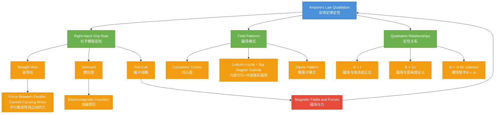

# 1. Overview / 概述

**English:**
Ampere's Law (qualitative) provides a fundamental relationship between an electric current and the magnetic field it produces. Named after André-Marie Ampère, this law states that a magnetic field is created around any current-carrying conductor, and the strength of this field depends on the current magnitude and distance from the conductor. In its qualitative form, Ampere's Law helps us understand the direction and shape of magnetic field lines without requiring complex mathematical integration. This sub-topic is essential for predicting magnetic field patterns around wires, solenoids, and other current configurations, forming the foundation for understanding [[Magnetic Fields and Forces]] and later [[Electromagnetic Induction]].

**中文:**
安培定律（定性）描述了电流与其产生的磁场之间的基本关系。该定律以安德烈-玛丽·安培命名，指出任何载流导体周围都会产生磁场，磁场强度取决于电流大小和与导体的距离。在定性形式中，安培定律帮助我们理解磁场线的方向和形状，无需复杂的数学积分。本子知识点对于预测导线、螺线管和其他电流配置周围的磁场模式至关重要，为理解[[Magnetic Fields and Forces]]和后续的[[Electromagnetic Induction]]奠定基础。

---

# 2. Syllabus Learning Objectives / 考纲学习目标

| CAIE 9702 | Edexcel IAL |
|-----------|-------------|
| 20.2(a): Describe the magnetic field pattern due to currents in straight wires and solenoids | 3.6: Understand that a current-carrying conductor produces a magnetic field |
| 20.2(b): Describe the force on a current-carrying conductor in a magnetic field | 3.7: Understand the magnetic field pattern around a long straight current-carrying conductor |
| 20.2(c): Describe the force between two parallel current-carrying conductors | 3.8: Understand the magnetic field pattern due to a solenoid |
| 20.2(d): Explain how a current-carrying coil behaves like a magnetic dipole | 3.9: Understand the concept of magnetic flux density B |

**Examiner Expectations / 考官期望:**
- **English:** Students must be able to sketch magnetic field lines around straight wires, solenoids, and flat coils. They should understand the right-hand grip rule for determining field direction. The qualitative relationship between current, distance, and field strength is essential.
- **中文:** 学生必须能够绘制直导线、螺线管和扁平线圈周围的磁场线。他们应理解右手螺旋定则来确定磁场方向。电流、距离和磁场强度之间的定性关系至关重要。

---

# 3. Core Definitions / 核心定义

| Term (EN/CN) | Definition (EN) | Definition (CN) | Common Mistakes / 常见错误 |
|--------------|-----------------|-----------------|---------------------------|
| **Ampere's Law (Qualitative)** / 安培定律（定性） | A law stating that a current-carrying conductor produces a magnetic field whose direction is given by the right-hand grip rule and whose strength is proportional to the current and inversely proportional to the distance from the conductor | 该定律指出载流导体产生磁场，磁场方向由右手螺旋定则确定，磁场强度与电流成正比，与到导体的距离成反比 | Confusing with quantitative form that requires line integrals |
| **Right-Hand Grip Rule** / 右手螺旋定则 | A rule to determine the direction of the magnetic field around a current-carrying conductor: if the thumb points in the direction of conventional current, the fingers curl in the direction of the magnetic field | 确定载流导体周围磁场方向的规则：拇指指向常规电流方向，手指弯曲方向即为磁场方向 | Using left hand instead of right hand |
| **Magnetic Field Lines** / 磁场线 | Imaginary lines that represent the direction and strength of a magnetic field; they form closed loops around current-carrying conductors | 表示磁场方向和强度的假想线；它们围绕载流导体形成闭合回路 | Thinking field lines start and end at poles (they form closed loops) |
| **Magnetic Flux Density (B)** / 磁通密度 | A measure of the strength of a magnetic field, defined as force per unit current per unit length on a current-carrying conductor perpendicular to the field | 磁场强度的量度，定义为垂直于磁场的载流导体上单位电流单位长度所受的力 | Confusing with magnetic flux (Φ) |
| **Solenoid** / 螺线管 | A long coil of wire with many turns that produces a uniform magnetic field inside when current flows through it | 一种长线圈，当电流通过时内部产生均匀磁场 | Thinking field is uniform both inside and outside |
| **Magnetic Dipole** / 磁偶极子 | A system with two opposite magnetic poles separated by a small distance; a current-carrying coil behaves like a magnetic dipole | 具有两个相反磁极且相距很小的系统；载流线圈表现为磁偶极子 | Confusing with electric dipole |

---

# 4. Key Concepts Explained / 关键概念详解

## 4.1 The Right-Hand Grip Rule / 右手螺旋定则

### Explanation / 解释
**English:** The right-hand grip rule is the fundamental tool for determining the direction of the magnetic field around a current-carrying conductor. To apply it: grasp the conductor with your right hand such that your thumb points in the direction of conventional current (from positive to negative). Your curled fingers then indicate the direction of the magnetic field lines. This rule applies to straight wires, where field lines form concentric circles around the wire. For a [[Solenoid]], the rule is modified: if your fingers curl in the direction of the current around the coil, your thumb points to the north pole of the solenoid.

**中文:** 右手螺旋定则是确定载流导体周围磁场方向的基本工具。使用方法：用右手握住导体，拇指指向常规电流方向（从正极到负极），弯曲的手指指示磁场线的方向。该规则适用于直导线，磁场线形成围绕导线的同心圆。对于[[Solenoid]]，规则有所修改：如果手指弯曲方向与线圈中电流方向一致，拇指指向螺线管的北极。

### Physical Meaning / 物理意义
**English:** The right-hand grip rule reflects the fundamental relationship between electric currents and magnetic fields. Moving charges (current) create a circulating magnetic field around them. The direction of this circulation is determined by the direction of charge motion, following the right-hand rule convention. This is a consequence of the deeper principle that magnetic fields are produced by moving charges.

**中文:** 右手螺旋定则反映了电流与磁场之间的基本关系。移动的电荷（电流）在其周围产生环形磁场。这种环流的方向由电荷运动方向决定，遵循右手定则惯例。这是移动电荷产生磁场这一更深层原理的结果。

### Common Misconceptions / 常见误区
- **English:**
  - Using the left hand instead of the right hand
  - Thinking the thumb points in the direction of electron flow (it points in conventional current direction)
  - Believing magnetic field lines start at the north pole and end at the south pole (they form closed loops)
  - Confusing the rule for straight wires with the rule for solenoids

- **中文:**
  - 使用左手而不是右手
  - 认为拇指指向电子流动方向（应指向常规电流方向）
  - 认为磁场线从北极开始到南极结束（它们形成闭合回路）
  - 混淆直导线和螺线管的规则

### Exam Tips / 考试提示
- **English:** Always draw the cross-section view of a wire (⊙ for current coming out of page, ⊗ for current going into page) and show concentric circles with arrows. Label the direction clearly. For solenoids, show the uniform field inside and the field lines looping outside.
- **中文:** 始终绘制导线的横截面视图（⊙表示电流流出页面，⊗表示电流流入页面），并显示带箭头的同心圆。清晰标注方向。对于螺线管，显示内部均匀磁场和外部环回的磁场线。

> 📷 **IMAGE PROMPT — RHR-01: Right-Hand Grip Rule for Straight Wire**
> A clear diagram showing a right hand gripping a vertical wire. The thumb points upward (direction of conventional current), and the fingers curl around the wire showing the circular magnetic field lines. Concentric circles with arrows around the wire indicate the magnetic field direction. Labels: "Current (I)", "Magnetic Field (B)", "Right Hand". Clean white background, educational style.

## 4.2 Magnetic Field Pattern Around a Straight Wire / 直导线周围的磁场模式

### Explanation / 解释
**English:** The magnetic field around a long straight current-carrying wire forms concentric circles centered on the wire. The field lines are perpendicular to the wire and lie in planes perpendicular to it. The direction is given by the right-hand grip rule. The spacing between field lines indicates field strength: closer lines mean stronger field. Near the wire, lines are closer together (stronger field); farther away, lines spread out (weaker field). The field strength B is proportional to the current I and inversely proportional to the distance r from the wire: B ∝ I/r.

**中文:** 长直载流导线周围的磁场形成以导线为中心的同心圆。磁场线垂直于导线，位于垂直于导线的平面内。方向由右手螺旋定则确定。磁场线间距表示场强：线越密，场越强。靠近导线处，线更密（场更强）；远离导线处，线更疏（场更弱）。磁场强度B与电流I成正比，与到导线的距离r成反比：B ∝ I/r。

### Physical Meaning / 物理意义
**English:** The circular field pattern arises because the magnetic field lines must form closed loops around the current. The field strength decreases with distance because the same total magnetic flux is spread over a larger circumference (2πr) as distance increases. This inverse relationship with distance is a key feature of Ampere's Law.

**中文:** 圆形磁场模式的出现是因为磁场线必须围绕电流形成闭合回路。场强随距离减小是因为相同的总磁通量分布在更大的圆周上（2πr）。这种与距离的反比关系是安培定律的关键特征。

### Common Misconceptions / 常见误区
- **English:**
  - Thinking the field is uniform around the wire (it varies with distance)
  - Believing the field lines are radial (they are circular)
  - Confusing the field pattern with that of a bar magnet
  - Thinking the field exists only in one plane (it exists in all planes perpendicular to the wire)

- **中文:**
  - 认为导线周围的磁场是均匀的（随距离变化）
  - 认为磁场线是径向的（它们是圆形的）
  - 混淆磁场模式与条形磁铁的模式
  - 认为磁场只存在于一个平面内（存在于所有垂直于导线的平面内）

### Exam Tips / 考试提示
- **English:** When drawing the field pattern, show at least 3-4 concentric circles with arrows. Use the cross-section view (⊙ or ⊗) to clearly indicate current direction. Remember that field lines never cross and form complete loops.
- **中文:** 绘制磁场模式时，至少显示3-4个带箭头的同心圆。使用横截面视图（⊙或⊗）清晰指示电流方向。记住磁场线永不交叉并形成完整回路。

> 📷 **IMAGE PROMPT — WIRE-01: Magnetic Field Around a Straight Wire**
> A diagram showing a long straight wire viewed from the side and in cross-section. Side view: vertical wire with concentric circles around it, arrows showing clockwise or anticlockwise direction. Cross-section view: dot (⊙) for current coming out, concentric circles with arrows. Labels: "Current I", "Magnetic field B", "Distance r". Clean educational diagram.

## 4.3 Magnetic Field of a Solenoid / 螺线管的磁场

### Explanation / 解释
**English:** A [[Solenoid]] is a long coil of wire with many turns. When current flows through it, the magnetic fields from each turn add together to produce a strong, uniform field inside the solenoid and a weaker field outside. The field inside is approximately uniform and parallel to the axis of the solenoid. The field outside resembles that of a bar magnet, with one end acting as a north pole and the other as a south pole. The direction of the field inside the solenoid can be found using the right-hand grip rule: if your fingers curl in the direction of the current, your thumb points to the north pole.

**中文:** [[Solenoid]]是一个有许多匝的长线圈。当电流通过时，每匝产生的磁场叠加在一起，在螺线管内部产生强而均匀的磁场，外部磁场较弱。内部磁场近似均匀且平行于螺线管轴线。外部磁场类似于条形磁铁，一端为北极，另一端为南极。螺线管内部磁场方向可用右手螺旋定则确定：手指弯曲方向与电流方向一致时，拇指指向北极。

### Physical Meaning / 物理意义
**English:** The solenoid concentrates the magnetic field, creating a region of strong, uniform field inside. This is because the fields from adjacent turns reinforce each other inside the coil but cancel partially outside. The uniform field inside makes solenoids useful as electromagnets and in applications like MRI machines, particle accelerators, and magnetic switches.

**中文:** 螺线管集中磁场，在内部产生强而均匀的磁场区域。这是因为相邻匝的磁场在线圈内部相互增强，在外部部分抵消。内部均匀磁场使螺线管可用作电磁铁，并应用于MRI机器、粒子加速器和磁开关等领域。

### Common Misconceptions / 常见误区
- **English:**
  - Thinking the field is uniform both inside and outside (only inside is approximately uniform)
  - Believing the field outside is zero (it exists but is much weaker)
  - Confusing the north and south poles based on current direction
  - Thinking a single loop has the same field pattern as a long solenoid

- **中文:**
  - 认为内部和外部磁场都是均匀的（只有内部近似均匀）
  - 认为外部磁场为零（存在但弱得多）
  - 根据电流方向混淆北极和南极
  - 认为单匝线圈与长螺线管具有相同的磁场模式

### Exam Tips / 考试提示
- **English:** Draw the solenoid as a rectangle with current direction shown by arrows on the coils. Show the uniform field lines inside as parallel, equally spaced arrows. Outside, show field lines looping from north to south pole. Label the poles clearly.
- **中文:** 将螺线管绘制为矩形，在线圈上用箭头显示电流方向。内部均匀磁场线显示为平行、等距的箭头。外部显示从北极到南极的环回磁场线。清晰标注磁极。

> 📷 **IMAGE PROMPT — SOL-01: Magnetic Field of a Solenoid**
> A diagram of a solenoid (coil of wire) with current flowing through it. Inside the solenoid: parallel, equally spaced arrows pointing from south to north (direction of magnetic field). Outside: curved field lines looping from north pole to south pole. Labels: "North Pole", "South Pole", "Current I", "Uniform magnetic field inside", "Magnetic field lines outside". Clean educational style.

## 4.4 Magnetic Field of a Flat Circular Coil / 扁平圆形线圈的磁场

### Explanation / 解释
**English:** A flat circular coil (a single loop or multiple turns in a flat arrangement) produces a magnetic field pattern similar to that of a short bar magnet. The field lines pass through the center of the coil perpendicular to its plane, then loop around and return. At the center of the coil, the field is perpendicular to the plane of the coil and is strongest. The direction is given by the right-hand grip rule: if your fingers curl in the direction of the current, your thumb points in the direction of the field through the center.

**中文:** 扁平圆形线圈（单匝或多匝扁平排列）产生的磁场模式类似于短条形磁铁。磁场线垂直于线圈平面穿过中心，然后环回。在线圈中心，磁场垂直于线圈平面且最强。方向由右手螺旋定则确定：手指弯曲方向与电流方向一致时，拇指指向穿过中心的磁场方向。

### Physical Meaning / 物理意义
**English:** The flat coil behaves as a [[Magnetic Dipole]], with one face acting as a north pole and the other as a south pole. This is why a current-carrying coil can be used as an electromagnet and why it experiences a torque when placed in an external magnetic field (as in electric motors).

**中文:** 扁平线圈表现为[[Magnetic Dipole]]，一面为北极，另一面为南极。这就是为什么载流线圈可用作电磁铁，以及为什么置于外部磁场中时会受到扭矩（如电动机中）。

### Common Misconceptions / 常见误区
- **English:**
  - Thinking the field is uniform across the entire coil (it's strongest at the center)
  - Confusing the field pattern with that of a solenoid
  - Believing the field direction is parallel to the plane of the coil (it's perpendicular at the center)

- **中文:**
  - 认为整个线圈的磁场是均匀的（中心最强）
  - 混淆磁场模式与螺线管
  - 认为磁场方向平行于线圈平面（中心处垂直于平面）

### Exam Tips / 考试提示
- **English:** Show the coil from the side (as two dots or a line) and from the face-on view. Indicate the current direction clearly. Draw field lines passing through the center and looping around.
- **中文:** 从侧面（两个点或一条线）和正面视图显示线圈。清晰指示电流方向。绘制穿过中心并环回的磁场线。

> 📷 **IMAGE PROMPT — COIL-01: Magnetic Field of a Flat Circular Coil**
> A diagram showing a flat circular coil viewed from the side. The coil appears as two horizontal lines (top and bottom of the coil). Arrows show current direction. Magnetic field lines pass through the center perpendicular to the coil plane, then loop around outside. Labels: "Current I", "Magnetic field B", "North face", "South face". Clean educational diagram.

---

# 5. Essential Equations / 核心公式

## 5.1 Qualitative Relationship for Straight Wire / 直导线定性关系

$$ B \propto \frac{I}{r} $$

| Symbol (符号) | Meaning (EN) | Meaning (CN) | Unit (单位) |
|--------------|-------------|-------------|------------|
| B | Magnetic flux density (magnetic field strength) | 磁通密度（磁场强度） | T (tesla) |
| I | Current in the wire | 导线中的电流 | A (ampere) |
| r | Perpendicular distance from the wire | 到导线的垂直距离 | m (meter) |

**Derivation / 推导:** This qualitative relationship comes from Ampere's Law: the line integral of B around a closed loop equals μ₀I. For a circular loop of radius r around the wire, B × 2πr = μ₀I, so B = μ₀I/(2πr). The qualitative form B ∝ I/r captures the essential physics without the constant.

**Conditions / 适用条件:**
- **English:** Long straight wire; distance r is much less than the length of the wire; field is measured in a vacuum or air
- **中文:** 长直导线；距离r远小于导线长度；在真空或空气中测量

**Limitations / 局限性:**
- **English:** Does not apply near the ends of a finite wire; does not account for magnetic materials; qualitative only (no constant of proportionality)
- **中文:** 不适用于有限导线的端部附近；不考虑磁性材料；仅定性（无比例常数）

## 5.2 Qualitative Relationship for Solenoid / 螺线管定性关系

$$ B_{\text{inside}} \propto nI $$

| Symbol (符号) | Meaning (EN) | Meaning (CN) | Unit (单位) |
|--------------|-------------|-------------|------------|
| B_inside | Magnetic flux density inside the solenoid | 螺线管内部的磁通密度 | T (tesla) |
| n | Number of turns per unit length | 单位长度的匝数 | m⁻¹ |
| I | Current in the coil | 线圈中的电流 | A (ampere) |

**Derivation / 推导:** For an ideal solenoid, the field inside is uniform and given by B = μ₀nI. The qualitative form shows that increasing the number of turns or the current increases the field strength.

**Conditions / 适用条件:**
- **English:** Long solenoid (length >> diameter); field measured near the center; no magnetic core
- **中文:** 长螺线管（长度 >> 直径）；在中心附近测量；无磁芯

**Limitations / 局限性:**
- **English:** Field is not perfectly uniform near the ends; does not apply to short coils; qualitative only
- **中文:** 端部附近磁场不完全均匀；不适用于短线圈；仅定性

---

# 6. Graphs and Relationships / 图表与关系

## 6.1 Magnetic Field Strength vs. Distance from Straight Wire / 磁场强度与到直导线距离的关系

### Axes / 坐标轴
- **X-axis:** Distance from wire, r (m) / 到导线的距离 r (m)
- **Y-axis:** Magnetic flux density, B (T) / 磁通密度 B (T)

### Shape / 形状
**English:** The graph is a hyperbola (inverse relationship). B decreases rapidly as r increases. The curve approaches zero as r → ∞ and approaches infinity as r → 0 (but in practice, the wire has finite thickness).

**中文:** 图形为双曲线（反比关系）。B随r增大而迅速减小。当r → ∞时曲线趋近于零，当r → 0时趋近于无穷大（但实际上导线有有限厚度）。

### Gradient Meaning / 斜率含义
**English:** The gradient dB/dr is negative and decreases in magnitude as r increases. The gradient represents how quickly the field strength changes with distance.

**中文:** 斜率dB/dr为负，随r增大而绝对值减小。斜率表示场强随距离变化的快慢。

### Area Meaning / 面积含义
**English:** The area under the B vs. r graph has no direct physical meaning in this context.

**中文:** B vs. r图形下的面积在此上下文中没有直接的物理意义。

### Exam Interpretation / 考试解读
- **English:** Be able to sketch this graph qualitatively. Understand that doubling the distance halves the field strength. Recognize that the field is strongest near the wire.
- **中文:** 能够定性绘制此图形。理解距离加倍则场强减半。认识到导线附近磁场最强。

> 📷 **IMAGE PROMPT — GRAPH-01: B vs r for Straight Wire**
> A graph showing magnetic flux density B on the y-axis vs distance r on the x-axis. The curve is a hyperbola: high B near r=0, decreasing rapidly, approaching zero as r increases. Axes labeled: "B (T)" and "r (m)". Clean scientific graph style.

## 6.2 Magnetic Field Strength vs. Current in Straight Wire / 磁场强度与直导线中电流的关系

### Axes / 坐标轴
- **X-axis:** Current, I (A) / 电流 I (A)
- **Y-axis:** Magnetic flux density, B (T) / 磁通密度 B (T)

### Shape / 形状
**English:** The graph is a straight line through the origin (direct proportionality). Doubling the current doubles the field strength at any fixed distance.

**中文:** 图形为通过原点的直线（正比关系）。在任意固定距离处，电流加倍则场强加倍。

### Gradient Meaning / 斜率含义
**English:** The gradient B/I = μ₀/(2πr) at a fixed distance r. The gradient decreases as r increases.

**中文:** 在固定距离r处，斜率B/I = μ₀/(2πr)。斜率随r增大而减小。

### Area Meaning / 面积含义
**English:** The area under the B vs. I graph has no direct physical meaning.

**中文:** B vs. I图形下的面积没有直接的物理意义。

### Exam Interpretation / 考试解读
- **English:** Be able to sketch this graph. Understand that the graph shows a linear relationship, confirming the proportionality in Ampere's Law.
- **中文:** 能够绘制此图形。理解图形显示线性关系，证实安培定律中的正比关系。

---

# 7. Required Diagrams / 必备图表

## 7.1 Magnetic Field Pattern Around a Straight Wire / 直导线周围的磁场模式

### Description / 描述
**English:** A diagram showing the magnetic field lines as concentric circles around a straight current-carrying wire. The wire is shown in cross-section (⊙ for current out of page, ⊗ for current into page) and from the side. Arrows on the circles indicate the direction of the magnetic field.

**中文:** 显示载流直导线周围磁场线为同心圆的示意图。导线以横截面视图（⊙表示电流流出页面，⊗表示电流流入页面）和侧视图显示。圆上的箭头指示磁场方向。

### Image Prompt / 图片生成提示
> 📷 **IMAGE PROMPT — DIAG-01: Magnetic Field Around Straight Wire**
> A detailed educational diagram showing a long straight wire. Left panel: side view with vertical wire and concentric circles around it, arrows showing clockwise direction. Right panel: cross-section view with a dot (⊙) in the center and concentric circles with arrows. Labels: "Current I (out of page)", "Magnetic field lines B", "Direction of B". Clean white background, professional physics textbook style.

### Labels Required / 需要标注
- **English:** Current direction (I), Magnetic field lines (B), Direction arrows, Wire cross-section (⊙ or ⊗)
- **中文:** 电流方向 (I), 磁场线 (B), 方向箭头, 导线横截面 (⊙ 或 ⊗)

### Exam Importance / 考试重要性
- **English:** High — this is the most commonly tested diagram for Ampere's Law. Students must be able to draw and interpret it.
- **中文:** 高 — 这是安培定律最常考的图表。学生必须能够绘制和解读。

## 7.2 Magnetic Field Pattern of a Solenoid / 螺线管的磁场模式

### Description / 描述
**English:** A diagram showing a solenoid (coil of wire) with current flowing through it. Inside the solenoid, parallel equally-spaced arrows indicate the uniform magnetic field. Outside, curved field lines loop from the north pole to the south pole, resembling the field of a bar magnet.

**中文:** 显示载流螺线管的示意图。螺线管内部，平行等距的箭头表示均匀磁场。外部，弯曲的磁场线从北极环回到南极，类似于条形磁铁的磁场。

### Image Prompt / 图片生成提示
> 📷 **IMAGE PROMPT — DIAG-02: Solenoid Magnetic Field**
> A detailed educational diagram of a solenoid. The solenoid is shown as a rectangular coil with current direction indicated by arrows on the wires. Inside: parallel, equally-spaced arrows pointing from left to right (south to north). Outside: curved field lines looping from the right end (north pole) to the left end (south pole). Labels: "North Pole", "South Pole", "Current I", "Uniform magnetic field inside", "External field lines". Clean white background, professional physics textbook style.

### Labels Required / 需要标注
- **English:** North pole, South pole, Current direction (I), Internal field (uniform), External field lines
- **中文:** 北极, 南极, 电流方向 (I), 内部磁场（均匀）, 外部磁场线

### Exam Importance / 考试重要性
- **English:** High — frequently tested in both CAIE and Edexcel exams. Students must understand the difference between internal and external fields.
- **中文:** 高 — 在CAIE和Edexcel考试中经常出现。学生必须理解内部和外部磁场的区别。

---

# 8. Worked Examples / 典型例题

## Example 1: Determining Magnetic Field Direction Around a Wire / 确定导线周围的磁场方向

### Question / 题目
**English:** A long straight wire carries a current of 5 A from left to right. Using the right-hand grip rule, determine the direction of the magnetic field:
(a) Above the wire
(b) Below the wire

**中文:** 一根长直导线载有5 A电流，方向从左到右。使用右手螺旋定则，确定磁场方向：
(a) 导线上方
(b) 导线下方

### Solution / 解答

**Step 1: Apply the right-hand grip rule / 步骤1：应用右手螺旋定则**
- **English:** Point your right thumb in the direction of conventional current (left to right). Your fingers will curl around the wire.
- **中文:** 将右手拇指指向常规电流方向（从左到右）。手指将围绕导线弯曲。

**Step 2: Determine direction above the wire / 步骤2：确定导线上方方向**
- **English:** Above the wire, your fingers will be pointing into the page. Therefore, the magnetic field above the wire is directed into the page.
- **中文:** 在导线上方，手指指向页面内。因此，导线上方的磁场方向指向页面内。

**Step 3: Determine direction below the wire / 步骤3：确定导线下方方向**
- **English:** Below the wire, your fingers will be pointing out of the page. Therefore, the magnetic field below the wire is directed out of the page.
- **中文:** 在导线下方，手指指向页面外。因此，导线下方的磁场方向指向页面外。

### Final Answer / 最终答案
**Answer:** (a) Into the page (⊗) above the wire | (b) Out of the page (⊙) below the wire
**答案：** (a) 导线上方指向页面内 (⊗) | (b) 导线下方指向页面外 (⊙)

### Quick Tip / 提示
- **English:** Remember: "Thumb points to current, fingers show field direction." For a wire with current left to right, the field above is into the page (⊗) and below is out of the page (⊙).
- **中文:** 记住："拇指指向电流方向，手指显示磁场方向。"对于电流从左到右的导线，上方磁场指向页面内(⊗)，下方指向页面外(⊙)。

## Example 2: Identifying North and South Poles of a Solenoid / 识别螺线管的北极和南极

### Question / 题目
**English:** A solenoid has current flowing through it as shown in the diagram. The current enters at terminal A and leaves at terminal B. When viewed from the right end, the current flows clockwise. Determine which end of the solenoid is the north pole and which is the south pole.

**中文:** 螺线管中电流如图所示流动。电流从端子A流入，从端子B流出。从右端看，电流顺时针流动。确定螺线管的哪一端是北极，哪一端是南极。

### Solution / 解答

**Step 1: Apply the right-hand grip rule for solenoids / 步骤1：应用螺线管的右手螺旋定则**
- **English:** Curl your right hand fingers in the direction of the current around the solenoid. Your thumb will point to the north pole.
- **中文:** 将右手手指弯曲，方向与螺线管中电流方向一致。拇指指向北极。

**Step 2: Determine current direction / 步骤2：确定电流方向**
- **English:** From the right end, current flows clockwise. Using the right-hand rule, if your fingers curl clockwise (as viewed from the right), your thumb points to the left.
- **中文:** 从右端看，电流顺时针流动。使用右手定则，如果手指顺时针弯曲（从右端看），拇指指向左侧。

**Step 3: Identify poles / 步骤3：识别磁极**
- **English:** Since the thumb points to the left, the left end is the north pole. The right end is the south pole.
- **中文:** 由于拇指指向左侧，左端为北极。右端为南极。

### Final Answer / 最终答案
**Answer:** Left end = North pole | Right end = South pole
**答案：** 左端 = 北极 | 右端 = 南极

### Quick Tip / 提示
- **English:** For solenoids: "Fingers follow current, thumb points north." If current is clockwise when viewed from one end, that end is the south pole.
- **中文:** 对于螺线管："手指跟随电流方向，拇指指向北极。"如果从一端看电流为顺时针，则该端为南极。

---

# 9. Past Paper Question Types / 历年真题题型

| Question Type / 题型 | Frequency / 频率 | Difficulty / 难度 | Past Paper References / 真题索引 |
|----------------------|------------------|------------------|-------------------------------|
| Sketch magnetic field lines around a straight wire / 绘制直导线周围的磁场线 | High / 高 | Easy / 简单 | 📝 *待填入* |
| Determine direction of magnetic field using right-hand rule / 使用右手定则确定磁场方向 | High / 高 | Easy / 简单 | 📝 *待填入* |
| Identify north/south poles of a solenoid / 识别螺线管的北极/南极 | Medium / 中 | Medium / 中等 | 📝 *待填入* |
| Compare magnetic field patterns (wire vs. solenoid vs. bar magnet) / 比较磁场模式（导线 vs. 螺线管 vs. 条形磁铁） | Medium / 中 | Medium / 中等 | 📝 *待填入* |
| Explain how field strength varies with current and distance / 解释场强如何随电流和距离变化 | Medium / 中 | Medium / 中等 | 📝 *待填入* |
| Describe the force between parallel current-carrying wires / 描述平行载流导线之间的力 | Low / 低 | Hard / 困难 | 📝 *待填入* |

**Common Command Words / 常见指令词:**
- **English:** Sketch, Draw, Label, Determine, State, Explain, Describe, Compare
- **中文:** 绘制, 画出, 标注, 确定, 陈述, 解释, 描述, 比较

---

# 10. Practical Skills Connections / 实验技能链接

**English:**
This sub-topic connects to practical work in several ways:

1. **Plotting Magnetic Field Patterns:** Students can use a compass or Hall probe to map the magnetic field around a current-carrying wire or solenoid. This develops skills in systematic data collection and pattern recognition.

2. **Measuring Magnetic Flux Density:** Using a Hall probe connected to a data logger, students can measure B at various distances from a wire and verify the B ∝ 1/r relationship. This involves:
   - Setting up the apparatus correctly
   - Taking multiple readings at different distances
   - Plotting graphs of B vs. r and B vs. 1/r
   - Calculating uncertainties and drawing error bars

3. **Investigating Solenoid Fields:** Students can measure the field inside a solenoid at different positions along its axis, confirming the uniform field region. This develops skills in:
   - Using a search coil and oscilloscope
   - Understanding the effect of changing current and number of turns
   - Identifying sources of error (end effects, non-uniformity)

4. **Experimental Design:** Students should be able to design experiments to investigate the relationship between B, I, and r, including:
   - Identifying independent, dependent, and control variables
   - Suggesting appropriate measuring instruments
   - Describing how to improve accuracy and reduce uncertainty

**中文:**
本子知识点通过以下方式与实验工作联系：

1. **绘制磁场模式：** 学生可以使用指南针或霍尔探头绘制载流导线或螺线管周围的磁场。这培养了系统数据收集和模式识别的技能。

2. **测量磁通密度：** 使用连接到数据记录器的霍尔探头，学生可以测量不同距离处的B，并验证B ∝ 1/r关系。这包括：
   - 正确设置装置
   - 在不同距离处进行多次读数
   - 绘制B vs. r和B vs. 1/r的图形
   - 计算不确定度并绘制误差线

3. **研究螺线管磁场：** 学生可以测量螺线管内部沿轴不同位置的磁场，确认均匀场区域。这培养了以下技能：
   - 使用探测线圈和示波器
   - 理解改变电流和匝数的影响
   - 识别误差来源（端部效应、不均匀性）

4. **实验设计：** 学生应能够设计实验来研究B、I和r之间的关系，包括：
   - 识别自变量、因变量和控制变量
   - 建议合适的测量仪器
   - 描述如何提高准确度和减少不确定度

---

# 11. Concept Map / 概念图谱

---

# 12. Quick Revision Sheet / 速查表

| Category / 类别 | Key Points / 要点 |
|----------------|------------------|
| **Definition / 定义** | Ampere's Law (qualitative): A current-carrying conductor produces a magnetic field. Field direction given by right-hand grip rule. Field strength ∝ I and ∝ 1/r for straight wire. / 安培定律（定性）：载流导体产生磁场。磁场方向由右手螺旋定则确定。直导线场强 ∝ I 且 ∝ 1/r |
| **Key Formula / 核心公式** | B ∝ I/r (straight wire / 直导线) |
| | B ∝ nI (solenoid / 螺线管) |
| **Key Graph / 核心图表** | B vs r: Hyperbola (inverse relationship) / 双曲线（反比关系） |
| | B vs I: Straight line through origin (direct proportion) / 通过原点的直线（正比关系） |
| **Key Diagram / 核心图表** | Straight wire: Concentric circles with arrows / 直导线：带箭头的同心圆 |
| | Solenoid: Parallel arrows inside, curved loops outside / 螺线管：内部平行箭头，外部弯曲回路 |
| **Right-Hand Rule / 右手定则** | Straight wire: Thumb = current, fingers = field / 直导线：拇指=电流，手指=磁场 |
| | Solenoid: Fingers = current, thumb = north pole / 螺线管：手指=电流，拇指=北极 |
| **Common Mistakes / 常见错误** | Using left hand instead of right / 使用左手而非右手 |
| | Thinking field lines start/end at poles (they form closed loops) / 认为磁场线始于/终于磁极（形成闭合回路） |
| | Confusing field patterns of wire vs. solenoid / 混淆导线和螺线管的磁场模式 |
| **Exam Tip / 考试提示** | Always draw cross-section view (⊙/⊗) for wires / 始终为导线绘制横截面视图 (⊙/⊗) |
| | Show at least 3-4 field lines with arrows / 至少显示3-4条带箭头的磁场线 |
| | Label north/south poles for solenoids / 为螺线管标注北极/南极 |
| **Practical Skills / 实验技能** | Use Hall probe to measure B at different distances / 使用霍尔探头测量不同距离处的B |
| | Plot B vs 1/r to verify inverse relationship / 绘制B vs 1/r验证反比关系 |
| | Investigate uniform field inside solenoid / 研究螺线管内部均匀磁场 |
| **Connections / 联系** | [[Magnetic Fields and Forces]] — prerequisite / 先修知识 |
| | [[Force Between Parallel Current-Carrying Wires]] — application / 应用 |
| | [[Electromagnetic Induction]] — related topic / 相关主题 |