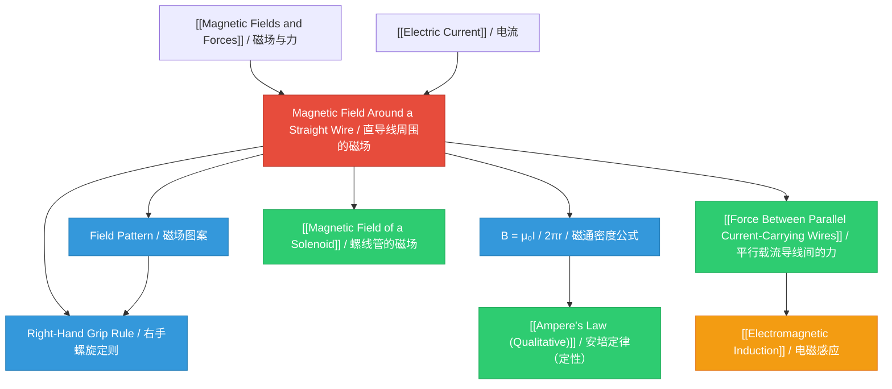

# 1. Overview / 概述

**English:**
This sub-topic explores the magnetic field pattern produced by a straight current-carrying conductor. When an electric current flows through a straight wire, it generates a circular magnetic field around the wire. Understanding this fundamental field pattern is essential for analyzing more complex configurations like [[Magnetic Field of a Solenoid]] and [[Force Between Parallel Current-Carrying Wires]]. The right-hand grip rule provides a simple method to determine the field direction, while the inverse relationship between field strength and distance from the wire is crucial for quantitative analysis. This concept forms the foundation for understanding [[Ampere's Law (Qualitative)]] and connects directly to [[Electromagnetic Induction]].

**中文:**
本子知识点探讨载流直导线产生的磁场模式。当电流通过直导线时，会在导线周围产生环形磁场。理解这一基本磁场模式对于分析更复杂的配置（如[[螺线管的磁场]]和[[平行载流导线间的力]]）至关重要。右手螺旋定则提供了确定磁场方向的简单方法，而磁场强度与距离的反比关系对于定量分析至关重要。这一概念构成了理解[[安培定律（定性）]]的基础，并与[[电磁感应]]直接相关。

---

# 2. Syllabus Learning Objectives / 考纲学习目标

| CAIE 9702 | Edexcel IAL |
|-----------|-------------|
| 20.2(a) Describe the magnetic field pattern due to a long straight current-carrying wire | 3.6 Understand the magnetic field pattern around a long straight current-carrying wire |
| 20.2(b) Apply the right-hand grip rule to determine the direction of the magnetic field | 3.7 Use the right-hand grip rule to determine magnetic field direction |
| 20.2(c) Recall and use $B = \frac{\mu_0 I}{2\pi r}$ for the magnetic flux density near a long straight wire | 3.8 Use $B = \frac{\mu_0 I}{2\pi r}$ for the magnetic flux density near a long straight current-carrying wire |
| 20.2(d) Solve problems involving the magnetic field due to a straight wire | 3.9 Solve problems involving magnetic fields due to straight current-carrying wires |

**Examiner Expectations / 考官期望:**
- **English:** Students must be able to sketch the circular field pattern, apply the right-hand grip rule correctly, and use the formula $B = \frac{\mu_0 I}{2\pi r}$ for calculations. Common exam tasks include determining field direction, calculating flux density at a given distance, and analyzing the combined field from multiple wires.
- **中文:** 学生必须能够画出环形磁场图案，正确应用右手螺旋定则，并使用公式 $B = \frac{\mu_0 I}{2\pi r}$ 进行计算。常见的考试任务包括确定磁场方向、计算给定距离处的磁通密度，以及分析多条导线的合成磁场。

---

# 3. Core Definitions / 核心定义

| Term (EN/CN) | Definition (EN) | Definition (CN) | Common Mistakes / 常见错误 |
|--------------|-----------------|-----------------|---------------------------|
| **Magnetic Flux Density** / 磁通密度 | The strength of a magnetic field, defined as force per unit current per unit length on a current-carrying conductor perpendicular to the field | 磁场强度，定义为垂直于磁场的载流导体单位电流单位长度所受的力 | Confusing $B$ with magnetic flux $\Phi$; forgetting $B$ is a vector quantity |
| **Right-Hand Grip Rule** / 右手螺旋定则 | A rule stating that if you grip the wire with your right hand with thumb pointing in the direction of conventional current, your fingers curl in the direction of the magnetic field | 用右手握住导线，拇指指向电流方向，四指弯曲的方向即为磁场方向 | Using left hand; confusing with Fleming's left-hand rule |
| **Magnetic Field Line** / 磁感线 | An imaginary line representing the direction of the magnetic field at any point; tangent to the line gives field direction | 表示任意点磁场方向的假想线；线的切线方向即为磁场方向 | Thinking field lines start/end at the wire (they form closed loops) |
| **Conventional Current** / 常规电流 | The direction of flow of positive charge, from positive to negative terminal | 正电荷流动的方向，从正极到负极 | Using electron flow direction instead of conventional current |
| **Permeability of Free Space** / 真空磁导率 | A physical constant $\mu_0 = 4\pi \times 10^{-7} \text{ H m}^{-1}$ that relates magnetic field strength to current in a vacuum | 物理常数 $\mu_0 = 4\pi \times 10^{-7} \text{ H m}^{-1}$，将真空中的磁场强度与电流联系起来 | Forgetting the value; using incorrect units |

---

# 4. Key Concepts Explained / 关键概念详解

## 4.1 Magnetic Field Pattern / 磁场图案

### Explanation / 解释
**English:** The magnetic field around a long straight current-carrying wire forms concentric circles centered on the wire. The field lines are closed loops that never intersect. The direction of the field is determined by the [[Right-Hand Grip Rule]]. The field is strongest near the wire and weakens with increasing distance. The field pattern is three-dimensional — the circular field exists at every point along the wire's length.

**中文:** 长直载流导线周围的磁场形成以导线为中心的同心圆。磁感线是闭合回路，永不相交。磁场方向由[[右手螺旋定则]]确定。磁场在导线附近最强，随着距离增加而减弱。磁场图案是三维的——沿导线长度的每一点都存在环形磁场。

### Physical Meaning / 物理意义
**English:** The circular field pattern arises because moving charges (current) create a magnetic field that circulates around the direction of motion. This is a fundamental consequence of the relationship between electricity and magnetism — a current always produces a magnetic field perpendicular to its direction.

**中文:** 环形磁场图案的产生是因为运动电荷（电流）会产生围绕运动方向旋转的磁场。这是电与磁关系的基本结果——电流总是产生垂直于其方向的磁场。

### Common Misconceptions / 常见误区
- **English:**
  - Thinking field lines radiate outward from the wire like electric field lines
  - Believing the field is uniform around the wire (it varies with distance)
  - Confusing the direction for electron flow vs conventional current
  - Thinking the field exists only in one plane
- **中文:**
  - 认为磁感线像电场线一样从导线向外辐射
  - 认为导线周围的磁场是均匀的（实际上随距离变化）
  - 混淆电子流方向和常规电流方向
  - 认为磁场只存在于一个平面内

### Exam Tips / 考试提示
- **English:** Always draw at least 3-4 concentric circles when sketching the field pattern. Label the current direction with an arrow and use crosses/dots to show field direction (into/out of page). Remember that field lines are closer together near the wire.
- **中文:** 画磁场图案时至少要画3-4个同心圆。用箭头标注电流方向，用叉号/点号表示磁场方向（进入/离开纸面）。记住导线附近磁感线更密集。

> 📷 **IMAGE PROMPT — MF01: Magnetic Field Around a Straight Wire**
> A detailed scientific diagram showing a long straight vertical wire with current flowing upward (arrow labeled "I"). Around the wire, 4-5 concentric circles represent magnetic field lines. Arrows on the circles show counterclockwise direction (when viewed from above). The circles are closer together near the wire and spread apart further away. Labels: "Wire", "Current I", "Magnetic Field Lines B". Include a small inset showing the right-hand grip rule with a hand gripping the wire.

## 4.2 Right-Hand Grip Rule / 右手螺旋定则

### Explanation / 解释
**English:** The right-hand grip rule is a mnemonic for determining the direction of the magnetic field around a current-carrying wire. To apply it: grip the wire with your right hand, with your thumb pointing in the direction of conventional current (positive to negative). Your fingers then curl in the direction of the magnetic field lines. This rule works for any orientation of the wire.

**中文:** 右手螺旋定则是确定载流导线周围磁场方向的记忆方法。使用方法：用右手握住导线，拇指指向常规电流方向（正极到负极），四指弯曲的方向即为磁感线方向。该规则适用于任何导线方向。

### Physical Meaning / 物理意义
**English:** The right-hand rule reflects the vector cross-product relationship between current direction and magnetic field direction. It is a consequence of the Biot-Savart law, which describes how moving charges create magnetic fields.

**中文:** 右手定则反映了电流方向与磁场方向之间的矢量叉积关系。这是毕奥-萨伐尔定律的结果，该定律描述了运动电荷如何产生磁场。

### Common Misconceptions / 常见误区
- **English:**
  - Using the left hand instead of the right hand
  - Pointing thumb in direction of electron flow
  - Forgetting to reorient the hand when the wire changes direction
  - Applying the rule incorrectly for field direction at a specific point
- **中文:**
  - 用左手代替右手
  - 拇指指向电子流方向
  - 导线方向改变时忘记重新调整手的方向
  - 对特定点的磁场方向应用规则错误

### Exam Tips / 考试提示
- **English:** Practice with different wire orientations (vertical, horizontal, into/out of page). For a wire going into the page (current away from you), the field is clockwise. For a wire coming out of the page (current toward you), the field is counterclockwise.
- **中文:** 练习不同导线方向（垂直、水平、进入/离开纸面）。对于电流进入纸面的导线，磁场为顺时针方向；对于电流离开纸面的导线，磁场为逆时针方向。

## 4.3 Magnetic Flux Density Formula / 磁通密度公式

### Explanation / 解释
**English:** The magnetic flux density at a distance $r$ from a long straight current-carrying wire is given by:

$$B = \frac{\mu_0 I}{2\pi r}$$

where $\mu_0 = 4\pi \times 10^{-7} \text{ H m}^{-1}$ is the permeability of free space, $I$ is the current in amperes, and $r$ is the perpendicular distance from the wire in meters. This formula shows that $B$ is directly proportional to $I$ and inversely proportional to $r$.

**中文:** 距离长直载流导线 $r$ 处的磁通密度由下式给出：

$$B = \frac{\mu_0 I}{2\pi r}$$

其中 $\mu_0 = 4\pi \times 10^{-7} \text{ H m}^{-1}$ 是真空磁导率，$I$ 是以安培为单位的电流，$r$ 是到导线的垂直距离（米）。该公式表明 $B$ 与 $I$ 成正比，与 $r$ 成反比。

### Physical Meaning / 物理意义
**English:** The $1/r$ dependence means the field strength halves when the distance from the wire doubles. This is different from the $1/r^2$ dependence seen in electric fields and gravitational fields, because the wire is a line source rather than a point source. The $\mu_0$ constant reflects the magnetic properties of free space.

**中文:** $1/r$ 关系意味着距离导线加倍时，磁场强度减半。这与电场和引力场中的 $1/r^2$ 关系不同，因为导线是线源而非点源。常数 $\mu_0$ 反映了自由空间的磁性质。

### Common Misconceptions / 常见误区
- **English:**
  - Using diameter instead of radius for $r$
  - Forgetting to convert units (e.g., cm to m)
  - Thinking the formula applies at points along the wire's axis
  - Confusing $\mu_0$ with relative permeability $\mu_r$
- **中文:**
  - 使用直径而不是半径作为 $r$
  - 忘记单位换算（如厘米到米）
  - 认为公式适用于导线轴线上的点
  - 混淆 $\mu_0$ 与相对磁导率 $\mu_r$

### Exam Tips / 考试提示
- **English:** Always check units — $r$ must be in meters, $I$ in amperes. The formula gives $B$ in teslas (T). For problems with multiple wires, calculate the field from each wire separately and then add vectorially.
- **中文:** 始终检查单位——$r$ 必须以米为单位，$I$ 以安培为单位。公式给出的 $B$ 单位为特斯拉（T）。对于多导线问题，分别计算每根导线的磁场，然后进行矢量叠加。

---

# 5. Essential Equations / 核心公式

## Equation 1: Magnetic Flux Density Near a Straight Wire / 直导线附近的磁通密度

$$B = \frac{\mu_0 I}{2\pi r}$$

| Symbol (符号) | Meaning (EN) | Meaning (CN) | Unit (单位) |
|--------------|-------------|-------------|------------|
| $B$ | Magnetic flux density | 磁通密度 | T (tesla / 特斯拉) |
| $\mu_0$ | Permeability of free space | 真空磁导率 | H m$^{-1}$ (henry per metre / 亨利每米) |
| $I$ | Current | 电流 | A (ampere / 安培) |
| $r$ | Perpendicular distance from wire | 到导线的垂直距离 | m (metre / 米) |

**Derivation / 推导:**
This formula can be derived from [[Ampere's Law (Qualitative)]]: $\oint \vec{B} \cdot d\vec{l} = \mu_0 I_{\text{enclosed}}$. For a circular path of radius $r$ around the wire, $B$ is constant along the path, giving $B \times 2\pi r = \mu_0 I$, hence $B = \frac{\mu_0 I}{2\pi r}$.

**Conditions / 适用条件:**
- **English:** The wire must be long (infinite in theory), straight, and the point of measurement must be far from the ends. The formula applies in vacuum or air (where $\mu_r \approx 1$).
- **中文:** 导线必须足够长（理论上无限长）、直，且测量点必须远离导线两端。该公式适用于真空或空气（$\mu_r \approx 1$）。

**Limitations / 局限性:**
- **English:** Does not apply near the ends of a finite wire; does not account for the wire's thickness; assumes uniform current distribution; breaks down at very small $r$ (comparable to wire radius).
- **中文:** 不适用于有限长导线的两端附近；不考虑导线厚度；假设电流分布均匀；在非常小的 $r$（与导线半径相当）时失效。

> 📷 **IMAGE PROMPT — MF02: B vs r Graph for Straight Wire**
> A graph showing magnetic flux density B on the y-axis against distance r on the x-axis. The curve shows a hyperbolic decrease: B is very high near r=0 and decreases rapidly, following a 1/r relationship. The axes are labeled "B / T" and "r / m". A dashed line shows the theoretical limit as r approaches 0.

---

# 6. Graphs and Relationships / 图表与关系

## 6.1 B vs r (Distance from Wire) / 磁通密度与距离的关系

### Axes / 坐标轴
- **X-axis:** $r$ (distance from wire / 到导线的距离) in m
- **Y-axis:** $B$ (magnetic flux density / 磁通密度) in T

### Shape / 形状
**English:** The graph shows a hyperbolic decay curve. $B$ is maximum near the wire ($r \to 0$) and decreases rapidly as $r$ increases. The curve follows $B \propto 1/r$, so doubling $r$ halves $B$.

**中文:** 图形显示双曲线衰减。$B$ 在导线附近最大（$r \to 0$），随着 $r$ 增加而迅速减小。曲线遵循 $B \propto 1/r$，因此 $r$ 加倍时 $B$ 减半。

### Gradient Meaning / 斜率含义
**English:** The gradient $\frac{dB}{dr} = -\frac{\mu_0 I}{2\pi r^2}$ is negative and decreases in magnitude with increasing $r$. The gradient represents the rate of change of field strength with distance.

**中文:** 梯度 $\frac{dB}{dr} = -\frac{\mu_0 I}{2\pi r^2}$ 为负值，其大小随 $r$ 增加而减小。梯度表示场强随距离的变化率。

### Area Meaning / 面积含义
**English:** The area under the $B$ vs $r$ graph has no direct physical significance for this relationship.

**中文:** $B$ 对 $r$ 图形下的面积没有直接的物理意义。

### Exam Interpretation / 考试解读
**English:** Students may be asked to sketch this graph, identify the $1/r$ relationship, or use it to determine $B$ at different distances. A straight line graph of $B$ vs $1/r$ confirms the inverse relationship.

**中文:** 学生可能需要画出此图，识别 $1/r$ 关系，或使用它来确定不同距离处的 $B$。$B$ 对 $1/r$ 的直线图可验证反比关系。

## 6.2 B vs I (Current) / 磁通密度与电流的关系

### Axes / 坐标轴
- **X-axis:** $I$ (current / 电流) in A
- **Y-axis:** $B$ (magnetic flux density / 磁通密度) in T

### Shape / 形状
**English:** A straight line through the origin, showing direct proportionality: $B \propto I$ at a fixed distance $r$.

**中文:** 一条通过原点的直线，显示正比关系：在固定距离 $r$ 处，$B \propto I$。

### Gradient Meaning / 斜率含义
**English:** Gradient $= \frac{\mu_0}{2\pi r}$, which depends only on the distance from the wire.

**中文:** 斜率 $= \frac{\mu_0}{2\pi r}$，仅取决于到导线的距离。

### Area Meaning / 面积含义
**English:** No direct physical significance.

**中文:** 没有直接的物理意义。

### Exam Interpretation / 考试解读
**English:** This graph confirms the linear relationship between current and magnetic field strength. The gradient can be used to determine $\mu_0$ if $r$ is known.

**中文:** 此图确认了电流与磁场强度之间的线性关系。如果已知 $r$，可用斜率确定 $\mu_0$。

---

# 7. Required Diagrams / 必备图表

## 7.1 Magnetic Field Pattern Around a Straight Wire / 直导线周围的磁场图案

### Description / 描述
**English:** A diagram showing a long straight wire with current flowing through it. Concentric circles around the wire represent magnetic field lines. Arrows on the circles indicate the field direction. The diagram should show the field in three dimensions or in cross-section.

**中文:** 显示长直导线通有电流的示意图。导线周围的同心圆代表磁感线。圆上的箭头表示磁场方向。图示应显示三维视图或横截面视图。

### Image Prompt / 图片生成提示
> 📷 **IMAGE PROMPT — MF03: Complete Field Pattern Diagram**
> A detailed scientific illustration showing a long straight vertical wire. The wire is shown in cross-section as a circle with a dot (current coming out of page) or cross (current going into page). Around the wire, 5-6 concentric circles are drawn with increasing radii. Arrows on the circles show the direction: counterclockwise for current coming out of page, clockwise for current going into page. The circles are labeled "B" and the wire is labeled "I". Include a side view showing the wire as a vertical line with circular field lines in multiple horizontal planes. Use blue for field lines and red for the wire. Labels: "Magnetic Field Lines", "Current I", "Wire".

### Labels Required / 需要标注
- Wire / 导线
- Current direction (I) / 电流方向 (I)
- Magnetic field lines (B) / 磁感线 (B)
- Direction arrows on field lines / 磁感线上的方向箭头
- Distance r from wire / 到导线的距离 r

### Exam Importance / 考试重要性
**English:** This is the most fundamental diagram in this sub-topic. Students must be able to sketch it from memory and use it to determine field direction at any point. It appears in nearly every exam question on this topic.

**中文:** 这是本子知识点中最基本的图示。学生必须能够凭记忆画出，并用它来确定任意点的磁场方向。几乎所有关于本主题的考试题都会涉及此图。

## 7.2 Right-Hand Grip Rule Illustration / 右手螺旋定则示意图

### Description / 描述
**English:** A diagram showing a hand gripping a wire with the thumb pointing in the current direction and fingers curling to show the magnetic field direction.

**中文:** 显示手握住导线，拇指指向电流方向，四指弯曲表示磁场方向的示意图。

### Image Prompt / 图片生成提示
> 📷 **IMAGE PROMPT — MF04: Right-Hand Grip Rule**
> A clear anatomical illustration of a right hand gripping a vertical wire. The thumb points upward (direction of conventional current). The fingers curl around the wire in a counterclockwise direction when viewed from above. Arrows show the direction of finger curl. The wire is shown in red with a label "Current I". Curved arrows around the wire show the magnetic field direction "B". The hand is shown in a semi-transparent style so the wire is visible through it. Labels: "Right Hand", "Thumb → Current I", "Fingers → Magnetic Field B".

### Labels Required / 需要标注
- Right hand / 右手
- Thumb pointing in current direction / 拇指指向电流方向
- Fingers showing field direction / 四指表示磁场方向
- Current label (I) / 电流标签 (I)
- Field label (B) / 磁场标签 (B)

### Exam Importance / 考试重要性
**English:** Essential for determining field direction in any problem involving current-carrying wires. Students must be able to apply this rule mentally without the diagram.

**中文:** 对于任何涉及载流导线的问题中确定磁场方向至关重要。学生必须能够在没有图示的情况下在脑海中应用此规则。

---

# 8. Worked Examples / 典型例题

## Example 1: Calculating Magnetic Flux Density / 计算磁通密度

### Question / 题目
**English:**
A long straight wire carries a current of 5.0 A. Calculate the magnetic flux density at a point 0.20 m from the wire. ($\mu_0 = 4\pi \times 10^{-7} \text{ H m}^{-1}$)

**中文:**
一根长直导线载有5.0 A的电流。计算距离导线0.20 m处的磁通密度。（$\mu_0 = 4\pi \times 10^{-7} \text{ H m}^{-1}$）

### Solution / 解答

**Step 1: Identify known quantities / 步骤1：确定已知量**
- $I = 5.0 \text{ A}$
- $r = 0.20 \text{ m}$
- $\mu_0 = 4\pi \times 10^{-7} \text{ H m}^{-1}$

**Step 2: Apply the formula / 步骤2：应用公式**
$$B = \frac{\mu_0 I}{2\pi r}$$

**Step 3: Substitute values / 步骤3：代入数值**
$$B = \frac{(4\pi \times 10^{-7})(5.0)}{2\pi (0.20)}$$

**Step 4: Simplify / 步骤4：化简**
$$B = \frac{4\pi \times 10^{-7} \times 5.0}{2\pi \times 0.20}$$

Cancel $\pi$:
$$B = \frac{4 \times 10^{-7} \times 5.0}{2 \times 0.20}$$

$$B = \frac{20 \times 10^{-7}}{0.40}$$

$$B = 50 \times 10^{-7} = 5.0 \times 10^{-6} \text{ T}$$

### Final Answer / 最终答案
**Answer:** $B = 5.0 \times 10^{-6} \text{ T}$ (or 5.0 μT) | **答案：** $B = 5.0 \times 10^{-6} \text{ T}$（或5.0 μT）

### Quick Tip / 提示
**English:** Notice that the $2\pi$ cancels with the $\pi$ in $\mu_0$, simplifying the calculation. Always check that $r$ is in meters, not centimeters.

**中文:** 注意 $2\pi$ 与 $\mu_0$ 中的 $\pi$ 可以约简，简化计算。始终检查 $r$ 的单位是米，而不是厘米。

---

## Example 2: Determining Field Direction / 确定磁场方向

### Question / 题目
**English:**
A long straight wire carries a current vertically upward. A point P is located 0.10 m to the east of the wire. Determine the direction of the magnetic field at point P.

**中文:**
一根长直导线载有竖直向上的电流。点P位于导线以东0.10 m处。确定点P处磁场的方向。

### Solution / 解答

**Step 1: Visualize the setup / 步骤1：想象设置**
- Wire is vertical, current upward
- Point P is to the east (right side when looking from above)

**Step 2: Apply the right-hand grip rule / 步骤2：应用右手螺旋定则**
- Grip the wire with right hand, thumb pointing upward (current direction)
- Fingers curl around the wire

**Step 3: Determine direction at point P / 步骤3：确定点P的方向**
- Looking from above, the field circulates counterclockwise
- At point P (east of wire), the field direction is **north** (into the page if viewed from the side, or toward the top of the page in a plan view)

**Step 4: Verify / 步骤4：验证**
- Using the cross-section view: current coming out of page → counterclockwise field → east side has field pointing north

### Final Answer / 最终答案
**Answer:** The magnetic field at point P is directed **north** (horizontally, perpendicular to the radius from the wire). | **答案：** 点P处的磁场方向为**北**（水平方向，垂直于从导线到点的半径方向）。

### Quick Tip / 提示
**English:** Draw a cross-section view of the wire (looking from above) to make direction problems easier. Mark the current direction with a dot (out of page) or cross (into page).

**中文:** 画出导线的横截面图（俯视图）可使方向问题更简单。用点号（离开纸面）或叉号（进入纸面）标记电流方向。

---

# 9. Past Paper Question Types / 历年真题题型

| Question Type / 题型 | Frequency / 频率 | Difficulty / 难度 | Past Paper References / 真题索引 |
|----------------------|------------------|------------------|-------------------------------|
| Sketch field pattern and determine direction / 画磁场图案并确定方向 | High / 高 | Easy / 容易 | 📝 *待填入* |
| Calculate B using $B = \mu_0 I / 2\pi r$ / 用公式计算B | High / 高 | Medium / 中等 | 📝 *待填入* |
| Combined field from multiple wires / 多导线合成磁场 | Medium / 中 | Hard / 困难 | 📝 *待填入* |
| Graph interpretation (B vs r or B vs I) / 图表解读 | Medium / 中 | Medium / 中等 | 📝 *待填入* |
| Experimental determination of $\mu_0$ / 实验测定$\mu_0$ | Low / 低 | Hard / 困难 | 📝 *待填入* |

**Common Command Words / 常见指令词:**
- **English:** Sketch, Determine, Calculate, Show that, Explain, Describe
- **中文:** 画出、确定、计算、证明、解释、描述

---

# 10. Practical Skills Connections / 实验技能链接

**English:**
This sub-topic connects to practical work in several ways:

1. **Measuring magnetic flux density:** Using a Hall probe to measure $B$ at various distances from a straight wire. Students must understand how to position the probe (perpendicular to field lines) and account for background fields (e.g., Earth's magnetic field).

2. **Verifying the $1/r$ relationship:** Plot $B$ against $1/r$ to obtain a straight line through the origin, confirming the inverse relationship. The gradient can be used to determine $\mu_0$.

3. **Uncertainties:** The main sources of uncertainty include:
   - Positioning the Hall probe accurately (distance measurement)
   - Background magnetic fields (Earth's field ~50 μT)
   - Current fluctuations
   - Wire not being perfectly straight or long

4. **Graph plotting:** Plot $B$ vs $r$ (curve) and $B$ vs $1/r$ (straight line). Calculate gradient and intercept. Use error bars to show uncertainty.

5. **Experimental design:** To determine $\mu_0$, measure $B$ at fixed $r$ for different $I$, or measure $B$ at different $r$ for fixed $I$. Use a long wire (at least 1 m) to approximate the "infinite wire" condition.

**中文:**
本子知识点通过以下几种方式与实验工作联系：

1. **测量磁通密度：** 使用霍尔探头测量距离直导线不同距离处的 $B$。学生必须了解如何定位探头（垂直于磁感线）并考虑背景磁场（如地磁场）。

2. **验证 $1/r$ 关系：** 绘制 $B$ 对 $1/r$ 的图，得到通过原点的直线，确认反比关系。斜率可用于确定 $\mu_0$。

3. **不确定度：** 不确定度的主要来源包括：
   - 霍尔探头定位的准确性（距离测量）
   - 背景磁场（地磁场约50 μT）
   - 电流波动
   - 导线不完全直或不够长

4. **绘图：** 绘制 $B$ 对 $r$ 的图（曲线）和 $B$ 对 $1/r$ 的图（直线）。计算斜率和截距。使用误差棒表示不确定度。

5. **实验设计：** 要确定 $\mu_0$，可在固定 $r$ 处测量不同 $I$ 的 $B$，或在固定 $I$ 处测量不同 $r$ 的 $B$。使用长导线（至少1 m）以近似"无限长导线"条件。

---

# 11. Concept Map / 概念图谱

---

# 12. Quick Revision Sheet / 速查表

| Category / 类别 | Key Points / 要点 |
|----------------|------------------|
| **Definition / 定义** | Magnetic field around a straight wire forms concentric circles centered on the wire / 直导线周围的磁场形成以导线为中心的同心圆 |
| **Key Formula / 核心公式** | $B = \frac{\mu_0 I}{2\pi r}$ where $\mu_0 = 4\pi \times 10^{-7} \text{ H m}^{-1}$ / 其中 $\mu_0 = 4\pi \times 10^{-7} \text{ H m}^{-1}$ |
| **Direction Rule / 方向规则** | Right-hand grip rule: thumb → current, fingers → field / 右手螺旋定则：拇指→电流，四指→磁场 |
| **Key Graph / 核心图表** | $B$ vs $r$: hyperbolic decay ($B \propto 1/r$); $B$ vs $I$: straight line through origin ($B \propto I$) / $B$ 对 $r$：双曲线衰减；$B$ 对 $I$：通过原点的直线 |
| **Field Pattern / 磁场图案** | Concentric circles, closer together near wire (stronger field), spreading apart further away (weaker field) / 同心圆，导线附近更密集（磁场更强），远处更稀疏（磁场更弱） |
| **Units / 单位** | $B$: T (tesla), $I$: A (ampere), $r$: m (metre), $\mu_0$: H m$^{-1}$ / $B$：特斯拉，$I$：安培，$r$：米，$\mu_0$：亨利每米 |
| **Common Mistake / 常见错误** | Using left hand for grip rule; confusing conventional current with electron flow; forgetting to convert cm to m / 用左手应用螺旋定则；混淆常规电流与电子流；忘记将厘米转换为米 |
| **Exam Tip / 考试提示** | Always draw cross-section view for direction problems; check units; for multiple wires, add fields vectorially / 方向问题始终画横截面图；检查单位；多导线时进行矢量叠加 |
| **Practical Link / 实验联系** | Use Hall probe to measure $B$ at different $r$; plot $B$ vs $1/r$ to verify relationship and determine $\mu_0$ / 使用霍尔探头测量不同 $r$ 处的 $B$；绘制 $B$ 对 $1/r$ 的图以验证关系并确定 $\mu_0$ |
| **Prerequisite / 前置知识** | [[Magnetic Fields and Forces]] — understanding that moving charges create magnetic fields / [[磁场与力]] — 理解运动电荷产生磁场 |
| **Next Topic / 后续主题** | [[Magnetic Field of a Solenoid]] — multiple loops create uniform field inside / [[螺线管的磁场]] — 多匝线圈在内部产生均匀磁场 |