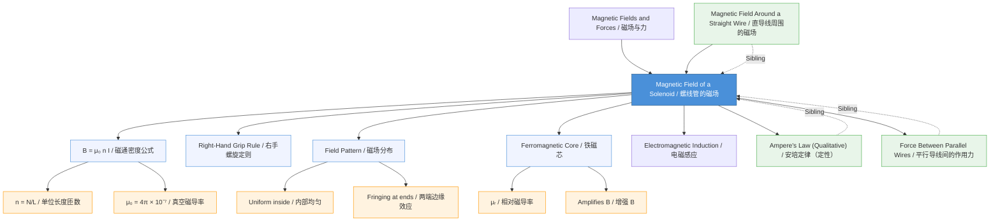

# Magnetic Field of a Solenoid / 螺线管的磁场

---

# 1. Overview / 概述

**English:**
A solenoid is a long, tightly wound helical coil of insulated wire. When an electric current flows through it, the solenoid produces a magnetic field that is remarkably uniform inside the coil and very weak outside — closely resembling the field of a bar magnet. This sub-topic focuses on understanding the magnetic field pattern of a solenoid, deriving the formula for the magnetic flux density $B$ inside an ideal solenoid, and applying the right-hand grip rule to determine polarity. The solenoid is a fundamental component in electromagnets, relays, and inductors, making it essential for understanding [[Electromagnetic Induction]] and practical applications in motors and generators. This leaf node builds on [[Magnetic Fields and Forces]] and connects to sibling topics like [[Magnetic Field Around a Straight Wire]] and [[Ampere's Law (Qualitative)]].

**中文:**
螺线管是由绝缘导线紧密缠绕而成的长螺旋线圈。当电流通过时，螺线管内部会产生非常均匀的磁场，外部磁场则非常弱——这与条形磁铁的磁场非常相似。本子知识点重点理解螺线管的磁场分布、推导理想螺线管内部磁通密度 $B$ 的公式，以及运用右手螺旋定则判断极性。螺线管是电磁铁、继电器和电感器的核心部件，对于理解[[电磁感应]]以及电机和发电机的实际应用至关重要。本叶节点建立在[[磁场与力]]的基础上，并与[[直导线周围的磁场]]和[[安培定律（定性）]]等兄弟知识点相关联。

---

# 2. Syllabus Learning Objectives / 考纲学习目标

| CAIE 9702 (20.2 a-d) | Edexcel IAL (WPH14 U4: 3.6-3.9) |
|----------------------|--------------------------------|
| (a) Sketch magnetic field lines for a solenoid | (a) Describe the magnetic field pattern of a solenoid |
| (b) Determine the polarity of a solenoid using the right-hand grip rule | (b) Use the right-hand grip rule to determine solenoid polarity |
| (c) Recall and use $B = \mu_0 n I$ for the magnetic flux density inside a long solenoid | (c) Derive and apply $B = \mu_0 n I$ for an ideal solenoid |
| (d) Understand the effect of a ferromagnetic core on the magnetic field | (d) Explain the effect of a ferromagnetic core on $B$ |

**Examiner Expectations / 考官期望:**
- **CAIE:** Students must be able to sketch field lines showing uniformity inside and fringing at ends. Derivation of $B = \mu_0 n I$ is not required, but recall and application are essential.
- **Edexcel:** Students should be able to derive $B = \mu_0 n I$ using [[Ampere's Law (Qualitative)]] for an ideal solenoid. Understanding the role of $\mu_0$ (permeability of free space) and $\mu_r$ (relative permeability) for ferromagnetic cores is expected.

---

# 3. Core Definitions / 核心定义

| Term (EN/CN) | Definition (EN) | Definition (CN) | Common Mistakes / 常见错误 |
|--------------|-----------------|-----------------|---------------------------|
| **Solenoid** / 螺线管 | A long, tightly wound helical coil of insulated wire that produces a uniform magnetic field inside when current flows. | 由绝缘导线紧密缠绕而成的长螺旋线圈，通电时内部产生均匀磁场。 | Confusing with a simple coil (short solenoid); assuming field is uniform everywhere. |
| **Magnetic Flux Density $B$** / 磁通密度 $B$ | The strength of the magnetic field inside the solenoid, measured in tesla (T). | 螺线管内部磁场强度，单位为特斯拉（T）。 | Forgetting that $B$ depends on $n$ (turns per unit length), not total turns. |
| **Turns per Unit Length $n$** / 单位长度匝数 $n$ | The number of turns of wire per metre along the solenoid: $n = N/L$. | 沿螺线管每米长度的线圈匝数：$n = N/L$。 | Using total turns $N$ instead of $n$ in the formula. |
| **Permeability of Free Space $\mu_0$** / 真空磁导率 $\mu_0$ | A fundamental constant: $\mu_0 = 4\pi \times 10^{-7} \, \text{H m}^{-1}$ (or T m A$^{-1}$). | 基本常数：$\mu_0 = 4\pi \times 10^{-7} \, \text{H m}^{-1}$（或 T m A$^{-1}$）。 | Forgetting the $4\pi$ factor; using wrong units. |
| **Right-Hand Grip Rule** / 右手螺旋定则 | A rule to determine the polarity of a solenoid: if fingers curl in the direction of current, the thumb points to the north pole. | 判断螺线管极性的规则：四指弯曲方向为电流方向，拇指指向北极。 | Confusing with the rule for a straight wire (thumb = current, fingers = field). |
| **Ferromagnetic Core** / 铁磁芯 | A material (e.g., iron) placed inside the solenoid to greatly increase $B$ due to its high relative permeability $\mu_r$. | 放置在螺线管内部的材料（如铁），因其高相对磁导率 $\mu_r$ 而大幅增强 $B$。 | Thinking the core creates a new field; it aligns existing magnetic domains. |

---

# 4. Key Concepts Explained / 关键概念详解

## 4.1 Magnetic Field Pattern of a Solenoid / 螺线管的磁场分布

### Explanation / 解释
**English:**
A solenoid's magnetic field is the superposition of the fields from each individual loop of wire. Inside a long solenoid, the fields from adjacent loops add constructively, producing a **uniform** magnetic field parallel to the axis. Outside the solenoid, the fields largely cancel, resulting in a very weak field. The field lines emerge from the **north pole** and enter the **south pole**, exactly like a bar magnet. At the ends, the field lines "fringe" outward — this is called the **fringing effect**. For an ideal (infinitely long) solenoid, the field is perfectly uniform inside and zero outside.

**中文:**
螺线管的磁场是每个线圈环产生的磁场的叠加。在长螺线管内部，相邻线圈的磁场相长叠加，产生平行于轴线的**均匀**磁场。在螺线管外部，磁场大部分相互抵消，因此磁场非常弱。磁感线从**北极**发出，进入**南极**，与条形磁铁完全相同。在两端，磁感线向外"发散"——这称为**边缘效应**。对于理想（无限长）螺线管，内部磁场完全均匀，外部磁场为零。

### Physical Meaning / 物理意义
**English:**
The uniformity of the field inside a solenoid is crucial for applications like [[Electromagnetic Induction]] in transformers and inductors, where a predictable, constant $B$ is needed. The solenoid effectively "concentrates" the magnetic field into a confined region.

**中文:**
螺线管内部磁场的均匀性对于变压器和电感器等[[电磁感应]]应用至关重要，这些应用需要可预测且恒定的 $B$。螺线管有效地将磁场"集中"到一个受限区域。

### Common Misconceptions / 常见误区
- **Misconception:** The magnetic field is strongest at the ends of the solenoid.
  **Correction:** The field is strongest and most uniform at the centre. The field at the ends is weaker and non-uniform.
- **Misconception:** The field outside a real solenoid is exactly zero.
  **Correction:** For a real (finite) solenoid, there is a weak external field, especially near the ends.
- **Misconception:** Increasing total turns $N$ always increases $B$.
  **Correction:** $B$ depends on $n = N/L$. If you add turns but also increase length proportionally, $B$ stays the same.

### Exam Tips / 考试提示
- **CAIE:** Be prepared to sketch the field lines, showing parallel lines inside and curved lines outside with arrows.
- **Edexcel:** You may be asked to derive $B = \mu_0 n I$ using [[Ampere's Law (Qualitative)]] — know the rectangular Amperian loop method.

> 📷 **IMAGE PROMPT — SOL-01: Magnetic Field Lines of a Solenoid**
> A detailed cross-section diagram of a long solenoid showing the helical wire windings. Inside the solenoid, draw parallel, evenly spaced magnetic field lines (arrows pointing from south to north inside). Outside, show curved field lines connecting the north pole (right end) to the south pole (left end), with fringing at the ends. Label: "Uniform field inside", "Fringing field at ends", "North pole", "South pole", "Current direction (I)". Use a clean, educational style with blue field lines and red arrows.

---

## 4.2 Right-Hand Grip Rule for Solenoid Polarity / 右手螺旋定则判断螺线管极性

### Explanation / 解释
**English:**
To determine the polarity of a solenoid:
1. Grip the solenoid with your right hand so that your **fingers curl in the direction of the conventional current** (from positive to negative) flowing through the coils.
2. Your **thumb points toward the north pole** of the solenoid.

This is the same rule used for [[Magnetic Field Around a Straight Wire]], but applied differently: for a straight wire, the thumb points in the direction of current and fingers show the field direction; for a solenoid, the fingers show the current direction and the thumb shows the field direction (north pole).

**中文:**
判断螺线管极性的方法：
1. 用右手握住螺线管，使**四指弯曲方向与电流方向一致**（从正极到负极）。
2. **拇指指向螺线管的北极**。

这与[[直导线周围的磁场]]使用的规则相同，但应用方式不同：对于直导线，拇指指向电流方向，四指指向磁场方向；对于螺线管，四指指向电流方向，拇指指向磁场方向（北极）。

### Physical Meaning / 物理意义
**English:**
This rule allows you to quickly determine which end of a solenoid acts as a north or south pole without complex calculations. This is essential for predicting the direction of force in [[Magnetic Fields and Forces]] applications, such as in electric motors.

**中文:**
该规则可以快速判断螺线管的哪一端是北极或南极，无需复杂计算。这对于预测[[磁场与力]]应用（如电动机）中的受力方向至关重要。

### Common Misconceptions / 常见误区
- **Misconception:** The thumb points in the direction of the magnetic field inside the solenoid.
  **Correction:** The thumb points to the north pole, which is the direction of the field **outside** the solenoid (from north to south). Inside, the field goes from south to north.
- **Misconception:** Using the left hand instead of the right.
  **Correction:** Always use the **right hand** for conventional current.

### Exam Tips / 考试提示
- Draw a clear diagram showing the current direction in the coils and label the north/south poles.
- Remember: "Fingers = Current, Thumb = North" for solenoids.

> 📷 **IMAGE PROMPT — SOL-02: Right-Hand Grip Rule for Solenoid**
> A 3D-style illustration of a right hand gripping a transparent solenoid. The fingers curl in the direction of the current (shown by arrows on the coils). The thumb points to the right end, labelled "North Pole (N)". The left end is labelled "South Pole (S)". Inside the solenoid, draw a straight arrow from S to N. Use a clear, educational style with a light background.

---

## 4.3 Formula for Magnetic Flux Density Inside a Solenoid / 螺线管内部磁通密度公式

### Explanation / 解释
**English:**
For an **ideal solenoid** (infinitely long, tightly wound), the magnetic flux density $B$ inside is given by:

$$ B = \mu_0 n I $$

where:
- $\mu_0 = 4\pi \times 10^{-7} \, \text{T m A}^{-1}$ (permeability of free space)
- $n = N/L$ (number of turns per unit length, in m$^{-1}$)
- $I$ = current (in A)

This formula shows that $B$ is:
- **Proportional** to the current $I$
- **Proportional** to the number of turns per unit length $n$
- **Independent** of the solenoid's cross-sectional area (for an ideal solenoid)
- **Uniform** at all points inside (for an ideal solenoid)

**中文:**
对于**理想螺线管**（无限长、紧密缠绕），内部磁通密度 $B$ 的公式为：

$$ B = \mu_0 n I $$

其中：
- $\mu_0 = 4\pi \times 10^{-7} \, \text{T m A}^{-1}$（真空磁导率）
- $n = N/L$（单位长度匝数，单位为 m$^{-1}$）
- $I$ = 电流（单位为 A）

该公式表明 $B$：
- 与电流 $I$ **成正比**
- 与单位长度匝数 $n$ **成正比**
- 与螺线管横截面积**无关**（对于理想螺线管）
- 内部所有点**均匀**（对于理想螺线管）

### Physical Meaning / 物理意义
**English:**
The formula $B = \mu_0 n I$ quantifies how effectively a solenoid concentrates magnetic field energy. Increasing $n$ (by winding more turns per metre) or increasing $I$ both strengthen the field. The constant $\mu_0$ reflects the magnetic properties of free space.

**中文:**
公式 $B = \mu_0 n I$ 量化了螺线管集中磁场能量的效率。增加 $n$（每米缠绕更多匝数）或增加 $I$ 都能增强磁场。常数 $\mu_0$ 反映了真空的磁性质。

### Common Misconceptions / 常见误区
- **Misconception:** $B$ depends on the total number of turns $N$.
  **Correction:** $B$ depends on $n = N/L$. A short solenoid with many turns can have a high $n$, but the field may not be uniform.
- **Misconception:** $B$ is the same inside and outside.
  **Correction:** Inside is strong and uniform; outside is very weak (≈ 0 for ideal).
- **Misconception:** The formula applies to any coil.
  **Correction:** It applies only to **long** solenoids where $L \gg \text{diameter}$.

### Exam Tips / 考试提示
- **CAIE:** You must recall and use $B = \mu_0 n I$ directly.
- **Edexcel:** You may need to derive it using [[Ampere's Law (Qualitative)]] — practice the rectangular Amperian loop derivation.
- Always check units: $n$ must be in m$^{-1}$, $I$ in A.

---

## 4.4 Effect of a Ferromagnetic Core / 铁磁芯的影响

### Explanation / 解释
**English:**
Inserting a ferromagnetic material (e.g., iron, steel, nickel) into the solenoid dramatically increases the magnetic flux density. The formula becomes:

$$ B = \mu_0 \mu_r n I $$

where $\mu_r$ is the **relative permeability** of the core material. For iron, $\mu_r$ can be several thousand (e.g., $\mu_r \approx 5000$), so $B$ can be thousands of times stronger.

The core material contains magnetic domains that align with the external field, producing a much stronger net field. This is why [[Electromagnetic Induction]] in transformers uses iron cores.

**中文:**
在螺线管中插入铁磁材料（如铁、钢、镍）会显著增加磁通密度。公式变为：

$$ B = \mu_0 \mu_r n I $$

其中 $\mu_r$ 是铁芯材料的**相对磁导率**。对于铁，$\mu_r$ 可达数千（例如 $\mu_r \approx 5000$），因此 $B$ 可增强数千倍。

铁芯材料含有磁畴，这些磁畴会沿外部磁场方向排列，产生更强的净磁场。这就是变压器中的[[电磁感应]]使用铁芯的原因。

### Physical Meaning / 物理意义
**English:**
The core does not create new magnetic field; it amplifies the existing field by aligning its internal magnetic domains. This is a key principle in electromagnets, where a small current can produce a very strong magnetic field.

**中文:**
铁芯不会创造新的磁场，而是通过排列其内部的磁畴来放大现有磁场。这是电磁铁的关键原理——小电流可以产生非常强的磁场。

### Common Misconceptions / 常见误区
- **Misconception:** The core creates its own independent magnetic field.
  **Correction:** The core amplifies the solenoid's field; without the solenoid's current, the core has no net field (unless it's a permanent magnet).
- **Misconception:** $\mu_r$ is constant for all ferromagnetic materials.
  **Correction:** $\mu_r$ varies with material and can depend on the strength of the applied field (non-linear).

### Exam Tips / 考试提示
- Know that $\mu_r$ is dimensionless and $\mu = \mu_0 \mu_r$ is the absolute permeability.
- For Edexcel, you may be asked to calculate $B$ with a core.

> 📋 **Edexcel Only:** Derivation of $B = \mu_0 n I$ using Ampere's Law is required.

---

# 5. Essential Equations / 核心公式

## 5.1 Magnetic Flux Density Inside an Ideal Solenoid / 理想螺线管内部磁通密度

$$ B = \mu_0 n I = \mu_0 \frac{N}{L} I $$

| Symbol (符号) | Meaning (EN) | Meaning (CN) | Unit (单位) |
|--------------|-------------|-------------|------------|
| $B$ | Magnetic flux density | 磁通密度 | T (tesla) |
| $\mu_0$ | Permeability of free space | 真空磁导率 | T m A$^{-1}$ (or H m$^{-1}$) |
| $n$ | Number of turns per unit length | 单位长度匝数 | m$^{-1}$ |
| $N$ | Total number of turns | 总匝数 | dimensionless |
| $L$ | Length of solenoid | 螺线管长度 | m |
| $I$ | Current | 电流 | A |

**Derivation / 推导:**
- **Edexcel only:** Using [[Ampere's Law (Qualitative)]] with a rectangular Amperian loop of length $l$: one side inside the solenoid (field $B$), one side outside (field ≈ 0). The enclosed current is $n l I$. Ampere's Law gives $B l = \mu_0 (n l I)$, so $B = \mu_0 n I$.
- **CAIE:** Not required to derive, but must recall and apply.

**Conditions / 适用条件:**
- **English:** The solenoid must be **long** compared to its diameter ($L \gg \text{diameter}$). The formula gives the field at the **centre** of the solenoid. For real solenoids, the field at the ends is approximately half the central value.
- **中文:** 螺线管必须**很长**（长度远大于直径）。该公式给出螺线管**中心**的磁场。对于实际螺线管，两端的磁场约为中心值的一半。

**Limitations / 局限性:**
- **English:** Does not account for fringing effects at the ends. Assumes perfectly uniform winding. Does not apply to short coils or solenoids with large gaps between turns.
- **中文:** 未考虑两端的边缘效应。假设绕组完全均匀。不适用于短线圈或匝间间隙较大的螺线管。

## 5.2 With Ferromagnetic Core / 含铁磁芯

$$ B = \mu_0 \mu_r n I $$

| Symbol (符号) | Meaning (EN) | Meaning (CN) | Unit (单位) |
|--------------|-------------|-------------|------------|
| $\mu_r$ | Relative permeability of core material | 铁芯材料的相对磁导率 | dimensionless |

**Conditions / 适用条件:**
- **English:** $\mu_r$ is assumed constant (linear approximation). In reality, $\mu_r$ can vary with $B$ (magnetic saturation).
- **中文:** 假设 $\mu_r$ 为常数（线性近似）。实际上，$\mu_r$ 可能随 $B$ 变化（磁饱和）。

---

# 6. Graphs and Relationships / 图表与关系

## 6.1 Magnetic Flux Density $B$ vs. Position Along Solenoid Axis / 磁通密度 $B$ 沿螺线管轴线的变化

### Axes / 坐标轴
- **X-axis:** Position along the solenoid axis (from left end to right end) / 沿螺线管轴线的位置（从左端到右端）
- **Y-axis:** Magnetic flux density $B$ / 磁通密度 $B$

### Shape / 形状
- **English:** A plateau (constant $B$) in the central region, dropping off sharply near the ends to about half the central value at the ends, then decreasing to near zero outside.
- **中文:** 中心区域为平台（$B$ 恒定），两端附近急剧下降至中心值的一半左右，然后在外部降至接近零。

### Gradient Meaning / 斜率含义
- **English:** The gradient represents the rate of change of $B$ with position. It is zero in the uniform region and large (negative or positive) near the ends.
- **中文:** 斜率表示 $B$ 随位置的变化率。在均匀区域为零，在两端附近较大（负或正）。

### Area Meaning / 面积含义
- **English:** The area under the $B$ vs. position graph is related to the magnetic flux $\Phi = BA$ through a cross-section, but this is more relevant to [[Electromagnetic Induction]].
- **中文:** $B$ 随位置变化曲线下的面积与通过横截面的磁通量 $\Phi = BA$ 有关，但这更适用于[[电磁感应]]。

### Exam Interpretation / 考试解读
- **English:** Be able to sketch this graph and explain why $B$ is uniform in the centre and drops at the ends. Understand that a longer solenoid gives a wider uniform region.
- **中文:** 能够绘制此图并解释为什么 $B$ 在中心均匀而在两端下降。理解更长的螺线管提供更宽的均匀区域。

> 📷 **IMAGE PROMPT — SOL-03: B vs Position Along Solenoid Axis**
> A graph with "Position along axis" on the x-axis and "Magnetic flux density B" on the y-axis. Show a flat plateau in the middle (labelled "Uniform field"), a sharp drop at both ends (labelled "End effects"), and near-zero values outside. Label the central value as "B = μ₀nI". Use a clean, educational style with a grid.

---

## 6.2 Magnetic Flux Density $B$ vs. Current $I$ / 磁通密度 $B$ 随电流 $I$ 的变化

### Axes / 坐标轴
- **X-axis:** Current $I$ (A) / 电流 $I$ (A)
- **Y-axis:** Magnetic flux density $B$ (T) / 磁通密度 $B$ (T)

### Shape / 形状
- **English:** A straight line through the origin, showing direct proportionality: $B \propto I$.
- **中文:** 一条通过原点的直线，显示正比关系：$B \propto I$。

### Gradient Meaning / 斜率含义
- **English:** The gradient is $\mu_0 n$ (without core) or $\mu_0 \mu_r n$ (with core). It represents the magnetic field produced per unit current.
- **中文:** 斜率为 $\mu_0 n$（无铁芯）或 $\mu_0 \mu_r n$（有铁芯）。它表示单位电流产生的磁场。

### Area Meaning / 面积含义
- **English:** Not applicable for this graph.
- **中文:** 此图不适用。

### Exam Interpretation / 考试解读
- **English:** Use this graph to determine $\mu_0$ or $\mu_r$ experimentally. The linear relationship confirms the formula.
- **中文:** 使用此图通过实验确定 $\mu_0$ 或 $\mu_r$。线性关系验证了公式。

---

# 7. Required Diagrams / 必备图表

## 7.1 Magnetic Field Lines of a Solenoid / 螺线管的磁感线

### Description / 描述
**English:** A cross-sectional diagram showing the solenoid as a series of circular loops. Inside, draw parallel, evenly spaced straight lines with arrows pointing from the south pole to the north pole (inside the solenoid). Outside, draw curved lines connecting the north pole to the south pole, with fringing at the ends.

**中文:** 横截面图，显示螺线管由一系列圆形线圈组成。内部绘制平行、等距的直线，箭头从南极指向北极（螺线管内部）。外部绘制连接北极到南极的曲线，两端有边缘效应。

### Image Prompt / 图片生成提示
> 📷 **IMAGE PROMPT — SOL-01: Magnetic Field Lines of a Solenoid**
> (Same as in Section 4.1)

### Labels Required / 需要标注
- **English:** "Uniform field inside", "Fringing field at ends", "North pole (N)", "South pole (S)", "Current direction (I)", "Solenoid coils"
- **中文:** "内部均匀磁场", "两端边缘磁场", "北极 (N)", "南极 (S)", "电流方向 (I)", "螺线管线圈"

### Exam Importance / 考试重要性
- **English:** High. Both CAIE and Edexcel expect students to sketch and interpret this diagram.
- **中文:** 高。CAIE 和 Edexcel 都要求学生绘制并解释此图。

---

## 7.2 Right-Hand Grip Rule Diagram / 右手螺旋定则示意图

### Description / 描述
**English:** A diagram showing a right hand gripping a solenoid. The fingers curl in the direction of the current, and the thumb points to the north pole.

**中文:** 显示右手握住螺线管的示意图。四指弯曲方向为电流方向，拇指指向北极。

### Image Prompt / 图片生成提示
> 📷 **IMAGE PROMPT — SOL-02: Right-Hand Grip Rule for Solenoid**
> (Same as in Section 4.2)

### Labels Required / 需要标注
- **English:** "Current direction (fingers)", "North pole (thumb)", "South pole", "Solenoid"
- **中文:** "电流方向（四指）", "北极（拇指）", "南极", "螺线管"

### Exam Importance / 考试重要性
- **English:** High. Frequently tested in multiple-choice and short-answer questions.
- **中文:** 高。常在选择题和简答题中考查。

---

## 7.3 Amperian Loop for Derivation (Edexcel) / 安培环路推导图（Edexcel）

### Description / 描述
**English:** A rectangular Amperian loop of length $l$ placed partly inside and partly outside the solenoid. One side is inside (where $B$ is uniform and parallel), the opposite side is outside (where $B \approx 0$).

**中文:** 一个长度为 $l$ 的矩形安培环路，部分在螺线管内部，部分在外部。一边在内部（$B$ 均匀且平行），对边在外部（$B \approx 0$）。

### Image Prompt / 图片生成提示
> 📷 **IMAGE PROMPT — SOL-04: Amperian Loop for Solenoid Derivation**
> A cross-section of a solenoid with a rectangular Amperian loop (dashed line) of length l. One side of the loop is inside the solenoid (labelled "B ≠ 0, parallel to side"), the opposite side is outside (labelled "B ≈ 0"). The other two sides are perpendicular to the field. Show the current direction in the solenoid coils. Use a clean, educational style.

### Labels Required / 需要标注
- **English:** "Amperian loop", "Side inside solenoid (B ≠ 0)", "Side outside solenoid (B ≈ 0)", "Current I", "Length l"
- **中文:** "安培环路", "螺线管内部边 (B ≠ 0)", "螺线管外部边 (B ≈ 0)", "电流 I", "长度 l"

### Exam Importance / 考试重要性
- **English:** High for Edexcel; not required for CAIE.
- **中文:** 对 Edexcel 高；CAIE 不要求。

---

# 8. Worked Examples / 典型例题

## Example 1: Calculating Magnetic Flux Density / 计算磁通密度

### Question / 题目
**English:**
A solenoid has a length of 0.50 m and is wound with 2000 turns of wire. A current of 3.0 A flows through the coil. Calculate the magnetic flux density inside the solenoid. ($\mu_0 = 4\pi \times 10^{-7} \, \text{T m A}^{-1}$)

**中文:**
一个螺线管长度为 0.50 m，缠绕了 2000 匝导线。线圈中通有 3.0 A 的电流。计算螺线管内部的磁通密度。（$\mu_0 = 4\pi \times 10^{-7} \, \text{T m A}^{-1}$）

### Solution / 解答

**Step 1: Calculate $n$ (turns per unit length) / 计算 $n$（单位长度匝数）**

$$ n = \frac{N}{L} = \frac{2000}{0.50} = 4000 \, \text{m}^{-1} $$

**Step 2: Apply the formula / 应用公式**

$$ B = \mu_0 n I = (4\pi \times 10^{-7}) \times 4000 \times 3.0 $$

**Step 3: Calculate / 计算**

$$ B = 4\pi \times 10^{-7} \times 1.2 \times 10^4 = 4\pi \times 1.2 \times 10^{-3} $$

$$ B = 4.8\pi \times 10^{-3} \approx 0.0151 \, \text{T} $$

### Final Answer / 最终答案
**Answer:** $B = 0.0151 \, \text{T}$ (or $1.51 \times 10^{-2} \, \text{T}$) | **答案：** $B = 0.0151 \, \text{T}$（或 $1.51 \times 10^{-2} \, \text{T}$）

### Quick Tip / 提示
- **English:** Always convert length to metres and calculate $n$ first. Remember $\mu_0 = 4\pi \times 10^{-7}$.
- **中文:** 始终将长度转换为米，并先计算 $n$。记住 $\mu_0 = 4\pi \times 10^{-7}$。

---

## Example 2: Effect of a Ferromagnetic Core / 铁磁芯的影响

### Question / 题目
**English:**
The solenoid from Example 1 is now filled with an iron core of relative permeability $\mu_r = 5000$. Calculate the new magnetic flux density inside the solenoid.

**中文:**
将例 1 中的螺线管插入相对磁导率 $\mu_r = 5000$ 的铁芯。计算螺线管内部新的磁通密度。

### Solution / 解答

**Step 1: Use the formula with core / 使用含铁芯的公式**

$$ B = \mu_0 \mu_r n I $$

**Step 2: Substitute values / 代入数值**

$$ B = (4\pi \times 10^{-7}) \times 5000 \times 4000 \times 3.0 $$

$$ B = 5000 \times 0.0151 = 75.5 \, \text{T} $$

### Final Answer / 最终答案
**Answer:** $B = 75.5 \, \text{T}$ | **答案：** $B = 75.5 \, \text{T}$

### Quick Tip / 提示
- **English:** The core multiplies $B$ by $\mu_r$. This is why electromagnets use iron cores.
- **中文:** 铁芯将 $B$ 乘以 $\mu_r$。这就是电磁铁使用铁芯的原因。

---

# 9. Past Paper Question Types / 历年真题题型

| Question Type / 题型 | Frequency / 频率 | Difficulty / 难度 | Past Paper References / 真题索引 |
|----------------------|------------------|------------------|-------------------------------|
| Sketch magnetic field lines of a solenoid / 绘制螺线管磁感线 | High | Easy | 📝 *待填入* |
| Determine polarity using right-hand grip rule / 用右手螺旋定则判断极性 | High | Easy | 📝 *待填入* |
| Calculate $B$ using $B = \mu_0 n I$ / 用 $B = \mu_0 n I$ 计算 $B$ | High | Medium | 📝 *待填入* |
| Derive $B = \mu_0 n I$ using Ampere's Law (Edexcel) / 用安培定律推导 $B = \mu_0 n I$（Edexcel） | Medium | Hard | 📝 *待填入* |
| Effect of ferromagnetic core on $B$ / 铁磁芯对 $B$ 的影响 | Medium | Medium | 📝 *待填入* |
| Compare solenoid field to bar magnet / 比较螺线管磁场与条形磁铁 | Low | Easy | 📝 *待填入* |

**Common Command Words / 常见指令词:**
- **English:** Sketch, Determine, Calculate, Derive, Explain, State
- **中文:** 绘制、确定、计算、推导、解释、陈述

---

# 10. Practical Skills Connections / 实验技能链接

**English:**
This sub-topic connects to practical work in several ways:

1. **Measuring $B$ inside a solenoid:** Use a Hall probe connected to a data logger to measure $B$ at various points along the axis. Plot $B$ vs. position to verify the uniform field region.
2. **Investigating $B \propto I$:** Vary the current and measure $B$ at the centre. Plot $B$ vs. $I$ to find $\mu_0 n$ from the gradient.
3. **Effect of core:** Insert different materials (air, iron, copper) and measure $B$ to determine $\mu_r$.
4. **Uncertainties:** Consider the uncertainty in $L$ (length measurement), $N$ (counting turns), $I$ (ammeter reading), and $B$ (Hall probe calibration).
5. **Graph plotting:** Plot $B$ vs. $I$ and draw a line of best fit. The gradient gives $\mu_0 n$.

**中文:**
本子知识点通过以下方式与实验工作联系：

1. **测量螺线管内部的 $B$：** 使用连接到数据记录器的霍尔探头测量轴线上各点的 $B$。绘制 $B$ 随位置变化的曲线以验证均匀磁场区域。
2. **研究 $B \propto I$：** 改变电流并测量中心处的 $B$。绘制 $B$ 随 $I$ 变化的曲线，从斜率求出 $\mu_0 n$。
3. **铁芯的影响：** 插入不同材料（空气、铁、铜）并测量 $B$ 以确定 $\mu_r$。
4. **不确定度：** 考虑 $L$（长度测量）、$N$（匝数计数）、$I$（电流表读数）和 $B$（霍尔探头校准）的不确定度。
5. **绘图：** 绘制 $B$ 随 $I$ 变化的曲线并画出最佳拟合直线。斜率给出 $\mu_0 n$。

---

# 11. Concept Map / 概念图谱

---

# 12. Quick Revision Sheet / 速查表

| Category / 类别 | Key Points / 要点 |
|----------------|------------------|
| **Definition / 定义** | A solenoid is a long, tightly wound helical coil producing a uniform magnetic field inside. / 螺线管是长而紧密缠绕的螺旋线圈，内部产生均匀磁场。 |
| **Key Formula / 核心公式** | $B = \mu_0 n I$ (no core) / $B = \mu_0 \mu_r n I$ (with core) |
| **Key Graph / 核心图表** | $B$ vs. position: plateau inside, drop at ends. $B$ vs. $I$: straight line through origin. / $B$ 随位置变化：内部平台，两端下降。$B$ 随 $I$ 变化：通过原点的直线。 |
| **Right-Hand Rule / 右手定则** | Fingers = current direction, Thumb = north pole. / 四指 = 电流方向，拇指 = 北极。 |
| **Key Assumptions / 关键假设** | Long solenoid ($L \gg$ diameter), tightly wound, uniform current. / 长螺线管（$L \gg$ 直径），紧密缠绕，电流均匀。 |
| **Core Effect / 铁芯效应** | $B$ multiplied by $\mu_r$ (e.g., $\mu_r \approx 5000$ for iron). / $B$ 乘以 $\mu_r$（例如铁的 $\mu_r \approx 5000$）。 |
| **Common Mistake / 常见错误** | Using total turns $N$ instead of $n = N/L$. / 使用总匝数 $N$ 而不是 $n = N/L$。 |
| **Exam Tip / 考试提示** | Always sketch field lines with arrows. For Edexcel, practice the Amperian loop derivation. / 始终绘制带箭头的磁感线。对于 Edexcel，练习安培环路推导。 |
| **Practical Link / 实验联系** | Use a Hall probe to measure $B$ along the axis; plot $B$ vs. $I$ to find $\mu_0 n$. / 使用霍尔探头测量轴线上的 $B$；绘制 $B$ 随 $I$ 变化的曲线以求出 $\mu_0 n$。 |
| **Related Topics / 相关主题** | [[Magnetic Fields and Forces]], [[Electromagnetic Induction]], [[Magnetic Field Around a Straight Wire]] |