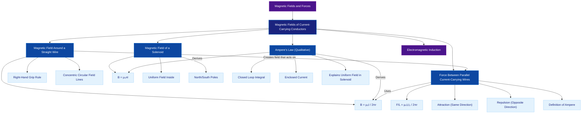

# 1. Overview / 概述

**English:**
This topic explores the magnetic fields produced by electric currents flowing through conductors. It forms the foundation of electromagnetism, demonstrating how electricity and magnetism are intrinsically linked. The study begins with the magnetic field pattern around a straight current-carrying wire, extends to the uniform field inside a solenoid, and culminates in understanding the forces between parallel current-carrying wires. This knowledge is crucial for understanding [[Electromagnetic Induction]], electric motors, transformers, and magnetic levitation systems. In both Cambridge 9702 and Edexcel IAL examinations, this topic is assessed through field pattern diagrams, calculations using $B = \frac{\mu_0 I}{2\pi r}$ and $B = \mu_0 n I$, and explanations of the forces between conductors. Real-world applications include MRI machines, particle accelerators, and maglev trains.

**中文：**
本专题探讨电流通过导体时产生的磁场。它构成了电磁学的基础，展示了电与磁之间的内在联系。研究从载流直导线周围的磁场图案开始，延伸到螺线管内部的均匀磁场，最终理解平行载流导线之间的作用力。这些知识对于理解[[电磁感应]]、电动机、变压器和磁悬浮系统至关重要。在剑桥9702和爱德思IAL考试中，本专题通过磁场图案图、使用 $B = \frac{\mu_0 I}{2\pi r}$ 和 $B = \mu_0 n I$ 的计算，以及导体间作用力的解释来评估。实际应用包括MRI机器、粒子加速器和磁悬浮列车。

---

# 2. Syllabus Learning Objectives / 考纲学习目标

| CAIE 9702 | Edexcel IAL |
|-----------|-------------|
| 20.2(a) Sketch magnetic field patterns for a long straight current-carrying wire, a flat circular coil, and a long solenoid | 3.6 Understand the concept of magnetic field lines and sketch magnetic field patterns for a long straight current-carrying wire, a flat circular coil, and a long solenoid |
| 20.2(b) Determine the direction of the magnetic field using the right-hand grip rule | 3.7 Use the right-hand grip rule to determine the direction of the magnetic field around a current-carrying conductor |
| 20.2(c) Use $B = \frac{\mu_0 I}{2\pi r}$ for the magnetic flux density near a long straight wire | 3.8 Use $B = \frac{\mu_0 I}{2\pi r}$ for the magnetic flux density at a distance $r$ from a long straight wire carrying current $I$ |
| 20.2(d) Use $B = \mu_0 n I$ for the magnetic flux density inside a long solenoid | 3.9 Use $B = \mu_0 n I$ for the magnetic flux density inside a long solenoid |

**Examiner Expectations / 考官期望:**

**English:**
- Candidates must be able to sketch accurate field patterns showing direction using arrows
- The right-hand grip rule must be applied correctly for both wires and solenoids
- Calculations must use correct SI units ($\mu_0 = 4\pi \times 10^{-7} \, \text{H m}^{-1}$)
- For solenoids, $n$ is the number of turns per unit length ($N/L$)
- Understanding that the field outside a long solenoid is approximately zero

**中文：**
- 考生必须能够绘制准确的磁场图案，并用箭头表示方向
- 右手螺旋定则必须正确应用于导线和螺线管
- 计算必须使用正确的SI单位（$\mu_0 = 4\pi \times 10^{-7} \, \text{H m}^{-1}$）
- 对于螺线管，$n$ 是单位长度的匝数（$N/L$）
- 理解长螺线管外部的磁场近似为零

> 📋 **CIE Only:** CAIE specifically requires sketching field patterns for a flat circular coil, which Edexcel does not explicitly list but may still assess.
> 
> 📋 **Edexcel Only:** Edexcel explicitly mentions "magnetic field lines" concept and may ask about the nature of field lines (continuous, direction from N to S).

---

# 3. Core Definitions / 核心定义

| Term (EN/CN) | Definition (EN) | Definition (CN) | Common Mistakes / 常见错误 |
|--------------|-----------------|-----------------|---------------------------|
| **Magnetic Flux Density** / 磁通密度 | The force per unit current per unit length on a current-carrying conductor placed perpendicular to a magnetic field | 垂直于磁场放置的载流导体上单位电流单位长度所受的力 | Confusing with magnetic flux ($\Phi$) — flux density is $B$, flux is $\Phi = BA$ |
| **Magnetic Field Lines** / 磁场线 | Imaginary lines used to represent the direction and strength of a magnetic field; direction is from N to S outside a magnet | 用于表示磁场方向和强度的假想线；在磁体外部方向从N到S | Thinking field lines start at N and end at S — they are continuous loops |
| **Right-Hand Grip Rule** / 右手螺旋定则 | A rule to determine the direction of the magnetic field around a current-carrying conductor: if the thumb points in the direction of conventional current, the fingers curl in the direction of the magnetic field | 确定载流导体周围磁场方向的规则：拇指指向常规电流方向，手指弯曲方向即为磁场方向 | Using left hand instead of right; confusing with Fleming's left-hand rule |
| **Solenoid** / 螺线管 | A long cylindrical coil of wire that produces a nearly uniform magnetic field inside when current flows through it | 一种长圆柱形线圈，当电流通过时内部产生近似均匀的磁场 | Thinking the field is uniform everywhere — it's only uniform inside, near the centre |
| **Permeability of Free Space** / 真空磁导率 | A physical constant ($\mu_0 = 4\pi \times 10^{-7} \, \text{H m}^{-1}$) that relates magnetic field strength to current in a vacuum | 一个物理常数（$\mu_0 = 4\pi \times 10^{-7} \, \text{H m}^{-1}$），将真空中的磁场强度与电流联系起来 | Forgetting the $4\pi$ factor; using wrong units |
| **Turns per Unit Length** / 单位长度匝数 | The number of turns of wire per metre along the length of a solenoid, denoted by $n = N/L$ | 沿螺线管长度方向每米的导线匝数，用 $n = N/L$ 表示 | Confusing $n$ with total number of turns $N$ |
| **Force Between Parallel Wires** / 平行导线间的作用力 | The force experienced by one current-carrying wire due to the magnetic field produced by another parallel current-carrying wire | 一根载流导线因另一根平行载流导线产生的磁场而受到的力 | Thinking currents in the same direction repel — they attract |

---

# 4. Key Concepts Explained / 关键概念详解

## 4.1 Magnetic Field Around a Straight Wire / 直导线周围的磁场

### Explanation / 解释
**English:**
When an electric current flows through a straight conductor, it produces a [[Magnetic Fields and Forces|magnetic field]] that forms concentric circles around the wire. The field lines are circular loops centred on the wire, lying in planes perpendicular to the wire. The direction of the field is determined by the [[Right-Hand Grip Rule]]: if the thumb of the right hand points in the direction of conventional current (positive to negative), the curled fingers indicate the direction of the magnetic field lines. The strength of the field decreases with distance from the wire according to the inverse relationship $B \propto \frac{1}{r}$.

**中文：**
当电流通过直导体时，会产生围绕导线的同心圆[[磁场]]。磁场线是以导线为中心的圆形环，位于垂直于导线的平面内。磁场方向由[[右手螺旋定则]]确定：如果右手拇指指向常规电流方向（正极到负极），弯曲的手指指示磁场线的方向。磁场强度随距离的增加按反比关系 $B \propto \frac{1}{r}$ 减小。

### Physical Meaning / 物理意义
**English:**
This concept explains how electric currents create magnetic effects. It is the basis for electromagnets, where a current-carrying wire wrapped around a core produces a controllable magnetic field. In real life, this is why high-voltage power lines can affect compass readings nearby.

**中文：**
这个概念解释了电流如何产生磁效应。它是电磁铁的基础，其中绕在铁芯上的载流导线产生可控磁场。在现实生活中，这就是为什么高压输电线会影响附近指南针读数的原因。

### Common Misconceptions / 常见误区
1. **Field lines are radial** — They are circular, not radial like electric field lines from a point charge.
2. **Field is uniform** — The field strength varies with $1/r$, so it is not uniform.
3. **Direction depends on electron flow** — The right-hand grip rule uses conventional current (positive to negative), not electron flow.
4. **Field exists only inside the wire** — The magnetic field exists in the space around the wire.

### Exam Tips / 考试提示
**English:**
- Always draw at least 3 concentric circles with arrows showing direction
- Label the wire and current direction clearly
- Use the right-hand grip rule correctly — this is a common source of marks
- For calculations, ensure $r$ is in metres and $I$ in amperes

**中文：**
- 始终绘制至少3个同心圆，并用箭头表示方向
- 清晰标注导线和电流方向
- 正确使用右手螺旋定则——这是常见的得分点
- 计算时确保 $r$ 以米为单位，$I$ 以安培为单位

> 📷 **IMAGE PROMPT — MF01: Magnetic Field Around a Straight Wire**
>
> A straight vertical wire carrying current upward. Concentric circular field lines around the wire with arrows indicating anticlockwise direction (viewed from above). Labels: "Current I", "Magnetic field lines B", "Distance r". Clean white background, educational diagram style, 2D cross-section view from above showing circular field lines.

---

## 4.2 Magnetic Field of a Solenoid / 螺线管的磁场

### Explanation / 解释
**English:**
A [[Solenoid]] is a long coil of wire with many turns. When current flows through it, the magnetic fields from each turn combine to produce a strong, nearly uniform field inside the solenoid and a much weaker field outside. The field inside is parallel to the axis of the solenoid. The direction of the field can be determined using the right-hand grip rule: if the fingers curl in the direction of the current around the solenoid, the thumb points in the direction of the magnetic field inside (towards the north pole). The magnetic flux density inside a long solenoid is given by $B = \mu_0 n I$, where $n = N/L$ is the number of turns per unit length.

**中文：**
[[螺线管]]是一个长线圈，有许多匝。当电流通过时，每匝产生的磁场组合在一起，在螺线管内部产生强且近似均匀的磁场，外部磁场则弱得多。内部磁场平行于螺线管的轴线。磁场方向可以用右手螺旋定则确定：如果手指沿螺线管电流方向弯曲，拇指指向内部磁场方向（指向北极）。长螺线管内部的磁通密度由 $B = \mu_0 n I$ 给出，其中 $n = N/L$ 是单位长度的匝数。

### Physical Meaning / 物理意义
**English:**
Solenoids are the basis of electromagnets used in relays, doorbells, MRI machines, and particle accelerators. The ability to create a uniform magnetic field over a volume is essential for many scientific and medical applications.

**中文：**
螺线管是继电器、门铃、MRI机器和粒子加速器中使用的电磁铁的基础。在空间体积内产生均匀磁场的能力对于许多科学和医学应用至关重要。

### Common Misconceptions / 常见误区
1. **Field is uniform everywhere** — The field is only approximately uniform inside, near the centre; it weakens near the ends.
2. **Field outside is zero** — The field outside is very weak but not exactly zero; it's approximately zero for an ideal long solenoid.
3. **$n$ is total turns** — $n$ is turns per unit length ($N/L$), not total turns $N$.
4. **Solenoid has no poles** — A solenoid behaves like a bar magnet with a north and south pole.

### Exam Tips / 考试提示
**English:**
- Draw field lines inside the solenoid as parallel and equally spaced (uniform)
- Show field lines outside as similar to a bar magnet
- Label the north and south poles
- Remember $n = N/L$ — many students forget to divide by length
- For Edexcel, be prepared to explain why the field is uniform inside

**中文：**
- 将螺线管内部的磁场线绘制为平行且等距（均匀）
- 外部的磁场线类似于条形磁铁
- 标注北极和南极
- 记住 $n = N/L$ ——许多学生忘记除以长度
- 对于爱德思，准备解释为什么内部磁场是均匀的

> 📷 **IMAGE PROMPT — MF02: Magnetic Field of a Solenoid**
>
> A long cylindrical solenoid shown in cross-section. Current flowing through the coils indicated by dots (coming out) and crosses (going in). Inside: parallel, equally spaced field lines from left to right. Outside: field lines looping from the right end (N) to the left end (S), similar to a bar magnet. Labels: "North pole", "South pole", "Uniform field inside", "Current I". Educational diagram, clean style.

---

## 4.3 Ampere's Law (Qualitative) / 安培定律（定性）

### Explanation / 解释
**English:**
[[Ampere's Law (Qualitative)]] states that the magnetic field around a closed loop is proportional to the total current passing through the loop. For a straight wire, this means that the magnetic field at a distance $r$ is proportional to the current $I$ and inversely proportional to $r$. This is the qualitative basis for the equation $B = \frac{\mu_0 I}{2\pi r}$. The law explains why the field inside a solenoid is uniform: for any rectangular loop inside the solenoid, the net current enclosed is the same, leading to a constant field.

**中文：**
[[安培定律（定性）]]指出，闭合回路周围的磁场与通过该回路的总电流成正比。对于直导线，这意味着距离 $r$ 处的磁场与电流 $I$ 成正比，与 $r$ 成反比。这是方程 $B = \frac{\mu_0 I}{2\pi r}$ 的定性基础。该定律解释了为什么螺线管内部的磁场是均匀的：对于螺线管内部的任何矩形回路，所包围的净电流相同，导致磁场恒定。

### Physical Meaning / 物理意义
**English:**
Ampere's law provides a fundamental relationship between electric currents and magnetic fields. It is one of Maxwell's equations and is essential for understanding how currents generate magnetic fields in any configuration.

**中文：**
安培定律提供了电流与磁场之间的基本关系。它是麦克斯韦方程组之一，对于理解电流在任何配置下如何产生磁场至关重要。

### Common Misconceptions / 常见误区
1. **Ampere's law is the same as the right-hand grip rule** — The grip rule is a mnemonic; Ampere's law is the physical law.
2. **Only applies to straight wires** — Ampere's law applies to any current distribution, but the simple form $B = \mu_0 I / 2\pi r$ only works for symmetric cases.
3. **Field depends on path shape** — The line integral depends only on the enclosed current, not the path shape.

### Exam Tips / 考试提示
**English:**
- CAIE requires qualitative understanding only — no integration required
- Edexcel may ask about the concept of "enclosed current"
- Be able to explain why the field inside a solenoid is uniform using Ampere's law reasoning
- Understand that the field outside a solenoid is weak because the net enclosed current is zero

**中文：**
- 剑桥仅要求定性理解——不需要积分
- 爱德思可能会问及"包围电流"的概念
- 能够使用安培定律推理解释为什么螺线管内部磁场是均匀的
- 理解螺线管外部磁场弱是因为净包围电流为零

---

## 4.4 Force Between Parallel Current-Carrying Wires / 平行载流导线间的作用力

### Explanation / 解释
**English:**
When two parallel wires carry currents, each wire experiences a force due to the [[Magnetic Fields and Forces|magnetic field]] produced by the other wire. Wire 1 produces a magnetic field $B_1 = \frac{\mu_0 I_1}{2\pi r}$ at the location of Wire 2. Wire 2, carrying current $I_2$, experiences a force $F = B_1 I_2 L$ (from $F = BIL$). The force per unit length is $\frac{F}{L} = \frac{\mu_0 I_1 I_2}{2\pi r}$. If the currents are in the same direction, the wires attract; if opposite, they repel. This is the basis for the definition of the ampere.

**中文：**
当两根平行导线载有电流时，每根导线都会因另一根导线产生的[[磁场]]而受到力。导线1在导线2位置产生磁场 $B_1 = \frac{\mu_0 I_1}{2\pi r}$。载有电流 $I_2$ 的导线2受到力 $F = B_1 I_2 L$（来自 $F = BIL$）。单位长度的力为 $\frac{F}{L} = \frac{\mu_0 I_1 I_2}{2\pi r}$。如果电流方向相同，导线相互吸引；如果方向相反，则相互排斥。这是安培定义的基础。

### Physical Meaning / 物理意义
**English:**
This force explains why high-current power lines can experience mechanical stress and why they are sometimes observed to sway. It is also the principle behind the definition of the ampere: one ampere is the current that, when flowing in two parallel wires 1 metre apart, produces a force of $2 \times 10^{-7} \, \text{N}$ per metre.

**中文：**
这个力解释了为什么大电流输电线会承受机械应力，以及为什么有时会观察到它们摆动。它也是安培定义背后的原理：1安培是当两根相距1米的平行导线中流动时，每米产生 $2 \times 10^{-7} \, \text{N}$ 力的电流。

### Common Misconceptions / 常见误区
1. **Same direction repels** — Same direction attracts; opposite direction repels.
2. **Force is magnetic attraction** — It's not magnetic attraction like magnets; it's due to the magnetic field of one wire acting on the current in the other.
3. **Force depends on distance squared** — Force varies as $1/r$, not $1/r^2$.
4. **Only one wire experiences force** — Both wires experience equal and opposite forces (Newton's third law).

### Exam Tips / 考试提示
**English:**
- Use Fleming's left-hand rule to determine the direction of force on each wire
- Remember that both wires experience forces — they are a Newton's third law pair
- For calculations, use $\frac{F}{L} = \frac{\mu_0 I_1 I_2}{2\pi r}$
- Be prepared to explain the definition of the ampere
- Edexcel may ask about the force on a single wire in a magnetic field created by another

**中文：**
- 使用弗莱明左手定则确定每根导线上的力方向
- 记住两根导线都受力——它们是牛顿第三定律对
- 计算时使用 $\frac{F}{L} = \frac{\mu_0 I_1 I_2}{2\pi r}$
- 准备解释安培的定义
- 爱德思可能会问及单根导线在另一根导线产生的磁场中的受力

> 📷 **IMAGE PROMPT — MF03: Force Between Parallel Wires**
>
> Two parallel wires shown in cross-section. Left wire: current coming out of page (dot). Right wire: current coming out of page (dot). Arrows showing magnetic field lines from left wire as concentric circles. Force arrows pointing towards each other (attraction). Labels: "I₁", "I₂", "B₁ (field from wire 1)", "F (force on wire 2)", "Distance r". Educational diagram, clean 2D style.

---

# 5. Essential Equations / 核心公式

## 5.1 Magnetic Flux Density Near a Straight Wire / 直导线附近的磁通密度

**Equation / 公式:**
$$ B = \frac{\mu_0 I}{2\pi r} $$

**Variables / 变量:**
| Symbol (符号) | Meaning (EN) | Meaning (CN) | Unit (单位) |
|--------------|-------------|-------------|------------|
| $B$ | Magnetic flux density | 磁通密度 | T (tesla) |
| $\mu_0$ | Permeability of free space | 真空磁导率 | H m⁻¹ (henry per metre) |
| $I$ | Current in the wire | 导线中的电流 | A (ampere) |
| $r$ | Perpendicular distance from the wire | 到导线的垂直距离 | m (metre) |

**Derivation / 推导:**
**English:**
This equation is derived from [[Ampere's Law (Qualitative)]]. For a long straight wire, consider a circular path of radius $r$ centred on the wire. The magnetic field $B$ is constant along this path and tangential to it. Ampere's law states:
$$ \oint B \cdot dl = \mu_0 I_{\text{enclosed}} $$
For the circular path, $B$ is parallel to $dl$ at every point, so:
$$ B \times 2\pi r = \mu_0 I $$
Rearranging:
$$ B = \frac{\mu_0 I}{2\pi r} $$

**中文：**
该方程从[[安培定律（定性）]]推导而来。对于长直导线，考虑以导线为中心、半径为 $r$ 的圆形路径。磁场 $B$ 沿此路径恒定且与路径相切。安培定律指出：
$$ \oint B \cdot dl = \mu_0 I_{\text{包围}} $$
对于圆形路径，$B$ 在每一点都与 $dl$ 平行，因此：
$$ B \times 2\pi r = \mu_0 I $$
整理得：
$$ B = \frac{\mu_0 I}{2\pi r} $$

**Conditions / 适用条件:**
**English:**
- Wire must be infinitely long (or very long compared to $r$)
- Wire must be straight
- Distance $r$ must be measured perpendicular to the wire
- Point must be in free space (or air, which has approximately the same permeability)

**中文：**
- 导线必须无限长（或相对于 $r$ 非常长）
- 导线必须是直的
- 距离 $r$ 必须垂直于导线测量
- 点必须在自由空间（或空气，其磁导率近似相同）

**Limitations / 局限性:**
**English:**
- Does not apply near the ends of a finite wire
- Does not apply inside the wire itself
- Assumes the wire has negligible thickness
- Does not account for magnetic materials nearby

**中文：**
- 不适用于有限长度导线的末端附近
- 不适用于导线内部
- 假设导线厚度可忽略
- 不考虑附近的磁性材料

**Rearrangements / 变形:**
$$ I = \frac{2\pi r B}{\mu_0} $$
$$ r = \frac{\mu_0 I}{2\pi B} $$

---

## 5.2 Magnetic Flux Density Inside a Solenoid / 螺线管内部的磁通密度

**Equation / 公式:**
$$ B = \mu_0 n I $$

**Variables / 变量:**
| Symbol (符号) | Meaning (EN) | Meaning (CN) | Unit (单位) |
|--------------|-------------|-------------|------------|
| $B$ | Magnetic flux density inside solenoid | 螺线管内部磁通密度 | T (tesla) |
| $\mu_0$ | Permeability of free space | 真空磁导率 | H m⁻¹ |
| $n$ | Number of turns per unit length ($N/L$) | 单位长度匝数（$N/L$） | m⁻¹ (turns per metre) |
| $I$ | Current in the solenoid | 螺线管中的电流 | A (ampere) |

**Derivation / 推导:**
**English:**
Consider a rectangular Amperian loop of length $L$ inside a long solenoid. One side of the loop is inside the solenoid (where $B = B_{\text{inside}}$), and the other side is outside (where $B \approx 0$). The number of turns enclosed by the loop is $nL$. Applying Ampere's law:
$$ \oint B \cdot dl = \mu_0 I_{\text{enclosed}} $$
$$ B_{\text{inside}} \times L = \mu_0 \times (nL \times I) $$
Cancelling $L$:
$$ B = \mu_0 n I $$

**中文：**
考虑长螺线管内部一个长度为 $L$ 的矩形安培回路。回路的一边在螺线管内部（$B = B_{\text{内部}}$），另一边在外部（$B \approx 0$）。回路包围的匝数为 $nL$。应用安培定律：
$$ \oint B \cdot dl = \mu_0 I_{\text{包围}} $$
$$ B_{\text{内部}} \times L = \mu_0 \times (nL \times I) $$
消去 $L$：
$$ B = \mu_0 n I $$

**Conditions / 适用条件:**
**English:**
- Solenoid must be long compared to its diameter
- Point must be near the centre of the solenoid
- Field is approximately uniform inside
- No magnetic core (air-cored solenoid)

**中文：**
- 螺线管长度必须远大于其直径
- 点必须在螺线管中心附近
- 内部磁场近似均匀
- 无磁芯（空心螺线管）

**Limitations / 局限性:**
**English:**
- Does not apply near the ends of the solenoid
- Does not apply for short, fat solenoids
- Assumes ideal, tightly wound coils
- Does not account for the Earth's magnetic field

**中文：**
- 不适用于螺线管末端附近
- 不适用于短粗的螺线管
- 假设理想、紧密缠绕的线圈
- 不考虑地磁场

**Rearrangements / 变形:**
$$ n = \frac{B}{\mu_0 I} $$
$$ I = \frac{B}{\mu_0 n} $$
$$ N = nL = \frac{BL}{\mu_0 I} $$

---

## 5.3 Force Per Unit Length Between Parallel Wires / 平行导线间单位长度作用力

**Equation / 公式:**
$$ \frac{F}{L} = \frac{\mu_0 I_1 I_2}{2\pi r} $$

**Variables / 变量:**
| Symbol (符号) | Meaning (EN) | Meaning (CN) | Unit (单位) |
|--------------|-------------|-------------|------------|
| $F/L$ | Force per unit length | 单位长度作用力 | N m⁻¹ |
| $\mu_0$ | Permeability of free space | 真空磁导率 | H m⁻¹ |
| $I_1, I_2$ | Currents in the two wires | 两根导线中的电流 | A (ampere) |
| $r$ | Distance between the wires | 导线间距离 | m (metre) |

**Derivation / 推导:**
**English:**
Wire 1 produces a magnetic field at the position of Wire 2:
$$ B_1 = \frac{\mu_0 I_1}{2\pi r} $$
Wire 2, carrying current $I_2$, experiences a force in this field:
$$ F = B_1 I_2 L $$
Substituting $B_1$:
$$ F = \left(\frac{\mu_0 I_1}{2\pi r}\right) I_2 L $$
Therefore:
$$ \frac{F}{L} = \frac{\mu_0 I_1 I_2}{2\pi r} $$

**中文：**
导线1在导线2位置产生磁场：
$$ B_1 = \frac{\mu_0 I_1}{2\pi r} $$
载有电流 $I_2$ 的导线2在此磁场中受力：
$$ F = B_1 I_2 L $$
代入 $B_1$：
$$ F = \left(\frac{\mu_0 I_1}{2\pi r}\right) I_2 L $$
因此：
$$ \frac{F}{L} = \frac{\mu_0 I_1 I_2}{2\pi r} $$

**Conditions / 适用条件:**
**English:**
- Wires must be long, straight, and parallel
- Distance $r$ must be much less than the length of the wires
- Wires are in free space or air
- Currents are steady (DC)

**中文：**
- 导线必须长、直且平行
- 距离 $r$ 必须远小于导线长度
- 导线在自由空间或空气中
- 电流是稳定的（直流）

**Limitations / 局限性:**
**English:**
- Does not apply for short wires
- Does not account for the thickness of the wires
- Assumes uniform current distribution
- Does not apply if wires are not parallel

**中文：**
- 不适用于短导线
- 不考虑导线的粗细
- 假设电流分布均匀
- 如果导线不平行则不适用

**Rearrangements / 变形:**
$$ I_1 I_2 = \frac{2\pi r F}{\mu_0 L} $$
$$ r = \frac{\mu_0 I_1 I_2 L}{2\pi F} $$

---

# 6. Graphs and Relationships / 图表与关系

## 6.1 B vs r for a Straight Wire / 直导线的 B 与 r 关系

### Axes / 坐标轴
**English:** x-axis: Distance from wire $r$ (m); y-axis: Magnetic flux density $B$ (T)
**中文：** x轴：到导线的距离 $r$（米）；y轴：磁通密度 $B$（特斯拉）

### Shape / 形状
**English:** A hyperbolic curve: $B \propto 1/r$. As $r$ increases, $B$ decreases rapidly. The curve approaches zero as $r \to \infty$ and approaches infinity as $r \to 0$ (but the equation breaks down inside the wire).
**中文：** 双曲线：$B \propto 1/r$。随着 $r$ 增加，$B$ 迅速减小。当 $r \to \infty$ 时曲线趋近于零，当 $r \to 0$ 时趋近于无穷大（但方程在导线内部不适用）。

### Gradient Meaning / 斜率含义
**English:** The gradient $dB/dr = -\mu_0 I / (2\pi r^2)$. The negative gradient indicates that $B$ decreases with increasing $r$. The magnitude of the gradient decreases as $r$ increases.
**中文：** 梯度 $dB/dr = -\mu_0 I / (2\pi r^2)$。负梯度表示 $B$ 随 $r$ 增加而减小。梯度大小随 $r$ 增加而减小。

### Area Meaning / 面积含义
**English:** The area under the $B$ vs $r$ graph has no direct physical significance. However, the area under a $B$ vs $1/r$ graph would relate to $\mu_0 I / 2\pi$.
**中文：** $B$ 与 $r$ 关系图下的面积没有直接的物理意义。但 $B$ 与 $1/r$ 关系图下的面积与 $\mu_0 I / 2\pi$ 相关。

### Exam Interpretation / 考试解读
**English:**
- A steeper curve means a larger current $I$
- The graph can be linearised by plotting $B$ against $1/r$ — this gives a straight line through the origin with gradient $\mu_0 I / 2\pi$
- Common question: "Sketch the graph of $B$ against $r$ for a current-carrying wire"

**中文：**
- 曲线越陡表示电流 $I$ 越大
- 通过绘制 $B$ 与 $1/r$ 的关系图可以使图形线性化——得到一条通过原点的直线，斜率为 $\mu_0 I / 2\pi$
- 常见问题："画出载流导线的 $B$ 与 $r$ 关系图"

> 📷 **IMAGE PROMPT — MF04: B vs r Graph for Straight Wire**
>
> Cartesian graph showing B (y-axis) vs r (x-axis). Hyperbolic curve decreasing from high B at small r to near zero at large r. Second graph inset showing B vs 1/r as a straight line through origin. Labels: "B (T)", "r (m)", "B ∝ 1/r", "B vs 1/r gives straight line". Clean educational graph style.

---

## 6.2 B vs I for a Solenoid / 螺线管的 B 与 I 关系

### Axes / 坐标轴
**English:** x-axis: Current $I$ (A); y-axis: Magnetic flux density $B$ (T)
**中文：** x轴：电流 $I$（安培）；y轴：磁通密度 $B$（特斯拉）

### Shape / 形状
**English:** A straight line through the origin: $B \propto I$. The gradient is $\mu_0 n$.
**中文：** 通过原点的直线：$B \propto I$。斜率为 $\mu_0 n$。

### Gradient Meaning / 斜率含义
**English:** Gradient $= \mu_0 n$. A steeper gradient means more turns per unit length or a larger permeability (if a core is used).
**中文：** 梯度 $= \mu_0 n$。梯度越陡表示单位长度匝数越多或磁导率越大（如果使用磁芯）。

### Area Meaning / 面积含义
**English:** The area under the $B$ vs $I$ graph has no direct physical significance.
**中文：** $B$ 与 $I$ 关系图下的面积没有直接的物理意义。

### Exam Interpretation / 考试解读
**English:**
- The linear relationship confirms $B = \mu_0 n I$
- The gradient can be used to determine $\mu_0$ or $n$
- A non-linear graph suggests saturation (if a ferromagnetic core is used)
- Common question: "Determine the number of turns per unit length from the gradient"

**中文：**
- 线性关系证实了 $B = \mu_0 n I$
- 梯度可用于确定 $\mu_0$ 或 $n$
- 非线性图表示饱和（如果使用铁磁芯）
- 常见问题："从梯度确定单位长度匝数"

---

## 6.3 F/L vs 1/r for Parallel Wires / 平行导线的 F/L 与 1/r 关系

### Axes / 坐标轴
**English:** x-axis: $1/r$ (m⁻¹); y-axis: Force per unit length $F/L$ (N m⁻¹)
**中文：** x轴：$1/r$（米⁻¹）；y轴：单位长度作用力 $F/L$（牛/米）

### Shape / 形状
**English:** A straight line through the origin: $F/L \propto 1/r$. The gradient is $\mu_0 I_1 I_2 / 2\pi$.
**中文：** 通过原点的直线：$F/L \propto 1/r$。斜率为 $\mu_0 I_1 I_2 / 2\pi$。

### Gradient Meaning / 斜率含义
**English:** Gradient $= \mu_0 I_1 I_2 / 2\pi$. If one current is known, the other can be determined.
**中文：** 梯度 $= \mu_0 I_1 I_2 / 2\pi$。如果已知一个电流，可以确定另一个。

### Area Meaning / 面积含义
**English:** The area under the $F/L$ vs $1/r$ graph has no direct physical significance.
**中文：** $F/L$ 与 $1/r$ 关系图下的面积没有直接的物理意义。

### Exam Interpretation / 考试解读
**English:**
- Linearising the $F/L$ vs $r$ graph by plotting against $1/r$ is a common technique
- The intercept should be zero — a non-zero intercept indicates systematic error
- Common question: "Explain how you would verify the relationship between force and distance"

**中文：**
- 通过绘制 $F/L$ 与 $1/r$ 的关系图来线性化 $F/L$ 与 $r$ 的关系图是常用技巧
- 截距应为零——非零截距表示系统误差
- 常见问题："解释如何验证力与距离之间的关系"

---

# 7. Required Diagrams / 必备图表

## 7.1 Magnetic Field Around a Straight Current-Carrying Wire / 载流直导线周围的磁场

### Description / 描述
**English:**
A diagram showing a straight wire carrying current, with concentric circular magnetic field lines around it. The direction of the field lines is indicated by arrows, determined by the right-hand grip rule. The diagram should show at least 3-4 concentric circles at increasing distances from the wire, with the spacing between circles increasing to indicate decreasing field strength.

**中文：**
显示载流直导线的图，周围有同心圆形磁场线。磁场线方向用箭头表示，由右手螺旋定则确定。图应显示至少3-4个距导线距离递增的同心圆，圆圈间距增大表示磁场强度减小。

### Image Prompt / 图片生成提示
> 📷 **IMAGE PROMPT — MF05: Straight Wire Magnetic Field**
>
> A vertical straight wire in the centre of the image. Current flowing upward indicated by an arrow labelled "I". Three concentric circles around the wire with increasing radii. Arrows on circles showing anticlockwise direction (viewed from above). Labels: "Current I", "Magnetic field lines B", "r₁", "r₂", "r₃". Clean white background, educational diagram, 2D cross-section view. Minimalist style with clear black lines on white.

### Labels Required / 需要标注
**English:** Wire, Current direction (I), Magnetic field lines (B), Distances (r₁, r₂, r₃), Direction arrows
**中文：** 导线、电流方向（I）、磁场线（B）、距离（r₁, r₂, r₃）、方向箭头

### Exam Importance / 考试重要性
**English:**
This is the most fundamental diagram in the topic. Both CAIE and Edexcel frequently ask students to sketch this pattern. Correct direction of field lines is essential for marks.

**中文：**
这是本专题中最基本的图。剑桥和爱德思都经常要求学生绘制此图案。正确的磁场线方向对于得分至关重要。

---

## 7.2 Magnetic Field of a Solenoid / 螺线管的磁场

### Description / 描述
**English:**
A cross-sectional diagram of a solenoid showing the coil windings, current direction (using dots and crosses), and magnetic field lines. Inside the solenoid, field lines are parallel and equally spaced (uniform field). Outside, field lines loop from the north pole to the south pole, similar to a bar magnet.

**中文：**
螺线管的横截面图，显示线圈绕组、电流方向（使用点和叉）以及磁场线。螺线管内部，磁场线平行且等距（均匀场）。外部，磁场线从北极到南极弯曲，类似于条形磁铁。

### Image Prompt / 图片生成提示
> 📷 **IMAGE PROMPT — MF06: Solenoid Magnetic Field**
>
> Cross-section of a long horizontal solenoid. Coils shown as circles with dots (current coming out) and crosses (current going in). Inside: parallel horizontal arrows from left to right, equally spaced. Outside: curved field lines looping from right end to left end. Labels: "North pole (N)", "South pole (S)", "Uniform field inside", "Current I", "n turns per metre". Educational diagram, clean 2D style, blue field lines on white background.

### Labels Required / 需要标注
**English:** Solenoid coils, Current direction (dots and crosses), North pole (N), South pole (S), Internal field lines, External field lines, Axis
**中文：** 螺线管线圈、电流方向（点和叉）、北极（N）、南极（S）、内部磁场线、外部磁场线、轴线

### Exam Importance / 考试重要性
**English:**
This diagram tests understanding of how a solenoid produces a uniform field. Students must show the field inside as parallel and equally spaced, and the external field as similar to a bar magnet.

**中文：**
此图测试对螺线管如何产生均匀场的理解。学生必须显示内部磁场平行且等距，外部磁场类似于条形磁铁。

---

## 7.3 Force Between Two Parallel Current-Carrying Wires / 两根平行载流导线间的作用力

### Description / 描述
**English:**
A diagram showing two parallel wires in cross-section (viewed end-on). The magnetic field from one wire is shown as concentric circles. The force on each wire is indicated by arrows. Two cases should be shown: currents in the same direction (attraction) and currents in opposite directions (repulsion).

**中文：**
显示两根平行导线横截面（端视图）的图。一根导线产生的磁场显示为同心圆。每根导线上的力用箭头表示。应显示两种情况：电流方向相同（吸引）和电流方向相反（排斥）。

### Image Prompt / 图片生成提示
> 📷 **IMAGE PROMPT — MF07: Force Between Parallel Wires**
>
> Two parallel wires shown end-on as circles. Case 1 (left): Both currents coming out of page (dots). Concentric field lines around left wire. Force arrows pointing towards each other. Labels: "I₁", "I₂", "B₁", "F", "r". Case 2 (right): One current coming out (dot), one going in (cross). Force arrows pointing away from each other. Labels: "I₁", "I₂", "Repulsion". Split-screen comparison, educational diagram, clean style.

### Labels Required / 需要标注
**English:** Wire 1, Wire 2, Current directions (I₁, I₂), Magnetic field (B₁), Force (F), Distance (r), Attraction/Repulsion
**中文：** 导线1、导线2、电流方向（I₁, I₂）、磁场（B₁）、力（F）、距离（r）、吸引/排斥

### Exam Importance / 考试重要性
**English:**
This diagram is essential for understanding the force between parallel conductors. Students must be able to determine the direction of force using Fleming's left-hand rule and explain why same-direction currents attract.

**中文：**
此图对于理解平行导体间的作用力至关重要。学生必须能够使用弗莱明左手定则确定力的方向，并解释为什么同向电流相互吸引。

---

# 8. Worked Examples / 典型例题

## Example 1: Magnetic Field Near a Straight Wire / 例1：直导线附近的磁场

### Question / 题目
**English:**
A long straight wire carries a current of 5.0 A. Calculate the magnetic flux density at a point 2.0 cm from the wire. ($\mu_0 = 4\pi \times 10^{-7} \, \text{H m}^{-1}$)

**中文：**
一根长直导线载有5.0 A的电流。计算距导线2.0 cm处的磁通密度。（$\mu_0 = 4\pi \times 10^{-7} \, \text{H m}^{-1}$）

### Solution / 解答

**Step 1: Identify known quantities / 步骤1：确定已知量**
$$ I = 5.0 \, \text{A} $$
$$ r = 2.0 \, \text{cm} = 0.020 \, \text{m} $$
$$ \mu_0 = 4\pi \times 10^{-7} \, \text{H m}^{-1} $$

**Step 2: Apply the equation / 步骤2：应用方程**
$$ B = \frac{\mu_0 I}{2\pi r} $$

**Step 3: Substitute values / 步骤3：代入数值**
$$ B = \frac{(4\pi \times 10^{-7}) \times 5.0}{2\pi \times 0.020} $$

**Step 4: Simplify / 步骤4：简化**
$$ B = \frac{4\pi \times 10^{-7} \times 5.0}{2\pi \times 0.020} $$
$$ B = \frac{2 \times 10^{-7} \times 5.0}{0.020} $$
$$ B = \frac{1.0 \times 10^{-6}}{0.020} $$
$$ B = 5.0 \times 10^{-5} \, \text{T} $$

### Final Answer / 最终答案
**Answer:** $B = 5.0 \times 10^{-5} \, \text{T}$ (or 50 μT) | **答案：** $B = 5.0 \times 10^{-5} \, \text{T}$（或50 μT）

### Examiner Notes / 考官点评
**English:**
- Common mistake: forgetting to convert cm to m (using r = 2.0 instead of 0.020)
- Common mistake: cancelling π incorrectly — note that $4\pi / 2\pi = 2$
- Always check units: answer should be in tesla (T)
- This is a straightforward calculation question, typically worth 2-3 marks

**中文：**
- 常见错误：忘记将厘米转换为米（使用 r = 2.0 而不是 0.020）
- 常见错误：π 约分错误——注意 $4\pi / 2\pi = 2$
- 始终检查单位：答案应以特斯拉（T）为单位
- 这是一个直接的计算题，通常值2-3分

---

## Example 2: Force Between Parallel Wires / 例2：平行导线间的作用力

### Question / 题目
**English:**
Two long parallel wires are placed 3.0 cm apart in air. Wire A carries a current of 4.0 A and Wire B carries a current of 6.0 A in the same direction. Calculate the force per unit length on each wire. State whether the force is attractive or repulsive.

**中文：**
两根长平行导线在空气中相距3.0 cm。导线A载有4.0 A电流，导线B载有6.0 A电流，方向相同。计算每根导线上的单位长度作用力。说明力是吸引还是排斥。

### Solution / 解答

**Step 1: Identify known quantities / 步骤1：确定已知量**
$$ I_1 = 4.0 \, \text{A} $$
$$ I_2 = 6.0 \, \text{A} $$
$$ r = 3.0 \, \text{cm} = 0.030 \, \text{m} $$
$$ \mu_0 = 4\pi \times 10^{-7} \, \text{H m}^{-1} $$

**Step 2: Apply the equation / 步骤2：应用方程**
$$ \frac{F}{L} = \frac{\mu_0 I_1 I_2}{2\pi r} $$

**Step 3: Substitute values / 步骤3：代入数值**
$$ \frac{F}{L} = \frac{(4\pi \times 10^{-7}) \times 4.0 \times 6.0}{2\pi \times 0.030} $$

**Step 4: Simplify / 步骤4：简化**
$$ \frac{F}{L} = \frac{4\pi \times 10^{-7} \times 24}{2\pi \times 0.030} $$
$$ \frac{F}{L} = \frac{2 \times 10^{-7} \times 24}{0.030} $$
$$ \frac{F}{L} = \frac{4.8 \times 10^{-6}}{0.030} $$
$$ \frac{F}{L} = 1.6 \times 10^{-4} \, \text{N m}^{-1} $$

**Step 5: Determine direction / 步骤5：确定方向**
Since the currents are in the same direction, the force is attractive.

### Final Answer / 最终答案
**Answer:** $F/L = 1.6 \times 10^{-4} \, \text{N m}^{-1}$, attractive | **答案：** $F/L = 1.6 \times 10^{-4} \, \text{N m}^{-1}$，吸引

### Examiner Notes / 考官点评
**English:**
- Common mistake: thinking same-direction currents repel — they attract
- Common mistake: using the wrong distance (forgetting to convert cm to m)
- The force on each wire is equal in magnitude but opposite in direction (Newton's third law)
- This question could be extended by asking: "What would happen if the current in Wire B were reversed?"
- Typically worth 3-4 marks

**中文：**
- 常见错误：认为同向电流排斥——它们吸引
- 常见错误：使用错误距离（忘记将厘米转换为米）
- 每根导线上的力大小相等但方向相反（牛顿第三定律）
- 此题可扩展为："如果导线B中的电流反向，会发生什么？"
- 通常值3-4分

### Alternative Method / 替代方法
**English:**
Calculate the magnetic field produced by Wire A at the position of Wire B:
$$ B_A = \frac{\mu_0 I_A}{2\pi r} = \frac{4\pi \times 10^{-7} \times 4.0}{2\pi \times 0.030} = 2.67 \times 10^{-5} \, \text{T} $$
Then calculate the force on Wire B:
$$ \frac{F}{L} = B_A I_B = (2.67 \times 10^{-5}) \times 6.0 = 1.6 \times 10^{-4} \, \text{N m}^{-1} $$

**中文：**
计算导线A在导线B位置产生的磁场：
$$ B_A = \frac{\mu_0 I_A}{2\pi r} = \frac{4\pi \times 10^{-7} \times 4.0}{2\pi \times 0.030} = 2.67 \times 10^{-5} \, \text{T} $$
然后计算导线B上的力：
$$ \frac{F}{L} = B_A I_B = (2.67 \times 10^{-5}) \times 6.0 = 1.6 \times 10^{-4} \, \text{N m}^{-1} $$

---

## Example 3: Solenoid Magnetic Field / 例3：螺线管磁场

### Question / 题目
**English:**
A long solenoid has 500 turns wound uniformly over a length of 25 cm. When a current of 2.0 A flows through the solenoid, calculate the magnetic flux density inside the solenoid. ($\mu_0 = 4\pi \times 10^{-7} \, \text{H m}^{-1}$)

**中文：**
一个长螺线管在25 cm长度上均匀缠绕500匝。当2.0 A电流通过螺线管时，计算螺线管内部的磁通密度。（$\mu_0 = 4\pi \times 10^{-7} \, \text{H m}^{-1}$）

### Solution / 解答

**Step 1: Identify known quantities / 步骤1：确定已知量**
$$ N = 500 \, \text{turns} $$
$$ L = 25 \, \text{cm} = 0.25 \, \text{m} $$
$$ I = 2.0 \, \text{A} $$
$$ \mu_0 = 4\pi \times 10^{-7} \, \text{H m}^{-1} $$

**Step 2: Calculate turns per unit length / 步骤2：计算单位长度匝数**
$$ n = \frac{N}{L} = \frac{500}{0.25} = 2000 \, \text{turns m}^{-1} $$

**Step 3: Apply the equation / 步骤3：应用方程**
$$ B = \mu_0 n I $$

**Step 4: Substitute values / 步骤4：代入数值**
$$ B = (4\pi \times 10^{-7}) \times 2000 \times 2.0 $$
$$ B = 4\pi \times 10^{-7} \times 4000 $$
$$ B = 1.6\pi \times 10^{-3} $$
$$ B = 5.03 \times 10^{-3} \, \text{T} $$

### Final Answer / 最终答案
**Answer:** $B = 5.03 \times 10^{-3} \, \text{T}$ (or 5.03 mT) | **答案：** $B = 5.03 \times 10^{-3} \, \text{T}$（或5.03 mT）

### Examiner Notes / 考官点评
**English:**
- Common mistake: using $N$ instead of $n$ in the equation — always calculate $n = N/L$ first
- Common mistake: forgetting to convert cm to m
- The answer can be left in terms of $\pi$: $B = 1.6\pi \times 10^{-3} \, \text{T}$
- This is a standard calculation, typically worth 3 marks

**中文：**
- 常见错误：在方程中使用 $N$ 而不是 $n$ ——始终先计算 $n = N/L$
- 常见错误：忘记将厘米转换为米
- 答案可以保留 $\pi$：$B = 1.6\pi \times 10^{-3} \, \text{T}$
- 这是一个标准计算题，通常值3分

---

# 9. Past Paper Question Types / 历年真题题型

| Question Type / 题型 | Frequency / 频率 | Difficulty / 难度 | Past Paper References / 真题索引 |
|----------------------|------------------|------------------|-------------------------------|
| Calculation / 计算 | High | Medium | 📝 *待填入* |
| Explanation / 解释 | High | Medium-High | 📝 *待填入* |
| Graph Analysis / 图表分析 | Medium | Medium | 📝 *待填入* |
| Practical / 实验 | Low-Medium | High | 📝 *待填入* |
| Derivation / 推导 | Low | High | 📝 *待填入* |

> 📝 **题库整理中 / Question Bank Under Construction:** 具体试卷编号（如 9702/23/M/J/24 Q3）将在后续整理真题后填入上表。

**Common Command Words / 常见指令词:**

| Command Word (EN) | Command Word (CN) | What is Required / 要求 |
|-------------------|-------------------|------------------------|
| State | 陈述 | A brief statement without explanation |
| Define | 定义 | A precise, formal definition |
| Explain | 解释 | Give reasons or causes |
| Describe | 描述 | Give a detailed account |
| Calculate | 计算 | Use mathematics to find a numerical answer |
| Determine | 确定 | Find a value using given data |
| Suggest | 建议 | Apply knowledge to a new situation |
| Sketch | 绘制 | Draw a diagram showing essential features |
| Show that | 证明 | Demonstrate that a statement is true |

**Typical Question Formats / 典型问题格式:**

**English:**
1. **Sketch the magnetic field pattern** around a current-carrying wire/solenoid (4-6 marks)
2. **Calculate B** at a given distance from a wire (2-3 marks)
3. **Calculate force** between parallel wires (3-4 marks)
4. **Explain** why two parallel wires attract/repel (3-4 marks)
5. **Determine n or I** from given B in a solenoid (2-3 marks)
6. **Compare** the magnetic field of a solenoid to that of a bar magnet (3-4 marks)
7. **Describe an experiment** to investigate the relationship between B and I/r (5-6 marks)

**中文：**
1. **绘制磁场图案**：载流导线/螺线管周围（4-6分）
2. **计算B**：距导线给定距离处（2-3分）
3. **计算力**：平行导线之间（3-4分）
4. **解释**：为什么两根平行导线吸引/排斥（3-4分）
5. **确定n或I**：从螺线管中给定的B（2-3分）
6. **比较**：螺线管与条形磁铁的磁场（3-4分）
7. **描述实验**：研究B与I/r之间的关系（5-6分）

---

# 10. Practical Skills Connections / 实验技能链接

**English:**
This topic connects to practical work in several ways:

**CAIE Paper 3 (AS) / Paper 5 (A2):**
- **Measurement of B using a Hall probe:** A Hall probe connected to a millivoltmeter can measure magnetic flux density. Calibration is required using a known field.
- **Investigation of B vs I for a solenoid:** Vary current through a solenoid and measure B at the centre using a Hall probe. Plot B against I to verify $B = \mu_0 n I$.
- **Investigation of B vs 1/r for a straight wire:** Use a long straight wire with a variable current. Measure B at different distances using a Hall probe. Plot B against 1/r to verify the inverse relationship.
- **Uncertainties:** Distance measurements (±0.5 mm using a ruler), current measurements (±0.1 A using an ammeter), B measurements (±0.01 mT using a Hall probe).

**Edexcel Unit 3 (AS) / Unit 6 (A2):**
- **Investigation of the magnetic field of a solenoid:** Use a search coil and oscilloscope to measure the field. Vary current and number of turns.
- **Force between parallel wires experiment:** Use a current balance to measure the force between two parallel wires. Vary current and distance.
- **Graphical analysis:** Plot appropriate graphs to obtain linear relationships and determine gradients.
- **Error analysis:** Identify systematic errors (Earth's magnetic field, probe alignment) and random errors (fluctuating current, positioning).

**Common Practical Skills Assessed / 常见实验技能评估:**
- Setting up circuits with ammeters and variable resistors
- Using a Hall probe or search coil correctly
- Taking multiple readings and calculating means
- Plotting graphs with error bars
- Drawing lines of best fit and calculating gradients
- Evaluating experimental methods and suggesting improvements

**中文：**
本专题通过多种方式与实验工作相关联：

**剑桥 Paper 3 (AS) / Paper 5 (A2)：**
- **使用霍尔探头测量B：** 连接到毫伏表的霍尔探头可以测量磁通密度。需要使用已知场进行校准。
- **研究螺线管的B与I关系：** 改变通过螺线管的电流，使用霍尔探头测量中心处的B。绘制B与I的关系图以验证 $B = \mu_0 n I$。
- **研究直导线的B与1/r关系：** 使用长直导线和可变电流。使用霍尔探头测量不同距离处的B。绘制B与1/r的关系图以验证反比关系。
- **不确定度：** 距离测量（使用尺子±0.5 mm），电流测量（使用安培计±0.1 A），B测量（使用霍尔探头±0.01 mT）。

**爱德思 Unit 3 (AS) / Unit 6 (A2)：**
- **研究螺线管的磁场：** 使用探测线圈和示波器测量磁场。改变电流和匝数。
- **平行导线间的作用力实验：** 使用电流天平测量两根平行导线之间的力。改变电流和距离。
- **图形分析：** 绘制适当的图形以获得线性关系并确定斜率。
- **误差分析：** 识别系统误差（地磁场、探头对准）和随机误差（电流波动、定位）。

**常见实验技能评估：**
- 搭建带有安培计和可变电阻的电路
- 正确使用霍尔探头或探测线圈
- 多次读数并计算平均值
- 绘制带有误差线的图表
- 绘制最佳拟合线并计算斜率
- 评估实验方法并提出改进建议

> 📋 **CIE Only:** CAIE Paper 5 may ask students to design an experiment to investigate the magnetic field of a solenoid, including circuit diagrams, measurement procedures, and error analysis.
>
> 📋 **Edexcel Only:** Edexcel Unit 6 may include a practical question on the force between parallel wires using a current balance, requiring students to describe the experimental setup and analyse data.

---

# 11. Concept Map / 概念图谱

---

# 12. Quick Revision Sheet / 速查表

| Category / 类别 | Key Points / 要点 |
|----------------|------------------|
| **Definitions / 定义** | • **Magnetic Flux Density (B):** Force per unit current per unit length on a conductor perpendicular to field (T) / 垂直于磁场的导体上单位电流单位长度的力 • **Right-Hand Grip Rule:** Thumb = current direction, fingers = field direction / 拇指=电流方向，手指=磁场方向 • **Solenoid:** Long coil producing uniform internal field / 产生均匀内部场的长线圈 • **Permeability of Free Space:** $\mu_0 = 4\pi \times 10^{-7} \, \text{H m}^{-1}$ / 真空磁导率 |
| **Equations / 公式** | • **Straight wire:** $B = \frac{\mu_0 I}{2\pi r}$ — field decreases with $1/r$ / 场随$1/r$减小 • **Solenoid:** $B = \mu_0 n I$ where $n = N/L$ — uniform inside / 内部均匀 • **Force between wires:** $\frac{F}{L} = \frac{\mu_0 I_1 I_2}{2\pi r}$ — same direction = attract / 同向=吸引 |
| **Graphs / 图表** | • **B vs r (straight wire):** Hyperbolic curve, $B \propto 1/r$ / 双曲线 • **B vs 1/r:** Straight line through origin, gradient $= \mu_0 I / 2\pi$ / 通过原点的直线 • **B vs I (solenoid):** Straight line through origin, gradient $= \mu_0 n$ / 通过原点的直线 • **F/L vs 1/r:** Straight line through origin, gradient $= \mu_0 I_1 I_2 / 2\pi$ / 通过原点的直线 |
| **Key Facts / 关键事实** | • Field lines are continuous loops (no start/end) / 磁场线是连续环（无起点/终点） • Inside solenoid: field is uniform, parallel to axis / 螺线管内部：场均匀，平行于轴线 • Outside solenoid: field is weak, similar to bar magnet / 螺线管外部：场弱，类似条形磁铁 • Same direction currents attract; opposite repel / 同向电流吸引；反向排斥 • Both wires experience equal and opposite forces (Newton's 3rd law) / 两根导线受力大小相等、方向相反（牛顿第三定律） |
| **Exam Reminders / 考试提醒** | ✅ Always convert cm to m ($1 \, \text{cm} = 0.01 \, \text{m}$) / 始终将厘米转换为米 ✅ Calculate $n = N/L$ before using $B = \mu_0 n I$ / 在使用 $B = \mu_0 n I$ 前先计算 $n = N/L$ ✅ Use right-hand grip rule for field direction / 使用右手螺旋定则确定场方向 ✅ Use Fleming's left-hand rule for force direction / 使用弗莱明左手定则确定力方向 ✅ Remember $\mu_0 = 4\pi \times 10^{-7}$ (not $4\pi \times 10^{-7}$ without the $\pi$) / 记住 $\mu_0 = 4\pi \times 10^{-7}$ ✅ Cancel $\pi$ carefully: $4\pi / 2\pi = 2$ / 小心约分 $\pi$ ✅ Field outside solenoid is approximately zero / 螺线管外部场近似为零 ✅ Force between wires: check current directions carefully / 导线间作用力：仔细检查电流方向 |