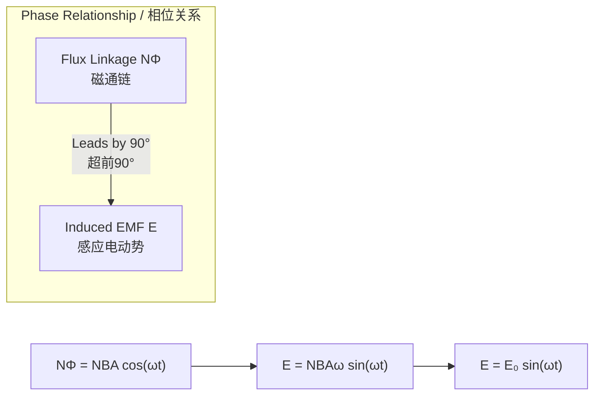

# AC Generator (Alternator) Principle / 交流发电机原理

---

# 1. Overview / 概述

**English:**
The AC generator (alternator) is a device that converts mechanical energy into electrical energy using the principle of [[Electromagnetic Induction]]. This sub-topic covers the fundamental operating principle of a simple rotating-coil alternator, explaining how a sinusoidal alternating current (AC) is produced. Understanding the alternator is essential for grasping how electrical power is generated in power stations and forms the foundation for studying [[RMS and Peak Values]], [[The Ideal Transformer]], and [[Power Transmission and the National Grid]].

The key idea is that as a coil rotates within a uniform magnetic field, the magnetic flux linkage through the coil changes sinusoidally with time. According to Faraday's law, this changing flux linkage induces an electromotive force (EMF) that also varies sinusoidally. The output is an alternating voltage that reverses direction periodically, which is the basis of all AC power generation.

**中文:**
交流发电机（alternator）是一种利用[[电磁感应]]原理将机械能转化为电能的装置。本子知识点涵盖简单旋转线圈式交流发电机的基本工作原理，解释如何产生正弦交流电。理解交流发电机对于掌握发电站如何发电至关重要，并为学习[[RMS和峰值]]、[[理想变压器]]以及[[电力传输与电网]]奠定基础。

关键思想是：当线圈在均匀磁场中旋转时，穿过线圈的磁通量随时间呈正弦变化。根据法拉第定律，这种变化的磁通量会感应出一个也呈正弦变化的电动势（EMF）。输出的是一个周期性改变方向的交变电压，这是所有交流发电的基础。

---

# 2. Syllabus Learning Objectives / 考纲学习目标

| CAIE 9702 (20.4 a-f) | Edexcel IAL (WPH14 U4: 3.16-3.20) |
|-----------|-------------|
| Describe the principle of operation of a simple alternating current generator (alternator) | Understand the principle of operation of a simple alternator |
| Explain how the induced EMF varies with time as the coil rotates | Explain how the induced EMF varies with the angle of rotation of the coil |
| Sketch graphs of flux linkage and induced EMF against time | Sketch and interpret graphs of flux linkage and induced EMF against time |
| Derive the expression for the induced EMF: $E = E_0 \sin(\omega t)$ | Derive the expression for the induced EMF: $\varepsilon = \varepsilon_0 \sin(\omega t)$ |
| Explain the effect of changing the speed of rotation | Explain the effect of changing the angular speed $\omega$ |
| Explain the effect of changing the number of turns or magnetic field strength | Explain the effect of changing the number of turns $N$, area $A$, or magnetic flux density $B$ |

**Examiner Expectations / 考官期望:**
- **English:** Students must be able to describe the physical setup, derive the EMF equation from first principles using Faraday's law, sketch the sinusoidal output, and explain how design parameters affect the output. The derivation of $E = E_0 \sin(\omega t)$ is frequently tested.
- **中文:** 学生必须能够描述物理装置，用法拉第定律从基本原理推导出电动势方程，画出正弦输出波形，并解释设计参数如何影响输出。$E = E_0 \sin(\omega t)$ 的推导是常考内容。

---

# 3. Core Definitions / 核心定义

| Term (EN/CN) | Definition (EN) | Definition (CN) | Common Mistakes / 常见错误 |
|--------------|-----------------|-----------------|---------------------------|
| **Alternator** / 交流发电机 | A device that converts mechanical energy into alternating electrical energy using electromagnetic induction. | 利用电磁感应将机械能转化为交变电能的装置。 | Confusing with DC generator (which uses a commutator). |
| **Magnetic Flux Linkage** / 磁通链 | The product of the number of turns $N$ on a coil and the magnetic flux $\Phi$ passing through it: $N\Phi = NBA\cos\theta$. | 线圈匝数 $N$ 与穿过线圈的磁通量 $\Phi$ 的乘积：$N\Phi = NBA\cos\theta$。 | Forgetting the $\cos\theta$ factor; confusing with flux density $B$. |
| **Induced EMF** / 感应电动势 | The electromotive force generated in a conductor due to a changing magnetic flux linkage, given by Faraday's law: $E = -\frac{d(N\Phi)}{dt}$. | 由于磁通链变化而在导体中产生的电动势，由法拉第定律给出：$E = -\frac{d(N\Phi)}{dt}$。 | Forgetting the negative sign (Lenz's law); using $E = N\Phi$ instead of rate of change. |
| **Angular Speed ($\omega$)** / 角速度 | The rate of change of angular displacement, measured in rad s⁻¹. For a rotating coil, $\omega = 2\pi f$ where $f$ is the frequency of rotation. | 角位移的变化率，单位为 rad s⁻¹。对于旋转线圈，$\omega = 2\pi f$，其中 $f$ 是旋转频率。 | Confusing $\omega$ with frequency $f$; using degrees instead of radians. |
| **Peak EMF ($E_0$)** / 峰值电动势 | The maximum value of the induced EMF, given by $E_0 = BAN\omega$. | 感应电动势的最大值，由 $E_0 = BAN\omega$ 给出。 | Forgetting that $E_0$ depends on $\omega$; using $E_0 = BAN$ only. |

---

# 4. Key Concepts Explained / 关键概念详解

## 4.1 The Rotating Coil Principle / 旋转线圈原理

### Explanation / 解释
**English:**
A simple alternator consists of a rectangular coil of $N$ turns, each of area $A$, placed in a uniform magnetic field of flux density $B$. The coil is rotated at a constant angular speed $\omega$ about an axis perpendicular to the magnetic field direction. As the coil rotates, the angle $\theta$ between the normal to the coil and the magnetic field changes with time: $\theta = \omega t$ (assuming $\theta = 0$ at $t = 0$).

The magnetic flux linkage through the coil at any instant is:
$$N\Phi = NBA\cos\theta = NBA\cos(\omega t)$$

According to [[Faraday's Law of Electromagnetic Induction]], the induced EMF is the negative rate of change of flux linkage:
$$E = -\frac{d(N\Phi)}{dt} = -\frac{d}{dt}[NBA\cos(\omega t)] = NBA\omega\sin(\omega t)$$

This gives the standard form: $E = E_0\sin(\omega t)$, where $E_0 = BAN\omega$ is the peak EMF.

**中文:**
简单的交流发电机由一个 $N$ 匝矩形线圈组成，每匝面积为 $A$，置于磁通密度为 $B$ 的均匀磁场中。线圈以恒定角速度 $\omega$ 绕垂直于磁场方向的轴旋转。当线圈旋转时，线圈法线与磁场之间的夹角 $\theta$ 随时间变化：$\theta = \omega t$（假设 $t = 0$ 时 $\theta = 0$）。

任意时刻穿过线圈的磁通链为：
$$N\Phi = NBA\cos\theta = NBA\cos(\omega t)$$

根据[[法拉第电磁感应定律]]，感应电动势是磁通链变化率的负值：
$$E = -\frac{d(N\Phi)}{dt} = -\frac{d}{dt}[NBA\cos(\omega t)] = NBA\omega\sin(\omega t)$$

这给出了标准形式：$E = E_0\sin(\omega t)$，其中 $E_0 = BAN\omega$ 是峰值电动势。

### Physical Meaning / 物理意义
**English:**
- When the coil is perpendicular to the field ($\theta = 0^\circ$), flux linkage is maximum ($NBA$) but the rate of change is zero → induced EMF is zero.
- When the coil is parallel to the field ($\theta = 90^\circ$), flux linkage is zero but the rate of change is maximum → induced EMF is maximum ($E_0$).
- The EMF is sinusoidal because the rate of change of a cosine function is a sine function.

**中文:**
- 当线圈垂直于磁场时（$\theta = 0^\circ$），磁通链最大（$NBA$），但变化率为零 → 感应电动势为零。
- 当线圈平行于磁场时（$\theta = 90^\circ$），磁通链为零，但变化率最大 → 感应电动势最大（$E_0$）。
- 电动势呈正弦形，因为余弦函数的变化率是正弦函数。

### Common Misconceptions / 常见误区
- **English:**
  - ❌ "EMF is maximum when flux linkage is maximum." → ✅ EMF is maximum when flux linkage is changing fastest (zero flux linkage).
  - ❌ "The EMF is proportional to flux linkage." → ✅ The EMF is proportional to the *rate of change* of flux linkage.
  - ❌ "Doubling the rotation speed doubles the frequency but not the peak EMF." → ✅ Doubling $\omega$ doubles both frequency AND peak EMF ($E_0 \propto \omega$).
- **中文:**
  - ❌ "磁通链最大时电动势最大。" → ✅ 磁通链变化最快时（磁通链为零）电动势最大。
  - ❌ "电动势与磁通链成正比。" → ✅ 电动势与磁通链的*变化率*成正比。
  - ❌ "转速加倍只加倍频率，不改变峰值电动势。" → ✅ 角速度 $\omega$ 加倍，频率和峰值电动势都加倍（$E_0 \propto \omega$）。

### Exam Tips / 考试提示
- **English:** Always start derivations from $N\Phi = NBA\cos\theta$. Show the differentiation step clearly. Remember that $E_0 = BAN\omega$ — all four factors ($B$, $A$, $N$, $\omega$) are directly proportional to the peak EMF.
- **中文:** 推导时始终从 $N\Phi = NBA\cos\theta$ 开始。清晰展示微分步骤。记住 $E_0 = BAN\omega$ — 四个因素（$B$、$A$、$N$、$\omega$）都与峰值电动势成正比。

> 📷 **IMAGE PROMPT — DIAG-01: Simple Alternator Setup**
> A clean, educational diagram showing a rectangular coil rotating in a uniform magnetic field between two magnetic poles (N and S). The coil is connected to slip rings and brushes. Label: magnetic field B (horizontal arrows), coil normal (dashed line), angle θ between normal and field, axis of rotation (vertical), slip rings, brushes. Show the coil at an arbitrary angle θ. Use a simple, clear style suitable for A-Level physics.

---

## 4.2 Slip Rings and Brushes / 滑环和电刷

### Explanation / 解释
**English:**
Unlike a DC generator which uses a split-ring commutator, an AC generator uses **slip rings** and **brushes**. Each end of the rotating coil is connected to a separate complete ring. Carbon brushes press against these rings, allowing the induced alternating current to be drawn from the rotating coil to an external circuit. The slip rings maintain continuous electrical contact without reversing the connections, so the output is alternating.

**中文:**
与使用换向器的直流发电机不同，交流发电机使用**滑环**和**电刷**。旋转线圈的每一端都连接到一个独立的完整圆环上。碳刷紧压在这些环上，使得感应出的交变电流能从旋转线圈引出到外部电路。滑环保持连续的电气接触而不反转连接，因此输出是交变的。

### Exam Tips / 考试提示
- **English:** Be prepared to compare slip rings (AC generator) with split-ring commutators (DC generator). Slip rings give AC output; split rings give DC output.
- **中文:** 准备好比较滑环（交流发电机）和换向器（直流发电机）。滑环产生交流输出；换向器产生直流输出。

---

# 5. Essential Equations / 核心公式

## 5.1 Flux Linkage / 磁通链

$$N\Phi = NBA\cos(\omega t)$$

| Symbol (符号) | Meaning (EN) | Meaning (CN) | Unit (单位) |
|--------------|-------------|-------------|------------|
| $N$ | Number of turns on the coil | 线圈匝数 | dimensionless |
| $B$ | Magnetic flux density | 磁通密度 | T (tesla) |
| $A$ | Area of one turn of the coil | 单匝线圈面积 | m² |
| $\omega$ | Angular speed of rotation | 旋转角速度 | rad s⁻¹ |
| $t$ | Time | 时间 | s |

**Conditions / 适用条件:**
- **English:** Uniform magnetic field; coil rotating at constant angular speed; axis perpendicular to field.
- **中文:** 均匀磁场；线圈以恒定角速度旋转；转轴垂直于磁场。

## 5.2 Induced EMF / 感应电动势

$$E = -\frac{d(N\Phi)}{dt} = NBA\omega\sin(\omega t) = E_0\sin(\omega t)$$

| Symbol (符号) | Meaning (EN) | Meaning (CN) | Unit (单位) |
|--------------|-------------|-------------|------------|
| $E$ | Instantaneous induced EMF | 瞬时感应电动势 | V |
| $E_0$ | Peak induced EMF ($= BAN\omega$) | 峰值感应电动势 | V |

**Derivation / 推导:**
$$N\Phi = NBA\cos(\omega t)$$
$$E = -\frac{d(N\Phi)}{dt} = -\frac{d}{dt}[NBA\cos(\omega t)]$$
$$E = -NBA \cdot (-\omega\sin(\omega t)) = NBA\omega\sin(\omega t)$$
$$E = E_0\sin(\omega t) \text{ where } E_0 = BAN\omega$$

**Conditions / 适用条件:**
- **English:** Same as above. The EMF is sinusoidal only if $\omega$ is constant.
- **中文:** 同上。只有当 $\omega$ 恒定时，电动势才是正弦波。

**Limitations / 局限性:**
- **English:** This model assumes no internal resistance, no magnetic field fringing effects, and a perfectly uniform field. Real alternators have more complex designs (e.g., rotating magnetic field with stationary coil).
- **中文:** 该模型假设无内阻、无磁场边缘效应、磁场完全均匀。实际交流发电机的设计更复杂（例如，旋转磁场与固定线圈）。

> 📷 **IMAGE PROMPT — DIAG-02: Flux Linkage and EMF vs Time**
> Two aligned graphs on the same time axis. Top graph: flux linkage NΦ vs time, showing a cosine wave with maximum at t=0. Bottom graph: induced EMF E vs time, showing a sine wave with zero at t=0 and maximum at t=T/4. Label the peak values and the phase relationship (EMF leads flux linkage by 90°). Use different colors for the two curves.

---

# 6. Graphs and Relationships / 图表与关系

## 6.1 Flux Linkage vs Time / 磁通链-时间图

### Axes / 坐标轴
- **X-axis:** Time $t$ / 时间 $t$ (s)
- **Y-axis:** Flux linkage $N\Phi$ / 磁通链 $N\Phi$ (Wb turns)

### Shape / 形状
- **English:** Cosine wave: $N\Phi = NBA\cos(\omega t)$. Starts at maximum $NBA$ when $t=0$.
- **中文:** 余弦波：$N\Phi = NBA\cos(\omega t)$。当 $t=0$ 时从最大值 $NBA$ 开始。

### Gradient Meaning / 斜率含义
- **English:** The gradient of the flux linkage graph at any point equals the negative of the induced EMF at that instant ($E = -\text{gradient}$).
- **中文:** 磁通链图上任意点的斜率等于该时刻感应电动势的负值（$E = -\text{斜率}$）。

## 6.2 Induced EMF vs Time / 感应电动势-时间图

### Axes / 坐标轴
- **X-axis:** Time $t$ / 时间 $t$ (s)
- **Y-axis:** Induced EMF $E$ / 感应电动势 $E$ (V)

### Shape / 形状
- **English:** Sine wave: $E = E_0\sin(\omega t)$. Starts at zero when $t=0$.
- **中文:** 正弦波：$E = E_0\sin(\omega t)$。当 $t=0$ 时从零开始。

### Gradient Meaning / 斜率含义
- **English:** The gradient of the EMF graph is related to the rate of change of the induced current (not typically examined at A-Level).
- **中文:** 电动势图的斜率与感应电流的变化率有关（A-Level通常不考）。

### Area Meaning / 面积含义
- **English:** The area under the EMF-time graph represents the change in flux linkage (from $E = -d(N\Phi)/dt$, integrating gives $\Delta(N\Phi) = -\int E\,dt$).
- **中文:** 电动势-时间图下的面积表示磁通链的变化（由 $E = -d(N\Phi)/dt$，积分得 $\Delta(N\Phi) = -\int E\,dt$）。

### Exam Interpretation / 考试解读
- **English:** The EMF leads the flux linkage by $90^\circ$ (or $\pi/2$ radians). When flux linkage is maximum, EMF is zero; when flux linkage is zero, EMF is maximum.
- **中文:** 电动势超前磁通链 $90^\circ$（或 $\pi/2$ 弧度）。当磁通链最大时，电动势为零；当磁通链为零时，电动势最大。



---

# 7. Required Diagrams / 必备图表

## 7.1 Simple Alternator Construction / 简单交流发电机结构

### Description / 描述
**English:** A diagram showing the essential components of a simple alternator: a rectangular coil rotating between the poles of a magnet, connected to slip rings with brushes making contact.

**中文:** 显示简单交流发电机基本部件的示意图：一个矩形线圈在磁极之间旋转，通过滑环和电刷连接。

### Image Prompt / 图片生成提示
> 📷 **IMAGE PROMPT — DIAG-03: Simple Alternator Construction**
> A clear, labeled cross-sectional diagram of a simple AC generator (alternator). Show: two curved magnetic poles (N and S) creating a uniform horizontal magnetic field (parallel arrows). A rectangular coil (shown as a single loop for clarity) is mounted on an axle that passes through the center. The coil is at an angle of about 45° to the horizontal. Each end of the coil connects to a separate slip ring (two complete circles on the axle). Two carbon brushes press against the slip rings, with wires leading to an external load (a resistor or lamp). All labels in English. Clean, educational style suitable for A-Level physics textbook.

### Labels Required / 需要标注
| English | 中文 |
|---------|------|
| Magnetic pole (N/S) | 磁极 (N/S) |
| Uniform magnetic field | 均匀磁场 |
| Coil (N turns) | 线圈 (N匝) |
| Axis of rotation | 旋转轴 |
| Slip rings | 滑环 |
| Carbon brushes | 碳刷 |
| External circuit / load | 外部电路/负载 |
| Angle θ | 角度 θ |

### Exam Importance / 考试重要性
- **English:** High. Students are expected to be able to draw and label this diagram from memory. The slip rings are a key distinguishing feature from DC generators.
- **中文:** 高。学生应能凭记忆画出并标注此图。滑环是与直流发电机的主要区别特征。

---

## 7.2 Flux Linkage and EMF vs Angle / 磁通链和电动势随角度变化图

### Description / 描述
**English:** Two graphs showing how flux linkage and induced EMF vary with the angle of rotation $\theta$ (or time $t$), illustrating the $90^\circ$ phase difference.

**中文:** 两个图显示磁通链和感应电动势如何随旋转角度 $\theta$（或时间 $t$）变化，说明 $90^\circ$ 相位差。

### Image Prompt / 图片生成提示
> 📷 **IMAGE PROMPT — DIAG-04: Flux Linkage and EMF vs Angle**
> Two aligned graphs with the x-axis labeled "Angle θ / degrees" from 0° to 360° (or "Time t"). Top graph: flux linkage NΦ vs θ, a cosine wave starting at maximum at 0°. Bottom graph: induced EMF E vs θ, a sine wave starting at zero at 0°. Mark key points: at θ=0° (NΦ=max, E=0), θ=90° (NΦ=0, E=max), θ=180° (NΦ=-max, E=0), θ=270° (NΦ=0, E=-max), θ=360° (NΦ=max, E=0). Use different colors for the two curves. Include a small diagram of the coil orientation at each key angle.

### Labels Required / 需要标注
| English | 中文 |
|---------|------|
| Maximum flux linkage | 最大磁通链 |
| Zero flux linkage | 零磁通链 |
| Peak EMF (+E₀) | 峰值电动势 (+E₀) |
| Peak EMF (-E₀) | 峰值电动势 (-E₀) |
| Phase difference = 90° | 相位差 = 90° |
| Coil perpendicular to field | 线圈垂直于磁场 |
| Coil parallel to field | 线圈平行于磁场 |

### Exam Importance / 考试重要性
- **English:** Very high. Students must be able to sketch these graphs, identify key points, and explain the phase relationship.
- **中文:** 非常高。学生必须能画出这些图，识别关键点，并解释相位关系。

---

# 8. Worked Examples / 典型例题

## Example 1: Calculating Peak EMF / 计算峰值电动势

### Question / 题目
**English:**
A simple alternator has a coil with 200 turns, each of area $4.0 \times 10^{-3} \text{ m}^2$. The coil rotates at 50 revolutions per second in a uniform magnetic field of flux density $0.15 \text{ T}$.

(a) Calculate the peak induced EMF.
(b) Write an expression for the instantaneous EMF as a function of time.
(c) Calculate the EMF when the coil has rotated through $30^\circ$ from the position of maximum flux linkage.

**中文:**
一个简单交流发电机的线圈有200匝，每匝面积为 $4.0 \times 10^{-3} \text{ m}^2$。线圈以每秒50转的速度在磁通密度为 $0.15 \text{ T}$ 的均匀磁场中旋转。

(a) 计算峰值感应电动势。
(b) 写出瞬时电动势随时间变化的表达式。
(c) 计算线圈从最大磁通链位置旋转 $30^\circ$ 时的电动势。

### Solution / 解答

**(a) Peak EMF / 峰值电动势**

**English:**
First, find the angular speed:
$$\omega = 2\pi f = 2\pi \times 50 = 100\pi \text{ rad s}^{-1}$$

Then use $E_0 = BAN\omega$:
$$E_0 = 0.15 \times (4.0 \times 10^{-3}) \times 200 \times 100\pi$$
$$E_0 = 0.15 \times 4.0 \times 10^{-3} \times 200 \times 314.16$$
$$E_0 = 37.7 \text{ V}$$

**中文:**
首先求角速度：
$$\omega = 2\pi f = 2\pi \times 50 = 100\pi \text{ rad s}^{-1}$$

然后使用 $E_0 = BAN\omega$：
$$E_0 = 0.15 \times (4.0 \times 10^{-3}) \times 200 \times 100\pi$$
$$E_0 = 37.7 \text{ V}$$

**(b) Expression for EMF / 电动势表达式**

**English:**
$$E = E_0\sin(\omega t) = 37.7\sin(100\pi t) \text{ V}$$

**中文:**
$$E = E_0\sin(\omega t) = 37.7\sin(100\pi t) \text{ V}$$

**(c) EMF at $\theta = 30^\circ$ / 在 $\theta = 30^\circ$ 时的电动势**

**English:**
At $\theta = 30^\circ$, $\omega t = 30^\circ = \frac{\pi}{6}$ rad.
$$E = E_0\sin(30^\circ) = 37.7 \times 0.5 = 18.85 \text{ V}$$

**中文:**
当 $\theta = 30^\circ$ 时，$\omega t = 30^\circ = \frac{\pi}{6}$ rad。
$$E = E_0\sin(30^\circ) = 37.7 \times 0.5 = 18.85 \text{ V}$$

### Final Answer / 最终答案
**Answer:** (a) $E_0 = 37.7 \text{ V}$ (b) $E = 37.7\sin(100\pi t) \text{ V}$ (c) $E = 18.9 \text{ V}$ | **答案：** (a) $E_0 = 37.7 \text{ V}$ (b) $E = 37.7\sin(100\pi t) \text{ V}$ (c) $E = 18.9 \text{ V}$

### Quick Tip / 提示
- **English:** Remember to convert frequency $f$ to angular speed $\omega$ using $\omega = 2\pi f$. Always check that your calculator is in radian mode when evaluating $\sin(\omega t)$.
- **中文:** 记住用 $\omega = 2\pi f$ 将频率 $f$ 转换为角速度 $\omega$。计算 $\sin(\omega t)$ 时，确保计算器处于弧度模式。

---

## Example 2: Effect of Changing Parameters / 改变参数的影响

### Question / 题目
**English:**
An alternator produces a peak EMF of 24 V when rotating at 600 rpm (revolutions per minute).

(a) What is the new peak EMF if the rotation speed is increased to 900 rpm?
(b) What is the new peak EMF if the number of turns is doubled and the magnetic field strength is halved, keeping the original speed?

**中文:**
一个交流发电机以600 rpm（每分钟转数）旋转时产生24 V的峰值电动势。

(a) 如果转速增加到900 rpm，新的峰值电动势是多少？
(b) 如果线圈匝数加倍，磁场强度减半，保持原转速，新的峰值电动势是多少？

### Solution / 解答

**(a) Speed change / 转速变化**

**English:**
$E_0 \propto \omega$, and $\omega \propto f \propto \text{rpm}$.
$$\frac{E_{0,\text{new}}}{E_{0,\text{old}}} = \frac{\omega_{\text{new}}}{\omega_{\text{old}}} = \frac{900}{600} = 1.5$$
$$E_{0,\text{new}} = 1.5 \times 24 = 36 \text{ V}$$

**中文:**
$E_0 \propto \omega$，且 $\omega \propto f \propto \text{rpm}$。
$$\frac{E_{0,\text{新}}}{E_{0,\text{旧}}} = \frac{\omega_{\text{新}}}{\omega_{\text{旧}}} = \frac{900}{600} = 1.5$$
$$E_{0,\text{新}} = 1.5 \times 24 = 36 \text{ V}$$

**(b) Turns and field change / 匝数和磁场变化**

**English:**
$E_0 \propto N$ and $E_0 \propto B$.
$$\frac{E_{0,\text{new}}}{E_{0,\text{old}}} = \frac{N_{\text{new}}}{N_{\text{old}}} \times \frac{B_{\text{new}}}{B_{\text{old}}} = 2 \times 0.5 = 1$$
$$E_{0,\text{new}} = 1 \times 24 = 24 \text{ V}$$

**中文:**
$E_0 \propto N$ 且 $E_0 \propto B$。
$$\frac{E_{0,\text{新}}}{E_{0,\text{旧}}} = \frac{N_{\text{新}}}{N_{\text{旧}}} \times \frac{B_{\text{新}}}{B_{\text{旧}}} = 2 \times 0.5 = 1$$
$$E_{0,\text{新}} = 1 \times 24 = 24 \text{ V}$$

### Final Answer / 最终答案
**Answer:** (a) 36 V (b) 24 V (no change) | **答案：** (a) 36 V (b) 24 V（不变）

### Quick Tip / 提示
- **English:** Use proportionality: $E_0 \propto BAN\omega$. Changing any one factor changes $E_0$ by the same factor, provided others are constant.
- **中文:** 使用比例关系：$E_0 \propto BAN\omega$。在其他因素不变的情况下，改变任何一个因素，$E_0$ 都会按相同比例变化。

---

# 9. Past Paper Question Types / 历年真题题型

| Question Type / 题型 | Frequency / 频率 | Difficulty / 难度 | Past Paper References / 真题索引 |
|----------------------|------------------|------------------|-------------------------------|
| Derivation of $E = E_0\sin(\omega t)$ from $N\Phi = NBA\cos(\omega t)$ | Very High | Medium | 📝 *待填入* |
| Calculation of peak EMF using $E_0 = BAN\omega$ | Very High | Easy | 📝 *待填入* |
| Sketching flux linkage and EMF vs time graphs | High | Medium | 📝 *待填入* |
| Explaining the role of slip rings vs commutator | Medium | Easy | 📝 *待填入* |
| Effect of changing $B$, $A$, $N$, or $\omega$ on output | High | Medium | 📝 *待填入* |
| Calculating instantaneous EMF at a given angle | Medium | Medium | 📝 *待填入* |

**Common Command Words / 常见指令词:**
| English | 中文 |
|---------|------|
| Derive | 推导 |
| Sketch | 画出 |
| Calculate | 计算 |
| Explain | 解释 |
| State | 写出 |
| Determine | 确定 |

---

# 10. Practical Skills Connections / 实验技能链接

**English:**
While the alternator principle is primarily theoretical at A-Level, it connects to practical skills in several ways:

1. **Measurements:** Using a search coil (a small coil connected to a CRO or data logger) to investigate how induced EMF varies with angle and speed. This demonstrates Faraday's law experimentally.
2. **Graph Plotting:** Plotting induced EMF against time from CRO traces to determine frequency and peak voltage.
3. **Uncertainties:** When measuring the peak EMF from an oscilloscope trace, the uncertainty in reading the vertical scale (±0.5 division) affects the calculated $E_0$.
4. **Experimental Design:** Designing an experiment to verify $E_0 \propto \omega$ by rotating a coil at different speeds and measuring the peak EMF.

**中文:**
虽然交流发电机原理在A-Level中主要是理论性的，但它与实验技能有以下几个方面的联系：

1. **测量：** 使用探测线圈（连接到示波器或数据记录器的小线圈）研究感应电动势如何随角度和速度变化。这实验性地展示了法拉第定律。
2. **绘图：** 根据示波器轨迹绘制感应电动势随时间变化的图，以确定频率和峰值电压。
3. **不确定度：** 从示波器轨迹读取峰值电动势时，垂直刻度读数的不确定度（±0.5格）会影响计算出的 $E_0$。
4. **实验设计：** 设计实验通过以不同速度旋转线圈并测量峰值电动势来验证 $E_0 \propto \omega$。

> 📋 **Edexcel Only:** Edexcel IAL may require students to describe a practical investigation of the factors affecting the induced EMF in a rotating coil, including the use of a signal generator to drive a motor at controlled speeds.

> 📋 **CIE Only:** CIE 9702 Paper 5 (Planning, Analysis and Evaluation) may include questions on designing experiments related to electromagnetic induction and alternators.

---

# 11. Concept Map / 概念图谱

```mermaid
graph TD
    %% AC Generator (Alternator) Principle - Concept Map
    
    subgraph "Core Concept / 核心概念"
        A[AC Generator Principle<br>交流发电机原理] --> B[Rotating Coil in B-Field<br>旋转线圈在磁场中]
        B --> C[Flux Linkage NΦ = NBA cos(ωt)<br>磁通链]
        C --> D[Faraday's Law<br>法拉第定律]
        D --> E[Induced EMF E = -d(NΦ)/dt<br>感应电动势]
        E --> F[E = NBAω sin(ωt) = E₀ sin(ωt)<br>电动势方程]
    end
    
    subgraph "Key Parameters / 关键参数"
        G[B - Magnetic Flux Density<br>磁通密度]
        H[A - Coil Area<br>线圈面积]
        I[N - Number of Turns<br>匝数]
        J[ω - Angular Speed<br>角速度]
        G --> F
        H --> F
        I --> F
        J --> F
    end
    
    subgraph "Output Characteristics / 输出特性"
        F --> K[Peak EMF E₀ = BANω<br>峰值电动势]
        F --> L[Sinusoidal Output<br>正弦输出]
        L --> M[Frequency f = ω/2π<br>频率]
        L --> N[Phase: E leads NΦ by 90°<br>相位: E超前NΦ 90°]
    end
    
    subgraph "Connections / 连接"
        F --> O[[RMS and Peak Values<br>RMS和峰值]]
        F --> P[[The Ideal Transformer<br>理想变压器]]
        F --> Q[[Electromagnetic Induction<br>电磁感应]]
        K --> O
        M --> P
    end
    
    subgraph "Practical Components / 实际部件"
        B --> R[Slip Rings & Brushes<br>滑环和电刷]
        R --> S[AC Output to External Circuit<br>交流输出到外部电路]
    end
    
    style A fill:#4a90d9,color:#fff
    style F fill:#e67e22,color:#fff
    style K fill:#e67e22,color:#fff
    style O fill:#27ae60,color:#fff
    style P fill:#27ae60,color:#fff
    style Q fill:#8e44ad,color:#fff
```

---

# 12. Quick Revision Sheet / 速查表

| Category / 类别 | Key Points / 要点 |
|----------------|------------------|
| **Definition / 定义** | An alternator converts mechanical energy → AC electrical energy using [[Electromagnetic Induction]]. 交流发电机利用[[电磁感应]]将机械能转化为交流电能。 |
| **Key Formula / 核心公式** | $N\Phi = NBA\cos(\omega t)$ (flux linkage / 磁通链) |
| | $E = -\frac{d(N\Phi)}{dt} = NBA\omega\sin(\omega t) = E_0\sin(\omega t)$ (induced EMF / 感应电动势) |
| | $E_0 = BAN\omega$ (peak EMF / 峰值电动势) |
| **Key Graph / 核心图表** | Flux linkage: cosine wave (max at t=0). EMF: sine wave (zero at t=0). EMF leads flux linkage by 90°. 磁通链：余弦波（t=0时最大）。电动势：正弦波（t=0时为零）。电动势超前磁通链90°。 |
| **Key Relationships / 关键关系** | $E_0 \propto B$, $E_0 \propto A$, $E_0 \propto N$, $E_0 \propto \omega$ |
| | Doubling $\omega$ doubles both frequency AND peak EMF. $\omega$ 加倍，频率和峰值电动势都加倍。 |
| **Phase / 相位** | When $N\Phi$ is max → $E = 0$ (coil ⊥ field). When $N\Phi = 0$ → $E$ is max (coil ∥ field). 当 $N\Phi$ 最大时 → $E = 0$（线圈⊥磁场）。当 $N\Phi = 0$ 时 → $E$ 最大（线圈∥磁场）。 |
| **Key Component / 关键部件** | **Slip rings** (滑环) + **brushes** (电刷) → maintain AC output. Different from DC generator's commutator. 滑环+电刷→维持交流输出。与直流发电机的换向器不同。 |
| **Exam Tip / 考试提示** | Always derive EMF from flux linkage. Show differentiation. Use radian mode. 始终从磁通链推导电动势。展示微分过程。使用弧度模式。 |
| **Common Mistake / 常见错误** | ❌ "EMF max when flux linkage max" → ✅ EMF max when rate of change of flux linkage is max (flux linkage = 0). ❌ "电动势最大时磁通链最大" → ✅ 磁通链变化率最大时（磁通链=0）电动势最大。 |

---

> **Parent Hub:** [[AC Generators and Transformers]]
> **Sibling Nodes:** [[RMS and Peak Values]], [[The Ideal Transformer]], [[Transformer Efficiency and Power Losses]], [[Power Transmission and the National Grid]]
> **Prerequisites:** [[Electromagnetic Induction]], [[Faraday's Law of Electromagnetic Induction]], [[Lenz's Law]]