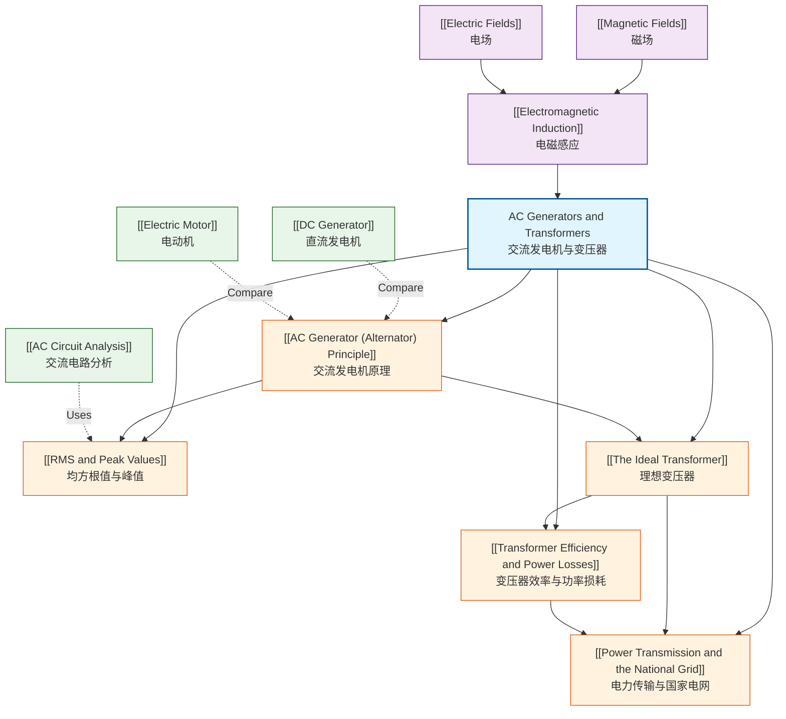

# AC Generators and Transformers / 交流发电机与变压器

---

# 1. Overview / 概述

**English:**
This topic explores the principles and applications of alternating current (AC) generation and voltage transformation. AC generators (alternators) convert mechanical energy into electrical energy using electromagnetic induction, producing a sinusoidal output voltage. Transformers then efficiently change voltage levels for transmission and distribution. The topic covers the construction and operation of AC generators, the mathematical treatment of RMS values for AC quantities, the ideal transformer equation, real-world transformer losses, and the role of transformers in the National Grid for efficient power transmission.

This is fundamental to modern electrical power systems. Real-world applications include electricity generation in power stations (hydroelectric, thermal, nuclear, wind), voltage step-up for long-distance transmission to reduce resistive losses, and voltage step-down for safe domestic and industrial use. Understanding AC generators and transformers is essential for any physicist or engineer working with electrical power systems.

In both Cambridge 9702 (Topic 20.4) and Edexcel IAL (Unit 4, Topics 3.16-3.20), this topic is examined through calculations of induced EMF, RMS values, transformer ratios, efficiency, and power transmission. It builds directly on [[Electromagnetic Induction]] and connects to [[Electric Fields]] and [[Magnetic Fields]].

**中文：**
本主题探讨交流电（AC）发电和电压变换的原理与应用。交流发电机（交流发电机）利用电磁感应将机械能转换为电能，产生正弦波输出电压。然后，变压器高效地改变电压水平，用于传输和分配。本主题涵盖交流发电机的构造和运行、交流电量的均方根（RMS）值的数学处理、理想变压器方程、实际变压器损耗，以及变压器在国家电网中高效输电的作用。

这对于现代电力系统至关重要。实际应用包括发电站（水力、火力、核能、风力）的发电、为远距离输电而升压以减少电阻损耗，以及为安全的家用和工业用电而降压。理解交流发电机和变压器对于任何从事电力系统工作的物理学家或工程师来说都是必不可少的。

在剑桥 9702（主题 20.4）和爱德思 IAL（单元 4，主题 3.16-3.20）中，本主题通过感应电动势、RMS 值、变压器变比、效率和电力传输的计算来考查。它直接建立在[[电磁感应]]的基础上，并与[[电场]]和[[磁场]]相关联。

---

# 2. Syllabus Learning Objectives / 考纲学习目标

| CAIE 9702 (20.4) | Edexcel IAL (WPH14 U4: 3.16-3.20) |
|------------------|-----------------------------------|
| 20.4(a) Describe the principle of operation of a simple alternating current generator (alternator) | 3.16 Understand the principles of electromagnetic induction as applied to AC generators |
| 20.4(b) Sketch a graph of output EMF against time for a simple AC generator | 3.17 Understand the relationship between the peak and RMS values of a sinusoidal alternating current or voltage |
| 20.4(c) Define and use the root-mean-square (RMS) value of an alternating current or voltage | 3.18 Understand the operation of an ideal transformer and use the transformer equation |
| 20.4(d) Derive and use the transformer equation: $\frac{V_s}{V_p} = \frac{N_s}{N_p}$ | 3.19 Understand the reasons for power losses in real transformers and how these are minimised |
| 20.4(e) Explain the principles of power transmission and the use of step-up and step-down transformers | 3.20 Understand the use of step-up and step-down transformers in the National Grid |
| 20.4(f) Explain the reasons for power losses in real transformers and how these are minimised | — |

**Examiner Expectations / 考官期望:**

**English:**
- Candidates must be able to describe the construction and operation of a simple AC generator, including slip rings and brushes.
- Candidates must be able to sketch and interpret graphs of EMF vs time for a rotating coil.
- Candidates must be able to derive and apply the RMS formula for sinusoidal waveforms.
- Candidates must be able to use the transformer equation in calculations.
- Candidates must understand the difference between ideal and real transformers, including sources of power loss.
- Candidates must be able to explain the role of transformers in the National Grid.

**中文：**
- 考生必须能够描述简单交流发电机的构造和运行，包括滑环和电刷。
- 考生必须能够绘制和解释旋转线圈的电动势-时间图。
- 考生必须能够推导和应用正弦波形的 RMS 公式。
- 考生必须能够在计算中使用变压器方程。
- 考生必须理解理想变压器和实际变压器之间的区别，包括功率损耗的来源。
- 考生必须能够解释变压器在国家电网中的作用。

> 📋 **CIE Only:** CIE requires explicit derivation of the transformer equation from Faraday's law. CIE also requires sketching the EMF-time graph for a rotating coil.
>
> 📋 **Edexcel Only:** Edexcel places greater emphasis on understanding the National Grid context and the economic reasons for high-voltage transmission.

---

# 3. Core Definitions / 核心定义

| Term (EN/CN) | Definition (EN) | Definition (CN) | Common Mistakes / 常见错误 |
|--------------|-----------------|-----------------|---------------------------|
| **Alternating Current (AC) / 交流电** | An electric current that periodically reverses direction, typically following a sinusoidal waveform. | 一种周期性改变方向的电流，通常遵循正弦波形。 | Confusing AC with DC; thinking AC has zero average power (it doesn't — RMS power is non-zero). |
| **Alternator / 交流发电机** | A device that converts mechanical energy into electrical energy by rotating a coil in a magnetic field, producing an alternating EMF. | 一种通过使线圈在磁场中旋转，将机械能转换为电能，产生交变电动势的装置。 | Forgetting that slip rings (not split rings) are used for AC output. |
| **Root Mean Square (RMS) / 均方根值** | The value of an alternating current or voltage that produces the same average power dissipation in a resistor as a direct current of the same value. | 交流电流或电压的值，该值在电阻器中产生的平均功率耗散与相同值的直流电相同。 | Using peak value instead of RMS in power calculations; forgetting the $\frac{1}{\sqrt{2}}$ factor for sinusoidal waves. |
| **Peak Value / 峰值** | The maximum instantaneous value of an alternating current or voltage. | 交流电流或电压的最大瞬时值。 | Confusing peak-to-peak with peak value. |
| **Transformer / 变压器** | A device that uses electromagnetic induction to change the voltage of an alternating current without changing its frequency. | 一种利用电磁感应改变交流电压而不改变其频率的装置。 | Thinking transformers work with DC; forgetting that transformers only work with AC. |
| **Step-up Transformer / 升压变压器** | A transformer where the secondary voltage is greater than the primary voltage ($N_s > N_p$). | 次级电压大于初级电压的变压器（$N_s > N_p$）。 | Confusing step-up with step-down; forgetting that power is conserved (approximately) in an ideal transformer. |
| **Step-down Transformer / 降压变压器** | A transformer where the secondary voltage is less than the primary voltage ($N_s < N_p$). | 次级电压小于初级电压的变压器（$N_s < N_p$）。 | Same as above. |
| **National Grid / 国家电网** | The network of cables and transformers that distributes electrical power from power stations to consumers. | 将电力从发电站分配给消费者的电缆和变压器网络。 | Forgetting the purpose of high-voltage transmission (reducing $I^2R$ losses). |
| **Eddy Currents / 涡流** | Circulating currents induced within the core of a transformer by the changing magnetic field, causing power loss. | 由变化的磁场在变压器铁芯内部感应出的循环电流，导致功率损耗。 | Thinking eddy currents are always beneficial; they are usually a source of loss. |
| **Laminated Core / 叠片铁芯** | A transformer core made of thin, insulated sheets of iron to reduce eddy current losses. | 由薄的、绝缘的铁片制成的变压器铁芯，以减少涡流损耗。 | Forgetting that lamination increases resistance to eddy currents. |

---

# 4. Key Concepts Explained / 关键概念详解

## 4.1 AC Generator (Alternator) Principle / 交流发电机原理

### Explanation / 解释
**English:**
An AC generator (alternator) operates on the principle of [[Electromagnetic Induction]]. A coil of wire is rotated in a uniform magnetic field. As the coil rotates, the magnetic flux through the coil changes continuously, inducing an alternating EMF. The EMF is sinusoidal because the rate of change of flux linkage follows a sine function.

The key components are:
- **Magnetic field:** Produced by permanent magnets or electromagnets.
- **Coil (armature):** A rectangular coil of wire that rotates.
- **Slip rings:** Two complete rings that rotate with the coil, maintaining continuous electrical contact.
- **Brushes:** Carbon blocks that press against the slip rings to collect the current.

The induced EMF is given by:
$$ \varepsilon = NBA\omega \sin(\omega t) $$

where $N$ is the number of turns, $B$ is the magnetic flux density, $A$ is the area of the coil, and $\omega$ is the angular velocity.

**中文：**
交流发电机（交流发电机）基于[[电磁感应]]原理运行。一个线圈在均匀磁场中旋转。当线圈旋转时，穿过线圈的磁通量连续变化，感应出交变电动势。电动势是正弦的，因为磁链的变化率遵循正弦函数。

关键部件包括：
- **磁场：** 由永磁体或电磁体产生。
- **线圈（电枢）：** 一个旋转的矩形线圈。
- **滑环：** 两个与线圈一起旋转的完整环，保持连续的电接触。
- **电刷：** 压在滑环上以收集电流的碳块。

感应电动势由下式给出：
$$ \varepsilon = NBA\omega \sin(\omega t) $$

其中 $N$ 是匝数，$B$ 是磁通密度，$A$ 是线圈面积，$\omega$ 是角速度。

### Physical Meaning / 物理意义
**English:**
When the coil is perpendicular to the magnetic field (θ = 0°), the flux through the coil is maximum, but the rate of change of flux is zero — hence the induced EMF is zero. When the coil is parallel to the field (θ = 90°), the flux is zero, but the rate of change of flux is maximum — hence the induced EMF is maximum. This sinusoidal variation produces the alternating current.

**中文：**
当线圈垂直于磁场（θ = 0°）时，穿过线圈的磁通量最大，但磁通量的变化率为零——因此感应电动势为零。当线圈平行于磁场（θ = 90°）时，磁通量为零，但磁通量的变化率最大——因此感应电动势最大。这种正弦变化产生了交流电。

### Common Misconceptions / 常见误区
1. **Slip rings vs split rings:** Students often confuse slip rings (used in AC generators) with split rings (used in DC motors/generators). Slip rings produce AC; split rings produce DC.
2. **EMF is zero when flux is maximum:** Many students think EMF is maximum when flux is maximum. In fact, EMF is proportional to the *rate of change* of flux, not the flux itself.
3. **Frequency depends on rotation speed:** The frequency of the AC output equals the rotational frequency of the coil (in Hz).

### Exam Tips / 考试提示
**English:**
- CIE often asks you to sketch the EMF-time graph and label key points.
- Edexcel may ask you to explain why slip rings are used instead of a commutator.
- Both boards may ask you to calculate the peak EMF using $\varepsilon_0 = NBA\omega$.
- Remember that $\omega = 2\pi f$, where $f$ is the frequency of rotation.

**中文：**
- CIE 经常要求你绘制电动势-时间图并标注关键点。
- Edexcel 可能会要求你解释为什么使用滑环而不是换向器。
- 两个考试局都可能要求你使用 $\varepsilon_0 = NBA\omega$ 计算峰值电动势。
- 记住 $\omega = 2\pi f$，其中 $f$ 是旋转频率。

> 📷 **IMAGE PROMPT — [AC-GEN-01]: Simple AC Generator Diagram**
>
> A clean, educational diagram of a simple AC generator (alternator). Show a rectangular coil of wire rotating between the north and south poles of a horseshoe magnet. The coil is connected to two slip rings, each pressed by a carbon brush. Labels: "Coil (Armature)", "Slip Rings", "Brushes", "N Pole", "S Pole", "Magnetic Field Lines". Use a cross-sectional view showing the coil at an angle to the field. Style: textbook-quality, white background, clear labels, 2D schematic.

---

## 4.2 RMS and Peak Values / 均方根值与峰值

### Explanation / 解释
**English:**
For a sinusoidal alternating current or voltage, the RMS (Root Mean Square) value is the equivalent DC value that produces the same average power dissipation in a resistor. The RMS value is always less than the peak value.

For a sinusoidal waveform:
$$ I_{RMS} = \frac{I_0}{\sqrt{2}} \quad \text{and} \quad V_{RMS} = \frac{V_0}{\sqrt{2}} $$

where $I_0$ and $V_0$ are the peak values.

The derivation involves squaring the sinusoidal function, finding the mean over one cycle, and taking the square root:
$$ I_{RMS} = \sqrt{\frac{1}{T} \int_0^T I_0^2 \sin^2(\omega t) \, dt} = \frac{I_0}{\sqrt{2}} $$

**中文：**
对于正弦交流电流或电压，均方根（RMS）值是在电阻器中产生相同平均功率耗散的等效直流值。RMS 值总是小于峰值。

对于正弦波形：
$$ I_{RMS} = \frac{I_0}{\sqrt{2}} \quad \text{和} \quad V_{RMS} = \frac{V_0}{\sqrt{2}} $$

其中 $I_0$ 和 $V_0$ 是峰值。

推导过程包括对正弦函数进行平方，求一个周期内的平均值，然后取平方根：
$$ I_{RMS} = \sqrt{\frac{1}{T} \int_0^T I_0^2 \sin^2(\omega t) \, dt} = \frac{I_0}{\sqrt{2}} $$

### Physical Meaning / 物理意义
**English:**
When you plug a device into a mains socket rated at 230 V, the 230 V is the RMS voltage. The peak voltage is actually $230 \times \sqrt{2} \approx 325$ V. The RMS value tells you the heating effect of the AC — a 230 V AC supply produces the same heating in a resistor as a 230 V DC supply.

**中文：**
当你将一个设备插入额定电压为 230 V 的市电插座时，230 V 是 RMS 电压。峰值电压实际上是 $230 \times \sqrt{2} \approx 325$ V。RMS 值告诉你交流电的热效应——230 V 交流电源在电阻器中产生的热量与 230 V 直流电源相同。

### Common Misconceptions / 常见误区
1. **RMS is the average:** The average value of a sinusoidal AC over a full cycle is zero. RMS is not the average — it's the root of the mean of the square.
2. **Using peak in power calculations:** Power calculations must use RMS values: $P = I_{RMS}^2 R = V_{RMS} I_{RMS}$.
3. **The $\frac{1}{\sqrt{2}}$ factor is universal:** This factor only applies to sinusoidal waveforms. For other waveforms (e.g., square waves), the RMS calculation is different.

### Exam Tips / 考试提示
**English:**
- CIE may ask you to derive the RMS formula from first principles.
- Edexcel may give you a non-sinusoidal waveform and ask you to calculate the RMS value.
- Always use RMS values when calculating power in AC circuits.
- Remember: $V_0 = \sqrt{2} V_{RMS}$ and $I_0 = \sqrt{2} I_{RMS}$.

**中文：**
- CIE 可能会要求你从基本原理推导 RMS 公式。
- Edexcel 可能会给你一个非正弦波形，并要求你计算 RMS 值。
- 在交流电路中计算功率时，始终使用 RMS 值。
- 记住：$V_0 = \sqrt{2} V_{RMS}$ 和 $I_0 = \sqrt{2} I_{RMS}$。

---

## 4.3 The Ideal Transformer / 理想变压器

### Explanation / 解释
**English:**
An ideal transformer is a theoretical device with no power losses. It consists of two coils (primary and secondary) wound around a common iron core. When an alternating current flows through the primary coil, it produces a changing magnetic flux in the core. This changing flux induces an EMF in the secondary coil.

The transformer equation relates the voltages and number of turns:
$$ \frac{V_s}{V_p} = \frac{N_s}{N_p} $$

For an ideal transformer, power is conserved:
$$ V_p I_p = V_s I_s $$

Therefore:
$$ \frac{I_s}{I_p} = \frac{N_p}{N_s} $$

**中文：**
理想变压器是一种没有功率损耗的理论装置。它由缠绕在公共铁芯上的两个线圈（初级线圈和次级线圈）组成。当交流电通过初级线圈时，它会在铁芯中产生变化的磁通量。这种变化的磁通量在次级线圈中感应出电动势。

变压器方程将电压和匝数联系起来：
$$ \frac{V_s}{V_p} = \frac{N_s}{N_p} $$

对于理想变压器，功率守恒：
$$ V_p I_p = V_s I_s $$

因此：
$$ \frac{I_s}{I_p} = \frac{N_p}{N_s} $$

### Physical Meaning / 物理意义
**English:**
A step-up transformer increases voltage ($N_s > N_p$) but decreases current proportionally. A step-down transformer decreases voltage ($N_s < N_p$) but increases current. This is why transformers are essential for power transmission — they allow high voltage, low current transmission to minimise $I^2R$ losses.

**中文：**
升压变压器增加电压（$N_s > N_p$），但按比例减小电流。降压变压器降低电压（$N_s < N_p$），但增加电流。这就是为什么变压器对电力传输至关重要——它们允许高压、低电流传输，以最小化 $I^2R$ 损耗。

### Common Misconceptions / 常见误区
1. **Transformers work with DC:** Transformers only work with alternating current because a changing magnetic flux is required to induce an EMF.
2. **Power is not conserved:** In an ideal transformer, power is conserved. In real transformers, there are losses.
3. **Voltage ratio equals current ratio:** The voltage ratio is $\frac{N_s}{N_p}$, but the current ratio is $\frac{N_p}{N_s}$ (inverse relationship).

### Exam Tips / 考试提示
**English:**
- CIE requires derivation of the transformer equation from Faraday's law: $\varepsilon = -N \frac{d\Phi}{dt}$.
- Edexcel may ask you to calculate the number of turns required for a specific voltage transformation.
- Always state the assumption of an ideal transformer when using $V_p I_p = V_s I_s$.
- Remember that frequency is unchanged by a transformer.

**中文：**
- CIE 要求从法拉第定律推导变压器方程：$\varepsilon = -N \frac{d\Phi}{dt}$。
- Edexcel 可能会要求你计算特定电压变换所需的匝数。
- 在使用 $V_p I_p = V_s I_s$ 时，始终说明理想变压器的假设。
- 记住变压器的频率不变。

---

## 4.4 Transformer Efficiency and Power Losses / 变压器效率与功率损耗

### Explanation / 解释
**English:**
Real transformers are not 100% efficient. Power losses occur due to:

1. **Copper losses ($I^2R$):** Resistive heating in the windings. Minimised by using thick, low-resistivity copper wire.
2. **Eddy current losses:** Circulating currents induced in the iron core. Minimised by using a laminated core (thin, insulated sheets).
3. **Hysteresis losses:** Energy required to repeatedly magnetise and demagnetise the core. Minimised by using soft iron (narrow hysteresis loop).
4. **Flux leakage:** Not all magnetic flux from the primary links with the secondary. Minimised by using a closed iron core.

Efficiency is calculated as:
$$ \eta = \frac{P_{out}}{P_{in}} \times 100\% = \frac{V_s I_s}{V_p I_p} \times 100\% $$

**中文：**
实际变压器并非 100% 高效。功率损耗由以下原因引起：

1. **铜损（$I^2R$）：** 绕组中的电阻发热。通过使用粗的低电阻率铜线来最小化。
2. **涡流损耗：** 在铁芯中感应出的循环电流。通过使用叠片铁芯（薄的绝缘片）来最小化。
3. **磁滞损耗：** 反复磁化和退磁铁芯所需的能量。通过使用软铁（窄磁滞回线）来最小化。
4. **磁通泄漏：** 并非所有来自初级线圈的磁通都与次级线圈耦合。通过使用闭合铁芯来最小化。

效率计算如下：
$$ \eta = \frac{P_{out}}{P_{in}} \times 100\% = \frac{V_s I_s}{V_p I_p} \times 100\% $$

### Physical Meaning / 物理意义
**English:**
In real life, transformers get warm during operation due to these losses. Large power transformers have cooling systems (oil cooling, fans) to dissipate heat. The efficiency of large power transformers can exceed 99%, but smaller transformers may be less efficient.

**中文：**
在现实生活中，变压器在运行过程中会因这些损耗而发热。大型电力变压器有冷却系统（油冷、风扇）来散热。大型电力变压器的效率可以超过 99%，但较小的变压器效率可能较低。

### Common Misconceptions / 常见误区
1. **All losses are due to resistance:** While copper losses are resistive, eddy current and hysteresis losses are magnetic in nature.
2. **Lamination reduces flux:** Lamination does not significantly reduce the main magnetic flux — it only restricts eddy currents.
3. **Efficiency is constant:** Transformer efficiency varies with load. It is highest at full load and lower at light loads.

### Exam Tips / 考试提示
**English:**
- CIE and Edexcel both ask you to explain methods to reduce transformer losses.
- You may be asked to calculate efficiency given input and output power.
- Remember that for a real transformer, $V_p I_p > V_s I_s$.
- Be prepared to discuss the economic and environmental benefits of high-efficiency transformers.

**中文：**
- CIE 和 Edexcel 都要求你解释减少变压器损耗的方法。
- 可能会要求你根据输入和输出功率计算效率。
- 记住对于实际变压器，$V_p I_p > V_s I_s$。
- 准备好讨论高效变压器的经济和环境效益。

---

## 4.5 Power Transmission and the National Grid / 电力传输与国家电网

### Explanation / 解释
**English:**
The National Grid is the network that distributes electricity from power stations to consumers. It uses step-up and step-down transformers to optimise efficiency.

**Why high voltage?**
Power loss in transmission cables is given by $P_{loss} = I^2R$. To minimise this loss, the current $I$ must be as small as possible. Since power $P = VI$, for a given power, increasing voltage $V$ decreases current $I$. Therefore, power is transmitted at very high voltages (up to 400 kV in the UK) to minimise $I^2R$ losses.

**The process:**
1. Power station generates electricity at ~25 kV.
2. Step-up transformer increases voltage to 132-400 kV for transmission.
3. High-voltage transmission lines carry power across the country.
4. Step-down transformers reduce voltage to 33 kV for local distribution.
5. Further step-down transformers reduce voltage to 230 V for domestic use.

**中文：**
国家电网是将电力从发电站分配给消费者的网络。它使用升压和降压变压器来优化效率。

**为什么用高压？**
传输电缆中的功率损耗由 $P_{loss} = I^2R$ 给出。为了最小化这种损耗，电流 $I$ 必须尽可能小。由于功率 $P = VI$，对于给定的功率，增加电压 $V$ 会减小电流 $I$。因此，电力以非常高的电压（英国高达 400 kV）传输，以最小化 $I^2R$ 损耗。

**过程：**
1. 发电站以约 25 kV 发电。
2. 升压变压器将电压提高到 132-400 kV 用于传输。
3. 高压输电线路将电力输送到全国。
4. 降压变压器将电压降低到 33 kV 用于本地分配。
5. 进一步的降压变压器将电压降低到 230 V 用于家庭使用。

### Physical Meaning / 物理意义
**English:**
Without high-voltage transmission, the current required to power a city would be enormous, requiring impossibly thick cables. High voltage allows thin, lightweight cables and reduces energy waste. This is why you see large transformers at substations and pylons carrying high-voltage lines.

**中文：**
如果没有高压传输，为一个城市供电所需的电流将是巨大的，需要不可能实现的粗电缆。高压允许使用细而轻的电缆，并减少能源浪费。这就是为什么你会在变电站看到大型变压器，以及铁塔上架设的高压线。

### Common Misconceptions / 常见误区
1. **High voltage is dangerous for transmission:** While high voltage is dangerous, proper insulation and safety measures make it manageable. The alternative (high current) is also dangerous and inefficient.
2. **Transformers increase power:** Transformers do not increase power — they trade voltage for current (or vice versa) while conserving power (minus losses).
3. **All countries use the same voltage:** Different countries use different transmission and domestic voltages.

### Exam Tips / 考试提示
**English:**
- CIE and Edexcel both ask you to explain why high voltage is used for transmission.
- You may be asked to calculate power loss in transmission lines.
- Be able to explain the role of step-up and step-down transformers in the National Grid.
- Remember that $P_{loss} = I^2R$ is the key equation for transmission losses.

**中文：**
- CIE 和 Edexcel 都要求你解释为什么使用高压传输。
- 可能会要求你计算传输线路中的功率损耗。
- 能够解释升压和降压变压器在国家电网中的作用。
- 记住 $P_{loss} = I^2R$ 是传输损耗的关键方程。

> 📷 **IMAGE PROMPT — [GRID-01]: National Grid Diagram**
>
> A schematic diagram showing the National Grid from power station to consumer. Show: Power station → Step-up transformer → High-voltage transmission lines (pylons) → Step-down transformer (substation) → Local distribution → Domestic consumer. Labels: "Power Station (25 kV)", "Step-up Transformer", "Transmission Lines (400 kV)", "Step-down Transformer", "Homes (230 V)". Use a clean, linear layout with arrows showing power flow. Style: educational diagram, white background, clear labels, 2D schematic.

---

# 5. Essential Equations / 核心公式

## 5.1 Induced EMF in an AC Generator / 交流发电机中的感应电动势

**Equation / 公式:**
$$ \varepsilon = NBA\omega \sin(\omega t) $$

**Variables / 变量:**
| Symbol (符号) | Meaning (EN) | Meaning (CN) | Unit (单位) |
|--------------|-------------|-------------|------------|
| $\varepsilon$ | Instantaneous induced EMF | 瞬时感应电动势 | V |
| $N$ | Number of turns on the coil | 线圈匝数 | — |
| $B$ | Magnetic flux density | 磁通密度 | T |
| $A$ | Area of the coil | 线圈面积 | m² |
| $\omega$ | Angular velocity of rotation | 旋转角速度 | rad s⁻¹ |
| $t$ | Time | 时间 | s |

**Derivation / 推导:**
**English:**
From Faraday's law, $\varepsilon = -N \frac{d\Phi}{dt}$. The flux through the coil is $\Phi = BA \cos(\omega t)$. Differentiating: $\frac{d\Phi}{dt} = -BA\omega \sin(\omega t)$. Therefore, $\varepsilon = NBA\omega \sin(\omega t)$.

**中文：**
根据法拉第定律，$\varepsilon = -N \frac{d\Phi}{dt}$。穿过线圈的磁通量为 $\Phi = BA \cos(\omega t)$。求导：$\frac{d\Phi}{dt} = -BA\omega \sin(\omega t)$。因此，$\varepsilon = NBA\omega \sin(\omega t)$。

**Conditions / 适用条件:**
**English:** Uniform magnetic field, coil rotating at constant angular velocity, initial position where coil is perpendicular to field (θ = 0° at t = 0).
**中文：** 均匀磁场，线圈以恒定角速度旋转，初始位置线圈垂直于磁场（t = 0 时 θ = 0°）。

**Limitations / 局限性:**
**English:** Assumes no back EMF, no resistance in the coil, and a perfectly uniform field.
**中文：** 假设没有反电动势，线圈中没有电阻，并且磁场完全均匀。

**Rearrangements / 变形:**
**English:**
- Peak EMF: $\varepsilon_0 = NBA\omega$
- Angular velocity: $\omega = 2\pi f$
- EMF as function of angle: $\varepsilon = \varepsilon_0 \sin(\theta)$

**中文：**
- 峰值电动势：$\varepsilon_0 = NBA\omega$
- 角速度：$\omega = 2\pi f$
- 作为角度函数的电动势：$\varepsilon = \varepsilon_0 \sin(\theta)$

---

## 5.2 RMS Value of Sinusoidal AC / 正弦交流电的 RMS 值

**Equation / 公式:**
$$ I_{RMS} = \frac{I_0}{\sqrt{2}} \quad \text{and} \quad V_{RMS} = \frac{V_0}{\sqrt{2}} $$

**Variables / 变量:**
| Symbol (符号) | Meaning (EN) | Meaning (CN) | Unit (单位) |
|--------------|-------------|-------------|------------|
| $I_{RMS}$ | RMS current | 均方根电流 | A |
| $I_0$ | Peak current | 峰值电流 | A |
| $V_{RMS}$ | RMS voltage | 均方根电压 | V |
| $V_0$ | Peak voltage | 峰值电压 | V |

**Derivation / 推导:**
**English:**
For a sinusoidal current $I = I_0 \sin(\omega t)$:
1. Square: $I^2 = I_0^2 \sin^2(\omega t)$
2. Mean over one cycle: $\langle I^2 \rangle = \frac{1}{T} \int_0^T I_0^2 \sin^2(\omega t) \, dt = \frac{I_0^2}{2}$
3. Root: $I_{RMS} = \sqrt{\langle I^2 \rangle} = \frac{I_0}{\sqrt{2}}$

**中文：**
对于正弦电流 $I = I_0 \sin(\omega t)$：
1. 平方：$I^2 = I_0^2 \sin^2(\omega t)$
2. 一个周期内的平均值：$\langle I^2 \rangle = \frac{1}{T} \int_0^T I_0^2 \sin^2(\omega t) \, dt = \frac{I_0^2}{2}$
3. 开方：$I_{RMS} = \sqrt{\langle I^2 \rangle} = \frac{I_0}{\sqrt{2}}$

**Conditions / 适用条件:**
**English:** Only for sinusoidal waveforms. For other waveforms, the RMS must be calculated directly.
**中文：** 仅适用于正弦波形。对于其他波形，必须直接计算 RMS。

**Limitations / 局限性:**
**English:** Does not apply to non-sinusoidal waveforms (e.g., square waves, triangular waves).
**中文：** 不适用于非正弦波形（例如方波、三角波）。

**Rearrangements / 变形:**
**English:**
- $I_0 = \sqrt{2} I_{RMS}$
- $V_0 = \sqrt{2} V_{RMS}$
- Average power: $P = I_{RMS}^2 R = V_{RMS} I_{RMS} = \frac{V_{RMS}^2}{R}$

**中文：**
- $I_0 = \sqrt{2} I_{RMS}$
- $V_0 = \sqrt{2} V_{RMS}$
- 平均功率：$P = I_{RMS}^2 R = V_{RMS} I_{RMS} = \frac{V_{RMS}^2}{R}$

---

## 5.3 Transformer Equation / 变压器方程

**Equation / 公式:**
$$ \frac{V_s}{V_p} = \frac{N_s}{N_p} $$

**Variables / 变量:**
| Symbol (符号) | Meaning (EN) | Meaning (CN) | Unit (单位) |
|--------------|-------------|-------------|------------|
| $V_s$ | Secondary voltage | 次级电压 | V |
| $V_p$ | Primary voltage | 初级电压 | V |
| $N_s$ | Number of turns on secondary coil | 次级线圈匝数 | — |
| $N_p$ | Number of turns on primary coil | 初级线圈匝数 | — |

**Derivation / 推导:**
**English:**
From Faraday's law, the EMF induced in each coil is proportional to the number of turns:
$$ \varepsilon_p = -N_p \frac{d\Phi}{dt} \quad \text{and} \quad \varepsilon_s = -N_s \frac{d\Phi}{dt} $$

Since the same flux $\Phi$ links both coils (assuming no flux leakage):
$$ \frac{\varepsilon_s}{\varepsilon_p} = \frac{N_s}{N_p} $$

For an ideal transformer, the terminal voltages equal the induced EMFs, so:
$$ \frac{V_s}{V_p} = \frac{N_s}{N_p} $$

**中文：**
根据法拉第定律，每个线圈中感应出的电动势与匝数成正比：
$$ \varepsilon_p = -N_p \frac{d\Phi}{dt} \quad \text{和} \quad \varepsilon_s = -N_s \frac{d\Phi}{dt} $$

由于相同的磁通 $\Phi$ 耦合两个线圈（假设没有磁通泄漏）：
$$ \frac{\varepsilon_s}{\varepsilon_p} = \frac{N_s}{N_p} $$

对于理想变压器，端电压等于感应电动势，因此：
$$ \frac{V_s}{V_p} = \frac{N_s}{N_p} $$

**Conditions / 适用条件:**
**English:** Ideal transformer (no losses), same magnetic flux links both coils, AC input only.
**中文：** 理想变压器（无损耗），相同磁通耦合两个线圈，仅限交流输入。

**Limitations / 局限性:**
**English:** Does not account for real-world losses (copper losses, eddy currents, hysteresis, flux leakage).
**中文：** 不考虑实际损耗（铜损、涡流、磁滞、磁通泄漏）。

**Rearrangements / 变形:**
**English:**
- $V_s = V_p \frac{N_s}{N_p}$
- $N_s = N_p \frac{V_s}{V_p}$
- Current relationship (ideal): $\frac{I_s}{I_p} = \frac{N_p}{N_s}$
- Power conservation (ideal): $V_p I_p = V_s I_s$

**中文：**
- $V_s = V_p \frac{N_s}{N_p}$
- $N_s = N_p \frac{V_s}{V_p}$
- 电流关系（理想）：$\frac{I_s}{I_p} = \frac{N_p}{N_s}$
- 功率守恒（理想）：$V_p I_p = V_s I_s$

---

## 5.4 Transformer Efficiency / 变压器效率

**Equation / 公式:**
$$ \eta = \frac{P_{out}}{P_{in}} \times 100\% = \frac{V_s I_s}{V_p I_p} \times 100\% $$

**Variables / 变量:**
| Symbol (符号) | Meaning (EN) | Meaning (CN) | Unit (单位) |
|--------------|-------------|-------------|------------|
| $\eta$ | Efficiency | 效率 | % |
| $P_{out}$ | Output power | 输出功率 | W |
| $P_{in}$ | Input power | 输入功率 | W |
| $V_s, I_s$ | Secondary voltage and current | 次级电压和电流 | V, A |
| $V_p, I_p$ | Primary voltage and current | 初级电压和电流 | V, A |

**Derivation / 推导:**
**English:** Efficiency is defined as the ratio of useful output power to input power. For a transformer, $P_{out} = V_s I_s$ and $P_{in} = V_p I_p$.
**中文：** 效率定义为有用输出功率与输入功率之比。对于变压器，$P_{out} = V_s I_s$ 且 $P_{in} = V_p I_p$。

**Conditions / 适用条件:**
**English:** Applicable to all transformers, both ideal and real.
**中文：** 适用于所有变压器，包括理想和实际变压器。

**Limitations / 局限性:**
**English:** Does not identify the specific sources of loss; only gives the overall efficiency.
**中文：** 不识别具体的损耗来源；仅给出整体效率。

**Rearrangements / 变形:**
**English:**
- $P_{loss} = P_{in} - P_{out} = V_p I_p - V_s I_s$
- $P_{out} = \eta P_{in}$

**中文：**
- $P_{loss} = P_{in} - P_{out} = V_p I_p - V_s I_s$
- $P_{out} = \eta P_{in}$

---

## 5.5 Power Loss in Transmission Lines / 输电线路中的功率损耗

**Equation / 公式:**
$$ P_{loss} = I^2 R $$

**Variables / 变量:**
| Symbol (符号) | Meaning (EN) | Meaning (CN) | Unit (单位) |
|--------------|-------------|-------------|------------|
| $P_{loss}$ | Power dissipated as heat in the cables | 电缆中以热量形式耗散的功率 | W |
| $I$ | Current in the transmission line | 输电线路中的电流 | A |
| $R$ | Total resistance of the transmission line | 输电线路的总电阻 | Ω |

**Derivation / 推导:**
**English:** From Joule's law, the power dissipated in a resistor is $P = I^2 R$. This applies to the resistance of the transmission cables.
**中文：** 根据焦耳定律，电阻中耗散的功率为 $P = I^2 R$。这适用于传输电缆的电阻。

**Conditions / 适用条件:**
**English:** Applicable to any conductor carrying current.
**中文：** 适用于任何载流导体。

**Limitations / 局限性:**
**English:** Assumes constant resistance; does not account for skin effect at very high frequencies.
**中文：** 假设电阻恒定；不考虑极高频率下的趋肤效应。

**Rearrangements / 变形:**
**English:**
- $P_{loss} = \frac{P^2 R}{V^2}$ (since $I = P/V$)
- $I = \sqrt{\frac{P_{loss}}{R}}$

**中文：**
- $P_{loss} = \frac{P^2 R}{V^2}$（因为 $I = P/V$）
- $I = \sqrt{\frac{P_{loss}}{R}}$

---

# 6. Graphs and Relationships / 图表与关系

## 6.1 EMF vs Time for an AC Generator / 交流发电机的电动势-时间图

### Axes / 坐标轴
**English:** x-axis: Time (t) / Angle (θ); y-axis: Induced EMF (ε)
**中文：** x 轴：时间 (t) / 角度 (θ)；y 轴：感应电动势 (ε)

### Shape / 形状
**English:** A sine wave: $\varepsilon = \varepsilon_0 \sin(\omega t)$. Starts at zero, rises to peak $\varepsilon_0$, falls through zero to $-\varepsilon_0$, returns to zero.
**中文：** 正弦波：$\varepsilon = \varepsilon_0 \sin(\omega t)$。从零开始，上升到峰值 $\varepsilon_0$，下降到零，再到 $-\varepsilon_0$，返回零。

### Gradient Meaning / 斜率含义
**English:** The gradient represents the rate of change of EMF, which is related to the second derivative of flux. Not typically examined.
**中文：** 斜率表示电动势的变化率，与磁通的二阶导数有关。通常不考查。

### Area Meaning / 面积含义
**English:** The area under the EMF-time graph represents the magnetic flux linkage change. Not typically examined.
**中文：** 电动势-时间图下的面积表示磁链变化。通常不考查。

### Exam Interpretation / 考试解读
**English:**
- The peak value $\varepsilon_0$ is the maximum EMF.
- The period $T$ is the time for one complete cycle.
- The frequency $f = 1/T$.
- The graph crosses zero when the coil is perpendicular to the field (maximum flux).
- The graph peaks when the coil is parallel to the field (zero flux).

**中文：**
- 峰值 $\varepsilon_0$ 是最大电动势。
- 周期 $T$ 是一个完整周期的时间。
- 频率 $f = 1/T$。
- 当线圈垂直于磁场（磁通最大）时，图形穿过零。
- 当线圈平行于磁场（磁通为零）时，图形达到峰值。

### Common Questions / 常见问题
**English:**
- Sketch the graph for a given $\varepsilon_0$ and $f$.
- Show how the graph changes if the rotation speed is doubled.
- Show how the graph changes if the magnetic field strength is halved.

**中文：**
- 绘制给定 $\varepsilon_0$ 和 $f$ 的图形。
- 显示如果旋转速度加倍，图形如何变化。
- 显示如果磁场强度减半，图形如何变化。

> 📷 **IMAGE PROMPT — [GRAPH-01]: EMF vs Time Graph**
>
> A clean graph showing induced EMF (ε) on the y-axis vs time (t) on the x-axis. Show a sine wave starting at (0,0), rising to a peak ε₀, crossing zero at t=T/2, reaching -ε₀ at t=3T/4, and returning to zero at t=T. Label: "ε₀" at the peak, "T" for the period, "ε = ε₀ sin(ωt)" as the equation. Use a grid background. Style: textbook-quality graph, clear axes, professional appearance.

---

## 6.2 Flux vs Time for an AC Generator / 交流发电机的磁通-时间图

### Axes / 坐标轴
**English:** x-axis: Time (t) / Angle (θ); y-axis: Magnetic Flux (Φ)
**中文：** x 轴：时间 (t) / 角度 (θ)；y 轴：磁通量 (Φ)

### Shape / 形状
**English:** A cosine wave: $\Phi = BA \cos(\omega t)$. Starts at maximum $BA$, falls to zero, reaches minimum $-BA$, returns to maximum.
**中文：** 余弦波：$\Phi = BA \cos(\omega t)$。从最大值 $BA$ 开始，下降到零，达到最小值 $-BA$，返回最大值。

### Gradient Meaning / 斜率含义
**English:** The gradient of the flux-time graph is proportional to the negative of the induced EMF ($\varepsilon = -N \frac{d\Phi}{dt}$). The steepest gradient corresponds to maximum EMF.
**中文：** 磁通-时间图的斜率与感应电动势的负值成正比（$\varepsilon = -N \frac{d\Phi}{dt}$）。最陡的斜率对应于最大电动势。

### Area Meaning / 面积含义
**English:** Not typically examined.
**中文：** 通常不考查。

### Exam Interpretation / 考试解读
**English:**
- Maximum flux occurs when the coil is perpendicular to the field.
- Zero flux occurs when the coil is parallel to the field.
- The EMF is zero when flux is maximum (gradient = 0).
- The EMF is maximum when flux is zero (gradient is steepest).

**中文：**
- 当线圈垂直于磁场时，磁通最大。
- 当线圈平行于磁场时，磁通为零。
- 当磁通最大时，电动势为零（梯度 = 0）。
- 当磁通为零时，电动势最大（梯度最陡）。

### Common Questions / 常见问题
**English:**
- Sketch both the flux-time and EMF-time graphs on the same axes.
- Explain the phase relationship between flux and EMF.

**中文：**
- 在同一坐标轴上绘制磁通-时间和电动势-时间图。
- 解释磁通和电动势之间的相位关系。

---

## 6.3 Power Loss vs Voltage for Transmission / 传输功率损耗与电压的关系

### Axes / 坐标轴
**English:** x-axis: Transmission Voltage (V); y-axis: Power Loss (P_loss)
**中文：** x 轴：传输电压 (V)；y 轴：功率损耗 (P_loss)

### Shape / 形状
**English:** Inverse square relationship: $P_{loss} = \frac{P^2 R}{V^2}$. As voltage increases, power loss decreases rapidly.
**中文：** 反平方关系：$P_{loss} = \frac{P^2 R}{V^2}$。随着电压增加，功率损耗迅速减小。

### Gradient Meaning / 斜率含义
**English:** The gradient shows how quickly power loss decreases with increasing voltage. The gradient is negative and becomes less steep at higher voltages.
**中文：** 斜率显示功率损耗随电压增加而减小的速度。斜率为负，并且在较高电压下变得不那么陡。

### Area Meaning / 面积含义
**English:** Not typically examined.
**中文：** 通常不考查。

### Exam Interpretation / 考试解读
**English:**
- Doubling the voltage reduces power loss to one-quarter.
- This is why very high voltages are used for long-distance transmission.
- The graph explains the economic trade-off: higher voltage reduces losses but requires more expensive insulation.

**中文：**
- 电压加倍可将功率损耗降低到四分之一。
- 这就是为什么远距离传输使用非常高的电压。
- 该图解释了经济权衡：更高的电压减少了损耗，但需要更昂贵的绝缘。

### Common Questions / 常见问题
**English:**
- Calculate the power loss at different transmission voltages.
- Explain why 400 kV is used instead of 100 kV for the National Grid.

**中文：**
- 计算不同传输电压下的功率损耗。
- 解释为什么国家电网使用 400 kV 而不是 100 kV。

---

# 7. Required Diagrams / 必备图表

## 7.1 Simple AC Generator (Alternator) / 简单交流发电机

### Description / 描述
**English:**
A diagram showing a rectangular coil of wire rotating between the poles of a horseshoe magnet. The coil is connected to two slip rings, which are pressed by carbon brushes. Magnetic field lines are shown passing through the coil. The coil is shown at an angle to the field to indicate rotation.

**中文：**
一个显示矩形线圈在马蹄形磁铁两极之间旋转的图。线圈连接到两个滑环，滑环由碳刷压紧。显示了穿过线圈的磁感线。线圈与磁场成一定角度以指示旋转。

### Image Prompt / 图片生成提示
> 📷 **IMAGE PROMPT — [AC-GEN-02]: Detailed AC Generator Diagram**
>
> A detailed, textbook-quality 2D schematic diagram of a simple AC generator (alternator). Show a rectangular coil of wire (copper color) rotating between the north (red) and south (blue) poles of a horseshoe magnet. The coil is connected to two slip rings (gold circles) mounted on the axis. Two carbon brushes (dark gray rectangles) press against the slip rings. Magnetic field lines (dashed arrows) go from N to S through the coil. The coil is shown at approximately 45° to the horizontal. Labels: "Coil (N turns)", "Slip Rings", "Carbon Brushes", "N", "S", "Magnetic Field Lines", "Axis of Rotation". Use a clean, white background with clear, legible labels. Style: educational diagram, 2D, professional.

### Labels Required / 需要标注
**English:** Coil, Slip Rings, Brushes, N Pole, S Pole, Magnetic Field Lines, Axis of Rotation
**中文：** 线圈、滑环、电刷、N 极、S 极、磁感线、旋转轴

### Exam Importance / 考试重要性
**English:**
- CIE and Edexcel both require knowledge of the construction of a simple AC generator.
- Students must be able to explain the function of each component.
- The diagram is often used as the basis for exam questions on electromagnetic induction.

**中文：**
- CIE 和 Edexcel 都要求了解简单交流发电机的构造。
- 学生必须能够解释每个部件的功能。
- 该图通常用作电磁感应考试问题的基础。

---

## 7.2 Ideal Transformer / 理想变压器

### Description / 描述
**English:**
A diagram showing a rectangular iron core with two coils wound on opposite sides. The primary coil is connected to an AC source, and the secondary coil is connected to a load resistor. Magnetic flux lines are shown passing through the core, linking both coils.

**中文：**
一个显示矩形铁芯的图，铁芯两侧绕有两个线圈。初级线圈连接到交流电源，次级线圈连接到负载电阻。显示了穿过铁芯、耦合两个线圈的磁感线。

### Image Prompt / 图片生成提示
> 📷 **IMAGE PROMPT — [TRANS-01]: Ideal Transformer Diagram**
>
> A clean, textbook-quality 2D schematic diagram of an ideal transformer. Show a rectangular iron core (gray) with a primary coil (left side, copper color, Np turns) and a secondary coil (right side, copper color, Ns turns). The primary coil is connected to an AC voltage source (sine wave symbol). The secondary coil is connected to a load resistor (R). Magnetic flux lines (dashed arrows) are shown circulating through the core, linking both coils. Labels: "Primary Coil (Np turns)", "Secondary Coil (Ns turns)", "Iron Core", "AC Source", "Load (R)", "Magnetic Flux (Φ)". Use a clean, white background with clear labels. Style: educational diagram, 2D, professional.

### Labels Required / 需要标注
**English:** Primary Coil, Secondary Coil, Iron Core, AC Source, Load, Magnetic Flux
**中文：** 初级线圈、次级线圈、铁芯、交流电源、负载、磁通

### Exam Importance / 考试重要性
**English:**
- Essential for explaining the transformer equation.
- Used to discuss flux linkage and the assumption of no flux leakage.
- Foundation for understanding real transformer losses.

**中文：**
- 对于解释变压器方程至关重要。
- 用于讨论磁链和无磁通泄漏的假设。
- 理解实际变压器损耗的基础。

---

## 7.3 National Grid System / 国家电网系统

### Description / 描述
**English:**
A schematic diagram showing the flow of electricity from a power station to consumers. It includes a power station, step-up transformer, high-voltage transmission lines (pylons), step-down transformer (substation), and domestic consumers. Voltage levels are labelled at each stage.

**中文：**
一个显示电力从发电站流向消费者的示意图。它包括发电站、升压变压器、高压输电线路（铁塔）、降压变压器（变电站）和家庭用户。每个阶段的电压水平都标出。

### Image Prompt / 图片生成提示
> 📷 **IMAGE PROMPT — [GRID-02]: National Grid System Diagram**
>
> A clean, educational schematic diagram of the National Grid. Show a linear flow from left to right: Power Station (building with smoke stack) → Step-up Transformer (symbol) → High-voltage Transmission Lines (pylons with cables) → Step-down Transformer (symbol) → Local Distribution → Domestic Consumer (house). Voltage labels: "25 kV" at power station, "400 kV" at transmission lines, "230 V" at house. Use arrows to show power flow direction. Style: textbook-quality, white background, clear labels, 2D schematic.

### Labels Required / 需要标注
**English:** Power Station, Step-up Transformer, Transmission Lines (400 kV), Step-down Transformer, Homes (230 V)
**中文：** 发电站、升压变压器、输电线路（400 kV）、降压变压器、家庭（230 V）

### Exam Importance / 考试重要性
**English:**
- CIE and Edexcel both require understanding of the National Grid.
- Used to explain the purpose of step-up and step-down transformers.
- Foundation for discussing the economic and efficiency benefits of high-voltage transmission.

**中文：**
- CIE 和 Edexcel 都要求理解国家电网。
- 用于解释升压和降压变压器的目的。
- 讨论高压传输的经济和效率效益的基础。

---

# 8. Worked Examples / 典型例题

## Example 1: AC Generator Peak EMF / 交流发电机峰值电动势

### Question / 题目
**English:**
A rectangular coil of 200 turns, each of area 0.05 m², is rotated at a frequency of 50 Hz in a uniform magnetic field of flux density 0.40 T. Calculate:
(a) The peak EMF induced in the coil.
(b) The RMS EMF.
(c) The instantaneous EMF when the coil has rotated through 30° from the position of maximum flux.

**中文：**
一个 200 匝的矩形线圈，每匝面积为 0.05 m²，在磁通密度为 0.40 T 的均匀磁场中以 50 Hz 的频率旋转。计算：
(a) 线圈中感应出的峰值电动势。
(b) RMS 电动势。
(c) 当线圈从最大磁通位置旋转了 30° 时的瞬时电动势。

### Image Prompt / 图片提示
> 📷 **IMAGE PROMPT — [EX-01]: Coil in Magnetic Field**
>
> A diagram showing a rectangular coil of N turns rotating in a uniform magnetic field. Show the coil at an angle θ to the magnetic field lines. Label: "N = 200 turns", "A = 0.05 m²", "B = 0.40 T", "f = 50 Hz", "θ = 30°". Use a clean, 2D schematic style.

### Solution / 解答

**Step 1: Calculate angular velocity**
$$ \omega = 2\pi f = 2\pi \times 50 = 100\pi \text{ rad s}^{-1} $$

**Step 2: Calculate peak EMF**
$$ \varepsilon_0 = NBA\omega = 200 \times 0.40 \times 0.05 \times 100\pi $$
$$ \varepsilon_0 = 200 \times 0.40 \times 0.05 \times 314.16 $$
$$ \varepsilon_0 = 1256.64 \text{ V} \approx 1260 \text{ V} $$

**Step 3: Calculate RMS EMF**
$$ \varepsilon_{RMS} = \frac{\varepsilon_0}{\sqrt{2}} = \frac{1256.64}{\sqrt{2}} = 888.6 \text{ V} \approx 889 \text{ V} $$

**Step 4: Calculate instantaneous EMF at θ = 30°**
$$ \varepsilon = \varepsilon_0 \sin(\theta) = 1256.64 \times \sin(30°) $$
$$ \varepsilon = 1256.64 \times 0.5 = 628.32 \text{ V} \approx 628 \text{ V} $$

### Final Answer / 最终答案
**Answer:**
(a) Peak EMF = 1260 V
(b) RMS EMF = 889 V
(c) Instantaneous EMF at 30° = 628 V

**答案：**
(a) 峰值电动势 = 1260 V
(b) RMS 电动势 = 889 V
(c) 30° 时的瞬时电动势 = 628 V

### Examiner Notes / 考官点评
**English:**
- Common mistake: Forgetting to convert frequency to angular velocity ($\omega = 2\pi f$).
- Common mistake: Using degrees instead of radians in the sine function — always use degrees when the angle is given in degrees.
- The answer should be given to 3 significant figures.
- CIE may ask for the derivation of $\varepsilon_0 = NBA\omega$ as part of the question.

**中文：**
- 常见错误：忘记将频率转换为角速度（$\omega = 2\pi f$）。
- 常见错误：在正弦函数中使用度而不是弧度——当角度以度给出时，始终使用度。
- 答案应保留 3 位有效数字。
- CIE 可能会要求推导 $\varepsilon_0 = NBA\omega$ 作为问题的一部分。

---

## Example 2: Transformer Calculations / 变压器计算

### Question / 题目
**English:**
A step-down transformer has 500 turns on the primary coil and 50 turns on the secondary coil. The primary coil is connected to a 230 V RMS AC supply. The transformer is used to power a 12 V, 60 W lamp.
(a) Calculate the secondary voltage.
(b) Calculate the current in the secondary coil when the lamp is operating at its rated power.
(c) Assuming an ideal transformer, calculate the current in the primary coil.
(d) If the transformer is only 90% efficient, calculate the actual input power.

**中文：**
一个降压变压器的初级线圈有 500 匝，次级线圈有 50 匝。初级线圈连接到 230 V RMS 交流电源。该变压器用于为一个 12 V、60 W 的灯泡供电。
(a) 计算次级电压。
(b) 计算灯泡在额定功率下工作时次级线圈中的电流。
(c) 假设为理想变压器，计算初级线圈中的电流。
(d) 如果变压器效率仅为 90%，计算实际输入功率。

### Solution / 解答

**Step 1: Calculate secondary voltage**
$$ \frac{V_s}{V_p} = \frac{N_s}{N_p} $$
$$ V_s = V_p \times \frac{N_s}{N_p} = 230 \times \frac{50}{500} = 230 \times 0.1 = 23 \text{ V} $$

**Step 2: Calculate secondary current**
$$ P_s = V_s I_s $$
$$ I_s = \frac{P_s}{V_s} = \frac{60}{23} = 2.61 \text{ A} $$

**Step 3: Calculate primary current (ideal transformer)**
For an ideal transformer, $P_p = P_s = 60 \text{ W}$
$$ I_p = \frac{P_p}{V_p} = \frac{60}{230} = 0.261 \text{ A} $$

Alternatively:
$$ \frac{I_s}{I_p} = \frac{N_p}{N_s} $$
$$ I_p = I_s \times \frac{N_s}{N_p} = 2.61 \times \frac{50}{500} = 0.261 \text{ A} $$

**Step 4: Calculate actual input power (90% efficiency)**
$$ \eta = \frac{P_{out}}{P_{in}} \times 100\% $$
$$ P_{in} = \frac{P_{out}}{\eta} \times 100\% = \frac{60}{90} \times 100 = 66.7 \text{ W} $$

### Final Answer / 最终答案
**Answer:**
(a) Secondary voltage = 23 V
(b) Secondary current = 2.61 A
(c) Primary current (ideal) = 0.261 A
(d) Input power (90% efficiency) = 66.7 W

**答案：**
(a) 次级电压 = 23 V
(b) 次级电流 = 2.61 A
(c) 初级电流（理想）= 0.261 A
(d) 输入功率（90% 效率）= 66.7 W

### Examiner Notes / 考官点评
**English:**
- Common mistake: Using the lamp's rated voltage (12 V) instead of the calculated secondary voltage (23 V). The lamp is rated for 12 V, but the transformer output is 23 V — this would actually damage the lamp! In reality, the transformer would be designed to give exactly 12 V.
- Common mistake: Forgetting that for a step-down transformer, $V_s < V_p$ and $I_s > I_p$.
- Part (d) tests understanding that real transformers have losses, so input power > output power.
- Always state whether you are assuming an ideal transformer.

**中文：**
- 常见错误：使用灯泡的额定电压（12 V）而不是计算出的次级电压（23 V）。灯泡额定电压为 12 V，但变压器输出为 23 V——这实际上会损坏灯泡！实际上，变压器会被设计为恰好输出 12 V。
- 常见错误：忘记对于降压变压器，$V_s < V_p$ 且 $I_s > I_p$。
- 第 (d) 部分考查对实际变压器有损耗的理解，因此输入功率 > 输出功率。
- 始终说明你是否假设为理想变压器。

---

# 9. Past Paper Question Types / 历年真题题型

| Question Type / 题型 | Frequency / 频率 | Difficulty / 难度 | Past Paper References / 真题索引 |
|----------------------|------------------|------------------|-------------------------------|
| Calculation of peak EMF / 峰值电动势计算 | High | Medium | 📝 *待填入* |
| RMS value calculation / RMS 值计算 | High | Low-Medium | 📝 *待填入* |
| Transformer equation application / 变压器方程应用 | High | Medium | 📝 *待填入* |
| Explanation of transformer losses / 变压器损耗解释 | Medium | Medium | 📝 *待填入* |
| National Grid explanation / 国家电网解释 | Medium | Low-Medium | 📝 *待填入* |
| Graph sketching (EMF vs time) / 图形绘制（电动势-时间） | Medium | Medium | 📝 *待填入* |
| Efficiency calculation / 效率计算 | Medium | Medium | 📝 *待填入* |
| Derivation of transformer equation / 变压器方程推导 | Low (CIE) | High | 📝 *待填入* |
| Comparison of AC and DC / 交流与直流比较 | Low | Low | 📝 *待填入* |

> 📝 **题库整理中 / Question Bank Under Construction:** 具体试卷编号（如 9702/23/M/J/24 Q3）将在后续整理真题后填入上表。

**Common Command Words / 常见指令词:**

| Command Word (EN) | Command Word (CN) | What is Required / 要求 |
|-------------------|-------------------|------------------------|
| State | 陈述 | A brief, concise answer without explanation |
| Define | 定义 | A precise, formal definition |
| Explain | 解释 | Give reasons or causes |
| Describe | 描述 | Give a detailed account |
| Calculate | 计算 | Use mathematics to find a numerical answer |
| Determine | 确定 | Find a value using given data or a graph |
| Suggest | 建议 | Apply knowledge to a new situation |
| Sketch | 绘制 | Draw a graph showing the general shape |
| Derive | 推导 | Show the steps to obtain an equation from first principles |
| Show that | 证明 | Demonstrate that a given result is correct |

---

# 10. Practical Skills Connections / 实验技能链接

**English:**
This topic connects to practical work in several ways:

**CAIE Paper 3 (AS) / Paper 5 (A2):**
- **Paper 3:** Investigating electromagnetic induction using a coil and magnet (qualitative).
- **Paper 5:** Designing an experiment to investigate the relationship between the number of turns on a transformer and the output voltage. This involves:
  - Winding coils with different numbers of turns.
  - Measuring input and output voltages with an AC voltmeter.
  - Plotting a graph of $V_s$ vs $N_s$ (should be linear).
  - Determining uncertainties in voltage measurements.
  - Evaluating the assumption of an ideal transformer.

**Edexcel Unit 3 (AS) / Unit 6 (A2):**
- **Unit 3:** Core practical on electromagnetic induction.
- **Unit 6:** Investigating transformer efficiency by measuring input and output power. This involves:
  - Using an AC ammeter and voltmeter on both primary and secondary sides.
  - Calculating power and efficiency.
  - Identifying sources of error (e.g., resistance of wires, flux leakage).
  - Suggesting improvements (e.g., using a laminated core, thicker wire).

**Key Practical Skills:**
- **Measurements:** Using AC voltmeters and ammeters (RMS readings).
- **Uncertainties:** Estimating uncertainty in voltage readings (typically ±0.1 V for digital meters).
- **Graph Plotting:** Plotting $V_s$ vs $N_s$ or $V_s$ vs $V_p$ to verify the transformer equation.
- **Experimental Design:** Controlling variables (frequency, primary voltage, core material).

**中文：**
本主题以多种方式与实验工作相关联：

**CAIE Paper 3 (AS) / Paper 5 (A2)：**
- **Paper 3：** 使用线圈和磁铁研究电磁感应（定性）。
- **Paper 5：** 设计实验研究变压器匝数与输出电压之间的关系。这包括：
  - 缠绕不同匝数的线圈。
  - 使用交流电压表测量输入和输出电压。
  - 绘制 $V_s$ 与 $N_s$ 的关系图（应为线性）。
  - 确定电压测量的不确定度。
  - 评估理想变压器的假设。

**Edexcel Unit 3 (AS) / Unit 6 (A2)：**
- **Unit 3：** 电磁感应的核心实践。
- **Unit 6：** 通过测量输入和输出功率研究变压器效率。这包括：
  - 在初级和次级侧使用交流电流表和电压表。
  - 计算功率和效率。
  - 识别误差来源（例如，导线电阻、磁通泄漏）。
  - 提出改进建议（例如，使用叠片铁芯、更粗的导线）。

**关键实验技能：**
- **测量：** 使用交流电压表和电流表（RMS 读数）。
- **不确定度：** 估计电压读数的测量不确定度（数字万用表通常为 ±0.1 V）。
- **图表绘制：** 绘制 $V_s$ 与 $N_s$ 或 $V_s$ 与 $V_p$ 的关系图以验证变压器方程。
- **实验设计：** 控制变量（频率、初级电压、铁芯材料）。

> 📋 **CIE Only:** CIE Paper 5 may ask you to design an experiment to determine the efficiency of a transformer. Include details of how to measure input and output power, and how to minimise errors.
>
> 📋 **Edexcel Only:** Edexcel Unit 6 may include a practical question on investigating the relationship between the turns ratio and voltage ratio of a transformer.

---

# 11. Concept Map / 概念图谱

---

# 12. Quick Revision Sheet / 速查表

| Category / 类别 | Key Points / 要点 |
|----------------|------------------|
| **Definitions / 定义** | • **AC Generator:** Converts mechanical → electrical energy using [[Electromagnetic Induction]] • **RMS:** Equivalent DC value producing same heating effect in a resistor • **Transformer:** Changes AC voltage using electromagnetic induction • **Step-up:** $N_s > N_p$, increases voltage • **Step-down:** $N_s < N_p$, decreases voltage |
| **Equations / 公式** | • **Induced EMF:** $\varepsilon = NBA\omega \sin(\omega t)$ • **Peak EMF:** $\varepsilon_0 = NBA\omega$ • **RMS (sinusoidal):** $V_{RMS} = V_0/\sqrt{2}$, $I_{RMS} = I_0/\sqrt{2}$ • **Transformer:** $\frac{V_s}{V_p} = \frac{N_s}{N_p}$ • **Ideal transformer power:** $V_p I_p = V_s I_s$ • **Efficiency:** $\eta = \frac{P_{out}}{P_{in}} \times 100\%$ • **Transmission loss:** $P_{loss} = I^2 R$ |
| **Graphs / 图表** | • **EMF vs time:** Sine wave, $\varepsilon = \varepsilon_0 \sin(\omega t)$ • **Flux vs time:** Cosine wave, $\Phi = BA \cos(\omega t)$ • **EMF zero when flux maximum; EMF maximum when flux zero** • **Power loss vs voltage:** Inverse square relationship |
| **Key Facts / 关键事实** | • AC generators use **slip rings** (not split rings) to produce AC • Transformers **only work with AC** (need changing flux) • **Frequency is unchanged** by a transformer • High voltage transmission **reduces $I^2R$ losses** • Real transformer losses: copper ($I^2R$), eddy currents, hysteresis, flux leakage • Losses reduced by: thick wire, laminated core, soft iron, closed core |
| **Exam Reminders / 考试提醒** | • Always state "ideal transformer" assumption when using $V_p I_p = V_s I_s$ • Use RMS values for power calculations in AC circuits • For step-up: $V_s > V_p$, $I_s < I_p$ • For step-down: $V_s < V_p$, $I_s > I_p$ • Derive transformer equation from Faraday's law if asked • Sketch EMF-time graph with correct phase (starts at zero) • Explain National Grid: step-up for transmission, step-down for distribution |