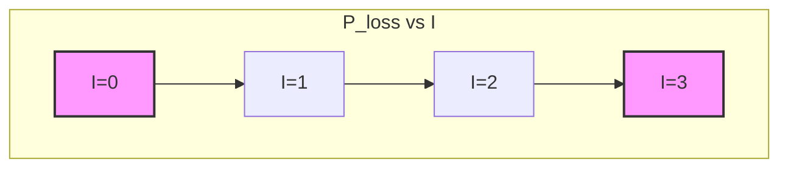

# Power Transmission and the National Grid / 电力传输与国家电网

---

# 1. Overview / 概述

**English:**
This sub-topic explores how electrical power is transmitted from power stations to consumers via the National Grid. The key principle is that transmitting electrical power at high voltage and low current minimizes energy losses due to resistive heating in transmission cables ($P_{\text{loss}} = I^2R$). This is achieved using [[The Ideal Transformer]] to step up voltage at the power station and step down voltage at substations for safe domestic and industrial use. Understanding this system connects [[AC Generator (Alternator) Principle]] to real-world energy distribution and highlights the critical role of transformers in modern society.

**中文:**
本子知识点探讨电力如何从发电站通过国家电网传输到用户。关键原理是，通过高压低电流传输电能，可以最大限度地减少传输电缆中因电阻发热造成的能量损耗 ($P_{\text{loss}} = I^2R$)。这是通过使用[[理想变压器]]在发电站升压，并在变电站降压以供安全的家庭和工业使用来实现的。理解这个系统将[[交流发电机原理]]与现实世界的能源分配联系起来，并凸显了变压器在现代社会中的关键作用。

---

# 2. Syllabus Learning Objectives / 考纲学习目标

| CAIE 9702 | Edexcel IAL |
|-----------|-------------|
| 20.4(a) Explain the principles of power transmission in the National Grid. | 3.16 Understand the principles of power transmission in the National Grid. |
| 20.4(b) Explain why high voltage is used for power transmission. | 3.17 Understand why high voltage is used for power transmission. |
| 20.4(c) Explain the role of step-up and step-down transformers in the National Grid. | 3.18 Understand the role of step-up and step-down transformers in the National Grid. |
| 20.4(d) Calculate power losses in transmission cables. | 3.19 Calculate power losses in transmission cables. |
| 20.4(e) Explain the economic and environmental considerations of power transmission. | 3.20 Discuss the economic and environmental considerations of power transmission. |
| 20.4(f) Describe the structure of the National Grid. | (Covered in 3.16) |

**Examiner Expectations / 考官期望:**
- **English:** Students must be able to explain *why* high voltage reduces power loss, not just state it. They must be able to perform calculations involving $P = IV$, $P = I^2R$, and transformer ratios. They should also discuss the practical trade-offs (e.g., insulation costs vs. energy savings).
- **中文:** 学生必须能够解释*为什么*高压能减少功率损耗，而不仅仅是陈述它。他们必须能够进行涉及 $P = IV$、$P = I^2R$ 和变压器变比的计算。他们还应该讨论实际中的权衡（例如，绝缘成本与节能）。

---

# 3. Core Definitions / 核心定义

| Term (EN/CN) | Definition (EN) | Definition (CN) | Common Mistakes / 常见错误 |
|--------------|-----------------|-----------------|---------------------------|
| **National Grid** / 国家电网 | The network of cables and transformers that distributes electrical power from power stations to consumers across a country. | 将电力从发电站分配到全国用户的电缆和变压器网络。 | Confusing it with a single power station or local wiring. |
| **Step-up Transformer** / 升压变压器 | A transformer that increases voltage (and decreases current) from the primary to the secondary coil. Used at power stations. | 一种从初级线圈到次级线圈升高电压（并降低电流）的变压器。用于发电站。 | Forgetting that power ($P$) is conserved (ideal case). |
| **Step-down Transformer** / 降压变压器 | A transformer that decreases voltage (and increases current) from the primary to the secondary coil. Used at substations. | 一种从初级线圈到次级线圈降低电压（并升高电流）的变压器。用于变电站。 | Forgetting that power ($P$) is conserved (ideal case). |
| **Power Loss** / 功率损耗 | The electrical power dissipated as heat in transmission cables, given by $P_{\text{loss}} = I^2R$. | 传输电缆中以热量形式耗散的电功率，由 $P_{\text{loss}} = I^2R$ 给出。 | Using $P = V^2/R$ with the transmission voltage instead of the voltage drop across the cable. |
| **Transmission Voltage** / 传输电压 | The high voltage (e.g., 132 kV, 275 kV, 400 kV in the UK) used in the main grid to minimize current and thus power loss. | 主电网中使用的高电压（例如英国为 132 kV、275 kV、400 kV），以最小化电流，从而减少功率损耗。 | Thinking the voltage is the same as the domestic supply (230 V). |
| **Substation** / 变电站 | A facility in the National Grid where voltage is stepped down using transformers for local distribution. | 国家电网中通过变压器降压以进行本地配电的设施。 | Confusing with a power station. |

---

# 4. Key Concepts Explained / 关键概念详解

## 4.1 Why High Voltage Reduces Power Loss / 为什么高压能减少功率损耗

### Explanation / 解释
**English:** The fundamental reason for using high voltage in the National Grid is to minimize the current flowing through the transmission cables. The power to be transmitted ($P_{\text{transmit}}$) is fixed by the demand. From $P = IV$, if voltage $V$ is increased, the current $I$ must decrease proportionally. The power lost as heat in the cables is given by $P_{\text{loss}} = I^2R$, where $R$ is the total resistance of the cables. Since $P_{\text{loss}}$ depends on $I^2$, a small reduction in current leads to a large reduction in power loss. For example, doubling the voltage halves the current, which reduces the power loss by a factor of four ($(1/2)^2 = 1/4$). This is a direct application of [[Electromagnetic Induction]] and [[The Ideal Transformer]].

**中文:** 在国家电网中使用高压的根本原因是为了最小化流经传输电缆的电流。需要传输的功率 ($P_{\text{transmit}}$) 由需求决定。根据 $P = IV$，如果电压 $V$ 升高，电流 $I$ 必须成比例地降低。电缆中以热量形式损失的功率由 $P_{\text{loss}} = I^2R$ 给出，其中 $R$ 是电缆的总电阻。由于 $P_{\text{loss}}$ 取决于 $I^2$，电流的微小减少会导致功率损耗的大幅减少。例如，电压加倍使电流减半，这会使功率损耗减少四倍 ($(1/2)^2 = 1/4$)。这是[[电磁感应]]和[[理想变压器]]的直接应用。

### Physical Meaning / 物理意义
**English:** The energy is lost due to electrons colliding with the lattice ions in the cable material, causing them to vibrate more (heating). Higher current means more electrons flowing per second, hence more collisions per second, and more heat generated. The $I^2R$ relationship shows this is a non-linear effect; doubling the current quadruples the heating rate.

**中文:** 能量损失是由于电子与电缆材料中的晶格离子碰撞，导致它们振动加剧（发热）。更高的电流意味着每秒有更多电子流动，因此每秒有更多碰撞，产生更多热量。$I^2R$ 关系表明这是一种非线性效应；电流加倍会使发热速率增加四倍。

### Common Misconceptions / 常见误区
- **English:** Students often think high voltage is dangerous, so it's bad. The key is that the *current* is low, which reduces the *I²R* loss. The high voltage is contained within the cables and transformers.
- **中文:** 学生常认为高压很危险，所以不好。关键在于*电流*很低，这减少了 *I²R* 损耗。高压被限制在电缆和变压器内部。
- **English:** Confusing $P = V^2/R$ with $P = I^2R$. For a fixed cable resistance, $P = V^2/R$ uses the *voltage drop across the cable* ($V_{\text{drop}} = IR$), not the transmission voltage.
- **中文:** 混淆 $P = V^2/R$ 和 $P = I^2R$。对于固定的电缆电阻，$P = V^2/R$ 使用的是*电缆两端的电压降* ($V_{\text{drop}} = IR$)，而不是传输电压。

### Exam Tips / 考试提示
- **English:** Always start your explanation with $P_{\text{transmit}} = IV$. State that $P_{\text{transmit}}$ is constant. Then show that $I \propto 1/V$. Finally, link to $P_{\text{loss}} = I^2R$.
- **中文:** 始终以 $P_{\text{transmit}} = IV$ 开始你的解释。说明 $P_{\text{transmit}}$ 是恒定的。然后证明 $I \propto 1/V$。最后，联系到 $P_{\text{loss}} = I^2R$。

> 📷 **IMAGE PROMPT — DIAGRAM-01: Comparison of Power Loss at Different Voltages**
> A side-by-side comparison of two transmission systems. Left side: Low voltage (e.g., 11 kV), high current (e.g., 1000 A), showing thick, glowing red cables with large "I²R Loss = 10 MW" label. Right side: High voltage (e.g., 400 kV), low current (e.g., 27.5 A), showing thinner, cool cables with small "I²R Loss = 7.5 kW" label. Arrows show the same power (11 MW) being transmitted in both cases. Include a small transformer icon on the right side.

---

## 4.2 The Role of Step-Up and Step-Down Transformers / 升压和降压变压器的作用

### Explanation / 解释
**English:** The National Grid uses [[The Ideal Transformer]] at two key points:
1.  **At the Power Station:** A **step-up transformer** increases the voltage from the generator output (e.g., 25 kV) to the transmission voltage (e.g., 400 kV). This drastically reduces the current for long-distance transmission.
2.  **At Substations:** A series of **step-down transformers** reduce the voltage from the transmission level to safer levels for distribution. The first substation might step down to 132 kV, then to 33 kV, then to 11 kV for local distribution. Finally, a local transformer on a pole or in a ground box steps it down to 230 V (or 110 V in some countries) for domestic use.

**中文:** 国家电网在两个关键点使用[[理想变压器]]：
1.  **在发电站：** **升压变压器**将发电机输出（例如 25 kV）的电压升高到传输电压（例如 400 kV）。这极大地减少了长距离传输的电流。
2.  **在变电站：** 一系列**降压变压器**将电压从传输水平降低到更安全的配电水平。第一个变电站可能降压到 132 kV，然后到 33 kV，再到 11 kV 用于本地配电。最后，电线杆上或地面箱中的本地变压器将其降压到 230 V（或某些国家的 110 V）供家庭使用。

### Physical Meaning / 物理意义
**English:** The transformer allows the electrical energy to be "packaged" differently for different stages of the journey. High voltage is an efficient "shipping container" for long distances, while low voltage is a safe "retail package" for the end-user.

**中文:** 变压器允许电能以不同的方式“打包”以适应旅程的不同阶段。高压是长距离运输的高效“集装箱”，而低压是面向最终用户的安全“零售包装”。

### Common Misconceptions / 常见误区
- **English:** Thinking that a single transformer does all the work. In reality, there is a cascade of step-down transformers.
- **中文:** 认为单个变压器完成所有工作。实际上，有一连串的降压变压器。
- **English:** Forgetting that in an ideal transformer, power is conserved ($V_p I_p = V_s I_s$). A step-up transformer increases voltage but decreases current.
- **中文:** 忘记在理想变压器中，功率是守恒的 ($V_p I_p = V_s I_s$)。升压变压器升高电压但降低电流。

### Exam Tips / 考试提示
- **English:** Be able to draw a simple block diagram of the National Grid: Power Station → Step-up Transformer → Transmission Lines → Step-down Transformer(s) → Consumer.
- **中文:** 能够画出国家电网的简单框图：发电站 → 升压变压器 → 传输线 → 降压变压器 → 用户。

> 📷 **IMAGE PROMPT — DIAGRAM-02: National Grid Block Diagram**
> A clear block diagram showing the flow of electricity. Blocks: "Power Station (25 kV)" → "Step-up Transformer" → "Transmission Lines (400 kV)" → "Step-down Transformer (Substation)" → "Local Distribution (11 kV)" → "Step-down Transformer (Pole)" → "Houses (230 V)". Arrows indicate direction of energy flow. Labels show voltage levels at each stage.

---

# 5. Essential Equations / 核心公式

## 5.1 Power Loss in Cables / 电缆中的功率损耗

$$ P_{\text{loss}} = I^2 R $$

| Symbol (符号) | Meaning (EN) | Meaning (CN) | Unit (单位) |
|--------------|-------------|-------------|------------|
| $P_{\text{loss}}$ | Power dissipated as heat in the cable | 电缆中以热量形式耗散的功率 | W (Watts) |
| $I$ | Current flowing through the cable | 流经电缆的电流 | A (Amperes) |
| $R$ | Total resistance of the transmission cable | 传输电缆的总电阻 | Ω (Ohms) |

**Derivation / 推导:** This comes from combining $P = IV$ and Ohm's law $V = IR$. The voltage drop across the cable is $V_{\text{drop}} = IR$, so the power dissipated is $P_{\text{loss}} = I \times V_{\text{drop}} = I \times (IR) = I^2R$.

**Conditions / 适用条件:**
- **English:** The cable resistance $R$ is assumed constant (though it increases slightly with temperature).
- **中文:** 假设电缆电阻 $R$ 是恒定的（尽管它会随温度略微升高）。

**Limitations / 局限性:**
- **English:** This equation only accounts for resistive (Joule) heating. It does not account for other losses like corona discharge (ionization of air around high-voltage lines) or inductive losses.
- **中文:** 该方程仅考虑电阻（焦耳）发热。它不考虑其他损耗，如电晕放电（高压线周围空气的电离）或感应损耗。

## 5.2 Power Transmitted / 传输的功率

$$ P_{\text{transmit}} = I V_{\text{transmit}} $$

| Symbol (符号) | Meaning (EN) | Meaning (CN) | Unit (单位) |
|--------------|-------------|-------------|------------|
| $P_{\text{transmit}}$ | Total power being sent along the transmission line | 沿传输线发送的总功率 | W |
| $I$ | Current in the transmission line | 传输线中的电流 | A |
| $V_{\text{transmit}}$ | Voltage of the transmission line (line-to-line) | 传输线的电压（线间电压） | V |

**Conditions / 适用条件:**
- **English:** This is for AC power, assuming a purely resistive load (power factor = 1). In reality, the power factor is less than 1, but A-Level exams usually assume it's 1.
- **中文:** 这适用于交流电，假设为纯阻性负载（功率因数 = 1）。实际上，功率因数小于 1，但 A-Level 考试通常假设其为 1。

## 5.3 Transformer Equation (Ideal) / 变压器方程（理想）

$$ \frac{V_s}{V_p} = \frac{N_s}{N_p} = \frac{I_p}{I_s} $$

| Symbol (符号) | Meaning (EN) | Meaning (CN) | Unit (单位) |
|--------------|-------------|-------------|------------|
| $V_s, V_p$ | Secondary and primary voltage | 次级和初级电压 | V |
| $N_s, N_p$ | Number of turns on secondary and primary coil | 次级和初级线圈的匝数 | - |
| $I_s, I_p$ | Secondary and primary current | 次级和初级电流 | A |

**Derivation / 推导:** Based on [[Electromagnetic Induction]] and conservation of energy for an ideal transformer.

**Conditions / 适用条件:**
- **English:** Ideal transformer (100% efficiency, no flux leakage, no resistance in coils).
- **中文:** 理想变压器（100% 效率，无磁通泄漏，线圈无电阻）。

---

# 6. Graphs and Relationships / 图表与关系

## 6.1 Power Loss vs. Current / 功率损耗与电流的关系

### Axes / 坐标轴
- **X-axis:** Current, $I$ (A) / 电流, $I$ (A)
- **Y-axis:** Power Loss, $P_{\text{loss}}$ (W) / 功率损耗, $P_{\text{loss}}$ (W)

### Shape / 形状
- **English:** A parabola (quadratic curve) passing through the origin. $P_{\text{loss}} \propto I^2$.
- **中文:** 一条通过原点的抛物线（二次曲线）。$P_{\text{loss}} \propto I^2$。

### Gradient Meaning / 斜率含义
- **English:** The gradient is $2IR$, which is not constant. It increases with current.
- **中文:** 斜率为 $2IR$，不是常数。它随电流增加而增加。

### Area Meaning / 面积含义
- **English:** Not physically meaningful in this context.
- **中文:** 在此上下文中没有物理意义。

### Exam Interpretation / 考试解读
- **English:** A steep curve means a small increase in current causes a large increase in power loss. This is why reducing current is so important.
- **中文:** 陡峭的曲线意味着电流的微小增加会导致功率损耗的大幅增加。这就是为什么降低电流如此重要。



---

# 7. Required Diagrams / 必备图表

## 7.1 The National Grid System / 国家电网系统

### Description / 描述
**English:** A schematic diagram showing the entire path of electrical power from generation to consumption, including all key components and voltage levels.
**中文:** 显示电力从发电到消费的整个路径的示意图，包括所有关键组件和电压水平。

### Image Prompt / 图片生成提示
> 📷 **IMAGE PROMPT — DIAGRAM-03: The National Grid System**
> A detailed, colorful schematic diagram of the National Grid. Start with a power station (cooling towers, turbine icon) labeled "Power Station (25 kV)". An arrow leads to a "Step-up Transformer" (two coils with a core). Another arrow leads to "Transmission Lines (400 kV)" depicted as tall pylons with cables. An arrow leads to a "Step-down Transformer (Substation)" (larger building). An arrow leads to "Local Distribution (11 kV)" shown as smaller poles. Finally, an arrow leads to a "Step-down Transformer (Pole)" and then to "Houses (230 V)". Include labels for voltage at each stage. Use a clean, educational style.

### Labels Required / 需要标注
- **English:** Power Station, Step-up Transformer, Transmission Lines (Pylons), Step-down Transformer (Substation), Local Distribution Lines, Step-down Transformer (Pole), Consumer (House).
- **中文:** 发电站、升压变压器、传输线（铁塔）、降压变压器（变电站）、本地配电线路、降压变压器（电线杆）、用户（房屋）。

### Exam Importance / 考试重要性
- **English:** Very high. Students are often asked to draw or label this diagram in exams.
- **中文:** 非常高。考试中经常要求学生画出或标注此图。

---

# 8. Worked Examples / 典型例题

## Example 1: Calculating Power Loss / 计算功率损耗

### Question / 题目
**English:**
A power station generates 100 MW of power at 25 kV. It uses a step-up transformer to increase the voltage to 400 kV for transmission. The total resistance of the transmission cables is 10 Ω.
(a) Calculate the current in the transmission cables.
(b) Calculate the power loss in the cables.
(c) Calculate the percentage of power lost.
(d) Explain why it is more efficient to transmit at 400 kV than at 25 kV.

**中文:**
一个发电站以 25 kV 的电压产生 100 MW 的功率。它使用升压变压器将电压升高到 400 kV 进行传输。传输电缆的总电阻为 10 Ω。
(a) 计算传输电缆中的电流。
(b) 计算电缆中的功率损耗。
(c) 计算功率损耗的百分比。
(d) 解释为什么以 400 kV 传输比以 25 kV 传输更高效。

### Solution / 解答

**Part (a):**
- **English:** The power transmitted is constant: $P_{\text{transmit}} = 100 \text{ MW} = 100 \times 10^6 \text{ W}$.
  The transmission voltage is $V_{\text{transmit}} = 400 \text{ kV} = 400 \times 10^3 \text{ V}$.
  Using $P = IV$, the current is:
  $$ I = \frac{P}{V} = \frac{100 \times 10^6}{400 \times 10^3} = 250 \text{ A} $$
- **中文:** 传输的功率是恒定的：$P_{\text{transmit}} = 100 \text{ MW} = 100 \times 10^6 \text{ W}$。
  传输电压为 $V_{\text{transmit}} = 400 \text{ kV} = 400 \times 10^3 \text{ V}$。
  使用 $P = IV$，电流为：
  $$ I = \frac{P}{V} = \frac{100 \times 10^6}{400 \times 10^3} = 250 \text{ A} $$

**Part (b):**
- **English:** The power loss is given by $P_{\text{loss}} = I^2 R$.
  $$ P_{\text{loss}} = (250)^2 \times 10 = 62500 \times 10 = 625,000 \text{ W} = 0.625 \text{ MW} $$
- **中文:** 功率损耗由 $P_{\text{loss}} = I^2 R$ 给出。
  $$ P_{\text{loss}} = (250)^2 \times 10 = 62500 \times 10 = 625,000 \text{ W} = 0.625 \text{ MW} $$

**Part (c):**
- **English:** The percentage loss is:
  $$ \text{Percentage Loss} = \frac{P_{\text{loss}}}{P_{\text{transmit}}} \times 100\% = \frac{0.625}{100} \times 100\% = 0.625\% $$
- **中文:** 损耗百分比为：
  $$ \text{百分比损耗} = \frac{P_{\text{loss}}}{P_{\text{transmit}}} \times 100\% = \frac{0.625}{100} \times 100\% = 0.625\% $$

**Part (d):**
- **English:** If transmitted at 25 kV, the current would be $I = \frac{100 \times 10^6}{25 \times 10^3} = 4000 \text{ A}$. The power loss would be $P_{\text{loss}} = (4000)^2 \times 10 = 160,000,000 \text{ W} = 160 \text{ MW}$. This is greater than the generated power, which is impossible. By stepping up to 400 kV, the current is reduced by a factor of 16, and the power loss is reduced by a factor of $16^2 = 256$.
- **中文:** 如果以 25 kV 传输，电流将为 $I = \frac{100 \times 10^6}{25 \times 10^3} = 4000 \text{ A}$。功率损耗将为 $P_{\text{loss}} = (4000)^2 \times 10 = 160,000,000 \text{ W} = 160 \text{ MW}$。这比产生的功率还大，是不可能的。通过升压到 400 kV，电流减少了 16 倍，功率损耗减少了 $16^2 = 256$ 倍。

### Final Answer / 最终答案
**Answer:** (a) 250 A | **答案：** (a) 250 A
**Answer:** (b) 0.625 MW | **答案：** (b) 0.625 MW
**Answer:** (c) 0.625% | **答案：** (c) 0.625%

### Quick Tip / 提示
- **English:** Always convert units to base units (W, V, A, Ω) before calculating.
- **中文:** 在计算前始终将单位转换为基本单位（W, V, A, Ω）。

---

# 9. Past Paper Question Types / 历年真题题型

| Question Type / 题型 | Frequency / 频率 | Difficulty / 难度 | Past Paper References / 真题索引 |
|----------------------|------------------|------------------|-------------------------------|
| Calculation of power loss in cables | High | Medium | 📝 *待填入* |
| Explanation of why high voltage is used | High | Low | 📝 *待填入* |
| Diagram of the National Grid | Medium | Low | 📝 *待填入* |
| Discussion of economic/environmental factors | Low | Medium | 📝 *待填入* |

**Common Command Words / 常见指令词:**
- **English:** Explain, Calculate, Describe, Discuss, Suggest
- **中文:** 解释、计算、描述、讨论、提出

---

# 10. Practical Skills Connections / 实验技能链接

**English:**
- **Measurements:** In a lab, you can simulate power transmission using low-voltage AC supplies, resistors (as cables), and small transformers. Measure voltage and current before and after the "cables" to calculate power loss.
- **Uncertainties:** When measuring $V$ and $I$ to calculate $P_{\text{loss}} = I^2R$, the uncertainty in $P_{\text{loss}}$ is significant because it depends on $I^2$. Use percentage uncertainties: $\frac{\Delta P_{\text{loss}}}{P_{\text{loss}}} = 2\frac{\Delta I}{I} + \frac{\Delta R}{R}$.
- **Graph Plotting:** Plot $P_{\text{loss}}$ against $I^2$ to get a straight line with gradient $R$. This is a common practical to verify the $I^2R$ relationship.
- **Experimental Design:** Design an experiment to compare the efficiency of transmitting power at different voltages using a model grid.

**中文:**
- **测量：** 在实验室中，你可以使用低压交流电源、电阻器（作为电缆）和小型变压器来模拟电力传输。测量“电缆”前后的电压和电流以计算功率损耗。
- **不确定度：** 当测量 $V$ 和 $I$ 以计算 $P_{\text{loss}} = I^2R$ 时，$P_{\text{loss}}$ 的不确定度很大，因为它取决于 $I^2$。使用百分比不确定度：$\frac{\Delta P_{\text{loss}}}{P_{\text{loss}}} = 2\frac{\Delta I}{I} + \frac{\Delta R}{R}$。
- **图表绘制：** 绘制 $P_{\text{loss}}$ 对 $I^2$ 的图表，得到一条斜率为 $R$ 的直线。这是验证 $I^2R$ 关系的常见实验。
- **实验设计：** 设计一个实验，使用模型电网比较在不同电压下传输功率的效率。

---

# 11. Concept Map / 概念图谱

```mermaid
graph TD
    subgraph "Power Transmission & National Grid"
        A[Power Station] --> B[Step-up Transformer]
        B --> C[High Voltage Transmission Lines]
        C --> D[Step-down Transformer (Substation)]
        D --> E[Local Distribution]
        E --> F[Step-down Transformer (Pole)]
        F --> G[Consumer (Houses/Industry)]

        H[AC Generator Principle] --> A
        I[Electromagnetic Induction] --> B
        I --> D
        I --> F

        J[Ideal Transformer] --> B
        J --> D
        J --> F

        K[P_transmit = IV] --> C
        L[P_loss = I²R] --> C

        M[Why High Voltage?] --> C
        M --> |Reduces I| L
        M --> |Increases V| K
    end

    style A fill:#c9e6ff,stroke:#333,stroke-width:2px
    style C fill:#ffcccb,stroke:#333,stroke-width:2px
    style G fill:#d4edda,stroke:#333,stroke-width:2px
    style M fill:#ffeeba,stroke:#333,stroke-width:2px
```

---

# 12. Quick Revision Sheet / 速查表

| Category / 类别 | Key Points / 要点 |
|----------------|------------------|
| **Definition / 定义** | The National Grid is a network of cables and transformers for distributing electrical power. |
| **Key Formula / 核心公式** | $P_{\text{loss}} = I^2R$ (power loss in cables) <br> $P_{\text{transmit}} = IV$ (power transmitted) <br> $\frac{V_s}{V_p} = \frac{N_s}{N_p} = \frac{I_p}{I_s}$ (ideal transformer) |
| **Key Graph / 核心图表** | $P_{\text{loss}}$ vs $I$: Parabola ($P_{\text{loss}} \propto I^2$) |
| **Key Diagram / 核心图表** | National Grid: Power Station → Step-up Transformer → Transmission Lines → Step-down Transformer(s) → Consumer |
| **Exam Tip / 考试提示** | Always start explanation with $P_{\text{transmit}} = IV$ (constant). Show $I \propto 1/V$. Then $P_{\text{loss}} = I^2R \propto 1/V^2$. |
| **Common Mistake / 常见错误** | Using $P = V^2/R$ with the transmission voltage instead of the voltage drop across the cable. |
| **Practical Link / 实验联系** | Plot $P_{\text{loss}}$ vs $I^2$ to find cable resistance $R$ from the gradient. |