# RMS and Peak Values / 均方根值与峰值

---

# 1. Overview / 概述

**English:**
This sub-topic introduces the crucial distinction between **peak values** and **root-mean-square (RMS) values** for alternating current (AC) circuits. Unlike direct current (DC), which has constant voltage and current, AC quantities vary sinusoidally with time. The RMS value is defined as the **equivalent DC value** that would dissipate the same average power in a resistive load. Understanding RMS values is essential for correctly calculating power, voltage, and current in AC circuits, and forms the foundation for analysing [[AC Generator (Alternator) Principle]] output and [[The Ideal Transformer]] operation. This concept bridges the gap between the instantaneous sinusoidal waveform and the practical, measurable quantities used in electrical engineering.

**中文:**
本子知识点介绍了交流电路中**峰值**与**均方根值**之间的关键区别。与具有恒定电压和电流的直流电不同，交流量随时间呈正弦变化。均方根值定义为在电阻性负载中耗散相同平均功率的**等效直流值**。理解均方根值对于正确计算交流电路中的功率、电压和电流至关重要，并为分析[[交流发电机原理]]输出和[[理想变压器]]运行奠定了基础。该概念弥合了瞬时正弦波形与电气工程中使用的实际可测量量之间的差距。

---

# 2. Syllabus Learning Objectives / 考纲学习目标

| CAIE 9702 | Edexcel IAL |
|-----------|-------------|
| 20.4(a): Distinguish between root-mean-square (rms) and peak values of alternating current and voltage | 3.16: Understand the concept of root-mean-square (rms) values for alternating current and voltage |
| 20.4(b): Derive the relationship $I_{rms} = \frac{I_0}{\sqrt{2}}$ for a sinusoidal current | 3.17: Derive and use the relationship $V_{rms} = \frac{V_0}{\sqrt{2}}$ for a sinusoidal voltage |
| 20.4(c): Use the relationship $P_{av} = I_{rms}^2 R = \frac{V_{rms}^2}{R}$ | 3.18: Use $P_{av} = I_{rms}^2 R = \frac{V_{rms}^2}{R}$ to calculate average power in AC circuits |
| 20.4(d): Calculate rms values for non-sinusoidal waveforms (e.g., square waves) | 3.19: Understand that rms values are used for AC power calculations |
| 20.4(e): Explain why rms values are used in AC circuit analysis | 3.20: Apply rms values to solve problems involving AC circuits |
| 20.4(f): Solve problems involving peak and rms values | — |

**Examiner Expectations / 考官期望:**
- **CAIE:** Students must be able to derive the $\frac{1}{\sqrt{2}}$ factor for sinusoidal waves and apply it to both voltage and current. Non-sinusoidal waveforms (e.g., square waves) may appear in calculations.
- **Edexcel:** Focus is on sinusoidal waveforms. Students must understand the physical meaning of RMS and use it in power calculations. Derivation is expected.

---

# 3. Core Definitions / 核心定义

| Term (EN/CN) | Definition (EN) | Definition (CN) | Common Mistakes / 常见错误 |
|--------------|-----------------|-----------------|---------------------------|
| **Peak Value ($V_0$, $I_0$)** / 峰值 | The maximum instantaneous value of an alternating voltage or current during one cycle. | 在一个周期内交流电压或电流的最大瞬时值。 | Confusing peak-to-peak ($2V_0$) with peak ($V_0$). |
| **Root-Mean-Square (RMS) Value ($V_{rms}$, $I_{rms}$)** / 均方根值 | The equivalent DC value of an alternating current or voltage that produces the same average power dissipation in a resistive load. | 在电阻性负载中产生相同平均功率耗散的交流电流或电压的等效直流值。 | Thinking RMS is the average of the waveform (which is zero for a pure AC sine wave). |
| **Average Power ($P_{av}$)** / 平均功率 | The mean power dissipated over one complete cycle of an AC waveform. | 在一个完整的交流波形周期内耗散的平均功率。 | Using peak values directly in $P = I^2R$ without converting to RMS. |
| **Sinusoidal Waveform** / 正弦波形 | A waveform that follows the mathematical function $y = A \sin(\omega t)$ or $y = A \cos(\omega t)$. | 遵循数学函数 $y = A \sin(\omega t)$ 或 $y = A \cos(\omega t)$ 的波形。 | Forgetting that the derivation of $\frac{1}{\sqrt{2}}$ only applies to sinusoidal waves. |
| **Form Factor** / 波形因数 | The ratio of RMS value to average value of a waveform. For a sine wave, form factor = 1.11. | 波形的均方根值与平均值之比。对于正弦波，波形因数 = 1.11。 | Not required for CAIE/Edexcel but useful for context. |

---

# 4. Key Concepts Explained / 关键概念详解

## 4.1 Why RMS? Why Not Average? / 为什么用均方根？为什么不用平均值？

### Explanation / 解释
**English:**
For a pure sinusoidal AC voltage $v(t) = V_0 \sin(\omega t)$, the **average value** over a complete cycle is **zero** because the positive and negative halves cancel out. If we used the average value to calculate power, we would get $P = 0$, which is clearly wrong — a resistor connected to an AC supply gets hot!

The correct approach is to find the **equivalent DC value** that delivers the same power. Since power is proportional to $v^2$ (or $i^2$), we:
1. **Square** the instantaneous values (making everything positive)
2. **Average** the squared values over one cycle
3. **Take the square root** of that average

Hence: **Root Mean Square** = $\sqrt{\text{Mean of the Square}}$

**中文:**
对于一个纯正弦交流电压 $v(t) = V_0 \sin(\omega t)$，在一个完整周期内的**平均值**是**零**，因为正半周和负半周相互抵消。如果我们用平均值来计算功率，会得到 $P = 0$，这显然是错误的——连接到交流电源的电阻器会发热！

正确的方法是找到传递相同功率的**等效直流值**。由于功率与 $v^2$（或 $i^2$）成正比，我们：
1. **平方**瞬时值（使所有值变为正数）
2. **平均**一个周期内的平方值
3. **取平方根**得到该平均值

因此：**均方根** = $\sqrt{\text{平方的平均值}}$

### Physical Meaning / 物理意义
**English:**
The RMS value tells you the **heating effect** of an AC waveform. A 230 V RMS AC supply delivers the same average power to a heater as a 230 V DC supply. The peak voltage of this supply is $230 \times \sqrt{2} \approx 325 \text{ V}$, but the wire insulation only needs to be rated for the heating effect (RMS), while the insulation breakdown voltage must handle the peak.

**中文:**
均方根值告诉你交流波形的**热效应**。230 V 均方根交流电源向加热器传递的平均功率与 230 V 直流电源相同。该电源的峰值电压为 $230 \times \sqrt{2} \approx 325 \text{ V}$，但导线绝缘只需按热效应（均方根值）额定，而绝缘击穿电压必须能承受峰值。

### Common Misconceptions / 常见误区
- ❌ **"RMS is the average of the waveform"** — No! The average of a sine wave over a full cycle is zero. RMS is the square root of the mean of the squared values.
- ❌ **"Peak voltage is always $\sqrt{2}$ times RMS"** — Only for sinusoidal waveforms. For square waves, $V_{rms} = V_0$.
- ❌ **"I can use peak values in $P = IV$"** — No! You must use RMS values for average power calculations.
- ❌ **"RMS and peak are the same for DC"** — For pure DC, RMS = peak = average.

### Exam Tips / 考试提示
- **CAIE:** Be prepared to derive $I_{rms} = I_0/\sqrt{2}$ from first principles using integration.
- **Edexcel:** Know the derivation but focus more on application in power calculations.
- Always check whether the question gives **peak** or **RMS** values before calculating power.
- For half-wave rectified signals, the RMS value is $V_0/2$ (not $V_0/\sqrt{2}$).

> 📷 **IMAGE PROMPT — RMS-VS-PEAK: Comparison of Peak and RMS Values on a Sine Wave**
> A clean sinusoidal waveform showing one complete cycle. Label the peak voltage $V_0$ at the maximum point. Draw a horizontal dashed line at $V_{rms} = V_0/\sqrt{2}$ showing it is lower than the peak. Add a second horizontal line at $V_{av} = 0$ to show the average is zero. Include a shaded area under the squared waveform to illustrate the "mean of the square" concept. Use blue for voltage, red for RMS, and green for average. Style: clean educational diagram, white background, A-Level physics standard.

---

# 5. Essential Equations / 核心公式

## Equation 1: RMS-Peak Relationship for Sinusoidal Waves / 正弦波的均方根-峰值关系

$$ I_{rms} = \frac{I_0}{\sqrt{2}} \quad \text{and} \quad V_{rms} = \frac{V_0}{\sqrt{2}} $$

| Symbol (符号) | Meaning (EN) | Meaning (CN) | Unit (单位) |
|--------------|-------------|-------------|------------|
| $I_{rms}$ | Root-mean-square current | 均方根电流 | A (安培) |
| $I_0$ | Peak current | 峰值电流 | A (安培) |
| $V_{rms}$ | Root-mean-square voltage | 均方根电压 | V (伏特) |
| $V_0$ | Peak voltage | 峰值电压 | V (伏特) |

**Derivation / 推导:**
For a sinusoidal current $i(t) = I_0 \sin(\omega t)$:
1. Square: $i^2(t) = I_0^2 \sin^2(\omega t)$
2. Average over one period $T = \frac{2\pi}{\omega}$:
   $$ \langle i^2 \rangle = \frac{1}{T} \int_0^T I_0^2 \sin^2(\omega t) \, dt = \frac{I_0^2}{T} \int_0^T \frac{1 - \cos(2\omega t)}{2} \, dt = \frac{I_0^2}{2} $$
3. Take square root: $I_{rms} = \sqrt{\langle i^2 \rangle} = \frac{I_0}{\sqrt{2}}$

**Conditions / 适用条件:**
- **EN:** Only valid for **pure sinusoidal** waveforms. For square waves, $I_{rms} = I_0$.
- **CN:** 仅适用于**纯正弦**波形。对于方波，$I_{rms} = I_0$。

**Limitations / 局限性:**
- **EN:** Does not apply to non-periodic signals or waveforms with DC offset without modification.
- **CN:** 不适用于非周期信号或带有直流偏置的波形（未经修正）。

## Equation 2: Average Power in AC Circuits / 交流电路中的平均功率

$$ P_{av} = I_{rms}^2 R = \frac{V_{rms}^2}{R} = V_{rms} I_{rms} $$

| Symbol (符号) | Meaning (EN) | Meaning (CN) | Unit (单位) |
|--------------|-------------|-------------|------------|
| $P_{av}$ | Average power dissipated | 平均耗散功率 | W (瓦特) |
| $R$ | Resistance | 电阻 | $\Omega$ (欧姆) |

**Derivation / 推导:**
Instantaneous power: $p(t) = i^2(t)R = I_0^2 R \sin^2(\omega t)$
Average power: $P_{av} = \langle p(t) \rangle = I_0^2 R \langle \sin^2(\omega t) \rangle = I_0^2 R \cdot \frac{1}{2} = \frac{I_0^2}{2} R = I_{rms}^2 R$

**Conditions / 适用条件:**
- **EN:** Only for **purely resistive** loads (no capacitors or inductors). For reactive loads, power factor must be considered.
- **CN:** 仅适用于**纯电阻性**负载（无电容或电感）。对于电抗性负载，必须考虑功率因数。

**Limitations / 局限性:**
- **EN:** Does not account for phase differences between voltage and current.
- **CN:** 不考虑电压和电流之间的相位差。

> 📷 **IMAGE PROMPT — RMS-DERIVATION: Graphical Derivation of RMS Value**
> Show three stacked graphs: (1) Original sine wave $i(t) = I_0 \sin(\omega t)$ in blue, (2) Squared wave $i^2(t) = I_0^2 \sin^2(\omega t)$ in red with a horizontal dashed line at $I_0^2/2$ showing the mean, (3) RMS value as a horizontal line at $I_0/\sqrt{2}$ on the original waveform. Use arrows to show the flow from squaring → averaging → square root. Style: clean educational diagram, white background, A-Level physics standard.

---

# 6. Graphs and Relationships / 图表与关系

## 6.1 Instantaneous vs RMS Values / 瞬时值与均方根值

### Axes / 坐标轴
- **X-axis:** Time / 时间 (s)
- **Y-axis:** Voltage or Current / 电压或电流 (V or A)

### Shape / 形状
- **Instantaneous:** Sinusoidal wave oscillating between $+V_0$ and $-V_0$
- **RMS:** Horizontal straight line at $V_0/\sqrt{2}$ (positive only, since RMS is always positive)

### Gradient Meaning / 斜率含义
- **EN:** The gradient of the instantaneous wave at any point gives the rate of change of voltage/current. The RMS line has zero gradient.
- **CN:** 瞬时波上任意点的斜率给出电压/电流的变化率。均方根线的斜率为零。

### Area Meaning / 面积含义
- **EN:** The area under the squared waveform over one cycle, divided by the period, gives the mean square value. The square root of this is RMS.
- **CN:** 一个周期内平方波形下的面积除以周期，得到均方值。其平方根即为均方根值。

### Exam Interpretation / 考试解读
- **EN:** When a question gives "230 V AC", it is always RMS unless stated otherwise. Convert to peak using $V_0 = V_{rms} \times \sqrt{2}$ for insulation or breakdown calculations.
- **CN:** 当题目给出"230 V 交流"时，除非另有说明，始终是均方根值。对于绝缘或击穿计算，使用 $V_0 = V_{rms} \times \sqrt{2}$ 转换为峰值。

## 6.2 Power vs Time for AC / 交流电功率与时间关系

### Axes / 坐标轴
- **X-axis:** Time / 时间 (s)
- **Y-axis:** Power / 功率 (W)

### Shape / 形状
- **Instantaneous power:** $p(t) = V_0 I_0 \sin^2(\omega t)$, oscillates between 0 and $V_0 I_0$ at twice the frequency ($2\omega$)
- **Average power:** Horizontal line at $P_{av} = \frac{V_0 I_0}{2} = V_{rms} I_{rms}$

### Gradient Meaning / 斜率含义
- **EN:** The instantaneous power curve has varying gradient; the average power line has zero gradient.
- **CN:** 瞬时功率曲线具有变化的斜率；平均功率线的斜率为零。

### Area Meaning / 面积含义
- **EN:** The area under the instantaneous power curve over one cycle equals the energy dissipated. Dividing by the period gives average power.
- **CN:** 一个周期内瞬时功率曲线下的面积等于耗散的能量。除以周期得到平均功率。

### Exam Interpretation / 考试解读
- **EN:** Power is always positive (since $v^2$ or $i^2$ is always positive). The frequency of power oscillation is **double** the frequency of voltage/current.
- **CN:** 功率始终为正（因为 $v^2$ 或 $i^2$ 始终为正）。功率振荡的频率是电压/电流频率的**两倍**。

---

# 7. Required Diagrams / 必备图表

## 7.1 RMS Derivation Diagram / 均方根推导图

### Description / 描述
**English:**
A three-panel diagram showing the step-by-step derivation of RMS value from a sinusoidal waveform: (a) original sine wave, (b) squared sine wave with mean value, (c) original wave with RMS value indicated.

**中文:**
一个三面板图，展示从正弦波形逐步推导均方根值的过程：(a) 原始正弦波，(b) 平方后的正弦波及平均值，(c) 原始波形上标注均方根值。

### Image Prompt / 图片生成提示
> 📷 **IMAGE PROMPT — RMS-DERIVATION-DIAGRAM: Three-Panel RMS Derivation**
> Panel 1 (top): A blue sine wave $i(t) = I_0 \sin(\omega t)$ with peak labeled $I_0$. Panel 2 (middle): The squared wave $i^2(t) = I_0^2 \sin^2(\omega t)$ in red, with a horizontal dashed line at $I_0^2/2$ labeled "Mean Square Value". Panel 3 (bottom): The original blue sine wave with a horizontal dashed line at $I_0/\sqrt{2}$ labeled "$I_{rms}$". Arrows connect Panel 2's mean value to Panel 3's RMS value. Style: clean educational diagram, white background, A-Level physics standard, professional labeling.

### Labels Required / 需要标注
- Peak value $I_0$ / 峰值 $I_0$
- Mean square value $I_0^2/2$ / 均方值 $I_0^2/2$
- RMS value $I_0/\sqrt{2}$ / 均方根值 $I_0/\sqrt{2}$
- Time axis / 时间轴
- Current axis / 电流轴

### Exam Importance / 考试重要性
- **EN:** High. Derivation of RMS is a common exam question (especially CAIE). Understanding the graphical representation helps avoid conceptual errors.
- **CN:** 高。均方根值的推导是常见考题（尤其是CAIE）。理解图形表示有助于避免概念性错误。

## 7.2 Peak vs RMS on a Sine Wave / 正弦波上的峰值与均方根值

### Description / 描述
**English:**
A single sine wave with peak voltage $V_0$, RMS voltage $V_{rms} = V_0/\sqrt{2}$, and average voltage $V_{av} = 0$ clearly marked.

**中文:**
一个正弦波，清晰标注峰值电压 $V_0$、均方根电压 $V_{rms} = V_0/\sqrt{2}$ 和平均电压 $V_{av} = 0$。

### Image Prompt / 图片生成提示
> 📷 **IMAGE PROMPT — PEAK-VS-RMS-SINE: Sine Wave with Peak, RMS, and Average**
> A single sinusoidal waveform spanning two cycles. Three horizontal lines: (1) At the maximum amplitude, labeled "$V_0$ (Peak)" in blue, (2) At $V_0/\sqrt{2}$, labeled "$V_{rms}$" in red, (3) At zero, labeled "$V_{av} = 0$" in green. Use arrows to show the relationship $V_0 = V_{rms} \times \sqrt{2}$. Style: clean educational diagram, white background, A-Level physics standard.

### Labels Required / 需要标注
- Peak voltage $V_0$ / 峰值电压 $V_0$
- RMS voltage $V_{rms} = V_0/\sqrt{2}$ / 均方根电压 $V_{rms} = V_0/\sqrt{2}$
- Average voltage $V_{av} = 0$ / 平均电压 $V_{av} = 0$
- Time axis / 时间轴
- Voltage axis / 电压轴

### Exam Importance / 考试重要性
- **EN:** Very high. This diagram is the foundation for understanding why RMS is used instead of average.
- **CN:** 非常高。该图是理解为什么使用均方根值而非平均值的基础。

---

# 8. Worked Examples / 典型例题

## Example 1: Calculating RMS from Peak / 从峰值计算均方根值

### Question / 题目
**English:**
A sinusoidal AC voltage has a peak value of 325 V. Calculate:
(a) The RMS voltage
(b) The average power dissipated when this voltage is connected across a 50 $\Omega$ resistor

**中文:**
一个正弦交流电压的峰值为 325 V。计算：
(a) 均方根电压
(b) 当该电压连接到 50 $\Omega$ 电阻两端时耗散的平均功率

### Solution / 解答

**(a) RMS Voltage / 均方根电压:**
$$ V_{rms} = \frac{V_0}{\sqrt{2}} = \frac{325}{\sqrt{2}} = 229.8 \text{ V} \approx 230 \text{ V} $$

**(b) Average Power / 平均功率:**
$$ P_{av} = \frac{V_{rms}^2}{R} = \frac{(230)^2}{50} = \frac{52900}{50} = 1058 \text{ W} $$

**Alternative method using peak values / 使用峰值计算的替代方法:**
$$ P_{av} = \frac{V_0^2}{2R} = \frac{325^2}{2 \times 50} = \frac{105625}{100} = 1056.25 \text{ W} \approx 1058 \text{ W} $$

### Final Answer / 最终答案
**Answer:** (a) $V_{rms} = 230 \text{ V}$ | (b) $P_{av} = 1058 \text{ W}$
**答案：** (a) $V_{rms} = 230 \text{ V}$ | (b) $P_{av} = 1058 \text{ W}$

### Quick Tip / 提示
- **EN:** Always use RMS values in power formulas. If given peak, convert first. The two methods should give the same answer — use this as a check.
- **CN:** 始终在功率公式中使用均方根值。如果给出峰值，先进行转换。两种方法应得到相同答案——可用此作为检查。

## Example 2: Non-Sinusoidal Waveform (Square Wave) / 非正弦波形（方波）

### Question / 题目
**English:**
A square wave voltage alternates between $+12 \text{ V}$ and $-12 \text{ V}$ with equal time intervals. Calculate:
(a) The RMS voltage
(b) The peak voltage
(c) Compare with a sinusoidal wave of the same peak voltage

**中文:**
一个方波电压在 $+12 \text{ V}$ 和 $-12 \text{ V}$ 之间以相等时间间隔交替变化。计算：
(a) 均方根电压
(b) 峰值电压
(c) 与相同峰值电压的正弦波进行比较

### Solution / 解答

**(a) RMS Voltage / 均方根电压:**
For a square wave, the squared value is constant at $V_0^2$ for the entire cycle.
$$ \langle v^2 \rangle = V_0^2 = 12^2 = 144 \text{ V}^2 $$
$$ V_{rms} = \sqrt{144} = 12 \text{ V} $$

**(b) Peak Voltage / 峰值电压:**
$$ V_0 = 12 \text{ V} $$

**(c) Comparison / 比较:**
For a sinusoidal wave with $V_0 = 12 \text{ V}$:
$$ V_{rms, \text{sine}} = \frac{12}{\sqrt{2}} = 8.49 \text{ V} $$

The square wave has a **higher** RMS value (12 V vs 8.49 V) for the same peak voltage, meaning it delivers more power to a resistive load.

### Final Answer / 最终答案
**Answer:** (a) $V_{rms} = 12 \text{ V}$ | (b) $V_0 = 12 \text{ V}$ | (c) Square wave RMS > Sine wave RMS for same peak
**答案：** (a) $V_{rms} = 12 \text{ V}$ | (b) $V_0 = 12 \text{ V}$ | (c) 相同峰值下，方波均方根值 > 正弦波均方根值

### Quick Tip / 提示
- **EN:** For square waves, $V_{rms} = V_0$ (not $V_0/\sqrt{2}$). The $\frac{1}{\sqrt{2}}$ factor is **only** for sinusoidal waves.
- **CN:** 对于方波，$V_{rms} = V_0$（不是 $V_0/\sqrt{2}$）。$\frac{1}{\sqrt{2}}$ 因子**仅**适用于正弦波。

---

# 9. Past Paper Question Types / 历年真题题型

| Question Type / 题型 | Frequency / 频率 | Difficulty / 难度 | Past Paper References / 真题索引 |
|----------------------|------------------|------------------|-------------------------------|
| Derivation of $I_{rms} = I_0/\sqrt{2}$ | High (CAIE) / 高 | Medium / 中等 | 📝 *待填入* |
| RMS to peak conversion | Very High / 非常高 | Low / 低 | 📝 *待填入* |
| Average power calculation using RMS | Very High / 非常高 | Medium / 中等 | 📝 *待填入* |
| Non-sinusoidal waveform RMS | Low (CAIE) / 低 | Medium-High / 中高 | 📝 *待填入* |
| Comparison of RMS for different waveforms | Medium / 中等 | Medium / 中等 | 📝 *待填入* |
| Combined with transformer problems | High / 高 | Medium-High / 中高 | 📝 *待填入* |

**Common Command Words / 常见指令词:**
- **Derive / 推导:** Show the mathematical steps to obtain $I_{rms} = I_0/\sqrt{2}$
- **Calculate / 计算:** Use RMS values in power or voltage calculations
- **Explain / 解释:** Why RMS values are used instead of peak or average
- **Compare / 比较:** RMS values for different waveforms
- **State / 写出:** The relationship between peak and RMS values

> 📋 **CAIE Only:** Be prepared for questions involving non-sinusoidal waveforms (e.g., half-wave rectified, square waves). The RMS value must be calculated from first principles using $\sqrt{\frac{1}{T} \int_0^T [f(t)]^2 dt}$.

> 📋 **Edexcel Only:** Focus is on sinusoidal waveforms. Questions often combine RMS with transformer ratios ($V_s/V_p = N_s/N_p$) where all voltages are RMS unless stated.

---

# 10. Practical Skills Connections / 实验技能链接

**English:**
This sub-topic connects to practical work in several ways:

1. **Using an Oscilloscope:** Students must be able to read peak-to-peak voltage from an oscilloscope trace and convert to RMS. The oscilloscope shows the **instantaneous** waveform, so peak values are directly measured.

2. **AC Voltmeter Readings:** Standard AC voltmeters are calibrated to display **RMS** values. Students should understand that a voltmeter reading "230 V" means the RMS value, not the peak.

3. **Data Logging:** When using a data logger to capture AC waveforms, students may need to calculate RMS values from sampled data points using the formula $\sqrt{\frac{\sum x_i^2}{n}}$.

4. **Uncertainty Considerations:** When converting between peak and RMS, the uncertainty in the peak measurement propagates. If $V_0$ has uncertainty $\Delta V_0$, then $\Delta V_{rms} = \frac{\Delta V_0}{\sqrt{2}}$.

5. **Experimental Design:** To verify the RMS relationship, students could:
   - Measure the heating effect of an AC supply using a calorimeter
   - Compare with the heating effect of a DC supply
   - Find the DC voltage that produces the same temperature rise

**中文:**
本子知识点通过多种方式与实验工作联系：

1. **使用示波器：** 学生必须能够从示波器迹线读取峰峰值电压并转换为均方根值。示波器显示**瞬时**波形，因此直接测量峰值。

2. **交流电压表读数：** 标准交流电压表校准为显示**均方根**值。学生应理解电压表读数"230 V"表示均方根值，而非峰值。

3. **数据记录：** 使用数据记录器捕获交流波形时，学生可能需要使用公式 $\sqrt{\frac{\sum x_i^2}{n}}$ 从采样数据点计算均方根值。

4. **不确定度考虑：** 在峰值和均方根值之间转换时，峰值测量的不确定度会传播。如果 $V_0$ 的不确定度为 $\Delta V_0$，则 $\Delta V_{rms} = \frac{\Delta V_0}{\sqrt{2}}$。

5. **实验设计：** 为了验证均方根关系，学生可以：
   - 使用量热计测量交流电源的热效应
   - 与直流电源的热效应进行比较
   - 找到产生相同温升的直流电压

---

# 11. Concept Map / 概念图谱

```mermaid
graph TD
    %% RMS and Peak Values - Concept Map
    RMS["RMS and Peak Values<br/>均方根值与峰值"] --> DEF["Definition<br/>定义"]
    RMS --> DERIV["Derivation<br/>推导"]
    RMS --> APPL["Applications<br/>应用"]
    RMS --> WAVE["Waveform Types<br/>波形类型"]
    
    DEF --> RMSDEF["RMS = √(mean of square)<br/>均方根 = √(平方的平均值)"]
    DEF --> PEAKDEF["Peak = maximum value<br/>峰值 = 最大值"]
    DEF --> WHY["Why not average?<br/>为什么不用平均值？"]
    
    DERIV --> SINE["Sinusoidal: I_rms = I₀/√2<br/>正弦波"]
    DERIV --> SQUARE["Square wave: I_rms = I₀<br/>方波"]
    DERIV --> INTEG["Integration method<br/>积分方法"]
    
    APPL --> POWER["P_av = I_rms²R = V_rms²/R<br/>平均功率"]
    APPL --> TRANS["Transformer calculations<br/>变压器计算"]
    APPL --> GRID["National Grid power<br/>国家电网功率"]
    
    WAVE --> SINE_WAVE["Sine wave<br/>正弦波"]
    WAVE --> SQUARE_WAVE["Square wave<br/>方波"]
    WAVE --> RECTIFIED["Rectified wave<br/>整流波"]
    
    %% Links to parent and siblings
    RMS -->|"Part of"| ACGEN["[[AC Generators and Transformers]]<br/>交流发电机与变压器"]
    ACGEN --> SIB1["[[AC Generator (Alternator) Principle]]<br/>交流发电机原理"]
    ACGEN --> SIB2["[[The Ideal Transformer]]<br/>理想变压器"]
    ACGEN --> SIB3["[[Transformer Efficiency and Power Losses]]<br/>变压器效率与功率损耗"]
    ACGEN --> SIB4["[[Power Transmission and the National Grid]]<br/>电力传输与国家电网"]
    
    %% Prerequisites
    RMS -.->|"Requires"| EMI["[[Electromagnetic Induction]]<br/>电磁感应"]
    
    %% Styling
    classDef root fill:#1a237e,color:#ffffff,stroke:#0d47a1,stroke-width:2px
    classDef concept fill:#e3f2fd,color:#1a237e,stroke:#1565c0,stroke-width:1px
    classDef detail fill:#f3e5f5,color:#4a148c,stroke:#7b1fa2,stroke-width:1px
    classDef link fill:#fff3e0,color:#e65100,stroke:#ef6c00,stroke-width:1px
    
    class RMS root
    class DEF,DERIV,APPL,WAVE concept
    class RMSDEF,PEAKDEF,WHY,SINE,SQUARE,INTEG,POWER,TRANS,GRID,SINE_WAVE,SQUARE_WAVE,RECTIFIED detail
    class ACGEN,SIB1,SIB2,SIB3,SIB4,EMI link
```

---

# 12. Quick Revision Sheet / 速查表

| Category / 类别 | Key Points / 要点 |
|----------------|------------------|
| **Definition / 定义** | RMS = equivalent DC value producing same power in a resistor / 均方根值 = 在电阻中产生相同功率的等效直流值 |
| **Key Formula / 核心公式** | $V_{rms} = \frac{V_0}{\sqrt{2}}$ (sine wave only) / $V_{rms} = \frac{V_0}{\sqrt{2}}$（仅正弦波） |
| **Key Formula / 核心公式** | $P_{av} = I_{rms}^2 R = \frac{V_{rms}^2}{R} = V_{rms} I_{rms}$ / 平均功率公式 |
| **Key Graph / 核心图表** | Sine wave with $V_0$, $V_{rms}$, and $V_{av}=0$ marked / 标注 $V_0$、$V_{rms}$ 和 $V_{av}=0$ 的正弦波 |
| **Common Mistake / 常见错误** | Using peak values in $P = I^2R$ instead of RMS / 在 $P = I^2R$ 中使用峰值而非均方根值 |
| **Common Mistake / 常见错误** | Thinking $V_{rms} = V_0/\sqrt{2}$ applies to all waveforms / 认为 $V_{rms} = V_0/\sqrt{2}$ 适用于所有波形 |
| **Square Wave / 方波** | $V_{rms} = V_0$ (not $V_0/\sqrt{2}$) / 方波的均方根值等于峰值 |
| **Exam Tip / 考试提示** | Always check: is the given value peak or RMS? / 始终检查：给定值是峰值还是均方根值？ |
| **Exam Tip / 考试提示** | Oscilloscope shows peak; voltmeter shows RMS / 示波器显示峰值；电压表显示均方根值 |
| **Derivation / 推导** | Square → Average → Square Root / 平方 → 平均 → 平方根 |
| **Power Note / 功率注意** | Power oscillates at $2f$ (twice the frequency) / 功率以 $2f$（两倍频率）振荡 |
| **Real-World / 实际应用** | "230 V AC" means 230 V RMS (peak ≈ 325 V) / "230 V 交流" 表示 230 V 均方根值（峰值 ≈ 325 V） |

---

> 📋 **CIE Only:** Remember that for half-wave rectified sine waves, $V_{rms} = \frac{V_0}{2}$ (not $V_0/\sqrt{2}$). This is because the waveform is zero for half the cycle.

> 📋 **Edexcel Only:** In transformer problems, all voltages ($V_p$, $V_s$) are RMS values unless the question explicitly states "peak". The turns ratio $\frac{N_s}{N_p} = \frac{V_s}{V_p}$ works with RMS values directly.