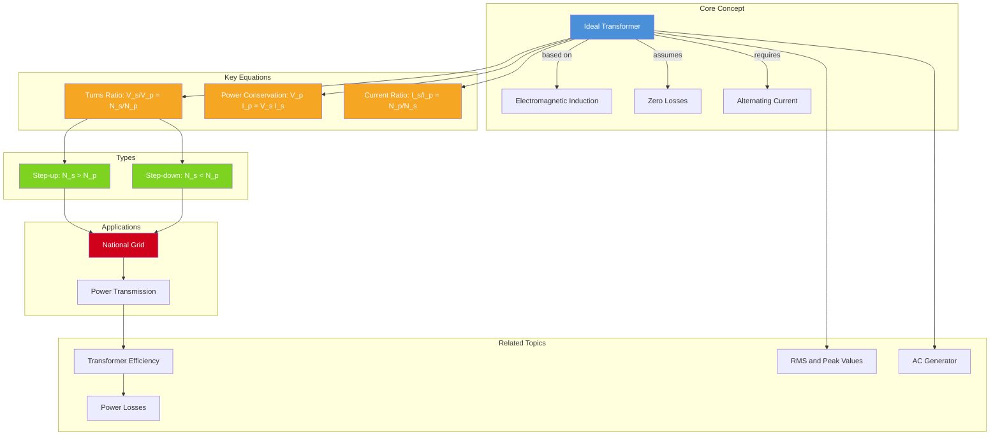

# The Ideal Transformer / 理想变压器

---

# 1. Overview / 概述

**English:**
The ideal transformer is a theoretical model of a device that transfers electrical energy between two circuits through electromagnetic induction, with **no energy losses**. This sub-topic focuses on the relationship between voltage, current, and the number of turns in the primary and secondary coils. Understanding the ideal transformer is essential for analyzing real-world power transmission systems, as it provides the foundation for calculating voltage step-up/step-down ratios and current transformations. The ideal transformer assumes 100% efficiency, no flux leakage, and no resistive or core losses — making it a simplified but powerful tool for circuit analysis.

**中文:**
理想变压器是一种通过电磁感应在两个电路之间传输电能的理论模型，**没有任何能量损失**。本子知识点聚焦于初级线圈和次级线圈中电压、电流与匝数之间的关系。理解理想变压器对于分析现实世界的电力传输系统至关重要，因为它为计算升压/降压比和电流变换提供了基础。理想变压器假设效率为100%，没有磁通泄漏，也没有电阻或铁芯损耗——使其成为电路分析中简化但强大的工具。

---

# 2. Syllabus Learning Objectives / 考纲学习目标

| CAIE 9702 | Edexcel IAL |
|-----------|-------------|
| 20.4(a): Describe the structure and principle of a transformer | WPH14 U4: 3.16: Understand the structure and operation of an ideal transformer |
| 20.4(b): Derive and apply the turns ratio equation $V_s/V_p = N_s/N_p$ | WPH14 U4: 3.17: Derive and use the turns ratio equation |
| 20.4(c): Apply the current ratio equation $I_p V_p = I_s V_s$ for an ideal transformer | WPH14 U4: 3.18: Apply the power conservation equation for an ideal transformer |
| 20.4(d): Explain why transformers only work with AC, not DC | WPH14 U4: 3.19: Explain why transformers require alternating current |
| 20.4(e): Describe the use of step-up and step-down transformers in the National Grid | WPH14 U4: 3.20: Describe the role of transformers in power transmission |
| 20.4(f): Calculate efficiency of a real transformer | — |

**Examiner Expectations / 考官期望:**
- **English:** Candidates must be able to derive the turns ratio equation from Faraday's law, apply it to numerical problems, and explain why transformers require AC. For Edexcel, emphasis is on the ideal transformer model and power conservation.
- **中文:** 考生必须能够从法拉第定律推导出匝数比方程，将其应用于数值问题，并解释为什么变压器需要交流电。对于Edexcel，重点在于理想变压器模型和功率守恒。

---

# 3. Core Definitions / 核心定义

| Term (EN/CN) | Definition (EN) | Definition (CN) | Common Mistakes / 常见错误 |
|--------------|-----------------|-----------------|---------------------------|
| **Ideal Transformer** / 理想变压器 | A theoretical transformer with 100% efficiency, no flux leakage, no resistive losses, and no core losses. | 效率为100%、无磁通泄漏、无电阻损耗、无铁芯损耗的理论变压器。 | Confusing ideal with real transformers; forgetting that ideal means no losses. |
| **Primary Coil** / 初级线圈 | The input coil connected to the AC power source. | 连接到交流电源的输入线圈。 | Thinking primary always has more turns than secondary. |
| **Secondary Coil** / 次级线圈 | The output coil connected to the load. | 连接到负载的输出线圈。 | Confusing which coil is input vs output. |
| **Turns Ratio** / 匝数比 | The ratio of the number of turns in the secondary coil to the number of turns in the primary coil, $N_s/N_p$. | 次级线圈匝数与初级线圈匝数之比，$N_s/N_p$。 | Writing the ratio upside down; forgetting it's $N_s/N_p$, not $N_p/N_s$. |
| **Step-up Transformer** / 升压变压器 | A transformer where $N_s > N_p$, so $V_s > V_p$ and $I_s < I_p$. | 次级匝数大于初级匝数的变压器，因此输出电压升高，电流降低。 | Thinking step-up increases both voltage and current. |
| **Step-down Transformer** / 降压变压器 | A transformer where $N_s < N_p$, so $V_s < V_p$ and $I_s > I_p$. | 次级匝数小于初级匝数的变压器，因此输出电压降低，电流升高。 | Thinking step-down decreases both voltage and current. |
| **Flux Linkage** / 磁链 | The product of magnetic flux and the number of turns in a coil, $N\Phi$. | 磁通量与线圈匝数的乘积，$N\Phi$。 | Confusing flux with flux linkage. |
| **Laminated Core** / 叠片铁芯 | A core made of thin, insulated sheets of iron to reduce eddy current losses. | 由薄绝缘铁片制成的铁芯，用于减少涡流损耗。 | Thinking lamination prevents all losses. |

---

# 4. Key Concepts Explained / 关键概念详解

## 4.1 Principle of Operation / 工作原理

### Explanation / 解释
**English:**
An ideal transformer consists of two coils (primary and secondary) wound around a common soft iron core. When an alternating current flows through the primary coil, it produces a **changing magnetic flux** in the core. This changing flux links with the secondary coil, inducing an alternating EMF by [[Electromagnetic Induction|Faraday's law of electromagnetic induction]]. The soft iron core ensures that almost all magnetic flux is confined within it, maximizing flux linkage between the two coils.

For an ideal transformer:
- **No flux leakage:** All flux produced by the primary passes through the secondary.
- **No resistive losses:** Coils have zero resistance.
- **No core losses:** No hysteresis or eddy current losses.
- **100% efficiency:** Input power equals output power.

**中文:**
理想变压器由两个线圈（初级和次级）绕在公共软铁芯上组成。当交流电通过初级线圈时，会在铁芯中产生**变化的磁通量**。这个变化的磁通量与次级线圈耦合，通过[[Electromagnetic Induction|法拉第电磁感应定律]]感应出交变电动势。软铁芯确保几乎所有磁通量都被限制在铁芯内，最大化两个线圈之间的磁链。

对于理想变压器：
- **无磁通泄漏：** 初级产生的所有磁通都通过次级。
- **无电阻损耗：** 线圈电阻为零。
- **无铁芯损耗：** 无磁滞或涡流损耗。
- **效率100%：** 输入功率等于输出功率。

### Physical Meaning / 物理意义
**English:**
The transformer works because a **changing** magnetic field is required to induce an EMF. This is why transformers only work with AC — a steady DC current produces a constant magnetic field, which cannot induce an EMF in the secondary coil. The turns ratio directly determines how voltage and current are transformed, allowing electrical energy to be efficiently transmitted at high voltages and then stepped down for safe use.

**中文:**
变压器之所以能工作，是因为需要**变化的**磁场才能感应出电动势。这就是为什么变压器只能使用交流电——稳定的直流电产生恒定磁场，无法在次级线圈中感应出电动势。匝数比直接决定了电压和电流如何变换，使得电能可以在高压下高效传输，然后降压以供安全使用。

### Common Misconceptions / 常见误区
- **English:**
  - ❌ "Transformers can step up both voltage and current simultaneously." → ✅ In an ideal transformer, $P_{in} = P_{out}$, so if voltage increases, current must decrease proportionally.
  - ❌ "Transformers work with DC if you switch it on and off quickly." → ✅ While a changing DC can induce a brief pulse, transformers are designed for continuous AC operation.
  - ❌ "The core is needed for electrical conduction." → ✅ The core is for magnetic flux guidance, not electrical conduction.
- **中文:**
  - ❌ "变压器可以同时升压和升流。" → ✅ 在理想变压器中，$P_{in} = P_{out}$，所以如果电压升高，电流必须成比例降低。
  - ❌ "如果快速开关直流电，变压器也能工作。" → ✅ 虽然变化的直流电可以产生短暂脉冲，但变压器是为连续交流电工作设计的。
  - ❌ "铁芯用于导电。" → ✅ 铁芯用于引导磁通，而不是导电。

### Exam Tips / 考试提示
- **English:**
  - Always state the assumption of an ideal transformer when using $V_p I_p = V_s I_s$.
  - For CAIE, be prepared to derive the turns ratio equation from Faraday's law.
  - For Edexcel, focus on power conservation and the ideal model.
  - Remember: transformers only work with **alternating current** — this is a common exam question.
- **中文:**
  - 使用 $V_p I_p = V_s I_s$ 时，始终说明理想变压器的假设。
  - 对于CAIE，要准备好从法拉第定律推导匝数比方程。
  - 对于Edexcel，重点在于功率守恒和理想模型。
  - 记住：变压器只能使用**交流电**——这是常见的考试问题。

> 📷 **IMAGE PROMPT — DIAGRAM-01: Ideal Transformer Structure**
> A cross-section diagram of an ideal transformer showing a rectangular soft iron core with two coils wound on opposite limbs. The primary coil (left) is labeled with $N_p$ turns and connected to an AC source $V_p$. The secondary coil (right) is labeled with $N_s$ turns and connected to a load resistor $R$. Magnetic flux lines are shown as dashed arrows circulating through the core. Labels: "Primary Coil", "Secondary Coil", "Soft Iron Core", "Magnetic Flux $\Phi$". Clean, textbook-style, black and white with color accents for coils.

---

## 4.2 Why Transformers Require AC / 为什么变压器需要交流电

### Explanation / 解释
**English:**
The fundamental principle behind a transformer is [[Electromagnetic Induction|Faraday's law of electromagnetic induction]], which states that the induced EMF is proportional to the **rate of change** of magnetic flux linkage:

$$ \mathcal{E} = -N \frac{d\Phi}{dt} $$

For a transformer to induce an EMF in the secondary coil, the magnetic flux in the core must be **changing**. With a DC input:
- A steady DC current produces a **constant** magnetic field.
- Constant flux means $\frac{d\Phi}{dt} = 0$, so no EMF is induced in the secondary.
- The transformer acts as a simple inductor with no output.

With an AC input:
- The continuously changing current produces a **continuously changing** magnetic field.
- This changing flux induces a continuous alternating EMF in the secondary.
- The output is also AC, with frequency equal to the input frequency.

**中文:**
变压器背后的基本原理是[[Electromagnetic Induction|法拉第电磁感应定律]]，该定律指出感应电动势与磁链的**变化率**成正比：

$$ \mathcal{E} = -N \frac{d\Phi}{dt} $$

对于变压器在次级线圈中感应出电动势，铁芯中的磁通量必须是**变化的**。对于直流输入：
- 稳定的直流电产生**恒定的**磁场。
- 恒定磁通意味着 $\frac{d\Phi}{dt} = 0$，因此次级中不会感应出电动势。
- 变压器充当简单的电感器，没有输出。

对于交流输入：
- 连续变化的电流产生**连续变化的**磁场。
- 这种变化的磁通在次级中感应出连续的交变电动势。
- 输出也是交流电，频率等于输入频率。

### Common Misconceptions / 常见误区
- **English:**
  - ❌ "A transformer can step up DC voltage." → ✅ No, transformers require a changing magnetic field.
  - ❌ "If you connect a battery and quickly disconnect it, the transformer works." → ✅ This produces a brief pulse, but not continuous operation.
- **中文:**
  - ❌ "变压器可以升高直流电压。" → ✅ 不，变压器需要变化的磁场。
  - ❌ "如果连接电池然后快速断开，变压器就能工作。" → ✅ 这会产生短暂脉冲，但不能连续工作。

### Exam Tips / 考试提示
- **English:** This is a very common exam question. Be able to explain using Faraday's law why a changing flux is necessary.
- **中文:** 这是一个非常常见的考试问题。要能够用法拉第定律解释为什么需要变化的磁通。

---

# 5. Essential Equations / 核心公式

## 5.1 Turns Ratio Equation / 匝数比方程

$$ \frac{V_s}{V_p} = \frac{N_s}{N_p} $$

| Symbol (符号) | Meaning (EN) | Meaning (CN) | Unit (单位) |
|--------------|-------------|-------------|------------|
| $V_s$ | Secondary voltage | 次级电压 | V (volts) |
| $V_p$ | Primary voltage | 初级电压 | V (volts) |
| $N_s$ | Number of turns on secondary | 次级线圈匝数 | — (dimensionless) |
| $N_p$ | Number of turns on primary | 初级线圈匝数 | — (dimensionless) |

**Derivation / 推导:**
From Faraday's law, the induced EMF in each coil is proportional to the rate of change of flux linkage. For an ideal transformer with no flux leakage, the same flux $\Phi$ passes through both coils:

$$ V_p = N_p \frac{d\Phi}{dt} \quad \text{and} \quad V_s = N_s \frac{d\Phi}{dt} $$

Dividing: $\frac{V_s}{V_p} = \frac{N_s}{N_p}$

**Conditions / 适用条件:**
- **English:** Only applies to ideal transformers with no flux leakage. Both coils experience the same rate of change of flux.
- **中文:** 仅适用于无磁通泄漏的理想变压器。两个线圈经历相同的变化率。

**Limitations / 局限性:**
- **English:** Real transformers have flux leakage and core losses, so the actual voltage ratio deviates slightly from the turns ratio.
- **中文:** 实际变压器存在磁通泄漏和铁芯损耗，因此实际电压比与匝数比略有偏差。

---

## 5.2 Power Conservation Equation / 功率守恒方程

$$ V_p I_p = V_s I_s $$

| Symbol (符号) | Meaning (EN) | Meaning (CN) | Unit (单位) |
|--------------|-------------|-------------|------------|
| $V_p$ | Primary voltage | 初级电压 | V (volts) |
| $I_p$ | Primary current | 初级电流 | A (amperes) |
| $V_s$ | Secondary voltage | 次级电压 | V (volts) |
| $I_s$ | Secondary current | 次级电流 | A (amperes) |

**Derivation / 推导:**
For an ideal transformer, efficiency is 100%, so input power equals output power:
$$ P_{in} = P_{out} \Rightarrow V_p I_p = V_s I_s $$

**Conditions / 适用条件:**
- **English:** Only applies to ideal transformers (100% efficiency). For real transformers, $V_p I_p > V_s I_s$ due to losses.
- **中文:** 仅适用于理想变压器（效率100%）。对于实际变压器，由于损耗，$V_p I_p > V_s I_s$。

**Limitations / 局限性:**
- **English:** Does not account for power losses in real transformers (copper losses, core losses, flux leakage).
- **中文:** 不考虑实际变压器中的功率损耗（铜损、铁芯损耗、磁通泄漏）。

---

## 5.3 Current Ratio Equation / 电流比方程

$$ \frac{I_s}{I_p} = \frac{N_p}{N_s} $$

| Symbol (符号) | Meaning (EN) | Meaning (CN) | Unit (单位) |
|--------------|-------------|-------------|------------|
| $I_s$ | Secondary current | 次级电流 | A (amperes) |
| $I_p$ | Primary current | 初级电流 | A (amperes) |
| $N_p$ | Number of turns on primary | 初级线圈匝数 | — (dimensionless) |
| $N_s$ | Number of turns on secondary | 次级线圈匝数 | — (dimensionless) |

**Derivation / 推导:**
Combining the turns ratio equation and power conservation:
$$ \frac{V_s}{V_p} = \frac{N_s}{N_p} \quad \text{and} \quad V_p I_p = V_s I_s $$
$$ \Rightarrow \frac{I_s}{I_p} = \frac{V_p}{V_s} = \frac{N_p}{N_s} $$

**Conditions / 适用条件:**
- **English:** Only valid for ideal transformers. Note the inverse relationship: current ratio is the reciprocal of the turns ratio.
- **中文:** 仅适用于理想变压器。注意反比关系：电流比是匝数比的倒数。

**Limitations / 局限性:**
- **English:** Real transformers have losses, so the actual current ratio may differ slightly.
- **中文:** 实际变压器存在损耗，因此实际电流比可能略有偏差。

---

## 5.4 Efficiency Equation / 效率方程

$$ \eta = \frac{P_{out}}{P_{in}} \times 100\% = \frac{V_s I_s}{V_p I_p} \times 100\% $$

| Symbol (符号) | Meaning (EN) | Meaning (CN) | Unit (单位) |
|--------------|-------------|-------------|------------|
| $\eta$ | Efficiency | 效率 | % (percentage) |
| $P_{out}$ | Output power | 输出功率 | W (watts) |
| $P_{in}$ | Input power | 输入功率 | W (watts) |

**Conditions / 适用条件:**
- **English:** For real transformers, efficiency is always less than 100%. For ideal transformers, $\eta = 100\%$.
- **中文:** 对于实际变压器，效率总是小于100%。对于理想变压器，$\eta = 100\%$。

**Limitations / 局限性:**
- **English:** Does not identify the sources of power loss (see [[Transformer Efficiency and Power Losses]]).
- **中文:** 不识别功率损失的来源（参见[[Transformer Efficiency and Power Losses]]）。

---

# 6. Graphs and Relationships / 图表与关系

## 6.1 Voltage vs. Turns Ratio / 电压与匝数比关系

### Axes / 坐标轴
- **X-axis:** Turns ratio $N_s/N_p$ (dimensionless) / 匝数比 $N_s/N_p$（无量纲）
- **Y-axis:** Voltage ratio $V_s/V_p$ (dimensionless) / 电压比 $V_s/V_p$（无量纲）

### Shape / 形状
**English:** A straight line through the origin with gradient 1. This shows the direct proportionality: $V_s/V_p = N_s/N_p$.

**中文:** 一条通过原点的直线，斜率为1。这显示了正比关系：$V_s/V_p = N_s/N_p$。

### Gradient Meaning / 斜率含义
**English:** The gradient is 1, confirming the direct proportionality between voltage ratio and turns ratio.

**中文:** 斜率为1，确认了电压比与匝数比之间的正比关系。

### Area Meaning / 面积含义
**English:** Not applicable for this linear relationship.

**中文:** 不适用于这种线性关系。

### Exam Interpretation / 考试解读
**English:** If asked to sketch this graph, remember it's a straight line through the origin. A step-up transformer corresponds to $N_s/N_p > 1$ (right side of graph), and a step-down transformer corresponds to $N_s/N_p < 1$ (left side).

**中文:** 如果被要求画出此图，记住它是一条通过原点的直线。升压变压器对应 $N_s/N_p > 1$（图的右侧），降压变压器对应 $N_s/N_p < 1$（图的左侧）。

---

## 6.2 Current vs. Turns Ratio / 电流与匝数比关系

### Axes / 坐标轴
- **X-axis:** Turns ratio $N_s/N_p$ (dimensionless) / 匝数比 $N_s/N_p$（无量纲）
- **Y-axis:** Current ratio $I_s/I_p$ (dimensionless) / 电流比 $I_s/I_p$（无量纲）

### Shape / 形状
**English:** A rectangular hyperbola: $I_s/I_p = (N_s/N_p)^{-1}$. As turns ratio increases, current ratio decreases.

**中文:** 一条双曲线：$I_s/I_p = (N_s/N_p)^{-1}$。随着匝数比增加，电流比减小。

### Gradient Meaning / 斜率含义
**English:** The gradient is negative and decreasing in magnitude, showing the inverse relationship.

**中文:** 斜率为负且绝对值递减，显示了反比关系。

### Area Meaning / 面积含义
**English:** Not applicable.

**中文:** 不适用。

### Exam Interpretation / 考试解读
**English:** This graph shows that a step-up transformer ($N_s/N_p > 1$) reduces current, while a step-down transformer ($N_s/N_p < 1$) increases current. This is why step-up transformers are used for power transmission — higher voltage means lower current, reducing $I^2R$ losses in cables.

**中文:** 此图显示升压变压器（$N_s/N_p > 1$）降低电流，而降压变压器（$N_s/N_p < 1$）增加电流。这就是为什么升压变压器用于电力传输——更高的电压意味着更低的电流，减少电缆中的 $I^2R$ 损耗。

---

# 7. Required Diagrams / 必备图表

## 7.1 Ideal Transformer Circuit Diagram / 理想变压器电路图

### Description / 描述
**English:** A circuit diagram showing an ideal transformer with primary coil connected to an AC source and secondary coil connected to a load. The core is represented by vertical lines between the coils.

**中文:** 一个电路图，显示理想变压器的初级线圈连接到交流电源，次级线圈连接到负载。铁芯用线圈之间的垂直线表示。

### Image Prompt / 图片生成提示
> 📷 **IMAGE PROMPT — DIAGRAM-02: Ideal Transformer Circuit**
> A standard circuit diagram of an ideal transformer. Left side: AC voltage source symbol (sine wave inside a circle) labeled $V_p$ connected to primary coil with $N_p$ turns. Right side: secondary coil with $N_s$ turns connected to a resistor load $R$. Between the coils, two vertical parallel lines represent the soft iron core. Labels: "Primary", "Secondary", "$N_p$ turns", "$N_s$ turns", "AC Source", "Load $R$". Clean, black and white, textbook-style circuit diagram.

### Labels Required / 需要标注
- Primary coil ($N_p$ turns) / 初级线圈（$N_p$ 匝）
- Secondary coil ($N_s$ turns) / 次级线圈（$N_s$ 匝）
- AC source ($V_p$) / 交流电源（$V_p$）
- Load ($R$) / 负载（$R$）
- Soft iron core / 软铁芯

### Exam Importance / 考试重要性
**English:** High. Candidates are expected to draw and label transformer circuit diagrams, and use them to explain the principle of operation.

**中文:** 高。考生需要能够绘制和标注变压器电路图，并用它们解释工作原理。

---

## 7.2 Step-up vs. Step-down Transformer Comparison / 升压与降压变压器对比

### Description / 描述
**English:** A side-by-side comparison of step-up and step-down transformers, showing the relative number of turns and the resulting voltage/current relationships.

**中文:** 升压变压器和降压变压器的并排对比，显示相对匝数以及由此产生的电压/电流关系。

### Image Prompt / 图片生成提示
> 📷 **IMAGE PROMPT — DIAGRAM-03: Step-up vs Step-down Transformers**
> Two transformer diagrams side by side. Left: Step-up transformer with secondary coil having more turns than primary ($N_s > N_p$). Labels: "$V_p$ (low)", "$V_s$ (high)", "$I_p$ (high)", "$I_s$ (low)", "Step-up". Right: Step-down transformer with secondary coil having fewer turns than primary ($N_s < N_p$). Labels: "$V_p$ (high)", "$V_s$ (low)", "$I_p$ (low)", "$I_s$ (high)", "Step-down". Both show AC sources and loads. Clean, textbook-style, with color coding (red for high voltage, blue for low voltage).

### Labels Required / 需要标注
- For step-up: $N_s > N_p$, $V_s > V_p$, $I_s < I_p$ / 升压：$N_s > N_p$, $V_s > V_p$, $I_s < I_p$
- For step-down: $N_s < N_p$, $V_s < V_p$, $I_s > I_p$ / 降压：$N_s < N_p$, $V_s < V_p$, $I_s > I_p$

### Exam Importance / 考试重要性
**English:** High. Understanding the difference between step-up and step-down transformers is fundamental, especially in the context of [[Power Transmission and the National Grid]].

**中文:** 高。理解升压和降压变压器之间的区别是基础，特别是在[[Power Transmission and the National Grid]]的背景下。

---

# 8. Worked Examples / 典型例题

## Example 1: Turns Ratio Calculation / 示例1：匝数比计算

### Question / 题目
**English:**
An ideal transformer has 200 turns on its primary coil and 4000 turns on its secondary coil. The primary is connected to a 230 V AC supply.
(a) Calculate the secondary voltage.
(b) If the secondary current is 0.5 A, calculate the primary current.

**中文:**
一个理想变压器的初级线圈有200匝，次级线圈有4000匝。初级连接到230 V交流电源。
(a) 计算次级电压。
(b) 如果次级电流为0.5 A，计算初级电流。

### Solution / 解答

**(a) Secondary voltage / 次级电压:**

Using the turns ratio equation:
$$ \frac{V_s}{V_p} = \frac{N_s}{N_p} $$

$$ V_s = V_p \times \frac{N_s}{N_p} = 230 \times \frac{4000}{200} = 230 \times 20 = 4600 \text{ V} $$

**(b) Primary current / 初级电流:**

Using power conservation (ideal transformer):
$$ V_p I_p = V_s I_s $$

$$ I_p = \frac{V_s I_s}{V_p} = \frac{4600 \times 0.5}{230} = \frac{2300}{230} = 10 \text{ A} $$

Alternatively, using the current ratio:
$$ \frac{I_s}{I_p} = \frac{N_p}{N_s} \Rightarrow I_p = I_s \times \frac{N_s}{N_p} = 0.5 \times \frac{4000}{200} = 0.5 \times 20 = 10 \text{ A} $$

### Final Answer / 最终答案
**Answer:** (a) $V_s = 4600$ V (b) $I_p = 10$ A | **答案：** (a) $V_s = 4600$ V (b) $I_p = 10$ A

### Quick Tip / 提示
**English:** Notice that this is a step-up transformer ($N_s > N_p$), so voltage increases and current decreases. The primary current (10 A) is much larger than the secondary current (0.5 A).

**中文:** 注意这是一个升压变压器（$N_s > N_p$），所以电压升高，电流降低。初级电流（10 A）远大于次级电流（0.5 A）。

---

## Example 2: Determining Transformer Type / 示例2：确定变压器类型

### Question / 题目
**English:**
A transformer is used to connect a 12 V lamp to a 230 V mains supply. The primary coil has 1150 turns.
(a) Is this a step-up or step-down transformer?
(b) Calculate the number of turns on the secondary coil.
(c) If the lamp draws 2.0 A, calculate the primary current (assuming ideal transformer).

**中文:**
一个变压器用于将12 V灯泡连接到230 V市电。初级线圈有1150匝。
(a) 这是升压变压器还是降压变压器？
(b) 计算次级线圈的匝数。
(c) 如果灯泡电流为2.0 A，计算初级电流（假设理想变压器）。

### Solution / 解答

**(a) Transformer type / 变压器类型:**
The primary voltage (230 V) is higher than the secondary voltage (12 V), so this is a **step-down transformer**.

**(b) Secondary turns / 次级匝数:**
$$ \frac{V_s}{V_p} = \frac{N_s}{N_p} \Rightarrow N_s = N_p \times \frac{V_s}{V_p} = 1150 \times \frac{12}{230} = 1150 \times 0.0522 = 60 \text{ turns} $$

**(c) Primary current / 初级电流:**
$$ V_p I_p = V_s I_s \Rightarrow I_p = \frac{V_s I_s}{V_p} = \frac{12 \times 2.0}{230} = \frac{24}{230} = 0.104 \text{ A} $$

### Final Answer / 最终答案
**Answer:** (a) Step-down (b) $N_s = 60$ turns (c) $I_p = 0.104$ A | **答案：** (a) 降压 (b) $N_s = 60$ 匝 (c) $I_p = 0.104$ A

### Quick Tip / 提示
**English:** For a step-down transformer, the secondary voltage is lower, so the secondary has fewer turns. The primary current is much smaller than the secondary current.

**中文:** 对于降压变压器，次级电压较低，所以次级匝数较少。初级电流远小于次级电流。

---

# 9. Past Paper Question Types / 历年真题题型

| Question Type / 题型 | Frequency / 频率 | Difficulty / 难度 | Past Paper References / 真题索引 |
|----------------------|------------------|------------------|-------------------------------|
| Calculate secondary voltage/current using turns ratio | Very High | Easy | 📝 *待填入* |
| Derive turns ratio equation from Faraday's law | Medium | Medium | 📝 *待填入* |
| Explain why transformers require AC | High | Medium | 📝 *待填入* |
| Step-up vs step-down identification | High | Easy | 📝 *待填入* |
| Power conservation calculations | Very High | Easy-Medium | 📝 *待填入* |
| Efficiency calculations (real transformer) | Medium | Medium | 📝 *待填入* |
| National Grid application questions | Medium | Medium | 📝 *待填入* |

**Common Command Words / 常见指令词:**
- **English:** Calculate, Derive, Explain, State, Determine, Show that, Sketch
- **中文:** 计算、推导、解释、陈述、确定、证明、画出

---

# 10. Practical Skills Connections / 实验技能链接

**English:**
The ideal transformer sub-topic connects to practical work in several ways:

1. **Measurements:** Using an AC voltmeter and ammeter to measure primary and secondary voltages and currents. Note that AC measurements require RMS values (see [[RMS and Peak Values]]).

2. **Uncertainties:** When calculating turns ratio from voltage measurements, propagate uncertainties from voltmeter readings. For example, if $V_p = 12.0 \pm 0.1$ V and $V_s = 24.0 \pm 0.1$ V, the uncertainty in the ratio $V_s/V_p$ must be calculated.

3. **Graph Plotting:** Plotting $V_s$ against $V_p$ for different input voltages should give a straight line through the origin with gradient $N_s/N_p$. Deviations from linearity indicate non-ideal behavior.

4. **Experimental Design:** To verify the turns ratio equation, you would:
   - Connect an AC power supply to the primary coil
   - Measure $V_p$ and $V_s$ using AC voltmeters
   - Repeat for different input voltages
   - Plot $V_s$ vs $V_p$ and find the gradient
   - Compare with the actual turns ratio $N_s/N_p$

5. **Real vs Ideal:** Comparing experimental results with the ideal model helps identify sources of power loss (see [[Transformer Efficiency and Power Losses]]).

**中文:**
理想变压器子知识点通过多种方式与实验工作联系：

1. **测量：** 使用交流电压表和电流表测量初级和次级的电压和电流。注意交流测量需要RMS值（参见[[RMS and Peak Values]]）。

2. **不确定度：** 当从电压读数计算匝数比时，需要传播电压表读数的不确定度。例如，如果 $V_p = 12.0 \pm 0.1$ V 且 $V_s = 24.0 \pm 0.1$ V，必须计算比值 $V_s/V_p$ 的不确定度。

3. **图表绘制：** 绘制不同输入电压下的 $V_s$ 对 $V_p$ 的图表，应得到一条通过原点的直线，斜率为 $N_s/N_p$。与线性关系的偏差表明非理想行为。

4. **实验设计：** 要验证匝数比方程，你需要：
   - 将交流电源连接到初级线圈
   - 使用交流电压表测量 $V_p$ 和 $V_s$
   - 对不同输入电压重复测量
   - 绘制 $V_s$ 对 $V_p$ 的图表并求出斜率
   - 与实际匝数比 $N_s/N_p$ 进行比较

5. **实际与理想：** 将实验结果与理想模型进行比较有助于识别功率损耗的来源（参见[[Transformer Efficiency and Power Losses]]）。

---

# 11. Concept Map / 概念图谱

---

# 12. Quick Revision Sheet / 速查表

| Category / 类别 | Key Points / 要点 |
|----------------|------------------|
| **Definition / 定义** | An ideal transformer has 100% efficiency, no flux leakage, no resistive losses, no core losses. / 理想变压器效率100%，无磁通泄漏，无电阻损耗，无铁芯损耗。 |
| **Key Formula / 核心公式** | $\frac{V_s}{V_p} = \frac{N_s}{N_p}$ (turns ratio / 匝数比) |
| **Key Formula / 核心公式** | $V_p I_p = V_s I_s$ (power conservation / 功率守恒) |
| **Key Formula / 核心公式** | $\frac{I_s}{I_p} = \frac{N_p}{N_s}$ (current ratio / 电流比) |
| **Key Formula / 核心公式** | $\eta = \frac{V_s I_s}{V_p I_p} \times 100\%$ (efficiency / 效率) |
| **Key Graph / 核心图表** | $V_s/V_p$ vs $N_s/N_p$: straight line through origin, gradient 1 / 通过原点的直线，斜率1 |
| **Key Graph / 核心图表** | $I_s/I_p$ vs $N_s/N_p$: rectangular hyperbola (inverse relationship) / 双曲线（反比关系） |
| **Step-up / 升压** | $N_s > N_p$, $V_s > V_p$, $I_s < I_p$ — used for power transmission / 用于电力传输 |
| **Step-down / 降压** | $N_s < N_p$, $V_s < V_p$, $I_s > I_p$ — used for domestic supply / 用于家庭供电 |
| **AC Requirement / 交流要求** | Transformers need changing flux ($d\Phi/dt \neq 0$) to induce EMF. DC gives constant flux → no output. / 变压器需要变化的磁通来感应电动势。直流产生恒定磁通→无输出。 |
| **Exam Tip / 考试提示** | Always state "ideal transformer" assumption when using $V_p I_p = V_s I_s$. / 使用 $V_p I_p = V_s I_s$ 时始终说明"理想变压器"假设。 |
| **Common Mistake / 常见错误** | Forgetting that step-up increases voltage but **decreases** current (power is conserved). / 忘记升压变压器升高电压但**降低**电流（功率守恒）。 |
| **Connection / 联系** | See [[AC Generator (Alternator) Principle]] for how AC is produced, and [[Power Transmission and the National Grid]] for real-world application. / 参见[[AC Generator (Alternator) Principle]]了解交流电如何产生，以及[[Power Transmission and the National Grid]]了解实际应用。 |