# Transformer Efficiency and Power Losses / 变压器效率与功率损耗

---

# 1. Overview / 概述

**English:**
This sub-topic examines why real transformers are not 100% efficient and quantifies the various power losses that occur during operation. While an [[Ideal Transformer]] assumes no energy dissipation, practical transformers suffer from four main loss mechanisms: copper losses (I²R heating in windings), iron losses (hysteresis and eddy currents in the core), and flux leakage. Understanding these losses is crucial for designing efficient power distribution systems within the [[Power Transmission and the National Grid]] network. This sub-topic builds directly on [[Electromagnetic Induction]] principles and connects to [[AC Generator (Alternator) Principle]] through shared concepts of magnetic flux and induced EMF.

**中文:**
本子知识点研究为什么实际变压器并非100%高效，并量化运行过程中发生的各种功率损耗。虽然[[理想变压器]]假设没有能量耗散，但实际变压器存在四种主要损耗机制：铜损（绕组中的I²R发热）、铁损（磁滞损耗和涡流损耗）以及漏磁通。理解这些损耗对于设计[[电力传输与国家电网]]网络中的高效配电系统至关重要。本子知识点直接建立在[[电磁感应]]原理之上，并通过磁通量和感应电动势的共享概念与[[交流发电机（交流发电机）原理]]相关联。

---

# 2. Syllabus Learning Objectives / 考纲学习目标

| CAIE 9702 | Edexcel IAL |
|-----------|-------------|
| 20.4(a) Explain why energy losses occur in real transformers | 3.16 Describe the construction of a practical transformer |
| 20.4(b) Describe copper losses and how to minimise them | 3.17 Explain power losses in transformers (copper, iron, hysteresis, eddy currents) |
| 20.4(c) Describe iron losses (hysteresis and eddy currents) | 3.18 Calculate transformer efficiency |
| 20.4(d) Explain how laminated cores reduce eddy currents | 3.19 Explain the use of step-up transformers in power transmission |
| 20.4(e) Define and calculate transformer efficiency | 3.20 Explain the economic and environmental benefits of high-voltage transmission |
| 20.4(f) Explain the role of transformers in the National Grid | |

**Examiner Expectations / 考官期望:**
- **CAIE:** Students must be able to describe each loss mechanism, explain how to reduce losses, and calculate efficiency using $ \text{Efficiency} = \frac{P_{\text{out}}}{P_{\text{in}}} \times 100\% $.
- **Edexcel:** Students must additionally link transformer losses to the economic and environmental benefits of high-voltage transmission in the National Grid.

---

# 3. Core Definitions / 核心定义

| Term (EN/CN) | Definition (EN) | Definition (CN) | Common Mistakes / 常见错误 |
|--------------|-----------------|-----------------|---------------------------|
| **Copper Loss** / 铜损 | Power dissipated as heat in the resistance of the primary and secondary windings, given by $P = I^2R$ | 在初级和次级绕组的电阻中以热量形式耗散的功率，由 $P = I^2R$ 给出 | Confusing copper loss with total transformer loss; forgetting it depends on current squared |
| **Iron Loss** / 铁损 | Power dissipated in the transformer core due to hysteresis and eddy currents | 由于磁滞和涡流在变压器铁芯中耗散的功率 | Thinking iron loss is only one mechanism; it includes both hysteresis and eddy currents |
| **Hysteresis Loss** / 磁滞损耗 | Energy dissipated as heat due to the repeated magnetisation and demagnetisation of the core material each AC cycle | 每个交流周期中铁芯材料反复磁化和退磁而耗散为热量的能量 | Assuming hysteresis loss is independent of frequency (it increases with frequency) |
| **Eddy Current Loss** / 涡流损耗 | Power dissipated as heat due to induced circulating currents within the core material | 由于铁芯材料中感应出的循环电流而耗散为热量的功率 | Forgetting that eddy currents are induced by the changing magnetic flux in the core |
| **Flux Leakage** / 漏磁通 | Magnetic flux produced by the primary coil that does not link with the secondary coil | 初级线圈产生的未与次级线圈耦合的磁通量 | Thinking flux leakage is a loss of energy (it's a loss of flux linkage, not direct power dissipation) |
| **Transformer Efficiency** / 变压器效率 | The ratio of useful power output to total power input, expressed as a percentage | 有用功率输出与总功率输入之比，以百分比表示 | Using voltage ratio instead of power ratio; forgetting to multiply by 100% |

---

# 4. Key Concepts Explained / 关键概念详解

## 4.1 Copper Losses (I²R Losses) / 铜损（I²R损耗）

### Explanation / 解释
**English:** Copper losses occur because the primary and secondary windings have electrical resistance. When current flows through these windings, power is dissipated as heat according to Joule's law: $P = I^2R$. The power loss in the primary winding is $I_p^2 R_p$ and in the secondary winding is $I_s^2 R_s$. Total copper loss = $I_p^2 R_p + I_s^2 R_s$. These losses increase with the square of the current, making them significant at high load currents.

**中文:** 铜损的发生是因为初级和次级绕组具有电阻。当电流通过这些绕组时，根据焦耳定律 $P = I^2R$，功率以热量形式耗散。初级绕组的功率损耗为 $I_p^2 R_p$，次级绕组的功率损耗为 $I_s^2 R_s$。总铜损 = $I_p^2 R_p + I_s^2 R_s$。这些损耗随电流的平方增加，因此在高负载电流下显著。

### Physical Meaning / 物理意义
**English:** Copper losses represent the electrical energy converted to thermal energy (heat) in the windings. This heat raises the temperature of the transformer and must be dissipated through cooling systems (fins, oil, fans). The losses are load-dependent — they increase as more current is drawn from the secondary.

**中文:** 铜损代表绕组中电能转化为热能（热量）的部分。这些热量会升高变压器温度，必须通过冷却系统（散热片、油、风扇）散发。这些损耗与负载相关——随着从次级汲取更多电流而增加。

### Common Misconceptions / 常见误区
- ❌ **"Copper loss is constant regardless of load"** — Copper loss varies with $I^2$, so it increases with load.
- ❌ **"Using thicker wire eliminates copper loss"** — Thicker wire reduces resistance but cannot eliminate it entirely.
- ❌ **"Copper loss only occurs in the secondary"** — Both primary and secondary windings contribute.

### Exam Tips / 考试提示
- ✅ Always use $P = I^2R$, not $P = V^2/R$, for copper loss calculations.
- ✅ Remember that for a step-up transformer, the secondary current is lower, so secondary copper loss is smaller.
- ✅ In efficiency calculations, copper loss is part of the total power input: $P_{\text{in}} = P_{\text{out}} + P_{\text{copper}} + P_{\text{iron}}$.

> 📷 **IMAGE PROMPT — DIAGRAM-01: Transformer Cross-Section Showing Copper Windings**
> A detailed cross-section diagram of a practical transformer showing the primary and secondary copper windings wrapped around a laminated iron core. Highlight the windings in copper colour with labels "Primary Winding (Copper)" and "Secondary Winding (Copper)". Show arrows representing current flow and small red "heat" symbols near the windings to indicate I²R heating. Include a callout box: "Copper Loss = I²R".

---

## 4.2 Iron Losses: Hysteresis Loss / 铁损：磁滞损耗

### Explanation / 解释
**English:** Hysteresis loss arises from the energy required to repeatedly magnetise and demagnetise the core material as the AC current alternates. Each cycle, the magnetic domains in the core must realign, and this process dissipates energy as heat. The area of the B-H hysteresis loop represents the energy lost per cycle per unit volume. Hysteresis loss is proportional to the frequency of the AC supply and the area of the hysteresis loop.

**中文:** 磁滞损耗源于交流电流交替时反复磁化和退磁铁芯材料所需的能量。每个周期，铁芯中的磁畴必须重新排列，这个过程会以热量形式耗散能量。B-H磁滞回线的面积代表每周期每单位体积损失的能量。磁滞损耗与交流电源的频率和磁滞回线的面积成正比。

### Physical Meaning / 物理意义
**English:** The core material's magnetic domains resist changes in magnetisation. The energy needed to overcome this "magnetic friction" appears as heat. Using a soft magnetic material (e.g., silicon steel) with a narrow hysteresis loop minimises this loss.

**中文:** 铁芯材料的磁畴抵抗磁化状态的变化。克服这种"磁摩擦"所需的能量以热量形式出现。使用具有窄磁滞回线的软磁材料（如硅钢）可以最小化这种损耗。

### Common Misconceptions / 常见误区
- ❌ **"Hysteresis loss is the same as eddy current loss"** — They are separate mechanisms; hysteresis is due to domain alignment, eddy currents are induced currents.
- ❌ **"Hysteresis loss is independent of frequency"** — It increases linearly with frequency.
- ❌ **"Any magnetic material works equally well"** — Soft iron has lower hysteresis loss than hard steel.

### Exam Tips / 考试提示
- ✅ Hysteresis loss can be reduced by using a core material with a narrow B-H loop (small coercivity).
- ✅ Silicon steel is commonly used because it has low hysteresis loss and high electrical resistivity.
- ✅ The area of the hysteresis loop is proportional to the energy loss per cycle.

> 📷 **IMAGE PROMPT — DIAGRAM-02: B-H Hysteresis Loop for Transformer Core**
> A graph showing magnetic flux density B (vertical axis) against magnetic field strength H (horizontal axis). Show a typical hysteresis loop for a soft magnetic material (narrow loop) and a hard magnetic material (wide loop) for comparison. Label the loop area as "Energy lost per cycle per unit volume". Include arrows showing the direction of magnetisation. Add a callout: "Narrow loop = Low hysteresis loss (soft iron)".

---

## 4.3 Iron Losses: Eddy Current Loss / 铁损：涡流损耗

### Explanation / 解释
**English:** Eddy currents are circulating currents induced within the core material itself due to the changing magnetic flux. According to [[Electromagnetic Induction]], a changing magnetic field induces an EMF in any conductor. The core, being conductive, experiences induced EMFs that drive small circulating currents (eddy currents). These currents dissipate power as heat according to $P = I^2R$. Eddy current loss is proportional to the square of the frequency ($f^2$) and the square of the magnetic flux density ($B^2$).

**中文:** 涡流是由于变化的磁通量在铁芯材料本身内部感应出的循环电流。根据[[电磁感应]]，变化的磁场会在任何导体中感应出电动势。铁芯作为导体，会受到感应电动势的驱动，产生小的循环电流（涡流）。这些电流根据 $P = I^2R$ 以热量形式耗散功率。涡流损耗与频率的平方（$f^2$）和磁通密度的平方（$B^2$）成正比。

### Physical Meaning / 物理意义
**English:** Eddy currents represent unwanted electrical currents flowing within the core. They produce their own magnetic fields that oppose the original change (Lenz's law), reducing the efficiency of flux transfer. The heat generated can cause significant energy loss and overheating.

**中文:** 涡流代表在铁芯内部流动的不需要的电流。它们产生自己的磁场，抵抗原始变化（楞次定律），降低磁通传递的效率。产生的热量可能导致显著的能量损失和过热。

### Common Misconceptions / 常见误区
- ❌ **"Laminating the core eliminates eddy currents completely"** — Lamination reduces them significantly but cannot eliminate them entirely.
- ❌ **"Eddy currents only occur in the windings"** — They occur in the core, which is also conductive.
- ❌ **"Eddy current loss is independent of core thickness"** — It is proportional to the square of the lamination thickness.

### Exam Tips / 考试提示
- ✅ Laminating the core (using thin sheets insulated from each other) breaks the path for large eddy currents.
- ✅ Thinner laminations → smaller eddy currents → lower eddy current loss.
- ✅ Using a core material with high electrical resistivity (e.g., silicon steel) also reduces eddy currents.
- ✅ Eddy current loss ∝ $f^2 B^2 t^2$ where $t$ is lamination thickness.

> 📷 **IMAGE PROMPT — DIAGRAM-03: Laminated Core Reducing Eddy Currents**
> A comparison diagram showing two transformer cores: (a) Solid core with large circulating eddy current arrows shown as thick red loops, and (b) Laminated core with thin insulating layers shown between laminations, with small, broken eddy current arrows. Label the solid core as "Large eddy currents → High loss" and the laminated core as "Small eddy currents → Low loss". Include a callout: "Laminations break the path for eddy currents".

---

## 4.4 Flux Leakage / 漏磁通

### Explanation / 解释
**English:** Flux leakage occurs when some magnetic field lines produced by the primary coil do not pass through the secondary coil. This means not all of the magnetic flux generated by the primary links with the secondary, reducing the induced EMF in the secondary. While not a direct power loss (energy is not dissipated), it reduces the efficiency because less power is transferred to the secondary.

**中文:** 当初级线圈产生的一些磁力线没有穿过次级线圈时，就会发生漏磁通。这意味着初级产生的磁通量并非全部与次级耦合，从而降低了次级中的感应电动势。虽然这不是直接的功率损耗（能量没有耗散），但它降低了效率，因为传递到次级的功率减少了。

### Physical Meaning / 物理意义
**English:** Flux leakage represents imperfect magnetic coupling between primary and secondary. In an [[Ideal Transformer]], 100% flux linkage is assumed. In reality, some flux "leaks" through the air or other paths, reducing the mutual inductance.

**中文:** 漏磁通代表初级和次级之间的不完全磁耦合。在[[理想变压器]]中，假设100%的磁通耦合。实际上，一些磁通通过空气或其他路径"泄漏"，降低了互感。

### Common Misconceptions / 常见误区
- ❌ **"Flux leakage is a power loss like copper loss"** — It reduces power transfer but does not dissipate energy as heat.
- ❌ **"Flux leakage can be completely eliminated"** — It can be minimised but not eliminated.
- ❌ **"Flux leakage only affects the secondary"** — It also affects the primary's self-inductance.

### Exam Tips / 考试提示
- ✅ Flux leakage is reduced by winding the primary and secondary coils on the same core (concentric winding).
- ✅ Using a closed core (e.g., shell-type or core-type) minimises flux leakage.
- ✅ Flux leakage is why the actual secondary voltage is slightly less than the ideal $V_s = (N_s/N_p)V_p$.

---

## 4.5 Transformer Efficiency / 变压器效率

### Explanation / 解释
**English:** Transformer efficiency is defined as the ratio of useful power output to total power input:

$$ \text{Efficiency} = \frac{P_{\text{out}}}{P_{\text{in}}} \times 100\% = \frac{P_{\text{out}}}{P_{\text{out}} + P_{\text{losses}}} \times 100\% $$

where $P_{\text{losses}} = P_{\text{copper}} + P_{\text{iron}} + P_{\text{leakage}}$ (though leakage is often treated separately). Real power transformers can achieve efficiencies of 95-99% under optimal load conditions.

**中文:** 变压器效率定义为有用功率输出与总功率输入之比：

$$ \text{效率} = \frac{P_{\text{出}}}{P_{\text{入}}} \times 100\% = \frac{P_{\text{出}}}{P_{\text{出}} + P_{\text{损耗}}} \times 100\% $$

其中 $P_{\text{损耗}} = P_{\text{铜损}} + P_{\text{铁损}} + P_{\text{漏磁}}$（尽管漏磁通常单独处理）。实际电力变压器在最佳负载条件下可以达到95-99%的效率。

### Physical Meaning / 物理意义
**English:** Efficiency quantifies how much of the input electrical power is delivered as useful output power. The remaining power is lost primarily as heat. Transformers are most efficient when copper losses equal iron losses (maximum efficiency condition).

**中文:** 效率量化了输入电功率中有多少被传递为有用的输出功率。剩余功率主要作为热量损失。当铜损等于铁损时，变压器效率最高（最大效率条件）。

### Common Misconceptions / 常见误区
- ❌ **"Efficiency is constant for all loads"** — Efficiency varies with load; it is low at light loads and heavy loads.
- ❌ **"Efficiency = V_s/V_p"** — This is only true for an ideal transformer with no losses.
- ❌ **"Higher voltage always means higher efficiency"** — Voltage ratio affects current, which affects copper loss.

### Exam Tips / 考试提示
- ✅ Always use power values, not voltage or current values, for efficiency calculations.
- ✅ Remember that $P_{\text{in}} = V_p I_p \cos\phi$ for AC circuits (power factor may be needed).
- ✅ Maximum efficiency occurs when variable losses (copper) = constant losses (iron).
- ✅ For the National Grid, high efficiency in step-up transformers is critical for economic power transmission.

---

# 5. Essential Equations / 核心公式

## 5.1 Copper Loss / 铜损

$$ P_{\text{copper}} = I_p^2 R_p + I_s^2 R_s $$

| Symbol (符号) | Meaning (EN) | Meaning (CN) | Unit (单位) |
|--------------|-------------|-------------|------------|
| $P_{\text{copper}}$ | Copper loss power | 铜损功率 | W |
| $I_p$ | Primary current | 初级电流 | A |
| $R_p$ | Primary winding resistance | 初级绕组电阻 | Ω |
| $I_s$ | Secondary current | 次级电流 | A |
| $R_s$ | Secondary winding resistance | 次级绕组电阻 | Ω |

**Conditions / 适用条件:** Valid for any transformer with resistive windings. Assumes sinusoidal AC current.
**Limitations / 局限性:** Does not account for skin effect at very high frequencies; assumes constant resistance.

## 5.2 Eddy Current Loss / 涡流损耗

$$ P_{\text{eddy}} \propto f^2 B^2 t^2 $$

| Symbol (符号) | Meaning (EN) | Meaning (CN) | Unit (单位) |
|--------------|-------------|-------------|------------|
| $P_{\text{eddy}}$ | Eddy current loss power | 涡流损耗功率 | W |
| $f$ | Frequency of AC supply | 交流电源频率 | Hz |
| $B$ | Maximum magnetic flux density | 最大磁通密度 | T |
| $t$ | Thickness of laminations | 叠片厚度 | m |

**Conditions / 适用条件:** Proportional relationship; exact formula depends on core geometry and material resistivity.
**Limitations / 局限性:** The constant of proportionality depends on core material resistivity and geometry.

## 5.3 Hysteresis Loss / 磁滞损耗

$$ P_{\text{hyst}} \propto f \times (\text{Area of B-H loop}) $$

| Symbol (符号) | Meaning (EN) | Meaning (CN) | Unit (单位) |
|--------------|-------------|-------------|------------|
| $P_{\text{hyst}}$ | Hysteresis loss power | 磁滞损耗功率 | W |
| $f$ | Frequency | 频率 | Hz |
| B-H loop area | Energy lost per cycle per unit volume | 每周期每单位体积损失的能量 | J/m³ |

**Conditions / 适用条件:** Valid for any ferromagnetic core material.
**Limitations / 局限性:** The B-H loop area depends on the material and the maximum flux density.

## 5.4 Transformer Efficiency / 变压器效率

$$ \eta = \frac{P_{\text{out}}}{P_{\text{in}}} \times 100\% = \frac{P_{\text{out}}}{P_{\text{out}} + P_{\text{copper}} + P_{\text{iron}}} \times 100\% $$

| Symbol (符号) | Meaning (EN) | Meaning (CN) | Unit (单位) |
|--------------|-------------|-------------|------------|
| $\eta$ | Efficiency | 效率 | % |
| $P_{\text{out}}$ | Output power ($V_s I_s \cos\phi$) | 输出功率 | W |
| $P_{\text{in}}$ | Input power ($V_p I_p \cos\phi$) | 输入功率 | W |
| $P_{\text{copper}}$ | Copper loss | 铜损 | W |
| $P_{\text{iron}}$ | Iron loss (hysteresis + eddy) | 铁损 | W |

**Conditions / 适用条件:** Valid for all transformers under steady-state AC operation.
**Limitations / 局限性:** Does not include flux leakage effects explicitly; assumes sinusoidal waveforms.

> 📷 **IMAGE PROMPT — DIAGRAM-04: Transformer Efficiency vs Load Graph**
> A graph showing transformer efficiency (η) on the vertical axis against load current (I) on the horizontal axis. Show a curve that rises from 0% at no load, reaches a maximum (e.g., 98%) at some intermediate load, then decreases slightly at full load. Label the maximum efficiency point. Add a second curve showing copper loss increasing with I² and a horizontal line for constant iron loss. Include a callout: "Maximum efficiency when copper loss = iron loss".

---

# 6. Graphs and Relationships / 图表与关系

## 6.1 Efficiency vs Load Current / 效率与负载电流关系

### Axes / 坐标轴
- **X-axis:** Load current ($I_s$) / 负载电流
- **Y-axis:** Efficiency ($\eta$) / 效率

### Shape / 形状
**English:** The efficiency curve starts at 0% at no load (zero output power), rises to a maximum at a specific load current, then gradually decreases at higher loads. The curve is asymmetric — it rises steeply at low loads and falls more gradually at high loads.

**中文:** 效率曲线从空载时的0%开始，在特定负载电流处上升到最大值，然后在更高负载时逐渐下降。曲线是不对称的——在低负载时急剧上升，在高负载时更平缓地下降。

### Gradient Meaning / 斜率含义
**English:** The gradient is positive at low loads (efficiency improving as fixed iron losses become a smaller fraction of total power) and negative at high loads (efficiency decreasing as copper losses dominate).

**中文:** 在低负载时斜率为正（效率提高，因为固定铁损占总功率的比例变小），在高负载时斜率为负（效率降低，因为铜损占主导）。

### Area Meaning / 面积含义
**English:** The area under the efficiency curve has no direct physical meaning. However, the area between the efficiency curve and 100% represents the fractional power loss.

**中文:** 效率曲线下的面积没有直接的物理意义。然而，效率曲线与100%之间的面积代表功率损耗的比例。

### Exam Interpretation / 考试解读
**English:** Students should be able to explain the shape: at low loads, iron losses dominate (constant), so efficiency is low; as load increases, output power increases faster than copper losses, so efficiency rises; at high loads, copper losses ($I^2R$) dominate, causing efficiency to drop.

**中文:** 学生应能解释曲线形状：低负载时，铁损占主导（恒定），因此效率低；随着负载增加，输出功率增长快于铜损，效率上升；高负载时，铜损（$I^2R$）占主导，导致效率下降。

---

## 6.2 Power Loss vs Load Current / 功率损耗与负载电流关系

### Axes / 坐标轴
- **X-axis:** Load current ($I_s$) / 负载电流
- **Y-axis:** Power loss / 功率损耗

### Shape / 形状
**English:** Two curves: (1) Copper loss — parabolic ($I^2R$), starting at 0 and increasing quadratically. (2) Iron loss — approximately constant (horizontal line), independent of load. Total loss is the sum.

**中文:** 两条曲线：(1) 铜损 — 抛物线形（$I^2R$），从0开始二次方增加。(2) 铁损 — 近似恒定（水平线），与负载无关。总损耗是两者之和。

### Gradient Meaning / 斜率含义
**English:** The gradient of the copper loss curve is $2IR$, increasing linearly with current. The iron loss curve has zero gradient.

**中文:** 铜损曲线的斜率为 $2IR$，随电流线性增加。铁损曲线的斜率为零。

### Area Meaning / 面积含义
**English:** The area under the total loss curve over time represents the total energy dissipated as heat.

**中文:** 总损耗曲线随时间下的面积代表以热量形式耗散的总能量。

### Exam Interpretation / 考试解读
**English:** Students should recognise that at the point where copper loss equals iron loss, total loss is minimised relative to output power, giving maximum efficiency.

**中文:** 学生应认识到，在铜损等于铁损的点，总损耗相对于输出功率最小，从而获得最大效率。

---

# 7. Required Diagrams / 必备图表

## 7.1 Transformer Core with Laminations / 带叠片的变压器铁芯

### Description / 描述
**English:** A diagram showing a transformer core constructed from thin laminated sheets of silicon steel, each insulated from its neighbours by a thin layer of varnish or oxide. The laminations are oriented parallel to the magnetic flux direction. The primary and secondary windings are shown wrapped around the core.

**中文:** 显示由薄硅钢叠片构成的变压器铁芯的图表，每片之间通过薄层清漆或氧化物绝缘。叠片方向平行于磁通方向。初级和次级绕组显示为缠绕在铁芯上。

### Image Prompt / 图片生成提示
> 📷 **IMAGE PROMPT — DIAGRAM-05: Laminated Transformer Core Construction**
> A detailed technical illustration of a transformer core made of thin laminated silicon steel sheets. Show 5-6 individual laminations with exaggerated thickness for clarity, each separated by a thin insulating layer (shown in a different colour, e.g., light blue). The laminations are stacked vertically. Around the core, show the primary and secondary copper windings in cross-section. Include arrows showing the magnetic flux path through the core. Add labels: "Lamination (silicon steel)", "Insulating layer", "Magnetic flux direction", "Primary winding", "Secondary winding". Include a callout box explaining: "Laminations break eddy current paths → Reduced eddy current loss".

### Labels Required / 需要标注
- Lamination (silicon steel) / 叠片（硅钢）
- Insulating layer / 绝缘层
- Magnetic flux direction / 磁通方向
- Primary winding / 初级绕组
- Secondary winding / 次级绕组
- Eddy current paths (small, broken) / 涡流路径（小的、断裂的）

### Exam Importance / 考试重要性
**English:** This diagram is frequently tested in both CAIE and Edexcel exams. Students must be able to draw and label a laminated core and explain how lamination reduces eddy currents.

**中文:** 该图表在CAIE和Edexcel考试中经常被测试。学生必须能够绘制和标注叠片铁芯，并解释叠片如何减少涡流。

---

## 7.2 Energy Flow Diagram for a Real Transformer / 实际变压器的能量流图

### Description / 描述
**English:** A Sankey diagram showing the energy flow from input to output, with branches representing copper losses (primary and secondary), iron losses (hysteresis and eddy currents), and useful output power.

**中文:** 一个桑基图，显示从输入到输出的能量流，分支代表铜损（初级和次级）、铁损（磁滞和涡流）以及有用输出功率。

### Image Prompt / 图片生成提示
> 📷 **IMAGE PROMPT — DIAGRAM-06: Transformer Energy Flow (Sankey Diagram)**
> A Sankey diagram showing energy flow in a real transformer. Start with a thick arrow labelled "Input Power (100%)" entering from the left. Split into branches: (1) "Copper Loss (Primary)" — small branch going downward, (2) "Iron Loss (Hysteresis + Eddy)" — small branch going downward, (3) "Copper Loss (Secondary)" — small branch going downward, (4) "Useful Output Power" — large branch continuing to the right. Label each branch with approximate percentages (e.g., 1%, 1%, 1%, 97%). Use different colours for each loss type: red for copper, blue for iron, green for output. Include a title: "Energy Flow in a Real Transformer".

### Labels Required / 需要标注
- Input Power (100%) / 输入功率（100%）
- Copper Loss (Primary) / 铜损（初级）
- Iron Loss (Hysteresis + Eddy) / 铁损（磁滞+涡流）
- Copper Loss (Secondary) / 铜损（次级）
- Useful Output Power / 有用输出功率
- Percentage values / 百分比数值

### Exam Importance / 考试重要性
**English:** Sankey diagrams help visualise where energy is lost. Students may be asked to draw or interpret such diagrams in exam questions about transformer efficiency.

**中文:** 桑基图有助于可视化能量损失的位置。在关于变压器效率的考试问题中，学生可能被要求绘制或解释此类图表。

---

# 8. Worked Examples / 典型例题

## Example 1: Calculating Transformer Efficiency / 例题1：计算变压器效率

### Question / 题目
**English:**
A step-down transformer has a primary voltage of 230 V and a secondary voltage of 12 V. The primary current is 0.52 A and the secondary current is 9.5 A. The primary winding resistance is 0.5 Ω and the secondary winding resistance is 0.02 Ω. The iron loss is 3.0 W. Calculate:
(a) The copper loss in the primary winding
(b) The copper loss in the secondary winding
(c) The total power loss
(d) The transformer efficiency

**中文:**
一个降压变压器的初级电压为230 V，次级电压为12 V。初级电流为0.52 A，次级电流为9.5 A。初级绕组电阻为0.5 Ω，次级绕组电阻为0.02 Ω。铁损为3.0 W。计算：
(a) 初级绕组的铜损
(b) 次级绕组的铜损
(c) 总功率损耗
(d) 变压器效率

### Solution / 解答

**Step 1: Calculate copper losses / 步骤1：计算铜损**

(a) Primary copper loss:
$$ P_{\text{cu,p}} = I_p^2 R_p = (0.52)^2 \times 0.5 = 0.2704 \times 0.5 = 0.135 \text{ W} $$

(b) Secondary copper loss:
$$ P_{\text{cu,s}} = I_s^2 R_s = (9.5)^2 \times 0.02 = 90.25 \times 0.02 = 1.805 \text{ W} $$

**Step 2: Calculate total power loss / 步骤2：计算总功率损耗**

(c) Total copper loss:
$$ P_{\text{cu,total}} = 0.135 + 1.805 = 1.94 \text{ W} $$

Total power loss:
$$ P_{\text{loss}} = P_{\text{cu,total}} + P_{\text{iron}} = 1.94 + 3.0 = 4.94 \text{ W} $$

**Step 3: Calculate input and output power / 步骤3：计算输入和输出功率**

Input power:
$$ P_{\text{in}} = V_p I_p = 230 \times 0.52 = 119.6 \text{ W} $$

Output power:
$$ P_{\text{out}} = V_s I_s = 12 \times 9.5 = 114 \text{ W} $$

**Step 4: Calculate efficiency / 步骤4：计算效率**

(d) Using $P_{\text{out}}/P_{\text{in}}$:
$$ \eta = \frac{114}{119.6} \times 100\% = 95.3\% $$

Using $P_{\text{out}}/(P_{\text{out}} + P_{\text{loss}})$:
$$ \eta = \frac{114}{114 + 4.94} \times 100\% = \frac{114}{118.94} \times 100\% = 95.8\% $$

The slight discrepancy is due to rounding. The more accurate value is 95.8%.

### Final Answer / 最终答案
**Answer:** (a) 0.135 W, (b) 1.805 W, (c) 4.94 W, (d) 95.8% | **答案：** (a) 0.135 W, (b) 1.805 W, (c) 4.94 W, (d) 95.8%

### Quick Tip / 提示
**English:** Always check that $P_{\text{in}} = P_{\text{out}} + P_{\text{losses}}$ as a consistency check. The two efficiency formulas should give the same result.

**中文:** 始终检查 $P_{\text{入}} = P_{\text{出}} + P_{\text{损耗}}$ 作为一致性检查。两个效率公式应给出相同结果。

---

## Example 2: Maximum Efficiency Condition / 例题2：最大效率条件

### Question / 题目
**English:**
A transformer has an iron loss of 50 W (constant) and a copper loss of 20 W at full load current. At what fraction of full load current does the transformer operate at maximum efficiency? What is the copper loss at this point?

**中文:**
一个变压器的铁损为50 W（恒定），满载电流时的铜损为20 W。变压器在满载电流的多少比例下运行效率最高？此时铜损是多少？

### Solution / 解答

**Step 1: Recall maximum efficiency condition / 步骤1：回忆最大效率条件**

Maximum efficiency occurs when:
$$ P_{\text{copper}} = P_{\text{iron}} $$

**Step 2: Relate copper loss to current / 步骤2：将铜损与电流关联**

Copper loss is proportional to $I^2$:
$$ P_{\text{cu}} \propto I^2 $$

At full load ($I = I_{\text{FL}}$):
$$ P_{\text{cu,FL}} = 20 \text{ W} $$

At some fraction $x$ of full load ($I = x I_{\text{FL}}$):
$$ P_{\text{cu}} = x^2 \times P_{\text{cu,FL}} = x^2 \times 20 $$

**Step 3: Set copper loss equal to iron loss / 步骤3：令铜损等于铁损**

$$ x^2 \times 20 = 50 $$
$$ x^2 = \frac{50}{20} = 2.5 $$
$$ x = \sqrt{2.5} = 1.58 $$

**Step 4: Interpret result / 步骤4：解释结果**

Since $x > 1$, this means the transformer cannot reach maximum efficiency at or below full load. The copper loss at full load (20 W) is already less than iron loss (50 W). Maximum efficiency would occur at 158% of full load, which is beyond the transformer's rated capacity.

**Alternative interpretation:** If the question meant that copper loss at full load is 50 W and iron loss is 20 W, then:
$$ x^2 \times 50 = 20 $$
$$ x^2 = \frac{20}{50} = 0.4 $$
$$ x = \sqrt{0.4} = 0.632 $$

Copper loss at maximum efficiency:
$$ P_{\text{cu}} = 0.632^2 \times 50 = 0.4 \times 50 = 20 \text{ W} $$

### Final Answer / 最终答案
**Answer:** For the given values (iron loss 50 W, copper loss 20 W at full load), maximum efficiency occurs at 158% of full load (beyond rated capacity). If copper loss at full load were 50 W and iron loss 20 W, maximum efficiency occurs at 63.2% of full load with copper loss = 20 W. | **答案：** 对于给定值（铁损50 W，满载铜损20 W），最大效率出现在满载的158%（超出额定容量）。如果满载铜损为50 W，铁损为20 W，则最大效率出现在满载的63.2%，此时铜损=20 W。

### Quick Tip / 提示
**English:** Remember that copper loss varies with $I^2$, so if current doubles, copper loss quadruples. The maximum efficiency condition $P_{\text{cu}} = P_{\text{iron}}$ is a key exam concept.

**中文:** 记住铜损随 $I^2$ 变化，所以如果电流加倍，铜损变为四倍。最大效率条件 $P_{\text{铜损}} = P_{\text{铁损}}$ 是一个关键的考试概念。

---

# 9. Past Paper Question Types / 历年真题题型

| Question Type / 题型 | Frequency / 频率 | Difficulty / 难度 | Past Paper References / 真题索引 |
|----------------------|------------------|------------------|-------------------------------|
| Describe loss mechanisms in transformers | High | Easy | 📝 *待填入* |
| Calculate transformer efficiency | High | Medium | 📝 *待填入* |
| Explain how laminations reduce eddy currents | Medium | Easy | 📝 *待填入* |
| Compare copper and iron losses | Medium | Medium | 📝 *待填入* |
| Maximum efficiency condition | Low | Hard | 📝 *待填入* |
| Role of transformers in National Grid | Medium | Medium | 📝 *待填入* |

**Common Command Words / 常见指令词:**
- **Describe / 描述:** "Describe the energy losses in a real transformer." (列出并描述实际变压器中的能量损耗)
- **Explain / 解释:** "Explain how laminating the core reduces eddy current losses." (解释叠片铁芯如何减少涡流损耗)
- **Calculate / 计算:** "Calculate the efficiency of the transformer." (计算变压器的效率)
- **State / 陈述:** "State two ways to reduce hysteresis loss." (陈述两种减少磁滞损耗的方法)
- **Suggest / 建议:** "Suggest why the transformer is most efficient at a particular load." (建议为什么变压器在特定负载下效率最高)

---

# 10. Practical Skills Connections / 实验技能链接

**English:**
This sub-topic connects to practical work in several ways:

1. **Measuring Transformer Efficiency:** Students can set up a simple transformer circuit with variable load resistors. By measuring input voltage/current and output voltage/current, they can calculate efficiency at different loads and plot the efficiency vs load curve.

2. **Investigating Core Materials:** Compare the efficiency of transformers with different core materials (solid iron vs laminated silicon steel) to observe the effect on eddy current losses.

3. **Temperature Measurement:** Use thermocouples or infrared thermometers to measure temperature rise in the core and windings, correlating with power losses.

4. **Uncertainty Analysis:** When measuring efficiency, students must account for uncertainties in voltmeter and ammeter readings. The percentage uncertainty in efficiency is the sum of percentage uncertainties in input and output power measurements.

5. **Graph Plotting:** Plotting efficiency against load current requires careful data collection and curve fitting. Students should identify the maximum efficiency point from their graph.

**中文:**
本子知识点通过多种方式与实验工作联系：

1. **测量变压器效率：** 学生可以搭建一个带有可变负载电阻的简单变压器电路。通过测量输入电压/电流和输出电压/电流，他们可以计算不同负载下的效率并绘制效率与负载曲线。

2. **研究铁芯材料：** 比较不同铁芯材料（实心铁与叠片硅钢）的变压器效率，观察对涡流损耗的影响。

3. **温度测量：** 使用热电偶或红外温度计测量铁芯和绕组的温升，与功率损耗相关联。

4. **不确定度分析：** 测量效率时，学生必须考虑电压表和电流表读数的不确定度。效率的百分比不确定度是输入和输出功率测量的百分比不确定度之和。

5. **图表绘制：** 绘制效率与负载电流的关系需要仔细的数据收集和曲线拟合。学生应从图表中识别最大效率点。

---

# 11. Concept Map / 概念图谱

```mermaid
graph TD
    %% Core concept
    T[Transformer Efficiency and Power Losses] --> L[Loss Mechanisms]
    T --> E[Efficiency Calculation]
    T --> R[Reduction Methods]
    T --> NG[National Grid Connection]

    %% Loss mechanisms
    L --> CL[Copper Losses]
    L --> IL[Iron Losses]
    L --> FL[Flux Leakage]

    CL --> CL1["P = I²R in windings"]
    CL --> CL2[Increases with load]

    IL --> HL[Hysteresis Loss]
    IL --> EL[Eddy Current Loss]

    HL --> HL1["∝ frequency × B-H loop area"]
    HL --> HL2[Reduced by soft magnetic materials]

    EL --> EL1["∝ f²B²t²"]
    EL --> EL2[Reduced by laminations]
    EL --> EL3[Reduced by high-resistivity core]

    %% Efficiency
    E --> EF1["η = P_out / P_in × 100%"]
    E --> EF2[Maximum when P_copper = P_iron]
    E --> EF3[Efficiency vs Load graph]

    %% Reduction methods
    R --> R1[Thick copper wire for windings]
    R --> R2[Laminated silicon steel core]
    R --> R3[Closed core design]
    R --> R4[Concentric winding]

    %% Connections to other topics
    NG --> NG1[Step-up transformers reduce current]
    NG --> NG2[Lower current → lower copper loss]
    NG --> NG3[Economic and environmental benefits]

    %% Prerequisites
    T -.-> PR1[["Electromagnetic Induction"]]
    T -.-> PR2[["Ideal Transformer"]]

    %% Sibling topics
    T -.-> S1[["AC Generator (Alternator) Principle"]]
    T -.-> S2[["RMS and Peak Values"]]
    T -.-> S3[["Power Transmission and the National Grid"]]

    %% Styling
    classDef loss fill:#ffcccc,stroke:#ff0000,stroke-width:2px
    classDef efficiency fill:#ccffcc,stroke:#00ff00,stroke-width:2px
    classDef reduction fill:#ccccff,stroke:#0000ff,stroke-width:2px
    classDef connection fill:#ffffcc,stroke:#ffcc00,stroke-width:1px

    class CL,IL,FL loss
    class E,EF1,EF2,EF3 efficiency
    class R,R1,R2,R3,R4 reduction
    class NG,NG1,NG2,NG3,PR1,PR2,S1,S2,S3 connection
```

---

# 12. Quick Revision Sheet / 速查表

| Category / 类别 | Key Points / 要点 |
|----------------|------------------|
| **Definition / 定义** | Transformer efficiency = $\frac{P_{\text{out}}}{P_{\text{in}}} \times 100\%$ / 变压器效率 = $\frac{P_{\text{出}}}{P_{\text{入}}} \times 100\%$ |
| **Key Formula / 核心公式** | Copper loss: $P = I^2R$ / 铜损：$P = I^2R$ |
| | Eddy current loss: $P \propto f^2 B^2 t^2$ / 涡流损耗：$P \propto f^2 B^2 t^2$ |
| | Hysteresis loss: $P \propto f \times \text{B-H loop area}$ / 磁滞损耗：$P \propto f \times \text{B-H回线面积}$ |
| **Key Graph / 核心图表** | Efficiency vs Load: rises to max when $P_{\text{cu}} = P_{\text{iron}}$, then falls / 效率与负载：当 $P_{\text{铜损}} = P_{\text{铁损}}$ 时升至最大，然后下降 |
| **Loss Types / 损耗类型** | **Copper:** I²R heating in windings — reduce by thick wire / 铜损：绕组中的I²R发热 — 用粗导线减少 |
| | **Hysteresis:** Domain realignment — reduce by soft magnetic material / 磁滞：磁畴重新排列 — 用软磁材料减少 |
| | **Eddy Current:** Induced currents in core — reduce by laminations + high resistivity / 涡流：铁芯中的感应电流 — 用叠片+高电阻率减少 |
| | **Flux Leakage:** Incomplete flux linkage — reduce by closed core + concentric winding / 漏磁通：不完全磁通耦合 — 用闭合铁芯+同心绕组减少 |
| **Exam Tip / 考试提示** | ✅ Maximum efficiency when copper loss = iron loss / 最大效率时铜损=铁损 |
| | ✅ Laminations break eddy current paths / 叠片打断涡流路径 |
| | ✅ Step-up transformers reduce current → lower copper loss in transmission / 升压变压器降低电流→传输中铜损降低 |
| | ✅ Always use power values for efficiency calculations / 始终使用功率值计算效率 |
| **Common Mistake / 常见错误** | ❌ Using voltage ratio instead of power ratio for efficiency / 用电压比代替功率比计算效率 |
| | ❌ Forgetting that copper loss varies with I² / 忘记铜损随I²变化 |
| | ❌ Thinking laminations eliminate eddy currents completely / 认为叠片完全消除涡流 |