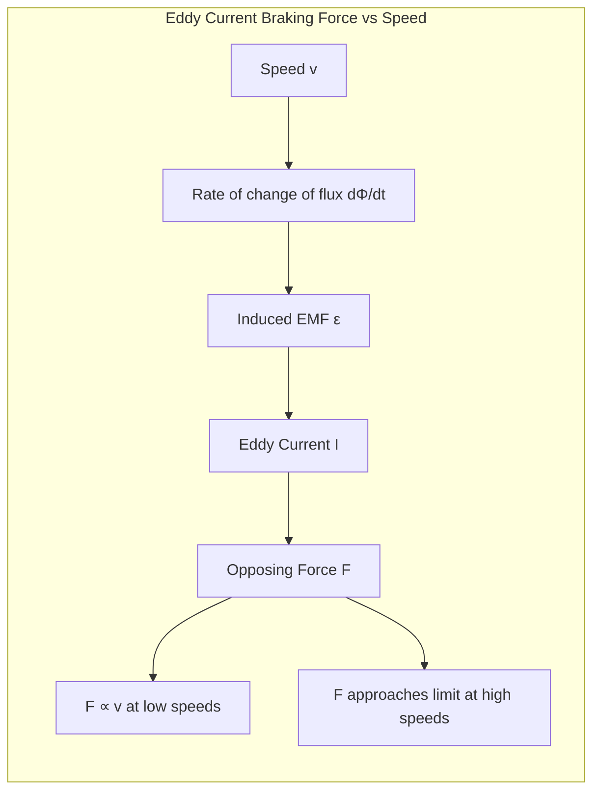
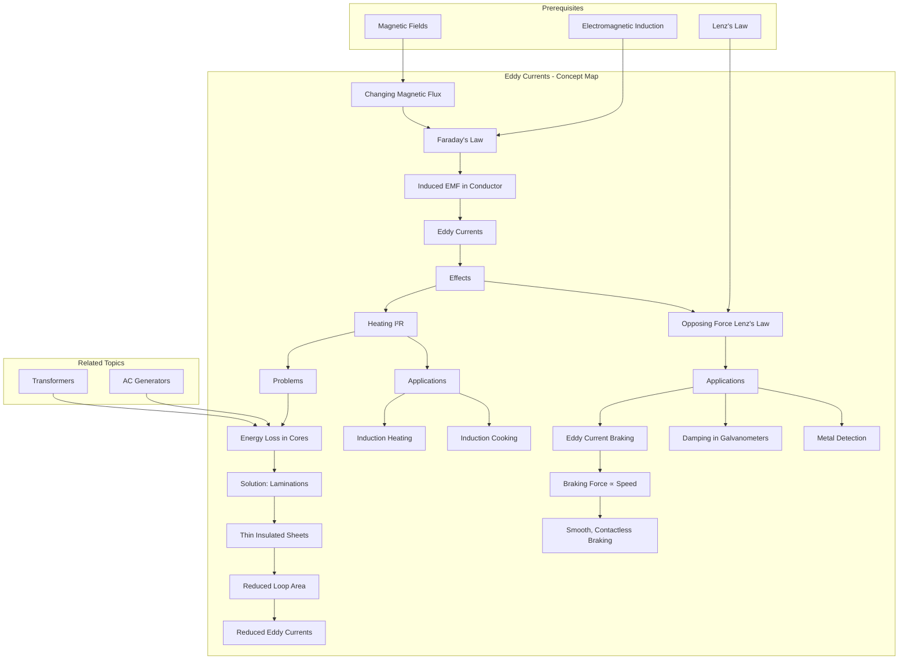

# 1. Overview / 概述

**English:**
Eddy currents are loops of electrical current induced within conductors by a changing magnetic field, due to [[Faraday's Law of Electromagnetic Induction]]. Unlike the current in a wire, eddy currents flow in closed loops within the bulk of the conductor, perpendicular to the magnetic field. They are a direct consequence of [[Lenz's Law and the Direction of Induced EMF]], as they always create their own magnetic field that opposes the change that produced them. This sub-topic explores the nature, effects, and practical applications of eddy currents, including both their beneficial uses (like induction heating and braking) and their detrimental effects (like energy losses in transformers). Understanding eddy currents is crucial for designing efficient electrical machines and for mastering the practical implications of [[Electromagnetic Induction]].

**中文:**
涡电流是由于变化的磁场在导体内部感应出的电流环路，其原理基于[[法拉第电磁感应定律]]。与导线中的电流不同，涡电流在导体内部以闭合环路的形式流动，方向垂直于磁场。它们是[[楞次定律与感应电动势方向]]的直接结果，因为涡电流总是产生一个阻碍其产生原因（磁场变化）的磁场。本子知识点探讨涡电流的性质、影响和实际应用，包括其有益用途（如感应加热和制动）和有害影响（如变压器中的能量损失）。理解涡电流对于设计高效的电气设备以及掌握[[电磁感应]]的实际应用至关重要。

---

# 2. Syllabus Learning Objectives / 考纲学习目标

| CAIE 9702 (20.3) | Edexcel IAL (WPH14 U4: 3.10-3.15) |
|-----------|-------------|
| Explain the origin of eddy currents and describe their effects | Explain how eddy currents arise from electromagnetic induction |
| Describe how to reduce eddy current losses (e.g., laminated cores) | Describe and explain the production of eddy currents |
| Describe applications of eddy currents (e.g., braking, induction heating) | Explain how eddy currents can be reduced (laminations) |
| - | Describe applications: induction heating, braking, damping, metal detection |

**Examiner Expectations / 考官期望:**
- **English:** You must be able to explain *why* eddy currents form (changing flux → induced EMF → current loops). You should be able to describe both the problems they cause (energy loss as heat) and the solutions (laminations, high resistivity cores). For applications, you need to explain the physics *mechanism* — not just state the application. For example, in eddy current braking: "The changing magnetic field induces eddy currents in the metal disc. By Lenz's law, these currents produce a magnetic field that opposes the motion, creating a braking force."
- **中文:** 你必须能够解释涡电流形成的*原因*（变化的磁通量 → 感应电动势 → 电流环路）。你应该能够描述它们引起的问题（以热量形式损失能量）以及解决方案（叠片铁芯、高电阻率铁芯）。对于应用，你需要解释物理*机制*——而不仅仅是陈述应用名称。例如，在涡电流制动中："变化的磁场在金属盘中感应出涡电流。根据楞次定律，这些电流产生一个阻碍运动的磁场，从而产生制动力。"

---

# 3. Core Definitions / 核心定义

| Term (EN/CN) | Definition (EN) | Definition (CN) | Common Mistakes / 常见错误 |
|--------------|-----------------|-----------------|---------------------------|
| **Eddy Current** / 涡电流 | Loops of electrical current induced within a conductor by a changing magnetic field, flowing in closed paths perpendicular to the field. | 由变化的磁场在导体内部感应出的电流环路，在垂直于磁场的闭合路径中流动。 | ❌ Thinking eddy currents only flow in wires. They flow in the *bulk* of the conductor. / 认为涡电流只在导线中流动。它们在导体*内部*流动。 |
| **Laminations** / 叠片 | Thin, insulated sheets of metal (e.g., iron) stacked together to form a core, used to reduce eddy current losses. | 由薄而绝缘的金属片（如铁）堆叠在一起形成的铁芯，用于减少涡电流损耗。 | ❌ Confusing laminations with insulation of the wire. Laminations insulate the *core layers* from each other. / 将叠片与导线的绝缘混淆。叠片使*铁芯层*之间相互绝缘。 |
| **Induction Heating** / 感应加热 | The process of heating a conductive material by inducing eddy currents in it using a high-frequency alternating magnetic field. | 利用高频交变磁场在导电材料中感应出涡电流，从而加热该材料的过程。 | ❌ Thinking the heat comes from the magnetic field directly. Heat is from $I^2R$ losses in the material. / 认为热量直接来自磁场。热量来自材料中的 $I^2R$ 损耗。 |
| **Eddy Current Braking** / 涡电流制动 | A braking mechanism that uses eddy currents induced in a moving conductor to create an opposing magnetic force, slowing the motion. | 一种利用在运动导体中感应出的涡电流产生反向磁力，从而减慢运动的制动机制。 | ❌ Thinking it's friction-based. It's a contactless, magnetic braking force. / 认为它是基于摩擦的。它是一种非接触式的磁制动力。 |
| **Skin Effect** / 趋肤效应 | The tendency of alternating current (including eddy currents) to concentrate near the surface of a conductor, especially at high frequencies. | 交流电（包括涡电流）倾向于集中在导体表面的现象，尤其是在高频时。 | ❌ Thinking this only applies to wires. It also affects eddy current distribution in bulk conductors. / 认为这只适用于导线。它也影响块状导体中的涡电流分布。 |

---

# 4. Key Concepts Explained / 关键概念详解

## 4.1 Origin of Eddy Currents / 涡电流的起源

### Explanation / 解释
**English:** Eddy currents arise from [[Faraday's Law of Electromagnetic Induction]]. When a conductor experiences a changing magnetic flux (either because the magnetic field changes with time, or the conductor moves through a non-uniform field), an electromotive force (EMF) is induced. In a solid conductor, this EMF drives currents in closed loops. These loops are called "eddy" currents because their flow pattern resembles eddies in a fluid. The magnitude of the eddy current depends on:
- The rate of change of magnetic flux ($\frac{d\Phi}{dt}$)
- The conductivity of the material (higher conductivity → larger currents)
- The geometry of the conductor (larger loops → larger currents)

By [[Lenz's Law and the Direction of Induced EMF]], the direction of the eddy current is such that its magnetic field opposes the change that produced it. This opposition is the source of both the useful effects (braking) and the wasteful effects (heating).

**中文:** 涡电流源于[[法拉第电磁感应定律]]。当导体经历变化的磁通量时（要么因为磁场随时间变化，要么导体在非均匀磁场中运动），就会感应出电动势。在实心导体中，这个电动势驱动电流在闭合环路中流动。这些环路被称为"涡"电流，因为它们的流动模式类似于流体中的涡流。涡电流的大小取决于：
- 磁通量的变化率 ($\frac{d\Phi}{dt}$)
- 材料的电导率（电导率越高 → 电流越大）
- 导体的几何形状（环路越大 → 电流越大）

根据[[楞次定律与感应电动势方向]]，涡电流的方向使其产生的磁场阻碍产生它的变化。这种阻碍既是有用效果（制动）的来源，也是浪费效果（发热）的来源。

### Physical Meaning / 物理意义
**English:** Eddy currents represent energy transfer from the magnetic field to the conductor. The energy is dissipated as heat due to the resistance of the conductor ($P = I^2R$). This is why eddy currents are often undesirable — they represent energy loss. However, this same heating effect can be harnessed for useful purposes like induction cooking.

**中文:** 涡电流代表了能量从磁场向导体的转移。由于导体的电阻，能量以热量的形式耗散 ($P = I^2R$)。这就是为什么涡电流通常是不受欢迎的——它们代表能量损失。然而，同样的加热效应也可以被利用于有用的目的，如感应烹饪。

### Common Misconceptions / 常见误区
- **EN:** ❌ "Eddy currents only occur in magnetic materials like iron." → **Truth:** Eddy currents occur in *any* conductor (copper, aluminum, etc.), not just ferromagnetic materials. The key requirement is electrical conductivity.
- **CN:** ❌ "涡电流只发生在像铁这样的磁性材料中。" → **事实：** 涡电流发生在*任何*导体中（铜、铝等），不仅仅是铁磁材料。关键要求是导电性。
- **EN:** ❌ "Eddy currents are the same as the induced current in a coil." → **Truth:** Both are induced by changing flux, but eddy currents flow in the bulk of a conductor, not along a defined wire path.
- **CN:** ❌ "涡电流与线圈中的感应电流相同。" → **事实：** 两者都是由变化的磁通量感应产生的，但涡电流在导体内部流动，而不是沿着定义的导线路径。

### Exam Tips / 考试提示
- **EN:** When explaining eddy currents, always mention: (1) changing magnetic flux, (2) induced EMF (Faraday's law), (3) current flows in closed loops in the conductor, (4) direction opposes the change (Lenz's law).
- **CN:** 在解释涡电流时，始终要提到：(1) 变化的磁通量，(2) 感应电动势（法拉第定律），(3) 电流在导体中形成闭合环路，(4) 方向阻碍变化（楞次定律）。

> 📷 **IMAGE PROMPT — EC-01: Eddy Current Formation in a Metal Block**
> A 3D cutaway diagram of a rectangular metal block (copper) placed above a changing magnetic field (symbolized by a coil with AC current). Show circular eddy current loops (blue arrows) flowing within the block, perpendicular to the magnetic field lines (red dashed lines). Label: "Changing Magnetic Field", "Induced EMF", "Eddy Current Loops". Use a clean, textbook-style illustration with color coding.

## 4.2 Reducing Eddy Current Losses: Laminations / 减少涡电流损耗：叠片

### Explanation / 解释
**English:** In devices like [[AC Generators and Transformers|transformers]] and electric motors, the iron core is subjected to a rapidly changing magnetic field. A solid iron core would have large eddy currents induced in it, causing significant energy loss as heat ($I^2R$). To reduce this, the core is **laminated** — made from many thin sheets of iron, each coated with a thin insulating layer (often varnish or oxide).

**Why this works:** The eddy current loops are confined to each individual thin lamination. The maximum area of each loop is drastically reduced. Since the induced EMF is proportional to the area of the loop ($\mathcal{E} \propto A$), and the resistance of the loop is inversely proportional to the cross-sectional area, the eddy current power loss is approximately proportional to the *square* of the lamination thickness ($P \propto t^2$). Thinner laminations → much smaller eddy currents → much less heat loss.

**中文:** 在[[交流发电机与变压器|变压器]]和电动机等设备中，铁芯会经历快速变化的磁场。实心铁芯会感应出巨大的涡电流，导致以热量形式 ($I^2R$) 显著的能量损失。为了减少这种情况，铁芯被**叠片化**——由许多薄铁片制成，每片都涂有薄绝缘层（通常是清漆或氧化物）。

**为什么有效：** 涡电流环路被限制在每个单独的薄叠片中。每个环路的最大面积被大幅减小。由于感应电动势与环路面积成正比 ($\mathcal{E} \propto A$)，而环路的电阻与横截面积成反比，涡电流的功率损耗大约与叠片厚度的*平方*成正比 ($P \propto t^2$)。更薄的叠片 → 更小的涡电流 → 更少的热量损失。

### Physical Meaning / 物理意义
**English:** Laminations break up the large conducting paths into many small, isolated paths. This is a practical application of the principle that induced EMF depends on the area of the loop. By reducing the effective loop area, the induced EMF and resulting current are dramatically reduced.

**中文:** 叠片将大的导电路径分割成许多小的、隔离的路径。这是感应电动势取决于环路面积这一原理的实际应用。通过减小有效环路面积，感应电动势和由此产生的电流被大幅降低。

### Common Misconceptions / 常见误区
- **EN:** ❌ "Laminations reduce eddy currents because they are made of a different material." → **Truth:** Laminations are made of the *same* material (usually silicon steel). The reduction comes from the *geometry* (thin sheets) and *insulation* between sheets.
- **CN:** ❌ "叠片减少涡电流是因为它们由不同的材料制成。" → **事实：** 叠片由*相同*的材料制成（通常是硅钢）。减少来自于*几何形状*（薄片）和片之间的*绝缘*。
- **EN:** ❌ "Laminations are used to reduce hysteresis losses." → **Truth:** Laminations primarily reduce *eddy current* losses. Hysteresis losses are reduced by using different core materials (e.g., soft iron).
- **CN:** ❌ "叠片用于减少磁滞损耗。" → **事实：** 叠片主要减少*涡电流*损耗。磁滞损耗通过使用不同的铁芯材料（如软铁）来减少。

### Exam Tips / 考试提示
- **EN:** In an exam, when asked "Why are transformer cores laminated?", your answer must include: (1) Changing magnetic flux induces eddy currents in the core. (2) Laminations are thin, insulated sheets. (3) This confines eddy currents to small loops. (4) This reduces the induced EMF and current. (5) Therefore, $I^2R$ heating losses are reduced.
- **CN:** 在考试中，当被问到"为什么变压器铁芯是叠片的？"时，你的答案必须包括：(1) 变化的磁通量在铁芯中感应出涡电流。(2) 叠片是薄的绝缘片。(3) 这将涡电流限制在小环路中。(4) 这减少了感应电动势和电流。(5) 因此，$I^2R$ 热损耗被减少。

> 📷 **IMAGE PROMPT — EC-02: Laminated vs Solid Core Comparison**
> Split diagram: Left side shows a solid iron core with large, thick eddy current loops (red arrows) spanning the entire core. Right side shows a laminated core with thin, insulated sheets; eddy currents (small blue arrows) are confined to each thin sheet. Label: "Solid Core: Large Eddy Currents → High $I^2R$ Loss" and "Laminated Core: Small Eddy Currents → Low $I^2R$ Loss". Show the insulating layer between laminations as thin black lines.

## 4.3 Applications of Eddy Currents / 涡电流的应用

### 4.3.1 Induction Heating / 感应加热

**Explanation / 解释**
**English:** A high-frequency alternating current (AC) is passed through a coil, creating a rapidly changing magnetic field. When a conductive object (e.g., a metal pan) is placed inside this field, eddy currents are induced in the object. The resistance of the object causes these currents to dissipate energy as heat ($P = I^2R$). This is the principle behind induction cooktops and industrial metal melting furnaces. The high frequency (kHz range) increases the rate of change of flux ($\frac{d\Phi}{dt}$), inducing larger eddy currents and more heat.

**中文:** 高频交流电通过线圈，产生快速变化的磁场。当导电物体（如金属锅）被放置在这个磁场中时，物体内会感应出涡电流。物体的电阻导致这些电流以热量的形式耗散能量 ($P = I^2R$)。这是电磁炉和工业金属熔化炉背后的原理。高频（千赫兹范围）增加了磁通量的变化率 ($\frac{d\Phi}{dt}$)，感应出更大的涡电流和更多的热量。

### 4.3.2 Eddy Current Braking / 涡电流制动

**Explanation / 解释**
**English:** Used in trains, roller coasters, and some power tools. A strong electromagnet is brought near a rotating metal disc or wheel. The relative motion between the magnet and the conductor induces eddy currents in the conductor. By [[Lenz's Law and the Direction of Induced EMF]], these eddy currents produce a magnetic field that opposes the relative motion. This creates a braking force that slows the conductor down. The braking force is proportional to the speed of the conductor — faster motion → larger eddy currents → stronger braking force. This makes eddy current brakes smooth and contactless (no friction, no wear).

**中文:** 用于火车、过山车和一些电动工具。一个强电磁铁被靠近旋转的金属盘或轮子。磁铁和导体之间的相对运动在导体中感应出涡电流。根据[[楞次定律与感应电动势方向]]，这些涡电流产生一个阻碍相对运动的磁场。这产生了一个使导体减速的制动力。制动力与导体的速度成正比——运动越快 → 涡电流越大 → 制动力越强。这使得涡电流制动平滑且非接触式（无摩擦，无磨损）。

### 4.3.3 Metal Detection / 金属探测

**Explanation / 解释**
**English:** Metal detectors use a coil carrying an alternating current to create a changing magnetic field. When a metal object enters this field, eddy currents are induced in the metal. These eddy currents create their own magnetic field, which is detected by a receiver coil in the detector. The change in the received signal indicates the presence of metal.

**中文:** 金属探测器使用一个载有交流电的线圈来产生变化的磁场。当金属物体进入这个磁场时，金属中会感应出涡电流。这些涡电流产生它们自己的磁场，被探测器中的接收线圈检测到。接收信号的变化表明金属的存在。

### 4.3.4 Damping in Galvanometers / 电流计中的阻尼

**Explanation / 解释**
**English:** In a moving-coil galvanometer, the coil is wound on an aluminum former. When the coil moves in the magnetic field, eddy currents are induced in the aluminum former. These currents oppose the motion (Lenz's law), providing "damping" that prevents the pointer from oscillating and helps it settle quickly to the correct reading.

**中文:** 在动圈式电流计中，线圈绕在铝制框架上。当线圈在磁场中运动时，铝制框架中会感应出涡电流。这些电流阻碍运动（楞次定律），提供"阻尼"，防止指针振荡并帮助其快速稳定到正确读数。

---

# 5. Essential Equations / 核心公式

## 5.1 Power Dissipated by Eddy Currents / 涡电流耗散的功率

$$ P = I^2 R $$

| Symbol (符号) | Meaning (EN) | Meaning (CN) | Unit (单位) |
|--------------|-------------|-------------|------------|
| $P$ | Power dissipated as heat | 以热量形式耗散的功率 | W (瓦特) |
| $I$ | Eddy current | 涡电流 | A (安培) |
| $R$ | Resistance of the conducting path | 导电路径的电阻 | $\Omega$ (欧姆) |

**Derivation / 推导:** This is the standard electrical power dissipation formula. The eddy current $I$ is induced by the changing magnetic flux, and the resistance $R$ is the effective resistance of the conducting loops within the material.

**Conditions / 适用条件:**
- **EN:** Applies to any conductor where eddy currents are flowing. The resistance $R$ depends on the material's resistivity and the geometry of the current paths.
- **CN:** 适用于任何有涡电流流动的导体。电阻 $R$ 取决于材料的电阻率和电流路径的几何形状。

**Limitations / 局限性:**
- **EN:** The exact value of $I$ and $R$ are difficult to calculate analytically for complex geometries. The formula is more conceptual — it shows that to reduce power loss, you must either reduce the current (by laminations) or increase the resistance (by using high-resistivity materials).
- **CN:** 对于复杂几何形状，$I$ 和 $R$ 的精确值难以解析计算。该公式更具概念性——它表明要减少功率损耗，必须要么减少电流（通过叠片），要么增加电阻（通过使用高电阻率材料）。

## 5.2 Induced EMF in a Loop / 环路中的感应电动势

$$ \mathcal{E} = -\frac{d\Phi}{dt} $$

| Symbol (符号) | Meaning (EN) | Meaning (CN) | Unit (单位) |
|--------------|-------------|-------------|------------|
| $\mathcal{E}$ | Induced electromotive force | 感应电动势 | V (伏特) |
| $\Phi$ | Magnetic flux through the loop | 穿过环路的磁通量 | Wb (韦伯) |
| $t$ | Time | 时间 | s (秒) |

**Derivation / 推导:** This is [[Faraday's Law of Electromagnetic Induction]]. For eddy currents, the "loop" is any closed path within the conductor.

**Conditions / 适用条件:**
- **EN:** The negative sign indicates Lenz's law — the induced EMF opposes the change in flux.
- **CN:** 负号表示楞次定律——感应电动势阻碍磁通量的变化。

**Limitations / 局限性:**
- **EN:** For eddy currents, the exact flux through each "loop" is complex and depends on the conductor's shape and the field distribution.
- **CN:** 对于涡电流，穿过每个"环路"的精确磁通量很复杂，取决于导体的形状和磁场分布。

---

# 6. Graphs and Relationships / 图表与关系

## 6.1 Eddy Current Braking Force vs Speed / 涡电流制动力与速度的关系

### Axes / 坐标轴
- **X-axis:** Speed of conductor relative to magnetic field ($v$) / 导体相对于磁场的速度 ($v$)
- **Y-axis:** Braking force ($F$) / 制动力 ($F$)

### Shape / 形状
- **EN:** A curve that is approximately linear at low speeds (force $\propto$ speed), but plateaus at high speeds. The initial linear region is because faster motion → larger $\frac{d\Phi}{dt}$ → larger induced EMF → larger eddy currents → larger opposing force. At very high speeds, the force approaches a maximum limit due to the finite conductivity of the material and the geometry.
- **CN:** 在低速时近似为线性曲线（力 $\propto$ 速度），但在高速时趋于平稳。初始线性区域是因为更快的运动 → 更大的 $\frac{d\Phi}{dt}$ → 更大的感应电动势 → 更大的涡电流 → 更大的反向力。在非常高的速度下，由于材料的有限电导率和几何形状，力趋近于最大值。

### Gradient Meaning / 斜率含义
- **EN:** The initial gradient represents the "braking coefficient" — how effectively the system converts speed into braking force. A steeper gradient means more effective braking.
- **CN:** 初始梯度代表"制动系数"——系统将速度转化为制动力的效率。梯度越陡意味着制动越有效。

### Area Meaning / 面积含义
- **EN:** The area under the force-speed graph represents the power dissipated by the braking system ($P = Fv$). This power is dissipated as heat in the conductor.
- **CN:** 力-速度图下的面积代表制动系统耗散的功率 ($P = Fv$)。这个功率在导体中以热量的形式耗散。

### Exam Interpretation / 考试解读
- **EN:** You may be asked to sketch this graph and explain its shape. Key points: (1) At $v=0$, $F=0$ (no relative motion → no induction). (2) Initially linear: $F \propto v$. (3) At high speeds, the curve flattens due to limitations in how fast eddy currents can be generated.
- **CN:** 你可能会被要求画出这个图并解释其形状。关键点：(1) 在 $v=0$ 时，$F=0$（无相对运动 → 无感应）。(2) 初始线性：$F \propto v$。(3) 在高速时，曲线变平，因为涡电流产生的速度有限。

> 📷 **IMAGE PROMPT — EC-03: Eddy Current Braking Force vs Speed Graph**
> A graph with x-axis labeled "Speed (v)" and y-axis labeled "Braking Force (F)". Show a curve starting at origin (0,0), rising linearly at first, then gradually curving to approach a horizontal asymptote. Label the linear region "F ∝ v" and the plateau region "Maximum braking force". Use a clean, exam-style graph with gridlines.

---

# 7. Required Diagrams / 必备图表

## 7.1 Eddy Currents in a Laminated Core / 叠片铁芯中的涡电流

### Description / 描述
**English:** A cross-sectional diagram showing a transformer core made of laminated sheets. The diagram should show how eddy currents are confined to individual laminations, compared to a solid core where large eddy currents flow across the entire core.

**中文:** 一个横截面图，显示由叠片制成的变压器铁芯。该图应显示涡电流如何被限制在单个叠片中，与实心铁芯中大的涡电流流经整个铁芯形成对比。

### Image Prompt / 图片生成提示
> 📷 **IMAGE PROMPT — EC-04: Laminated Core Eddy Current Diagram**
> A detailed cross-sectional diagram of a transformer core. Left side: Solid iron core with large, thick red arrows showing eddy currents flowing in large loops across the entire core. Right side: Laminated core with thin blue arrows showing eddy currents confined to each thin sheet. The insulating layers between laminations are shown as thin black lines. Magnetic field lines (dashed) pass through the core vertically. Labels: "Solid Core: Large Eddy Currents", "Laminated Core: Small Eddy Currents", "Insulating Layer". Use a clean, textbook-style illustration.

### Labels Required / 需要标注
- **EN:** Solid core, Laminated core, Eddy current loops, Insulating layer, Magnetic field lines
- **CN:** 实心铁芯，叠片铁芯，涡电流环路，绝缘层，磁感线

### Exam Importance / 考试重要性
- **EN:** High. This is the most commonly asked diagram for eddy currents. You must be able to draw and explain it.
- **CN:** 高。这是涡电流最常被问到的图表。你必须能够画出并解释它。

## 7.2 Eddy Current Braking System / 涡电流制动系统

### Description / 描述
**English:** A diagram showing a metal disc rotating between the poles of an electromagnet. The eddy currents induced in the disc and the resulting braking force should be indicated.

**中文:** 一个显示金属盘在电磁铁两极之间旋转的图。应标出盘中感应出的涡电流和由此产生的制动力。

### Image Prompt / 图片生成提示
> 📷 **IMAGE PROMPT — EC-05: Eddy Current Braking System**
> A diagram showing a circular metal disc (copper or aluminum) rotating between the poles of a U-shaped electromagnet. The disc is shown from the side, with the magnet poles above and below the disc's edge. Show eddy current loops (blue arrows) in the disc near the magnet. Show the direction of motion (green arrow) and the opposing braking force (red arrow). Label: "Rotating Disc", "Electromagnet", "Eddy Currents", "Braking Force (opposes motion)". Use a clean, engineering-style diagram.

### Labels Required / 需要标注
- **EN:** Rotating disc, Electromagnet, Eddy currents, Braking force, Direction of motion
- **CN:** 旋转盘，电磁铁，涡电流，制动力，运动方向

### Exam Importance / 考试重要性
- **EN:** Medium. You should be able to explain the mechanism using Lenz's law.
- **CN:** 中。你应该能够使用楞次定律解释其机制。

---

# 8. Worked Examples / 典型例题

## Example 1: Laminated Core Power Loss / 叠片铁芯功率损耗

### Question / 题目
**English:**
A transformer core is made of solid iron and has an eddy current power loss of 40 W when operating at 50 Hz. The core is replaced with a laminated core made of the same material, with laminations of thickness 0.5 mm. The original solid core can be considered as a single lamination of thickness 50 mm. Assuming the eddy current power loss is proportional to the square of the lamination thickness ($P \propto t^2$), calculate the new eddy current power loss.

**中文:**
一个变压器铁芯由实心铁制成，在50 Hz下运行时涡电流功率损耗为40 W。铁芯被替换为由相同材料制成的叠片铁芯，叠片厚度为0.5 mm。原始实心铁芯可视为厚度为50 mm的单一片。假设涡电流功率损耗与叠片厚度的平方成正比 ($P \propto t^2$)，计算新的涡电流功率损耗。

### Solution / 解答

**Step 1: Identify the relationship / 步骤1：确定关系**
$$ P \propto t^2 $$
$$ \frac{P_{\text{new}}}{P_{\text{old}}} = \left(\frac{t_{\text{new}}}{t_{\text{old}}}\right)^2 $$

**Step 2: Substitute values / 步骤2：代入数值**
$$ \frac{P_{\text{new}}}{40} = \left(\frac{0.5}{50}\right)^2 $$
$$ \frac{P_{\text{new}}}{40} = \left(\frac{1}{100}\right)^2 $$
$$ \frac{P_{\text{new}}}{40} = \frac{1}{10000} $$

**Step 3: Solve for $P_{\text{new}}$ / 步骤3：求解 $P_{\text{new}}$**
$$ P_{\text{new}} = 40 \times \frac{1}{10000} = 0.004 \text{ W} = 4 \text{ mW} $$

### Final Answer / 最终答案
**Answer:** 4 mW | **答案：** 4 毫瓦

### Quick Tip / 提示
- **EN:** The power loss is dramatically reduced because it depends on the *square* of the thickness. Even a modest reduction in lamination thickness leads to a huge reduction in losses.
- **CN:** 功率损耗被大幅减少，因为它取决于厚度的*平方*。即使是叠片厚度的适度减少也会导致损耗的巨大减少。

## Example 2: Eddy Current Braking Force / 涡电流制动力

### Question / 题目
**English:**
A metal disc of radius 0.2 m rotates at 10 revolutions per second. An electromagnet is placed near the edge of the disc, creating a magnetic field of 0.5 T over a small area of the disc. Explain, using Lenz's law, why a braking force is produced. If the speed of the disc is doubled, explain what happens to the braking force.

**中文:**
一个半径为0.2 m的金属盘以每秒10转的速度旋转。一个电磁铁被放置在盘的边缘附近，在盘的一小块区域上产生0.5 T的磁场。使用楞次定律解释为什么会产生制动力。如果盘的速度加倍，解释制动力会发生什么变化。

### Solution / 解答

**Step 1: Explain the mechanism / 步骤1：解释机制**
**English:**
As the disc rotates, the part of the disc near the magnet moves through the magnetic field. This relative motion causes a change in magnetic flux through the disc. By Faraday's law, this changing flux induces an EMF, which drives eddy currents in the disc. By Lenz's law, the direction of these eddy currents is such that they produce a magnetic field that opposes the change that caused them — i.e., opposes the motion of the disc. This opposition manifests as a braking force.

**中文:**
当盘旋转时，盘靠近磁铁的部分在磁场中运动。这种相对运动导致穿过盘的磁通量发生变化。根据法拉第定律，这种变化的磁通量感应出电动势，从而在盘中驱动涡电流。根据楞次定律，这些涡电流的方向使得它们产生一个阻碍其产生原因（即阻碍盘的运动）的磁场。这种阻碍表现为制动力。

**Step 2: Effect of doubling speed / 步骤2：速度加倍的影响**
**English:**
If the speed is doubled, the rate of change of magnetic flux ($\frac{d\Phi}{dt}$) doubles. This doubles the induced EMF (Faraday's law). Since $I = \mathcal{E}/R$, the eddy current also doubles (assuming constant resistance). The braking force is proportional to the eddy current ($F \propto I$), so the braking force approximately doubles. However, at very high speeds, the force may not double exactly due to limitations (e.g., skin effect, saturation).

**中文:**
如果速度加倍，磁通量的变化率 ($\frac{d\Phi}{dt}$) 加倍。这使感应电动势加倍（法拉第定律）。由于 $I = \mathcal{E}/R$，涡电流也加倍（假设电阻不变）。制动力与涡电流成正比 ($F \propto I$)，所以制动力大约加倍。然而，在非常高的速度下，由于限制因素（如趋肤效应、饱和），力可能不会精确加倍。

### Final Answer / 最终答案
**Answer:** Braking force approximately doubles. | **答案：** 制动力大约加倍。

### Quick Tip / 提示
- **EN:** Always link the braking force to Lenz's law: "The induced current opposes the motion that produced it."
- **CN:** 始终将制动力与楞次定律联系起来："感应电流阻碍产生它的运动。"

---

# 9. Past Paper Question Types / 历年真题题型

| Question Type / 题型 | Frequency / 频率 | Difficulty / 难度 | Past Paper References / 真题索引 |
|----------------------|------------------|------------------|-------------------------------|
| Explain origin of eddy currents | High | Medium | 📝 *待填入* |
| Explain how laminations reduce losses | High | Medium | 📝 *待填入* |
| Calculate power loss with laminations | Medium | Medium-Hard | 📝 *待填入* |
| Explain eddy current braking mechanism | Medium | Medium | 📝 *待填入* |
| Compare solid vs laminated core | Medium | Easy-Medium | 📝 *待填入* |
| Application: induction heating | Low | Medium | 📝 *待填入* |

**Common Command Words / 常见指令词:**
- **EN:** Explain, Describe, Calculate, State, Suggest, Compare
- **CN:** 解释，描述，计算，陈述，提出，比较

---

# 10. Practical Skills Connections / 实验技能链接

**English:**
Eddy currents connect to practical skills in several ways:

1. **Experimental Demonstration:** A simple experiment involves dropping a strong magnet through a copper or aluminum tube. The magnet falls slowly due to eddy currents induced in the tube. Dropping the same magnet through a plastic tube shows no such effect. This demonstrates the need for a *conductor* for eddy currents to form.

2. **Measurement of Power Loss:** In transformer experiments, you can measure the input and output power. The difference is due to core losses (eddy currents + hysteresis). By comparing solid and laminated cores, you can quantify the reduction in eddy current losses.

3. **Graph Plotting:** You could plot braking force vs. speed for an eddy current brake. This requires measuring force (using a force sensor) and speed (using a motion sensor or tachometer). The graph should show the characteristic shape (linear at low speeds, plateau at high speeds).

4. **Uncertainties:** When measuring power loss, uncertainties in voltage, current, and time measurements must be considered. The percentage uncertainty in power is the sum of percentage uncertainties in voltage and current.

**中文:**
涡电流在几个方面与实验技能相关：

1. **实验演示：** 一个简单的实验是将一块强磁铁从铜管或铝管中落下。由于管中感应出的涡电流，磁铁下落缓慢。将同一块磁铁从塑料管中落下则没有这种效果。这证明了涡电流形成需要*导体*。

2. **功率损耗测量：** 在变压器实验中，可以测量输入和输出功率。差值是由于铁芯损耗（涡电流 + 磁滞）。通过比较实心铁芯和叠片铁芯，可以量化涡电流损耗的减少。

3. **图表绘制：** 可以绘制涡电流制动器的制动力与速度的关系图。这需要测量力（使用力传感器）和速度（使用运动传感器或转速计）。该图应显示特征形状（低速时线性，高速时平稳）。

4. **不确定度：** 在测量功率损耗时，必须考虑电压、电流和时间测量的不确定度。功率的百分比不确定度是电压和电流百分比不确定度之和。

---

# 11. Concept Map / 概念图谱

---

# 12. Quick Revision Sheet / 速查表

| Category / 类别 | Key Points / 要点 |
|----------------|------------------|
| **Definition / 定义** | Loops of current induced in a conductor by a changing magnetic field. / 由变化的磁场在导体中感应出的电流环路。 |
| **Origin / 起源** | Changing flux → Induced EMF (Faraday) → Current flows in closed loops. / 变化的磁通量 → 感应电动势（法拉第）→ 电流在闭合环路中流动。 |
| **Direction / 方向** | Opposes the change that produced it (Lenz's law). / 阻碍产生它的变化（楞次定律）。 |
| **Key Formula / 核心公式** | $P = I^2R$ (power loss as heat); $\mathcal{E} = -\frac{d\Phi}{dt}$ (induced EMF) |
| **Reduction Method / 减少方法** | **Laminations:** Thin insulated sheets → confine eddy currents to small loops → reduce $I$ and $P$. / **叠片：** 薄绝缘片 → 将涡电流限制在小环路中 → 减少 $I$ 和 $P$。 |
| **Key Graph / 核心图表** | Braking Force vs Speed: Linear at low speeds ($F \propto v$), plateaus at high speeds. / 制动力与速度：低速时线性 ($F \propto v$)，高速时趋于平稳。 |
| **Applications / 应用** | ✅ Induction heating/cooking, eddy current braking, metal detection, damping. / 感应加热/烹饪，涡电流制动，金属探测，阻尼。 |
| **Problems / 问题** | ❌ Energy loss as heat in transformer cores, motor cores. / 变压器铁芯、电机铁芯中以热量形式损失能量。 |
| **Exam Tip / 考试提示** | Always mention BOTH Faraday's law AND Lenz's law when explaining eddy currents. / 解释涡电流时始终要同时提到法拉第定律和楞次定律。 |
| **Common Mistake / 常见错误** | ❌ "Eddy currents only occur in magnetic materials." → **Truth:** They occur in ANY conductor. / "涡电流只发生在磁性材料中。" → **事实：** 它们发生在任何导体中。 |