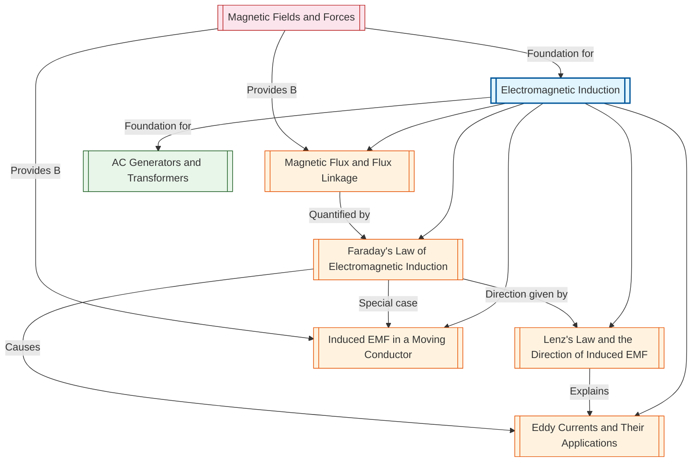

# 1. Overview / 概述

**English:**
Electromagnetic Induction is the process by which an electromotive force (EMF) is induced in a conductor when it experiences a changing magnetic field. This phenomenon, discovered independently by Michael Faraday and Joseph Henry in the 1830s, is one of the most fundamental principles in physics and the foundation of modern electrical technology. The topic explores how a changing [[Magnetic Flux]] through a circuit generates an induced EMF, governed by [[Faraday's Law of Electromagnetic Induction]], and how the direction of this induced EMF opposes the change that produced it, as described by [[Lenz's Law and the Direction of Induced EMF]].

In the context of Cambridge 9702 and Edexcel IAL A-Level Physics, this topic is a core component of the "Fields" module. It builds directly on [[Magnetic Fields and Forces]] and serves as the prerequisite for understanding [[AC Generators and Transformers]]. The topic is examined through both theoretical understanding and practical applications, including calculations of induced EMF, determination of current direction, and analysis of real-world devices like generators, transformers, and induction cooktops. Mastery of this topic is essential for achieving high grades in A2 examinations, as it frequently appears in multiple-choice, structured, and extended-response questions.

Real-world applications of electromagnetic induction are ubiquitous. It is the principle behind electrical power generation in power stations, where mechanical energy is converted into electrical energy via rotating coils in magnetic fields. It enables wireless charging of devices, metal detection in security systems, and the operation of induction hobs in modern kitchens. In medical technology, it is used in magnetic resonance imaging (MRI) and transcranial magnetic stimulation. Understanding this topic also provides insight into the physics of [[Eddy Currents and Their Applications]], which have both beneficial uses (e.g., braking systems in trains) and undesirable effects (e.g., energy losses in transformers).

**中文：**
电磁感应是指当导体经历变化的磁场时，在导体中产生电动势的过程。这一现象由迈克尔·法拉第和约瑟夫·亨利在19世纪30年代独立发现，是物理学中最基本的原理之一，也是现代电气技术的基础。本主题探讨通过电路的[[磁通量]]变化如何产生感应电动势（由[[法拉第电磁感应定律]]支配），以及感应电动势的方向如何抵抗产生它的变化（由[[楞次定律与感应电动势方向]]描述）。

在剑桥9702和爱德思IAL A-Level物理的背景下，本主题是"场"模块的核心组成部分。它直接建立在[[磁场与力]]的基础上，是理解[[交流发电机与变压器]]的先决条件。该主题通过理论理解和实际应用两方面进行考查，包括感应电动势的计算、电流方向的确定，以及发电机、变压器和电磁炉等实际设备的分析。掌握本主题对于在A2考试中取得高分至关重要，因为它经常出现在选择题、结构题和扩展回答题中。

电磁感应的实际应用无处不在。它是发电站中发电的原理，通过旋转线圈在磁场中将机械能转化为电能。它实现了设备的无线充电、安防系统中的金属探测，以及现代厨房中的电磁炉。在医疗技术中，它被用于磁共振成像和经颅磁刺激。理解本主题还能深入了解[[涡流及其应用]]的物理原理，这些涡流既有有益用途（如列车制动系统），也有不良影响（如变压器中的能量损失）。

---

# 2. Syllabus Learning Objectives / 考纲学习目标

**English:**
The following table maps the specific learning objectives from Cambridge International AS & A Level Physics (9702) and Edexcel IAL Physics (WPH14) for the topic of Electromagnetic Induction. Both syllabuses cover the same core concepts, but with slight differences in emphasis and terminology.

**中文：**
下表列出了剑桥国际AS & A Level物理（9702）和爱德思IAL物理（WPH14）关于电磁感应主题的具体学习目标。两个考纲涵盖相同的核心概念，但在重点和术语上略有差异。

| CAIE 9702 (20.3 a-g) | Edexcel IAL (WPH14 U4: 3.10-3.15) |
|----------------------|-----------------------------------|
| (a) Define magnetic flux and the weber. | 3.10 Understand the concept of magnetic flux and flux linkage. |
| (b) Define magnetic flux linkage. | 3.11 Understand and use Faraday's law of electromagnetic induction. |
| (c) State and use Faraday's law of electromagnetic induction. | 3.12 Understand and use Lenz's law of electromagnetic induction. |
| (d) State and use Lenz's law to determine the direction of induced EMF. | 3.13 Understand how to determine the direction of induced EMF using Lenz's law. |
| (e) Explain how induced EMFs are produced in moving conductors. | 3.14 Understand the production of induced EMF in a moving conductor. |
| (f) Explain the production of eddy currents. | 3.15 Understand the origin and effects of eddy currents. |
| (g) Explain how eddy currents can be reduced. | (Included within 3.15) |

**Examiner Expectations / 考官期望:**

**English:**
- **CAIE:** Candidates must be able to define magnetic flux ($\Phi = BA\cos\theta$) and flux linkage ($N\Phi$). They must apply Faraday's law ($\mathcal{E} = -N\frac{d\Phi}{dt}$) to calculate induced EMF. Lenz's law is used to determine direction, often in the context of the right-hand rule. Eddy currents are expected to be explained qualitatively, with methods to reduce them (e.g., laminated cores).
- **Edexcel:** Candidates must understand the concept of flux linkage and apply Faraday's law in both algebraic and graphical forms. Lenz's law is applied using energy conservation arguments. The production of induced EMF in a moving conductor is examined quantitatively using $\mathcal{E} = Blv$. Eddy currents are examined in terms of their origin and practical applications/limitations.

**中文：**
- **CAIE：** 考生必须能够定义磁通量（$\Phi = BA\cos\theta$）和磁通链（$N\Phi$）。他们必须应用法拉第定律（$\mathcal{E} = -N\frac{d\Phi}{dt}$）计算感应电动势。楞次定律用于确定方向，通常结合右手定则。涡流需要定性解释，并说明减少涡流的方法（例如叠片铁芯）。
- **Edexcel：** 考生必须理解磁通链的概念，并以代数和图形形式应用法拉第定律。楞次定律通过能量守恒论证来应用。运动导体中感应电动势的产生使用$\mathcal{E} = Blv$进行定量考查。涡流从其起源和实际应用/局限性方面进行考查。

> 📋 **CIE Only:** CAIE specifically requires the definition of the weber (Wb) as the unit of magnetic flux. Candidates should be able to state that 1 Wb = 1 T m². The negative sign in Faraday's law is explicitly included in the equation $\mathcal{E} = -N\frac{d\Phi}{dt}$.
>
> 📋 **Edexcel Only:** Edexcel places greater emphasis on the quantitative treatment of induced EMF in a moving conductor using $\mathcal{E} = Blv\sin\theta$. The concept of flux linkage is often examined through graphical analysis of flux against time. Eddy currents are examined in the context of practical devices like induction hobs and metal detectors.

---

# 3. Core Definitions / 核心定义

**English:**
The following table provides the essential definitions for Electromagnetic Induction, presented in both English and Chinese. Each definition is worded to match the standard expected in A-Level examinations. Common mistakes are highlighted to help students avoid typical errors.

**中文：**
下表提供了电磁感应的核心定义，以中英文双语呈现。每个定义的措辞均符合A-Level考试的标准要求。突出显示了常见错误，以帮助学生避免典型失误。

| Term (EN/CN) | Definition (EN) | Definition (CN) | Common Mistakes / 常见错误 |
|--------------|-----------------|-----------------|---------------------------|
| [[Magnetic Flux]] / 磁通量 | The product of the magnetic flux density $B$ and the area $A$ perpendicular to the field, given by $\Phi = BA\cos\theta$, where $\theta$ is the angle between the field direction and the normal to the area. Unit: weber (Wb). | 磁通量是磁通密度$B$与垂直于磁场的面积$A$的乘积，由$\Phi = BA\cos\theta$给出，其中$\theta$是磁场方向与面积法线之间的夹角。单位：韦伯（Wb）。 | **Common Mistake:** Forgetting the $\cos\theta$ factor when the area is not perpendicular to the field. Students often use $\Phi = BA$ without considering the angle. |
| [[Magnetic Flux Linkage]] / 磁通链 | The product of the number of turns $N$ of a coil and the magnetic flux $\Phi$ through one turn, given by $N\Phi = NBA\cos\theta$. Unit: weber-turns (Wb-turns). | 线圈匝数$N$与通过一匝的磁通量$\Phi$的乘积，由$N\Phi = NBA\cos\theta$给出。单位：韦伯-匝（Wb-turns）。 | **Common Mistake:** Confusing flux linkage with flux. Flux linkage is $N\Phi$, not just $\Phi$. Also, forgetting that $N$ is the number of turns, not the number of coils. |
| [[Faraday's Law of Electromagnetic Induction]] / 法拉第电磁感应定律 | The magnitude of the induced EMF in a circuit is directly proportional to the rate of change of magnetic flux linkage through the circuit. Mathematically: $\mathcal{E} = -N\frac{d\Phi}{dt}$. | 电路中感应电动势的大小与通过电路的磁通链变化率成正比。数学表达式：$\mathcal{E} = -N\frac{d\Phi}{dt}$。 | **Common Mistake:** Omitting the negative sign, which represents Lenz's law. Also, using $\Delta\Phi/\Delta t$ instead of $d\Phi/dt$ when the change is not linear. |
| [[Lenz's Law and the Direction of Induced EMF]] / 楞次定律与感应电动势方向 | The direction of the induced EMF is such that it opposes the change in magnetic flux that produced it. This is a consequence of the conservation of energy. | 感应电动势的方向总是阻碍产生它的磁通量变化。这是能量守恒的结果。 | **Common Mistake:** Thinking the induced current opposes the magnetic field itself, rather than the *change* in magnetic flux. Also, confusing Lenz's law with the right-hand rule. |
| [[Induced EMF in a Moving Conductor]] / 运动导体中的感应电动势 | When a conductor of length $l$ moves with velocity $v$ perpendicular to a magnetic field of flux density $B$, the induced EMF is given by $\mathcal{E} = Blv$. | 当长度为$l$的导体以速度$v$垂直于磁通密度为$B$的磁场运动时，感应电动势由$\mathcal{E} = Blv$给出。 | **Common Mistake:** Forgetting that the conductor must cut magnetic field lines. If the conductor moves parallel to the field, no EMF is induced. Also, using $\mathcal{E} = Blv$ when the motion is not perpendicular. |
| [[Eddy Currents and Their Applications]] / 涡流及其应用 | Circulating currents induced in a bulk conductor when it experiences a changing magnetic field. They flow in closed loops within the conductor. | 当块状导体经历变化的磁场时，在其中感应出的环形电流。它们在导体内部形成闭合回路。 | **Common Mistake:** Thinking eddy currents only occur in coils. They occur in any conducting material. Also, confusing eddy currents with conventional induced currents in wires. |
| [[Electromagnetic Induction]] / 电磁感应 | The process of generating an electromotive force (EMF) in a conductor due to a changing magnetic field. | 由于变化的磁场而在导体中产生电动势的过程。 | **Common Mistake:** Thinking a static magnetic field can induce an EMF. A *changing* magnetic field is required. |

---

# 4. Key Concepts Explained / 关键概念详解

## 4.1 Magnetic Flux and Flux Linkage / 磁通量与磁通链

### Explanation / 解释
**English:**
[[Magnetic Flux]] ($\Phi$) quantifies the total magnetic field passing through a given area. It is analogous to the number of magnetic field lines passing through that area. Mathematically, $\Phi = BA\cos\theta$, where $B$ is the [[Magnetic Fields and Forces|magnetic flux density]], $A$ is the area, and $\theta$ is the angle between the magnetic field direction and the normal (perpendicular) to the area. When the area is perpendicular to the field ($\theta = 0^\circ$), $\Phi = BA$ (maximum). When the area is parallel to the field ($\theta = 90^\circ$), $\Phi = 0$.

[[Magnetic Flux Linkage]] ($N\Phi$) extends this concept to coils with multiple turns. If a coil has $N$ turns, each turn experiences the same magnetic flux $\Phi$, so the total flux linkage is $N\Phi = NBA\cos\theta$. This is the quantity that directly determines the induced EMF according to [[Faraday's Law of Electromagnetic Induction]].

**中文：**
[[磁通量]]（$\Phi$）量化了通过给定面积的总磁场。它类似于穿过该面积的磁感线数量。数学上，$\Phi = BA\cos\theta$，其中$B$是[[磁场与力|磁通密度]]，$A$是面积，$\theta$是磁场方向与面积法线之间的夹角。当面积垂直于磁场时（$\theta = 0^\circ$），$\Phi = BA$（最大值）。当面积平行于磁场时（$\theta = 90^\circ$），$\Phi = 0$。

[[磁通链]]（$N\Phi$）将此概念扩展到多匝线圈。如果线圈有$N$匝，每匝经历相同的磁通量$\Phi$，则总磁通链为$N\Phi = NBA\cos\theta$。根据[[法拉第电磁感应定律]]，这个量直接决定感应电动势。

### Physical Meaning / 物理意义
**English:**
Magnetic flux represents the "amount" of magnetic field threading through a surface. In practical terms, if you hold a wire loop in a magnetic field, the flux through the loop determines how much magnetic influence the loop experiences. Changing this flux—by moving the loop, changing the field strength, or rotating the loop—induces an EMF. Flux linkage accounts for the fact that a coil with many turns "feels" the magnetic field many times over, amplifying the induced EMF.

**中文：**
磁通量代表"穿过"一个表面的磁场"量"。实际来说，如果你将一个导线环放在磁场中，通过环的磁通量决定了环所经历的磁场影响程度。改变这个磁通量——通过移动环、改变磁场强度或旋转环——会感应出电动势。磁通链考虑了这样一个事实：多匝线圈"感受"磁场的次数更多，从而放大了感应电动势。

### Common Misconceptions / 常见误区
1. **Misconception:** Magnetic flux is the same as magnetic flux density.
   **Correction:** Flux density $B$ is the field strength per unit area; flux $\Phi$ is the total field through an area. They are related by $\Phi = BA\cos\theta$.
2. **Misconception:** Flux linkage is the same as flux.
   **Correction:** Flux linkage is $N\Phi$, which includes the number of turns. A coil with more turns has greater flux linkage for the same flux.
3. **Misconception:** The angle $\theta$ is measured between the field and the area surface.
   **Correction:** $\theta$ is measured between the field and the *normal* (perpendicular) to the area surface.

**中文：**
1. **误区：** 磁通量与磁通密度相同。
   **纠正：** 磁通密度$B$是单位面积的场强；磁通量$\Phi$是通过一个面积的总场。它们的关系是$\Phi = BA\cos\theta$。
2. **误区：** 磁通链与磁通量相同。
   **纠正：** 磁通链是$N\Phi$，包含了匝数。对于相同的磁通量，匝数更多的线圈具有更大的磁通链。
3. **误区：** 角度$\theta$是在磁场与面积表面之间测量的。
   **纠正：** $\theta$是在磁场与面积*法线*（垂线）之间测量的。

### Exam Tips / 考试提示
**English:**
- Always draw a diagram showing the angle $\theta$ between the field and the normal to the area.
- For CAIE, be prepared to define the weber: 1 Wb = 1 T m².
- For Edexcel, flux linkage is often examined through graphs of $\Phi$ vs. $t$ or $N\Phi$ vs. $t$.
- Remember that flux linkage can change due to: (i) changing $B$, (ii) changing $A$, (iii) changing $\theta$, or (iv) changing $N$.

**中文：**
- 始终画出显示磁场与面积法线之间角度$\theta$的示意图。
- 对于CAIE，准备定义韦伯：1 Wb = 1 T m²。
- 对于Edexcel，磁通链通常通过$\Phi$ vs. $t$或$N\Phi$ vs. $t$的图表来考查。
- 记住磁通链可能因以下原因变化：(i) 改变$B$，(ii) 改变$A$，(iii) 改变$\theta$，或 (iv) 改变$N$。

---

## 4.2 Faraday's Law of Electromagnetic Induction / 法拉第电磁感应定律

### Explanation / 解释
**English:**
[[Faraday's Law of Electromagnetic Induction]] states that the magnitude of the induced EMF ($\mathcal{E}$) in a circuit is directly proportional to the rate of change of magnetic flux linkage ($N\Phi$) through the circuit. Mathematically:
$$ \mathcal{E} = -N\frac{d\Phi}{dt} $$
where:
- $\mathcal{E}$ is the induced EMF (in volts, V)
- $N$ is the number of turns in the coil
- $\frac{d\Phi}{dt}$ is the rate of change of magnetic flux (in Wb/s or T m²/s)
- The negative sign indicates the direction of the induced EMF, as given by [[Lenz's Law and the Direction of Induced EMF]].

For a constant rate of change, this can be written as:
$$ \mathcal{E} = -N\frac{\Delta\Phi}{\Delta t} $$

The law is fundamental to understanding how generators, transformers, and induction devices work. It shows that a faster change in flux produces a larger induced EMF.

**中文：**
[[法拉第电磁感应定律]]指出，电路中感应电动势（$\mathcal{E}$）的大小与通过电路的磁通链（$N\Phi$）的变化率成正比。数学表达式：
$$ \mathcal{E} = -N\frac{d\Phi}{dt} $$
其中：
- $\mathcal{E}$ 是感应电动势（单位：伏特，V）
- $N$ 是线圈匝数
- $\frac{d\Phi}{dt}$ 是磁通量的变化率（单位：Wb/s 或 T m²/s）
- 负号表示感应电动势的方向，由[[楞次定律与感应电动势方向]]给出。

对于恒定变化率，可以写为：
$$ \mathcal{E} = -N\frac{\Delta\Phi}{\Delta t} $$

该定律是理解发电机、变压器和感应设备工作原理的基础。它表明磁通量变化越快，产生的感应电动势越大。

### Physical Meaning / 物理意义
**English:**
Faraday's law tells us that electricity can be generated from magnetism, but only if the magnetic field is changing. A static magnet near a coil produces no current. However, moving the magnet towards or away from the coil changes the flux through the coil, inducing an EMF. The faster the movement, the greater the induced EMF. This is why generators use rotating coils or magnets to produce a continuous changing flux.

**中文：**
法拉第定律告诉我们，电可以从磁产生，但前提是磁场在变化。线圈附近的静态磁铁不会产生电流。然而，将磁铁移向或远离线圈会改变通过线圈的磁通量，从而感应出电动势。运动越快，感应电动势越大。这就是为什么发电机使用旋转线圈或磁铁来产生连续变化的磁通量。

### Common Misconceptions / 常见误区
1. **Misconception:** A constant magnetic field induces a constant EMF.
   **Correction:** A constant magnetic field induces zero EMF. Only a *changing* magnetic field induces an EMF.
2. **Misconception:** The induced EMF depends on the total flux, not the rate of change.
   **Correction:** The induced EMF depends on the *rate of change* of flux, not the flux itself. A large constant flux produces no EMF.
3. **Misconception:** The negative sign is optional.
   **Correction:** The negative sign is essential; it represents Lenz's law and the conservation of energy.

**中文：**
1. **误区：** 恒定磁场感应出恒定电动势。
   **纠正：** 恒定磁场感应出零电动势。只有*变化的*磁场才能感应出电动势。
2. **误区：** 感应电动势取决于总磁通量，而不是变化率。
   **纠正：** 感应电动势取决于磁通量的*变化率*，而不是磁通量本身。大的恒定磁通量不产生电动势。
3. **误区：** 负号是可选的。
   **纠正：** 负号是必不可少的；它代表楞次定律和能量守恒。

### Exam Tips / 考试提示
**English:**
- Always include the negative sign in Faraday's law when writing the equation.
- For CAIE, be prepared to derive $\mathcal{E} = -N\frac{d\Phi}{dt}$ from experimental data.
- For Edexcel, be prepared to calculate induced EMF from a graph of flux linkage vs. time (the gradient gives the EMF).
- Remember that $\mathcal{E}$ is an EMF, not a current. The actual current depends on the circuit resistance ($I = \mathcal{E}/R$).

**中文：**
- 在写方程时，始终在法拉第定律中包含负号。
- 对于CAIE，准备从实验数据推导$\mathcal{E} = -N\frac{d\Phi}{dt}$。
- 对于Edexcel，准备从磁通链-时间图计算感应电动势（梯度给出电动势）。
- 记住$\mathcal{E}$是电动势，不是电流。实际电流取决于电路电阻（$I = \mathcal{E}/R$）。

---

## 4.3 Lenz's Law and the Direction of Induced EMF / 楞次定律与感应电动势方向

### Explanation / 解释
**English:**
[[Lenz's Law and the Direction of Induced EMF]] states that the direction of the induced EMF (and hence the induced current) is such that it opposes the *change* in magnetic flux that produced it. This is a direct consequence of the conservation of energy. If the induced current aided the change, it would create a self-sustaining loop, violating energy conservation.

To determine the direction of the induced current:
1. Determine the direction of the change in magnetic flux (increasing or decreasing).
2. The induced current will create its own magnetic field that opposes this change.
3. Use the [[Magnetic Fields and Forces|right-hand grip rule]] to find the direction of the induced current that produces this opposing field.

For example, if a north pole of a magnet moves towards a coil, the flux through the coil increases. The induced current will create a magnetic field that repels the approaching north pole—meaning the induced field also has a north pole facing the approaching magnet. This requires the current to flow in a specific direction.

**中文：**
[[楞次定律与感应电动势方向]]指出，感应电动势（以及感应电流）的方向总是阻碍产生它的磁通量*变化*。这是能量守恒的直接结果。如果感应电流帮助了变化，就会形成一个自我维持的循环，违反能量守恒。

要确定感应电流的方向：
1. 确定磁通量变化的方向（增加或减少）。
2. 感应电流将产生自己的磁场，阻碍这个变化。
3. 使用[[磁场与力|右手螺旋定则]]找到产生这个阻碍磁场的感应电流方向。

例如，如果磁铁的N极移向线圈，通过线圈的磁通量增加。感应电流将产生一个排斥接近的N极的磁场——这意味着感应磁场也以N极面向接近的磁铁。这要求电流沿特定方向流动。

### Physical Meaning / 物理意义
**English:**
Lenz's law is essentially the law of conservation of energy applied to electromagnetic induction. If you push a magnet into a coil, the induced current creates a magnetic field that pushes back against the magnet. You must do work to overcome this opposition, and that work is converted into electrical energy. Without Lenz's law, you could generate electricity for free, which is impossible.

**中文：**
楞次定律本质上是能量守恒定律在电磁感应中的应用。如果你将磁铁推入线圈，感应电流会产生一个反向推动磁铁的磁场。你必须做功来克服这种阻碍，这些功被转化为电能。如果没有楞次定律，你就可以免费发电，这是不可能的。

### Common Misconceptions / 常见误区
1. **Misconception:** The induced current opposes the magnetic field itself.
   **Correction:** The induced current opposes the *change* in magnetic flux, not the field itself. If the flux is decreasing, the induced current tries to increase it.
2. **Misconception:** Lenz's law only applies to coils.
   **Correction:** Lenz's law applies to any conductor experiencing a changing magnetic field, including solid conductors (producing [[Eddy Currents and Their Applications|eddy currents]]).
3. **Misconception:** The direction of induced current is always the same.
   **Correction:** The direction depends on whether the flux is increasing or decreasing, and on the polarity of the changing field.

**中文：**
1. **误区：** 感应电流阻碍磁场本身。
   **纠正：** 感应电流阻碍磁通量的*变化*，而不是磁场本身。如果磁通量在减少，感应电流试图增加它。
2. **误区：** 楞次定律只适用于线圈。
   **纠正：** 楞次定律适用于任何经历变化磁场的导体，包括固体导体（产生[[涡流及其应用|涡流]]）。
3. **误区：** 感应电流的方向总是相同的。
   **纠正：** 方向取决于磁通量是增加还是减少，以及变化磁场的极性。

### Exam Tips / 考试提示
**English:**
- Always state Lenz's law as "opposes the change in flux" not "opposes the field".
- Use the right-hand grip rule to determine current direction from the magnetic field direction.
- For CAIE, be prepared to explain Lenz's law in terms of energy conservation.
- For Edexcel, be prepared to determine the direction of induced current in a moving conductor using Fleming's right-hand rule (generator rule).

**中文：**
- 始终将楞次定律表述为"阻碍磁通量的变化"，而不是"阻碍磁场"。
- 使用右手螺旋定则从磁场方向确定电流方向。
- 对于CAIE，准备从能量守恒的角度解释楞次定律。
- 对于Edexcel，准备使用弗莱明右手定则（发电机定则）确定运动导体中感应电流的方向。

---

## 4.4 Induced EMF in a Moving Conductor / 运动导体中的感应电动势

### Explanation / 解释
**English:**
When a conductor moves through a magnetic field, it cuts magnetic field lines, inducing an EMF. This is a specific case of [[Faraday's Law of Electromagnetic Induction]]. For a straight conductor of length $l$ moving with velocity $v$ perpendicular to a uniform magnetic field of flux density $B$, the induced EMF is given by:
$$ \mathcal{E} = Blv $$
If the conductor moves at an angle $\theta$ to the field, the component of velocity perpendicular to the field is $v\sin\theta$, giving:
$$ \mathcal{E} = Blv\sin\theta $$

This equation is derived from the Lorentz force on the charge carriers in the conductor. The magnetic force $F = Bqv$ on the free electrons causes them to move along the conductor, creating a potential difference (EMF) between the ends.

**中文：**
当导体在磁场中运动时，它会切割磁感线，从而感应出电动势。这是[[法拉第电磁感应定律]]的一个特例。对于长度为$l$、以速度$v$垂直于磁通密度为$B$的均匀磁场运动的直导体，感应电动势由下式给出：
$$ \mathcal{E} = Blv $$
如果导体与磁场成角度$\theta$运动，垂直于磁场的速度分量为$v\sin\theta$，则：
$$ \mathcal{E} = Blv\sin\theta $$

这个方程是从导体中电荷载流子上的洛伦兹力推导出来的。自由电子上的磁力$F = Bqv$使它们沿导体运动，在两端产生电势差（电动势）。

### Physical Meaning / 物理意义
**English:**
This explains how a simple generator works. If you move a wire through a magnetic field (like a bicycle dynamo), an EMF is generated across the wire. The faster you move the wire, or the stronger the magnetic field, or the longer the wire, the greater the EMF. This is also the principle behind the generation of electricity in power stations, where coils of wire rotate in magnetic fields.

**中文：**
这解释了简单发电机的工作原理。如果你将一根导线在磁场中移动（如自行车发电机），导线两端会产生电动势。导线移动得越快，或磁场越强，或导线越长，电动势就越大。这也是发电站发电的原理，即线圈在磁场中旋转。

### Common Misconceptions / 常见误区
1. **Misconception:** The conductor must be part of a complete circuit to have an induced EMF.
   **Correction:** An EMF is induced even in an open circuit. A current only flows if the circuit is complete.
2. **Misconception:** $\mathcal{E} = Blv$ applies to any motion.
   **Correction:** It only applies when the conductor, velocity, and magnetic field are mutually perpendicular. Otherwise, use $\mathcal{E} = Blv\sin\theta$.
3. **Misconception:** The induced EMF depends on the area of the conductor.
   **Correction:** It depends on the length $l$ of the conductor that is cutting the field lines, not the total area.

**中文：**
1. **误区：** 导体必须是闭合电路的一部分才能有感应电动势。
   **纠正：** 即使在开路中也会感应出电动势。只有在电路闭合时才会有电流流动。
2. **误区：** $\mathcal{E} = Blv$ 适用于任何运动。
   **纠正：** 它只适用于导体、速度和磁场相互垂直的情况。否则，使用$\mathcal{E} = Blv\sin\theta$。
3. **误区：** 感应电动势取决于导体的面积。
   **纠正：** 它取决于切割磁感线的导体长度$l$，而不是总面积。

### Exam Tips / 考试提示
**English:**
- For Edexcel, this is a key equation. Be prepared to use it in calculations.
- For CAIE, this is often examined qualitatively or in combination with Faraday's law.
- Remember that the induced EMF is across the moving conductor, not around a loop.
- The direction of the induced current can be found using Fleming's right-hand rule (thumb = motion, first finger = field, second finger = current).

**中文：**
- 对于Edexcel，这是一个关键方程。准备在计算中使用它。
- 对于CAIE，这通常以定性方式或与法拉第定律结合考查。
- 记住感应电动势是在运动导体两端，而不是在回路中。
- 感应电流的方向可以使用弗莱明右手定则确定（拇指=运动，食指=磁场，中指=电流）。

---

## 4.5 Eddy Currents and Their Applications / 涡流及其应用

### Explanation / 解释
**English:**
[[Eddy Currents and Their Applications|Eddy currents]] are circulating currents induced in a bulk conductor (not a wire) when it experiences a changing magnetic field. They are called "eddy" currents because they resemble eddies in a fluid. According to [[Faraday's Law of Electromagnetic Induction]], any conductor in a changing magnetic field will have an induced EMF. In a solid conductor, this EMF causes currents to flow in closed loops within the material.

Eddy currents have both beneficial and detrimental effects:
- **Beneficial:** Induction hobs (cooking), metal detectors, electromagnetic braking, induction furnaces.
- **Detrimental:** Energy losses in transformers and motors (heating), damping in sensitive instruments.

To reduce eddy currents, the conductor is often **laminated**—made of thin sheets insulated from each other. This restricts the current paths and reduces the magnitude of the eddy currents. Another method is to use a material with high electrical resistance (e.g., ferrite cores in transformers).

**中文：**
[[涡流及其应用|涡流]]是当块状导体（非导线）经历变化的磁场时在其中感应出的环形电流。它们被称为"涡"流，因为它们类似于流体中的涡旋。根据[[法拉第电磁感应定律]]，任何处于变化磁场中的导体都会产生感应电动势。在固体导体中，这个电动势导致电流在材料内部形成闭合回路流动。

涡流既有有益也有有害的影响：
- **有益：** 电磁炉（烹饪）、金属探测器、电磁制动、感应炉。
- **有害：** 变压器和电机中的能量损失（发热）、灵敏仪器中的阻尼。

为了减少涡流，导体通常被**叠片化**——制成相互绝缘的薄片。这限制了电流路径并减小了涡流的强度。另一种方法是使用高电阻材料（例如变压器中的铁氧体磁芯）。

### Physical Meaning / 物理意义
**English:**
Eddy currents explain why a metal plate moving through a magnetic field experiences a braking force (Lenz's law). They also explain why transformers get hot—the changing magnetic field in the core induces eddy currents that dissipate energy as heat. Understanding eddy currents is crucial for designing efficient electrical devices.

**中文：**
涡流解释了为什么在磁场中运动的金属板会受到制动力（楞次定律）。它们也解释了为什么变压器会发热——铁芯中变化的磁场感应出涡流，以热量的形式耗散能量。理解涡流对于设计高效的电气设备至关重要。

### Common Misconceptions / 常见误区
1. **Misconception:** Eddy currents only occur in coils.
   **Correction:** Eddy currents occur in any conducting material, including solid metal blocks.
2. **Misconception:** Eddy currents are always undesirable.
   **Correction:** Eddy currents have many useful applications, such as induction heating and braking.
3. **Misconception:** Lamination completely eliminates eddy currents.
   **Correction:** Lamination reduces eddy currents but does not eliminate them entirely.

**中文：**
1. **误区：** 涡流只在线圈中发生。
   **纠正：** 涡流在任何导电材料中都会发生，包括固体金属块。
2. **误区：** 涡流总是有害的。
   **纠正：** 涡流有许多有用的应用，如感应加热和制动。
3. **误区：** 叠片化完全消除了涡流。
   **纠正：** 叠片化减少了涡流，但不能完全消除它们。

### Exam Tips / 考试提示
**English:**
- For CAIE, be prepared to explain how eddy currents are produced and how they can be reduced (laminated cores, high-resistance materials).
- For Edexcel, be prepared to discuss applications of eddy currents (induction hobs, metal detectors, braking).
- Always link eddy currents to Lenz's law—the induced currents oppose the change that produced them.
- In exam questions about transformers, eddy current losses are a common topic.

**中文：**
- 对于CAIE，准备解释涡流是如何产生的以及如何减少它们（叠片铁芯、高电阻材料）。
- 对于Edexcel，准备讨论涡流的应用（电磁炉、金属探测器、制动）。
- 始终将涡流与楞次定律联系起来——感应电流阻碍产生它们的变化。
- 在关于变压器的考题中，涡流损失是一个常见话题。

---

# 5. Essential Equations / 核心公式

## 5.1 Magnetic Flux / 磁通量

**Equation / 公式:**
$$ \Phi = BA\cos\theta $$

**Variables / 变量:**
| Symbol (符号) | Meaning (EN) | Meaning (CN) | Unit (单位) |
|--------------|-------------|-------------|------------|
| $\Phi$ | Magnetic flux | 磁通量 | Wb (weber) |
| $B$ | Magnetic flux density | 磁通密度 | T (tesla) |
| $A$ | Area perpendicular to field | 垂直于磁场的面积 | m² |
| $\theta$ | Angle between field and normal to area | 磁场与面积法线之间的夹角 | ° or rad |

**Derivation / 推导:**
**English:**
Magnetic flux is defined as the product of the component of magnetic flux density perpendicular to a surface and the area of that surface. For a uniform field $B$ passing through an area $A$ at an angle $\theta$ to the normal, the perpendicular component is $B\cos\theta$. Hence, $\Phi = (B\cos\theta) \times A = BA\cos\theta$.

**中文：**
磁通量定义为垂直于表面的磁通密度分量与该表面面积的乘积。对于通过面积$A$且与法线成角度$\theta$的均匀磁场$B$，垂直分量为$B\cos\theta$。因此，$\Phi = (B\cos\theta) \times A = BA\cos\theta$。

**Conditions / 适用条件:**
**English:** The magnetic field must be uniform over the area $A$. The angle $\theta$ is measured between the field direction and the normal (perpendicular) to the area.
**中文：** 磁场必须在面积$A$上均匀。角度$\theta$在磁场方向与面积法线之间测量。

**Limitations / 局限性:**
**English:** For non-uniform fields, integration is required: $\Phi = \int \mathbf{B} \cdot d\mathbf{A}$.
**中文：** 对于非均匀场，需要积分：$\Phi = \int \mathbf{B} \cdot d\mathbf{A}$。

**Rearrangements / 变形:**
$$ B = \frac{\Phi}{A\cos\theta} \quad \text{or} \quad A = \frac{\Phi}{B\cos\theta} $$

---

## 5.2 Magnetic Flux Linkage / 磁通链

**Equation / 公式:**
$$ N\Phi = NBA\cos\theta $$

**Variables / 变量:**
| Symbol (符号) | Meaning (EN) | Meaning (CN) | Unit (单位) |
|--------------|-------------|-------------|------------|
| $N\Phi$ | Magnetic flux linkage | 磁通链 | Wb-turns |
| $N$ | Number of turns | 匝数 | dimensionless |
| $B$ | Magnetic flux density | 磁通密度 | T |
| $A$ | Area of one turn | 一匝的面积 | m² |
| $\theta$ | Angle between field and normal to coil | 磁场与线圈法线之间的夹角 | ° or rad |

**Derivation / 推导:**
**English:**
If a coil has $N$ turns, and each turn experiences the same magnetic flux $\Phi$, then the total flux linkage is simply $N$ times the flux through one turn: $N\Phi = N \times (BA\cos\theta) = NBA\cos\theta$.

**中文：**
如果线圈有$N$匝，每匝经历相同的磁通量$\Phi$，则总磁通链就是$N$乘以通过一匝的磁通量：$N\Phi = N \times (BA\cos\theta) = NBA\cos\theta$。

**Conditions / 适用条件:**
**English:** All turns must experience the same magnetic flux. The coil must be in a uniform magnetic field.
**中文：** 所有匝必须经历相同的磁通量。线圈必须处于均匀磁场中。

**Limitations / 局限性:**
**English:** If the flux varies across the coil, the total flux linkage is the sum of the flux through each turn.
**中文：** 如果磁通量在线圈上变化，总磁通链是每匝磁通量的总和。

**Rearrangements / 变形:**
$$ N = \frac{N\Phi}{BA\cos\theta} \quad \text{or} \quad B = \frac{N\Phi}{NA\cos\theta} $$

---

## 5.3 Faraday's Law of Electromagnetic Induction / 法拉第电磁感应定律

**Equation / 公式:**
$$ \mathcal{E} = -N\frac{d\Phi}{dt} $$

**Variables / 变量:**
| Symbol (符号) | Meaning (EN) | Meaning (CN) | Unit (单位) |
|--------------|-------------|-------------|------------|
| $\mathcal{E}$ | Induced EMF | 感应电动势 | V (volt) |
| $N$ | Number of turns | 匝数 | dimensionless |
| $\frac{d\Phi}{dt}$ | Rate of change of magnetic flux | 磁通量变化率 | Wb/s or T m²/s |

**Derivation / 推导:**
**English:**
Faraday's law is an experimental law, not derived from first principles. It states that the induced EMF is proportional to the rate of change of flux linkage. The constant of proportionality is 1 in SI units. The negative sign comes from Lenz's law.

For a constant rate of change:
$$ \mathcal{E} = -N\frac{\Delta\Phi}{\Delta t} $$

**中文：**
法拉第定律是实验定律，不是从基本原理推导出来的。它指出感应电动势与磁通链的变化率成正比。在SI单位制中，比例常数为1。负号来自楞次定律。

对于恒定变化率：
$$ \mathcal{E} = -N\frac{\Delta\Phi}{\Delta t} $$

**Conditions / 适用条件:**
**English:** The law applies to any circuit experiencing a changing magnetic flux. The EMF is induced regardless of whether the circuit is complete or open.
**中文：** 该定律适用于任何经历变化磁通量的电路。无论电路是闭合还是开路，都会感应出电动势。

**Limitations / 局限性:**
**English:** The law gives the magnitude and direction of the induced EMF. To find the current, Ohm's law must be applied: $I = \mathcal{E}/R$.
**中文：** 该定律给出感应电动势的大小和方向。要找到电流，必须应用欧姆定律：$I = \mathcal{E}/R$。

**Rearrangements / 变形:**
$$ \frac{d\Phi}{dt} = -\frac{\mathcal{E}}{N} \quad \text{or} \quad N = -\frac{\mathcal{E}}{d\Phi/dt} $$

---

## 5.4 Induced EMF in a Moving Conductor / 运动导体中的感应电动势

**Equation / 公式:**
$$ \mathcal{E} = Blv\sin\theta $$

**Variables / 变量:**
| Symbol (符号) | Meaning (EN) | Meaning (CN) | Unit (单位) |
|--------------|-------------|-------------|------------|
| $\mathcal{E}$ | Induced EMF | 感应电动势 | V |
| $B$ | Magnetic flux density | 磁通密度 | T |
| $l$ | Length of conductor in field | 磁场中导体的长度 | m |
| $v$ | Velocity of conductor | 导体速度 | m/s |
| $\theta$ | Angle between velocity and field | 速度与磁场之间的夹角 | ° or rad |

**Derivation / 推导:**
**English:**
Consider a conductor of length $l$ moving with velocity $v$ perpendicular to a magnetic field $B$. In time $\Delta t$, the conductor sweeps out an area $\Delta A = lv\Delta t$. The change in flux through this area is $\Delta\Phi = B\Delta A = Blv\Delta t$. Using Faraday's law:
$$ \mathcal{E} = \frac{\Delta\Phi}{\Delta t} = \frac{Blv\Delta t}{\Delta t} = Blv $$
For motion at an angle $\theta$ to the field, only the perpendicular component of velocity contributes: $v_\perp = v\sin\theta$, giving $\mathcal{E} = Blv\sin\theta$.

**中文：**
考虑长度为$l$的导体以速度$v$垂直于磁场$B$运动。在时间$\Delta t$内，导体扫过的面积为$\Delta A = lv\Delta t$。通过这个面积的磁通量变化为$\Delta\Phi = B\Delta A = Blv\Delta t$。使用法拉第定律：
$$ \mathcal{E} = \frac{\Delta\Phi}{\Delta t} = \frac{Blv\Delta t}{\Delta t} = Blv $$
对于与磁场成角度$\theta$的运动，只有速度的垂直分量有贡献：$v_\perp = v\sin\theta$，得到$\mathcal{E} = Blv\sin\theta$。

**Conditions / 适用条件:**
**English:** The conductor, velocity, and magnetic field must be mutually perpendicular for the simple form $\mathcal{E} = Blv$. The conductor must be straight and the field uniform.
**中文：** 对于简单形式$\mathcal{E} = Blv$，导体、速度和磁场必须相互垂直。导体必须是直的，磁场必须是均匀的。

**Limitations / 局限性:**
**English:** This equation applies to a single straight conductor, not a coil. For a coil, use Faraday's law.
**中文：** 这个方程适用于单根直导体，不适用于线圈。对于线圈，使用法拉第定律。

**Rearrangements / 变形:**
$$ B = \frac{\mathcal{E}}{lv\sin\theta} \quad \text{or} \quad v = \frac{\mathcal{E}}{Bl\sin\theta} \quad \text{or} \quad l = \frac{\mathcal{E}}{Bv\sin\theta} $$

---

## 5.5 Relationship Between EMF and Current / 电动势与电流的关系

**Equation / 公式:**
$$ I = \frac{\mathcal{E}}{R} $$

**Variables / 变量:**
| Symbol (符号) | Meaning (EN) | Meaning (CN) | Unit (单位) |
|--------------|-------------|-------------|------------|
| $I$ | Induced current | 感应电流 | A |
| $\mathcal{E}$ | Induced EMF | 感应电动势 | V |
| $R$ | Total resistance of circuit | 电路总电阻 | $\Omega$ |

**Derivation / 推导:**
**English:**
This is simply Ohm's law applied to the induced EMF. The induced EMF acts like a battery in the circuit, driving a current through the resistance.

**中文：**
这只是欧姆定律应用于感应电动势。感应电动势在电路中像电池一样，驱动电流通过电阻。

**Conditions / 适用条件:**
**English:** The circuit must be complete. The resistance must include all components in the circuit.
**中文：** 电路必须是闭合的。电阻必须包括电路中的所有元件。

**Limitations / 局限性:**
**English:** This assumes a purely resistive circuit. For circuits with inductance or capacitance, more complex analysis is needed.
**中文：** 这假设是纯电阻电路。对于具有电感或电容的电路，需要更复杂的分析。

**Rearrangements / 变形:**
$$ \mathcal{E} = IR \quad \text{or} \quad R = \frac{\mathcal{E}}{I} $$

---

# 6. Graphs and Relationships / 图表与关系

## 6.1 Magnetic Flux vs. Time / 磁通量-时间图

### Axes / 坐标轴
**English:** x-axis: Time ($t$), y-axis: Magnetic flux ($\Phi$) or Flux linkage ($N\Phi$)
**中文：** x轴：时间（$t$），y轴：磁通量（$\Phi$）或磁通链（$N\Phi$）

### Shape / 形状
**English:** The shape depends on how the flux changes. Common shapes include:
- **Linear change:** Straight line with constant slope (e.g., a conductor moving at constant speed through a uniform field).
- **Sinusoidal change:** Sine wave (e.g., a coil rotating in a uniform magnetic field, as in an [[AC Generators and Transformers|AC generator]]).
- **Exponential change:** Exponential decay or growth (e.g., when a magnet approaches a coil, the flux change is not linear).

**中文：** 形状取决于磁通量如何变化。常见形状包括：
- **线性变化：** 具有恒定斜率的直线（例如，导体以恒定速度通过均匀磁场）。
- **正弦变化：** 正弦波（例如，线圈在均匀磁场中旋转，如[[交流发电机与变压器|交流发电机]]中）。
- **指数变化：** 指数衰减或增长（例如，当磁铁接近线圈时，磁通量变化不是线性的）。

### Gradient Meaning / 斜率含义
**English:** The gradient of the $\Phi$ vs. $t$ graph gives the rate of change of flux, $d\Phi/dt$. According to [[Faraday's Law of Electromagnetic Induction]], the induced EMF is $\mathcal{E} = -N \times \text{gradient}$. A steeper gradient means a larger induced EMF.
**中文：** $\Phi$ vs. $t$ 图的斜率给出磁通量的变化率 $d\Phi/dt$。根据[[法拉第电磁感应定律]]，感应电动势为 $\mathcal{E} = -N \times \text{斜率}$。斜率越陡，感应电动势越大。

### Area Meaning / 面积含义
**English:** The area under a $\Phi$ vs. $t$ graph has no direct physical meaning in this context. However, the area under an $\mathcal{E}$ vs. $t$ graph gives the change in flux linkage: $\Delta(N\Phi) = \int \mathcal{E} \, dt$.
**中文：** $\Phi$ vs. $t$ 图下的面积在此上下文中没有直接的物理意义。然而，$\mathcal{E}$ vs. $t$ 图下的面积给出磁通链的变化：$\Delta(N\Phi) = \int \mathcal{E} \, dt$。

### Exam Interpretation / 考试解读
**English:**
- For a linear $\Phi$-$t$ graph, the EMF is constant (the gradient is constant).
- For a sinusoidal $\Phi$-$t$ graph, the EMF is also sinusoidal but phase-shifted by 90° (since the derivative of sine is cosine).
- For an exponential $\Phi$-$t$ graph, the EMF is also exponential but with opposite sign.

**中文：**
- 对于线性$\Phi$-$t$图，电动势是恒定的（梯度恒定）。
- 对于正弦$\Phi$-$t$图，电动势也是正弦的，但相位偏移90°（因为正弦的导数是余弦）。
- 对于指数$\Phi$-$t$图，电动势也是指数的，但符号相反。

### Common Questions / 常见问题
**English:**
- "Sketch a graph of flux linkage against time for a coil rotating in a uniform magnetic field."
- "Determine the induced EMF from the gradient of a flux-time graph."
- "Explain why the EMF is zero when the flux is maximum."

**中文：**
- "画出线圈在均匀磁场中旋转时磁通链-时间关系图。"
- "从磁通量-时间图的斜率确定感应电动势。"
- "解释为什么当磁通量最大时电动势为零。"

---

## 6.2 Induced EMF vs. Time / 感应电动势-时间图

### Axes / 坐标轴
**English:** x-axis: Time ($t$), y-axis: Induced EMF ($\mathcal{E}$)
**中文：** x轴：时间（$t$），y轴：感应电动势（$\mathcal{E}$）

### Shape / 形状
**English:** The shape is the negative derivative of the $\Phi$ vs. $t$ graph. Common shapes:
- **Constant EMF:** Horizontal line (from linear $\Phi$ change).
- **Sinusoidal EMF:** Cosine wave (from sinusoidal $\Phi$ change).
- **Exponential EMF:** Exponential decay (from exponential $\Phi$ change).

**中文：** 形状是$\Phi$ vs. $t$图的负导数。常见形状：
- **恒定电动势：** 水平线（来自线性$\Phi$变化）。
- **正弦电动势：** 余弦波（来自正弦$\Phi$变化）。
- **指数电动势：** 指数衰减（来自指数$\Phi$变化）。

### Gradient Meaning / 斜率含义
**English:** The gradient of the $\mathcal{E}$ vs. $t$ graph gives the rate of change of the induced EMF, which is related to the second derivative of flux: $d\mathcal{E}/dt = -N d^2\Phi/dt^2$.
**中文：** $\mathcal{E}$ vs. $t$ 图的斜率给出感应电动势的变化率，与磁通量的二阶导数相关：$d\mathcal{E}/dt = -N d^2\Phi/dt^2$。

### Area Meaning / 面积含义
**English:** The area under the $\mathcal{E}$ vs. $t$ graph gives the change in flux linkage: $\Delta(N\Phi) = \int \mathcal{E} \, dt$. This is a key relationship for exam questions.
**中文：** $\mathcal{E}$ vs. $t$ 图下的面积给出磁通链的变化：$\Delta(N\Phi) = \int \mathcal{E} \, dt$。这是考题中的关键关系。

### Exam Interpretation / 考试解读
**English:**
- The EMF is zero when the flux is at a maximum or minimum (because $d\Phi/dt = 0$ at these points).
- The EMF is maximum when the flux is changing most rapidly (where the $\Phi$-$t$ graph is steepest).
- For a rotating coil, the EMF is maximum when the coil is parallel to the field (flux = 0) and zero when the coil is perpendicular to the field (flux = maximum).

**中文：**
- 当磁通量处于最大值或最小值时，电动势为零（因为在这些点$d\Phi/dt = 0$）。
- 当磁通量变化最快时（$\Phi$-$t$图最陡处），电动势最大。
- 对于旋转线圈，当线圈平行于磁场时（磁通量=0），电动势最大；当线圈垂直于磁场时（磁通量=最大值），电动势为零。

### Common Questions / 常见问题
**English:**
- "Sketch the induced EMF against time for a magnet falling through a coil."
- "Explain the phase relationship between flux and EMF."
- "Calculate the total change in flux linkage from an EMF-time graph."

**中文：**
- "画出磁铁穿过线圈时感应电动势-时间关系图。"
- "解释磁通量与电动势之间的相位关系。"
- "从电动势-时间图计算磁通链的总变化。"

---

## 6.3 Induced EMF vs. Velocity / 感应电动势-速度图

### Axes / 坐标轴
**English:** x-axis: Velocity ($v$), y-axis: Induced EMF ($\mathcal{E}$)
**中文：** x轴：速度（$v$），y轴：感应电动势（$\mathcal{E}$）

### Shape / 形状
**English:** For a conductor moving perpendicular to a uniform magnetic field, $\mathcal{E} = Blv$, so the graph is a straight line through the origin with gradient $Bl$.
**中文：** 对于垂直于均匀磁场运动的导体，$\mathcal{E} = Blv$，因此图形是通过原点的直线，斜率为$Bl$。

### Gradient Meaning / 斜率含义
**English:** The gradient of the $\mathcal{E}$ vs. $v$ graph is $Bl$, the product of magnetic flux density and conductor length.
**中文：** $\mathcal{E}$ vs. $v$ 图的斜率是$Bl$，即磁通密度与导体长度的乘积。

### Area Meaning / 面积含义
**English:** The area under the $\mathcal{E}$ vs. $v$ graph has no direct physical meaning.
**中文：** $\mathcal{E}$ vs. $v$ 图下的面积没有直接的物理意义。

### Exam Interpretation / 考试解读
**English:**
- A linear relationship confirms that $\mathcal{E} \propto v$.
- The gradient can be used to determine $B$ if $l$ is known, or $l$ if $B$ is known.
- If the graph is not linear, it may indicate that the field is not uniform or the motion is not perpendicular.

**中文：**
- 线性关系确认了$\mathcal{E} \propto v$。
- 如果已知$l$，斜率可用于确定$B$；如果已知$B$，斜率可用于确定$l$。
- 如果图形不是线性的，可能表明磁场不均匀或运动不垂直。

### Common Questions / 常见问题
**English:**
- "Use the graph to determine the magnetic flux density."
- "Explain why the graph passes through the origin."
- "Predict what would happen to the gradient if the length of the conductor is doubled."

**中文：**
- "使用图表确定磁通密度。"
- "解释为什么图形通过原点。"
- "预测如果导体长度加倍，斜率会发生什么变化。"

---

# 7. Required Diagrams / 必备图表

## 7.1 Magnetic Flux Through a Coil / 通过线圈的磁通量

### Description / 描述
**English:**
This diagram shows a rectangular coil placed in a uniform magnetic field. The field lines are represented by parallel arrows. The normal to the coil is shown as a dashed line. The angle $\theta$ between the field direction and the normal is clearly marked. The area $A$ of the coil is indicated. This diagram is essential for understanding the definition of magnetic flux $\Phi = BA\cos\theta$.

**中文：**
此图显示一个矩形线圈置于均匀磁场中。磁感线用平行箭头表示。线圈的法线用虚线表示。磁场方向与法线之间的角度$\theta$被清晰标出。线圈的面积$A$被标示。此图对于理解磁通量$\Phi = BA\cos\theta$的定义至关重要。

### Image Prompt / 图片生成提示
> 📷 **IMAGE PROMPT — DIAG-01: Magnetic Flux Through a Rectangular Coil**
>
> A clean, educational 2D diagram showing a rectangular coil (light blue outline) placed in a uniform magnetic field. The field is represented by evenly spaced parallel arrows pointing from left to right (red arrows). A dashed line (green) represents the normal to the coil's surface. The angle $\theta$ between the field arrows and the normal is marked with a curved arrow and labeled "θ". The area of the coil is labeled "A". Labels: "Magnetic Field B", "Normal", "Area A", "θ". Style: textbook-quality, white background, clear sans-serif font, suitable for A-Level physics. No shadows or 3D effects.

### Labels Required / 需要标注
- Magnetic field $B$ / 磁场 $B$
- Normal to area / 面积法线
- Angle $\theta$ / 角度 $\theta$
- Area $A$ / 面积 $A$
- Coil / 线圈

### Exam Importance / 考试重要性
**English:** This diagram is used in almost every exam question on magnetic flux. Candidates must be able to draw it and identify the angle $\theta$ correctly. It is essential for calculating flux and flux linkage.
**中文：** 此图几乎用于所有关于磁通量的考题中。考生必须能够画出它并正确识别角度$\theta$。它对于计算磁通量和磁通链至关重要。

---

## 7.2 Faraday's Law Experiment / 法拉第定律实验

### Description / 描述
**English:**
This diagram shows the classic experiment to demonstrate Faraday's law. A bar magnet is moved towards or away from a coil connected to a sensitive galvanometer. The direction of motion (towards or away) is indicated by an arrow. The deflection of the galvanometer shows the induced current. A second diagram shows that moving the magnet faster produces a larger deflection. This demonstrates that the induced EMF depends on the rate of change of flux.

**中文：**
此图展示了演示法拉第定律的经典实验。条形磁铁被移向或远离连接灵敏电流计的线圈。运动方向（靠近或远离）用箭头表示。电流计的偏转显示感应电流。第二张图显示更快地移动磁铁会产生更大的偏转。这证明了感应电动势取决于磁通量的变化率。

### Image Prompt / 图片生成提示
> 📷 **IMAGE PROMPT — DIAG-02: Faraday's Law Experiment Setup**
>
> A clean, educational 2D diagram showing a cylindrical coil (copper wire wound around a plastic former) connected by wires to a sensitive galvanometer (center-zero meter). A bar magnet (red north pole, blue south pole) is positioned near the coil. An arrow shows the magnet moving towards the coil. The galvanometer needle is deflected to the right. A second smaller inset diagram shows the same setup but with a faster-moving magnet, and the galvanometer needle shows a larger deflection. Labels: "Coil", "Galvanometer", "N", "S", "Motion", "Induced Current". Style: textbook-quality, white background, clear sans-serif font. No shadows or 3D effects.

### Labels Required / 需要标注
- Coil / 线圈
- Galvanometer / 电流计
- Bar magnet (N and S poles) / 条形磁铁（N和S极）
- Direction of motion / 运动方向
- Induced current direction / 感应电流方向

### Exam Importance / 考试重要性
**English:** This experiment is frequently referenced in exam questions. Candidates must be able to describe the procedure, explain the observations, and relate them to Faraday's law. It is also used to introduce the concept of induced EMF.
**中文：** 此实验在考题中经常被引用。考生必须能够描述实验步骤，解释观察结果，并将其与法拉第定律联系起来。它也用于引入感应电动势的概念。

---

## 7.3 Lenz's Law Demonstration / 楞次定律演示

### Description / 描述
**English:**
This diagram shows a demonstration of Lenz's law. A bar magnet is dropped through a vertical copper or aluminum tube. The magnet falls more slowly than it would in free fall because eddy currents induced in the tube create an opposing magnetic field. The diagram shows the magnet inside the tube, with induced eddy currents shown as circular loops. The magnetic field created by the eddy currents (opposing the magnet's field) is indicated.

**中文：**
此图展示了楞次定律的演示。条形磁铁被投入垂直的铜管或铝管中。磁铁下落速度比自由落体慢，因为管中感应出的涡流产生了相反的磁场。图中显示磁铁在管内，感应涡流显示为环形回路。涡流产生的磁场（与磁铁磁场相反）被标示出来。

### Image Prompt / 图片生成提示
> 📷 **IMAGE PROMPT — DIAG-03: Lenz's Law Demonstration with Falling Magnet**
>
> A clean, educational 2D cross-section diagram showing a vertical copper tube (gray, cylindrical). Inside the tube, a bar magnet (red north pole at top, blue south pole at bottom) is falling downwards. Around the magnet, within the tube wall, circular arrows represent eddy currents (blue arrows). Above the magnet, the eddy currents flow in one direction; below the magnet, they flow in the opposite direction. Small field lines show the magnetic field created by the eddy currents opposing the magnet's motion. Labels: "Copper Tube", "Falling Magnet", "N", "S", "Eddy Currents", "Opposing Field". Style: textbook-quality, white background, clear sans-serif font. No shadows or 3D effects.

### Labels Required / 需要标注
- Copper/aluminum tube / 铜管/铝管
- Falling magnet (N and S poles) / 下落磁铁（N和S极）
- Eddy currents / 涡流
- Opposing magnetic field / 相反磁场
- Direction of motion / 运动方向

### Exam Importance / 考试重要性
**English:** This is a classic demonstration of Lenz's law and eddy currents. It is frequently used in exam questions to test understanding of energy conservation and the opposition to change. Candidates must be able to explain why the magnet falls slowly.
**中文：** 这是楞次定律和涡流的经典演示。它经常用于考题中，以测试对能量守恒和阻碍变化的理解。考生必须能够解释为什么磁铁下落缓慢。

---

## 7.4 Moving Conductor in a Magnetic Field / 磁场中的运动导体

### Description / 描述
**English:**
This diagram shows a straight conductor (a metal rod) moving on two parallel rails in a uniform magnetic field. The field is directed into the page (represented by crosses). The conductor moves to the right. The induced EMF is across the ends of the moving rod. If the circuit is complete (with a resistor connecting the rails), an induced current flows. The direction of the current can be found using Fleming's right-hand rule.

**中文：**
此图显示一根直导体（金属棒）在均匀磁场中沿两根平行导轨运动。磁场方向指向纸内（用叉号表示）。导体向右运动。感应电动势在运动棒的两端之间。如果电路闭合（导轨之间连接一个电阻），则有感应电流流动。电流方向可以使用弗莱明右手定则确定。

### Image Prompt / 图片生成提示
> 📷 **IMAGE PROMPT — DIAG-04: Moving Conductor in a Magnetic Field**
>
> A clean, educational 2D diagram showing two horizontal parallel rails (gray lines). A metal rod (blue) is placed across the rails and is moving to the right (arrow labeled "v"). The magnetic field is directed into the page, represented by evenly spaced "x" symbols (red) covering the area between the rails. A resistor (zigzag symbol) connects the two rails at the left end. Labels: "Magnetic Field B (into page)", "Conductor", "Rails", "Resistor", "Velocity v", "Induced Current I". The direction of induced current is shown by arrows along the circuit. Style: textbook-quality, white background, clear sans-serif font. No shadows or 3D effects.

### Labels Required / 需要标注
- Magnetic field $B$ (into page) / 磁场 $B$（指向纸内）
- Conductor length $l$ / 导体长度 $l$
- Velocity $v$ / 速度 $v$
- Induced current $I$ / 感应电流 $I$
- Resistor $R$ / 电阻 $R$
- Rails / 导轨

### Exam Importance / 考试重要性
**English:** This diagram is essential for understanding $\mathcal{E} = Blv$. It is used in many exam questions, especially for Edexcel. Candidates must be able to calculate the induced EMF, determine the current direction, and explain the energy transfer.
**中文：** 此图对于理解$\mathcal{E} = Blv$至关重要。它用于许多考题中，特别是Edexcel。考生必须能够计算感应电动势，确定电流方向，并解释能量转移。

---

# 8. Worked Examples / 典型例题

## Example 1: Calculating Induced EMF from a Changing Magnetic Field / 从变化磁场计算感应电动势

### Question / 题目
**English:**
A coil of 200 turns and cross-sectional area $4.0 \times 10^{-3} \, \text{m}^2$ is placed perpendicular to a uniform magnetic field. The magnetic flux density is increased uniformly from 0.10 T to 0.50 T in 0.20 s.

(a) Calculate the initial magnetic flux through one turn of the coil.
(b) Calculate the change in magnetic flux linkage through the coil.
(c) Calculate the magnitude of the induced EMF in the coil.

**中文：**
一个200匝、横截面积为$4.0 \times 10^{-3} \, \text{m}^2$的线圈垂直于均匀磁场放置。磁通密度在0.20秒内从0.10 T均匀增加到0.50 T。

(a) 计算通过线圈一匝的初始磁通量。
(b) 计算通过线圈的磁通链变化。
(c) 计算线圈中感应电动势的大小。

### Image Prompt / 图片提示
> 📷 **IMAGE PROMPT — EX01: Coil in Changing Magnetic Field**
>
> A simple 2D diagram showing a rectangular coil (blue outline) with 200 turns indicated by "N = 200". The coil is placed in a magnetic field represented by parallel arrows (red) pointing upwards. The area of the coil is labeled "A = 4.0 × 10⁻³ m²". Labels: "Coil", "Magnetic Field B", "N = 200 turns", "A". Style: textbook-quality, white background, clear sans-serif font.

### Solution / 解答

**Step 1: Calculate initial magnetic flux**
**English:**
Since the coil is perpendicular to the field, $\theta = 0^\circ$, so $\cos\theta = 1$.
$$ \Phi_{\text{initial}} = BA\cos\theta = (0.10 \, \text{T})(4.0 \times 10^{-3} \, \text{m}^2)(1) = 4.0 \times 10^{-4} \, \text{Wb} $$

**中文：**
由于线圈垂直于磁场，$\theta = 0^\circ$，所以$\cos\theta = 1$。
$$ \Phi_{\text{初始}} = BA\cos\theta = (0.10 \, \text{T})(4.0 \times 10^{-3} \, \text{m}^2)(1) = 4.0 \times 10^{-4} \, \text{Wb} $$

**Step 2: Calculate change in flux linkage**
**English:**
First, find the final flux:
$$ \Phi_{\text{final}} = B_{\text{final}}A = (0.50 \, \text{T})(4.0 \times 10^{-3} \, \text{m}^2) = 2.0 \times 10^{-3} \, \text{Wb} $$

Change in flux through one turn:
$$ \Delta\Phi = \Phi_{\text{final}} - \Phi_{\text{initial}} = 2.0 \times 10^{-3} - 4.0 \times 10^{-4} = 1.6 \times 10^{-3} \, \text{Wb} $$

Change in flux linkage:
$$ \Delta(N\Phi) = N\Delta\Phi = 200 \times 1.6 \times 10^{-3} = 0.32 \, \text{Wb-turns} $$

**中文：**
首先，求最终磁通量：
$$ \Phi_{\text{最终}} = B_{\text{最终}}A = (0.50 \, \text{T})(4.0 \times 10^{-3} \, \text{m}^2) = 2.0 \times 10^{-3} \, \text{Wb} $$

通过一匝的磁通量变化：
$$ \Delta\Phi = \Phi_{\text{最终}} - \Phi_{\text{初始}} = 2.0 \times 10^{-3} - 4.0 \times 10^{-4} = 1.6 \times 10^{-3} \, \text{Wb} $$

磁通链变化：
$$ \Delta(N\Phi) = N\Delta\Phi = 200 \times 1.6 \times 10^{-3} = 0.32 \, \text{Wb-turns} $$

**Step 3: Calculate induced EMF**
**English:**
Using Faraday's law (magnitude only, ignoring the negative sign):
$$ |\mathcal{E}| = N\frac{\Delta\Phi}{\Delta t} = \frac{0.32}{0.20} = 1.6 \, \text{V} $$

**中文：**
使用法拉第定律（仅大小，忽略负号）：
$$ |\mathcal{E}| = N\frac{\Delta\Phi}{\Delta t} = \frac{0.32}{0.20} = 1.6 \, \text{V} $$

### Final Answer / 最终答案
**Answer:**
(a) $\Phi_{\text{initial}} = 4.0 \times 10^{-4} \, \text{Wb}$
(b) $\Delta(N\Phi) = 0.32 \, \text{Wb-turns}$
(c) $\mathcal{E} = 1.6 \, \text{V}$

**答案：**
(a) $\Phi_{\text{初始}} = 4.0 \times 10^{-4} \, \text{Wb}$
(b) $\Delta(N\Phi) = 0.32 \, \text{Wb-turns}$
(c) $\mathcal{E} = 1.6 \, \text{V}$

### Examiner Notes / 考官点评
**English:**
- **Common error:** Students often forget to multiply by $N$ when calculating flux linkage. The change in flux linkage is $N\Delta\Phi$, not just $\Delta\Phi$.
- **Common error:** Students sometimes use the final flux instead of the change in flux. Always calculate $\Delta\Phi = \Phi_{\text{final}} - \Phi_{\text{initial}}$.
- **Tip:** Always check units. Flux is in Wb, flux linkage in Wb-turns, EMF in V.
- **Tip:** For a uniform change, the average EMF equals the instantaneous EMF.

**中文：**
- **常见错误：** 学生在计算磁通链时经常忘记乘以$N$。磁通链的变化是$N\Delta\Phi$，而不仅仅是$\Delta\Phi$。
- **常见错误：** 学生有时使用最终磁通量而不是磁通量变化。始终计算$\Delta\Phi = \Phi_{\text{最终}} - \Phi_{\text{初始}}$。
- **提示：** 始终检查单位。磁通量单位为Wb，磁通链单位为Wb-turns，电动势单位为V。
- **提示：** 对于均匀变化，平均电动势等于瞬时电动势。

### Alternative Method / 替代方法
**English:**
You can also calculate the induced EMF directly using the rate of change of $B$:
$$ \frac{dB}{dt} = \frac{0.50 - 0.10}{0.20} = 2.0 \, \text{T/s} $$
$$ \mathcal{E} = NA\frac{dB}{dt} = 200 \times 4.0 \times 10^{-3} \times 2.0 = 1.6 \, \text{V} $$

**中文：**
你也可以直接使用$B$的变化率计算感应电动势：
$$ \frac{dB}{dt} = \frac{0.50 - 0.10}{0.20} = 2.0 \, \text{T/s} $$
$$ \mathcal{E} = NA\frac{dB}{dt} = 200 \times 4.0 \times 10^{-3} \times 2.0 = 1.6 \, \text{V} $$

---

## Example 2: Induced EMF in a Moving Conductor / 运动导体中的感应电动势

### Question / 题目
**English:**
A metal rod of length 0.50 m slides on two parallel metal rails at a constant speed of 4.0 m/s. The rails are connected by a resistor of resistance 2.0 $\Omega$. The rod and rails are in a uniform magnetic field of flux density 0.30 T, directed perpendicular to the plane of the rails.

(a) Calculate the induced EMF in the rod.
(b) Calculate the induced current in the circuit.
(c) Calculate the force required to keep the rod moving at constant speed.
(d) Calculate the power dissipated in the resistor.

**中文：**
一根长度为0.50 m的金属棒以4.0 m/s的恒定速度在两根平行金属导轨上滑动。导轨之间连接一个电阻为2.0 $\Omega$的电阻器。金属棒和导轨处于磁通密度为0.30 T的均匀磁场中，磁场方向垂直于导轨平面。

(a) 计算金属棒中的感应电动势。
(b) 计算电路中的感应电流。
(c) 计算保持金属棒匀速运动所需的力。
(d) 计算电阻器中消耗的功率。

### Image Prompt / 图片提示
> 📷 **IMAGE PROMPT — EX02: Moving Rod on Rails**
>
> A clean 2D diagram showing two horizontal parallel rails (gray). A metal rod (blue) of length 0.50 m is placed across the rails and moving to the right at 4.0 m/s (arrow labeled "v = 4.0 m/s"). A resistor (zigzag, labeled "R = 2.0 Ω") connects the left ends of the rails. The magnetic field is into the page (red "x" symbols). Labels: "B = 0.30 T", "l = 0.50 m", "v = 4.0 m/s", "R = 2.0 Ω". Style: textbook-quality, white background, clear sans-serif font.

### Solution / 解答

**Step 1: Calculate induced EMF**
**English:**
The rod moves perpendicular to the magnetic field, so $\theta = 90^\circ$ and $\sin\theta = 1$.
$$ \mathcal{E} = Blv = (0.30 \, \text{T})(0.50 \, \text{m})(4.0 \, \text{m/s}) = 0.60 \, \text{V} $$

**中文：**
金属棒垂直于磁场运动，所以$\theta = 90^\circ$且$\sin\theta = 1$。
$$ \mathcal{E} = Blv = (0.30 \, \text{T})(0.50 \, \text{m})(4.0 \, \text{m/s}) = 0.60 \, \text{V} $$

**Step 2: Calculate induced current**
**English:**
Using Ohm's law:
$$ I = \frac{\mathcal{E}}{R} = \frac{0.60}{2.0} = 0.30 \, \text{A} $$

**中文：**
使用欧姆定律：
$$ I = \frac{\mathcal{E}}{R} = \frac{0.60}{2.0} = 0.30 \, \text{A} $$

**Step 3: Calculate force required**
**English:**
The current-carrying rod experiences a magnetic force opposing its motion (Lenz's law). The magnitude of this force is:
$$ F = BIl = (0.30 \, \text{T})(0.30 \, \text{A})(0.50 \, \text{m}) = 0.045 \, \text{N} $$
To keep the rod moving at constant speed, an external force equal in magnitude but opposite in direction must be applied. Therefore, the required force is 0.045 N in the direction of motion.

**中文：**
载流金属棒受到阻碍其运动的磁力（楞次定律）。这个力的大小为：
$$ F = BIl = (0.30 \, \text{T})(0.30 \, \text{A})(0.50 \, \text{m}) = 0.045 \, \text{N} $$
为了保持金属棒匀速运动，必须施加一个大小相等但方向相反的外力。因此，所需的力为0.045 N，方向与运动方向相同。

**Step 4: Calculate power dissipated**
**English:**
Power dissipated in the resistor:
$$ P = I^2R = (0.30)^2 \times 2.0 = 0.18 \, \text{W} $$
Alternatively, the power supplied by the external force is:
$$ P = Fv = (0.045)(4.0) = 0.18 \, \text{W} $$
This confirms energy conservation.

**中文：**
电阻器中消耗的功率：
$$ P = I^2R = (0.30)^2 \times 2.0 = 0.18 \, \text{W} $$
或者，外力提供的功率为：
$$ P = Fv = (0.045)(4.0) = 0.18 \, \text{W} $$
这验证了能量守恒。

### Final Answer / 最终答案
**Answer:**
(a) $\mathcal{E} = 0.60 \, \text{V}$
(b) $I = 0.30 \, \text{A}$
(c) $F = 0.045 \, \text{N}$
(d) $P = 0.18 \, \text{W}$

**答案：**
(a) $\mathcal{E} = 0.60 \, \text{V}$
(b) $I = 0.30 \, \text{A}$
(c) $F = 0.045 \, \text{N}$
(d) $P = 0.18 \, \text{W}$

### Examiner Notes / 考官点评
**English:**
- **Common error:** Students forget that the induced current creates a magnetic force that opposes the motion. This is Lenz's law in action.
- **Common error:** Students use $F = BIl$ but forget that $I$ is the induced current, not an externally applied current.
- **Tip:** The power dissipated in the resistor equals the mechanical power input ($Fv$). This is a key energy conservation check.
- **Tip:** For Edexcel, this type of question is very common. Practice calculating $\mathcal{E}$, $I$, $F$, and $P$ in sequence.

**中文：**
- **常见错误：** 学生忘记感应电流会产生阻碍运动的磁力。这是楞次定律的实际应用。
- **常见错误：** 学生使用$F = BIl$但忘记$I$是感应电流，而不是外部施加的电流。
- **提示：** 电阻器中消耗的功率等于机械功率输入（$Fv$）。这是一个关键的能量守恒检查。
- **提示：** 对于Edexcel，这类问题非常常见。练习按顺序计算$\mathcal{E}$、$I$、$F$和$P$。

### Alternative Method / 替代方法
**English:**
You can also calculate the force using the rate of work done:
$$ F = \frac{P}{v} = \frac{0.18}{4.0} = 0.045 \, \text{N} $$

**中文：**
你也可以使用做功的功率来计算力：
$$ F = \frac{P}{v} = \frac{0.18}{4.0} = 0.045 \, \text{N} $$

---

# 9. Past Paper Question Types / 历年真题题型

**English:**
The following table summarizes the common question types for Electromagnetic Induction in both CAIE 9702 and Edexcel IAL examinations. The frequency and difficulty ratings are based on analysis of past papers.

**中文：**
下表总结了CAIE 9702和Edexcel IAL考试中电磁感应的常见题型。频率和难度评级基于对历年试卷的分析。

| Question Type / 题型 | Frequency / 频率 | Difficulty / 难度 | Past Paper References / 真题索引 |
|----------------------|------------------|------------------|-------------------------------|
| Calculation of induced EMF using Faraday's law / 使用法拉第定律计算感应电动势 | High | Medium | 📝 *待填入* |
| Calculation of induced EMF in a moving conductor ($\mathcal{E} = Blv$) / 运动导体中感应电动势的计算 | High | Medium | 📝 *待填入* |
| Determining direction of induced current using Lenz's law / 使用楞次定律确定感应电流方向 | High | Medium | 📝 *待填入* |
| Explanation of eddy currents and their reduction / 涡流及其减少的解释 | Medium | Low-Medium | 📝 *待填入* |
| Graph analysis: flux vs. time or EMF vs. time / 图表分析：磁通量-时间或电动势-时间 | Medium | Medium-High | 📝 *待填入* |
| Energy conservation in electromagnetic induction / 电磁感应中的能量守恒 | Medium | Medium-High | 📝 *待填入* |
| Experimental design for investigating induction / 研究感应的实验设计 | Low-Medium | Medium | 📝 *待填入* |
| Derivation of $\mathcal{E} = Blv$ from Faraday's law / 从法拉第定律推导$\mathcal{E} = Blv$ | Low | High | 📝 *待填入* |

> 📝 **题库整理中 / Question Bank Under Construction:** 具体试卷编号（如 9702/23/M/J/24 Q3）将在后续整理真题后填入上表。

**Common Command Words / 常见指令词:**

| Command Word (EN) | Command Word (CN) | Meaning / 含义 |
|-------------------|-------------------|----------------|
| State | 陈述 | Give a brief, clear answer without explanation. |
| Define | 定义 | Give the precise meaning of a term. |
| Explain | 解释 | Give reasons or causes for a phenomenon. |
| Describe | 描述 | Give a detailed account of a process or experiment. |
| Calculate | 计算 | Use mathematical methods to find a numerical answer. |
| Determine | 确定 | Find a value using given data or a graph. |
| Suggest | 建议 | Propose a possible explanation or method. |
| Sketch | 画出 | Draw a graph or diagram showing the main features. |
| Derive | 推导 | Obtain an equation from fundamental principles. |

**English:**
For exam preparation, focus on:
- **Calculation questions:** Practice using $\mathcal{E} = -N\frac{d\Phi}{dt}$ and $\mathcal{E} = Blv$ with various scenarios.
- **Direction questions:** Master Lenz's law and Fleming's right-hand rule.
- **Explanation questions:** Be able to explain eddy currents, energy conservation, and the opposition to change.
- **Graph questions:** Practice interpreting and sketching $\Phi$-$t$ and $\mathcal{E}$-$t$ graphs.

**中文：**
备考时，重点关注：
- **计算题：** 练习在各种场景中使用$\mathcal{E} = -N\frac{d\Phi}{dt}$和$\mathcal{E} = Blv$。
- **方向题：** 掌握楞次定律和弗莱明右手定则。
- **解释题：** 能够解释涡流、能量守恒和阻碍变化。
- **图表题：** 练习解释和绘制$\Phi$-$t$和$\mathcal{E}$-$t$图。

---

# 10. Practical Skills Connections / 实验技能链接

**English:**
Electromagnetic induction is a topic rich with practical applications and experimental investigations. Both CAIE and Edexcel syllabuses require students to develop practical skills related to this topic.

**中文：**
电磁感应是一个充满实际应用和实验研究的主题。CAIE和Edexcel考纲都要求学生培养与这一主题相关的实验技能。

## Measurements / 测量

**English:**
- **Measuring induced EMF:** Use a sensitive voltmeter or a data logger to measure the induced EMF across a coil when a magnet is moved through it.
- **Measuring magnetic flux density:** Use a Hall probe or search coil connected to a CRO (cathode ray oscilloscope) to measure $B$.
- **Measuring time:** Use a stopwatch or data logger to measure the time over which the flux changes.
- **Measuring current:** Use an ammeter to measure the induced current in a complete circuit.

**中文：**
- **测量感应电动势：** 使用灵敏电压表或数据记录器测量磁铁穿过线圈时线圈两端的感应电动势。
- **测量磁通密度：** 使用霍尔探头或连接到示波器的探测线圈测量$B$。
- **测量时间：** 使用秒表或数据记录器测量磁通量变化的时间。
- **测量电流：** 使用电流表测量闭合电路中的感应电流。

## Uncertainties / 不确定度

**English:**
- **Systematic errors:** The voltmeter may have a slow response time, missing the peak EMF. The magnet may not be aligned perfectly with the coil axis.
- **Random errors:** The speed of the magnet may vary between trials. The position of the magnet may not be exactly reproducible.
- **Reducing uncertainties:** Repeat measurements and calculate the mean. Use a data logger for more precise timing. Use a guide to ensure consistent magnet motion.

**中文：**
- **系统误差：** 电压表可能响应时间慢，错过峰值电动势。磁铁可能未与线圈轴线完美对齐。
- **随机误差：** 磁铁的速度在不同试验中可能变化。磁铁的位置可能无法精确重复。
- **减少不确定度：** 重复测量并计算平均值。使用数据记录器进行更精确的计时。使用导轨确保磁铁运动一致。

## Graph Plotting / 图表绘制

**English:**
- **EMF vs. velocity:** Plot induced EMF against the speed of the moving conductor. The gradient gives $Bl$.
- **EMF vs. time:** Plot the induced EMF as a function of time. The area under the graph gives the change in flux linkage.
- **Flux vs. time:** Plot the magnetic flux through a coil as a function of time. The gradient gives the induced EMF.

**中文：**
- **电动势 vs. 速度：** 绘制感应电动势与运动导体速度的关系图。斜率给出$Bl$。
- **电动势 vs. 时间：** 绘制感应电动势随时间的变化图。图下的面积给出磁通链的变化。
- **磁通量 vs. 时间：** 绘制通过线圈的磁通量随时间的变化图。斜率给出感应电动势。

## Experimental Design / 实验设计

**English:**
- **Investigating Faraday's law:** Design an experiment to show that the induced EMF depends on the rate of change of flux. Use a coil, a magnet, and a data logger. Vary the speed of the magnet and measure the peak EMF.
- **Investigating Lenz's law:** Design an experiment to demonstrate the opposition to motion. Drop a magnet through a copper tube and compare the fall time with free fall.
- **Investigating eddy currents:** Design an experiment to show the braking effect of eddy currents. Swing a metal pendulum between the poles of a magnet and observe the damping.

**中文：**
- **研究法拉第定律：** 设计一个实验来证明感应电动势取决于磁通量的变化率。使用线圈、磁铁和数据记录器。改变磁铁的速度并测量峰值电动势。
- **研究楞次定律：** 设计一个实验来演示对运动的阻碍。将磁铁投入铜管中，比较下落时间与自由落体时间。
- **研究涡流：** 设计一个实验来展示涡流的制动效果。在磁铁两极之间摆动金属摆锤，观察阻尼现象。

> 📋 **CAIE Practical (Paper 3/5):** CAIE Paper 5 may require candidates to design an experiment to investigate electromagnetic induction. Focus on: (i) identifying independent and dependent variables, (ii) describing the procedure, (iii) listing apparatus, (iv) drawing a circuit diagram, (v) explaining how to analyze data.
>
> 📋 **Edexcel Practical (Unit 3/6):** Edexcel Unit 6 may include a practical question on electromagnetic induction. Focus on: (i) using a CRO to display induced EMF, (ii) measuring the peak EMF, (iii) investigating the effect of speed, number of turns, and magnetic field strength.

---

# 11. Concept Map / 概念图谱

**English:**
The following concept map shows the relationships between Electromagnetic Induction and its prerequisite, related, and sub-topics. This map is designed to help students visualize how concepts connect within the knowledge graph.

**中文：**
以下概念图显示了电磁感应与其先决条件、相关主题和子主题之间的关系。此图旨在帮助学生可视化概念在知识图谱中的连接方式。

**English:**
The concept map shows that [[Electromagnetic Induction]] is built upon [[Magnetic Fields and Forces]]. It branches into five sub-topics: [[Magnetic Flux and Flux Linkage]], [[Faraday's Law of Electromagnetic Induction]], [[Lenz's Law and the Direction of Induced EMF]], [[Induced EMF in a Moving Conductor]], and [[Eddy Currents and Their Applications]]. These sub-topics are interconnected: flux linkage is quantified by Faraday's law, whose direction is given by Lenz's law. The moving conductor case is a special application of Faraday's law, and eddy currents are a consequence of both Faraday's and Lenz's laws. Finally, electromagnetic induction is the foundation for understanding [[AC Generators and Transformers]].

**中文：**
概念图显示[[电磁感应]]建立在[[磁场与力]]的基础上。它分为五个子主题：[[磁通量与磁通链]]、[[法拉第电磁感应定律]]、[[楞次定律与感应电动势方向]]、[[运动导体中的感应电动势]]和[[涡流及其应用]]。这些子主题相互关联：磁通链由法拉第定律量化，其方向由楞次定律给出。运动导体的情况是法拉第定律的一个特殊应用，涡流是法拉第定律和楞次定律共同作用的结果。最后，电磁感应是理解[[交流发电机与变压器]]的基础。

---

# 12. Quick Revision Sheet / 速查表

**English:**
This one-page bilingual summary table provides a quick reference for all key points in Electromagnetic Induction. Use it for last-minute revision before exams.

**中文：**
这个一页双语速查表提供了电磁感应所有要点的快速参考。在考试前用于最后的复习。

| Category / 类别 | Key Points / 要点 |
|----------------|------------------|
| **Definitions / 定义** | **Magnetic Flux:** $\Phi = BA\cos\theta$, unit: Wb (weber). **Flux Linkage:** $N\Phi = NBA\cos\theta$, unit: Wb-turns. **Faraday's Law:** $\mathcal{E} = -N\frac{d\Phi}{dt}$. **Lenz's Law:** Induced EMF opposes the change in flux. **Eddy Currents:** Circulating currents in bulk conductors due to changing $B$. |
| **Equations / 公式** | $\Phi = BA\cos\theta$ (flux) \| $N\Phi = NBA\cos\theta$ (flux linkage) \| $\mathcal{E} = -N\frac{d\Phi}{dt}$ (Faraday's law) \| $\mathcal{E} = Blv\sin\theta$ (moving conductor) \| $I = \mathcal{E}/R$ (Ohm's law) \| $F = BIl$ (force on current-carrying conductor) |
| **Graphs / 图表** | **$\Phi$ vs. $t$:** Gradient = $d\Phi/dt$, gives EMF. **$\mathcal{E}$ vs. $t$:** Area = $\Delta(N\Phi)$. **$\mathcal{E}$ vs. $v$:** Straight line through origin, gradient = $Bl$. **Key fact:** EMF is zero when flux is max/min; EMF is max when flux change is fastest. |
| **Key Facts / 关键事实** | 1. A *changing* magnetic field induces EMF, not a static field. 2. Lenz's law = conservation of energy. 3. Faster change = larger EMF. 4. More turns = larger EMF. 5. Stronger field = larger EMF. 6. Eddy currents can be reduced by lamination or using high-resistance materials. 7. Fleming's right-hand rule gives current direction in a moving conductor. |
| **Exam Reminders / 考试提醒** | **Always:** Include the negative sign in Faraday's law. **Always:** State Lenz's law as "opposes the *change* in flux". **Always:** Check units (Wb, T, m², V). **Common trap:** Confusing flux ($\Phi$) with flux linkage ($N\Phi$). **Common trap:** Forgetting $\cos\theta$ in flux calculations. **For Edexcel:** Master $\mathcal{E} = Blv$ calculations. **For CAIE:** Be ready to define the weber. |

**English:**
**Final Tip:** Electromagnetic induction is one of the most heavily examined topics in A2 Physics. Focus on understanding the relationship between flux, flux linkage, and induced EMF. Practice drawing graphs and interpreting them. Master the direction rules (Lenz's law, Fleming's right-hand rule). Remember that every induced current creates its own magnetic field that opposes the change—this is the key to understanding the topic.

**中文：**
**最后提示：** 电磁感应是A2物理中考查最多的主题之一。重点理解磁通量、磁通链和感应电动势之间的关系。练习绘制和解释图表。掌握方向规则（楞次定律、弗莱明右手定则）。记住每个感应电流都会产生自己的磁场来阻碍变化——这是理解本主题的关键。

---

> 📝 **文档版本 / Document Version:** 1.0
> 📝 **最后更新 / Last Updated:** 2025-01-27
> 📝 **知识图谱路径 / KG Path:** vault/04-Fields/03-Electromagnetic-Induction/Electromagnetic Induction/