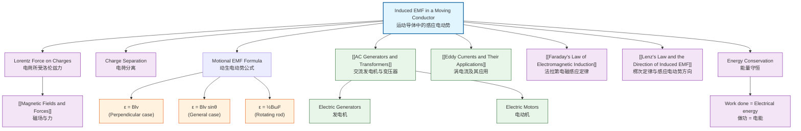

# Induced EMF in a Moving Conductor / 运动导体中的感应电动势

---

# 1. Overview / 概述

**English:**
This sub-topic explores how an electromotive force (EMF) is induced when a conductor moves through a magnetic field. This is a fundamental mechanism of electromagnetic induction, distinct from the case where the magnetic field itself changes. The key principle is that when a conductor cuts magnetic field lines, charges within the conductor experience a magnetic force (Lorentz force), leading to charge separation and an induced EMF. This concept is essential for understanding generators, motors, and many practical devices. It builds directly on [[Magnetic Fields and Forces]] and is a specific application of [[Faraday's Law of Electromagnetic Induction]].

**中文:**
本子知识点探讨当导体在磁场中运动时如何产生感应电动势。这是电磁感应的基本机制，与磁场本身变化的情况不同。关键原理是：当导体切割磁感线时，导体内的电荷会受到磁力（洛伦兹力），导致电荷分离并产生感应电动势。这个概念对于理解发电机、电动机和许多实际设备至关重要。它直接建立在[[Magnetic Fields and Forces]]的基础上，是[[Faraday's Law of Electromagnetic Induction]]的具体应用。

---

# 2. Syllabus Learning Objectives / 考纲学习目标

| CAIE 9702 (20.3 a-g) | Edexcel IAL (WPH14 U4: 3.10-3.15) |
|-----------|-------------|
| Define magnetic flux and flux linkage | Explain how an EMF is induced in a conductor moving in a magnetic field |
| Recall and use Faraday's law for a moving conductor | Use the equation $\varepsilon = Blv$ for a straight conductor |
| Derive $\varepsilon = Blv$ from first principles | Apply Lenz's law to determine direction of induced EMF |
| Apply Lenz's law to a moving conductor | Describe the energy transfer in electromagnetic induction |
| Solve problems involving induced EMF in moving conductors | Solve problems involving induced EMF in moving conductors |

**Examiner Expectations / 考官期望:**
- **English:** Students must be able to derive $\varepsilon = Blv$ from the Lorentz force on charges in a moving conductor. They must understand that the induced EMF depends on the component of velocity perpendicular to both the magnetic field and the conductor. Common exam questions involve calculating induced EMF, current, and force on a conductor moving through a uniform magnetic field.
- **中文:** 学生必须能够从运动导体中电荷所受的洛伦兹力推导出 $\varepsilon = Blv$。他们必须理解感应电动势取决于垂直于磁场和导体两者的速度分量。常见的考试题目涉及计算在均匀磁场中运动的导体上的感应电动势、电流和力。

---

# 3. Core Definitions / 核心定义

| Term (EN/CN) | Definition (EN) | Definition (CN) | Common Mistakes / 常见错误 |
|--------------|-----------------|-----------------|---------------------------|
| **Induced EMF** / 感应电动势 | The potential difference generated across a conductor when it moves through a magnetic field, due to the separation of charges by the Lorentz force. | 当导体在磁场中运动时，由于洛伦兹力导致电荷分离而在导体两端产生的电势差。 | Confusing EMF with current; EMF is the cause, current is the effect. |
| **Motional EMF** / 动生电动势 | The EMF induced in a conductor due to its motion through a magnetic field, given by $\varepsilon = Blv$ for a straight conductor. | 导体因在磁场中运动而产生的电动势，对于直导体由 $\varepsilon = Blv$ 给出。 | Forgetting that $v$ must be perpendicular to both $B$ and $l$. |
| **Lorentz Force** / 洛伦兹力 | The force experienced by a charged particle moving in a magnetic field, given by $F = qvB\sin\theta$. | 带电粒子在磁场中运动时所受的力，由 $F = qvB\sin\theta$ 给出。 | Applying to stationary charges; only moving charges experience magnetic force. |
| **Cutting Flux** / 切割磁感线 | The process where a conductor moves across magnetic field lines, causing a change in magnetic flux linkage. | 导体横切磁感线的过程，导致磁通链发生变化。 | Thinking the conductor must be moving perpendicular to the field; any component perpendicular to the field contributes. |
| **Eddy Current** / 涡电流 | Circulating currents induced in a bulk conductor when it moves through a magnetic field. | 当块状导体在磁场中运动时，在其中感应出的环流。 | Confusing with induced current in a wire; eddy currents are in bulk materials. |

---

# 4. Key Concepts Explained / 关键概念详解

## 4.1 The Origin of Motional EMF / 动生电动势的起源

### Explanation / 解释
**English:**
Consider a straight conductor of length $l$ moving with velocity $v$ perpendicular to a uniform magnetic field $B$. Inside the conductor, there are free electrons (charge $q = -e$). As the conductor moves, these electrons also move with velocity $v$ through the magnetic field. According to the Lorentz force law, each electron experiences a force:

$$F = qvB = evB$$

This force acts perpendicular to both $v$ and $B$, pushing electrons to one end of the conductor. This charge separation creates an electric field $E$ inside the conductor, which exerts an opposing force $F_E = eE$ on the electrons. Equilibrium is reached when the magnetic and electric forces balance:

$$eE = evB \implies E = vB$$

The potential difference (EMF) across the conductor of length $l$ is then:

$$\varepsilon = El = Blv$$

This is the **motional EMF**. The direction of the induced EMF can be determined using [[Lenz's Law and the Direction of Induced EMF]] or Fleming's right-hand rule.

**中文:**
考虑一根长度为 $l$ 的直导体，以速度 $v$ 垂直于均匀磁场 $B$ 运动。在导体内部，存在自由电子（电荷 $q = -e$）。当导体运动时，这些电子也以速度 $v$ 穿过磁场。根据洛伦兹力定律，每个电子受到的力为：

$$F = qvB = evB$$

这个力垂直于 $v$ 和 $B$ 两者，将电子推向导体的一端。这种电荷分离在导体内部产生电场 $E$，对电子施加相反的力 $F_E = eE$。当磁力和电力平衡时达到平衡：

$$eE = evB \implies E = vB$$

长度为 $l$ 的导体两端的电势差（电动势）为：

$$\varepsilon = El = Blv$$

这就是**动生电动势**。感应电动势的方向可以用[[Lenz's Law and the Direction of Induced EMF]]或弗莱明右手定则来确定。

### Physical Meaning / 物理意义
**English:** The motional EMF represents the work done per unit charge by the magnetic force in separating charges. It is a direct consequence of the Lorentz force on moving charges in a magnetic field. The energy for this EMF comes from the kinetic energy of the moving conductor (or the work done to move it).

**中文:** 动生电动势表示磁力在分离电荷时每单位电荷所做的功。它是磁场中运动电荷所受洛伦兹力的直接结果。这个电动势的能量来自运动导体的动能（或移动它所做功）。

### Common Misconceptions / 常见误区
- **English:**
  - Thinking the magnetic field does work on the charges (it doesn't; the Lorentz force is always perpendicular to velocity, so it does no work)
  - Confusing motional EMF with transformer EMF (motional EMF is due to conductor motion, transformer EMF is due to changing magnetic field)
  - Forgetting that only the component of velocity perpendicular to both $B$ and $l$ contributes
- **中文:**
  - 认为磁场对电荷做功（实际上不做功；洛伦兹力始终垂直于速度，因此不做功）
  - 混淆动生电动势和变压器电动势（动生电动势由导体运动引起，变压器电动势由变化的磁场引起）
  - 忘记只有垂直于 $B$ 和 $l$ 两者的速度分量才起作用

### Exam Tips / 考试提示
- **English:** Always draw a diagram showing the conductor, magnetic field direction, velocity direction, and the direction of induced EMF/current. Use Fleming's right-hand rule for generator action. Remember that $\varepsilon = Blv$ applies only when $B$, $l$, and $v$ are mutually perpendicular.
- **中文:** 始终画出显示导体、磁场方向、速度方向以及感应电动势/电流方向的示意图。对于发电机作用，使用弗莱明右手定则。记住 $\varepsilon = Blv$ 仅适用于 $B$、$l$ 和 $v$ 相互垂直的情况。

> 📷 **IMAGE PROMPT — DIAG-01: Origin of Motional EMF**
> A clear diagram showing a straight conductor of length l moving with velocity v perpendicular to a uniform magnetic field B (directed into the page, shown as crosses). Free electrons inside the conductor are shown being pushed to one end by the Lorentz force, creating charge separation. The induced EMF is labeled across the ends of the conductor. Include coordinate axes and labels for B, v, l, F, and ε.

---

## 4.2 The General Formula for Motional EMF / 动生电动势的通用公式

### Explanation / 解释
**English:**
The simple formula $\varepsilon = Blv$ assumes that $B$, $l$, and $v$ are mutually perpendicular. In general, the induced EMF depends on the component of velocity perpendicular to both the magnetic field and the conductor. If the conductor makes an angle $\theta$ with the magnetic field, or if the velocity is at an angle, we use:

$$\varepsilon = Blv\sin\theta$$

where $\theta$ is the angle between the velocity vector and the magnetic field direction. More precisely, if the conductor moves at an angle $\phi$ to the normal of the magnetic field, the effective velocity component is $v\sin\phi$.

For a rotating conductor (e.g., a rod rotating in a magnetic field), the velocity varies along the length, and we must integrate:

$$\varepsilon = \int_0^l B v(x) \, dx$$

For a rod rotating with angular velocity $\omega$ about one end, $v(x) = \omega x$, giving:

$$\varepsilon = \frac{1}{2}B\omega l^2$$

**中文:**
简单公式 $\varepsilon = Blv$ 假设 $B$、$l$ 和 $v$ 相互垂直。一般情况下，感应电动势取决于垂直于磁场和导体两者的速度分量。如果导体与磁场成 $\theta$ 角，或者速度成一定角度，我们使用：

$$\varepsilon = Blv\sin\theta$$

其中 $\theta$ 是速度矢量与磁场方向之间的夹角。更精确地说，如果导体以与磁场法线成 $\phi$ 角运动，有效速度分量为 $v\sin\phi$。

对于旋转导体（例如，在磁场中旋转的杆），速度沿长度变化，我们必须积分：

$$\varepsilon = \int_0^l B v(x) \, dx$$

对于绕一端以角速度 $\omega$ 旋转的杆，$v(x) = \omega x$，得到：

$$\varepsilon = \frac{1}{2}B\omega l^2$$

### Common Misconceptions / 常见误区
- **English:**
  - Using the full velocity when only the perpendicular component contributes
  - Forgetting that the conductor length $l$ must be perpendicular to both $B$ and $v$
  - Applying $\varepsilon = Blv$ to rotating conductors without integration
- **中文:**
  - 使用完整速度而只有垂直分量起作用
  - 忘记导体长度 $l$ 必须垂直于 $B$ 和 $v$ 两者
  - 对旋转导体应用 $\varepsilon = Blv$ 而不进行积分

### Exam Tips / 考试提示
- **English:** When dealing with non-perpendicular cases, resolve the velocity into components parallel and perpendicular to the magnetic field. Only the perpendicular component contributes to the induced EMF. For rotating conductors, remember that different parts of the conductor move at different speeds.
- **中文:** 处理非垂直情况时，将速度分解为平行于和垂直于磁场的分量。只有垂直分量对感应电动势有贡献。对于旋转导体，记住导体的不同部分以不同速度运动。

---

# 5. Essential Equations / 核心公式

## 5.1 Motional EMF for a Straight Conductor / 直导体的动生电动势

$$ \varepsilon = Blv $$

| Symbol (符号) | Meaning (EN) | Meaning (CN) | Unit (单位) |
|--------------|-------------|-------------|------------|
| $\varepsilon$ | Induced EMF | 感应电动势 | V (伏特) |
| $B$ | Magnetic flux density | 磁通密度 | T (特斯拉) |
| $l$ | Length of conductor in magnetic field | 导体在磁场中的长度 | m (米) |
| $v$ | Velocity of conductor perpendicular to $B$ and $l$ | 导体垂直于 $B$ 和 $l$ 的速度 | m s$^{-1}$ (米/秒) |

**Derivation / 推导:**
From Lorentz force: $F = qvB$ (for $v \perp B$)
Electric field inside conductor: $E = F/q = vB$
EMF: $\varepsilon = El = Blv$

**Conditions / 适用条件:**
- **English:** $B$, $l$, and $v$ must be mutually perpendicular. The conductor must be straight and moving through a uniform magnetic field.
- **中文:** $B$、$l$ 和 $v$ 必须相互垂直。导体必须是直的，并且在均匀磁场中运动。

**Limitations / 局限性:**
- **English:** Does not apply when the magnetic field is non-uniform, when the conductor is not straight, or when the velocity is not constant. For rotating conductors, integration is required.
- **中文:** 不适用于磁场不均匀、导体不直或速度不恒定的情况。对于旋转导体，需要积分。

## 5.2 General Motional EMF / 通用动生电动势

$$ \varepsilon = Blv\sin\theta $$

| Symbol (符号) | Meaning (EN) | Meaning (CN) | Unit (单位) |
|--------------|-------------|-------------|------------|
| $\theta$ | Angle between velocity and magnetic field | 速度与磁场之间的夹角 | rad or ° (弧度或度) |

**Conditions / 适用条件:**
- **English:** $l$ is perpendicular to both $B$ and the component of $v$ perpendicular to $B$.
- **中文:** $l$ 垂直于 $B$ 和 $v$ 垂直于 $B$ 的分量。

## 5.3 Motional EMF for a Rotating Rod / 旋转杆的动生电动势

$$ \varepsilon = \frac{1}{2}B\omega l^2 $$

| Symbol (符号) | Meaning (EN) | Meaning (CN) | Unit (单位) |
|--------------|-------------|-------------|------------|
| $\omega$ | Angular velocity of rotation | 旋转角速度 | rad s$^{-1}$ (弧度/秒) |

**Derivation / 推导:**
$v(x) = \omega x$, $\varepsilon = \int_0^l B\omega x \, dx = \frac{1}{2}B\omega l^2$

**Conditions / 适用条件:**
- **English:** Rod rotates about one end in a uniform magnetic field perpendicular to the plane of rotation.
- **中文:** 杆绕一端在垂直于旋转平面的均匀磁场中旋转。

> 📷 **IMAGE PROMPT — EQ-01: Motional EMF Formulas**
> A diagram showing three cases: (1) Straight conductor moving perpendicular to B, with formula ε = Blv; (2) Straight conductor moving at angle θ to B, with formula ε = Blv sinθ; (3) Rotating rod with formula ε = ½Bωl². Each case should show the geometry clearly with labeled angles and dimensions.

---

# 6. Graphs and Relationships / 图表与关系

## 6.1 Induced EMF vs. Velocity / 感应电动势与速度的关系

### Axes / 坐标轴
- **X-axis:** Velocity $v$ (m s$^{-1}$) / 速度 $v$ (米/秒)
- **Y-axis:** Induced EMF $\varepsilon$ (V) / 感应电动势 $\varepsilon$ (伏特)

### Shape / 形状
- **English:** A straight line through the origin with gradient $Bl$.
- **中文:** 一条通过原点的直线，斜率为 $Bl$。

### Gradient Meaning / 斜率含义
- **English:** The gradient $Bl$ represents the product of magnetic flux density and conductor length. For a given conductor and field, this is constant.
- **中文:** 斜率 $Bl$ 表示磁通密度和导体长度的乘积。对于给定的导体和磁场，这是常数。

### Area Meaning / 面积含义
- **English:** No meaningful area under this graph.
- **中文:** 该图下没有有意义的面积。

### Exam Interpretation / 考试解读
- **English:** If asked to sketch this graph, remember it's linear through the origin. The gradient increases with stronger magnetic fields or longer conductors.
- **中文:** 如果要求画出该图，记住它是通过原点的线性关系。斜率随磁场增强或导体变长而增大。

## 6.2 Induced EMF vs. Angle of Motion / 感应电动势与运动角度的关系

### Axes / 坐标轴
- **English:** X-axis: Angle $\theta$ between velocity and magnetic field; Y-axis: Induced EMF $\varepsilon$
- **中文:** X轴：速度与磁场之间的夹角 $\theta$；Y轴：感应电动势 $\varepsilon$

### Shape / 形状
- **English:** A sine wave: $\varepsilon = Blv\sin\theta$. Maximum at $\theta = 90^\circ$, zero at $\theta = 0^\circ$ and $180^\circ$.
- **中文:** 正弦波：$\varepsilon = Blv\sin\theta$。在 $\theta = 90^\circ$ 时最大，在 $\theta = 0^\circ$ 和 $180^\circ$ 时为零。

### Gradient Meaning / 斜率含义
- **English:** The gradient represents the rate of change of EMF with angle, which is $Blv\cos\theta$.
- **中文:** 斜率表示电动势随角度的变化率，为 $Blv\cos\theta$。

### Area Meaning / 面积含义
- **English:** No meaningful area under this graph.
- **中文:** 该图下没有有意义的面积。

### Exam Interpretation / 考试解读
- **English:** This graph is important for understanding AC generators, where the angle changes continuously as the coil rotates.
- **中文:** 该图对于理解交流发电机很重要，其中角度随着线圈旋转而连续变化。

---

# 7. Required Diagrams / 必备图表

## 7.1 Motional EMF in a Moving Conductor / 运动导体中的动生电动势

### Description / 描述
**English:** A diagram showing a straight conductor of length $l$ moving with velocity $v$ through a uniform magnetic field $B$ directed into the page. The induced EMF and current direction are shown using Fleming's right-hand rule. The charge separation (positive at one end, negative at the other) is clearly indicated.

**中文:** 显示长度为 $l$ 的直导体以速度 $v$ 穿过方向指向纸内的均匀磁场 $B$ 的示意图。使用弗莱明右手定则显示感应电动势和电流方向。电荷分离（一端为正，另一端为负）被清晰标示。

### Image Prompt / 图片生成提示
> 📷 **IMAGE PROMPT — DIAG-02: Motional EMF in a Moving Conductor**
> A physics diagram showing a horizontal straight conductor of length l moving to the right with velocity v through a uniform magnetic field B directed into the page (shown as crosses). The conductor is shown as a thick line. Free electrons inside are shown being pushed to the left end by the Lorentz force (F = qvB), creating a negative charge at the left end and positive charge at the right end. The induced EMF ε is labeled across the ends. Fleming's right-hand rule is illustrated with thumb (motion), first finger (field), and second finger (current/EMF). Include labels: B (crosses), v (arrow right), l, F, ε, + and - signs.

### Labels Required / 需要标注
- **English:** Magnetic field $B$ (into page), velocity $v$, conductor length $l$, induced EMF $\varepsilon$, positive and negative charges, Lorentz force direction
- **中文:** 磁场 $B$（指向纸内）、速度 $v$、导体长度 $l$、感应电动势 $\varepsilon$、正负电荷、洛伦兹力方向

### Exam Importance / 考试重要性
- **English:** This is the most fundamental diagram for this sub-topic. Students must be able to draw it from memory and use it to derive the formula $\varepsilon = Blv$.
- **中文:** 这是本子知识点最基本的图表。学生必须能够凭记忆画出它，并用它来推导公式 $\varepsilon = Blv$。

## 7.2 Rotating Rod in a Magnetic Field / 磁场中的旋转杆

### Description / 描述
**English:** A diagram showing a conducting rod of length $l$ rotating with angular velocity $\omega$ about one end in a uniform magnetic field $B$ perpendicular to the plane of rotation. The varying velocity along the rod is indicated, and the induced EMF between the center and the end is shown.

**中文:** 显示长度为 $l$ 的导电杆以角速度 $\omega$ 绕一端在垂直于旋转平面的均匀磁场 $B$ 中旋转的示意图。沿杆变化的速度被标示，中心和末端之间的感应电动势被显示。

### Image Prompt / 图片生成提示
> 📷 **IMAGE PROMPT — DIAG-03: Rotating Rod in Magnetic Field**
> A physics diagram showing a conducting rod of length l rotating clockwise with angular velocity ω about a pivot at one end. The magnetic field B is directed out of the page (shown as dots). The rod is shown at an angle, with velocity vectors v(x) = ωx shown at several points along the rod, increasing in length from the pivot to the free end. The induced EMF ε = ½Bωl² is labeled between the pivot and the free end. Include labels: B (dots), ω, l, pivot, v(x), ε.

### Labels Required / 需要标注
- **English:** Magnetic field $B$ (out of page), angular velocity $\omega$, rod length $l$, pivot point, velocity vectors $v(x)$, induced EMF $\varepsilon$
- **中文:** 磁场 $B$（指向纸外）、角速度 $\omega$、杆长度 $l$、支点、速度矢量 $v(x)$、感应电动势 $\varepsilon$

### Exam Importance / 考试重要性
- **English:** This diagram tests understanding of how velocity varies along a rotating conductor and the need for integration. It is a common extension question in exams.
- **中文:** 该图测试对速度如何沿旋转导体变化以及积分需求的理解。这是考试中常见的扩展题。

---

# 8. Worked Examples / 典型例题

## Example 1: Straight Conductor in a Magnetic Field / 磁场中的直导体

### Question / 题目
**English:**
A straight conductor of length 0.25 m moves through a uniform magnetic field of flux density 0.40 T at a constant speed of 15 m s$^{-1}$. The conductor, its velocity, and the magnetic field are mutually perpendicular.
(a) Calculate the induced EMF across the ends of the conductor.
(b) If the conductor is connected to a resistor of 5.0 Ω, calculate the induced current.
(c) Calculate the force required to keep the conductor moving at constant speed.

**中文:**
一根长度为 0.25 m 的直导体以 15 m s$^{-1}$ 的恒定速度穿过磁通密度为 0.40 T 的均匀磁场。导体、其速度和磁场相互垂直。
(a) 计算导体两端的感应电动势。
(b) 如果导体连接到 5.0 Ω 的电阻，计算感应电流。
(c) 计算保持导体以恒定速度运动所需的力。

### Solution / 解答

**(a) Induced EMF / 感应电动势**

$$\varepsilon = Blv = (0.40)(0.25)(15) = 1.5 \text{ V}$$

**(b) Induced Current / 感应电流**

$$I = \frac{\varepsilon}{R} = \frac{1.5}{5.0} = 0.30 \text{ A}$$

**(c) Force Required / 所需力**

When current flows, the conductor experiences a magnetic force opposing its motion (Lenz's law):

$$F = BIl = (0.40)(0.30)(0.25) = 0.030 \text{ N}$$

This force must be overcome to maintain constant speed.

### Final Answer / 最终答案
**Answer:** (a) 1.5 V, (b) 0.30 A, (c) 0.030 N | **答案：** (a) 1.5 V，(b) 0.30 A，(c) 0.030 N

### Quick Tip / 提示
**English:** In part (c), remember that the force required equals the magnetic force on the current-carrying conductor. This is a direct application of energy conservation: the work done to move the conductor equals the electrical energy dissipated in the resistor.

**中文:** 在 (c) 部分，记住所需力等于载流导体所受的磁力。这是能量守恒的直接应用：移动导体所做的功等于电阻中耗散的电能。

---

## Example 2: Rotating Rod / 旋转杆

### Question / 题目
**English:**
A conducting rod of length 0.50 m rotates about one end in a uniform magnetic field of flux density 0.30 T. The magnetic field is perpendicular to the plane of rotation. The rod completes 20 revolutions per second.
(a) Calculate the angular velocity of the rod.
(b) Calculate the induced EMF between the center and the free end of the rod.
(c) State and explain the direction of the induced EMF.

**中文:**
一根长度为 0.50 m 的导电杆绕一端在磁通密度为 0.30 T 的均匀磁场中旋转。磁场垂直于旋转平面。杆每秒完成 20 转。
(a) 计算杆的角速度。
(b) 计算杆中心和自由端之间的感应电动势。
(c) 说明并解释感应电动势的方向。

### Solution / 解答

**(a) Angular Velocity / 角速度**

$$\omega = 2\pi f = 2\pi(20) = 40\pi \approx 126 \text{ rad s}^{-1}$$

**(b) Induced EMF / 感应电动势**

$$\varepsilon = \frac{1}{2}B\omega l^2 = \frac{1}{2}(0.30)(40\pi)(0.50)^2 = \frac{1}{2}(0.30)(40\pi)(0.25)$$

$$\varepsilon = 1.5\pi \approx 4.71 \text{ V}$$

**(c) Direction of Induced EMF / 感应电动势的方向**

**English:** Using Fleming's right-hand rule: thumb in direction of motion, first finger in direction of magnetic field, second finger gives direction of induced EMF. For a rod rotating clockwise, the free end moves faster than the pivot, so electrons are pushed toward the pivot, making the free end positive relative to the pivot.

**中文:** 使用弗莱明右手定则：拇指指向运动方向，食指指向磁场方向，中指指向感应电动势方向。对于顺时针旋转的杆，自由端比支点运动更快，因此电子被推向支点，使自由端相对于支点为正。

### Final Answer / 最终答案
**Answer:** (a) 126 rad s$^{-1}$, (b) 4.71 V | **答案：** (a) 126 rad s$^{-1}$，(b) 4.71 V

### Quick Tip / 提示
**English:** For rotating rods, remember that the velocity varies linearly from zero at the pivot to $\omega l$ at the free end. The average velocity is $\omega l/2$, which gives the same result as integration.

**中文:** 对于旋转杆，记住速度从支点处的零线性变化到自由端处的 $\omega l$。平均速度为 $\omega l/2$，这给出了与积分相同的结果。

---

# 9. Past Paper Question Types / 历年真题题型

| Question Type / 题型 | Frequency / 频率 | Difficulty / 难度 | Past Paper References / 真题索引 |
|----------------------|------------------|------------------|-------------------------------|
| Calculate induced EMF using $\varepsilon = Blv$ | Very High / 非常高 | Easy / 简单 | 📝 *待填入* |
| Derive $\varepsilon = Blv$ from Lorentz force | High / 高 | Medium / 中等 | 📝 *待填入* |
| Calculate force on conductor with current | High / 高 | Medium / 中等 | 📝 *待填入* |
| Rotating rod problems | Medium / 中等 | Hard / 困难 | 📝 *待填入* |
| Energy conservation in moving conductors | Medium / 中等 | Medium / 中等 | 📝 *待填入* |
| Graph interpretation (EMF vs velocity/angle) | Low / 低 | Medium / 中等 | 📝 *待填入* |

**Common Command Words / 常见指令词:**
- **English:** Calculate, derive, explain, state, sketch, determine, show that
- **中文:** 计算、推导、解释、说明、画出、确定、证明

---

# 10. Practical Skills Connections / 实验技能链接

**English:**
This sub-topic connects to practical work in several ways:

1. **Measuring Induced EMF:** Use a search coil (a small coil of wire) connected to a data logger or oscilloscope. Move the coil through a magnetic field at different speeds and measure the induced EMF. Plot $\varepsilon$ vs $v$ to verify the linear relationship.

2. **Investigating Factors Affecting Induced EMF:** Vary the magnetic field strength (using different magnets), the length of conductor in the field, and the speed of motion. Record induced EMF for each combination.

3. **Uncertainties:** When measuring induced EMF, consider uncertainties in velocity measurement (timing and distance), magnetic field strength (using a Hall probe), and conductor length. Use error bars on graphs.

4. **Graph Plotting:** Plot $\varepsilon$ against $v$ — the gradient should be $Bl$. Use this to determine an unknown magnetic field strength or conductor length.

5. **Experimental Design:** Design an experiment to demonstrate motional EMF using a conducting rod, rails, and a sensitive voltmeter. Consider how to maintain constant velocity and minimize friction.

**中文:**
本子知识点通过多种方式与实验工作联系：

1. **测量感应电动势：** 使用连接到数据记录器或示波器的探测线圈（小线圈）。以不同速度将线圈穿过磁场并测量感应电动势。绘制 $\varepsilon$ 与 $v$ 的关系图以验证线性关系。

2. **研究影响感应电动势的因素：** 改变磁场强度（使用不同磁铁）、导体在磁场中的长度和运动速度。记录每种组合的感应电动势。

3. **不确定度：** 测量感应电动势时，考虑速度测量（计时和距离）、磁场强度（使用霍尔探头）和导体长度的不确定度。在图表上使用误差棒。

4. **图表绘制：** 绘制 $\varepsilon$ 与 $v$ 的关系图——斜率应为 $Bl$。使用它来确定未知的磁场强度或导体长度。

5. **实验设计：** 设计一个使用导电杆、导轨和灵敏电压表演示动生电动势的实验。考虑如何保持恒定速度和最小化摩擦。

---

# 11. Concept Map / 概念图谱

---

# 12. Quick Revision Sheet / 速查表

| Category / 类别 | Key Points / 要点 |
|----------------|------------------|
| **Definition / 定义** | Motional EMF is induced when a conductor cuts magnetic field lines. / 当导体切割磁感线时产生动生电动势。 |
| **Key Formula / 核心公式** | $\varepsilon = Blv$ (perpendicular case) / $\varepsilon = Blv\sin\theta$ (general) / $\varepsilon = \frac{1}{2}B\omega l^2$ (rotating rod) |
| **Key Graph / 核心图表** | $\varepsilon$ vs $v$: linear through origin, gradient $Bl$ / $\varepsilon$ 与 $v$：通过原点的直线，斜率 $Bl$ |
| **Direction / 方向** | Use Fleming's right-hand rule or Lenz's law / 使用弗莱明右手定则或楞次定律 |
| **Energy / 能量** | Work done moving conductor = electrical energy dissipated / 移动导体做功 = 耗散的电能 |
| **Common Mistake / 常见错误** | Using full velocity instead of perpendicular component / 使用完整速度而非垂直分量 |
| **Exam Tip / 考试提示** | Always draw diagram showing B, v, l, and induced EMF direction / 始终画出显示 B、v、l 和感应电动势方向的示意图 |
| **Practical / 实验** | Use search coil + data logger to verify $\varepsilon \propto v$ / 使用探测线圈 + 数据记录器验证 $\varepsilon \propto v$ |
| **Prerequisite / 前置知识** | [[Magnetic Fields and Forces]] — Lorentz force on moving charges / [[Magnetic Fields and Forces]] — 运动电荷所受洛伦兹力 |
| **Next Topic / 后续主题** | [[AC Generators and Transformers]] — application of motional EMF / [[AC Generators and Transformers]] — 动生电动势的应用 |

---

> **Parent Hub:** [[Electromagnetic Induction]]
> **Sibling Sub-topics:** [[Magnetic Flux and Flux Linkage]], [[Faraday's Law of Electromagnetic Induction]], [[Lenz's Law and the Direction of Induced EMF]], [[Eddy Currents and Their Applications]]
> **Prerequisites:** [[Magnetic Fields and Forces]]
> **Related Topics:** [[AC Generators and Transformers]]