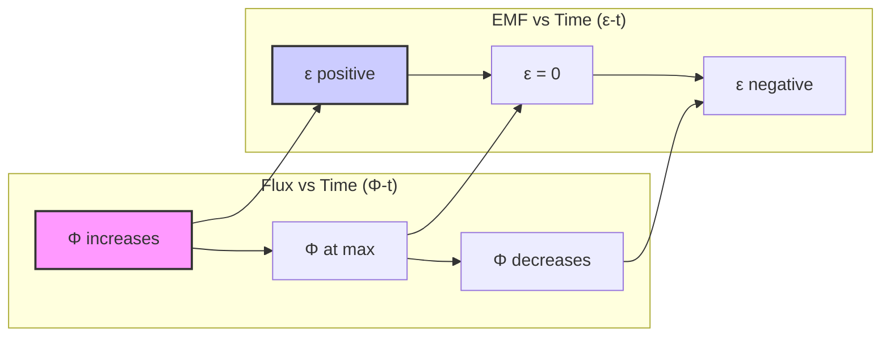
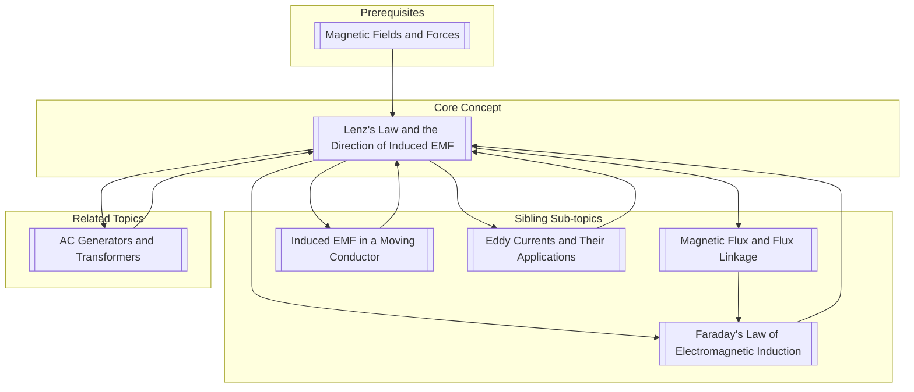

---
# 1. Overview / 概述

**English:**
Lenz’s Law is a fundamental principle in electromagnetism that determines the **direction** of an induced electromotive force (EMF) or current. It is a direct consequence of the conservation of energy. This sub-topic focuses on applying Lenz’s Law to predict the polarity of an induced EMF and the direction of an induced current in various scenarios, such as a magnet moving through a coil or a conductor moving in a magnetic field. Understanding Lenz’s Law is crucial for analyzing [[Electromagnetic Induction]] problems and is the basis for understanding [[AC Generators and Transformers]].

**中文:**
楞次定律是电磁学中的一个基本原理，用于确定感应电动势或感应电流的**方向**。它是能量守恒定律的直接结果。本子知识点专注于应用楞次定律来预测各种场景下感应电动势的极性和感应电流的方向，例如磁铁在线圈中移动或导体在磁场中运动。理解楞次定律对于分析[[电磁感应]]问题至关重要，也是理解[[交流发电机和变压器]]的基础。

---

# 2. Syllabus Learning Objectives / 考纲学习目标

| CAIE 9702 | Edexcel IAL |
|-----------|-------------|
| 20.3(a) Define magnetic flux and the weber. | 3.10 Understand the concept of magnetic flux. |
| 20.3(b) Recall and use $\Phi = BA\cos\theta$. | 3.11 Use $\Phi = BA\cos\theta$. |
| 20.3(c) Recall and use Faraday’s law. | 3.12 Understand and use Faraday’s law. |
| 20.3(d) Explain and use Lenz’s law. | 3.13 Explain and use Lenz’s law. |
| 20.3(e) Explain induced EMF in a moving conductor. | 3.14 Derive and use $\varepsilon = Blv$. |
| 20.3(f) Explain the production of eddy currents. | 3.15 Explain eddy currents. |
| 20.3(g) Explain the principles of an AC generator. | (Covered in AC Generators) |

**Examiner Expectations / 考官期望:**
- **CAIE:** Students must be able to state Lenz’s law and apply it to determine the direction of induced current in a coil or a straight conductor. They must also be able to explain how Lenz’s law is a consequence of the conservation of energy.
- **Edexcel:** Students must be able to use Lenz’s law to determine the direction of induced EMF and current. They should be able to apply it to a variety of situations, including a magnet falling through a coil and a conductor moving in a magnetic field.

---

# 3. Core Definitions / 核心定义

| Term (EN/CN) | Definition (EN) | Definition (CN) | Common Mistakes / 常见错误 |
|--------------|-----------------|-----------------|---------------------------|
| **Lenz’s Law** / 楞次定律 | The direction of the induced EMF is such that it opposes the change in magnetic flux that produces it. | 感应电动势的方向总是阻碍产生它的磁通量变化。 | Confusing "opposes the change" with "opposes the magnetic field". The induced field opposes the *change* in flux, not the field itself. |
| **Induced EMF** / 感应电动势 | The electromotive force generated in a circuit due to a change in magnetic flux. | 由于磁通量变化而在电路中产生的电动势。 | Thinking EMF is a force; it is a potential difference (energy per unit charge). |
| **Induced Current** / 感应电流 | The electric current that flows in a closed circuit as a result of an induced EMF. | 由于感应电动势而在闭合电路中流动的电流。 | Forgetting that a closed circuit is required for current to flow; an open circuit still has an induced EMF. |
| **Opposition** / 阻碍 | The induced current creates a magnetic field that tries to prevent the change in the original magnetic flux. | 感应电流产生一个磁场，试图阻止原始磁通量的变化。 | Thinking the induced field always points opposite to the original field. It only does so when the original flux is *increasing*. |
| **Conservation of Energy** / 能量守恒 | The principle that energy cannot be created or destroyed, only transferred. Lenz’s law ensures that the work done to induce a current is equal to the electrical energy produced. | 能量不能被创造或消灭，只能被转化的原理。楞次定律确保用于感应电流所做的功等于产生的电能。 | Not linking Lenz’s law to energy conservation. If the induced current aided the change, it would create a perpetual motion machine. |

---

# 4. Key Concepts Explained / 关键概念详解

## 4.1 The Principle of Opposition / 阻碍原理

### Explanation / 解释
**English:** Lenz’s law states that the induced EMF always acts to oppose the **change** in magnetic flux. This means:
1.  **If the magnetic flux through a coil is increasing**, the induced current will create a magnetic field that **opposes** this increase (i.e., it points in the opposite direction to the original field).
2.  **If the magnetic flux through a coil is decreasing**, the induced current will create a magnetic field that **supports** this decrease (i.e., it points in the same direction as the original field).

This opposition is not a force against the magnetic field itself, but a force against the *process* that is causing the flux to change. This is a direct consequence of the [[Conservation of Energy]].

**中文:** 楞次定律指出，感应电动势总是阻碍磁通量的**变化**。这意味着：
1.  如果通过线圈的磁通量**增加**，感应电流将产生一个**阻碍**这种增加的磁场（即，它与原始磁场的方向相反）。
2.  如果通过线圈的磁通量**减少**，感应电流将产生一个**支持**这种减少的磁场（即，它与原始磁场的方向相同）。

这种阻碍不是对抗磁场本身的力量，而是对抗导致磁通量变化的*过程*的力量。这是[[能量守恒]]的直接结果。

### Physical Meaning / 物理意义
**English:** The physical meaning is that the induced current tries to "fight" the change that is causing it. For example, if you try to push a north pole of a magnet into a coil, the induced current will turn the coil into a magnet with a north pole facing the incoming magnet, repelling it. You must do work to overcome this repulsion, and that work is converted into electrical energy.

**中文:** 物理意义在于，感应电流试图“对抗”引起它的变化。例如，如果你试图将磁铁的北极推入线圈，感应电流会使线圈变成一个北极朝向磁铁的磁铁，从而排斥它。你必须做功来克服这种排斥力，这些功被转化为电能。

### Common Misconceptions / 常见误区
- **Misconception 1:** The induced field always opposes the original field.
  - **Correction:** It opposes the *change* in flux. If the original field is decreasing, the induced field will be in the *same* direction to try to maintain it.
- **Misconception 2:** Lenz’s law is a separate law from energy conservation.
  - **Correction:** Lenz’s law is a direct consequence of energy conservation. Without it, you could generate energy for free.

### Exam Tips / 考试提示
- **EN:** Always state Lenz’s law in full when answering a question about direction. Use the phrase "opposes the change in magnetic flux."
- **CN:** 在回答关于方向的问题时，务必完整陈述楞次定律。使用短语“阻碍磁通量的变化”。

> 📷 **IMAGE PROMPT — LENZ-01: Lenz's Law - Magnet Entering and Leaving a Coil**
> A diagram showing a bar magnet with its north pole entering a solenoid. The induced current direction is shown, and the resulting magnetic field of the solenoid is drawn. A second diagram shows the magnet being pulled out, with the opposite induced current and field direction. Arrows should clearly indicate the direction of motion, the induced current, and the induced magnetic field. Labels: "N", "S", "Motion", "Induced Current", "Induced Field".

---

# 5. Essential Equations / 核心公式

Lenz’s law is not an equation itself but is incorporated into [[Faraday's Law of Electromagnetic Induction]] with a negative sign.

$$ \varepsilon = -N \frac{\Delta \Phi}{\Delta t} $$

| Symbol (符号) | Meaning (EN) | Meaning (CN) | Unit (单位) |
|--------------|-------------|-------------|------------|
| $\varepsilon$ | Induced EMF | 感应电动势 | V (Volt) |
| $N$ | Number of turns in the coil | 线圈匝数 | - |
| $\Delta \Phi$ | Change in magnetic flux | 磁通量变化量 | Wb (Weber) |
| $\Delta t$ | Time interval for the change | 变化所用的时间间隔 | s (second) |
| **Negative sign (-)** | **Represents Lenz’s law: the induced EMF opposes the change in flux** | **代表楞次定律：感应电动势阻碍磁通量的变化** | - |

**Derivation / 推导:** The negative sign is not derived but is a statement of Lenz’s law. It indicates the direction of the induced EMF.

**Conditions / 适用条件:**
- **EN:** This equation applies to any situation where the magnetic flux through a coil or circuit changes.
- **CN:** 该方程适用于任何通过线圈或电路的磁通量发生变化的情况。

**Limitations / 局限性:**
- **EN:** The equation gives the magnitude of the average induced EMF. The negative sign only gives the direction relative to the change in flux. To find the actual direction of current, you must apply Lenz’s law using the right-hand rule.
- **CN:** 该方程给出平均感应电动势的大小。负号仅给出相对于磁通量变化的方向。要找到电流的实际方向，必须使用右手定则应用楞次定律。

---

# 6. Graphs and Relationships / 图表与关系

## 6.1 Magnetic Flux and Induced EMF vs. Time / 磁通量与感应电动势随时间的变化

### Axes / 坐标轴
- **X-axis:** Time / 时间 (t)
- **Y-axis (Left):** Magnetic Flux / 磁通量 ($\Phi$)
- **Y-axis (Right):** Induced EMF / 感应电动势 ($\varepsilon$)

### Shape / 形状
- **EN:** For a magnet falling through a coil, the flux vs. time graph is a smooth curve that first increases, then decreases. The EMF vs. time graph is the negative derivative of the flux graph. It will show a positive peak as the magnet enters, cross zero when the magnet is at the center, and show a negative peak as the magnet exits.
- **CN:** 对于磁铁穿过线圈的情况，磁通量-时间图是一条先增加后减少的平滑曲线。感应电动势-时间图是磁通量图的负导数。当磁铁进入时，它会显示一个正峰值，当磁铁在中心时穿过零，当磁铁退出时显示一个负峰值。

### Gradient Meaning / 斜率含义
- **EN:** The gradient of the $\Phi$-t graph is $\frac{\Delta \Phi}{\Delta t}$, which is proportional to the induced EMF (ignoring the sign).
- **CN:** $\Phi$-t 图的斜率是 $\frac{\Delta \Phi}{\Delta t}$，它与感应电动势成正比（忽略符号）。

### Area Meaning / 面积含义
- **EN:** The area under the $\varepsilon$-t graph gives the total change in flux linkage ($N\Delta\Phi$).
- **CN:** $\varepsilon$-t 图下的面积给出了磁通链的总变化量 ($N\Delta\Phi$)。

### Exam Interpretation / 考试解读
- **EN:** You must be able to sketch these graphs and explain the shape in terms of Lenz’s law. The sign of the EMF indicates the direction of the induced current.
- **CN:** 你必须能够画出这些图，并根据楞次定律解释其形状。电动势的符号表示感应电流的方向。

---

# 7. Required Diagrams / 必备图表

## 7.1 Magnet Moving into and out of a Solenoid / 磁铁移入和移出螺线管

### Description / 描述
**EN:** A diagram showing a bar magnet being moved into a solenoid. The direction of the induced current in the solenoid must be shown, and the resulting magnetic poles of the solenoid must be labeled. A second diagram shows the magnet being moved out, with the opposite current direction and poles.

**CN:** 一个显示条形磁铁被移入螺线管的图表。必须显示螺线管中感应电流的方向，并且必须标出螺线管产生的磁极。第二个图表显示磁铁被移出，电流方向和磁极相反。

### Image Prompt / 图片生成提示
> 📷 **IMAGE PROMPT — LENZ-02: Lenz's Law - Magnet and Solenoid**
> A clear, educational diagram. Left side: A bar magnet with its North pole entering a solenoid. The solenoid is connected to a galvanometer. Arrows show the induced current flowing in the solenoid. The solenoid's magnetic field is shown, with a North pole at the end facing the incoming magnet. Right side: The same magnet is being pulled out of the solenoid. The induced current is in the opposite direction. The solenoid's magnetic field now has a South pole at the end facing the magnet. Labels: "N", "S", "Motion", "Induced Current", "Galvanometer".

### Labels Required / 需要标注
- **EN:** North (N) and South (S) poles of the magnet and the induced solenoid. Direction of motion. Direction of induced current.
- **CN:** 磁铁和感应螺线管的北极 (N) 和南极 (S)。运动方向。感应电流方向。

### Exam Importance / 考试重要性
- **EN:** This is the most common diagram used to test understanding of Lenz’s law. You must be able to draw it and explain it.
- **CN:** 这是测试对楞次定律理解的最常见图表。你必须能够画出并解释它。

---

# 8. Worked Examples / 典型例题

## Example 1: Determining Current Direction / 确定电流方向

### Question / 题目
**English:** A bar magnet is dropped through a horizontal loop of wire. As the magnet approaches the loop, what is the direction of the induced current in the loop as seen from above? (Assume the magnet falls with its north pole first.)

**中文:** 一个条形磁铁从水平线圈上方落下。当磁铁接近线圈时，从上方看，线圈中感应电流的方向是什么？（假设磁铁北极先落下。）

### Solution / 解答
1.  **Identify the change:** The north pole of the magnet is approaching the loop. The magnetic flux through the loop is increasing downwards.
2.  **Apply Lenz’s law:** The induced current must create a magnetic field that opposes this increase. It must create an upward magnetic field.
3.  **Determine current direction:** To create an upward magnetic field through the loop, the induced current must flow **anticlockwise** (as seen from above). (Use the right-hand grip rule: fingers curl in the direction of current, thumb points in the direction of the field).

### Final Answer / 最终答案
**Answer:** Anticlockwise | **答案：** 逆时针

### Quick Tip / 提示
- **EN:** Always identify the direction of the *change* in flux first. Then, determine what field the induced current must create to oppose that change.
- **CN:** 始终首先确定磁通量*变化*的方向。然后，确定感应电流必须产生什么磁场来阻碍该变化。

---

# 9. Past Paper Question Types / 历年真题题型

| Question Type / 题型 | Frequency / 频率 | Difficulty / 难度 | Past Paper References / 真题索引 |
|----------------------|------------------|------------------|-------------------------------|
| State Lenz’s law and determine direction of induced current in a coil. | Very High | Medium | 📝 *待填入* |
| Explain how Lenz’s law demonstrates conservation of energy. | High | Medium | 📝 *待填入* |
| Sketch and interpret graphs of flux and EMF vs. time. | Medium | High | 📝 *待填入* |
| Determine direction of induced EMF in a moving conductor. | High | Medium | 📝 *待填入* |

**Common Command Words / 常见指令词:**
- **State / 陈述:** Give a clear, concise definition.
- **Explain / 解释:** Give a detailed account of the reasons or causes.
- **Determine / 确定:** Find the value or direction.
- **Sketch / 画出:** Draw a graph or diagram showing the main features.

---

# 10. Practical Skills Connections / 实验技能链接

**English:**
- **Experiment:** The classic experiment involves a bar magnet and a coil connected to a sensitive galvanometer. Students observe the deflection of the galvanometer as the magnet is moved in and out.
- **Measurements:** The magnitude of the induced EMF can be measured with a data logger and voltage sensor.
- **Uncertainties:** Timing the motion of the magnet introduces uncertainty. The position of the magnet relative to the coil is also a source of error.
- **Graph Plotting:** Plotting induced EMF against the speed of the magnet can verify Faraday’s law.
- **Experimental Design:** To test Lenz’s law, one can use a stronger magnet or a coil with more turns to see the effect on the opposition force.

**中文:**
- **实验:** 经典实验涉及条形磁铁和连接到灵敏电流计的线圈。学生观察磁铁移入和移出时电流计的偏转。
- **测量:** 可以使用数据记录器和电压传感器测量感应电动势的大小。
- **不确定度:** 磁铁运动的时间测量会引入不确定度。磁铁相对于线圈的位置也是误差来源。
- **图表绘制:** 绘制感应电动势与磁铁速度的关系图可以验证法拉第定律。
- **实验设计:** 为了测试楞次定律，可以使用更强的磁铁或更多匝数的线圈来观察对阻碍力的影响。

---

# 11. Concept Map / 概念图谱

---

# 12. Quick Revision Sheet / 速查表

| Category / 类别 | Key Points / 要点 |
|----------------|------------------|
| **Definition / 定义** | The induced EMF opposes the **change** in magnetic flux that produces it. / 感应电动势阻碍产生它的磁通量**变化**。 |
| **Key Formula / 核心公式** | $\varepsilon = -N \frac{\Delta \Phi}{\Delta t}$ (The negative sign is Lenz’s law) / 负号代表楞次定律 |
| **Key Graph / 核心图表** | $\Phi$-t graph and $\varepsilon$-t graph for a magnet falling through a coil. / 磁铁穿过线圈的 $\Phi$-t 图和 $\varepsilon$-t 图。 |
| **Exam Tip / 考试提示** | 1. State the law fully. / 完整陈述定律。 2. Identify the *change* in flux. / 确定磁通量的*变化*。 3. Determine the field needed to oppose that change. / 确定阻碍该变化所需的磁场。 4. Use the right-hand rule to find current direction. / 使用右手定则找到电流方向。 |
| **Energy Conservation / 能量守恒** | Work must be done to overcome the opposing force. This work is converted into electrical energy. / 必须做功来克服阻碍力。这些功被转化为电能。 |