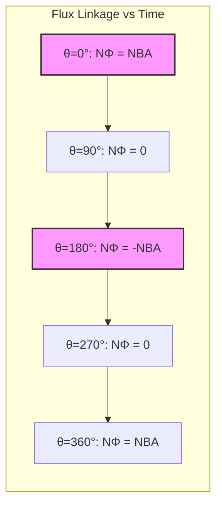
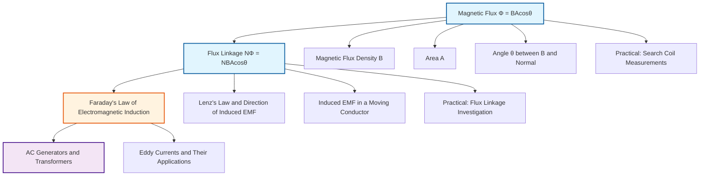

# Magnetic Flux and Flux Linkage / 磁通量与磁通链

---

# 1. Overview / 概述

**English:**
Magnetic flux and flux linkage are foundational concepts in [[Electromagnetic Induction]]. Magnetic flux ($\Phi$) quantifies the total magnetic field passing through a given area, while flux linkage ($N\Phi$) accounts for multiple turns of a coil. These quantities directly determine the induced EMF according to [[Faraday's Law of Electromagnetic Induction]]. Understanding flux and flux linkage is essential for analyzing generators, transformers, and any device involving changing magnetic fields. This sub-topic bridges [[Magnetic Fields and Forces]] with the practical applications of induction.

**中文:**
磁通量和磁通链是[[电磁感应]]的基础概念。磁通量（$\Phi$）量化了穿过给定面积的总磁场，而磁通链（$N\Phi$）则考虑了线圈的多匝数。这些量直接根据[[法拉第电磁感应定律]]决定了感应电动势。理解磁通量和磁通链对于分析发电机、变压器以及任何涉及变化磁场的设备至关重要。本子知识点将[[磁场与力]]与感应的实际应用联系起来。

---

# 2. Syllabus Learning Objectives / 考纲学习目标

| CAIE 9702 (20.3 a-g) | Edexcel IAL (WPH14 U4: 3.10-3.15) |
|----------------------|-----------------------------------|
| Define magnetic flux and the weber | Define magnetic flux and flux linkage |
| Use $\Phi = BA\cos\theta$ | Use $\Phi = BA\cos\theta$ and $N\Phi = NBA\cos\theta$ |
| Define flux linkage | Explain factors affecting flux linkage |
| Use $N\Phi = NBA\cos\theta$ | Relate flux linkage to induced EMF |
| Explain how flux linkage changes with motion | Calculate flux linkage for coils in uniform fields |
| Relate flux linkage to induced EMF | Interpret graphs of flux linkage vs. time |
| Solve problems involving flux and flux linkage | Solve problems with rotating coils |

**Examiner Expectations / 考官期望:**
- **English:** Students must be able to calculate flux and flux linkage for any orientation of a coil in a uniform magnetic field. The cosine relationship ($\cos\theta$) is critical — many students incorrectly use $\sin\theta$. For Edexcel, emphasis is on interpreting how flux linkage changes during rotation.
- **中文:** 学生必须能够计算均匀磁场中任意方向线圈的磁通量和磁通链。余弦关系（$\cos\theta$）至关重要——许多学生错误地使用$\sin\theta$。对于Edexcel，重点在于解释旋转过程中磁通链如何变化。

---

# 3. Core Definitions / 核心定义

| Term (EN/CN) | Definition (EN) | Definition (CN) | Common Mistakes / 常见错误 |
|--------------|-----------------|-----------------|---------------------------|
| **Magnetic Flux** $\Phi$ / 磁通量 | The product of the magnetic flux density $B$ and the area $A$ perpendicular to the field: $\Phi = BA\cos\theta$ | 磁通量是磁通密度$B$与垂直于磁场的面积$A$的乘积：$\Phi = BA\cos\theta$ | Confusing $\cos\theta$ with $\sin\theta$; forgetting that $\theta$ is the angle between $B$ and the normal to the area |
| **Weber (Wb)** / 韦伯 | The SI unit of magnetic flux: 1 Wb = 1 T·m² | 磁通量的SI单位：1 Wb = 1 T·m² | Thinking Wb is a base unit (it's derived) |
| **Flux Linkage** $N\Phi$ / 磁通链 | The product of the number of turns $N$ and the magnetic flux $\Phi$ through one turn: $N\Phi = NBA\cos\theta$ | 匝数$N$与穿过一匝的磁通量$\Phi$的乘积：$N\Phi = NBA\cos\theta$ | Forgetting to multiply by $N$; using $N$ only in EMF calculations |
| **Normal to the Area** / 面积法线 | An imaginary line perpendicular to the plane of the area | 垂直于面积平面的假想线 | Not identifying the correct angle between $B$ and the normal |
| **Uniform Magnetic Field** / 均匀磁场 | A magnetic field with constant magnitude and direction throughout a region | 在整个区域内大小和方向恒定的磁场 | Assuming all fields are uniform; not checking conditions |

---

# 4. Key Concepts Explained / 关键概念详解

## 4.1 Magnetic Flux / 磁通量

### Explanation / 解释
**English:**
Magnetic flux $\Phi$ represents the "flow" of magnetic field through a surface. For a uniform magnetic field $B$ passing through a flat area $A$:
- When the field is perpendicular to the area ($\theta = 0^\circ$): $\Phi = BA$ (maximum)
- When the field is parallel to the area ($\theta = 90^\circ$): $\Phi = 0$ (minimum)
- For any angle: $\Phi = BA\cos\theta$, where $\theta$ is the angle between $B$ and the [[normal to the area]]

Think of it like sunlight through a window: maximum light enters when the sun is directly overhead (perpendicular), and no light enters when the sun is at the horizon (parallel).

**中文:**
磁通量$\Phi$表示磁场通过一个表面的"流量"。对于穿过平坦面积$A$的均匀磁场$B$：
- 当磁场垂直于面积时（$\theta = 0^\circ$）：$\Phi = BA$（最大）
- 当磁场平行于面积时（$\theta = 90^\circ$）：$\Phi = 0$（最小）
- 对于任意角度：$\Phi = BA\cos\theta$，其中$\theta$是$B$与[[面积法线]]之间的夹角

可以想象成阳光透过窗户：当太阳在正上方（垂直）时，进入的光线最多；当太阳在地平线上（平行）时，没有光线进入。

### Physical Meaning / 物理意义
**English:**
Magnetic flux is a measure of how many magnetic field lines pass through a given area. More field lines = larger flux. The weber (Wb) is defined such that 1 Wb = 1 T·m², meaning one tesla of magnetic field passing perpendicularly through one square meter.

**中文:**
磁通量是衡量有多少磁感线穿过给定面积的量。磁感线越多 = 磁通量越大。韦伯（Wb）定义为1 Wb = 1 T·m²，即一特斯拉的磁场垂直穿过一平方米的面积。

### Common Misconceptions / 常见误区
- **English:**
  - ❌ "Flux depends on the magnetic field strength only" — It also depends on area and orientation.
  - ❌ "$\theta$ is the angle between $B$ and the plane of the area" — $\theta$ is between $B$ and the normal to the area.
  - ❌ "Flux is a vector" — Flux is a scalar quantity (it can be positive or negative, but has no direction).
- **中文:**
  - ❌ "磁通量只取决于磁场强度" — 它还取决于面积和方向。
  - ❌ "$\theta$是$B$与面积平面之间的夹角" — $\theta$是$B$与面积法线之间的夹角。
  - ❌ "磁通量是矢量" — 磁通量是标量（可正可负，但没有方向）。

### Exam Tips / 考试提示
- **English:** Always draw a diagram showing $B$, the area, and the normal. Label $\theta$ clearly. Check if the field is uniform — if not, you may need integration.
- **中文:** 始终画出显示$B$、面积和法线的示意图。清晰标注$\theta$。检查磁场是否均匀——如果不是，可能需要积分。

> 📷 **IMAGE PROMPT — FLX-01: Magnetic Flux Through a Rectangular Coil**
> A 3D diagram showing a rectangular coil of area A in a uniform magnetic field B (represented by parallel arrows). A dashed line shows the normal to the coil's plane. The angle θ between B and the normal is clearly marked. Three cases shown: θ=0° (maximum flux), θ=45°, θ=90° (zero flux). Labels: B, A, normal, θ, Φ=BAcosθ.

## 4.2 Flux Linkage / 磁通链

### Explanation / 解释
**English:**
Flux linkage $N\Phi$ extends the concept of flux to coils with multiple turns. If a coil has $N$ turns, each turn experiences the same flux $\Phi$, so the total "linkage" is $N\Phi = NBA\cos\theta$.

This is crucial because [[Faraday's Law of Electromagnetic Induction]] states that induced EMF depends on the rate of change of flux linkage, not just flux:
$$\mathcal{E} = -\frac{d(N\Phi)}{dt}$$

**中文:**
磁通链$N\Phi$将磁通量的概念扩展到多匝线圈。如果线圈有$N$匝，每匝都经历相同的磁通量$\Phi$，因此总"链"为$N\Phi = NBA\cos\theta$。

这一点至关重要，因为[[法拉第电磁感应定律]]指出感应电动势取决于磁通链的变化率，而不仅仅是磁通量：
$$\mathcal{E} = -\frac{d(N\Phi)}{dt}$$

### Physical Meaning / 物理意义
**English:**
Flux linkage represents the total magnetic coupling between the magnetic field and the coil. A coil with more turns "links" more flux, making it more sensitive to changes in the magnetic field. This is why transformers use coils with many turns.

**中文:**
磁通链表示磁场与线圈之间的总磁耦合。匝数越多的线圈"链接"的磁通量越多，使其对磁场变化更敏感。这就是为什么变压器使用多匝线圈。

### Common Misconceptions / 常见误区
- **English:**
  - ❌ "Flux linkage is the same as flux" — Flux linkage = $N \times$ flux.
  - ❌ "Adding more turns always increases induced EMF" — Only if the flux through each turn is the same; in some configurations, additional turns may experience different flux.
- **中文:**
  - ❌ "磁通链与磁通量相同" — 磁通链 = $N \times$ 磁通量。
  - ❌ "增加匝数总是增加感应电动势" — 只有当每匝的磁通量相同时才成立；在某些配置中，额外的匝可能经历不同的磁通量。

### Exam Tips / 考试提示
- **English:** For rotating coils, remember that flux linkage varies sinusoidally: $N\Phi = NBA\cos(\omega t)$ if the coil rotates with angular speed $\omega$.
- **中文:** 对于旋转线圈，记住磁通链呈正弦变化：如果线圈以角速度$\omega$旋转，则$N\Phi = NBA\cos(\omega t)$。

---

# 5. Essential Equations / 核心公式

## Equation 1: Magnetic Flux / 磁通量公式

$$ \Phi = BA\cos\theta $$

| Symbol (符号) | Meaning (EN) | Meaning (CN) | Unit (单位) |
|--------------|-------------|-------------|------------|
| $\Phi$ | Magnetic flux | 磁通量 | Wb (weber) |
| $B$ | Magnetic flux density | 磁通密度 | T (tesla) |
| $A$ | Area perpendicular to field | 垂直于磁场的面积 | m² |
| $\theta$ | Angle between $B$ and normal to area | $B$与面积法线的夹角 | ° or rad |

**Derivation / 推导:**
- When $B$ is perpendicular to $A$: $\Phi = BA$
- For an angle $\theta$, only the component of $B$ perpendicular to $A$ contributes: $B_\perp = B\cos\theta$
- Therefore: $\Phi = B_\perp A = BA\cos\theta$

**Conditions / 适用条件:**
- **English:** Uniform magnetic field; flat surface; $B$ constant over $A$.
- **中文:** 均匀磁场；平坦表面；$B$在$A$上恒定。

**Limitations / 局限性:**
- **English:** Does not apply to non-uniform fields without integration ($\Phi = \int B \cdot dA$). Does not account for magnetic materials that concentrate flux.
- **中文:** 不适用于非均匀磁场（需积分$\Phi = \int B \cdot dA$）。不考虑会集中磁通的磁性材料。

## Equation 2: Flux Linkage / 磁通链公式

$$ N\Phi = NBA\cos\theta $$

| Symbol (符号) | Meaning (EN) | Meaning (CN) | Unit (单位) |
|--------------|-------------|-------------|------------|
| $N\Phi$ | Flux linkage | 磁通链 | Wb (weber) |
| $N$ | Number of turns | 匝数 | dimensionless |
| $B$ | Magnetic flux density | 磁通密度 | T |
| $A$ | Area of one turn | 一匝的面积 | m² |
| $\theta$ | Angle between $B$ and normal | $B$与法线的夹角 | ° or rad |

**Derivation / 推导:**
- Each turn has flux $\Phi = BA\cos\theta$
- With $N$ identical turns: $N\Phi = N \times \Phi = NBA\cos\theta$

**Conditions / 适用条件:**
- **English:** All turns have same area and orientation; uniform field.
- **中文:** 所有匝具有相同的面积和方向；均匀磁场。

**Limitations / 局限性:**
- **English:** Assumes flux through each turn is identical; not valid for loosely wound coils where turns experience different fields.
- **中文:** 假设每匝的磁通量相同；对于松散绕制的线圈（各匝经历不同磁场）不成立。

> 📷 **IMAGE PROMPT — FLX-02: Flux Linkage in a Multi-turn Coil**
> A cross-section diagram showing a coil with 5 turns in a uniform magnetic field. Each turn is shown with the same area A. Arrows show magnetic field lines passing through each turn. Labels: N=5 turns, Φ through one turn, NΦ = 5Φ total flux linkage. A callout explains: "Each turn links the same flux Φ."

---

# 6. Graphs and Relationships / 图表与关系

## 6.1 Flux Linkage vs. Angle for a Rotating Coil / 旋转线圈的磁通链与角度关系

### Axes / 坐标轴
- **X-axis:** Angle $\theta$ (degrees or radians) / 角度$\theta$（度或弧度）
- **Y-axis:** Flux linkage $N\Phi$ (Wb) / 磁通链$N\Phi$（Wb）

### Shape / 形状
**English:** Cosine curve: $N\Phi = NBA\cos\theta$. Starts at maximum $NBA$ when $\theta = 0^\circ$, zero at $\theta = 90^\circ$, minimum $-NBA$ at $\theta = 180^\circ$.

**中文:** 余弦曲线：$N\Phi = NBA\cos\theta$。当$\theta = 0^\circ$时从最大值$NBA$开始，$\theta = 90^\circ$时为零，$\theta = 180^\circ$时为最小值$-NBA$。

### Gradient Meaning / 斜率含义
**English:** The gradient $\frac{d(N\Phi)}{d\theta}$ gives the rate of change of flux linkage with angle. This is proportional to the induced EMF when the coil rotates at constant angular speed.

**中文:** 梯度$\frac{d(N\Phi)}{d\theta}$给出了磁通链随角度的变化率。当线圈以恒定角速度旋转时，这与感应电动势成正比。

### Area Meaning / 面积含义
**English:** The area under the $N\Phi$ vs. $\theta$ graph has no direct physical meaning in this context.

**中文:** 在此上下文中，$N\Phi$ vs. $\theta$ 图下的面积没有直接的物理意义。

### Exam Interpretation / 考试解读
- **English:** If the coil rotates at constant angular speed $\omega$, then $\theta = \omega t$, and $N\Phi = NBA\cos(\omega t)$. The induced EMF is $\mathcal{E} = -\frac{d(N\Phi)}{dt} = NBA\omega\sin(\omega t)$.
- **中文:** 如果线圈以恒定角速度$\omega$旋转，则$\theta = \omega t$，且$N\Phi = NBA\cos(\omega t)$。感应电动势为$\mathcal{E} = -\frac{d(N\Phi)}{dt} = NBA\omega\sin(\omega t)$。

---

# 7. Required Diagrams / 必备图表

## 7.1 Flux Through a Coil at Different Orientations / 不同方向线圈的磁通量

### Description / 描述
**English:** A diagram showing a rectangular coil in a uniform magnetic field at three orientations: (a) plane perpendicular to field (maximum flux), (b) plane at 45° to field, (c) plane parallel to field (zero flux). The normal to the coil plane is shown as a dashed arrow.

**中文:** 一个显示矩形线圈在均匀磁场中三种方向的示意图：(a) 平面垂直于磁场（最大磁通量），(b) 平面与磁场成45°，(c) 平面平行于磁场（零磁通量）。线圈平面的法线显示为虚线箭头。

### Image Prompt / 图片生成提示
> 📷 **IMAGE PROMPT — FLX-03: Coil Orientations for Magnetic Flux**
> Three side-view diagrams of a rectangular coil (shown as a thin line) in a uniform magnetic field (parallel horizontal arrows). Case 1: coil vertical, normal horizontal (parallel to B) — Φ=BA. Case 2: coil at 45°, normal at 45° to B — Φ=BAcos45°. Case 3: coil horizontal, normal vertical (perpendicular to B) — Φ=0. Each case shows the normal as a dashed arrow. Labels: B field arrows, normal line, angle θ, Φ value. Clean physics textbook style.

### Labels Required / 需要标注
- **English:** Magnetic field $B$, normal to coil, angle $\theta$, area $A$, flux $\Phi$
- **中文:** 磁场$B$，线圈法线，角度$\theta$，面积$A$，磁通量$\Phi$

### Exam Importance / 考试重要性
- **English:** High — This diagram is frequently tested in both CIE and Edexcel exams. Students must be able to sketch and interpret it.
- **中文:** 高——该图在CIE和Edexcel考试中经常出现。学生必须能够绘制和解读它。

## 7.2 Flux Linkage Variation During Coil Rotation / 线圈旋转过程中的磁通链变化

### Description / 描述
**English:** A graph showing flux linkage $N\Phi$ vs. time $t$ for a coil rotating at constant angular speed in a uniform magnetic field. The curve is a cosine wave. Key points marked: maximum at $t=0$, zero at $t=T/4$, minimum at $t=T/2$, etc.

**中文:** 一个显示在均匀磁场中以恒定角速度旋转的线圈的磁通链$N\Phi$随时间$t$变化的图表。曲线为余弦波。标记关键点：$t=0$时最大，$t=T/4$时为零，$t=T/2$时最小，等等。

### Image Prompt / 图片生成提示
> 📷 **IMAGE PROMPT — FLX-04: Flux Linkage vs Time for Rotating Coil**
> A graph with time t on x-axis (0 to T) and flux linkage NΦ on y-axis. A cosine wave: starts at +NBA at t=0, crosses zero at t=T/4, reaches -NBA at t=T/2, crosses zero at t=3T/4, returns to +NBA at t=T. Key points labeled with angles: 0°, 90°, 180°, 270°, 360°. Below the graph, small coil orientation diagrams at each key angle. Clean graph paper style.

### Labels Required / 需要标注
- **English:** $N\Phi$ (Wb), $t$ (s), $NBA$, $-NBA$, $T$ (period), $\theta = 0^\circ, 90^\circ, 180^\circ, 270^\circ, 360^\circ$
- **中文:** $N\Phi$（Wb），$t$（s），$NBA$，$-NBA$，$T$（周期），$\theta = 0^\circ, 90^\circ, 180^\circ, 270^\circ, 360^\circ$

### Exam Importance / 考试重要性
- **English:** Very High — Essential for understanding AC generation and [[Faraday's Law of Electromagnetic Induction]].
- **中文:** 非常高——对于理解交流发电和[[法拉第电磁感应定律]]至关重要。

---

# 8. Worked Examples / 典型例题

## Example 1: Flux Through a Rectangular Coil / 矩形线圈的磁通量

### Question / 题目
**English:**
A rectangular coil of dimensions 0.05 m × 0.08 m is placed in a uniform magnetic field of flux density 0.40 T. The plane of the coil makes an angle of 30° with the magnetic field lines. Calculate:
(a) The magnetic flux through the coil.
(b) The flux linkage if the coil has 200 turns.

**中文:**
一个尺寸为0.05 m × 0.08 m的矩形线圈放置在磁通密度为0.40 T的均匀磁场中。线圈平面与磁感线成30°角。计算：
(a) 通过线圈的磁通量。
(b) 如果线圈有200匝，磁通链是多少。

### Solution / 解答

**Step 1: Identify known quantities / 确定已知量**
- $B = 0.40$ T
- $A = 0.05 \times 0.08 = 4.0 \times 10^{-3}$ m²
- Angle between plane and field = 30°
- **Critical:** $\theta$ is angle between $B$ and normal to area. If plane is at 30° to field, then normal is at 60° to field.
- $\theta = 90° - 30° = 60°$
- $N = 200$

**Step 2: Calculate flux / 计算磁通量**
$$\Phi = BA\cos\theta$$
$$\Phi = (0.40)(4.0 \times 10^{-3})\cos(60°)$$
$$\Phi = (1.6 \times 10^{-3})(0.5)$$
$$\Phi = 8.0 \times 10^{-4} \text{ Wb}$$

**Step 3: Calculate flux linkage / 计算磁通链**
$$N\Phi = N \times \Phi$$
$$N\Phi = 200 \times 8.0 \times 10^{-4}$$
$$N\Phi = 0.16 \text{ Wb}$$

### Final Answer / 最终答案
**Answer:** (a) $\Phi = 8.0 \times 10^{-4}$ Wb | **答案：** (a) $\Phi = 8.0 \times 10^{-4}$ Wb
**Answer:** (b) $N\Phi = 0.16$ Wb | **答案：** (b) $N\Phi = 0.16$ Wb

### Quick Tip / 提示
**English:** Always identify $\theta$ as the angle between $B$ and the **normal** to the area, not the plane itself. Draw a diagram!
**中文:** 始终将$\theta$识别为$B$与面积**法线**之间的夹角，而不是平面本身。画图！

---

## Example 2: Flux Linkage in a Rotating Coil / 旋转线圈的磁通链

### Question / 题目
**English:**
A circular coil of radius 0.02 m with 50 turns is placed in a uniform magnetic field of 0.30 T. The coil is rotated from $\theta = 0°$ (plane perpendicular to field) to $\theta = 90°$ (plane parallel to field) in 0.25 s. Calculate:
(a) The initial flux linkage.
(b) The final flux linkage.
(c) The average rate of change of flux linkage.

**中文:**
一个半径为0.02 m、50匝的圆形线圈放置在0.30 T的均匀磁场中。线圈在0.25 s内从$\theta = 0°$（平面垂直于磁场）旋转到$\theta = 90°$（平面平行于磁场）。计算：
(a) 初始磁通链。
(b) 最终磁通链。
(c) 磁通链的平均变化率。

### Solution / 解答

**Step 1: Calculate area / 计算面积**
$$A = \pi r^2 = \pi (0.02)^2 = 1.257 \times 10^{-3} \text{ m}^2$$

**Step 2: Initial flux linkage ($\theta = 0°$) / 初始磁通链**
$$N\Phi_i = NBA\cos(0°) = NBA(1)$$
$$N\Phi_i = 50 \times 0.30 \times 1.257 \times 10^{-3}$$
$$N\Phi_i = 1.886 \times 10^{-2} \text{ Wb}$$

**Step 3: Final flux linkage ($\theta = 90°$) / 最终磁通链**
$$N\Phi_f = NBA\cos(90°) = NBA(0)$$
$$N\Phi_f = 0 \text{ Wb}$$

**Step 4: Average rate of change / 平均变化率**
$$\frac{\Delta(N\Phi)}{\Delta t} = \frac{N\Phi_f - N\Phi_i}{\Delta t}$$
$$\frac{\Delta(N\Phi)}{\Delta t} = \frac{0 - 1.886 \times 10^{-2}}{0.25}$$
$$\frac{\Delta(N\Phi)}{\Delta t} = -7.54 \times 10^{-2} \text{ Wb/s}$$

### Final Answer / 最终答案
**Answer:** (a) $N\Phi_i = 1.89 \times 10^{-2}$ Wb | **答案：** (a) $N\Phi_i = 1.89 \times 10^{-2}$ Wb
**Answer:** (b) $N\Phi_f = 0$ Wb | **答案：** (b) $N\Phi_f = 0$ Wb
**Answer:** (c) $-7.54 \times 10^{-2}$ Wb/s | **答案：** (c) $-7.54 \times 10^{-2}$ Wb/s

### Quick Tip / 提示
**English:** The negative sign indicates flux linkage is decreasing. This rate of change is directly related to the induced EMF via [[Faraday's Law of Electromagnetic Induction]].
**中文:** 负号表示磁通链在减小。这个变化率通过[[法拉第电磁感应定律]]与感应电动势直接相关。

---

# 9. Past Paper Question Types / 历年真题题型

| Question Type / 题型 | Frequency / 频率 | Difficulty / 难度 | Past Paper References / 真题索引 |
|----------------------|------------------|------------------|-------------------------------|
| Calculate flux/flux linkage for a coil in a uniform field | Very High | Medium | 📝 *待填入* |
| Interpret graph of flux linkage vs. time for rotating coil | High | Medium-Hard | 📝 *待填入* |
| Determine angle between field and coil from flux data | Medium | Medium | 📝 *待填入* |
| Relate flux linkage change to induced EMF | Very High | Hard | 📝 *待填入* |
| Sketch flux linkage vs. angle graph | Medium | Easy-Medium | 📝 *待填入* |

**Common Command Words / 常见指令词:**
- **English:** Calculate, determine, sketch, explain, state, show that
- **中文:** 计算，确定，画出，解释，写出，证明

---

# 10. Practical Skills Connections / 实验技能链接

**English:**
This sub-topic connects to practical work in several ways:

1. **Measuring Magnetic Flux Density:** Use a search coil connected to a data logger to measure $B$ by rotating the coil and recording induced EMF. The flux linkage change allows calculation of $B$.

2. **Investigating Flux Linkage:** Vary the angle of a coil in a uniform field and measure induced EMF to verify $\Phi = BA\cos\theta$.

3. **Uncertainties:** When calculating flux, uncertainties in $B$ (from Hall probe), $A$ (from ruler measurements), and $\theta$ (from protractor) must be combined. The $\cos\theta$ term introduces non-linear uncertainty propagation.

4. **Graph Plotting:** Plot $N\Phi$ vs. $\cos\theta$ to obtain a straight line with gradient $NBA$. This verifies the relationship experimentally.

**中文:**
本子知识点通过以下几种方式与实验工作联系：

1. **测量磁通密度：** 使用连接到数据记录器的探测线圈，通过旋转线圈并记录感应电动势来测量$B$。磁通链的变化允许计算$B$。

2. **研究磁通链：** 改变线圈在均匀磁场中的角度并测量感应电动势，以验证$\Phi = BA\cos\theta$。

3. **不确定度：** 计算磁通量时，必须组合$B$（来自霍尔探头）、$A$（来自尺子测量）和$\theta$（来自量角器）的不确定度。$\cos\theta$项引入了非线性不确定度传播。

4. **图表绘制：** 绘制$N\Phi$ vs. $\cos\theta$以获得斜率为$NBA$的直线。这从实验上验证了该关系。

---

# 11. Concept Map / 概念图谱

---

# 12. Quick Revision Sheet / 速查表

| Category / 类别 | Key Points / 要点 |
|----------------|------------------|
| **Definition / 定义** | Magnetic flux $\Phi$ = total field through area. Flux linkage $N\Phi$ = total for multi-turn coil. / 磁通量$\Phi$ = 通过面积的总磁场。磁通链$N\Phi$ = 多匝线圈的总和。 |
| **Key Formula / 核心公式** | $\Phi = BA\cos\theta$; $N\Phi = NBA\cos\theta$; $\theta$ is angle between $B$ and normal to area / $\theta$是$B$与面积法线的夹角 |
| **Key Graph / 核心图表** | $N\Phi$ vs. $t$ for rotating coil: cosine wave. Max at $\theta=0°$, zero at $\theta=90°$, min at $\theta=180°$ / 旋转线圈的$N\Phi$ vs. $t$：余弦波。$\theta=0°$时最大，$\theta=90°$时为零，$\theta=180°$时最小 |
| **Units / 单位** | $\Phi$ and $N\Phi$: Wb (weber). 1 Wb = 1 T·m² / $\Phi$和$N\Phi$：Wb（韦伯）。1 Wb = 1 T·m² |
| **Common Mistake / 常见错误** | Using $\sin\theta$ instead of $\cos\theta$; confusing plane angle with normal angle / 使用$\sin\theta$代替$\cos\theta$；混淆平面角与法线角 |
| **Exam Tip / 考试提示** | Always draw diagram showing $B$, area, and normal. Label $\theta$ clearly. / 始终画出显示$B$、面积和法线的图。清晰标注$\theta$。 |
| **Connection / 联系** | Rate of change of $N\Phi$ gives induced EMF ([[Faraday's Law of Electromagnetic Induction]]) / $N\Phi$的变化率给出感应电动势（[[法拉第电磁感应定律]]） |
| **Practical / 实验** | Use search coil + data logger to measure $B$ from induced EMF / 使用探测线圈+数据记录器从感应电动势测量$B$ |

---

> 📋 **CIE Only:** CAIE 9702 specifically requires students to define the weber and understand that 1 Wb = 1 T·m². Questions often ask for the definition of magnetic flux in words.
>
> 📋 **Edexcel Only:** Edexcel IAL places greater emphasis on interpreting graphs of flux linkage against time for rotating coils, and linking this to the sinusoidal output of AC generators.