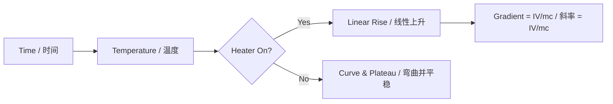

# 1. Overview / 概述

**English:**
This sub-topic focuses on the **practical methods** used to determine the **specific heat capacity (c)** of solids and liquids, and the **specific latent heat (L)** of fusion and vaporisation. It bridges theoretical definitions from [[Specific Heat Capacity]] and [[Latent Heat of Fusion and Vaporisation]] with real-world laboratory techniques. Understanding these experiments is crucial for Paper 3 (CAIE) and Paper 2 (Edexcel) practical assessments, as they test skills in measurement, data collection, graph plotting, error analysis, and experimental design. The core challenge is minimising **heat loss to the surroundings**, which is the dominant source of systematic error in calorimetry experiments.

**中文:**
本子知识点聚焦于测定固体和液体的**比热容 (c)** 以及熔化和汽化的**比潜热 (L)** 的**实验方法**。它将[[比热容]]和[[熔化和汽化的比潜热]]中的理论定义与实际实验技术联系起来。理解这些实验对于 CAIE 的 Paper 3 和 Edexcel 的 Paper 2 实验考试至关重要，因为它们测试了测量、数据收集、绘图、误差分析和实验设计等技能。核心挑战在于最小化**向周围环境的热量损失**，这是量热实验中系统误差的主要来源。

---

# 2. Syllabus Learning Objectives / 考纲学习目标

| CAIE 9702 (10.3 a-g) | Edexcel IAL (WPH11 U1: 5.8-5.12) |
|----------------------|----------------------------------|
| Describe how to measure specific heat capacity of a solid (e.g., metal block) | Describe an experiment to measure specific heat capacity of a solid or liquid |
| Describe how to measure specific heat capacity of a liquid (e.g., electrical method) | Describe an experiment to measure specific latent heat of fusion of ice |
| Describe how to measure specific latent heat of fusion of ice | Describe an experiment to measure specific latent heat of vaporisation of water |
| Describe how to measure specific latent heat of vaporisation of water | Explain how to reduce heat losses in calorimetry experiments |
| Explain how to reduce heat losses in calorimetry experiments | Calculate c and L from experimental data |
| Calculate c and L from experimental data | Evaluate the accuracy of experimental methods |
| Evaluate sources of error and suggest improvements | |

**Examiner Expectations / 考官期望:**
- **English:** You must be able to **describe** the experimental setup in detail (including labelled diagrams), **explain** the steps to reduce heat loss, **calculate** c and L from raw data, and **evaluate** sources of error (systematic and random).
- **中文:** 你必须能够**详细描述**实验装置（包括标注图表），**解释**减少热量损失的步骤，**计算**实验数据中的 c 和 L，并**评估**误差来源（系统误差和随机误差）。

---

# 3. Core Definitions / 核心定义

| Term (EN/CN) | Definition (EN) | Definition (CN) | Common Mistakes / 常见错误 |
|--------------|-----------------|-----------------|---------------------------|
| **Calorimetry** / 量热法 | The measurement of heat transfer during physical or chemical processes. | 测量物理或化学过程中热量传递的方法。 | Confusing calorimetry with thermometry (temperature measurement only). |
| **Electrical Method** / 电热法 | A technique using an electrical heater of known power to supply a measured amount of thermal energy to a substance. | 使用已知功率的电加热器向物质提供可测量热量的技术。 | Forgetting to account for the heat capacity of the container (calorimeter). |
| **Method of Mixtures** / 混合法 | A technique where a hot object is placed into a cold liquid, and the final equilibrium temperature is used to calculate specific heat capacity. | 将热物体放入冷液体中，利用最终平衡温度计算比热容的方法。 | Assuming no heat is lost to the surroundings or absorbed by the container. |
| **Heat Loss / 热量损失** | Thermal energy transferred from the experimental system to the surroundings, leading to systematic errors. | 从实验系统传递到周围环境的热能，导致系统误差。 | Thinking heat loss can be completely eliminated (it can only be reduced). |
| **Lagging / 隔热层** | Insulating material (e.g., polystyrene, cotton wool) wrapped around a calorimeter to reduce heat loss. | 包裹在量热器周围的绝缘材料（如聚苯乙烯、棉花），用于减少热量损失。 | Using metal foil which conducts heat instead of insulating. |
| **Specific Heat Capacity (c)** / 比热容 | The energy required per unit mass to raise the temperature of a substance by 1 K (or 1°C). | 单位质量的物质温度升高 1 K（或 1°C）所需的能量。 | Confusing c with heat capacity C (C = mc). |

---

# 4. Key Concepts Explained / 关键概念详解

## 4.1 Electrical Method for Specific Heat Capacity / 电热法测定比热容

### Explanation / 解释
**English:** The electrical method is the most common and accurate way to determine the specific heat capacity of a solid (e.g., a metal block) or a liquid. An electrical heater of known power $P = IV$ is placed in thermal contact with the substance. The heater is switched on for a measured time $t$, supplying energy $E = Pt = IVt$. The temperature rise $\Delta T$ of the substance is measured using a thermometer. Assuming no heat loss, the energy supplied equals the energy absorbed by the substance: $IVt = mc\Delta T$. Rearranging gives $c = \frac{IVt}{m\Delta T}$. For a liquid, the liquid is placed in a calorimeter (container), and the heat absorbed by the calorimeter must also be accounted for: $IVt = m_l c_l \Delta T + m_c c_c \Delta T$.

**中文:** 电热法是测定固体（如金属块）或液体比热容最常用且最准确的方法。将已知功率 $P = IV$ 的电加热器与物质进行热接触。加热器开启测量时间 $t$，提供能量 $E = Pt = IVt$。用温度计测量物质的温升 $\Delta T$。假设没有热量损失，提供的能量等于物质吸收的能量：$IVt = mc\Delta T$。整理得 $c = \frac{IVt}{m\Delta T}$。对于液体，液体置于量热器（容器）中，还必须考虑量热器吸收的热量：$IVt = m_l c_l \Delta T + m_c c_c \Delta T$。

### Physical Meaning / 物理意义
**English:** The experiment directly measures how much electrical energy is needed to cause a temperature change in a known mass. The ratio $\frac{IVt}{m\Delta T}$ gives the specific heat capacity — a material property that tells us how "thermally sluggish" a substance is.
**中文:** 该实验直接测量引起已知质量物质温度变化所需的电能。比值 $\frac{IVt}{m\Delta T}$ 给出了比热容——一个告诉我们物质“热惰性”程度的材料属性。

### Common Misconceptions / 常见误区
- **English:**
  - Assuming the heater is 100% efficient (some energy is lost as heat to surroundings).
  - Forgetting to include the heat capacity of the calorimeter when measuring liquids.
  - Using the initial temperature of the substance as the starting point for $\Delta T$ without waiting for thermal equilibrium.
- **中文:**
  - 假设加热器 100% 效率（部分能量以热量形式损失到周围环境）。
  - 测量液体时忘记包括量热器的热容。
  - 在未等待热平衡的情况下，使用物质的初始温度作为 $\Delta T$ 的起点。

### Exam Tips / 考试提示
- **English:** Always state that you **stir** the liquid to ensure uniform temperature distribution. For solids, drill a hole for the thermometer and another for the heater, and use **thermal paste** to improve thermal contact.
- **中文:** 务必说明**搅拌**液体以确保温度均匀分布。对于固体，为温度计和加热器钻孔，并使用**导热膏**改善热接触。

> 📷 **IMAGE PROMPT — EXP-01: Electrical Method for Specific Heat Capacity of a Metal Block**
> A labelled diagram showing a metal block (e.g., aluminium or copper) with two drilled holes: one containing an electrical immersion heater connected to an ammeter, voltmeter, and power supply; the other containing a thermometer. The block is wrapped in insulating material (lagging). Arrows indicate energy flow from heater to block.

## 4.2 Method of Mixtures for Specific Heat Capacity / 混合法测定比热容

### Explanation / 解释
**English:** This method is used when an electrical heater is unavailable. A hot object of known mass $m_h$ and unknown specific heat capacity $c_h$ is placed into a calorimeter containing a cold liquid (usually water) of known mass $m_c$ and known specific heat capacity $c_c$. The initial temperatures of the hot object ($T_h$) and cold liquid ($T_c$) are recorded. After thermal equilibrium, the final temperature $T_f$ is measured. Assuming no heat loss: Heat lost by hot object = Heat gained by cold liquid + Heat gained by calorimeter: $m_h c_h (T_h - T_f) = m_c c_c (T_f - T_c) + m_{cal} c_{cal} (T_f - T_c)$. This equation can be solved for $c_h$.

**中文:** 当没有电加热器时使用此方法。将已知质量 $m_h$ 和未知比热容 $c_h$ 的热物体放入装有已知质量 $m_c$ 和已知比热容 $c_c$ 的冷液体（通常是水）的量热器中。记录热物体 ($T_h$) 和冷液体 ($T_c$) 的初始温度。达到热平衡后，测量最终温度 $T_f$。假设没有热量损失：热物体损失的热量 = 冷液体获得的热量 + 量热器获得的热量：$m_h c_h (T_h - T_f) = m_c c_c (T_f - T_c) + m_{cal} c_{cal} (T_f - T_c)$。此方程可解出 $c_h$。

### Physical Meaning / 物理意义
**English:** The method relies on the **principle of conservation of energy** — the thermal energy lost by the hot object is entirely transferred to the cold system (liquid + calorimeter).
**中文:** 该方法依赖于**能量守恒原理**——热物体损失的热能完全转移到冷系统（液体 + 量热器）中。

### Common Misconceptions / 常见误区
- **English:**
  - Forgetting to include the calorimeter's heat capacity.
  - Using the wrong temperature difference (e.g., $T_h - T_c$ instead of $T_h - T_f$).
  - Assuming the specific heat capacity of the calorimeter is the same as the liquid.
- **中文:**
  - 忘记包括量热器的热容。
  - 使用错误的温差（例如 $T_h - T_c$ 而不是 $T_h - T_f$）。
  - 假设量热器的比热容与液体相同。

### Exam Tips / 考试提示
- **English:** The hot object should be transferred **quickly** to minimise heat loss to the air during transfer. The liquid should be **stirred** continuously for uniform temperature.
- **中文:** 热物体应**快速**转移，以尽量减少转移过程中向空气的热量损失。应**持续搅拌**液体以使温度均匀。

## 4.3 Determining Specific Latent Heat of Fusion (Ice) / 测定熔化比潜热（冰）

### Explanation / 解释
**English:** To find the specific latent heat of fusion of ice ($L_f$), dry ice at 0°C is added to a calorimeter containing warm water at a known temperature. The ice melts, absorbing energy from the water and calorimeter. The final temperature $T_f$ is measured after all ice has melted. The energy required to melt the ice is $m_{ice} L_f$, and the energy to warm the resulting meltwater from 0°C to $T_f$ is $m_{ice} c_w T_f$. This energy comes from the water and calorimeter cooling down: $m_w c_w (T_i - T_f) + m_{cal} c_{cal} (T_i - T_f)$. The equation is: $m_{ice} L_f + m_{ice} c_w T_f = m_w c_w (T_i - T_f) + m_{cal} c_{cal} (T_i - T_f)$.

**中文:** 要找到冰的熔化比潜热 ($L_f$)，将 0°C 的干冰加入装有已知温度温水的量热器中。冰融化，从水和量热器中吸收能量。在所有冰融化后测量最终温度 $T_f$。融化冰所需的能量为 $m_{ice} L_f$，将产生的融水从 0°C 加热到 $T_f$ 的能量为 $m_{ice} c_w T_f$。这些能量来自水和量热器的冷却：$m_w c_w (T_i - T_f) + m_{cal} c_{cal} (T_i - T_f)$。方程为：$m_{ice} L_f + m_{ice} c_w T_f = m_w c_w (T_i - T_f) + m_{cal} c_{cal} (T_i - T_f)$。

### Physical Meaning / 物理意义
**English:** The experiment measures the energy required to change the phase of ice from solid to liquid at constant temperature (0°C), plus the energy to warm the resulting water.
**中文:** 该实验测量了在恒定温度 (0°C) 下将冰从固态变为液态所需的能量，加上加热所得水的能量。

### Common Misconceptions / 常见误区
- **English:**
  - Forgetting to include the energy to warm the meltwater from 0°C to $T_f$.
  - Using wet ice (water on the surface adds extra mass that doesn't contribute to phase change).
  - Assuming all ice melts instantly.
- **中文:**
  - 忘记包括将融水从 0°C 加热到 $T_f$ 的能量。
  - 使用湿冰（表面的水增加了不贡献于相变的质量）。
  - 假设所有冰瞬间融化。

### Exam Tips / 考试提示
- **English:** Use **dry ice** (pat dry with a cloth) to avoid water on the surface. Add ice **gently** to avoid splashing. Stir continuously.
- **中文:** 使用**干冰**（用布擦干）以避免表面有水。**轻轻**加入冰以避免溅出。持续搅拌。

> 📷 **IMAGE PROMPT — EXP-02: Determining Specific Latent Heat of Fusion of Ice**
> A labelled diagram showing a calorimeter (polystyrene cup) containing warm water and a thermometer. Small pieces of dry ice are being added. Arrows show energy transfer from water to ice. Labels: "Ice at 0°C", "Water at T_i", "Thermometer", "Calorimeter", "Stirrer".

## 4.4 Determining Specific Latent Heat of Vaporisation (Water) / 测定汽化比潜热（水）

### Explanation / 解释
**English:** To find the specific latent heat of vaporisation of water ($L_v$), an electrical heater is used to boil water in a flask. The steam produced is passed through a **trap** (to remove water droplets) and then into a calorimeter containing cold water. The steam condenses, releasing its latent heat, and the condensed water (now at 100°C) cools to the final temperature $T_f$. The energy released by the steam is: $m_{steam} L_v + m_{steam} c_w (100 - T_f)$. This energy is absorbed by the cold water and calorimeter: $m_w c_w (T_f - T_i) + m_{cal} c_{cal} (T_f - T_i)$. The equation is: $m_{steam} L_v + m_{steam} c_w (100 - T_f) = m_w c_w (T_f - T_i) + m_{cal} c_{cal} (T_f - T_i)$.

**中文:** 要找到水的汽化比潜热 ($L_v$)，使用电加热器在烧瓶中烧水。产生的蒸汽通过一个**捕集器**（去除水滴），然后进入装有冷水的量热器。蒸汽冷凝，释放其潜热，冷凝水（现在为 100°C）冷却到最终温度 $T_f$。蒸汽释放的能量为：$m_{steam} L_v + m_{steam} c_w (100 - T_f)$。这些能量被冷水和量热器吸收：$m_w c_w (T_f - T_i) + m_{cal} c_{cal} (T_f - T_i)$。方程为：$m_{steam} L_v + m_{steam} c_w (100 - T_f) = m_w c_w (T_f - T_i) + m_{cal} c_{cal} (T_f - T_i)$。

### Physical Meaning / 物理意义
**English:** The experiment measures the energy released when steam condenses (phase change from gas to liquid at 100°C) plus the energy released as the hot condensate cools.
**中文:** 该实验测量了蒸汽冷凝（在 100°C 下从气态到液态的相变）释放的能量，加上热冷凝液冷却时释放的能量。

### Common Misconceptions / 常见误区
- **English:**
  - Forgetting to include the energy released by the condensed water cooling from 100°C to $T_f$.
  - Not using a trap — water droplets carried with the steam add mass without contributing latent heat.
  - Assuming the steam is at exactly 100°C (it may be slightly superheated).
- **中文:**
  - 忘记包括冷凝水从 100°C 冷却到 $T_f$ 释放的能量。
  - 未使用捕集器——随蒸汽携带的水滴增加了质量但不贡献潜热。
  - 假设蒸汽恰好为 100°C（可能略微过热）。

### Exam Tips / 考试提示
- **English:** Weigh the calorimeter and water **before** and **after** the experiment to find the mass of condensed steam. Use a **steam trap** to ensure only dry steam enters the calorimeter.
- **中文:** 在实验**前后**称量量热器和水的质量，以找到冷凝蒸汽的质量。使用**蒸汽捕集器**确保只有干蒸汽进入量热器。

---

# 5. Essential Equations / 核心公式

## 5.1 Electrical Method for c

$$ c = \frac{IVt}{m\Delta T} $$

| Symbol (符号) | Meaning (EN) | Meaning (CN) | Unit (单位) |
|--------------|-------------|-------------|------------|
| $I$ | Current through heater | 通过加热器的电流 | A |
| $V$ | Potential difference across heater | 加热器两端的电势差 | V |
| $t$ | Time heater is on | 加热器开启时间 | s |
| $m$ | Mass of substance | 物质的质量 | kg |
| $\Delta T$ | Temperature rise | 温升 | K or °C |

**Derivation / 推导:** $E = Pt = IVt$ (electrical energy supplied). $E = mc\Delta T$ (energy absorbed by substance). Equating: $IVt = mc\Delta T \Rightarrow c = \frac{IVt}{m\Delta T}$.

**Conditions / 适用条件:**
- **English:** No heat loss to surroundings; heater 100% efficient; uniform temperature throughout substance.
- **中文:** 无热量损失到周围环境；加热器 100% 效率；物质内部温度均匀。

**Limitations / 局限性:**
- **English:** Heat loss is inevitable; heater efficiency may be <100%; temperature may not be uniform.
- **中文:** 热量损失不可避免；加热器效率可能 <100%；温度可能不均匀。

## 5.2 Method of Mixtures for c

$$ m_h c_h (T_h - T_f) = m_c c_c (T_f - T_c) + m_{cal} c_{cal} (T_f - T_c) $$

| Symbol (符号) | Meaning (EN) | Meaning (CN) | Unit (单位) |
|--------------|-------------|-------------|------------|
| $m_h$ | Mass of hot object | 热物体的质量 | kg |
| $c_h$ | Specific heat capacity of hot object | 热物体的比热容 | J kg⁻¹ K⁻¹ |
| $T_h$ | Initial temperature of hot object | 热物体的初始温度 | °C or K |
| $T_f$ | Final equilibrium temperature | 最终平衡温度 | °C or K |
| $m_c$ | Mass of cold liquid | 冷液体的质量 | kg |
| $c_c$ | Specific heat capacity of cold liquid | 冷液体的比热容 | J kg⁻¹ K⁻¹ |
| $T_c$ | Initial temperature of cold liquid | 冷液体的初始温度 | °C or K |
| $m_{cal}$ | Mass of calorimeter | 量热器的质量 | kg |
| $c_{cal}$ | Specific heat capacity of calorimeter | 量热器的比热容 | J kg⁻¹ K⁻¹ |

**Conditions / 适用条件:**
- **English:** No heat loss to surroundings; instantaneous transfer of hot object; complete thermal equilibrium.
- **中文:** 无热量损失到周围环境；热物体瞬间转移；完全热平衡。

## 5.3 Latent Heat of Fusion (Ice)

$$ m_{ice} L_f + m_{ice} c_w T_f = m_w c_w (T_i - T_f) + m_{cal} c_{cal} (T_i - T_f) $$

**Conditions / 适用条件:**
- **English:** Ice at exactly 0°C; no heat loss; all ice melts; meltwater warms to $T_f$.
- **中文:** 冰恰好为 0°C；无热量损失；所有冰融化；融水加热到 $T_f$。

## 5.4 Latent Heat of Vaporisation (Steam)

$$ m_{steam} L_v + m_{steam} c_w (100 - T_f) = m_w c_w (T_f - T_i) + m_{cal} c_{cal} (T_f - T_i) $$

**Conditions / 适用条件:**
- **English:** Steam at exactly 100°C; dry steam (no water droplets); no heat loss.
- **中文:** 蒸汽恰好为 100°C；干蒸汽（无水滴）；无热量损失。

---

# 6. Graphs and Relationships / 图表与关系

## 6.1 Temperature vs. Time for Electrical Method / 电热法的温度-时间图

### Axes / 坐标轴
- **X-axis:** Time / time / s (时间 / t / 秒)
- **Y-axis:** Temperature / T / °C (温度 / T / °C)

### Shape / 形状
**English:** A linear (straight line) graph initially, showing constant rate of temperature rise. After the heater is switched off, the graph curves and plateaus as heat is lost to surroundings.
**中文:** 初始为线性（直线）图，显示恒定的温升速率。加热器关闭后，图形弯曲并趋于平稳，因为热量损失到周围环境。

### Gradient Meaning / 斜率含义
**English:** The gradient $\frac{\Delta T}{\Delta t}$ represents the rate of temperature rise. From $IVt = mc\Delta T$, rearranging gives $\Delta T = \frac{IV}{mc} t$, so gradient $= \frac{IV}{mc}$.
**中文:** 斜率 $\frac{\Delta T}{\Delta t}$ 代表温升速率。由 $IVt = mc\Delta T$ 整理得 $\Delta T = \frac{IV}{mc} t$，所以斜率 $= \frac{IV}{mc}$。

### Area Meaning / 面积含义
**English:** The area under the graph has no direct physical meaning in this context.
**中文:** 在此上下文中，图形下方的面积没有直接的物理意义。

### Exam Interpretation / 考试解读
**English:** A non-linear graph indicates significant heat loss. To improve accuracy, use the **initial linear portion** of the graph to calculate $\Delta T/\Delta t$, or use a **cooling correction** method.
**中文:** 非线性图形表示显著的热量损失。为提高准确性，使用图形的**初始线性部分**计算 $\Delta T/\Delta t$，或使用**冷却修正**方法。



---

# 7. Required Diagrams / 必备图表

## 7.1 Electrical Method for Specific Heat Capacity of a Solid / 固体比热容的电热法

### Description / 描述
**English:** A metal block (e.g., aluminium) with two holes drilled into it — one for an electrical immersion heater and one for a thermometer. The block is wrapped in insulating material (lagging). The heater is connected to a power supply, ammeter (in series), and voltmeter (in parallel).
**中文:** 一个金属块（如铝），上面钻有两个孔——一个用于电浸入式加热器，一个用于温度计。金属块包裹在隔热材料（隔热层）中。加热器连接到电源、电流表（串联）和电压表（并联）。

### Image Prompt / 图片生成提示
> 📷 **IMAGE PROMPT — EXP-03: Electrical Method for Specific Heat Capacity of a Solid**
> A detailed scientific diagram of an experiment to measure specific heat capacity of a metal block. The block is rectangular with two drilled holes. An electrical immersion heater is inserted into one hole, connected by wires to a power supply, an ammeter in series, and a voltmeter in parallel. A thermometer is inserted into the other hole. The entire block is wrapped in a layer of insulating material (lagging). Labels: "Metal block (mass m)", "Heater", "Thermometer", "Lagging", "Power supply", "Ammeter (A)", "Voltmeter (V)". Clean, textbook-style illustration.

### Labels Required / 需要标注
- **English:** Metal block (mass m), Heater, Thermometer, Lagging, Power supply, Ammeter (A), Voltmeter (V), Wires
- **中文:** 金属块（质量 m），加热器，温度计，隔热层，电源，电流表 (A)，电压表 (V)，导线

### Exam Importance / 考试重要性
**English:** This is the most frequently tested diagram for specific heat capacity experiments. You must be able to draw and label it from memory.
**中文:** 这是比热容实验中最常测试的图表。你必须能够凭记忆绘制并标注它。

## 7.2 Determining Specific Latent Heat of Vaporisation / 测定汽化比潜热

### Description / 描述
**English:** A flask of water is heated using a Bunsen burner or electrical heater. Steam passes through a **steam trap** (to remove water droplets) and then into a calorimeter containing cold water and a thermometer. The calorimeter is insulated.
**中文:** 使用本生灯或电加热器加热烧瓶中的水。蒸汽通过**蒸汽捕集器**（去除水滴），然后进入装有冷水和温度计的量热器。量热器是隔热的。

### Image Prompt / 图片生成提示
> 📷 **IMAGE PROMPT — EXP-04: Determining Specific Latent Heat of Vaporisation of Water**
> A labelled diagram showing a flask of water being heated by a Bunsen burner. A delivery tube leads from the flask to a steam trap (a U-tube or similar device to catch water droplets). From the trap, a tube leads into a calorimeter (polystyrene cup) containing cold water and a thermometer. The calorimeter is wrapped in insulating material. Labels: "Flask of water", "Bunsen burner", "Steam trap", "Calorimeter with cold water", "Thermometer", "Lagging", "Condensed steam (mass m_steam)". Clean, textbook-style illustration.

### Labels Required / 需要标注
- **English:** Flask of water, Bunsen burner, Steam trap, Calorimeter with cold water, Thermometer, Lagging, Condensed steam (mass m_steam)
- **中文:** 烧瓶中的水，本生灯，蒸汽捕集器，装有冷水的量热器，温度计，隔热层，冷凝蒸汽（质量 m_steam）

### Exam Importance / 考试重要性
**English:** This diagram is essential for understanding latent heat of vaporisation experiments. The steam trap is a critical detail often missed by students.
**中文:** 此图对于理解汽化比潜热实验至关重要。蒸汽捕集器是学生经常遗漏的关键细节。

---

# 8. Worked Examples / 典型例题

## Example 1: Electrical Method for Specific Heat Capacity / 电热法测定比热容

### Question / 题目
**English:** In an experiment to determine the specific heat capacity of aluminium, an electrical heater is placed in a 0.50 kg aluminium block. The heater has a current of 2.5 A and a potential difference of 12 V. The heater is switched on for 5.0 minutes, during which the temperature of the block rises from 20.0°C to 45.0°C. Calculate the specific heat capacity of aluminium. State one source of error and suggest an improvement.

**中文:** 在测定铝比热容的实验中，将电加热器放入 0.50 kg 的铝块中。加热器的电流为 2.5 A，电势差为 12 V。加热器开启 5.0 分钟，在此期间铝块的温度从 20.0°C 上升到 45.0°C。计算铝的比热容。指出一个误差来源并提出改进建议。

### Solution / 解答

**Step 1: Calculate electrical energy supplied / 计算提供的电能**
$$ E = IVt = (2.5)(12)(5.0 \times 60) = (30)(300) = 9000 \text{ J} $$

**Step 2: Calculate temperature rise / 计算温升**
$$ \Delta T = 45.0 - 20.0 = 25.0 \text{ °C} $$

**Step 3: Use the formula / 使用公式**
$$ c = \frac{IVt}{m\Delta T} = \frac{9000}{0.50 \times 25.0} = \frac{9000}{12.5} = 720 \text{ J kg}^{-1} \text{ K}^{-1} $$

**Step 4: Error and improvement / 误差与改进**
- **Error / 误差:** Heat loss to the surroundings through the surface of the block / 通过铝块表面向周围环境的热量损失。
- **Improvement / 改进:** Wrap the block in insulating material (lagging) to reduce heat loss / 用隔热材料（隔热层）包裹铝块以减少热量损失。

### Final Answer / 最终答案
**Answer:** $c = 720 \text{ J kg}^{-1} \text{ K}^{-1}$ | **答案：** $c = 720 \text{ J kg}^{-1} \text{ K}^{-1}$

### Quick Tip / 提示
**English:** Always convert time to seconds! 5.0 minutes = 300 s. | **中文：** 务必把时间换算成秒！5.0 分钟 = 300 秒。

## Example 2: Latent Heat of Fusion of Ice / 冰的熔化潜热

### Question / 题目
**English:** In an experiment to determine the specific latent heat of fusion of ice, 0.020 kg of dry ice at 0°C is added to a calorimeter containing 0.100 kg of water at 30.0°C. The calorimeter has a heat capacity of 60 J K⁻¹. The final temperature of the mixture is 15.0°C. Calculate the specific latent heat of fusion of ice. (Specific heat capacity of water = 4200 J kg⁻¹ K⁻¹)

**中文:** 在测定冰的熔化比潜热的实验中，将 0.020 kg 的 0°C 干冰加入装有 0.100 kg 30.0°C 水的量热器中。量热器的热容为 60 J K⁻¹。混合物的最终温度为 15.0°C。计算冰的熔化比潜热。（水的比热容 = 4200 J kg⁻¹ K⁻¹）

### Solution / 解答

**Step 1: Energy gained by ice (melting + warming meltwater) / 冰获得的能量（融化 + 加热融水）**
$$ E_{gained} = m_{ice} L_f + m_{ice} c_w (T_f - 0) = 0.020 L_f + 0.020 \times 4200 \times 15.0 $$
$$ E_{gained} = 0.020 L_f + 1260 \text{ J} $$

**Step 2: Energy lost by water and calorimeter / 水和量热器损失的能量**
$$ E_{lost} = m_w c_w (T_i - T_f) + C_{cal} (T_i - T_f) $$
$$ E_{lost} = 0.100 \times 4200 \times (30.0 - 15.0) + 60 \times (30.0 - 15.0) $$
$$ E_{lost} = 0.100 \times 4200 \times 15.0 + 60 \times 15.0 $$
$$ E_{lost} = 6300 + 900 = 7200 \text{ J} $$

**Step 3: Equate energy gained and lost / 令获得和损失的能量相等**
$$ 0.020 L_f + 1260 = 7200 $$
$$ 0.020 L_f = 7200 - 1260 = 5940 $$
$$ L_f = \frac{5940}{0.020} = 297000 \text{ J kg}^{-1} $$

### Final Answer / 最终答案
**Answer:** $L_f = 2.97 \times 10^5 \text{ J kg}^{-1}$ | **答案：** $L_f = 2.97 \times 10^5 \text{ J kg}^{-1}$

### Quick Tip / 提示
**English:** Don't forget the energy to warm the meltwater from 0°C to $T_f$! | **中文：** 别忘了将融水从 0°C 加热到 $T_f$ 所需的能量！

---

# 9. Past Paper Question Types / 历年真题题型

| Question Type / 题型 | Frequency / 频率 | Difficulty / 难度 | Past Paper References / 真题索引 |
|----------------------|------------------|------------------|-------------------------------|
| Describe experimental setup for c (solid) / 描述 c（固体）的实验装置 | High / 高 | Medium / 中等 | 📝 *待填入* |
| Calculate c from electrical method data / 从电热法数据计算 c | High / 高 | Easy / 简单 | 📝 *待填入* |
| Calculate L_f from ice experiment data / 从冰实验数据计算 L_f | Medium / 中 | Medium / 中等 | 📝 *待填入* |
| Calculate L_v from steam experiment data / 从蒸汽实验数据计算 L_v | Medium / 中 | Medium / 中等 | 📝 *待填入* |
| Evaluate sources of error and suggest improvements / 评估误差来源并提出改进建议 | High / 高 | Medium-Hard / 中-难 | 📝 *待填入* |
| Explain why heat loss leads to systematic error / 解释为什么热量损失导致系统误差 | Medium / 中 | Easy / 简单 | 📝 *待填入* |

**Common Command Words / 常见指令词:**
- **English:** Describe, Calculate, Explain, Suggest, Evaluate, State
- **中文:** 描述，计算，解释，建议，评估，说明

---

# 10. Practical Skills Connections / 实验技能链接

**English:**
This sub-topic directly connects to practical assessment skills tested in:
- **CAIE Paper 3 (Advanced Practical Skills):** You may be asked to design an experiment to measure c or L, collect data, plot a graph of temperature vs. time, and calculate the required quantity. Skills tested include: measuring mass (balance), temperature (thermometer), time (stopwatch), current and voltage (ammeter and voltmeter), and handling uncertainties.
- **Edexcel Paper 2 (Practical Skills):** Similar skills are tested, with emphasis on evaluating experimental methods and suggesting improvements.

**Key practical skills:**
1. **Measurement:** Using a balance (±0.01 g), thermometer (±0.5°C), stopwatch (±0.1 s), ammeter and voltmeter.
2. **Uncertainty:** Calculate percentage uncertainty in c or L from individual measurements. For example, $\% \text{ uncertainty in } c = \% \text{ uncertainty in } I + \% \text{ uncertainty in } V + \% \text{ uncertainty in } t + \% \text{ uncertainty in } m + \% \text{ uncertainty in } \Delta T$.
3. **Graph Plotting:** Plot temperature vs. time, draw line of best fit, calculate gradient.
4. **Experimental Design:** Choose appropriate equipment, reduce heat loss (lagging, lid, stirring), ensure thermal equilibrium.

**中文:**
本子知识点直接连接到以下实验评估技能：
- **CAIE Paper 3（高级实验技能）：** 你可能需要设计测量 c 或 L 的实验，收集数据，绘制温度-时间图，并计算所需量。测试的技能包括：测量质量（天平）、温度（温度计）、时间（秒表）、电流和电压（电流表和电压表），以及处理不确定度。
- **Edexcel Paper 2（实验技能）：** 测试类似技能，重点在于评估实验方法和提出改进建议。

**关键实验技能：**
1. **测量：** 使用天平（±0.01 g）、温度计（±0.5°C）、秒表（±0.1 s）、电流表和电压表。
2. **不确定度：** 从单个测量值计算 c 或 L 的百分比不确定度。例如，$c \text{ 的百分比不确定度 } = I \text{ 的百分比不确定度 } + V \text{ 的百分比不确定度 } + t \text{ 的百分比不确定度 } + m \text{ 的百分比不确定度 } + \Delta T \text{ 的百分比不确定度 }$。
3. **绘图：** 绘制温度-时间图，画出最佳拟合线，计算斜率。
4. **实验设计：** 选择合适的设备，减少热量损失（隔热层、盖子、搅拌），确保热平衡。

---

# 11. Concept Map / 概念图谱

```mermaid
graph TD
    A[Experimental Determination of c and L] --> B[Specific Heat Capacity c]
    A --> C[Latent Heat L]
    
    B --> D[Electrical Method]
    B --> E[Method of Mixtures]
    
    D --> F[Formula: c = IVt / mΔT]
    D --> G[Setup: Heater + Thermometer + Lagging]
    
    E --> H[Formula: m_h c_h ΔT_h = m_c c_c ΔT_c + m_cal c_cal ΔT_c]
    E --> I[Setup: Hot object + Cold liquid + Calorimeter]
    
    C --> J[Latent Heat of Fusion L_f]
    C --> K[Latent Heat of Vaporisation L_v]
    
    J --> L[Ice Experiment]
    J --> M[Formula: m_ice L_f + m_ice c_w T_f = ...]
    
    K --> N[Steam Experiment]
    K --> O[Formula: m_steam L_v + m_steam c_w (100 - T_f) = ...]
    
    L --> P[Key: Use dry ice, stir, lagging]
    N --> Q[Key: Use steam trap, dry steam]
    
    D --> R[Error: Heat loss → Systematic error]
    E --> R
    J --> R
    K --> R
    
    R --> S[Improvement: Lagging, lid, stirring, cooling correction]
    
    %% Links to parent and siblings
    A --> T[[Specific Heat Capacity and Latent Heat]]
    B --> U[[Specific Heat Capacity]]
    C --> V[[Latent Heat of Fusion and Vaporisation]]
    A --> W[[Heating and Cooling Curves]]
    A --> X[[Phase Changes and Energy]]
    A --> Y[[Temperature and Thermal Equilibrium]]
```

---

# 12. Quick Revision Sheet / 速查表

| Category / 类别 | Key Points / 要点 |
|----------------|------------------|
| **Definition / 定义** | Calorimetry: measuring heat transfer. Electrical method uses $P = IV$ to supply known energy. Method of mixtures uses energy conservation. |
| **Key Formula / 核心公式** | $c = \frac{IVt}{m\Delta T}$ (electrical); $m_h c_h (T_h - T_f) = m_c c_c (T_f - T_c) + m_{cal} c_{cal} (T_f - T_c)$ (mixtures); $m_{ice} L_f + m_{ice} c_w T_f = m_w c_w (T_i - T_f) + m_{cal} c_{cal} (T_i - T_f)$ (fusion); $m_{steam} L_v + m_{steam} c_w (100 - T_f) = m_w c_w (T_f - T_i) + m_{cal} c_{cal} (T_f - T_i)$ (vaporisation) |
| **Key Graph / 核心图表** | Temperature vs. Time for electrical method: linear rise → curve (heat loss). Gradient = $IV/mc$. |
| **Key Diagram / 核心图表** | Metal block with heater + thermometer + lagging (for c). Steam trap + calorimeter (for L_v). |
| **Common Error / 常见错误** | Forgetting calorimeter heat capacity; not converting time to seconds; using wet ice; forgetting meltwater warming term. |
| **Exam Tip / 考试提示** | Always state: "Stir to ensure uniform temperature", "Use lagging to reduce heat loss", "Use dry ice/steam trap". |
| **Error Analysis / 误差分析** | **Systematic:** Heat loss → c or L appears too high (more energy needed). **Random:** Temperature reading fluctuations, mass measurement uncertainty. |
| **Improvements / 改进** | Lagging, lid on calorimeter, stirring, use digital thermometer, cooling correction (extrapolate graph). |