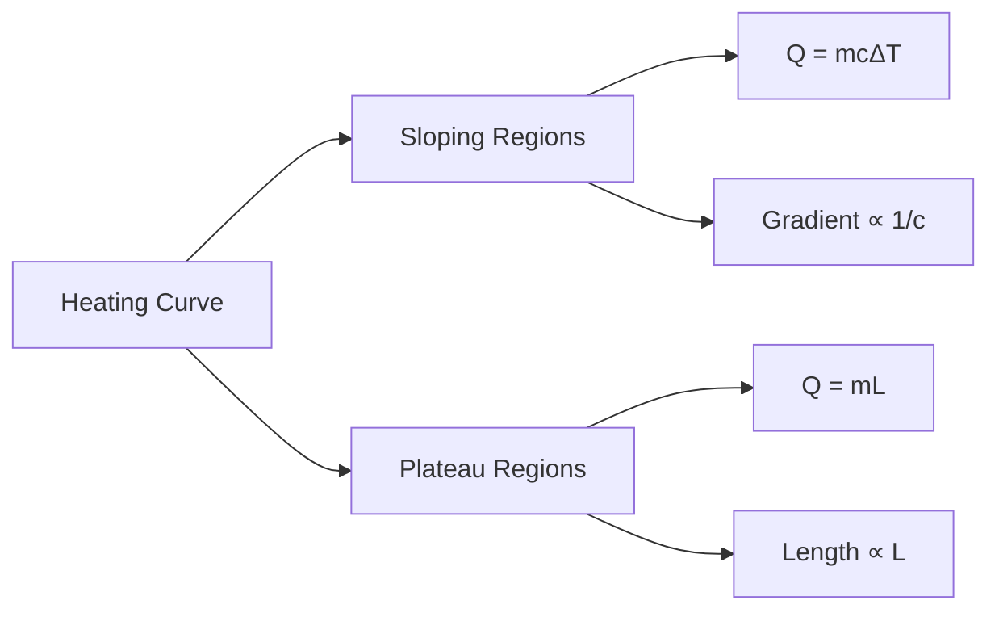

# 1. Overview / 概述

**English:**
Heating and cooling curves are graphical representations that show how the temperature of a substance changes over time as it gains or loses thermal energy. These curves are essential for understanding the relationship between [[Specific Heat Capacity and Latent Heat]] during [[Phase Changes and Energy]]. The key feature of these curves is the presence of **plateaus** (flat regions) where temperature remains constant despite continuous heating or cooling — these plateaus correspond to phase changes where [[Latent Heat of Fusion and Vaporisation]] is being absorbed or released.

For A-Level Physics, mastering heating and cooling curves allows you to:
1. Identify phase changes from temperature-time graphs
2. Calculate energy transfers using $Q = mc\Delta T$ and $Q = mL$
3. Distinguish between heating and cooling processes
4. Understand the molecular behaviour during phase transitions

These curves bridge the concepts of [[Specific Heat Capacity]] (temperature change without phase change) and [[Latent Heat]] (phase change without temperature change), making them a cornerstone of thermal physics.

**中文:**
加热曲线和冷却曲线是描述物质在吸收或释放热能时温度随时间变化的图形表示。这些曲线对于理解[[比热容与潜热]]在[[相变与能量]]过程中的关系至关重要。这些曲线的关键特征是存在**平台区**（平坦区域），在此区域温度在持续加热或冷却过程中保持不变——这些平台对应着相变过程，此时[[熔化潜热与汽化潜热]]正在被吸收或释放。

对于A-Level物理，掌握加热和冷却曲线可以让你：
1. 从温度-时间图中识别相变
2. 使用 $Q = mc\Delta T$ 和 $Q = mL$ 计算能量传递
3. 区分加热和冷却过程
4. 理解相变过程中的分子行为

这些曲线连接了[[比热容]]（无相变时的温度变化）和[[潜热]]（无温度变化时的相变）的概念，是热力学的基石。

---

# 2. Syllabus Learning Objectives / 考纲学习目标

| CAIE 9702 | Edexcel IAL |
|-----------|-------------|
| 10.3(a): Describe heating and cooling curves | 5.8: Interpret heating and cooling curves |
| 10.3(b): Identify melting and boiling points from curves | 5.9: Calculate energy changes using curves |
| 10.3(c): Explain the shape of curves in terms of energy transfer | 5.10: Distinguish between specific heat capacity and latent heat regions |
| 10.3(d): Calculate specific heat capacity from sloping regions | 5.11: Determine specific latent heat from plateau regions |
| 10.3(e): Calculate specific latent heat from plateau regions | 5.12: Explain the molecular interpretation of plateaus |
| 10.3(f): Distinguish between heating and cooling curves | |
| 10.3(g): Explain supercooling in cooling curves | |

**Examiner Expectations / 考官期望:**
- **English:** You must be able to sketch, label, and interpret heating/cooling curves for pure substances. You should calculate energy changes in both sloping and plateau regions. For cooling curves, you may need to explain supercooling and the concept of freezing point depression.
- **中文:** 你必须能够绘制、标注和解释纯物质的加热/冷却曲线。你应该计算斜线区域和平台区域的能量变化。对于冷却曲线，你可能需要解释过冷现象和凝固点降低的概念。

---

# 3. Core Definitions / 核心定义

| Term (EN/CN) | Definition (EN) | Definition (CN) | Common Mistakes / 常见错误 |
|--------------|-----------------|-----------------|---------------------------|
| **Heating Curve** / 加热曲线 | A graph of temperature against time for a substance being heated at a constant rate, showing regions of temperature increase and phase change plateaus. | 以恒定速率加热物质时，温度随时间变化的图形，显示温度升高区域和相变平台区域。 | Confusing heating curve with cooling curve — they are mirror images but not identical. |
| **Cooling Curve** / 冷却曲线 | A graph of temperature against time for a substance being cooled at a constant rate, showing regions of temperature decrease and phase change plateaus. | 以恒定速率冷却物质时，温度随时间变化的图形，显示温度降低区域和相变平台区域。 | Thinking cooling curves have no plateaus — they do during condensation and freezing. |
| **Plateau** / 平台 | A horizontal region on a heating/cooling curve where temperature remains constant during a phase change. | 加热/冷却曲线上的水平区域，在相变过程中温度保持不变。 | Assuming temperature always changes when energy is added — during phase change, energy goes into latent heat. |
| **Melting Point** / 熔点 | The temperature at which a solid changes to a liquid at constant temperature. | 固体在恒定温度下转变为液体的温度。 | Confusing with boiling point — melting occurs at a lower temperature. |
| **Boiling Point** / 沸点 | The temperature at which a liquid changes to a gas at constant temperature. | 液体在恒定温度下转变为气体的温度。 | Thinking boiling point depends on heating rate — it depends on pressure. |
| **Supercooling** / 过冷 | A phenomenon where a liquid cools below its freezing point without solidifying, followed by a rapid temperature rise to the freezing point. | 液体冷却到凝固点以下而不凝固的现象，随后温度迅速回升到凝固点。 | Confusing supercooling with normal cooling — supercooling shows a dip below the plateau. |

---

# 4. Key Concepts Explained / 关键概念详解

## 4.1 The Shape of Heating Curves / 加热曲线的形状

### Explanation / 解释
**English:**
A heating curve for a pure substance (e.g., ice → water → steam) has five distinct regions when starting from a solid below its melting point:

1. **Region A-B:** Solid heating — temperature rises as kinetic energy of molecules increases. Energy goes into [[Specific Heat Capacity]] of solid.
2. **Region B-C:** Melting plateau — temperature constant at melting point. Energy goes into [[Latent Heat of Fusion and Vaporisation]] (fusion) to overcome intermolecular forces.
3. **Region C-D:** Liquid heating — temperature rises as kinetic energy of molecules increases. Energy goes into specific heat capacity of liquid.
4. **Region D-E:** Boiling plateau — temperature constant at boiling point. Energy goes into latent heat of vaporisation to overcome intermolecular forces completely.
5. **Region E-F:** Gas heating — temperature rises as kinetic energy of molecules increases. Energy goes into specific heat capacity of gas.

The gradient of sloping regions depends on the specific heat capacity: $ \text{gradient} = \frac{\Delta T}{\Delta t} = \frac{P}{mc} $ where $P$ is the heating power.

**中文:**
纯物质（例如：冰→水→蒸汽）的加热曲线从低于熔点的固体开始，有五个不同的区域：

1. **A-B区域：** 固体加热——温度升高，分子动能增加。能量进入固体的[[比热容]]。
2. **B-C区域：** 熔化平台——温度在熔点保持恒定。能量进入[[熔化潜热与汽化潜热]]（熔化潜热）以克服分子间作用力。
3. **C-D区域：** 液体加热——温度升高，分子动能增加。能量进入液体的比热容。
4. **D-E区域：** 沸腾平台——温度在沸点保持恒定。能量进入汽化潜热以完全克服分子间作用力。
5. **E-F区域：** 气体加热——温度升高，分子动能增加。能量进入气体的比热容。

斜线区域的斜率取决于比热容：$ \text{斜率} = \frac{\Delta T}{\Delta t} = \frac{P}{mc} $，其中 $P$ 是加热功率。

### Physical Meaning / 物理意义
**English:**
The plateaus represent phase changes where the added energy increases potential energy (separating molecules) rather than kinetic energy (raising temperature). The sloping regions represent temperature changes where added energy increases kinetic energy of molecules.

**中文:**
平台代表相变过程，此时加入的能量增加势能（分离分子）而不是动能（升高温度）。斜线区域代表温度变化，此时加入的能量增加分子的动能。

### Common Misconceptions / 常见误区
- ❌ "Temperature always increases when you add heat" → ✅ During phase changes, temperature remains constant
- ❌ "The plateau length tells you the temperature" → ✅ The plateau length tells you the amount of latent heat absorbed
- ❌ "All substances have the same shaped heating curve" → ✅ Different substances have different melting/boiling points and different plateau lengths

### Exam Tips / 考试提示
- ✅ Label all five regions clearly on diagrams
- ✅ Remember: gradient ∝ 1/c (steeper gradient = smaller specific heat capacity)
- ✅ Plateau length ∝ L (longer plateau = larger latent heat)
- ✅ For cooling curves, the process is reversed but the plateaus occur at the same temperatures

> 📷 **IMAGE PROMPT — HC-01: Complete Heating Curve for Water**
> A clear, labelled graph showing temperature (°C) on the y-axis against time (minutes) on the x-axis. The curve starts at -20°C (ice), rises to 0°C (melting plateau), rises to 100°C (boiling plateau), then rises above 100°C (steam). All five regions (A-B, B-C, C-D, D-E, E-F) are clearly marked with arrows and labels. The graph should show a pure substance heating curve with distinct slopes and flat plateaus.

## 4.2 Cooling Curves and Supercooling / 冷却曲线与过冷

### Explanation / 解释
**English:**
A cooling curve is the reverse of a heating curve. Starting from a gas above its boiling point:
1. Gas cools (temperature decreases)
2. Condensation plateau at boiling point (gas → liquid)
3. Liquid cools (temperature decreases)
4. Freezing plateau at melting point (liquid → solid)
5. Solid cools (temperature decreases)

**Supercooling** occurs when a liquid is cooled below its freezing point without solidifying. This is a metastable state. When solidification finally begins, the latent heat released causes a rapid temperature rise back to the freezing point, creating a characteristic "dip" in the cooling curve.

**中文:**
冷却曲线是加热曲线的反向过程。从高于沸点的气体开始：
1. 气体冷却（温度降低）
2. 沸点处的冷凝平台（气体→液体）
3. 液体冷却（温度降低）
4. 熔点处的凝固平台（液体→固体）
5. 固体冷却（温度降低）

**过冷**发生在液体冷却到凝固点以下而不凝固时。这是一种亚稳态。当凝固最终开始时，释放的潜热导致温度迅速回升到凝固点，在冷却曲线上形成一个特征性的"凹陷"。

### Physical Meaning / 物理意义
**English:**
Supercooling demonstrates that nucleation (the formation of the first solid crystal) requires activation energy. Once nucleation occurs, the latent heat released during rapid solidification raises the temperature.

**中文:**
过冷现象表明成核（第一个固体晶体的形成）需要活化能。一旦成核发生，快速凝固过程中释放的潜热会使温度升高。

### Common Misconceptions / 常见误区
- ❌ "Cooling curves are exactly the same as heating curves" → ✅ They are reversed, and supercooling only occurs in cooling curves
- ❌ "Supercooling means the substance never freezes" → ✅ It eventually freezes, just at a lower temperature initially

### Exam Tips / 考试提示
- ✅ For cooling curves, the plateaus occur at the same temperatures as heating curves
- ✅ Supercooling is shown as a dip below the freezing point plateau
- ✅ The area under the dip represents the energy released during rapid solidification

> 📷 **IMAGE PROMPT — CC-01: Cooling Curve with Supercooling**
> A graph showing temperature (°C) on the y-axis against time (minutes) on the x-axis. The curve starts at 120°C (steam), drops to 100°C (condensation plateau), drops further to below 0°C showing a dip (supercooling), then rises back to 0°C (freezing plateau), then drops below 0°C (ice cooling). The supercooling dip should be clearly labelled with an arrow.

---

# 5. Essential Equations / 核心公式

## 5.1 Energy in Sloping Regions / 斜线区域的能量

$$ Q = mc\Delta T $$

| Symbol (符号) | Meaning (EN) | Meaning (CN) | Unit (单位) |
|--------------|-------------|-------------|------------|
| $Q$ | Thermal energy transferred | 传递的热能 | J (Joules) |
| $m$ | Mass of substance | 物质的质量 | kg |
| $c$ | Specific heat capacity | 比热容 | J kg⁻¹ K⁻¹ |
| $\Delta T$ | Temperature change | 温度变化 | K or °C |

**Derivation / 推导:** From definition of specific heat capacity.
**Conditions / 适用条件:** No phase change occurring; substance is in a single phase.
**Limitations / 局限性:** Assumes constant specific heat capacity over the temperature range.

## 5.2 Energy in Plateau Regions / 平台区域的能量

$$ Q = mL $$

| Symbol (符号) | Meaning (EN) | Meaning (CN) | Unit (单位) |
|--------------|-------------|-------------|------------|
| $Q$ | Thermal energy transferred | 传递的热能 | J |
| $m$ | Mass of substance undergoing phase change | 发生相变的物质质量 | kg |
| $L$ | Specific latent heat | 比潜热 | J kg⁻¹ |

**Derivation / 推导:** From definition of specific latent heat.
**Conditions / 适用条件:** During phase change at constant temperature.
**Limitations / 局限性:** Assumes complete phase change; $L$ differs for fusion and vaporisation.

## 5.3 Gradient of Sloping Region / 斜线区域的斜率

$$ \frac{\Delta T}{\Delta t} = \frac{P}{mc} $$

| Symbol (符号) | Meaning (EN) | Meaning (CN) | Unit (单位) |
|--------------|-------------|-------------|------------|
| $\Delta T/\Delta t$ | Rate of temperature change | 温度变化率 | K s⁻¹ |
| $P$ | Heating/cooling power | 加热/冷却功率 | W (J s⁻¹) |
| $m$ | Mass | 质量 | kg |
| $c$ | Specific heat capacity | 比热容 | J kg⁻¹ K⁻¹ |

**Derivation / 推导:** $P = \frac{Q}{\Delta t} = \frac{mc\Delta T}{\Delta t} \Rightarrow \frac{\Delta T}{\Delta t} = \frac{P}{mc}$
**Conditions / 适用条件:** Constant heating/cooling power; no phase change.
**Limitations / 局限性:** Assumes no heat loss to surroundings.

> 📋 **CIE Only:** You may be asked to calculate the specific latent heat from the plateau length using $L = \frac{P \times \Delta t}{m}$ where $\Delta t$ is the plateau duration.

> 📋 **Edexcel Only:** You may need to consider the gradient of cooling curves and relate it to the rate of heat loss.

---

# 6. Graphs and Relationships / 图表与关系

## 6.1 Heating Curve for a Pure Substance / 纯物质的加热曲线

### Axes / 坐标轴
- **X-axis:** Time / time / s (seconds)
- **Y-axis:** Temperature / 温度 / °C or K

### Shape / 形状
**English:** Five distinct regions: three sloping (positive gradient) and two horizontal plateaus. The sloping regions have different gradients depending on the specific heat capacity of each phase.

**中文:** 五个不同的区域：三个斜线（正斜率）和两个水平平台。斜线区域的斜率取决于各相的比热容。

### Gradient Meaning / 斜率含义
**English:** The gradient $\frac{\Delta T}{\Delta t} = \frac{P}{mc}$ is inversely proportional to specific heat capacity. A steeper gradient means a smaller specific heat capacity.

**中文:** 斜率 $\frac{\Delta T}{\Delta t} = \frac{P}{mc}$ 与比热容成反比。斜率越大，比热容越小。

### Area Meaning / 面积含义
**English:** The area under the power-time graph (not the temperature-time graph) gives the total energy supplied. For the temperature-time graph, the length of the plateau multiplied by the heating power gives the latent heat energy.

**中文:** 功率-时间图下的面积（不是温度-时间图）给出总能量输入。对于温度-时间图，平台长度乘以加热功率给出潜热能量。

### Exam Interpretation / 考试解读
**English:** 
- Longer plateau = larger latent heat (for same power)
- Steeper slope = smaller specific heat capacity
- Plateau temperature = melting or boiling point

**中文:**
- 平台越长 = 潜热越大（相同功率下）
- 斜率越大 = 比热容越小
- 平台温度 = 熔点或沸点

## 6.2 Cooling Curve with Supercooling / 带过冷的冷却曲线

### Axes / 坐标轴
- **X-axis:** Time / time / s
- **Y-axis:** Temperature / 温度 / °C

### Shape / 形状
**English:** Similar to heating curve but reversed. The supercooling dip appears as a temperature below the freezing point, followed by a rapid rise back to the freezing point plateau.

**中文:** 与加热曲线相似但方向相反。过冷凹陷表现为温度低于凝固点，随后迅速回升到凝固点平台。

### Gradient Meaning / 斜率含义
**English:** Negative gradient shows cooling. The gradient depends on the rate of heat loss to surroundings.

**中文:** 负斜率表示冷却。斜率取决于向周围环境散热的速率。

### Area Meaning / 面积含义
**English:** The area under the supercooling dip represents the energy released during rapid solidification.

**中文:** 过冷凹陷下的面积代表快速凝固过程中释放的能量。

### Exam Interpretation / 考试解读
**English:**
- Supercooling dip indicates delayed nucleation
- The rise back to plateau shows latent heat release
- The plateau temperature is the true freezing point

**中文:**
- 过冷凹陷表示延迟成核
- 回升到平台表示潜热释放
- 平台温度是真正的凝固点

---

# 7. Required Diagrams / 必备图表

## 7.1 Complete Heating Curve for Water / 水的完整加热曲线

### Description / 描述
**English:** A temperature-time graph showing ice at -20°C being heated to steam at 120°C. The curve shows five distinct regions with two plateaus at 0°C (melting) and 100°C (boiling).

**中文:** 一个温度-时间图，显示-20°C的冰被加热到120°C的蒸汽。曲线显示五个不同的区域，在0°C（熔化）和100°C（沸腾）处有两个平台。

### Image Prompt / 图片生成提示
> 📷 **IMAGE PROMPT — HC-02: Labelled Heating Curve for Water**
> A professional scientific graph with temperature (°C) on the y-axis (range -30 to 130) and time (minutes) on the x-axis (range 0 to 20). The curve starts at (-20°C, 0 min), rises linearly to (0°C, 4 min), forms a horizontal plateau from (0°C, 4 min) to (0°C, 8 min), rises linearly to (100°C, 12 min), forms a horizontal plateau from (100°C, 12 min) to (100°C, 16 min), then rises linearly to (120°C, 20 min). All regions labelled: A-B (solid heating), B-C (melting), C-D (liquid heating), D-E (boiling), E-F (gas heating). Include gridlines and axis labels. The graph should look like a textbook diagram.

### Labels Required / 需要标注
| Label (EN) | Label (CN) | Description |
|------------|------------|-------------|
| A-B | 固体加热 | Solid heating region |
| B-C | 熔化 | Melting plateau at 0°C |
| C-D | 液体加热 | Liquid heating region |
| D-E | 沸腾 | Boiling plateau at 100°C |
| E-F | 气体加热 | Gas heating region |
| Melting point | 熔点 | 0°C |
| Boiling point | 沸点 | 100°C |

### Exam Importance / 考试重要性
**English:** This is the most commonly tested diagram in thermal physics. You must be able to sketch it from memory and label all regions.

**中文:** 这是热力学中最常考的图表。你必须能够凭记忆绘制并标注所有区域。

## 7.2 Cooling Curve with Supercooling / 带过冷的冷却曲线

### Description / 描述
**English:** A temperature-time graph showing steam at 120°C being cooled to ice at -20°C. The curve shows a characteristic supercooling dip below 0°C before rising back to the freezing plateau.

**中文:** 一个温度-时间图，显示120°C的蒸汽被冷却到-20°C的冰。曲线显示在0°C以下有一个特征性的过冷凹陷，然后回升到凝固平台。

### Image Prompt / 图片生成提示
> 📷 **IMAGE PROMPT — CC-02: Cooling Curve with Supercooling for Water**
> A professional scientific graph with temperature (°C) on the y-axis (range -30 to 130) and time (minutes) on the x-axis (range 0 to 20). The curve starts at (120°C, 0 min), decreases linearly to (100°C, 4 min), forms a horizontal plateau from (100°C, 4 min) to (100°C, 8 min), decreases linearly to (-5°C, 14 min) showing a dip below 0°C, then rises rapidly back to (0°C, 15 min), forms a horizontal plateau from (0°C, 15 min) to (0°C, 18 min), then decreases linearly to (-20°C, 20 min). The supercooling dip should be clearly labelled with an arrow and the text "Supercooling / 过冷". Include gridlines and axis labels.

### Labels Required / 需要标注
| Label (EN) | Label (CN) | Description |
|------------|------------|-------------|
| Condensation | 冷凝 | Plateau at 100°C |
| Freezing | 凝固 | Plateau at 0°C |
| Supercooling | 过冷 | Dip below 0°C |
| True freezing point | 真实凝固点 | 0°C plateau |

### Exam Importance / 考试重要性
**English:** Supercooling is a common exam topic, especially for distinguishing between heating and cooling curves.

**中文:** 过冷是常见的考试主题，特别是用于区分加热和冷却曲线。

---

# 8. Worked Examples / 典型例题

## Example 1: Calculating Energy from a Heating Curve / 从加热曲线计算能量

### Question / 题目
**English:**
A 0.50 kg block of ice at -10°C is heated at a constant rate of 200 W. The heating curve shows:
- Ice heats from -10°C to 0°C in 52.5 s
- Melting plateau lasts 167.5 s
- Water heats from 0°C to 100°C in 1050 s
- Boiling plateau lasts 2260 s

Calculate:
(a) The specific heat capacity of ice
(b) The specific latent heat of fusion of ice
(c) The specific heat capacity of water
(d) The specific latent heat of vaporisation of water

**中文:**
一块0.50 kg的冰块在-10°C以200 W的恒定速率加热。加热曲线显示：
- 冰从-10°C加热到0°C需要52.5 s
- 熔化平台持续167.5 s
- 水从0°C加热到100°C需要1050 s
- 沸腾平台持续2260 s

计算：
(a) 冰的比热容
(b) 冰的熔化潜热
(c) 水的比热容
(d) 水的汽化潜热

### Solution / 解答

**Part (a): Specific heat capacity of ice / 冰的比热容**

Energy supplied to ice: $Q = P \times t = 200 \times 52.5 = 10500 \text{ J}$

Using $Q = mc\Delta T$:
$$10500 = 0.50 \times c_{\text{ice}} \times (0 - (-10))$$
$$10500 = 0.50 \times c_{\text{ice}} \times 10$$
$$c_{\text{ice}} = \frac{10500}{5} = 2100 \text{ J kg}^{-1} \text{K}^{-1}$$

**Part (b): Specific latent heat of fusion / 熔化潜热**

Energy supplied during melting: $Q = P \times t = 200 \times 167.5 = 33500 \text{ J}$

Using $Q = mL_f$:
$$33500 = 0.50 \times L_f$$
$$L_f = \frac{33500}{0.50} = 67000 \text{ J kg}^{-1} = 6.7 \times 10^4 \text{ J kg}^{-1}$$

**Part (c): Specific heat capacity of water / 水的比热容**

Energy supplied to water: $Q = P \times t = 200 \times 1050 = 210000 \text{ J}$

Using $Q = mc\Delta T$:
$$210000 = 0.50 \times c_{\text{water}} \times (100 - 0)$$
$$210000 = 0.50 \times c_{\text{water}} \times 100$$
$$c_{\text{water}} = \frac{210000}{50} = 4200 \text{ J kg}^{-1} \text{K}^{-1}$$

**Part (d): Specific latent heat of vaporisation / 汽化潜热**

Energy supplied during boiling: $Q = P \times t = 200 \times 2260 = 452000 \text{ J}$

Using $Q = mL_v$:
$$452000 = 0.50 \times L_v$$
$$L_v = \frac{452000}{0.50} = 904000 \text{ J kg}^{-1} = 9.04 \times 10^5 \text{ J kg}^{-1}$$

### Final Answer / 最终答案
**Answer:** (a) $c_{\text{ice}} = 2100 \text{ J kg}^{-1} \text{K}^{-1}$, (b) $L_f = 6.7 \times 10^4 \text{ J kg}^{-1}$, (c) $c_{\text{water}} = 4200 \text{ J kg}^{-1} \text{K}^{-1}$, (d) $L_v = 9.04 \times 10^5 \text{ J kg}^{-1}$ | **答案：** (a) $c_{\text{冰}} = 2100 \text{ J kg}^{-1} \text{K}^{-1}$, (b) $L_{\text{熔}} = 6.7 \times 10^4 \text{ J kg}^{-1}$, (c) $c_{\text{水}} = 4200 \text{ J kg}^{-1} \text{K}^{-1}$, (d) $L_{\text{汽}} = 9.04 \times 10^5 \text{ J kg}^{-1}$

### Quick Tip / 提示
**English:** Always check units — time must be in seconds, mass in kg, temperature in K or °C (difference is the same). The plateau duration directly gives the latent heat energy when multiplied by power.

**中文:** 始终检查单位——时间必须用秒，质量用千克，温度用K或°C（温差相同）。平台持续时间乘以功率直接给出潜热能量。

---

## Example 2: Interpreting a Cooling Curve with Supercooling / 解释带过冷的冷却曲线

### Question / 题目
**English:**
A sample of liquid naphthalene is cooled from 90°C to 60°C. The cooling curve shows:
- Liquid cools from 90°C to 80°C in 2 minutes
- Plateau at 80°C for 5 minutes (freezing)
- Supercooling dip to 75°C, then rise back to 80°C
- Solid cools from 80°C to 60°C in 3 minutes

(a) What is the freezing point of naphthalene?
(b) Explain why the temperature dips below 80°C before rising again.
(c) If the mass is 0.20 kg and the specific latent heat of fusion is 1.5 × 10⁵ J kg⁻¹, calculate the average cooling power during the freezing plateau.

**中文:**
将液态萘样品从90°C冷却到60°C。冷却曲线显示：
- 液体从90°C冷却到80°C需要2分钟
- 在80°C处有5分钟的平台（凝固）
- 过冷凹陷到75°C，然后回升到80°C
- 固体从80°C冷却到60°C需要3分钟

(a) 萘的凝固点是多少？
(b) 解释为什么温度在回升前会降到80°C以下。
(c) 如果质量为0.20 kg，熔化潜热为1.5 × 10⁵ J kg⁻¹，计算凝固平台期间的平均冷却功率。

### Solution / 解答

**Part (a):**
The freezing point is the plateau temperature: **80°C**.

**Part (b):**
**English:** The liquid naphthalene cools below its freezing point without solidifying (supercooling). This is a metastable state. When nucleation finally occurs, rapid solidification releases latent heat, causing the temperature to rise back to the true freezing point of 80°C.

**中文:** 液态萘冷却到凝固点以下而不凝固（过冷）。这是一种亚稳态。当成核最终发生时，快速凝固释放潜热，导致温度回升到真正的凝固点80°C。

**Part (c):**

Energy released during freezing: $Q = mL_f = 0.20 \times 1.5 \times 10^5 = 30000 \text{ J}$

Time for freezing plateau: $t = 5 \text{ min} = 300 \text{ s}$

Average cooling power: $P = \frac{Q}{t} = \frac{30000}{300} = 100 \text{ W}$

### Final Answer / 最终答案
**Answer:** (a) 80°C, (b) Supercooling / 过冷, (c) $P = 100 \text{ W}$ | **答案：** (a) 80°C, (b) 过冷现象, (c) $P = 100 \text{ W}$

### Quick Tip / 提示
**English:** The true freezing/melting point is always the plateau temperature, not the supercooling dip temperature.

**中文:** 真正的凝固/熔点始终是平台温度，而不是过冷凹陷的温度。

---

# 9. Past Paper Question Types / 历年真题题型

| Question Type / 题型 | Frequency / 频率 | Difficulty / 难度 | Past Paper References / 真题索引 |
|----------------------|------------------|------------------|-------------------------------|
| Sketch and label heating/cooling curves | ⭐⭐⭐⭐⭐ Very High | Easy | 📝 *待填入* |
| Calculate energy from sloping regions | ⭐⭐⭐⭐⭐ Very High | Medium | 📝 *待填入* |
| Calculate latent heat from plateau length | ⭐⭐⭐⭐⭐ Very High | Medium | 📝 *待填入* |
| Explain supercooling in cooling curves | ⭐⭐⭐ Medium | Medium | 📝 *待填入* |
| Compare heating and cooling curves | ⭐⭐⭐ Medium | Easy | 📝 *待填入* |
| Determine specific heat capacity from gradient | ⭐⭐⭐⭐ High | Hard | 📝 *待填入* |
| Multi-step energy calculations | ⭐⭐⭐⭐ High | Hard | 📝 *待填入* |

**Common Command Words / 常见指令词:**
- **Sketch / 绘制:** Draw a rough graph showing the general shape
- **Label / 标注:** Add names to regions and points
- **Calculate / 计算:** Use equations to find numerical values
- **Explain / 解释:** Give reasons for the shape of the curve
- **Determine / 确定:** Find a value from the graph data
- **Compare / 比较:** Describe similarities and differences

---

# 10. Practical Skills Connections / 实验技能链接

**English:**
Heating and cooling curves are directly linked to [[Experimental Determination of c and L]]. Key practical skills include:

1. **Data Collection:** Recording temperature at regular time intervals using a thermometer or temperature sensor connected to a data logger
2. **Graph Plotting:** Plotting temperature against time and drawing smooth curves through data points
3. **Identifying Plateaus:** Recognising when temperature becomes constant despite continuous heating/cooling
4. **Calculating Energy:** Using $P = \frac{Q}{t}$ with known heating power to find energy transferred
5. **Error Analysis:** 
   - Heat loss to surroundings (especially during long experiments)
   - Incomplete phase change (if not all substance melts/boils)
   - Temperature sensor response time (lag in readings)
6. **Improving Accuracy:**
   - Use insulation to reduce heat loss
   - Stir the substance to ensure uniform temperature
   - Use a data logger for more precise timing
   - Repeat measurements and calculate mean values

**Common Practical Setups:**
- **Heating curve:** Immersion heater in a substance, with thermometer and stopwatch
- **Cooling curve:** Hot substance in a calorimeter, allowed to cool naturally

**中文:**
加热和冷却曲线与[[比热容与潜热的实验测定]]直接相关。关键实验技能包括：

1. **数据收集：** 使用温度计或连接到数据记录器的温度传感器，按固定时间间隔记录温度
2. **图表绘制：** 绘制温度随时间变化的图，并通过数据点绘制平滑曲线
3. **识别平台：** 识别在持续加热/冷却过程中温度保持恒定的时刻
4. **能量计算：** 使用 $P = \frac{Q}{t}$ 和已知加热功率计算传递的能量
5. **误差分析：**
   - 向周围环境的热损失（特别是在长时间实验中）
   - 不完全相变（如果不是所有物质都熔化/沸腾）
   - 温度传感器响应时间（读数滞后）
6. **提高精度：**
   - 使用隔热材料减少热损失
   - 搅拌物质以确保温度均匀
   - 使用数据记录器进行更精确的计时
   - 重复测量并计算平均值

**常见实验装置：**
- **加热曲线：** 浸入式加热器置于物质中，配合温度计和秒表
- **冷却曲线：** 量热器中的热物质，让其自然冷却

---

# 11. Concept Map / 概念图谱

```mermaid
graph TD
    %% Core node
    HC[Heating and Cooling Curves] --> |shows| T_vs_t[Temperature vs Time Graph]
    
    %% Two types
    HC --> Heating[Heating Curve]
    HC --> Cooling[Cooling Curve]
    
    %% Regions
    T_vs_t --> Sloping[Sloping Regions]
    T_vs_t --> Plateau[Plateau Regions]
    
    %% Sloping regions
    Sloping --> |energy goes to| KE[Kinetic Energy of Molecules]
    Sloping --> |uses| SHC[Specific Heat Capacity]
    Sloping --> |equation| Q_mcDT[Q = mcΔT]
    
    %% Plateau regions
    Plateau --> |energy goes to| PE[Potential Energy of Molecules]
    Plateau --> |uses| Latent[Latent Heat]
    Plateau --> |equation| Q_mL[Q = mL]
    
    %% Phase changes
    Plateau --> Melting[Melting / Freezing]
    Plateau --> Boiling[Boiling / Condensation]
    
    %% Cooling curve specific
    Cooling --> Supercooling[Supercooling]
    Supercooling --> |causes| Dip[Dip below freezing point]
    Supercooling --> |requires| Nucleation[Nucleation]
    
    %% Connections to parent
    HC --> Parent[Specific Heat Capacity and Latent Heat]
    
    %% Connections to siblings
    Parent --> SHC_Node[Specific Heat Capacity]
    Parent --> Latent_Node[Latent Heat of Fusion and Vaporisation]
    Parent --> Exp_Node[Experimental Determination of c and L]
    Parent --> Phase_Node[Phase Changes and Energy]
    
    %% Prerequisites
    HC --> Prereq[Temperature and Thermal Equilibrium]
    
    %% Styling
    classDef main fill:#f9f,stroke:#333,stroke-width:2px
    classDef equation fill:#bbf,stroke:#333,stroke-width:1px
    classDef concept fill:#bfb,stroke:#333,stroke-width:1px
    
    class HC,Parent main
    class Q_mcDT,Q_mL equation
    class SHC,Latent,Melting,Boiling concept
```

---

# 12. Quick Revision Sheet / 速查表

| Category / 类别 | Key Points / 要点 |
|----------------|------------------|
| **Definition / 定义** | Heating curve: Temperature vs time for a substance being heated at constant rate. Cooling curve: Temperature vs time for a substance being cooled at constant rate. |
| **Key Formula / 核心公式** | Sloping: $Q = mc\Delta T$ (no phase change). Plateau: $Q = mL$ (during phase change). Gradient: $\frac{\Delta T}{\Delta t} = \frac{P}{mc}$ |
| **Key Graph / 核心图表** | Five regions: solid heating → melting plateau → liquid heating → boiling plateau → gas heating. Cooling curve is reversed with possible supercooling dip. |
| **Plateau Meaning / 平台含义** | Temperature constant because energy goes into latent heat (changing potential energy, not kinetic energy). |
| **Supercooling / 过冷** | Liquid cools below freezing point without solidifying. Temperature rises back to freezing point when nucleation occurs and latent heat is released. |
| **Common Exam Calculation / 常见考试计算** | Use $Q = Pt$ to find energy from heating power and time. Then use $Q = mc\Delta T$ or $Q = mL$ to find unknown quantities. |
| **Exam Tip / 考试提示** | Always label all five regions. Remember: plateau length ∝ latent heat, gradient ∝ 1/c. For cooling curves, the plateaus occur at the same temperatures as heating curves. |
| **Common Mistake / 常见错误** | ❌ Thinking temperature always increases when energy is added → ✅ During phase change, temperature is constant. ❌ Confusing melting and boiling points. |
| **Practical Connection / 实验联系** | Use insulation to reduce heat loss. Stir for uniform temperature. Use data loggers for accurate timing. Account for heat capacity of the container. |
| **Units / 单位** | $c$: J kg⁻¹ K⁻¹, $L$: J kg⁻¹, $P$: W (J s⁻¹), $m$: kg, $\Delta T$: K or °C |