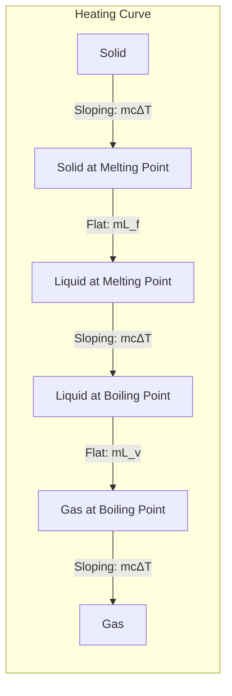
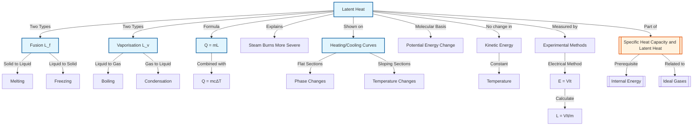

# 1. Overview / 概述

**English:**
Latent heat of fusion and vaporisation are fundamental concepts in thermal physics that describe the energy required to change the state of a substance without changing its temperature. When a solid melts into a liquid, it absorbs **latent heat of fusion**; when a liquid boils into a gas, it absorbs **latent heat of vaporisation**. Conversely, when a gas condenses or a liquid freezes, the same amount of energy is released. This sub-topic is crucial for understanding [[Phase Changes and Energy]], [[Heating and Cooling Curves]], and the molecular interpretation of [[Internal Energy]]. It connects directly to practical work in [[Experimental Determination of c and L]] and explains everyday phenomena like sweating to cool down or steam burns being more severe than boiling water burns.

**中文:**
熔解潜热和汽化潜热是热物理学中的基本概念，描述了物质在状态变化过程中所需吸收或释放的能量，而温度保持不变。当固体熔化成液体时，吸收**熔解潜热**；当液体沸腾变成气体时，吸收**汽化潜热**。反之，当气体凝结或液体凝固时，会释放相同数量的能量。本子知识点对于理解[[相变与能量]]、[[加热与冷却曲线]]以及[[内能]]的分子解释至关重要。它与[[c和L的实验测定]]中的实验工作直接相关，并解释了日常现象，如出汗降温或蒸汽烫伤比沸水烫伤更严重。

---

# 2. Syllabus Learning Objectives / 考纲学习目标

| CAIE 9702 (10.3 a-g) | Edexcel IAL (WPH11 U1: 5.8-5.12) |
|----------------------|----------------------------------|
| Define and use specific latent heat | Define specific latent heat of fusion and vaporisation |
| Apply $Q = mL$ to phase changes | Use $Q = mL$ in calculations |
| Distinguish between fusion and vaporisation | Explain energy transfer during phase changes |
| Explain latent heat in terms of molecular forces | Describe latent heat using potential energy changes |
| Interpret heating/cooling curves | Analyse heating/cooling curves |
| Describe experimental determination of $L$ | Describe methods to measure $L$ |
| Explain why steam burns are more severe | Apply latent heat to real-world contexts |

**Examiner Expectations / 考官期望:**
- **English:** Students must be able to define specific latent heat precisely, apply the formula $Q = mL$ correctly, and explain the molecular basis for latent heat. Common exam tasks include calculating energy for phase changes, interpreting flat regions on [[Heating and Cooling Curves]], and explaining why steam causes more severe burns than boiling water.
- **中文:** 学生必须能够精确定义比潜热，正确应用公式 $Q = mL$，并解释潜热的分子基础。常见的考试任务包括计算相变能量、解释[[加热与冷却曲线]]上的平台区域，以及解释为什么蒸汽比沸水造成更严重的烫伤。

---

# 3. Core Definitions / 核心定义

| Term (EN/CN) | Definition (EN) | Definition (CN) | Common Mistakes / 常见错误 |
|--------------|-----------------|-----------------|---------------------------|
| **Specific Latent Heat of Fusion** $L_f$ / 熔解比潜热 | The energy required to change 1 kg of a substance from solid to liquid at its melting point, without a change in temperature. | 在熔点温度下，将1kg物质从固态变为液态而不改变温度所需的能量。 | ❌ Confusing with specific heat capacity — latent heat involves NO temperature change. 混淆比热容——潜热不涉及温度变化。 |
| **Specific Latent Heat of Vaporisation** $L_v$ / 汽化比潜热 | The energy required to change 1 kg of a substance from liquid to gas at its boiling point, without a change in temperature. | 在沸点温度下，将1kg物质从液态变为气态而不改变温度所需的能量。 | ❌ Thinking $L_v$ is always larger than $L_f$ — it is, but students often forget WHY (more work done against intermolecular forces). 认为$L_v$总是大于$L_f$——确实如此，但学生常忘记原因（克服分子间作用力做更多功）。 |
| **Latent Heat** $Q$ / 潜热 | The thermal energy absorbed or released during a phase change at constant temperature. | 在恒温相变过程中吸收或释放的热能。 | ❌ Using $Q = mc\Delta T$ for phase changes — use $Q = mL$ instead. 对相变使用$Q = mc\Delta T$——应使用$Q = mL$。 |
| **Melting Point** / 熔点 | The temperature at which a solid changes to a liquid at standard atmospheric pressure. | 在标准大气压下固体变为液体的温度。 | ❌ Assuming melting point equals freezing point — they are the same temperature for a pure substance. 假设熔点等于凝固点——对于纯物质它们是相同的温度。 |
| **Boiling Point** / 沸点 | The temperature at which a liquid changes to a gas at standard atmospheric pressure. | 在标准大气压下液体变为气体的温度。 | ❌ Confusing boiling with evaporation — boiling occurs throughout the liquid at a specific temperature. 混淆沸腾与蒸发——沸腾在整个液体中在特定温度下发生。 |

---

# 4. Key Concepts Explained / 关键概念详解

## 4.1 Molecular Explanation of Latent Heat / 潜热的分子解释

### Explanation / 解释
**English:** During a phase change, energy is used to overcome the intermolecular forces (bonds) between particles, not to increase kinetic energy (temperature). In a solid, particles are held in fixed positions by strong intermolecular forces. When melting, energy breaks some of these bonds, allowing particles to move more freely (liquid state). During vaporisation, even more energy is needed to completely separate particles into the gas phase, where they move independently. This explains why $L_v > L_f$ — more work is done against intermolecular forces.

**中文:** 在相变过程中，能量用于克服粒子间的分子间作用力（键），而不是增加动能（温度）。在固体中，粒子通过强分子间作用力固定在固定位置。熔化时，能量打破其中一些键，使粒子能够更自由地移动（液态）。在汽化过程中，需要更多能量将粒子完全分离到气相中，在那里它们独立运动。这解释了为什么$L_v > L_f$——克服分子间作用力做了更多功。

### Physical Meaning / 物理意义
**English:** Latent heat represents the **potential energy** change of the system. During melting, the potential energy of particles increases as they move apart against attractive forces. The kinetic energy (and thus temperature) remains constant. This is why [[Heating and Cooling Curves]] show flat (horizontal) regions during phase changes.

**中文:** 潜热代表系统的**势能**变化。在熔化过程中，粒子克服吸引力而分开，势能增加。动能（以及温度）保持不变。这就是为什么[[加热与冷却曲线]]在相变过程中显示平坦（水平）区域。

### Common Misconceptions / 常见误区
- ❌ **English:** "Latent heat increases temperature." — NO, latent heat changes the state, not the temperature.
- ❌ **中文:** "潜热增加温度。" — 不，潜热改变状态，而不是温度。
- ❌ **English:** "Ice at 0°C has no thermal energy." — Ice at 0°C has less internal energy than water at 0°C, but still has thermal energy.
- ❌ **中文:** "0°C的冰没有热能。" — 0°C的冰比0°C的水内能少，但仍然有热能。
- ❌ **English:** "Steam at 100°C has the same energy as water at 100°C." — Steam has much more internal energy due to the latent heat absorbed during vaporisation.
- ❌ **中文:** "100°C的蒸汽与100°C的水能量相同。" — 由于汽化过程中吸收的潜热，蒸汽具有更多的内能。

### Exam Tips / 考试提示
- ✅ **English:** Always check whether a phase change is occurring — if temperature is constant, use $Q = mL$, not $Q = mc\Delta T$.
- ✅ **中文:** 始终检查是否发生相变——如果温度恒定，使用$Q = mL$，而不是$Q = mc\Delta T$。
- ✅ **English:** Remember: $L_v$ is typically much larger than $L_f$ (e.g., for water: $L_f = 3.34 \times 10^5 \text{ J/kg}$, $L_v = 2.26 \times 10^6 \text{ J/kg}$).
- ✅ **中文:** 记住：$L_v$通常远大于$L_f$（例如，水：$L_f = 3.34 \times 10^5 \text{ J/kg}$，$L_v = 2.26 \times 10^6 \text{ J/kg}$）。

> 📷 **IMAGE PROMPT — DIAGRAM-01: Molecular Arrangement During Phase Changes**
> A three-panel diagram showing molecular arrangement in solid (closely packed, ordered), liquid (closely packed, disordered), and gas (widely spaced, random). Arrows indicate energy input for melting and vaporisation. Labels show "Intermolecular forces overcome" and "Potential energy increases". Include temperature readings at melting point and boiling point.

---

## 4.2 Why Steam Burns Are More Severe / 为什么蒸汽烫伤更严重

### Explanation / 解释
**English:** Steam at 100°C contains more thermal energy than water at 100°C because steam has absorbed the **latent heat of vaporisation** ($L_v$) during the phase change from liquid to gas. When steam condenses on skin, it releases this latent heat ($Q = mL_v$) in addition to the heat released as it cools. This extra energy transfer makes steam burns significantly more dangerous than burns from boiling water at the same temperature.

**中文:** 100°C的蒸汽比100°C的水含有更多的热能，因为蒸汽在从液态到气态的相变过程中吸收了**汽化潜热**（$L_v$）。当蒸汽在皮肤上凝结时，除了冷却时释放的热量外，还会释放这些潜热（$Q = mL_v$）。这种额外的能量传递使得蒸汽烫伤比相同温度的沸水烫伤危险得多。

### Physical Meaning / 物理意义
**English:** The total energy released when steam at 100°C turns to water at, say, 50°C is:
$$Q_{\text{total}} = mL_v + mc\Delta T$$
For boiling water at 100°C cooling to 50°C:
$$Q_{\text{total}} = mc\Delta T$$
The $mL_v$ term is typically 5-7 times larger than the $mc\Delta T$ term for water, explaining the severity.

**中文:** 当100°C的蒸汽变成例如50°C的水时释放的总能量为：
$$Q_{\text{total}} = mL_v + mc\Delta T$$
对于100°C的沸水冷却到50°C：
$$Q_{\text{total}} = mc\Delta T$$
$mL_v$项通常比水的$mc\Delta T$项大5-7倍，解释了严重性。

### Common Misconceptions / 常见误区
- ❌ **English:** "Steam burns are worse because steam is hotter than boiling water." — Both are at 100°C; the difference is the latent heat released during condensation.
- ❌ **中文:** "蒸汽烫伤更严重是因为蒸汽比沸水温度更高。" — 两者都在100°C；区别在于凝结过程中释放的潜热。

### Exam Tips / 考试提示
- ✅ **English:** This is a classic exam question — always mention the release of latent heat during condensation as the key reason.
- ✅ **中文:** 这是一个经典的考试问题——始终提到凝结过程中潜热的释放是关键原因。

---

# 5. Essential Equations / 核心公式

## 5.1 Latent Heat Equation / 潜热方程

$$ Q = mL $$

| Symbol (符号) | Meaning (EN) | Meaning (CN) | Unit (单位) |
|--------------|-------------|-------------|------------|
| $Q$ | Thermal energy transferred | 传递的热能 | J (Joules) |
| $m$ | Mass of substance | 物质的质量 | kg |
| $L$ | Specific latent heat | 比潜热 | J/kg |

**Derivation / 推导:**
- **English:** The specific latent heat $L$ is defined as the energy per unit mass required for a phase change. Therefore, total energy $Q = m \times L$.
- **中文:** 比潜热$L$定义为单位质量相变所需的能量。因此，总能量$Q = m \times L$。

**Conditions / 适用条件:**
- **English:** Only applies during a phase change at constant temperature (melting/freezing or boiling/condensing). The substance must be at its melting point or boiling point.
- **中文:** 仅适用于恒温相变过程（熔化/凝固或沸腾/凝结）。物质必须处于其熔点或沸点。

**Limitations / 局限性:**
- **English:** Assumes no heat loss to surroundings (ideal conditions). Does not account for impurities that may change the melting/boiling point. For mixtures, the phase change occurs over a temperature range, not at a single temperature.
- **中文:** 假设没有热量损失到周围环境（理想条件）。不考虑可能改变熔点/沸点的杂质。对于混合物，相变发生在温度范围内，而不是单一温度。

## 5.2 Combined Heating and Phase Change / 加热与相变结合

$$ Q_{\text{total}} = mc\Delta T + mL $$

| Symbol (符号) | Meaning (EN) | Meaning (CN) | Unit (单位) |
|--------------|-------------|-------------|------------|
| $Q_{\text{total}}$ | Total thermal energy | 总热能 | J |
| $c$ | Specific heat capacity | 比热容 | J/(kg·K) |
| $\Delta T$ | Temperature change | 温度变化 | K or °C |

**Conditions / 适用条件:**
- **English:** Used when a substance is heated through a temperature range AND undergoes a phase change. The order of terms depends on the process (heating then melting, or boiling then heating).
- **中文:** 当物质被加热通过温度范围并经历相变时使用。项的顺序取决于过程（先加热后熔化，或先沸腾后加热）。

> 📷 **IMAGE PROMPT — FORMULA-01: Energy Transfer Diagram for Steam Burn**
> A diagram showing a mass m of steam at 100°C. Two arrows: one labeled "Condensation: Q = mL_v" pointing to water at 100°C, then another arrow labeled "Cooling: Q = mcΔT" pointing to water at 50°C. Total energy equation shown: Q_total = mL_v + mcΔT.

---

# 6. Graphs and Relationships / 图表与关系

## 6.1 Heating Curve Showing Phase Changes / 显示相变的加热曲线

### Axes / 坐标轴
- **X-axis:** Time / Time / 时间 (s)
- **Y-axis:** Temperature / 温度 (°C)

### Shape / 形状
**English:** The graph shows a series of sloping and flat (horizontal) sections. Sloping sections represent temperature changes (using $Q = mc\Delta T$). Flat sections represent phase changes (using $Q = mL$). The flat section at the melting point is shorter than the flat section at the boiling point because $L_v > L_f$ for most substances.

**中文:** 图表显示一系列倾斜和水平部分。倾斜部分代表温度变化（使用$Q = mc\Delta T$）。水平部分代表相变（使用$Q = mL$）。熔点处的水平部分比沸点处的水平部分短，因为对于大多数物质$L_v > L_f$。

### Gradient Meaning / 斜率含义
**English:** The gradient of sloping sections is $\frac{\Delta T}{\Delta t} = \frac{P}{mc}$, where $P$ is the heating power. Steeper gradient means lower specific heat capacity or smaller mass.

**中文:** 倾斜部分的斜率为$\frac{\Delta T}{\Delta t} = \frac{P}{mc}$，其中$P$是加热功率。斜率越大意味着比热容越小或质量越小。

### Area Meaning / 面积含义
**English:** The area under a power-time graph gives energy. For a temperature-time graph, the length of the flat section is proportional to the latent heat — longer flat section means larger $L$.

**中文:** 功率-时间图下的面积给出能量。对于温度-时间图，水平部分的长度与潜热成正比——水平部分越长意味着$L$越大。

### Exam Interpretation / 考试解读
- ✅ **English:** Identify which flat section corresponds to melting (lower temperature) and which to boiling (higher temperature).
- ✅ **中文:** 识别哪个水平部分对应熔化（较低温度），哪个对应沸腾（较高温度）。
- ✅ **English:** The longer flat section at the boiling point indicates $L_v > L_f$.
- ✅ **中文:** 沸点处较长的水平部分表明$L_v > L_f$。

> 📷 **IMAGE PROMPT — GRAPH-01: Heating Curve for Water**
> A temperature vs. time graph for water heated from -20°C to 120°C. Clearly label: solid region (ice), melting at 0°C (flat section), liquid region (water), boiling at 100°C (longer flat section), gas region (steam). Show equations on each section: Q = mcΔT for sloping parts, Q = mL for flat parts. Indicate that L_v > L_f by the longer flat section at 100°C.

---

# 7. Required Diagrams / 必备图表

## 7.1 Experimental Setup for Determining Latent Heat of Fusion / 测定熔解潜热的实验装置

### Description / 描述
**English:** A simple method to determine the specific latent heat of fusion of ice involves using an immersion heater to melt ice, collecting the melted water, and measuring the energy supplied. Ice at 0°C is placed in a funnel with a heater. The melted water is collected in a beaker. By measuring the mass of water melted and the electrical energy supplied ($E = VIt$), the latent heat can be calculated.

**中文:** 测定冰的熔解比潜热的一种简单方法涉及使用浸入式加热器熔化冰，收集融化的水，并测量提供的能量。将0°C的冰放入带有加热器的漏斗中。融化的水收集在烧杯中。通过测量融化的水的质量和提供的电能（$E = VIt$），可以计算潜热。

### Image Prompt / 图片生成提示
> 📷 **IMAGE PROMPT — DIAGRAM-02: Experimental Setup for Latent Heat of Fusion of Ice**
> A detailed diagram showing: a funnel containing crushed ice at 0°C, an immersion heater inserted into the ice, a power supply connected to the heater with a voltmeter and ammeter, a beaker collecting melted water below the funnel, a thermometer in the ice to confirm constant temperature. Labels: "Ice at 0°C", "Immersion Heater", "Melted Water", "V", "A", "Power Supply". Show equation: L = VIt/m.

### Labels Required / 需要标注
- **English:** Immersion heater, crushed ice at 0°C, funnel, beaker for collected water, voltmeter, ammeter, power supply, thermometer
- **中文:** 浸入式加热器、0°C碎冰、漏斗、收集水的烧杯、电压表、电流表、电源、温度计

### Exam Importance / 考试重要性
- ✅ **English:** High — this is a common practical question in both CAIE and Edexcel papers. Students must be able to describe the method, identify sources of error, and suggest improvements.
- ✅ **中文:** 高——这是CAIE和Edexcel试卷中常见的实验问题。学生必须能够描述方法、识别误差来源并提出改进建议。

---

## 7.2 Cooling Curve Showing Condensation / 显示凝结的冷却曲线

### Description / 描述
**English:** A cooling curve for steam shows the reverse of the heating curve. As steam cools, it first loses sensible heat (temperature drops), then at 100°C it condenses (flat section releasing $L_v$), then the water cools further, and at 0°C it freezes (flat section releasing $L_f$), then ice cools below 0°C.

**中文:** 蒸汽的冷却曲线显示加热曲线的逆过程。当蒸汽冷却时，首先失去显热（温度下降），然后在100°C时凝结（释放$L_v$的水平部分），然后水进一步冷却，在0°C时结冰（释放$L_f$的水平部分），然后冰冷却到0°C以下。

### Image Prompt / 图片生成提示
> 📷 **IMAGE PROMPT — DIAGRAM-03: Cooling Curve for Steam to Ice**
> Temperature vs. time graph showing: steam cooling from 120°C to 100°C (sloping down), condensation at 100°C (long flat section, label "Condensation: releases L_v"), water cooling from 100°C to 0°C (sloping down), freezing at 0°C (shorter flat section, label "Freezing: releases L_f"), ice cooling below 0°C (sloping down). Arrows showing energy released at each stage.

### Labels Required / 需要标注
- **English:** Steam cooling, condensation (releases $L_v$), water cooling, freezing (releases $L_f$), ice cooling
- **中文:** 蒸汽冷却、凝结（释放$L_v$）、水冷却、结冰（释放$L_f$）、冰冷却

### Exam Importance / 考试重要性
- ✅ **English:** Medium — understanding the reverse process helps with energy conservation calculations and explains real-world phenomena like frost formation.
- ✅ **中文:** 中——理解逆过程有助于能量守恒计算，并解释霜冻形成等现实世界现象。

---

# 8. Worked Examples / 典型例题

## Example 1: Energy Required to Melt Ice and Heat Water / 熔化冰并加热水所需的能量

### Question / 题目
**English:** Calculate the total energy required to convert 0.50 kg of ice at -10°C into steam at 100°C.
Given: $c_{\text{ice}} = 2100 \text{ J/(kg·K)}$, $c_{\text{water}} = 4200 \text{ J/(kg·K)}$, $L_f = 3.34 \times 10^5 \text{ J/kg}$, $L_v = 2.26 \times 10^6 \text{ J/kg}$.

**中文:** 计算将0.50 kg的-10°C冰转化为100°C蒸汽所需的总能量。
已知：$c_{\text{冰}} = 2100 \text{ J/(kg·K)}$，$c_{\text{水}} = 4200 \text{ J/(kg·K)}$，$L_f = 3.34 \times 10^5 \text{ J/kg}$，$L_v = 2.26 \times 10^6 \text{ J/kg}$。

### Solution / 解答

**Step 1: Heat ice from -10°C to 0°C / 将冰从-10°C加热到0°C**
$$Q_1 = mc_{\text{ice}}\Delta T = 0.50 \times 2100 \times 10 = 10,500 \text{ J}$$

**Step 2: Melt ice at 0°C / 在0°C熔化冰**
$$Q_2 = mL_f = 0.50 \times 3.34 \times 10^5 = 167,000 \text{ J}$$

**Step 3: Heat water from 0°C to 100°C / 将水从0°C加热到100°C**
$$Q_3 = mc_{\text{water}}\Delta T = 0.50 \times 4200 \times 100 = 210,000 \text{ J}$$

**Step 4: Boil water at 100°C / 在100°C使水沸腾**
$$Q_4 = mL_v = 0.50 \times 2.26 \times 10^6 = 1,130,000 \text{ J}$$

**Step 5: Total energy / 总能量**
$$Q_{\text{total}} = Q_1 + Q_2 + Q_3 + Q_4 = 10,500 + 167,000 + 210,000 + 1,130,000 = 1,517,500 \text{ J}$$

### Final Answer / 最终答案
**Answer:** $1.52 \times 10^6 \text{ J}$ (to 3 significant figures) | **答案：** $1.52 \times 10^6 \text{ J}$（保留3位有效数字）

### Quick Tip / 提示
- ✅ **English:** Always break the problem into stages. Identify whether each stage involves a temperature change ($Q = mc\Delta T$) or a phase change ($Q = mL$). The phase change stages (melting and boiling) typically contribute the most energy.
- ✅ **中文:** 始终将问题分解为多个阶段。识别每个阶段是涉及温度变化（$Q = mc\Delta T$）还是相变（$Q = mL$）。相变阶段（熔化和沸腾）通常贡献最多的能量。

---

## Example 2: Steam Burn Energy Calculation / 蒸汽烫伤能量计算

### Question / 题目
**English:** 10 g of steam at 100°C condenses on a person's skin and cools to 34°C (body temperature). Calculate the total energy transferred to the skin.
Given: $c_{\text{water}} = 4200 \text{ J/(kg·K)}$, $L_v = 2.26 \times 10^6 \text{ J/kg}$.

**中文:** 10 g的100°C蒸汽在人的皮肤上凝结并冷却到34°C（体温）。计算传递到皮肤的总能量。
已知：$c_{\text{水}} = 4200 \text{ J/(kg·K)}$，$L_v = 2.26 \times 10^6 \text{ J/kg}$。

### Solution / 解答

**Step 1: Convert mass to kg / 将质量转换为kg**
$$m = 10 \text{ g} = 0.010 \text{ kg}$$

**Step 2: Energy released during condensation / 凝结过程中释放的能量**
$$Q_1 = mL_v = 0.010 \times 2.26 \times 10^6 = 22,600 \text{ J}$$

**Step 3: Energy released as condensed water cools / 凝结水冷却时释放的能量**
$$Q_2 = mc\Delta T = 0.010 \times 4200 \times (100 - 34) = 0.010 \times 4200 \times 66 = 2,772 \text{ J}$$

**Step 4: Total energy / 总能量**
$$Q_{\text{total}} = Q_1 + Q_2 = 22,600 + 2,772 = 25,372 \text{ J}$$

### Final Answer / 最终答案
**Answer:** $2.54 \times 10^4 \text{ J}$ (to 3 significant figures) | **答案：** $2.54 \times 10^4 \text{ J}$（保留3位有效数字）

### Quick Tip / 提示
- ✅ **English:** Notice that the condensation stage ($Q_1$) contributes about 8 times more energy than the cooling stage ($Q_2$). This demonstrates why steam burns are so severe — the latent heat release dominates.
- ✅ **中文:** 注意凝结阶段（$Q_1$）贡献的能量大约是冷却阶段（$Q_2$）的8倍。这说明了为什么蒸汽烫伤如此严重——潜热释放占主导地位。

---

# 9. Past Paper Question Types / 历年真题题型

| Question Type / 题型 | Frequency / 频率 | Difficulty / 难度 | Past Paper References / 真题索引 |
|----------------------|------------------|------------------|-------------------------------|
| Calculate energy for phase change using $Q = mL$ | Very High / 非常高 | Easy / 简单 | 📝 *待填入* |
| Multi-stage energy calculation (ice to steam) | High / 高 | Medium / 中等 | 📝 *待填入* |
| Explain why steam burns are more severe | High / 高 | Medium / 中等 | 📝 *待填入* |
| Interpret heating/cooling curves | High / 高 | Medium / 中等 | 📝 *待填入* |
| Describe experimental determination of $L$ | Medium / 中 | Medium-Hard / 中-难 | 📝 *待填入* |
| Molecular explanation of latent heat | Medium / 中 | Medium / 中等 | 📝 *待填入* |
| Compare $L_f$ and $L_v$ for different substances | Low / 低 | Medium / 中等 | 📝 *待填入* |

**Common Command Words / 常见指令词:**
- **English:** Calculate, Determine, Explain, Describe, State, Suggest, Compare, Sketch
- **中文:** 计算、确定、解释、描述、陈述、建议、比较、画出草图

---

# 10. Practical Skills Connections / 实验技能链接

**English:**
This sub-topic connects to practical work in several ways:

1. **Determining Specific Latent Heat of Fusion (Ice):** Use an immersion heater to melt ice at 0°C. Measure electrical energy ($E = VIt$) and mass of water melted. Calculate $L_f = \frac{VIt}{m}$. Key uncertainties: heat loss to surroundings, incomplete melting, water dripping before measurement.

2. **Determining Specific Latent Heat of Vaporisation (Water):** Boil water using an immersion heater. Measure electrical energy and mass of water boiled away. Calculate $L_v = \frac{VIt}{m}$. Key uncertainties: heat loss from the container, steam condensation on the apparatus.

3. **Graph Plotting:** Plot heating/cooling curves from experimental data. Identify flat regions corresponding to phase changes. Use gradients to determine specific heat capacities.

4. **Error Analysis:** Common systematic errors include heat loss to surroundings (underestimates $L$), and incomplete phase change (overestimates $L$ if not all material changes state).

**中文:**
本子知识点通过以下几种方式与实验工作联系：

1. **测定熔解比潜热（冰）：** 使用浸入式加热器熔化0°C的冰。测量电能（$E = VIt$）和融化的水的质量。计算$L_f = \frac{VIt}{m}$。关键不确定度：热量损失到周围环境、不完全熔化、测量前水滴落。

2. **测定汽化比潜热（水）：** 使用浸入式加热器使水沸腾。测量电能和蒸发的水的质量。计算$L_v = \frac{VIt}{m}$。关键不确定度：容器热量损失、蒸汽在装置上凝结。

3. **图表绘制：** 从实验数据绘制加热/冷却曲线。识别对应相变的平坦区域。使用斜率确定比热容。

4. **误差分析：** 常见的系统误差包括热量损失到周围环境（低估$L$），以及不完全相变（如果并非所有材料都改变状态，则高估$L$）。

---

# 11. Concept Map / 概念图谱

---

# 12. Quick Revision Sheet / 速查表

| Category / 类别 | Key Points / 要点 |
|----------------|------------------|
| **Definition / 定义** | Specific latent heat of fusion ($L_f$): Energy to change 1 kg solid → liquid at melting point, no temp change. / 熔解比潜热（$L_f$）：在熔点将1kg固体→液体而不改变温度所需的能量。 |
| | Specific latent heat of vaporisation ($L_v$): Energy to change 1 kg liquid → gas at boiling point, no temp change. / 汽化比潜热（$L_v$）：在沸点将1kg液体→气体而不改变温度所需的能量。 |
| **Key Formula / 核心公式** | $Q = mL$ — for phase changes only / 仅用于相变 |
| | $Q_{\text{total}} = mc\Delta T + mL$ — for combined heating and phase change / 用于加热和相变结合 |
| **Key Values (Water) / 关键数值（水）** | $L_f = 3.34 \times 10^5 \text{ J/kg}$ |
| | $L_v = 2.26 \times 10^6 \text{ J/kg}$ (≈ 7× larger than $L_f$) |
| **Key Graph / 核心图表** | Heating curve: sloping sections ($mc\Delta T$), flat sections ($mL$). Longer flat at boiling point → $L_v > L_f$. / 加热曲线：倾斜部分（$mc\Delta T$），水平部分（$mL$）。沸点处水平部分更长→$L_v > L_f$。 |
| **Molecular Explanation / 分子解释** | Energy overcomes intermolecular forces → increases potential energy, NOT kinetic energy → temperature constant. / 能量克服分子间作用力→增加势能，而不是动能→温度恒定。 |
| **Steam Burns / 蒸汽烫伤** | Steam releases $mL_v$ during condensation + $mc\Delta T$ during cooling → much more energy than boiling water alone. / 蒸汽在凝结时释放$mL_v$ + 冷却时释放$mc\Delta T$ → 比单独沸水多得多。 |
| **Exam Tip / 考试提示** | Always check: Is temperature changing? → $Q = mc\Delta T$. Is state changing? → $Q = mL$. Both? → Use both formulas. / 始终检查：温度在变化吗？→ $Q = mc\Delta T$。状态在变化吗？→ $Q = mL$。两者都有？→ 使用两个公式。 |
| **Common Mistake / 常见错误** | ❌ Using $Q = mc\Delta T$ during phase changes. / 在相变过程中使用$Q = mc\Delta T$。 |
| | ❌ Forgetting that $L_v > L_f$ because more work is done against intermolecular forces. / 忘记$L_v > L_f$因为克服分子间作用力做了更多功。 |
| **Experimental Method / 实验方法** | Electrical method: $L = \frac{VIt}{m}$. Measure energy input and mass changed. Account for heat loss. / 电学法：$L = \frac{VIt}{m}$。测量能量输入和质量变化。考虑热量损失。 |