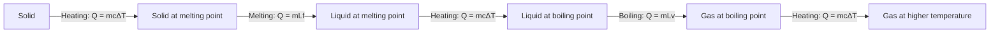
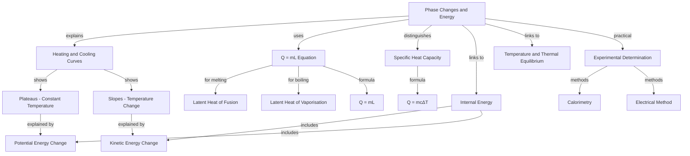

# Phase Changes and Energy / 相变与能量

---

# 1. Overview / 概述

**English:**
This sub-topic explores what happens to energy during phase changes (solid ↔ liquid ↔ gas). When a substance changes phase, its temperature remains constant despite continuous heating or cooling — this is because the energy is used to change the internal potential energy of the particles rather than their kinetic energy. Understanding this distinction is crucial for interpreting [[Heating and Cooling Curves]] and for distinguishing between [[Specific Heat Capacity]] and [[Latent Heat of Fusion and Vaporisation]]. This sub-topic bridges the macroscopic energy transfers we measure with the microscopic behaviour of particles, linking directly to [[Internal Energy]] and [[Temperature and Thermal Equilibrium]].

**中文:**
本子知识点探讨物质在相变（固态↔液态↔气态）过程中的能量变化。当物质发生相变时，尽管持续加热或冷却，其温度保持不变——这是因为能量用于改变粒子的内势能，而非其动能。理解这一区别对于解读[[加热与冷却曲线]]以及区分[[比热容]]和[[熔化与汽化潜热]]至关重要。本子知识点将我们测量的宏观能量转移与粒子的微观行为联系起来，直接关联到[[内能]]和[[温度与热平衡]]。

---

# 2. Syllabus Learning Objectives / 考纲学习目标

| CAIE 9702 | Edexcel IAL |
|-----------|-------------|
| 10.3(a) Define specific latent heat | 5.8 Define specific latent heat of fusion and vaporisation |
| 10.3(b) Distinguish between specific latent heat of fusion and vaporisation | 5.9 Use the formula $E = mL$ |
| 10.3(c) Use $E = mL$ | 5.10 Explain energy transfers during phase changes |
| 10.3(d) Explain why temperature is constant during phase change | 5.11 Interpret heating/cooling curves |
| 10.3(e) Interpret heating and cooling curves | 5.12 Distinguish between latent heat and specific heat capacity |
| 10.3(f) Describe experiments to determine specific latent heat | — |
| 10.3(g) Solve problems involving phase changes | — |

**Examiner Expectations / 考官期望:**
- **CAIE:** Students must be able to explain *why* temperature remains constant during phase change in terms of particle behaviour. Calculations involving $E = mL$ are routine, but examiners often test understanding of the difference between latent heat and specific heat capacity.
- **Edexcel:** Focus on applying $E = mL$ in context, interpreting graphs, and explaining the microscopic energy transfer. Practical determination of $L$ is less emphasised than in CAIE.

---

# 3. Core Definitions / 核心定义

| Term (EN/CN) | Definition (EN) | Definition (CN) | Common Mistakes / 常见错误 |
|--------------|-----------------|-----------------|---------------------------|
| **Phase Change** / 相变 | A physical change of state (solid, liquid, gas) without chemical change | 物质状态（固态、液态、气态）的物理变化，不发生化学变化 | Confusing with chemical reactions |
| **Specific Latent Heat of Fusion** $L_f$ / 熔化潜热 | The energy required to change 1 kg of a substance from solid to liquid at its melting point without temperature change | 在熔点温度下，将1kg物质从固态变为液态而不改变温度所需的能量 | Thinking temperature rises during melting |
| **Specific Latent Heat of Vaporisation** $L_v$ / 汽化潜热 | The energy required to change 1 kg of a substance from liquid to gas at its boiling point without temperature change | 在沸点温度下，将1kg物质从液态变为气态而不改变温度所需的能量 | Thinking $L_v$ and $L_f$ are equal |
| **Latent Heat** / 潜热 | "Hidden" heat — energy transferred during a phase change that does not cause a temperature change | "隐藏"的热量——相变过程中转移的能量，不引起温度变化 | Confusing with [[Specific Heat Capacity]] |
| **Internal Energy** / 内能 | The sum of the random kinetic energy and potential energy of particles in a substance | 物质中粒子随机动能与势能的总和 | Thinking it's only kinetic energy |

> 📋 **Edexcel Only:** Edexcel uses the term "specific latent heat of fusion" and "specific latent heat of vaporisation" — both are required definitions.

---

# 4. Key Concepts Explained / 关键概念详解

## 4.1 Why Temperature Remains Constant During Phase Change / 相变时温度为何保持不变

### Explanation / 解释
**English:**
When a substance is heated, the energy supplied can do two things:
1. **Increase kinetic energy** of particles → temperature rises (sensed as hotter)
2. **Increase potential energy** of particles → particles move further apart (phase change)

During a phase change, ALL the supplied energy goes into increasing the potential energy of the particles to overcome the intermolecular forces holding them in their current arrangement. Since no energy goes into increasing kinetic energy, the average kinetic energy (and therefore temperature) remains constant.

For example, when ice melts at 0°C, the energy breaks the hydrogen bonds holding water molecules in a rigid lattice. The molecules gain freedom to move as a liquid, but their average speed (and thus temperature) does not increase until all ice has melted.

**中文:**
当物质被加热时，提供的能量可以做两件事：
1. **增加粒子的动能** → 温度升高（感觉更热）
2. **增加粒子的势能** → 粒子间距离增大（相变）

在相变过程中，所有提供的能量都用于增加粒子的势能，以克服将粒子保持在当前排列中的分子间作用力。由于没有能量用于增加动能，平均动能（因此温度）保持不变。

例如，当冰在0°C熔化时，能量用于打破将水分子固定在刚性晶格中的氢键。分子获得作为液体自由移动的能力，但它们的平均速度（因此温度）不会增加，直到所有冰都熔化。

### Physical Meaning / 物理意义
**English:**
- **Solid → Liquid (melting/fusion):** Energy breaks the ordered lattice structure. Particles gain positional disorder but similar kinetic energy.
- **Liquid → Gas (vaporisation/boiling):** Energy completely overcomes intermolecular forces. Particles become widely separated with much higher potential energy.
- **Reverse processes (freezing, condensation):** Energy is *released* as particles lose potential energy and form stronger bonds.

**中文:**
- **固态→液态（熔化）：** 能量打破有序的晶格结构。粒子获得位置无序性，但动能相似。
- **液态→气态（汽化/沸腾）：** 能量完全克服分子间作用力。粒子变得相距很远，势能大大增加。
- **逆过程（凝固、凝结）：** 能量被*释放*，因为粒子失去势能并形成更强的键。

### Common Misconceptions / 常见误区
- ❌ **"Temperature rises during melting"** — No! Temperature is constant during phase change. The graph shows a flat region.
- ❌ **"Latent heat is the same as specific heat capacity"** — No! $c$ relates to temperature change; $L$ relates to phase change without temperature change.
- ❌ **"All substances have the same $L_f$ and $L_v$"** — No! Different substances have different intermolecular forces, so different latent heats.
- ❌ **"Energy is lost during freezing"** — No! Energy is *released* to the surroundings, not lost.

### Exam Tips / 考试提示
- **Always mention "potential energy"** when explaining constant temperature during phase change.
- **Use the phrase "overcoming intermolecular forces"** — examiners love this.
- **For calculations:** Identify whether the process involves a temperature change ($Q = mc\Delta T$) or a phase change ($Q = mL$) — never mix them in the same step.
- **Sign convention:** Energy absorbed (melting, boiling) is positive; energy released (freezing, condensing) is negative.

> 📷 **IMAGE PROMPT — PC01: Particle Arrangement During Phase Changes**
> A three-panel diagram showing: (1) Solid state — particles in a regular lattice vibrating; (2) During melting — particles breaking free from lattice positions but still close together; (3) Liquid state — particles randomly arranged but still in contact. Arrows show energy input breaking bonds. Labels: "Lattice structure", "Intermolecular forces being overcome", "Random arrangement". Clean, educational style suitable for A-Level physics.

---

# 5. Essential Equations / 核心公式

## 5.1 Latent Heat Equation / 潜热方程

$$ Q = mL $$

or

$$ E = mL $$

| Symbol (符号) | Meaning (EN) | Meaning (CN) | Unit (单位) |
|--------------|-------------|-------------|------------|
| $Q$ or $E$ | Thermal energy transferred | 转移的热能 | J (joules) |
| $m$ | Mass of substance | 物质的质量 | kg |
| $L$ | Specific latent heat | 比潜热 | J kg$^{-1}$ |

**Derivation / 推导:**
This is a definition equation. Specific latent heat $L$ is defined as the energy per unit mass required to change the phase of a substance without temperature change. Rearranging: $L = \frac{Q}{m}$.

**Conditions / 适用条件:**
- **Constant temperature** — the substance must be at its melting point (for $L_f$) or boiling point (for $L_v$)
- **Pure substance** — impurities change the melting/boiling points
- **Constant pressure** — changing pressure affects boiling points

**Limitations / 局限性:**
- Does not account for energy losses to the surroundings (in real experiments)
- Assumes all energy goes into phase change only
- Does not apply to mixtures or impure substances

## 5.2 Distinguishing from Specific Heat Capacity / 与比热容的区别

$$ Q = mc\Delta T \quad \text{(temperature change)} $$
$$ Q = mL \quad \text{(phase change)} $$

| Feature | Specific Heat Capacity $c$ | Specific Latent Heat $L$ |
|---------|---------------------------|-------------------------|
| What changes? | Temperature | Phase (state) |
| Temperature? | Changes | Constant |
| Energy goes to... | Kinetic energy of particles | Potential energy of particles |
| Unit | J kg$^{-1}$ K$^{-1}$ or J kg$^{-1}$ °C$^{-1}$ | J kg$^{-1}$ |

> 📷 **IMAGE PROMPT — PC02: Energy Distribution During Heating**
> A bar chart showing energy input split into two categories: (1) During temperature change — energy goes to kinetic energy (KE) of particles; (2) During phase change — energy goes to potential energy (PE) of particles. Labels: "KE increases → temperature rises", "PE increases → phase changes". Clean, simple design.

---

# 6. Graphs and Relationships / 图表与关系

## 6.1 Heating Curve / 加热曲线

### Axes / 坐标轴
- **X-axis:** Time / time / heat supplied (s or J)
- **Y-axis:** Temperature / 温度 (°C or K)

### Shape / 形状
A heating curve has a characteristic "staircase" shape:
1. **Sloped region:** Temperature rises — energy increases kinetic energy ($Q = mc\Delta T$)
2. **Flat region (plateau):** Temperature constant — phase change occurring ($Q = mL$)
3. **Sloped region again:** Temperature rises again in new phase

### Gradient Meaning / 斜率含义
- **Slope = $\frac{\Delta T}{\Delta t}$** — rate of temperature change
- Steeper slope = lower specific heat capacity (heats up faster)
- Shallower slope = higher specific heat capacity (heats up slower)

### Area Meaning / 面积含义
- **Area under the curve** is not directly meaningful here
- Instead, the **length of the flat region** indicates the amount of energy required for the phase change (longer plateau = more energy needed = higher latent heat)

### Exam Interpretation / 考试解读
- **Identify phase changes:** Look for horizontal plateaus
- **Identify melting point:** The temperature of the first plateau
- **Identify boiling point:** The temperature of the second plateau
- **Compare substances:** A longer plateau at the same heating rate means a higher specific latent heat

> 📷 **IMAGE PROMPT — PC03: Typical Heating Curve for Water**
> A graph with Temperature (°C) on y-axis (0 to 120) and Time (minutes) on x-axis. Shows: Ice heating from -20°C to 0°C (sloped), plateau at 0°C (melting), water heating from 0°C to 100°C (sloped), plateau at 100°C (boiling), steam heating above 100°C (sloped). Labels: "Solid", "Solid + Liquid", "Liquid", "Liquid + Gas", "Gas". Arrows pointing to plateaus: "Melting — Lf = 334 kJ/kg", "Boiling — Lv = 2260 kJ/kg". Clean, educational style.

---

# 7. Required Diagrams / 必备图表

## 7.1 Heating Curve Diagram / 加热曲线图

### Description / 描述
**English:**
A temperature vs. time (or energy supplied) graph showing the five stages of heating a substance from solid to gas. The graph features two horizontal plateaus representing melting and boiling, with sloped regions in between. Key temperatures (melting point, boiling point) and phase labels should be clearly marked.

**中文:**
温度与时间（或供能）关系图，显示物质从固态加热到气态的五个阶段。图中包含两个水平平台，分别代表熔化和沸腾，中间为倾斜区域。应清晰标注关键温度（熔点、沸点）和相态标签。

### Image Prompt / 图片生成提示
> 📷 **IMAGE PROMPT — PC04: Complete Heating Curve with Phase Labels**
> A detailed graph with Temperature on y-axis and Time on x-axis. Five distinct regions: (1) Solid heating — upward slope; (2) Melting — horizontal line at Tm; (3) Liquid heating — upward slope; (4) Boiling — horizontal line at Tb; (5) Gas heating — upward slope. Each region labelled with phase and formula: "Q = mcΔT" for slopes, "Q = mLf" and "Q = mLv" for plateaus. Arrows indicate direction of energy flow. Clean, professional, suitable for textbook.

### Labels Required / 需要标注
- **Axes:** Temperature / °C (or K), Time / s (or Energy / J)
- **Phase regions:** Solid, Solid + Liquid (melting), Liquid, Liquid + Gas (boiling), Gas
- **Key points:** Melting point $T_m$, Boiling point $T_b$
- **Formulas:** $Q = mc\Delta T$ on slopes, $Q = mL_f$ and $Q = mL_v$ on plateaus

### Exam Importance / 考试重要性
- **CAIE:** Frequently asked to sketch and label heating curves. Must show understanding of why plateaus occur.
- **Edexcel:** Often asked to interpret given curves and calculate energy using both $mc\Delta T$ and $mL$.

## 7.2 Cooling Curve Diagram / 冷却曲线图

### Description / 描述
**English:**
The reverse of the heating curve — temperature vs. time as a substance cools from gas to solid. Plateaus appear at the same temperatures (boiling point and melting point) but represent condensation and freezing, where energy is *released* to the surroundings.

**中文:**
加热曲线的逆过程——物质从气态冷却到固态的温度与时间关系图。平台出现在相同温度（沸点和熔点），但代表凝结和凝固，此时能量被*释放*到周围环境。

### Image Prompt / 图片生成提示
> 📷 **IMAGE PROMPT — PC05: Cooling Curve for a Pure Substance**
> A graph with Temperature on y-axis and Time on x-axis. Starting from high temperature gas, cooling down through: Gas cooling (sloped down), Condensation (horizontal plateau at Tb), Liquid cooling (sloped down), Freezing (horizontal plateau at Tm), Solid cooling (sloped down). Labels: "Gas", "Gas + Liquid (condensing)", "Liquid", "Liquid + Solid (freezing)", "Solid". Arrows show energy released to surroundings. Clean, educational style.

### Labels Required / 需要标注
- **Axes:** Temperature / °C, Time / s
- **Phase regions:** Gas, Gas + Liquid (condensing), Liquid, Liquid + Solid (freezing), Solid
- **Key points:** Boiling point $T_b$, Melting point $T_m$

### Exam Importance / 考试重要性
- Cooling curves are less common than heating curves but test the same concepts in reverse.
- **Key insight:** The plateaus occur at the *same* temperatures as heating — melting point = freezing point, boiling point = condensation point.

---

# 8. Worked Examples / 典型例题

## Example 1: Energy Required to Melt Ice / 熔化冰所需能量

### Question / 题目
**English:**
How much energy is required to completely melt 0.50 kg of ice at 0°C? (Specific latent heat of fusion of ice = 334 kJ/kg)

**中文:**
将0.50 kg的0°C冰完全熔化需要多少能量？（冰的熔化潜热 = 334 kJ/kg）

### Solution / 解答

**Step 1: Identify the process**
This is a phase change (solid → liquid) at constant temperature. Use $Q = mL_f$.

**Step 2: Substitute values**
$$ Q = 0.50 \times 334 \times 10^3 $$
$$ Q = 167 \times 10^3 $$
$$ Q = 1.67 \times 10^5 \text{ J} $$

**Step 3: Check units**
Mass in kg, $L_f$ in J/kg → answer in J ✓

### Final Answer / 最终答案
**Answer:** $1.67 \times 10^5$ J (or 167 kJ) | **答案：** $1.67 \times 10^5$ J（或167 kJ）

### Quick Tip / 提示
**English:** Remember to convert kJ to J ($\times 10^3$) before calculating. Watch for units — examiners often give $L$ in kJ/kg but expect answer in J.

**中文:** 记得在计算前将kJ转换为J（$\times 10^3$）。注意单位——考官常给出kJ/kg的$L$，但期望答案以J为单位。

---

## Example 2: Heating Ice to Steam / 将冰加热成蒸汽

### Question / 题目
**English:**
Calculate the total energy required to convert 0.20 kg of ice at -10°C into steam at 100°C.

Data:
- Specific heat capacity of ice = 2100 J kg$^{-1}$ K$^{-1}$
- Specific heat capacity of water = 4200 J kg$^{-1}$ K$^{-1}$
- Specific latent heat of fusion of ice = 334 kJ/kg
- Specific latent heat of vaporisation of water = 2260 kJ/kg

**中文:**
计算将0.20 kg的-10°C冰转化为100°C蒸汽所需的总能量。

数据：
- 冰的比热容 = 2100 J kg$^{-1}$ K$^{-1}$
- 水的比热容 = 4200 J kg$^{-1}$ K$^{-1}$
- 冰的熔化潜热 = 334 kJ/kg
- 水的汽化潜热 = 2260 kJ/kg

### Solution / 解答

**Step 1: Break the process into stages**
1. Heat ice from -10°C to 0°C: $Q_1 = mc_{ice}\Delta T$
2. Melt ice at 0°C: $Q_2 = mL_f$
3. Heat water from 0°C to 100°C: $Q_3 = mc_{water}\Delta T$
4. Boil water at 100°C: $Q_4 = mL_v$

**Step 2: Calculate each stage**
$$ Q_1 = 0.20 \times 2100 \times (0 - (-10)) = 0.20 \times 2100 \times 10 = 4200 \text{ J} $$
$$ Q_2 = 0.20 \times 334 \times 10^3 = 66,800 \text{ J} $$
$$ Q_3 = 0.20 \times 4200 \times (100 - 0) = 0.20 \times 4200 \times 100 = 84,000 \text{ J} $$
$$ Q_4 = 0.20 \times 2260 \times 10^3 = 452,000 \text{ J} $$

**Step 3: Sum all energies**
$$ Q_{total} = 4200 + 66,800 + 84,000 + 452,000 $$
$$ Q_{total} = 607,000 \text{ J} = 6.07 \times 10^5 \text{ J} $$

### Final Answer / 最终答案
**Answer:** $6.07 \times 10^5$ J (or 607 kJ) | **答案：** $6.07 \times 10^5$ J（或607 kJ）

### Quick Tip / 提示
**English:** Notice that $Q_4$ (boiling) is the largest energy requirement — this is because $L_v$ is much larger than $L_f$ for water. Always check whether you need to include temperature changes AND phase changes.

**中文:** 注意$Q_4$（沸腾）是最大的能量需求——这是因为水的$L_v$远大于$L_f$。始终检查是否需要同时考虑温度变化和相变。

---

# 9. Past Paper Question Types / 历年真题题型

| Question Type / 题型 | Frequency / 频率 | Difficulty / 难度 | Past Paper References / 真题索引 |
|----------------------|------------------|------------------|-------------------------------|
| Calculate energy for phase change using $Q = mL$ | ★★★★★ | Easy | 📝 *待填入* |
| Multi-stage heating/cooling calculations | ★★★★☆ | Medium | 📝 *待填入* |
| Explain constant temperature during phase change | ★★★★☆ | Medium | 📝 *待填入* |
| Interpret heating/cooling curves | ★★★☆☆ | Medium | 📝 *待填入* |
| Compare $L_f$ and $L_v$ for different substances | ★★☆☆☆ | Hard | 📝 *待填入* |
| Experimental determination of $L$ | ★★★☆☆ | Hard | 📝 *待填入* |

**Common Command Words / 常见指令词:**
- **Calculate / 计算:** Use $Q = mL$ with given data
- **Explain / 解释:** Why temperature is constant during phase change
- **Sketch / 绘制:** Draw a heating or cooling curve
- **Compare / 比较:** Differences between $L_f$ and $L_v$, or between latent heat and specific heat capacity
- **Describe / 描述:** An experiment to determine specific latent heat

> 📋 **CAIE Only:** CAIE often asks for experimental methods to determine $L$ — see [[Experimental Determination of c and L]].

---

# 10. Practical Skills Connections / 实验技能链接

**English:**
This sub-topic connects to practical work in several ways:

1. **Determining Specific Latent Heat of Fusion ($L_f$):**
   - Method: Add crushed ice to warm water in a calorimeter. Measure temperature change of water. Use $Q_{lost\ by\ water} = Q_{gained\ by\ ice}$ to find $L_f$.
   - Key measurements: Mass of ice, mass of water, initial and final temperatures.
   - Sources of error: Heat loss to surroundings, ice not at exactly 0°C, water droplets on ice.

2. **Determining Specific Latent Heat of Vaporisation ($L_v$):**
   - Method: Boil water using an electric heater. Measure electrical energy supplied ($E = VIt$) and mass of water boiled away.
   - Key measurements: Voltage, current, time, mass of water vaporised.
   - Sources of error: Heat loss from the container, steam condensing before leaving, not all energy goes into vaporisation.

3. **Graph Plotting:**
   - Plot heating/cooling curves from experimental data.
   - Identify plateaus and calculate $L$ from the length of the plateau.

4. **Uncertainties:**
   - Uncertainty in mass measurement (balance)
   - Uncertainty in temperature (thermometer resolution)
   - Uncertainty in electrical measurements (voltmeter, ammeter)

**中文:**
本子知识点通过多种方式与实验工作联系：

1. **测定熔化潜热（$L_f$）：**
   - 方法：将碎冰加入量热器中的温水。测量水的温度变化。使用$Q_{水损失} = Q_{冰获得}$求$L_f$。
   - 关键测量：冰的质量、水的质量、初始和最终温度。
   - 误差来源：向周围散热、冰不恰好为0°C、冰上水滴。

2. **测定汽化潜热（$L_v$）：**
   - 方法：用电加热器烧水。测量提供的电能（$E = VIt$）和蒸发的水的质量。
   - 关键测量：电压、电流、时间、蒸发的水的质量。
   - 误差来源：容器散热、蒸汽在离开前凝结、并非所有能量都用于汽化。

3. **绘制图表：**
   - 根据实验数据绘制加热/冷却曲线。
   - 识别平台并根据平台长度计算$L$。

4. **不确定度：**
   - 质量测量的不确定度（天平）
   - 温度的不确定度（温度计分辨率）
   - 电测量的不确定度（电压表、电流表）

> 📋 **CAIE Only:** CAIE Paper 3 (Practical) may ask for experimental determination of $L_f$ or $L_v$. See [[Experimental Determination of c and L]].

---

# 11. Concept Map / 概念图谱

---

# 12. Quick Revision Sheet / 速查表

| Category / 类别 | Key Points / 要点 |
|----------------|------------------|
| **Definition / 定义** | **Specific latent heat ($L$):** Energy per unit mass to change phase without temperature change. **比潜热：** 单位质量物质在不改变温度的情况下改变相态所需的能量。 |
| **Key Formula / 核心公式** | $Q = mL$ — Energy for phase change. **相变能量公式。** |
| **Key Graph / 核心图表** | **Heating curve:** Temperature vs. time — plateaus at melting and boiling points. **冷却曲线：** 温度与时间关系——熔点和沸点处有平台。 |
| **Why Constant Temperature / 温度为何恒定** | Energy goes to **potential energy** (overcoming intermolecular forces), NOT kinetic energy. **能量用于势能（克服分子间作用力），而非动能。** |
| **$L_f$ vs $L_v$ / 熔化潜热 vs 汽化潜热** | $L_v > L_f$ for all substances (more energy needed to completely separate particles). **所有物质的$L_v > L_f$（完全分离粒子需要更多能量）。** |
| **Common Mistake / 常见错误** | ❌ Using $Q = mc\Delta T$ during phase change. **在相变过程中使用$Q = mc\Delta T$。** |
| **Exam Tip / 考试提示** | Always mention "potential energy" and "intermolecular forces" when explaining plateaus. **解释平台时始终提及"势能"和"分子间作用力"。** |
| **Practical / 实验** | Electrical method ($E = VIt$) or method of mixtures for determining $L$. **电热法（$E = VIt$）或混合法测定$L$。** |

---

> **Related Leaf Nodes:** [[Specific Heat Capacity]], [[Latent Heat of Fusion and Vaporisation]], [[Heating and Cooling Curves]], [[Experimental Determination of c and L]]
> **Parent Hub:** [[Specific Heat Capacity and Latent Heat]]
> **Prerequisites:** [[Temperature and Thermal Equilibrium]]
> **Related Topics:** [[Internal Energy]], [[Ideal Gases]]