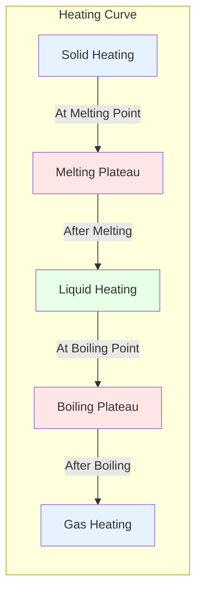
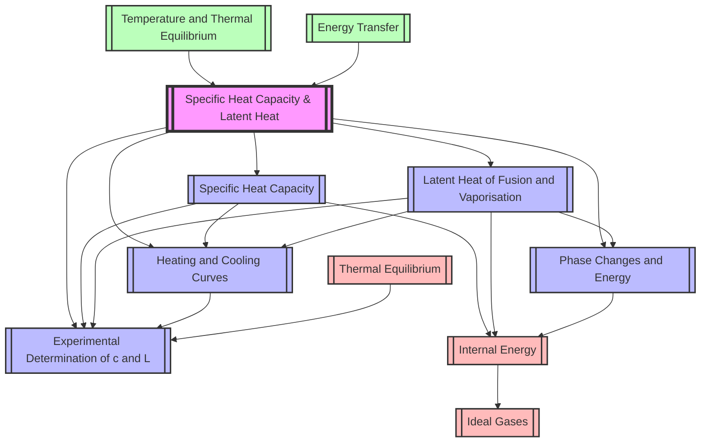

# 1. Overview / 概述

**English:**
This topic explores the quantitative relationship between heat energy transfer and temperature change or phase change in materials. Specific Heat Capacity ($c$) quantifies the energy required to raise the temperature of 1 kg of a substance by 1 K (or 1°C), while Latent Heat ($L$) quantifies the energy required to change the phase of 1 kg of a substance without changing its temperature. These concepts are fundamental to understanding [[Internal Energy]], thermal storage, and energy transfer in physical systems.

In the real world, these principles explain why coastal climates are milder than inland climates (water's high specific heat capacity), how sweating cools the body (latent heat of vaporisation), and why steam burns are more dangerous than boiling water burns (latent heat of condensation). Engineers use these concepts in designing cooling systems, heat exchangers, and thermal energy storage for renewable energy systems.

For Cambridge 9702 (Topic 10.3 a-g) and Edexcel IAL (WPH11 U1: 5.8-5.12), this is an intermediate-level AS topic that bridges [[Temperature and Thermal Equilibrium]] with [[Ideal Gases]]. Students must master both definitions, calculations involving $Q = mc\Delta T$ and $Q = mL$, experimental determination methods, and interpretation of [[Heating and Cooling Curves]].

**中文：**
本专题探讨热能传递与温度变化或物态变化之间的定量关系。比热容（$c$）量化了使1千克物质温度升高1K（或1°C）所需的能量，而潜热（$L$）量化了使1千克物质发生物态变化而不改变温度所需的能量。这些概念是理解[[内能]]、热储存和物理系统中能量传递的基础。

在现实世界中，这些原理解释了为什么沿海气候比内陆气候温和（水的高比热容）、出汗如何冷却身体（汽化潜热），以及为什么蒸汽烫伤比沸水烫伤更危险（凝结潜热）。工程师在设计冷却系统、热交换器和可再生能源系统的热能储存时使用这些概念。

对于剑桥9702（主题10.3 a-g）和爱德思IAL（WPH11 U1: 5.8-5.12），这是一个中等难度的AS专题，连接了[[温度与热平衡]]与[[理想气体]]。学生必须掌握定义、涉及$Q = mc\Delta T$和$Q = mL$的计算、实验测定方法以及[[加热和冷却曲线]]的解读。

---

# 2. Syllabus Learning Objectives / 考纲学习目标

| CAIE 9702 (10.3 a-g) | Edexcel IAL (WPH11 U1: 5.8-5.12) |
|----------------------|----------------------------------|
| 10.3(a) Define specific heat capacity and thermal capacity | 5.8 Define specific heat capacity and use $Q = mc\Delta T$ |
| 10.3(b) Use $Q = mc\Delta T$ and $Q = C\Delta T$ where $C$ is thermal capacity | 5.9 Define specific latent heat of fusion and vaporisation, use $Q = mL$ |
| 10.3(c) Describe an electrical experiment to determine $c$ for a solid or liquid | 5.10 Describe an experiment to determine specific heat capacity of a solid or liquid |
| 10.3(d) Define specific latent heat of fusion and vaporisation | 5.11 Describe an experiment to determine specific latent heat of a substance |
| 10.3(e) Use $Q = mL$ for phase changes | 5.12 Interpret [[Heating and Cooling Curves]] and calculate energy changes |
| 10.3(f) Describe an experiment to determine $L$ for ice and water | — |
| 10.3(g) Interpret [[Heating and Cooling Curves]] | — |

**Examiner Expectations / 考官期望:**

**English:**
- Candidates must use correct SI units: $c$ in J kg⁻¹ K⁻¹, $L$ in J kg⁻¹
- Distinguish clearly between specific heat capacity and thermal capacity
- Recognise that temperature change uses $\Delta T$ in Kelvin or Celsius (same numerical value for differences)
- For phase changes, temperature remains constant during the change
- Experimental methods must include: electrical methods (preferred), method of mixtures, continuous flow method
- Error analysis: heat losses to surroundings, incomplete insulation, non-steady state conditions

**中文：**
- 考生必须使用正确的SI单位：$c$的单位为J kg⁻¹ K⁻¹，$L$的单位为J kg⁻¹
- 清楚区分比热容和热容量
- 认识到温度变化使用$\Delta T$，开尔文或摄氏度的数值变化相同
- 对于物态变化，温度在变化过程中保持不变
- 实验方法必须包括：电学方法（首选）、混合法、连续流动法
- 误差分析：向周围环境的热损失、不完全隔热、非稳态条件

> 📋 **CIE Only:** CAIE specifically requires experiments for both $c$ and $L$ determination, including the method for latent heat of fusion of ice and latent heat of vaporisation of water.
>
> 📋 **Edexcel Only:** Edexcel focuses more on the application of equations to [[Heating and Cooling Curves]] and may include questions on thermal equilibrium calculations involving multiple substances.

---

# 3. Core Definitions / 核心定义

| Term (EN/CN) | Definition (EN) | Definition (CN) | Common Mistakes / 常见错误 |
|--------------|-----------------|-----------------|---------------------------|
| **Specific Heat Capacity** / 比热容 | The energy required to raise the temperature of 1 kg of a substance by 1 K (or 1°C) without change of phase. | 使1千克物质温度升高1K（或1°C）而不发生物态变化所需的能量。 | ❌ Confusing with thermal capacity (which is for the whole object, not per kg). ❌ Using wrong units (J/°C instead of J kg⁻¹ K⁻¹). |
| **Thermal Capacity** / 热容量 | The energy required to raise the temperature of an entire object by 1 K (or 1°C). $C = mc$ | 使整个物体温度升高1K（或1°C）所需的能量。$C = mc$ | ❌ Thinking thermal capacity is per unit mass. ❌ Confusing with specific heat capacity. |
| **Specific Latent Heat of Fusion** / 熔化潜热 | The energy required to change 1 kg of a substance from solid to liquid at its melting point without temperature change. | 在熔点温度下，使1千克物质从固态变为液态而不改变温度所需的能量。 | ❌ Forgetting temperature is constant. ❌ Using for solid→gas changes. |
| **Specific Latent Heat of Vaporisation** / 汽化潜热 | The energy required to change 1 kg of a substance from liquid to gas at its boiling point without temperature change. | 在沸点温度下，使1千克物质从液态变为气态而不改变温度所需的能量。 | ❌ Confusing with fusion. ❌ Not recognising that vaporisation requires more energy than fusion. |
| **Specific Latent Heat** / 潜热 | General term for energy per unit mass required for a phase change at constant temperature. | 在恒定温度下，单位质量物质发生物态变化所需的能量的统称。 | ❌ Using $Q = mL$ when temperature is also changing. ❌ Forgetting to specify which phase change. |
| **Phase Change** / 物态变化 | A transition between solid, liquid, and gas states of matter. | 物质在固态、液态和气态之间的转变。 | ❌ Thinking temperature changes during phase change. ❌ Confusing melting with boiling. |
| **[[Heating and Cooling Curves]]** / 加热和冷却曲线 | Graphs showing temperature against time as energy is added or removed, showing plateaus during phase changes. | 显示添加或移除能量时温度随时间变化的图表，在物态变化期间显示平台。 | ❌ Not identifying the correct phase change regions. ❌ Misinterpreting gradient changes. |

---

# 4. Key Concepts Explained / 关键概念详解

## 4.1 Specific Heat Capacity / 比热容

### Explanation / 解释
**English:**
Specific heat capacity ($c$) is an intrinsic property of a material that describes how much energy is needed to change its temperature. The defining equation is:

$$Q = mc\Delta T$$

where $Q$ is the thermal energy transferred (J), $m$ is mass (kg), $c$ is specific heat capacity (J kg⁻¹ K⁻¹), and $\Delta T$ is the temperature change (K or °C).

Materials with high $c$ (like water, $c = 4200$ J kg⁻¹ K⁻¹) require more energy to heat up and cool down slowly. Materials with low $c$ (like metals, $c \approx 200-900$ J kg⁻¹ K⁻¹) heat up and cool down quickly. This relates directly to [[Internal Energy]] — adding energy increases the average kinetic energy of particles, raising temperature.

Thermal capacity ($C = mc$) is the energy needed to raise the entire object's temperature by 1 K. For example, a 2 kg aluminium block ($c = 900$ J kg⁻¹ K⁻¹) has thermal capacity $C = 2 \times 900 = 1800$ J K⁻¹.

**中文：**
比热容（$c$）是材料的一种固有属性，描述了改变其温度需要多少能量。定义方程为：

$$Q = mc\Delta T$$

其中$Q$是传递的热能（J），$m$是质量（kg），$c$是比热容（J kg⁻¹ K⁻¹），$\Delta T$是温度变化（K或°C）。

具有高$c$的材料（如水，$c = 4200$ J kg⁻¹ K⁻¹）需要更多能量来加热，冷却缓慢。具有低$c$的材料（如金属，$c \approx 200-900$ J kg⁻¹ K⁻¹）加热和冷却迅速。这与[[内能]]直接相关——增加能量会增加粒子的平均动能，从而提高温度。

热容量（$C = mc$）是将整个物体的温度升高1K所需的能量。例如，一个2kg的铝块（$c = 900$ J kg⁻¹ K⁻¹）的热容量为$C = 2 \times 900 = 1800$ J K⁻¹。

### Physical Meaning / 物理意义
**English:**
- High $c$: Material resists temperature change (thermal buffer)
- Low $c$: Material responds quickly to heating/cooling
- Water's high $c$ explains: coastal climates, car radiators, human body temperature regulation
- Metals' low $c$ explains: rapid cooking, heat sinks, thermometers

**中文：**
- 高$c$：材料抵抗温度变化（热缓冲）
- 低$c$：材料对加热/冷却反应迅速
- 水的高$c$解释：沿海气候、汽车散热器、人体温度调节
- 金属的低$c$解释：快速烹饪、散热器、温度计

### Common Misconceptions / 常见误区
1. ❌ "Specific heat capacity depends on the amount of substance" — It is an intrinsic property, independent of mass.
2. ❌ "Temperature change in °C and K give different numerical values" — For $\Delta T$, 1°C = 1 K.
3. ❌ "Thermal capacity and specific heat capacity are the same" — Thermal capacity is for the whole object ($C = mc$).
4. ❌ "Energy always causes temperature increase" — During phase changes, energy goes to breaking bonds, not increasing temperature.

### Exam Tips / 考试提示
**English:**
- Always check units: $c$ in J kg⁻¹ K⁻¹, not J/°C
- For multi-step problems, identify which parts involve temperature change ($Q = mc\Delta T$) and which involve phase change ($Q = mL$)
- In experiments, electrical methods are preferred because electrical energy can be measured accurately ($E = VIt$)
- Heat losses are the main source of error — use insulation, lid, and low thermal conductivity materials

**中文：**
- 始终检查单位：$c$的单位是J kg⁻¹ K⁻¹，不是J/°C
- 对于多步骤问题，确定哪些部分涉及温度变化（$Q = mc\Delta T$），哪些涉及物态变化（$Q = mL$）
- 在实验中，电学方法更优，因为电能可以精确测量（$E = VIt$）
- 热损失是主要误差来源——使用隔热材料、盖子和低导热率材料

---

## 4.2 Latent Heat / 潜热

### Explanation / 解释
**English:**
Latent heat is the energy absorbed or released during a phase change at constant temperature. The energy goes into breaking or forming intermolecular bonds, not into increasing kinetic energy (temperature). The defining equation is:

$$Q = mL$$

where $Q$ is thermal energy (J), $m$ is mass (kg), and $L$ is specific latent heat (J kg⁻¹).

There are two types:
- **Specific Latent Heat of Fusion ($L_f$):** Solid ↔ Liquid (melting/freezing)
- **Specific Latent Heat of Vaporisation ($L_v$):** Liquid ↔ Gas (boiling/condensation)

For water: $L_f = 3.34 \times 10^5$ J kg⁻¹, $L_v = 2.26 \times 10^6$ J kg⁻¹. Note that $L_v > L_f$ because vaporisation requires breaking all intermolecular bonds, while fusion only breaks some.

This concept is crucial for understanding [[Phase Changes and Energy]] and interpreting [[Heating and Cooling Curves]].

**中文：**
潜热是在恒定温度下物态变化过程中吸收或释放的能量。能量用于打破或形成分子间键，而不是增加动能（温度）。定义方程为：

$$Q = mL$$

其中$Q$是热能（J），$m$是质量（kg），$L$是比潜热（J kg⁻¹）。

有两种类型：
- **熔化潜热（$L_f$）：** 固态↔液态（熔化/凝固）
- **汽化潜热（$L_v$）：** 液态↔气态（沸腾/凝结）

对于水：$L_f = 3.34 \times 10^5$ J kg⁻¹，$L_v = 2.26 \times 10^6$ J kg⁻¹。注意$L_v > L_f$，因为汽化需要打破所有分子间键，而熔化只打破部分。

这个概念对于理解[[物态变化与能量]]和解读[[加热和冷却曲线]]至关重要。

### Physical Meaning / 物理意义
**English:**
- Fusion: Energy to overcome solid's ordered structure → liquid's disordered structure
- Vaporisation: Energy to completely separate molecules → gas phase
- Condensation releases large amounts of energy (steam burns!)
- Freezing releases energy (ice formation on roads releases heat)

**中文：**
- 熔化：克服固体的有序结构→液体的无序结构所需的能量
- 汽化：完全分离分子→气相所需的能量
- 凝结释放大量能量（蒸汽烫伤！）
- 凝固释放能量（道路结冰释放热量）

### Common Misconceptions / 常见误区
1. ❌ "Temperature increases during phase change" — Temperature remains constant.
2. ❌ "Latent heat of fusion and vaporisation are the same" — $L_v$ is typically much larger.
3. ❌ "Latent heat is the same for all substances" — It depends on the strength of intermolecular forces.
4. ❌ "Energy is lost during phase changes" — Energy is conserved; it is stored as potential energy in bonds.

### Exam Tips / 考试提示
**English:**
- For steam burns: steam at 100°C releases $L_v$ to condense, then $mc\Delta T$ to cool to skin temperature — much more energy than boiling water at 100°C
- In calculations, clearly separate temperature change and phase change stages
- For cooling curves, the reverse processes occur (condensation, freezing) with energy released
- Use conservation of energy: energy lost by hot substance = energy gained by cold substance (assuming no heat loss)

**中文：**
- 对于蒸汽烫伤：100°C的蒸汽释放$L_v$凝结，然后$mc\Delta T$冷却到皮肤温度——比100°C的沸水释放的能量多得多
- 在计算中，清楚区分温度变化和物态变化阶段
- 对于冷却曲线，发生反向过程（凝结、凝固），释放能量
- 使用能量守恒：热物质损失的能量 = 冷物质获得的能量（假设无热损失）

---

## 4.3 [[Heating and Cooling Curves]] / 加热和冷却曲线

### Explanation / 解释
**English:**
A heating curve shows temperature against time as a substance is heated at a constant rate. The curve has distinct regions:

1. **Solid heating:** Temperature rises, gradient depends on $c_{solid}$
2. **Melting (plateau):** Temperature constant at melting point, energy used for $L_f$
3. **Liquid heating:** Temperature rises, gradient depends on $c_{liquid}$
4. **Boiling (plateau):** Temperature constant at boiling point, energy used for $L_v$
5. **Gas heating:** Temperature rises, gradient depends on $c_{gas}$

The cooling curve is the reverse, with plateaus at freezing and condensation points.

The gradient of the heating portion is $\frac{\Delta T}{\Delta t} = \frac{P}{mc}$ where $P$ is the heating power. Steeper gradient means lower $c$ or smaller mass.

**中文：**
加热曲线显示以恒定速率加热物质时温度随时间的变化。曲线有不同区域：

1. **固体加热：** 温度上升，斜率取决于$c_{固体}$
2. **熔化（平台）：** 温度在熔点恒定，能量用于$L_f$
3. **液体加热：** 温度上升，斜率取决于$c_{液体}$
4. **沸腾（平台）：** 温度在沸点恒定，能量用于$L_v$
5. **气体加热：** 温度上升，斜率取决于$c_{气体}$

冷却曲线是反向的，在凝固点和凝结点有平台。

加热部分的斜率为$\frac{\Delta T}{\Delta t} = \frac{P}{mc}$，其中$P$是加热功率。斜率越陡意味着$c$越小或质量越小。

### Physical Meaning / 物理意义
**English:**
- Plateaus indicate phase changes where energy breaks/forms bonds
- Different gradients for solid/liquid/gas show different $c$ values
- Length of plateau depends on $L$ and heating power
- Impurities cause melting/boiling over a range of temperatures (no sharp plateau)

**中文：**
- 平台表示物态变化，能量打破/形成键
- 固体/液体/气体的不同斜率显示不同的$c$值
- 平台长度取决于$L$和加热功率
- 杂质导致熔化/沸腾在一个温度范围内发生（没有尖锐的平台）

### Common Misconceptions / 常见误区
1. ❌ "The curve is always linear" — Only if heating rate is constant and $c$ is constant.
2. ❌ "All substances have the same shaped curve" — Different $c$ and $L$ values give different gradients and plateau lengths.
3. ❌ "The plateau means no energy is being added" — Energy is still being added, but used for phase change.
4. ❌ "Cooling curves are just heating curves flipped" — Supercooling can occur before freezing.

### Exam Tips / 考试提示
**English:**
- Calculate energy for each section separately, then sum
- Use the gradient to find $c$: $c = \frac{P}{m \times \text{gradient}}$
- Use plateau length to find $L$: $L = \frac{P \times \text{time}}{m}$
- For cooling curves, energy is lost to surroundings at a rate depending on temperature difference

**中文：**
- 分别计算每个部分的能量，然后求和
- 使用斜率求$c$：$c = \frac{P}{m \times \text{斜率}}$
- 使用平台长度求$L$：$L = \frac{P \times \text{时间}}{m}$
- 对于冷却曲线，能量以取决于温差的速度损失到周围环境

---

## 4.4 Experimental Determination of $c$ and $L$ / 比热容和潜热的实验测定

### Explanation / 解释
**English:**
**For Specific Heat Capacity ($c$):**
*Electrical Method (most accurate):*
1. Place an electrical heater and thermometer in the substance (solid block with holes, or liquid in calorimeter)
2. Measure mass $m$, initial temperature $T_i$
3. Supply electrical energy: $E = VIt$ (voltmeter, ammeter, stopwatch)
4. Measure final temperature $T_f$
5. Calculate: $c = \frac{VIt}{m(T_f - T_i)}$
6. Account for heat losses: use insulation, lid, low thermal conductivity stand

*Method of Mixtures:*
1. Heat substance to known temperature, then add to cold water in calorimeter
2. Measure final equilibrium temperature
3. Use conservation of energy: energy lost by hot substance = energy gained by cold water + calorimeter

**For Specific Latent Heat ($L$):**
*Latent Heat of Fusion of Ice:*
1. Add ice to warm water in calorimeter
2. Measure mass of ice added, temperature change of water
3. Energy lost by water = energy gained by ice (to melt + warm to final temperature)
4. $m_{ice}L_f + m_{ice}c_w\Delta T_{ice} = m_wc_w\Delta T_w + C_{cal}\Delta T_w$

*Latent Heat of Vaporisation of Water:*
1. Boil water, pass steam into cold water in calorimeter
2. Measure mass of steam condensed, temperature change
3. Energy lost by steam = energy gained by water + calorimeter
4. $m_{steam}L_v + m_{steam}c_w(100 - T_f) = m_wc_w(T_f - T_i) + C_{cal}(T_f - T_i)$

**中文：**
**对于比热容（$c$）：**
*电学方法（最准确）：*
1. 将电加热器和温度计放入物质中（带孔的固体块，或量热器中的液体）
2. 测量质量$m$，初始温度$T_i$
3. 提供电能：$E = VIt$（电压表、电流表、秒表）
4. 测量最终温度$T_f$
5. 计算：$c = \frac{VIt}{m(T_f - T_i)}$
6. 考虑热损失：使用隔热材料、盖子、低导热率支架

*混合法：*
1. 将物质加热到已知温度，然后加入量热器中的冷水中
2. 测量最终平衡温度
3. 使用能量守恒：热物质损失的能量 = 冷水+量热器获得的能量

**对于潜热（$L$）：**
*冰的熔化潜热：*
1. 将冰加入量热器中的温水中
2. 测量加入冰的质量，水的温度变化
3. 水损失的能量 = 冰获得的能量（熔化+升温到最终温度）
4. $m_{冰}L_f + m_{冰}c_w\Delta T_{冰} = m_wc_w\Delta T_w + C_{量热器}\Delta T_w$

*水的汽化潜热：*
1. 煮沸水，将蒸汽通入量热器中的冷水中
2. 测量凝结蒸汽的质量，温度变化
3. 蒸汽损失的能量 = 水+量热器获得的能量
4. $m_{蒸汽}L_v + m_{蒸汽}c_w(100 - T_f) = m_wc_w(T_f - T_i) + C_{量热器}(T_f - T_i)$

### Physical Meaning / 物理意义
**English:**
- Electrical method is preferred because electrical energy can be measured precisely
- Method of mixtures relies on conservation of energy and thermal equilibrium
- Heat losses are the main source of systematic error
- Using a calorimeter with known thermal capacity improves accuracy

**中文：**
- 电学方法更优，因为电能可以精确测量
- 混合法依赖于能量守恒和热平衡
- 热损失是系统误差的主要来源
- 使用已知热容量的量热器可以提高准确性

### Common Misconceptions / 常见误区
1. ❌ "The electrical method gives exact values" — Heat losses cause systematic underestimation of $c$.
2. ❌ "Method of mixtures is more accurate" — It has more sources of error (heat loss during transfer, incomplete mixing).
3. ❌ "Ice must be dry" — Yes, water on ice surface adds mass that doesn't contribute to melting energy.
4. ❌ "Steam must be dry" — Yes, water droplets in steam add mass that doesn't contribute to condensation energy.

### Exam Tips / 考试提示
**English:**
- For electrical method: use low voltage to avoid high current heating of wires
- For method of mixtures: stir continuously for uniform temperature
- For ice experiment: dry ice with tissue before adding to calorimeter
- For steam experiment: use a steam trap to prevent water droplets entering
- Always calculate percentage uncertainty: $\frac{\Delta c}{c} = \frac{\Delta V}{V} + \frac{\Delta I}{I} + \frac{\Delta t}{t} + \frac{\Delta m}{m} + \frac{\Delta (\Delta T)}{\Delta T}$

**中文：**
- 对于电学方法：使用低电压避免导线大电流发热
- 对于混合法：持续搅拌以确保温度均匀
- 对于冰实验：加入量热器前用纸巾擦干冰
- 对于蒸汽实验：使用蒸汽阱防止水滴进入
- 始终计算百分比不确定度：$\frac{\Delta c}{c} = \frac{\Delta V}{V} + \frac{\Delta I}{I} + \frac{\Delta t}{t} + \frac{\Delta m}{m} + \frac{\Delta (\Delta T)}{\Delta T}$

---

# 5. Essential Equations / 核心公式

## 5.1 Specific Heat Capacity Equation / 比热容公式

**Equation / 公式:**
$$Q = mc\Delta T$$

**Variables / 变量:**
| Symbol (符号) | Meaning (EN) | Meaning (CN) | Unit (单位) |
|--------------|-------------|-------------|------------|
| $Q$ | Thermal energy transferred | 传递的热能 | J (joule) |
| $m$ | Mass of substance | 物质的质量 | kg (kilogram) |
| $c$ | Specific heat capacity | 比热容 | J kg⁻¹ K⁻¹ |
| $\Delta T$ | Temperature change | 温度变化 | K or °C |

**Derivation / 推导:**
**English:**
The specific heat capacity is defined as $c = \frac{Q}{m\Delta T}$. Rearranging gives $Q = mc\Delta T$. This is an empirical relationship based on experimental observation that for a given substance, the energy required is proportional to both mass and temperature change.

**中文：**
比热容定义为$c = \frac{Q}{m\Delta T}$。重新排列得到$Q = mc\Delta T$。这是一个基于实验观察的经验关系，对于给定物质，所需能量与质量和温度变化都成正比。

**Conditions / 适用条件:**
**English:**
- No phase change occurs during the temperature change
- $c$ is constant over the temperature range (approximately true for small $\Delta T$)
- No heat loss to surroundings (ideal case)

**中文：**
- 温度变化期间不发生物态变化
- $c$在温度范围内恒定（对于小$\Delta T$近似成立）
- 没有向周围环境的热损失（理想情况）

**Limitations / 局限性:**
**English:**
- $c$ varies with temperature for some materials (especially near phase changes)
- Does not account for heat losses in real systems
- Cannot be used during phase changes (use $Q = mL$)

**中文：**
- 对于某些材料，$c$随温度变化（尤其在物态变化附近）
- 不考虑实际系统中的热损失
- 在物态变化期间不能使用（使用$Q = mL$）

**Rearrangements / 变形:**
**English:**
- $c = \frac{Q}{m\Delta T}$ — finding specific heat capacity
- $m = \frac{Q}{c\Delta T}$ — finding mass
- $\Delta T = \frac{Q}{mc}$ — finding temperature change
- $C = mc$ — thermal capacity

**中文：**
- $c = \frac{Q}{m\Delta T}$ — 求比热容
- $m = \frac{Q}{c\Delta T}$ — 求质量
- $\Delta T = \frac{Q}{mc}$ — 求温度变化
- $C = mc$ — 热容量

---

## 5.2 Thermal Capacity Equation / 热容量公式

**Equation / 公式:**
$$Q = C\Delta T$$

**Variables / 变量:**
| Symbol (符号) | Meaning (EN) | Meaning (CN) | Unit (单位) |
|--------------|-------------|-------------|------------|
| $Q$ | Thermal energy transferred | 传递的热能 | J |
| $C$ | Thermal capacity ($C = mc$) | 热容量 | J K⁻¹ |
| $\Delta T$ | Temperature change | 温度变化 | K or °C |

**Derivation / 推导:**
**English:**
From $Q = mc\Delta T$, define $C = mc$ as the thermal capacity of the whole object. Then $Q = C\Delta T$. This is useful when dealing with objects of known thermal capacity (like a calorimeter).

**中文：**
从$Q = mc\Delta T$，定义$C = mc$为整个物体的热容量。则$Q = C\Delta T$。这在处理已知热容量的物体（如量热器）时很有用。

**Conditions / 适用条件:**
**English:**
Same as for $Q = mc\Delta T$, but applies to the whole object rather than per unit mass.

**中文：**
与$Q = mc\Delta T$相同，但适用于整个物体而非单位质量。

**Limitations / 局限性:**
**English:**
- $C$ depends on the mass of the object, so it is not an intrinsic property
- Cannot be used to compare different materials (use $c$ instead)

**中文：**
- $C$取决于物体的质量，因此不是固有属性
- 不能用于比较不同材料（应使用$c$）

**Rearrangements / 变形:**
**English:**
- $C = \frac{Q}{\Delta T}$ — finding thermal capacity
- $\Delta T = \frac{Q}{C}$ — finding temperature change

**中文：**
- $C = \frac{Q}{\Delta T}$ — 求热容量
- $\Delta T = \frac{Q}{C}$ — 求温度变化

---

## 5.3 Latent Heat Equation / 潜热公式

**Equation / 公式:**
$$Q = mL$$

**Variables / 变量:**
| Symbol (符号) | Meaning (EN) | Meaning (CN) | Unit (单位) |
|--------------|-------------|-------------|------------|
| $Q$ | Thermal energy transferred during phase change | 物态变化期间传递的热能 | J |
| $m$ | Mass of substance changing phase | 发生物态变化的物质质量 | kg |
| $L$ | Specific latent heat | 比潜热 | J kg⁻¹ |

**Derivation / 推导:**
**English:**
The specific latent heat is defined as $L = \frac{Q}{m}$. Rearranging gives $Q = mL$. This is an empirical relationship based on experimental observation that the energy required for a phase change is proportional to the mass of the substance.

**中文：**
比潜热定义为$L = \frac{Q}{m}$。重新排列得到$Q = mL$。这是一个基于实验观察的经验关系，物态变化所需的能量与物质的质量成正比。

**Conditions / 适用条件:**
**English:**
- Temperature remains constant during the phase change
- The substance is at its melting point (for fusion) or boiling point (for vaporisation)
- The entire mass undergoes the phase change

**中文：**
- 物态变化期间温度保持恒定
- 物质处于熔点（对于熔化）或沸点（对于汽化）
- 整个质量发生物态变化

**Limitations / 局限性:**
**English:**
- Cannot be used if temperature is also changing (use $Q = mc\Delta T$ for that part)
- $L$ varies slightly with pressure (especially $L_v$)
- Impurities cause phase change over a temperature range

**中文：**
- 如果温度也在变化则不能使用（该部分使用$Q = mc\Delta T$）
- $L$随压力略有变化（尤其是$L_v$）
- 杂质导致物态变化在一个温度范围内发生

**Rearrangements / 变形:**
**English:**
- $L = \frac{Q}{m}$ — finding specific latent heat
- $m = \frac{Q}{L}$ — finding mass

**中文：**
- $L = \frac{Q}{m}$ — 求比潜热
- $m = \frac{Q}{L}$ — 求质量

---

## 5.4 Electrical Energy Equation / 电能公式

**Equation / 公式:**
$$E = VIt$$

**Variables / 变量:**
| Symbol (符号) | Meaning (EN) | Meaning (CN) | Unit (单位) |
|--------------|-------------|-------------|------------|
| $E$ | Electrical energy supplied | 提供的电能 | J |
| $V$ | Potential difference across heater | 加热器两端的电势差 | V (volt) |
| $I$ | Current through heater | 通过加热器的电流 | A (ampere) |
| $t$ | Time heater is on | 加热器开启时间 | s (second) |

**Derivation / 推导:**
**English:**
From electrical power $P = VI$ and energy $E = Pt$, combining gives $E = VIt$. This is used in electrical methods for determining $c$ and $L$.

**中文：**
从电功率$P = VI$和能量$E = Pt$，结合得到$E = VIt$。这用于测定$c$和$L$的电学方法。

**Conditions / 适用条件:**
**English:**
- All electrical energy is converted to thermal energy (100% efficiency assumed)
- Heater is purely resistive (no inductive or capacitive effects)

**中文：**
- 所有电能都转化为热能（假设100%效率）
- 加热器是纯电阻的（无电感或电容效应）

**Limitations / 局限性:**
**English:**
- Some energy may be lost as light if heater glows
- Wires have resistance, causing some power loss
- Not all electrical energy may go into the substance (heat losses)

**中文：**
- 如果加热器发光，部分能量可能以光的形式损失
- 导线有电阻，导致一些功率损失
- 并非所有电能都进入物质（热损失）

**Rearrangements / 变形:**
**English:**
- $V = \frac{E}{It}$ — finding voltage
- $I = \frac{E}{Vt}$ — finding current
- $t = \frac{E}{VI}$ — finding time

**中文：**
- $V = \frac{E}{It}$ — 求电压
- $I = \frac{E}{Vt}$ — 求电流
- $t = \frac{E}{VI}$ — 求时间

---

## 5.5 Conservation of Energy (Method of Mixtures) / 能量守恒（混合法）

**Equation / 公式:**
$$m_h c_h (T_h - T_f) = m_c c_c (T_f - T_c) + C_{cal}(T_f - T_c)$$

**Variables / 变量:**
| Symbol (符号) | Meaning (EN) | Meaning (CN) | Unit (单位) |
|--------------|-------------|-------------|------------|
| $m_h$ | Mass of hot substance | 热物质的质量 | kg |
| $c_h$ | Specific heat capacity of hot substance | 热物质的比热容 | J kg⁻¹ K⁻¹ |
| $T_h$ | Initial temperature of hot substance | 热物质的初始温度 | °C or K |
| $T_f$ | Final equilibrium temperature | 最终平衡温度 | °C or K |
| $m_c$ | Mass of cold substance | 冷物质的质量 | kg |
| $c_c$ | Specific heat capacity of cold substance | 冷物质的比热容 | J kg⁻¹ K⁻¹ |
| $T_c$ | Initial temperature of cold substance | 冷物质的初始温度 | °C or K |
| $C_{cal}$ | Thermal capacity of calorimeter | 量热器的热容量 | J K⁻¹ |

**Derivation / 推导:**
**English:**
Based on the principle of conservation of energy: energy lost by hot substance = energy gained by cold substance + energy gained by calorimeter. Assuming no heat loss to surroundings.

**中文：**
基于能量守恒原理：热物质损失的能量 = 冷物质获得的能量 + 量热器获得的能量。假设没有向周围环境的热损失。

**Conditions / 适用条件:**
**English:**
- System is thermally isolated (no heat exchange with surroundings)
- All substances reach the same final temperature (thermal equilibrium)
- No phase changes occur (unless specifically accounted for)

**中文：**
- 系统是热隔离的（与周围环境无热交换）
- 所有物质达到相同的最终温度（热平衡）
- 不发生物态变化（除非特别考虑）

**Limitations / 局限性:**
**English:**
- Heat losses to surroundings are inevitable in practice
- Temperature may not be uniform throughout the mixture
- Heat capacity of thermometer and stirrer may need to be included

**中文：**
- 实际中向周围环境的热损失不可避免
- 混合物中的温度可能不均匀
- 可能需要包括温度计和搅拌器的热容量

**Rearrangements / 变形:**
**English:**
- For finding unknown $c$: $c_h = \frac{m_c c_c (T_f - T_c) + C_{cal}(T_f - T_c)}{m_h (T_h - T_f)}$
- For finding unknown $m$: $m_h = \frac{m_c c_c (T_f - T_c) + C_{cal}(T_f - T_c)}{c_h (T_h - T_f)}$

**中文：**
- 求未知$c$：$c_h = \frac{m_c c_c (T_f - T_c) + C_{cal}(T_f - T_c)}{m_h (T_h - T_f)}$
- 求未知$m$：$m_h = \frac{m_c c_c (T_f - T_c) + C_{cal}(T_f - T_c)}{c_h (T_h - T_f)}$

---

# 6. Graphs and Relationships / 图表与关系

## 6.1 Heating Curve / 加热曲线

### Axes / 坐标轴
**English:** x-axis: Time (s) or Energy Added (J); y-axis: Temperature (°C or K)
**中文：** x轴：时间（s）或添加的能量（J）；y轴：温度（°C或K）

### Shape / 形状
**English:** A series of linear segments connected by horizontal plateaus. The linear segments have different gradients depending on the phase (solid, liquid, gas). The plateaus occur at the melting point and boiling point.
**中文：** 一系列由水平平台连接的线性段。线性段具有不同的斜率，取决于物相（固体、液体、气体）。平台出现在熔点和沸点。

### Gradient Meaning / 斜率含义
**English:** The gradient $\frac{\Delta T}{\Delta t} = \frac{P}{mc}$, where $P$ is the heating power. A steeper gradient means:
- Lower specific heat capacity ($c$)
- Smaller mass ($m$)
- Higher heating power ($P$)

Different gradients for solid, liquid, and gas indicate different $c$ values for each phase.

**中文：** 斜率$\frac{\Delta T}{\Delta t} = \frac{P}{mc}$，其中$P$是加热功率。斜率越陡意味着：
- 比热容（$c$）越小
- 质量（$m$）越小
- 加热功率（$P$）越大

固体、液体和气体的不同斜率表示每个物相的不同$c$值。

### Area Meaning / 面积含义
**English:** The area under a power-time graph gives total energy supplied. For a temperature-time graph, the area is not directly meaningful, but the length of the plateau multiplied by the heating power gives the energy for the phase change: $Q = P \times t_{plateau}$.
**中文：** 功率-时间图下的面积给出总供能。对于温度-时间图，面积没有直接意义，但平台长度乘以加热功率给出物态变化的能量：$Q = P \times t_{plateau}$。

### Exam Interpretation / 考试解读
**English:**
- Identify which phase each segment represents
- Calculate energy for each segment separately
- Use plateau length to find $L$: $L = \frac{P \times t_{plateau}}{m}$
- Use gradient to find $c$: $c = \frac{P}{m \times \text{gradient}}$
- Compare gradients to determine which phase has higher $c$

**中文：**
- 确定每个线段代表的物相
- 分别计算每个线段的能量
- 使用平台长度求$L$：$L = \frac{P \times t_{平台}}{m}$
- 使用斜率求$c$：$c = \frac{P}{m \times \text{斜率}}$
- 比较斜率以确定哪个物相具有更高的$c$

### Common Questions / 常见问题
**English:**
1. "Explain why the temperature remains constant during the phase change."
2. "Calculate the specific latent heat of fusion from the graph."
3. "Determine the specific heat capacity of the liquid phase."
4. "Why is the gradient for the gas phase steeper than for the liquid phase?"

**中文：**
1. "解释为什么在物态变化期间温度保持不变。"
2. "从图中计算熔化潜热。"
3. "确定液相的比热容。"
4. "为什么气相的斜率比液相更陡？"

> 📷 **IMAGE PROMPT — HC01: Typical Heating Curve for Water**
>
> A graph showing temperature (°C) on the y-axis (0 to 120) against time (minutes) on the x-axis. The curve starts at -10°C (ice), rises linearly to 0°C, has a horizontal plateau at 0°C (melting), rises linearly to 100°C, has a horizontal plateau at 100°C (boiling), then rises linearly above 100°C (steam). The solid phase gradient is steeper than the liquid phase gradient. The gas phase gradient is steepest. Labels: "Solid (ice)", "Melting", "Liquid (water)", "Boiling", "Gas (steam)". Clean white background, clear grid lines, professional scientific graph style.

---

## 6.2 Cooling Curve / 冷却曲线

### Axes / 坐标轴
**English:** x-axis: Time (s); y-axis: Temperature (°C or K)
**中文：** x轴：时间（s）；y轴：温度（°C或K）

### Shape / 形状
**English:** The reverse of the heating curve. Temperature decreases linearly, then plateaus at condensation point (gas→liquid), then decreases linearly, then plateaus at freezing point (liquid→solid), then decreases linearly. The cooling rate depends on the temperature difference with surroundings (Newton's law of cooling).
**中文：** 加热曲线的反向。温度线性下降，然后在凝结点（气体→液体）出现平台，然后线性下降，然后在凝固点（液体→固体）出现平台，然后线性下降。冷却速率取决于与周围环境的温差（牛顿冷却定律）。

### Gradient Meaning / 斜率含义
**English:** The gradient $\frac{\Delta T}{\Delta t}$ is negative (cooling). A steeper (more negative) gradient means faster cooling, which occurs when:
- The temperature difference with surroundings is large
- The specific heat capacity is low
- The mass is small
- The surface area is large

**中文：** 斜率$\frac{\Delta T}{\Delta t}$为负（冷却）。斜率越陡（更负）意味着冷却越快，发生在：
- 与周围环境的温差大
- 比热容低
- 质量小
- 表面积大

### Area Meaning / 面积含义
**English:** The area under a cooling power-time graph gives total energy removed. The plateau length times the cooling power gives the energy released during condensation or freezing.
**中文：** 冷却功率-时间图下的面积给出移除的总能量。平台长度乘以冷却功率给出凝结或凝固期间释放的能量。

### Exam Interpretation / 考试解读
**English:**
- Identify supercooling (liquid cooled below freezing point without solidifying)
- Explain why the cooling curve is not a perfect mirror of the heating curve
- Calculate energy released during phase changes
- Discuss factors affecting cooling rate

**中文：**
- 识别过冷（液体冷却到凝固点以下而不凝固）
- 解释为什么冷却曲线不是加热曲线的完美镜像
- 计算物态变化期间释放的能量
- 讨论影响冷却速率的因素

### Common Questions / 常见问题
**English:**
1. "Sketch the cooling curve for a substance as it cools from gas to solid."
2. "Explain the shape of the cooling curve at the condensation point."
3. "Why does the cooling rate decrease as the substance approaches room temperature?"
4. "What is supercooling and how does it appear on the cooling curve?"

**中文：**
1. "画出物质从气体冷却到固体时的冷却曲线草图。"
2. "解释冷却曲线在凝结点的形状。"
3. "为什么当物质接近室温时冷却速率降低？"
4. "什么是过冷？它在冷却曲线上如何出现？"

> 📷 **IMAGE PROMPT — CC01: Cooling Curve Showing Supercooling**
>
> A graph showing temperature (°C) on the y-axis against time (minutes) on the x-axis. The curve starts at 120°C (steam), decreases linearly to 100°C, has a horizontal plateau at 100°C (condensation), decreases linearly below 100°C to below 0°C (supercooled liquid), then suddenly rises to 0°C (freezing point), has a horizontal plateau at 0°C (freezing), then decreases linearly below 0°C (solid). The supercooling dip is clearly labelled. Clean white background, clear grid lines, professional scientific graph style.

---

## 6.3 Temperature vs Energy Added Graph / 温度与添加能量关系图

### Axes / 坐标轴
**English:** x-axis: Energy Added (J); y-axis: Temperature (°C or K)
**中文：** x轴：添加的能量（J）；y轴：温度（°C或K）

### Shape / 形状
**English:** Similar to the heating curve but the x-axis is energy rather than time. This removes the effect of varying heating power. The gradients are $\frac{\Delta T}{\Delta Q} = \frac{1}{mc}$, so the graph directly shows the relationship between energy input and temperature change.
**中文：** 类似于加热曲线，但x轴是能量而非时间。这消除了变化加热功率的影响。斜率为$\frac{\Delta T}{\Delta Q} = \frac{1}{mc}$，因此该图直接显示能量输入与温度变化之间的关系。

### Gradient Meaning / 斜率含义
**English:** The gradient $\frac{\Delta T}{\Delta Q} = \frac{1}{mc}$. A steeper gradient means a smaller $c$ or smaller $m$. The reciprocal of the gradient gives the thermal capacity $C = mc$.
**中文：** 斜率$\frac{\Delta T}{\Delta Q} = \frac{1}{mc}$。斜率越陡意味着$c$越小或$m$越小。斜率的倒数给出热容量$C = mc$。

### Area Meaning / 面积含义
**English:** The area under this graph is not directly meaningful. However, the length of the plateau on the energy axis directly gives the energy required for the phase change: $Q = mL$.
**中文：** 该图下的面积没有直接意义。然而，能量轴上平台的长度直接给出物态变化所需的能量：$Q = mL$。

### Exam Interpretation / 考试解读
**English:**
- Directly read the energy required for phase changes from plateau lengths
- Compare $c$ values from gradients
- Calculate total energy for a complete heating process by summing segment energies

**中文：**
- 直接从平台长度读取物态变化所需的能量
- 从斜率比较$c$值
- 通过求和线段能量计算完整加热过程的总能量

### Common Questions / 常见问题
**English:**
1. "From the graph, determine the specific latent heat of vaporisation."
2. "Which phase has the highest specific heat capacity? Explain."
3. "Calculate the total energy required to convert 0.5 kg of ice at -10°C to steam at 110°C."

**中文：**
1. "从图中确定汽化潜热。"
2. "哪个物相具有最高的比热容？解释。"
3. "计算将0.5kg的-10°C冰转化为110°C蒸汽所需的总能量。"

---

# 7. Required Diagrams / 必备图表

## 7.1 Electrical Method for Determining Specific Heat Capacity / 测定比热容的电学方法

### Description / 描述
**English:**
A diagram showing an electrical circuit used to determine the specific heat capacity of a solid (e.g., aluminium block) or liquid. The setup includes:
- A power supply connected to an electrical heater immersed in the substance
- A voltmeter in parallel with the heater
- An ammeter in series with the heater
- A thermometer or temperature sensor inserted into the substance
- The substance is insulated (e.g., polystyrene container or lagging)
- For a solid block, holes are drilled for the heater and thermometer
- For a liquid, the heater and thermometer are immersed in the liquid, which is in a calorimeter

**中文：**
显示用于测定固体（如铝块）或液体比热容的电路图。装置包括：
- 连接到浸入物质中的电加热器的电源
- 与加热器并联的电压表
- 与加热器串联的电流表
- 插入物质中的温度计或温度传感器
- 物质被隔热（如聚苯乙烯容器或保温材料）
- 对于固体块，钻有用于加热器和温度计的孔
- 对于液体，加热器和温度计浸入液体中，液体在量热器中

### Image Prompt / 图片生成提示
> 📷 **IMAGE PROMPT — EM01: Electrical Method for Specific Heat Capacity**
>
> A detailed scientific diagram showing an aluminium block (silver, cylindrical, approximately 10 cm diameter, 15 cm height) with two drilled holes. One hole contains a cylindrical electrical heating element (red and black wires emerging). The other hole contains a glass thermometer (mercury or digital probe). The block is wrapped in insulating material (white foam or fibreglass wool). The electrical circuit is shown: a DC power supply (12V) connected via wires to the heater, with a voltmeter (V) connected across the heater terminals and an ammeter (A) in series. A stopwatch is shown nearby. Labels: "Aluminium block", "Heater", "Thermometer", "Insulation", "Power supply", "V", "A", "Stopwatch". Clean white background, professional textbook-style diagram, clear labels, 2D isometric view.

### Labels Required / 需要标注
**English:** Aluminium block, Heater, Thermometer, Insulation, Power supply, Voltmeter (V), Ammeter (A), Stopwatch, Mass (m), Initial temperature (Tᵢ), Final temperature (T_f)
**中文：** 铝块、加热器、温度计、隔热材料、电源、电压表（V）、电流表（A）、秒表、质量（m）、初始温度（Tᵢ）、最终温度（T_f）

### Exam Importance / 考试重要性
**English:**
- Standard experiment for both CAIE and Edexcel
- Tests understanding of energy measurement, circuit connections, and error analysis
- Common source of 6-mark questions in Paper 3 (CAIE) and Unit 3 (Edexcel)
- Requires knowledge of how to improve accuracy (insulation, stirring, using digital thermometer)

**中文：**
- CAIE和Edexcel的标准实验
- 测试对能量测量、电路连接和误差分析的理解
- Paper 3（CAIE）和Unit 3（Edexcel）中6分题的常见来源
- 需要知道如何提高准确性（隔热、搅拌、使用数字温度计）

---

## 7.2 Method of Mixtures for Determining Specific Heat Capacity / 测定比热容的混合法

### Description / 描述
**English:**
A diagram showing the method of mixtures experiment:
- A calorimeter (metal cup, usually copper or aluminium) with known thermal capacity
- The calorimeter contains a known mass of water at a measured temperature
- A heated substance (solid) is transferred from a heating bath to the calorimeter
- The mixture is stirred and the final equilibrium temperature is measured
- A thermometer measures the temperature of the water and the heated substance
- The calorimeter is placed in an insulating jacket to minimise heat loss
- A lid covers the calorimeter to reduce evaporation and heat loss

**中文：**
显示混合法实验的图：
- 量热器（金属杯，通常是铜或铝），已知热容量
- 量热器中含有已知质量的、处于测量温度的水
- 将加热的物质（固体）从加热浴转移到量热器中
- 搅拌混合物，测量最终平衡温度
- 温度计测量水和加热物质的温度
- 量热器放置在隔热外套中以最小化热损失
- 盖子盖住量热器以减少蒸发和热损失

### Image Prompt / 图片生成提示
> 📷 **IMAGE PROMPT — MM01: Method of Mixtures Apparatus**
>
> A detailed scientific diagram showing a copper calorimeter (shiny metal cylinder, approximately 8 cm diameter, 10 cm height) placed inside an insulating jacket (white foam). The calorimeter contains water (blue, approximately half full). A glass thermometer is immersed in the water. A stirrer (metal wire loop) is also in the water. A heated metal block (brass, on a string) is being lowered into the calorimeter. The calorimeter has a lid with holes for the thermometer and stirrer. A separate heating bath (beaker of boiling water on a tripod with Bunsen burner) is shown nearby with another thermometer. Labels: "Calorimeter", "Water", "Thermometer", "Stirrer", "Heated metal block", "Insulating jacket", "Lid", "Heating bath". Clean white background, professional textbook-style diagram, clear labels, 2D cross-sectional view.

### Labels Required / 需要标注
**English:** Calorimeter, Water, Thermometer, Stirrer, Heated metal block, Insulating jacket, Lid, Heating bath, Mass of water (m_w), Mass of block (m_b), Initial temperature of water (T_w), Initial temperature of block (T_b), Final temperature (T_f)
**中文：** 量热器、水、温度计、搅拌器、加热的金属块、隔热外套、盖子、加热浴、水的质量（m_w）、块的质量（m_b）、水的初始温度（T_w）、块的初始温度（T_b）、最终温度（T_f）

### Exam Importance / 考试重要性
**English:**
- Alternative method to electrical method
- Tests understanding of conservation of energy and thermal equilibrium
- Requires careful consideration of heat losses and how to minimise them
- Often used in exam questions to calculate unknown specific heat capacities

**中文：**
- 电学方法的替代方法
- 测试对能量守恒和热平衡的理解
- 需要仔细考虑热损失以及如何最小化它们
- 常用于考试题中计算未知比热容

---

## 7.3 Determining Latent Heat of Fusion of Ice / 测定冰的熔化潜热

### Description / 描述
**English:**
A diagram showing the experiment to determine the specific latent heat of fusion of ice:
- A calorimeter with known thermal capacity contains warm water at a measured temperature
- Ice cubes (dried with tissue to remove surface water) are added to the calorimeter
- The mixture is stirred until all ice has melted
- The final equilibrium temperature is measured
- The mass of ice added is determined by weighing the calorimeter before and after
- The calorimeter is insulated and covered to minimise heat exchange with surroundings

**中文：**
显示测定冰的熔化潜热的实验图：
- 已知热容量的量热器中含有处于测量温度的温水
- 将冰块（用纸巾擦干表面水）加入量热器
- 搅拌混合物直到所有冰融化
- 测量最终平衡温度
- 通过称量量热器前后的质量确定加入冰的质量
- 量热器被隔热和覆盖以最小化与周围环境的热交换

### Image Prompt / 图片生成提示
> 📷 **IMAGE PROMPT — LH01: Latent Heat of Fusion of Ice Experiment**
>
> A detailed scientific diagram showing a copper calorimeter (shiny metal) placed inside an insulating jacket (white foam). The calorimeter contains warm water (light blue). Ice cubes (translucent, irregular shapes) are being added to the water. A glass thermometer is immersed in the water. A stirrer (metal wire) is also present. The calorimeter has a lid with holes. A digital balance is shown nearby with the calorimeter on it. Labels: "Calorimeter", "Warm water", "Ice cubes", "Thermometer", "Stirrer", "Insulating jacket", "Digital balance", "Mass of ice (m_ice)", "Initial temperature (T_i)", "Final temperature (T_f)". Clean white background, professional textbook-style diagram, clear labels, 2D cross-sectional view.

### Labels Required / 需要标注
**English:** Calorimeter, Warm water, Ice cubes, Thermometer, Stirrer, Insulating jacket, Digital balance, Mass of calorimeter + water (m₁), Mass after adding ice (m₂), Mass of ice (m₂ - m₁), Initial temperature (T_i), Final temperature (T_f)
**中文：** 量热器、温水、冰块、温度计、搅拌器、隔热外套、数字天平、量热器+水的质量（m₁）、加入冰后的质量（m₂）、冰的质量（m₂ - m₁）、初始温度（T_i）、最终温度（T_f）

### Exam Importance / 考试重要性
**English:**
- Specific requirement for CAIE 9702 (10.3f)
- Tests understanding of energy balance during melting
- Requires careful experimental technique (drying ice, stirring, minimising heat loss)
- Common source of calculation questions and error analysis

**中文：**
- CAIE 9702（10.3f）的具体要求
- 测试对熔化过程中能量平衡的理解
- 需要仔细的实验技术（擦干冰、搅拌、最小化热损失）
- 计算题和误差分析的常见来源

---

## 7.4 Determining Latent Heat of Vaporisation of Water / 测定水的汽化潜热

### Description / 描述
**English:**
A diagram showing the experiment to determine the specific latent heat of vaporisation of water:
- Water is boiled in a flask to produce steam
- The steam passes through a delivery tube into a calorimeter containing cold water
- A steam trap prevents water droplets from entering the calorimeter
- The steam condenses in the cold water, releasing latent heat
- The temperature rise of the water and calorimeter is measured
- The mass of steam condensed is determined by weighing the calorimeter before and after
- The calorimeter is insulated and covered

**中文：**
显示测定水的汽化潜热的实验图：
- 水在烧瓶中煮沸产生蒸汽
- 蒸汽通过导管进入含有冷水的量热器
- 蒸汽阱防止水滴进入量热器
- 蒸汽在冷水中凝结，释放潜热
- 测量水和量热器的温度升高
- 通过称量量热器前后的质量确定凝结蒸汽的质量
- 量热器被隔热和覆盖

### Image Prompt / 图片生成提示
> 📷 **IMAGE PROMPT — LH02: Latent Heat of Vaporisation of Water Experiment**
>
> A detailed scientific diagram showing a round-bottom flask (glass) containing boiling water, heated by a Bunsen burner. A rubber stopper with a delivery tube (glass tube bent at 90°) is in the flask neck. The delivery tube passes through a steam trap (a small flask or U-tube to collect water droplets) and then into a copper calorimeter containing cold water (blue). The calorimeter is inside an insulating jacket (white foam) with a lid. A glass thermometer is in the calorimeter water. The calorimeter is on a digital balance. Labels: "Flask with boiling water", "Bunsen burner", "Delivery tube", "Steam trap", "Calorimeter", "Cold water", "Thermometer", "Insulating jacket", "Digital balance", "Mass of steam condensed (m_steam)", "Initial temperature (T_i)", "Final temperature (T_f)". Clean white background, professional textbook-style diagram, clear labels, 2D isometric view.

### Labels Required / 需要标注
**English:** Flask, Boiling water, Bunsen burner, Delivery tube, Steam trap, Calorimeter, Cold water, Thermometer, Insulating jacket, Digital balance, Mass of calorimeter + water (m₁), Mass after condensation (m₂), Mass of steam (m₂ - m₁), Initial temperature (T_i), Final temperature (T_f)
**中文：** 烧瓶、沸水、本生灯、导管、蒸汽阱、量热器、冷水、温度计、隔热外套、数字天平、量热器+水的质量（m₁）、凝结后的质量（m₂）、蒸汽的质量（m₂ - m₁）、初始温度（T_i）、最终温度（T_f）

### Exam Importance / 考试重要性
**English:**
- Specific requirement for CAIE 9702 (10.3f)
- Tests understanding of energy balance during condensation
- Requires careful experimental technique (steam trap, drying, minimising heat loss)
- Common source of calculation questions and error analysis
- Important for understanding why steam burns are more dangerous than boiling water

**中文：**
- CAIE 9702（10.3f）的具体要求
- 测试对凝结过程中能量平衡的理解
- 需要仔细的实验技术（蒸汽阱、干燥、最小化热损失）
- 计算题和误差分析的常见来源
- 对于理解为什么蒸汽烫伤比沸水更危险很重要

---

# 8. Worked Examples / 典型例题

## Example 1: Heating Ice to Steam / 将冰加热成蒸汽

### Question / 题目
**English:**
Calculate the total energy required to convert 0.200 kg of ice at -10.0°C into steam at 110.0°C.

Given data:
- Specific heat capacity of ice: $c_{ice} = 2100$ J kg⁻¹ K⁻¹
- Specific heat capacity of water: $c_{water} = 4200$ J kg⁻¹ K⁻¹
- Specific heat capacity of steam: $c_{steam} = 2000$ J kg⁻¹ K⁻¹
- Specific latent heat of fusion of ice: $L_f = 3.34 \times 10^5$ J kg⁻¹
- Specific latent heat of vaporisation of water: $L_v = 2.26 \times 10^6$ J kg⁻¹

**中文：**
计算将0.200 kg的-10.0°C冰转化为110.0°C蒸汽所需的总能量。

给定数据：
- 冰的比热容：$c_{冰} = 2100$ J kg⁻¹ K⁻¹
- 水的比热容：$c_{水} = 4200$ J kg⁻¹ K⁻¹
- 蒸汽的比热容：$c_{蒸汽} = 2000$ J kg⁻¹ K⁻¹
- 冰的熔化潜热：$L_f = 3.34 \times 10^5$ J kg⁻¹
- 水的汽化潜热：$L_v = 2.26 \times 10^6$ J kg⁻¹

### Solution / 解答

**Step 1: Heat ice from -10.0°C to 0°C**
$$Q_1 = mc_{ice}\Delta T = 0.200 \times 2100 \times (0 - (-10.0)) = 0.200 \times 2100 \times 10.0 = 4200 \text{ J}$$

**Step 2: Melt ice at 0°C (fusion)**
$$Q_2 = mL_f = 0.200 \times 3.34 \times 10^5 = 6.68 \times 10^4 \text{ J}$$

**Step 3: Heat water from 0°C to 100°C**
$$Q_3 = mc_{water}\Delta T = 0.200 \times 4200 \times (100 - 0) = 0.200 \times 4200 \times 100 = 8.40 \times 10^4 \text{ J}$$

**Step 4: Boil water at 100°C (vaporisation)**
$$Q_4 = mL_v = 0.200 \times 2.26 \times 10^6 = 4.52 \times 10^5 \text{ J}$$

**Step 5: Heat steam from 100°C to 110°C**
$$Q_5 = mc_{steam}\Delta T = 0.200 \times 2000 \times (110 - 100) = 0.200 \times 2000 \times 10.0 = 4000 \text{ J}$$

**Step 6: Total energy**
$$Q_{total} = Q_1 + Q_2 + Q_3 + Q_4 + Q_5$$
$$Q_{total} = 4200 + 6.68 \times 10^4 + 8.40 \times 10^4 + 4.52 \times 10^5 + 4000$$
$$Q_{total} = 4200 + 66800 + 84000 + 452000 + 4000 = 611000 \text{ J} = 6.11 \times 10^5 \text{ J}$$

### Final Answer / 最终答案
**Answer:** $6.11 \times 10^5$ J | **答案：** $6.11 \times 10^5$ J

### Examiner Notes / 考官点评
**English:**
- This is a classic 5-step problem that tests understanding of the complete heating process
- Common mistakes: forgetting to include all 5 steps, using wrong $c$ values for each phase, not converting units
- The largest energy requirement is for vaporisation ($Q_4$), which is why steam carries so much energy
- Always check: are you using the correct $c$ for the correct phase?
- For cooling problems, the same steps apply in reverse order with energy released

**中文：**
- 这是一个经典的5步问题，测试对完整加热过程的理解
- 常见错误：忘记包括所有5个步骤，对每个物相使用错误的$c$值，没有转换单位
- 最大的能量需求是汽化（$Q_4$），这就是为什么蒸汽携带如此多的能量
- 始终检查：你是否对正确的物相使用了正确的$c$？
- 对于冷却问题，相同的步骤以相反顺序应用，能量被释放

### Alternative Method / 替代方法
**English:**
Calculate using a single expression:
$$Q_{total} = m[c_{ice}(0 - T_{ice}) + L_f + c_{water}(100 - 0) + L_v + c_{steam}(T_{steam} - 100)]$$
This is more efficient but requires careful bracket handling.

**中文：**
使用单一表达式计算：
$$Q_{总} = m[c_{冰}(0 - T_{冰}) + L_f + c_{水}(100 - 0) + L_v + c_{蒸汽}(T_{蒸汽} - 100)]$$
这更高效，但需要仔细处理括号。

---

## Example 2: Method of Mixtures — Finding Unknown Specific Heat Capacity / 混合法——求未知比热容

### Question / 题目
**English:**
A 0.500 kg aluminium block is heated to 100.0°C and then placed into a copper calorimeter of mass 0.100 kg containing 0.300 kg of water at 20.0°C. The final equilibrium temperature is 30.0°C. Calculate the specific heat capacity of aluminium.

Given data:
- Specific heat capacity of water: $c_w = 4200$ J kg⁻¹ K⁻¹
- Specific heat capacity of copper: $c_{cu} = 390$ J kg⁻¹ K⁻¹

**中文：**
将一个0.500 kg的铝块加热到100.0°C，然后放入一个质量为0.100 kg的铜量热器中，量热器中含有0.300 kg的20.0°C水。最终平衡温度为30.0°C。计算铝的比热容。

给定数据：
- 水的比热容：$c_w = 4200$ J kg⁻¹ K⁻¹
- 铜的比热容：$c_{cu} = 390$ J kg⁻¹ K⁻¹

### Solution / 解答

**Step 1: Identify energy transfers**
Energy lost by aluminium block = Energy gained by water + Energy gained by calorimeter

**Step 2: Write the equation**
$$m_{Al}c_{Al}(T_{Al} - T_f) = m_wc_w(T_f - T_w) + m_{cu}c_{cu}(T_f - T_w)$$

**Step 3: Substitute values**
$$0.500 \times c_{Al} \times (100.0 - 30.0) = 0.300 \times 4200 \times (30.0 - 20.0) + 0.100 \times 390 \times (30.0 - 20.0)$$

**Step 4: Simplify**
$$0.500 \times c_{Al} \times 70.0 = 0.300 \times 4200 \times 10.0 + 0.100 \times 390 \times 10.0$$
$$35.0 \times c_{Al} = 12600 + 390$$
$$35.0 \times c_{Al} = 12990$$

**Step 5: Solve for $c_{Al}$**
$$c_{Al} = \frac{12990}{35.0} = 371 \text{ J kg}^{-1} \text{K}^{-1}$$

### Final Answer / 最终答案
**Answer:** $c_{Al} = 371$ J kg⁻¹ K⁻¹ | **答案：** $c_{Al} = 371$ J kg⁻¹ K⁻¹

### Examiner Notes / 考官点评
**English:**
- The accepted value for aluminium is approximately 900 J kg⁻¹ K⁻¹ — the low experimental value indicates significant heat loss
- Common mistakes: forgetting to include the calorimeter's energy gain, using wrong temperature differences, not converting to Kelvin (though differences are the same)
- The calorimeter's thermal capacity ($m_{cu}c_{cu}$) is often small but should not be ignored
- In exams, if the calorimeter's thermal capacity is given directly as $C$, use $Q = C\Delta T$ instead

**中文：**
- 铝的公认值约为900 J kg⁻¹ K⁻¹——实验值低表明有显著的热损失
- 常见错误：忘记包括量热器的能量增益，使用错误的温差，没有转换为开尔文（尽管差值相同）
- 量热器的热容量（$m_{cu}c_{cu}$）通常很小，但不应忽略
- 在考试中，如果量热器的热容量直接给出为$C$，使用$Q = C\Delta T$代替

### Alternative Method / 替代方法
**English:**
Using thermal capacity of calorimeter:
$$C_{cal} = m_{cu}c_{cu} = 0.100 \times 390 = 39.0 \text{ J K}^{-1}$$
Then:
$$0.500 \times c_{Al} \times 70.0 = 0.300 \times 4200 \times 10.0 + 39.0 \times 10.0$$
$$35.0 \times c_{Al} = 12600 + 390 = 12990$$
$$c_{Al} = 371 \text{ J kg}^{-1} \text{K}^{-1}$$

**中文：**
使用量热器的热容量：
$$C_{量热器} = m_{铜}c_{铜} = 0.100 \times 390 = 39.0 \text{ J K}^{-1}$$
然后：
$$0.500 \times c_{铝} \times 70.0 = 0.300 \times 4200 \times 10.0 + 39.0 \times 10.0$$
$$35.0 \times c_{铝} = 12600 + 390 = 12990$$
$$c_{铝} = 371 \text{ J kg}^{-1} \text{K}^{-1}$$

---

## Example 3: Latent Heat of Fusion of Ice / 冰的熔化潜热

### Question / 题目
**English:**
In an experiment to determine the specific latent heat of fusion of ice, 0.050 kg of ice at 0°C is added to a calorimeter of thermal capacity 60 J K⁻¹ containing 0.200 kg of water at 30.0°C. After all the ice has melted and stirred, the final temperature is 10.0°C. Calculate the specific latent heat of fusion of ice.

Given: $c_{water} = 4200$ J kg⁻¹ K⁻¹

**中文：**
在测定冰的熔化潜热的实验中，将0.050 kg的0°C冰加入热容量为60 J K⁻¹的量热器中，量热器含有0.200 kg的30.0°C水。在所有冰融化并搅拌后，最终温度为10.0°C。计算冰的熔化潜热。

给定：$c_{水} = 4200$ J kg⁻¹ K⁻¹

### Solution / 解答

**Step 1: Identify energy transfers**
Energy gained by ice (to melt + warm to final temperature) = Energy lost by water + Energy lost by calorimeter

**Step 2: Write the equation**
$$m_{ice}L_f + m_{ice}c_w(T_f - 0) = m_wc_w(T_w - T_f) + C_{cal}(T_w - T_f)$$

**Step 3: Substitute values**
$$0.050 \times L_f + 0.050 \times 4200 \times (10.0 - 0) = 0.200 \times 4200 \times (30.0 - 10.0) + 60 \times (30.0 - 10.0)$$

**Step 4: Simplify**
$$0.050L_f + 0.050 \times 4200 \times 10.0 = 0.200 \times 4200 \times 20.0 + 60 \times 20.0$$
$$0.050L_f + 2100 = 16800 + 1200$$
$$0.050L_f + 2100 = 18000$$

**Step 5: Solve for $L_f$**
$$0.050L_f = 18000 - 2100 = 15900$$
$$L_f = \frac{15900}{0.050} = 3.18 \times 10^5 \text{ J kg}^{-1}$$

### Final Answer / 最终答案
**Answer:** $L_f = 3.18 \times 10^5$ J kg⁻¹ | **答案：** $L_f = 3.18 \times 10^5$ J kg⁻¹

### Examiner Notes / 考官点评
**English:**
- The accepted value is $3.34 \times 10^5$ J kg⁻¹ — the experimental value is slightly lower due to heat loss
- Common mistakes: forgetting that the melted ice water must be warmed from 0°C to $T_f$, not accounting for calorimeter
- The ice must be dried before adding to remove surface water that would add mass without contributing to melting
- Always check: does the melted ice water need to be warmed to the final temperature? Yes!

**中文：**
- 公认值为$3.34 \times 10^5$ J kg⁻¹——实验值略低是由于热损失
- 常见错误：忘记融化的冰水必须从0°C升温到$T_f$，没有考虑量热器
- 冰在加入前必须擦干，以去除表面水，否则会增加质量而不贡献于熔化
- 始终检查：融化的冰水是否需要升温到最终温度？是的！

### Alternative Method / 替代方法
**English:**
Using the concept of "water equivalent" — the calorimeter's thermal capacity is equivalent to an additional mass of water:
$$m_{eq} = \frac{C_{cal}}{c_w} = \frac{60}{4200} = 0.0143 \text{ kg}$$
Then treat the system as water only:
$$m_{ice}L_f + m_{ice}c_w(T_f - 0) = (m_w + m_{eq})c_w(T_w - T_f)$$
$$0.050L_f + 0.050 \times 4200 \times 10.0 = (0.200 + 0.0143) \times 4200 \times 20.0$$
$$0.050L_f + 2100 = 0.2143 \times 4200 \times 20.0 = 18000$$
$$L_f = 3.18 \times 10^5 \text{ J kg}^{-1}$$

**中文：**
使用"水当量"的概念——量热器的热容量相当于额外质量的水：
$$m_{当量} = \frac{C_{量热器}}{c_w} = \frac{60}{4200} = 0.0143 \text{ kg}$$
然后将系统视为只有水：
$$m_{冰}L_f + m_{冰}c_w(T_f - 0) = (m_w + m_{当量})c_w(T_w - T_f)$$
$$0.050L_f + 0.050 \times 4200 \times 10.0 = (0.200 + 0.0143) \times 4200 \times 20.0$$
$$0.050L_f + 2100 = 0.2143 \times 4200 \times 20.0 = 18000$$
$$L_f = 3.18 \times 10^5 \text{ J kg}^{-1}$$

---

# 9. Past Paper Question Types / 历年真题题型

| Question Type / 题型 | Frequency / 频率 | Difficulty / 难度 | Past Paper References / 真题索引 |
|----------------------|------------------|------------------|-------------------------------|
| Calculation: Energy for heating/phase change / 计算：加热/物态变化能量 | High | Medium | 📝 *待填入* |
| Calculation: Method of mixtures / 计算：混合法 | High | Medium-High | 📝 *待填入* |
| Explanation: Shape of heating/cooling curve / 解释：加热/冷却曲线形状 | Medium | Medium | 📝 *待填入* |
| Graph Analysis: Interpreting heating curve / 图表分析：解读加热曲线 | Medium | Medium | 📝 *待填入* |
| Practical: Experimental setup and improvements / 实验：实验装置和改进 | High | Medium-High | 📝 *待填入* |
| Derivation: Energy balance equation / 推导：能量平衡方程 | Low-Medium | Medium | 📝 *待填入* |
| Comparison: Steam vs boiling water burns / 比较：蒸汽与沸水烫伤 | Low | Low-Medium | 📝 *待填入* |
| Error Analysis: Sources of error and improvements / 误差分析：误差来源和改进 | Medium | Medium-High | 📝 *待填入* |

> 📝 **题库整理中 / Question Bank Under Construction:** 具体试卷编号（如 9702/23/M/J/24 Q3）将在后续整理真题后填入上表。

**Common Command Words / 常见指令词:**

| Command Word (EN) | Command Word (CN) | What to Do |
|-------------------|-------------------|------------|
| State | 陈述 | Give a brief definition or fact without explanation |
| Define | 定义 | Give the precise meaning of a term |
| Explain | 解释 | Give reasons or causes for a phenomenon |
| Describe | 描述 | Give a detailed account of a process or experiment |
| Calculate | 计算 | Use mathematical operations to find a numerical answer |
| Determine | 确定 | Find a value using given data or from a graph |
| Suggest | 建议 | Apply knowledge to a new situation |
| Sketch | 画草图 | Draw a graph showing the general shape without precise values |
| Show that | 证明 | Demonstrate that a given result follows from the data |

---

# 10. Practical Skills Connections / 实验技能链接

**English:**
This topic has strong practical components in both CAIE and Edexcel specifications:

**CAIE Paper 3 (AS Practical):**
- Experiment to determine specific heat capacity of a solid or liquid using electrical method
- Experiment to determine specific latent heat of fusion of ice
- Experiment to determine specific latent heat of vaporisation of water
- Skills tested: circuit construction, temperature measurement, timing, mass measurement, graph plotting, error analysis

**CAIE Paper 5 (A2 Practical):**
- Planning experiments involving thermal energy transfer
- Designing methods to reduce heat loss
- Analysing systematic and random errors in calorimetry experiments

**Edexcel Unit 3 (AS Practical):**
- Core Practical: Determination of specific heat capacity of a solid
- Core Practical: Determination of specific latent heat of fusion of ice
- Skills tested: using electrical heaters, calorimeters, thermometers, data logging

**Key Practical Skills:**
1. **Measurement of mass:** Using digital balance (resolution 0.01 g or 0.1 g)
2. **Measurement of temperature:** Using thermometer (resolution 0.1°C or 0.5°C) or temperature sensor
3. **Measurement of electrical energy:** Using voltmeter, ammeter, and stopwatch
4. **Reducing heat loss:** Using insulation, lids, low thermal conductivity materials, minimising transfer time
5. **Improving accuracy:** Stirring for uniform temperature, using dry ice, using steam trap
6. **Graphical analysis:** Plotting temperature against time, finding gradients, determining $c$ and $L$ from graphs
7. **Uncertainty analysis:** Calculating percentage uncertainties, identifying dominant sources of error

**Common Sources of Error:**
- Heat loss to surroundings (systematic — underestimates $c$ and $L$)
- Incomplete insulation
- Non-uniform temperature (requires stirring)
- Heat capacity of thermometer and stirrer not accounted for
- For ice experiment: water on ice surface adds mass
- For steam experiment: water droplets in steam add mass
- Electrical method: heat loss from heater wires, non-100% efficiency

**中文：**
本专题在CAIE和Edexcel规范中都有很强的实践成分：

**CAIE Paper 3（AS实验）：**
- 使用电学方法测定固体或液体的比热容的实验
- 测定冰的熔化潜热的实验
- 测定水的汽化潜热的实验
- 测试的技能：电路搭建、温度测量、计时、质量测量、图表绘制、误差分析

**CAIE Paper 5（A2实验）：**
- 涉及热能传递的实验规划
- 设计减少热损失的方法
- 分析量热实验中的系统误差和随机误差

**Edexcel Unit 3（AS实验）：**
- 核心实践：测定固体的比热容
- 核心实践：测定冰的熔化潜热
- 测试的技能：使用电加热器、量热器、温度计、数据记录

**关键实验技能：**
1. **质量测量：** 使用数字天平（分辨率0.01 g或0.1 g）
2. **温度测量：** 使用温度计（分辨率0.1°C或0.5°C）或温度传感器
3. **电能测量：** 使用电压表、电流表和秒表
4. **减少热损失：** 使用隔热材料、盖子、低导热率材料、最小化转移时间
5. **提高准确性：** 搅拌以确保温度均匀、使用干冰、使用蒸汽阱
6. **图形分析：** 绘制温度随时间变化的图、求斜率、从图中确定$c$和$L$
7. **不确定度分析：** 计算百分比不确定度、识别主要误差来源

**常见误差来源：**
- 向周围环境的热损失（系统误差——低估$c$和$L$）
- 不完全隔热
- 温度不均匀（需要搅拌）
- 未考虑温度计和搅拌器的热容量
- 对于冰实验：冰表面的水增加质量
- 对于蒸汽实验：蒸汽中的水滴增加质量
- 电学方法：加热器导线的热损失、非100%效率

> 📋 **CIE Only:** CAIE Paper 3 often requires drawing circuit diagrams and describing experimental procedures in detail. Paper 5 may require planning an experiment to determine an unknown specific heat capacity or latent heat.
>
> 📋 **Edexcel Only:** Edexcel Unit 3 focuses on core practicals with data analysis and evaluation. Questions often ask about improvements to experimental procedures and sources of error.

---

# 11. Concept Map / 概念图谱

**Concept Map Explanation / 概念图解释:**

**English:**
The concept map shows how Specific Heat Capacity and Latent Heat connects to:
- **Prerequisites:** [[Temperature and Thermal Equilibrium]] and [[Energy Transfer]] provide the foundational knowledge
- **Sub-topics:** Five leaf nodes that explore different aspects of the topic
- **Related Topics:** [[Internal Energy]] (which thermal energy contributes to), [[Ideal Gases]] (which builds on thermal concepts), and [[Thermal Equilibrium]] (which is central to method of mixtures experiments)

The arrows show the flow of learning: from basic temperature concepts, through specific heat capacity and latent heat, to the interpretation of heating curves and experimental determination methods.

**中文：**
概念图显示了比热容和潜热如何连接到：
- **先决条件：** [[温度与热平衡]]和[[能量传递]]提供基础知识
- **子专题：** 五个叶节点探索专题的不同方面
- **相关专题：** [[内能]]（热能贡献给内能）、[[理想气体]]（建立在热概念基础上）和[[热平衡]]（对混合法实验至关重要）

箭头显示了学习流程：从基本温度概念，通过比热容和潜热，到加热曲线的解读和实验测定方法。

---

# 12. Quick Revision Sheet / 速查表

| Category / 类别 | Key Points / 要点 |
|----------------|------------------|
| **Definitions / 定义** | • **Specific Heat Capacity ($c$):** Energy to raise 1 kg by 1 K (J kg⁻¹ K⁻¹) — 比热容：使1kg升高1K的能量 • **Thermal Capacity ($C$):** Energy to raise whole object by 1 K ($C = mc$, J K⁻¹) — 热容量：使整个物体升高1K的能量 • **Specific Latent Heat of Fusion ($L_f$):** Energy to melt 1 kg at melting point (J kg⁻¹) — 熔化潜热：在熔点熔化1kg的能量 • **Specific Latent Heat of Vaporisation ($L_v$):** Energy to boil 1 kg at boiling point (J kg⁻¹) — 汽化潜热：在沸点汽化1kg的能量 |
| **Equations / 公式** | • $Q = mc\Delta T$ — Temperature change (温度变化) • $Q = C\Delta T$ — Using thermal capacity (使用热容量) • $Q = mL$ — Phase change (物态变化) • $E = VIt$ — Electrical energy (电能) • Conservation: $m_hc_h\Delta T_h = m_cc_c\Delta T_c + C_{cal}\Delta T_c$ — Method of mixtures (混合法) |
| **Graphs / 图表** | • **Heating Curve:** Temperature vs time — plateaus at melting/boiling points — 加热曲线：温度vs时间——在熔点/沸点有平台 • **Cooling Curve:** Reverse of heating — may show supercooling — 冷却曲线：加热的反向——可能显示过冷 • **Gradient:** $\frac{\Delta T}{\Delta t} = \frac{P}{mc}$ — steeper = lower $c$ — 斜率：越陡 = $c$越小 • **Plateau length:** $Q = P \times t$ — energy for phase change — 平台长度：物态变化能量 |
| **Key Facts / 关键事实** | • Water: $c = 4200$ J kg⁻¹ K⁻¹, $L_f = 3.34 \times 10^5$ J kg⁻¹, $L_v = 2.26 \times 10^6$ J kg⁻¹ • $L_v > L_f$ because vaporisation breaks all intermolecular bonds — 汽化打破所有分子间键 • Temperature constant during phase change — 物态变化期间温度恒定 • Steam burns worse than boiling water: steam releases $L_v$ + cooling energy — 蒸汽烫伤更严重：蒸汽释放$L_v$+冷却能量 • High $c$ = thermal buffer (water, coastal climates) — 高$c$ = 热缓冲（水、沿海气候） • Low $c$ = rapid heating/cooling (metals) — 低$c$ = 快速加热/冷却（金属） |
| **Exam Reminders / 考试提醒** | • Use correct units: $c$ in J kg⁻¹ K⁻¹, $L$ in J kg⁻¹ — 使用正确单位 • $\Delta T$ in °C or K — same numerical value for differences — 温差在°C或K中数值相同 • For multi-step: separate temperature change ($mc\Delta T$) from phase change ($mL$) — 多步骤：区分温度变化和物态变化 • Electrical method preferred — measure $V$, $I$, $t$ — 电学方法更优 • Main error: heat loss — use insulation, lid, stir — 主要误差：热损失 • For ice: dry before adding — 对于冰：加入前擦干 • For steam: use steam trap — 对于蒸汽：使用蒸汽阱 • Conservation of energy: heat lost = heat gained — 能量守恒：热损失 = 热获得 |

---

> 📝 **Document Version / 文档版本:** v1.0
> 📝 **Last Updated / 最后更新:** 2024
> 📝 **Next Review / 下次审阅:** After syllabus updates or new past paper analysis