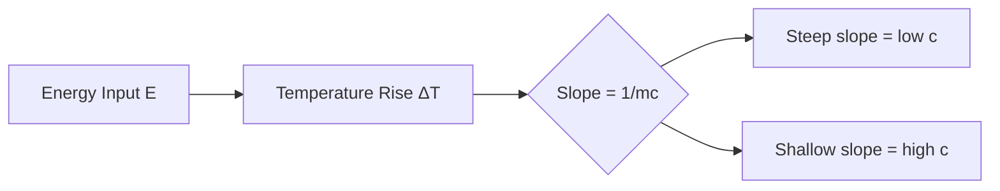
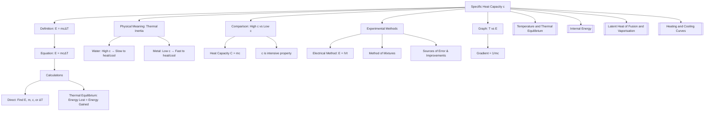

# 1. Overview / 概述

**English:**
Specific Heat Capacity ($c$) is a fundamental material property that quantifies how much thermal energy is required to raise the temperature of a unit mass of a substance by one degree Celsius (or one Kelvin). This sub-topic forms the cornerstone of thermal physics, bridging the concepts of [[Temperature and Thermal Equilibrium]] with energy transfer. Understanding $c$ is essential for analyzing heating processes, calculating energy requirements in engineering, and interpreting [[Heating and Cooling Curves]]. It directly connects to [[Internal Energy]] as the energy absorbed increases the average kinetic energy of particles. This leaf node focuses exclusively on the definition, equation, physical meaning, and graphical interpretation of specific heat capacity, leaving phase change energy to the sibling topic [[Latent Heat of Fusion and Vaporisation]].

**中文:**
比热容 ($c$) 是一个基本的材料属性，它量化了将单位质量的物质温度升高一摄氏度（或一开尔文）所需的热能。本子知识点是热物理学的基石，连接了[[温度与热平衡]]与能量传递的概念。理解 $c$ 对于分析加热过程、计算工程中的能量需求以及解释[[加热与冷却曲线]]至关重要。它直接与[[内能]]相关，因为吸收的能量增加了粒子的平均动能。本叶节点仅专注于比热容的定义、方程、物理意义和图形解释，将相变能量留给兄弟知识点[[熔化和汽化潜热]]。

---

# 2. Syllabus Learning Objectives / 考纲学习目标

| CAIE 9702 (10.3 a-g) | Edexcel IAL (WPH11 U1: 5.8-5.12) |
|----------------------|----------------------------------|
| Define specific heat capacity | Define specific heat capacity |
| Use the equation $E = mc\Delta T$ | Use the equation $\Delta Q = mc\Delta\theta$ |
| Describe an experiment to measure $c$ for a solid | Describe an electrical method to determine $c$ |
| Apply $E = mc\Delta T$ to solve problems | Apply the principle of conservation of energy to thermal problems |
| Explain why different materials have different $c$ values | Explain the physical significance of $c$ |
| Distinguish between $c$ and heat capacity $C$ | Distinguish between specific heat capacity and heat capacity |
| Use the concept of thermal equilibrium in calculations | Use the concept of thermal equilibrium in calculations |

**Examiner Expectations / 考官期望:**
- **CAIE:** Students must be able to define $c$ precisely, perform calculations involving energy transfer, and describe experimental methods with full apparatus diagrams. Common errors include confusing $c$ with $C$ (heat capacity) and forgetting to convert units.
- **Edexcel:** Students must apply the equation in multi-step problems, especially involving thermal equilibrium (e.g., mixing hot and cold water). Electrical methods are emphasized, including calculating electrical energy $E = IVt$.

**中文:**
- **CAIE:** 学生必须能够精确定义 $c$，进行涉及能量传递的计算，并描述带有完整装置图的实验方法。常见错误包括混淆 $c$ 和 $C$（热容量）以及忘记单位换算。
- **Edexcel:** 学生必须在多步骤问题中应用方程，特别是涉及热平衡的问题（例如，混合热水和冷水）。强调电学方法，包括计算电能 $E = IVt$。

---

# 3. Core Definitions / 核心定义

| Term (EN/CN) | Definition (EN) | Definition (CN) | Common Mistakes / 常见错误 |
|--------------|-----------------|-----------------|---------------------------|
| **Specific Heat Capacity** / 比热容 | The energy required per unit mass per unit temperature change, without a change of state. | 单位质量的物质在温度变化单位温度（不发生状态变化）时所吸收或释放的能量。 | Confusing with heat capacity $C$ (which lacks mass dependence). Forgetting "without change of state". |
| **Heat Capacity** / 热容量 | The energy required to raise the temperature of an entire object by 1 K (or 1°C). | 使整个物体温度升高1 K（或1°C）所需的能量。 | Thinking $C$ is a material property; it depends on mass. |
| **Thermal Equilibrium** / 热平衡 | A state where two objects in thermal contact have the same temperature and no net energy transfer occurs. | 两个热接触的物体具有相同温度且无净能量传递的状态。 | Assuming equal energy transfer; it's equal temperature, not equal energy. |
| **Energy Transfer** / 能量传递 | The process by which thermal energy moves from a hotter region to a cooler region. | 热能从较热区域向较冷区域传递的过程。 | Forgetting direction: always hot → cold. |

---

# 4. Key Concepts Explained / 关键概念详解

## 4.1 The Definition and Physical Meaning of Specific Heat Capacity / 比热容的定义与物理意义

### Explanation / 解释
**English:**
Specific heat capacity ($c$) is defined by the equation:

$$ E = mc\Delta T \quad \text{or} \quad \Delta Q = mc\Delta\theta $$

where $E$ (or $\Delta Q$) is the thermal energy transferred, $m$ is mass, and $\Delta T$ (or $\Delta\theta$) is the temperature change. The SI unit is $\text{J kg}^{-1} \text{K}^{-1}$.

Physically, $c$ represents a material's **thermal inertia** — how resistant it is to temperature change when energy is added or removed. Water has a high $c$ ($4200\ \text{J kg}^{-1} \text{K}^{-1}$), meaning it takes a lot of energy to heat it up, but it also cools slowly. Metals like copper have low $c$ ($390\ \text{J kg}^{-1} \text{K}^{-1}$), heating and cooling rapidly.

This concept links directly to [[Internal Energy]]: when energy is added to a substance, it increases the average kinetic energy of its particles (raising temperature). Materials with higher $c$ require more energy to achieve the same temperature rise because more energy is needed to increase the vibrational/translational kinetic energy of their particles.

**中文:**
比热容 ($c$) 由方程定义：

$$ E = mc\Delta T \quad \text{或} \quad \Delta Q = mc\Delta\theta $$

其中 $E$（或 $\Delta Q$）是传递的热能，$m$ 是质量，$\Delta T$（或 $\Delta\theta$）是温度变化。SI单位是 $\text{J kg}^{-1} \text{K}^{-1}$。

从物理上讲，$c$ 代表材料的**热惯性**——即材料在添加或移除能量时抵抗温度变化的能力。水的 $c$ 很高（$4200\ \text{J kg}^{-1} \text{K}^{-1}$），意味着加热需要大量能量，但冷却也很慢。像铜这样的金属 $c$ 很低（$390\ \text{J kg}^{-1} \text{K}^{-1}$），加热和冷却都很快。

这个概念直接与[[内能]]相关：当能量被添加到物质中时，它增加了粒子的平均动能（升高温度）。具有较高 $c$ 的材料需要更多能量才能实现相同的温升，因为需要更多能量来增加其粒子的振动/平动动能。

### Physical Meaning / 物理意义
**English:**
- High $c$ → "thermal buffer" → resists temperature change → good coolant (water in car radiators)
- Low $c$ → "thermal conductor" → responds quickly to temperature change → good for cooking utensils (metal pans)
- $c$ is an **intensive property** — it does not depend on the amount of material.

**中文:**
- 高 $c$ → "热缓冲" → 抵抗温度变化 → 良好的冷却剂（汽车散热器中的水）
- 低 $c$ → "热导体" → 快速响应温度变化 → 适合烹饪用具（金属锅）
- $c$ 是**强度性质**——不依赖于材料的量。

### Common Misconceptions / 常见误区
- ❌ **"Specific heat capacity depends on mass"** — No! $c$ is per unit mass. Heat capacity $C = mc$ depends on mass.
- ❌ **"High $c$ means it gets hotter faster"** — No! High $c$ means it heats up *slower* for the same energy input.
- ❌ **"Temperature and energy are the same"** — No! Temperature is a measure of average kinetic energy; energy depends on $m$, $c$, and $\Delta T$.

**中文:**
- ❌ **"比热容取决于质量"** — 不！$c$ 是单位质量的。热容量 $C = mc$ 取决于质量。
- ❌ **"高 $c$ 意味着加热更快"** — 不！高 $c$ 意味着在相同能量输入下加热*更慢*。
- ❌ **"温度和能量是一样的"** — 不！温度是平均动能的度量；能量取决于 $m$、$c$ 和 $\Delta T$。

### Exam Tips / 考试提示
- **Always check units:** Energy in J, mass in kg, temperature in K or °C (the change is the same in both scales).
- **For thermal equilibrium problems:** Energy lost by hot object = Energy gained by cold object (assuming no heat loss to surroundings).
- **Distinguish clearly:** $c$ (specific heat capacity) vs $C$ (heat capacity). $C = mc$.

**中文:**
- **始终检查单位：** 能量用 J，质量用 kg，温度用 K 或 °C（两种标度的变化相同）。
- **对于热平衡问题：** 热物体损失的能量 = 冷物体获得的能量（假设没有热量损失到周围环境）。
- **清楚区分：** $c$（比热容）与 $C$（热容量）。$C = mc$。

> 📷 **IMAGE PROMPT — DIAGRAM-01: Comparison of Heating Rates**
> A side-by-side bar chart showing two blocks of equal mass (1 kg) — one copper (c=390 J/kgK) and one water (c=4200 J/kgK) — receiving the same energy input (1000 J). The copper block shows a large temperature rise (~2.56°C) while the water shows a tiny rise (~0.24°C). Labels: "Same Energy Input", "Copper: Low c → Large ΔT", "Water: High c → Small ΔT". Clean, educational style with color coding (copper = orange, water = blue).

---

# 5. Essential Equations / 核心公式

## Equation 1: Energy Transfer for Temperature Change / 温度变化的能量传递

$$ E = mc\Delta T \quad \text{or} \quad \Delta Q = mc\Delta\theta $$

| Symbol (符号) | Meaning (EN) | Meaning (CN) | Unit (单位) |
|--------------|-------------|-------------|------------|
| $E$ or $\Delta Q$ | Thermal energy transferred | 传递的热能 | J (Joules) |
| $m$ | Mass of substance | 物质的质量 | kg |
| $c$ | Specific heat capacity | 比热容 | J kg⁻¹ K⁻¹ |
| $\Delta T$ or $\Delta\theta$ | Change in temperature | 温度变化 | K or °C |

**Derivation / 推导:**
This is an empirical relationship — it comes from experimental observation. The energy required to change the temperature of an object is proportional to its mass and the temperature change: $E \propto m\Delta T$. The constant of proportionality is $c$.

**Conditions / 适用条件:**
- **No phase change** — the substance must remain in the same state (solid, liquid, or gas).
- **Uniform material** — the substance must be homogeneous.
- **Constant pressure** — for most A-Level problems, assume constant pressure (open system).

**中文:**
- **无相变** — 物质必须保持相同状态（固体、液体或气体）。
- **均匀材料** — 物质必须是均匀的。
- **恒压** — 对于大多数A-Level问题，假设恒压（开放系统）。

**Limitations / 局限性:**
- $c$ is not truly constant over large temperature ranges — it varies slightly with temperature.
- The equation assumes 100% energy transfer efficiency (no heat loss to surroundings).
- For gases, $c$ depends on whether the process is at constant volume ($c_v$) or constant pressure ($c_p$). At A-Level, this distinction is usually not required.

**中文:**
- $c$ 在大的温度范围内并非真正恒定——它随温度略有变化。
- 该方程假设100%的能量传递效率（没有热量损失到周围环境）。
- 对于气体，$c$ 取决于过程是定容（$c_v$）还是定压（$c_p$）。在A-Level中，通常不需要这种区分。

## Equation 2: Heat Capacity Relationship / 热容量关系

$$ C = mc $$

| Symbol (符号) | Meaning (EN) | Meaning (CN) | Unit (单位) |
|--------------|-------------|-------------|------------|
| $C$ | Heat capacity of the object | 物体的热容量 | J K⁻¹ |
| $m$ | Mass | 质量 | kg |
| $c$ | Specific heat capacity | 比热容 | J kg⁻¹ K⁻¹ |

**Derivation / 推导:**
From $E = mc\Delta T$, if we define $C = mc$, then $E = C\Delta T$. This is useful for objects of known mass where we don't want to recalculate $mc$ each time.

**Conditions / 适用条件:**
- $C$ is an **extensive property** — it depends on the amount of material.
- $c$ is an **intensive property** — it is characteristic of the material itself.

**中文:**
- $C$ 是**广延性质**——取决于材料的量。
- $c$ 是**强度性质**——是材料本身的特征。

---

# 6. Graphs and Relationships / 图表与关系

## 6.1 Temperature vs. Energy Supplied Graph / 温度 vs. 供给能量图

### Axes / 坐标轴
- **X-axis:** Energy supplied ($E$) / 供给能量 ($E$) — in Joules (J)
- **Y-axis:** Temperature ($T$) / 温度 ($T$) — in °C or K

### Shape / 形状
A straight line through the origin (for a single phase, no heat loss).

### Gradient Meaning / 斜率含义
$$ \text{Gradient} = \frac{\Delta T}{\Delta E} = \frac{1}{mc} $$

A **steeper** gradient means a **smaller** $c$ (material heats up quickly).
A **shallower** gradient means a **larger** $c$ (material heats up slowly).

**中文:**
**更陡**的斜率意味着**更小**的 $c$（材料加热快）。
**更平缓**的斜率意味着**更大**的 $c$（材料加热慢）。

### Area Meaning / 面积含义
The area under a graph of $T$ vs $E$ has no direct physical meaning. However, the area under a graph of power vs time gives energy.

### Exam Interpretation / 考试解读
- If the line curves (becomes shallower), it may indicate heat loss to surroundings.
- If the line suddenly becomes horizontal (plateau), a phase change is occurring — see [[Latent Heat of Fusion and Vaporisation]].
- Comparing two lines on the same axes: the steeper line corresponds to the material with lower $c$ (or smaller mass).

**中文:**
- 如果线弯曲（变得更平缓），可能表示热量损失到周围环境。
- 如果线突然变成水平（平台），则正在发生相变——参见[[熔化和汽化潜热]]。
- 在同一坐标轴上比较两条线：更陡的线对应于具有较低 $c$（或较小质量）的材料。

> 📷 **IMAGE PROMPT — GRAPH-01: Temperature vs Energy for Two Materials**
> A graph with two straight lines from the origin. Line A (steep, red) labeled "Copper (c=390 J/kgK)" and Line B (shallow, blue) labeled "Water (c=4200 J/kgK)". Both for 1 kg mass. X-axis: "Energy Supplied / J", Y-axis: "Temperature / °C". Clear grid lines. The copper line reaches 50°C at ~19,500 J; water reaches only ~12°C at same energy. Educational style with annotations showing gradient formula.

---

# 7. Required Diagrams / 必备图表

## 7.1 Experimental Setup for Measuring Specific Heat Capacity of a Solid (Electrical Method) / 测量固体比热容的实验装置（电学方法）

### Description / 描述
**English:**
A standard A-Level experiment to determine $c$ for a metal block. A heating coil is inserted into a hole in the metal block, connected to a power supply, ammeter, and voltmeter. A thermometer (or temperature sensor) is inserted into another hole. The block is insulated (e.g., with polystyrene) to minimize heat loss. Electrical energy $E = IVt$ is supplied, and the temperature rise $\Delta T$ is recorded. Then $c = \frac{IVt}{m\Delta T}$.

**中文:**
一个标准的A-Level实验，用于确定金属块的 $c$。加热线圈插入金属块的一个孔中，连接到电源、电流表和电压表。温度计（或温度传感器）插入另一个孔中。块体被绝缘（例如，用聚苯乙烯）以最小化热量损失。提供电能 $E = IVt$，并记录温升 $\Delta T$。然后 $c = \frac{IVt}{m\Delta T}$。

### Image Prompt / 图片生成提示
> 📷 **IMAGE PROMPT — DIAGRAM-02: Electrical Method for Specific Heat Capacity**
> A clean, labeled diagram of an experimental setup: a rectangular metal block (labeled "Metal Block") with two drilled holes. In one hole, a heating coil (labeled "Heater") connected by wires to a power supply, an ammeter in series, and a voltmeter in parallel. In the other hole, a thermometer (labeled "Thermometer"). The block is wrapped in insulating material (polystyrene foam, labeled "Insulation"). A digital stopwatch is shown nearby. Labels: "Power Supply", "Ammeter (A)", "Voltmeter (V)", "Heating Coil", "Thermometer", "Insulation". Educational, clear, no clutter. Color: metal block in silver/grey, insulation in white, wires in red/black.

### Labels Required / 需要标注
- Metal block (金属块)
- Heating coil (加热线圈)
- Thermometer / temperature sensor (温度计/温度传感器)
- Insulation (绝缘材料)
- Power supply (电源)
- Ammeter (电流表) — in series
- Voltmeter (电压表) — in parallel
- Stopwatch (秒表)

### Exam Importance / 考试重要性
- **CAIE:** Frequently asked to describe the experiment, identify sources of error, and suggest improvements.
- **Edexcel:** Often asked to calculate $c$ from experimental data, including calculating electrical energy $E = IVt$.

**中文:**
- **CAIE:** 经常要求描述实验、识别误差来源并提出改进建议。
- **Edexcel:** 经常要求从实验数据计算 $c$，包括计算电能 $E = IVt$。

---

# 8. Worked Examples / 典型例题

## Example 1: Calculating Energy Required / 计算所需能量

### Question / 题目
**English:**
How much thermal energy is required to raise the temperature of 2.5 kg of water from 20°C to 100°C? (Specific heat capacity of water = 4200 J kg⁻¹ K⁻¹)

**中文:**
将 2.5 kg 的水从 20°C 加热到 100°C 需要多少热能？（水的比热容 = 4200 J kg⁻¹ K⁻¹）

### Solution / 解答
**Step 1:** Identify known quantities.
- $m = 2.5\ \text{kg}$
- $c = 4200\ \text{J kg}^{-1} \text{K}^{-1}$
- $\Delta T = 100 - 20 = 80\ \text{°C} = 80\ \text{K}$ (change is same in both scales)

**Step 2:** Apply the equation $E = mc\Delta T$.

$$ E = (2.5)(4200)(80) $$

**Step 3:** Calculate.

$$ E = 2.5 \times 4200 = 10,500 $$
$$ E = 10,500 \times 80 = 840,000\ \text{J} $$

**Step 4:** Express in appropriate units.

$$ E = 8.4 \times 10^5\ \text{J} = 840\ \text{kJ} $$

### Final Answer / 最终答案
**Answer:** $8.4 \times 10^5$ J (or 840 kJ) | **答案：** $8.4 \times 10^5$ J（或 840 kJ）

### Quick Tip / 提示
**English:** Remember that a temperature change of 1°C equals a change of 1 K. You do NOT need to convert to Kelvin for temperature *differences* — only for absolute temperatures.

**中文：** 记住 1°C 的温度变化等于 1 K 的变化。对于温度*差*，你不需要转换为开尔文——只有绝对温度才需要。

---

## Example 2: Thermal Equilibrium (Method of Mixtures) / 热平衡（混合法）

### Question / 题目
**English:**
A 0.50 kg block of copper at 100°C is placed into 0.80 kg of water at 20°C. The specific heat capacity of copper is 390 J kg⁻¹ K⁻¹ and of water is 4200 J kg⁻¹ K⁻¹. Assuming no heat loss to the surroundings, calculate the final equilibrium temperature.

**中文:**
将一个 0.50 kg、100°C 的铜块放入 0.80 kg、20°C 的水中。铜的比热容为 390 J kg⁻¹ K⁻¹，水的比热容为 4200 J kg⁻¹ K⁻¹。假设没有热量损失到周围环境，计算最终平衡温度。

### Solution / 解答
**Step 1:** Principle: Energy lost by copper = Energy gained by water.

$$ m_c c_c (T_c - T_f) = m_w c_w (T_f - T_w) $$

Where $T_f$ is the final equilibrium temperature.

**Step 2:** Substitute values.

$$ (0.50)(390)(100 - T_f) = (0.80)(4200)(T_f - 20) $$

**Step 3:** Simplify.

$$ 195(100 - T_f) = 3360(T_f - 20) $$
$$ 19,500 - 195T_f = 3360T_f - 67,200 $$

**Step 4:** Collect terms.

$$ 19,500 + 67,200 = 3360T_f + 195T_f $$
$$ 86,700 = 3555T_f $$

**Step 5:** Solve for $T_f$.

$$ T_f = \frac{86,700}{3555} = 24.4\ \text{°C} $$

### Final Answer / 最终答案
**Answer:** 24.4°C | **答案：** 24.4°C

### Quick Tip / 提示
**English:** Always check that your final temperature is between the two initial temperatures (20°C < 24.4°C < 100°C). If it's outside this range, you've made a sign error!

**中文：** 始终检查最终温度是否在两个初始温度之间（20°C < 24.4°C < 100°C）。如果超出此范围，则符号有误！

---

# 9. Past Paper Question Types / 历年真题题型

| Question Type / 题型 | Frequency / 频率 | Difficulty / 难度 | Past Paper References / 真题索引 |
|----------------------|------------------|------------------|-------------------------------|
| Direct calculation of $E$, $m$, $c$, or $\Delta T$ from $E=mc\Delta T$ | Very High | Easy | 📝 *待填入* |
| Thermal equilibrium (method of mixtures) | High | Medium | 📝 *待填入* |
| Experimental description and error analysis | High | Medium | 📝 *待填入* |
| Graph interpretation (T vs E) | Medium | Medium | 📝 *待填入* |
| Distinguishing $c$ and $C$ | Low | Easy | 📝 *待填入* |
| Multi-step with electrical energy $E=IVt$ | Medium | Medium-Hard | 📝 *待填入* |

**Common Command Words / 常见指令词:**
- **Define / 定义** — Give the precise definition of specific heat capacity.
- **Calculate / 计算** — Use $E = mc\Delta T$ to find an unknown.
- **Describe / 描述** — Explain the experimental procedure.
- **Explain / 解释** — Why does water have a higher $c$ than metal?
- **Suggest / 建议** — How to improve the accuracy of the experiment.

---

# 10. Practical Skills Connections / 实验技能链接

**English:**
This sub-topic has strong connections to practical work:

1. **Measurement Techniques:**
   - Measuring mass using a digital balance (resolution ±0.1 g or better)
   - Measuring temperature using a thermometer or temperature sensor (resolution ±0.1°C)
   - Measuring time with a stopwatch
   - Measuring electrical quantities (current with ammeter, voltage with voltmeter)

2. **Uncertainties and Errors:**
   - **Systematic error:** Heat loss to surroundings → final $c$ calculated will be *higher* than true value (because less energy goes into heating the block)
   - **Random error:** Temperature readings fluctuate → take multiple readings and average
   - **Improvement:** Use insulation, stir the water, use a digital temperature sensor with data logging

3. **Graph Plotting:**
   - Plot $T$ vs $t$ (time) to find the rate of temperature rise
   - The gradient $\frac{\Delta T}{\Delta t}$ can be used with $P = mc\frac{\Delta T}{\Delta t}$ to find $c$ if power $P$ is known

4. **Experimental Design:**
   - **Electrical method** (preferred): $E = IVt$, accurate energy measurement
   - **Method of mixtures** (alternative): Mix hot and cold substances, measure equilibrium temperature

**中文:**
本子知识点与实验工作有密切联系：

1. **测量技术：**
   - 使用数字天平测量质量（分辨率 ±0.1 g 或更好）
   - 使用温度计或温度传感器测量温度（分辨率 ±0.1°C）
   - 使用秒表测量时间
   - 测量电学量（电流表测电流，电压表测电压）

2. **不确定度和误差：**
   - **系统误差：** 热量损失到周围环境 → 计算出的最终 $c$ 将*高于*真实值（因为更少的能量用于加热块体）
   - **随机误差：** 温度读数波动 → 取多次读数并求平均
   - **改进：** 使用绝缘材料，搅拌水，使用带数据记录的数字温度传感器

3. **图表绘制：**
   - 绘制 $T$ vs $t$（时间）图以找到温升速率
   - 如果功率 $P$ 已知，斜率 $\frac{\Delta T}{\Delta t}$ 可用于 $P = mc\frac{\Delta T}{\Delta t}$ 来求 $c$

4. **实验设计：**
   - **电学方法**（首选）：$E = IVt$，能量测量准确
   - **混合法**（替代）：混合热和冷物质，测量平衡温度

---

# 11. Concept Map / 概念图谱

---

# 12. Quick Revision Sheet / 速查表

| Category / 类别 | Key Points / 要点 |
|----------------|------------------|
| **Definition / 定义** | Energy per unit mass per unit temperature change (no phase change). $c = \frac{E}{m\Delta T}$ |
| **Key Formula / 核心公式** | $E = mc\Delta T$ or $\Delta Q = mc\Delta\theta$ |
| **SI Unit / SI单位** | J kg⁻¹ K⁻¹ (or J kg⁻¹ °C⁻¹) |
| **Key Distinction / 关键区分** | $c$ = specific heat capacity (intensive, per kg); $C = mc$ = heat capacity (extensive, for whole object) |
| **Key Graph / 核心图表** | $T$ vs $E$: Straight line. Gradient $= 1/mc$. Steeper = lower $c$ (heats faster). |
| **Experimental Method / 实验方法** | Electrical: $E = IVt$, measure $m$ and $\Delta T$. $c = \frac{IVt}{m\Delta T}$ |
| **Common Error / 常见错误** | Forgetting "no phase change" in definition. Confusing $c$ with $C$. Sign errors in thermal equilibrium problems. |
| **Exam Tip / 考试提示** | For ΔT, 1°C = 1 K. Always check units (kg, J, K). For equilibrium: Energy lost = Energy gained. |
| **Water's High c / 水的高c** | $c_{water} = 4200$ J kg⁻¹ K⁻¹ → good coolant, moderates climate |
| **Metal's Low c / 金属的低c** | $c_{copper} \approx 390$ J kg⁻¹ K⁻¹ → heats/cools quickly, good for cooking |