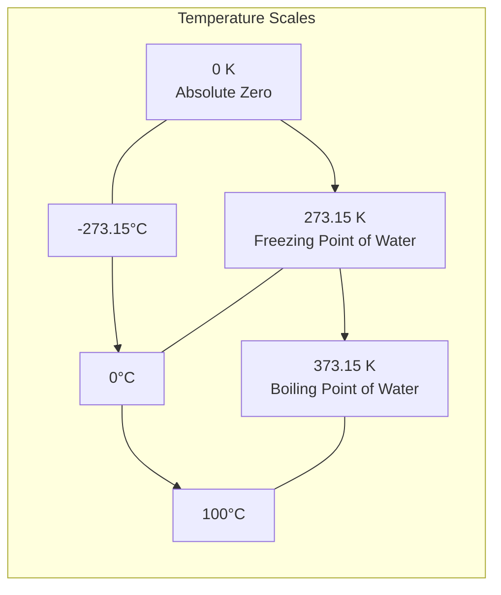
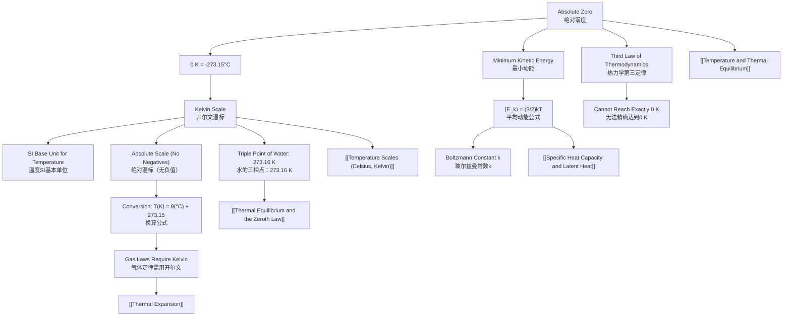

# Absolute Zero and the Kelvin Scale / 绝对零度与开尔文温标

---

# 1. Overview / 概述

**English:**
This sub-topic introduces the concept of **absolute zero** — the lowest possible temperature in the universe — and the **Kelvin (absolute) temperature scale** that is based upon it. You will learn why the Celsius scale is insufficient for many physical calculations, how the Kelvin scale is defined using the triple point of water, and how to convert between Celsius and Kelvin temperatures. This is a **foundational** concept in thermal physics because the Kelvin scale is the **SI base unit** for temperature and is essential for all gas laws, kinetic theory, and thermodynamic calculations. Understanding absolute zero also provides insight into the limits of matter and energy.

**中文:**
本子知识点介绍**绝对零度**（宇宙中可能达到的最低温度）以及基于它定义的**开尔文（绝对）温标**。你将学习为什么摄氏温标在许多物理计算中不够用，开尔文温标如何利用水的三相点来定义，以及如何在摄氏度和开尔文之间进行换算。这是热学物理中的**基础**概念，因为开尔文温标是温度的**SI基本单位**，对于所有气体定律、分子动理论和热力学计算都至关重要。理解绝对零度也能让你深入了解物质和能量的极限。

---

# 2. Syllabus Learning Objectives / 考纲学习目标

| CAIE 9702 (10.1 a-e) | Edexcel IAL (WPH11 U1: 5.1-5.4) |
|-----------------------|----------------------------------|
| Understand the concept of absolute zero and the Kelvin scale of temperature | Understand the concept of absolute zero and the Kelvin scale |
| Convert temperatures between Kelvin and degrees Celsius | Convert between Celsius and Kelvin temperatures |
| Relate the Kelvin scale to the kinetic energy of particles | Relate the Kelvin scale to the average kinetic energy of particles |
| Understand that absolute zero is the temperature at which particles have minimum kinetic energy | Understand that absolute zero is the temperature at which particles have minimum kinetic energy |
| Use the relationship $T(K) = \theta(°C) + 273.15$ | Use the relationship $T(K) = \theta(°C) + 273$ |

**Examiner Expectations / 考官期望:**
- **EN:** You must know the exact conversion factor (273.15 for CAIE, 273 for Edexcel). You must be able to explain why the Kelvin scale is an **absolute** scale (no negative values). You must link absolute zero to the **minimum possible internal energy** of a system.
- **中文:** 你必须知道准确的换算系数（CAIE用273.15，Edexcel用273）。你必须能够解释为什么开尔文温标是**绝对**温标（没有负值）。你必须将绝对零度与系统**可能的最小内能**联系起来。

---

# 3. Core Definitions / 核心定义

| Term (EN/CN) | Definition (EN) | Definition (CN) | Common Mistakes / 常见错误 |
|--------------|-----------------|-----------------|---------------------------|
| **Absolute Zero** / 绝对零度 | The lowest possible temperature, at which all particles have their minimum possible kinetic energy (zero point energy remains). | 可能达到的最低温度，此时所有粒子具有其可能的最小动能（零点能仍然存在）。 | ❌ Thinking particles stop moving entirely. ✅ They have **minimum** motion, not zero motion. |
| **Kelvin Scale** / 开尔文温标 | An absolute temperature scale where 0 K is absolute zero. The size of one kelvin is equal to one degree Celsius. | 一种绝对温标，0 K为绝对零度。1开尔文的大小等于1摄氏度。 | ❌ Writing "degrees Kelvin" (K). ✅ Correct: "kelvin" (K), no degree symbol. |
| **Triple Point of Water** / 水的三相点 | The unique temperature and pressure at which water exists simultaneously as solid, liquid, and gas. Defined as 273.16 K. | 水同时以固态、液态和气态存在的唯一温度和压力。定义为273.16 K。 | ❌ Confusing with freezing point (273.15 K). ✅ Triple point is 273.16 K, freezing point is 273.15 K. |
| **Absolute Scale** / 绝对温标 | A temperature scale that does not depend on the properties of any particular substance and has a true zero point. | 不依赖于任何特定物质的性质且具有真正零点的温标。 | ❌ Thinking Celsius is also absolute. ✅ Celsius is a **relative** scale (0°C is arbitrary). |
| **Zero Point Energy** / 零点能 | The minimum possible energy that a quantum mechanical system possesses, even at absolute zero. | 即使在绝对零度下，量子力学系统所具有的最小可能能量。 | ❌ Ignoring this in A-Level. ✅ Acknowledge it exists but is beyond syllabus detail. |

---

# 4. Key Concepts Explained / 关键概念详解

## 4.1 Absolute Zero / 绝对零度

### Explanation / 解释
**English:**
Absolute zero (0 K or -273.15 °C) is the theoretical temperature at which a system has the **minimum possible internal energy**. In classical physics, this would mean particles have zero kinetic energy and are completely stationary. However, quantum mechanics tells us that particles still possess **zero-point energy** — a residual motion that cannot be removed. For A-Level purposes, you should understand that at absolute zero, particles have **minimum kinetic energy**, and the volume of an ideal gas would theoretically become zero (as predicted by Charles's Law). In reality, all gases liquefy or solidify before reaching absolute zero, and it is impossible to reach exactly 0 K (Third Law of Thermodynamics).

**中文:**
绝对零度（0 K 或 -273.15 °C）是系统具有**最小可能内能**的理论温度。在经典物理学中，这意味着粒子具有零动能并且完全静止。然而，量子力学告诉我们，粒子仍然具有**零点能**——一种无法去除的残余运动。对于A-Level考试，你应该理解在绝对零度时，粒子具有**最小动能**，理想气体的体积理论上将变为零（如查理定律所预测）。实际上，所有气体在达到绝对零度之前都会液化或固化，并且不可能精确达到0 K（热力学第三定律）。

### Physical Meaning / 物理意义
**English:**
Absolute zero represents the **lower limit of temperature** — a boundary beyond which no further cooling is possible. It is the temperature at which the **average kinetic energy of particles** is at its minimum. This concept is crucial because it provides a **natural zero point** for temperature measurement, making the Kelvin scale an **absolute** (rather than relative) scale.

**中文:**
绝对零度代表了**温度的下限**——一个无法进一步冷却的边界。在这个温度下，**粒子的平均动能**处于最小值。这个概念至关重要，因为它为温度测量提供了一个**自然的零点**，使开尔文温标成为**绝对**（而非相对）温标。

### Common Misconceptions / 常见误区
- ❌ **"At absolute zero, everything stops moving."** → Particles still have zero-point energy (quantum mechanical effect).
- ❌ **"Absolute zero has been reached in laboratories."** → Scientists have reached temperatures within billionths of a kelvin above absolute zero, but never exactly 0 K.
- ❌ **"The Kelvin scale has negative values."** → No! 0 K is the absolute minimum; negative Kelvin temperatures are physically impossible.

### Exam Tips / 考试提示
- **EN:** When asked "Why is the Kelvin scale called an absolute scale?" — answer: because it has a true zero point (absolute zero) and does not depend on the properties of any particular substance.
- **中文:** 当被问到"为什么开尔文温标被称为绝对温标？"时——回答：因为它有一个真正的零点（绝对零度），并且不依赖于任何特定物质的性质。

> 📷 **IMAGE PROMPT — ABSZERO-01: Temperature Scale Comparison**
> A vertical number line showing the Kelvin scale (left) and Celsius scale (right) side by side. Mark absolute zero at 0 K / -273.15°C, the freezing point of water at 273.15 K / 0°C, and the boiling point of water at 373.15 K / 100°C. Use a gradient from dark blue (cold) to red (hot). Include a note: "Kelvin scale has no negative values."

---

## 4.2 The Kelvin Scale / 开尔文温标

### Explanation / 解释
**English:**
The Kelvin scale is the **SI base unit** for thermodynamic temperature (symbol: K). It is an **absolute scale** because its zero point (0 K) is fixed at absolute zero, not at an arbitrary point like the Celsius scale. The Kelvin scale is defined using the **triple point of water** (273.16 K) as a fixed reference point. One kelvin is defined as 1/273.16 of the thermodynamic temperature of the triple point of water. The size of one kelvin is exactly equal to one degree Celsius, which makes conversion straightforward: $T(K) = \theta(°C) + 273.15$ (or +273 for Edexcel).

**中文:**
开尔文温标是热力学温度的**SI基本单位**（符号：K）。它是一种**绝对温标**，因为其零点（0 K）固定在绝对零度，而不是像摄氏温标那样固定在任意点。开尔文温标使用**水的三相点**（273.16 K）作为固定参考点来定义。1开尔文定义为水的三相点热力学温度的1/273.16。1开尔文的大小恰好等于1摄氏度，这使得换算非常简单：$T(K) = \theta(°C) + 273.15$（Edexcel用+273）。

### Physical Meaning / 物理意义
**English:**
The Kelvin scale directly relates temperature to the **average kinetic energy** of particles. For an ideal gas, the average kinetic energy per particle is given by $\frac{3}{2}kT$, where $k$ is Boltzmann's constant. This means that temperature in kelvin is a direct measure of the **internal kinetic energy** of a system. Doubling the Kelvin temperature doubles the average kinetic energy of the particles.

**中文:**
开尔文温标直接将温度与粒子的**平均动能**联系起来。对于理想气体，每个粒子的平均动能为$\frac{3}{2}kT$，其中$k$是玻尔兹曼常数。这意味着开尔文温度是系统**内部动能**的直接度量。开尔文温度加倍，粒子的平均动能也加倍。

### Common Misconceptions / 常见误区
- ❌ **"0 K is the same as 0°C."** → No! 0 K = -273.15°C.
- ❌ **"You can have negative Kelvin temperatures."** → No! 0 K is the absolute minimum.
- ❌ **"The Kelvin scale uses degrees."** → No! We say "273 kelvin" (not "273 degrees kelvin").

### Exam Tips / 考试提示
- **EN:** Always convert Celsius to Kelvin before using gas laws ($PV = nRT$, $P \propto T$, $V \propto T$). Failure to do so is a common exam mistake.
- **中文:** 在使用气体定律（$PV = nRT$，$P \propto T$，$V \propto T$）之前，务必先将摄氏度转换为开尔文。不这样做是考试中常见的错误。

---

# 5. Essential Equations / 核心公式

## 5.1 Celsius to Kelvin Conversion / 摄氏度与开尔文换算

$$ T(K) = \theta(°C) + 273.15 $$

| Symbol (符号) | Meaning (EN) | Meaning (CN) | Unit (单位) |
|--------------|-------------|-------------|------------|
| $T$ | Temperature in kelvin | 开尔文温度 | K |
| $\theta$ | Temperature in degrees Celsius | 摄氏温度 | °C |
| 273.15 | Conversion factor (CAIE) | 换算系数（CAIE） | — |

**Derivation / 推导:**
The Kelvin scale is defined such that the triple point of water (0.01°C) is exactly 273.16 K. Therefore, 0 K = -273.15°C, giving the conversion formula.

**Conditions / 适用条件:**
- **EN:** Always use 273.15 for CAIE; 273 is acceptable for Edexcel. The formula is exact and applies to all temperatures.
- **中文:** CAIE考试始终使用273.15；Edexcel考试使用273即可。该公式是精确的，适用于所有温度。

**Limitations / 局限性:**
- **EN:** None — this is a definition, not an approximation.
- **中文:** 无——这是一个定义，而非近似。

> 📋 **CIE Only:** Use 273.15 in all calculations.
> 📋 **Edexcel Only:** Use 273 in all calculations.

---

## 5.2 Average Kinetic Energy of Particles / 粒子平均动能

$$ \langle E_k \rangle = \frac{3}{2}kT $$

| Symbol (符号) | Meaning (EN) | Meaning (CN) | Unit (单位) |
|--------------|-------------|-------------|------------|
| $\langle E_k \rangle$ | Average kinetic energy per particle | 每个粒子的平均动能 | J |
| $k$ | Boltzmann's constant ($1.38 \times 10^{-23}$ J/K) | 玻尔兹曼常数 | J/K |
| $T$ | Temperature in kelvin | 开尔文温度 | K |

**Derivation / 推导:**
Derived from kinetic theory of gases: pressure $P = \frac{1}{3}\rho \langle c^2 \rangle$ and ideal gas equation $PV = NkT$. Combining gives $\frac{1}{2}m\langle c^2 \rangle = \frac{3}{2}kT$.

**Conditions / 适用条件:**
- **EN:** Only applies to ideal gases. Assumes particles have only translational kinetic energy (no rotational or vibrational modes).
- **中文:** 仅适用于理想气体。假设粒子只有平动动能（无转动或振动模式）。

**Limitations / 局限性:**
- **EN:** Does not account for intermolecular forces or quantum effects at very low temperatures.
- **中文:** 未考虑分子间力或极低温下的量子效应。

---

# 6. Graphs and Relationships / 图表与关系

## 6.1 Temperature Scales Comparison / 温标对比图

### Axes / 坐标轴
- **EN:** Vertical axis: Temperature (K or °C). Two parallel scales shown side by side.
- **中文:** 纵轴：温度（K或°C）。两个平行刻度并排显示。

### Shape / 形状
- **EN:** Linear relationship: $T(K) = \theta(°C) + 273.15$. A straight line with gradient = 1.
- **中文:** 线性关系：$T(K) = \theta(°C) + 273.15$。斜率为1的直线。

### Gradient Meaning / 斜率含义
- **EN:** Gradient = 1 means a change of 1°C equals a change of 1 K.
- **中文:** 斜率=1意味着1°C的变化等于1 K的变化。

### Area Meaning / 面积含义
- **EN:** Not applicable for this linear relationship.
- **中文:** 不适用于此线性关系。

### Exam Interpretation / 考试解读
- **EN:** You may be asked to read values from a dual-scale thermometer or convert between scales using the graph.
- **中文:** 你可能会被要求从双刻度温度计上读取数值，或使用图表在两种温标之间进行换算。

---

## 6.2 Pressure vs Temperature (Kelvin) for an Ideal Gas / 理想气体压强与温度（开尔文）关系

### Axes / 坐标轴
- **EN:** x-axis: Temperature T (K); y-axis: Pressure P (Pa)
- **中文:** x轴：温度 T (K)；y轴：压强 P (Pa)

### Shape / 形状
- **EN:** Straight line through the origin: $P \propto T$ (at constant volume and amount of gas).
- **中文:** 通过原点的直线：$P \propto T$（体积和气体量不变时）。

### Gradient Meaning / 斜率含义
- **EN:** Gradient = $nR/V$ (from $PV = nRT$). Steeper gradient means smaller volume or more gas.
- **中文:** 斜率 = $nR/V$（来自 $PV = nRT$）。斜率越大意味着体积越小或气体量越多。

### Area Meaning / 面积含义
- **EN:** Not applicable.
- **中文:** 不适用。

### Exam Interpretation / 考试解读
- **EN:** If the graph is plotted with Celsius on the x-axis, the line extrapolates back to -273.15°C at zero pressure — this is experimental evidence for absolute zero.
- **中文:** 如果x轴使用摄氏度绘制，直线外推至零压强时对应-273.15°C——这是绝对零度的实验证据。

> 📷 **IMAGE PROMPT — ABSZERO-02: Pressure vs Temperature Graph**
> A graph showing pressure (y-axis) vs temperature in °C (x-axis). Plot a straight line for an ideal gas at constant volume. The line crosses the x-axis at -273.15°C (absolute zero). Label: "Extrapolation shows absolute zero at -273.15°C." Include a second line for a real gas that deviates at low temperatures (liquefaction).

---

# 7. Required Diagrams / 必备图表

## 7.1 The Kelvin and Celsius Scales / 开尔文与摄氏温标

### Description / 描述
**English:**
A dual-scale thermometer or vertical number line showing the relationship between the Kelvin and Celsius scales. Key fixed points are marked: absolute zero (0 K / -273.15°C), freezing point of water (273.15 K / 0°C), and boiling point of water (373.15 K / 100°C).

**中文:**
一个双刻度温度计或垂直数轴，显示开尔文与摄氏温标之间的关系。标出关键固定点：绝对零度（0 K / -273.15°C）、水的冰点（273.15 K / 0°C）和水的沸点（373.15 K / 100°C）。

### Image Prompt / 图片生成提示
> 📷 **IMAGE PROMPT — ABSZERO-03: Dual Scale Thermometer**
> A vertical thermometer with two scales side by side. Left scale: Kelvin (0 K to 400 K). Right scale: Celsius (-273.15°C to 126.85°C). Mark the triple point of water at 273.16 K / 0.01°C with a special label. Use a blue-to-red gradient. Include the formula T(K) = θ(°C) + 273.15 at the bottom.

### Labels Required / 需要标注
- **EN:** 0 K, 273.15 K, 373.15 K; -273.15°C, 0°C, 100°C; Triple point of water (273.16 K)
- **中文:** 0 K、273.15 K、373.15 K；-273.15°C、0°C、100°C；水的三相点（273.16 K）

### Exam Importance / 考试重要性
- **EN:** High. You may be asked to label or interpret such a diagram. Understanding the fixed points is essential.
- **中文:** 高。你可能会被要求标注或解读此类图表。理解固定点至关重要。

---

## 7.2 Experimental Determination of Absolute Zero / 绝对零度的实验测定

### Description / 描述
**English:**
A diagram showing the apparatus used to determine absolute zero experimentally: a gas syringe or flask immersed in a water bath, connected to a pressure gauge. The gas is cooled or heated, and pressure is measured at different temperatures. The graph of pressure vs temperature (in °C) is extrapolated to zero pressure to find absolute zero.

**中文:**
显示用于实验测定绝对零度的装置图：一个浸在水浴中的气体注射器或烧瓶，连接到一个压强计。气体被冷却或加热，在不同温度下测量压强。将压强-温度（°C）图外推至零压强以找到绝对零度。

### Image Prompt / 图片生成提示
> 📷 **IMAGE PROMPT — ABSZERO-04: Absolute Zero Experiment Apparatus**
> A diagram showing: (1) A round-bottom flask containing a fixed mass of gas, (2) A water bath with a thermometer, (3) A pressure gauge connected to the flask, (4) A Bunsen burner or ice for temperature control. Label: "Gas at constant volume." Show a graph inset: Pressure vs Temperature (°C) with extrapolation to -273.15°C.

### Labels Required / 需要标注
- **EN:** Gas flask, water bath, thermometer, pressure gauge, constant volume, extrapolation line
- **中文:** 气体烧瓶、水浴、温度计、压强计、恒定体积、外推线

### Exam Importance / 考试重要性
- **EN:** Medium. You should be able to describe the experiment and explain why extrapolation is needed (real gases liquefy before reaching absolute zero).
- **中文:** 中等。你应该能够描述实验并解释为什么需要外推（实际气体在达到绝对零度之前会液化）。

---

# 8. Worked Examples / 典型例题

## Example 1: Temperature Conversion / 温度换算

### Question / 题目
**English:**
The temperature of a gas is 47°C. Calculate this temperature in kelvin. If the gas is heated until its temperature is 320 K, what is the temperature in °C?

**中文:**
某气体的温度为47°C。计算以开尔文为单位的温度。如果该气体被加热至320 K，其温度是多少°C？

### Solution / 解答

**Step 1: Convert 47°C to Kelvin**
$$ T = \theta + 273.15 = 47 + 273.15 = 320.15 \text{ K} $$

**Step 2: Convert 320 K to Celsius**
$$ \theta = T - 273.15 = 320 - 273.15 = 46.85 \text{ °C} $$

### Final Answer / 最终答案
**Answer:** 47°C = 320.15 K; 320 K = 46.85°C | **答案：** 47°C = 320.15 K；320 K = 46.85°C

### Quick Tip / 提示
- **EN:** For Edexcel, use 273 instead of 273.15. Always check which exam board you are following.
- **中文:** Edexcel考试使用273而非273.15。始终检查你遵循的是哪个考试局。

---

## Example 2: Gas Law with Kelvin Temperature / 气体定律与开尔文温度

### Question / 题目
**English:**
A fixed mass of gas at constant volume has a pressure of $2.0 \times 10^5$ Pa at a temperature of 27°C. Calculate the pressure when the temperature is increased to 127°C.

**中文:**
一定质量的理想气体在恒定体积下，温度为27°C时压强为$2.0 \times 10^5$ Pa。计算温度升高至127°C时的压强。

### Solution / 解答

**Step 1: Convert temperatures to Kelvin**
$$ T_1 = 27 + 273 = 300 \text{ K} $$
$$ T_2 = 127 + 273 = 400 \text{ K} $$

**Step 2: Apply pressure law ($P \propto T$ at constant V)**
$$ \frac{P_1}{T_1} = \frac{P_2}{T_2} $$
$$ P_2 = P_1 \times \frac{T_2}{T_1} = 2.0 \times 10^5 \times \frac{400}{300} $$

**Step 3: Calculate**
$$ P_2 = 2.0 \times 10^5 \times \frac{4}{3} = 2.67 \times 10^5 \text{ Pa} $$

### Final Answer / 最终答案
**Answer:** $2.67 \times 10^5$ Pa | **答案：** $2.67 \times 10^5$ Pa

### Quick Tip / 提示
- **EN:** Never use Celsius in gas law calculations! Always convert to Kelvin first. A common mistake is to use $P_1/T_1 = P_2/T_2$ with Celsius values, which gives a wrong answer.
- **中文:** 切勿在气体定律计算中使用摄氏度！务必先转换为开尔文。常见的错误是使用摄氏温度代入$P_1/T_1 = P_2/T_2$，这样会得到错误答案。

---

# 9. Past Paper Question Types / 历年真题题型

| Question Type / 题型 | Frequency / 频率 | Difficulty / 难度 | Past Paper References / 真题索引 |
|----------------------|------------------|------------------|-------------------------------|
| Temperature conversion (Celsius ↔ Kelvin) | ★★★★★ (Very High) | ★☆☆☆☆ (Easy) | 📝 *待填入* |
| Explanation of absolute zero concept | ★★★★☆ (High) | ★★☆☆☆ (Medium) | 📝 *待填入* |
| Gas law calculation requiring Kelvin conversion | ★★★★★ (Very High) | ★★★☆☆ (Medium) | 📝 *待填入* |
| Experimental determination of absolute zero | ★★★☆☆ (Medium) | ★★★★☆ (Hard) | 📝 *待填入* |
| Graph interpretation (P vs T, V vs T) | ★★★★☆ (High) | ★★★☆☆ (Medium) | 📝 *待填入* |

**Common Command Words / 常见指令词:**
- **EN:** "Convert", "Calculate", "Explain", "State", "Determine", "Show that", "Extrapolate"
- **中文:** "换算"、"计算"、"解释"、"陈述"、"确定"、"证明"、"外推"

---

# 10. Practical Skills Connections / 实验技能链接

**English:**
This sub-topic connects to practical work in several ways:

1. **Temperature Measurement:** You must be able to use thermometers (mercury, alcohol, thermocouple, resistance thermometer) and understand their calibration against fixed points (ice point, steam point, triple point).

2. **Experimental Determination of Absolute Zero:** A common practical involves measuring the pressure of a fixed mass of gas at constant volume at different temperatures (using a water bath). You plot pressure vs temperature (in °C) and extrapolate the straight line to zero pressure to find absolute zero (-273.15°C). Key skills include:
   - Setting up a constant volume apparatus
   - Measuring temperature accurately with a thermometer
   - Measuring pressure with a pressure gauge or manometer
   - Plotting graphs and drawing lines of best fit
   - Extrapolating and reading intercepts
   - Estimating uncertainties

3. **Uncertainties:** Temperature measurements typically have uncertainties of ±0.5°C or ±0.1°C depending on the thermometer. Pressure measurements may have uncertainties from the gauge. These propagate to the extrapolated value of absolute zero.

**中文:**
本子知识点在多个方面与实验工作相关：

1. **温度测量：** 你必须能够使用温度计（水银、酒精、热电偶、电阻温度计），并理解如何利用固定点（冰点、蒸汽点、三相点）进行校准。

2. **绝对零度的实验测定：** 一个常见的实验是在不同温度下（使用水浴）测量恒定体积下固定质量气体的压强。你绘制压强-温度（°C）图，并将直线外推至零压强以找到绝对零度（-273.15°C）。关键技能包括：
   - 搭建恒定体积装置
   - 使用温度计准确测量温度
   - 使用压强计或压力计测量压强
   - 绘制图表和最佳拟合线
   - 外推和读取截距
   - 估算不确定度

3. **不确定度：** 温度测量通常有±0.5°C或±0.1°C的不确定度（取决于温度计）。压强测量可能有来自压强计的不确定度。这些不确定度会传播到外推的绝对零度值。

---

# 11. Concept Map / 概念图谱

---

# 12. Quick Revision Sheet / 速查表

| Category / 类别 | Key Points / 要点 |
|----------------|------------------|
| **Definition / 定义** | **Absolute Zero:** Lowest possible temperature (0 K = -273.15°C). Particles have minimum kinetic energy. |
| **Key Formula / 核心公式** | $T(K) = \theta(°C) + 273.15$ (CAIE) or +273 (Edexcel) |
| **Key Graph / 核心图表** | Pressure vs Temperature (K): Straight line through origin. Pressure vs Temperature (°C): Line crosses x-axis at -273.15°C. |
| **Key Experiment / 关键实验** | Constant volume gas thermometer: Measure P at different θ, plot P vs θ, extrapolate to P=0 to find absolute zero. |
| **Common Mistake / 常见错误** | ❌ Using Celsius in gas law calculations. ✅ Always convert to Kelvin first! |
| **Exam Tip / 考试提示** | "Why is Kelvin an absolute scale?" → True zero point + independent of substance properties. |
| **Key Number / 关键数字** | 273.15 (CAIE) / 273 (Edexcel) — memorize this conversion factor! |
| **Units / 单位** | Kelvin (K) — no degree symbol! Not "°K"! |

---

> 📋 **CIE Only:** Use 273.15 for all conversions. The triple point of water (273.16 K) may be tested.
> 📋 **Edexcel Only:** Use 273 for all conversions. The triple point is not explicitly tested.

---

**Parent Hub:** [[Temperature and Thermal Equilibrium]]
**Sibling Notes:** [[Temperature Scales (Celsius, Kelvin)]], [[Thermal Equilibrium and the Zeroth Law]], [[Thermometers and Temperature Measurement]]
**Related Topics:** [[Thermal Expansion]], [[Specific Heat Capacity and Latent Heat]]