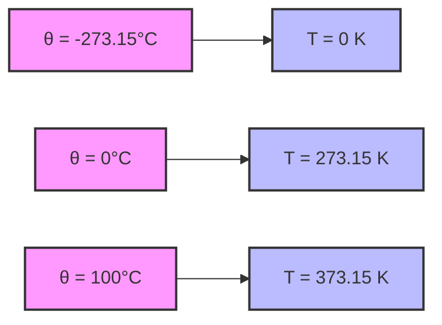
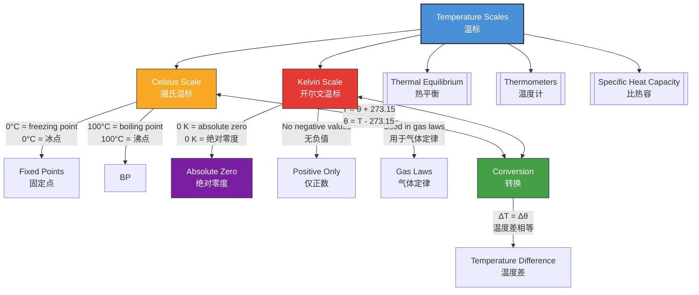

# 1. Overview / 概述

**English:**
This sub-topic introduces the two fundamental temperature scales used in physics: the **Celsius scale** (°C) and the **Kelvin scale** (K). Temperature is a measure of the average kinetic energy of particles in a substance, and understanding how to convert between these scales is essential for all thermal physics calculations. The Celsius scale is based on the freezing and boiling points of water (0°C and 100°C), while the Kelvin scale is an absolute thermodynamic scale starting at **absolute zero** (0 K = -273.15°C), where particles have minimum kinetic energy. This sub-topic is foundational for understanding [[Thermal Equilibrium and the Zeroth Law]], [[Thermometers and Temperature Measurement]], and [[Absolute Zero and the Kelvin Scale]]. It directly supports calculations in [[Specific Heat Capacity and Latent Heat]] and [[Thermal Expansion]].

**中文:**
本子知识点介绍物理学中使用的两种基本温标：**摄氏温标** (°C) 和 **开尔文温标** (K)。温度是物质粒子平均动能的量度，理解这两种温标之间的转换对于所有热物理计算至关重要。摄氏温标基于水的冰点和沸点（0°C 和 100°C），而开尔文温标是一种绝对热力学温标，从**绝对零度**（0 K = -273.15°C）开始，此时粒子具有最小动能。本子知识点是理解[[热平衡与热力学第零定律]]、[[温度计与温度测量]]和[[绝对零度与开尔文温标]]的基础，并直接支持[[比热容与潜热]]和[[热膨胀]]中的计算。

---

# 2. Syllabus Learning Objectives / 考纲学习目标

| CAIE 9702 | Edexcel IAL |
|-----------|-------------|
| 10.1(a) Understand that temperature is a measure of the average kinetic energy of the particles in a substance | 5.1 Understand the concept of temperature and its measurement |
| 10.1(b) Understand the concept of absolute zero and the Kelvin scale | 5.2 Understand the relationship between the Celsius and Kelvin scales |
| 10.1(c) Convert temperatures between Celsius and Kelvin scales | 5.3 Convert temperatures between Celsius and Kelvin |
| 10.1(d) Understand that the Kelvin scale is an absolute thermodynamic scale | 5.4 Understand that the Kelvin scale is an absolute scale starting at absolute zero |
| 10.1(e) Understand that temperature differences are the same in both scales | — |

**Examiner Expectations / 考官期望:**
- **English:** Students must be able to convert between Celsius and Kelvin accurately, understand that the Kelvin scale has no negative values, and know that a change of 1°C equals a change of 1 K. They should also understand that absolute zero is the lowest possible temperature.
- **中文:** 学生必须能够准确地在摄氏温标和开尔文温标之间进行转换，理解开尔文温标没有负值，并知道1°C的变化等于1 K的变化。他们还应该理解绝对零度是可能的最低温度。

---

# 3. Core Definitions / 核心定义

| Term (EN/CN) | Definition (EN) | Definition (CN) | Common Mistakes / 常见错误 |
|--------------|-----------------|-----------------|---------------------------|
| **Temperature** / 温度 | A measure of the average kinetic energy of the particles in a substance. | 物质粒子平均动能的量度。 | Confusing temperature with heat (heat is energy transfer, temperature is a measure of average kinetic energy). |
| **Celsius Scale** / 摄氏温标 | A temperature scale where 0°C is the freezing point of water and 100°C is the boiling point of water at standard atmospheric pressure. | 一种温标，其中0°C是水的冰点，100°C是标准大气压下水的沸点。 | Thinking Celsius is an absolute scale (it is relative). |
| **Kelvin Scale** / 开尔文温标 | An absolute thermodynamic temperature scale where 0 K is absolute zero, the lowest possible temperature. | 一种绝对热力学温标，其中0 K是绝对零度，即可能的最低温度。 | Forgetting to add 273.15 when converting from Celsius to Kelvin. |
| **Absolute Zero** / 绝对零度 | The lowest possible temperature (0 K = -273.15°C) where particles have minimum kinetic energy. | 可能的最低温度（0 K = -273.15°C），此时粒子具有最小动能。 | Thinking particles stop moving entirely at absolute zero (they have zero-point energy). |
| **Thermodynamic Scale** / 热力学温标 | A temperature scale that is independent of the properties of any particular substance, based on the laws of thermodynamics. | 一种独立于任何特定物质性质的温标，基于热力学定律。 | Confusing with empirical scales like Celsius. |

---

# 4. Key Concepts Explained / 关键概念详解

## 4.1 The Celsius Scale / 摄氏温标

### Explanation / 解释
**English:** The Celsius scale is a **relative** temperature scale defined by two fixed points: the freezing point of water (0°C) and the boiling point of water (100°C) at standard atmospheric pressure. The interval between these points is divided into 100 equal divisions called degrees Celsius (°C). This scale is commonly used in everyday life and in many scientific contexts. However, it is not an absolute scale because it can have negative values (e.g., -10°C). The Celsius scale is related to the [[Thermometers and Temperature Measurement]] sub-topic, as thermometers are calibrated using these fixed points.

**中文:** 摄氏温标是一种**相对**温标，由两个固定点定义：标准大气压下水的冰点（0°C）和沸点（100°C）。这两个点之间的间隔被分成100个相等的分度，称为摄氏度（°C）。这种温标在日常生活中和许多科学环境中常用。然而，它不是绝对温标，因为它可以有负值（例如-10°C）。摄氏温标与[[温度计与温度测量]]子知识点相关，因为温度计是使用这些固定点进行校准的。

### Physical Meaning / 物理意义
**English:** A temperature of 0°C represents the freezing/melting point of water, and 100°C represents the boiling point. The scale is convenient for everyday use but is not fundamental in physics because it depends on the properties of water.

**中文:** 0°C的温度代表水的冰点/熔点，100°C代表沸点。该温标在日常使用中很方便，但在物理学中并非基本温标，因为它依赖于水的性质。

### Common Misconceptions / 常见误区
- **English:** Thinking that 0°C means "no temperature" or "no heat." In fact, 0°C is just a reference point; particles still have significant kinetic energy.
- **中文:** 认为0°C意味着"没有温度"或"没有热量"。实际上，0°C只是一个参考点；粒子仍然具有显著的动能。
- **English:** Believing that the Celsius scale is an absolute scale. It is relative and can have negative values.
- **中文:** 相信摄氏温标是绝对温标。它是相对的，可以有负值。

### Exam Tips / 考试提示
- **English:** Always write the unit symbol correctly: °C (degree symbol + capital C). Do not write "C" alone.
- **中文:** 始终正确书写单位符号：°C（度符号+大写C）。不要单独写"C"。

> 📷 **IMAGE PROMPT — DIAGRAM-01: Celsius Scale Fixed Points**
> A simple vertical thermometer diagram showing the Celsius scale from -20°C to 120°C. Mark the freezing point of water at 0°C with an ice cube icon and the boiling point at 100°C with steam bubbles. Label the 100 equal divisions between them. Use a clean, educational style suitable for an A-Level physics textbook.

---

## 4.2 The Kelvin Scale / 开尔文温标

### Explanation / 解释
**English:** The Kelvin scale is an **absolute thermodynamic temperature scale** that starts at **absolute zero** (0 K), the lowest possible temperature where particles have minimum kinetic energy. The Kelvin scale uses the same size degree as the Celsius scale, meaning a change of 1 K equals a change of 1°C. However, the Kelvin scale has no negative values — all temperatures are positive or zero. The Kelvin scale is fundamental in physics because it is independent of the properties of any particular substance and is directly related to the kinetic energy of particles. This scale is essential for understanding [[Absolute Zero and the Kelvin Scale]] and for calculations in [[Specific Heat Capacity and Latent Heat]].

**中文:** 开尔文温标是一种**绝对热力学温标**，从**绝对零度**（0 K）开始，这是可能的最低温度，此时粒子具有最小动能。开尔文温标使用与摄氏温标相同大小的度，这意味着1 K的变化等于1°C的变化。然而，开尔文温标没有负值——所有温度都是正数或零。开尔文温标在物理学中是基本的，因为它独立于任何特定物质的性质，并且与粒子的动能直接相关。这种温标对于理解[[绝对零度与开尔文温标]]以及[[比热容与潜热]]中的计算至关重要。

### Physical Meaning / 物理意义
**English:** The Kelvin scale directly measures the average kinetic energy of particles. At 0 K (absolute zero), particles have the minimum possible kinetic energy (zero-point energy). Doubling the Kelvin temperature doubles the average kinetic energy of the particles (for an ideal gas).

**中文:** 开尔文温标直接测量粒子的平均动能。在0 K（绝对零度）时，粒子具有可能的最小动能（零点能）。开尔文温度加倍，粒子的平均动能也加倍（对于理想气体）。

### Common Misconceptions / 常见误区
- **English:** Thinking that 0 K means particles stop moving completely. In reality, particles have zero-point energy due to quantum mechanics.
- **中文:** 认为0 K意味着粒子完全停止运动。实际上，由于量子力学，粒子具有零点能。
- **English:** Forgetting that the Kelvin scale does not use the degree symbol (°). It is written as "K" not "°K".
- **中文:** 忘记开尔文温标不使用度符号（°）。它写作"K"而不是"°K"。

### Exam Tips / 考试提示
- **English:** Always use the correct conversion: K = °C + 273.15 (or 273 for most A-Level calculations). Never subtract when converting from Celsius to Kelvin.
- **中文:** 始终使用正确的转换：K = °C + 273.15（或大多数A-Level计算中使用273）。从摄氏温标转换为开尔文温标时，切勿减去。

> 📷 **IMAGE PROMPT — DIAGRAM-02: Kelvin Scale vs Celsius Scale**
> A side-by-side comparison of two vertical thermometers. Left thermometer shows Celsius scale from -300°C to 100°C. Right thermometer shows Kelvin scale from 0 K to 373 K. Draw a horizontal dashed line connecting -273.15°C to 0 K, labeled "Absolute Zero." Use a clean, educational style with clear labels.

---

## 4.3 Conversion Between Scales / 温标之间的转换

### Explanation / 解释
**English:** The conversion between Celsius and Kelvin is straightforward because the scales have the same size degree. The relationship is:

$$ T(K) = \theta(°C) + 273.15 $$

$$ \theta(°C) = T(K) - 273.15 $$

Where $T$ is temperature in Kelvin and $\theta$ is temperature in Celsius. For most A-Level calculations, 273.15 is rounded to 273. A key point is that **temperature differences are the same in both scales**: $\Delta T(K) = \Delta \theta(°C)$. This means if the temperature increases by 10°C, it also increases by 10 K.

**中文:** 摄氏温标和开尔文温标之间的转换很简单，因为这两种温标具有相同大小的度。关系是：

$$ T(K) = \theta(°C) + 273.15 $$

$$ \theta(°C) = T(K) - 273.15 $$

其中 $T$ 是开尔文温度，$\theta$ 是摄氏温度。对于大多数A-Level计算，273.15四舍五入为273。一个关键点是**两种温标的温度差相同**：$\Delta T(K) = \Delta \theta(°C)$。这意味着如果温度升高10°C，它也升高10 K。

### Physical Meaning / 物理意义
**English:** The conversion is a simple shift of the zero point. The Kelvin scale is the Celsius scale shifted by 273.15 units so that 0 K corresponds to the lowest possible temperature.

**中文:** 转换是零点的简单平移。开尔文温标是摄氏温标平移了273.15个单位，使得0 K对应于可能的最低温度。

### Common Misconceptions / 常见误区
- **English:** Adding 273.15 when converting from Kelvin to Celsius (should subtract).
- **中文:** 从开尔文转换为摄氏时加了273.15（应该减去）。
- **English:** Thinking that temperature differences are different in the two scales (they are the same).
- **中文:** 认为两种温标的温度差不同（它们是相同的）。

### Exam Tips / 考试提示
- **English:** For temperature differences, you can use either scale without conversion. For absolute temperatures in formulas like the ideal gas law ($PV = nRT$), always use Kelvin.
- **中文:** 对于温度差，您可以使用任一温标而无需转换。对于理想气体定律（$PV = nRT$）等公式中的绝对温度，始终使用开尔文温标。

---

# 5. Essential Equations / 核心公式

## Equation 1: Celsius to Kelvin Conversion / 摄氏转开尔文

$$ T(K) = \theta(°C) + 273.15 $$

| Symbol (符号) | Meaning (EN) | Meaning (CN) | Unit (单位) |
|--------------|-------------|-------------|------------|
| $T$ | Temperature in Kelvin | 开尔文温度 | K |
| $\theta$ | Temperature in Celsius | 摄氏温度 | °C |
| 273.15 | Conversion constant | 转换常数 | — |

**Derivation / 推导:** The constant 273.15 comes from the fact that absolute zero is -273.15°C. Therefore, 0 K = -273.15°C, so to convert from Celsius to Kelvin, we add 273.15.

**Conditions / 适用条件:** Always valid for any temperature.

**Limitations / 局限性:** For most A-Level calculations, 273.15 is approximated as 273. The exact value is only needed for high-precision work.

## Equation 2: Kelvin to Celsius Conversion / 开尔文转摄氏

$$ \theta(°C) = T(K) - 273.15 $$

| Symbol (符号) | Meaning (EN) | Meaning (CN) | Unit (单位) |
|--------------|-------------|-------------|------------|
| $\theta$ | Temperature in Celsius | 摄氏温度 | °C |
| $T$ | Temperature in Kelvin | 开尔文温度 | K |
| 273.15 | Conversion constant | 转换常数 | — |

**Derivation / 推导:** Rearranging the first equation.

**Conditions / 适用条件:** Always valid for any temperature.

**Limitations / 局限性:** Same as above.

## Equation 3: Temperature Difference Equality / 温度差相等

$$ \Delta T(K) = \Delta \theta(°C) $$

| Symbol (符号) | Meaning (EN) | Meaning (CN) | Unit (单位) |
|--------------|-------------|-------------|------------|
| $\Delta T$ | Change in Kelvin temperature | 开尔文温度变化 | K |
| $\Delta \theta$ | Change in Celsius temperature | 摄氏温度变化 | °C |

**Derivation / 推导:** If $T_1 = \theta_1 + 273.15$ and $T_2 = \theta_2 + 273.15$, then $T_2 - T_1 = \theta_2 - \theta_1$, so $\Delta T = \Delta \theta$.

**Conditions / 适用条件:** Always valid.

**Limitations / 局限性:** None.

> 📷 **IMAGE PROMPT — DIAGRAM-03: Temperature Scale Conversion Visual**
> A horizontal number line showing both Celsius (top) and Kelvin (bottom) scales aligned. Mark key points: -273.15°C / 0 K (absolute zero), -173.15°C / 100 K, 0°C / 273.15 K, 100°C / 373.15 K. Use arrows to show the conversion direction. Include a callout box: "ΔT(K) = Δθ(°C)".

---

# 6. Graphs and Relationships / 图表与关系

## 6.1 Celsius vs Kelvin Relationship / 摄氏与开尔文关系图

### Axes / 坐标轴
- **X-axis:** Celsius temperature $\theta$ (°C) / 摄氏温度 $\theta$ (°C)
- **Y-axis:** Kelvin temperature $T$ (K) / 开尔文温度 $T$ (K)

### Shape / 形状
**English:** A straight line with gradient = 1 and y-intercept = 273.15. The line passes through the point (-273.15, 0), representing absolute zero.

**中文:** 一条斜率为1、y截距为273.15的直线。该线通过点(-273.15, 0)，代表绝对零度。

### Gradient Meaning / 斜率含义
**English:** The gradient is 1, meaning a 1°C change corresponds to a 1 K change.

**中文:** 斜率为1，意味着1°C的变化对应于1 K的变化。

### Area Meaning / 面积含义
**English:** Not applicable for this linear relationship.

**中文:** 不适用于这种线性关系。

### Exam Interpretation / 考试解读
**English:** You may be asked to read values from such a graph or to plot data points. Remember that the line should always pass through (0, 273.15) and (-273.15, 0).

**中文:** 您可能会被要求从这样的图表中读取数值或绘制数据点。记住，这条线应始终通过(0, 273.15)和(-273.15, 0)。

---

# 7. Required Diagrams / 必备图表

## 7.1 Dual-Scale Thermometer Diagram / 双温标温度计图

### Description / 描述
**English:** A diagram showing a thermometer with both Celsius and Kelvin scales side by side, highlighting the relationship between the two scales and the position of absolute zero.

**中文:** 一个显示温度计同时具有摄氏温标和开尔文温标的图表，突出显示两种温标之间的关系以及绝对零度的位置。

### Image Prompt / 图片生成提示
> 📷 **IMAGE PROMPT — DIAGRAM-04: Dual-Scale Thermometer**
> A vertical thermometer with two scales. Left scale: Celsius from -300°C to 100°C with markings every 10°C. Right scale: Kelvin from 0 K to 373 K with markings every 10 K. Highlight the freezing point (0°C / 273 K) with a blue marker and boiling point (100°C / 373 K) with a red marker. Draw a dashed line at -273.15°C / 0 K labeled "Absolute Zero." Use a clean, educational style with clear, readable fonts. Include a note: "1°C = 1 K difference."

### Labels Required / 需要标注
- **English:** Celsius scale (°C), Kelvin scale (K), Freezing point (0°C / 273 K), Boiling point (100°C / 373 K), Absolute zero (-273.15°C / 0 K)
- **中文:** 摄氏温标 (°C), 开尔文温标 (K), 冰点 (0°C / 273 K), 沸点 (100°C / 373 K), 绝对零度 (-273.15°C / 0 K)

### Exam Importance / 考试重要性
**English:** High — understanding the visual relationship between the two scales helps avoid conversion errors.

**中文:** 高 — 理解两种温标之间的视觉关系有助于避免转换错误。

---

## 7.2 Temperature Scale Comparison Table / 温标对比表

### Description / 描述
**English:** A table comparing key properties of the Celsius and Kelvin scales.

**中文:** 一个比较摄氏温标和开尔文温标关键属性的表格。

### Image Prompt / 图片生成提示
> 📷 **IMAGE PROMPT — DIAGRAM-05: Temperature Scale Comparison Table**
> A clean, professional table with two columns: "Celsius (°C)" and "Kelvin (K)". Rows: "Type" (Relative / Absolute), "Zero Point" (Freezing point of water / Absolute zero), "Negative Values?" (Yes / No), "Used in Gas Laws?" (No / Yes), "Fixed Points" (Water freezing/boiling / Thermodynamic). Use a blue/white color scheme suitable for an A-Level textbook.

### Labels Required / 需要标注
- **English:** Type, Zero Point, Negative Values, Used in Gas Laws, Fixed Points
- **中文:** 类型, 零点, 负值, 用于气体定律, 固定点

### Exam Importance / 考试重要性
**English:** Medium — helps students quickly recall key differences.

**中文:** 中 — 帮助学生快速回忆关键区别。

---

# 8. Worked Examples / 典型例题

## Example 1: Basic Conversion / 基本转换

### Question / 题目
**English:** Convert the following temperatures:
(a) 25°C to Kelvin
(b) 300 K to Celsius
(c) -50°C to Kelvin

**中文:** 转换以下温度：
(a) 25°C 转换为开尔文
(b) 300 K 转换为摄氏
(c) -50°C 转换为开尔文

### Solution / 解答

**(a) 25°C to Kelvin / 25°C 转换为开尔文**

$$ T(K) = \theta(°C) + 273 $$
$$ T = 25 + 273 = 298 \text{ K} $$

**(b) 300 K to Celsius / 300 K 转换为摄氏**

$$ \theta(°C) = T(K) - 273 $$
$$ \theta = 300 - 273 = 27°C $$

**(c) -50°C to Kelvin / -50°C 转换为开尔文**

$$ T(K) = \theta(°C) + 273 $$
$$ T = -50 + 273 = 223 \text{ K} $$

### Final Answer / 最终答案
**Answer:** (a) 298 K, (b) 27°C, (c) 223 K | **答案：** (a) 298 K, (b) 27°C, (c) 223 K

### Quick Tip / 提示
**English:** Remember: C → K = add 273; K → C = subtract 273. For negative Celsius values, you are adding a negative number, which is the same as subtracting.

**中文:** 记住：C → K = 加273；K → C = 减273。对于负的摄氏值，你是在加一个负数，这等同于减法。

---

## Example 2: Temperature Difference / 温度差

### Question / 题目
**English:** The temperature of a gas increases from 20°C to 50°C. Calculate the temperature change in:
(a) Celsius
(b) Kelvin

**中文:** 气体的温度从20°C升高到50°C。计算温度变化：
(a) 摄氏温标
(b) 开尔文温标

### Solution / 解答

**(a) Change in Celsius / 摄氏温标的变化**

$$ \Delta \theta = \theta_2 - \theta_1 = 50°C - 20°C = 30°C $$

**(b) Change in Kelvin / 开尔文温标的变化**

First, convert both temperatures to Kelvin:
$$ T_1 = 20 + 273 = 293 \text{ K} $$
$$ T_2 = 50 + 273 = 323 \text{ K} $$

$$ \Delta T = T_2 - T_1 = 323 - 293 = 30 \text{ K} $$

Alternatively, use the property that $\Delta T = \Delta \theta$:
$$ \Delta T = 30 \text{ K} $$

### Final Answer / 最终答案
**Answer:** (a) 30°C, (b) 30 K | **答案：** (a) 30°C, (b) 30 K

### Quick Tip / 提示
**English:** For temperature differences, you don't need to convert! The change is the same in both scales. This saves time in exams.

**中文:** 对于温度差，你不需要转换！两种温标的变化是相同的。这可以在考试中节省时间。

---

# 9. Past Paper Question Types / 历年真题题型

| Question Type / 题型 | Frequency / 频率 | Difficulty / 难度 | Past Paper References / 真题索引 |
|----------------------|------------------|------------------|-------------------------------|
| Direct conversion between Celsius and Kelvin | High | Easy | 📝 *待填入* |
| Temperature difference in both scales | Medium | Easy | 📝 *待填入* |
| Using Kelvin in ideal gas law calculations | High | Medium | 📝 *待填入* |
| Identifying absolute zero on a graph | Low | Easy | 📝 *待填入* |
| Explaining why Kelvin is an absolute scale | Low | Medium | 📝 *待填入* |

**Common Command Words / 常见指令词:**
- **English:** Convert, Calculate, State, Explain, Determine
- **中文:** 转换, 计算, 陈述, 解释, 确定

---

# 10. Practical Skills Connections / 实验技能链接

**English:**
This sub-topic connects to practical work in several ways:

1. **Thermometer Calibration:** Students may need to calibrate a thermometer using the fixed points of the Celsius scale (ice-water mixture for 0°C, boiling water for 100°C). This involves understanding the concept of fixed points and the linear interpolation between them.

2. **Uncertainty in Temperature Measurement:** When measuring temperature, students must consider the uncertainty of the thermometer (±0.5°C for a typical laboratory thermometer). When converting to Kelvin, the uncertainty remains the same (±0.5 K).

3. **Graph Plotting:** When plotting temperature data (e.g., cooling curves), students must correctly label axes with units (°C or K) and understand that the shape of the graph is identical regardless of which scale is used.

4. **Experimental Design:** In experiments involving gas laws (e.g., Charles' Law), temperatures must be measured in Kelvin. Students must convert Celsius readings to Kelvin before plotting $V$ vs $T$ graphs.

**中文:**
本子知识点以多种方式与实验工作相关联：

1. **温度计校准：** 学生可能需要使用摄氏温标的固定点（冰水混合物用于0°C，沸水用于100°C）来校准温度计。这涉及理解固定点的概念以及它们之间的线性插值。

2. **温度测量中的不确定度：** 测量温度时，学生必须考虑温度计的不确定度（典型实验室温度计为±0.5°C）。转换为开尔文时，不确定度保持不变（±0.5 K）。

3. **图表绘制：** 绘制温度数据时（例如冷却曲线），学生必须正确标注坐标轴单位（°C或K），并理解无论使用哪种温标，图表的形状都是相同的。

4. **实验设计：** 在涉及气体定律的实验（例如查理定律）中，温度必须以开尔文为单位测量。学生必须在绘制$V$ vs $T$图表之前将摄氏读数转换为开尔文。

---

# 11. Concept Map / 概念图谱

---

# 12. Quick Revision Sheet / 速查表

| Category / 类别 | Key Points / 要点 |
|----------------|------------------|
| **Definition / 定义** | Temperature = measure of average kinetic energy of particles / 温度 = 粒子平均动能的量度 |
| **Celsius Scale / 摄氏温标** | Relative scale: 0°C (freezing) to 100°C (boiling) of water / 相对温标：水的0°C（冰点）到100°C（沸点） |
| **Kelvin Scale / 开尔文温标** | Absolute scale: starts at 0 K (absolute zero), no negative values / 绝对温标：从0 K（绝对零度）开始，无负值 |
| **Key Formula / 核心公式** | $T(K) = \theta(°C) + 273$ (or 273.15) / $T(K) = \theta(°C) + 273$（或273.15） |
| **Key Formula / 核心公式** | $\theta(°C) = T(K) - 273$ (or 273.15) / $\theta(°C) = T(K) - 273$（或273.15） |
| **Key Property / 关键性质** | $\Delta T(K) = \Delta \theta(°C)$ — temperature differences are equal / $\Delta T(K) = \Delta \theta(°C)$ — 温度差相等 |
| **Key Graph / 核心图表** | Linear graph: $T$ vs $\theta$ with gradient = 1, y-intercept = 273.15 / 线性图：$T$ vs $\theta$，斜率=1，y截距=273.15 |
| **Absolute Zero / 绝对零度** | 0 K = -273.15°C — lowest possible temperature / 0 K = -273.15°C — 可能的最低温度 |
| **Exam Tip / 考试提示** | Always use Kelvin in gas law calculations ($PV = nRT$) / 在气体定律计算中始终使用开尔文温标（$PV = nRT$） |
| **Exam Tip / 考试提示** | For temperature differences, no conversion needed / 对于温度差，无需转换 |
| **Common Mistake / 常见错误** | Adding 273 when converting from Kelvin to Celsius (should subtract) / 从开尔文转换为摄氏时加了273（应该减去） |
| **Common Mistake / 常见错误** | Writing "°K" instead of "K" for Kelvin / 将开尔文写作"°K"而不是"K" |