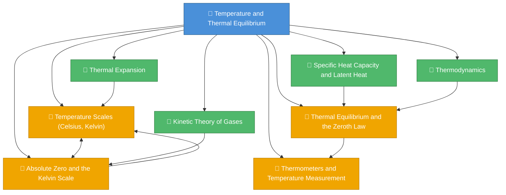

# 1. Overview / 概述

**English:**
This topic introduces the fundamental concepts of temperature and thermal equilibrium, which form the bedrock of thermal physics. Temperature is a measure of the average kinetic energy of particles in a substance, while thermal equilibrium describes the state where two or more objects in thermal contact have no net heat flow between them. The Zeroth Law of Thermodynamics establishes the basis for temperature measurement by stating that if two systems are each in thermal equilibrium with a third system, they are in thermal equilibrium with each other. This principle allows us to use thermometers as reliable temperature-measuring devices. The Kelvin scale, with absolute zero as its starting point, is the SI unit for thermodynamic temperature and is directly proportional to the average kinetic energy of particles. Understanding these concepts is essential for studying heat transfer, [[Specific Heat Capacity and Latent Heat]], and [[Thermal Expansion]].

In real-world applications, temperature measurement is critical in medicine (clinical thermometers), meteorology (weather stations), industrial processes (temperature control in manufacturing), and everyday life (cooking, heating systems). The concept of thermal equilibrium explains why a hot cup of coffee eventually cools to room temperature and why ice melts in a warm drink. In Cambridge 9702 and Edexcel IAL examinations, this topic appears in multiple-choice questions, structured calculations, and practical experiments involving thermometers and temperature measurement. It serves as a prerequisite for more advanced topics in thermal physics, including the kinetic theory of gases and thermodynamics.

**中文：**
本主题介绍温度和热平衡的基本概念，这些概念构成了热物理学的基础。温度是物质中粒子平均动能的量度，而热平衡描述了热接触中的两个或多个物体之间没有净热流的状态。热力学第零定律通过指出如果两个系统各自与第三个系统处于热平衡，则它们彼此也处于热平衡，从而建立了温度测量的基础。这一原理使我们能够使用温度计作为可靠的温度测量设备。以绝对零度为起点的开尔文温标是热力学温度的国际单位制单位，与粒子的平均动能成正比。理解这些概念对于研究热传递、[[比热容和潜热]]以及[[热膨胀]]至关重要。

在现实世界的应用中，温度测量在医学（临床温度计）、气象学（气象站）、工业过程（制造中的温度控制）和日常生活（烹饪、供暖系统）中至关重要。热平衡的概念解释了为什么一杯热咖啡最终会冷却到室温，以及为什么冰在温热的饮料中融化。在剑桥 9702 和爱德思 IAL 考试中，本主题出现在选择题、结构化计算以及涉及温度计和温度测量的实验题中。它是学习更高级热物理学主题（包括气体动力学理论和热力学）的先决条件。

---

# 2. Syllabus Learning Objectives / 考纲学习目标

**English:**
The following table lists the specific learning objectives from Cambridge 9702 and Edexcel IAL syllabuses for this topic. Students must be able to define, explain, and apply these concepts in both theoretical and practical contexts.

**中文：**
下表列出了剑桥 9702 和爱德思 IAL 考纲中与本主题相关的具体学习目标。学生必须能够在理论和实践情境中定义、解释和应用这些概念。

| CAIE 9702 (10.1 a-e) | Edexcel IAL (WPH11 U1: 5.1-5.4) |
|----------------------|----------------------------------|
| 10.1(a) Understand that thermal equilibrium is a state in which there is no net heat flow between two objects in thermal contact | 5.1 Understand the concept of thermal equilibrium and the Zeroth Law of Thermodynamics |
| 10.1(b) Understand that temperature is a measure of the average kinetic energy of the particles in a substance | 5.2 Understand that temperature is a measure of the average kinetic energy of particles in a substance |
| 10.1(c) Understand that the Kelvin scale of temperature is based on absolute zero and the triple point of water | 5.3 Understand the Celsius and Kelvin temperature scales and the concept of absolute zero |
| 10.1(d) Convert temperatures between the Celsius and Kelvin scales | 5.4 Convert temperatures between Celsius and Kelvin scales |
| 10.1(e) Understand that the lowest possible temperature is absolute zero (0 K) and that, in practice, it is unattainable | 5.5 Understand that absolute zero (0 K) is the lowest possible temperature and is unattainable |

> 📋 **CIE Only:** Cambridge specifically requires understanding of the triple point of water as a fixed point for the Kelvin scale. This is not explicitly stated in Edexcel but is implied in the definition of the Kelvin scale.

> 📋 **Edexcel Only:** Edexcel explicitly lists the Zeroth Law of Thermodynamics as a separate learning objective (5.1), while Cambridge includes it within the concept of thermal equilibrium (10.1a). Edexcel also requires understanding that absolute zero is unattainable (5.5), which Cambridge mentions but does not list as a separate objective.

**Examiner Expectations / 考官期望：**
- **English:** Candidates must be able to define thermal equilibrium precisely, convert between Celsius and Kelvin scales without error, explain why absolute zero is unattainable, and describe how thermometers work based on thermal equilibrium. Common errors include confusing temperature with heat, incorrect conversion formulas, and failing to state that absolute zero is the temperature at which particles have minimum kinetic energy.
- **中文：** 考生必须能够精确定义热平衡，无误地在摄氏温标和开尔文温标之间进行转换，解释为什么绝对零度无法达到，并描述温度计如何基于热平衡工作。常见错误包括混淆温度和热量、使用错误的转换公式，以及未能说明绝对零度是粒子具有最小动能的温度。

---

# 3. Core Definitions / 核心定义

**English:**
The following table provides the essential definitions for this topic, using exam-standard wording. Each term is linked to related concepts in the knowledge graph.

**中文：**
下表提供了本主题的基本定义，使用了考试标准的措辞。每个术语都链接到知识图谱中的相关概念。

| Term (EN/CN) | Definition (EN) | Definition (CN) | Common Mistakes / 常见错误 |
|--------------|-----------------|-----------------|---------------------------|
| **Temperature / 温度** | A measure of the average kinetic energy of the particles in a substance. It determines the direction of net heat flow between objects in thermal contact. | 物质中粒子平均动能的量度。它决定了热接触物体之间净热流的方向。 | Confusing temperature with heat (thermal energy). Temperature is an intensive property; heat is energy transfer. |
| **Thermal Equilibrium / 热平衡** | A state in which two or more objects in thermal contact have no net heat flow between them, meaning they are at the same temperature. | 热接触中的两个或多个物体之间没有净热流的状态，意味着它们处于相同温度。 | Thinking thermal equilibrium means equal heat energy; it means equal temperature. |
| **Zeroth Law of Thermodynamics / 热力学第零定律** | If two systems are each in thermal equilibrium with a third system, then they are in thermal equilibrium with each other. This law provides the basis for temperature measurement. | 如果两个系统各自与第三个系统处于热平衡，则它们彼此也处于热平衡。该定律为温度测量提供了基础。 | Forgetting to mention "thermal equilibrium" in the statement; confusing it with the First Law. |
| **Absolute Zero / 绝对零度** | The lowest possible temperature (0 K or -273.15 °C) at which particles have minimum kinetic energy (zero in classical physics, but quantum mechanical zero-point energy remains). | 可能的最低温度（0 K 或 -273.15 °C），此时粒子具有最小动能（经典物理学中为零，但量子力学零点能仍然存在）。 | Stating that particles have zero kinetic energy at absolute zero (quantum mechanics shows zero-point energy exists). |
| **Kelvin Scale / 开尔文温标** | A thermodynamic temperature scale based on absolute zero (0 K) and the triple point of water (273.16 K). The size of one kelvin is equal to one degree Celsius. | 基于绝对零度（0 K）和水三相点（273.16 K）的热力学温标。一开尔文的大小等于一摄氏度。 | Writing "degrees Kelvin" (correct: "kelvin" or "K" without degree symbol). |
| **Celsius Scale / 摄氏温标** | A temperature scale based on the freezing point (0 °C) and boiling point (100 °C) of water at standard atmospheric pressure. | 基于标准大气压下水的冰点（0 °C）和沸点（100 °C）的温标。 | Forgetting that 0 °C = 273.15 K, not 273 K (though 273 K is often accepted for approximations). |
| **Triple Point of Water / 水的三相点** | The unique temperature and pressure at which water exists simultaneously in solid, liquid, and gas phases. It is defined as 273.16 K (0.01 °C). | 水同时以固态、液态和气态存在的独特温度和压力。定义为 273.16 K（0.01 °C）。 | Confusing triple point with freezing point; triple point is at 0.01 °C, not 0 °C. |

---

# 4. Key Concepts Explained / 关键概念详解

## 4.1 Temperature / 温度

### Explanation / 解释
**English:**
Temperature is a fundamental physical quantity that measures the average kinetic energy of the particles (atoms or molecules) in a substance. It is an intensive property, meaning it does not depend on the amount of substance present. For example, a small cup of water and a large bucket of water at the same temperature have the same average kinetic energy per particle, but the bucket contains more total thermal energy. Temperature determines the direction of heat flow: heat always flows from a region of higher temperature to a region of lower temperature until [[Thermal Equilibrium]] is reached. The SI unit of temperature is the kelvin (K), though degrees Celsius (°C) are commonly used in everyday contexts.

**中文：**
温度是一个基本物理量，用于测量物质中粒子（原子或分子）的平均动能。它是一个强度性质，意味着它不依赖于存在的物质量。例如，一小杯水和一大桶水在相同温度下，每个粒子的平均动能相同，但大桶水含有更多的总热能。温度决定了热流的方向：热量总是从温度较高的区域流向温度较低的区域，直到达到[[热平衡]]。温度的国际单位制单位是开尔文（K），尽管在日常生活中常用摄氏度（°C）。

### Physical Meaning / 物理意义
**English:**
In everyday life, temperature tells us how hot or cold an object feels. At the microscopic level, higher temperature means particles are moving faster (higher kinetic energy), while lower temperature means particles are moving slower. This explains why gases expand when heated ([[Thermal Expansion]]) and why solids melt at specific temperatures.

**中文：**
在日常生活中，温度告诉我们物体感觉有多热或多冷。在微观层面上，较高的温度意味着粒子运动更快（动能更高），而较低的温度意味着粒子运动更慢。这解释了为什么气体受热时膨胀（[[热膨胀]]），以及为什么固体在特定温度下熔化。

### Common Misconceptions / 常见误区
1. **Temperature vs. Heat:** Students often think temperature and heat are the same. Temperature is a measure of average kinetic energy; heat is thermal energy transferred between objects due to a temperature difference.
2. **Temperature and Particle Speed:** Some students believe all particles in a substance have the same speed at a given temperature. In reality, particles have a distribution of speeds (Maxwell-Boltzmann distribution).
3. **Negative Temperatures:** Students may think negative Celsius temperatures mean "negative heat." Negative Celsius temperatures simply mean temperatures below the freezing point of water.

### Exam Tips / 考试提示
**English:**
Cambridge and Edexcel often ask students to distinguish between temperature and heat. Be prepared to explain that temperature is a measure of average kinetic energy, not total thermal energy. In multiple-choice questions, watch for distractors that confuse intensive and extensive properties.

**中文：**
剑桥和爱德思考试经常要求学生区分温度和热量。准备好解释温度是平均动能的量度，而不是总热能。在选择题中，注意那些混淆强度性质和广度性质的干扰项。

---

## 4.2 Thermal Equilibrium / 热平衡

### Explanation / 解释
**English:**
[[Thermal Equilibrium]] is a state in which two or more objects in thermal contact (allowing heat transfer) have no net heat flow between them. This occurs when all objects reach the same temperature. The concept is governed by the Zeroth Law of Thermodynamics, which states: "If two systems are each in thermal equilibrium with a third system, then they are in thermal equilibrium with each other." This law is fundamental because it justifies the use of thermometers: a thermometer measures its own temperature when in thermal equilibrium with the object being measured, and that temperature is assumed to be the same as the object's temperature.

**中文：**
[[热平衡]]是热接触（允许热传递）中的两个或多个物体之间没有净热流的状态。当所有物体达到相同温度时发生这种情况。该概念由热力学第零定律支配，该定律指出："如果两个系统各自与第三个系统处于热平衡，则它们彼此也处于热平衡。"这条定律至关重要，因为它证明了温度计使用的合理性：温度计在与被测物体达到热平衡时测量自身的温度，并且该温度被认为与物体的温度相同。

### Physical Meaning / 物理意义
**English:**
When you place a cold drink in a warm room, the drink warms up and the room cools down slightly until they reach the same temperature — thermal equilibrium. This explains why ice melts in a drink (heat flows from the warmer drink to the colder ice) and why a hot cup of coffee eventually cools to room temperature.

**中文：**
当你将冷饮放在温暖的房间里时，饮料会变暖，房间会稍微变凉，直到它们达到相同温度——热平衡。这解释了为什么冰在饮料中融化（热量从较暖的饮料流向较冷的冰），以及为什么热咖啡最终会冷却到室温。

### Common Misconceptions / 常见误区
1. **Equal Heat Energy:** Students often think thermal equilibrium means objects have equal amounts of heat energy. It means they have equal temperatures.
2. **Instant Equilibrium:** Some students believe thermal equilibrium is reached instantly. In reality, it takes time depending on thermal conductivity and temperature difference.
3. **No Heat Flow:** Students may think that at thermal equilibrium, no heat transfer occurs at all. In fact, heat may still be exchanged, but the net flow is zero.

### Exam Tips / 考试提示
**English:**
Examiners frequently ask students to explain how a thermometer works using the concept of thermal equilibrium. Be sure to mention that the thermometer must be in thermal contact with the object and sufficient time must be allowed for equilibrium to be reached. Also, be prepared to apply the Zeroth Law in reasoning questions.

**中文：**
考官经常要求学生使用热平衡的概念解释温度计的工作原理。务必提到温度计必须与物体热接触，并且必须留出足够的时间以达到平衡。同时，准备好将第零定律应用于推理题中。

---

## 4.3 The Kelvin Scale and Absolute Zero / 开尔文温标与绝对零度

### Explanation / 解释
**English:**
The Kelvin scale is the SI unit for thermodynamic temperature. It is an absolute scale, meaning it starts at [[Absolute Zero]] (0 K), the lowest possible temperature where particles have minimum kinetic energy. The size of one kelvin (1 K) is exactly equal to one degree Celsius (1 °C). The Kelvin scale is defined using two fixed points: absolute zero (0 K) and the triple point of water (273.16 K). The triple point of water is the unique temperature and pressure at which water exists simultaneously in solid, liquid, and gas phases. The conversion between Celsius and Kelvin is:

$$ T(K) = \theta(°C) + 273.15 $$

For most A-Level calculations, 273.15 is rounded to 273, giving:

$$ T(K) = \theta(°C) + 273 $$

**中文：**
开尔文温标是热力学温度的国际单位制单位。它是一个绝对温标，意味着它从[[绝对零度]]（0 K）开始，这是粒子具有最小动能的最低可能温度。一开尔文（1 K）的大小恰好等于一摄氏度（1 °C）。开尔文温标使用两个固定点定义：绝对零度（0 K）和水三相点（273.16 K）。水的三相点是水同时以固态、液态和气态存在的独特温度和压力。摄氏度和开尔文之间的转换是：

$$ T(K) = \theta(°C) + 273.15 $$

对于大多数 A-Level 计算，273.15 四舍五入为 273，得到：

$$ T(K) = \theta(°C) + 273 $$

### Physical Meaning / 物理意义
**English:**
Absolute zero (0 K = -273.15 °C) is the theoretical temperature at which all classical motion of particles ceases. In practice, it is impossible to reach absolute zero because removing energy from a system becomes increasingly difficult as the temperature approaches zero (the Third Law of Thermodynamics). However, scientists have achieved temperatures within billionths of a kelvin above absolute zero. The Kelvin scale is essential in physics because many physical laws (e.g., the ideal gas law, Stefan-Boltzmann law) require temperature in kelvin.

**中文：**
绝对零度（0 K = -273.15 °C）是粒子所有经典运动停止的理论温度。实际上，不可能达到绝对零度，因为随着温度接近零，从系统中移除能量变得越来越困难（热力学第三定律）。然而，科学家已经实现了比绝对零度高十亿分之一开尔文以内的温度。开尔文温标在物理学中至关重要，因为许多物理定律（例如理想气体定律、斯特藩-玻尔兹曼定律）要求温度以开尔文为单位。

### Common Misconceptions / 常见误区
1. **Zero Kinetic Energy:** Students often state that particles have zero kinetic energy at absolute zero. In quantum mechanics, particles have zero-point energy, so they still have some motion.
2. **273 vs. 273.15:** Some students use 273 for all conversions, even when precision is required. The syllabus accepts 273 for most calculations, but 273.15 is more accurate.
3. **Degree Symbol:** Students sometimes write "°K" instead of "K". The kelvin does not use the degree symbol.

### Exam Tips / 考试提示
**English:**
Examiners expect students to convert between Celsius and Kelvin correctly. Common question types include: converting temperatures for use in gas law calculations, explaining why absolute zero is unattainable, and describing the Kelvin scale's fixed points. Be careful with significant figures when converting.

**中文：**
考官期望学生正确地在摄氏度和开尔文之间进行转换。常见问题类型包括：转换温度以用于气体定律计算、解释为什么绝对零度无法达到，以及描述开尔文温标的固定点。转换时注意有效数字。

---

## 4.4 Thermometers and Temperature Measurement / 温度计与温度测量

### Explanation / 解释
**English:**
A thermometer is a device that measures temperature by exploiting a physical property that changes predictably with temperature. Common thermometric properties include:
- **Liquid-in-glass:** Volume expansion of mercury or alcohol
- **Thermocouple:** Voltage generated at the junction of two different metals
- **Resistance thermometer:** Change in electrical resistance of a metal (e.g., platinum)
- **Thermistor:** Change in resistance of a semiconductor
- **Infrared thermometer:** Detection of thermal radiation

For a thermometer to be reliable, it must be calibrated using fixed points (e.g., the triple point of water, absolute zero). The thermometer must reach [[Thermal Equilibrium]] with the object being measured before a reading is taken.

**中文：**
温度计是一种通过利用随温度可预测变化的物理性质来测量温度的装置。常见的测温性质包括：
- **液体温度计：** 水银或酒精的体积膨胀
- **热电偶：** 两种不同金属连接处产生的电压
- **电阻温度计：** 金属（如铂）电阻的变化
- **热敏电阻：** 半导体电阻的变化
- **红外温度计：** 热辐射的检测

为了使温度计可靠，必须使用固定点（例如水的三相点、绝对零度）进行校准。温度计必须与被测物体达到[[热平衡]]后才能读数。

### Physical Meaning / 物理意义
**English:**
Different thermometers are suitable for different applications. Liquid-in-glass thermometers are simple and cheap but slow and fragile. Thermocouples are fast and can measure high temperatures. Resistance thermometers are very accurate but expensive. Infrared thermometers allow non-contact measurement, useful for moving objects or dangerous environments.

**中文：**
不同的温度计适用于不同的应用。液体温度计简单便宜，但速度慢且易碎。热电偶速度快，可以测量高温。电阻温度计非常准确但昂贵。红外温度计允许非接触测量，适用于移动物体或危险环境。

### Common Misconceptions / 常见误区
1. **Instant Reading:** Students think thermometers give instant readings. In reality, time is needed for thermal equilibrium.
2. **All Thermometers Are the Same:** Students may not realize different thermometers have different ranges, accuracies, and response times.
3. **Calibration Ignored:** Some students forget that thermometers must be calibrated against known fixed points.

### Exam Tips / 考试提示
**English:**
Cambridge and Edexcel may ask students to describe how a specific thermometer works, explain why a particular thermometer is suitable for a given situation, or discuss sources of error in temperature measurement. Be prepared to mention thermal equilibrium, calibration, and response time.

**中文：**
剑桥和爱德思考试可能会要求学生描述特定温度计的工作原理，解释为什么某种温度计适用于特定情况，或讨论温度测量中的误差来源。准备好提到热平衡、校准和响应时间。

---

# 5. Essential Equations / 核心公式

## 5.1 Celsius to Kelvin Conversion / 摄氏度到开尔文的转换

**Equation / 公式:**
$$ T(K) = \theta(°C) + 273.15 $$

Or for most A-Level calculations:
$$ T(K) = \theta(°C) + 273 $$

**Variables / 变量:**
| Symbol (符号) | Meaning (EN) | Meaning (CN) | Unit (单位) |
|--------------|-------------|-------------|------------|
| $T$ | Thermodynamic temperature in kelvin | 热力学温度（开尔文） | K |
| $\theta$ | Temperature in degrees Celsius | 摄氏温度 | °C |

**Derivation / 推导:**
**English:**
The Kelvin scale is defined such that the triple point of water (0.01 °C) is exactly 273.16 K. Therefore, the size of one kelvin equals one degree Celsius. The conversion formula follows from this definition:
- At 0 °C (freezing point of water), $T = 273.15$ K
- At 100 °C (boiling point of water), $T = 373.15$ K
- The difference is 100 K for 100 °C, confirming 1 K = 1 °C

**中文：**
开尔文温标定义为水的三相点（0.01 °C）恰好为 273.16 K。因此，一开尔文的大小等于一摄氏度。转换公式由此定义得出：
- 在 0 °C（水的冰点），$T = 273.15$ K
- 在 100 °C（水的沸点），$T = 373.15$ K
- 差值为 100 K 对应 100 °C，确认 1 K = 1 °C

**Conditions / 适用条件:**
**English:** This conversion is always valid for any temperature. It is a linear transformation between two scales.

**中文：** 此转换对任何温度始终有效。它是两个温标之间的线性变换。

**Limitations / 局限性:**
**English:** The formula using 273 is an approximation. For precise work, use 273.15. The conversion does not apply to temperature differences in the same way: a change of 1 °C equals a change of 1 K, so $\Delta T(K) = \Delta \theta(°C)$.

**中文：** 使用 273 的公式是近似值。对于精确工作，请使用 273.15。此转换不适用于温差：1 °C 的变化等于 1 K 的变化，因此 $\Delta T(K) = \Delta \theta(°C)$。

**Rearrangements / 变形:**
$$ \theta(°C) = T(K) - 273.15 $$
$$ \theta(°C) = T(K) - 273 \quad \text{(approximate)} $$
$$ \Delta T(K) = \Delta \theta(°C) $$

---

## 5.2 Temperature and Average Kinetic Energy / 温度与平均动能

**Equation / 公式:**
$$ \bar{E}_k = \frac{3}{2} k_B T $$

Where $k_B$ is the Boltzmann constant ($1.38 \times 10^{-23} \, \text{J K}^{-1}$).

**Variables / 变量:**
| Symbol (符号) | Meaning (EN) | Meaning (CN) | Unit (单位) |
|--------------|-------------|-------------|------------|
| $\bar{E}_k$ | Average kinetic energy of a particle | 粒子的平均动能 | J |
| $k_B$ | Boltzmann constant | 玻尔兹曼常数 | J K⁻¹ |
| $T$ | Thermodynamic temperature | 热力学温度 | K |

**Derivation / 推导:**
**English:**
This equation is derived from the kinetic theory of gases. For a monatomic ideal gas, the average translational kinetic energy per molecule is directly proportional to the absolute temperature. The derivation involves considering the pressure exerted by gas molecules on the walls of a container and relating it to the average kinetic energy. The factor 3/2 arises from the three degrees of freedom (x, y, z directions) for translational motion.

**中文：**
该方程源自气体动力学理论。对于单原子理想气体，每个分子的平均平动动能与绝对温度成正比。推导涉及考虑气体分子对容器壁施加的压力，并将其与平均动能联系起来。因子 3/2 源于平动运动的三个自由度（x、y、z 方向）。

**Conditions / 适用条件:**
**English:** This equation applies to ideal gases. For real gases, it is a good approximation at low pressures and high temperatures. For solids and liquids, the relationship is more complex due to intermolecular forces and vibrational modes.

**中文：** 该方程适用于理想气体。对于实际气体，在低压和高温下是一个很好的近似。对于固体和液体，由于分子间力和振动模式，关系更为复杂。

**Limitations / 局限性:**
**English:** The equation does not account for rotational or vibrational kinetic energy in polyatomic molecules. It only considers translational kinetic energy. At very low temperatures, quantum effects become significant.

**中文：** 该方程不考虑多原子分子中的旋转或振动动能。它只考虑平动动能。在极低温度下，量子效应变得显著。

**Rearrangements / 变形:**
$$ T = \frac{2\bar{E}_k}{3k_B} $$
$$ k_B = \frac{2\bar{E}_k}{3T} $$

---

# 6. Graphs and Relationships / 图表与关系

## 6.1 Temperature vs. Time During Thermal Equilibrium / 热平衡过程中的温度-时间图

### Axes / 坐标轴
**English:** x-axis: Time (s); y-axis: Temperature (°C or K)
**中文：** x轴：时间（s）；y轴：温度（°C 或 K）

### Shape / 形状
**English:** Two curves: one decreasing (hot object cooling) and one increasing (cold object warming), both approaching a common equilibrium temperature asymptotically.
**中文：** 两条曲线：一条下降（热物体冷却），一条上升（冷物体升温），都渐近地趋近于一个共同的平衡温度。

### Gradient Meaning / 斜率含义
**English:** The gradient represents the rate of change of temperature. A steeper gradient means faster temperature change. The gradient decreases as the objects approach thermal equilibrium because the temperature difference decreases.
**中文：** 斜率代表温度变化率。斜率越陡，温度变化越快。随着物体接近热平衡，斜率减小，因为温差减小。

### Area Meaning / 面积含义
**English:** The area under the curve has no direct physical meaning in this context. However, the area between the two curves represents the total temperature difference integrated over time.
**中文：** 在此上下文中，曲线下的面积没有直接的物理意义。然而，两条曲线之间的面积表示随时间积分的总温差。

### Exam Interpretation / 考试解读
**English:** Examiners may ask students to sketch these curves, identify the equilibrium temperature, or explain why the curves become horizontal at equilibrium. Students should understand that the rate of heat transfer depends on the temperature difference (Newton's law of cooling).
**中文：** 考官可能会要求学生绘制这些曲线，识别平衡温度，或解释为什么曲线在平衡时变为水平。学生应理解热传递速率取决于温差（牛顿冷却定律）。

### Common Questions / 常见问题
1. **Sketch the temperature-time graph for a hot object placed in a cold environment.**
2. **Explain why the gradient decreases over time.**
3. **Determine the equilibrium temperature from given data.**

---

## 6.2 Average Kinetic Energy vs. Temperature / 平均动能与温度的关系

### Axes / 坐标轴
**English:** x-axis: Temperature (K); y-axis: Average Kinetic Energy (J)
**中文：** x轴：温度（K）；y轴：平均动能（J）

### Shape / 形状
**English:** A straight line through the origin, showing direct proportionality: $\bar{E}_k \propto T$.
**中文：** 一条通过原点的直线，显示正比关系：$\bar{E}_k \propto T$。

### Gradient Meaning / 斜率含义
**English:** The gradient is $\frac{3}{2}k_B$, where $k_B$ is the Boltzmann constant. This represents the increase in average kinetic energy per kelvin.
**中文：** 斜率为 $\frac{3}{2}k_B$，其中 $k_B$ 是玻尔兹曼常数。这代表每开尔文平均动能的增加量。

### Area Meaning / 面积含义
**English:** The area under the graph has no direct physical meaning.
**中文：** 图线下的面积没有直接的物理意义。

### Exam Interpretation / 考试解读
**English:** This graph reinforces the concept that temperature is a measure of average kinetic energy. Examiners may ask students to calculate the gradient, determine the Boltzmann constant from data, or explain why the line passes through the origin (absolute zero corresponds to minimum kinetic energy).
**中文：** 该图强化了温度是平均动能量度的概念。考官可能会要求学生计算斜率，从数据中确定玻尔兹曼常数，或解释为什么直线通过原点（绝对零度对应于最小动能）。

### Common Questions / 常见问题
1. **Calculate the average kinetic energy of a gas molecule at 300 K.**
2. **Determine the temperature at which the average kinetic energy is $6.21 \times 10^{-21}$ J.**
3. **Explain why the line does not pass exactly through the origin for real gases.**

---

## 6.3 Thermometer Calibration Curve / 温度计校准曲线

### Axes / 坐标轴
**English:** x-axis: Thermometric property (e.g., length of mercury column, resistance); y-axis: Temperature (°C or K)
**中文：** x轴：测温性质（例如水银柱长度、电阻）；y轴：温度（°C 或 K）

### Shape / 形状
**English:** Ideally a straight line if the thermometric property varies linearly with temperature. For some thermometers (e.g., thermistors), the relationship is non-linear.
**中文：** 如果测温性质随温度线性变化，理想情况下是一条直线。对于某些温度计（例如热敏电阻），关系是非线性的。

### Gradient Meaning / 斜率含义
**English:** The gradient represents the sensitivity of the thermometer: how much the thermometric property changes per unit temperature change.
**中文：** 斜率代表温度计的灵敏度：每单位温度变化时测温性质的变化量。

### Area Meaning / 面积含义
**English:** No direct physical meaning.
**中文：** 没有直接的物理意义。

### Exam Interpretation / 考试解读
**English:** Examiners may ask students to use a calibration curve to determine an unknown temperature, calculate the sensitivity of a thermometer, or explain why linearity is desirable.
**中文：** 考官可能会要求学生使用校准曲线确定未知温度，计算温度计的灵敏度，或解释为什么线性是理想的。

### Common Questions / 常见问题
1. **Use the calibration curve to find the temperature corresponding to a resistance of 150 Ω.**
2. **Calculate the sensitivity of the thermometer.**
3. **Explain why a non-linear calibration curve is less convenient.**

---

# 7. Required Diagrams / 必备图表

## 7.1 Thermal Equilibrium Between Two Objects / 两个物体之间的热平衡

### Description / 描述
**English:**
A diagram showing two objects at different temperatures (e.g., a hot metal block and a cold water bath) in thermal contact. Arrows indicate heat flow from the hotter object to the colder object. A second diagram shows the same objects after reaching thermal equilibrium, with no heat flow arrows and both at the same temperature.

**中文：**
一个显示两个不同温度物体（例如热金属块和冷水浴）热接触的图表。箭头表示热量从较热物体流向较冷物体。第二个图表显示达到热平衡后的相同物体，没有热流箭头，两者处于相同温度。

### Image Prompt / 图片生成提示
> 📷 **IMAGE PROMPT — TP01: Thermal Equilibrium Diagram**
>
> Create a clean, educational diagram in two panels. Left panel: A red-hot metal cube (labeled "Hot Object, T₁ = 80°C") placed in a blue water bath (labeled "Cold Object, T₂ = 20°C"). Red arrows labeled "Heat Flow" point from the cube to the water. Right panel: Both the cube and water are now the same color (warm purple), labeled "Thermal Equilibrium, T_eq = 30°C". No arrows. Use a white background, clear labels in Arial font, and a simple 2D isometric style suitable for a physics textbook.

### Labels Required / 需要标注
- Hot Object / 热物体
- Cold Object / 冷物体
- Heat Flow / 热流
- Thermal Equilibrium / 热平衡
- T₁, T₂, T_eq / 温度标签

### Exam Importance / 考试重要性
**English:** This diagram is essential for explaining the concept of thermal equilibrium. Examiners often ask students to draw or interpret such diagrams in questions about heat transfer and equilibrium.

**中文：** 此图对于解释热平衡概念至关重要。考官经常要求学生在关于热传递和平衡的问题中绘制或解释此类图表。

---

## 7.2 The Kelvin Scale Fixed Points / 开尔文温标固定点

### Description / 描述
**English:**
A diagram showing a number line or scale with two fixed points: absolute zero (0 K, -273.15 °C) at the bottom and the triple point of water (273.16 K, 0.01 °C) as the upper reference. The scale is divided into equal intervals (kelvins). A thermometer is shown alongside the scale, with the mercury level indicating a temperature.

**中文：**
一个显示带有两个固定点的数轴或温标的图表：底部的绝对零度（0 K，-273.15 °C）和作为上部参考点的水的三相点（273.16 K，0.01 °C）。温标被分成相等的间隔（开尔文）。温标旁边显示一个温度计，水银柱指示一个温度。

### Image Prompt / 图片生成提示
> 📷 **IMAGE PROMPT — TP02: Kelvin Scale Fixed Points**
>
> Create a vertical number line from -300°C to 300°C (or 0 K to 600 K). Mark two fixed points with large dots: "Absolute Zero: 0 K (-273.15°C)" at the bottom and "Triple Point of Water: 273.16 K (0.01°C)" near the middle. Show a liquid-in-glass thermometer next to the scale with a red mercury column. Use a clean, textbook-style layout with blue background for the scale and clear labels. Include conversion arrows showing 0°C = 273.15 K and 100°C = 373.15 K.

### Labels Required / 需要标注
- Absolute Zero / 绝对零度
- Triple Point of Water / 水的三相点
- Kelvin Scale / 开尔文温标
- Celsius Scale / 摄氏温标
- 0 K, 273.16 K, 0 °C, 100 °C

### Exam Importance / 考试重要性
**English:** This diagram helps students visualize the relationship between Celsius and Kelvin scales and understand the fixed points used to define the Kelvin scale. It is commonly referenced in exam questions about temperature scales.

**中文：** 此图帮助学生直观地理解摄氏温标和开尔文温标之间的关系，并理解用于定义开尔文温标的固定点。在关于温标的考试问题中经常被引用。

---

## 7.3 Thermometer Types Comparison / 温度计类型比较

### Description / 描述
**English:**
A comparative diagram showing four types of thermometers: liquid-in-glass, thermocouple, resistance thermometer (platinum), and infrared thermometer. Each is shown with its typical temperature range, response time, and application. A table below summarizes key features.

**中文：**
一个比较四种温度计的图表：液体温度计、热电偶、电阻温度计（铂）和红外温度计。每种都显示其典型温度范围、响应时间和应用。下面的表格总结了关键特征。

### Image Prompt / 图片生成提示
> 📷 **IMAGE PROMPT — TP03: Thermometer Types Comparison**
>
> Create a four-panel infographic-style diagram. Panel 1: A glass thermometer with red liquid, labeled "Liquid-in-Glass: -10°C to 350°C, Slow response". Panel 2: Two metal wires joined at a junction, labeled "Thermocouple: -200°C to 1500°C, Fast response". Panel 3: A coil of wire with a multimeter, labeled "Resistance Thermometer: -200°C to 800°C, High accuracy". Panel 4: A handheld device with a laser dot, labeled "Infrared Thermometer: -50°C to 1000°C, Non-contact". Use a clean, modern style with color coding and a summary table at the bottom.

### Labels Required / 需要标注
- Liquid-in-Glass / 液体温度计
- Thermocouple / 热电偶
- Resistance Thermometer / 电阻温度计
- Infrared Thermometer / 红外温度计
- Temperature Range / 温度范围
- Response Time / 响应时间
- Application / 应用

### Exam Importance / 考试重要性
**English:** This diagram helps students compare different thermometers and understand their suitability for different situations. Examiners may ask students to choose the most appropriate thermometer for a given scenario and justify their choice.

**中文：** 此图帮助学生比较不同的温度计，并理解它们对不同情况的适用性。考官可能会要求学生为给定场景选择最合适的温度计并证明其选择的合理性。

---

# 8. Worked Examples / 典型例题

## Example 1: Celsius to Kelvin Conversion / 摄氏度到开尔文的转换

### Question / 题目
**English:**
A student measures the temperature of a gas as 27 °C. Calculate this temperature in kelvin. The gas is then heated until its temperature is 400 K. Calculate the temperature rise in degrees Celsius.

**中文：**
一名学生测量气体的温度为 27 °C。计算以开尔文为单位的温度。然后将气体加热至 400 K。计算以摄氏度为单位的温升。

### Solution / 解答
**Step 1: Convert 27 °C to kelvin**
$$ T(K) = \theta(°C) + 273 $$
$$ T = 27 + 273 = 300 \, \text{K} $$

**Step 2: Calculate temperature rise in kelvin**
$$ \Delta T = 400 - 300 = 100 \, \text{K} $$

**Step 3: Convert temperature rise to degrees Celsius**
Since $\Delta T(K) = \Delta \theta(°C)$:
$$ \Delta \theta = 100 \, \text{°C} $$

### Final Answer / 最终答案
**Answer:** 27 °C = 300 K; Temperature rise = 100 °C | **答案：** 27 °C = 300 K；温升 = 100 °C

### Examiner Notes / 考官点评
**English:**
Common mistakes include: (1) using the conversion formula incorrectly (e.g., subtracting 273 instead of adding), (2) forgetting that a temperature difference in kelvin equals the same difference in degrees Celsius, and (3) not showing the working clearly. Always write the formula and substitute values.

**中文：**
常见错误包括：(1) 错误使用转换公式（例如减去 273 而不是加上），(2) 忘记开尔文温差等于摄氏度的相同温差，以及 (3) 没有清晰地展示计算过程。始终写出公式并代入数值。

---

## Example 2: Thermal Equilibrium Problem / 热平衡问题

### Question / 题目
**English:**
A 0.5 kg block of copper at 100 °C is placed in 1.0 kg of water at 20 °C. The specific heat capacity of copper is 390 J kg⁻¹ K⁻¹ and of water is 4200 J kg⁻¹ K⁻¹. Assuming no heat loss to the surroundings, calculate the final equilibrium temperature of the system.

**中文：**
一块 0.5 kg、温度为 100 °C 的铜块被放入 1.0 kg、温度为 20 °C 的水中。铜的比热容为 390 J kg⁻¹ K⁻¹，水的比热容为 4200 J kg⁻¹ K⁻¹。假设没有热量损失到周围环境，计算系统的最终平衡温度。

### Image Prompt / 图片提示
> 📷 **IMAGE PROMPT — TP04: Thermal Equilibrium Problem Diagram**
>
> Create a simple diagram showing a red copper block labeled "Copper: 0.5 kg, 100°C" being lowered into a beaker of blue water labeled "Water: 1.0 kg, 20°C". Arrows show heat flowing from copper to water. A thermometer in the water shows the final equilibrium temperature T. Use a clean, textbook-style layout with clear labels.

### Solution / 解答
**Step 1: Write the heat transfer equation**
Heat lost by copper = Heat gained by water
$$ m_c c_c (T_c - T_f) = m_w c_w (T_f - T_w) $$

**Step 2: Substitute values**
$$ 0.5 \times 390 \times (100 - T_f) = 1.0 \times 4200 \times (T_f - 20) $$

**Step 3: Simplify**
$$ 195 \times (100 - T_f) = 4200 \times (T_f - 20) $$
$$ 19500 - 195T_f = 4200T_f - 84000 $$

**Step 4: Solve for $T_f$**
$$ 19500 + 84000 = 4200T_f + 195T_f $$
$$ 103500 = 4395T_f $$
$$ T_f = \frac{103500}{4395} = 23.55 \, \text{°C} $$

### Final Answer / 最终答案
**Answer:** The final equilibrium temperature is 23.6 °C (to 3 significant figures) | **答案：** 最终平衡温度为 23.6 °C（保留三位有效数字）

### Examiner Notes / 考官点评
**English:**
Common mistakes include: (1) forgetting to convert temperatures to kelvin (not necessary here because we use temperature differences), (2) incorrectly assigning which side loses and gains heat, (3) algebraic errors when solving for $T_f$, and (4) not checking that the answer is physically reasonable (between 20 °C and 100 °C).

**中文：**
常见错误包括：(1) 忘记将温度转换为开尔文（此处不需要，因为我们使用温差），(2) 错误分配哪一侧失去和获得热量，(3) 求解 $T_f$ 时的代数错误，以及 (4) 未检查答案在物理上是否合理（介于 20 °C 和 100 °C 之间）。

### Alternative Method / 替代方法
**English:**
Using the concept that the total thermal energy change is zero:
$$ m_c c_c (T_f - T_c) + m_w c_w (T_f - T_w) = 0 $$
This gives the same equation and solution.

**中文：**
使用总热能变化为零的概念：
$$ m_c c_c (T_f - T_c) + m_w c_w (T_f - T_w) = 0 $$
这给出相同的方程和解。

---

# 9. Past Paper Question Types / 历年真题题型

**English:**
The following table summarizes the types of questions that commonly appear in Cambridge 9702 and Edexcel IAL examinations for this topic. Note that specific paper references will be added as the question bank is compiled.

**中文：**
下表总结了剑桥 9702 和爱德思 IAL 考试中本主题常见的问题类型。请注意，具体试卷编号将在题库整理后添加。

| Question Type / 题型 | Frequency / 频率 | Difficulty / 难度 | Past Paper References / 真题索引 |
|----------------------|------------------|------------------|-------------------------------|
| Calculation: Celsius-Kelvin conversion / 计算：摄氏度-开尔文转换 | High | Low | 📝 *待填入* |
| Calculation: Thermal equilibrium / 计算：热平衡 | Medium | Medium | 📝 *待填入* |
| Explanation: Thermal equilibrium concept / 解释：热平衡概念 | Medium | Low | 📝 *待填入* |
| Explanation: Absolute zero unattainable / 解释：绝对零度无法达到 | Low | Medium | 📝 *待填入* |
| Graph: Temperature-time for equilibrium / 图表：平衡的温度-时间图 | Low | Medium | 📝 *待填入* |
| Practical: Thermometer calibration / 实验：温度计校准 | Medium | Medium | 📝 *待填入* |
| Multiple Choice: Definitions / 选择题：定义 | High | Low | 📝 *待填入* |

> 📝 **题库整理中 / Question Bank Under Construction:** 具体试卷编号（如 9702/23/M/J/24 Q3）将在后续整理真题后填入上表。

**Common Command Words / 常见指令词：**

| Command Word (EN) | Command Word (CN) | Expected Response / 预期回答 |
|-------------------|-------------------|----------------------------|
| State | 陈述 | A brief, precise statement without explanation |
| Define | 定义 | A formal definition with all key terms |
| Explain | 解释 | A detailed account with reasons and mechanisms |
| Describe | 描述 | A detailed account of features or processes |
| Calculate | 计算 | A numerical answer with working shown |
| Determine | 确定 | Find a value using given data or a graph |
| Suggest | 建议 | Propose a plausible explanation or method |
| Sketch | 绘制 | A rough graph or diagram showing key features |

---

# 10. Practical Skills Connections / 实验技能链接

**English:**
This topic connects directly to practical work in both Cambridge and Edexcel specifications. Students should be familiar with the following practical skills:

1. **Using a Thermometer (CAIE Paper 3, Edexcel Unit 3):**
   - Reading a liquid-in-glass thermometer correctly (avoiding parallax error)
   - Allowing sufficient time for thermal equilibrium before taking readings
   - Recording temperatures with appropriate precision (e.g., ±0.5 °C for a standard thermometer)

2. **Calibrating a Thermometer (CAIE Paper 5, Edexcel Unit 6):**
   - Using fixed points (ice point, steam point, triple point) to calibrate
   - Plotting a calibration curve of thermometric property vs. temperature
   - Determining the sensitivity and range of the thermometer

3. **Investigating Thermal Equilibrium (CAIE Paper 3, Edexcel Unit 3):**
   - Measuring temperature changes over time for hot and cold objects in contact
   - Plotting temperature-time graphs to determine equilibrium temperature
   - Estimating uncertainties in temperature measurements

4. **Determining Specific Heat Capacity (CAIE Paper 5, Edexcel Unit 6):**
   - Using electrical methods to heat a substance and measure temperature rise
   - Accounting for heat losses to the surroundings
   - Using the equation $E = mc\Delta\theta$ with temperature in °C or K

**Uncertainties and Errors / 不确定度和误差：**
- **Systematic errors:** Thermometer not calibrated correctly, heat loss to surroundings, lag in thermometer response
- **Random errors:** Parallax error in reading thermometer, fluctuations in temperature, timing errors
- **Reducing errors:** Use a digital thermometer, insulate the system, take multiple readings, allow sufficient time for equilibrium

**Graph Plotting Skills / 图表绘制技能：**
- Plot temperature on the y-axis and time on the x-axis
- Draw a line of best fit through the data points
- Use the graph to determine the equilibrium temperature
- Calculate gradients to find rates of temperature change

**中文：**
本主题直接连接到剑桥和爱德思考纲中的实验工作。学生应熟悉以下实验技能：

1. **使用温度计（CAIE Paper 3, Edexcel Unit 3）：**
   - 正确读取液体温度计（避免视差误差）
   - 在读数前留出足够时间以达到热平衡
   - 以适当的精度记录温度（例如标准温度计为 ±0.5 °C）

2. **校准温度计（CAIE Paper 5, Edexcel Unit 6）：**
   - 使用固定点（冰点、沸点、三相点）进行校准
   - 绘制测温性质与温度关系的校准曲线
   - 确定温度计的灵敏度和范围

3. **研究热平衡（CAIE Paper 3, Edexcel Unit 3）：**
   - 测量接触中热物体和冷物体随时间变化的温度
   - 绘制温度-时间图以确定平衡温度
   - 估计温度测量的不确定度

4. **测定比热容（CAIE Paper 5, Edexcel Unit 6）：**
   - 使用电加热方法加热物质并测量温升
   - 考虑对周围环境的热损失
   - 使用方程 $E = mc\Delta\theta$，温度以 °C 或 K 为单位

> 📋 **CIE Only:** Cambridge Paper 3 (AS) requires students to record temperature readings to the nearest 0.1 °C for digital thermometers and 0.5 °C for liquid-in-glass thermometers. Paper 5 (A2) may require more sophisticated calibration using the triple point of water.

> 📋 **Edexcel Only:** Edexcel Unit 3 (AS) includes a core practical on determining specific heat capacity, which requires accurate temperature measurement and understanding of thermal equilibrium. Unit 6 (A2) may involve designing experiments to investigate thermal properties.

---

# 11. Concept Map / 概念图谱

**English:**
The following concept map shows the relationships between this topic (Temperature and Thermal Equilibrium) and related concepts in the knowledge graph. This map is designed for navigation within the Obsidian vault.

**中文：**
以下概念图谱显示了本主题（温度和热平衡）与知识图谱中相关概念之间的关系。此图设计用于在 Obsidian 库中进行导航。

**Navigation Notes / 导航说明：**
- **Upward:** This topic is part of [[05-Thermal-Physics]] chapter.
- **Downward:** Explore leaf nodes for detailed explanations of each sub-topic.
- **Sideways:** Connect to [[Specific Heat Capacity and Latent Heat]] for energy transfer calculations, [[Thermal Expansion]] for practical applications, and [[Kinetic Theory of Gases]] for microscopic explanations.
- **Forward:** This topic provides foundation for [[Thermodynamics]] at A2 level.

---

# 12. Quick Revision Sheet / 速查表

**English:**
This one-page summary provides all key points for quick revision before exams. Use it alongside detailed notes for comprehensive preparation.

**中文：**
此一页摘要提供了考试前快速复习的所有要点。请与详细笔记一起使用，进行全面准备。

| Category / 类别 | Key Points / 要点 |
|----------------|------------------|
| **Definitions / 定义** | • **Temperature:** Measure of average kinetic energy of particles • **Thermal Equilibrium:** No net heat flow between objects in thermal contact (same temperature) • **Zeroth Law:** If A = C and B = C in thermal equilibrium, then A = B • **Absolute Zero:** 0 K = -273.15 °C, lowest possible temperature, particles have minimum kinetic energy • **Triple Point:** Water exists as solid, liquid, gas at 273.16 K (0.01 °C) |
| **Equations / 公式** | • $T(K) = \theta(°C) + 273$ (use 273.15 for precision) • $\theta(°C) = T(K) - 273$ • $\Delta T(K) = \Delta \theta(°C)$ (temperature differences are equal) • $\bar{E}_k = \frac{3}{2}k_B T$ (average kinetic energy of gas molecule) |
| **Graphs / 图表** | • **Temperature vs. Time (Equilibrium):** Two curves approaching same temperature asymptotically • **Average KE vs. Temperature:** Straight line through origin, gradient = $\frac{3}{2}k_B$ • **Calibration Curve:** Thermometric property vs. temperature, ideally linear |
| **Key Facts / 关键事实** | • Kelvin is SI unit of temperature (no degree symbol) • 1 K = 1 °C (same size interval) • Absolute zero is unattainable in practice (Third Law of Thermodynamics) • Thermometers must reach thermal equilibrium before reading • Different thermometers suit different ranges and applications |
| **Exam Reminders / 考试提醒** | • Always show conversion formula when changing between °C and K • Use kelvin for gas law calculations and equations involving kinetic energy • Temperature differences are the same in °C and K • Do NOT confuse temperature (measure of average KE) with heat (energy transfer) • Check that equilibrium temperatures are physically reasonable (between initial temperatures) • For practical questions: allow time for equilibrium, avoid parallax error, calibrate using fixed points |

**Quick Memory Aids / 快速记忆辅助：**
- **"Add 273"** — To convert °C to K, add 273 (or 273.15)
- **"Same difference"** — Temperature changes are equal in °C and K
- **"Zero is absolute"** — Absolute zero is 0 K, the lowest possible temperature
- **"Thermometer needs time"** — Always wait for thermal equilibrium

---

*This knowledge graph node was generated for the Obsidian Physics Vault. It is designed for RAG retrieval and should be linked to related nodes as indicated by [[wikilinks]].*