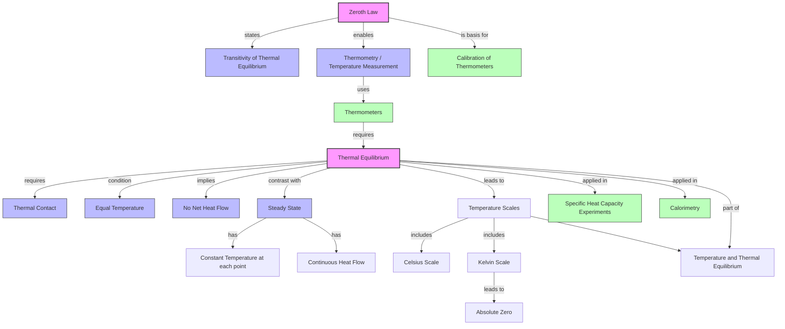

# Thermal Equilibrium and the Zeroth Law / 热平衡与热力学第零定律

---

# 1. Overview / 概述

**English:**
This sub-topic introduces the foundational concept of **thermal equilibrium** — the condition under which two or more objects in thermal contact reach the same temperature and no net heat transfer occurs. It also covers the **Zeroth Law of Thermodynamics**, which provides the logical basis for temperature measurement. Understanding these ideas is essential before studying [[Temperature Scales (Celsius, Kelvin)]] and [[Thermometers and Temperature Measurement]]. This sub-topic forms the conceptual bedrock of the entire [[Temperature and Thermal Equilibrium]] chapter and underpins later topics such as [[Thermal Expansion]] and [[Specific Heat Capacity and Latent Heat]].

**中文:**
本子知识点介绍**热平衡**的基础概念——当两个或多个物体在热接触中达到相同温度且没有净热量传递时的状态。同时涵盖**热力学第零定律**，该定律为温度测量提供了逻辑基础。理解这些概念是学习[[Temperature Scales (Celsius, Kelvin)]]和[[Thermometers and Temperature Measurement]]的前提。本子知识点构成了整个[[Temperature and Thermal Equilibrium]]章节的概念基石，并为后续的[[Thermal Expansion]]和[[Specific Heat Capacity and Latent Heat]]等主题奠定基础。

---

# 2. Syllabus Learning Objectives / 考纲学习目标

| CAIE 9702 (10.1) | Edexcel IAL (WPH11 U1: 5.1-5.4) |
|------------------|----------------------------------|
| (a) Define thermal equilibrium | 5.1 Understand the concept of thermal equilibrium |
| (b) State the Zeroth Law of Thermodynamics | 5.2 Understand the Zeroth Law of Thermodynamics |
| (c) Explain how the Zeroth Law enables temperature measurement | 5.3 Explain how the Zeroth Law allows temperature to be measured |
| (d) Distinguish between thermal equilibrium and steady state | 5.4 Understand that two bodies in thermal equilibrium are at the same temperature |
| (e) Apply the concept to simple experimental situations | — |

**Examiner Expectations / 考官期望:**
- **English:** You must be able to define thermal equilibrium precisely, state the Zeroth Law verbatim, and explain its role in thermometry. Be prepared to identify whether a system is in thermal equilibrium or steady state in exam scenarios.
- **中文:** 必须能够精确定义热平衡，准确陈述第零定律，并解释其在测温中的作用。准备好在考试场景中判断系统处于热平衡还是稳态。

---

# 3. Core Definitions / 核心定义

| Term (EN/CN) | Definition (EN) | Definition (CN) | Common Mistakes / 常见错误 |
|--------------|-----------------|-----------------|---------------------------|
| **Thermal Equilibrium** / 热平衡 | A state where two or more objects in thermal contact have the same temperature and there is no net transfer of thermal energy between them. | 两个或多个处于热接触中的物体具有相同温度，且它们之间没有净热能传递的状态。 | ❌ Confusing with "steady state" — steady state has constant temperature but may involve continuous energy flow (e.g., a heated rod). |
| **Zeroth Law of Thermodynamics** / 热力学第零定律 | If body A is in thermal equilibrium with body B, and body B is in thermal equilibrium with body C, then body A is also in thermal equilibrium with body C. | 如果物体A与物体B处于热平衡，物体B与物体C处于热平衡，则物体A也与物体C处于热平衡。 | ❌ Forgetting that this law is the *logical basis* for thermometers, not a statement about energy conservation. |
| **Thermal Contact** / 热接触 | A condition where thermal energy can be transferred between objects, typically through conduction, convection, or radiation. | 热能可以在物体之间传递的条件，通常通过传导、对流或辐射实现。 | ❌ Thinking thermal contact requires physical contact — radiation allows contact without touching. |
| **Temperature** / 温度 | A measure of the average kinetic energy of the particles in a substance; determines the direction of net thermal energy transfer. | 物质粒子平均动能的量度；决定净热能传递的方向。 | ❌ Confusing temperature with heat — temperature is *not* the total thermal energy. |
| **Steady State** / 稳态 | A condition where temperature remains constant over time, but there may be a continuous flow of thermal energy through the system. | 温度随时间保持恒定，但可能有连续热能流经系统的状态。 | ❌ Treating steady state as thermal equilibrium — in steady state, net energy flow can still occur. |

---

# 4. Key Concepts Explained / 关键概念详解

## 4.1 Thermal Equilibrium / 热平衡

### Explanation / 解释
**English:**
When two objects at different temperatures are placed in [[Thermal Contact]], thermal energy flows from the hotter object to the colder object. This flow continues until both objects reach the **same temperature**. At this point, **thermal equilibrium** is established — there is no net transfer of thermal energy between them. The objects are said to be in thermal equilibrium with each other.

Key points:
- Thermal equilibrium requires **equal temperature**.
- It does **not** require equal amounts of thermal energy (heat content).
- A single object can be in thermal equilibrium with itself if its temperature is uniform throughout.

**中文:**
当两个温度不同的物体处于[[Thermal Contact]]时，热能会从较热的物体流向较冷的物体。这种流动持续到两个物体达到**相同温度**。此时，**热平衡**建立——它们之间没有净热能传递。称这些物体彼此处于热平衡。

关键点：
- 热平衡要求**温度相等**。
- 并**不**要求热能（热量）相等。
- 单个物体如果温度均匀，也可以说自身处于热平衡。

### Physical Meaning / 物理意义
**English:**
Thermal equilibrium represents the **maximum entropy state** for the system — the condition where no further spontaneous change occurs. At the microscopic level, the average kinetic energy of particles in both objects becomes equal, meaning the rate of energy exchange between them is balanced in both directions.

**中文:**
热平衡代表系统的**最大熵状态**——不再发生自发变化的条件。在微观层面，两个物体中粒子的平均动能变得相等，意味着它们之间的能量交换速率在双向上是平衡的。

### Common Misconceptions / 常见误区
- ❌ **"Thermal equilibrium means no energy transfer at all"** — Energy transfer still occurs at the microscopic level, but the net transfer is zero.
- ❌ **"Equal temperature means equal heat content"** — A large object at 30°C contains more thermal energy than a small object at 30°C.
- ❌ **"Thermal equilibrium is instantaneous"** — It takes time; the rate depends on thermal conductivity and temperature difference.

### Exam Tips / 考试提示
- **English:** When asked to "explain thermal equilibrium," always mention: (1) thermal contact, (2) equal temperature, (3) no net heat transfer.
- **中文:** 当被要求"解释热平衡"时，务必提到：(1) 热接触，(2) 温度相等，(3) 无净热量传递。

> 📷 **IMAGE PROMPT — DIAGRAM-01: Two Objects Reaching Thermal Equilibrium**
> A clear diagram showing two metal blocks at different initial temperatures (e.g., 80°C and 20°C) placed in contact. Arrows indicate thermal energy flow from hot to cold. A third panel shows both at 50°C with no arrows, labeled "Thermal Equilibrium." Include a thermometer reading for each stage.

---

## 4.2 The Zeroth Law of Thermodynamics / 热力学第零定律

### Explanation / 解释
**English:**
The **Zeroth Law of Thermodynamics** states:

> *If body A is in thermal equilibrium with body B, and body B is in thermal equilibrium with body C, then body A is also in thermal equilibrium with body C.*

This seemingly simple statement is **fundamental to thermometry** (temperature measurement). It allows us to use a **thermometer** (body B) to measure the temperature of an object (body A) by bringing them into thermal contact. Once the thermometer reaches thermal equilibrium with the object, we know the thermometer's reading equals the object's temperature. The thermometer can be calibrated against a standard (body C).

**Why is it called the "Zeroth" Law?** Historically, the First, Second, and Third Laws of Thermodynamics were formulated first. Scientists later realized this law was more fundamental — it should logically come *before* the First Law — so it was named the "Zeroth Law."

**中文:**
**热力学第零定律**指出：

> *如果物体A与物体B处于热平衡，物体B与物体C处于热平衡，则物体A也与物体C处于热平衡。*

这个看似简单的陈述是**测温学**（温度测量）的基础。它允许我们使用**温度计**（物体B）通过热接触来测量物体（物体A）的温度。一旦温度计与物体达到热平衡，我们就知道温度计的读数等于物体的温度。温度计可以对照标准（物体C）进行校准。

**为什么叫"第零"定律？** 历史上，热力学第一、第二和第三定律先被提出。科学家后来意识到这个定律更为基础——它在逻辑上应该*先于*第一定律——因此被命名为"第零定律"。

### Physical Meaning / 物理意义
**English:**
The Zeroth Law establishes **temperature as a measurable, transitive property**. Without it, we could not reliably use a single thermometer to measure the temperature of different objects and compare them. It ensures that temperature is a **well-defined physical quantity** that is consistent across different systems.

**中文:**
第零定律确立了**温度作为可测量的、可传递的属性**。没有它，我们就无法可靠地使用单一温度计测量不同物体的温度并进行比较。它确保温度是一个**定义明确的物理量**，在不同系统之间保持一致。

### Common Misconceptions / 常见误区
- ❌ **"The Zeroth Law is obvious and trivial"** — It may seem obvious, but it is a necessary logical foundation for all temperature measurement.
- ❌ **"The Zeroth Law is about energy conservation"** — That is the First Law. The Zeroth Law is about thermal equilibrium transitivity.
- ❌ **"The Zeroth Law only applies to solids"** — It applies to all states of matter.

### Exam Tips / 考试提示
- **English:** You may be asked to "state the Zeroth Law" — learn it word-for-word. You may also be asked to "explain how the Zeroth Law enables temperature measurement" — mention the thermometer as body B.
- **中文:** 可能会被要求"陈述第零定律"——逐字记住。也可能被要求"解释第零定律如何使温度测量成为可能"——提到温度计作为物体B。

---

## 4.3 Thermal Equilibrium vs. Steady State / 热平衡 vs. 稳态

### Explanation / 解释
**English:**
These two concepts are often confused. The key difference:

| Aspect | Thermal Equilibrium | Steady State |
|--------|-------------------|--------------|
| Temperature | Uniform throughout | Constant at each point, but may vary spatially |
| Net energy flow | Zero | Non-zero (continuous flow through system) |
| Example | Cup of coffee cooling to room temperature | A metal rod with one end heated, the other cooled — after some time, temperatures at each point become constant, but heat flows continuously |

**Exam relevance:** You may be shown a diagram of a system and asked whether it is in thermal equilibrium or steady state.

**中文:**
这两个概念经常被混淆。关键区别：

| 方面 | 热平衡 | 稳态 |
|------|--------|------|
| 温度 | 整体均匀 | 每一点恒定，但可能空间变化 |
| 净能量流 | 零 | 非零（连续流经系统） |
| 示例 | 咖啡冷却到室温 | 一端加热、另一端冷却的金属棒——一段时间后，每一点温度恒定，但热量持续流动 |

**考试相关性：** 可能会展示一个系统图，要求判断是热平衡还是稳态。

### Common Misconceptions / 常见误区
- ❌ **"Steady state IS thermal equilibrium"** — No! Steady state has constant temperatures but continuous energy flow; thermal equilibrium has no net energy flow.
- ❌ **"Thermal equilibrium requires no temperature change"** — Correct, but steady state also has no temperature change at each point — the difference is the presence or absence of net energy flow.

### Exam Tips / 考试提示
- **English:** If a question says "the temperature remains constant," check whether there is a continuous heat source/sink. If yes → steady state. If no → thermal equilibrium.
- **中文:** 如果题目说"温度保持恒定"，检查是否有持续的热源/冷源。有 → 稳态。没有 → 热平衡。

> 📷 **IMAGE PROMPT — DIAGRAM-02: Thermal Equilibrium vs. Steady State**
> Side-by-side comparison. Left: Two blocks in contact, both at 25°C, labeled "Thermal Equilibrium — No net heat flow." Right: A metal rod with a flame at left end (100°C) and ice at right end (0°C), with temperature gradient shown (100°C → 0°C), labeled "Steady State — Continuous heat flow." Include temperature profiles below each diagram.

---

# 5. Essential Equations / 核心公式

This sub-topic is primarily **conceptual** — there are no complex equations. However, the following relationship is useful:

$$ Q = mc\Delta T $$

| Symbol (符号) | Meaning (EN) | Meaning (CN) | Unit (单位) |
|--------------|-------------|-------------|------------|
| $Q$ | Thermal energy transferred | 传递的热能 | J (joules) |
| $m$ | Mass of substance | 物质的质量 | kg |
| $c$ | Specific heat capacity | 比热容 | J kg⁻¹ K⁻¹ |
| $\Delta T$ | Change in temperature | 温度变化 | K or °C |

**Derivation / 推导:** This equation is derived from the definition of specific heat capacity. It is used in thermal equilibrium problems where two objects exchange energy until they reach the same temperature.

**Conditions / 适用条件:**
- **English:** Assumes no phase change occurs; assumes no heat loss to surroundings (ideal case).
- **中文:** 假设没有相变发生；假设没有热量散失到周围环境（理想情况）。

**Limitations / 局限性:**
- **English:** Does not account for latent heat during phase changes; assumes constant specific heat capacity over the temperature range.
- **中文:** 不考虑相变过程中的潜热；假设比热容在温度范围内恒定。

> 📷 **IMAGE PROMPT — DIAGRAM-03: Thermal Equilibrium Calculation Setup**
> A diagram showing a hot metal block (mass m₁, initial temperature T₁) placed on a cold metal block (mass m₂, initial temperature T₂). Arrows show heat flow from hot to cold. Final equilibrium temperature T_f labeled. Equation Q₁ = Q₂ shown.

---

# 6. Graphs and Relationships / 图表与关系

## 6.1 Temperature vs. Time for Two Objects in Thermal Contact / 热接触中两个物体的温度-时间图

### Axes / 坐标轴
- **X-axis:** Time / 时间 (s)
- **Y-axis:** Temperature / 温度 (°C or K)

### Shape / 形状
**English:**
Two curves: one decreasing (hot object cooling), one increasing (cold object warming). Both curves asymptotically approach the same final equilibrium temperature. The curves are **exponential** in shape — the rate of temperature change decreases as the temperature difference decreases.

**中文:**
两条曲线：一条下降（热物体冷却），一条上升（冷物体升温）。两条曲线渐近地趋近于相同的最终平衡温度。曲线呈**指数**形状——温度变化率随着温差减小而减小。

### Gradient Meaning / 斜率含义
**English:**
The gradient at any point represents the **rate of temperature change** (dT/dt). A steeper gradient means faster temperature change. The gradient decreases over time as equilibrium is approached.

**中文:**
任意点的斜率代表**温度变化率** (dT/dt)。斜率越陡，温度变化越快。随着接近平衡，斜率减小。

### Area Meaning / 面积含义
**English:**
The area under the curve has no direct physical meaning in this context. However, the area between the two curves (the temperature difference) decreases to zero.

**中文:**
曲线下的面积在此上下文中没有直接的物理意义。然而，两条曲线之间的面积（温差）减小到零。

### Exam Interpretation / 考试解读
- **English:** You may be asked to read the equilibrium temperature from the graph (where the two curves meet). You may also be asked to explain why the curves flatten out.
- **中文:** 可能会被要求从图中读取平衡温度（两条曲线交汇处）。也可能被要求解释曲线为何变平。

> 📷 **IMAGE PROMPT — GRAPH-01: Temperature vs. Time for Thermal Equilibrium**
> A graph with two curves. One starts at 80°C and decreases exponentially to 50°C. The other starts at 20°C and increases exponentially to 50°C. Both curves meet at t = 300 s. Label "Equilibrium Temperature = 50°C." Axes labeled "Temperature / °C" and "Time / s."

---

# 7. Required Diagrams / 必备图表

## 7.1 The Zeroth Law Illustrated / 第零定律示意图

### Description / 描述
**English:**
A three-panel diagram showing bodies A, B, and C. Panel 1: A in thermal equilibrium with B (same temperature). Panel 2: B in thermal equilibrium with C (same temperature). Panel 3: Conclusion — A is in thermal equilibrium with C (same temperature). This illustrates the transitivity of thermal equilibrium.

**中文:**
一个三格图，显示物体A、B和C。格1：A与B处于热平衡（相同温度）。格2：B与C处于热平衡（相同温度）。格3：结论——A与C处于热平衡（相同温度）。这说明了热平衡的可传递性。

### Image Prompt / 图片生成提示
> 📷 **IMAGE PROMPT — DIAGRAM-04: Zeroth Law of Thermodynamics**
> Three panels arranged horizontally. Panel 1: Two blocks labeled "A" and "B" touching, both showing thermometer reading 30°C. Arrow between them says "Thermal Equilibrium." Panel 2: Blocks "B" and "C" touching, both showing 30°C. Panel 3: Blocks "A" and "C" shown separated but both at 30°C, with text "Therefore A and C are also in thermal equilibrium." Clean, educational style with pastel colors.

### Labels Required / 需要标注
- **English:** Body A, Body B, Body C; Thermometer readings (same temperature); "Thermal Equilibrium" arrows.
- **中文:** 物体A、物体B、物体C；温度计读数（相同温度）；"热平衡"箭头。

### Exam Importance / 考试重要性
- **English:** High — this diagram is frequently used to explain the logical basis of thermometry.
- **中文:** 高——此图常用于解释测温学的逻辑基础。

---

## 7.2 Thermometer in Thermal Equilibrium with a Substance / 温度计与物质处于热平衡

### Description / 描述
**English:**
A diagram showing a liquid-in-glass thermometer inserted into a beaker of water. The thermometer and water are in thermal contact. After sufficient time, they reach thermal equilibrium — the thermometer reading equals the water temperature. This demonstrates the practical application of the Zeroth Law.

**中文:**
一个图示，显示液体玻璃温度计插入装有水的烧杯中。温度计和水处于热接触。经过足够时间后，它们达到热平衡——温度计读数等于水的温度。这展示了第零定律的实际应用。

### Image Prompt / 图片生成提示
> 📷 **IMAGE PROMPT — DIAGRAM-05: Thermometer in Thermal Equilibrium**
> A beaker of water with a liquid-in-glass thermometer immersed. Arrows labeled "Thermal Contact" between thermometer bulb and water. Thermometer shows 25°C. Text: "After sufficient time, thermometer and water reach thermal equilibrium — same temperature." Include a magnified view of the thermometer bulb showing liquid expansion.

### Labels Required / 需要标注
- **English:** Thermometer, Water, Thermal Contact, Thermal Equilibrium (same temperature).
- **中文:** 温度计、水、热接触、热平衡（相同温度）。

### Exam Importance / 考试重要性
- **English:** High — this is the standard example used to explain how thermometers work.
- **中文:** 高——这是解释温度计工作原理的标准示例。

---

# 8. Worked Examples / 典型例题

## Example 1: Identifying Thermal Equilibrium / 识别热平衡

### Question / 题目
**English:**
A student places a hot metal block at 80°C and a cold metal block at 20°C in thermal contact. After 10 minutes, both blocks are at 45°C. State whether the blocks are in thermal equilibrium. Explain your answer.

**中文:**
一名学生将一个80°C的热金属块和一个20°C的冷金属块放在热接触中。10分钟后，两个金属块都处于45°C。判断这两个金属块是否处于热平衡。解释你的答案。

### Solution / 解答
**Step 1:** Recall the definition of thermal equilibrium — two objects in thermal contact have the same temperature and no net heat transfer.

**Step 2:** Check the temperatures. Both blocks are at 45°C → same temperature.

**Step 3:** Check for net heat transfer. Since temperatures are equal, there is no net heat transfer between them.

**Step 4:** Conclusion — Yes, the blocks are in thermal equilibrium.

**中文：**
**步骤1：** 回顾热平衡的定义——处于热接触的两个物体具有相同温度且无净热量传递。

**步骤2：** 检查温度。两个金属块都是45°C → 温度相同。

**步骤3：** 检查净热量传递。由于温度相等，它们之间没有净热量传递。

**步骤4：** 结论——是的，金属块处于热平衡。

### Final Answer / 最终答案
**Answer:** Yes, the blocks are in thermal equilibrium because they have the same temperature (45°C) and there is no net transfer of thermal energy between them. | **答案：** 是的，金属块处于热平衡，因为它们具有相同温度（45°C）且它们之间没有净热能传递。

### Quick Tip / 提示
- **English:** Always check TWO conditions: (1) same temperature, (2) no net heat transfer. If only one is stated, your answer is incomplete.
- **中文：** 始终检查两个条件：(1) 相同温度，(2) 无净热量传递。如果只提到一个，答案不完整。

---

## Example 2: Applying the Zeroth Law / 应用第零定律

### Question / 题目
**English:**
A thermometer is placed in a beaker of hot water. After a few minutes, the thermometer reading becomes constant at 65°C. Explain, with reference to the Zeroth Law of Thermodynamics, why the thermometer reading is equal to the temperature of the water.

**中文:**
将温度计放入一杯热水中。几分钟后，温度计读数稳定在65°C。参考热力学第零定律，解释为什么温度计读数等于水的温度。

### Solution / 解答
**Step 1:** State the Zeroth Law — If body A (thermometer) is in thermal equilibrium with body B (water), and body B is in thermal equilibrium with body C (another object), then A and C are also in thermal equilibrium.

**Step 2:** Apply to this situation — The thermometer (A) is placed in thermal contact with the water (B). After sufficient time, they reach thermal equilibrium — they have the same temperature.

**Step 3:** Conclusion — Since the thermometer and water are in thermal equilibrium, their temperatures are equal. Therefore, the thermometer reading (65°C) equals the water temperature.

**中文：**
**步骤1：** 陈述第零定律——如果物体A（温度计）与物体B（水）处于热平衡，物体B与物体C（另一物体）处于热平衡，则A与C也处于热平衡。

**步骤2：** 应用于此情况——温度计（A）与水（B）处于热接触。经过足够时间，它们达到热平衡——它们具有相同温度。

**步骤3：** 结论——由于温度计和水处于热平衡，它们的温度相等。因此，温度计读数（65°C）等于水的温度。

### Final Answer / 最终答案
**Answer:** The thermometer and water reach thermal equilibrium, so they have the same temperature. The Zeroth Law ensures that the thermometer reading reliably indicates the water's temperature. | **答案：** 温度计和水达到热平衡，因此它们具有相同温度。第零定律确保温度计读数可靠地指示水的温度。

### Quick Tip / 提示
- **English:** Always mention "thermal equilibrium" and "same temperature" in your answer. The Zeroth Law is the *reason* thermometers work.
- **中文：** 在答案中务必提到"热平衡"和"相同温度"。第零定律是温度计*能够工作*的原因。

---

# 9. Past Paper Question Types / 历年真题题型

| Question Type / 题型 | Frequency / 频率 | Difficulty / 难度 | Past Paper References / 真题索引 |
|----------------------|------------------|------------------|-------------------------------|
| Define thermal equilibrium | High | Easy | 📝 *待填入* |
| State the Zeroth Law | High | Easy | 📝 *待填入* |
| Explain how Zeroth Law enables thermometry | Medium | Medium | 📝 *待填入* |
| Distinguish thermal equilibrium vs. steady state | Medium | Medium | 📝 *待填入* |
| Interpret temperature-time graph for thermal equilibrium | Low | Medium | 📝 *待填入* |
| Simple calculation using Q = mcΔT (thermal equilibrium) | Medium | Medium | 📝 *待填入* |

**Common Command Words / 常见指令词:**
- **English:** Define, State, Explain, Distinguish, Describe, Apply
- **中文：** 定义、陈述、解释、区分、描述、应用

---

# 10. Practical Skills Connections / 实验技能链接

**English:**
This sub-topic connects to practical work in several ways:

1. **Temperature measurement:** Using thermometers to measure temperature of substances — requires waiting for thermal equilibrium between thermometer and substance.
2. **Calibration:** Calibrating a thermometer against fixed points (ice point, steam point) relies on the Zeroth Law — the thermometer must reach thermal equilibrium with the calibration standard.
3. **Specific heat capacity experiments:** When a hot object is placed in a calorimeter, you must wait for thermal equilibrium before recording the final temperature.
4. **Uncertainties:** The time required to reach thermal equilibrium introduces uncertainty — students must estimate whether equilibrium has been reached.

**Key practical skills:**
- Reading a thermometer correctly (avoiding parallax error)
- Ensuring good thermal contact between thermometer and substance
- Waiting sufficient time for equilibrium
- Stirring to ensure uniform temperature

**中文:**
本子知识点通过多种方式与实验工作联系：

1. **温度测量：** 使用温度计测量物质温度——需要等待温度计与物质达到热平衡。
2. **校准：** 对照固定点（冰点、蒸汽点）校准温度计依赖于第零定律——温度计必须与校准标准达到热平衡。
3. **比热容实验：** 当热物体放入量热器时，必须等待热平衡后再记录最终温度。
4. **不确定度：** 达到热平衡所需的时间引入不确定度——学生必须估计是否已达到平衡。

**关键实验技能：**
- 正确读取温度计（避免视差误差）
- 确保温度计与物质之间的良好热接触
- 等待足够时间以达到平衡
- 搅拌以确保温度均匀

---

# 11. Concept Map / 概念图谱

---

# 12. Quick Revision Sheet / 速查表

| Category / 类别 | Key Points / 要点 |
|----------------|------------------|
| **Definition / 定义** | **Thermal Equilibrium:** Two objects in thermal contact have the same temperature → no net heat transfer. / **热平衡：** 处于热接触的两个物体具有相同温度 → 无净热量传递。 |
| **Key Law / 核心定律** | **Zeroth Law:** If A = B and B = C in thermal equilibrium, then A = C. Basis for thermometry. / **第零定律：** 如果A与B、B与C处于热平衡，则A与C也处于热平衡。测温学的基础。 |
| **Key Distinction / 关键区分** | **Thermal Equilibrium:** No net energy flow, uniform temperature. **Steady State:** Constant temperature at each point, but continuous energy flow. / **热平衡：** 无净能量流，温度均匀。**稳态：** 每点温度恒定，但有持续能量流。 |
| **Key Formula / 核心公式** | $$Q = mc\Delta T$$ — Used for thermal equilibrium calculations (energy gained = energy lost). / 用于热平衡计算（获得能量 = 失去能量）。 |
| **Key Graph / 核心图表** | Temperature vs. Time: Two curves (hot cooling, cold warming) meeting at equilibrium temperature. / 温度-时间图：两条曲线（热物体冷却、冷物体升温）在平衡温度处交汇。 |
| **Exam Tip 1 / 考试提示1** | Always state TWO conditions for thermal equilibrium: (1) same temperature, (2) no net heat transfer. / 始终陈述热平衡的两个条件：(1) 相同温度，(2) 无净热量传递。 |
| **Exam Tip 2 / 考试提示2** | When explaining the Zeroth Law, mention the thermometer as "body B" that compares "body A" (object) and "body C" (calibration standard). / 解释第零定律时，提到温度计作为"物体B"，比较"物体A"（待测物）和"物体C"（校准标准）。 |
| **Common Mistake / 常见错误** | ❌ Confusing thermal equilibrium with steady state. / ❌ 混淆热平衡与稳态。 |
| **Practical Link / 实验联系** | Always wait for thermal equilibrium before reading a thermometer. Stir liquids for uniform temperature. / 读取温度计前始终等待热平衡。搅拌液体以确保温度均匀。 |

---

> 📋 **CIE Only:** CAIE 9702 specifically requires understanding of the distinction between thermal equilibrium and steady state (objective 10.1(d)). This is less emphasized in Edexcel.
>
> 📋 **Edexcel Only:** Edexcel IAL WPH11 U1 5.1-5.4 focuses more on the practical application of the Zeroth Law to thermometry. Be prepared for questions linking to [[Thermometers and Temperature Measurement]].

---

*This leaf node is part of the [[Temperature and Thermal Equilibrium]] chapter. Next: [[Temperature Scales (Celsius, Kelvin)]] → [[Thermometers and Temperature Measurement]] → [[Absolute Zero and the Kelvin Scale]].*