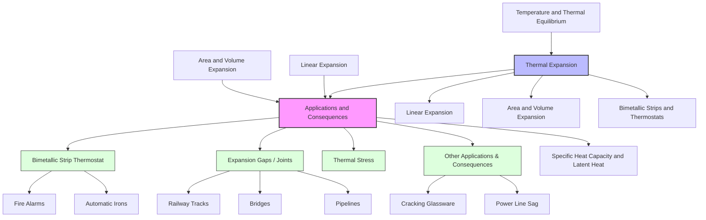

---
# Applications and Consequences of Thermal Expansion / 热膨胀的应用与后果

---

# 1. Overview / 概述

**English:**
This sub-topic explores the practical implications of thermal expansion — both its beneficial applications and its potentially destructive consequences. While [[Linear Expansion]] and [[Area and Volume Expansion]] describe the *physics* of how materials expand, this leaf node focuses on *engineering and everyday outcomes*. You will learn how thermal expansion is harnessed in devices like thermostats and railway expansion gaps, and why it must be carefully managed in bridges, pipelines, and precision instruments. Understanding these applications and consequences is essential for linking theoretical physics to real-world engineering, and is a common source of exam questions on safety, design, and material selection.

**中文:**
本子知识点探讨热膨胀的实际影响——既有其有益的应用，也有其潜在的破坏性后果。虽然[[线性膨胀]]和[[面积与体积膨胀]]描述了材料如何膨胀的*物理原理*，但本叶节点侧重于*工程和日常结果*。你将学习热膨胀如何被利用在恒温器和铁路伸缩缝等设备中，以及为什么必须在桥梁、管道和精密仪器中谨慎管理它。理解这些应用和后果对于将理论物理与真实工程联系起来至关重要，也是考试中关于安全、设计和材料选择的常见问题来源。

---

# 2. Syllabus Learning Objectives / 考纲学习目标

| CAIE 9702 (10.2 a-d) | Edexcel IAL (WPH11 U1: 5.5-5.7) |
|-----------|-------------|
| Describe some practical applications and consequences of thermal expansion. | Explain examples of the practical application and consequences of thermal expansion. |
| Explain how bimetallic strips are used in thermostats. | Describe the operation of a bimetallic strip thermostat. |
| Explain why expansion gaps are needed in structures. | Explain why expansion joints are necessary in bridges and railway lines. |
| Describe how thermal expansion can cause problems (e.g., in pipelines, glassware). | Discuss the problems caused by thermal expansion in engineering contexts. |

**Examiner Expectations / 考官期望:**
- **English:** You must be able to describe *specific real-world examples* (e.g., railway tracks, bridges, thermostats, pipelines). For each example, explain *why* expansion occurs, *what* is done to manage it, and *what* happens if it is not managed. Be prepared to draw and label a simple bimetallic strip thermostat circuit.
- **中文:** 你必须能够描述*具体的真实世界例子*（例如，铁路轨道、桥梁、恒温器、管道）。对于每个例子，解释*为什么*会发生膨胀，*采取什么措施*来管理它，以及*如果不管理会发生什么*。准备好绘制并标注一个简单的双金属片恒温器电路。

---

# 3. Core Definitions / 核心定义

| Term (EN/CN) | Definition (EN) | Definition (CN) | Common Mistakes / 常见错误 |
|--------------|-----------------|-----------------|---------------------------|
| **Bimetallic Strip** / 双金属片 | A strip made of two different metals bonded together. When heated, the metals expand by different amounts, causing the strip to bend. | 由两种不同金属粘合而成的条带。加热时，金属膨胀量不同，导致条带弯曲。 | Confusing which metal is on the *outside* of the curve. The metal with the *larger* expansion coefficient is on the *outside* of the bend. |
| **Expansion Gap / Joint** / 伸缩缝/接头 | A deliberate gap left in a structure (e.g., a bridge, railway line) to allow materials to expand and contract without causing damage. | 在结构（如桥梁、铁路线）中故意留下的缝隙，允许材料膨胀和收缩而不会造成损坏。 | Thinking the gap is for *cooling* only; it is for *both* expansion and contraction. |
| **Thermostat** / 恒温器 | A device that automatically regulates temperature by switching a heating or cooling system on or off. | 通过开关加热或冷却系统来自动调节温度的装置。 | Forgetting that a bimetallic strip thermostat uses *electrical contacts* that open or close. |
| **Thermal Stress** / 热应力 | The internal force per unit area that develops in a material when it is prevented from expanding or contracting freely due to a temperature change. | 当材料因温度变化而无法自由膨胀或收缩时，在其内部产生的单位面积上的力。 | Confusing stress with strain. Stress is the *force*; strain is the *deformation*. |
| **Coefficient of Linear Expansion ($\alpha$)** / 线膨胀系数 | The fractional change in length per degree Celsius change in temperature. | 每摄氏度温度变化引起的长度相对变化量。 | Using the wrong coefficient for area or volume problems. |

---

# 4. Key Concepts Explained / 关键概念详解

## 4.1 Bimetallic Strip Thermostat / 双金属片恒温器

### Explanation / 解释
**English:** A [[Bimetallic Strips and Thermostats|bimetallic strip]] consists of two different metals (e.g., brass and invar) bonded together. Brass has a high coefficient of linear expansion ($\alpha$), while invar has a very low $\alpha$. When heated, the brass expands more than the invar, causing the strip to bend with the brass on the *outside* of the curve. When cooled, it bends in the opposite direction. In a simple thermostat, this bending motion is used to make or break an electrical contact, switching a heater or cooler on or off.

**中文:** [[双金属片与恒温器|双金属片]]由两种不同的金属（例如黄铜和因瓦合金）粘合而成。黄铜的线膨胀系数 ($\alpha$) 高，而因瓦合金的 $\alpha$ 非常低。加热时，黄铜比因瓦合金膨胀得更多，导致条带弯曲，黄铜位于曲线的*外侧*。冷却时，它会向相反方向弯曲。在简单的恒温器中，这种弯曲运动用于接通或断开电触点，从而开关加热器或冷却器。

### Physical Meaning / 物理意义
**English:** The bimetallic strip converts a temperature change into a mechanical displacement. The greater the difference in $\alpha$ between the two metals, the more sensitive the strip is to temperature changes.

**中文:** 双金属片将温度变化转化为机械位移。两种金属的 $\alpha$ 差异越大，条带对温度变化越敏感。

### Common Misconceptions / 常见误区
- **English:** Students often think the strip bends because the metals *expand at different rates*, but they forget that the metal with the *larger* $\alpha$ is on the *outside* of the bend. If the strip is heated, the brass (larger $\alpha$) is on the outside.
- **中文:** 学生常认为条带弯曲是因为金属*膨胀速率不同*，但忘记了具有*较大* $\alpha$ 的金属位于弯曲的*外侧*。如果加热条带，黄铜（较大 $\alpha$）在外侧。

### Exam Tips / 考试提示
- **English:** Draw a clear diagram of a bimetallic strip thermostat circuit. Label the metals (e.g., brass and invar), the electrical contacts, and the direction of bending when heated/cooled. Explain that the strip *bends to break the circuit* when the temperature is too high, turning off the heater.
- **中文:** 画一个清晰的双金属片恒温器电路图。标注金属（例如黄铜和因瓦合金）、电触点以及加热/冷却时的弯曲方向。解释当温度过高时，条带*弯曲以断开电路*，关闭加热器。

> 📷 **IMAGE PROMPT — BMT-01: Bimetallic Strip Thermostat Diagram**
> A simple line diagram of a bimetallic strip thermostat. The strip is made of two metals: brass (top, labeled) and invar (bottom, labeled). The strip is connected to a pivot at one end. The free end has an electrical contact that touches a fixed contact. The circuit includes a battery and a heater. Arrows show the direction of bending when heated (downwards, breaking the contact) and when cooled (upwards, making the contact). Clean, educational style.

## 4.2 Expansion Gaps in Structures / 结构中的伸缩缝

### Explanation / 解释
**English:** Materials expand when heated. In large structures like bridges, railway lines, and pipelines, this expansion can cause enormous forces ([[Thermal Stress|thermal stress]]) if the material is constrained. To prevent buckling, cracking, or failure, engineers leave deliberate gaps called expansion joints. For example, railway tracks have small gaps between sections; bridges have interlocking teeth (finger joints) or roller supports. Pipelines often have U-shaped loops (expansion loops) that can flex.

**中文:** 材料受热时会膨胀。在桥梁、铁路线和管道等大型结构中，如果材料受到约束，这种膨胀会产生巨大的力（[[热应力]]）。为了防止弯曲、开裂或失效，工程师会留下称为伸缩缝的故意间隙。例如，铁路轨道各段之间有小缝隙；桥梁有互锁的齿（指形接头）或滚轴支座。管道通常有可以弯曲的U形环（膨胀环）。

### Physical Meaning / 物理意义
**English:** The gap must be large enough to accommodate the maximum expected expansion, which depends on the material's $\alpha$, the length of the section, and the maximum temperature change ($\Delta T$). The formula $\Delta L = \alpha L_0 \Delta T$ is used to calculate the required gap size.

**中文:** 缝隙必须足够大，以容纳预期的最大膨胀量，这取决于材料的 $\alpha$、段的长度以及最大温度变化 ($\Delta T$)。公式 $\Delta L = \alpha L_0 \Delta T$ 用于计算所需的缝隙尺寸。

### Common Misconceptions / 常见误区
- **English:** Students think expansion gaps are only for *hot* weather. They are also needed for *cold* weather to allow contraction without causing tension fractures.
- **中文:** 学生认为伸缩缝只用于*炎热*天气。在*寒冷*天气也需要它们，以允许收缩而不会引起拉伸断裂。

### Exam Tips / 考试提示
- **English:** Be able to calculate the required gap size using $\Delta L = \alpha L_0 \Delta T$. Explain that if the gap is too small, the structure will buckle; if too large, it may cause vibration or noise.
- **中文:** 能够使用 $\Delta L = \alpha L_0 \Delta T$ 计算所需的缝隙尺寸。解释如果缝隙太小，结构会弯曲；如果太大，可能会引起振动或噪音。

> 📷 **IMAGE PROMPT — EXP-01: Expansion Gap in Railway Tracks**
> A close-up photograph-style illustration of a railway track showing a small gap between two rail sections. The gap is clearly visible. The rails are on wooden sleepers. The image should show the gap is deliberate and not a defect. Include a label pointing to the gap: "Expansion Gap". The background shows a sunny day to imply thermal expansion.

## 4.3 Other Consequences and Applications / 其他后果与应用

### Explanation / 解释
**English:**
- **Consequences:** Glassware can crack if heated unevenly (e.g., a thick glass beaker on a hot Bunsen burner). Overhead power lines sag more in summer (expansion) and can snap in winter (contraction). Concrete roads can crack without expansion joints.
- **Applications:** Bimetallic thermometers, fire alarms (bimetallic strip bends to complete a circuit), automatic iron switches, and loose-fitting metal lids (heating the lid expands it, making it easier to open).

**中文:**
- **后果:** 玻璃器皿如果受热不均可能会破裂（例如，厚玻璃烧杯放在热的本生灯上）。架空电力线在夏天下垂更多（膨胀），在冬天可能断裂（收缩）。没有伸缩缝的混凝土道路可能会开裂。
- **应用:** 双金属温度计、火灾报警器（双金属片弯曲以接通电路）、自动熨斗开关以及松动的金属盖（加热盖子使其膨胀，更容易打开）。

### Exam Tips / 考试提示
- **English:** For each example, state *what expands*, *why it is a problem or useful*, and *how it is managed*.
- **中文:** 对于每个例子，说明*什么膨胀了*，*为什么是问题或有用*，以及*如何管理*。

---

# 5. Essential Equations / 核心公式

The key equation for calculating expansion is from [[Linear Expansion]]:

$$ \Delta L = \alpha L_0 \Delta T $$

| Symbol (符号) | Meaning (EN) | Meaning (CN) | Unit (单位) |
|--------------|-------------|-------------|------------|
| $\Delta L$ | Change in length | 长度变化量 | m |
| $\alpha$ | Coefficient of linear expansion | 线膨胀系数 | $^\circ C^{-1}$ or $K^{-1}$ |
| $L_0$ | Original length | 原始长度 | m |
| $\Delta T$ | Change in temperature | 温度变化量 | $^\circ C$ or K |

**Derivation / 推导:** Not required at AS level. It is an empirical relationship.

**Conditions / 适用条件:**
- **English:** The material must be homogeneous and isotropic. $\alpha$ is assumed constant over the temperature range. The equation applies to small temperature changes.
- **中文:** 材料必须是均匀且各向同性的。假设 $\alpha$ 在温度范围内是常数。该方程适用于小的温度变化。

**Limitations / 局限性:**
- **English:** For very large $\Delta T$, $\alpha$ may not be constant. The equation does not account for phase changes.
- **中文:** 对于非常大的 $\Delta T$，$\alpha$ 可能不是常数。该方程不考虑相变。

---

# 6. Graphs and Relationships / 图表与关系

## 6.1 Length vs. Temperature for a Solid / 固体长度与温度的关系

### Axes / 坐标轴
- **X-axis:** Temperature ($T$) / 温度 ($T$)
- **Y-axis:** Length ($L$) / 长度 ($L$)

### Shape / 形状
**English:** A straight line with a positive gradient. The gradient is $\alpha L_0$.
**中文:** 一条具有正斜率的直线。斜率为 $\alpha L_0$。

### Gradient Meaning / 斜率含义
**English:** The gradient represents the rate of change of length with temperature, which is $\alpha L_0$. A steeper gradient means a larger $\alpha$ or a longer original length.
**中文:** 斜率表示长度随温度的变化率，即 $\alpha L_0$。斜率越陡，意味着 $\alpha$ 越大或原始长度越长。

### Area Meaning / 面积含义
**English:** Not applicable for this graph.
**中文:** 不适用于此图。

### Exam Interpretation / 考试解读
**English:** You may be asked to determine $\alpha$ from the gradient of a length-temperature graph. Remember that the gradient = $\alpha L_0$, so $\alpha = \text{gradient} / L_0$.
**中文:** 你可能会被要求从长度-温度图的斜率确定 $\alpha$。记住斜率 = $\alpha L_0$，所以 $\alpha = \text{斜率} / L_0$。

---

# 7. Required Diagrams / 必备图表

## 7.1 Bimetallic Strip Thermostat Circuit / 双金属片恒温器电路

### Description / 描述
**English:** A diagram showing a bimetallic strip connected to an electrical circuit. The strip is made of two metals (e.g., brass and invar). One end is fixed; the other end has a contact that touches a fixed contact. The circuit includes a power source and a heater. Arrows indicate the direction of bending when heated and cooled.

**中文:** 显示连接到电路的双金属片的图。条带由两种金属（例如黄铜和因瓦合金）制成。一端固定；另一端有一个接触点，与一个固定触点接触。电路包括电源和加热器。箭头指示加热和冷却时的弯曲方向。

### Image Prompt / 图片生成提示
> 📷 **IMAGE PROMPT — BMT-02: Bimetallic Strip Thermostat Circuit**
> A clean, educational line diagram of a bimetallic strip thermostat. The strip is horizontal, made of brass (top, light yellow) and invar (bottom, grey). The left end is fixed to a pivot. The right end has a metal contact. Above it is a fixed contact. Wires connect the contacts to a battery and a heater (represented by a resistor symbol). Two curved arrows: one pointing downwards (labeled "Heated: bends down, circuit breaks") and one pointing upwards (labeled "Cooled: bends up, circuit makes"). Minimalist, textbook style.

### Labels Required / 需要标注
- **English:** Brass, Invar, Fixed Contact, Moving Contact, Battery, Heater, Pivot, Direction of bending (heated), Direction of bending (cooled).
- **中文:** 黄铜，因瓦合金，固定触点，活动触点，电池，加热器，枢轴，加热弯曲方向，冷却弯曲方向。

### Exam Importance / 考试重要性
**English:** Very high. This is a classic exam question. You must be able to draw and explain this diagram.
**中文:** 非常高。这是一个经典的考试题目。你必须能够绘制并解释此图。

## 7.2 Expansion Joint in a Bridge / 桥梁伸缩缝

### Description / 描述
**English:** A diagram showing a bridge deck with an expansion joint. The joint is often a set of interlocking metal teeth (finger joint) that allow the deck to expand and contract. Roller supports at the ends of the bridge allow horizontal movement.

**中文:** 显示带有伸缩缝的桥面的图。伸缩缝通常是一组互锁的金属齿（指形接头），允许桥面膨胀和收缩。桥端的滚轴支座允许水平移动。

### Image Prompt / 图片生成提示
> 📷 **IMAGE PROMPT — EXP-02: Bridge Expansion Joint**
> A cross-section diagram of a bridge deck. The deck is split into two sections. Between them is an expansion joint shown as interlocking finger-like metal plates. Below the deck, one end rests on a roller support (circles on a flat surface) and the other on a fixed support (a triangle). Arrows show the deck expanding to the right (summer) and contracting to the left (winter). Labels: "Expansion Joint (Finger Joint)", "Roller Support", "Fixed Support", "Summer Expansion", "Winter Contraction". Engineering drawing style.

### Labels Required / 需要标注
- **English:** Expansion Joint, Bridge Deck, Roller Support, Fixed Support, Direction of Expansion, Direction of Contraction.
- **中文:** 伸缩缝，桥面，滚轴支座，固定支座，膨胀方向，收缩方向。

### Exam Importance / 考试重要性
**English:** High. You should be able to explain why a roller support is needed at one end.
**中文:** 高。你应该能够解释为什么一端需要滚轴支座。

---

# 8. Worked Examples / 典型例题

## Example 1: Calculating Expansion Gap / 计算伸缩缝尺寸

### Question / 题目
**English:**
A steel railway line is 25.0 m long at $10^\circ C$. The coefficient of linear expansion for steel is $1.2 \times 10^{-5} \, ^\circ C^{-1}$. The maximum temperature the track will experience is $40^\circ C$. Calculate the minimum expansion gap that must be left between this section and the next.

**中文:**
一段钢制铁路轨道在 $10^\circ C$ 时长度为 25.0 m。钢的线膨胀系数为 $1.2 \times 10^{-5} \, ^\circ C^{-1}$。轨道将经历的最高温度为 $40^\circ C$。计算必须在此段与下一段之间留下的最小伸缩缝尺寸。

### Solution / 解答
**Step 1: Identify known values.**
$L_0 = 25.0 \, \text{m}$
$\alpha = 1.2 \times 10^{-5} \, ^\circ C^{-1}$
$\Delta T = T_{\text{max}} - T_{\text{initial}} = 40^\circ C - 10^\circ C = 30^\circ C$

**Step 2: Use the expansion formula.**
$$ \Delta L = \alpha L_0 \Delta T $$

**Step 3: Substitute values.**
$$ \Delta L = (1.2 \times 10^{-5}) \times (25.0) \times (30) $$

**Step 4: Calculate.**
$$ \Delta L = 1.2 \times 10^{-5} \times 750 = 9.0 \times 10^{-3} \, \text{m} = 9.0 \, \text{mm} $$

### Final Answer / 最终答案
**Answer:** 9.0 mm | **答案：** 9.0 毫米

### Quick Tip / 提示
**English:** Always check your units. $\Delta L$ will be in the same unit as $L_0$ (usually meters). Convert to mm if the answer is small.
**中文:** 始终检查单位。$\Delta L$ 的单位将与 $L_0$ 相同（通常为米）。如果答案很小，请转换为毫米。

## Example 2: Bimetallic Strip Direction / 双金属片弯曲方向

### Question / 题目
**English:**
A bimetallic strip is made of brass ($\alpha = 1.9 \times 10^{-5} \, ^\circ C^{-1}$) and invar ($\alpha = 1.2 \times 10^{-6} \, ^\circ C^{-1}$). The strip is straight at room temperature. Which metal is on the outside of the curve when the strip is heated? Explain your answer.

**中文:**
一个双金属片由黄铜 ($\alpha = 1.9 \times 10^{-5} \, ^\circ C^{-1}$) 和因瓦合金 ($\alpha = 1.2 \times 10^{-6} \, ^\circ C^{-1}$) 制成。该条带在室温下是直的。当条带被加热时，哪种金属位于曲线的外侧？解释你的答案。

### Solution / 解答
**Step 1: Compare the coefficients.**
Brass has a much larger $\alpha$ than invar.

**Step 2: Determine which expands more.**
When heated, brass expands more than invar for the same temperature change.

**Step 3: Determine the bending direction.**
The brass side becomes longer than the invar side. To accommodate this, the strip must bend with the brass on the *outside* of the curve.

### Final Answer / 最终答案
**Answer:** Brass is on the outside. | **答案：** 黄铜在外侧。

### Quick Tip / 提示
**English:** Remember: "Bigger $\alpha$ on the outside when hot." The metal that expands more is on the convex side.
**中文:** 记住：“热的时候，较大的 $\alpha$ 在外侧。”膨胀更多的金属在凸侧。

---

# 9. Past Paper Question Types / 历年真题题型

| Question Type / 题型 | Frequency / 频率 | Difficulty / 难度 | Past Paper References / 真题索引 |
|----------------------|------------------|------------------|-------------------------------|
| Describe/Explain bimetallic strip thermostat | Very High | Easy | 📝 *待填入* |
| Calculate expansion gap size | High | Medium | 📝 *待填入* |
| Explain why expansion joints are needed | High | Easy | 📝 *待填入* |
| Identify problems caused by thermal expansion | Medium | Easy | 📝 *待填入* |
| Draw and label a thermostat circuit | Medium | Medium | 📝 *待填入* |

**Common Command Words / 常见指令词:**
- **English:** Describe, Explain, Calculate, State, Draw, Label, Suggest.
- **中文:** 描述，解释，计算，陈述，绘制，标注，提出。

---

# 10. Practical Skills Connections / 实验技能链接

**English:**
This sub-topic connects to practical work in several ways:
- **Measurements:** You may be asked to measure the expansion of a metal rod using a dial gauge or micrometer. This involves careful measurement of small length changes.
- **Uncertainties:** Calculating the uncertainty in $\alpha$ from the gradient of a length-temperature graph. The uncertainty in $\Delta L$ and $\Delta T$ propagates into the final value of $\alpha$.
- **Graph Plotting:** Plotting length against temperature to determine $\alpha$ from the gradient.
- **Experimental Design:** Designing an experiment to compare the expansion of different metals (e.g., using a bimetallic strip). You must control variables like initial length and temperature change.

**中文:**
本子知识点通过多种方式与实验工作相联系：
- **测量:** 你可能会被要求使用千分表或千分尺测量金属棒的膨胀。这涉及仔细测量微小的长度变化。
- **不确定度:** 从长度-温度图的斜率计算 $\alpha$ 的不确定度。$\Delta L$ 和 $\Delta T$ 的不确定度会传递到 $\alpha$ 的最终值。
- **图表绘制:** 绘制长度与温度的关系图，以从斜率确定 $\alpha$。
- **实验设计:** 设计一个实验来比较不同金属的膨胀（例如，使用双金属片）。你必须控制变量，如初始长度和温度变化。

---

# 11. Concept Map / 概念图谱

---

# 12. Quick Revision Sheet / 速查表

| Category / 类别 | Key Points / 要点 |
|----------------|------------------|
| **Definition / 定义** | Thermal expansion is the tendency of matter to change in volume in response to a change in temperature. Applications use this; consequences manage it. / 热膨胀是物质响应温度变化而改变体积的趋势。应用利用它；后果管理它。 |
| **Key Formula / 核心公式** | $\Delta L = \alpha L_0 \Delta T$ — used to calculate expansion gaps. / 用于计算伸缩缝尺寸。 |
| **Key Graph / 核心图表** | Length vs. Temperature: straight line, gradient = $\alpha L_0$. / 长度 vs. 温度：直线，斜率 = $\alpha L_0$。 |
| **Key Application / 关键应用** | **Bimetallic Strip Thermostat:** Two metals with different $\alpha$ bonded together. Heated: bends, breaks circuit. Cooled: straightens, makes circuit. / **双金属片恒温器:** 两种不同 $\alpha$ 的金属粘合。加热：弯曲，断开电路。冷却：变直，接通电路。 |
| **Key Consequence / 关键后果** | **Expansion Gaps:** Needed in bridges, railways, pipelines to prevent buckling/cracking. Gap size calculated using $\Delta L = \alpha L_0 \Delta T$. / **伸缩缝:** 桥梁、铁路、管道中需要，以防止弯曲/开裂。缝隙尺寸用 $\Delta L = \alpha L_0 \Delta T$ 计算。 |
| **Exam Tip / 考试提示** | Always state *which metal* is on the outside of a bimetallic strip (the one with the larger $\alpha$). For expansion gaps, remember to use the *maximum* $\Delta T$. / 始终说明双金属片上*哪种金属*在外侧（具有较大 $\alpha$ 的那个）。对于伸缩缝，记住使用*最大* $\Delta T$。 |