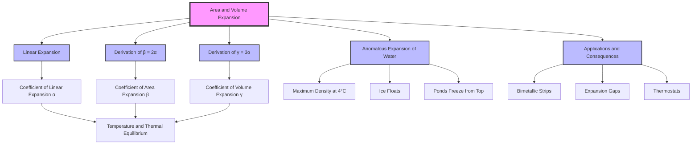

---
# Area and Volume Expansion / 面积与体积膨胀

---

# 1. Overview / 概述

**English:**
This sub-topic extends the concept of [[Linear Expansion]] to two and three dimensions. When a solid is heated, its area (surface expansion) and volume (cubic expansion) increase predictably. For isotropic materials (materials that expand uniformly in all directions), the coefficients for area and volume expansion are directly related to the linear expansion coefficient ($\alpha$). This is crucial for understanding the thermal behavior of sheets, plates, and solid objects, and is a prerequisite for understanding [[Applications and Consequences of Thermal Expansion]] such as the design of expansion gaps and the operation of [[Bimetallic Strips and Thermostats]].

**中文:**
本子知识点将[[Linear Expansion]]的概念扩展到二维和三维。当固体受热时，其面积（表面膨胀）和体积（立方膨胀）会按可预测的方式增加。对于各向同性材料（在所有方向上均匀膨胀的材料），面积和体积膨胀系数与线膨胀系数（$\alpha$）直接相关。这对于理解板材、平板和固体物体的热行为至关重要，也是理解[[Applications and Consequences of Thermal Expansion]]（如膨胀间隙的设计）以及[[Bimetallic Strips and Thermostats]]工作原理的先决条件。

---

# 2. Syllabus Learning Objectives / 考纲学习目标

| CAIE 9702 | Edexcel IAL |
|-----------|-------------|
| 10.2(a) Define and use the coefficient of area expansion ($\beta$) and volume expansion ($\gamma$). | 5.5 Understand that area and volume expansion are consequences of linear expansion. |
| 10.2(b) Derive the relationship $\beta = 2\alpha$ and $\gamma = 3\alpha$ for isotropic materials. | 5.6 Use the equations $\Delta A = \beta A_0 \Delta T$ and $\Delta V = \gamma V_0 \Delta T$. |
| 10.2(c) Solve problems involving area and volume expansion of solids. | 5.7 Recall and use the relationships $\beta = 2\alpha$ and $\gamma = 3\alpha$. |
| 10.2(d) Explain the anomalous expansion of water. | |

**Examiner Expectations / 考官期望:**
- **CAIE:** You must be able to derive $\beta = 2\alpha$ and $\gamma = 3\alpha$ from first principles. The anomalous expansion of water is a specific required topic.
- **Edexcel:** Focus is on applying the formulas and understanding the relationship to linear expansion. Derivation is less emphasized, but understanding the concept is key.

---

# 3. Core Definitions / 核心定义

| Term (EN/CN) | Definition (EN) | Definition (CN) | Common Mistakes / 常见错误 |
|--------------|-----------------|-----------------|---------------------------|
| **Coefficient of Area Expansion ($\beta$)** / 面积膨胀系数 ($\beta$) | The fractional change in area per unit change in temperature. $\beta = \frac{\Delta A}{A_0 \Delta T}$ | 单位温度变化引起的面积相对变化率。 | Confusing $\beta$ with $\alpha$. Remember $\beta \approx 2\alpha$. |
| **Coefficient of Volume Expansion ($\gamma$)** / 体积膨胀系数 ($\gamma$) | The fractional change in volume per unit change in temperature. $\gamma = \frac{\Delta V}{V_0 \Delta T}$ | 单位温度变化引起的体积相对变化率。 | Confusing $\gamma$ with $\alpha$. Remember $\gamma \approx 3\alpha$. |
| **Isotropic Material** / 各向同性材料 | A material whose physical properties (including thermal expansion) are the same in all directions. | 物理性质（包括热膨胀）在所有方向上都相同的材料。 | Assuming all materials are isotropic. Crystals and composites are often anisotropic. |
| **Anomalous Expansion of Water** / 水的反常膨胀 | The unusual behavior of water where it contracts when heated from 0°C to 4°C, and then expands normally above 4°C. | 水在0°C到4°C之间受热时收缩，而在4°C以上正常膨胀的异常行为。 | Forgetting that water has maximum density at 4°C, not 0°C. |

---

# 4. Key Concepts Explained / 关键概念详解

## 4.1 Derivation of $\beta = 2\alpha$ and $\gamma = 3\alpha$ / $\beta = 2\alpha$ 和 $\gamma = 3\alpha$ 的推导

### Explanation / 解释
**English:**
For an isotropic material, expansion is uniform in all directions. Consider a square plate of side length $L_0$ and area $A_0 = L_0^2$. When heated by $\Delta T$, each side expands according to linear expansion: $L = L_0(1 + \alpha \Delta T)$. The new area is:
$$A = L^2 = [L_0(1 + \alpha \Delta T)]^2 = L_0^2 (1 + 2\alpha \Delta T + \alpha^2 \Delta T^2)$$
Since $\alpha$ is very small (typically $10^{-5} \text{ K}^{-1}$), the $\alpha^2 \Delta T^2$ term is negligible. Therefore:
$$A \approx A_0 (1 + 2\alpha \Delta T)$$
Comparing this to the definition $A = A_0(1 + \beta \Delta T)$, we get $\beta = 2\alpha$.

Similarly, for a cube of volume $V_0 = L_0^3$:
$$V = L^3 = [L_0(1 + \alpha \Delta T)]^3 = L_0^3 (1 + 3\alpha \Delta T + 3\alpha^2 \Delta T^2 + \alpha^3 \Delta T^3)$$
Neglecting higher-order terms ($\alpha^2$ and $\alpha^3$):
$$V \approx V_0 (1 + 3\alpha \Delta T)$$
Thus, $\gamma = 3\alpha$.

**中文:**
对于各向同性材料，膨胀在所有方向上都是均匀的。考虑一个边长为 $L_0$、面积为 $A_0 = L_0^2$ 的正方形板。当温度升高 $\Delta T$ 时，每条边根据线膨胀公式膨胀：$L = L_0(1 + \alpha \Delta T)$。新的面积为：
$$A = L^2 = [L_0(1 + \alpha \Delta T)]^2 = L_0^2 (1 + 2\alpha \Delta T + \alpha^2 \Delta T^2)$$
由于 $\alpha$ 非常小（通常为 $10^{-5} \text{ K}^{-1}$），$\alpha^2 \Delta T^2$ 项可以忽略不计。因此：
$$A \approx A_0 (1 + 2\alpha \Delta T)$$
将此与定义 $A = A_0(1 + \beta \Delta T)$ 比较，我们得到 $\beta = 2\alpha$。

类似地，对于体积为 $V_0 = L_0^3$ 的立方体：
$$V = L^3 = [L_0(1 + \alpha \Delta T)]^3 = L_0^3 (1 + 3\alpha \Delta T + 3\alpha^2 \Delta T^2 + \alpha^3 \Delta T^3)$$
忽略高阶项（$\alpha^2$ 和 $\alpha^3$）：
$$V \approx V_0 (1 + 3\alpha \Delta T)$$
因此，$\gamma = 3\alpha$。

### Physical Meaning / 物理意义
**English:** The coefficients $\beta$ and $\gamma$ are not independent properties; they are a direct consequence of linear expansion in multiple dimensions. The factors of 2 and 3 arise from the geometry of area and volume.
**中文:** 系数 $\beta$ 和 $\gamma$ 不是独立的属性；它们是多个维度上线膨胀的直接结果。因子 2 和 3 源于面积和体积的几何特性。

### Common Misconceptions / 常见误区
- **Misconception:** $\beta$ and $\gamma$ are fundamental material properties like $\alpha$.
  **Reality:** For isotropic solids, they are derived from $\alpha$.
- **Misconception:** The derivation is exact.
  **Reality:** It is an approximation valid for small $\Delta T$ because we neglect $\alpha^2$ and higher terms.

### Exam Tips / 考试提示
- **CAIE:** Be prepared to show the full derivation step-by-step.
- **Edexcel:** You are expected to recall and use $\beta = 2\alpha$ and $\gamma = 3\alpha$ without derivation, but understanding the derivation helps avoid mistakes.

> 📷 **IMAGE PROMPT — D01: Derivation of Area Expansion**
> A diagram showing a square plate before and after heating. The original square has side L0 and area A0. The expanded square has side L0(1+αΔT) and area A0(1+2αΔT). Arrows indicate the expansion in both length and width. The negligible α² term is crossed out.

## 4.2 Anomalous Expansion of Water / 水的反常膨胀

### Explanation / 解释
**English:**
Most substances expand when heated and contract when cooled. Water behaves differently between 0°C and 4°C. As water is heated from 0°C to 4°C, it **contracts** (its volume decreases). Above 4°C, it expands normally. This means water has its **maximum density** at 4°C. This is why ice floats (density of ice < density of water at 4°C) and why ponds freeze from the top down, allowing aquatic life to survive under the ice.

**中文:**
大多数物质受热膨胀，遇冷收缩。水在0°C到4°C之间表现不同。当水从0°C加热到4°C时，它会**收缩**（体积减小）。在4°C以上，它正常膨胀。这意味着水在4°C时具有**最大密度**。这就是为什么冰会漂浮（冰的密度 < 4°C时水的密度），以及池塘从上往下结冰的原因，这使得水生生物能够在冰下生存。

### Physical Meaning / 物理意义
**English:** The anomalous behavior is due to the unique structure of water molecules and hydrogen bonding. At 0°C, water has an open, ice-like structure. As it warms to 4°C, some of this structure collapses, allowing molecules to pack more closely, decreasing volume. Above 4°C, the normal kinetic expansion dominates.
**中文:** 这种反常行为是由于水分子和氢键的独特结构造成的。在0°C时，水具有开放的、类似冰的结构。当它升温到4°C时，部分结构坍塌，使得分子能够更紧密地堆积，从而减小体积。在4°C以上，正常的动能膨胀占主导地位。

### Common Misconceptions / 常见误区
- **Misconception:** Water always expands when heated.
  **Reality:** It contracts between 0°C and 4°C.
- **Misconception:** Ice is denser than water.
  **Reality:** Ice is less dense, which is why it floats.

### Exam Tips / 考试提示
- **CAIE:** This is a specific syllabus point. Be ready to explain the concept and its consequences (e.g., ice on ponds, survival of aquatic life).
- **Edexcel:** Less likely to be tested directly, but understanding it provides context.

> 📷 **IMAGE PROMPT — D02: Anomalous Expansion of Water**
> A graph of density vs. temperature for water from 0°C to 10°C. The curve peaks at 4°C, showing maximum density. Below 4°C, density decreases as temperature decreases. Above 4°C, density decreases as temperature increases. Label the axes: Density (kg/m³) and Temperature (°C). Mark the point at 4°C as "Maximum Density".

---

# 5. Essential Equations / 核心公式

## Equation 1: Area Expansion / 面积膨胀公式

$$ \Delta A = \beta A_0 \Delta T $$

| Symbol (符号) | Meaning (EN) | Meaning (CN) | Unit (单位) |
|--------------|-------------|-------------|------------|
| $\Delta A$ | Change in area | 面积变化量 | m² |
| $\beta$ | Coefficient of area expansion | 面积膨胀系数 | K⁻¹ (or °C⁻¹) |
| $A_0$ | Original area | 原始面积 | m² |
| $\Delta T$ | Change in temperature | 温度变化量 | K (or °C) |

**Derivation / 推导:** From definition $\beta = \frac{\Delta A}{A_0 \Delta T}$.
**Conditions / 适用条件:** Valid for small $\Delta T$ and isotropic materials.
**Limitations / 局限性:** Not accurate for very large temperature changes due to neglected higher-order terms.

## Equation 2: Volume Expansion / 体积膨胀公式

$$ \Delta V = \gamma V_0 \Delta T $$

| Symbol (符号) | Meaning (EN) | Meaning (CN) | Unit (单位) |
|--------------|-------------|-------------|------------|
| $\Delta V$ | Change in volume | 体积变化量 | m³ |
| $\gamma$ | Coefficient of volume expansion | 体积膨胀系数 | K⁻¹ (or °C⁻¹) |
| $V_0$ | Original volume | 原始体积 | m³ |
| $\Delta T$ | Change in temperature | 温度变化量 | K (or °C) |

**Derivation / 推导:** From definition $\gamma = \frac{\Delta V}{V_0 \Delta T}$.
**Conditions / 适用条件:** Valid for small $\Delta T$ and isotropic materials.
**Limitations / 局限性:** Not accurate for very large temperature changes.

## Equation 3: Relationship between Coefficients / 系数关系

$$ \beta = 2\alpha $$
$$ \gamma = 3\alpha $$

| Symbol (符号) | Meaning (EN) | Meaning (CN) | Unit (单位) |
|--------------|-------------|-------------|------------|
| $\alpha$ | Coefficient of linear expansion | 线膨胀系数 | K⁻¹ (or °C⁻¹) |
| $\beta$ | Coefficient of area expansion | 面积膨胀系数 | K⁻¹ (or °C⁻¹) |
| $\gamma$ | Coefficient of volume expansion | 体积膨胀系数 | K⁻¹ (or °C⁻¹) |

**Derivation / 推导:** Derived from geometry (see Section 4.1).
**Conditions / 适用条件:** Only for isotropic solids.
**Limitations / 局限性:** Does not apply to anisotropic materials or liquids.

---

# 6. Graphs and Relationships / 图表与关系

## 6.1 Area vs. Temperature / 面积与温度关系图

### Axes / 坐标轴
- **X-axis:** Temperature ($T$) / 温度 ($T$)
- **Y-axis:** Area ($A$) / 面积 ($A$)

### Shape / 形状
A straight line with a positive slope.

### Gradient Meaning / 斜率含义
The gradient is $\beta A_0$, which is the rate of change of area with temperature.

### Area Meaning / 面积含义
Not applicable for this graph.

### Exam Interpretation / 考试解读
- The intercept on the y-axis is $A_0$ (area at $T=0$).
- The gradient is proportional to the original area $A_0$ and the coefficient $\beta$.

## 6.2 Volume vs. Temperature / 体积与温度关系图

### Axes / 坐标轴
- **X-axis:** Temperature ($T$) / 温度 ($T$)
- **Y-axis:** Volume ($V$) / 体积 ($V$)

### Shape / 形状
A straight line with a positive slope (for normal materials). For water, it is a curve with a minimum at 4°C.

### Gradient Meaning / 斜率含义
The gradient is $\gamma V_0$, which is the rate of change of volume with temperature.

### Area Meaning / 面积含义
Not applicable for this graph.

### Exam Interpretation / 考试解读
- For normal materials, the graph is linear.
- For water, the graph shows a minimum volume at 4°C, indicating maximum density.

> 📷 **IMAGE PROMPT — G01: Volume vs Temperature for Water**
> A graph showing volume (V) on the y-axis and temperature (T) on the x-axis. The curve decreases from 0°C to 4°C, reaching a minimum at 4°C, then increases linearly above 4°C. Label the minimum point as "4°C: Minimum Volume / Maximum Density".

---

# 7. Required Diagrams / 必备图表

## 7.1 Expansion of a Square Plate / 正方形板的膨胀

### Description / 描述
**English:** A diagram showing a square plate before and after heating. The original plate has side length $L_0$ and area $A_0 = L_0^2$. After heating by $\Delta T$, the side length becomes $L = L_0(1 + \alpha \Delta T)$ and the area becomes $A = A_0(1 + 2\alpha \Delta T)$.
**中文:** 显示正方形板在加热前后的示意图。原始板的边长为 $L_0$，面积为 $A_0 = L_0^2$。加热 $\Delta T$ 后，边长变为 $L = L_0(1 + \alpha \Delta T)$，面积变为 $A = A_0(1 + 2\alpha \Delta T)$。

### Image Prompt / 图片生成提示
> 📷 **IMAGE PROMPT — D03: Square Plate Expansion**
> A 2D diagram showing two squares. The left square is labeled "Before Heating" with side L0 and area A0. The right square is labeled "After Heating (ΔT)" with side L0(1+αΔT) and area A0(1+2αΔT). Arrows indicate expansion in both x and y directions. Use clear labels and a clean, educational style.

### Labels Required / 需要标注
- Original side: $L_0$
- Expanded side: $L_0(1 + \alpha \Delta T)$
- Original area: $A_0$
- Expanded area: $A_0(1 + 2\alpha \Delta T)$
- Temperature change: $\Delta T$

### Exam Importance / 考试重要性
**English:** Essential for deriving $\beta = 2\alpha$ and understanding the geometric basis of area expansion.
**中文:** 对于推导 $\beta = 2\alpha$ 和理解面积膨胀的几何基础至关重要。

## 7.2 Expansion of a Cube / 立方体的膨胀

### Description / 描述
**English:** A 3D diagram showing a cube before and after heating. The original cube has side length $L_0$ and volume $V_0 = L_0^3$. After heating by $\Delta T$, the side length becomes $L = L_0(1 + \alpha \Delta T)$ and the volume becomes $V = V_0(1 + 3\alpha \Delta T)$.
**中文:** 显示立方体在加热前后的3D示意图。原始立方体的边长为 $L_0$，体积为 $V_0 = L_0^3$。加热 $\Delta T$ 后，边长变为 $L = L_0(1 + \alpha \Delta T)$，体积变为 $V = V_0(1 + 3\alpha \Delta T)$。

### Image Prompt / 图片生成提示
> 📷 **IMAGE PROMPT — D04: Cube Expansion**
> A 3D isometric diagram showing two cubes. The left cube is labeled "Before Heating" with side L0 and volume V0. The right cube is labeled "After Heating (ΔT)" with side L0(1+αΔT) and volume V0(1+3αΔT). Arrows indicate expansion in x, y, and z directions. Use clear labels and a clean, educational style.

### Labels Required / 需要标注
- Original side: $L_0$
- Expanded side: $L_0(1 + \alpha \Delta T)$
- Original volume: $V_0$
- Expanded volume: $V_0(1 + 3\alpha \Delta T)$
- Temperature change: $\Delta T$

### Exam Importance / 考试重要性
**English:** Essential for deriving $\gamma = 3\alpha$ and understanding the geometric basis of volume expansion.
**中文:** 对于推导 $\gamma = 3\alpha$ 和理解体积膨胀的几何基础至关重要。

---

# 8. Worked Examples / 典型例题

## Example 1: Area Expansion of a Metal Plate / 金属板的面积膨胀

### Question / 题目
**English:**
A square brass plate has a side length of 0.50 m at 20°C. The coefficient of linear expansion for brass is $1.9 \times 10^{-5} \text{ K}^{-1}$. Calculate the increase in area of the plate when it is heated to 120°C.

**中文:**
一块方形黄铜板在20°C时的边长为0.50米。黄铜的线膨胀系数为 $1.9 \times 10^{-5} \text{ K}^{-1}$。计算该板被加热到120°C时面积的增加量。

### Solution / 解答
**Step 1: Identify known quantities.**
$L_0 = 0.50 \text{ m}$
$A_0 = L_0^2 = (0.50)^2 = 0.25 \text{ m}^2$
$\alpha = 1.9 \times 10^{-5} \text{ K}^{-1}$
$\Delta T = 120 - 20 = 100 \text{ K}$

**Step 2: Calculate $\beta$.**
$\beta = 2\alpha = 2 \times (1.9 \times 10^{-5}) = 3.8 \times 10^{-5} \text{ K}^{-1}$

**Step 3: Apply the area expansion formula.**
$\Delta A = \beta A_0 \Delta T$
$\Delta A = (3.8 \times 10^{-5}) \times (0.25) \times (100)$
$\Delta A = 9.5 \times 10^{-4} \text{ m}^2$

### Final Answer / 最终答案
**Answer:** $9.5 \times 10^{-4} \text{ m}^2$ | **答案：** $9.5 \times 10^{-4} \text{ 平方米}$

### Quick Tip / 提示
**English:** Always convert temperature differences to Kelvin. Since the size of 1 K = 1°C, the numerical value of $\Delta T$ is the same in both units.
**中文:** 始终将温差转换为开尔文。由于1 K = 1°C，$\Delta T$ 的数值在两个单位中是相同的。

## Example 2: Volume Expansion of a Metal Sphere / 金属球的体积膨胀

### Question / 题目
**English:**
A copper sphere has a volume of $2.0 \times 10^{-4} \text{ m}^3$ at 15°C. The coefficient of volume expansion for copper is $5.1 \times 10^{-5} \text{ K}^{-1}$. Calculate the volume of the sphere at 85°C.

**中文:**
一个铜球在15°C时的体积为 $2.0 \times 10^{-4} \text{ 立方米}$。铜的体积膨胀系数为 $5.1 \times 10^{-5} \text{ K}^{-1}$。计算该球在85°C时的体积。

### Solution / 解答
**Step 1: Identify known quantities.**
$V_0 = 2.0 \times 10^{-4} \text{ m}^3$
$\gamma = 5.1 \times 10^{-5} \text{ K}^{-1}$
$\Delta T = 85 - 15 = 70 \text{ K}$

**Step 2: Apply the volume expansion formula.**
$\Delta V = \gamma V_0 \Delta T$
$\Delta V = (5.1 \times 10^{-5}) \times (2.0 \times 10^{-4}) \times (70)$
$\Delta V = 7.14 \times 10^{-7} \text{ m}^3$

**Step 3: Calculate the final volume.**
$V = V_0 + \Delta V$
$V = (2.0 \times 10^{-4}) + (7.14 \times 10^{-7})$
$V = 2.0714 \times 10^{-4} \text{ m}^3$

### Final Answer / 最终答案
**Answer:** $2.07 \times 10^{-4} \text{ m}^3$ (to 3 significant figures) | **答案：** $2.07 \times 10^{-4} \text{ 立方米}$ (保留3位有效数字)

### Quick Tip / 提示
**English:** Remember to add the change to the original volume to find the final volume.
**中文:** 记得将变化量加到原始体积上以求得最终体积。

---

# 9. Past Paper Question Types / 历年真题题型

| Question Type / 题型 | Frequency / 频率 | Difficulty / 难度 | Past Paper References / 真题索引 |
|----------------------|------------------|------------------|-------------------------------|
| Derivation of $\beta = 2\alpha$ and $\gamma = 3\alpha$ | Medium | Medium | 📝 *待填入* |
| Calculation of area/volume change | High | Low | 📝 *待填入* |
| Anomalous expansion of water explanation | Low (CAIE) | Medium | 📝 *待填入* |
| Combined with linear expansion problems | Medium | Medium | 📝 *待填入* |

**Common Command Words / 常见指令词:**
- **Define / 定义:** State the meaning of a term (e.g., coefficient of area expansion).
- **Derive / 推导:** Show the steps to obtain a relationship (e.g., $\beta = 2\alpha$).
- **Calculate / 计算:** Use a formula to find a numerical value.
- **Explain / 解释:** Describe the reason for a phenomenon (e.g., anomalous expansion of water).

---

# 10. Practical Skills Connections / 实验技能链接

**English:**
- **Measurement of $\beta$ and $\gamma$:** In a practical setting, you might measure the expansion of a metal plate or sphere using a traveling microscope or a dilatometer. The key is to measure the change in dimensions accurately.
- **Uncertainties:** The uncertainty in $\Delta A$ or $\Delta V$ depends on the uncertainties in measuring $A_0$, $\Delta T$, and $\alpha$. Use the formula for propagation of uncertainties.
- **Graph Plotting:** Plotting $A$ vs. $T$ or $V$ vs. $T$ allows you to determine $\beta$ or $\gamma$ from the gradient.
- **Experimental Design:** To minimize errors, use a material with a high $\alpha$ (e.g., brass) and a large temperature change. Ensure good thermal contact between the sample and the thermometer.

**中文:**
- **测量 $\beta$ 和 $\gamma$:** 在实验环境中，您可能会使用移动显微镜或膨胀计来测量金属板或球的膨胀。关键在于精确测量尺寸的变化。
- **不确定度:** $\Delta A$ 或 $\Delta V$ 的不确定度取决于测量 $A_0$、$\Delta T$ 和 $\alpha$ 的不确定度。使用不确定度传播公式。
- **图表绘制:** 绘制 $A$ 与 $T$ 或 $V$ 与 $T$ 的关系图，可以从斜率确定 $\beta$ 或 $\gamma$。
- **实验设计:** 为减少误差，使用高 $\alpha$ 的材料（如黄铜）和较大的温度变化。确保样品和温度计之间良好的热接触。

---

# 11. Concept Map / 概念图谱

---

# 12. Quick Revision Sheet / 速查表

| Category / 类别 | Key Points / 要点 |
|----------------|------------------|
| **Definition / 定义** | $\beta = \frac{\Delta A}{A_0 \Delta T}$, $\gamma = \frac{\Delta V}{V_0 \Delta T}$ |
| **Key Formula / 核心公式** | $\Delta A = \beta A_0 \Delta T$, $\Delta V = \gamma V_0 \Delta T$ |
| **Relationship / 关系** | $\beta = 2\alpha$, $\gamma = 3\alpha$ (for isotropic solids) |
| **Key Graph / 核心图表** | $A$ vs $T$ (linear), $V$ vs $T$ (linear for normal materials, curved for water with minimum at 4°C) |
| **Anomalous Water / 水的反常** | Contracts from 0°C to 4°C; maximum density at 4°C |
| **Exam Tip / 考试提示** | Always use $\Delta T$ in Kelvin (numerically same as °C). Derive $\beta$ and $\gamma$ from $\alpha$ for CAIE. |