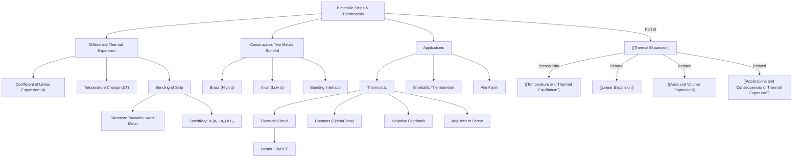

# 1. Overview / 概述

**English:**
This sub-topic explores the practical application of [[Thermal Expansion]] through **bimetallic strips** and **thermostats**. A bimetallic strip consists of two different metals bonded together; when heated, the metals expand by different amounts, causing the strip to bend. This bending effect is harnessed in thermostats — devices that automatically regulate temperature by making or breaking an electrical circuit. Understanding this application is crucial for connecting theoretical thermal expansion to real-world engineering, from household irons to car engine cooling systems. This leaf node builds directly on [[Linear Expansion]] and [[Temperature and Thermal Equilibrium]].

**中文:**
本子知识点探讨了[[Thermal Expansion]]在**双金属片**和**恒温器**中的实际应用。双金属片由两种不同的金属粘合而成；受热时，两种金属膨胀量不同，导致金属片弯曲。这种弯曲效应被用于恒温器——通过接通或断开电路来自动调节温度的装置。理解这一应用对于将热膨胀理论与现实工程联系起来至关重要，从家用熨斗到汽车发动机冷却系统都涉及。本节点直接建立在[[Linear Expansion]]和[[Temperature and Thermal Equilibrium]]的基础上。

---

# 2. Syllabus Learning Objectives / 考纲学习目标

| CAIE 9702 (10.2 a-d) | Edexcel IAL (WPH11 U1: 5.5-5.7) |
|----------------------|----------------------------------|
| Explain how a bimetallic strip works | Describe the construction and operation of a bimetallic strip |
| Describe the operation of a simple thermostat | Explain how a bimetallic strip is used in a simple thermostat |
| Explain how a thermostat controls temperature | Describe applications of bimetallic strips (e.g., fire alarms, thermostats) |
| Discuss advantages and limitations of bimetallic thermostats | Calculate the bending of a bimetallic strip (qualitative only) |

**Examiner Expectations / 考官期望:**
- **English:** You must be able to explain *why* the strip bends (different coefficients of linear expansion) and *how* this controls a circuit. Qualitative understanding is sufficient — no complex calculations are required for bending angle.
- **中文:** 你必须能够解释金属片*为什么*弯曲（不同的线膨胀系数）以及*如何*控制电路。定性理解即可——不需要复杂的弯曲角度计算。

---

# 3. Core Definitions / 核心定义

| Term (EN/CN) | Definition (EN) | Definition (CN) | Common Mistakes / 常见错误 |
|--------------|-----------------|-----------------|---------------------------|
| **Bimetallic Strip** / 双金属片 | A strip made by bonding two different metals with different coefficients of linear expansion. | 由两种线膨胀系数不同的金属粘合而成的金属片。 | ❌ Thinking both metals expand equally → they don't! |
| **Thermostat** / 恒温器 | A device that automatically maintains a system at a constant temperature by switching a heating or cooling element on/off. | 通过开关加热或冷却元件来自动维持系统恒温的装置。 | ❌ Confusing with thermometer (measures temperature) |
| **Coefficient of Linear Expansion ($\alpha$)** / 线膨胀系数 | A material property that measures how much a material expands per degree Celsius rise in temperature. | 衡量材料每升高1摄氏度膨胀多少的材料属性。 | ❌ Forgetting units: $^\circ C^{-1}$ or $K^{-1}$ |
| **Contact / Break** / 接触/断开 | The state of the electrical circuit in a thermostat — "contact" means circuit is closed (heating on), "break" means circuit is open (heating off). | 恒温器中电路的状态——"接触"表示电路闭合（加热开启），"断开"表示电路断开（加热关闭）。 | ❌ Mixing up which state turns heating on/off |
| **Bimetallic Thermometer** / 双金属温度计 | A temperature-measuring device that uses a coiled bimetallic strip to move a pointer. | 使用螺旋状双金属片带动指针的温度测量装置。 | ❌ Thinking it's the same as a thermostat (thermostat *controls*, thermometer *measures*) |

---

# 4. Key Concepts Explained / 关键概念详解

## 4.1 How a Bimetallic Strip Works / 双金属片的工作原理

### Explanation / 解释
**English:**
A bimetallic strip is made by firmly bonding (e.g., welding or riveting) two thin strips of different metals — typically **brass** (high $\alpha$) and **invar** (a nickel-iron alloy with very low $\alpha$). When the temperature rises, both metals expand, but brass expands more than invar. Since they are bonded together, the brass side becomes longer than the invar side, forcing the strip to **bend** with the brass on the **outside** of the curve. When cooled, the brass contracts more, bending the strip in the opposite direction. This bending is predictable and repeatable, making it useful for control systems.

**中文:**
双金属片由两种不同金属的薄片牢固粘合（如焊接或铆接）而成——通常是**黄铜**（高$\alpha$）和**因瓦合金**（一种镍铁合金，$\alpha$极低）。当温度升高时，两种金属都会膨胀，但黄铜比因瓦合金膨胀得更多。由于它们粘合在一起，黄铜侧变得比因瓦合金侧更长，迫使金属片向**黄铜在外侧**的方向弯曲。冷却时，黄铜收缩更多，使金属片向相反方向弯曲。这种弯曲是可预测且可重复的，因此可用于控制系统。

### Physical Meaning / 物理意义
**English:**
The bending is a direct consequence of **differential thermal expansion** — the difference in expansion between the two metals. The greater the difference in $\alpha$, the more the strip bends for a given temperature change. This converts a temperature change into **mechanical displacement** (movement).

**中文:**
弯曲是**差异热膨胀**的直接结果——两种金属膨胀量的差异。$\alpha$的差异越大，在给定温度变化下金属片弯曲得越多。这便将温度变化转化为**机械位移**（运动）。

### Common Misconceptions / 常见误区
- ❌ **"Both metals expand the same amount"** — No! Different $\alpha$ values cause different expansions.
- ❌ **"The strip bends because one metal expands and the other doesn't"** — Both expand, just by different amounts.
- ❌ **"The strip bends towards the metal that expands more"** — Actually, it bends *away* from the metal that expands more (that metal is on the outside of the curve).

### Exam Tips / 考试提示
- ✅ **English:** Always state which metal has the *larger* $\alpha$ and which has the *smaller* $\alpha$. Explain that the strip bends *towards* the metal with the smaller $\alpha$ when heated.
- ✅ **中文:** 务必说明哪种金属的$\alpha$*更大*，哪种$\alpha$*更小*。解释受热时金属片向$\alpha$*较小*的金属一侧弯曲。

> 📷 **IMAGE PROMPT — BMT-01: Bimetallic Strip Bending**
> A clear diagram showing a bimetallic strip at room temperature (straight) and when heated (curved). Label the two metals: "Brass (high α)" and "Invar (low α)". Show arrows indicating expansion directions. The heated strip should curve with brass on the outside of the bend. Include a temperature scale.

---

## 4.2 How a Simple Thermostat Works / 简单恒温器的工作原理

### Explanation / 解释
**English:**
A simple thermostat uses a bimetallic strip as a **switch**. The strip is part of an electrical circuit that powers a heater. At the desired temperature, the strip is straight and the circuit is **closed** (heating on). As temperature rises above the set point, the strip bends, causing the contact to **open** (heating off). When the temperature falls, the strip straightens, the contact closes again, and heating resumes. This **on-off cycling** maintains the temperature within a narrow range around the set point.

**中文:**
简单恒温器使用双金属片作为**开关**。金属片是给加热器供电的电路的一部分。在所需温度下，金属片是直的，电路**闭合**（加热开启）。当温度升高超过设定点时，金属片弯曲，导致触点**断开**（加热关闭）。当温度下降时，金属片变直，触点再次闭合，加热恢复。这种**开关循环**将温度维持在设定点附近的狭窄范围内。

### Physical Meaning / 物理意义
**English:**
The thermostat is a **negative feedback** system: an increase in output (temperature) causes a decrease in input (heating power), stabilizing the system. The bimetallic strip acts as both **sensor** (detects temperature) and **actuator** (moves to break/close the circuit).

**中文:**
恒温器是一个**负反馈**系统：输出（温度）的增加导致输入（加热功率）的减少，从而使系统稳定。双金属片同时充当**传感器**（检测温度）和**执行器**（移动以断开/闭合电路）。

### Common Misconceptions / 常见误区
- ❌ **"The thermostat measures temperature like a thermometer"** — It *senses* temperature but its primary function is *control*, not measurement.
- ❌ **"The thermostat keeps the temperature exactly constant"** — No, it cycles on and off, so temperature oscillates slightly.
- ❌ **"The bimetallic strip is the only component"** — A real thermostat also has electrical contacts, a mounting structure, and often an adjustment screw.

### Exam Tips / 考试提示
- ✅ **English:** Draw a simple circuit diagram with the bimetallic strip as the switch. Label the contacts "open" and "closed" states.
- ✅ **中文:** 画出简单电路图，将双金属片作为开关。标注触点的"断开"和"闭合"状态。

> 📷 **IMAGE PROMPT — BMT-02: Simple Thermostat Circuit**
> A circuit diagram showing: a power source (battery), a bimetallic strip with electrical contacts, and a heater (resistor symbol). Show two states: (a) Temperature below set point — contacts closed, current flows, heater on. (b) Temperature above set point — contacts open, no current, heater off. Use arrows to show strip bending direction.

---

## 4.3 Adjustment Mechanism / 调节机制

### Explanation / 解释
**English:**
Most thermostats have an **adjustment screw** that changes the set point temperature. Turning the screw changes the initial position of the bimetallic strip or the gap between the contacts. For example, moving the contacts closer together means the strip needs to bend less to open the circuit, so the thermostat switches off at a **lower** temperature. Moving them further apart requires more bending, so the thermostat switches off at a **higher** temperature.

**中文:**
大多数恒温器都有一个**调节螺丝**来改变设定温度。转动螺丝会改变双金属片的初始位置或触点之间的间隙。例如，将触点移近意味着金属片需要弯曲更少就能断开电路，因此恒温器在**较低**温度下关闭。将触点移远则需要更多弯曲，因此恒温器在**较高**温度下关闭。

### Exam Tips / 考试提示
- ✅ **English:** Understand that the adjustment screw changes the *mechanical preload* on the strip, not the strip's material properties.
- ✅ **中文:** 理解调节螺丝改变的是金属片的*机械预载*，而不是金属片的材料属性。

---

# 5. Essential Equations / 核心公式

## 5.1 Linear Expansion (for each metal) / 线膨胀（每种金属）

$$ \Delta L = \alpha L_0 \Delta T $$

| Symbol (符号) | Meaning (EN) | Meaning (CN) | Unit (单位) |
|--------------|-------------|-------------|------------|
| $\Delta L$ | Change in length | 长度变化量 | m |
| $\alpha$ | Coefficient of linear expansion | 线膨胀系数 | $^\circ C^{-1}$ or $K^{-1}$ |
| $L_0$ | Original length | 原始长度 | m |
| $\Delta T$ | Temperature change | 温度变化量 | $^\circ C$ or $K$ |

**Derivation / 推导:** Not required for this sub-topic (see [[Linear Expansion]]).

**Conditions / 适用条件:**
- **English:** This equation applies to each metal individually. The *difference* in $\Delta L$ between the two metals causes the bending.
- **中文:** 该方程分别适用于每种金属。两种金属之间$\Delta L$的*差异*导致弯曲。

**Limitations / 局限性:**
- **English:** The equation assumes uniform temperature across the strip and small temperature changes. For very large $\Delta T$, the bending may become non-linear.
- **中文:** 该方程假设金属片温度均匀且温度变化较小。对于非常大的$\Delta T$，弯曲可能变得非线性。

---

## 5.2 Qualitative Bending Relationship / 定性弯曲关系

$$ \text{Bending} \propto (\alpha_1 - \alpha_2) \times \Delta T $$

| Symbol (符号) | Meaning (EN) | Meaning (CN) | Unit (单位) |
|--------------|-------------|-------------|------------|
| $\alpha_1$ | Coefficient of metal 1 (higher $\alpha$) | 金属1的线膨胀系数（较高$\alpha$） | $^\circ C^{-1}$ |
| $\alpha_2$ | Coefficient of metal 2 (lower $\alpha$) | 金属2的线膨胀系数（较低$\alpha$） | $^\circ C^{-1}$ |
| $\Delta T$ | Temperature change | 温度变化量 | $^\circ C$ |

**Derivation / 推导:** Not required — qualitative understanding only.

**Conditions / 适用条件:**
- **English:** This is a proportional relationship, not an exact equation. The actual bending also depends on the thickness and length of the strip.
- **中文:** 这是比例关系，不是精确方程。实际弯曲还取决于金属片的厚度和长度。

**Limitations / 局限性:**
- **English:** Only valid for small temperature changes where $\alpha$ is approximately constant.
- **中文:** 仅适用于$\alpha$近似恒定的较小温度变化。

---

# 6. Graphs and Relationships / 图表与关系

## 6.1 Bending vs Temperature / 弯曲量与温度的关系

### Axes / 坐标轴
- **X-axis:** Temperature ($T$) / 温度 ($T$)
- **Y-axis:** Bending angle ($\theta$) or displacement ($d$) / 弯曲角度 ($\theta$) 或位移 ($d$)

### Shape / 形状
- **English:** A **linear** relationship for small temperature changes. The graph is a straight line passing through the origin (assuming zero bending at the reference temperature).
- **中文:** 在较小温度变化下呈**线性**关系。图形是通过原点的直线（假设在参考温度下弯曲为零）。

### Gradient Meaning / 斜率含义
- **English:** The gradient represents the **sensitivity** of the bimetallic strip — how much it bends per degree Celsius. A steeper gradient means a more sensitive strip (larger $(\alpha_1 - \alpha_2)$ or longer strip).
- **中文:** 斜率代表双金属片的**灵敏度**——每摄氏度弯曲多少。斜率越大表示金属片越灵敏（$(\alpha_1 - \alpha_2)$更大或金属片更长）。

### Area Meaning / 面积含义
- **English:** No meaningful area under this graph.
- **中文:** 该图形下没有有意义的面积。

### Exam Interpretation / 考试解读
- **English:** If asked to compare two bimetallic strips, the one with the steeper gradient will switch a thermostat at a lower temperature (for the same contact gap).
- **中文:** 如果要求比较两个双金属片，斜率较大的那个会在较低温度下切换恒温器（对于相同的触点间隙）。

> 📷 **IMAGE PROMPT — BMT-03: Bending vs Temperature Graph**
> A graph with "Temperature / °C" on the x-axis and "Bending / mm" on the y-axis. Show a straight line through the origin. Label the gradient as "Sensitivity = (α₁ - α₂) × L₀". Add a second line with a steeper gradient labeled "More sensitive strip (larger Δα or longer L₀)".

---

# 7. Required Diagrams / 必备图表

## 7.1 Bimetallic Strip Construction / 双金属片结构

### Description / 描述
**English:** A cross-section diagram showing two different metals bonded together. The metals should be clearly labeled with their names and coefficients of linear expansion. Show the strip at room temperature (straight) and when heated (curved).

**中文:** 显示两种不同金属粘合在一起的横截面图。金属应清晰标注名称和线膨胀系数。显示室温下（直）和受热时（弯曲）的金属片。

### Image Prompt / 图片生成提示
> 📷 **IMAGE PROMPT — BMT-04: Bimetallic Strip Cross-Section**
> A detailed cross-section diagram of a bimetallic strip. Top layer: "Brass (α = 19 × 10⁻⁶ °C⁻¹)" in yellow-gold color. Bottom layer: "Invar (α = 1.2 × 10⁻⁶ °C⁻¹)" in silver-gray color. Show the bonding interface as a dashed line. On the left: strip at 20°C — straight. On the right: strip at 100°C — curved upward (brass on outside). Add arrows showing expansion directions. Include a scale bar.

### Labels Required / 需要标注
- **English:** Brass (high α), Invar (low α), bonding interface, room temperature (straight), heated (curved), direction of bending.
- **中文:** 黄铜（高α），因瓦合金（低α），粘合界面，室温（直），受热（弯曲），弯曲方向。

### Exam Importance / 考试重要性
- **English:** High — this is the most commonly asked diagram in exams. You must be able to draw and label it from memory.
- **中文:** 高——这是考试中最常问的图表。你必须能够凭记忆画出并标注。

---

## 7.2 Simple Thermostat Circuit / 简单恒温器电路

### Description / 描述
**English:** A circuit diagram showing a bimetallic strip acting as a switch in series with a heater and a power supply. Show the contacts clearly, and indicate the "on" and "off" states.

**中文:** 显示双金属片作为开关与加热器和电源串联的电路图。清晰显示触点，并指示"开"和"关"状态。

### Image Prompt / 图片生成提示
> 📷 **IMAGE PROMPT — BMT-05: Thermostat Circuit Diagram**
> A clean circuit diagram. Components: a battery (labeled "Power Supply"), a bimetallic strip with two electrical contacts (labeled "Contacts"), and a resistor (labeled "Heater"). Show two sub-diagrams: (a) "Heating ON — Contacts Closed" with current arrows flowing through the circuit. (b) "Heating OFF — Contacts Open" with a gap at the contacts and no current arrows. The bimetallic strip should be shown straight in (a) and curved in (b).

### Labels Required / 需要标注
- **English:** Power supply, bimetallic strip, contacts (open/closed), heater, current direction, temperature (low/high).
- **中文:** 电源，双金属片，触点（断开/闭合），加热器，电流方向，温度（低/高）。

### Exam Importance / 考试重要性
- **English:** High — you may be asked to draw the circuit or explain how it works using the diagram.
- **中文:** 高——你可能会被要求画出电路图或使用该图解释其工作原理。

---

# 8. Worked Examples / 典型例题

## Example 1: Explaining Bimetallic Strip Bending / 解释双金属片弯曲

### Question / 题目
**English:**
A bimetallic strip is made from brass ($\alpha = 19 \times 10^{-6} \, ^\circ C^{-1}$) and invar ($\alpha = 1.2 \times 10^{-6} \, ^\circ C^{-1}$). The strip is straight at $20^\circ C$. Explain what happens when the strip is heated to $100^\circ C$.

**中文:**
一个双金属片由黄铜（$\alpha = 19 \times 10^{-6} \, ^\circ C^{-1}$）和因瓦合金（$\alpha = 1.2 \times 10^{-6} \, ^\circ C^{-1}$）制成。金属片在$20^\circ C$时是直的。解释当金属片被加热到$100^\circ C$时会发生什么。

### Solution / 解答
**Step 1:** Identify the metal with the larger $\alpha$. Brass has a much larger $\alpha$ than invar ($19 \times 10^{-6} > 1.2 \times 10^{-6}$).

**Step 2:** Calculate the expansion for each metal (qualitative). Both metals expand, but brass expands approximately 16 times more than invar for the same temperature change.

**Step 3:** Since the metals are bonded, the brass side becomes longer than the invar side. This forces the strip to bend.

**Step 4:** The strip bends **towards the invar side** (the metal with the smaller $\alpha$). Brass is on the **outside** of the curve.

**Step 5:** If the strip is used in a thermostat, this bending would open the electrical contacts, turning off the heater.

**中文:**
**步骤1:** 确定$\alpha$较大的金属。黄铜的$\alpha$远大于因瓦合金（$19 \times 10^{-6} > 1.2 \times 10^{-6}$）。

**步骤2:** 定性计算每种金属的膨胀量。两种金属都会膨胀，但在相同温度变化下，黄铜的膨胀量约为因瓦合金的16倍。

**步骤3:** 由于金属粘合在一起，黄铜侧变得比因瓦合金侧更长。这迫使金属片弯曲。

**步骤4:** 金属片向**因瓦合金侧**弯曲（$\alpha$较小的金属）。黄铜在弯曲的**外侧**。

**步骤5:** 如果金属片用于恒温器，这种弯曲会断开电触点，关闭加热器。

### Final Answer / 最终答案
**Answer:** The strip bends towards the invar side (the metal with the smaller coefficient of linear expansion). | **答案：** 金属片向因瓦合金侧弯曲（线膨胀系数较小的金属）。

### Quick Tip / 提示
- **English:** Remember: "High α expands more → outside of the bend → strip bends towards low α."
- **中文:** 记住："高α膨胀更多→弯曲外侧→金属片向低α侧弯曲。"

---

## Example 2: Thermostat Operation / 恒温器操作

### Question / 题目
**English:**
A simple thermostat uses a bimetallic strip to control a room heater. The thermostat is set to maintain a room temperature of $20^\circ C$. Describe what happens when:
(a) The room temperature falls to $15^\circ C$.
(b) The room temperature rises to $25^\circ C$.

**中文:**
一个简单恒温器使用双金属片控制房间加热器。恒温器设定为维持室温$20^\circ C$。描述当以下情况发生时会发生什么：
(a) 室温降至$15^\circ C$。
(b) 室温升至$25^\circ C$。

### Solution / 解答
**Part (a):** At $15^\circ C$, the temperature is below the set point. The bimetallic strip is straight (or nearly straight). The electrical contacts are **closed**, completing the circuit. Current flows through the heater, and the room is heated.

**Part (b):** At $25^\circ C$, the temperature is above the set point. The bimetallic strip has bent enough to **open** the contacts. The circuit is broken, no current flows, and the heater turns off. The room will cool down until the strip straightens again and the contacts close.

**中文:**
**部分(a):** 在$15^\circ C$时，温度低于设定点。双金属片是直的（或接近直的）。电触点**闭合**，电路接通。电流流过加热器，房间被加热。

**部分(b):** 在$25^\circ C$时，温度高于设定点。双金属片弯曲到足以**断开**触点。电路断开，没有电流流过，加热器关闭。房间将冷却，直到金属片再次变直且触点闭合。

### Final Answer / 最终答案
**Answer:** (a) Heater turns ON. (b) Heater turns OFF. | **答案：** (a) 加热器开启。(b) 加热器关闭。

### Quick Tip / 提示
- **English:** The thermostat cycles ON and OFF — it does NOT keep the temperature exactly constant.
- **中文:** 恒温器循环开关——它不会使温度完全恒定。

---

# 9. Past Paper Question Types / 历年真题题型

| Question Type / 题型 | Frequency / 频率 | Difficulty / 难度 | Past Paper References / 真题索引 |
|----------------------|------------------|------------------|-------------------------------|
| Explain why a bimetallic strip bends | High | Easy | 📝 *待填入* |
| Describe how a thermostat works | High | Medium | 📝 *待填入* |
| Draw and label a bimetallic strip | Medium | Easy | 📝 *待填入* |
| Explain how to adjust the set temperature | Medium | Medium | 📝 *待填入* |
| Compare different bimetallic strips | Low | Medium | 📝 *待填入* |

**Common Command Words / 常见指令词:**
- **English:** Explain, Describe, Draw, Label, State, Suggest
- **中文:** 解释，描述，画出，标注，陈述，建议

---

# 10. Practical Skills Connections / 实验技能链接

**English:**
This sub-topic connects to practical skills in the following ways:

1. **Experimental Design:** You could design an experiment to demonstrate the bending of a bimetallic strip using a heat source (e.g., Bunsen burner) and measure the displacement using a ruler or protractor.
2. **Measurements:** Measure temperature using a thermometer and bending displacement using a ruler. Consider **uncertainties** in both measurements.
3. **Graph Plotting:** Plot bending displacement against temperature. The linear relationship can be verified, and the gradient gives the sensitivity.
4. **Experimental Design:** Investigate how the length or thickness of the strip affects the bending. This tests understanding of the relationship $\text{Bending} \propto (\alpha_1 - \alpha_2) \times L_0 \times \Delta T$.
5. **Safety:** When heating bimetallic strips, use tongs or clamps to avoid burns. Ensure the strip is securely mounted.

**中文:**
本子知识点通过以下方式与实验技能联系：

1. **实验设计：** 你可以设计一个实验，使用热源（如本生灯）演示双金属片的弯曲，并使用尺子或量角器测量位移。
2. **测量：** 使用温度计测量温度，使用尺子测量弯曲位移。考虑两种测量中的**不确定度**。
3. **图表绘制：** 绘制弯曲位移与温度的关系图。可以验证线性关系，斜率给出灵敏度。
4. **实验设计：** 研究金属片的长度或厚度如何影响弯曲。这测试了对关系$\text{Bending} \propto (\alpha_1 - \alpha_2) \times L_0 \times \Delta T$的理解。
5. **安全：** 加热双金属片时，使用钳子或夹具以避免烫伤。确保金属片牢固安装。

---

# 11. Concept Map / 概念图谱

---

# 12. Quick Revision Sheet / 速查表

| Category / 类别 | Key Points / 要点 |
|----------------|------------------|
| **Definition / 定义** | A bimetallic strip = two different metals bonded together. Thermostat = device that uses bimetallic strip to control temperature. / 双金属片 = 两种不同金属粘合在一起。恒温器 = 使用双金属片控制温度的装置。 |
| **Key Formula / 核心公式** | $\Delta L = \alpha L_0 \Delta T$ (for each metal). Bending $\propto (\alpha_1 - \alpha_2) \times \Delta T$. / 每种金属的线膨胀公式。弯曲量 $\propto (\alpha_1 - \alpha_2) \times \Delta T$。 |
| **Key Graph / 核心图表** | Bending vs Temperature: Linear graph through origin. Gradient = sensitivity. / 弯曲量与温度：通过原点的线性图。斜率 = 灵敏度。 |
| **Key Diagram / 核心图表** | Bimetallic strip cross-section (brass + invar). Thermostat circuit (strip + contacts + heater + power supply). / 双金属片横截面（黄铜 + 因瓦合金）。恒温器电路（金属片 + 触点 + 加热器 + 电源）。 |
| **Bending Direction / 弯曲方向** | Heated: bends towards metal with **smaller** $\alpha$. Cooled: bends towards metal with **larger** $\alpha$. / 受热：向$\alpha$**较小**的金属弯曲。冷却：向$\alpha$**较大**的金属弯曲。 |
| **Thermostat Operation / 恒温器操作** | Below set point: contacts closed, heater ON. Above set point: contacts open, heater OFF. / 低于设定点：触点闭合，加热器开。高于设定点：触点断开，加热器关。 |
| **Adjustment / 调节** | Adjustment screw changes contact gap → changes set temperature. / 调节螺丝改变触点间隙 → 改变设定温度。 |
| **Exam Tip / 考试提示** | Always state which metal has higher/lower $\alpha$. Explain *why* the strip bends (differential expansion). / 务必说明哪种金属的$\alpha$更高/更低。解释金属片*为什么*弯曲（差异膨胀）。 |
| **Common Mistake / 常见错误** | ❌ Thinking both metals expand equally. ❌ Confusing thermostat with thermometer. / ❌ 认为两种金属膨胀相同。❌ 混淆恒温器和温度计。 |