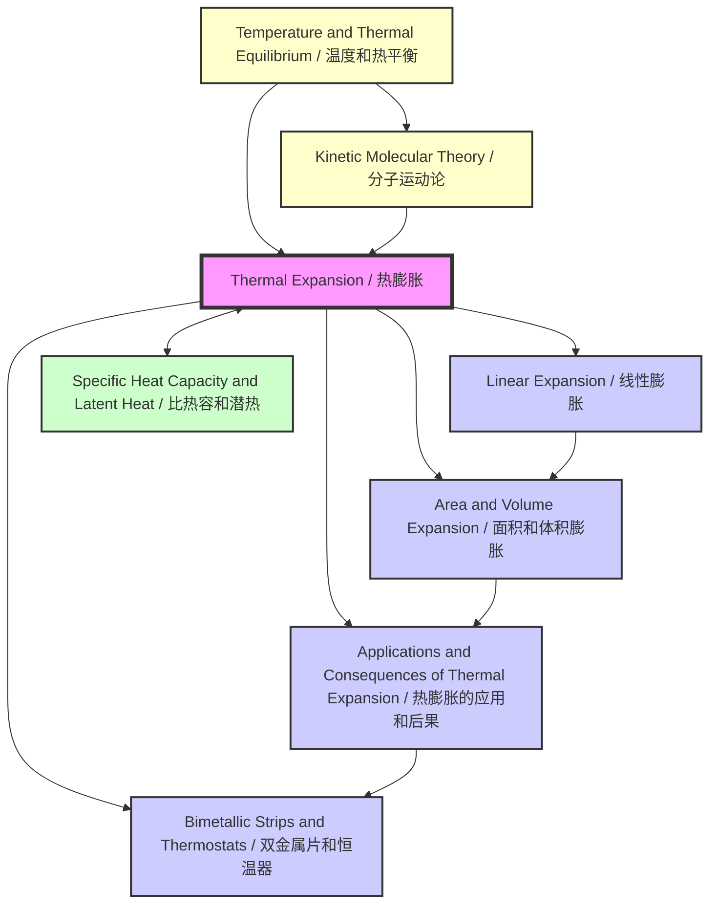

# Thermal Expansion / 热膨胀

---

# 1. Overview / 概述

**English:**
Thermal expansion is the tendency of matter to change its shape, area, and volume in response to a change in temperature. When a substance is heated, its particles gain kinetic energy and vibrate more vigorously, causing them to move further apart from their equilibrium positions. This increased average separation between particles results in an overall expansion of the material. This topic is fundamental to understanding how materials behave under temperature changes and is crucial for engineering design, construction, and everyday applications.

In the Cambridge 9702 and Edexcel IAL A-Level Physics syllabi, thermal expansion is studied as a core concept in thermal physics. It provides the foundation for understanding more advanced topics like [[Specific Heat Capacity and Latent Heat]] and the kinetic theory of matter. The topic covers linear, area, and volume expansion, the anomalous behavior of water, and practical applications such as [[Bimetallic Strips and Thermostats]]. Understanding thermal expansion is essential for engineers to prevent structural failures (e.g., in bridges, railway tracks, and pipelines) and to design devices that exploit this phenomenon (e.g., thermometers and thermostats).

Real-world applications include the design of expansion joints in bridges and buildings, the use of bimetallic strips in thermostats and thermometers, the fitting of metal tyres onto wooden wheels, and the loosening of tight metal lids by heating. In examinations, students are expected to define coefficients of expansion, apply the relevant equations, interpret graphs, and explain both the benefits and problems associated with thermal expansion.

**中文：**
热膨胀是物质在温度变化时改变其形状、面积和体积的趋势。当物质被加热时，其粒子获得动能并更剧烈地振动，导致它们从平衡位置移动得更远。粒子间平均间距的增加导致材料整体膨胀。这个主题是理解材料在温度变化下如何行为的基础，对工程设计、建筑和日常应用至关重要。

在剑桥 9702 和爱德思 IAL A-Level 物理教学大纲中，热膨胀作为热物理学的核心概念被研究。它为理解更高级的主题（如 [[比热容和潜热]] 和物质的分子运动论）提供了基础。该主题涵盖线性、面积和体积膨胀、水的反常行为以及实际应用，如 [[双金属片和恒温器]]。理解热膨胀对于工程师防止结构故障（例如桥梁、铁路轨道和管道）以及设计利用这种现象的设备（例如温度计和恒温器）至关重要。

实际应用包括桥梁和建筑物中伸缩缝的设计、恒温器和温度计中双金属片的使用、金属轮胎安装到木轮上，以及通过加热松开紧的金属盖。在考试中，学生需要定义膨胀系数、应用相关方程、解释图表，并解释与热膨胀相关的益处和问题。

---

# 2. Syllabus Learning Objectives / 考纲学习目标

**English:**
The following table maps the specific learning objectives from the Cambridge 9702 and Edexcel IAL syllabi for this topic. Students should be able to meet all these objectives.

**中文：**
下表映射了剑桥 9702 和爱德思 IAL 教学大纲中关于本主题的具体学习目标。学生应能满足所有这些目标。

| CAIE 9702 (10.2 a-d) | Edexcel IAL (WPH11 U1: 5.5-5.7) |
|----------------------|----------------------------------|
| (a) Show an understanding of the concept of thermal expansion and its practical consequences. | 5.5 Understand the concept of thermal expansion and its practical consequences. |
| (b) Define and use the coefficients of linear, area, and volume expansion. | 5.6 Define and use the coefficients of linear, area, and volume expansion. |
| (c) Apply the equations for linear expansion: $\Delta L = \alpha L_0 \Delta T$ and volume expansion: $\Delta V = \beta V_0 \Delta T$. | 5.7 Apply the equations for linear expansion: $\Delta L = \alpha L_0 \Delta T$ and volume expansion: $\Delta V = \beta V_0 \Delta T$. |
| (d) Describe and explain the anomalous expansion of water. | (Implicitly covered through understanding of density changes with temperature) |

**Examiner Expectations / 考官期望:**

**English:**
- **Definitions:** Be able to state precise definitions for $\alpha$ (coefficient of linear expansion) and $\beta$ (coefficient of volume expansion) in words and symbols.
- **Equation Application:** Confidently rearrange and apply $\Delta L = \alpha L_0 \Delta T$ and $\Delta V = \beta V_0 \Delta T$ to solve numerical problems.
- **Graph Interpretation:** Interpret graphs of length/volume vs. temperature, especially for water's anomalous expansion.
- **Practical Consequences:** Explain real-world examples (e.g., expansion gaps in bridges, bimetallic strips) using the principles of thermal expansion.
- **Anomalous Expansion:** Describe the behavior of water between 0°C and 4°C and explain its significance for aquatic life.

**中文：**
- **定义：** 能够用文字和符号精确陈述 $\alpha$（线膨胀系数）和 $\beta$（体膨胀系数）的定义。
- **方程应用：** 自信地重新排列并应用 $\Delta L = \alpha L_0 \Delta T$ 和 $\Delta V = \beta V_0 \Delta T$ 来解决数值问题。
- **图表解读：** 解读长度/体积随温度变化的图表，特别是水的反常膨胀。
- **实际后果：** 使用热膨胀原理解释现实世界的例子（例如桥梁中的伸缩缝、双金属片）。
- **反常膨胀：** 描述水在 0°C 到 4°C 之间的行为，并解释其对水生生物的重要性。

> 📋 **CIE Only:** The syllabus explicitly mentions the anomalous expansion of water as a specific learning objective (10.2 d). Students should be prepared for descriptive questions and graph interpretation on this topic.
>
> 📋 **Edexcel Only:** The syllabus focuses more on the quantitative application of expansion equations and practical consequences. The anomalous expansion of water is not a separate objective but is often used in context questions.

---

# 3. Core Definitions / 核心定义

**English:**
The following table provides the core definitions for this topic. Mastering these definitions is essential for exam success.

**中文：**
下表提供了本主题的核心定义。掌握这些定义对于考试成功至关重要。

| Term (EN/CN) | Definition (EN) | Definition (CN) | Common Mistakes / 常见错误 |
|--------------|-----------------|-----------------|---------------------------|
| **Thermal Expansion / 热膨胀** | The increase in size (length, area, or volume) of a material due to an increase in temperature. | 材料因温度升高而尺寸（长度、面积或体积）增加的现象。 | Confusing expansion with melting or boiling. Expansion is a change in dimensions, not state. / 将膨胀与熔化或沸腾混淆。膨胀是尺寸的变化，而不是状态的变化。 |
| **Coefficient of Linear Expansion ($\alpha$) / 线膨胀系数 ($\alpha$)** | The fractional increase in length per degree Celsius (or Kelvin) rise in temperature. Defined as $\alpha = \frac{\Delta L}{L_0 \Delta T}$. | 温度每升高一摄氏度（或开尔文）时，长度的相对增加量。定义为 $\alpha = \frac{\Delta L}{L_0 \Delta T}$。 | Forgetting that $\alpha$ is a constant for a given material, but only over a limited temperature range. / 忘记 $\alpha$ 是给定材料的常数，但仅在有限的温度范围内成立。 |
| **Coefficient of Area Expansion ($\gamma$) / 面膨胀系数 ($\gamma$)** | The fractional increase in area per degree Celsius (or Kelvin) rise in temperature. For isotropic materials, $\gamma \approx 2\alpha$. | 温度每升高一摄氏度（或开尔文）时，面积的相对增加量。对于各向同性材料，$\gamma \approx 2\alpha$。 | Using $\gamma$ when the problem involves volume expansion. / 在问题涉及体积膨胀时使用 $\gamma$。 |
| **Coefficient of Volume Expansion ($\beta$) / 体膨胀系数 ($\beta$)** | The fractional increase in volume per degree Celsius (or Kelvin) rise in temperature. Defined as $\beta = \frac{\Delta V}{V_0 \Delta T}$. For isotropic solids, $\beta \approx 3\alpha$. | 温度每升高一摄氏度（或开尔文）时，体积的相对增加量。定义为 $\beta = \frac{\Delta V}{V_0 \Delta T}$。对于各向同性固体，$\beta \approx 3\alpha$。 | Forgetting that $\beta$ for liquids is generally larger than for solids. / 忘记液体的 $\beta$ 通常比固体的大。 |
| **Anomalous Expansion of Water / 水的反常膨胀** | The unusual behavior of water where it contracts when heated from 0°C to 4°C, and then expands normally above 4°C. Its density is maximum at 4°C. | 水在 0°C 到 4°C 之间加热时收缩，而在 4°C 以上正常膨胀的异常行为。其密度在 4°C 时最大。 | Thinking water expands uniformly with temperature. / 认为水随温度均匀膨胀。 |
| **Bimetallic Strip / 双金属片** | A strip made of two different metals with different coefficients of linear expansion, bonded together. When heated, it bends towards the metal with the lower coefficient of expansion. | 由两种线膨胀系数不同的金属粘合而成的条带。加热时，它会向膨胀系数较低的金属一侧弯曲。 | Confusing which way the strip bends. It bends towards the metal that expands *less*. / 混淆条带弯曲的方向。它向膨胀 *较少* 的金属一侧弯曲。 |

---

# 4. Key Concepts Explained / 关键概念详解

## 4.1 Thermal Expansion at the Particle Level / 粒子层面的热膨胀

### Explanation / 解释
**English:**
Thermal expansion is a direct consequence of the [[Temperature and Thermal Equilibrium]] of a substance. When a solid, liquid, or gas is heated, the average kinetic energy of its constituent particles (atoms or molecules) increases. This causes the particles to vibrate more vigorously about their equilibrium positions. In a solid, the interatomic forces are like springs. As the amplitude of vibration increases, the average separation between particles increases because the potential energy curve for atomic bonds is asymmetric (it is steeper on the compression side than on the extension side). This increased average separation leads to an overall expansion of the material. In liquids and gases, the particles have more freedom to move, so the expansion is generally greater than in solids.

**中文：**
热膨胀是物质 [[温度和热平衡]] 的直接结果。当固体、液体或气体被加热时，其组成粒子（原子或分子）的平均动能增加。这导致粒子围绕其平衡位置更剧烈地振动。在固体中，原子间力就像弹簧。随着振动幅度的增加，粒子间的平均距离增加，因为原子键的势能曲线是不对称的（压缩侧比拉伸侧更陡）。这种平均间距的增加导致材料整体膨胀。在液体和气体中，粒子有更多的运动自由度，因此膨胀通常比固体大。

### Physical Meaning / 物理意义
**English:**
This explains why different materials expand by different amounts for the same temperature change. Materials with weaker interatomic bonds (e.g., plastics) have a higher coefficient of expansion than materials with stronger bonds (e.g., steel). It also explains why gases expand much more than liquids, and liquids more than solids, for the same temperature rise.

**中文：**
这解释了为什么对于相同的温度变化，不同材料的膨胀量不同。具有较弱原子间键的材料（例如塑料）比具有较强键的材料（例如钢）具有更高的膨胀系数。这也解释了为什么对于相同的温升，气体膨胀得比液体多得多，而液体比固体多。

### Common Misconceptions / 常见误区
- **Misconception:** Particles themselves expand when heated.
  **Correction:** The particles do not expand; the *average distance* between them increases.
- **Misconception:** Thermal expansion is the same for all materials.
  **Correction:** Different materials have different coefficients of expansion.
- **Misconception:** A hole in a material shrinks when the material is heated.
  **Correction:** The hole expands as if it were made of the same material.

**中文：**
- **误区：** 粒子本身在加热时会膨胀。
  **纠正：** 粒子本身不膨胀；它们之间的 *平均距离* 增加。
- **误区：** 所有材料的热膨胀都相同。
  **纠正：** 不同材料具有不同的膨胀系数。
- **误区：** 材料中的孔洞在加热时会缩小。
  **纠正：** 孔洞会像由相同材料制成一样膨胀。

### Exam Tips / 考试提示
**English:**
- Be prepared to explain thermal expansion in terms of particle vibrations and interatomic forces.
- A common question is to compare the expansion of solids, liquids, and gases.
- Remember the "hole expansion" concept: a hole in a material expands as if it were filled with the material.

**中文：**
- 准备好根据粒子振动和原子间力来解释热膨胀。
- 一个常见问题是比较固体、液体和气体的膨胀。
- 记住“孔洞膨胀”概念：材料中的孔洞会像被材料填充一样膨胀。

> 📷 **IMAGE PROMPT — TE-01: Particle Vibration and Thermal Expansion**
>
> A side-by-side diagram showing a 2D lattice of atoms in a solid. The left side is labeled "Low Temperature" with small, tightly packed atoms vibrating with small amplitude. The right side is labeled "High Temperature" with larger amplitude vibrations and increased average spacing between atoms. Arrows indicate the direction of expansion. The diagram should be clean, educational, and suitable for a textbook.

---

## 4.2 Linear Expansion / 线性膨胀

### Explanation / 解释
**English:**
Linear expansion refers to the increase in length of a solid object when its temperature increases. For most solids, the change in length ($\Delta L$) is directly proportional to the original length ($L_0$) and the change in temperature ($\Delta T$). This relationship is expressed by the equation $\Delta L = \alpha L_0 \Delta T$, where $\alpha$ is the coefficient of linear expansion. This is a key concept for understanding [[Linear Expansion]].

**中文：**
线性膨胀是指固体物体在温度升高时长度的增加。对于大多数固体，长度的变化 ($\Delta L$) 与原始长度 ($L_0$) 和温度变化 ($\Delta T$) 成正比。这种关系由方程 $\Delta L = \alpha L_0 \Delta T$ 表示，其中 $\alpha$ 是线膨胀系数。这是理解 [[线性膨胀]] 的关键概念。

### Physical Meaning / 物理意义
**English:**
The coefficient of linear expansion, $\alpha$, is a material property. A high $\alpha$ means the material expands a lot for a small temperature change. For example, aluminum ($\alpha \approx 23 \times 10^{-6} \, \text{°C}^{-1}$) expands more than steel ($\alpha \approx 11 \times 10^{-6} \, \text{°C}^{-1}$). This is why bimetallic strips use two different metals.

**中文：**
线膨胀系数 $\alpha$ 是一种材料属性。高的 $\alpha$ 意味着材料在小的温度变化下膨胀很多。例如，铝 ($\alpha \approx 23 \times 10^{-6} \, \text{°C}^{-1}$) 比钢 ($\alpha \approx 11 \times 10^{-6} \, \text{°C}^{-1}$) 膨胀得更多。这就是为什么双金属片使用两种不同的金属。

### Common Misconceptions / 常见误区
- **Misconception:** $\Delta L = \alpha L_0 \Delta T$ gives the final length directly.
  **Correction:** It gives the *change* in length. The final length is $L = L_0 + \Delta L$.
- **Misconception:** $\alpha$ has units of $\text{m} \, \text{°C}^{-1}$.
  **Correction:** $\alpha$ has units of $\text{°C}^{-1}$ or $\text{K}^{-1}$.

**中文：**
- **误区：** $\Delta L = \alpha L_0 \Delta T$ 直接给出最终长度。
  **纠正：** 它给出长度的 *变化*。最终长度是 $L = L_0 + \Delta L$。
- **误区：** $\alpha$ 的单位是 $\text{m} \, \text{°C}^{-1}$。
  **纠正：** $\alpha$ 的单位是 $\text{°C}^{-1}$ 或 $\text{K}^{-1}$。

### Exam Tips / 考试提示
**English:**
- Always check the units of $\alpha$. It is usually given in $10^{-6} \, \text{°C}^{-1}$.
- Be careful with temperature differences: $\Delta T$ in °C is numerically equal to $\Delta T$ in K.
- Practice rearranging the formula to find $\alpha$, $L_0$, or $\Delta T$.

**中文：**
- 始终检查 $\alpha$ 的单位。通常以 $10^{-6} \, \text{°C}^{-1}$ 给出。
- 注意温差：以 °C 为单位的 $\Delta T$ 在数值上等于以 K 为单位的 $\Delta T$。
- 练习重新排列公式以求出 $\alpha$、$L_0$ 或 $\Delta T$。

---

## 4.3 Area and Volume Expansion / 面积和体积膨胀

### Explanation / 解释
**English:**
When a solid is heated, its area and volume also increase. For isotropic materials (materials with the same properties in all directions), the coefficient of area expansion ($\gamma$) is approximately twice the coefficient of linear expansion ($\gamma \approx 2\alpha$), and the coefficient of volume expansion ($\beta$) is approximately three times the coefficient of linear expansion ($\beta \approx 3\alpha$). For liquids, only volume expansion is considered, and $\beta$ is generally larger than for solids. This is explored in detail in [[Area and Volume Expansion]].

**中文：**
当固体被加热时，其面积和体积也会增加。对于各向同性材料（在所有方向上具有相同性质的材料），面膨胀系数 ($\gamma$) 大约是线膨胀系数的两倍 ($\gamma \approx 2\alpha$)，体膨胀系数 ($\beta$) 大约是线膨胀系数的三倍 ($\beta \approx 3\alpha$)。对于液体，只考虑体积膨胀，并且 $\beta$ 通常比固体的大。这在 [[面积和体积膨胀]] 中有详细探讨。

### Physical Meaning / 物理意义
**English:**
The relationships $\gamma \approx 2\alpha$ and $\beta \approx 3\alpha$ are approximations that hold well for small temperature changes. They are derived from the binomial expansion. For example, if a cube of side $L_0$ expands, its new volume is $(L_0 + \Delta L)^3 = L_0^3 + 3L_0^2 \Delta L + ...$, leading to $\Delta V \approx 3\alpha V_0 \Delta T$.

**中文：**
关系 $\gamma \approx 2\alpha$ 和 $\beta \approx 3\alpha$ 是近似值，在小的温度变化下成立良好。它们来自二项式展开。例如，如果一个边长为 $L_0$ 的立方体膨胀，其新体积是 $(L_0 + \Delta L)^3 = L_0^3 + 3L_0^2 \Delta L + ...$，导致 $\Delta V \approx 3\alpha V_0 \Delta T$。

### Common Misconceptions / 常见误区
- **Misconception:** $\beta = 3\alpha$ is exact.
  **Correction:** It is an approximation that ignores higher-order terms. It is very accurate for small $\Delta T$.
- **Misconception:** The same $\beta$ applies to solids and liquids.
  **Correction:** Liquids generally have a much larger $\beta$ than solids.

**中文：**
- **误区：** $\beta = 3\alpha$ 是精确的。
  **纠正：** 这是一个忽略高阶项的近似值。对于小的 $\Delta T$ 非常准确。
- **误区：** 相同的 $\beta$ 适用于固体和液体。
  **纠正：** 液体的 $\beta$ 通常比固体大得多。

### Exam Tips / 考试提示
**English:**
- You may be asked to derive the relationship $\beta = 3\alpha$ for a cube.
- For area expansion, use $\Delta A = \gamma A_0 \Delta T$, where $\gamma \approx 2\alpha$.
- For volume expansion of a liquid in a container, remember that the container also expands. The apparent expansion of the liquid is the difference between the liquid's expansion and the container's expansion.

**中文：**
- 可能会要求你推导立方体的关系 $\beta = 3\alpha$。
- 对于面积膨胀，使用 $\Delta A = \gamma A_0 \Delta T$，其中 $\gamma \approx 2\alpha$。
- 对于容器中液体的体积膨胀，记住容器也会膨胀。液体的表观膨胀是液体膨胀与容器膨胀之差。

---

## 4.4 Anomalous Expansion of Water / 水的反常膨胀

### Explanation / 解释
**English:**
Water exhibits an unusual behavior between 0°C and 4°C. Unlike most substances, which expand uniformly when heated, water *contracts* when heated from 0°C to 4°C. Above 4°C, it expands normally. This means water has its maximum density at 4°C. This is a critical concept in [[Applications and Consequences of Thermal Expansion]].

**中文：**
水在 0°C 到 4°C 之间表现出异常行为。与大多数随加热均匀膨胀的物质不同，水在从 0°C 加热到 4°C 时 *收缩*。在 4°C 以上，它正常膨胀。这意味着水在 4°C 时具有最大密度。这是 [[热膨胀的应用和后果]] 中的一个关键概念。

### Physical Meaning / 物理意义
**English:**
This anomalous behavior is due to the unique structure of water molecules and hydrogen bonding. At 0°C, water has an open, ice-like structure. As it is heated, some of these structures collapse, allowing molecules to pack more closely, decreasing volume. Above 4°C, the normal kinetic expansion dominates, and volume increases.

**中文：**
这种异常行为是由于水分子的独特结构和氢键造成的。在 0°C 时，水具有开放的、类似冰的结构。随着加热，其中一些结构坍塌，允许分子更紧密地堆积，从而减小体积。在 4°C 以上，正常的动能膨胀占主导地位，体积增加。

### Common Misconceptions / 常见误区
- **Misconception:** Water expands uniformly with temperature.
  **Correction:** It contracts between 0°C and 4°C.
- **Misconception:** Ice is denser than water.
  **Correction:** Ice is less dense than water, which is why it floats. Water's maximum density is at 4°C.

**中文：**
- **误区：** 水随温度均匀膨胀。
  **纠正：** 它在 0°C 到 4°C 之间收缩。
- **误区：** 冰比水密度大。
  **纠正：** 冰的密度小于水，这就是为什么它会浮起来。水的最大密度在 4°C。

### Exam Tips / 考试提示
**English:**
- Be able to sketch and interpret the volume-temperature and density-temperature graphs for water.
- Explain the ecological significance: in winter, water at 4°C sinks to the bottom of lakes, allowing aquatic life to survive.
- This is a common topic for descriptive and graph-based questions.

**中文：**
- 能够绘制和解读水的体积-温度和密度-温度图表。
- 解释生态意义：在冬天，4°C 的水沉到湖底，使水生生物得以生存。
- 这是描述性和基于图表的问题的常见主题。

> 📷 **IMAGE PROMPT — TE-02: Anomalous Expansion of Water Graph**
>
> A graph with "Temperature (°C)" on the x-axis (from 0 to 10) and "Volume" on the y-axis. The curve shows a decrease in volume from 0°C to 4°C, reaching a minimum at 4°C, and then increasing above 4°C. A second graph below it shows "Density" vs. "Temperature", with a maximum at 4°C. The graphs should be clearly labeled and suitable for an exam question.

---

## 4.5 Bimetallic Strips and Thermostats / 双金属片和恒温器

### Explanation / 解释
**English:**
A [[Bimetallic Strips and Thermostats|bimetallic strip]] consists of two different metals with different coefficients of linear expansion, bonded together. When heated, the metal with the higher $\alpha$ expands more, causing the strip to bend towards the metal with the lower $\alpha$. When cooled, it bends in the opposite direction. This bending can be used to make or break an electrical circuit, forming the basis of a thermostat.

**中文：**
[[双金属片和恒温器|双金属片]] 由两种线膨胀系数不同的金属粘合而成。加热时，$\alpha$ 较高的金属膨胀更多，导致条带向 $\alpha$ 较低的金属一侧弯曲。冷却时，它向相反方向弯曲。这种弯曲可用于接通或断开电路，构成恒温器的基础。

### Physical Meaning / 物理意义
**English:**
Thermostats are used in devices like irons, ovens, and refrigerators to maintain a constant temperature. The bimetallic strip acts as a temperature-sensitive switch. When the temperature reaches a set point, the strip bends enough to open (or close) a switch, turning off (or on) the heating or cooling element.

**中文：**
恒温器用于熨斗、烤箱和冰箱等设备中，以保持恒温。双金属片充当温度敏感开关。当温度达到设定点时，条带弯曲到足以打开（或关闭）开关，从而关闭（或打开）加热或冷却元件。

### Common Misconceptions / 常见误区
- **Misconception:** The strip bends towards the metal that expands more.
  **Correction:** It bends towards the metal that expands *less*.
- **Misconception:** The strip bends uniformly along its length.
  **Correction:** The bending is a result of the differential expansion; the strip curves.

**中文：**
- **误区：** 条带向膨胀更多的金属一侧弯曲。
  **纠正：** 它向膨胀 *较少* 的金属一侧弯曲。
- **误区：** 条带沿其长度均匀弯曲。
  **纠正：** 弯曲是差异膨胀的结果；条带弯曲。

### Exam Tips / 考试提示
**English:**
- Be able to explain how a bimetallic strip works in a simple thermostat.
- Draw a diagram showing the strip at room temperature and when heated.
- Explain how the thermostat can be adjusted to change the set temperature.

**中文：**
- 能够解释双金属片在简单恒温器中如何工作。
- 绘制显示条带在室温和加热时的图表。
- 解释如何调节恒温器以改变设定温度。

> 📷 **IMAGE PROMPT — TE-03: Bimetallic Strip Thermostat**
>
> A diagram showing a bimetallic strip (brass on top, steel on bottom) inside a simple circuit. At room temperature, the strip is straight and the circuit is closed (or open). When heated, the strip bends upwards (towards the steel side), breaking (or making) the circuit. Labels: "Brass (high α)", "Steel (low α)", "Heating", "Cooling", "Contacts". The diagram should be clear and functional.

---

# 5. Essential Equations / 核心公式

## 5.1 Linear Expansion Equation / 线性膨胀方程

**Equation / 公式:**
$$ \Delta L = \alpha L_0 \Delta T $$

**Variables / 变量:**
| Symbol (符号) | Meaning (EN) | Meaning (CN) | Unit (单位) |
|--------------|-------------|-------------|------------|
| $\Delta L$ | Change in length | 长度变化量 | m |
| $\alpha$ | Coefficient of linear expansion | 线膨胀系数 | $\text{°C}^{-1}$ or $\text{K}^{-1}$ |
| $L_0$ | Original length | 原始长度 | m |
| $\Delta T$ | Change in temperature | 温度变化量 | $\text{°C}$ or $\text{K}$ |

**Derivation / 推导:**
**English:**
The equation is an empirical relationship. Experiments show that for most solids, the change in length ($\Delta L$) is directly proportional to the original length ($L_0$) and the change in temperature ($\Delta T$). Therefore, $\Delta L \propto L_0 \Delta T$. Introducing the constant of proportionality $\alpha$ gives $\Delta L = \alpha L_0 \Delta T$.

**中文：**
该方程是一个经验关系。实验表明，对于大多数固体，长度变化 ($\Delta L$) 与原始长度 ($L_0$) 和温度变化 ($\Delta T$) 成正比。因此，$\Delta L \propto L_0 \Delta T$。引入比例常数 $\alpha$ 得到 $\Delta L = \alpha L_0 \Delta T$。

**Conditions / 适用条件:**
**English:**
- The material is homogeneous and isotropic.
- The temperature change ($\Delta T$) is small enough that $\alpha$ can be considered constant.
- The material is not undergoing a phase change.

**中文：**
- 材料是均匀且各向同性的。
- 温度变化 ($\Delta T$) 足够小，以至于 $\alpha$ 可以被视为常数。
- 材料没有发生相变。

**Limitations / 局限性:**
**English:**
- For very large temperature changes, $\alpha$ may not be constant.
- The equation does not apply to anisotropic materials (materials with different properties in different directions).
- It does not account for phase changes.

**中文：**
- 对于非常大的温度变化，$\alpha$ 可能不是常数。
- 该方程不适用于各向异性材料（在不同方向上具有不同性质的材料）。
- 它不考虑相变。

**Rearrangements / 变形:**
**English:**
- To find $\alpha$: $\alpha = \frac{\Delta L}{L_0 \Delta T}$
- To find $L_0$: $L_0 = \frac{\Delta L}{\alpha \Delta T}$
- To find $\Delta T$: $\Delta T = \frac{\Delta L}{\alpha L_0}$
- Final length: $L = L_0 + \Delta L = L_0 (1 + \alpha \Delta T)$

**中文：**
- 求 $\alpha$：$\alpha = \frac{\Delta L}{L_0 \Delta T}$
- 求 $L_0$：$L_0 = \frac{\Delta L}{\alpha \Delta T}$
- 求 $\Delta T$：$\Delta T = \frac{\Delta L}{\alpha L_0}$
- 最终长度：$L = L_0 + \Delta L = L_0 (1 + \alpha \Delta T)$

---

## 5.2 Volume Expansion Equation / 体积膨胀方程

**Equation / 公式:**
$$ \Delta V = \beta V_0 \Delta T $$

**Variables / 变量:**
| Symbol (符号) | Meaning (EN) | Meaning (CN) | Unit (单位) |
|--------------|-------------|-------------|------------|
| $\Delta V$ | Change in volume | 体积变化量 | $\text{m}^3$ |
| $\beta$ | Coefficient of volume expansion | 体膨胀系数 | $\text{°C}^{-1}$ or $\text{K}^{-1}$ |
| $V_0$ | Original volume | 原始体积 | $\text{m}^3$ |
| $\Delta T$ | Change in temperature | 温度变化量 | $\text{°C}$ or $\text{K}$ |

**Derivation / 推导:**
**English:**
For an isotropic solid, consider a cube of side $L_0$ and volume $V_0 = L_0^3$. When heated, each side expands to $L = L_0(1 + \alpha \Delta T)$. The new volume is $V = L^3 = L_0^3 (1 + \alpha \Delta T)^3 = V_0 (1 + 3\alpha \Delta T + 3\alpha^2 \Delta T^2 + \alpha^3 \Delta T^3)$. For small $\alpha \Delta T$, the higher-order terms are negligible, so $V \approx V_0 (1 + 3\alpha \Delta T)$. Therefore, $\Delta V = V - V_0 \approx 3\alpha V_0 \Delta T$. By defining $\beta = 3\alpha$, we get $\Delta V = \beta V_0 \Delta T$.

**中文：**
对于各向同性固体，考虑一个边长为 $L_0$、体积为 $V_0 = L_0^3$ 的立方体。加热时，每条边膨胀到 $L = L_0(1 + \alpha \Delta T)$。新体积为 $V = L^3 = L_0^3 (1 + \alpha \Delta T)^3 = V_0 (1 + 3\alpha \Delta T + 3\alpha^2 \Delta T^2 + \alpha^3 \Delta T^3)$。对于小的 $\alpha \Delta T$，高阶项可以忽略，所以 $V \approx V_0 (1 + 3\alpha \Delta T)$。因此，$\Delta V = V - V_0 \approx 3\alpha V_0 \Delta T$。通过定义 $\beta = 3\alpha$，我们得到 $\Delta V = \beta V_0 \Delta T$。

**Conditions / 适用条件:**
**English:**
- The material is isotropic.
- The temperature change ($\Delta T$) is small.
- The material is not undergoing a phase change.

**中文：**
- 材料是各向同性的。
- 温度变化 ($\Delta T$) 很小。
- 材料没有发生相变。

**Limitations / 局限性:**
**English:**
- The relationship $\beta = 3\alpha$ is an approximation.
- For liquids, $\beta$ must be determined experimentally and is not simply related to $\alpha$.
- The equation does not apply to anisotropic materials.

**中文：**
- 关系 $\beta = 3\alpha$ 是一个近似值。
- 对于液体，$\beta$ 必须通过实验确定，并且与 $\alpha$ 没有简单关系。
- 该方程不适用于各向异性材料。

**Rearrangements / 变形:**
**English:**
- To find $\beta$: $\beta = \frac{\Delta V}{V_0 \Delta T}$
- To find $V_0$: $V_0 = \frac{\Delta V}{\beta \Delta T}$
- To find $\Delta T$: $\Delta T = \frac{\Delta V}{\beta V_0}$
- Final volume: $V = V_0 + \Delta V = V_0 (1 + \beta \Delta T)$

**中文：**
- 求 $\beta$：$\beta = \frac{\Delta V}{V_0 \Delta T}$
- 求 $V_0$：$V_0 = \frac{\Delta V}{\beta \Delta T}$
- 求 $\Delta T$：$\Delta T = \frac{\Delta V}{\beta V_0}$
- 最终体积：$V = V_0 + \Delta V = V_0 (1 + \beta \Delta T)$

---

## 5.3 Area Expansion Equation / 面积膨胀方程

**Equation / 公式:**
$$ \Delta A = \gamma A_0 \Delta T $$

**Variables / 变量:**
| Symbol (符号) | Meaning (EN) | Meaning (CN) | Unit (单位) |
|--------------|-------------|-------------|------------|
| $\Delta A$ | Change in area | 面积变化量 | $\text{m}^2$ |
| $\gamma$ | Coefficient of area expansion | 面膨胀系数 | $\text{°C}^{-1}$ or $\text{K}^{-1}$ |
| $A_0$ | Original area | 原始面积 | $\text{m}^2$ |
| $\Delta T$ | Change in temperature | 温度变化量 | $\text{°C}$ or $\text{K}$ |

**Derivation / 推导:**
**English:**
For an isotropic solid, consider a square plate of side $L_0$ and area $A_0 = L_0^2$. When heated, each side expands to $L = L_0(1 + \alpha \Delta T)$. The new area is $A = L^2 = L_0^2 (1 + \alpha \Delta T)^2 = A_0 (1 + 2\alpha \Delta T + \alpha^2 \Delta T^2)$. For small $\alpha \Delta T$, the $\alpha^2 \Delta T^2$ term is negligible, so $A \approx A_0 (1 + 2\alpha \Delta T)$. Therefore, $\Delta A = A - A_0 \approx 2\alpha A_0 \Delta T$. By defining $\gamma = 2\alpha$, we get $\Delta A = \gamma A_0 \Delta T$.

**中文：**
对于各向同性固体，考虑一个边长为 $L_0$、面积为 $A_0 = L_0^2$ 的方形板。加热时，每条边膨胀到 $L = L_0(1 + \alpha \Delta T)$。新面积为 $A = L^2 = L_0^2 (1 + \alpha \Delta T)^2 = A_0 (1 + 2\alpha \Delta T + \alpha^2 \Delta T^2)$。对于小的 $\alpha \Delta T$，$\alpha^2 \Delta T^2$ 项可以忽略，所以 $A \approx A_0 (1 + 2\alpha \Delta T)$。因此，$\Delta A = A - A_0 \approx 2\alpha A_0 \Delta T$。通过定义 $\gamma = 2\alpha$，我们得到 $\Delta A = \gamma A_0 \Delta T$。

**Conditions / 适用条件:**
**English:**
- The material is isotropic.
- The temperature change ($\Delta T$) is small.
- The material is not undergoing a phase change.

**中文：**
- 材料是各向同性的。
- 温度变化 ($\Delta T$) 很小。
- 材料没有发生相变。

**Limitations / 局限性:**
**English:**
- The relationship $\gamma = 2\alpha$ is an approximation.
- The equation does not apply to anisotropic materials.

**中文：**
- 关系 $\gamma = 2\alpha$ 是一个近似值。
- 该方程不适用于各向异性材料。

**Rearrangements / 变形:**
**English:**
- To find $\gamma$: $\gamma = \frac{\Delta A}{A_0 \Delta T}$
- Final area: $A = A_0 + \Delta A = A_0 (1 + \gamma \Delta T)$

**中文：**
- 求 $\gamma$：$\gamma = \frac{\Delta A}{A_0 \Delta T}$
- 最终面积：$A = A_0 + \Delta A = A_0 (1 + \gamma \Delta T)$

---

# 6. Graphs and Relationships / 图表与关系

## 6.1 Length vs. Temperature for a Solid / 固体长度与温度的关系

### Axes / 坐标轴
**English:** x-axis: Temperature ($T$), y-axis: Length ($L$)
**中文：** x轴：温度 ($T$)，y轴：长度 ($L$)

### Shape / 形状
**English:** A straight line with a positive slope.
**中文：** 一条具有正斜率的直线。

### Gradient Meaning / 斜率含义
**English:** The gradient of the line is $\frac{\Delta L}{\Delta T} = \alpha L_0$. It is proportional to the original length and the coefficient of linear expansion.
**中文：** 直线的斜率是 $\frac{\Delta L}{\Delta T} = \alpha L_0$。它与原始长度和线膨胀系数成正比。

### Area Meaning / 面积含义
**English:** The area under the graph has no physical meaning.
**中文：** 图表下的面积没有物理意义。

### Exam Interpretation / 考试解读
**English:**
- A steeper gradient indicates a larger $\alpha$ or a larger $L_0$.
- The graph should pass through the point ($T_0, L_0$), where $T_0$ is the initial temperature.
- Be able to calculate $\alpha$ from the gradient.

**中文：**
- 更陡的梯度表示更大的 $\alpha$ 或更大的 $L_0$。
- 图表应通过点 ($T_0, L_0$)，其中 $T_0$ 是初始温度。
- 能够从梯度计算 $\alpha$。

### Common Questions / 常见问题
**English:**
- "Determine the coefficient of linear expansion from the graph."
- "Explain why the graph is a straight line."

**中文：**
- "从图表中确定线膨胀系数。"
- "解释为什么图表是一条直线。"

---

## 6.2 Volume vs. Temperature for Water (Anomalous Expansion) / 水的体积与温度关系（反常膨胀）

### Axes / 坐标轴
**English:** x-axis: Temperature ($T$), y-axis: Volume ($V$)
**中文：** x轴：温度 ($T$)，y轴：体积 ($V$)

### Shape / 形状
**English:** A curve that decreases from 0°C to 4°C, reaches a minimum at 4°C, and then increases above 4°C.
**中文：** 一条从 0°C 到 4°C 下降、在 4°C 达到最小值、然后在 4°C 以上上升的曲线。

### Gradient Meaning / 斜率含义
**English:** The gradient is $\frac{\Delta V}{\Delta T}$. It is negative between 0°C and 4°C (volume decreases with temperature) and positive above 4°C (volume increases with temperature). At 4°C, the gradient is zero.
**中文：** 梯度是 $\frac{\Delta V}{\Delta T}$。在 0°C 到 4°C 之间为负（体积随温度降低），在 4°C 以上为正（体积随温度升高）。在 4°C 时，梯度为零。

### Area Meaning / 面积含义
**English:** The area under the graph has no physical meaning.
**中文：** 图表下的面积没有物理意义。

### Exam Interpretation / 考试解读
**English:**
- The minimum volume corresponds to the maximum density.
- Be able to sketch this graph from memory.
- Explain the shape in terms of the anomalous behavior of water.

**中文：**
- 最小体积对应最大密度。
- 能够凭记忆绘制此图表。
- 根据水的反常行为解释形状。

### Common Questions / 常见问题
**English:**
- "At what temperature is the density of water maximum?"
- "Explain the shape of the volume-temperature graph for water between 0°C and 10°C."

**中文：**
- "在什么温度下水的密度最大？"
- "解释水在 0°C 到 10°C 之间的体积-温度图表的形状。"

---

## 6.3 Density vs. Temperature for Water / 水的密度与温度关系

### Axes / 坐标轴
**English:** x-axis: Temperature ($T$), y-axis: Density ($\rho$)
**中文：** x轴：温度 ($T$)，y轴：密度 ($\rho$)

### Shape / 形状
**English:** A curve that increases from 0°C to 4°C, reaches a maximum at 4°C, and then decreases above 4°C.
**中文：** 一条从 0°C 到 4°C 上升、在 4°C 达到最大值、然后在 4°C 以上下降的曲线。

### Gradient Meaning / 斜率含义
**English:** The gradient is $\frac{\Delta \rho}{\Delta T}$. It is positive between 0°C and 4°C and negative above 4°C.
**中文：** 梯度是 $\frac{\Delta \rho}{\Delta T}$。在 0°C 到 4°C 之间为正，在 4°C 以上为负。

### Area Meaning / 面积含义
**English:** The area under the graph has no physical meaning.
**中文：** 图表下的面积没有物理意义。

### Exam Interpretation / 考试解读
**English:**
- This graph is the inverse of the volume-temperature graph.
- The maximum density at 4°C is why ice floats and why aquatic life can survive in frozen lakes.

**中文：**
- 此图表是体积-温度图表的倒数。
- 4°C 时的最大密度是冰漂浮以及水生生物能在结冰的湖泊中生存的原因。

### Common Questions / 常见问题
**English:**
- "Sketch a graph to show how the density of water varies with temperature between 0°C and 10°C."
- "Explain why a lake freezes from the top down."

**中文：**
- "绘制图表以显示水在 0°C 到 10°C 之间的密度如何随温度变化。"
- "解释为什么湖泊从上到下结冰。"

---

# 7. Required Diagrams / 必备图表

## 7.1 Particle Model of Thermal Expansion / 热膨胀的粒子模型

### Description / 描述
**English:**
A 2D diagram showing a lattice of atoms in a solid at two different temperatures. At the lower temperature, atoms are closely packed and vibrate with small amplitude. At the higher temperature, atoms vibrate with larger amplitude and the average spacing between them is increased. Arrows indicate the direction of expansion.

**中文：**
一个二维图表，显示固体中原子在两种不同温度下的晶格。在较低温度下，原子紧密堆积并以小幅度振动。在较高温度下，原子以较大幅度振动，它们之间的平均间距增加。箭头指示膨胀方向。

### Image Prompt / 图片生成提示
> 📷 **IMAGE PROMPT — TE-01: Particle Vibration and Thermal Expansion**
>
> A side-by-side diagram showing a 2D lattice of atoms in a solid. The left side is labeled "Low Temperature" with small, tightly packed atoms vibrating with small amplitude. The right side is labeled "High Temperature" with larger amplitude vibrations and increased average spacing between atoms. Arrows indicate the direction of expansion. The diagram should be clean, educational, and suitable for a textbook.

### Labels Required / 需要标注
**English:**
- Low Temperature
- High Temperature
- Small Amplitude Vibrations
- Large Amplitude Vibrations
- Increased Average Spacing
- Direction of Expansion

**中文：**
- 低温
- 高温
- 小幅度振动
- 大幅度振动
- 增加的平均间距
- 膨胀方向

### Exam Importance / 考试重要性
**English:**
This diagram is essential for explaining the *mechanism* of thermal expansion at the particle level. It helps students understand *why* materials expand, not just *that* they expand.

**中文：**
此图表对于在粒子层面解释热膨胀的 *机制* 至关重要。它帮助学生理解材料 *为什么* 膨胀，而不仅仅是 *会* 膨胀。

---

## 7.2 Anomalous Expansion of Water Graph / 水的反常膨胀图表

### Description / 描述
**English:**
Two graphs side-by-side or stacked. The first is a volume-temperature graph for water from 0°C to 10°C, showing a minimum at 4°C. The second is a density-temperature graph for water from 0°C to 10°C, showing a maximum at 4°C.

**中文：**
两个并排或堆叠的图表。第一个是水从 0°C 到 10°C 的体积-温度图表，显示在 4°C 处有最小值。第二个是水从 0°C 到 10°C 的密度-温度图表，显示在 4°C 处有最大值。

### Image Prompt / 图片生成提示
> 📷 **IMAGE PROMPT — TE-02: Anomalous Expansion of Water Graph**
>
> A graph with "Temperature (°C)" on the x-axis (from 0 to 10) and "Volume" on the y-axis. The curve shows a decrease in volume from 0°C to 4°C, reaching a minimum at 4°C, and then increasing above 4°C. A second graph below it shows "Density" vs. "Temperature", with a maximum at 4°C. The graphs should be clearly labeled and suitable for an exam question.

### Labels Required / 需要标注
**English:**
- Temperature / °C
- Volume / m³
- Density / kg m⁻³
- 0°C, 4°C, 10°C
- Minimum Volume / Maximum Density at 4°C

**中文：**
- 温度 / °C
- 体积 / m³
- 密度 / kg m⁻³
- 0°C, 4°C, 10°C
- 4°C 时最小体积 / 最大密度

### Exam Importance / 考试重要性
**English:**
This is a classic exam question. Students must be able to sketch, interpret, and explain these graphs. It tests understanding of the unique properties of water.

**中文：**
这是一个经典的考试问题。学生必须能够绘制、解读和解释这些图表。它测试对水独特性质的理解。

---

## 7.3 Bimetallic Strip Thermostat / 双金属片恒温器

### Description / 描述
**English:**
A diagram showing a bimetallic strip (e.g., brass on top, steel on bottom) inside a simple electrical circuit. At room temperature, the strip is straight and the circuit is closed (or open). When heated, the strip bends, breaking (or making) the circuit. Labels indicate the two metals, the direction of bending, and the electrical contacts.

**中文：**
一个图表，显示一个简单电路中的双金属片（例如，顶部是黄铜，底部是钢）。在室温下，条带是直的，电路闭合（或断开）。加热时，条带弯曲，断开（或接通）电路。标签指示两种金属、弯曲方向和电触点。

### Image Prompt / 图片生成提示
> 📷 **IMAGE PROMPT — TE-03: Bimetallic Strip Thermostat**
>
> A diagram showing a bimetallic strip (brass on top, steel on bottom) inside a simple circuit. At room temperature, the strip is straight and the circuit is closed (or open). When heated, the strip bends upwards (towards the steel side), breaking (or making) the circuit. Labels: "Brass (high α)", "Steel (low α)", "Heating", "Cooling", "Contacts". The diagram should be clear and functional.

### Labels Required / 需要标注
**English:**
- Brass (high α)
- Steel (low α)
- Electrical Contacts
- Heating
- Cooling
- Direction of Bending
- Circuit (Open/Closed)

**中文：**
- 黄铜（高 α）
- 钢（低 α）
- 电触点
- 加热
- 冷却
- 弯曲方向
- 电路（断开/闭合）

### Exam Importance / 考试重要性
**English:**
This diagram is essential for explaining a key application of thermal expansion. Students are often asked to explain how a thermostat works and to draw the bimetallic strip in different states.

**中文：**
此图表对于解释热膨胀的关键应用至关重要。学生经常被要求解释恒温器的工作原理，并绘制不同状态下的双金属片。

---

# 8. Worked Examples / 典型例题

## Example 1: Linear Expansion of a Steel Bridge / 示例 1：钢桥的线性膨胀

### Question / 题目
**English:**
A steel bridge is 50.0 m long at a temperature of 15.0 °C. The coefficient of linear expansion for steel is $1.2 \times 10^{-5} \, \text{°C}^{-1}$.
(a) Calculate the increase in length of the bridge when the temperature rises to 35.0 °C.
(b) Calculate the length of the bridge at 35.0 °C.
(c) If the bridge had no expansion joints, what would be the compressive stress on the bridge? (Assume the bridge is rigidly fixed at both ends. Young's modulus for steel is $2.0 \times 10^{11} \, \text{Pa}$.)

**中文：**
一座钢桥在 15.0 °C 时长度为 50.0 m。钢的线膨胀系数为 $1.2 \times 10^{-5} \, \text{°C}^{-1}$。
(a) 计算当温度升至 35.0 °C 时桥梁长度的增加量。
(b) 计算桥梁在 35.0 °C 时的长度。
(c) 如果桥梁没有伸缩缝，桥梁上的压应力是多少？（假设桥梁两端刚性固定。钢的杨氏模量为 $2.0 \times 10^{11} \, \text{Pa}$。）

### Solution / 解答

**Part (a):**

**English:**
We use the linear expansion equation: $\Delta L = \alpha L_0 \Delta T$.

Given:
- $\alpha = 1.2 \times 10^{-5} \, \text{°C}^{-1}$
- $L_0 = 50.0 \, \text{m}$
- $\Delta T = 35.0 - 15.0 = 20.0 \, \text{°C}$

Substitute:
$$ \Delta L = (1.2 \times 10^{-5}) \times (50.0) \times (20.0) $$

$$ \Delta L = 1.2 \times 10^{-5} \times 1000 $$

$$ \Delta L = 0.012 \, \text{m} $$

**中文：**
我们使用线性膨胀方程：$\Delta L = \alpha L_0 \Delta T$。

已知：
- $\alpha = 1.2 \times 10^{-5} \, \text{°C}^{-1}$
- $L_0 = 50.0 \, \text{m}$
- $\Delta T = 35.0 - 15.0 = 20.0 \, \text{°C}$

代入：
$$ \Delta L = (1.2 \times 10^{-5}) \times (50.0) \times (20.0) $$

$$ \Delta L = 1.2 \times 10^{-5} \times 1000 $$

$$ \Delta L = 0.012 \, \text{m} $$

**Part (b):**

**English:**
The final length is $L = L_0 + \Delta L$.

$$ L = 50.0 + 0.012 = 50.012 \, \text{m} $$

**中文：**
最终长度为 $L = L_0 + \Delta L$。

$$ L = 50.0 + 0.012 = 50.012 \, \text{m} $$

**Part (c):**

**English:**
If the bridge is rigidly fixed, it cannot expand. This is equivalent to compressing the bridge by $\Delta L = 0.012 \, \text{m}$.

Stress ($\sigma$) is given by $\sigma = E \times \text{strain}$, where $E$ is Young's modulus.

Strain ($\epsilon$) is $\frac{\Delta L}{L_0} = \frac{0.012}{50.0} = 2.4 \times 10^{-4}$.

Therefore, stress:
$$ \sigma = E \times \epsilon = (2.0 \times 10^{11}) \times (2.4 \times 10^{-4}) $$

$$ \sigma = 4.8 \times 10^7 \, \text{Pa} $$

This is a very large stress, which could cause the bridge to buckle or fail. This is why expansion joints are essential.

**中文：**
如果桥梁刚性固定，它无法膨胀。这相当于将桥梁压缩 $\Delta L = 0.012 \, \text{m}$。

应力 ($\sigma$) 由 $\sigma = E \times \text{应变}$ 给出，其中 $E$ 是杨氏模量。

应变 ($\epsilon$) 是 $\frac{\Delta L}{L_0} = \frac{0.012}{50.0} = 2.4 \times 10^{-4}$。

因此，应力：
$$ \sigma = E \times \epsilon = (2.0 \times 10^{11}) \times (2.4 \times 10^{-4}) $$

$$ \sigma = 4.8 \times 10^7 \, \text{Pa} $$

这是一个非常大的应力，可能导致桥梁弯曲或失效。这就是为什么伸缩缝至关重要。

### Final Answer / 最终答案
**Answer:**
(a) $\Delta L = 0.012 \, \text{m}$ (or 1.2 cm)
(b) $L = 50.012 \, \text{m}$
(c) $\sigma = 4.8 \times 10^7 \, \text{Pa}$

**答案：**
(a) $\Delta L = 0.012 \, \text{m}$（或 1.2 cm）
(b) $L = 50.012 \, \text{m}$
(c) $\sigma = 4.8 \times 10^7 \, \text{Pa}$

### Examiner Notes / 考官点评
**English:**
- Part (a) is a straightforward application of the formula. Ensure you use the correct units.
- Part (b) is often forgotten; students stop at the change in length.
- Part (c) links thermal expansion to mechanics (stress and strain). This is a common higher-level question. Remember that stress is force per unit area, and strain is the fractional change in length.

**中文：**
- 第 (a) 部分是公式的直接应用。确保使用正确的单位。
- 第 (b) 部分经常被遗忘；学生只计算到长度变化。
- 第 (c) 部分将热膨胀与力学（应力和应变）联系起来。这是一个常见的高阶问题。记住应力是单位面积上的力，应变是长度的相对变化。

---

## Example 2: Volume Expansion of a Liquid / 示例 2：液体的体积膨胀

### Question / 题目
**English:**
A glass beaker is filled with 500.0 cm³ of mercury at 20.0 °C. The beaker and the mercury are heated to 60.0 °C. The coefficient of volume expansion for mercury is $1.8 \times 10^{-4} \, \text{°C}^{-1}$, and the coefficient of linear expansion for glass is $8.0 \times 10^{-6} \, \text{°C}^{-1}$.
(a) Calculate the volume of mercury at 60.0 °C.
(b) Calculate the internal volume of the glass beaker at 60.0 °C.
(c) How much mercury will overflow?

**中文：**
一个玻璃烧杯在 20.0 °C 时装有 500.0 cm³ 的水银。将烧杯和水银加热到 60.0 °C。水银的体膨胀系数为 $1.8 \times 10^{-4} \, \text{°C}^{-1}$，玻璃的线膨胀系数为 $8.0 \times 10^{-6} \, \text{°C}^{-1}$。
(a) 计算水银在 60.0 °C 时的体积。
(b) 计算玻璃烧杯在 60.0 °C 时的内部体积。
(c) 有多少水银会溢出？

### Solution / 解答

**Part (a):**

**English:**
We use the volume expansion equation for mercury: $\Delta V_{\text{Hg}} = \beta_{\text{Hg}} V_0 \Delta T$.

Given:
- $\beta_{\text{Hg}} = 1.8 \times 10^{-4} \, \text{°C}^{-1}$
- $V_0 = 500.0 \, \text{cm}^3$
- $\Delta T = 60.0 - 20.0 = 40.0 \, \text{°C}$

Substitute:
$$ \Delta V_{\text{Hg}} = (1.8 \times 10^{-4}) \times (500.0) \times (40.0) $$

$$ \Delta V_{\text{Hg}} = 1.8 \times 10^{-4} \times 20000 $$

$$ \Delta V_{\text{Hg}} = 3.6 \, \text{cm}^3 $$

The volume of mercury at 60.0 °C is:
$$ V_{\text{Hg}} = V_0 + \Delta V_{\text{Hg}} = 500.0 + 3.6 = 503.6 \, \text{cm}^3 $$

**中文：**
我们使用水银的体积膨胀方程：$\Delta V_{\text{Hg}} = \beta_{\text{Hg}} V_0 \Delta T$。

已知：
- $\beta_{\text{Hg}} = 1.8 \times 10^{-4} \, \text{°C}^{-1}$
- $V_0 = 500.0 \, \text{cm}^3$
- $\Delta T = 60.0 - 20.0 = 40.0 \, \text{°C}$

代入：
$$ \Delta V_{\text{Hg}} = (1.8 \times 10^{-4}) \times (500.0) \times (40.0) $$

$$ \Delta V_{\text{Hg}} = 1.8 \times 10^{-4} \times 20000 $$

$$ \Delta V_{\text{Hg}} = 3.6 \, \text{cm}^3 $$

水银在 60.0 °C 时的体积为：
$$ V_{\text{Hg}} = V_0 + \Delta V_{\text{Hg}} = 500.0 + 3.6 = 503.6 \, \text{cm}^3 $$

**Part (b):**

**English:**
The glass beaker expands. First, find the coefficient of volume expansion for glass: $\beta_{\text{glass}} = 3\alpha_{\text{glass}} = 3 \times (8.0 \times 10^{-6}) = 2.4 \times 10^{-5} \, \text{°C}^{-1}$.

Now, calculate the change in volume of the beaker:
$$ \Delta V_{\text{glass}} = \beta_{\text{glass}} V_0 \Delta T = (2.4 \times 10^{-5}) \times (500.0) \times (40.0) $$

$$ \Delta V_{\text{glass}} = 2.4 \times 10^{-5} \times 20000 $$

$$ \Delta V_{\text{glass}} = 0.48 \, \text{cm}^3 $$

The internal volume of the beaker at 60.0 °C is:
$$ V_{\text{glass}} = V_0 + \Delta V_{\text{glass}} = 500.0 + 0.48 = 500.48 \, \text{cm}^3 $$

**中文：**
玻璃烧杯膨胀。首先，找到玻璃的体膨胀系数：$\beta_{\text{glass}} = 3\alpha_{\text{glass}} = 3 \times (8.0 \times 10^{-6}) = 2.4 \times 10^{-5} \, \text{°C}^{-1}$。

现在，计算烧杯体积的变化：
$$ \Delta V_{\text{glass}} = \beta_{\text{glass}} V_0 \Delta T = (2.4 \times 10^{-5}) \times (500.0) \times (40.0) $$

$$ \Delta V_{\text{glass}} = 2.4 \times 10^{-5} \times 20000 $$

$$ \Delta V_{\text{glass}} = 0.48 \, \text{cm}^3 $$

烧杯在 60.0 °C 时的内部体积为：
$$ V_{\text{glass}} = V_0 + \Delta V_{\text{glass}} = 500.0 + 0.48 = 500.48 \, \text{cm}^3 $$

**Part (c):**

**English:**
The amount of mercury that overflows is the difference between the expansion of the mercury and the expansion of the beaker.

$$ \text{Overflow} = \Delta V_{\text{Hg}} - \Delta V_{\text{glass}} $$

$$ \text{Overflow} = 3.6 - 0.48 = 3.12 \, \text{cm}^3 $$

Alternatively:
$$ \text{Overflow} = V_{\text{Hg}} - V_{\text{glass}} = 503.6 - 500.48 = 3.12 \, \text{cm}^3 $$

**中文：**
溢出的水银量是水银膨胀量与烧杯膨胀量之差。

$$ \text{溢出量} = \Delta V_{\text{Hg}} - \Delta V_{\text{glass}} $$

$$ \text{溢出量} = 3.6 - 0.48 = 3.12 \, \text{cm}^3 $$

或者：
$$ \text{溢出量} = V_{\text{Hg}} - V_{\text{glass}} = 503.6 - 500.48 = 3.12 \, \text{cm}^3 $$

### Final Answer / 最终答案
**Answer:**
(a) $V_{\text{Hg}} = 503.6 \, \text{cm}^3$
(b) $V_{\text{glass}} = 500.48 \, \text{cm}^3$
(c) Overflow = $3.12 \, \text{cm}^3$

**答案：**
(a) $V_{\text{Hg}} = 503.6 \, \text{cm}^3$
(b) $V_{\text{glass}} = 500.48 \, \text{cm}^3$
(c) 溢出量 = $3.12 \, \text{cm}^3$

### Examiner Notes / 考官点评
**English:**
- This is a classic "overflow" problem. The key is to remember that the container also expands.
- Always convert $\alpha$ to $\beta$ for volume calculations of solids.
- The overflow is the *apparent* expansion of the liquid. The *real* expansion is the sum of the overflow and the container's expansion.

**中文：**
- 这是一个经典的“溢出”问题。关键是记住容器也会膨胀。
- 对于固体的体积计算，始终将 $\alpha$ 转换为 $\beta$。
- 溢出量是液体的 *表观* 膨胀。*实际* 膨胀是溢出量与容器膨胀量之和。

---

# 9. Past Paper Question Types / 历年真题题型

**English:**
The following table summarizes the common question types for this topic in Cambridge 9702 and Edexcel IAL exams.

**中文：**
下表总结了剑桥 9702 和爱德思 IAL 考试中本主题的常见题型。

| Question Type / 题型 | Frequency / 频率 | Difficulty / 难度 | Past Paper References / 真题索引 |
|----------------------|------------------|------------------|-------------------------------|
| Calculation / 计算 | High | Medium | 📝 *待填入* |
| Explanation / 解释 | High | Medium | 📝 *待填入* |
| Graph Analysis / 图表分析 | Medium | Medium-High | 📝 *待填入* |
| Practical / 实验 | Low | Medium | 📝 *待填入* |
| Derivation / 推导 | Low | High | 📝 *待填入* |

> 📝 **题库整理中 / Question Bank Under Construction:** 具体试卷编号（如 9702/23/M/J/24 Q3）将在后续整理真题后填入上表。

**Common Command Words / 常见指令词:**

| English | 中文 | Example Usage / 用法示例 |
|---------|------|--------------------------|
| State | 陈述 | "State the equation for linear expansion." |
| Define | 定义 | "Define the coefficient of linear expansion." |
| Explain | 解释 | "Explain why a bimetallic strip bends when heated." |
| Describe | 描述 | "Describe the anomalous expansion of water." |
| Calculate | 计算 | "Calculate the change in length of the bridge." |
| Determine | 确定 | "Determine the coefficient of volume expansion from the graph." |
| Suggest | 建议 | "Suggest why expansion joints are used in bridges." |
| Sketch | 绘制 | "Sketch a graph of volume against temperature for water." |

---

# 10. Practical Skills Connections / 实验技能链接

**English:**
This topic connects to practical skills assessed in CAIE Paper 3 (AS) and Paper 5 (A2), and Edexcel Unit 3 (AS) and Unit 6 (A2).

**中文：**
本主题与 CAIE Paper 3 (AS) 和 Paper 5 (A2) 以及 Edexcel Unit 3 (AS) 和 Unit 6 (A2) 中评估的实验技能相关联。

**Measurements / 测量:**
**English:**
- Measuring length changes using a micrometer screw gauge or a travelling microscope.
- Measuring temperature changes using a thermometer or a temperature sensor.
- Measuring volume changes using a measuring cylinder or a burette.

**中文：**
- 使用千分尺螺旋测微器或读数显微镜测量长度变化。
- 使用温度计或温度传感器测量温度变化。
- 使用量筒或滴定管测量体积变化。

**Uncertainties / 不确定度:**
**English:**
- Estimate the uncertainty in length measurements (e.g., ±0.01 mm for a micrometer).
- Estimate the uncertainty in temperature measurements (e.g., ±0.5 °C for a thermometer).
- Propagate uncertainties through calculations (e.g., $\Delta L = \alpha L_0 \Delta T$).

**中文：**
- 估计长度测量的不确定度（例如，千分尺为 ±0.01 mm）。
- 估计温度测量的不确定度（例如，温度计为 ±0.5 °C）。
- 通过计算传递不确定度（例如，$\Delta L = \alpha L_0 \Delta T$）。

**Graph Plotting / 图表绘制:**
**English:**
- Plot a graph of length (or volume) against temperature.
- Determine the gradient to find the coefficient of expansion.
- Identify and analyze anomalous points.

**中文：**
- 绘制长度（或体积）随温度变化的图表。
- 确定梯度以找到膨胀系数。
- 识别和分析异常点。

**Experimental Design / 实验设计:**
**English:**
- **Experiment to determine $\alpha$ for a metal rod:** Heat a metal rod using a steam jacket or an electric heater. Measure the change in length using a dial gauge or a travelling microscope. Record the temperature using a thermometer. Plot a graph of $\Delta L$ vs. $\Delta T$; the gradient is $\alpha L_0$.
- **Experiment to determine $\beta$ for a liquid:** Use a dilatometer. Fill the bulb with the liquid and heat it in a water bath. Measure the change in volume of the liquid in the capillary tube. Account for the expansion of the glass container.

**中文：**
- **测定金属棒 $\alpha$ 的实验：** 使用蒸汽套或电加热器加热金属棒。使用千分表或读数显微镜测量长度变化。使用温度计记录温度。绘制 $\Delta L$ 与 $\Delta T$ 的关系图；梯度为 $\alpha L_0$。
- **测定液体 $\beta$ 的实验：** 使用膨胀计。将液体装满球泡，并在水浴中加热。测量毛细管中液体体积的变化。考虑玻璃容器的膨胀。

> 📋 **CIE Only:** Paper 3 may ask you to plan an experiment to determine the coefficient of linear expansion of a metal. Be prepared to describe the apparatus, procedure, and how to analyze the data.
>
> 📋 **Edexcel Only:** Unit 3 may include a practical question on thermal expansion, such as measuring the expansion of a liquid in a capillary tube.

---

# 11. Concept Map / 概念图谱

**English:**
The following concept map shows the relationships between this topic (Thermal Expansion), its prerequisites, related topics, and sub-topics.

**中文：**
以下概念图显示了本主题（热膨胀）、其先决条件、相关主题和子主题之间的关系。

---

# 12. Quick Revision Sheet / 速查表

**English:**
This one-page summary provides a quick overview of the key points for Thermal Expansion.

**中文：**
此一页摘要提供了热膨胀关键点的快速概览。

| Category / 类别 | Key Points / 要点 |
|----------------|------------------|
| **Definitions / 定义** | **Thermal Expansion:** Increase in size due to temperature increase.   **$\alpha$ (Coefficient of Linear Expansion):** $\alpha = \frac{\Delta L}{L_0 \Delta T}$, units: $\text{°C}^{-1}$ or $\text{K}^{-1}$.   **$\beta$ (Coefficient of Volume Expansion):** $\beta = \frac{\Delta V}{V_0 \Delta T}$, units: $\text{°C}^{-1}$ or $\text{K}^{-1}$.   **Anomalous Expansion of Water:** Water contracts from 0°C to 4°C, density maximum at 4°C. |
| **Equations / 公式** | **Linear Expansion:** $\Delta L = \alpha L_0 \Delta T$, $L = L_0(1 + \alpha \Delta T)$.   **Area Expansion:** $\Delta A = \gamma A_0 \Delta T$, $\gamma \approx 2\alpha$.   **Volume Expansion:** $\Delta V = \beta V_0 \Delta T$, $V = V_0(1 + \beta \Delta T)$.   **For isotropic solids:** $\beta \approx 3\alpha$, $\gamma \approx 2\alpha$. |
| **Graphs / 图表** | **Length vs. Temperature (Solid):** Straight line, gradient = $\alpha L_0$.   **Volume vs. Temperature (Water):** Decreases to minimum at 4°C, then increases.   **Density vs. Temperature (Water):** Increases to maximum at 4°C, then decreases. |
| **Key Facts / 关键事实** | - Different materials have different $\alpha$ and $\beta$.   - Liquids expand more than solids.   - Gases expand the most.   - A hole in a material expands as if filled with the material.   - Bimetallic strips bend towards the metal with the lower $\alpha$.   - Expansion joints prevent buckling in bridges and railways. |
| **Exam Reminders / 考试提醒** | - $\Delta T$ in °C is numerically equal to $\Delta T$ in K.   - Always check units of $\alpha$ and $\beta$ (usually $10^{-6} \, \text{°C}^{-1}$).   - For "overflow" problems, remember the container expands too.   - Be able to sketch and explain the anomalous expansion of water graph.   - Practice deriving $\beta = 3\alpha$ for a cube. |