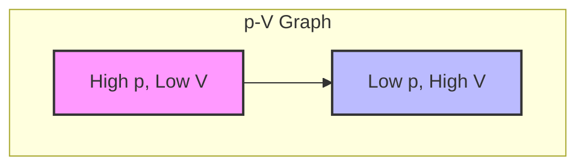
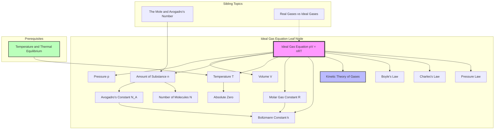

---
# 1. Overview / 概述

**English:**
The Ideal Gas Equation, $pV = nRT$, is the cornerstone of gas behaviour in thermal physics. It combines the three empirical gas laws ([[Boyle's Law, Charles's Law, and the Pressure Law]]) into a single, powerful relationship that links the pressure ($p$), volume ($V$), amount of substance ($n$), and absolute temperature ($T$) of an ideal gas. This equation is essential for predicting how a gas will respond to changes in its environment, from compressing a piston to heating a sealed container. It serves as the macroscopic bridge to the microscopic [[Kinetic Theory of Gases]] and is a fundamental tool for solving problems in thermodynamics and engineering.

**中文:**
理想气体状态方程 $pV = nRT$ 是热学中描述气体行为的基石。它将三个经验气体定律（[[玻意耳定律、查理定律和压力定律]]）合并为一个强大的关系式，将理想气体的压强 ($p$)、体积 ($V$)、物质的量 ($n$) 和绝对温度 ($T$) 联系起来。这个方程对于预测气体如何响应其环境变化（例如压缩活塞或加热密封容器）至关重要。它是连接宏观世界与微观[[气体动理论]]的桥梁，也是解决热力学和工程问题的基础工具。

---

# 2. Syllabus Learning Objectives / 考纲学习目标

| CAIE 9702 | Edexcel IAL |
|-----------|-------------|
| 11.1(a) Recall and use the equation of state of an ideal gas, $pV = nRT$. | 5.17 Use the ideal gas equation $pV = nRT$. |
| 11.1(b) Recall the relationship between the Boltzmann constant $k$ and the molar gas constant $R$, $R = N_A k$. | 5.18 Define the mole and Avogadro constant. |
| 11.1(c) Use the equation $pV = NkT$, where $N$ is the number of molecules. | 5.19 Use the equation $pV = NkT$. |
| 11.1(d) Convert temperatures between Celsius and Kelvin. | 5.20 Convert temperatures between Celsius and Kelvin. |
| 11.1(e) Understand that one mole of any substance contains $6.02 \times 10^{23}$ particles. | 5.21 Understand the significance of absolute zero. |
| 11.1(f) Understand that the internal energy of an ideal gas is solely the kinetic energy of its molecules. | 5.22 Use the ideal gas equation in problem-solving. |

**Examiner Expectations / 考官期望:**
- **English:** You must be able to recall and apply the equation in both forms ($pV = nRT$ and $pV = NkT$). You must be able to convert between Celsius and Kelvin temperatures. You must understand the relationship between $R$, $N_A$, and $k$.
- **中文:** 你必须能够回忆并应用方程的两种形式 ($pV = nRT$ 和 $pV = NkT$)。你必须能够在摄氏度和开尔文温度之间进行转换。你必须理解 $R$、$N_A$ 和 $k$ 之间的关系。

---

# 3. Core Definitions / 核心定义

| Term (EN/CN) | Definition (EN) | Definition (CN) | Common Mistakes / 常见错误 |
|--------------|-----------------|-----------------|---------------------------|
| **Ideal Gas** / 理想气体 | A theoretical gas whose molecules occupy negligible volume, have no intermolecular forces, and undergo perfectly elastic collisions. | 一种理论气体，其分子体积可忽略，分子间无作用力，碰撞完全弹性。 | Confusing it with a real gas; real gases deviate at high pressure and low temperature. |
| **Mole (mol)** / 摩尔 | The SI base unit for amount of substance. One mole contains exactly $6.02214076 \times 10^{23}$ elementary entities (Avogadro's number). | 物质的量的SI基本单位。1摩尔精确包含 $6.02214076 \times 10^{23}$ 个基本实体（阿伏伽德罗常数）。 | Forgetting that it applies to any entity (atoms, molecules, ions). |
| **Avogadro's Constant ($N_A$)** / 阿伏伽德罗常数 | The number of particles in one mole of a substance: $N_A = 6.02 \times 10^{23} \text{ mol}^{-1}$. | 一摩尔物质中所含的粒子数：$N_A = 6.02 \times 10^{23} \text{ mol}^{-1}$。 | Confusing $N_A$ (constant) with $N$ (number of molecules). |
| **Molar Gas Constant ($R$)** / 摩尔气体常数 | The constant of proportionality in the ideal gas equation: $R = 8.31 \text{ J mol}^{-1} \text{ K}^{-1}$. | 理想气体方程中的比例常数：$R = 8.31 \text{ J mol}^{-1} \text{ K}^{-1}$。 | Forgetting the units; it is energy per mole per Kelvin. |
| **Boltzmann Constant ($k$)** / 玻尔兹曼常数 | The gas constant per molecule: $k = \frac{R}{N_A} = 1.38 \times 10^{-23} \text{ J K}^{-1}$. | 每个分子的气体常数：$k = \frac{R}{N_A} = 1.38 \times 10^{-23} \text{ J K}^{-1}$。 | Confusing $k$ with $R$; $k$ is used when dealing with individual molecules. |
| **Absolute Temperature ($T$)** / 绝对温度 | Temperature measured on the Kelvin scale, starting at absolute zero ($-273.15^\circ\text{C}$). | 以开尔文温标测量的温度，从绝对零度 ($-273.15^\circ\text{C}$) 开始。 | Forgetting to convert Celsius to Kelvin before using in the equation. |

---

# 4. Key Concepts Explained / 关键概念详解

## 4.1 The Ideal Gas Equation / 理想气体状态方程

### Explanation / 解释
**English:** The ideal gas equation $pV = nRT$ is a state equation, meaning it relates the state variables of a gas at equilibrium. It is derived by combining Boyle's Law ($p \propto 1/V$ at constant $T$), Charles's Law ($V \propto T$ at constant $p$), and the Pressure Law ($p \propto T$ at constant $V$). The constant of proportionality is $nR$, where $n$ is the number of moles and $R$ is the molar gas constant. An alternative form, $pV = NkT$, is used when dealing with the number of molecules $N$ directly, where $k$ is the Boltzmann constant. This form is particularly useful when linking to the [[Kinetic Theory of Gases]].

**中文:** 理想气体状态方程 $pV = nRT$ 是一个状态方程，意味着它关联了气体在平衡状态下的状态变量。它由玻意耳定律（$T$ 恒定时 $p \propto 1/V$）、查理定律（$p$ 恒定时 $V \propto T$）和压力定律（$V$ 恒定时 $p \propto T$）结合推导而来。比例常数为 $nR$，其中 $n$ 是物质的量（摩尔数），$R$ 是摩尔气体常数。另一种形式 $pV = NkT$ 用于直接处理分子数 $N$ 时，其中 $k$ 是玻尔兹曼常数。这种形式在联系[[气体动理论]]时特别有用。

### Physical Meaning / 物理意义
**English:** The equation states that for a fixed amount of an ideal gas, the product of pressure and volume is directly proportional to its absolute temperature. Physically, increasing the temperature increases the average kinetic energy of the molecules, causing them to collide with the container walls more frequently and with greater force, thus increasing pressure (if volume is constant) or expanding the volume (if pressure is constant).

**中文:** 该方程表明，对于一定量的理想气体，压强和体积的乘积与其绝对温度成正比。从物理上讲，升高温度会增加分子的平均动能，使它们更频繁、更有力地撞击容器壁，从而增加压强（如果体积恒定）或膨胀体积（如果压强恒定）。

### Common Misconceptions / 常见误区
- **English:**
  - Thinking the equation only applies to monatomic gases. It applies to all ideal gases.
  - Forgetting that temperature must be in Kelvin.
  - Confusing $n$ (moles) with $N$ (number of molecules).
  - Assuming the gas constant $R$ changes value; it is a universal constant.
- **中文:**
  - 认为该方程只适用于单原子气体。它适用于所有理想气体。
  - 忘记温度必须使用开尔文单位。
  - 混淆 $n$（摩尔数）和 $N$（分子数）。
  - 假设气体常数 $R$ 会变化；它是一个普适常数。

### Exam Tips / 考试提示
- **English:** Always convert temperature to Kelvin ($T(K) = T(^\circ C) + 273.15$). Check the units of pressure (Pa) and volume (m³). If given in cm³, convert to m³ ($1 \text{ cm}^3 = 1 \times 10^{-6} \text{ m}^3$). If given in kPa, convert to Pa ($1 \text{ kPa} = 1000 \text{ Pa}$).
- **中文:** 始终将温度转换为开尔文 ($T(K) = T(^\circ C) + 273.15$)。检查压强 (Pa) 和体积 (m³) 的单位。如果给定 cm³，则转换为 m³ ($1 \text{ cm}^3 = 1 \times 10^{-6} \text{ m}^3$)。如果给定 kPa，则转换为 Pa ($1 \text{ kPa} = 1000 \text{ Pa}$)。

> 📷 **IMAGE PROMPT — EQN-01: Ideal Gas Equation Visual**
> A diagram showing a sealed container with gas molecules. The container has arrows indicating pressure (p) pushing outward on the walls, volume (V) as the internal space, and a thermometer showing temperature (T). A label shows "n moles" of gas inside. The equation pV = nRT is displayed prominently next to the container.

---

# 5. Essential Equations / 核心公式

## Equation 1: Molar Form / 摩尔形式

$$ pV = nRT $$

| Symbol (符号) | Meaning (EN) | Meaning (CN) | Unit (单位) |
|--------------|-------------|-------------|------------|
| $p$ | Pressure of the gas | 气体的压强 | Pa (Pascals) |
| $V$ | Volume of the gas | 气体的体积 | m³ |
| $n$ | Number of moles of gas | 气体的物质的量（摩尔数） | mol |
| $R$ | Molar gas constant ($8.31 \text{ J mol}^{-1} \text{ K}^{-1}$) | 摩尔气体常数 | J mol⁻¹ K⁻¹ |
| $T$ | Absolute temperature of the gas | 气体的绝对温度 | K (Kelvin) |

**Derivation / 推导:** Combined from Boyle's, Charles's, and Pressure laws.
**Conditions / 适用条件:** Ideal gas at low pressure and high temperature.
**Limitations / 局限性:** Fails for real gases at high pressure and low temperature.

## Equation 2: Molecular Form / 分子形式

$$ pV = NkT $$

| Symbol (符号) | Meaning (EN) | Meaning (CN) | Unit (单位) |
|--------------|-------------|-------------|------------|
| $p$ | Pressure of the gas | 气体的压强 | Pa |
| $V$ | Volume of the gas | 气体的体积 | m³ |
| $N$ | Number of molecules of gas | 气体的分子数 | (dimensionless) |
| $k$ | Boltzmann constant ($1.38 \times 10^{-23} \text{ J K}^{-1}$) | 玻尔兹曼常数 | J K⁻¹ |
| $T$ | Absolute temperature of the gas | 气体的绝对温度 | K |

**Derivation / 推导:** Since $n = N/N_A$ and $R = N_A k$, substituting into $pV = nRT$ gives $pV = (N/N_A) \times (N_A k) T = NkT$.
**Conditions / 适用条件:** Same as above.
**Limitations / 局限性:** Same as above.

## Equation 3: Relationship between Constants / 常数关系

$$ R = N_A k $$

| Symbol (符号) | Meaning (EN) | Meaning (CN) | Unit (单位) |
|--------------|-------------|-------------|------------|
| $R$ | Molar gas constant | 摩尔气体常数 | J mol⁻¹ K⁻¹ |
| $N_A$ | Avogadro's constant ($6.02 \times 10^{23} \text{ mol}^{-1}$) | 阿伏伽德罗常数 | mol⁻¹ |
| $k$ | Boltzmann constant | 玻尔兹曼常数 | J K⁻¹ |

> 📋 **CIE Only:** You are expected to recall and use the relationship $R = N_A k$.
> 📋 **Edexcel Only:** You are expected to use the relationship but may not need to recall it from memory.

---

# 6. Graphs and Relationships / 图表与关系

## 6.1 p-V Graph (Isotherm) / p-V 图（等温线）

### Axes / 坐标轴
- **X-axis:** Volume ($V$) / 体积 ($V$)
- **Y-axis:** Pressure ($p$) / 压强 ($p$)

### Shape / 形状
- **English:** A rectangular hyperbola. As volume increases, pressure decreases.
- **中文:** 一条双曲线。随着体积增加，压强减小。

### Gradient Meaning / 斜率含义
- **English:** The gradient is not constant. The product $pV$ is constant for a given temperature.
- **中文:** 斜率不是常数。对于给定温度，乘积 $pV$ 是常数。

### Area Meaning / 面积含义
- **English:** The area under the curve represents the work done by or on the gas.
- **中文:** 曲线下的面积表示气体对外做功或外界对气体做功。

### Exam Interpretation / 考试解读
- **English:** A family of curves at different temperatures shows that higher temperature curves are further from the origin (higher $pV$ product).
- **中文:** 不同温度下的一组曲线表明，温度越高的曲线离原点越远（$pV$ 乘积越大）。

> 📷 **IMAGE PROMPT — GRAPH-01: p-V Isotherms**
> A graph with pressure (p) on the y-axis and volume (V) on the x-axis. Three hyperbolic curves are shown, labeled T1, T2, and T3, with T3 > T2 > T1. Each curve shows p decreasing as V increases. The curves are further from the origin for higher temperatures.

---

# 7. Required Diagrams / 必备图表

## 7.1 p-V Diagram for an Ideal Gas / 理想气体的 p-V 图

### Description / 描述
- **English:** A graph showing the relationship between pressure and volume for an ideal gas at constant temperature (isothermal process). The curve is a rectangular hyperbola.
- **中文:** 显示理想气体在恒温（等温过程）下压强与体积关系的图表。曲线是一条双曲线。

### Image Prompt / 图片生成提示
> 📷 **IMAGE PROMPT — DIAG-01: p-V Isothermal Diagram**
> A clear, labeled graph with pressure (p) on the y-axis and volume (V) on the x-axis. A single hyperbolic curve is drawn, labeled "Isotherm at T = 300 K". The axes are labeled with units (Pa and m³). A point on the curve is marked with coordinates (p1, V1). The area under the curve is shaded to indicate work done.

### Labels Required / 需要标注
- **English:** Axes (p, V), Curve (Isotherm), Point (p1, V1), Shaded area (Work done).
- **中文:** 坐标轴 (p, V)、曲线 (等温线)、点 (p1, V1)、阴影区域 (做功)。

### Exam Importance / 考试重要性
- **English:** High. Understanding the shape and meaning of the p-V graph is crucial for interpreting thermodynamic processes.
- **中文:** 高。理解 p-V 图的形状和含义对于解释热力学过程至关重要。

---

# 8. Worked Examples / 典型例题

## Example 1: Calculating Moles / 计算摩尔数

### Question / 题目
**English:** A gas cylinder has a volume of $0.025 \text{ m}^3$ and contains gas at a pressure of $2.0 \times 10^5 \text{ Pa}$ and a temperature of $27^\circ\text{C}$. Calculate the number of moles of gas in the cylinder. ($R = 8.31 \text{ J mol}^{-1} \text{ K}^{-1}$)
**中文:** 一个气瓶的体积为 $0.025 \text{ m}^3$，内部气体压强为 $2.0 \times 10^5 \text{ Pa}$，温度为 $27^\circ\text{C}$。计算气瓶中气体的摩尔数。（$R = 8.31 \text{ J mol}^{-1} \text{ K}^{-1}$）

### Solution / 解答
1. **Convert temperature to Kelvin / 将温度转换为开尔文:**
   $$ T = 27 + 273.15 = 300.15 \text{ K} \approx 300 \text{ K} $$
2. **Use the ideal gas equation / 使用理想气体状态方程:**
   $$ pV = nRT $$
3. **Rearrange for $n$ / 解出 $n$:**
   $$ n = \frac{pV}{RT} $$
4. **Substitute values / 代入数值:**
   $$ n = \frac{(2.0 \times 10^5) \times (0.025)}{8.31 \times 300} $$
5. **Calculate / 计算:**
   $$ n = \frac{5000}{2493} \approx 2.01 \text{ mol} $$

### Final Answer / 最终答案
**Answer:** $n \approx 2.0 \text{ mol}$ | **答案：** $n \approx 2.0 \text{ mol}$

### Quick Tip / 提示
- **English:** Always convert Celsius to Kelvin first. Use $T(K) = T(^\circ C) + 273$.
- **中文:** 始终先将摄氏度转换为开尔文。使用 $T(K) = T(^\circ C) + 273$。

## Example 2: Using the Molecular Form / 使用分子形式

### Question / 题目
**English:** A container holds $1.5 \times 10^{24}$ molecules of an ideal gas at a temperature of $400 \text{ K}$ and a pressure of $1.0 \times 10^5 \text{ Pa}$. Calculate the volume of the container. ($k = 1.38 \times 10^{-23} \text{ J K}^{-1}$)
**中文:** 一个容器装有 $1.5 \times 10^{24}$ 个理想气体分子，温度为 $400 \text{ K}$，压强为 $1.0 \times 10^5 \text{ Pa}$。计算容器的体积。（$k = 1.38 \times 10^{-23} \text{ J K}^{-1}$）

### Solution / 解答
1. **Use the molecular form / 使用分子形式:**
   $$ pV = NkT $$
2. **Rearrange for $V$ / 解出 $V$:**
   $$ V = \frac{NkT}{p} $$
3. **Substitute values / 代入数值:**
   $$ V = \frac{(1.5 \times 10^{24}) \times (1.38 \times 10^{-23}) \times 400}{1.0 \times 10^5} $$
4. **Calculate / 计算:**
   $$ V = \frac{(1.5 \times 1.38 \times 400) \times 10^{1}}{1.0 \times 10^5} = \frac{828 \times 10^{1}}{1.0 \times 10^5} = \frac{8280}{100000} = 0.0828 \text{ m}^3 $$

### Final Answer / 最终答案
**Answer:** $V = 0.083 \text{ m}^3$ | **答案：** $V = 0.083 \text{ m}^3$

### Quick Tip / 提示
- **English:** When using $pV = NkT$, ensure $N$ is the number of molecules, not moles.
- **中文:** 使用 $pV = NkT$ 时，确保 $N$ 是分子数，而不是摩尔数。

---

# 9. Past Paper Question Types / 历年真题题型

| Question Type / 题型 | Frequency / 频率 | Difficulty / 难度 | Past Paper References / 真题索引 |
|----------------------|------------------|------------------|-------------------------------|
| Direct substitution into $pV = nRT$ | Very High | Easy | 📝 *待填入* |
| Converting Celsius to Kelvin | Very High | Easy | 📝 *待填入* |
| Using $pV = NkT$ to find number of molecules | High | Medium | 📝 *待填入* |
| Combining with density or mass | Medium | Medium | 📝 *待填入* |
| Relating $R$, $N_A$, and $k$ | Medium | Medium | 📝 *待填入* |
| Multi-step problems (e.g., finding moles then molecules) | High | Medium-Hard | 📝 *待填入* |

**Common Command Words / 常见指令词:**
- **English:** Calculate, Determine, Show that, State, Use, Derive.
- **中文:** 计算、确定、证明、写出、使用、推导。

---

# 10. Practical Skills Connections / 实验技能链接

**English:**
This sub-topic connects to practical work in several ways:
- **Measurements:** You may need to measure pressure (using a pressure sensor or manometer), volume (using a gas syringe or measuring cylinder), and temperature (using a thermometer or temperature sensor).
- **Uncertainties:** When calculating $n$ or $N$, you must propagate uncertainties from the measured values of $p$, $V$, and $T$.
- **Graph Plotting:** Plotting $p$ against $1/V$ should yield a straight line through the origin, verifying Boyle's Law. The gradient is $nRT$.
- **Experimental Design:** You could design an experiment to determine the value of $R$ by measuring $p$, $V$, $T$, and $n$ for a gas.

**中文:**
本子知识点通过以下几种方式与实验工作相联系：
- **测量：** 你可能需要测量压强（使用压强传感器或压力计）、体积（使用气体注射器或量筒）和温度（使用温度计或温度传感器）。
- **不确定度：** 在计算 $n$ 或 $N$ 时，你必须从 $p$、$V$ 和 $T$ 的测量值中传播不确定度。
- **图表绘制：** 绘制 $p$ 与 $1/V$ 的关系图应得到一条通过原点的直线，验证玻意耳定律。斜率为 $nRT$。
- **实验设计：** 你可以设计一个实验，通过测量气体的 $p$、$V$、$T$ 和 $n$ 来确定 $R$ 的值。

---

# 11. Concept Map / 概念图谱

---

# 12. Quick Revision Sheet / 速查表

| Category / 类别 | Key Points / 要点 |
|----------------|------------------|
| **Definition / 定义** | $pV = nRT$ relates pressure, volume, moles, and temperature for an ideal gas. |
| **Key Formula / 核心公式** | $pV = nRT$ (molar form) and $pV = NkT$ (molecular form). |
| **Key Constants / 核心常数** | $R = 8.31 \text{ J mol}^{-1} \text{ K}^{-1}$, $k = 1.38 \times 10^{-23} \text{ J K}^{-1}$, $N_A = 6.02 \times 10^{23} \text{ mol}^{-1}$. |
| **Key Relationship / 关键关系** | $R = N_A k$. |
| **Key Graph / 核心图表** | p-V graph: rectangular hyperbola (isotherm). p vs 1/V: straight line through origin. |
| **Unit Conversion / 单位转换** | $T(K) = T(^\circ C) + 273.15$. $1 \text{ cm}^3 = 1 \times 10^{-6} \text{ m}^3$. $1 \text{ kPa} = 1000 \text{ Pa}$. |
| **Exam Tip / 考试提示** | Always convert to SI units (Pa, m³, K) before substituting into the equation. |
| **Common Mistake / 常见错误** | Forgetting to convert Celsius to Kelvin. Confusing $n$ (moles) with $N$ (molecules). |