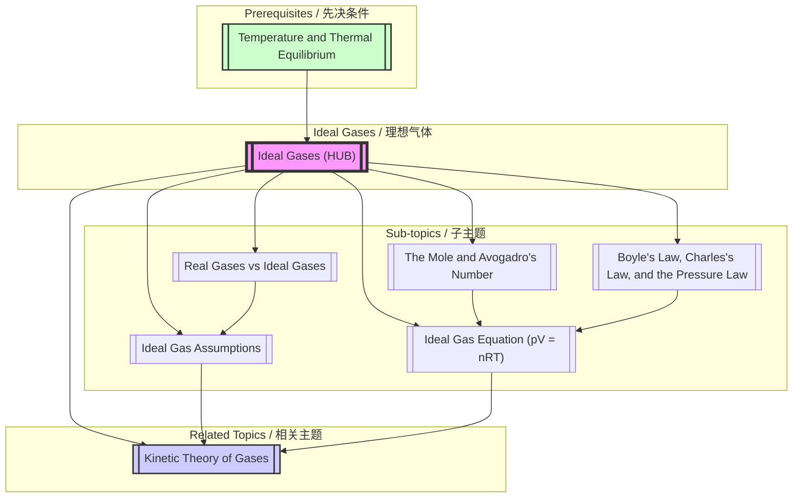

# 1. Overview / 概述

**English:**
This topic, **Ideal Gases**, is a cornerstone of thermal physics at the A-Level. It introduces a simplified model of a gas—the **ideal gas**—which obeys a set of precise mathematical relationships. The core of this topic is the **Ideal Gas Equation**, $pV = nRT$, which links the macroscopic properties of a gas: pressure ($p$), volume ($V$), amount of substance ($n$), and absolute temperature ($T$). We will also explore the historical gas laws (Boyle's, Charles's, and the Pressure Law) that are special cases of this equation.

Understanding ideal gases is crucial because it bridges the macroscopic world we observe (pressure in a tyre, a hot air balloon rising) with the microscopic world of atoms and molecules. This topic directly feeds into the [[Kinetic Theory of Gases]], which explains these macroscopic behaviours in terms of particle motion. Real-world applications are vast, including the operation of internal combustion engines, refrigeration cycles, weather balloons, and even the behaviour of the Earth's atmosphere.

In the Cambridge 9702 and Edexcel IAL examinations, this is a high-frequency topic. You will be expected to perform calculations using the ideal gas equation, interpret and sketch graphs (e.g., $p$ vs $V$), and understand the limitations of the ideal gas model. A strong grasp of [[Temperature and Thermal Equilibrium]] is essential, as all gas law calculations require temperature in Kelvin.

**中文：**
本主题 **理想气体** 是 A-Level 热物理学的基石。它引入了一个简化的气体模型——**理想气体**——该模型遵循一组精确的数学关系。本主题的核心是 **理想气体方程** $pV = nRT$，它联系了气体的宏观性质：压强 ($p$)、体积 ($V$)、物质的量 ($n$) 和绝对温度 ($T$)。我们还将探讨历史上的气体定律（玻意耳定律、查理定律和压强定律），它们是该方程的特例。

理解理想气体至关重要，因为它将我们观察到的宏观世界（轮胎中的压强、热气球上升）与原子和分子的微观世界联系起来。本主题直接为 [[气体动理论]] 提供基础，该理论从粒子运动的角度解释了这些宏观行为。其实际应用非常广泛，包括内燃机的运行、制冷循环、气象气球，甚至地球大气的行为。

在剑桥 9702 和爱德思 IAL 考试中，这是一个高频主题。你需要能够使用理想气体方程进行计算，解释和绘制图表（例如，$p$ 与 $V$ 的关系图），并理解理想气体模型的局限性。扎实掌握 [[温度与热平衡]] 至关重要，因为所有气体定律的计算都需要使用开尔文温度。

---

# 2. Syllabus Learning Objectives / 考纲学习目标

**English:**
The following table outlines the specific learning objectives from the Cambridge 9702 and Edexcel IAL syllabuses for this topic. These are the exact statements examiners use to set questions.

**中文：**
下表概述了剑桥 9702 和爱德思 IAL 考纲中关于本主题的具体学习目标。这些是考官用来设置问题的确切陈述。

| CAIE 9702 (11.1) | Edexcel IAL (WPH11 U1: 5.17-5.22) |
|-----------|-------------|
| (a) State the basic assumptions of the kinetic model of an ideal gas. | 5.17 Know that an ideal gas is one that obeys the gas laws at all pressures and temperatures. |
| (b) Explain how molecular movement causes the pressure exerted by a gas. | 5.18 Use the equation of state of an ideal gas, expressed as $pV = nRT$. |
| (c) Derive the relationship $pV = \frac{1}{3} N m \langle c^2 \rangle$. | 5.19 Use the equation $pV = \frac{1}{3} N m \langle c^2 \rangle$. |
| (d) Recall and use the ideal gas equation $pV = nRT$. | 5.20 Define the Avogadro constant $N_A$. |
| (e) Define the Avogadro constant $N_A$. | 5.21 Use the molar gas constant $R$ and the Boltzmann constant $k = R/N_A$. |
| (f) Show an understanding of the significance of the Boltzmann constant $k$. | 5.22 Use the equation $\frac{1}{2} m \langle c^2 \rangle = \frac{3}{2} kT$. |

> 📋 **CIE Only:** The derivation of $pV = \frac{1}{3} N m \langle c^2 \rangle$ is explicitly required. You must be able to reproduce it step-by-step.
>
> 📋 **Edexcel Only:** The syllabus explicitly mentions using the Boltzmann constant $k$ to link the average kinetic energy of a molecule to temperature. The derivation of $pV = \frac{1}{3} N m \langle c^2 \rangle$ is not required for derivation but must be used in calculations.

**Examiner Expectations / 考官期望:**
- **English:** You must be able to recall and apply the ideal gas equation in a wide variety of contexts. Pay close attention to units: pressure in Pascals (Pa), volume in $m^3$, temperature in Kelvin (K). For calculations involving the Boltzmann constant, you must be able to convert between $n$ (moles) and $N$ (number of molecules).
- **中文：** 你必须能够在各种情境中回忆并应用理想气体方程。特别注意单位：压强用帕斯卡 (Pa)，体积用 $m^3$，温度用开尔文 (K)。对于涉及玻尔兹曼常数的计算，你必须能够在 $n$（摩尔数）和 $N$（分子数）之间进行转换。

---

# 3. Core Definitions / 核心定义

**English:**
The following table provides the official definitions for key terms in this topic. Memorising these exact wordings is crucial for securing marks on definition questions.

**中文：**
下表提供了本主题关键术语的官方定义。记住这些确切的措辞对于在定义题上获得分数至关重要。

| Term (EN/CN) | Definition (EN) | Definition (CN) | Common Mistakes / 常见错误 |
|--------------|-----------------|-----------------|---------------------------|
| **Ideal Gas / 理想气体** | A gas that obeys the gas laws (Boyle's law, Charles's law, and the pressure law) at all pressures and temperatures. | 在所有压强和温度下都遵守气体定律（玻意耳定律、查理定律和压强定律）的气体。 | Saying it "obeys $pV = nRT$" is circular. The definition is about obeying the *gas laws*, from which $pV = nRT$ is derived. |
| **Mole / 摩尔** | The amount of substance that contains as many elementary entities as there are atoms in 0.012 kg of carbon-12. | 含有与 0.012 千克碳-12 中原子数目相同的基本实体数的物质的量。 | Forgetting the reference to carbon-12. |
| **Avogadro Constant ($N_A$) / 阿伏伽德罗常数** | The number of atoms in 0.012 kg of carbon-12. Its value is $6.02 \times 10^{23} \text{ mol}^{-1}$. | 0.012 千克碳-12 中的原子数。其值为 $6.02 \times 10^{23} \text{ mol}^{-1}$。 | Confusing it with the number of molecules in one mole. It is the number of *entities* (atoms, molecules, ions, etc.) per mole. |
| **Molar Gas Constant ($R$) / 摩尔气体常数** | The constant of proportionality in the ideal gas equation $pV = nRT$. Its value is $8.31 \text{ J mol}^{-1} \text{ K}^{-1}$. | 理想气体方程 $pV = nRT$ 中的比例常数。其值为 $8.31 \text{ J mol}^{-1} \text{ K}^{-1}$。 | Forgetting its units. It is NOT a universal constant for all gases; it is a constant for *ideal* gases. |
| **Boltzmann Constant ($k$) / 玻尔兹曼常数** | The gas constant per molecule. It is defined as $k = R / N_A$. Its value is $1.38 \times 10^{-23} \text{ J K}^{-1}$. | 每个分子的气体常数。定义为 $k = R / N_A$。其值为 $1.38 \times 10^{-23} \text{ J K}^{-1}$。 | Confusing it with $R$. Remember: $k$ is for a single molecule, $R$ is for one mole. |
| **Absolute Temperature / 绝对温度** | Temperature measured on the Kelvin scale, where 0 K is absolute zero, the temperature at which all molecular motion ceases. | 以开尔文温标测量的温度，其中 0 K 是绝对零度，即所有分子运动停止的温度。 | Not converting Celsius to Kelvin ($T(K) = T(°C) + 273.15$). |
| **Mean Square Speed ($\langle c^2 \rangle$) / 均方速率** | The average of the squares of the speeds of the molecules in a gas. | 气体分子速度平方的平均值。 | Confusing it with the square of the mean speed ($\langle c \rangle^2$). They are different. |
| **Root Mean Square (r.m.s.) Speed ($c_{rms}$) / 方均根速率** | The square root of the mean square speed: $c_{rms} = \sqrt{\langle c^2 \rangle}$. | 均方速率的平方根：$c_{rms} = \sqrt{\langle c^2 \rangle}$。 | Forgetting to take the square root. |

---

# 4. Key Concepts Explained / 关键概念详解

## 4.1 The Mole and Avogadro's Number / 摩尔与阿伏伽德罗常数

### Explanation / 解释
**English:** The mole is a fundamental SI unit for the amount of substance. It allows us to count particles (atoms, molecules, ions) by weighing a macroscopic sample. The [[Avogadro Constant]] $N_A = 6.02 \times 10^{23} \text{ mol}^{-1}$ is the number of particles in one mole of any substance. The number of moles $n$ is related to the number of particles $N$ by $n = N / N_A$. This is the bridge between the microscopic world (individual molecules) and the macroscopic world (moles of gas).

**中文：** 摩尔是物质的量的基本国际单位制单位。它允许我们通过称量宏观样本来计数粒子（原子、分子、离子）。[[阿伏伽德罗常数]] $N_A = 6.02 \times 10^{23} \text{ mol}^{-1}$ 是一摩尔任何物质中的粒子数。摩尔数 $n$ 与粒子数 $N$ 的关系为 $n = N / N_A$。这是微观世界（单个分子）和宏观世界（摩尔气体）之间的桥梁。

### Physical Meaning / 物理意义
**English:** If you have one mole of gas, you have $6.02 \times 10^{23}$ molecules. This is an astronomically large number, which is why we use the mole as a convenient counting unit.

**中文：** 如果你有一摩尔气体，你就有 $6.02 \times 10^{23}$ 个分子。这是一个天文数字，这就是为什么我们使用摩尔作为一个方便的计数单位。

### Common Misconceptions / 常见误区
- **English:** Thinking that one mole of different gases has a different number of molecules. (False: one mole of *any* substance has $N_A$ entities).
- **中文：** 认为一摩尔不同气体具有不同数量的分子。（错误：一摩尔 *任何* 物质都有 $N_A$ 个实体）。

### Exam Tips / 考试提示
**English:** You will often need to calculate the number of molecules $N$ from a given mass. Use $n = \text{mass} / \text{molar mass}$, then $N = n \times N_A$.
**中文：** 你通常需要根据给定的质量计算分子数 $N$。使用 $n = \text{质量} / \text{摩尔质量}$，然后 $N = n \times N_A$。

---

## 4.2 The Ideal Gas Equation ($pV = nRT$) / 理想气体方程

### Explanation / 解释
**English:** This is the equation of state for an ideal gas. It relates the four state variables: pressure ($p$), volume ($V$), amount of substance ($n$), and absolute temperature ($T$). $R$ is the [[Molar Gas Constant]] ($8.31 \text{ J mol}^{-1} \text{ K}^{-1}$). This equation is a combination of the three historical gas laws. It is crucial to remember that $T$ must be in Kelvin.

**中文：** 这是理想气体的状态方程。它联系了四个状态变量：压强 ($p$)、体积 ($V$)、物质的量 ($n$) 和绝对温度 ($T$)。$R$ 是 [[摩尔气体常数]] ($8.31 \text{ J mol}^{-1} \text{ K}^{-1}$)。该方程是三个历史气体定律的组合。务必记住 $T$ 必须以开尔文为单位。

### Physical Meaning / 物理意义
**English:** If you heat a gas in a fixed volume, its pressure increases. If you compress a gas at a constant temperature, its pressure increases. The equation quantifies these relationships.

**中文：** 如果你在固定体积下加热气体，其压强会增加。如果你在恒定温度下压缩气体，其压强会增加。该方程量化了这些关系。

### Common Misconceptions / 常见误区
- **English:** Forgetting to convert Celsius to Kelvin.
- **中文：** 忘记将摄氏度转换为开尔文。
- **English:** Using the wrong value of $R$ or forgetting its units.
- **中文：** 使用错误的 $R$ 值或忘记其单位。
- **English:** Confusing $n$ (moles) with $N$ (number of molecules).
- **中文：** 混淆 $n$（摩尔数）和 $N$（分子数）。

### Exam Tips / 考试提示
**English:** When a gas changes from one state to another (e.g., heated at constant pressure), use the combined gas law: $\frac{p_1 V_1}{T_1} = \frac{p_2 V_2}{T_2}$. This avoids needing to calculate $n$ and $R$.
**中文：** 当气体从一个状态变为另一个状态时（例如，在恒压下加热），使用组合气体定律：$\frac{p_1 V_1}{T_1} = \frac{p_2 V_2}{T_2}$。这避免了计算 $n$ 和 $R$ 的需要。

> 📷 **IMAGE PROMPT — IG01: p-V-T Surface for an Ideal Gas**
>
> A 3D isometric diagram showing a smooth, curved surface representing the relationship between pressure (p, z-axis), volume (V, x-axis), and temperature (T, y-axis) for an ideal gas. The surface should be a hyperbolic paraboloid shape. Include labelled axes with units. Use a clean, scientific illustration style with a white background. Show several constant temperature (isothermal) lines on the surface as dashed curves.

---

## 4.3 Boyle's Law, Charles's Law, and the Pressure Law / 玻意耳定律、查理定律和压强定律

### Explanation / 解释
**English:** These are the three historical gas laws that are special cases of the ideal gas equation.
- **[[Boyle's Law]]:** For a fixed mass of gas at constant temperature, pressure is inversely proportional to volume: $p \propto 1/V$ or $pV = \text{constant}$.
- **[[Charles's Law]]:** For a fixed mass of gas at constant pressure, volume is directly proportional to absolute temperature: $V \propto T$ or $V/T = \text{constant}$.
- **[[Pressure Law]]:** For a fixed mass of gas at constant volume, pressure is directly proportional to absolute temperature: $p \propto T$ or $p/T = \text{constant}$.

**中文：** 这是三个历史气体定律，它们是理想气体方程的特例。
- **[[玻意耳定律]]：** 对于恒定温度下固定质量的气体，压强与体积成反比：$p \propto 1/V$ 或 $pV = \text{常数}$。
- **[[查理定律]]：** 对于恒定压强下固定质量的气体，体积与绝对温度成正比：$V \propto T$ 或 $V/T = \text{常数}$。
- **[[压强定律]]：** 对于恒定体积下固定质量的气体，压强与绝对温度成正比：$p \propto T$ 或 $p/T = \text{常数}$。

### Physical Meaning / 物理意义
**English:** These laws describe everyday phenomena. A bicycle pump gets hot when you compress air (Boyle's Law + work done). A hot air balloon expands when heated (Charles's Law). A car tyre pressure increases on a hot day (Pressure Law).

**中文：** 这些定律描述了日常现象。当你压缩空气时，自行车打气筒会变热（玻意耳定律 + 做功）。热气球受热时膨胀（查理定律）。汽车轮胎在炎热天气下胎压升高（压强定律）。

### Common Misconceptions / 常见误区
- **English:** Forgetting that these laws only apply to a *fixed mass* of gas.
- **中文：** 忘记这些定律仅适用于 *固定质量* 的气体。
- **English:** Using Celsius instead of Kelvin in Charles's Law and the Pressure Law.
- **中文：** 在查理定律和压强定律中使用摄氏度而不是开尔文。

### Exam Tips / 考试提示
**English:** Be prepared to sketch graphs for these laws. For Boyle's Law, a $p$ vs $V$ graph is a hyperbola, but a $p$ vs $1/V$ graph is a straight line through the origin.
**中文：** 准备好为这些定律绘制草图。对于玻意耳定律，$p$ 与 $V$ 的关系图是双曲线，但 $p$ 与 $1/V$ 的关系图是通过原点的直线。

---

## 4.4 The Kinetic Theory Equation ($pV = \frac{1}{3} N m \langle c^2 \rangle$) / 气体动理论方程

### Explanation / 解释
**English:** This equation links the macroscopic property of pressure to the microscopic motion of molecules. $N$ is the number of molecules, $m$ is the mass of one molecule, and $\langle c^2 \rangle$ is the [[Mean Square Speed]]. It is derived from the assumptions of the [[Kinetic Theory of Gases]]. This equation shows that pressure is due to the average force exerted by molecules colliding with the container walls.

**中文：** 该方程将压强的宏观性质与分子的微观运动联系起来。$N$ 是分子数，$m$ 是一个分子的质量，$\langle c^2 \rangle$ 是 [[均方速率]]。它源自 [[气体动理论]] 的假设。该方程表明压强是由分子与容器壁碰撞所产生的平均力引起的。

### Physical Meaning / 物理意义
**English:** If you increase the average speed of molecules (by heating the gas), the pressure increases. If you put more molecules into the same volume, the pressure also increases.

**中文：** 如果你增加分子的平均速率（通过加热气体），压强就会增加。如果你在相同体积中放入更多分子，压强也会增加。

### Common Misconceptions / 常见误区
- **English:** Confusing $\langle c^2 \rangle$ with $c_{rms}$. Remember: $c_{rms} = \sqrt{\langle c^2 \rangle}$.
- **中文：** 混淆 $\langle c^2 \rangle$ 与 $c_{rms}$。记住：$c_{rms} = \sqrt{\langle c^2 \rangle}$。
- **English:** Forgetting that $m$ is the mass of a *single* molecule, not the total mass of the gas.
- **中文：** 忘记 $m$ 是 *单个* 分子的质量，而不是气体的总质量。

### Exam Tips / 考试提示
**English:** For CIE, you must be able to derive this equation. For Edexcel, you must be able to use it in calculations. A common question is to combine it with $pV = nRT$ to find the average kinetic energy of a molecule.
**中文：** 对于 CIE，你必须能够推导出这个方程。对于爱德思，你必须能够在计算中使用它。一个常见的问题是将其与 $pV = nRT$ 结合，以求出分子的平均动能。

---

## 4.5 The Boltzmann Constant and Molecular Kinetic Energy / 玻尔兹曼常数与分子动能

### Explanation / 解释
**English:** The [[Boltzmann Constant]] $k = R/N_A = 1.38 \times 10^{-23} \text{ J K}^{-1}$ is the gas constant per molecule. By combining $pV = nRT$ and $pV = \frac{1}{3} N m \langle c^2 \rangle$, we can derive a crucial relationship: $\frac{1}{2} m \langle c^2 \rangle = \frac{3}{2} kT$. This states that the average translational kinetic energy of a single molecule is directly proportional to the absolute temperature.

**中文：** [[玻尔兹曼常数]] $k = R/N_A = 1.38 \times 10^{-23} \text{ J K}^{-1}$ 是每个分子的气体常数。通过结合 $pV = nRT$ 和 $pV = \frac{1}{3} N m \langle c^2 \rangle$，我们可以推导出一个关键关系：$\frac{1}{2} m \langle c^2 \rangle = \frac{3}{2} kT$。这表明单个分子的平均平动动能与绝对温度成正比。

### Physical Meaning / 物理意义
**English:** Temperature is a measure of the average kinetic energy of the molecules in a substance. At absolute zero (0 K), all molecular motion ceases, and the kinetic energy is zero.

**中文：** 温度是物质中分子平均动能的量度。在绝对零度 (0 K) 时，所有分子运动停止，动能为零。

### Common Misconceptions / 常见误区
- **English:** Thinking that all molecules have the same speed at a given temperature. The equation gives the *average* kinetic energy; individual molecules have a range of speeds (Maxwell-Boltzmann distribution).
- **中文：** 认为在给定温度下所有分子都具有相同的速率。该方程给出的是 *平均* 动能；单个分子具有一系列速率（麦克斯韦-玻尔兹曼分布）。

### Exam Tips / 考试提示
**English:** This is a very common equation for calculation questions. You can be asked to find the r.m.s. speed of a molecule given its mass and the temperature. Remember to use $m$ in kg.
**中文：** 这是一个在计算题中非常常见的方程。你可能会被要求根据分子的质量和温度求出其方均根速率。记住使用以千克为单位的 $m$。

---

## 4.6 Assumptions of the Kinetic Theory of an Ideal Gas / 理想气体动理论的假设

### Explanation / 解释
**English:** The kinetic theory model is based on several simplifying assumptions about the gas molecules. These assumptions are necessary to derive the equation $pV = \frac{1}{3} N m \langle c^2 \rangle$. The key assumptions are:
1.  **Large Number of Molecules:** The gas contains a very large number of molecules.
2.  **Negligible Volume:** The volume of the molecules themselves is negligible compared to the volume of the container.
3.  **Random Motion:** The molecules are in continuous, random motion.
4.  **Elastic Collisions:** Collisions between molecules and with the container walls are perfectly elastic (no kinetic energy is lost).
5.  **No Intermolecular Forces:** There are no forces of attraction or repulsion between the molecules, except during collisions.
6.  **Newtonian Mechanics:** The motion of the molecules obeys Newton's laws of motion.
7.  **Collision Duration is Negligible:** The time of a collision is negligible compared to the time between collisions.

**中文：** 气体动理论模型基于关于气体分子的几个简化假设。这些假设对于推导方程 $pV = \frac{1}{3} N m \langle c^2 \rangle$ 是必要的。关键假设包括：
1.  **大量分子：** 气体包含非常大量的分子。
2.  **体积可忽略：** 分子本身的体积与容器的体积相比可以忽略不计。
3.  **随机运动：** 分子处于连续、随机的运动中。
4.  **弹性碰撞：** 分子之间以及与容器壁的碰撞是完全弹性的（没有动能损失）。
5.  **无分子间作用力：** 除了碰撞期间，分子之间没有吸引力或排斥力。
6.  **牛顿力学：** 分子的运动遵循牛顿运动定律。
7.  **碰撞持续时间可忽略：** 碰撞时间与碰撞之间的时间相比可以忽略不计。

### Physical Meaning / 物理意义
**English:** These assumptions create a "perfect" gas. Real gases deviate from this behaviour, especially at high pressures and low temperatures, where the assumptions of negligible volume and no intermolecular forces break down.

**中文：** 这些假设创造了一种“完美”的气体。真实气体会偏离这种行为，特别是在高压和低温下，此时体积可忽略和无分子间作用力的假设不再成立。

### Common Misconceptions / 常见误区
- **English:** Thinking that the assumptions are always true for real gases. They are only approximations.
- **中文：** 认为这些假设对于真实气体总是成立。它们只是近似。
- **English:** Forgetting to mention "elastic collisions" when listing assumptions.
- **中文：** 在列出假设时忘记提及“弹性碰撞”。

### Exam Tips / 考试提示
**English:** You will be asked to state these assumptions in an exam. Memorise them. A common question is to explain how a particular assumption is used in the derivation of $pV = \frac{1}{3} N m \langle c^2 \rangle$.
**中文：** 你将被要求在考试中陈述这些假设。记住它们。一个常见问题是解释某个特定假设如何用于推导 $pV = \frac{1}{3} N m \langle c^2 \rangle$。

---

## 4.7 Real Gases vs Ideal Gases / 真实气体与理想气体

### Explanation / 解释
**English:** An [[Ideal Gas]] is a theoretical concept. [[Real Gases]] deviate from ideal behaviour under certain conditions. The main reasons for deviation are:
1.  **Intermolecular Forces:** At low temperatures and high pressures, molecules are close enough for attractive forces (van der Waals forces) to become significant. This reduces the pressure exerted by the gas compared to an ideal gas.
2.  **Finite Molecular Volume:** At very high pressures, the volume of the molecules themselves becomes a significant fraction of the total volume. This means the available volume for the gas to move in is less than the container volume.

**中文：** [[理想气体]] 是一个理论概念。[[真实气体]] 在某些条件下会偏离理想行为。偏离的主要原因有：
1.  **分子间作用力：** 在低温和高压下，分子足够接近，吸引力（范德华力）变得显著。与理想气体相比，这会降低气体施加的压强。
2.  **有限的分子体积：** 在非常高的压力下，分子本身的体积占总体积的很大一部分。这意味着气体可移动的有效体积小于容器体积。

### Physical Meaning / 物理意义
**English:** The ideal gas equation is a good approximation for most gases at room temperature and atmospheric pressure. It becomes less accurate for gases that are easily liquefied (e.g., steam, carbon dioxide) or at extreme conditions.

**中文：** 理想气体方程对于室温常压下的大多数气体是一个很好的近似。对于容易液化的气体（例如，水蒸气、二氧化碳）或在极端条件下，它的准确性会降低。

### Common Misconceptions / 常见误区
- **English:** Thinking that real gases never obey the ideal gas equation. They do under many common conditions.
- **中文：** 认为真实气体从不遵守理想气体方程。它们在许多常见条件下是遵守的。

### Exam Tips / 考试提示
**English:** You may be asked to explain why a real gas deviates from ideal behaviour at high pressure. The key is to mention both the effect of intermolecular forces and the finite volume of molecules.
**中文：** 你可能会被要求解释为什么真实气体在高压下会偏离理想行为。关键是同时提到分子间作用力的影响和分子有限体积的影响。

---

# 5. Essential Equations / 核心公式

## 5.1 The Mole and Number of Particles / 摩尔与粒子数

**Equation / 公式:**
$$ n = \frac{N}{N_A} $$

**Variables / 变量:**
| Symbol (符号) | Meaning (EN) | Meaning (CN) | Unit (单位) |
|--------------|-------------|-------------|------------|
| $n$ | Number of moles | 摩尔数 | mol |
| $N$ | Number of particles (molecules/atoms) | 粒子数（分子/原子） | - |
| $N_A$ | Avogadro constant ($6.02 \times 10^{23} \text{ mol}^{-1}$) | 阿伏伽德罗常数 | $\text{mol}^{-1}$ |

**Derivation / 推导:**
**English:** This is a definition. The Avogadro constant is defined as the number of entities per mole.
**中文：** 这是一个定义。阿伏伽德罗常数被定义为每摩尔的实体数。

**Conditions / 适用条件:**
**English:** Applies to any substance.
**中文：** 适用于任何物质。

**Limitations / 局限性:**
**English:** None.
**中文：** 无。

**Rearrangements / 变形:**
$$ N = n N_A $$
$$ N_A = \frac{N}{n} $$

---

## 5.2 The Ideal Gas Equation / 理想气体方程

**Equation / 公式:**
$$ pV = nRT $$

**Variables / 变量:**
| Symbol (符号) | Meaning (EN) | Meaning (CN) | Unit (单位) |
|--------------|-------------|-------------|------------|
| $p$ | Pressure of the gas | 气体的压强 | Pa (or N m$^{-2}$) |
| $V$ | Volume of the gas | 气体的体积 | m$^3$ |
| $n$ | Number of moles of gas | 气体的摩尔数 | mol |
| $R$ | Molar gas constant ($8.31 \text{ J mol}^{-1} \text{ K}^{-1}$) | 摩尔气体常数 | J mol$^{-1}$ K$^{-1}$ |
| $T$ | Absolute temperature of the gas | 气体的绝对温度 | K |

**Derivation / 推导:**
**English:** The equation is an empirical law, combining Boyle's Law ($pV = \text{constant}$), Charles's Law ($V/T = \text{constant}$), and Avogadro's Law ($V/n = \text{constant}$). It is not derived from first principles but is a statement of experimental fact.
**中文：** 该方程是一个经验定律，结合了玻意耳定律 ($pV = \text{常数}$)、查理定律 ($V/T = \text{常数}$) 和阿伏伽德罗定律 ($V/n = \text{常数}$)。它不是从基本原理推导出来的，而是实验事实的陈述。

**Conditions / 适用条件:**
**English:** Only applies to an ideal gas. It is a good approximation for real gases at low pressures and high temperatures.
**中文：** 仅适用于理想气体。对于低压和高温下的真实气体，它是一个很好的近似。

**Limitations / 局限性:**
**English:** Does not account for intermolecular forces or the finite volume of gas molecules. Fails for real gases at high pressures and low temperatures.
**中文：** 未考虑分子间作用力或气体分子的有限体积。对于高压和低温下的真实气体不适用。

**Rearrangements / 变形:**
$$ p = \frac{nRT}{V} $$
$$ V = \frac{nRT}{p} $$
$$ n = \frac{pV}{RT} $$
$$ T = \frac{pV}{nR} $$

---

## 5.3 The Kinetic Theory Equation / 气体动理论方程

**Equation / 公式:**
$$ pV = \frac{1}{3} N m \langle c^2 \rangle $$

**Variables / 变量:**
| Symbol (符号) | Meaning (EN) | Meaning (CN) | Unit (单位) |
|--------------|-------------|-------------|------------|
| $p$ | Pressure | 压强 | Pa |
| $V$ | Volume | 体积 | m$^3$ |
| $N$ | Number of molecules | 分子数 | - |
| $m$ | Mass of one molecule | 一个分子的质量 | kg |
| $\langle c^2 \rangle$ | Mean square speed of the molecules | 分子的均方速率 | m$^2$ s$^{-2}$ |

**Derivation / 推导:**
**English (CIE Required):**
1. Consider a single molecule of mass $m$ in a cubical box of side length $L$. It moves with speed $c$ towards the $x$-face.
2. The molecule's momentum change on collision with the wall is $2mc_x$ (where $c_x$ is the $x$-component of velocity).
3. The time between collisions with the same wall is $\Delta t = 2L / c_x$.
4. The force exerted by this molecule on the wall is $F = \frac{\Delta p}{\Delta t} = \frac{2mc_x}{2L/c_x} = \frac{m c_x^2}{L}$.
5. The total force from all $N$ molecules is $F_{total} = \frac{m}{L} \sum c_x^2$.
6. Since motion is random, $\sum c_x^2 = \sum c_y^2 = \sum c_z^2 = \frac{1}{3} \sum c^2 = \frac{1}{3} N \langle c^2 \rangle$.
7. Therefore, $F_{total} = \frac{m}{L} \cdot \frac{1}{3} N \langle c^2 \rangle$.
8. Pressure is force per unit area: $p = \frac{F_{total}}{L^2} = \frac{1}{3} \frac{N m \langle c^2 \rangle}{L^3}$.
9. Since $V = L^3$, we get $pV = \frac{1}{3} N m \langle c^2 \rangle$.

**中文（CIE 要求）：**
1. 考虑一个质量为 $m$ 的分子在边长为 $L$ 的立方体盒子中。它以速率 $c$ 向 $x$ 面移动。
2. 分子与墙壁碰撞时的动量变化为 $2mc_x$（其中 $c_x$ 是速度的 $x$ 分量）。
3. 与同一面墙碰撞之间的时间为 $\Delta t = 2L / c_x$。
4. 该分子施加在墙上的力为 $F = \frac{\Delta p}{\Delta t} = \frac{2mc_x}{2L/c_x} = \frac{m c_x^2}{L}$。
5. 来自所有 $N$ 个分子的总力为 $F_{total} = \frac{m}{L} \sum c_x^2$。
6. 由于运动是随机的，$\sum c_x^2 = \sum c_y^2 = \sum c_z^2 = \frac{1}{3} \sum c^2 = \frac{1}{3} N \langle c^2 \rangle$。
7. 因此，$F_{total} = \frac{m}{L} \cdot \frac{1}{3} N \langle c^2 \rangle$。
8. 压强是单位面积上的力：$p = \frac{F_{total}}{L^2} = \frac{1}{3} \frac{N m \langle c^2 \rangle}{L^3}$。
9. 由于 $V = L^3$，我们得到 $pV = \frac{1}{3} N m \langle c^2 \rangle$。

**Conditions / 适用条件:**
**English:** Only applies to an ideal gas, based on the assumptions of the kinetic theory.
**中文：** 仅适用于理想气体，基于气体动理论的假设。

**Limitations / 局限性:**
**English:** Assumes all molecules have the same speed $c$, which is not true. The use of $\langle c^2 \rangle$ accounts for the distribution of speeds.
**中文：** 假设所有分子具有相同的速率 $c$，这并不正确。使用 $\langle c^2 \rangle$ 考虑了速率的分布。

**Rearrangements / 变形:**
$$ p = \frac{1}{3} \rho \langle c^2 \rangle \quad (\text{where } \rho = \frac{Nm}{V} \text{ is density}) $$
$$ \langle c^2 \rangle = \frac{3pV}{Nm} $$
$$ c_{rms} = \sqrt{\langle c^2 \rangle} = \sqrt{\frac{3pV}{Nm}} $$

---

## 5.4 The Boltzmann Constant and Kinetic Energy / 玻尔兹曼常数与动能

**Equation / 公式:**
$$ \frac{1}{2} m \langle c^2 \rangle = \frac{3}{2} kT $$

**Variables / 变量:**
| Symbol (符号) | Meaning (EN) | Meaning (CN) | Unit (单位) |
|--------------|-------------|-------------|------------|
| $m$ | Mass of one molecule | 一个分子的质量 | kg |
| $\langle c^2 \rangle$ | Mean square speed | 均方速率 | m$^2$ s$^{-2}$ |
| $k$ | Boltzmann constant ($1.38 \times 10^{-23} \text{ J K}^{-1}$) | 玻尔兹曼常数 | J K$^{-1}$ |
| $T$ | Absolute temperature | 绝对温度 | K |

**Derivation / 推导:**
**English:**
1. Start with the ideal gas equation: $pV = nRT$.
2. Express $n$ in terms of $N$ and $N_A$: $n = N/N_A$.
3. Substitute: $pV = \frac{N}{N_A} RT$.
4. Since $k = R/N_A$, we get $pV = NkT$.
5. Equate this with the kinetic theory equation: $pV = \frac{1}{3} N m \langle c^2 \rangle$.
6. Therefore, $\frac{1}{3} N m \langle c^2 \rangle = NkT$.
7. Simplify: $\frac{1}{3} m \langle c^2 \rangle = kT$.
8. Multiply both sides by $3/2$: $\frac{1}{2} m \langle c^2 \rangle = \frac{3}{2} kT$.

**中文：**
1. 从理想气体方程开始：$pV = nRT$。
2. 用 $N$ 和 $N_A$ 表示 $n$：$n = N/N_A$。
3. 代入：$pV = \frac{N}{N_A} RT$。
4. 由于 $k = R/N_A$，我们得到 $pV = NkT$。
5. 将其与气体动理论方程等同：$pV = \frac{1}{3} N m \langle c^2 \rangle$。
6. 因此，$\frac{1}{3} N m \langle c^2 \rangle = NkT$。
7. 简化：$\frac{1}{3} m \langle c^2 \rangle = kT$。
8. 两边乘以 $3/2$：$\frac{1}{2} m \langle c^2 \rangle = \frac{3}{2} kT$。

**Conditions / 适用条件:**
**English:** Applies to an ideal gas in thermal equilibrium.
**中文：** 适用于处于热平衡的理想气体。

**Limitations / 局限性:**
**English:** Only accounts for translational kinetic energy. For molecules with more than one atom, rotational and vibrational kinetic energy also exist.
**中文：** 仅考虑平动动能。对于具有多个原子的分子，还存在转动和振动动能。

**Rearrangements / 变形:**
$$ \langle c^2 \rangle = \frac{3kT}{m} $$
$$ c_{rms} = \sqrt{\frac{3kT}{m}} $$
$$ T = \frac{m \langle c^2 \rangle}{3k} $$

---

# 6. Graphs and Relationships / 图表与关系

## 6.1 Boyle's Law: $p$ vs $V$ / 玻意耳定律：$p$ 与 $V$ 关系图

### Axes / 坐标轴
**English:** x-axis: Volume ($V$), y-axis: Pressure ($p$)
**中文：** x 轴：体积 ($V$)，y 轴：压强 ($p$)

### Shape / 形状
**English:** A smooth, downward-curving hyperbola. As $V$ increases, $p$ decreases.
**中文：** 一条平滑的、向下弯曲的双曲线。随着 $V$ 增加，$p$ 减小。

### Gradient Meaning / 斜率含义
**English:** The gradient is not constant. It is negative and becomes less steep as $V$ increases. The gradient has no simple physical meaning.
**中文：** 斜率不是常数。它是负的，并且随着 $V$ 的增加而变缓。斜率没有简单的物理意义。

### Area Meaning / 面积含义
**English:** The area under the curve represents the work done by (or on) the gas during an isothermal expansion or compression.
**中文：** 曲线下的面积表示在等温膨胀或压缩过程中气体所做的功（或对气体所做的功）。

### Exam Interpretation / 考试解读
**English:** A common question is to sketch this graph for different temperatures. A higher temperature corresponds to a curve further from the origin (higher $pV$ product).
**中文：** 一个常见问题是绘制不同温度下的该图。较高的温度对应于离原点更远的曲线（更高的 $pV$ 乘积）。

### Common Questions / 常见问题
**English:** "Use the graph to find the pressure at a given volume." or "Sketch another curve for a higher temperature."
**中文：** "使用图表找出给定体积下的压强。" 或 "绘制更高温度下的另一条曲线。"

> 📷 **IMAGE PROMPT — IG02: Boyle's Law p-V Graph**
>
> A 2D line graph with a white background. The x-axis is labelled "Volume / m³" and the y-axis is "Pressure / Pa". Two hyperbolic curves are shown. One is labelled "T₁" and the other, further from the origin, is labelled "T₂ (T₂ > T₁)". The curves should be smooth and clearly distinct. Use a clean, scientific style.

---

## 6.2 Boyle's Law: $p$ vs $1/V$ / 玻意耳定律：$p$ 与 $1/V$ 关系图

### Axes / 坐标轴
**English:** x-axis: $1/V$ (m$^{-3}$), y-axis: $p$ (Pa)
**中文：** x 轴：$1/V$ (m$^{-3}$)，y 轴：$p$ (Pa)

### Shape / 形状
**English:** A straight line passing through the origin.
**中文：** 一条通过原点的直线。

### Gradient Meaning / 斜率含义
**English:** The gradient is equal to the constant $pV$ for that fixed mass and temperature.
**中文：** 斜率等于该固定质量和温度下的常数 $pV$。

### Area Meaning / 面积含义
**English:** The area under the curve has no simple physical meaning.
**中文：** 曲线下的面积没有简单的物理意义。

### Exam Interpretation / 考试解读
**English:** This is a "linearised" graph. It is used to verify Boyle's Law experimentally. If the graph is a straight line through the origin, the law is verified.
**中文：** 这是一个“线性化”的图表。它用于通过实验验证玻意耳定律。如果图表是通过原点的直线，则该定律得到验证。

### Common Questions / 常见问题
**English:** "Explain how this graph can be used to verify Boyle's Law." or "Determine the value of $pV$ from the gradient."
**中文：** "解释如何使用该图表验证玻意耳定律。" 或 "从斜率确定 $pV$ 的值。"

---

## 6.3 Charles's Law: $V$ vs $T$ / 查理定律：$V$ 与 $T$ 关系图

### Axes / 坐标轴
**English:** x-axis: Temperature ($T$ / K), y-axis: Volume ($V$ / m$^3$)
**中文：** x 轴：温度 ($T$ / K)，y 轴：体积 ($V$ / m$^3$)

### Shape / 形状
**English:** A straight line passing through the origin (0 K, 0 m$^3$).
**中文：** 一条通过原点 (0 K, 0 m$^3$) 的直线。

### Gradient Meaning / 斜率含义
**English:** The gradient is equal to the constant $V/T$ for that fixed mass and pressure.
**中文：** 斜率等于该固定质量和压强下的常数 $V/T$。

### Area Meaning / 面积含义
**English:** The area under the curve has no simple physical meaning.
**中文：** 曲线下的面积没有简单的物理意义。

### Exam Interpretation / 考试解读
**English:** This graph is used to verify Charles's Law and to determine absolute zero. By extrapolating the line back to where it crosses the x-axis (where $V=0$), you find the temperature at which the volume would theoretically be zero: 0 K or -273.15 °C.
**中文：** 该图表用于验证查理定律并确定绝对零度。通过将直线外推回其与 x 轴相交处（$V=0$ 处），你可以找到体积理论上为零的温度：0 K 或 -273.15 °C。

### Common Questions / 常见问题
**English:** "Use the graph to determine the value of absolute zero." or "Explain why the line cannot be followed all the way to $V=0$."
**中文：** "使用图表确定绝对零度的值。" 或 "解释为什么不能一直沿着直线到 $V=0$。"

---

## 6.4 Pressure Law: $p$ vs $T$ / 压强定律：$p$ 与 $T$ 关系图

### Axes / 坐标轴
**English:** x-axis: Temperature ($T$ / K), y-axis: Pressure ($p$ / Pa)
**中文：** x 轴：温度 ($T$ / K)，y 轴：压强 ($p$ / Pa)

### Shape / 形状
**English:** A straight line passing through the origin (0 K, 0 Pa).
**中文：** 一条通过原点 (0 K, 0 Pa) 的直线。

### Gradient Meaning / 斜率含义
**English:** The gradient is equal to the constant $p/T$ for that fixed mass and volume.
**中文：** 斜率等于该固定质量和体积下的常数 $p/T$。

### Area Meaning / 面积含义
**English:** The area under the curve has no simple physical meaning.
**中文：** 曲线下的面积没有简单的物理意义。

### Exam Interpretation / 考试解读
**English:** Similar to Charles's Law, this graph can be used to determine absolute zero by extrapolation.
**中文：** 与查理定律类似，该图表可通过外推法用于确定绝对零度。

### Common Questions / 常见问题
**English:** "A gas is heated at constant volume. Sketch a graph to show how pressure varies with temperature."
**中文：** "气体在恒定体积下被加热。绘制图表以显示压强如何随温度变化。"

---

# 7. Required Diagrams / 必备图表

## 7.1 Derivation of $pV = \frac{1}{3} N m \langle c^2 \rangle$ / 推导 $pV = \frac{1}{3} N m \langle c^2 \rangle$ 的图示

### Description / 描述
**English:** A diagram showing a single molecule of mass $m$ moving with velocity $c$ inside a cubical box of side length $L$. The velocity components $c_x$, $c_y$, and $c_z$ should be shown. The path of the molecule bouncing off the $x$-face should be illustrated, showing the change in momentum.
**中文：** 一个图示，显示一个质量为 $m$ 的分子在边长为 $L$ 的立方体盒子内以速度 $c$ 运动。应显示速度分量 $c_x$、$c_y$ 和 $c_z$。应说明分子从 $x$ 面反弹的路径，显示动量变化。

### Image Prompt / 图片生成提示
> 📷 **IMAGE PROMPT — IG03: Derivation of Kinetic Theory Equation**
>
> A 2D schematic diagram of a cube with side length L. Inside, a single spherical molecule is shown moving along a straight line towards the right face. The velocity vector 'c' is shown, with its components c_x, c_y, and c_z indicated by dashed arrows. The molecule is shown bouncing off the right wall, with a label "Change in momentum = 2mc_x". The wall area is labelled "A = L²". Use a clean, educational style with a white background. Labels should be in a clear, sans-serif font.

### Labels Required / 需要标注
- **English:** Side length $L$, molecule mass $m$, velocity $c$, components $c_x, c_y, c_z$, wall area $A = L^2$, change in momentum $\Delta p = 2mc_x$.
- **中文：** 边长 $L$，分子质量 $m$，速度 $c$，分量 $c_x, c_y, c_z$，墙壁面积 $A = L^2$，动量变化 $\Delta p = 2mc_x$。

### Exam Importance / 考试重要性
**English:** This diagram is essential for the CIE derivation question. You must be able to draw and label it, and use it to explain each step of the derivation.
**中文：** 该图对于 CIE 的推导题至关重要。你必须能够绘制并标注它，并使用它来解释推导的每一步。

---

## 7.2 Boyle's Law Experimental Setup / 玻意耳定律实验装置

### Description / 描述
**English:** A diagram of a typical Boyle's law experiment. It should show a gas syringe (or a column of air trapped in a tube by oil) connected to a pressure gauge. The volume of the gas can be read from the syringe scale, and the pressure from the gauge. A valve or pump should be shown to change the pressure.
**中文：** 一个典型的玻意耳定律实验图示。应显示一个气体注射器（或被油封在管中的空气柱）连接到一个压力表。气体的体积可以从注射器刻度读取，压强可以从压力表读取。应显示一个阀门或泵来改变压强。

### Image Prompt / 图片生成提示
> 📷 **IMAGE PROMPT — IG04: Boyle's Law Apparatus**
>
> A clean, isometric scientific diagram of a Boyle's law apparatus. It consists of a glass tube with a plunger (gas syringe) on the left, connected via a valve to a digital pressure gauge on the right. The syringe has a scale marked in cm³. The pressure gauge has a digital display showing "p / kPa". A hand is shown pushing the plunger. Labels: "Gas Syringe", "Trapped Air", "Volume Scale", "Valve", "Pressure Gauge". Use a white background and a technical illustration style.

### Labels Required / 需要标注
- **English:** Gas syringe, trapped air, volume scale, valve, pressure gauge.
- **中文：** 气体注射器，被封住的空气，体积刻度，阀门，压力表。

### Exam Importance / 考试重要性
**English:** You may be asked to describe this experiment, identify sources of error, or explain how to improve the accuracy of the results.
**中文：** 你可能会被要求描述这个实验，识别误差来源，或解释如何提高结果的准确性。

---

## 7.3 Charles's Law Experimental Setup / 查理定律实验装置

### Description / 描述
**English:** A diagram showing a capillary tube with a small drop of oil (or concentrated sulfuric acid) trapping a column of air. The tube is surrounded by a water bath which can be heated. A thermometer measures the temperature of the water bath. The length of the trapped air column (proportional to its volume) is measured with a ruler.
**中文：** 一个图示，显示一个毛细管，其中有一小滴油（或浓硫酸）封住一段空气柱。管子被一个可加热的水浴包围。温度计测量水浴的温度。被封住的空气柱的长度（与其体积成正比）用尺子测量。

### Image Prompt / 图片生成提示
> 📷 **IMAGE PROMPT — IG05: Charles's Law Apparatus**
>
> A 2D side-view diagram of a Charles's law experiment. A long, thin capillary tube is partially submerged in a glass beaker of water. A small drop of oil is inside the tube, trapping a column of air above it. A ruler is placed next to the tube to measure the length of the air column. A thermometer is in the water bath. A Bunsen burner is heating the water from below. Labels: "Capillary Tube", "Trapped Air", "Oil Drop", "Ruler", "Thermometer", "Water Bath", "Heat". Use a clean, educational style.

### Labels Required / 需要标注
- **English:** Capillary tube, trapped air, oil drop, ruler, thermometer, water bath, heat source.
- **中文：** 毛细管，被封住的空气，油滴，尺子，温度计，水浴，热源。

### Exam Importance / 考试重要性
**English:** You may be asked to explain why the length of the air column is proportional to its volume (constant cross-sectional area). You should also be able to discuss the importance of allowing the system to reach thermal equilibrium before taking readings.
**中文：** 你可能会被要求解释为什么空气柱的长度与其体积成正比（横截面积恒定）。你还应该能够讨论在读数前让系统达到热平衡的重要性。

---

# 8. Worked Examples / 典型例题

## Example 1: Calculating the Number of Molecules / 示例 1：计算分子数

### Question / 题目
**English:** A cylinder contains 0.50 kg of oxygen gas ($O_2$) at a pressure of $2.0 \times 10^5$ Pa and a temperature of 300 K. The molar mass of oxygen is 32 g mol$^{-1}$.
(a) Calculate the number of moles of oxygen in the cylinder.
(b) Calculate the number of oxygen molecules in the cylinder.
(c) Calculate the volume of the cylinder.

**中文：** 一个气缸在 $2.0 \times 10^5$ Pa 的压强和 300 K 的温度下含有 0.50 kg 的氧气 ($O_2$)。氧气的摩尔质量为 32 g mol$^{-1}$。
(a) 计算气缸中氧气的摩尔数。
(b) 计算气缸中氧分子的数量。
(c) 计算气缸的体积。

### Solution / 解答

**Part (a):**
**English:**
1. Convert mass to kg: $m = 0.50 \text{ kg}$.
2. Molar mass $M = 32 \text{ g mol}^{-1} = 0.032 \text{ kg mol}^{-1}$.
3. Number of moles $n = \frac{\text{mass}}{\text{molar mass}} = \frac{0.50}{0.032} = 15.625 \text{ mol}$.
4. $n \approx 16 \text{ mol}$ (to 2 significant figures).

**中文：**
1. 将质量转换为千克：$m = 0.50 \text{ kg}$。
2. 摩尔质量 $M = 32 \text{ g mol}^{-1} = 0.032 \text{ kg mol}^{-1}$。
3. 摩尔数 $n = \frac{\text{质量}}{\text{摩尔质量}} = \frac{0.50}{0.032} = 15.625 \text{ mol}$。
4. $n \approx 16 \text{ mol}$（保留两位有效数字）。

**Part (b):**
**English:**
1. Use $N = n N_A$.
2. $N = 15.625 \times (6.02 \times 10^{23}) = 9.406 \times 10^{24}$.
3. $N \approx 9.4 \times 10^{24}$ molecules.

**中文：**
1. 使用 $N = n N_A$。
2. $N = 15.625 \times (6.02 \times 10^{23}) = 9.406 \times 10^{24}$。
3. $N \approx 9.4 \times 10^{24}$ 个分子。

**Part (c):**
**English:**
1. Use the ideal gas equation: $pV = nRT$.
2. Rearrange for $V$: $V = \frac{nRT}{p}$.
3. Substitute values: $V = \frac{15.625 \times 8.31 \times 300}{2.0 \times 10^5}$.
4. $V = \frac{38953.125}{2.0 \times 10^5} = 0.1948 \text{ m}^3$.
5. $V \approx 0.19 \text{ m}^3$ (to 2 significant figures).

**中文：**
1. 使用理想气体方程：$pV = nRT$。
2. 解出 $V$：$V = \frac{nRT}{p}$。
3. 代入数值：$V = \frac{15.625 \times 8.31 \times 300}{2.0 \times 10^5}$。
4. $V = \frac{38953.125}{2.0 \times 10^5} = 0.1948 \text{ m}^3$。
5. $V \approx 0.19 \text{ m}^3$（保留两位有效数字）。

### Final Answer / 最终答案
**Answer:** (a) $n \approx 16 \text{ mol}$ | **答案：** (a) $n \approx 16 \text{ mol}$
**Answer:** (b) $N \approx 9.4 \times 10^{24}$ | **答案：** (b) $N \approx 9.4 \times 10^{24}$
**Answer:** (c) $V \approx 0.19 \text{ m}^3$ | **答案：** (c) $V \approx 0.19 \text{ m}^3$

### Examiner Notes / 考官点评
**English:** A common mistake is to forget to convert the molar mass from g/mol to kg/mol. Always check your units. Also, ensure you use the correct value for $R$ ($8.31 \text{ J mol}^{-1} \text{ K}^{-1}$).
**中文：** 一个常见错误是忘记将摩尔质量从 g/mol 转换为 kg/mol。始终检查你的单位。另外，确保使用正确的 $R$ 值 ($8.31 \text{ J mol}^{-1} \text{ K}^{-1}$)。

---

## Example 2: Finding the r.m.s. Speed of a Gas Molecule / 示例 2：求气体分子的方均根速率

### Question / 题目
**English:** The mass of a nitrogen molecule ($N_2$) is $4.65 \times 10^{-26}$ kg. The gas is at a temperature of 27 °C.
(a) Calculate the average translational kinetic energy of a nitrogen molecule.
(b) Calculate the root mean square (r.m.s.) speed of a nitrogen molecule.

**中文：** 一个氮分子 ($N_2$) 的质量是 $4.65 \times 10^{-26}$ kg。气体温度为 27 °C。
(a) 计算一个氮分子的平均平动动能。
(b) 计算一个氮分子的方均根 (r.m.s.) 速率。

### Solution / 解答

**Part (a):**
**English:**
1. Convert temperature to Kelvin: $T = 27 + 273 = 300 \text{ K}$.
2. Use the equation for average kinetic energy: $\frac{1}{2} m \langle c^2 \rangle = \frac{3}{2} kT$.
3. Substitute $k = 1.38 \times 10^{-23} \text{ J K}^{-1}$ and $T = 300 \text{ K}$.
4. $\frac{1}{2} m \langle c^2 \rangle = \frac{3}{2} \times (1.38 \times 10^{-23}) \times 300$.
5. $\frac{1}{2} m \langle c^2 \rangle = \frac{3}{2} \times 4.14 \times 10^{-21} = 6.21 \times 10^{-21} \text{ J}$.

**中文：**
1. 将温度转换为开尔文：$T = 27 + 273 = 300 \text{ K}$。
2. 使用平均动能方程：$\frac{1}{2} m \langle c^2 \rangle = \frac{3}{2} kT$。
3. 代入 $k = 1.38 \times 10^{-23} \text{ J K}^{-1}$ 和 $T = 300 \text{ K}$。
4. $\frac{1}{2} m \langle c^2 \rangle = \frac{3}{2} \times (1.38 \times 10^{-23}) \times 300$。
5. $\frac{1}{2} m \langle c^2 \rangle = \frac{3}{2} \times 4.14 \times 10^{-21} = 6.21 \times 10^{-21} \text{ J}$。

**Part (b):**
**English:**
1. From part (a), we have $\frac{1}{2} m \langle c^2 \rangle = 6.21 \times 10^{-21} \text{ J}$.
2. Rearrange to find $\langle c^2 \rangle$: $\langle c^2 \rangle = \frac{2 \times 6.21 \times 10^{-21}}{m}$.
3. Substitute $m = 4.65 \times 10^{-26} \text{ kg}$.
4. $\langle c^2 \rangle = \frac{1.242 \times 10^{-20}}{4.65 \times 10^{-26}} = 2.671 \times 10^5 \text{ m}^2 \text{ s}^{-2}$.
5. The r.m.s. speed is $c_{rms} = \sqrt{\langle c^2 \rangle} = \sqrt{2.671 \times 10^5}$.
6. $c_{rms} = 516.8 \text{ m s}^{-1} \approx 520 \text{ m s}^{-1}$ (to 2 significant figures).

**中文：**
1. 从 (a) 部分，我们有 $\frac{1}{2} m \langle c^2 \rangle = 6.21 \times 10^{-21} \text{ J}$。
2. 解出 $\langle c^2 \rangle$：$\langle c^2 \rangle = \frac{2 \times 6.21 \times 10^{-21}}{m}$。
3. 代入 $m = 4.65 \times 10^{-26} \text{ kg}$。
4. $\langle c^2 \rangle = \frac{1.242 \times 10^{-20}}{4.65 \times 10^{-26}} = 2.671 \times 10^5 \text{ m}^2 \text{ s}^{-2}$。
5. 方均根速率为 $c_{rms} = \sqrt{\langle c^2 \rangle} = \sqrt{2.671 \times 10^5}$。
6. $c_{rms} = 516.8 \text{ m s}^{-1} \approx 520 \text{ m s}^{-1}$（保留两位有效数字）。

### Final Answer / 最终答案
**Answer:** (a) $\frac{1}{2} m \langle c^2 \rangle = 6.21 \times 10^{-21} \text{ J}$ | **答案：** (a) $\frac{1}{2} m \langle c^2 \rangle = 6.21 \times 10^{-21} \text{ J}$
**Answer:** (b) $c_{rms} \approx 520 \text{ m s}^{-1}$ | **答案：** (b) $c_{rms} \approx 520 \text{ m s}^{-1}$

### Examiner Notes / 考官点评
**English:** A very common mistake is to forget to convert Celsius to Kelvin. Also, students often confuse the equation for average kinetic energy ($\frac{3}{2}kT$) with the equation for total internal energy. Remember, $\frac{3}{2}kT$ is the average kinetic energy *per molecule*.
**中文：** 一个非常常见的错误是忘记将摄氏度转换为开尔文。此外，学生经常混淆平均动能方程 ($\frac{3}{2}kT$) 与总内能方程。记住，$\frac{3}{2}kT$ 是 *每个分子* 的平均动能。

---

# 9. Past Paper Question Types / 历年真题题型

**English:**
The following table summarises the types of questions you can expect on this topic in the exams. The frequency and difficulty are based on an analysis of past papers.

**中文：**
下表总结了你在考试中可能遇到的关于本主题的题型。频率和难度基于对历年试卷的分析。

| Question Type / 题型 | Frequency / 频率 | Difficulty / 难度 | Past Paper References / 真题索引 |
|----------------------|------------------|------------------|-------------------------------|
| Calculation / 计算 | High | Medium | 📝 *待填入* |
| Explanation / 解释 | High | Medium | 📝 *待填入* |
| Graph Analysis / 图表分析 | Medium | Medium | 📝 *待填入* |
| Practical / 实验 | Medium | High | 📝 *待填入* |
| Derivation / 推导 | Low (CIE only) | High | 📝 *待填入* |

> 📝 **题库整理中 / Question Bank Under Construction:** 具体试卷编号（如 9702/23/M/J/24 Q3）将在后续整理真题后填入上表。

**Common Command Words / 常见指令词:**
- **State / 陈述:** Give a brief answer without explanation. (e.g., "State two assumptions of the kinetic theory.")
- **Define / 定义:** Give the precise meaning of a term. (e.g., "Define the Avogadro constant.")
- **Explain / 解释:** Give a detailed account of how or why something happens. (e.g., "Explain why the pressure of a gas increases when it is heated at constant volume.")
- **Describe / 描述:** Give a detailed account of a process or experiment. (e.g., "Describe an experiment to verify Boyle's law.")
- **Calculate / 计算:** Use a mathematical formula to find a numerical answer. (e.g., "Calculate the volume of 2.0 moles of an ideal gas at 300 K and $1.0 \times 10^5$ Pa.")
- **Determine / 确定:** Find a value, often from a graph. (e.g., "Determine the value of absolute zero from the graph.")
- **Suggest / 建议:** Give a possible reason or explanation, often when there is more than one correct answer. (e.g., "Suggest why a real gas deviates from ideal behaviour at high pressure.")

---

# 10. Practical Skills Connections / 实验技能链接

**English:**
This topic has strong links to practical work. You should be familiar with the following experimental techniques and how they relate to the theory.

**中文：**
本主题与实验工作有很强的联系。你应该熟悉以下实验技术以及它们如何与理论相关联。

**Measurements / 测量:**
- **English:** Measuring pressure using a pressure gauge or manometer. Measuring volume using a gas syringe or a ruler (for a constant cross-section tube). Measuring temperature using a thermometer.
- **中文：** 使用压力表或压力计测量压强。使用气体注射器或尺子（对于恒定横截面的管子）测量体积。使用温度计测量温度。

**Uncertainties / 不确定度:**
- **English:** You should be able to calculate the uncertainty in pressure, volume, and temperature readings. For example, the uncertainty in a volume reading from a gas syringe is typically half the smallest division. You should also be able to combine these uncertainties to find the uncertainty in a calculated quantity like $n$ or $pV$.
- **中文：** 你应该能够计算压强、体积和温度读数的不确定度。例如，从气体注射器读取体积的不确定度通常是最小刻度的一半。你还应该能够组合这些不确定度，以找到计算量（如 $n$ 或 $pV$）的不确定度。

**Graph Plotting / 图表绘制:**
- **English:** You will be expected to plot graphs of experimental data (e.g., $p$ vs $V$, $V$ vs $T$). You should be able to draw a line of best fit, calculate the gradient, and determine the y-intercept. Linearising graphs (e.g., plotting $p$ vs $1/V$) is a key skill.
- **中文：** 你需要绘制实验数据的图表（例如，$p$ 与 $V$，$V$ 与 $T$）。你应该能够绘制最佳拟合线，计算斜率，并确定 y 截距。线性化图表（例如，绘制 $p$ 与 $1/V$ 的关系图）是一项关键技能。

**Experimental Design / 实验设计:**
- **English:** You should be able to design an experiment to verify one of the gas laws. This includes identifying the independent, dependent, and control variables. For example, to verify Boyle's Law, you must keep the temperature and mass of gas constant. You should also be able to identify and minimise sources of error, such as heat loss to the surroundings or friction in the syringe.
- **中文：** 你应该能够设计一个实验来验证其中一个气体定律。这包括识别自变量、因变量和控制变量。例如，为了验证玻意耳定律，你必须保持气体的温度和质量恒定。你还应该能够识别并最小化误差来源，例如向周围环境的热损失或注射器中的摩擦。

> 📋 **CAIE Paper 3 / Paper 5:** You may be asked to design an experiment to investigate the relationship between pressure and volume of a gas. You will need to draw a labelled diagram, describe the procedure, and explain how to analyse the data.
>
> 📋 **Edexcel Unit 3 / Unit 6:** You may be asked to analyse data from a gas law experiment, calculate uncertainties, and draw conclusions. A common core practical is "Investigation of Boyle's law".

---

# 11. Concept Map / 概念图谱

**English:**
The following concept map shows the relationships between this topic (Ideal Gases), its prerequisites, related topics, and sub-topics.

**中文：**
以下概念图显示了本主题（理想气体）、其先决条件、相关主题和子主题之间的关系。

---

# 12. Quick Revision Sheet / 速查表

**English:**
This one-page summary contains all the key points you need to remember for the exam.

**中文：**
此一页摘要包含你考试需要记住的所有要点。

| Category / 类别 | Key Points / 要点 |
|----------------|------------------|
| **Definitions / 定义** | - **Ideal Gas:** Obeys gas laws at all $p$, $T$.   - **Mole:** Amount with $N_A$ entities.   - **$N_A$:** $6.02 \times 10^{23} \text{ mol}^{-1}$.   - **$R$:** $8.31 \text{ J mol}^{-1} \text{ K}^{-1}$.   - **$k$:** $1.38 \times 10^{-23} \text{ J K}^{-1}$. |
| **Equations / 公式** | - $n = N/N_A$   - $pV = nRT$   - $pV = \frac{1}{3} N m \langle c^2 \rangle$   - $\frac{1}{2} m \langle c^2 \rangle = \frac{3}{2} kT$   - $c_{rms} = \sqrt{\langle c^2 \rangle}$ |
| **Graphs / 图表** | - **Boyle's Law ($p$ vs $V$):** Hyperbola.   - **Boyle's Law ($p$ vs $1/V$):** Straight line through origin.   - **Charles's Law ($V$ vs $T$):** Straight line through origin.   - **Pressure Law ($p$ vs $T$):** Straight line through origin. |
| **Key Facts / 关键事实** | - $T$ must be in **Kelvin** for all gas law calculations.   - $T(K) = T(°C) + 273.15$.   - The 7 assumptions of the kinetic theory.   - Real gases deviate at high $p$ and low $T$ due to intermolecular forces and finite molecular volume. |
| **Exam Reminders / 考试提醒** | - Check units: $p$ in Pa, $V$ in m$^3$, $T$ in K.   - For changing states, use $\frac{p_1 V_1}{T_1} = \frac{p_2 V_2}{T_2}$.   - For CIE, memorise the derivation of $pV = \frac{1}{3} N m \langle c^2 \rangle$.   - For Edexcel, be comfortable using $k$ in calculations. |