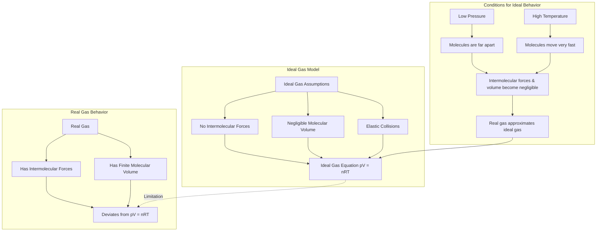

---
# 1. Overview / 概述

**English:**
This sub-topic explores the limitations of the [[Ideal Gas Equation (pV = nRT)]] by examining how real gases deviate from ideal behavior. While the ideal gas model is a powerful simplification, it fails under certain conditions of high pressure and low temperature. We will investigate the assumptions of the [[Kinetic Theory of Gases]] that break down for real gases, the concept of intermolecular forces, and the conditions under which a real gas approximates an ideal gas. Understanding these deviations is crucial for accurate calculations in engineering and for appreciating the approximations inherent in the ideal gas model.

**中文:**
本子知识点探讨了[[Ideal Gas Equation (pV = nRT)]]的局限性，通过研究真实气体如何偏离理想行为。虽然理想气体模型是一个强大的简化工具，但在高压和低温条件下它并不成立。我们将研究[[Kinetic Theory of Gases]]中哪些假设对真实气体不成立、分子间作用力的概念，以及真实气体近似为理想气体的条件。理解这些偏差对于工程中的精确计算以及理解理想气体模型固有的近似性至关重要。

---

# 2. Syllabus Learning Objectives / 考纲学习目标

| CAIE 9702 | Edexcel IAL |
|-----------|-------------|
| 11.1(a) State the basic assumptions of the kinetic model of an ideal gas. | 5.17 Understand the concept of an ideal gas as a model that approximates the behaviour of real gases under certain conditions. |
| 11.1(b) Explain how molecular movement causes the pressure exerted by a gas. | 5.18 Understand the assumptions of the kinetic theory of gases. |
| 11.1(c) Derive the equation $pV = \frac{1}{3} N m \langle c^2 \rangle$. | 5.19 Understand why real gases deviate from ideal gas behaviour at high pressures and low temperatures. |
| 11.1(d) Recall the relationship between the Boltzmann constant and the molar gas constant: $k = \frac{R}{N_A}$. | 5.20 Understand the concept of intermolecular forces and their effect on gas behaviour. |
| 11.1(e) Use the equation $pV = NkT$. | 5.21 Understand the conditions under which a real gas approximates an ideal gas. |
| 11.1(f) Recall and use the equation $\frac{1}{2} m \langle c^2 \rangle = \frac{3}{2} kT$. | 5.22 Understand the limitations of the ideal gas equation. |

**Examiner Expectations / 考官期望:**
- **CAIE:** Students must be able to state the assumptions of the kinetic model and explain how they break down for real gases. They should understand the conditions (low pressure, high temperature) under which real gases behave ideally.
- **Edexcel:** Students must be able to explain *why* real gases deviate (intermolecular forces and finite molecular volume) and the conditions for ideal behavior. They should be able to discuss the limitations of the ideal gas equation.

---

# 3. Core Definitions / 核心定义

| Term (EN/CN) | Definition (EN) | Definition (CN) | Common Mistakes / 常见错误 |
|--------------|-----------------|-----------------|---------------------------|
| **Ideal Gas** / 理想气体 | A theoretical gas that perfectly obeys the ideal gas equation $pV = nRT$ under all conditions of temperature and pressure. | 一种理论气体，在所有温度和压力条件下都完全遵守理想气体方程 $pV = nRT$。 | Confusing it with a real gas; thinking it exists in nature. |
| **Real Gas** / 真实气体 | A gas that exists in nature and does not perfectly obey the ideal gas equation, especially at high pressures and low temperatures. | 自然界中存在的、不完全遵守理想气体方程的气体，尤其是在高压和低温下。 | Assuming real gases always behave ideally. |
| **Intermolecular Forces** / 分子间作用力 | Attractive forces between molecules (e.g., van der Waals forces). In an ideal gas, these are assumed to be zero. | 分子之间的吸引力（例如，范德华力）。在理想气体中，假设这些力为零。 | Forgetting that these forces are *attractive* and cause deviations. |
| **Finite Molecular Volume** / 分子有限体积 | The actual volume occupied by the gas molecules themselves. In an ideal gas, this is assumed to be negligible compared to the container volume. | 气体分子本身实际占据的体积。在理想气体中，假设该体积与容器体积相比可以忽略不计。 | Thinking the volume of molecules is zero, rather than negligible. |
| **Condensation Point** / 冷凝点 | The temperature at which a real gas will condense into a liquid. An ideal gas cannot be liquefied. | 真实气体凝结成液体的温度。理想气体不能被液化。 | Not linking this to the breakdown of the ideal gas model. |

---

# 4. Key Concepts Explained / 关键概念详解

## 4.1 The Ideal Gas Assumptions vs. Reality / 理想气体假设与现实

### Explanation / 解释
**English:** The [[Kinetic Theory of Gases]] makes several key assumptions to derive the [[Ideal Gas Equation (pV = nRT)]]. For a real gas, these assumptions break down:
1.  **No intermolecular forces:** Ideal gas molecules have no forces between them except during elastic collisions. Real gas molecules experience attractive forces (van der Waals forces), especially when close together.
2.  **Negligible molecular volume:** The volume of the gas molecules themselves is assumed to be zero compared to the container volume. Real gas molecules have a finite, non-zero volume.
3.  **Elastic collisions:** Collisions are perfectly elastic (no kinetic energy lost). While this is a good approximation for real gases, it is not perfectly true.
4.  **Random motion:** Molecules move in random, straight-line motion. This is generally true for real gases, but intermolecular forces can cause deviations.

**中文:** [[Kinetic Theory of Gases]]做出了几个关键假设来推导[[Ideal Gas Equation (pV = nRT)]]。对于真实气体，这些假设会失效：
1.  **无分子间作用力：** 理想气体分子之间除了弹性碰撞外没有作用力。真实气体分子之间存在吸引力（范德华力），尤其是在它们靠得很近时。
2.  **分子体积可忽略：** 假设气体分子本身的体积与容器体积相比为零。真实气体分子具有有限的、非零的体积。
3.  **弹性碰撞：** 碰撞是完全弹性的（没有动能损失）。虽然这对真实气体来说是一个很好的近似，但并非完全正确。
4.  **随机运动：** 分子以随机的直线运动。这对真实气体通常是正确的，但分子间作用力可能导致偏差。

### Physical Meaning / 物理意义
**English:** The ideal gas model is a *limit* that real gases approach. It is most accurate when the gas is dilute (low pressure) and the molecules are moving fast (high temperature), so that the attractive forces and the volume of the molecules become relatively unimportant.

**中文:** 理想气体模型是真实气体趋近的一个*极限*。当气体稀薄（低压）且分子运动速度快（高温）时，该模型最为准确，因为此时吸引力与分子体积变得相对不重要。

### Common Misconceptions / 常见误区
- **Misconception:** Real gases are "wrong" and ideal gases are "right".
  - **Truth:** Ideal gases are a *model*. Real gases are the actual physical systems. The model is useful but has limitations.
- **Misconception:** The ideal gas equation never works for real gases.
  - **Truth:** It works very well for many real gases under normal conditions (room temperature and atmospheric pressure).
- **Misconception:** Intermolecular forces are always repulsive.
  - **Truth:** They are primarily attractive at typical gas distances, but become strongly repulsive when molecules are very close.

### Exam Tips / 考试提示
- **CAIE:** Be prepared to state the assumptions and explain which one(s) break down under given conditions (e.g., "At high pressure, the finite volume of the molecules becomes significant...").
- **Edexcel:** Be able to explain *why* high pressure and low temperature cause deviations. Use the terms "intermolecular forces" and "finite molecular volume".

> 📷 **IMAGE PROMPT — DIAGRAM-01: Ideal vs Real Gas Behavior**
> A split diagram. Left side: "Ideal Gas" with widely spaced, tiny dots (molecules) moving in straight lines, no forces shown. Right side: "Real Gas" with molecules closer together, dashed lines showing attractive forces between them, and molecules shown as small spheres with a finite size. Label the key differences.

---

# 5. Essential Equations / 核心公式

**There are no new equations for this sub-topic.** The focus is on the *limitations* of the existing equations.

$$ pV = nRT $$

| Symbol (符号) | Meaning (EN) | Meaning (CN) | Unit (单位) |
|--------------|-------------|-------------|------------|
| $p$ | Pressure | 压强 | Pa |
| $V$ | Volume | 体积 | m³ |
| $n$ | Number of moles | 物质的量 | mol |
| $R$ | Molar gas constant (8.31 J mol⁻¹ K⁻¹) | 摩尔气体常数 | J mol⁻¹ K⁻¹ |
| $T$ | Absolute temperature | 绝对温度 | K |

**Limitations / 局限性:**
- **English:** This equation is only accurate for real gases at low pressures and high temperatures. At high pressures, the volume of the gas molecules becomes significant, and the attractive forces reduce the pressure exerted on the container walls.
- **中文：** 该方程仅在低压和高温下对真实气体准确。在高压下，气体分子的体积变得显著，分子间吸引力会降低对容器壁施加的压力。

---

# 6. Graphs and Relationships / 图表与关系

## 6.1 pV vs p Graph for Real and Ideal Gases / 真实气体与理想气体的 pV-p 图

### Axes / 坐标轴
- **X-axis:** Pressure ($p$) / 压强 ($p$)
- **Y-axis:** Product of pressure and volume ($pV$) / 压强与体积的乘积 ($pV$)

### Shape / 形状
- **Ideal Gas:** A horizontal straight line (constant $pV$ at constant $T$).
- **Real Gas:** A curve that deviates from the horizontal line. At low pressures, it approaches the ideal line. At high pressures, it dips below (due to attractive forces) and then rises above (due to finite molecular volume).

### Gradient Meaning / 斜率含义
- **Ideal Gas:** Gradient = 0 (no change in $pV$).
- **Real Gas:** The gradient changes, indicating that $pV$ is not constant.

### Area Meaning / 面积含义
- Not typically interpreted for this graph.

### Exam Interpretation / 考试解读
- **English:** This graph is the classic way to show the deviation of real gases from ideal behavior. The point where the real gas curve meets the ideal line is where the gas behaves most ideally. The dip at moderate pressures is due to attractive forces, and the rise at very high pressures is due to the finite volume of the molecules.
- **中文：** 该图是展示真实气体偏离理想行为的经典方式。真实气体曲线与理想线相交的点是气体行为最接近理想状态的点。中等压力下的下降是由于吸引力，而极高压力下的上升是由于分子的有限体积。

> 📷 **IMAGE PROMPT — GRAPH-01: pV vs p for Real and Ideal Gases**
> A graph with pressure (p) on the x-axis and pV on the y-axis. A horizontal dashed line labeled "Ideal Gas" is shown. A solid curve labeled "Real Gas" starts on the ideal line at low pressure, dips below it, and then rises above it at high pressure. Label the dip as "Attractive forces dominate" and the rise as "Finite volume dominates".

---

# 7. Required Diagrams / 必备图表

## 7.1 Diagram: Real Gas vs Ideal Gas at Molecular Level / 分子层面的真实气体与理想气体对比图

### Description / 描述
**English:** A side-by-side comparison of the molecular behavior of an ideal gas and a real gas. The ideal gas shows point-like molecules with no forces. The real gas shows molecules with a finite size and attractive forces between them.

**中文：** 理想气体与真实气体分子行为的并排对比。理想气体显示为无作用力的点状分子。真实气体显示为具有有限大小和分子间吸引力的分子。

### Image Prompt / 图片生成提示
> 📷 **IMAGE PROMPT — DIAGRAM-02: Molecular Comparison of Ideal and Real Gases**
> A detailed, scientific illustration. Left panel: "Ideal Gas". Show tiny, dimensionless points (molecules) moving in straight lines, with no lines or forces connecting them. Right panel: "Real Gas". Show larger, spherical molecules with a visible radius. Draw dashed, wavy lines between some molecules to represent attractive van der Waals forces. The molecules should be closer together than in the ideal gas panel. Label the molecules and the forces.

### Labels Required / 需要标注
- **Ideal Gas:** Point molecules, no forces, elastic collisions.
- **Real Gas:** Finite molecular volume, attractive intermolecular forces.

### Exam Importance / 考试重要性
- **English:** This diagram is essential for explaining *why* real gases deviate from ideal behavior. It directly links the assumptions of the kinetic theory to the observed deviations.
- **中文：** 该图对于解释*为什么*真实气体偏离理想行为至关重要。它直接将动力学理论的假设与观察到的偏差联系起来。

---

# 8. Worked Examples / 典型例题

## Example 1: Explaining Deviations / 解释偏差

### Question / 题目
**English:** Explain why a real gas deviates from ideal gas behavior at high pressure. Refer to the assumptions of the kinetic theory of gases.

**中文：** 解释为什么真实气体在高压下会偏离理想气体行为。请参考气体动力学理论的假设。

### Solution / 解答
**Step 1: State the relevant assumption.**
One assumption of the kinetic theory is that the volume of the gas molecules is negligible compared to the volume of the container.

**Step 2: Explain how high pressure breaks this assumption.**
At high pressure, the gas is compressed. The volume of the container decreases, but the volume of the molecules remains constant. Therefore, the volume of the molecules is no longer negligible. The actual volume available for the molecules to move in is less than the container volume ($V_{available} = V_{container} - V_{molecules}$). This causes the gas to be less compressible than an ideal gas, leading to a higher pressure than predicted by $pV = nRT$.

**Step 3: State the second relevant assumption.**
Another assumption is that there are no intermolecular forces between the molecules.

**Step 4: Explain how high pressure breaks this assumption.**
At high pressure, the molecules are much closer together. The attractive intermolecular forces (van der Waals forces) become significant. These forces pull molecules together, reducing the force and frequency of collisions with the container walls. This results in a lower pressure than predicted by the ideal gas equation.

**中文：**
**步骤 1：陈述相关假设。**
动力学理论的一个假设是，气体分子的体积与容器的体积相比可以忽略不计。

**步骤 2：解释高压如何打破这个假设。**
在高压下，气体被压缩。容器的体积减小，但分子的体积保持不变。因此，分子的体积不再可以忽略。分子实际可以移动的体积小于容器体积 ($V_{可用} = V_{容器} - V_{分子}$)。这使得气体比理想气体更难压缩，导致压力高于 $pV = nRT$ 的预测值。

**步骤 3：陈述第二个相关假设。**
另一个假设是分子之间没有分子间作用力。

**步骤 4：解释高压如何打破这个假设。**
在高压下，分子彼此靠得更近。分子间的吸引力（范德华力）变得显著。这些吸引力将分子拉在一起，减少了与容器壁碰撞的力和频率。这导致压力低于理想气体方程的预测值。

### Final Answer / 最终答案
**Answer:** At high pressure, the finite volume of gas molecules and the attractive intermolecular forces become significant, causing the gas to deviate from ideal behavior. | **答案：** 在高压下，气体分子的有限体积和分子间的吸引力变得显著，导致气体偏离理想行为。

### Quick Tip / 提示
- **English:** Always mention *both* the finite volume and the intermolecular forces when explaining deviations. They have opposite effects on pressure.
- **中文：** 解释偏差时，务必同时提及有限体积和分子间作用力。它们对压力的影响是相反的。

---

# 9. Past Paper Question Types / 历年真题题型

| Question Type / 题型 | Frequency / 频率 | Difficulty / 难度 | Past Paper References / 真题索引 |
|----------------------|------------------|------------------|-------------------------------|
| State assumptions of kinetic theory | High | Easy | 📝 *待填入* |
| Explain why real gases deviate at high pressure/low temperature | High | Medium | 📝 *待填入* |
| Interpret pV vs p graph for real gases | Medium | Medium | 📝 *待填入* |
| State conditions for ideal gas behavior | Medium | Easy | 📝 *待填入* |

**Common Command Words / 常见指令词:**
- **State / 陈述:** Give the assumptions without explanation.
- **Explain / 解释:** Give reasons for the deviation, linking to the assumptions.
- **Describe / 描述:** Describe the shape of the pV vs p graph.
- **Suggest / 建议:** Suggest conditions under which a real gas behaves like an ideal gas.

---

# 10. Practical Skills Connections / 实验技能链接

**English:**
This sub-topic is primarily theoretical, but it connects to practical work in the following ways:
- **Experimental Verification of Gas Laws:** When performing experiments to verify [[Boyle's Law, Charles's Law, and the Pressure Law]], students must be aware that the results will only approximate the ideal behavior. Deviations at high pressures or low temperatures can be discussed as sources of systematic error.
- **Graph Plotting and Analysis:** Plotting $pV$ against $p$ for a real gas is a common data analysis task. Students must be able to identify the deviation from the ideal horizontal line and explain its shape.
- **Uncertainties:** The limitations of the ideal gas model can be considered a form of systematic uncertainty in calculations involving real gases.

**中文：**
本子知识点主要是理论性的，但与实验工作有以下联系：
- **气体定律的实验验证：** 在进行实验验证[[Boyle's Law, Charles's Law, and the Pressure Law]]时，学生必须意识到结果只会近似于理想行为。在高压或低温下的偏差可以作为系统误差的来源进行讨论。
- **图表绘制与分析：** 绘制真实气体的 $pV$ 对 $p$ 的图表是一项常见的数据分析任务。学生必须能够识别与理想水平线的偏差并解释其形状。
- **不确定度：** 理想气体模型的局限性可以被视为涉及真实气体的计算中的一种系统不确定度。

---

# 11. Concept Map / 概念图谱

---

# 12. Quick Revision Sheet / 速查表

| Category / 类别 | Key Points / 要点 |
|----------------|------------------|
| Definition / 定义 | **Ideal Gas:** A theoretical gas obeying $pV = nRT$ perfectly. **Real Gas:** A natural gas that deviates from ideal behavior. |
| Key Assumptions / 核心假设 | 1. No intermolecular forces. 2. Negligible molecular volume. 3. Elastic collisions. |
| Causes of Deviation / 偏差原因 | **High Pressure:** Finite molecular volume becomes significant; attractive forces become significant. **Low Temperature:** Kinetic energy decreases, so attractive forces dominate. |
| Conditions for Ideal Behavior / 理想行为条件 | **Low pressure** and **High temperature**. |
| Key Graph / 核心图表 | **$pV$ vs $p$:** Ideal gas is a horizontal line. Real gas dips (attraction) then rises (volume). |
| Exam Tip / 考试提示 | Always mention **both** finite volume and intermolecular forces when explaining deviations. They have opposite effects on pressure. |