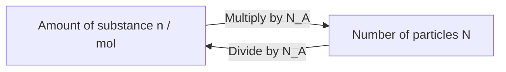
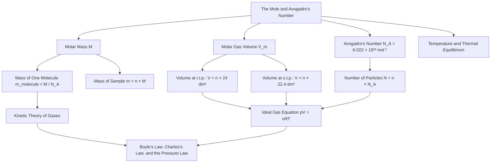

# 1. Overview / 概述

**English:**
This sub-topic introduces the fundamental concept of **the mole** as a unit for measuring the amount of substance, and **Avogadro's number** ($N_A$) which defines the number of particles in one mole. Understanding these concepts is essential for linking the macroscopic properties of gases (like pressure, volume, and temperature) to the microscopic behaviour of individual molecules. This forms the bridge between [[Ideal Gases]] and the [[Kinetic Theory of Gases]], enabling calculations of the number of molecules in a gas sample, the mass of a single molecule, and the molar mass of a substance. The mole and Avogadro's number are prerequisites for the [[Ideal Gas Equation (pV = nRT)]] and for understanding [[Temperature and Thermal Equilibrium]].

**中文:**
本子知识点介绍了**摩尔**作为物质数量的基本单位，以及**阿伏伽德罗常数** ($N_A$)，它定义了一摩尔物质中的粒子数。理解这些概念对于将气体的宏观性质（如压强、体积和温度）与单个分子的微观行为联系起来至关重要。这构成了[[理想气体]]和[[气体分子运动论]]之间的桥梁，使我们能够计算气体样品中的分子数、单个分子的质量以及物质的摩尔质量。摩尔和阿伏伽德罗常数是学习[[理想气体状态方程 (pV = nRT)]]和理解[[温度与热平衡]]的先决条件。

---

# 2. Syllabus Learning Objectives / 考纲学习目标

| CAIE 9702 (11.1 a-f) | Edexcel IAL (WPH11 U1: 5.17-5.22) |
|-----------------------|------------------------------------|
| Define the mole and Avogadro's constant | Understand the concept of the mole and Avogadro's constant |
| Use the molar gas volume at standard temperature and pressure (s.t.p.) | Use the relationship between number of moles, mass, and molar mass |
| Calculate the number of molecules in a given mass of gas | Calculate the number of molecules in a given mass of gas |
| Use the relationship $n = \frac{N}{N_A}$ | Use the relationship $n = \frac{N}{N_A}$ |
| Use the relationship $n = \frac{m}{M}$ | Use the relationship $n = \frac{m}{M}$ |
| Understand that one mole of any gas occupies approximately 22.4 dm³ at s.t.p. | Understand the molar gas volume at room temperature and pressure (r.t.p.) |

**Examiner Expectations / 考官期望:**
- **English:** You must be able to define the mole in terms of Avogadro's number, perform calculations involving $n = \frac{N}{N_A}$ and $n = \frac{m}{M}$, and recall that one mole of any gas occupies 22.4 dm³ at s.t.p. (0°C, 1 atm) or 24 dm³ at r.t.p. (20°C, 1 atm). Pay attention to unit conversions (e.g., cm³ to dm³).
- **中文:** 必须能够用阿伏伽德罗常数定义摩尔，进行涉及 $n = \frac{N}{N_A}$ 和 $n = \frac{m}{M}$ 的计算，并记住在标准状况下（0°C, 1 atm）任何气体一摩尔体积为22.4 dm³，或在室温常压下（20°C, 1 atm）为24 dm³。注意单位换算（例如 cm³ 到 dm³）。

---

# 3. Core Definitions / 核心定义

| Term (EN/CN) | Definition (EN) | Definition (CN) | Common Mistakes / 常见错误 |
|--------------|-----------------|-----------------|---------------------------|
| **Mole** / 摩尔 | The SI base unit for amount of substance. One mole contains exactly $6.022 \times 10^{23}$ elementary entities (atoms, molecules, ions, etc.). | 物质的量的国际单位制基本单位。一摩尔恰好包含 $6.022 \times 10^{23}$ 个基本实体（原子、分子、离子等）。 | Confusing mole with mass; forgetting that the mole counts particles, not mass. / 混淆摩尔和质量；忘记摩尔计数的是粒子，不是质量。 |
| **Avogadro's Number ($N_A$)** / 阿伏伽德罗常数 | The number of particles in one mole of a substance: $N_A = 6.022 \times 10^{23} \text{ mol}^{-1}$. | 一摩尔物质中的粒子数：$N_A = 6.022 \times 10^{23} \text{ mol}^{-1}$。 | Using $N_A$ without units (mol⁻¹); confusing it with the number of particles $N$. / 使用 $N_A$ 时忘记单位 (mol⁻¹)；将其与粒子数 $N$ 混淆。 |
| **Molar Mass ($M$)** / 摩尔质量 | The mass of one mole of a substance, expressed in g mol⁻¹ or kg mol⁻¹. Numerically equal to the relative atomic/molecular mass. | 一摩尔物质的质量，单位为 g mol⁻¹ 或 kg mol⁻¹。数值上等于相对原子/分子质量。 | Forgetting to convert g mol⁻¹ to kg mol⁻¹ when using SI units. / 使用国际单位制时忘记将 g mol⁻¹ 转换为 kg mol⁻¹。 |
| **Number of Particles ($N$)** / 粒子数 | The total number of elementary entities (atoms, molecules) in a sample. | 样品中基本实体（原子、分子）的总数。 | Confusing $N$ with $N_A$; $N$ is a pure number, $N_A$ has units. / 混淆 $N$ 和 $N_A$；$N$ 是纯数，$N_A$ 有单位。 |
| **Amount of Substance ($n$)** / 物质的量 | The number of moles in a sample, measured in mol. | 样品中的摩尔数，单位为 mol。 | Writing "number of moles" as "moles" without the symbol $n$. / 将"摩尔数"写成"moles"而不使用符号 $n$。 |

---

# 4. Key Concepts Explained / 关键概念详解

## 4.1 The Mole as a Counting Unit / 摩尔作为计数单位

### Explanation / 解释
**English:** The mole is analogous to a "dozen" (12 items) or a "gross" (144 items), but on an astronomically larger scale. Just as one dozen eggs contains 12 eggs, one mole of carbon atoms contains $6.022 \times 10^{23}$ carbon atoms. This number was chosen so that the mass of one mole of a substance in grams equals its relative atomic or molecular mass. For example, carbon-12 has a relative atomic mass of 12, so one mole of carbon-12 has a mass of exactly 12 g. This concept links the microscopic world (atoms/molecules) to the macroscopic world (grams/kilograms). It is essential for the [[Ideal Gas Equation (pV = nRT)]] where $n$ represents the amount of gas in moles.

**中文:** 摩尔类似于"一打"（12个）或"一罗"（144个），但规模要大得多。就像一打鸡蛋包含12个鸡蛋一样，一摩尔碳原子包含 $6.022 \times 10^{23}$ 个碳原子。选择这个数字是为了使一摩尔物质的质量（以克为单位）等于其相对原子质量或相对分子质量。例如，碳-12的相对原子质量为12，所以一摩尔碳-12的质量恰好是12克。这个概念将微观世界（原子/分子）与宏观世界（克/千克）联系起来。这对于[[理想气体状态方程 (pV = nRT)]]至关重要，其中 $n$ 代表气体的摩尔数。

### Physical Meaning / 物理意义
**English:** The mole provides a convenient way to count an enormous number of particles. Instead of saying "$3.01 \times 10^{23}$ molecules of oxygen", we say "0.5 moles of oxygen molecules". This simplifies calculations in chemistry and physics, especially when dealing with gas laws and reactions.

**中文:** 摩尔提供了一种方便的方法来计数巨大数量的粒子。与其说"$3.01 \times 10^{23}$ 个氧分子"，不如说"0.5摩尔氧分子"。这简化了化学和物理中的计算，特别是在处理气体定律和反应时。

### Common Misconceptions / 常见误区
- **English:**
  - Thinking one mole of different substances has the same mass (it doesn't; molar mass varies).
  - Confusing "mole" with "molecule" — a mole is a quantity, a molecule is a particle.
  - Forgetting that Avogadro's number applies to any elementary entity, not just atoms.
- **中文:**
  - 认为不同物质的一摩尔质量相同（实际上不同；摩尔质量不同）。
  - 混淆"摩尔"和"分子"——摩尔是数量，分子是粒子。
  - 忘记阿伏伽德罗常数适用于任何基本实体，而不仅仅是原子。

### Exam Tips / 考试提示
- **English:** Always write the units for $N_A$ as mol⁻¹. When calculating $n$, check whether you are given mass ($m$) or number of particles ($N$). Use $n = \frac{m}{M}$ for mass and $n = \frac{N}{N_A}$ for particle count.
- **中文:** 始终为 $N_A$ 写出单位 mol⁻¹。计算 $n$ 时，检查给出的是质量 ($m$) 还是粒子数 ($N$)。质量用 $n = \frac{m}{M}$，粒子数用 $n = \frac{N}{N_A}$。

---

## 4.2 Avogadro's Number ($N_A$) / 阿伏伽德罗常数

### Explanation / 解释
**English:** Avogadro's number, $N_A = 6.022 \times 10^{23} \text{ mol}^{-1}$, is a fundamental constant. It represents the number of atoms in exactly 12 g of carbon-12. This value is used to convert between the number of moles ($n$) and the number of particles ($N$): $N = n \times N_A$. It also appears in the [[Ideal Gas Equation (pV = nRT)]] when expressed in terms of the Boltzmann constant ($k_B$): $pV = N k_B T$, where $N$ is the number of molecules. The relationship between $R$ (molar gas constant) and $k_B$ is $R = N_A k_B$.

**中文:** 阿伏伽德罗常数 $N_A = 6.022 \times 10^{23} \text{ mol}^{-1}$ 是一个基本常数。它代表恰好12克碳-12中的原子数。该值用于在摩尔数 ($n$) 和粒子数 ($N$) 之间进行转换：$N = n \times N_A$。它也出现在用玻尔兹曼常数 ($k_B$) 表示的[[理想气体状态方程 (pV = nRT)]]中：$pV = N k_B T$，其中 $N$ 是分子数。$R$（摩尔气体常数）和 $k_B$ 之间的关系是 $R = N_A k_B$。

### Physical Meaning / 物理意义
**English:** Avogadro's number is the conversion factor between the macroscopic world (moles) and the microscopic world (individual particles). It allows us to calculate the mass of a single molecule: $m_{\text{molecule}} = \frac{M}{N_A}$.

**中文:** 阿伏伽德罗常数是宏观世界（摩尔）和微观世界（单个粒子）之间的转换因子。它使我们能够计算单个分子的质量：$m_{\text{分子}} = \frac{M}{N_A}$。

### Common Misconceptions / 常见误区
- **English:**
  - Thinking $N_A$ is a dimensionless number (it has units of mol⁻¹).
  - Confusing $N_A$ with the number of particles $N$ in a sample.
  - Forgetting that $N_A$ is a constant, not a variable.
- **中文:**
  - 认为 $N_A$ 是无量纲数（它有单位 mol⁻¹）。
  - 将 $N_A$ 与样品中的粒子数 $N$ 混淆。
  - 忘记 $N_A$ 是常数，不是变量。

### Exam Tips / 考试提示
- **English:** In calculations, always check if the answer requires the number of molecules ($N$) or the number of moles ($n$). Use $N = n N_A$ for molecules, and $n = \frac{N}{N_A}$ for moles.
- **中文:** 在计算中，始终检查答案需要的是分子数 ($N$) 还是摩尔数 ($n$)。分子数用 $N = n N_A$，摩尔数用 $n = \frac{N}{N_A}$。

---

## 4.3 Molar Mass and Mass of a Single Molecule / 摩尔质量与单个分子的质量

### Explanation / 解释
**English:** The molar mass ($M$) of a substance is the mass of one mole of that substance. For an element, it is numerically equal to the relative atomic mass (e.g., carbon: 12 g mol⁻¹). For a compound, it is the sum of the relative atomic masses of its constituent atoms (e.g., CO₂: 12 + 16×2 = 44 g mol⁻¹). The mass of a single molecule can be found by dividing the molar mass by Avogadro's number: $m_{\text{molecule}} = \frac{M}{N_A}$. This is crucial for linking macroscopic gas properties to molecular behaviour in the [[Kinetic Theory of Gases]].

**中文:** 物质的摩尔质量 ($M$) 是一摩尔该物质的质量。对于元素，它在数值上等于相对原子质量（例如，碳：12 g mol⁻¹）。对于化合物，它是其组成原子的相对原子质量之和（例如，CO₂：12 + 16×2 = 44 g mol⁻¹）。单个分子的质量可以通过将摩尔质量除以阿伏伽德罗常数得到：$m_{\text{分子}} = \frac{M}{N_A}$。这对于将宏观气体性质与[[气体分子运动论]]中的分子行为联系起来至关重要。

### Physical Meaning / 物理意义
**English:** Molar mass bridges the gap between the mass of a single molecule (too small to measure directly) and a macroscopic sample mass (easily measured). It allows us to calculate how many molecules are in a given mass of gas.

**中文:** 摩尔质量弥合了单个分子质量（太小而无法直接测量）和宏观样品质量（易于测量）之间的差距。它使我们能够计算给定质量气体中的分子数。

### Common Misconceptions / 常见误区
- **English:**
  - Forgetting to convert molar mass from g mol⁻¹ to kg mol⁻¹ when using SI units (e.g., 44 g mol⁻¹ = 0.044 kg mol⁻¹).
  - Using the mass of one atom when the question asks for the mass of one molecule (e.g., O₂ vs O).
- **中文:**
  - 使用国际单位制时忘记将摩尔质量从 g mol⁻¹ 转换为 kg mol⁻¹（例如，44 g mol⁻¹ = 0.044 kg mol⁻¹）。
  - 当问题要求一个分子的质量时，使用了一个原子的质量（例如，O₂ 与 O）。

### Exam Tips / 考试提示
- **English:** Always check the units of molar mass. If the question gives mass in kg, convert molar mass to kg mol⁻¹. For diatomic gases like O₂, N₂, H₂, remember the molecule has two atoms.
- **中文:** 始终检查摩尔质量的单位。如果问题给出的质量以千克为单位，将摩尔质量转换为 kg mol⁻¹。对于双原子气体如 O₂、N₂、H₂，记住分子有两个原子。

---

## 4.4 Molar Gas Volume / 摩尔气体体积

### Explanation / 解释
**English:** At standard temperature and pressure (s.t.p.: 0°C, 1.01 × 10⁵ Pa), one mole of any ideal gas occupies approximately 22.4 dm³ (or 0.0224 m³). At room temperature and pressure (r.t.p.: 20°C, 1.01 × 10⁵ Pa), one mole occupies approximately 24 dm³ (or 0.024 m³). This is a consequence of [[Boyle's Law, Charles's Law, and the Pressure Law]] combined. This value allows direct calculation of the number of moles from volume at s.t.p. or r.t.p. without using the ideal gas equation.

**中文:** 在标准状况下（s.t.p.: 0°C, 1.01 × 10⁵ Pa），一摩尔任何理想气体大约占据22.4 dm³（或0.0224 m³）。在室温常压下（r.t.p.: 20°C, 1.01 × 10⁵ Pa），一摩尔占据大约24 dm³（或0.024 m³）。这是[[波义耳定律、查理定律和压强定律]]结合的结果。这个值允许在标准状况或室温常压下直接从体积计算摩尔数，而无需使用理想气体状态方程。

> 📋 **CIE Only:** CIE specifically requires knowledge of the molar gas volume at s.t.p. (22.4 dm³ mol⁻¹).
> 📋 **Edexcel Only:** Edexcel specifically requires knowledge of the molar gas volume at r.t.p. (24 dm³ mol⁻¹).

### Physical Meaning / 物理意义
**English:** The molar gas volume shows that at the same temperature and pressure, equal volumes of different gases contain the same number of molecules (Avogadro's law). This is because gas molecules are far apart and their size is negligible compared to the volume.

**中文:** 摩尔气体体积表明，在相同的温度和压强下，不同气体的等体积含有相同数量的分子（阿伏伽德罗定律）。这是因为气体分子相距很远，与体积相比它们的大小可以忽略不计。

### Common Misconceptions / 常见误区
- **English:**
  - Thinking the molar volume is the same at all temperatures and pressures (it changes with conditions).
  - Forgetting to convert cm³ to dm³ (1 dm³ = 1000 cm³).
  - Using 22.4 dm³ for r.t.p. or 24 dm³ for s.t.p.
- **中文:**
  - 认为摩尔体积在所有温度和压强下都相同（它随条件变化）。
  - 忘记将 cm³ 转换为 dm³（1 dm³ = 1000 cm³）。
  - 在室温常压下使用22.4 dm³，或在标准状况下使用24 dm³。

### Exam Tips / 考试提示
- **English:** If the question specifies s.t.p. or r.t.p., use the corresponding molar volume. If not, use the [[Ideal Gas Equation (pV = nRT)]]. Always check the units of volume.
- **中文:** 如果问题指定了标准状况或室温常压，使用相应的摩尔体积。如果没有，使用[[理想气体状态方程 (pV = nRT)]]。始终检查体积的单位。

---

# 5. Essential Equations / 核心公式

## 5.1 Number of Moles from Particle Count / 从粒子数计算摩尔数

$$ n = \frac{N}{N_A} $$

| Symbol (符号) | Meaning (EN) | Meaning (CN) | Unit (单位) |
|--------------|-------------|-------------|------------|
| $n$ | Amount of substance | 物质的量 | mol |
| $N$ | Number of particles | 粒子数 | dimensionless (无量纲) |
| $N_A$ | Avogadro's constant ($6.022 \times 10^{23}$) | 阿伏伽德罗常数 | mol⁻¹ |

**Derivation / 推导:** By definition, one mole contains $N_A$ particles. Therefore, $n$ moles contain $n \times N_A$ particles, so $N = n N_A$. Rearranging gives $n = \frac{N}{N_A}$.

**Conditions / 适用条件:** Always valid for any substance, solid, liquid, or gas.

**Limitations / 局限性:** None, as it is a definition.

---

## 5.2 Number of Moles from Mass / 从质量计算摩尔数

$$ n = \frac{m}{M} $$

| Symbol (符号) | Meaning (EN) | Meaning (CN) | Unit (单位) |
|--------------|-------------|-------------|------------|
| $n$ | Amount of substance | 物质的量 | mol |
| $m$ | Mass of sample | 样品质量 | g or kg |
| $M$ | Molar mass | 摩尔质量 | g mol⁻¹ or kg mol⁻¹ |

**Derivation / 推导:** Molar mass $M$ is the mass per mole. So $M = \frac{m}{n}$, rearranging gives $n = \frac{m}{M}$.

**Conditions / 适用条件:** Always valid for any pure substance.

**Limitations / 局限性:** The substance must be pure; for mixtures, an average molar mass must be used.

---

## 5.3 Mass of a Single Molecule / 单个分子的质量

$$ m_{\text{molecule}} = \frac{M}{N_A} $$

| Symbol (符号) | Meaning (EN) | Meaning (CN) | Unit (单位) |
|--------------|-------------|-------------|------------|
| $m_{\text{molecule}}$ | Mass of one molecule | 一个分子的质量 | kg or g |
| $M$ | Molar mass | 摩尔质量 | kg mol⁻¹ or g mol⁻¹ |
| $N_A$ | Avogadro's constant | 阿伏伽德罗常数 | mol⁻¹ |

**Derivation / 推导:** One mole has mass $M$ and contains $N_A$ molecules. So each molecule has mass $M / N_A$.

**Conditions / 适用条件:** Valid for any substance where the molecular formula is known.

**Limitations / 局限性:** For ionic compounds, use "formula unit" instead of "molecule".

---

## 5.4 Number of Molecules from Volume at s.t.p./r.t.p. / 从标准状况/室温常压下的体积计算分子数

$$ n = \frac{V}{V_m} $$

| Symbol (符号) | Meaning (EN) | Meaning (CN) | Unit (单位) |
|--------------|-------------|-------------|------------|
| $n$ | Amount of substance | 物质的量 | mol |
| $V$ | Volume of gas | 气体体积 | dm³ |
| $V_m$ | Molar gas volume (22.4 dm³ at s.t.p., 24 dm³ at r.t.p.) | 摩尔气体体积 | dm³ mol⁻¹ |

**Derivation / 推导:** At s.t.p., one mole occupies 22.4 dm³. So $n$ moles occupy $n \times 22.4$ dm³, hence $V = n \times 22.4$, so $n = V / 22.4$.

**Conditions / 适用条件:** Only valid for ideal gases at s.t.p. (0°C, 1 atm) or r.t.p. (20°C, 1 atm).

**Limitations / 局限性:** Not valid for real gases at high pressure or low temperature; not valid if conditions differ from s.t.p. or r.t.p.

> 📷 **IMAGE PROMPT — EQN: Molar Volume Diagram**
> A simple diagram showing a cube labelled "22.4 dm³" at s.t.p. with text "1 mole of any gas" inside, and arrows pointing to different gas molecules (O₂, N₂, CO₂) to show they all occupy the same volume.

---

# 6. Graphs and Relationships / 图表与关系

## 6.1 Number of Particles vs Amount of Substance / 粒子数 vs 物质的量

### Axes / 坐标轴
- **X-axis:** Amount of substance, $n$ / mol (物质的量, $n$ / mol)
- **Y-axis:** Number of particles, $N$ (粒子数, $N$)

### Shape / 形状
A straight line through the origin with gradient $N_A = 6.022 \times 10^{23} \text{ mol}^{-1}$.

### Gradient Meaning / 斜率含义
The gradient is Avogadro's number, $N_A$. It represents the number of particles per mole.

### Area Meaning / 面积含义
No meaningful area under this graph.

### Exam Interpretation / 考试解读
- **English:** If asked to find $N_A$ from a graph of $N$ vs $n$, calculate the gradient. If asked to find $n$ from $N$, read from the graph or use $n = N / N_A$.
- **中文:** 如果要求从 $N$ vs $n$ 的图中求 $N_A$，计算斜率。如果要求从 $N$ 求 $n$，从图中读取或使用 $n = N / N_A$。

---

## 6.2 Mass vs Amount of Substance / 质量 vs 物质的量

### Axes / 坐标轴
- **X-axis:** Amount of substance, $n$ / mol (物质的量, $n$ / mol)
- **Y-axis:** Mass, $m$ / g (质量, $m$ / g)

### Shape / 形状
A straight line through the origin with gradient equal to the molar mass $M$ (g mol⁻¹).

### Gradient Meaning / 斜率含义
The gradient is the molar mass $M$. It represents the mass per mole.

### Area Meaning / 面积含义
No meaningful area under this graph.

### Exam Interpretation / 考试解读
- **English:** The steeper the line, the larger the molar mass. Different substances have different gradients.
- **中文:** 线越陡，摩尔质量越大。不同物质有不同的斜率。

---

# 7. Required Diagrams / 必备图表

## 7.1 Avogadro's Number Analogy / 阿伏伽德罗常数类比图

### Description / 描述
**English:** A visual analogy comparing the mole to everyday counting units like a dozen (12) and a gross (144), showing that one mole contains $6.022 \times 10^{23}$ particles.
**中文:** 一个视觉类比，将摩尔与日常计数单位如"一打"（12个）和"一罗"（144个）进行比较，显示一摩尔包含 $6.022 \times 10^{23}$ 个粒子。

### Image Prompt / 图片生成提示
> 📷 **IMAGE PROMPT — DIAG: Mole Analogy**
> A clean, educational infographic showing three columns. Left column: "1 Dozen = 12 eggs" with a picture of 12 eggs. Middle column: "1 Gross = 144 pencils" with a picture of 144 pencils. Right column: "1 Mole = 6.022 × 10²³ atoms" with a picture of a large pile of carbon atoms (represented as small black spheres). Each column has a label at the top. The mole column has a large number "6.022 × 10²³" highlighted. Style: simple, colorful, suitable for A-Level physics textbook.

### Labels Required / 需要标注
- **English:** "1 Dozen = 12", "1 Gross = 144", "1 Mole = 6.022 × 10²³"
- **中文:** "1打 = 12", "1罗 = 144", "1摩尔 = 6.022 × 10²³"

### Exam Importance / 考试重要性
- **English:** Helps students understand the mole as a counting unit, not a mass unit. Frequently tested in multiple-choice questions.
- **中文:** 帮助学生理解摩尔是计数单位，不是质量单位。常在选择题中考查。

---

## 7.2 Molar Gas Volume Diagram / 摩尔气体体积图

### Description / 描述
**English:** A diagram showing three different gases (e.g., O₂, N₂, CO₂) each occupying 22.4 dm³ at s.t.p., with the same number of molecules (1 mole = $6.022 \times 10^{23}$) inside each container.
**中文:** 一个图表显示三种不同的气体（例如 O₂、N₂、CO₂）在标准状况下各占据22.4 dm³，每个容器内有相同数量的分子（1摩尔 = $6.022 \times 10^{23}$）。

### Image Prompt / 图片生成提示
> 📷 **IMAGE PROMPT — DIAG: Molar Gas Volume**
> Three identical transparent cubes, each labelled "22.4 dm³" at the bottom. Inside each cube, small coloured spheres represent gas molecules: red for O₂, blue for N₂, green for CO₂. Each cube has a label at the top: "1 mole O₂", "1 mole N₂", "1 mole CO₂". Below the cubes, text reads: "At s.t.p. (0°C, 1 atm): 1 mole of ANY gas occupies 22.4 dm³ and contains 6.022 × 10²³ molecules." Style: clean, 3D-ish, educational.

### Labels Required / 需要标注
- **English:** "22.4 dm³", "1 mole O₂", "1 mole N₂", "1 mole CO₂", "s.t.p.: 0°C, 1 atm"
- **中文:** "22.4 dm³", "1摩尔 O₂", "1摩尔 N₂", "1摩尔 CO₂", "标准状况：0°C, 1 atm"

### Exam Importance / 考试重要性
- **English:** Essential for understanding Avogadro's law and molar volume. Frequently tested in calculations involving gas volumes.
- **中文:** 对于理解阿伏伽德罗定律和摩尔体积至关重要。常在涉及气体体积的计算中考查。

---

# 8. Worked Examples / 典型例题

## Example 1: Calculating Number of Molecules / 计算分子数

### Question / 题目
**English:** A sample of carbon dioxide (CO₂) has a mass of 8.8 g. Calculate:
(a) The number of moles of CO₂ in the sample.
(b) The number of CO₂ molecules in the sample.
(c) The number of carbon atoms in the sample.
(Molar mass of CO₂ = 44 g mol⁻¹, $N_A = 6.022 \times 10^{23} \text{ mol}^{-1}$)

**中文:** 一个二氧化碳 (CO₂) 样品的质量为 8.8 g。计算：
(a) 样品中 CO₂ 的摩尔数。
(b) 样品中 CO₂ 分子的数量。
(c) 样品中碳原子的数量。
(CO₂ 的摩尔质量 = 44 g mol⁻¹, $N_A = 6.022 \times 10^{23} \text{ mol}^{-1}$)

### Solution / 解答

**Part (a):**
$$ n = \frac{m}{M} = \frac{8.8 \text{ g}}{44 \text{ g mol}^{-1}} = 0.20 \text{ mol} $$

**Part (b):**
$$ N = n \times N_A = 0.20 \times 6.022 \times 10^{23} = 1.20 \times 10^{23} \text{ molecules} $$

**Part (c):**
Each CO₂ molecule contains 1 carbon atom.
$$ N_{\text{carbon}} = N_{\text{CO}_2} \times 1 = 1.20 \times 10^{23} \text{ atoms} $$

### Final Answer / 最终答案
**Answer:** (a) 0.20 mol, (b) $1.20 \times 10^{23}$ molecules, (c) $1.20 \times 10^{23}$ atoms | **答案：** (a) 0.20 mol, (b) $1.20 \times 10^{23}$ 个分子, (c) $1.20 \times 10^{23}$ 个原子

### Quick Tip / 提示
- **English:** For part (c), always check the molecular formula. CO₂ has 1 C and 2 O atoms per molecule.
- **中文:** 对于第(c)部分，始终检查分子式。每个 CO₂ 分子有 1 个 C 原子和 2 个 O 原子。

---

## Example 2: Using Molar Gas Volume / 使用摩尔气体体积

### Question / 题目
**English:** A sample of nitrogen gas (N₂) occupies a volume of 560 cm³ at s.t.p. Calculate:
(a) The number of moles of N₂ in the sample.
(b) The number of N₂ molecules in the sample.
(c) The mass of the sample.
(Molar gas volume at s.t.p. = 22.4 dm³ mol⁻¹, Molar mass of N₂ = 28 g mol⁻¹, $N_A = 6.022 \times 10^{23} \text{ mol}^{-1}$)

**中文:** 一个氮气 (N₂) 样品在标准状况下占据 560 cm³ 的体积。计算：
(a) 样品中 N₂ 的摩尔数。
(b) 样品中 N₂ 分子的数量。
(c) 样品的质量。
(标准状况下摩尔气体体积 = 22.4 dm³ mol⁻¹, N₂ 的摩尔质量 = 28 g mol⁻¹, $N_A = 6.022 \times 10^{23} \text{ mol}^{-1}$)

### Solution / 解答

**Step 1: Convert volume to dm³**
$$ V = 560 \text{ cm}^3 = \frac{560}{1000} = 0.560 \text{ dm}^3 $$

**Part (a):**
$$ n = \frac{V}{V_m} = \frac{0.560 \text{ dm}^3}{22.4 \text{ dm}^3 \text{ mol}^{-1}} = 0.0250 \text{ mol} $$

**Part (b):**
$$ N = n \times N_A = 0.0250 \times 6.022 \times 10^{23} = 1.51 \times 10^{22} \text{ molecules} $$

**Part (c):**
$$ m = n \times M = 0.0250 \times 28 = 0.70 \text{ g} $$

### Final Answer / 最终答案
**Answer:** (a) 0.0250 mol, (b) $1.51 \times 10^{22}$ molecules, (c) 0.70 g | **答案：** (a) 0.0250 mol, (b) $1.51 \times 10^{22}$ 个分子, (c) 0.70 g

### Quick Tip / 提示
- **English:** Always convert cm³ to dm³ by dividing by 1000 before using the molar gas volume. 1 dm³ = 1000 cm³.
- **中文:** 在使用摩尔气体体积之前，始终将 cm³ 除以 1000 转换为 dm³。1 dm³ = 1000 cm³。

---

# 9. Past Paper Question Types / 历年真题题型

| Question Type / 题型 | Frequency / 频率 | Difficulty / 难度 | Past Paper References / 真题索引 |
|----------------------|------------------|------------------|-------------------------------|
| Multiple choice: definition of mole or Avogadro's number | High | Easy | 📝 *待填入* |
| Calculation: number of molecules from mass | High | Medium | 📝 *待填入* |
| Calculation: number of moles from volume at s.t.p./r.t.p. | Medium | Medium | 📝 *待填入* |
| Calculation: mass of a single molecule | Low | Medium | 📝 *待填入* |
| Combined: using mole concept with ideal gas equation | Medium | Hard | 📝 *待填入* |

**Common Command Words / 常见指令词:**
- **English:** Define, Calculate, Determine, Show that, State
- **中文:** 定义、计算、确定、证明、写出

---

# 10. Practical Skills Connections / 实验技能链接

**English:**
This sub-topic connects to practical work in several ways:

1. **Measuring Molar Volume:** An experiment can be performed to determine the molar gas volume by reacting a known mass of a metal (e.g., magnesium) with acid and collecting the hydrogen gas produced. The volume of gas is measured, and the number of moles is calculated from the mass of metal used. This allows calculation of the molar gas volume.

2. **Uncertainty Analysis:** When measuring mass (using a balance) and volume (using a gas syringe or measuring cylinder), uncertainties must be propagated. For example, if mass is measured as $0.050 \pm 0.001$ g and volume as $48.0 \pm 0.5$ cm³, the percentage uncertainty in the calculated molar volume must be determined.

3. **Graph Plotting:** Plotting volume of gas collected against mass of metal used gives a straight line through the origin. The gradient can be used to find the molar gas volume.

4. **Experimental Design:** Students should be able to describe how to collect a gas over water, account for water vapour pressure, and ensure temperature and pressure are controlled (or recorded) for accurate results.

**中文:**
本子知识点通过以下几种方式与实验工作联系：

1. **测量摩尔体积：** 可以通过将已知质量的金属（例如镁）与酸反应并收集产生的氢气来进行实验，以确定摩尔气体体积。测量气体体积，并根据所用金属的质量计算摩尔数。这可以计算摩尔气体体积。

2. **不确定度分析：** 测量质量（使用天平）和体积（使用气体注射器或量筒）时，必须传播不确定度。例如，如果质量测量为 $0.050 \pm 0.001$ g，体积测量为 $48.0 \pm 0.5$ cm³，则必须确定计算出的摩尔体积的百分比不确定度。

3. **图表绘制：** 绘制收集到的气体体积与所用金属质量的关系图，得到一条通过原点的直线。斜率可用于求摩尔气体体积。

4. **实验设计：** 学生应能够描述如何在水面上收集气体、考虑水蒸气压强，并确保控制（或记录）温度和压强以获得准确结果。

---

# 11. Concept Map / 概念图谱

---

# 12. Quick Revision Sheet / 速查表

| Category / 类别 | Key Points / 要点 |
|----------------|------------------|
| **Definition / 定义** | **Mole:** SI unit for amount of substance. 1 mole = $6.022 \times 10^{23}$ particles. / **摩尔：** 物质的量的国际单位制单位。1摩尔 = $6.022 \times 10^{23}$ 个粒子。 |
| **Key Formula / 核心公式** | $n = \frac{N}{N_A}$, $n = \frac{m}{M}$, $m_{\text{molecule}} = \frac{M}{N_A}$, $n = \frac{V}{V_m}$ |
| **Key Constants / 核心常数** | $N_A = 6.022 \times 10^{23} \text{ mol}^{-1}$, $V_m(\text{s.t.p.}) = 22.4 \text{ dm}^3 \text{ mol}^{-1}$, $V_m(\text{r.t.p.}) = 24 \text{ dm}^3 \text{ mol}^{-1}$ |
| **Key Graph / 核心图表** | $N$ vs $n$: straight line through origin, gradient = $N_A$. / $N$ vs $n$：通过原点的直线，斜率 = $N_A$。 |
| **Common Mistake / 常见错误** | Forgetting units of $N_A$ (mol⁻¹); confusing $N$ and $N_A$; not converting cm³ to dm³. / 忘记 $N_A$ 的单位 (mol⁻¹)；混淆 $N$ 和 $N_A$；没有将 cm³ 转换为 dm³。 |
| **Exam Tip / 考试提示** | Always check if the question asks for moles ($n$) or number of molecules ($N$). Use $n = m/M$ for mass, $n = V/V_m$ for volume at s.t.p./r.t.p. / 始终检查问题是要求摩尔数 ($n$) 还是分子数 ($N$)。质量用 $n = m/M$，标准状况/室温常压下的体积用 $n = V/V_m$。 |
| **Prerequisite / 先决条件** | [[Temperature and Thermal Equilibrium]] |
| **Parent Topic / 父主题** | [[Ideal Gases]] |
| **Sibling Topics / 同级主题** | [[Ideal Gas Equation (pV = nRT)]], [[Boyle's Law, Charles's Law, and the Pressure Law]], [[Ideal Gas Assumptions]], [[Real Gases vs Ideal Gases]] |
| **Related Topic / 相关主题** | [[Kinetic Theory of Gases]] |